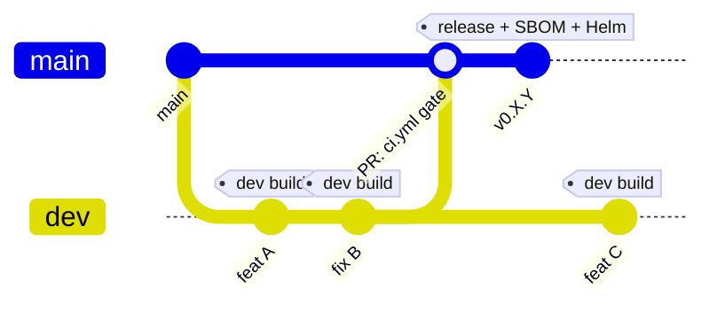

# Come contribuire / How to contribute

## Italiano

Grazie per il tuo interesse nel contribuire a **pa-webinar**!

### Segnalazione bug

Apri una [issue](https://github.com/italia/pa-webinar/issues) descrivendo:
- Cosa ti aspettavi
- Cosa e successo effettivamente
- Passi per riprodurre il problema
- Versione del browser e sistema operativo

### Proporre una modifica

1. Fai un fork del repository
2. Crea un branch per la tua modifica: `git checkout -b feature/nome-modifica`
3. Assicurati che il codice compili senza errori: `npm run build`
4. Assicurati che il linter non segnali nuovi problemi: `npm run lint`
5. Apri una Pull Request verso il branch `main`

### Requisiti per le Pull Request

- Il codice deve compilare senza errori TypeScript (`npx tsc --noEmit`)
- Le stringhe UI devono essere localizzate in italiano e inglese (file in `app/src/i18n/messages/`)
- I componenti UI devono usare [design-react-kit](https://italia.github.io/design-react-kit/) e seguire le [Linee guida di design](https://designers.italia.it/)
- Le API devono validare l'input con Zod e non esporre dati sensibili nelle risposte

### Branch e workflow di build

- **`dev`** — branch di integrazione. Ogni push fa partire il workflow `dev.yml` che pubblica un'immagine `ghcr.io/italia/eventi-dtd:dev` (tag mobile) e `:dev-<sha>` (tag immutabile). Sub-3 minuti, niente SBOM, niente chart Helm: serve solo per feedback veloce su un cluster di test.
- **`main`** — branch protetto. I merge devono arrivare via Pull Request da `dev`. Su PR gira `ci.yml` (typecheck, lint, test) come gate.
- **Tag `v*`** — release formale. Il tag fa partire `release.yml` che produce immagine versionata, SBOM SPDX + CycloneDX, chart Helm packaged e release GitHub con gli asset.



Flusso tipico:

```sh
git checkout dev
# … lavori …
git commit && git push origin dev
# Attendi il dev build (~3 min), poi sul cluster di test fai il rollout
# restart del deployment (il tag `:dev` è configurato con pullPolicy:Always
# quindi basta riavviare i pod per tirare giù il nuovo layer).
git checkout main && git merge --ff-only dev   # dopo che la CI sul PR è verde
git tag v0.X.Y && git push origin v0.X.Y       # quando si vuole rilasciare
```

In caso di cache poisoning del build dev si può lanciare `dev.yml` a
mano da GitHub con l'opzione `no_cache: true` per forzare un rebuild
completo.

### Stile del codice

- TypeScript strict mode
- ESLint con la configurazione del progetto
- Preferire Server Components dove possibile
- Nomi di variabili e commenti in inglese, stringhe utente in italiano e inglese

### Licenza

Contribuendo a questo progetto, accetti che il tuo contributo sia rilasciato sotto la licenza [EUPL-1.2](LICENSE).

---

## English

Thank you for your interest in contributing to **pa-webinar**!

### Reporting bugs

Open an [issue](https://github.com/italia/pa-webinar/issues) describing:
- What you expected
- What actually happened
- Steps to reproduce
- Browser version and operating system

### Proposing a change

1. Fork the repository
2. Create a branch: `git checkout -b feature/change-name`
3. Make sure the code builds without errors: `npm run build`
4. Make sure the linter reports no new issues: `npm run lint`
5. Open a Pull Request against the `main` branch

### Pull Request requirements

- Code must compile without TypeScript errors (`npx tsc --noEmit`)
- UI strings must be localized in Italian and English (`app/src/i18n/messages/`)
- UI components must use [design-react-kit](https://italia.github.io/design-react-kit/) and follow the [Italian design guidelines](https://designers.italia.it/)
- APIs must validate input with Zod and must not expose sensitive data in responses

### Branch and build workflow

- **`dev`** — integration branch. Every push triggers `dev.yml`, which publishes `ghcr.io/italia/eventi-dtd:dev` (rolling) and `:dev-<sha>` (immutable). Sub-3 minutes, no SBOM, no Helm chart — used only for fast iteration on a test cluster.
- **`main`** — protected branch. Merges must come via Pull Request from `dev`. PRs run `ci.yml` (typecheck, lint, tests) as a gate.
- **Tag `v*`** — formal release. Tagging triggers `release.yml` which builds the versioned image, SBOM SPDX + CycloneDX, packaged Helm chart, and a GitHub release with the assets attached.


Typical flow:

```sh
git checkout dev
# … work on a change …
git commit && git push origin dev
# Wait for the dev build (~3 min), then restart the test cluster
# deployment (the `:dev` tag is configured with pullPolicy:Always, so
# restarting the pods is enough to pick up the new layer).
git checkout main && git merge --ff-only dev   # after CI on the PR is green
git tag v0.X.Y && git push origin v0.X.Y       # when ready to release
```

If a dev build is poisoned by a stale cache, trigger `dev.yml` manually
from GitHub with the `no_cache: true` option to force a full rebuild.

### Code style

- TypeScript strict mode
- ESLint with the project configuration
- Prefer Server Components where possible
- Variable names and comments in English, user-facing strings in Italian and English

### License

By contributing to this project, you agree that your contribution will be released under the [EUPL-1.2](LICENSE) license.
