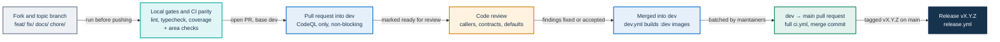

# Contributing to PA Webinar

Thank you for considering a contribution. PA Webinar is open-source software built for reuse by public administrations (PA), so every contribution is read, installed and maintained by people who never saw the discussion behind it. This guide explains the process: how to report, propose, set up, branch, commit, check, open a pull request, get reviewed, and license your work.

Contributions come from individuals, from public bodies that reuse the platform and their suppliers, and from the maintainers themselves. All of these are welcome:

- bug reports with a reproducible case;
- fixes and new features that fit the [roadmap](docs/ROADMAP.md) or an agreed issue;
- translations and corrections in any of the 24 interface languages;
- documentation, especially installation notes from environments the maintainers do not run;
- test reports and measurements from real installations.

This file covers process only. It gives each rule in short and links the page that holds it in full:

- [docs/development/extending.md](docs/development/extending.md): code conventions and a checklist for each kind of change;
- [docs/development/methodology.md](docs/development/methodology.md): the full development process, including the commit rules, the local gates and the CI-parity commands.

## Code of conduct

Everyone taking part in the project follows the [code of conduct](CODE_OF_CONDUCT.md). That file also gives the contact for reporting unacceptable behavior.

## Reporting a bug

Search the [existing issues](https://github.com/italia/pa-webinar/issues) first. If nothing matches, open a new issue with the **Bug report** template (`bug.md`) and fill in every field:

- **Description**: what is broken, in one or two sentences.
- **Steps to reproduce**: numbered, starting from a known state (for example "an event in `PUBLISHED` status with registration required").
- **Expected behavior** and **actual behavior**.
- **Environment**: the release marked **Current version** on the `/changelog` page, or the image tag you deployed (`ghcr.io/italia/pa-webinar:X.Y.Z`); browser and operating system; installation type (Helm with `jitsi.mode` `simple`, `standard` or `full`, on minikube, k3s or a managed cluster; Helm with an external Jitsi, `jitsi.enabled: false`; or the Docker Compose development stack).
- **Screenshots or logs**, when they help.

Strip personal data before you attach anything. Remove names, email addresses, IP addresses and the hostnames of your installation, and replace them with placeholders such as `webinar.example.com`. Never paste a moderator link, a magic link or any URL with a `?token=` parameter: these are working credentials, and the moderator link does not expire.

> **Security vulnerabilities never go in a public issue.** Follow [SECURITY.md](SECURITY.md) instead.

## Proposing a feature

1. **Check what exists and what is planned.** [docs/FEATURES.md](docs/FEATURES.md) lists what the platform already does. [docs/ROADMAP.md](docs/ROADMAP.md) lists only what is missing. If your idea is already on the roadmap, add your use case to an existing issue about it, or open one that names the roadmap item.
2. **Open an issue with the Feature request template** (`feature.md`). Describe the problem before the solution. Say who has the problem: administrator, organizer, moderator, speaker, participant, or the operator who runs the installation. Then write acceptance criteria that a reviewer can check.
3. **Generalize your example.** If a specific event, meeting or public body prompted the request, write the general case instead: "a fixed-cadence series", "a moving-date series", "Speaker 1". Other readers cannot resolve internal event names, people's names or internal ticket codes, and those names must not reach issues, code, commits or documentation.
4. **Start architecture-level changes with an ADR.** A new component, a new external service, a change to a trust boundary or to the Jitsi boundary, or a new data domain needs an Architecture Decision Record first. The template and the process are in [docs/adr/README.md](docs/adr/README.md).

Agree on the approach in the issue before you write a large change. A pull request that arrives with no prior discussion and changes a shared contract is likely to need rework.

## Setting up

[docs/DEVELOPMENT.md](docs/DEVELOPMENT.md) covers prerequisites, the local Docker Compose stack, the database workflow and local troubleshooting. Run every command in this guide from the repository root unless a step says otherwise.

## Branches and pull requests


```mermaid
flowchart LR
    fork["Fork and topic branch<br/>feat/ fix/ docs/ chore/"]:::ext
    gates["Local gates and CI parity<br/>lint, typecheck, coverage<br/>+ area checks"]:::job
    prdev["Pull request into dev<br/>CodeQL only, non-blocking"]:::portal
    review["Code review<br/>callers, contracts, defaults"]:::risk
    merged["Merged into dev<br/>dev.yml builds :dev images"]:::portal
    prmain["dev → main pull request<br/>full ci.yml, merge commit"]:::data
    release["Release vX.Y.Z<br/>release.yml"]:::emph

    fork -->|"run before pushing"| gates
    gates -->|"open PR, base dev"| prdev
    prdev -->|"marked ready for review"| review
    review -->|"findings fixed or accepted"| merged
    merged -->|"batched by maintainers"| prmain
    prmain -->|"tagged vX.Y.Z on main"| release

    classDef ext fill:#EEF1F4,stroke:#5C6F82,color:#17324D,stroke-width:2px
    classDef job fill:#E0F5F5,stroke:#00A3A3,color:#17324D,stroke-width:2px
    classDef portal fill:#E6F0FA,stroke:#0066CC,color:#17324D,stroke-width:2px
    classDef risk fill:#FFF3E0,stroke:#CC7A00,color:#17324D,stroke-width:2px
    classDef data fill:#E3F2EC,stroke:#008055,color:#17324D,stroke-width:2px
    classDef emph fill:#17324D,stroke:#17324D,color:#FFFFFF,stroke-width:2px
```

### Which branch do I target?

Target **`dev`**. It is the integration branch, and every change enters the project there.

- The repository's default branch on GitHub is `main`. GitHub therefore proposes `main` as the base, so switch it to `dev` when you open the pull request.
- Name your branch with one of these prefixes and a short kebab-case description: `feat/`, `fix/`, `docs/` or `chore/` (for example `fix/reminder-timezone`). The name describes the change, never a person or an event.
- Keep each pull request to one concern. A fix, a refactor it needs, and an unrelated cleanup are three pull requests.
- Give the pull request a title in the commit format described below. A maintainer may squash a topic pull request into a single commit when it enters `dev`, and the title then becomes the commit subject.

### How changes reach `main`

`main` moves only through a pull request from `dev` to `main`, which the maintainers open. That pull request is merged with a **merge commit, never a squash**, so the individual commits of `dev` stay readable in the history of `main`. A release is a `vX.Y.Z` tag cut on `main`. The workflows and the release procedure are described in [docs/development/ci-and-release.md](docs/development/ci-and-release.md).

### What runs on your pull request

- **Approval first.** Workflows on pull requests from external contributors start only after a maintainer approves them.
- **A pull request into `dev` runs only CodeQL**, and CodeQL is non-blocking. The full pipeline in [`.github/workflows/ci.yml`](.github/workflows/ci.yml) runs on pull requests into `main` and on pushes to `main`. No blocking check runs before your change enters `dev`, so you must run the local gates and the CI-parity commands yourself, and say in the pull request which ones you ran.
- **Some jobs are non-blocking.** The E2E smoke tests, which run on the `dev` → `main` pull request, and CodeQL run with `continue-on-error`. A red result from them does not block a merge, so do not count them as gates. OpenSSF Scorecard never runs on a pull request: it analyzes `main` after a push and once a week.
- **After the merge**, [`.github/workflows/dev.yml`](.github/workflows/dev.yml) builds development images with the moving `:dev` tag. These images exist for the maintainers' test environment, not for installations.

## Commit messages

The project uses [Conventional Commits](https://www.conventionalcommits.org/) with a scope: `type(scope): subject`, then a body that says what changes, why, and how it was verified. The list of types, the scope and subject rules and a body template are in [Commits](docs/development/methodology.md#commits). Three rules matter most to an outside contributor:

- **Language.** Write commit messages and the pull-request title in Italian, the language of the existing history. Never mix languages within a single message.
- **No attribution trailers or signature footers** (such as `Co-authored-by:`). Authorship is recorded by Git itself.
- **Describe the product and its behavior**, not how the change was produced or which event prompted it.

## Before you open a pull request

**Before every commit**, run these three gates from the repository root. All three must pass:

```bash
npm run lint --workspace=app
npx tsc --noEmit --project app/tsconfig.json
npm run test --workspace=app
```

They cover the `app` workspace only. Changes to `lobby/`, `infra/recorder/`, `infra/recorder-controller/`, `infra/ai/worker/`, `infra/helm/`, dependencies, `app/prisma/schema.prisma` or interface strings each need an extra check. The commands are in [Local gates before every commit](docs/development/methodology.md#local-gates-before-every-commit).

**Before you push, and before you open or update the pull request**, run the checks CI runs on the way to `main`, because nothing runs them on `dev`:

- `npm run test:coverage --workspace=app`. Only the coverage run enforces the thresholds in `app/vitest.config.ts`, which are a ratchet: they never move down to let a change pass.
- Every other CI job whose area you touched, such as Security Scan, License Compliance, Migration Integrity or Docker Build & Scan, with the commands in [CI parity before every push](docs/development/methodology.md#ci-parity-before-every-push).
- If you changed the flows of the live room, the end-to-end smoke tests against the local stack. [docs/development/testing.md](docs/development/testing.md) describes every test layer, its commands, and what cannot be tested headless.

You may skip a check whose area you did not touch, but say so in the pull request, for example "chart validation not run: no changes under `infra/helm/`". Do not skip a check silently: a coverage drop, a HIGH vulnerability or a stale license report found only on the `dev` → `main` pull request lands after your change is merged.

## Pull request checklist

Tick only what is true, and explain any unticked item.

- [ ] The three gates pass (lint, typecheck, unit tests), and so does `npm run test:coverage --workspace=app`.
- [ ] The area checks and the CI-parity jobs for what you touched pass, and any skipped check is declared with its reason.
- [ ] New logic has tests.
- [ ] Every new interface string exists in all 24 catalogs, with real translations rather than the English copies that `scripts/sync-i18n.mjs` fills in, and no text is hardcoded in components.
- [ ] Every new page is declared in the `pathnames` map in `app/src/i18n/routing.ts`.
- [ ] A schema change comes with its committed migration SQL. The migration is additive, and no released migration is edited.
- [ ] A dependency change comes with a regenerated `license-report.json`, committed together with `package-lock.json`.
- [ ] A new model that holds participants' personal data is purged by the `/api/cron/cleanup` transaction and its test, and classified in `app/src/lib/gdpr/cleanup-coverage.ts`. If the model points to a stored file, the cleanup deletes the file too. The guard test covers only tables with an `eventId` column, so check any other model by hand. See [Rules for developers](docs/GDPR.md#rules-for-developers).
- [ ] A change to a shared contract or a default (a response shape, a guard, an enum value, a token rule, an i18n key used elsewhere, or a default in `values.yaml`, `schema.prisma` or the site settings) lists the consumers you checked in the pull request description.
- [ ] The owner page in `docs/` describes the new behavior.
- [ ] If the change delivers a roadmap item, the pull request description names it. The item leaves [docs/ROADMAP.md](docs/ROADMAP.md) with the release that ships it.
- [ ] `CHANGELOG.md` is not edited. It is generated from the release notes, which are written when a release is prepared (see [docs/development/ci-and-release.md](docs/development/ci-and-release.md)).
- [ ] The change adds no secrets, personal data, internal names (events, meetings, people, ticket codes) or data from a real environment (hosts, IP addresses, cluster, namespace or secret names).
- [ ] You reviewed your own diff for regressions (see [Review and merge](#review-and-merge)).

The [pull request template](.github/pull_request_template.md) turns this list into checkboxes and adds the base branch, the title, the type of change and a confirmation for reviewers.

Nothing checks the secrets and personal-data item before a change enters `dev`: there is no pre-commit secret-scanning hook, and Trivy's secret scan runs only on the way to `main`. Review is the control. Leave the development placeholders in `docker-compose.yml` and `.env.example` unchanged; why they exist is in [SECURITY.md](SECURITY.md#development-placeholders).

## Review and merge

A maintainer reviews every pull request. Every non-trivial change gets a code review before it is merged: behavior, response contracts, guards, the data model, interface logic or strings. Who the maintainers are and how decisions are made is described in [GOVERNANCE.md](GOVERNANCE.md).

Green CI is necessary but not sufficient: passing tests prove only that what was tested still works. Reviewers therefore look for regressions in the callers of what you changed, in the paths through any guard you added or removed, in the readers of anything you renamed, in defaults that change under running installations, and in shared contracts. [Regression discipline](docs/development/methodology.md#regression-discipline) explains each of these, and [Code review](docs/development/methodology.md#code-review) explains what counts as non-trivial and how findings are verified.

The reviewer and the author resolve every confirmed finding before the merge, either by fixing it or by accepting it explicitly in the pull request.

After the merge, delete your topic branch.

## Contributing documentation

Documentation follows the same review as code. [docs/README.md](docs/README.md) is the index and owns the documentation conventions. In short:

- Write in English (American spelling) and describe current behavior only, verified against the code. If a page and the code disagree, the code wins: fix the page.
- Update the page that owns a subject and link to it from elsewhere, instead of writing a second description.
- Render every Mermaid diagram before you commit it, for example with `npx -y @mermaid-js/mermaid-cli -i diagram.mmd -o diagram.svg`, because GitHub shows a diagram that fails to parse as an error box. Color diagrams with `classDef` strokes from the house palette (primary `#0066CC`, dark `#17324D`, teal `#00A3A3`, green `#008055`, amber `#CC7A00`, red `#D1344C`, neutral `#5C6F82`), with a light tint of the stroke color as fill and dark text, so they read in both GitHub themes.

## License of contributions

PA Webinar is distributed under the European Union Public Licence ([EUPL-1.2](LICENSE)). By opening a pull request, you agree that your contribution is released under the same license: inbound equals outbound. The project does not use a separate contributor license agreement.

Contribute only code and assets that you have the right to license this way. Any third-party code, font, image or sound you add must keep PA Webinar distributable under EUPL-1.2 (see the [license policy](THIRD-PARTY-LICENSES.md#license-policy)), and must be recorded as described in [Adding a third-party component](THIRD-PARTY-LICENSES.md#adding-a-third-party-component). For production npm dependencies of the root workspaces, CI enforces a list of blocked licenses in the License Compliance job of [`.github/workflows/ci.yml`](.github/workflows/ci.yml).
