# Governance

This page states who owns and maintains PA Webinar, who does what, and how decisions, the roadmap and releases are handled. It records only what is defined today. Where a rule does not exist, the page says so instead of filling the gap. Each section links the page that owns the detail.

PA Webinar is open-source software that lets a public administration (PA) run public online events on its own infrastructure. It is owned by the Dipartimento per la Trasformazione Digitale (Italian Department for Digital Transformation) and published for reuse by other public bodies.

## At a glance

| Topic | Current state | Details |
|---|---|---|
| Copyright holder and repository owner | Dipartimento per la Trasformazione Digitale | [Ownership and maintenance](#ownership-and-maintenance) |
| Maintenance | Internal, by the repository owner | [`publiccode.yml`](publiccode.yml) |
| Contact | segreteria.trasformazionedigitale@governo.it | [Communication channels](#communication-channels) |
| License | European Union Public Licence (EUPL-1.2) | [Licensing](#licensing) |
| Maturity | Beta, `0.x` release series | [Releases and versioning](#releases-and-versioning) |
| Architecture decisions | Recorded as ADRs | [How decisions are made](#how-decisions-are-made) |
| Security fixes | Covered in the security policy | [Support](#support) |

## Ownership and maintenance

The Dipartimento per la Trasformazione Digitale owns and maintains PA Webinar. The Dipartimento is part of the Presidenza del Consiglio dei Ministri (Presidency of the Council of Ministers of Italy). It has three roles:

- **Copyright holder.** It is the `legal.mainCopyrightOwner` in [`publiccode.yml`](publiccode.yml).
- **Repository owner.** It is the `legal.repoOwner` of [github.com/italia/pa-webinar](https://github.com/italia/pa-webinar).
- **Maintainer.** `maintenance.type` is `internal`. In the publiccode.yml standard, this means the repository owner maintains the software itself. No maintenance contract with a third party is declared.

The maintenance contact is **segreteria.trasformazionedigitale@governo.it**, with the affiliation Presidenza del Consiglio dei Ministri.

`publiccode.yml` declares no other maintainer. Its `usedBy` field declares only the Dipartimento. An administration that runs PA Webinar can propose adding itself with a pull request.

`publiccode.yml` holds these facts in machine-readable form. It follows the publiccode.yml standard read by the Developers Italia catalog, Italy's catalog of open-source software for public administrations. This page and that file must agree (see [Changing this document](#changing-this-document)).

## Roles

| Role | Who | Responsibilities |
|---|---|---|
| **Maintainers** | The people the Dipartimento grants write access to the repository | <ul><li>Triage issues</li><li>Review pull requests and merge them into `dev`</li><li>Merge `dev` into `main`</li><li>Cut releases</li><li>Approve workflow runs on pull requests from external contributors</li><li>Handle private vulnerability reports sent through the channel in [SECURITY.md](SECURITY.md#how-to-report). On GitHub, only maintainers with the admin or security-manager role on the repository see these reports</li></ul> |
| **Contributors** | Anyone who opens an issue or a pull request | <ul><li>Report defects</li><li>Propose features</li><li>Submit changes through the process in [CONTRIBUTING.md](CONTRIBUTING.md)</li></ul> |
| **Reusing administrations** | Each public body that runs its own installation | <ul><li>Install, configure, upgrade and operate that installation</li><li>Act as the data controller for the personal data it processes (see [GDPR.md](docs/GDPR.md))</li></ul> |

The following points are either defined or explicitly not defined:

- **Maintainer list.** The repository has no `MAINTAINERS` or `CODEOWNERS` file, and no path from contributor to maintainer is defined.
- **External pull requests.** Workflows on a pull request from an external contributor run only after a maintainer approves them. [SECURITY.md](SECURITY.md) explains why.
- **Reuse and maintenance.** Reusing PA Webinar does not make an administration a maintainer. A reusing administration contributes through the same issues and pull requests as anyone else. The Dipartimento does not operate other administrations' installations. [docs/REUSE.md](docs/REUSE.md) lists what an operator takes on. [docs/privacy/privacy-notice-checklist.md](docs/privacy/privacy-notice-checklist.md) lists the platform facts a controller's privacy notice needs.
- **People on an installation.** Everyone who uses an installation (participants, guests, moderators, speakers, organizers and administrators) is a user of the service that administration runs. Questions about their personal data go to that administration, not to this repository.

## How decisions are made

### Everyday changes

A change starts as an issue or a pull request and is decided in pull-request review. The maintainers accept a change, ask for changes, or decline it.

Every non-trivial change is reviewed before it is merged. Non-trivial changes include changes to behavior, response contracts, guards, the data model, UI logic or translations. The local gates, the review discipline and the coverage ratchet are in [docs/development/methodology.md](docs/development/methodology.md).

The maintainers move `main` only through a pull request from `dev`, merge it with a merge commit, and merge only when its `ci.yml` run is green. Dependabot opens its pull requests against `main`, the default branch. The maintainers bring those updates in through `dev`, like any other change.

### Architecture-level decisions

A decision that is expensive to reverse, or that sets a boundary other work depends on, is recorded as an Architecture Decision Record (ADR) in [`docs/adr/`](docs/adr/README.md). The existing records show what counts, for example:

- how Jitsi Meet is embedded;
- how staff, moderators and participants authenticate;
- where live interaction data lives;
- how the bridges (Jitsi Videobridge) scale;
- how recordings are captured.

An ADR is proposed in a pull request and accepted when that pull request is merged. After that it is never deleted or rewritten: a later record extends or supersedes it (ADR-015 extends ADR-014), or it is marked deprecated. The statuses, template and process are in [docs/adr/README.md](docs/adr/README.md).

### What is not defined

PA Webinar has none of the following:

- a steering committee;
- a technical board;
- a voting procedure;
- a request-for-comments process beyond ADRs.

When review does not settle a disagreement, the maintainers decide. No appeal or escalation procedure is defined.

### From idea to release

```mermaid
flowchart LR
  idea["Idea<br/>a defect or a need"]:::ext
  talk["Issue<br/>bug report or feature request,<br/>discussed on the issue"]:::step
  arch{"Architecture-level<br/>decision?"}:::decide
  adr["ADR<br/>proposed in a pull request"]:::job
  pr["Pull request<br/>with the change"]:::step
  review["Code review<br/>merge gate"]:::risk
  dev["Merged into<br/>dev"]:::step
  prep["Release commit on dev<br/>notes in 24 languages,<br/>shipped items removed<br/>from the roadmap"]:::data
  main["dev to main<br/>pull request, CI,<br/>merge commit"]:::step
  rel["Release<br/>vX.Y.Z tag"]:::emph

  idea --> talk --> arch
  idea -. "small fix,<br/>straight to a PR" .-> pr
  arch -- "yes" --> adr
  arch -- "no" --> pr
  adr -- "with or before<br/>the change" --> pr
  pr --> review
  review -- "approved" --> dev
  dev -- "when a release<br/>is cut" --> prep
  prep --> main --> rel

  classDef ext fill:#EEF1F4,stroke:#5C6F82,color:#17324D
  classDef step fill:#E6F0FA,stroke:#0066CC,color:#17324D
  classDef decide fill:#FFFFFF,stroke:#0066CC,color:#17324D,stroke-width:2px
  classDef job fill:#E0F5F5,stroke:#00A3A3,color:#17324D
  classDef risk fill:#FDF1E0,stroke:#CC7A00,color:#17324D,stroke-width:2px
  classDef emph fill:#E6F0FA,stroke:#17324D,color:#17324D,stroke-width:3px,font-weight:bold
  classDef data fill:#E5F2EC,stroke:#008055,color:#17324D
```

## Roadmap policy

[docs/ROADMAP.md](docs/ROADMAP.md) lists only what is missing. The rest is documented elsewhere:

- what PA Webinar already does is in the [README](README.md) and the [feature tour](docs/FEATURES.md);
- what has shipped, and when, is in [CHANGELOG.md](CHANGELOG.md) and on the in-app `/changelog` page.

Items carry "open since <Month YYYY>" instead of a target version, slipped items move but are never dropped, and shipped items leave with the release that ships them. The rules are in [How this roadmap works](docs/ROADMAP.md#how-this-roadmap-works).

The maintainers set the order of the items. No public prioritization or voting process is defined.

To propose an item, open a feature request issue. Describe the problem, who has it, and what would count as done. The maintainers decide whether the item enters the roadmap and where. An accepted proposal that is architecture-level also needs an ADR.

## Releases and versioning

- **Versioning.** PA Webinar follows [Semantic Versioning](https://semver.org/). A release is a `vX.Y.Z` tag on `main`.
- **Maturity.** The project is in the `0.x` series, and `publiccode.yml` declares `developmentStatus: beta`. Under Semantic Versioning, major version zero makes no stability promise: any release may change behavior or configuration. Read the release notes before every upgrade. The drift-safe procedure is in [docs/operations/upgrades.md](docs/operations/upgrades.md).
- **Cadence.** No fixed release cadence is defined. The maintainers cut a release when the changes on `main` are ready.
- **What a release publishes.** The release workflow publishes the application and migration images, the SBOMs, the packaged Helm chart and a GitHub Release. The recorder bot, the recorder controller and the AI post-production worker have no numbered releases, and the patched jitsi-web image is tagged after the upstream Jitsi build it patches (see [SECURITY.md](SECURITY.md#supported-versions)). The CI never deploys, so each administration decides when to upgrade its own installation. The workflows, the image-tag conventions and the release procedure are in [docs/development/ci-and-release.md](docs/development/ci-and-release.md).
- **Release notes.** Release notes are written by hand for every release in all 24 interface languages. [CHANGELOG.md](CHANGELOG.md) and each installation's `/changelog` page show them. How they are produced is in [Release notes and the changelog](docs/development/ci-and-release.md#release-notes-and-the-changelog).

## Support

- **Supported versions.** [SECURITY.md](SECURITY.md) defines which versions receive security fixes.
- **No long-term support.** There are no long-term-support or maintenance branches. Fixes land on `dev` and ship in the next release. Earlier minor versions do not receive backports.
- **Response times.** Response commitments exist only for vulnerability reports, and they are stated in [SECURITY.md](SECURITY.md). No response time is committed for ordinary issues and pull requests.
- **Installations.** There is no support service for installations run by other administrations, and no commercial support is defined. Operators start from [docs/operations/troubleshooting.md](docs/operations/troubleshooting.md) and open an issue for a defect in PA Webinar itself.

## Communication channels

| For | Channel |
|---|---|
| Bugs, feature requests, questions about the code | [GitHub issues](https://github.com/italia/pa-webinar/issues), with the bug and feature templates |
| Proposed changes | Pull requests, following [CONTRIBUTING.md](CONTRIBUTING.md) |
| Security vulnerabilities | A private report, through the channel in [SECURITY.md](SECURITY.md#how-to-report). Never a public issue |
| Code of conduct reports | segreteria.trasformazionedigitale@governo.it, the enforcement contact in [CODE_OF_CONDUCT.md](CODE_OF_CONDUCT.md) |
| Other matters for the owner | segreteria.trasformazionedigitale@governo.it |

The repository has no discussion forum, wiki, mailing list or chat channel.

## Licensing

PA Webinar is released under the European Union Public Licence (EUPL-1.2). The [LICENSE](LICENSE) file is a short notice that links to the full text on Joinup.

- **Contributions.** Contributions are accepted under the same license, as [CONTRIBUTING.md](CONTRIBUTING.md) states. No separate contributor license agreement or sign-off is defined.
- **Reuse.** [docs/REUSE.md](docs/REUSE.md) explains what the license means in practice for a reusing administration.
- **Third-party components.** [THIRD-PARTY-LICENSES.md](THIRD-PARTY-LICENSES.md) states the policy for third-party components and their licenses.

## Changing this document

Propose a change to this page with a pull request, like any other change. The maintainers decide whether to accept it.

The ownership, maintenance and contact facts also appear in [`publiccode.yml`](publiccode.yml). A change to any of these facts updates both files in the same pull request.
