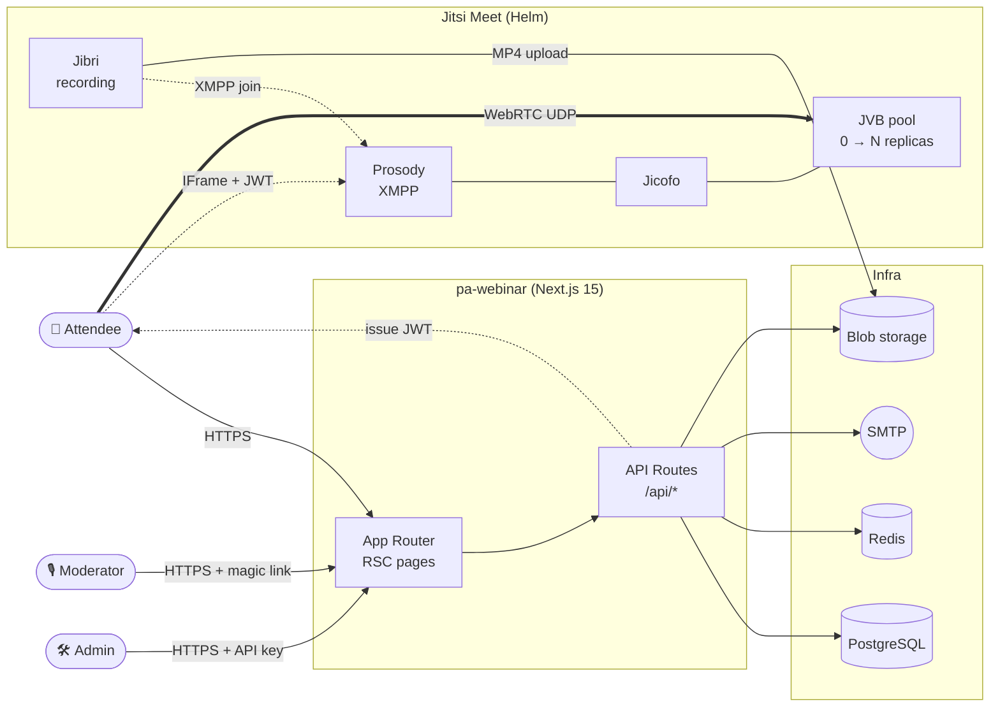
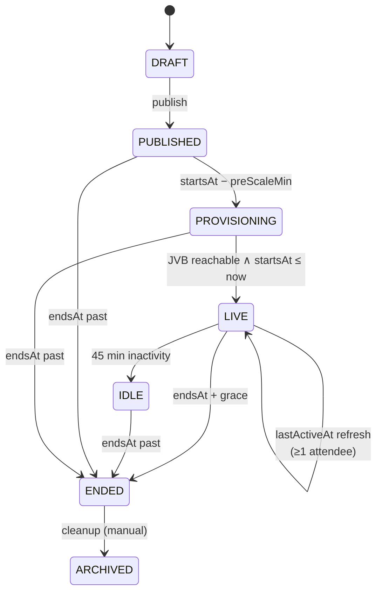
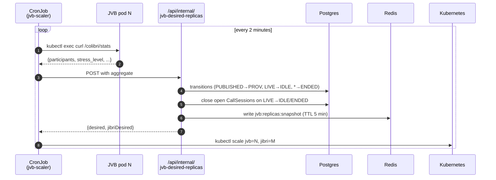

# pa-webinar

[](https://github.com/italia/pa-webinar/actions/workflows/ci.yml)
[](https://scorecard.dev/viewer/?uri=github.com/italia/pa-webinar)
[](https://joinup.ec.europa.eu/collection/eupl/eupl-text-eupl-12)
[](publiccode.yml)
[](#quality--security)

Open-source platform for public digital events run by the Italian Public Administration, built on top of [Jitsi Meet](https://jitsi.org/) and the [.italia design system](https://designers.italia.it/). Developed by the [Department for Digital Transformation](https://innovazione.gov.it/).

The user interface ships translated into **24 EU languages**, runtime-configurable by the site administrator (Italian set as default). Released under EUPL-1.2 and designed for reuse across European public administrations.

🇮🇹 **Versione italiana**: [README.md](README.md)

---

## Contents

- [Features](#features)
- [Architecture](#architecture)
- [On-demand scalability](#on-demand-scalability)
- [Components](#components)
- [Quick Start](#quick-start)
- [Quality & security](#quality--security)
- [Deep dives](#deep-dives)

---

## Features

**For event organisers**

- 🧭 **5-step event wizard** (base info, role-based permissions, people, content, review) reused in edit mode too
- 🏷️ **Tag taxonomy** with admin CRUD, public filter on `/events?tag=<slug>`, coloured chips on cards
- 📇 **Opt-in people directory** (rubrica) with a searchable picker in the wizard, opt-out via signed HMAC token
- 🧑‍🤝‍🧑 **Roles**: primary moderator, co-moderators, speakers, organisers, pre-registered invitees — each with granular per-feature permissions
- 📋 **Questionnaires** before registration and after the event, with reusable templates + ad-hoc questions
- 📎 **Materials** (links + uploads) attached to the event
- 📧 **Transactional emails** with iCal attachments and automatic reminders (1 day / 1 hour before)

**For attendees**

- 🚪 **Waiting room** as a unified front door: camera/mic preview, speaker chime test, netiquette, chat preview, countdown, guest join without registration
- 🎥 **Jitsi IFrame** with a custom Meet-style control bar (desktop floating top, mobile bottom strip) and a side drawer for Q&A, chat, polls, materials, participants
- 🙋 **Raised-hands queue** visible to everyone, moderators grant the floor with one click
- 🔴 **Recording** can only be started by moderators; participants see a persistent red indicator when on
- 💬 **Chat, upvoted Q&A, live polls, word cloud, reactions, presentation timer**
- 📱 **Mobile-first** with a dedicated layout below 992 px

**For operators**

- ☁️ **Kubernetes + Helm** with 3 profiles (simple / standard / full)
- 🔽 **Scale-to-zero** of the Jitsi Video Bridges when no events are active (details below)
- ☁️ Recording storage on **Azure Blob / S3 / GCS / MinIO / local filesystem**
- 📊 **Prometheus metrics** + ServiceMonitor + a built-in status page
- 🔒 **SBOM** (CycloneDX) per release, OpenSSF Scorecard, non-root read-only containers with seccomp
- 🇪🇺 **24 EU languages** runtime-configurable from the admin panel

---

## Architecture



**Key decisions** (ADRs in [`docs/adr/`](docs/adr/)):
1. Jitsi IFrame API instead of lib-jitsi-meet — full UX control without forking Jitsi
2. Full-stack Next.js (a single deployable, API + UI together)
3. Moderators via magic link (no user accounts)
4. JWT to authenticate attendees with Jitsi (Jitsi never sees PII)
5. Live features as first-class, not plugins: Q&A, polls, chat, word cloud, reactions, timer
6. Recording via Jibri + multi-provider storage
7. **Scale-to-zero for JVB** via a CronJob that aggregates `/colibri/stats` and drives the scaling
8. 24 EU languages via next-intl
9. Admin panel with JWT + API key
10. SiteSetting singleton for runtime configuration
11. People directory with explicit opt-in + HMAC token for opt-out

Full write-up: [`docs/ARCHITECTURE.md`](docs/ARCHITECTURE.md).

---

## On-demand scalability

Jitsi Video Bridges (JVB) are the heaviest resource: roughly 16 vCPU / 32 GiB for ~50 active senders. Keeping pools always on is expensive and wasteful between events.

**Scale-to-zero pattern**: a `jvb-scaler` CronJob runs every 2 minutes, fans out `kubectl exec` to every JVB pod, aggregates `/colibri/stats` (participants, conferences, per-pod stress), computes the desired replica count from `LIVE` / `PROVISIONING` events and rescales the `Deployment` accordingly. When there is nothing active and the `preScale` window is not yet open, the deployment drops to **0 replicas** and the cluster autoscaler tears down the dedicated spot nodes.





Technical details and tuning of the key parameters (`jvbPreScaleMinutes`, `jvbInactiveGraceMinutes`, `jvbProvisioningTimeoutMinutes`, `jvbStressWarnPercent`) in [`docs/ARCHITECTURE.md#jvb-scaler`](docs/ARCHITECTURE.md) and [`docs/CONFIGURATION.md`](docs/CONFIGURATION.md). Real-world measurements from a 65-attendee demo: [`docs/LOAD-TESTING.md#caffettino-demo`](docs/LOAD-TESTING.md).

---

## Components

```
pa-webinar/
├── app/                                 Next.js 15 (App Router)
│   ├── src/
│   │   ├── app/                          Pages + API routes
│   │   │   ├── [locale]/
│   │   │   │   ├── eventi/               Public event pages
│   │   │   │   │   └── [slug]/live/      Waiting room + Jitsi iframe
│   │   │   │   └── admin/                Admin area (JWT API-key)
│   │   │   └── api/
│   │   │       ├── events/[param]/       CRUD, lifecycle, sessions, chat, Q&A
│   │   │       ├── admin/                Tags, rubrica, questionnaires, email
│   │   │       ├── internal/             jvb-desired-replicas (scaler-only)
│   │   │       ├── webhooks/recording    Jibri → CallSession upsert
│   │   │       └── status, metrics       Liveness, Prometheus, Redis snapshot
│   │   ├── components/
│   │   │   ├── admin/event-wizard/       5-step wizard + edit mode
│   │   │   ├── admin/                    Tag manager, rubrica picker, dashboard
│   │   │   ├── live/                     Waiting room, DeviceCheck, floating controls, drawer, reactions, timer
│   │   │   ├── jitsi/                    IFrame wrapper, moderator controls, RaisedHandsPanel, recording consent
│   │   │   ├── qa/ polls/ materials/     Live interactive panels
│   │   │   └── events/                   Public card + detail, EventTitle (kicker)
│   │   ├── lib/
│   │   │   ├── jvb-sizing.ts             Per-event replica formula
│   │   │   ├── jvb-snapshot.ts           Shared type + readJvbSnapshot()
│   │   │   ├── persons/                  Rubrica + HMAC opt-out token
│   │   │   ├── events/lifecycle.ts       shouldEndLiveEvent + state machine
│   │   │   ├── email/                    Transactional + outbox
│   │   │   └── auth/                     Admin session, moderator token
│   │   ├── i18n/messages/                24 EU languages, flat JSON
│   │   └── styles/globals.scss           Bootstrap Italia + custom
│   ├── prisma/
│   │   ├── schema.prisma                 Models: Event, Registration, Question, Poll, Tag, Person, EventModerator, CallSession, SiteSetting, Questionnaire*, ChatMessage
│   │   └── migrations/                   Idempotent schema evolution
│   └── public/                           Static assets, watermarks, covers
├── infra/
│   ├── helm/pa-webinar/                  Chart: 3 profiles (simple/standard/full)
│   │   └── templates/cronjob-jvb-scaler.yaml  K8s RBAC fan-out + Redis write
│   ├── tofu/                             Azure/AKS reference (OpenTofu)
│   └── jitsi/jibri-finalize.sh           Jibri upload webhook → /api/webhooks/recording
├── docker-compose.yml                    Local stack (PG + Jitsi + Mailpit + app)
├── docs/                                 Deep-dive docs
└── .github/workflows/                    CI + release + Scorecard
```

Detailed directory walkthrough: [`docs/ARCHITECTURE.md`](docs/ARCHITECTURE.md).

---

## Quick Start

```bash
git clone https://github.com/italia/pa-webinar.git
cd pa-webinar

# Full stack (PostgreSQL + Jitsi + Mailpit + app)
docker compose up --build -d

# First time: migrations + seed
docker compose --profile setup run --rm db-migrate

# Open http://localhost:3000/en
```

| Service | URL |
|---|---|
| Portal | <http://localhost:3000> |
| Mailpit | <http://localhost:8025> |
| Jitsi | <https://localhost:8443> |

Dev mode (hot reload): `docker compose -f docker-compose.yml -f docker-compose.dev.yml up --build`.

Full setup (DB, tests, troubleshooting): [`docs/DEVELOPMENT.md`](docs/DEVELOPMENT.md).

---

## Quality & security

| Area | Status |
|---|---|
| Tests | **568 tests** (27 files, vitest) — [`docs/CONTRIBUTING-QUALITY.md`](docs/CONTRIBUTING-QUALITY.md) |
| Typecheck | TypeScript `strict` + `noUncheckedIndexedAccess` — PR gate |
| Lint | ESLint — PR gate |
| SBOM | CycloneDX 1.6 (code + Azure services) generated per release |
| OpenSSF Scorecard | Dedicated workflow, badge at the top |
| Containers | Non-root, read-only rootfs, seccomp `RuntimeDefault` |
| Dependencies | EUPL-compatibility licence audit |
| GDPR | At-rest PII encryption, granular consent, automatic retention, opt-in directory — [`docs/GDPR.md`](docs/GDPR.md) |
| Load testing | Real production measurements (65 attendees, 18.6 % stress) — [`docs/LOAD-TESTING.md`](docs/LOAD-TESTING.md) |

---

## Deep dives

| Doc | Topic |
|---|---|
| [`docs/ARCHITECTURE.md`](docs/ARCHITECTURE.md) | System design, data models, event state machine, wizard, waiting room, scaler |
| [`docs/DEPLOYMENT.md`](docs/DEPLOYMENT.md) | Helm chart, AKS/GKE/EKS/k3s, networking, TURN/STUN, Jibri, scaler CronJob |
| [`docs/DEVELOPMENT.md`](docs/DEVELOPMENT.md) | Local setup, DB workflow, tests, Jitsi debugging |
| [`docs/CONFIGURATION.md`](docs/CONFIGURATION.md) | Env vars, feature flags, runtime-configurable SiteSetting |
| [`docs/GDPR.md`](docs/GDPR.md) | GDPR compliance, retention, encryption, guest path, directory opt-out |
| [`docs/CONTRIBUTING-QUALITY.md`](docs/CONTRIBUTING-QUALITY.md) | Quality standards, Scorecard, SBOM |
| [`docs/LOAD-TESTING.md`](docs/LOAD-TESTING.md) | Benchmarks, real measurements, JVB sizing |
| [`docs/ROADMAP.md`](docs/ROADMAP.md) | Shipped, in progress, planned |
| [`docs/adr/`](docs/adr/) | Architecture Decision Records |

---

## Reuse

This software complies with the Italian [Software reuse guidelines](https://docs.italia.it/italia/developers-italia/lg-acquisizione-e-riuso-software-per-pa-docs/) and is listed on the [Developers Italia catalogue](https://developers.italia.it/). It is released under EUPL-1.2, the European Union Public Licence, designed to make the code reusable by any EU public body.

- [publiccode.yml](publiccode.yml) — Italian PA software catalogue metadata
- Licence: [EUPL-1.2](LICENSE)

## Licence

Distributed under the [European Union Public License 1.2](LICENSE).

© 2026 Dipartimento per la Trasformazione Digitale — Presidenza del Consiglio dei Ministri
