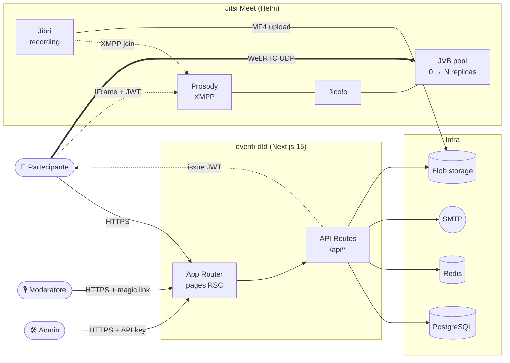
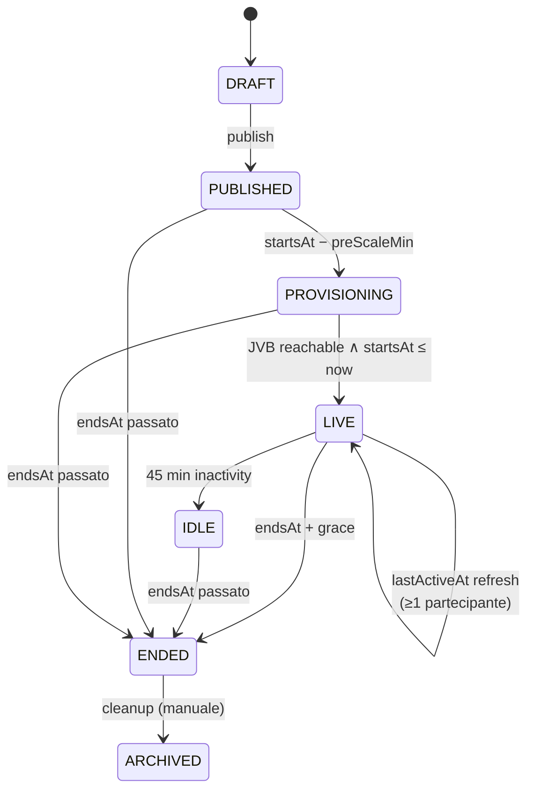
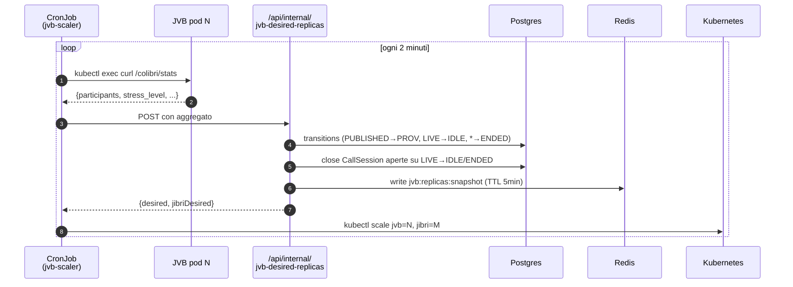

# eventi-dtd

[](https://github.com/italia/eventi-dtd/actions/workflows/ci.yml)
[](https://scorecard.dev/viewer/?uri=github.com/italia/eventi-dtd)
[](https://joinup.ec.europa.eu/collection/eupl/eupl-text-eupl-12)
[](publiccode.yml)
[](#qualità-e-sicurezza)

Piattaforma open-source per eventi pubblici digitali della Pubblica Amministrazione italiana, basata su [Jitsi Meet](https://jitsi.org/) e il [design system .italia](https://designers.italia.it/). Sviluppata dal [Dipartimento per la Trasformazione Digitale](https://innovazione.gov.it/).

> **English**: open-source platform for public digital events — webinars, public meetings, participatory sessions — built on Jitsi Meet and Bootstrap Italia. Kubernetes-native with **on-demand bridge scaling** (scale-to-zero between events). See [Architecture](docs/ARCHITECTURE.md).

---

## Indice

- [Funzionalità](#funzionalità)
- [Architettura](#architettura)
- [Scalabilità on-demand](#scalabilità-on-demand)
- [Componenti](#componenti)
- [Quick Start](#quick-start)
- [Qualità e sicurezza](#qualità-e-sicurezza)
- [Approfondimenti](#approfondimenti)

---

## Funzionalità

**Per chi organizza**

- 🧭 **Wizard di creazione evento** in 5 passi (info base, permessi per ruolo, persone, contenuti, review) riutilizzato anche in modifica
- 🏷️ **Tag taxonomy** con CRUD admin, filtro pubblico su `/eventi?tag=<slug>`, chip colorati sulle card
- 📇 **Rubrica persone** opt-in con picker ricercabile nel wizard, opt-out via token HMAC
- 🧑‍🤝‍🧑 **Ruoli**: moderatori principali, co-moderatori, relatori, organizzatori, invitati — ognuno con permessi granulari per feature
- 📋 **Questionari** pre-registrazione e post-evento con template riusabili + domande ad-hoc
- 📎 **Materiali** (link + upload) associabili all'evento
- 📧 **Email transazionali** con allegato iCal e reminder automatici (1g / 1h prima)

**Per chi partecipa**

- 🚪 **Waiting room** come front door unificata: anteprima webcam/microfono, test audio, netiquette, chat preview, countdown, accesso guest senza registrazione
- 🎥 **Jitsi IFrame** con barra controlli custom Meet-style (desktop floating top, mobile bottom-strip) e drawer laterale per Q&A, chat, sondaggi, materiali, partecipanti
- 🙋 **Mani alzate in coda** visibili a tutti, moderatori possono dare parola con un click
- 🔴 **Registrazione** avviabile solo da moderatore, banner sempre visibile a chi è registrato
- 💬 **Chat, Q&A con upvote, sondaggi live, parola cloud, reazioni, timer presentazione**
- 📱 **Mobile-first** con layout dedicato sotto i 992px

**Per chi deploya**

- ☁️ **Kubernetes + Helm** in 3 profili (simple / standard / full)
- 🔽 **Scale-to-zero** dei Jitsi Video Bridge quando non ci sono eventi attivi (vedi sotto)
- ☁️ Storage registrazioni su **Azure Blob / S3 / GCS / MinIO / local**
- 📊 **Prometheus metrics** + ServiceMonitor + status page built-in
- 🔒 **SBOM** CycloneDX per release, OpenSSF Scorecard, container non-root read-only con seccomp
- 🇪🇺 **24 lingue UE** configurabili a runtime dall'admin

---

## Architettura



**Decisioni chiave** (ADR in [`docs/adr/`](docs/adr/)):
1. Jitsi IFrame API invece di lib-jitsi-meet — design control senza forkare Jitsi
2. Next.js fullstack (un deployable, API + UI insieme)
3. Moderatori via magic link (nessun account utente)
4. JWT per autenticare partecipanti su Jitsi (Jitsi non vede PII)
5. Feature live first-class (non plugin): Q&A, polls, chat, word cloud, reactions, timer
6. Recording via Jibri + multi-provider storage
7. **Scale-to-zero per JVB** via CronJob che aggrega `/colibri/stats` e guida lo scaling
8. 24 lingue UE con next-intl
9. Admin panel con JWT + API key
10. SiteSetting singleton per runtime config
11. Rubrica/Person con opt-in esplicito + token HMAC per opt-out

Dettagli: [`docs/ARCHITECTURE.md`](docs/ARCHITECTURE.md).

---

## Scalabilità on-demand

I Jitsi Video Bridge (JVB) sono la risorsa più pesante: mediamente 16 vCPU / 32 GiB per ~50 sender attivi. Tenere pool sempre accesi è costoso e sprecato quando non ci sono eventi.

**Pattern scale-to-zero**: un CronJob `jvb-scaler` ogni 2 minuti fa il fan-out `kubectl exec` su ogni JVB, aggrega `/colibri/stats` (participants, conferences, stress per pod), calcola le repliche servite in base agli eventi `LIVE` / `PROVISIONING` e scala la `Deployment` di conseguenza. Quando non c'è nulla di attivo e la finestra di `preScale` non è ancora aperta, il deployment va a **0 replicas** e il cluster autoscaler smonta i nodi spot dedicati.





Dettagli tecnici + tuning dei parametri (`jvbPreScaleMinutes`, `jvbInactiveGraceMinutes`, `jvbProvisioningTimeoutMinutes`, `jvbStressWarnPercent`) in [`docs/ARCHITECTURE.md#jvb-scaler`](docs/ARCHITECTURE.md) e [`docs/CONFIGURATION.md`](docs/CONFIGURATION.md). Misurazioni reali da demo con 65 partecipanti su [`docs/LOAD-TESTING.md#caffettino-demo`](docs/LOAD-TESTING.md).

---

## Componenti

```
eventi-dtd/
├── app/                                 Next.js 15 (App Router)
│   ├── src/
│   │   ├── app/                          Pages + API routes
│   │   │   ├── [locale]/
│   │   │   │   ├── eventi/               Pagine pubbliche evento
│   │   │   │   │   └── [slug]/live/      Waiting room + iframe Jitsi
│   │   │   │   └── admin/                Area admin (JWT API-key)
│   │   │   └── api/
│   │   │       ├── events/[param]/       CRUD, lifecycle, sessions, chat, Q&A
│   │   │       ├── admin/                Tags, rubrica, questionnaires, email
│   │   │       ├── internal/             jvb-desired-replicas (scaler-only)
│   │   │       ├── webhooks/recording    Jibri → CallSession upsert
│   │   │       └── status, metrics       Liveness, Prometheus, Redis snapshot
│   │   ├── components/
│   │   │   ├── admin/event-wizard/       5-step wizard + edit mode
│   │   │   ├── admin/                    Tag manager, rubrica picker, dashboard
│   │   │   ├── live/                     Waiting room, DeviceCheck, floating controls, drawer, reactions, timer
│   │   │   ├── jitsi/                    IFrame wrapper, moderator controls, RaisedHandsPanel, recording consent
│   │   │   ├── qa/ polls/ materials/     Panels live interattive
│   │   │   └── events/                   Card + detail pubblici, EventTitle (kicker)
│   │   ├── lib/
│   │   │   ├── jvb-sizing.ts             Formula replica per evento
│   │   │   ├── jvb-snapshot.ts           Tipo + readJvbSnapshot() condivisi
│   │   │   ├── persons/                  Rubrica + opt-out token HMAC
│   │   │   ├── events/lifecycle.ts       shouldEndLiveEvent + state machine
│   │   │   ├── email/                    Transazionali + outbox
│   │   │   └── auth/                     Admin session, moderator token
│   │   ├── i18n/messages/                24 lingue UE, JSON flat
│   │   └── styles/globals.scss           Bootstrap Italia + custom
│   ├── prisma/
│   │   ├── schema.prisma                 Modelli: Event, Registration, Question, Poll, Tag, Person, EventModerator, CallSession, SiteSetting, Questionnaire*, ChatMessage
│   │   └── migrations/                   Schema evolution (idempotent)
│   └── public/                           Static assets, watermarks, cover
├── infra/
│   ├── helm/eventi-dtd/                  Chart: 3 profili (simple/standard/full)
│   │   └── templates/cronjob-jvb-scaler.yaml  fan-out K8s RBAC + Redis write
│   ├── tofu/                             Azure/AKS reference (OpenTofu)
│   └── jitsi/jibri-finalize.sh           Upload webhook Jibri → /api/webhooks/recording
├── docker-compose.yml                    Stack locale (PG + Jitsi + Mailpit + app)
├── docs/                                 Doc approfondite
└── .github/workflows/                    CI + release + Scorecard
```

Struttura dettagliata per directory: [`docs/ARCHITECTURE.md`](docs/ARCHITECTURE.md).

---

## Quick Start

```bash
git clone https://github.com/italia/eventi-dtd.git
cd eventi-dtd

# Stack completo (PostgreSQL + Jitsi + Mailpit + app)
docker compose up --build -d

# Prima volta: migrazioni + seed
docker compose --profile setup run --rm db-migrate

# Aperto su http://localhost:3000/it
```

| Servizio | URL |
|---|---|
| Portale | <http://localhost:3000> |
| Mailpit | <http://localhost:8025> |
| Jitsi | <https://localhost:8443> |

Dev mode (hot reload): `docker compose -f docker-compose.yml -f docker-compose.dev.yml up --build`.

Setup completo (db, test, troubleshooting): [`docs/DEVELOPMENT.md`](docs/DEVELOPMENT.md).

---

## Qualità e sicurezza

| Area | Stato |
|---|---|
| Test | **568 test** (27 file, vitest) — [`docs/CONTRIBUTING-QUALITY.md`](docs/CONTRIBUTING-QUALITY.md) |
| Typecheck | TypeScript `strict` + `noUncheckedIndexedAccess` — gate di PR |
| Lint | ESLint — gate di PR |
| SBOM | CycloneDX 1.6 (code + Azure services) generato per release |
| OpenSSF Scorecard | Workflow dedicato, badge in cima |
| Container | Non-root, read-only rootfs, seccomp `RuntimeDefault` |
| Dipendenze | Audit di compatibilità licenza EUPL |
| GDPR | Encryption PII at rest, consenso granulare, retention automatica, rubrica opt-in — [`docs/GDPR.md`](docs/GDPR.md) |
| Load testing | Misurazioni in produzione (65 partecipanti, 18.6% stress) — [`docs/LOAD-TESTING.md`](docs/LOAD-TESTING.md) |

---

## Approfondimenti

| Doc | Argomento |
|---|---|
| [`docs/ARCHITECTURE.md`](docs/ARCHITECTURE.md) | Sistema, modelli dati, state machine evento, wizard, waiting room, scaler |
| [`docs/DEPLOYMENT.md`](docs/DEPLOYMENT.md) | Helm chart, AKS/GKE/EKS/k3s, networking, TURN/STUN, Jibri, scaler CronJob |
| [`docs/DEVELOPMENT.md`](docs/DEVELOPMENT.md) | Setup locale, workflow DB, test, debug Jitsi |
| [`docs/CONFIGURATION.md`](docs/CONFIGURATION.md) | Env vars, feature flag, SiteSetting runtime-configurabili |
| [`docs/GDPR.md`](docs/GDPR.md) | Conformità GDPR, retention, encryption, percorso guest, opt-out rubrica |
| [`docs/CONTRIBUTING-QUALITY.md`](docs/CONTRIBUTING-QUALITY.md) | Standard di qualità, Scorecard, SBOM |
| [`docs/LOAD-TESTING.md`](docs/LOAD-TESTING.md) | Benchmark, misurazioni reali, sizing JVB |
| [`docs/ROADMAP.md`](docs/ROADMAP.md) | Rilasciato, in corso, a venire |
| [`docs/adr/`](docs/adr/) | Architecture Decision Records |

---

## Riuso

Software conforme alle [Linee guida per il riuso](https://docs.italia.it/italia/developers-italia/lg-acquisizione-e-riuso-software-per-pa-docs/) e presente nel [catalogo Developers Italia](https://developers.italia.it/).

- [publiccode.yml](publiccode.yml) — metadati catalogo software PA
- Licenza: [EUPL-1.2](LICENSE)

## Licenza

Distribuito con licenza [European Union Public License 1.2](LICENSE).

© 2026 Dipartimento per la Trasformazione Digitale — Presidenza del Consiglio dei Ministri
