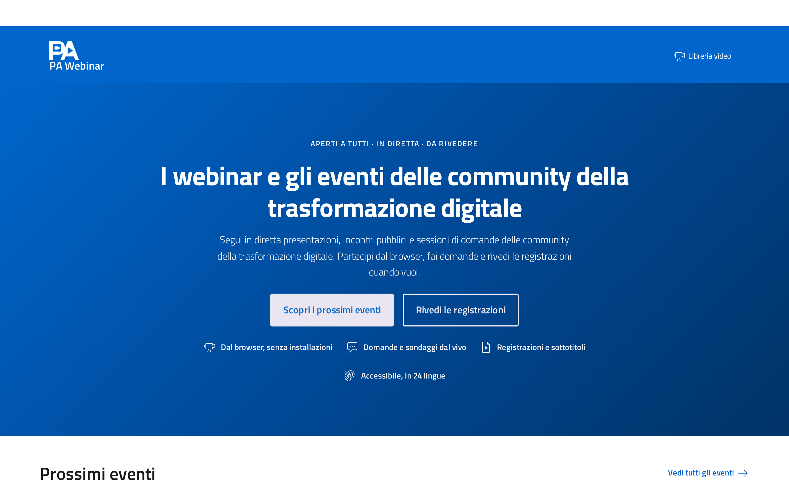
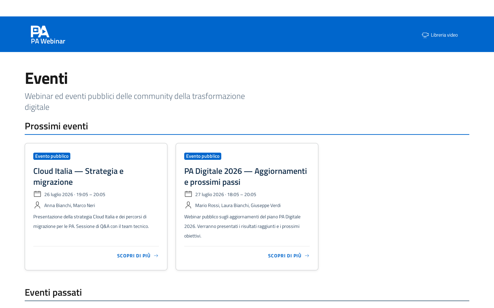
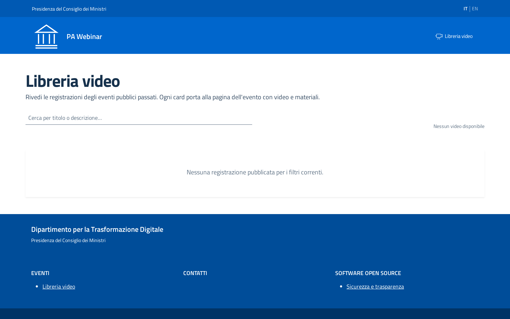
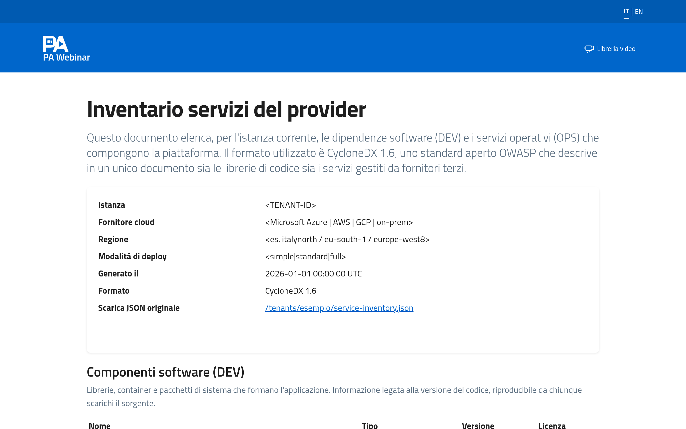
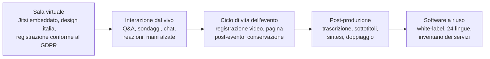
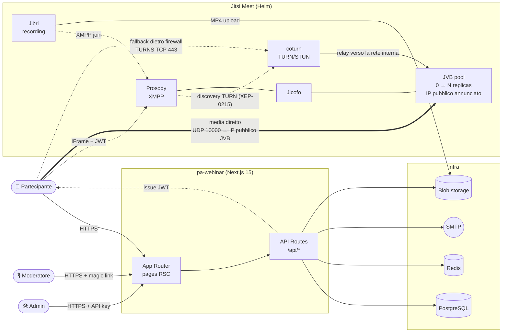
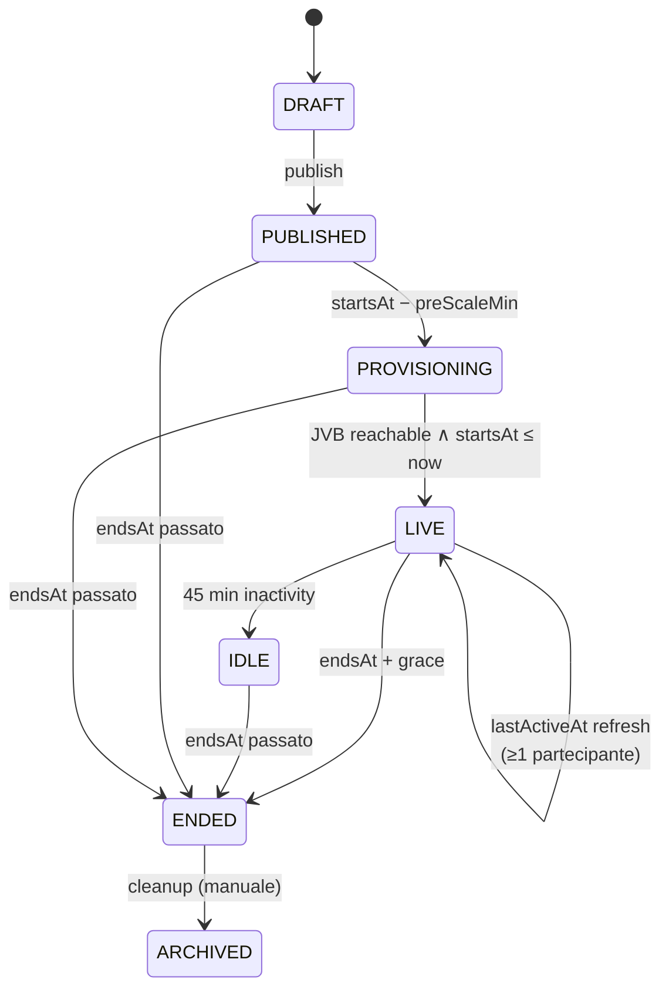
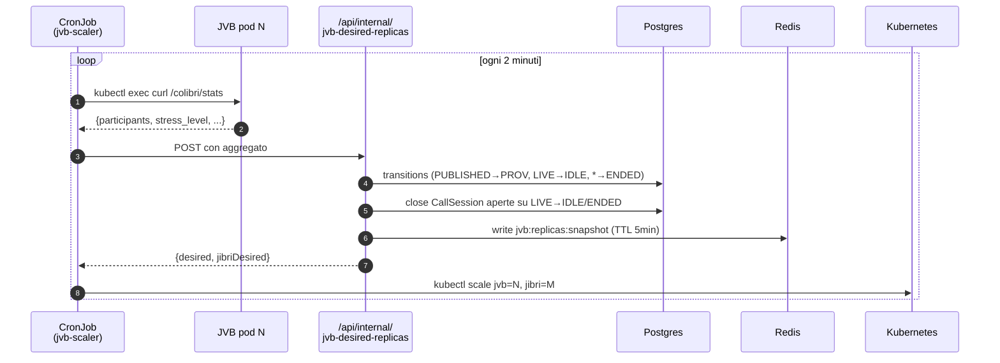

# pa-webinar

[](https://github.com/italia/pa-webinar/actions/workflows/ci.yml)
[](https://scorecard.dev/viewer/?uri=github.com/italia/pa-webinar)
[](https://joinup.ec.europa.eu/collection/eupl/eupl-text-eupl-12)
[](publiccode.yml)

Piattaforma open-source per eventi pubblici digitali della Pubblica Amministrazione italiana, basata su [Jitsi Meet](https://jitsi.org/) e il [design system .italia](https://designers.italia.it/). Sviluppata dal [Dipartimento per la Trasformazione Digitale](https://innovazione.gov.it/).

Interfaccia utente disponibile in **24 lingue UE** configurabili a runtime dall'amministratore (italiano impostato come default). Rilasciata con licenza EUPL-1.2 e pensata per il riuso in tutta la Pubblica Amministrazione europea.

🇬🇧 **English version**: [README.en.md](README.en.md)

---

## Come si presenta

| | |
|---|---|
|  |  |
| **Home** — prossimi eventi e registrazioni da rivedere | **Eventi** — filtri per data, argomento e tipo |
|  |  |
| **Libreria video** — registrazioni pubblicate, con sottotitoli | **Inventario dei servizi** — CycloneDX 1.6, cosa gira e dove |

Schermate dell'applicazione su dati dimostrativi (`npm run db:seed`). La sala live non è ritratta: richiederebbe un evento in corso e i volti di chi partecipa.

## Il percorso


```mermaid
flowchart LR
    A["Sala virtuale<br/>Jitsi embeddato, design .italia,<br/>registrazione conforme al GDPR"]
    B["Interazione dal vivo<br/>Q&A, sondaggi, chat,<br/>reazioni, mani alzate"]
    C["Ciclo di vita dell'evento<br/>registrazione video, pagina<br/>post-evento, conservazione"]
    D["Post-produzione<br/>trascrizione, sottotitoli,<br/>sintesi, doppiaggio"]
    E["Software a riuso<br/>white-label, 24 lingue,<br/>inventario dei servizi"]
    A --> B --> C --> D --> E
```

Ogni tappa è nata da un limite della precedente: prima far funzionare la call, poi far partecipare chi guarda e non solo chi parla, poi far vivere l'evento anche dopo la diretta, poi renderlo comprensibile a chi non era presente e a chi non sente, infine renderlo installabile da un'altra amministrazione. Cosa manca da qui in avanti è nella [roadmap](docs/ROADMAP.md); cosa è uscito e quando, nel [changelog](CHANGELOG.md).

## Indice

- [Il percorso](#il-percorso)
- [Funzionalità](#funzionalità)
- [Architettura](#architettura)
- [Scalabilità on-demand](#scalabilità-on-demand)
- [Componenti](#componenti)
- [Quick Start](#quick-start)
- [Qualità e sicurezza](#qualità-e-sicurezza)
- [Approfondimenti](#approfondimenti)

---

## Funzionalità

**Per chi organizza**

- 🧭 **Wizard di creazione evento** in 5 passi (info base, permessi per ruolo, persone, contenuti, review) riutilizzato anche in modifica
- 🏷️ **Tag taxonomy** con CRUD admin, filtro pubblico su `/eventi?tag=<slug>`, chip colorati sulle card
- 📇 **Rubrica persone** opt-in con picker ricercabile nel wizard, opt-out via token HMAC
- 🧑‍🤝‍🧑 **Ruoli**: moderatori principali, co-moderatori, relatori, organizzatori, invitati — ognuno con permessi granulari per feature
- 📋 **Questionari** pre-registrazione e post-evento con template riusabili + domande ad-hoc
- 📎 **Materiali** (link + upload) associabili all'evento
- 📧 **Email transazionali** con allegato iCal e reminder automatici (1g / 1h prima)

**Per chi partecipa**

- 🚪 **Waiting room** come front door unificata: anteprima webcam/microfono, test audio, netiquette, chat preview, countdown, accesso guest senza registrazione
- 🎥 **Jitsi IFrame** con barra controlli custom Meet-style (desktop floating top, mobile bottom-strip) e drawer laterale per Q&A, chat, sondaggi, materiali, partecipanti
- 🙋 **Mani alzate in coda** visibili a tutti, moderatori possono dare parola con un click
- 🔴 **Registrazione** avviabile solo da moderatore, banner sempre visibile a chi è registrato
- 💬 **Chat, Q&A con upvote, sondaggi live, parola cloud, reazioni, timer presentazione**
- 📱 **Mobile-first** con layout dedicato sotto i 992px

**Per chi deploya**

- ☁️ **Kubernetes + Helm** in 3 profili (simple / standard / full)
- 🔽 **Scale-to-zero** dei Jitsi Video Bridge quando non ci sono eventi attivi (vedi sotto)
- ☁️ Storage registrazioni su **Azure Blob / S3 / GCS / MinIO / local**
- 📊 **Prometheus metrics** + ServiceMonitor + status page built-in
- 🔒 **SBOM** CycloneDX per release, OpenSSF Scorecard, container non-root read-only con seccomp
- 🇪🇺 **24 lingue UE** configurabili a runtime dall'admin

---

## Architettura


```mermaid
flowchart LR
  Browser(["👤 Partecipante"])
  Moderatore(["🎙 Moderatore"])
  Admin(["🛠 Admin"])

  subgraph App["pa-webinar (Next.js 15)"]
    API["API Routes<br/>/api/*"]
    Pages["App Router<br/>pages RSC"]
  end

  subgraph Jitsi["Jitsi Meet (Helm)"]
    Prosody["Prosody<br/>XMPP"]
    Jicofo
    JVB["JVB pool<br/>0 → N replicas<br/>IP pubblico annunciato"]
    Coturn["coturn<br/>TURN/STUN"]
    Jibri["Jibri<br/>recording"]
  end

  subgraph Infra
    PG[(PostgreSQL)]
    Redis[(Redis)]
    SMTP((SMTP))
    Blob[(Blob storage)]
  end

  Browser -->|HTTPS| Pages
  Moderatore -->|HTTPS + magic link| Pages
  Admin -->|HTTPS + API key| Pages
  Pages --> API
  Browser -.->|IFrame + JWT| Prosody
  Browser ==>|"media diretto<br/>UDP 10000 → IP pubblico JVB"| JVB
  Browser -.->|"fallback dietro firewall<br/>TURNS TCP 443"| Coturn
  Coturn -->|"relay verso la rete interna"| JVB
  Prosody -.->|"discovery TURN (XEP-0215)"| Coturn
  Jibri -.->|XMPP join| Prosody
  Jibri -->|MP4 upload| Blob

  API --> PG
  API --> Redis
  API --> SMTP
  API --> Blob
  API -.->|issue JWT| Browser

  Prosody --- Jicofo
  Jicofo --- JVB
```

**Come viaggia l'audio/video.** Il media NON passa dall'applicazione: il browser
parla direttamente col Jitsi Video Bridge in **UDP sulla porta 10000**, verso un
**IP pubblico che il bridge annuncia** come candidato ICE (`publicIPs` nel chart;
senza quell'annuncio i client proverebbero a raggiungere l'indirizzo interno del
pod e la chiamata non si stabilirebbe). Chi sta dietro un firewall che blocca
l'UDP ricade automaticamente su **coturn in TURNS, TCP 443** — una porta che
passa quasi ovunque — e da lì il traffico viene rilanciato al bridge sulla rete
interna. Il browser scopre il TURN server via XEP-0215, annunciato da Prosody.

**Decisioni chiave** — il razionale completo è in
[`docs/ARCHITECTURE.md`](docs/ARCHITECTURE.md); le più recenti hanno anche un
record dedicato in [`docs/adr/`](docs/adr/):
1. Jitsi IFrame API invece di lib-jitsi-meet — design control senza forkare Jitsi
2. Next.js fullstack (un deployable, API + UI insieme)
3. Moderatori via magic link (nessun account utente)
4. JWT per autenticare partecipanti su Jitsi (Jitsi non vede PII)
5. Feature live first-class (non plugin): Q&A, polls, chat, word cloud, reactions, timer
6. Recording via Jibri + multi-provider storage
7. **Scale-to-zero per JVB** via CronJob che aggrega `/colibri/stats` e guida lo scaling
8. 24 lingue UE con next-intl
9. Admin panel con JWT + API key
10. SiteSetting singleton per runtime config
11. Rubrica/Person con opt-in esplicito + token HMAC per opt-out

Dettagli: [`docs/ARCHITECTURE.md`](docs/ARCHITECTURE.md).

---

## Scalabilità on-demand

I Jitsi Video Bridge (JVB) sono la risorsa più pesante: mediamente 16 vCPU / 32 GiB per ~50 sender attivi. Tenere pool sempre accesi è costoso e sprecato quando non ci sono eventi.

**Pattern scale-to-zero**: un CronJob `jvb-scaler` ogni 2 minuti fa il fan-out `kubectl exec` su ogni JVB, aggrega `/colibri/stats` (participants, conferences, stress per pod), calcola le repliche servite in base agli eventi `LIVE` / `PROVISIONING` e scala la `Deployment` di conseguenza. Quando non c'è nulla di attivo e la finestra di `preScale` non è ancora aperta, il deployment va a **0 replicas** e il cluster autoscaler smonta i nodi spot dedicati.


```mermaid
stateDiagram-v2
  [*] --> DRAFT
  DRAFT --> PUBLISHED: publish
  PUBLISHED --> PROVISIONING: startsAt − preScaleMin
  PROVISIONING --> LIVE: JVB reachable ∧ startsAt ≤ now
  LIVE --> LIVE: lastActiveAt refresh<br/>(≥1 partecipante)
  LIVE --> IDLE: 45 min inactivity
  LIVE --> ENDED: endsAt + grace
  IDLE --> ENDED: endsAt passato
  PUBLISHED --> ENDED: endsAt passato
  PROVISIONING --> ENDED: endsAt passato
  ENDED --> ARCHIVED: cleanup (manuale)
```


```mermaid
sequenceDiagram
  autonumber
  participant CJ as CronJob<br/>(jvb-scaler)
  participant POD as JVB pod N
  participant API as /api/internal/<br/>jvb-desired-replicas
  participant PG as Postgres
  participant R as Redis
  participant K8S as Kubernetes

  loop ogni 2 minuti
    CJ->>POD: kubectl exec curl /colibri/stats
    POD-->>CJ: {participants, stress_level, ...}
    CJ->>API: POST con aggregato
    API->>PG: transitions (PUBLISHED→PROV, LIVE→IDLE, *→ENDED)
    API->>PG: close CallSession aperte su LIVE→IDLE/ENDED
    API->>R: write jvb:replicas:snapshot (TTL 5min)
    API-->>CJ: {desired, jibriDesired}
    CJ->>K8S: kubectl scale jvb=N, jibri=M
  end
```

Dettagli tecnici + tuning dei parametri (`jvbPreScaleMinutes`, `jvbInactiveGraceMinutes`, `jvbProvisioningTimeoutMinutes`, `jvbStressWarnPercent`) in [`docs/ARCHITECTURE.md`](docs/ARCHITECTURE.md#jvb-scaler-ed-event-lifecycle) e [`docs/CONFIGURATION.md`](docs/CONFIGURATION.md). Misurazioni reali su un webinar in produzione: [`docs/LOAD-TESTING.md`](docs/LOAD-TESTING.md).

---

## Componenti

```
pa-webinar/
├── app/                                 Next.js 15 (App Router)
│   ├── src/
│   │   ├── app/                          Pages + API routes
│   │   │   ├── [locale]/
│   │   │   │   ├── eventi/               Pagine pubbliche evento
│   │   │   │   │   └── [slug]/live/      Waiting room + iframe Jitsi
│   │   │   │   └── admin/                Area admin (JWT API-key)
│   │   │   └── api/
│   │   │       ├── events/[param]/       CRUD, lifecycle, sessions, chat, Q&A
│   │   │       ├── admin/                Tags, rubrica, questionnaires, email
│   │   │       ├── internal/             jvb-desired-replicas (scaler-only)
│   │   │       ├── webhooks/recording    Jibri → CallSession upsert
│   │   │       └── status, metrics       Liveness, Prometheus, Redis snapshot
│   │   ├── components/
│   │   │   ├── admin/event-wizard/       5-step wizard + edit mode
│   │   │   ├── admin/                    Tag manager, rubrica picker, dashboard
│   │   │   ├── live/                     Waiting room, DeviceCheck, floating controls, drawer, reactions, timer
│   │   │   ├── jitsi/                    IFrame wrapper, moderator controls, RaisedHandsPanel, recording consent
│   │   │   ├── qa/ polls/ materials/     Panels live interattive
│   │   │   └── events/                   Card + detail pubblici, EventTitle (kicker)
│   │   ├── lib/
│   │   │   ├── jvb-sizing.ts             Formula replica per evento
│   │   │   ├── jvb-snapshot.ts           Tipo + readJvbSnapshot() condivisi
│   │   │   ├── persons/                  Rubrica + opt-out token HMAC
│   │   │   ├── events/lifecycle.ts       shouldEndLiveEvent + state machine
│   │   │   ├── email/                    Transazionali + outbox
│   │   │   └── auth/                     Admin session, moderator token
│   │   ├── i18n/messages/                24 lingue UE, JSON flat
│   │   └── styles/globals.scss           Bootstrap Italia + custom
│   ├── prisma/
│   │   ├── schema.prisma                 Modelli: Event, Registration, Question, Poll, Tag, Person, EventModerator, CallSession, SiteSetting, Questionnaire*, ChatMessage
│   │   └── migrations/                   Schema evolution (idempotent)
│   └── public/                           Static assets, watermarks, cover
├── infra/
│   ├── helm/pa-webinar/                  Chart: 3 profili (simple/standard/full)
│   │   └── templates/cronjob-jvb-scaler.yaml  fan-out K8s RBAC + Redis write
│   ├── tofu/                             Azure/AKS reference (OpenTofu)
│   └── jitsi/jibri-finalize.sh           Upload webhook Jibri → /api/webhooks/recording
├── docker-compose.yml                    Stack locale (PG + Jitsi + Mailpit + app)
├── docs/                                 Doc approfondite
└── .github/workflows/                    CI + release + Scorecard
```

Struttura dettagliata per directory: [`docs/ARCHITECTURE.md`](docs/ARCHITECTURE.md).

---

## Quick Start

```bash
git clone https://github.com/italia/pa-webinar.git
cd pa-webinar

# Stack completo (PostgreSQL + Jitsi + Mailpit + app)
docker compose up --build -d

# Prima volta: migrazioni + seed
docker compose --profile setup run --rm db-migrate

# Aperto su http://localhost:3000/it
```

| Servizio | URL |
|---|---|
| Portale | <http://localhost:3000> |
| Mailpit | <http://localhost:8025> |
| Jitsi | <https://localhost:8443> |

Dev mode (hot reload): `docker compose -f docker-compose.yml -f docker-compose.dev.yml up --build`.

### Dove gira: Kubernetes, e una VM singola

Il bersaglio di produzione è **Kubernetes**: il chart Helm è l'unità di
installazione supportata e alcune capacità sono native del cluster — lo
scale-to-zero dei Jitsi Video Bridge (autoscaler sul node pool), i lavori
periodici come CronJob, il recorder multi-traccia che crea Job, i segreti via
External Secrets Operator. Vedi [`docs/DEPLOYMENT.md`](docs/DEPLOYMENT.md).

Lo stack `docker-compose` **non è solo una demo**: serve a sviluppare e a
replicare la piattaforma su una **VM singola**, senza cluster. Fa girare app,
PostgreSQL, Redis, l'intero stack Jitsi, Mailpit e uno scheduler che chiama gli
stessi endpoint dei CronJob (così le email partono davvero, i promemoria
scattano e la pulizia GDPR gira anche in locale). Il recorder multi-traccia ha
una variante non-Kubernetes che usa il socket Docker: `--profile recorder`.
Funziona anche con **Podman**.

Cosa **non** c'è su VM singola: lo scale-to-zero dei JVB (serve un autoscaler di
cluster; in locale il bridge è sempre acceso), la pipeline AI di post-produzione
(richiede GPU) e la scalabilità orizzontale multi-nodo. La tabella completa di
cosa è attivo in locale è in
[`docs/DEVELOPMENT.md`](docs/DEVELOPMENT.md#parità-con-la-produzione).

Setup completo (db, test, troubleshooting): [`docs/DEVELOPMENT.md`](docs/DEVELOPMENT.md).

---

## Qualità e sicurezza

| Area | Stato |
|---|---|
| Test | Suite Vitest eseguita in CI, con soglie di copertura a cricchetto — [`docs/CONTRIBUTING-QUALITY.md`](docs/CONTRIBUTING-QUALITY.md) |
| Typecheck | TypeScript `strict` + `noUncheckedIndexedAccess` — gate di PR |
| Lint | ESLint — gate di PR |
| SBOM | CycloneDX 1.6 (code + Azure services) generato per release |
| OpenSSF Scorecard | Workflow dedicato, badge in cima |
| Container | Non-root, read-only rootfs, seccomp `RuntimeDefault` |
| Dipendenze | Audit di compatibilità licenza EUPL |
| GDPR | Encryption PII at rest, consenso granulare, retention automatica, rubrica opt-in — [`docs/GDPR.md`](docs/GDPR.md) |
| Load testing | Misurazioni reali su un webinar in produzione, con sizing JVB — [`docs/LOAD-TESTING.md`](docs/LOAD-TESTING.md) |

---

## Approfondimenti

| Doc | Argomento |
|---|---|
| [`docs/ARCHITECTURE.md`](docs/ARCHITECTURE.md) | Sistema, modelli dati, state machine evento, wizard, waiting room, scaler |
| [`docs/DEPLOYMENT.md`](docs/DEPLOYMENT.md) | Helm chart, AKS/GKE/EKS/k3s, networking, TURN/STUN, Jibri, scaler CronJob |
| [`docs/DEVELOPMENT.md`](docs/DEVELOPMENT.md) | Setup locale, workflow DB, test, debug Jitsi |
| [`docs/CONFIGURATION.md`](docs/CONFIGURATION.md) | Env vars, feature flag, SiteSetting runtime-configurabili |
| [`docs/GDPR.md`](docs/GDPR.md) | Conformità GDPR, retention, encryption, percorso guest, opt-out rubrica |
| [`docs/CONTRIBUTING-QUALITY.md`](docs/CONTRIBUTING-QUALITY.md) | Standard di qualità, Scorecard, SBOM |
| [`docs/LOAD-TESTING.md`](docs/LOAD-TESTING.md) | Benchmark, misurazioni reali, sizing JVB |
| [`docs/ROADMAP.md`](docs/ROADMAP.md) | Rilasciato, in corso, a venire |
| [`docs/adr/`](docs/adr/) | Architecture Decision Records |
| [`docs/README.md`](docs/README.md) | **Indice di tutta la documentazione** |

---

## Riuso

Software conforme alle [Linee guida per il riuso](https://docs.italia.it/italia/developers-italia/lg-acquisizione-e-riuso-software-per-pa-docs/) e presente nel [catalogo Developers Italia](https://developers.italia.it/).

- [publiccode.yml](publiccode.yml) — metadati catalogo software PA
- Licenza: [EUPL-1.2](LICENSE)

## Licenza

Distribuito con licenza [European Union Public License 1.2](LICENSE).

© 2026 Dipartimento per la Trasformazione Digitale — Presidenza del Consiglio dei Ministri
