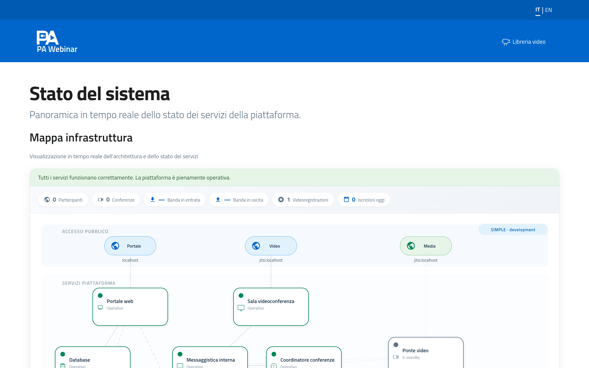
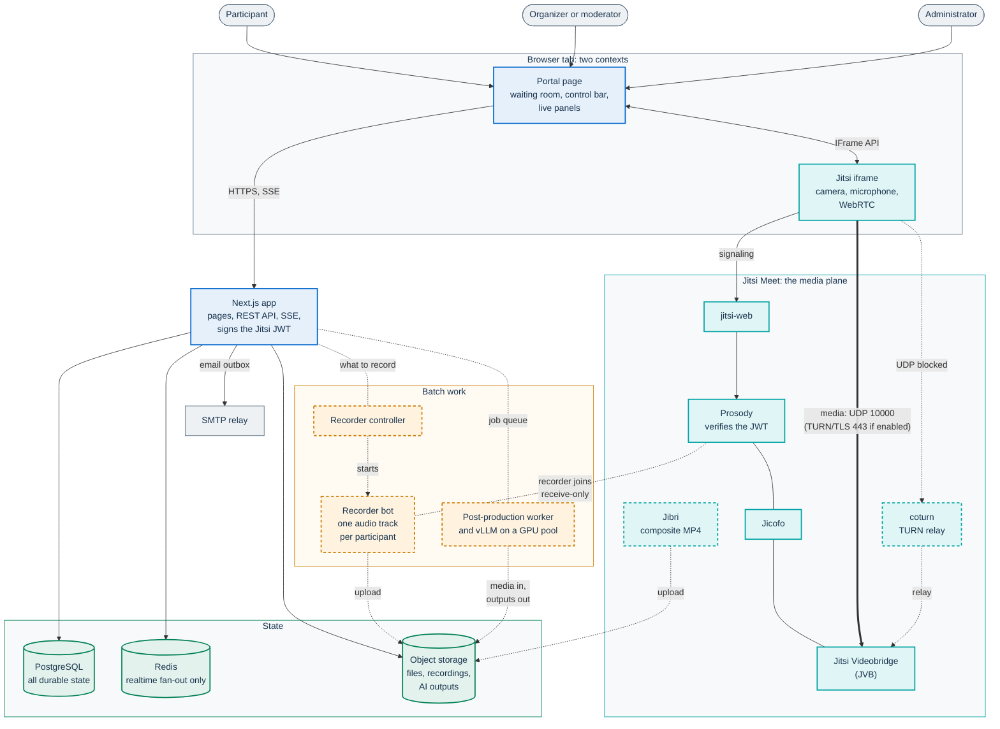
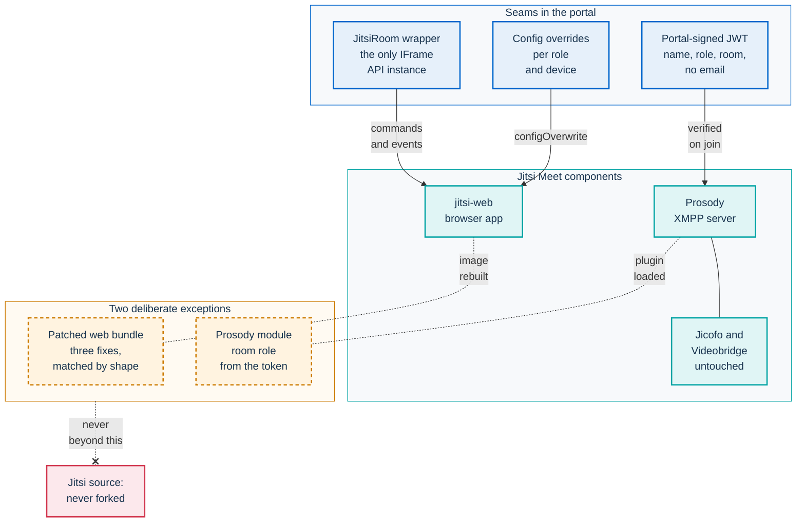
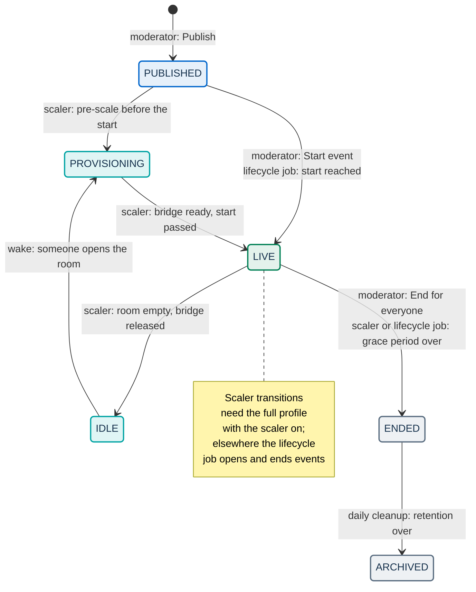
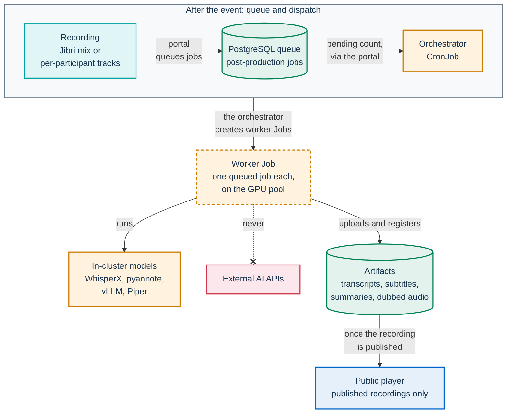
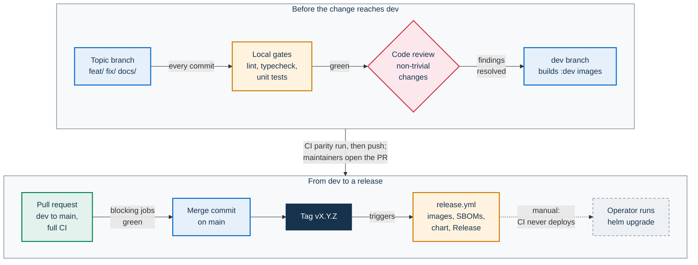

# PA Webinar

[](https://github.com/italia/pa-webinar/actions/workflows/ci.yml)
[](LICENSE)
[](publiccode.yml)

PA Webinar is an open-source platform that public administrations (PAs) use to run public digital events: webinars, presentations and open meetings, built on [Jitsi Meet](https://jitsi.org/jitsi-meet/) and the [.italia design system](https://designers.italia.it/) (Bootstrap Italia and design-react-kit). It is developed by the [Dipartimento per la Trasformazione Digitale](https://innovazione.gov.it/) (Italian Department for Digital Transformation), released under the European Union Public Licence (EUPL-1.2), and offered in the 24 official EU languages, with Italian as the default.

## What it looks like

| | | |
|---|---|---|
|  |  |  |
| **Home** page, default landing layout | **Events** (Eventi): upcoming and past events | **Video library** (Libreria video): published recordings, with search |
|  |  |  |
| **System status** (Stato del sistema): live infrastructure map | **What's new & changelog** (Novità e changelog) | **Provider service inventory** (Inventario servizi del provider): CycloneDX 1.6 |

The screenshots show the Italian interface with the demo data of the seed script (`app/prisma/seed.ts`). The status page is taken on a local development stack, and the service inventory shows the example document in `docs/examples/`, placeholders included. The live room is not pictured, because it would show real people.

## The idea

A video call is not yet a public event. A public event needs a public page, registration with consent, a room that opens and closes on schedule, and someone in charge of it. Once that works, the audience should take part, not only watch: ask questions, vote, raise a hand. Then the event should outlive the stream, with a recap, a recording and a place to find it. Next it should reach the people who were absent, who are deaf or hard of hearing, or who speak another language, through transcripts, subtitles, translations and dubbing. Finally, another administration should be able to install it and run it under its own name. PA Webinar grew along exactly that path, one stage at a time.


```mermaid
flowchart LR
  classDef portal fill:#E6F0FA,stroke:#0066CC,stroke-width:2px,color:#17324D
  classDef media fill:#E0F5F5,stroke:#00A3A3,stroke-width:2px,color:#17324D
  classDef data fill:#E3F2EC,stroke:#008055,stroke-width:2px,color:#17324D
  classDef job fill:#FFF3E0,stroke:#CC7A00,stroke-width:2px,color:#17324D
  classDef emph fill:#17324D,stroke:#17324D,stroke-width:2px,color:#FFFFFF
  A["Virtual room<br/>Jitsi Meet inside<br/>the portal"]:::media
  B["Live interaction<br/>Q&A, polls, chat,<br/>raised hands"]:::portal
  C["Event lifecycle<br/>recording, recap,<br/>video library"]:::data
  D["Post-production<br/>subtitles, summaries,<br/>translations, dubbing"]:::job
  E["Reuse<br/>by any public<br/>administration"]:::emph
  A -->|"the audience<br/>takes part"| B
  B -->|"the event outlives<br/>the stream"| C
  C -->|"it reaches people<br/>who missed it"| D
  D -->|"others can<br/>install it"| E
```

What is still missing is in the [roadmap](docs/ROADMAP.md). What shipped, release by release, is in the [changelog](CHANGELOG.md).

## What it does

**Organizers**

- Build an event in the five-step event wizard, start from an **Event templates** entry, or reuse a past event with **Duplicate as next occurrence**.
- Collect registrations and keep an invitation list, which decides who may register when registration is by invitation. Confirmations, calendar files and reminders leave through an email outbox.
- Add pre-event and post-event questionnaires, and materials whose visibility follows the phase of the event.
- Open a room at once from **Instant calls**.
- After the event, publish the recording to the **Video library** and read the event analytics on the **Statistics** tab.

**Participants**

- Register with a name, an email address and consents that are never pre-ticked, or, where the administration allows guests, join by name while the event is live.
- Wait in the waiting room: device check, virtual backgrounds, optional music, and the optional 2D square (**Step into the square**).
- Take part in the live room: chat, Q&A with upvotes, polls, word cloud, reactions, a visible raised-hand queue and shared materials.
- Watch the recording later, with subtitles, a transcript, a summary and dubbed audio when AI post-production runs.
- Request a copy or the erasure of their data under **My data**.

**Moderators and speakers**

- Enter through a magic link. No account is needed, and a speaker link gives full audio and video without moderation powers.
- Run the room: **Start event**, control participants' microphones and cameras, **Give the floor** to raised hands, switch live panels on and off.
- Start and stop the recording. On events set up for **Per-participant recording**, a recorder also keeps one audio track per participant, with each participant's consent, so AI transcripts can name every speaker exactly.
- Leave with **Just leave**, or close the room with **End for everyone** and choose where the event page goes next.

**Administrators and operators**

- Manage **Accounts**: named administrators and organizers who sign in with a one-time link. Organizers see only their own events.
- Brand the installation, pick the offered languages, allow or refuse guests, and make registration public or invitation-only, all at runtime and without a rebuild.
- Install with a Helm chart whose bridges (Jitsi Videobridge) can scale to zero, with optional recording and in-cluster AI post-production.
- Publish transparency pages: **System status** (on by default, and it can be withdrawn so that only administrators see its data), **What's new & changelog** with a viewer for the release SBOMs, and the **Service inventory**.

The full catalog, role by role, is the [feature tour](docs/FEATURES.md).

## Architecture at a glance


```mermaid
flowchart TB
  classDef portal fill:#E6F0FA,stroke:#0066CC,stroke-width:2px,color:#17324D
  classDef media fill:#E0F5F5,stroke:#00A3A3,stroke-width:2px,color:#17324D
  classDef data fill:#E3F2EC,stroke:#008055,stroke-width:2px,color:#17324D
  classDef job fill:#FFF3E0,stroke:#CC7A00,stroke-width:2px,color:#17324D
  classDef ext fill:#EEF1F4,stroke:#5C6F82,stroke-width:1px,color:#17324D
  classDef optional stroke-dasharray:5 4
  PT(["Participant"]):::ext
  OM(["Organizer or moderator"]):::ext
  AD(["Administrator"]):::ext
  subgraph BR["Browser tab: two contexts"]
    PAGE["Portal page<br/>waiting room, control bar,<br/>live panels"]:::portal
    IFR["Jitsi iframe<br/>camera, microphone,<br/>WebRTC"]:::media
  end
  style BR fill:#F7F9FB,stroke:#5C6F82,color:#17324D
  APP["Next.js app<br/>pages, REST API, SSE,<br/>signs the Jitsi JWT"]:::portal
  subgraph JITSI["Jitsi Meet: the media plane"]
    WEB["jitsi-web"]:::media
    PRO["Prosody<br/>verifies the JWT"]:::media
    JIC["Jicofo"]:::media
    JVB["Jitsi Videobridge<br/>(JVB)"]:::media
    TURN["coturn<br/>TURN relay"]:::media
    JIB["Jibri<br/>composite MP4"]:::media
  end
  style JITSI fill:#F7F9FB,stroke:#00A3A3,color:#17324D
  subgraph DATA["State"]
    PG[("PostgreSQL<br/>all durable state")]:::data
    RD[("Redis<br/>realtime fan-out only")]:::data
    OS[("Object storage<br/>files, recordings,<br/>AI outputs")]:::data
  end
  style DATA fill:#F7F9FB,stroke:#008055,color:#17324D
  SMTP["SMTP relay"]:::ext
  subgraph BATCH["Batch work"]
    RCT["Recorder controller"]:::job
    REC["Recorder bot<br/>one audio track<br/>per participant"]:::job
    PP["Post-production worker<br/>and vLLM on a GPU pool"]:::job
  end
  style BATCH fill:#FFFAF2,stroke:#CC7A00,color:#17324D
  PT & OM & AD --> PAGE
  PAGE <-->|"IFrame API"| IFR
  PAGE -->|"HTTPS, SSE"| APP
  IFR -->|"signaling"| WEB
  WEB --> PRO
  PRO --- JIC
  JIC --- JVB
  IFR ==>|"media: UDP 10000<br/>(TURN/TLS 443 if enabled)"| JVB
  IFR -.->|"UDP blocked"| TURN
  TURN -.->|"relay"| JVB
  APP --> PG & RD & OS
  APP -->|"email outbox"| SMTP
  APP -.-|"what to record"| RCT
  APP -.-|"job queue"| PP
  RCT -.->|"starts"| REC
  PRO -.-|"recorder joins<br/>receive-only"| REC
  JIB & REC -.->|"upload"| OS
  PP -.->|"media in,<br/>outputs out"| OS
  class TURN,JIB,RCT,REC,PP optional
```

Dashed boxes are optional and off by default.

- **One portal deployable.** A single Next.js application serves the pages, the REST API, the live streams and the endpoints that scheduled work calls. Separate images exist only where work cannot run in a web process: migrations, the patched Jitsi web front end, the recorder bot and its controller, and the AI worker.
- **State lives in PostgreSQL.** Redis only fans live updates out to every replica and holds short-lived snapshots. Files and media live in object storage. Jitsi is the media plane and knows nothing about registrations.
- **Two contexts in one browser tab.** The portal page and the Jitsi iframe exchange nothing but IFrame API commands and events.
- **Media never passes through the app.** Audio and video flow from the browser to a Jitsi Videobridge. Recordings flow from the recorders to object storage through short-lived signed URLs.

Design principles, each backed by an [Architecture Decision Record](docs/adr/README.md):

- **Embed Jitsi, never fork it** ([ADR-001](docs/adr/001-jitsi-iframe-api.md), [ADR-017](docs/adr/017-patched-jitsi-web-image.md)).
- **No user accounts, no email addresses in Jitsi.** Seats open with magic links, staff sign in with one-time links, and the conference token carries no email address ([ADR-003](docs/adr/003-moderator-magic-links.md), [ADR-004](docs/adr/004-jitsi-jwt.md), [ADR-014](docs/adr/014-organizer-role.md)).
- **The portal owns interaction.** Q&A, polls and chat are portal data in PostgreSQL, not Jitsi features ([ADR-005](docs/adr/005-live-interaction-in-portal.md)).
- **Capacity follows the calendar.** Bridges start before scheduled events and scale to zero between them ([ADR-007](docs/adr/007-jvb-scale-to-zero.md)).
- **Configure at runtime, add capabilities one at a time.** One image serves every installation, runtime settings live in one database row, and recording, AI and scale-to-zero are each switched on separately ([ADR-002](docs/adr/002-nextjs-fullstack.md), [ADR-010](docs/adr/010-site-settings-singleton.md)).

The components, the three planes and one event followed end to end are in [Architecture](docs/ARCHITECTURE.md).

## How PA Webinar extends Jitsi without forking it

A fork would turn every upstream security fix into a merge project for each administration that reuses the platform. PA Webinar uses only the extension points that Jitsi supports, and always the least invasive one that works:

- **An IFrame API wrapper.** `JitsiRoom` is the only place that creates the Jitsi API object. Around the iframe, the portal draws its own control bar, drawer, raised-hand queue and leave prompt, and it sets the Jitsi toolbar and features per role and per device through configuration overrides.
- **A portal-signed JWT without email addresses.** The portal decides who may enter and signs a short-lived token carrying a display name, a role, the room and an expiry, never an email address or a usable hash of one. Prosody verifies it, and Jitsi's own guest access stays off.
- **A Prosody module** that takes the room role from the token, so moderator rights follow the portal's decision. The Helm chart and the Docker Compose stack load it, and the chart also stops Jicofo from assigning roles of its own.
- **A patched `jitsi/web` image.** It fixes three defects that have no configuration point: noise suppression on microphones that do not run at 48 kHz, a hidden self view that cannot be recovered, and reaction emoji that block clicks. The patches find their targets by shape, not by minified names, and the build fails if a shape is missing.
- **A hidden XMPP domain for the recorder bot.** The per-participant recorder, headless Chrome running `lib-jitsi-meet`, signs in on that domain when it is configured, so it gets no tile and is not counted.
- **Bridges driven by the event calendar** (see [Scalability](#scalability)).


```mermaid
flowchart TB
  classDef portal fill:#E6F0FA,stroke:#0066CC,stroke-width:2px,color:#17324D
  classDef media fill:#E0F5F5,stroke:#00A3A3,stroke-width:2px,color:#17324D
  classDef job fill:#FFF3E0,stroke:#CC7A00,stroke-width:2px,color:#17324D
  classDef risk fill:#FCE8EC,stroke:#D1344C,stroke-width:2px,color:#17324D
  classDef optional stroke-dasharray:5 4
  subgraph SEAMS["Seams in the portal"]
    WR["JitsiRoom wrapper<br/>the only IFrame<br/>API instance"]:::portal
    CFG["Config overrides<br/>per role<br/>and device"]:::portal
    JWT["Portal-signed JWT<br/>name, role, room,<br/>no email"]:::portal
  end
  style SEAMS fill:#F7F9FB,stroke:#0066CC,color:#17324D
  subgraph CORE["Jitsi Meet components"]
    WEB["jitsi-web<br/>browser app"]:::media
    PRO["Prosody<br/>XMPP server"]:::media
    JJ["Jicofo and<br/>Videobridge<br/>untouched"]:::media
  end
  style CORE fill:#F7F9FB,stroke:#00A3A3,color:#17324D
  subgraph EXC["Two deliberate exceptions"]
    PATCH["Patched web bundle<br/>three fixes,<br/>matched by shape"]:::job
    MOD["Prosody module<br/>room role<br/>from the token"]:::job
  end
  style EXC fill:#FFFAF2,stroke:#CC7A00,color:#17324D
  FORK["Jitsi source:<br/>never forked"]:::risk
  WR -->|"commands<br/>and events"| WEB
  CFG -->|"configOverwrite"| WEB
  JWT -->|"verified<br/>on join"| PRO
  PRO --- JJ
  WEB <-.-|"image<br/>rebuilt"| PATCH
  PRO <-.-|"plugin<br/>loaded"| MOD
  EXC -.-x|"never<br/>beyond this"| FORK
  class PATCH,MOD optional
```

Each seam, its limits and the checklist for upgrading Jitsi are in [How PA Webinar extends Jitsi Meet](docs/architecture/jitsi-integration.md).

## Where it runs

PA Webinar is Kubernetes-native. One Helm chart, `infra/helm/pa-webinar`, installs it everywhere, from a workstation to a managed cluster: only the values files layered on it change. Scheduled work runs as Kubernetes CronJobs, and in the `full` profile a CronJob also scales the bridges through the Kubernetes API.

| Platform | Start from | What you get | Status |
|---|---|---|---|
| minikube on a workstation | [Try PA Webinar on minikube](docs/install/minikube.md): `scripts/minikube-up.sh` | Evaluation and development: the whole chart in the `simple` profile, with a test mailbox. Browsers on the same workstation only | Tested in lab |
| One k3s server | [Installing on your own VMs with k3s](docs/install/k3s.md): `infra/onprem/k3s/pa-webinar-up.sh`, one command from your workstation | Small production: occasional events of about 20 participants on camera, one bridge, PostgreSQL and Redis on the server, object storage and TURN as options, a nightly database dump. Not highly available | Tested in lab |
| Three k3s nodes | [Install on three nodes](docs/install/k3s.md#install-on-three-nodes), by hand | The same, with the bridge on its own VM. Not highly available | Tested in lab |
| AKS | [Installing on AKS](docs/install/aks.md): the module in `infra/tofu/aks` | The `full` profile: bridges that scale to zero, coturn, Azure Blob storage | Exercised with real events; the module itself has not yet been applied |
| GKE, EKS | [Installing on GKE](docs/install/gke.md), [Installing on EKS](docs/install/eks.md): the modules in `infra/tofu/gke` and `infra/tofu/eks` | The `full` profile on Google Cloud or AWS | Not yet verified |
| Docker Compose | [Local development](docs/DEVELOPMENT.md) | The loop for changing the code. It is not an installation and does not serve events | Development only |

The chart's three example profiles are values files in `infra/helm/pa-webinar/examples/`, not modes of the chart, and none of them encodes a capacity: `simple` runs the portal with PostgreSQL and Redis in the cluster and one bridge; `standard` adds an external database, app autoscaling and Jibri; `full` puts the bridges and Jibri on a dedicated node pool that scales to zero under the JVB scaler. Each platform adds a small overlay in the same folder. With `jitsi.enabled: false`, the chart deploys no Jitsi and the portal uses an existing Jitsi deployment, which must verify the portal's tokens.

Some capabilities need more than one machine. Bridge scale-to-zero and multi-node scaling need a cluster with an autoscaling node pool, and AI post-production needs a GPU node pool in the same cluster. Jibri needs the ALSA loopback kernel module on its node and elevated container privileges (the Jitsi subchart adds `SYS_ADMIN`).

To choose a platform, read the support levels, the stack at a glance, the constraints by platform, the measured requirements and the known limitations, start from [Installing PA Webinar](docs/install/README.md); every checklist, from the preflight to decommissioning, is in [Checklists](docs/install/checklists.md). The chart's keys are in [Deploying with Helm](docs/DEPLOYMENT.md), and the evidence behind the sizes and the network design is in the [Infrastructure reference](docs/INFRASTRUCTURE.md).

## Scalability

- **Capacity is two numbers.** Per event, the chart does not enable Jitsi's bridge cascading, so a conference stays on one bridge and a bigger event needs a bigger bridge. Across events, more bridges carry more conferences, up to the replica caps and the size of the node pool. Each extra bridge needs its own public address.
- **Bridges scale to zero, opt-in, in the `full` profile only** (`jitsi.mode: full` with `jvbScaler.enabled: true`). A CronJob reads every bridge's statistics, and the portal decides from the event calendar how many bridges should run and moves events through their statuses. Bridges start before a scheduled event, and the node pool shrinks to zero between events.
- **Without the scaler**, bridges run at a fixed count, and a lifecycle job moves events every minute: it opens a published event at its start time and ends it after its end time and grace period. Moderators can still start an event early with **Start event** and end it with **End for everyone**.
- **Without a node autoscaler**, as on minikube and k3s, the `simple` profile runs one bridge at a fixed count, and growing means a bigger node.
- **Sizing comes from what the organizer declared**: expected participants and the share expected to send video. The defaults assume 16-core bridges (`jvbCpuCoresPerPod` in `app/prisma/schema.prisma`; the formula is in `app/src/lib/jvb-sizing.ts`). Align them with your hardware. The measured requirements of each platform are in [Requirements](docs/install/README.md#requirements), and the bridge measurements in [Load testing](docs/LOAD-TESTING.md).
- **The app tier is stateless.** Pods scale with a HorizontalPodAutoscaler (`autoscaling` in `infra/helm/pa-webinar/values.yaml`), and Redis delivers live updates to every replica.
- **Where the limits are**, in the order you meet them: one bridge per event; the replica cap and the size of the bridge pool; one Prosody and one Jicofo shared by every conference; network egress, which in tile view grows with the square of the cameras; and a single PostgreSQL and Redis that scale vertically. Around them sit the limits of the network: participants whose networks block UDP need TURN (coturn, with its own DNS name, and on managed clusters its own address), the chart's HTTP tuning is written for ingress-nginx, and proxies in front of the ingress must be declared so that per-IP limits see real clients. All of them are in [Known limitations](docs/install/README.md#known-limitations).


```mermaid
stateDiagram-v2
  classDef human fill:#E6F0FA,stroke:#0066CC,stroke-width:2px,color:#17324D
  classDef auto fill:#E0F5F5,stroke:#00A3A3,stroke-width:2px,color:#17324D
  classDef live fill:#E3F2EC,stroke:#008055,stroke-width:2px,color:#17324D
  classDef terminal fill:#EEF1F4,stroke:#5C6F82,stroke-width:2px,color:#17324D
  [*] --> PUBLISHED : moderator: Publish
  PUBLISHED --> PROVISIONING : scaler: pre-scale before the start
  PUBLISHED --> LIVE : moderator: Start event<br/>lifecycle job: start reached
  PROVISIONING --> LIVE : scaler: bridge ready, start passed
  LIVE --> IDLE : scaler: room empty, bridge released
  IDLE --> PROVISIONING : wake: someone opens the room
  LIVE --> ENDED : moderator: End for everyone<br/>scaler or lifecycle job: grace period over
  ENDED --> ARCHIVED : daily cleanup: retention over
  note right of LIVE
    Scaler transitions
    need the full profile
    with the scaler on;
    elsewhere the lifecycle
    job opens and ends events
  end note
  class PUBLISHED human
  class PROVISIONING,IDLE auto
  class LIVE live
  class ENDED,ARCHIVED terminal
```

With the scaler, only `PROVISIONING` and `LIVE` events count toward the number of bridges. The capacity model and the scaler tick are in [Scaling the media plane](docs/architecture/scaling.md). Every status, who changes it and what it admits are in [Event lifecycle](docs/architecture/event-lifecycle.md).

## AI post-production

- **Outputs.** Transcripts with speaker labels, subtitles, structured summaries with chapters, translations, dubbed audio in synthetic catalog voices (a participant's voice is never cloned), and a per-participant archive that only the staff who manage the event can download.
- **Data sovereignty.** Everything runs inside the installation's own cluster, on open-weights models (WhisperX, pyannote.audio, vLLM, Piper) and on a GPU node pool that scales to zero. No recording, transcript or summary is sent to an external AI service, and the allowed engines are closed lists in `app/src/lib/ai/providers.ts`.
- **Opt-in at every level.** The chart renders nothing until `postprod.enabled` is set, the site-wide switch on the **Post-event AI pipeline** tab is off by default, and each event chooses its own **Automatic post-production** options.
- **Marked as machine-generated.** Transcripts and summaries carry the **AI-generated content** label, dubbed audio carries a synthetic-voice banner and, when watermarking succeeds, an audio watermark, and a provenance panel lists the models. Staff can correct a transcript while the machine version is kept.


```mermaid
flowchart TB
  classDef portal fill:#E6F0FA,stroke:#0066CC,stroke-width:2px,color:#17324D
  classDef media fill:#E0F5F5,stroke:#00A3A3,stroke-width:2px,color:#17324D
  classDef data fill:#E3F2EC,stroke:#008055,stroke-width:2px,color:#17324D
  classDef job fill:#FFF3E0,stroke:#CC7A00,stroke-width:2px,color:#17324D
  classDef risk fill:#FCE8EC,stroke:#D1344C,stroke-width:2px,color:#17324D
  classDef optional stroke-dasharray:5 4
  subgraph QUEUE["After the event: queue and dispatch"]
    direction LR
    REC["Recording<br/>Jibri mix or<br/>per-participant tracks"]:::media
    Q[("PostgreSQL queue<br/>post-production jobs")]:::data
    ORC["Orchestrator<br/>CronJob"]:::job
    REC -->|"portal<br/>queues jobs"| Q
    Q -->|"pending count,<br/>via the portal"| ORC
  end
  style QUEUE fill:#F7F9FB,stroke:#5C6F82,color:#17324D
  W["Worker Job<br/>one queued job each,<br/>on the GPU pool"]:::job
  M["In-cluster models<br/>WhisperX, pyannote,<br/>vLLM, Piper"]:::job
  X["External AI APIs"]:::risk
  ART[("Artifacts<br/>transcripts, subtitles,<br/>summaries, dubbed audio")]:::data
  PL["Public player<br/>published recordings only"]:::portal
  QUEUE -->|"the orchestrator<br/>creates worker Jobs"| W
  W -->|"runs"| M
  W -.-x|"never"| X
  W -->|"uploads and registers"| ART
  ART -->|"once the recording<br/>is published"| PL
  class W optional
```

The queue, the models, the GPU pool and the operating checklist are in [AI post-production](docs/POSTPROD.md). The privacy side is in [Recordings, voice data and AI outputs](docs/privacy/recordings-and-ai.md).

## Privacy and security by design

- **Minimal data, explicit consent.** Registration asks for a name and an email address. Consent boxes are never pre-ticked, the server enforces the required ones, and recording and per-participant audio each need their own consent.
- **Encrypted at rest.** Email addresses, most names and chat messages are encrypted with AES-256-GCM, and addresses are looked up by a keyed hash. With `NODE_ENV=production`, the portal refuses an encryption key that looks like a placeholder and fails closed.
- **Jitsi never sees an email address.** The conference token carries a display name, a role and the room, and no email address or usable hash of one.
- **Retention by default.** A scheduled cleanup job deletes an event's personal data once the event has ended and its retention period has passed, and anyone can request a copy or the erasure of their data, confirmed by email.
- **No tracking.** No analytics, no tracking cookies and no third-party CDN; fonts are self-hosted, a nonce-based Content Security Policy is enforced, and application logs carry no IP addresses. Pages embed no third-party content: a YouTube video appears as a link. Gravatar avatars are opt-in and fetched by the server.
- **Hardened runtime and supply chain.** Portal and job pods run as non-root with a read-only root filesystem, CI actions are pinned to commit SHAs, every release ships an SBOM, and vulnerabilities are reported privately.

Each guarantee, and where it stops, is documented: [Privacy and data protection](docs/GDPR.md), [Security architecture](docs/architecture/security.md) and the [security policy](SECURITY.md).

## Languages

The interface ships in the 24 official EU languages through next-intl, with Italian as the default and as the fallback. A test fails when any language misses a string or changes a placeholder. URLs are localized too: the same page is `/it/eventi/…` in Italian and `/en/events/…` in English. Administrators choose which languages are offered (a new installation offers Italian and English, `availableLocales` in `app/prisma/schema.prisma`) and can reword any string with **Custom translations**. Emails are written in five languages (Italian, English, French, German and Spanish), with English for the others. See [Languages and localization](docs/architecture/i18n.md).

## Quick start

### Try it on minikube

To see the product and the Helm chart on one workstation, you need minikube 1.38.1 or later, Helm 3.16.3 or later, kubectl, openssl, curl and Docker (the script checks the versions). One command installs the same chart that runs in production, in the `simple` profile with a small overlay:

```bash
git clone https://github.com/italia/pa-webinar.git
cd pa-webinar
scripts/minikube-up.sh
```

The script creates a minikube profile named `pa-webinar` (4 CPU and 6 GB by default) and never changes your current kubectl context. It generates the secrets once, in `~/.config/pa-webinar/minikube/pa-webinar/secrets.yaml`, outside the repository, and a local certificate authority that signs the certificates of the three addresses; `--trust-ca` adds it to the browsers of the workstation. It uses the images that the development branch publishes when the node can pull them; without registry credentials it builds them from your checkout, and in the lab the whole run took three to five minutes with Docker's build cache already warm (a first build takes longer). To see your own changes, pass `--images local`. At the end it prints the addresses:

| Service | Address | Note |
|---|---|---|
| Conference | `https://jitsi.<node-ip>.nip.io` | Trust the local certificate authority once (`--trust-ca`, or as the script explains), or open this address first and accept the certificate warning: otherwise the room embedded in the portal does not load |
| Portal | `https://app.<node-ip>.nip.io` | Without the authority trusted, accept its certificate too. The administration area is at `/en/admin/login`: **Sign in with the instance key**, with `ADMIN_API_KEY` from the secrets file |
| Mailpit | `https://mail.<node-ip>.nip.io` | Every email the portal sends lands here |

Join from browsers on the same workstation: with the Docker driver, other machines cannot reach the node. The installation has no demo data, so create an event: a lifecycle job opens it at its start time, and **Start event** opens it earlier. The script's summary prints the command that checks the installation, with the real paths; `--call` adds a call between two headless browsers. With the default profile: `scripts/verify-install.sh --context pa-webinar --ca-file ~/.config/pa-webinar/minikube/pa-webinar/ca.crt --secrets-file ~/.config/pa-webinar/minikube/pa-webinar/secrets.yaml --call`. Every step, the measured usage and how to stop or remove the profile are in [Try PA Webinar on minikube](docs/install/minikube.md).

### Install on one server

For a small production on a server of your own (4 vCPU, 8 GiB and 40 GB at least, reachable over ssh), one command from your workstation installs k3s and the chart, generates the secrets once outside the repository, gets the certificates and checks the result:

```bash
git clone https://github.com/italia/pa-webinar.git
cd pa-webinar
git checkout vX.Y.Z
infra/onprem/k3s/pa-webinar-up.sh --host <user>@<server> \
  --portal webinar.example.org --meet meet.example.org \
  --tls acme --acme-email it@example.org --smtp-file <smtp-settings-file> --backup
```

`--storage garage` adds object storage for uploads and videos, and `--turn` TURN for participants whose networks block UDP. Run again with only `--portal`, after checking out a new release, it upgrades the installation. The support level, the options, the certificates, backups and removal are in [Installing on your own VMs with k3s](docs/install/k3s.md).

### Change the code with Docker Compose

Docker Compose is the loop for developing PA Webinar, not a way to install it: it serves the portal over plain HTTP, keeps public placeholder secrets and runs only some of the scheduled jobs.

```bash
docker compose up --build -d                        # build and start the stack
docker compose --profile setup run --rm db-migrate  # first run only: migrations and demo data
docker compose -f docker-compose.yml -f docker-compose.dev.yml up --build   # optional: hot reload
```

The portal answers on <http://localhost:3000/en>, Mailpit on <http://localhost:8025> and Jitsi on <https://localhost:8443>, whose self-signed certificate you accept once. Sign in at <http://localhost:3000/en/admin/login> with the `ADMIN_API_KEY` placeholder from `docker-compose.yml`. The seed prints a moderator link for each demo event. Everything else about the local stack is in [Local development](docs/DEVELOPMENT.md).

## How we build it

- **Decisions are recorded.** Every architecture-level choice has an Architecture Decision Record in [`docs/adr/`](docs/adr/README.md).
- **Branches and commits.** Conventional Commits with a scope. Every change enters `dev`; `main` moves only through a `dev` → `main` pull request merged with a merge commit, never squashed, and releases are `vX.Y.Z` tags on `main`.
- **Gates before every commit and push.** Lint, typecheck and unit tests before every commit; before every push, the same commands as each CI job the change touches, because no blocking check runs on `dev`.
- **Code review** of every non-trivial change before it is committed or merged, with every finding resolved or explicitly accepted.
- **Rules encoded as tests.** A coverage ratchet (thresholds in `app/vitest.config.ts` are never lowered to let a change pass), the 24-language parity test, the localized-URL test and a CI check that the database schema and its migrations agree.
- **Supply chain.** Trivy scans the repository and a local build of the app image, CodeQL analyzes the code, and an OpenSSF Scorecard workflow exists whose results are not yet published. A license report is checked in CI, every GitHub Action is pinned to a full commit SHA, and pull requests never run on the in-cluster runner.
- **Releases.** Each release publishes the images, an SPDX SBOM, the packaged chart and a GitHub Release. Release notes are written by hand in all 24 languages. CI builds and never deploys.


```mermaid
flowchart TB
  classDef portal fill:#E6F0FA,stroke:#0066CC,stroke-width:2px,color:#17324D
  classDef data fill:#E3F2EC,stroke:#008055,stroke-width:2px,color:#17324D
  classDef job fill:#FFF3E0,stroke:#CC7A00,stroke-width:2px,color:#17324D
  classDef risk fill:#FCE8EC,stroke:#D1344C,stroke-width:2px,color:#17324D
  classDef ext fill:#EEF1F4,stroke:#5C6F82,stroke-width:1px,color:#17324D
  classDef emph fill:#17324D,stroke:#17324D,stroke-width:2px,color:#FFFFFF
  classDef optional stroke-dasharray:5 4
  subgraph AUTHOR["Before the change reaches dev"]
    direction LR
    TOP["Topic branch<br/>feat/ fix/ docs/"]:::portal
    G["Local gates<br/>lint, typecheck,<br/>unit tests"]:::job
    CR{"Code review<br/>non-trivial<br/>changes"}:::risk
    DEV["dev branch<br/>builds :dev images"]:::portal
    TOP -->|"every commit"| G
    G -->|"green"| CR
    CR -->|"findings<br/>resolved"| DEV
  end
  style AUTHOR fill:#F7F9FB,stroke:#5C6F82,color:#17324D
  subgraph RELEASE["From dev to a release"]
    direction LR
    PR["Pull request<br/>dev to main,<br/>full CI"]:::data
    MC["Merge commit<br/>on main"]:::portal
    TAG["Tag vX.Y.Z"]:::emph
    REL["release.yml<br/>images, SBOMs,<br/>chart, Release"]:::job
    OP["Operator runs<br/>helm upgrade"]:::ext
    PR -->|"blocking jobs<br/>green"| MC
    MC --> TAG
    TAG -->|"triggers"| REL
    REL -.->|"manual:<br/>CI never deploys"| OP
  end
  style RELEASE fill:#F7F9FB,stroke:#5C6F82,color:#17324D
  AUTHOR -->|"CI parity run, then push;<br/>maintainers open the PR"| RELEASE
  class OP optional
```

The full method is in [How we develop PA Webinar](docs/development/methodology.md). To contribute, start with [CONTRIBUTING.md](CONTRIBUTING.md).

## Governance, security and conduct

- **Governance.** The Dipartimento per la Trasformazione Digitale owns and maintains PA Webinar. Roles, decisions, the roadmap and releases are described in [GOVERNANCE.md](GOVERNANCE.md).
- **Security.** Report vulnerabilities privately, never in a public issue, as described in [SECURITY.md](SECURITY.md).
- **Conduct.** Everyone who takes part follows the [Contributor Covenant code of conduct](CODE_OF_CONDUCT.md).

## Documentation

The [documentation hub](docs/README.md) indexes every page by reader journey:

- **Evaluate:** the [feature tour](docs/FEATURES.md), [Reusing PA Webinar](docs/REUSE.md) and the [roadmap](docs/ROADMAP.md).
- **Install and operate:** [Installing PA Webinar](docs/install/README.md) and its platform guides, [Deploying with Helm](docs/DEPLOYMENT.md), the [configuration reference](docs/CONFIGURATION.md) and the [Infrastructure reference](docs/INFRASTRUCTURE.md).
- **Understand:** [Architecture](docs/ARCHITECTURE.md), the [decision records](docs/adr/README.md) and the [glossary](docs/GLOSSARY.md).
- **Develop and contribute:** [Local development](docs/DEVELOPMENT.md), [Extending PA Webinar](docs/development/extending.md) and [Testing](docs/development/testing.md).
- **Protect data:** [Privacy and data protection](docs/GDPR.md) and the [privacy notice checklist](docs/privacy/privacy-notice-checklist.md).

## Reuse and license

PA Webinar is released under the European Union Public Licence ([EUPL-1.2](LICENSE)), written for public-sector software: any public body in the EU, and anyone else, may install, adapt and redistribute it. Modified versions that are distributed, or offered to others as an online service, must be released under the same license or a compatible one. Contributions are accepted under the same license. [`publiccode.yml`](publiccode.yml) describes the project in the metadata format that the Developers Italia catalog reads, following the [AgID Guidelines on the acquisition and reuse of software](https://docs.italia.it/italia/developers-italia/lg-acquisizione-e-riuso-software-per-pa-docs/) (AgID is the Agenzia per l'Italia Digitale, the Italian digital agency). Third-party components keep their own licenses, listed in [THIRD-PARTY-LICENSES.md](THIRD-PARTY-LICENSES.md).

Maturity, stated plainly: `publiccode.yml` declares the project `beta`. The chart renders and validates on every example profile in CI, and the `simple` profile has been installed from scratch in lab, on minikube and on k3s. A from-scratch installation by another administration, on a managed cluster through to a working event, has not yet been exercised end to end, and the [roadmap](docs/ROADMAP.md#installation-and-operations) tracks that work. What is proven, what it takes and what an adopter is responsible for are in [Reusing PA Webinar](docs/REUSE.md).

Copyright © 2026 Dipartimento per la Trasformazione Digitale, Presidenza del Consiglio dei Ministri.
