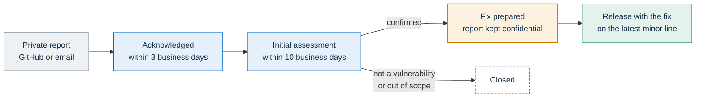
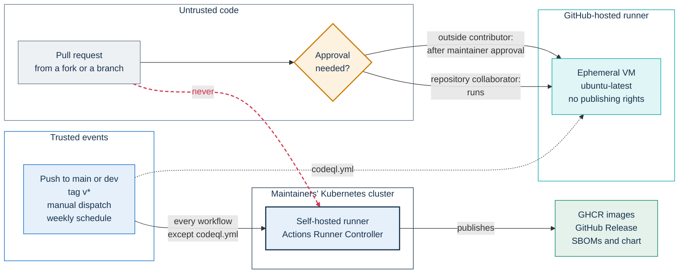

# Security policy

This policy covers PA Webinar, the open-source platform that public administrations (PAs) use to run public online events on their own infrastructure. It explains:

- which versions receive security fixes;
- how to report a vulnerability privately, and what the maintainers commit to in return;
- what is in scope;
- which supply-chain and CI controls protect the code and the published artifacts;
- how secrets are kept out of the repository.

For the security design of the application itself (trust boundaries, request handling, data protection, rate limits, runtime hardening), see [docs/architecture/security.md](docs/architecture/security.md).

## At a glance

| Topic | Policy |
|---|---|
| Supported versions | The latest released minor version only |
| How to report | Privately: GitHub Private Vulnerability Reporting where the repository offers it, otherwise email to the project's maintenance mailbox. Never a public issue |
| Acknowledgment | Within 3 business days |
| Initial assessment | Within 10 business days |
| Confidentiality | The report stays confidential until a fix is released |

## Supported versions

Only the **latest released minor version** receives security fixes. A release is a `vX.Y.Z` tag on `main`. It publishes the application image `ghcr.io/italia/pa-webinar:X.Y.Z`, its database-migration image and the packaged Helm chart.

- A fix ships as a new release on the latest minor line. Earlier minor versions receive no backports, so an older installation gets the fix by upgrading. The procedure is in [docs/operations/upgrades.md](docs/operations/upgrades.md).
- To find the latest release, read [CHANGELOG.md](CHANGELOG.md) or the repository's [GitHub Releases](https://github.com/italia/pa-webinar/releases). An installation's `/changelog` page shows the version that installation runs (**Current version**) and the releases before it. Releases whose main purpose is security carry a **Security** badge there.
- Builds from the `dev` branch (`:dev` and `:dev-<sha>` images) are pre-release builds, not supported versions.

Some components have no numbered releases:

- **Recorder bot, recorder controller and AI post-production worker.** Their images are built only from the `dev` branch: a rolling `:dev` tag, plus an immutable `:dev-<sha>` tag for each build. A fix reaches them with the next build from `dev`.
- **Patched jitsi/web image.** It uses one tag per patch revision, named after the upstream Jitsi build it is based on (`stable-<build>-rnnoise`, with a revision suffix such as `-r2` for a later patch on the same build). The workflow pushes whatever `IMAGE_TAG` says, so every fix must come with a new tag.

**A release tag does not pin every image.** The chart's defaults reference the floating `:dev` tag for the recorder, the recorder controller and the post-production worker, so those components are not reproducible from a release tag. Pin `:dev-<sha>` tags or digests; see [docs/operations/upgrades.md](docs/operations/upgrades.md#making-the-dev-components-roll-back).

The release workflow, the image tags and their conventions are described in [docs/development/ci-and-release.md](docs/development/ci-and-release.md).

## Reporting a vulnerability

### How to report

Report the vulnerability privately, through one of these channels:

- **GitHub Private Vulnerability Reporting.** If the **Security** tab of [github.com/italia/pa-webinar](https://github.com/italia/pa-webinar/security) shows a **Report a vulnerability** button, use it. Only you and the maintainers can see the report.
- **Email.** If the button is not there, or you cannot use GitHub, write to segreteria.trasformazionedigitale@governo.it. It is the project's maintenance mailbox and the `Contact` published in the project's `security.txt`. No encryption key is published for this mailbox, so keep the first message to a description of the issue and ask the maintainers how to share a proof of concept.

**Do not open a public issue or pull request** for a suspected vulnerability. Do not mention it in any public place before a fix is released. The issue templates `bug.md` and `feature.md` send security reports here.

### What to include

- **Component and version.** Name the affected component (see [Scope](#scope)) and its version: a release tag, an image tag or digest, a chart version, or a commit.
- **Installation mode.** Say whether you used the Helm chart (profile `jitsi.mode`: `simple`, `standard` or `full`) or Docker Compose. List any non-default setting that matters.
- **Attacker's starting position.** State where the attack starts in PA Webinar's access model:
  - an anonymous visitor;
  - a guest or a registrant;
  - someone holding a moderator link or a named grant;
  - an organizer or an administrator;
  - someone with network access to the cluster.

  Each of these credentials is described in [docs/architecture/identity-and-access.md](docs/architecture/identity-and-access.md).
- **Steps to reproduce.** Give the steps or a proof of concept.
- **Impact.** Say what the attacker gains (data, privileges or availability) and who is affected.
- **Optional.** Suggest a fix if you have one.

### Testing responsibly

- **Test only what you run.** Reproduce the issue on your own local stack (see [docs/DEVELOPMENT.md](docs/DEVELOPMENT.md)) or on an installation you operate. Installations are run by public bodies, and this policy does not authorize testing against them.
- **Leave personal data alone.** Do not access, keep or share the personal data of participants. If a proof of concept exposes such data, stop at the minimum that shows the issue.
- **Keep reports free of personal data.** Do not put real personal data in the report.

## What we commit to

- **Acknowledgment.** We confirm that we received the report within **3 business days**.
- **Initial assessment.** We send an initial assessment of the report within **10 business days**.
- **Confidentiality.** We keep the report confidential until a fix is released.

A confirmed vulnerability is fixed in a new release on the latest minor line (see [Supported versions](#supported-versions)).

The maintainers do not operate other administrations' installations and cannot patch them. The CI builds images but never deploys them, so each operator decides when to upgrade its own installation.

## Scope

### In scope

| Component | Source | Published as |
|---|---|---|
| Portal application, including the waiting-room square it bundles | `app/`, `lobby/` | `ghcr.io/italia/pa-webinar` (application and migration images) |
| Helm chart, including the scripts and configuration it mounts | `infra/helm/pa-webinar/` | Chart package attached to each GitHub Release |
| Recorder bot | `infra/recorder/` | `ghcr.io/italia/pa-webinar-recorder` |
| Recorder controller | `infra/recorder-controller/` | `ghcr.io/italia/pa-webinar-recorder-controller` |
| AI post-production worker | `infra/ai/worker/` | `ghcr.io/italia/pa-webinar-postprod-worker` |
| Patched jitsi/web image (the patches applied to the upstream bundle) | `infra/jitsi-web-patched/` | `ghcr.io/italia/pa-webinar-jitsi-web` |
| Jitsi extras: the custom Prosody module used by the Docker Compose stack, and a Jibri finalize script | `infra/jitsi/` | Not published separately |
| Docker Compose stack | `docker-compose*.yml` | Not published separately |
| CI and release workflows | `.github/workflows/` | Not applicable |

The rest of the repository is in scope too: the load-test toolkit, the service-inventory generator and the scripts. These are tools, not parts of a running installation.

### Report upstream as well

Some issues belong to third-party projects:

- Jitsi Meet components (web, Prosody, Jicofo, Jitsi Videobridge, Jibri), coturn (the TURN server) and the `jitsi-contrib` Helm chart that deploys them;
- the Bitnami PostgreSQL and Redis subcharts, and the Bitnami kubectl image used by the scheduled jobs;
- npm, pip and container-image dependencies.

Report these issues to the upstream project through its own security process. Tell us as well when PA Webinar ships or pins an affected version, or when PA Webinar's configuration makes the issue exploitable.

For the patched jitsi/web image, the report goes by where the flaw is. A flaw introduced by one of our patches belongs here. A flaw in the upstream code belongs upstream.

### Installations run by other administrations

Each installation is run by its **operator**: the public body that deployed it. The operator controls the configuration, secrets, network exposure and upgrades. It is also the controller of the personal data the installation processes.

- **A problem specific to one installation.** Report it to that operator. Examples: an exposed service, a leaked key, an outdated version.
- **A root cause in PA Webinar.** If the cause lies in the code, the chart defaults or this documentation, report it here as well. Describe the flaw, not the installation.
- **The `security.txt` file.** The application image serves `/.well-known/security.txt` (RFC 9116) from `app/public/.well-known/security.txt`. Its `Contact` is the project's maintenance mailbox, which accepts reports as described in [How to report](#how-to-report). `Policy` points to this file, `Acknowledgments` to the [Acknowledgments](#acknowledgments) section, and `Preferred-Languages` is `it, en`. The file also has an `Encryption` field, but no key is published at that address. The file is part of the image, so an operator that wants reports to reach it directly must serve its own file, for example from the ingress.

What an operator takes on when adopting PA Webinar is described in [docs/REUSE.md](docs/REUSE.md).

### Not treated as vulnerabilities

- **The development placeholders in `docker-compose.yml` and `.env.example`.** They are public on purpose (see [Development placeholders](#development-placeholders)). A way to make a production installation run with one of them *is* in scope.
- **Findings accepted in `.trivyignore`.** Each one carries its justification. The accepted CVEs also state when to revisit them. A report showing that a justification no longer holds is in scope.
- **Documented design trade-offs.** One example is the moderator link, which identifies a seat, not a person (see [docs/architecture/identity-and-access.md](docs/architecture/identity-and-access.md)). Another is `'unsafe-inline'` in `style-src` (see [docs/SECURITY-CSP.md](docs/SECURITY-CSP.md)). A way to go beyond what those documents describe is in scope.
- **Scanner output on its own.** Include why the finding is reachable in PA Webinar.

## Supply chain and CI

Every control below can be checked in the files it names, unless it is marked as a repository setting. How each workflow runs and what it produces is described in [docs/development/ci-and-release.md](docs/development/ci-and-release.md).

### Where CI code runs

The self-hosted runner runs inside a Kubernetes cluster. Code running there could reach the cloud metadata endpoint, a Kubernetes ServiceAccount or the Docker socket, so pull-request code must never run there. The workflows enforce this in four ways:

- **Conditional runner in `ci.yml`.** Every job in `.github/workflows/ci.yml` picks its runner with a conditional `runs-on`. `pull_request` events go to GitHub-hosted `ubuntu-latest` runners. Pushes to `main` and manual dispatches go to the self-hosted runner.
- **Trusted triggers for publishing workflows.** `dev.yml`, `jitsi-web.yml`, `release.yml` and `scorecard.yml` build, publish or analyze on the self-hosted runner. They start only on trusted events: pushes to `dev` or `main`, `v*` tags, manual dispatch or a schedule. `codeql.yml` always runs on GitHub-hosted runners.
- **No privileged pull-request trigger.** No workflow uses `pull_request_target`.
- **Approval for outside contributors.** A maintainer must approve workflow runs on pull requests from outside contributors. This is a repository setting, so it does not appear in the workflow files. For pull requests from forks, GitHub also withholds repository secrets.

As a result, code from a pull request reaches the self-hosted runner only after a maintainer reviews and merges it. A new workflow that `pull_request` triggers must keep the same conditional `runs-on`. The review rules are in [docs/development/methodology.md](docs/development/methodology.md).

### Pinned actions and least-privilege tokens

- **Pinned actions.** Every `uses:` in `.github/workflows/` references a full commit SHA, with the tag in a trailing comment (`actions/checkout@<sha> # v4`). No workflow uses a floating reference such as `@v4` or `@main`. Dependabot updates the SHA and the comment together.
- **Least-privilege tokens.** `ci.yml`, `codeql.yml` and `scorecard.yml` set a read-only workflow default. `dev.yml`, `jitsi-web.yml` and `release.yml` declare permissions per job only. The jobs that need more than read access are elevated:

  | Workflow | Workflow-level permissions | Elevated jobs |
  |---|---|---|
  | `ci.yml` | `contents: read` | None: the Docker build uses `push: false`, and no job writes to the repository or a registry |
  | `codeql.yml` | `read-all` | The analysis job gets `security-events: write` to upload results |
  | `scorecard.yml` | `read-all` | The analysis job gets `security-events: write`, plus `id-token: write` to publish results |
  | `dev.yml`, `jitsi-web.yml` | None declared | The jobs that push images get `packages: write` |
  | `release.yml` | None declared | The image job gets `packages: write` and `contents: write`. The chart job gets `contents: write` to attach files to the GitHub Release |

- **Jobs without a `permissions` block.** Such a job receives the repository's default token permissions, a repository setting that the workflow files do not show. The change-detection jobs in `dev.yml` are such jobs, so their token is only as narrow as that setting.

### Dependency updates

`.github/dependabot.yml` checks for updates every week. It is the authoritative list of what is covered:

- **npm:** the root workspaces, the app, the recorder and the recorder controller.
- **pip:** the AI post-production worker.
- **Docker:** Dependabot updates a base image only when a `FROM` line names it literally: the recorder and recorder-controller bases, and the build-only `node` stage of the patched jitsi/web image. The app, worker and patched-image Dockerfiles take their runtime base from a build argument (`NODE_BASE`, `BASE_IMAGE`, `BASE_TAG`), which Dependabot does not update, so those bases are manual bumps.
- **GitHub Actions:** every action used by the workflows.
- **Not covered:** the Helm subchart versions in `infra/helm/pa-webinar/Chart.lock`, and the image references in the chart's values.

For npm, minor and patch updates are grouped into one pull request per directory.

**Major versions.** Major updates of the dependencies listed under `ignore` are excluded from routine updates. The list covers the framework, the ORM, the validation library, the TypeScript toolchain, the worker's machine-learning stack and some base images. Each of these majors is done as a dedicated upgrade, with the code adapted, the full gates run and a code review.

**Security updates still arrive.** The exclusions use `version-update:semver-major`, which applies to routine version updates only. When Dependabot security updates are enabled for the repository, a vulnerable dependency still gets its pull request.

**Moving to a new upstream Jitsi web build** means changing `BASE_TAG` and `IMAGE_TAG` in `.github/workflows/jitsi-web.yml`, so it is always a deliberate change. The procedure is in [infra/jitsi-web-patched/README.md](infra/jitsi-web-patched/README.md).

### Scanners

| Scanner | Workflow and job | Runs on | Blocking |
|---|---|---|---|
| Trivy, repository filesystem | `ci.yml`, `Security Scan` | Pull requests to `main`, pushes to `main`, manual dispatch | Yes, on CRITICAL or HIGH findings |
| Trivy, application image built locally (never pushed) | `ci.yml`, `Docker Build & Scan` | Same as above | Yes, on CRITICAL or HIGH findings |
| CodeQL, JavaScript and TypeScript, `security-extended` queries | `codeql.yml` | Pushes and pull requests to `main` and `dev`, weekly | No (`continue-on-error`). Results go to the Security tab when code scanning is enabled in the repository settings |
| OpenSSF Scorecard | `scorecard.yml` | Pushes to `main`, weekly | No (`continue-on-error`). Nothing is published yet: the job runs on the self-hosted runner, and scorecard-action accepts publication only from GitHub-hosted runners ([details](docs/development/ci-and-release.md#codeqlyml-and-scorecardyml-code-analysis)) |
| Forbidden-license check | `ci.yml`, `License Compliance` | Same as `ci.yml` | Yes |

What the scanners do not cover:

- **Trivy runs only in `ci.yml`.** Pushes to `dev` and pull requests to `dev` get no Trivy scan.
- **Published images are never scanned.** No workflow scans the images pushed to GHCR. The release image is rebuilt from the tag. The migration, recorder, recorder controller, post-production worker and patched jitsi/web images are never scanned as built images, with their OS packages and everything added at build time. Only their dependency manifests in the repository are covered by the filesystem scan. An operator that needs image scanning should scan the digests it deploys.
- **Trivy runs with its default scanners:** known vulnerabilities and embedded secrets. `.trivyignore`, at the repository root, records each accepted finding with its justification.
- **CodeQL does not analyze the Python worker.** Its language matrix is JavaScript and TypeScript only. CodeQL also needs code scanning to be enabled on the repository.
- **Secret scanning has no pre-commit hook.** Code review and the Trivy scan are the controls.

### Release artifacts and SBOMs

`release.yml` runs on every pushed `v*` tag (releases use `vX.Y.Z`). It attaches these files to the GitHub Release:

- **`sbom.spdx.json`:** an SPDX JSON SBOM of the published application image, generated with Syft (`anchore/sbom-action`).
- **`npm-sbom.json`:** a CycloneDX SBOM of the npm dependencies of the `app` workspace, generated with `@cyclonedx/cyclonedx-npm`. This file is best effort: its step is allowed to fail, so a release can lack it.
- **The packaged Helm chart.**

These artifacts have limits:

- **Only the application image has SBOMs.** The migration image, the recorder, the recorder controller, the worker and the patched jitsi/web image have none.
- **No image is signed.** No workflow signs images. The release application image carries the OCI labels set by `docker/metadata-action`. They include `org.opencontainers.image.revision`, which binds the image to the commit it was built from. The release migration image is built without these labels.

Installations show an **SBOM** button on `/changelog` for releases flagged `sbom`; see [docs/development/ci-and-release.md](docs/development/ci-and-release.md#sboms).

The same installations serve a public **Security and transparency** page at `/security` (`/sicurezza` in Italian), which links to this policy.

The service inventory is a separate document. It is a CycloneDX 1.6 view of the deployed services, published at `/service-inventory`, and it is described in [docs/SERVICE-INVENTORY.md](docs/SERVICE-INVENTORY.md).

### License compliance

The `License Compliance` job in `ci.yml` fails in two cases:

- `license-checker` finds a production npm dependency of the root workspaces (`app`, `lobby`) whose license is one of `GPL-2.0`, `GPL-3.0`, `AGPL-3.0`, `AGPL-3.0-only` or `SSPL-1.0`;
- `license-report.json` is out of date.

The check has limits:

- **Exact matching.** `license-checker` matches the license string exactly, so other SPDX variants (such as `GPL-3.0-only` or `GPL-2.0-or-later`) and license expressions (such as `(MIT OR GPL-3.0)`) are not caught. `license-report.json` and [THIRD-PARTY-LICENSES.md](THIRD-PARTY-LICENSES.md) are the review point for those.
- **Root workspaces only.** The dependencies of the recorder, the recorder controller and the post-production worker are not checked.

The license policy is in [THIRD-PARTY-LICENSES.md](THIRD-PARTY-LICENSES.md).

## Secrets

### Nothing secret in the repository

The repository contains no credentials. An installation supplies its secrets at runtime:

- **Helm:** a Kubernetes Secret (see [Secrets in a Helm installation](#secrets-in-a-helm-installation)).
- **Docker Compose: development and evaluation only.** The tracked `docker-compose.yml` carries public placeholders as literal values and sets the `ALLOW_INSECURE_PII_KEY` escape hatch, so it must never hold real data (see [docs/INFRASTRUCTURE.md](docs/INFRASTRUCTURE.md#development-docker-compose)).

The secrets map in [docs/CONFIGURATION.md](docs/CONFIGURATION.md) lists every secret key and what it protects.

### Development placeholders

The secret-looking values in `docker-compose.yml` and `.env.example` are public development placeholders. They are shaped so that the local stack starts:

- they are long enough to pass the length checks;
- the personal-data key is accepted only through an escape hatch that exists in `docker-compose.yml` alone.

Never replace them with real values in the repository, and never run an installation with them. Only the personal-data key is detected by its shape (see below). The other placeholders are not detected, among them `APP_SECRET`, `ADMIN_API_KEY`, `CRON_API_KEY` and `JITSI_JWT_SECRET`. An installation must supply a freshly generated value for every one of them, for example from `openssl rand -hex 32`.

### Secrets in a Helm installation

- **`generate` mode is for development and test only.** The chart renders the Secret from `secrets.generate.*`, so the values also live in the Helm release record and in the values file.
- **Production uses `existing` or `external`.** With `existing`, the default, the operator creates and rotates the Secret. With `external`, the External Secrets Operator syncs it from a cloud secret manager.
- **Keep the datastore passwords in their own Secret**, named by `secrets.datastoreSecretName`. The PostgreSQL subchart mounts its password Secret in full inside the database container, so the personal-data encryption key must not sit next to those passwords.

The modes, the providers and how to separate the datastore passwords on an existing installation are in [docs/DEPLOYMENT.md](docs/DEPLOYMENT.md#secrets).

### Guards against weak keys

- **Personal-data key.** `PII_ENCRYPTION_KEY` must be 64 hexadecimal characters, a 32-byte key for AES-256-GCM.
  - In production (`NODE_ENV=production`), a key made of a short block repeated to full length is rejected. Every placeholder shipped in the repository has that shape.
  - When the key is rejected, every operation that encrypts or decrypts personal data fails. Nothing is encrypted with a public key: the guard fails closed.
  - The check looks at the shape, not at literal values, so it keeps working if the placeholders change. The code is in `app/src/lib/crypto/pii.ts`.
- **Compose escape hatch.** The Docker Compose stack runs the production image. It sets `ALLOW_INSECURE_PII_KEY=true`, and only `docker-compose.yml` sets it. `.env.example` deliberately leaves it out, so an installation built from that template keeps the guard. When the guard fails, generate a real key. Do not set the escape hatch.
- **Signing secret.** An `APP_SECRET` shorter than 32 bytes stops the application at startup in production (`app/src/instrumentation.ts`). Signing also refuses a short secret (`app/src/lib/auth/app-secret.ts`).

## Acknowledgments

This section lists the people who reported a vulnerability responsibly and agreed to be named. The `Acknowledgments` field of the project's `security.txt` points here. The list is empty.

## Further reading

- [docs/architecture/security.md](docs/architecture/security.md): the application's security controls and their limits.
- [docs/architecture/identity-and-access.md](docs/architecture/identity-and-access.md): every credential, how it travels, and how long it lasts.
- [docs/SECURITY-CSP.md](docs/SECURITY-CSP.md): the Content Security Policy and companion headers.
- [docs/GDPR.md](docs/GDPR.md): personal data, retention, encryption at rest and data-subject rights.
- [docs/development/ci-and-release.md](docs/development/ci-and-release.md): the workflows, image tags and release procedure.
- [docs/development/methodology.md](docs/development/methodology.md): local gates, CI parity and code review.
- [docs/REUSE.md](docs/REUSE.md): what an operator takes on when adopting PA Webinar.
- [GOVERNANCE.md](GOVERNANCE.md): ownership, roles and support.
