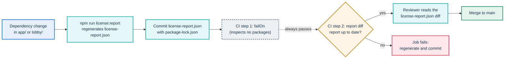
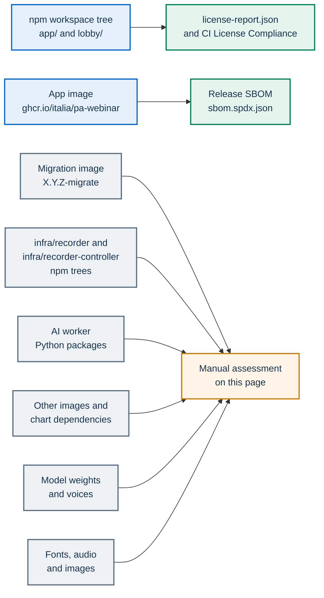

# Third-party licenses

PA Webinar is distributed under the European Union Public Licence (EUPL-1.2). This page states the license policy for everything PA Webinar builds on. It explains how the policy is enforced and where enforcement stops, and it records the components that no npm report covers: container images, the AI stack and its model weights, and bundled assets.

The page is maintained by hand and describes the repository as it is. It is not legal advice. Items marked **to verify** are open for a legal reading and are collected under [Open points](#open-points). For what the license means in practice for an adopting public administration (PA), see [Reusing PA Webinar](docs/REUSE.md).

## PA Webinar's license

- **License.** EUPL-1.2. The [LICENSE](LICENSE) file is a short notice that links to the full text on Joinup. Neither the repository nor the images carry the full text. See [Open points](#open-points). The same identifier appears in the root `package.json` (`license`) and in `publiccode.yml` (`legal.license`).
- **Copyright owner.** `publiccode.yml` names the Dipartimento per la Trasformazione Digitale (Italian Department for Digital Transformation) as `mainCopyrightOwner`.
- **Contributions.** Contributions come in under the same license: inbound equals outbound. See [CONTRIBUTING.md](CONTRIBUTING.md#license-of-contributions).
- **Component manifests.** Some component manifests carry their own `license` field:
  - `lobby/package.json` declares `EUPL-1.2`.
  - `app/package.json` and `infra/recorder-controller/package.json` declare no license.
  - `infra/recorder/package.json` declares `AGPL-3.0-or-later`. This does not match the repository license. See [Open points](#open-points).

## License policy

### The rule

A third-party component may be used only if PA Webinar stays distributable under EUPL-1.2. Components fall into three groups:

| Group | Examples | Position |
|---|---|---|
| Permissive | MIT, MIT-0, ISC, BSD-2-Clause, BSD-3-Clause, 0BSD, Apache-2.0, CC0-1.0, BlueOak-1.0.0, Python-2.0 | Accepted. These licenses let a combined work be distributed under another license, EUPL included, provided their notices are kept. |
| Weak copyleft | LGPL-2.1, LGPL-3.0, MPL-2.0 | Accepted case by case, when the component stays a separate library that PA Webinar does not modify. Its own files keep its license, and the rest of PA Webinar stays under EUPL. Each accepted case is listed under [npm licenses assessed individually](#npm-licenses-assessed-individually). |
| Strong copyleft and source-available | GPL-2.0, GPL-3.0, AGPL-3.0, SSPL-1.0 | Not accepted in the portal's production dependencies. |

### How the EUPL compatibility clause fits

Article 5 of the EUPL contains a compatibility clause. Suppose a derivative work combines EUPL code with code under a license listed in the EUPL appendix. That combined work may then be distributed under the listed license. The appendix lists only copyleft licenses: GPL-2.0 and GPL-3.0, AGPL-3.0, OSL-2.1 and OSL-3.0, EPL-1.0, CeCILL-2.0 and CeCILL-2.1, MPL-2.0, LGPL-2.1 and LGPL-3.0, CC BY-SA 3.0 (for works other than software), EUPL-1.1 and EUPL-1.2, and LiLiQ-R and LiLiQ-R+.

This has three consequences for the policy:

- **The appendix is not an allow-list.** It names the licenses a combined work may be moved to. Permissive licenses are absent from it because they need no such clause: they already allow relicensing.
- **Some listed licenses are blocked on purpose.** GPL-2.0, GPL-3.0 and AGPL-3.0 are in the appendix, yet the CI license check is configured to block them in production dependencies (see [Limits of the automated check](#limits-of-the-automated-check)). If PA Webinar relied on the clause, the combined work would have to be distributed under the GPL or the AGPL, and PA Webinar would no longer be distributable under EUPL.
- **SSPL-1.0 is not in the appendix.** The clause offers no route for it, and the CI check is configured to block it as well.

## Enforcement

A dependency change in the npm workspaces goes through two CI steps before it reaches `main`, and a reviewer reads the change to the license report. The first step inspects no packages, so the report diff and the review do the work.



In practice the report diff and the review are the controls. See [Limits of the automated check](#limits-of-the-automated-check).

### What CI runs

The **License Compliance** job (`license-check` in `.github/workflows/ci.yml`) runs on pushes and pull requests to `main` and on manual dispatch. It does not run on `dev`. It has two steps:

```bash
# 1. Meant to block listed licenses in production dependencies
#    (it inspects no packages: see "Limits of the automated check")
npx license-checker --production --failOn "GPL-2.0;GPL-3.0;AGPL-3.0;AGPL-3.0-only;SSPL-1.0" --excludePrivatePackages

# 2. Fail if the committed report is stale
npm run license:report
git diff --exit-code license-report.json
```

When you change dependencies, run `npm run license:report` and commit `license-report.json` in the same commit as `package-lock.json`. Before you push, run the second step locally to confirm that the report is current. Local CI parity is described in [docs/development/methodology.md](docs/development/methodology.md), and the workflows in [docs/development/ci-and-release.md](docs/development/ci-and-release.md).

**Dependabot pull requests.** Dependabot opens its pull requests against `main`. Its npm updates change `package-lock.json` but not the report, and the report keys include package versions, so **License Compliance** fails on them until a maintainer runs `npm run license:report` on the branch and commits the result. Dependabot updates under `infra/recorder/` and `infra/recorder-controller/`, and to the AI worker's Python requirements, are not covered by any license check. The Dependabot configuration is described in [SECURITY.md](SECURITY.md#dependency-updates).

### Limits of the automated check

- **The production scan is empty.** Run from the repository root, `license-checker --production` finds no packages. The root `package.json` declares workspaces but no dependencies of its own, so the first step passes without inspecting any dependency of `app/` or `lobby/`. You can reproduce this: the same command with `--failOn "MIT"` also exits with code 0. In practice, the effective control is the second step together with review. Every dependency change shows up in the `license-report.json` diff, and the reviewer sees any new license there.
- **Matching is exact.** `--failOn` compares the whole license string of a package against each list entry. SPDX variants such as `GPL-2.0-only`, `GPL-3.0-only`, `GPL-3.0-or-later` and `AGPL-3.0-or-later` do not match, and neither do compound expressions such as `(MIT OR GPL-3.0)`.
- **The tool is not pinned.** `npx` fetches the current `license-checker` from the registry at run time, because no manifest in the repository pins it.
- **Only the workspace tree is covered.** Everything outside the npm workspaces is assessed by hand on this page.

The diagram shows which control covers each part of PA Webinar:



### The npm report: `license-report.json`

`license-report.json` is the authoritative list of npm packages in the workspace tree and their declared licenses. It covers development and production dependencies alike. This page repeats neither its counts nor its versions.

`npm run license:report` runs `scripts/generate-license-report.mjs`, which works in three steps:

1. It calls `license-checker` with `--json --relativeLicensePath --excludePrivatePackages`. That last flag leaves out the workspace packages themselves, which are private.
2. For each package it keeps `licenses`, `repository`, `publisher`, `email` and `url`. It drops local paths and license-file paths, so every machine produces the same file.
3. It omits platform-specific native packages (`linux`, `linuxmusl`, `darwin`, `win32` and similar builds), so the report does not depend on the platform it was generated on. As a result, the LGPL libvips binaries (`@img/sharp-libvips-*`) are missing from the report. libvips appears in it only through `@img/sharp-wasm32`. The image SBOM does list the binaries (see [Release SBOMs](#release-sboms)).

Two queries are useful when you review the report:

```bash
# Licenses in the report, with the number of packages under each
node -e 'const r=require("./license-report.json");const c={};for(const p of Object.values(r)){const l=String(p.licenses);c[l]=(c[l]||0)+1}console.table(c)'

# Why a package is in the tree
npm ls <package> --all
```

Nothing regenerates this page at release time. Contributors regenerate `license-report.json` whenever dependencies change.

### Release SBOMs

The release workflow (`.github/workflows/release.yml`) attaches an SPDX SBOM of the app image (`sbom.spdx.json`) to each GitHub release. It also tries to attach a CycloneDX SBOM of the `app` workspace (`npm-sbom.json`), but that step is allowed to fail without failing the release, so a release can lack it. Check the release assets.

The image SBOM is generated with Syft. Its `licenseDeclared` field is populated for most npm and Alpine packages (`licenseConcluded` is `NOASSERTION`), so it is a useful cross-check of the report: it lists `@img/sharp-libvips-*` (LGPL-3.0-or-later) and BusyBox (GPL-2.0-only), which the report does not. To list the copyleft entries of a release's image SBOM:

```bash
gh release download vX.Y.Z -R italia/pa-webinar -p sbom.spdx.json
node -e 'const s=require("./sbom.spdx.json");for(const p of s.packages){const l=p.licenseDeclared||"";if(/GPL/.test(l))console.log(p.name,l)}'
```

The migration image and the other published images have no SBOM. The SBOMs and the in-app viewer are described in [SECURITY.md](SECURITY.md#release-artifacts-and-sboms).

## npm licenses assessed individually

These entries in `license-report.json` need a reason to be accepted. Every other entry is under a permissive license from the table in [The rule](#the-rule).

| Package | License | How PA Webinar uses it | Assessment |
|---|---|---|---|
| libvips (`@img/sharp-libvips-*`, and compiled into `@img/sharp-wasm32`) | LGPL-3.0-or-later | `sharp` (Apache-2.0) loads libvips as a separate shared library (`libvips-cpp.so`) for Next.js image optimization. `sharp` is an optional dependency of both the app and `next`, and the standalone build copies it and its libvips package into the app image. The migration image carries them too. | Dynamic linking to an unmodified library. Whoever distributes the image also distributes libvips in object form, together with the LGPL's conditions for doing so: the license text, a notice, and access to the library's source, which upstream publishes. The platform packages are missing from the report but listed in the image SBOM (see [Release SBOMs](#release-sboms)). |
| `axe-core` | MPL-2.0 | Development only. It arrives transitively through `eslint-config-next` and `eslint-plugin-jsx-a11y`. | Not in the runtime image. The migration image contains it unmodified, so the MPL's file-level terms are met by keeping its notices. |
| `dompurify` | MPL-2.0 OR Apache-2.0 | In production, through `isomorphic-dompurify`, for HTML sanitization. | Dual-licensed. A recipient may take it under Apache-2.0. |
| `caniuse-lite` | CC-BY-4.0 | Browser-support data, used at build time by `next` and `browserslist`. | The Dockerfile deletes it from the standalone output, so the runtime image does not contain it. The migration image still contains it, and its LICENSE file travels with the package. |
| `design-react-kit` | reported as `BSD*` | The .italia design system components. | Its manifest says `BSD-3`, which is not an SPDX identifier. Its LICENSE file is BSD-3-Clause. |

## Container images and runtime components

Publishing or redistributing an image distributes everything inside it. Base images (Alpine, Debian, Ubuntu) contain packages under their own licenses, including the GPL (BusyBox on Alpine, for example). These packages run as separate programs next to PA Webinar and are not linked with its code. Image keys and profiles are documented in [docs/DEPLOYMENT.md](docs/DEPLOYMENT.md).

| Component | Image and where it is set | License | Notes |
|---|---|---|---|
| Portal | `ghcr.io/italia/pa-webinar:X.Y.Z`, built from `Dockerfile` on `node:20-alpine` (pulled through `mirror.gcr.io` by default) | Node.js: MIT. npm packages: see the report. | The only image with a release SBOM. |
| Migrations | `ghcr.io/italia/pa-webinar:X.Y.Z-migrate` and `:vX.Y.Z-migrate`, the `builder` stage of the same `Dockerfile` | As the portal, plus the development dependencies | Carries the whole workspace dependency tree, development dependencies included. No SBOM. |
| Jitsi Meet web | `ghcr.io/italia/pa-webinar-jitsi-web` (`jitsi-meet.web.image` in `values.yaml`), built from `jitsi/web`. `docker-compose.yml` runs stock `jitsi/web:stable`. | Apache-2.0 | Modified third-party code. See [Modified third-party code](#modified-third-party-code). |
| Prosody | `jitsi/prosody`, through the `jitsi-meet` subchart, or `jitsi/prosody:stable` in `docker-compose.yml` | Prosody: MIT. Image recipe: Apache-2.0. | The module in `infra/jitsi/prosody-plugins/` is PA Webinar's own code. |
| Jicofo, Jitsi Videobridge (JVB), Jibri | `jitsi/jicofo`, `jitsi/jvb`, `jitsi/jibri`, through the subchart, or `jitsi/jicofo:stable` and `jitsi/jvb:stable` in `docker-compose.yml` | Apache-2.0 | Jibri is off by default (`jitsi-meet.jibri.enabled`). The Jibri image includes Chrome (Google's terms, **to verify** for redistribution) and ffmpeg. |
| JVB metrics exporter | `systemli/prometheus-jitsi-meet-exporter`, a sidecar the subchart adds to the JVB pod when `jitsi-meet.jvb.metrics.enabled` is set (on in `examples/values-full.yaml` and `values-production.yaml`) | GPL-3.0 | Runs as a separate program in its own container and is not linked with PA Webinar. The subchart's other exporters and Excalidraw are off in every value set the repository ships. |
| Helm subcharts | `jitsi-meet` (jitsi-contrib), `postgresql` and `redis` (Bitnami), locked in `Chart.lock` | jitsi-helm: MIT. Bitnami charts: Apache-2.0. | |
| coturn | `coturn/coturn`, through the subchart when `jitsi-meet.coturn.enabled` is set | BSD-3-Clause | |
| PostgreSQL | `bitnami/postgresql`, pinned by digest inside the tag (`postgresql.image.tag` in `values.yaml`), or `postgres:16-alpine` via `mirror.gcr.io` in `docker-compose.yml` | PostgreSQL License | |
| Redis | `bitnami/redis`, pinned by digest inside the tag (`redis.image.tag` in `values.yaml`), or `redis:7-alpine` in `docker-compose.yml` | Depends on the version: RSALv2, SSPLv1 or AGPLv3 | **To verify.** See [Redis](#redis). |
| kubectl | `bitnami/kubectl`, pinned by digest in `kubectlImage` in `values.yaml`, the default for `jvbScaler.image`, `postprod.orchestrator.image` and `configReloadHook.image` | Kubernetes: Apache-2.0 | |
| curl | `curlimages/curl`: the CronJob images in `values.yaml` and the `cron` service in `docker-compose.yml` | curl license (MIT-style) | |
| Recorder bot | `ghcr.io/italia/pa-webinar-recorder`, on `node:22-bookworm-slim` | Puppeteer: Apache-2.0. Chrome for Testing, downloaded by Puppeteer at build time: **to verify**. | The bot's own npm tree, with its own lockfile, is not in the report. |
| Recorder controller | `ghcr.io/italia/pa-webinar-recorder-controller`, on `node:22-bookworm-slim` | npm dependencies are permissive, for example `@kubernetes/client-node` and `dockerode` (both Apache-2.0). | Own lockfile, not in the report. |
| AI post-production worker | `ghcr.io/italia/pa-webinar-postprod-worker`, on `nvcr.io/nvidia/pytorch` (NVIDIA NGC), with cuDNN 8 from `nvidia-cudnn-cu12` | NVIDIA container and cuDNN terms: **to verify** for redistribution. ffmpeg: Ubuntu package. | See [AI stack and model weights](#ai-stack-and-model-weights). |
| vLLM | Not in the chart. The operator deploys it; [docs/POSTPROD.md](docs/POSTPROD.md) shows an example based on `vllm/vllm-openai`. | Apache-2.0 | |
| Mailpit | `axllent/mailpit:latest`, in `docker-compose.yml` only | MIT | A local mail catcher. Not part of the Helm chart. |
| Load-test tooling | Built locally from `scripts/load-test/Dockerfile` on `maven:3.9-eclipse-temurin-17`, plus the Selenium Grid images in `scripts/load-test/` | Temurin: GPL-2.0 with Classpath Exception. Google Chrome stable: Google's terms. jitsi-meet-torture and Selenium: Apache-2.0. | CI does not publish these images. They are for testing only. |

Bitnami now publishes only the `latest` tag of its images in its public registry, so `values.yaml` pins each `bitnami/*` image by digest and explains in a comment how to update it. Before installing, check that the `bitnami/*` images are still available and that their terms suit you.

### Redis

Redis 7.2 and earlier are licensed under BSD-3-Clause. From Redis 7.4 the server is available under RSALv2 or SSPLv1, and Redis 8 adds AGPLv3 as a third option. The chart pins the Bitnami Redis image by digest inside the tag (`redis.image.tag` in `values.yaml`), and the comment next to that value names the release behind the digest, which is in the Redis 8 line. `values.yaml` overrides the subchart's default tag, which Bitnami no longer publishes. `docker-compose.yml` uses `redis:7-alpine`, which resolves to the 7.4 line, under RSALv2 or SSPLv1. None of these options is a permissive license.

PA Webinar talks to Redis over the network through `ioredis` (MIT) and does not link the server. SSPL-1.0 is on the CI block list for npm dependencies, but that check does not reach a server image. The server's terms concern whoever runs and redistributes it. Operators must assess them, and can pin a Redis version, or choose a Redis-compatible server, under terms they accept. Redis settings are in [docs/CONFIGURATION.md](docs/CONFIGURATION.md).

### Modified third-party code

The patched Jitsi web image is the only place where PA Webinar changes third-party code. At build time, `infra/jitsi-web-patched/` rewrites Jitsi Meet's Apache-2.0 web bundle to apply fixes that have no configuration point, and it appends one stylesheet rule. The patch script and the Dockerfile in the repository document every change. The decision is recorded in [ADR-017](docs/adr/017-patched-jitsi-web-image.md), and the build is described in [infra/jitsi-web-patched/README.md](infra/jitsi-web-patched/README.md).

Apache-2.0 section 4(b) asks that modified files carry prominent notices stating that they were changed. The added stylesheet rule carries a comment. The rewritten JavaScript bundle carries no notice. **To verify.**

## AI stack and model weights

The [AI post-production](docs/POSTPROD.md) worker runs in-cluster and reads its weights from a volume mounted at `/models`: its image points `HF_HOME`, `TORCH_HOME` and `PYANNOTE_CACHE` there and sets `HF_HUB_OFFLINE=1`, so Hugging Face Hub downloads are blocked at run time. The operator seeds that volume, and whoever seeds it accepts the model terms. One exception: the AudioSeal watermark generator (`audioseal_wm_16bits`) is loaded with `torch.hub` from huggingface.co, which `HF_HUB_OFFLINE` does not block. Unless it is seeded under `AUDIOSEAL_CACHE_DIR`, each `DUB` job tries to download it at run time (see [infra/ai/worker/README.md](infra/ai/worker/README.md)). The privacy side of recordings and AI outputs is covered in [docs/privacy/recordings-and-ai.md](docs/privacy/recordings-and-ai.md).

No Python counterpart of `license-report.json` exists. `infra/ai/worker/requirements.txt` lists the direct dependencies. To get a complete license listing, produce it from a built image. Licenses below come from each model card, each source repository or the PyPI metadata, as stated.

| Component | Role | License and source | Notes |
|---|---|---|---|
| WhisperX | Transcription pipeline: ASR, word alignment, diarization glue | BSD-2-Clause (repository LICENSE) | |
| faster-whisper, CTranslate2 | ASR runtime | MIT (PyPI metadata) | |
| `Systran/faster-whisper-large-v3` | Speech recognition weights, loaded as `large-v3`, the default of `AI_ASR_MODEL_ID` in `app/src/lib/ai/providers.ts` (the worker falls back to the same value) | MIT (model card) | Converted from `openai/whisper-large-v3`, which is Apache-2.0 per its model card. `AI_ASR_MODEL_ID` replaces it. A replacement model must be assessed on its own terms. |
| pyannote.audio | Diarization library | MIT (repository LICENSE) | |
| `pyannote/speaker-diarization-3.1` and `pyannote/segmentation-3.0` | Diarization of single-track recordings | MIT (model cards) | Gated. To download them you accept conditions that ask for your company or university and website, and you need a Hugging Face token when seeding. |
| `pyannote/wespeaker-voxceleb-resnet34-LM` | Speaker embeddings used by the diarization pipeline | CC-BY-4.0 (model card) | Attribution. |
| torchaudio `WAV2VEC2_ASR_BASE_960H` | Word alignment for English (WhisperX default) | MIT (torchaudio documentation, from fairseq) | |
| torchaudio `VOXPOPULI_ASR_BASE_10K_IT`, `_FR`, `_DE`, `_ES` | Word alignment for Italian, French, German and Spanish (WhisperX defaults) | CC BY-NC 4.0 (torchaudio documentation) | **To verify.** These are non-commercial terms, and Italian is the default source language. |
| Other WhisperX alignment models | Word alignment for the other languages: one Hugging Face wav2vec2 model per language | Varies | **To verify** for each language an installation transcribes. |
| `mistralai/Mistral-Small-3.2-24B-Instruct-2506` | Default LLM for summaries and translations, set in `app/src/lib/ai/providers.ts` | Apache-2.0 (model card) | `AI_VLLM_MODEL_ID` replaces it. A replacement model must be assessed on its own terms. |
| vLLM | LLM inference server | Apache-2.0 (PyPI metadata) | Deployed by the operator. |
| `piper-tts` | Speech synthesis for dubbing | MIT (PyPI metadata) | Catalog synthetic voices only, no voice cloning. |
| `piper-phonemize` with espeak-ng | Phonemization. The wheel ships `libespeak-ng` as a shared library. | `piper-phonemize`: MIT. espeak-ng: GPL-3.0-or-later. | **To verify.** This puts GPL code in the worker image. |
| `gender-guesser` | First-name gender hint for choosing a dubbing voice (`infra/ai/worker/name_gender.py`) | GPLv3 (PyPI metadata) | **To verify.** This puts GPL code in the worker image. |
| `audioseal` and the `audioseal_wm_16bits` weights | Inaudible watermark on dubbed audio | MIT (PyPI metadata, `facebook/audioseal` model card) | The weights are not read from `/models`: `torch.hub` fetches them from huggingface.co unless they are seeded under `AUDIOSEAL_CACHE_DIR` (see above). |
| torch, torchaudio, torchvision, transformers, numpy, httpx, pydantic, webvtt-py, onnxruntime | Runtime libraries | Permissive (BSD-style, Apache-2.0, MIT) | Confirm them with a listing from the built image. |

### Piper voices

The `rhasspy/piper-voices` repository declares MIT. Each voice's `MODEL_CARD` names the dataset that the voice was trained on and that dataset's license. Most voices are fine-tuned from the US English `lessac` voice, so the question about `lessac` reaches them too.

| Voice | Where it comes from | Dataset license in the model card | Notes |
|---|---|---|---|
| `en_US-lessac-medium` | Baked into the image; used for `en` dubbing | Blizzard 2013 Lessac data, under a research license agreement | **To verify** for use outside research. |
| `en_US-amy-medium` | Baked into the image; used for `en` dubbing | "See URL" (Mycroft), fine-tuned from `lessac` | **To verify.** |
| `fr_FR-tom-medium` | Baked into the image; used for `fr` dubbing | AGPLv3 | **To verify.** A copyleft license on a model file inside a distributed image. It is in the voice pool of every French dub made from the baked voices. |
| `fr_FR-siwis-medium` | Baked into the image; used for `fr` dubbing | CC-BY 4.0, fine-tuned from `lessac` | Attribution. |
| `it_IT-paola-medium` | Baked into the image; used for `it` dubbing | Dataset CC0-1.0 (dataset card), fine-tuned from `lessac` | |
| `de_DE-thorsten-medium` | Not baked. Named in `DEFAULT_VOICES` as the voice to seed under `/models/piper/de/`; used only if the operator seeds it. | CC0, fine-tuned from `lessac` | |
| `es_ES-davefx-medium` | Not baked. Named in `DEFAULT_VOICES` as the voice to seed under `/models/piper/es/`; used only if the operator seeds it. | CC0, fine-tuned from `lessac` | |

The baked voices are listed in `infra/ai/Dockerfile.worker`. The worker builds its pool from every voice in `/models/piper/<lang>/` (the default of `AI_TTS_VOICES_PATH` in `app/src/lib/ai/providers.ts`), or in the baked folder when that is empty; `DEFAULT_VOICES` in `infra/ai/worker/tts.py` only names the voice suggested for seeding. An operator who seeds other voices takes on their terms.

## Bundled assets

| Asset | Location | License | Notes |
|---|---|---|---|
| Titillium Web, Roboto Mono and Lora fonts | `app/public/fonts/` | SIL Open Font License 1.1, per the license URL in each bundled file's metadata | The copyright notices travel inside each file's `name` table. The OFL also requires the license text to travel with the fonts, and the folder does not contain it. Lora carries the Reserved Font Name "Lora". See [app/public/fonts/README.md](app/public/fonts/README.md). |
| Waiting-room music | `app/public/audio/waiting-room-default.mp3` | Pixabay Content License | Not under EUPL. The Pixabay license forbids distributing content "on a Standalone basis". **To verify** whether shipping the unmodified file in the public repository and in the image is covered. The waiting room plays it only for an event whose `waitingRoomAudioUrl` points at it; an event without its own audio shows no music toggle. See [app/public/audio/README.md](app/public/audio/README.md). |
| Virtual backgrounds | `app/public/images/virtual-backgrounds/` | Repository license (EUPL-1.2) | Abstract gradients made for the repository. See [the README](app/public/images/virtual-backgrounds/README.md). |
| Icon sprite | `app/public/svg/sprites.svg`, generated from `bootstrap-italia` at install time by the app's `copy-sprites` script (and by the `Dockerfile` in the image); not committed | BSD-3-Clause | Covered by the `bootstrap-italia` entry in the report. |
| Logo and default watermark | `app/public/images/logo/`, `app/public/images/default-watermark.svg` | Project artwork | The repository states no separate license or trademark policy for them. |
| The square (waiting room) | `lobby/` | Repository license (EUPL-1.2) | The lobby draws its avatars and scenery in code and bundles no third-party art. |

## Adding a third-party component

Record every new component here, or in `license-report.json` for the npm workspaces, before the change is merged:

- **npm dependency in `app/` or `lobby/`.** Run `npm run license:report` and commit the report with `package-lock.json`. If the new license is not in the permissive group, say so in the pull request and add a row to [npm licenses assessed individually](#npm-licenses-assessed-individually).
- **npm dependency in `infra/recorder/` or `infra/recorder-controller/`.** The report does not cover these trees. Check the license, and add a note to the component's row if the license is not permissive.
- **Python dependency of the AI worker.** Check the PyPI metadata and the source repository. Add a row to [AI stack and model weights](#ai-stack-and-model-weights) if the license is not permissive.
- **Container image or chart dependency.** Add a row to [Container images and runtime components](#container-images-and-runtime-components). Prefer a pinned tag or digest over `latest` when the license depends on the version.
- **Model weights or voices.** Read the model card and the license of the training dataset. Record both, and document any gating terms in [docs/POSTPROD.md](docs/POSTPROD.md).
- **Font, image or sound.** Commit its license text next to the file, and add a row to [Bundled assets](#bundled-assets). Prefer assets made for the repository.

## Open points

These points need a decision by the maintainers. Each one is described in the section it links to.

- **Full EUPL text.** `LICENSE` carries a notice and a link, not the text. Redistributors must include a copy of the license (EUPL Article 5), so adding the official EUPL-1.2 text to the repository and the image would make that obligation easy to meet. [Reusing PA Webinar](docs/REUSE.md#eupl-12-in-plain-words) already tells adopters to include a copy. See [PA Webinar's license](#pa-webinars-license).
- **Recorder license field.** `infra/recorder/package.json` declares `AGPL-3.0-or-later` while the repository is EUPL-1.2. See [PA Webinar's license](#pa-webinars-license).
- **CI license scan.** The production scan inspects no packages, and its matching is exact. See [Limits of the automated check](#limits-of-the-automated-check).
- **Report generator.** It omits platform-specific packages because it assumes they share their parent's license. That assumption does not hold for libvips. The omitted binaries can be seen in the image SBOM. See [The npm report](#the-npm-report-license-reportjson) and [Release SBOMs](#release-sboms).
- **GPL code in the AI worker image.** `gender-guesser` and espeak-ng (through `piper-phonemize`). See [AI stack and model weights](#ai-stack-and-model-weights).
- **Non-commercial alignment weights.** The default alignment models for Italian, French, German and Spanish are CC BY-NC 4.0. See [AI stack and model weights](#ai-stack-and-model-weights).
- **Piper voices.** `fr_FR-tom-medium` is AGPLv3, and several voices descend from `lessac`, whose data is under a research license. See [Piper voices](#piper-voices).
- **Redis license.** The release pinned by the chart is in the Redis 8 line (RSALv2, SSPLv1 or AGPLv3), and Compose uses the 7.4 line (RSALv2 or SSPLv1). No option is permissive. See [Redis](#redis).
- **Redistribution terms of vendor binaries.** The NVIDIA base image and cuDNN in the worker image, Chrome for Testing in the recorder image, and Chrome in the Jibri image. See [Container images and runtime components](#container-images-and-runtime-components).
- **Change notice in the patched Jitsi bundle.** See [Modified third-party code](#modified-third-party-code).
- **Font license texts and the waiting-room track.** See [Bundled assets](#bundled-assets).
