# Architettura — pa-webinar

Documento tecnico di riferimento per sviluppatori, sistemisti e personale tecnico della PA.

Ultimo aggiornamento: 24 aprile 2026

---

## Panoramica del sistema

pa-webinar è una piattaforma fullstack per eventi digitali pubblici (webinar, presentazioni, riunioni aperte) del Dipartimento per la Trasformazione Digitale. Combina un portale costruito con Next.js e il design system .italia con Jitsi Meet come motore video, collegati tramite IFrame API.

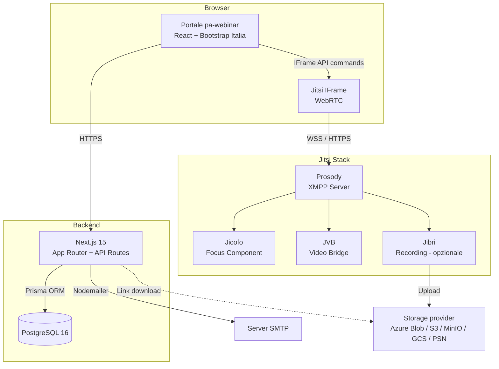
```mermaid
graph TD
    subgraph Browser
        UI["Portale pa-webinar<br/>React + Bootstrap Italia"]
        IFRAME["Jitsi IFrame<br/>WebRTC"]
        UI -- "IFrame API commands" --> IFRAME
    end

    subgraph Backend
        NEXTJS["Next.js 15<br/>App Router + API Routes"]
        DB[("PostgreSQL 16")]
    end

    subgraph Jitsi Stack
        PROSODY["Prosody<br/>XMPP Server"]
        JICOFO["Jicofo<br/>Focus Component"]
        JVB["JVB<br/>Video Bridge"]
        JIBRI["Jibri<br/>Recording - opzionale"]
        PROSODY --> JICOFO
        PROSODY --> JVB
        PROSODY --> JIBRI
    end

    SMTP["Server SMTP"]
    BLOB["Storage provider<br/>Azure Blob / S3 / MinIO / GCS / PSN"]

    UI -- "HTTPS" --> NEXTJS
    IFRAME -- "WSS / HTTPS" --> PROSODY
    NEXTJS -- "Prisma ORM" --> DB
    NEXTJS -- "Nodemailer" --> SMTP
    JIBRI -- "Upload" --> BLOB
    NEXTJS -. "Link download" .-> BLOB
```

Il browser carica due contesti separati: il portale (React) e l'iframe Jitsi (WebRTC). Il portale gestisce registrazione, Q&A e controlli; l'iframe gestisce audio/video. Le due parti comunicano tramite `JitsiMeetExternalAPI`.

---

## Stack tecnologico

| Componente | Tecnologia | Versione | Ruolo |
|---|---|---|---|
| Framework | Next.js (App Router) | 15.x | SSR, API routes, Server Components |
| Linguaggio | TypeScript | 5.x | Strict mode, tipizzazione completa |
| UI Kit | design-react-kit | 5.x | Componenti del design system .italia |
| CSS | Bootstrap Italia | 2.x | Stili, variabili CSS, griglia responsive |
| Video | Jitsi Meet | stable | Motore WebRTC via IFrame API |
| ORM | Prisma | 6.x | Accesso DB, migrazioni, type safety |
| Database | PostgreSQL | 16 | Dati eventi, registrazioni, Q&A, chat |
| Pub/Sub | Redis | 7+ | Real-time fan-out chat (cross-pod) |
| i18n | next-intl | latest | Localizzazione IT/EN, App Router |
| Email | Nodemailer | latest | Invio conferme e promemoria |
| Auth | jose | latest | Generazione e verifica JWT |
| Validazione | zod | latest | Schema validation, inferenza tipi |
| Container | Docker | multi-stage | Build di produzione ~205 MB |
| Orchestrazione | Kubernetes (AKS) | 1.29+ | Deploy, scaling, networking |
| Charts | Helm | 3.x | Templating manifest K8s |

---

## Componenti

### Portale eventi — Next.js

Il portale è un'applicazione Next.js 15 con App Router. Utilizza Server Components per default e Client Components solo dove serve interattività (form, Jitsi iframe, Q&A live).

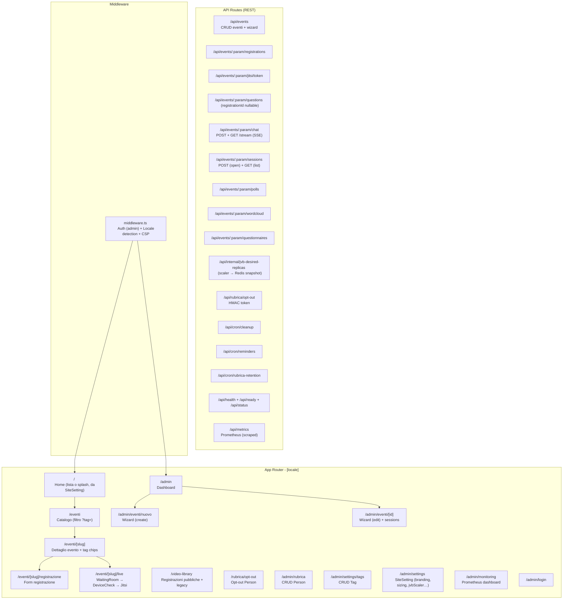
```mermaid
graph TD
    subgraph "App Router - [locale]"
        HOME["/ <br/> Home (lista o splash, da SiteSetting)"]
        EVENTS["/eventi <br/> Catalogo (filtro ?tag=)"]
        DETAIL["/eventi/[slug] <br/> Dettaglio evento + tag chips"]
        REG["/eventi/[slug]/registrazione <br/> Form registrazione"]
        LIVE["/eventi/[slug]/live <br/> WaitingRoom → DeviceCheck → Jitsi"]
        VIDLIB["/video-library <br/> Registrazioni pubbliche + legacy"]
        RUBRICA_OPTOUT["/rubrica/opt-out <br/> Opt-out Person"]
        ADMIN["/admin <br/> Dashboard"]
        ADMIN_NEW["/admin/eventi/nuovo <br/> Wizard (create)"]
        ADMIN_EDIT["/admin/eventi/[id] <br/> Wizard (edit) + sessions"]
        ADMIN_RUB["/admin/rubrica <br/> CRUD Person"]
        ADMIN_TAGS["/admin/settings/tags <br/> CRUD Tag"]
        ADMIN_SET["/admin/settings <br/> SiteSetting (branding, sizing, jvbScaler…)"]
        ADMIN_MON["/admin/monitoring <br/> Prometheus dashboard"]
        ADMIN_LOGIN["/admin/login"]
    end

    subgraph "API Routes (REST)"
        API_EVENTS["/api/events <br/> CRUD eventi + wizard"]
        API_REG["/api/events/:param/registrations"]
        API_JWT["/api/events/:param/jitsi/token"]
        API_QA["/api/events/:param/questions <br/> (registrationId nullable)"]
        API_CHAT["/api/events/:param/chat <br/> POST + GET /stream (SSE)"]
        API_SESS["/api/events/:param/sessions <br/> POST (open) + GET (list)"]
        API_POLLS["/api/events/:param/polls"]
        API_WC["/api/events/:param/wordcloud"]
        API_QNR["/api/events/:param/questionnaires"]
        API_SCALER["/api/internal/jvb-desired-replicas <br/> (scaler → Redis snapshot)"]
        API_OPTOUT["/api/rubrica/opt-out <br/> HMAC token"]
        API_CRON_CLEAN["/api/cron/cleanup"]
        API_CRON_REMIND["/api/cron/reminders"]
        API_CRON_RUB["/api/cron/rubrica-retention"]
        API_HEALTH["/api/health + /api/ready + /api/status"]
        API_METRICS["/api/metrics <br/> Prometheus (scraped)"]
    end

    subgraph "Middleware"
        MW["middleware.ts <br/> Auth (admin) + Locale detection + CSP"]
    end

    MW --> HOME
    MW --> ADMIN
    HOME --> EVENTS
    EVENTS --> DETAIL
    DETAIL --> REG
    DETAIL --> LIVE
    ADMIN --> ADMIN_NEW
    ADMIN --> ADMIN_EDIT
```

**Struttura interna delle librerie:**

| Directory | Contenuto |
|---|---|
| `lib/auth/` | Generazione JWT, verifica token moderatore, login admin |
| `lib/jitsi/` | Configurazione IFrame API, config overrides |
| `lib/email/` | Template email, invio con Nodemailer |
| `lib/ical/` | Generazione file .ics per eventi calendario |
| `lib/validation/` | Schema Zod per tutte le entità |
| `lib/crypto/` | Cifratura PII (AES-256-GCM) e hashing email (SHA-256) |
| `lib/persons/` | Identità cross-evento (rubrica): opt-out HMAC signed token, CRUD `Person` |
| `lib/jvb-sizing.ts` | Formula lineare di sizing JVB (senders/receivers per core) |
| `lib/jvb-snapshot.ts` | Reader del Redis snapshot `jvb:replicas:snapshot` scritto dallo scaler |
| `lib/rate-limit.ts` | Rate limiting in-memory per endpoint |
| `components/jitsi/` | JitsiRoom, ModeratorControls, RaisedHandsPanel (read-only per attendee, con approve-mic/video per moderator) |
| `components/live/` | WaitingRoom (front-door unificato), DeviceCheck (cam/mic toggle + chime test), ChatPanel, ReactionBar, PresentationTimer, WordCloud, AudioPlayer, LiveEventClient (Meet-style controls) |
| `components/admin/event-wizard/` | 5-step wizard per create + edit (WizardShell + 5 step components) |
| `components/qa/` | QuestionForm, QuestionList, QAPanel |
| `components/admin/` | Dashboard, form creazione, gestione evento |
| `components/layout/` | Header PA, footer, language switcher, skiplinks |
| `i18n/messages/` | File JSON con stringhe IT + 23 lingue EU |

### Jitsi Meet

Jitsi è il motore video. Non viene modificato a livello di codice sorgente: tutta la personalizzazione avviene tramite configurazione e IFrame API.

Lo stack Jitsi è composto da cinque (opzionalmente sei) componenti:

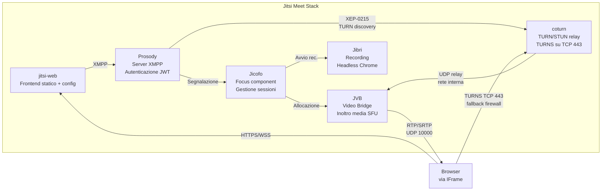
```mermaid
graph LR
    subgraph "Jitsi Meet Stack"
        WEB["jitsi-web<br/>Frontend statico + config"]
        PROSODY["Prosody<br/>Server XMPP<br/>Autenticazione JWT"]
        JICOFO["Jicofo<br/>Focus component<br/>Gestione sessioni"]
        JVB["JVB<br/>Video Bridge<br/>Inoltro media SFU"]
        COTURN["coturn<br/>TURN/STUN relay<br/>TURNS su TCP 443"]
        JIBRI["Jibri<br/>Recording<br/>Headless Chrome"]
    end

    CLIENT["Browser<br/>via IFrame"] -- "HTTPS/WSS" --> WEB
    WEB -- "XMPP" --> PROSODY
    PROSODY -- "Segnalazione" --> JICOFO
    PROSODY -- "XEP-0215<br/>TURN discovery" --> COTURN
    JICOFO -- "Allocazione" --> JVB
    JICOFO -- "Avvio rec." --> JIBRI
    JVB -- "RTP/SRTP<br/>UDP 10000" --> CLIENT
    CLIENT -- "TURNS TCP 443<br/>fallback firewall" --> COTURN
    COTURN -- "UDP relay<br/>rete interna" --> JVB
```

| Componente | Funzione |
|---|---|
| **jitsi-web** | Serve i file statici (JS, CSS) e la configurazione della room |
| **Prosody** | Server XMPP, gestisce autenticazione JWT, presence e discovery TURN (XEP-0215) |
| **Jicofo** | Componente focus: crea le conferenze, assegna JVB |
| **JVB** | Video Bridge (SFU): inoltra i flussi media tra i partecipanti |
| **coturn** | Server TURN/STUN: relay per client dietro firewall restrittivi (TURNS su TCP 443) |
| **Jibri** | Recording: cattura la sessione con headless Chrome, produce file video |

La comunicazione media ha due percorsi possibili:
- **Diretto** (UDP 10000): Browser → JVB. Migliore latenza, richiede porta UDP aperta sul client.
- **Relay** (TURNS TCP 443): Browser → coturn → JVB. Per client dietro firewall che bloccano UDP. Il browser scopre il TURN server via XEP-0215 e lo usa come fallback automatico.

### Chat in-app (Redis + SSE)

La chat durante gli eventi è **nostra** (in-app), non Jitsi XMPP. I motivi:

- **Persistenza**: i messaggi vivono in `chat_messages` (Postgres) invece che transitare su Prosody XMPP e scomparire a fine call. Utile per late-joiner, archivio post-evento, AI-summary.
- **Controllo**: rate-limit e moderazione server-side, soft-delete con audit trail.
- **Indipendenza**: niente contaminazione della configurazione Jitsi; la chat funziona anche quando Jitsi è embedded da istanza esterna.

Stack a tre livelli:

```
Client A ──POST /chat──► Next.js API ──INSERT──► PostgreSQL
                               │
                               └──PUBLISH chat:evt123──► Redis pub/sub
                                                              │
                                   ┌──────────────────────────┤ SUBSCRIBE
                                   ▼                          ▼
                          Pod #1 SSE /stream         Pod #2 SSE /stream
                                   │                          │
                                   ▼                          ▼
                              Client A, B                Client C, D
```

- **POST `/api/events/[param]/chat`** autentica il sender (moderator token / co-moderator / registration accessToken / guest-on-LIVE), persiste in Postgres, pubblica su Redis.
- **GET `/api/events/[param]/chat/stream`** apre un'SSE che legge dal subscriber Redis e rilancia ogni messaggio al browser. `EventSource` auto-reconnect + `since=<timestamp>` per backfill garantiscono ordinamento consistente su reconnect.
- **GET `/api/events/[param]/chat[?since=&limit=]`** per lo storico, usato al mount del panel e come backfill su reconnect.

Alternative valutate: ejabberd/XMPP (reinventare client web complicato), Matrix/Synapse (overkill, infra extra), Socket.IO + Redis (bundle client pesante), Centrifugo (dep esterna extra, maintainer russo — concerns governance PA). SSE+Redis è la scelta "minimal dep, massima auditabilità" per una PA che fa riuso.

**Trade-off**: serve scrivere ~200 righe di real-time noi (stream handler + subscriber lifecycle). Niente presence server-side out-of-the-box; per ora non serve — si fa con heartbeat HTTP se mai richiesta. A >5000 SSE simultanee per pod si aggiunge una replica (il fan-out Redis rende lo scale-out orizzontale gratis).

**Availability e HA**: il deploy di default è Redis **standalone** (1 pod, 50m/128Mi richiesti, no persistence). Su spot VM un'eviction = ~30-60s di fan-out gap; i messaggi continuano a essere persistiti in Postgres, quindi non si perdono — la chat live semplicemente non propaga in tempo reale durante il reschedule. `/api/status` riporta `outage` finché Redis non torna (non `standby`/`idle`): chat real-time è trattata come dipendenza richiesta, non opzionale. Per SLA più stretti, la roadmap prevede migrazione a **Valkey** (fork BSD-3 di Redis, gestito da Linux Foundation) con `architecture: replication` — 3× risorse per failover sub-secondo, giustificato solo quando si aggiungono feature critiche come distributed rate-limiting.

**Metriche esposte**:

| Sorgente | Metrica | Uso |
|---|---|---|
| App (prom-client) | `eventi_chat_messages_total{event_id}` | Counter messaggi persistiti per evento |
| App (prom-client) | `eventi_chat_sse_connections{event_id}` | Gauge subscriber attivi per pod/evento |
| Redis-exporter sidecar | `redis_connected_clients` | Pub + subscriber TCP aperti |
| Redis-exporter sidecar | `redis_memory_used_bytes` | Uso store (principalmente buffer pub/sub) |
| Redis-exporter sidecar | `redis_commands_processed_total` | Rate PUBLISH/SUBSCRIBE |
| Redis-exporter sidecar | `redis_pubsub_channels` | ≈ eventi LIVE con chat attiva |

L'admin dashboard (`/admin/monitoring`) mostra questi valori in una sezione dedicata "Chat in-app & Redis" con KPI istantanei + trend charts (memoria Redis, connessioni SSE). Prerequisito: `PROMETHEUS_URL` puntato a un Prometheus con ServiceMonitor Bitnami attivo.

### Database

Il database PostgreSQL contiene quattro entità principali con le relative relazioni:

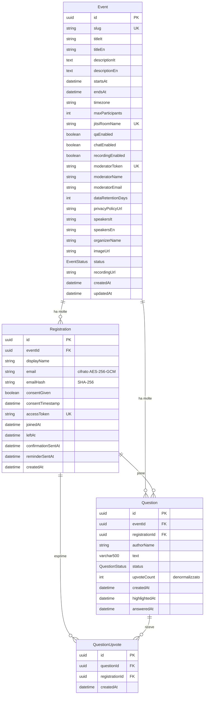
```mermaid
erDiagram
    Event ||--o{ Registration : "ha molte"
    Event ||--o{ Question : "ha molte"
    Registration ||--o{ Question : "pone"
    Registration ||--o{ QuestionUpvote : "esprime"
    Question ||--o{ QuestionUpvote : "riceve"

    Event {
        uuid id PK
        string slug UK
        string titleIt
        string titleEn
        text descriptionIt
        text descriptionEn
        datetime startsAt
        datetime endsAt
        string timezone
        int maxParticipants
        string jitsiRoomName UK
        boolean qaEnabled
        boolean chatEnabled
        boolean recordingEnabled
        string moderatorToken UK
        string moderatorName
        string moderatorEmail
        int dataRetentionDays
        string privacyPolicyUrl
        string speakersIt
        string speakersEn
        string organizerName
        string imageUrl
        EventStatus status
        string recordingUrl
        datetime createdAt
        datetime updatedAt
    }

    Registration {
        uuid id PK
        uuid eventId FK
        string displayName
        string email "cifrato AES-256-GCM"
        string emailHash "SHA-256"
        boolean consentGiven
        datetime consentTimestamp
        string accessToken UK
        datetime joinedAt
        datetime leftAt
        datetime confirmationSentAt
        datetime reminderSentAt
        datetime createdAt
    }

    Question {
        uuid id PK
        uuid eventId FK
        uuid registrationId FK
        string authorName
        varchar500 text
        QuestionStatus status
        int upvoteCount "denormalizzato"
        datetime createdAt
        datetime highlightedAt
        datetime answeredAt
    }

    QuestionUpvote {
        uuid id PK
        uuid questionId FK
        uuid registrationId FK
        datetime createdAt
    }
```

**Enum EventStatus:** `DRAFT` | `PUBLISHED` | `PROVISIONING` | `LIVE` | `IDLE` | `ENDED` | `ARCHIVED`

- `PROVISIONING` — il JVB è in allestimento (nodo in cold-start o pod in boot).
  Lo scaler solleva lo stato `jvbPreScaleMinutes` prima di `startsAt`.
- `IDLE` — evento già passato in `LIVE` almeno una volta ma senza partecipanti
  da ≥ `jvbInactiveGraceMinutes` (default 45 min); i JVB sono stati scalati a 0.
  Si può tornare in `LIVE` se qualcuno si riconnette entro il grace period
  dell'evento.

Vedi la sezione [JVB scaler / Event lifecycle](#jvb-scaler-ed-event-lifecycle) per la macchina a stati completa.

**Enum QuestionStatus:** `PENDING` | `HIGHLIGHTED` | `ANSWERED` | `DISMISSED`

**Vincoli notevoli:**

- `Registration` ha un vincolo unique composito su `(eventId, emailHash)`: ogni email può registrarsi una sola volta per evento
- `QuestionUpvote` ha un vincolo unique composito su `(questionId, registrationId)`: un partecipante può votare una domanda una sola volta
- `upvoteCount` su `Question` è denormalizzato per performance; viene aggiornato atomicamente con operazioni `increment`/`decrement`
- L'indice composto `(eventId, status, upvoteCount DESC)` su `Question` ottimizza il caricamento ordinato delle domande durante l'evento live
- `Question.registrationId` è **nullable** da v0.4.x: consente a guest (senza Registration) di porre domande quando l'evento permette l'accesso anonimo. In tal caso `authorName` è popolato col display name scelto dal guest.

### Entità aggiunte in v0.3.x / v0.4.x

Oltre alle quattro entità principali mostrate sopra, lo schema include modelli per le feature più recenti (elenco non esaustivo, vedi `app/prisma/schema.prisma`):

| Modello | Scopo | File |
|---|---|---|
| `Tag` + `EventTagLink` | Tassonomia editoriale: slug unico, nome multi-lingua (JSONB), colore, sort order. Filtri pubblici `/eventi?tag=<slug>` | `app/src/app/api/admin/tags/`, `app/src/app/[locale]/admin/settings/tags/` |
| `Person` | Identità cross-evento opt-in (rubrica). emailHash unico, opt-in esplicito separato, retention inactivity-based. Vedi [ADR-011](adr/011-person-rubrica.md) | `app/src/lib/persons/`, `app/src/app/api/admin/rubrica/` |
| `EventModerator` | Co-moderator multipli, ognuno con magic-link UUID indipendente, nome, email, revoca granulare | `app/src/app/api/events/[param]/moderators/` |
| `EventOrganizer` | Organizzatori/enti patrocinanti (display-only sulla pagina evento, no accesso sala) | `app/src/app/api/events/[param]/organizers/` |
| `EventInvitation` | Inviti pre-evento (speaker con pre-auth, guest con pre-registrazione) | `app/src/app/api/events/[param]/moderators/` |
| `ChatMessage` | Chat in-app persistita (sostituisce chat XMPP Jitsi). Postgres + Redis pub/sub + SSE | `app/src/app/api/events/[param]/chat/` |
| `Poll` + `PollVote` | Polls con risultati real-time, export CSV | `app/src/app/api/events/[param]/polls/` |
| `WordCloudRound` + `WordCloudSubmission` | Word cloud moderato per round | `app/src/app/api/events/[param]/wordcloud/` |
| `EventMaterial` | Materiali (link in v0.2, file in v0.5+) con storage provider agnostico | `app/src/app/api/events/[param]/materials/` |
| `CallSession` | Analytics lifecycle call (aperta a primo `videoConferenceJoined`, chiusa dallo scaler su `LIVE→IDLE` / `*→ENDED`). Vedi [CallSession lifecycle](#callsession-lifecycle) | `app/src/app/api/events/[param]/sessions/` |
| `QuestionTemplate` + `QuestionItem` + `EventQuestionnaire` + `QuestionnaireResponse` + `QuestionnaireAnswer` | Questionari pre/post evento, 5 tipi di item (single/multi/yes_no/likert/open_text) | `app/src/app/api/events/[param]/questionnaires/` |
| `EventFeedback` | Feedback post-evento (rating + commento) | `app/src/app/api/events/[param]/feedback/` |
| `OrphanRecording` | Recording Jibri senza evento di riferimento (es. room eliminata mentre Jibri registrava) | `app/src/app/api/admin/recordings/orphans/` |
| `EmailOutbox` | Coda email persistente con retry per SMTP degradation | `app/src/app/api/cron/email-outbox/` |

---

## Flussi principali

### Creazione evento — 5-step wizard

Dalla v0.4.x l'amministratore crea (e modifica) eventi tramite un **wizard a 5 step** con stato condiviso. Il form monolitico di v0.3 è rimasto solo come fallback interno alcuni script di test; tutte le UI admin passano dal wizard. I file sono in `app/src/components/admin/event-wizard/`.

| Step | File | Cosa copre |
|---|---|---|
| 1. Base | `step-1-base.tsx` | Titolo (multi-lingua), descrizione Markdown, cover image, date/ora/timezone, ricorrenza, tag (multi-select dal `Tag` model), waiting-room audio override, toggle parseTitleKicker |
| 2. Permessi | `step-2-permissions.tsx` | Matrice ruolo×feature (mic / cam / share screen / chat / Q&A / polls / reactions per ciascun ruolo), `autoStartRecording` |
| 3. Inviti | `step-3-invites.tsx` | Organizzatori (display-only), relatori (access grant con magic-link individuale via `EventModerator`), guest pre-registrati via RubricaPicker multi-select |
| 4. Contenuti | `step-4-content.tsx` | Materiali (link, file in futuro), preset Q&A, questionari pre/post evento (collegamento `QuestionTemplate` + domande ad-hoc) |
| 5. Revisione | `step-5-review.tsx` | GDPR / retention, diagramma di carico stimato (chiama `lib/jvb-sizing.ts`), privacy policy, pubblica-ora vs. salva-bozza |

Lo **stesso componente** è riusato in modalità `edit`: `WizardShell` accetta `mode: 'create' | 'edit'` e, in edit, seeda lo stato da `initialEvent` e sostituisce la POST con una PUT a `/api/events/:id` che fa il diff. La side-API per invitati/moderatori/organizzatori viene sincronizzata dopo la PUT.

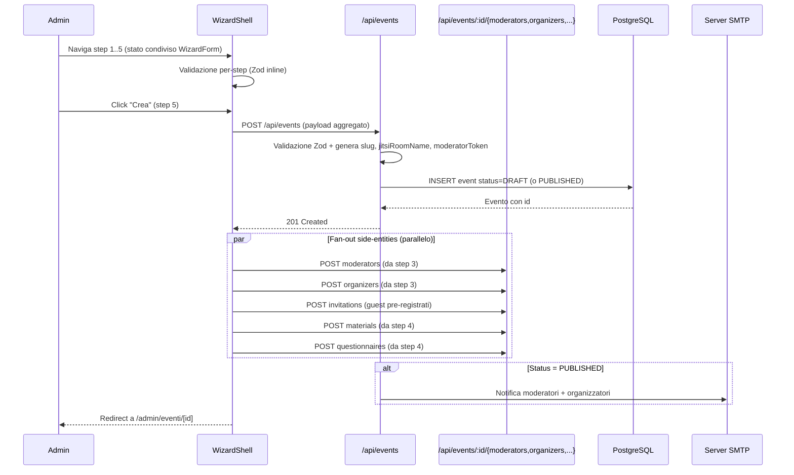
```mermaid
sequenceDiagram
    participant Admin
    participant Wizard as WizardShell
    participant API as /api/events
    participant SideAPI as /api/events/:id/{moderators,organizers,...}
    participant DB as PostgreSQL
    participant Email as Server SMTP

    Admin->>Wizard: Naviga step 1..5 (stato condiviso WizardForm)
    Wizard->>Wizard: Validazione per-step (Zod inline)
    Admin->>Wizard: Click "Crea" (step 5)
    Wizard->>API: POST /api/events (payload aggregato)
    API->>API: Validazione Zod + genera slug, jitsiRoomName, moderatorToken
    API->>DB: INSERT event status=DRAFT (o PUBLISHED)
    DB-->>API: Evento con id
    API-->>Wizard: 201 Created

    par Fan-out side-entities (parallelo)
        Wizard->>SideAPI: POST moderators (da step 3)
        Wizard->>SideAPI: POST organizers (da step 3)
        Wizard->>SideAPI: POST invitations (guest pre-registrati)
        Wizard->>SideAPI: POST materials (da step 4)
        Wizard->>SideAPI: POST questionnaires (da step 4)
    end

    alt Status = PUBLISHED
        API->>Email: Notifica moderatori + organizzatori
    end
    Wizard-->>Admin: Redirect a /admin/eventi/[id]
```

Il magic link per il moderatore ha la forma: `https://eventi.dominio.gov.it/it/eventi/{slug}/live?moderator={moderatorToken}`. Con co-moderatori (`EventModerator`), ciascuno riceve un proprio token indipendente.

#### Contenuti autorizzati — descrizioni markdown

Dalla v0.3.44 la `description` dell'evento è **Markdown** anziché plain text. L'admin UI (`app/src/components/ui/markdown.tsx`) offre editor con preview live; il rendering passa per `marked` + `isomorphic-dompurify` con:

- **Allowlist ristretto per tag**: `href` ammesso solo su `<a>`, `src` solo su ``/`<figure>`. Tag non ammessi (script, style, iframe, form, svg, embed) vengono strippati.
- **Rewrite anchor**: tutti i link aperti in nuova tab con `rel="noopener noreferrer"` (mitigazione reverse-tabnabbing).
- **URL schemes bloccati**: `javascript:`, `data:` e `vbscript:` rimossi da DOMPurify via `ALLOWED_URI_REGEXP` default.

La stessa stringa è riutilizzata server-side come `description` in iCal/SEO previa estrazione plain-text (niente tag HTML nei meta/calendar).

#### Event templates

Un `EventTemplate` (tabella singola, sola lettura UI) è un preset di feature flags e metadati. Le migration seedano tre template:

1. **Base** — Q&A + chat, no recording (webinar leggero).
2. **Avanzato** — + poll, word cloud, reactions (eventi interattivi).
3. **Completo** (migration `20260418100000_seed_complete_template`) — tutti i feature flag attivi + `participantsCanShareScreen=true` per workshop/demo.

Quando un admin crea un evento da template, i valori vengono pre-caricati nella form; può override manualmente prima di salvare.

### Registrazione partecipante

Il partecipante si registra tramite la pagina pubblica dell'evento. Il consenso GDPR è obbligatorio.

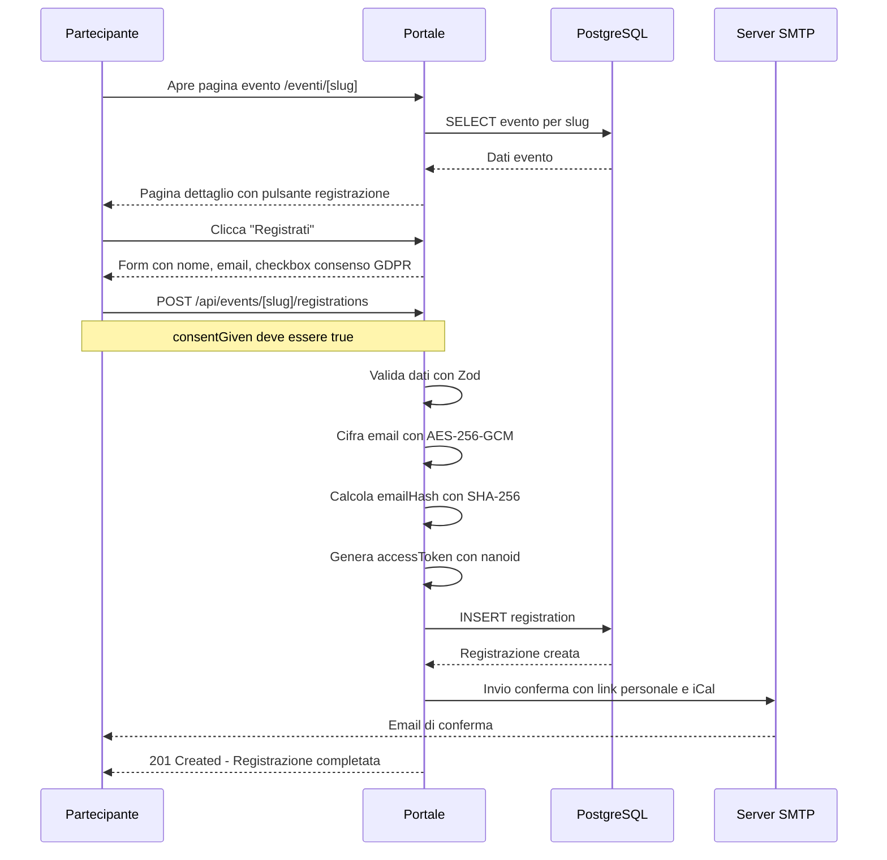
```mermaid
sequenceDiagram
    participant Partecipante
    participant Portale
    participant DB as PostgreSQL
    participant Email as Server SMTP

    Partecipante->>Portale: Apre pagina evento /eventi/[slug]
    Portale->>DB: SELECT evento per slug
    DB-->>Portale: Dati evento
    Portale-->>Partecipante: Pagina dettaglio con pulsante registrazione

    Partecipante->>Portale: Clicca "Registrati"
    Portale-->>Partecipante: Form con nome, email, checkbox consenso GDPR

    Partecipante->>Portale: POST /api/events/[slug]/registrations
    Note over Partecipante,Portale: consentGiven deve essere true

    Portale->>Portale: Valida dati con Zod
    Portale->>Portale: Cifra email con AES-256-GCM
    Portale->>Portale: Calcola emailHash con SHA-256
    Portale->>Portale: Genera accessToken con nanoid
    Portale->>DB: INSERT registration
    DB-->>Portale: Registrazione creata

    Portale->>Email: Invio conferma con link personale e iCal
    Email-->>Partecipante: Email di conferma

    Portale-->>Partecipante: 201 Created - Registrazione completata
```

Il link personale ha la forma: `https://eventi.dominio.gov.it/it/eventi/{slug}/live?token={accessToken}`

### Ingresso nella sala evento

All'ingresso, il portale valida il token del partecipante (o il token moderatore), genera un JWT per Jitsi e carica l'iframe.

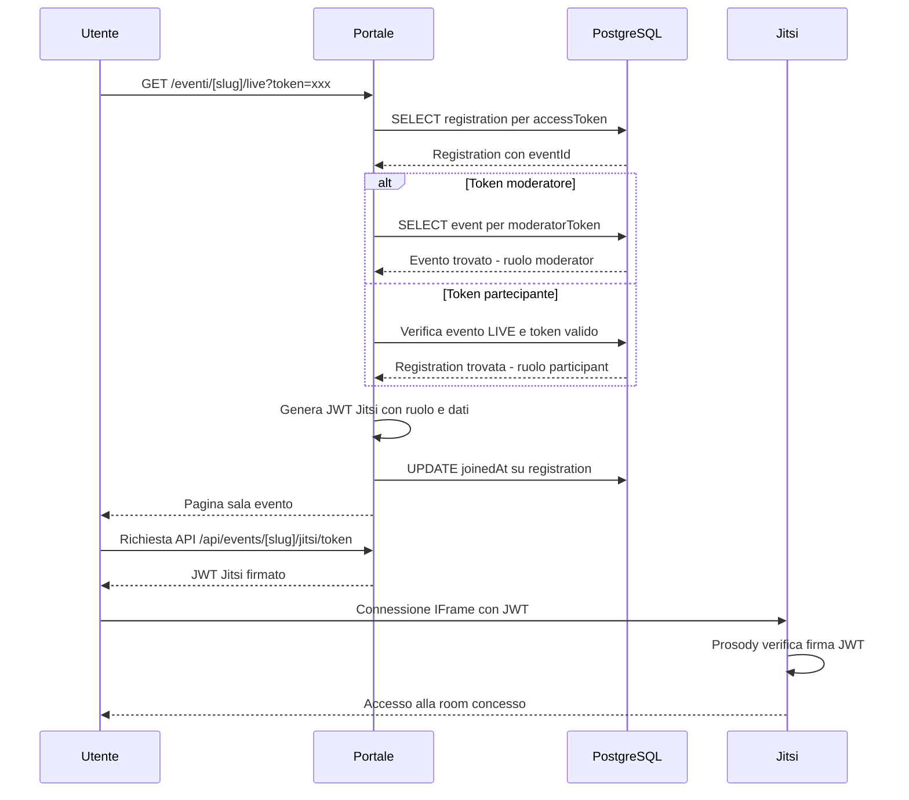
```mermaid
sequenceDiagram
    participant Utente
    participant Portale
    participant DB as PostgreSQL
    participant Jitsi

    Utente->>Portale: GET /eventi/[slug]/live?token=xxx
    Portale->>DB: SELECT registration per accessToken
    DB-->>Portale: Registration con eventId

    alt Token moderatore
        Portale->>DB: SELECT event per moderatorToken
        DB-->>Portale: Evento trovato - ruolo moderator
    else Token partecipante
        Portale->>DB: Verifica evento LIVE e token valido
        DB-->>Portale: Registration trovata - ruolo participant
    end

    Portale->>Portale: Genera JWT Jitsi con ruolo e dati
    Portale->>DB: UPDATE joinedAt su registration
    Portale-->>Utente: Pagina sala evento

    Utente->>Portale: Richiesta API /api/events/[slug]/jitsi/token
    Portale-->>Utente: JWT Jitsi firmato

    Utente->>Jitsi: Connessione IFrame con JWT
    Jitsi->>Jitsi: Prosody verifica firma JWT
    Jitsi-->>Utente: Accesso alla room concesso
```

### Sala d'attesa (waiting room unificata)

Dalla v0.4.x la waiting room è il **front-door unico** per ogni arrivo sulla live page, indipendentemente dal ruolo (guest, registered, moderator, speaker) e dallo status dell'evento (PUBLISHED / PROVISIONING / LIVE / ENDED). Sostituisce il fork precedente fra `GuestJoinForm`, `PreJoinScreen` e la waiting room scenario-specific. File: `app/src/components/live/waiting-room.tsx`.

Elementi consolidati in un'unica surface presentazionale:

- Cover image / hero con titolo e speakers
- Name input sempre editabile (prefillato se l'utente è già noto)
- Device check (`components/live/device-check.tsx`): anteprima cam, waveform mic, toggle cam/mic, chime test altoparlante
- Netiquette reminder (testo localizzato)
- Audio player ambientale durante l'attesa (optional, per-event override su `waitingRoomAudioUrl`)
- Countdown dinamico se `startsAt` è ancora in futuro
- Catch-up recording (se `tempRecordingUrl` è settato) per chi entra ad evento già iniziato
- Chat preview lato LIVE per dare "sense of presence"
- CTA primaria contestuale: entra / start (moderator) / watch recording / feedback

Tutta la logica di auth, fetch JWT e transizioni live resta nel parent `LiveEventClient`: la WaitingRoom è una surface pura che chiama due callback `onEnterLive(name, prefs)` e `onStartEvent()`.

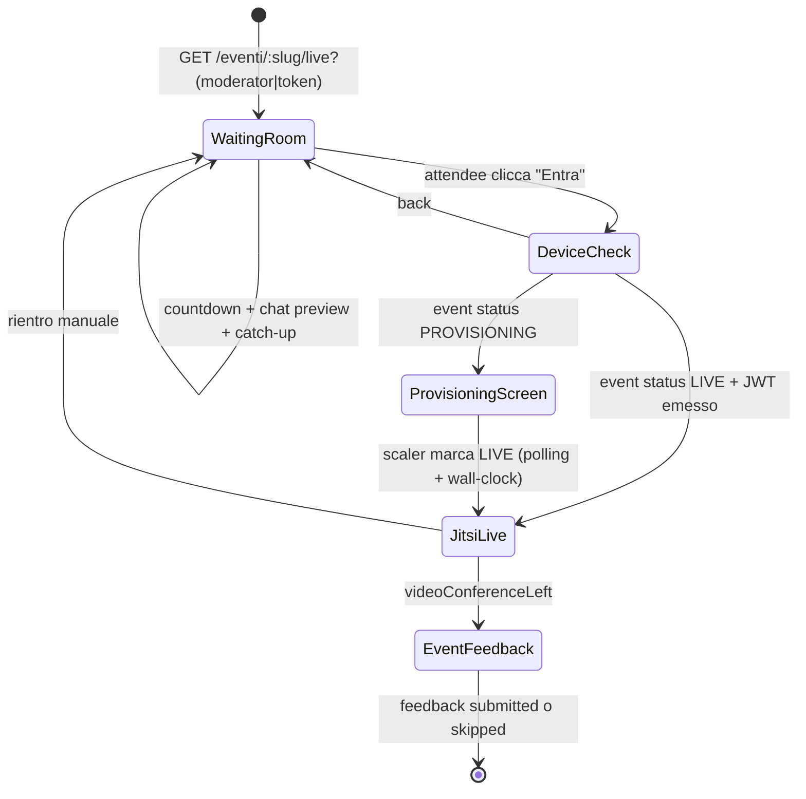
```mermaid
stateDiagram-v2
    [*] --> WaitingRoom: GET /eventi/:slug/live?(moderator|token)
    WaitingRoom --> WaitingRoom: countdown + chat preview + catch-up
    WaitingRoom --> DeviceCheck: attendee clicca "Entra"
    DeviceCheck --> WaitingRoom: back
    DeviceCheck --> ProvisioningScreen: event status PROVISIONING
    DeviceCheck --> JitsiLive: event status LIVE + JWT emesso
    ProvisioningScreen --> JitsiLive: scaler marca LIVE (polling + wall-clock)
    JitsiLive --> EventFeedback: videoConferenceLeft
    JitsiLive --> WaitingRoom: rientro manuale
    EventFeedback --> [*]: feedback submitted o skipped
```

La decisione su quale branch mostrare dipende dal wall-clock combinato con lo status:

- `status = PUBLISHED` e `startsAt` in futuro → countdown
- `status = PUBLISHED` e `startsAt` passato → "in arrivo" con spinner + chat preview
- `status = PROVISIONING` → `ProvisioningScreen` (anche se `startsAt` è futuro, la WaitingRoom prevale per mostrare il countdown — v0.4.x fix in commit `70d6a16`)
- `status = LIVE` → CTA "Entra" (subito device check, poi Jitsi)
- `status = IDLE` → "Evento in pausa" con re-entry
- `status = ENDED` → recording / Q&A archive / feedback form

### Q&A con upvote

Il sistema Q&A permette ai partecipanti di porre domande e votare quelle degli altri. Il moderatore gestisce lo stato delle domande.

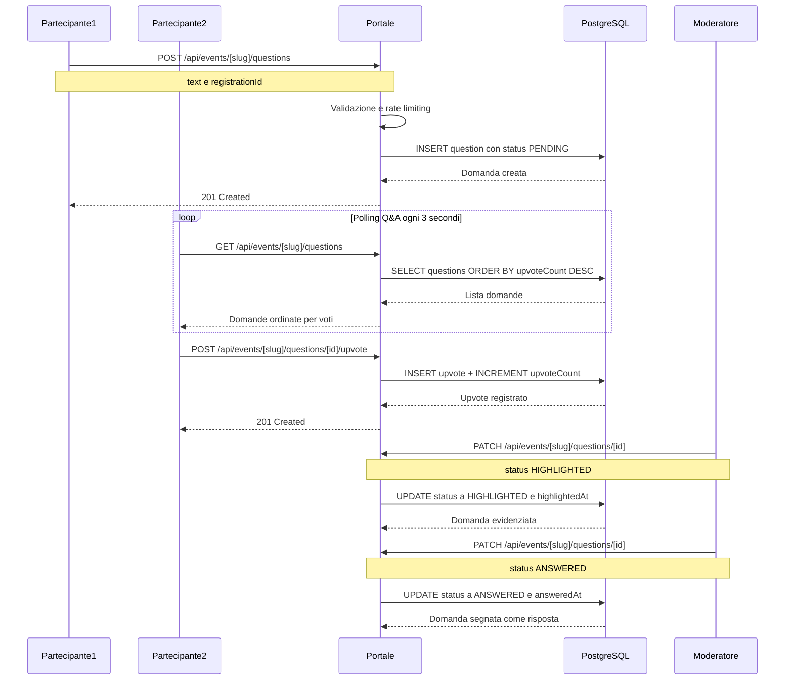
```mermaid
sequenceDiagram
    participant P1 as Partecipante1
    participant P2 as Partecipante2
    participant Portale
    participant DB as PostgreSQL
    participant Moderatore

    P1->>Portale: POST /api/events/[slug]/questions
    Note over P1,Portale: text e registrationId
    Portale->>Portale: Validazione e rate limiting
    Portale->>DB: INSERT question con status PENDING
    DB-->>Portale: Domanda creata
    Portale-->>P1: 201 Created

    loop Polling Q&A ogni 3 secondi
        P2->>Portale: GET /api/events/[slug]/questions
        Portale->>DB: SELECT questions ORDER BY upvoteCount DESC
        DB-->>Portale: Lista domande
        Portale-->>P2: Domande ordinate per voti
    end

    P2->>Portale: POST /api/events/[slug]/questions/[id]/upvote
    Portale->>DB: INSERT upvote + INCREMENT upvoteCount
    DB-->>Portale: Upvote registrato
    Portale-->>P2: 201 Created

    Moderatore->>Portale: PATCH /api/events/[slug]/questions/[id]
    Note over Moderatore,Portale: status HIGHLIGHTED
    Portale->>DB: UPDATE status a HIGHLIGHTED e highlightedAt
    DB-->>Portale: Domanda evidenziata

    Moderatore->>Portale: PATCH /api/events/[slug]/questions/[id]
    Note over Moderatore,Portale: status ANSWERED
    Portale->>DB: UPDATE status a ANSWERED e answeredAt
    DB-->>Portale: Domanda segnata come risposta
```

### Cleanup GDPR

Al termine del periodo di retention configurato per ciascun evento, un cron job elimina i dati personali dei partecipanti.

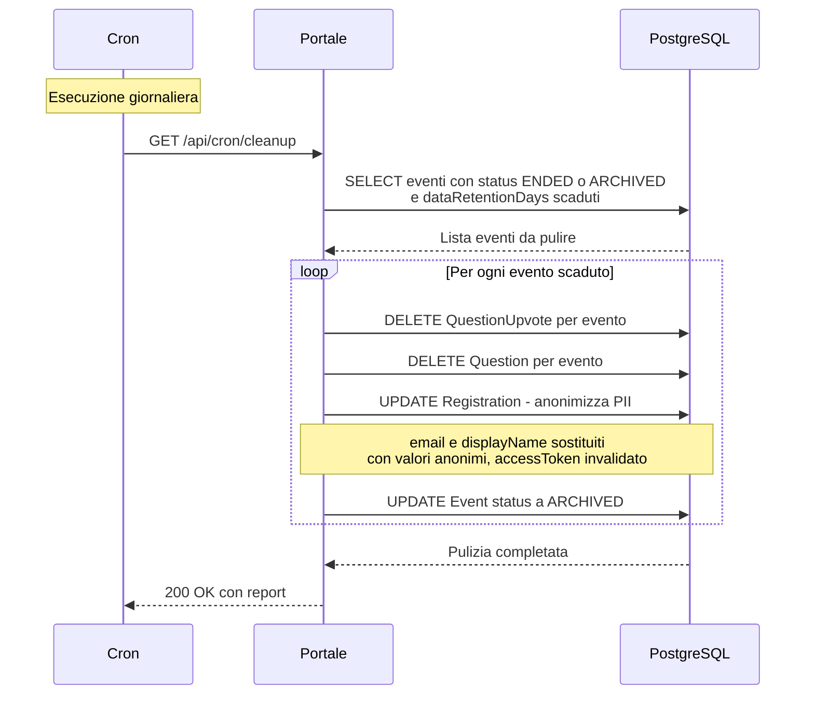
```mermaid
sequenceDiagram
    participant Cron
    participant Portale
    participant DB as PostgreSQL

    Note over Cron: Esecuzione giornaliera

    Cron->>Portale: GET /api/cron/cleanup
    Portale->>DB: SELECT eventi con status ENDED o ARCHIVED<br/>e dataRetentionDays scaduti
    DB-->>Portale: Lista eventi da pulire

    loop Per ogni evento scaduto
        Portale->>DB: DELETE QuestionUpvote per evento
        Portale->>DB: DELETE Question per evento
        Portale->>DB: UPDATE Registration - anonimizza PII
        Note over Portale,DB: email e displayName sostituiti<br/>con valori anonimi, accessToken invalidato
        Portale->>DB: UPDATE Event status a ARCHIVED
    end

    DB-->>Portale: Pulizia completata
    Portale-->>Cron: 200 OK con report
```

I dati anonimizzati (numero registrazioni, conteggi) vengono preservati per statistiche aggregate. L'email cifrata e il displayName vengono sovrascritti; l'emailHash viene mantenuto per impedire re-registrazioni a eventi archiviati.

---

## Integrazione Jitsi — IFrame API

### Perché IFrame API e non lib-jitsi-meet

| Criterio | IFrame API | lib-jitsi-meet |
|---|---|---|
| Complessità | Bassa: embed come iframe | Alta: gestire WebRTC direttamente |
| UI personalizzabile | Nascondi elementi nativi, sovrapponi i tuoi | Costruisci tutta la UI da zero |
| Aggiornamenti Jitsi | Trasparenti: l'iframe carica sempre la versione corrente | Richiede aggiornamento dipendenze |
| Manutenzione | Minima | Significativa |
| Controllo | Sufficiente per il nostro caso d'uso | Totale ma non necessario |

### Pattern di integrazione

Il componente `JitsiRoom` è l'unico punto di contatto con Jitsi. È un Client Component che:

1. Monta un `<div>` container
2. Istanzia `JitsiMeetExternalAPI` con configurazione centralizzata
3. Registra event listener per sincronizzare lo stato con React
4. Espone comandi tramite funzioni wrapper tipizzate
5. Chiama `dispose()` al unmount

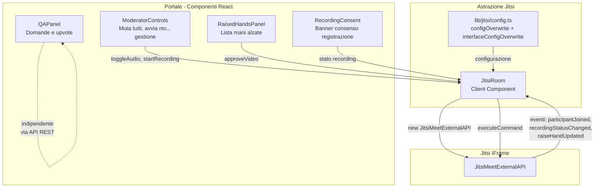
```mermaid
graph TD
    subgraph "Portale - Componenti React"
        MC["ModeratorControls<br/>Muta tutti, avvia rec., gestione"]
        RHP["RaisedHandsPanel<br/>Lista mani alzate"]
        QAP["QAPanel<br/>Domande e upvote"]
        RC["RecordingConsent<br/>Banner consenso registrazione"]
    end

    subgraph "Astrazione Jitsi"
        JR["JitsiRoom<br/>Client Component"]
        CFG["lib/jitsi/config.ts<br/>configOverwrite + interfaceConfigOverwrite"]
    end

    subgraph "Jitsi IFrame"
        IFRAME["JitsiMeetExternalAPI"]
    end

    MC -- "toggleAudio, startRecording" --> JR
    RHP -- "approveVideo" --> JR
    QAP -. "indipendente<br/>via API REST" .-> QAP
    RC -- "stato recording" --> JR

    JR -- "new JitsiMeetExternalAPI" --> IFRAME
    CFG -- "configurazione" --> JR

    IFRAME -- "eventi: participantJoined,<br/>recordingStatusChanged,<br/>raiseHandUpdated" --> JR
    JR -- "executeCommand" --> IFRAME
```

### Configurazione nascosta

La configurazione in `lib/jitsi/config.ts` disabilita la maggior parte della UI nativa di Jitsi:

- **Toolbar**: nascosta completamente (`TOOLBAR_BUTTONS: []` per partecipanti)
- **Header e watermark**: disabilitati
- **Chat nativa**: disabilitata (se chatEnabled è false)
- **Invite**: disabilitato
- **Filmstrip**: visibile solo per il moderatore se necessario
- **Pre-join page**: disabilitata (il portale gestisce l'autenticazione)

Il moderatore riceve una configurazione diversa con toolbar parzialmente visibile per funzioni non replicabili nel portale (es. selezione dispositivi).

---

## Autenticazione e autorizzazione

Il sistema ha tre flussi di autenticazione distinti, ognuno per un diverso livello di accesso.

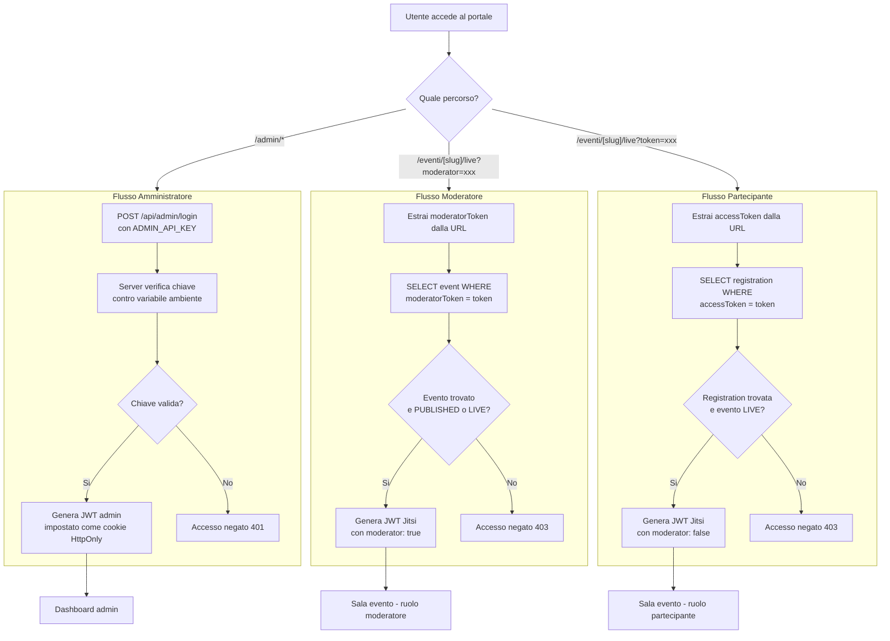
```mermaid
flowchart TD
    START["Utente accede al portale"] --> CHECK{"Quale percorso?"}

    CHECK -- "/admin/*" --> ADMIN_FLOW
    CHECK -- "/eventi/[slug]/live?moderator=xxx" --> MOD_FLOW
    CHECK -- "/eventi/[slug]/live?token=xxx" --> PART_FLOW

    subgraph ADMIN_FLOW["Flusso Amministratore"]
        A1["POST /api/admin/login<br/>con ADMIN_API_KEY"]
        A2["Server verifica chiave<br/>contro variabile ambiente"]
        A3{"Chiave valida?"}
        A4["Genera JWT admin<br/>impostato come cookie HttpOnly"]
        A5["Accesso negato 401"]
        A1 --> A2 --> A3
        A3 -- "Si" --> A4
        A3 -- "No" --> A5
    end

    subgraph MOD_FLOW["Flusso Moderatore"]
        M1["Estrai moderatorToken dalla URL"]
        M2["SELECT event WHERE<br/>moderatorToken = token"]
        M3{"Evento trovato<br/>e PUBLISHED o LIVE?"}
        M4["Genera JWT Jitsi<br/>con moderator: true"]
        M5["Accesso negato 403"]
        M1 --> M2 --> M3
        M3 -- "Si" --> M4
        M3 -- "No" --> M5
    end

    subgraph PART_FLOW["Flusso Partecipante"]
        P1["Estrai accessToken dalla URL"]
        P2["SELECT registration WHERE<br/>accessToken = token"]
        P3{"Registration trovata<br/>e evento LIVE?"}
        P4["Genera JWT Jitsi<br/>con moderator: false"]
        P5["Accesso negato 403"]
        P1 --> P2 --> P3
        P3 -- "Si" --> P4
        P3 -- "No" --> P5
    end

    A4 --> DASHBOARD["Dashboard admin"]
    M4 --> ROOM_MOD["Sala evento - ruolo moderatore"]
    P4 --> ROOM_PART["Sala evento - ruolo partecipante"]
```

### Struttura JWT Jitsi

Il JWT inviato a Jitsi per autenticare l'accesso alla room:

```json
{
  "context": {
    "user": {
      "name": "Mario Rossi",
      "email": "a]94f...c3b2"
    }
  },
  "room": "f47ac10b-58cc-4372-a567-0e02b2c3d479",
  "iss": "pa-webinar",
  "sub": "pa-webinar-app",
  "aud": "jitsi",
  "moderator": false,
  "exp": 1711305600
}
```

| Campo | Descrizione |
|---|---|
| `context.user.name` | Nome visualizzato del partecipante |
| `context.user.email` | Hash SHA-256 dell'email — Jitsi non riceve mai l'email in chiaro |
| `room` | UUID della room Jitsi, corrisponde a `jitsiRoomName` nel DB |
| `iss` | Issuer, configurato in `JITSI_JWT_ISSUER` |
| `sub` | Dominio/tenant Jitsi, configurato in `JITSI_JWT_SUBJECT` o derivato da `NEXT_PUBLIC_JITSI_DOMAIN` |
| `aud` | Audience, configurato in `JITSI_JWT_AUDIENCE` |
| `moderator` | `true` per moderatori, `false` per partecipanti |
| `exp` | Scadenza UNIX timestamp, durata breve (es. 4 ore) |

Il JWT è firmato con `JITSI_JWT_SECRET` (shared secret tra portale e Prosody). Prosody è configurato con `token` authentication per verificare la firma.

---

## Infrastruttura

### Cluster AKS

Il deployment avviene su un cluster Azure Kubernetes Service esistente del DTD.

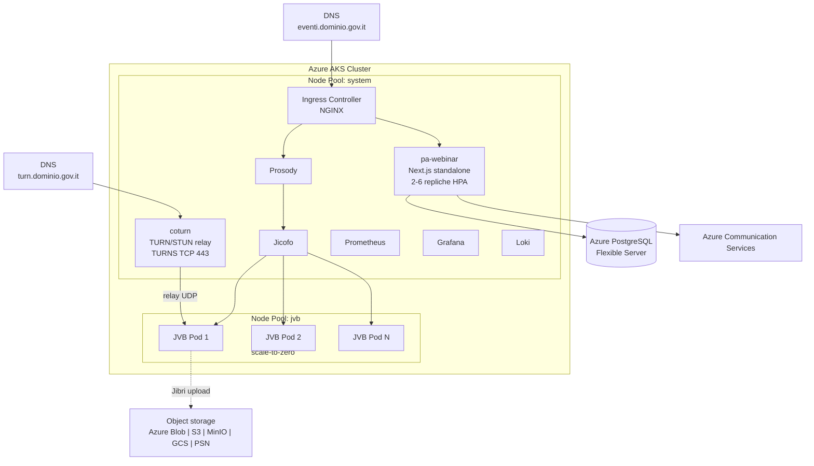
```mermaid
graph TD
    subgraph "Azure AKS Cluster"
        subgraph "Node Pool: system"
            INGRESS["Ingress Controller<br/>NGINX"]
            NEXTJS_POD["pa-webinar<br/>Next.js standalone<br/>2-6 repliche HPA"]
            PROSODY_POD["Prosody"]
            JICOFO_POD["Jicofo"]
            COTURN_POD["coturn<br/>TURN/STUN relay<br/>TURNS TCP 443"]
            PROM["Prometheus"]
            GRAF["Grafana"]
            LOKI["Loki"]
        end

        subgraph "Node Pool: jvb<br/>Standard_D4s_v3<br/>min=0 max=4<br/>scale-to-zero"
            JVB_POD1["JVB Pod 1"]
            JVB_POD2["JVB Pod 2"]
            JVB_PODN["JVB Pod N"]
        end
    end

    DNS["DNS<br/>eventi.dominio.gov.it"] --> INGRESS
    DNS_TURN["DNS<br/>turn.dominio.gov.it"] --> COTURN_POD
    INGRESS --> NEXTJS_POD
    INGRESS --> PROSODY_POD
    PROSODY_POD --> JICOFO_POD
    JICOFO_POD --> JVB_POD1
    JICOFO_POD --> JVB_POD2
    JICOFO_POD --> JVB_PODN
    COTURN_POD -- "relay UDP" --> JVB_POD1

    DB_EXT[("Azure PostgreSQL<br/>Flexible Server")]
    BLOB_EXT["Object storage<br/>Azure Blob | S3 | MinIO | GCS | PSN"]
    SMTP_EXT["Azure Communication Services"]

    NEXTJS_POD --> DB_EXT
    NEXTJS_POD --> SMTP_EXT
    JVB_POD1 -. "Jibri upload" .-> BLOB_EXT
```

### Live controls "Meet-style"

Dalla v0.4.x la sala live usa un pattern **controls floating + drawer** ispirato a Google Meet, unico per desktop e mobile con breakpoint a 992px. File principale: `app/src/components/live/live-event-client.tsx` (~1280 righe, hub di tutti i pannelli live).

- **Desktop ( ≥992px )**: floating control bar sopra il video Jitsi (in overlay), drawer laterale che scorre da destra con tabs Q&A / Chat / Polls / Materials / Participants. Il toolbar nativo Jitsi è disabilitato per attendee e permanente per moderator (`TOOLBAR_ALWAYS_VISIBLE=true` + timeout 20s, introdotto con commit `306dd20` dopo il feedback caffettino — i due bar non si sovrappongono più).
- **Mobile ( <992px )**: bottom tab strip (Bootstrap Italia `.it-footer-nav`-style) con 5 tab; il drawer diventa full-screen. Il tasto "condividi schermo" è rimosso dai mobile toolbar buttons (`mobileBaseToolbarButtons` / `mobileModeratorToolbarButtons` in `lib/jitsi/config.ts`): iOS Safari e la maggior parte dei browser Android vietano `getDisplayMedia()` in iframe, meglio nasconderlo che mostrare un errore opaco.

Componenti di supporto:

- **RaisedHandsPanel** (`app/src/components/jitsi/raised-hands-panel.tsx`): coda FIFO delle mani alzate con mapping `jitsi-participant-id → registration.displayName`. Il prop `readOnly` differenzia: moderatori vedono le action approve-mic / approve-video, attendee vedono solo l'ordine. Il panel è nascosto quando la coda è vuota (pure signal, no rumore).
- **ScreenshareBanner**: banner arancione slim che appare in top del video area quando un remoto inizia uno screenshare. Usa gli eventi Jitsi `screenSharingStatusChanged` + `participantLeft`; self-presenter è filtrato.
- **DeviceCheck**: riusato dalla waiting room ma anche esposto come "impostazioni rapide" tramite il toolbar del moderatore.

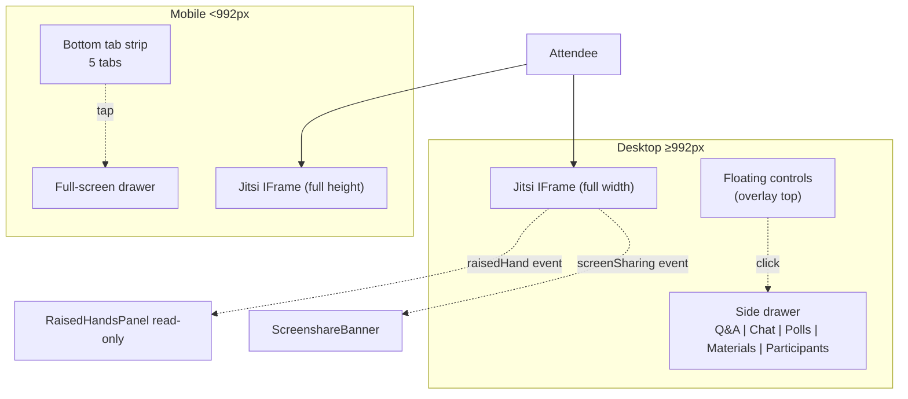
```mermaid
graph TD
    subgraph "Desktop ≥992px"
        VIDEO_D["Jitsi IFrame (full width)"]
        BAR_D["Floating controls<br/>(overlay top)"]
        DRAWER_D["Side drawer<br/>Q&A | Chat | Polls | Materials | Participants"]
    end

    subgraph "Mobile <992px"
        VIDEO_M["Jitsi IFrame (full height)"]
        TABS_M["Bottom tab strip<br/>5 tabs"]
        SHEET_M["Full-screen drawer"]
    end

    ATTENDEE[Attendee] --> VIDEO_D
    ATTENDEE --> VIDEO_M
    BAR_D -.click.-> DRAWER_D
    TABS_M -.tap.-> SHEET_M

    VIDEO_D -.raisedHand event.-> RH[RaisedHandsPanel read-only]
    VIDEO_D -.screenSharing event.-> SB[ScreenshareBanner]
```

### JVB scaler ed event lifecycle

Lo scaler è un `CronJob` Kubernetes che gira ogni 2 minuti (`jvbScaler.schedule`). È l'unico componente con la RBAC per leggere `spec.replicas` del deployment JVB e per fare `kubectl exec curl /colibri/stats` su ogni pod. File: `infra/helm/pa-webinar/templates/cronjob-jvb-scaler.yaml` + logica di stato in `app/src/app/api/internal/jvb-desired-replicas/route.ts`.

Ogni tick aggrega `/colibri/stats` attraverso **tutti i pod JVB** (senza questa aggregazione, un singolo hit al Service VIP reached solo un pod e gli altri apparivano vuoti) e scrive uno snapshot canonico su Redis come `jvb:replicas:snapshot` (TTL 300s). Le metriche pubbliche — `/api/status`, `/api/status/infrastructure`, `/api/metrics` — leggono questo snapshot come source of truth (file: `app/src/lib/jvb-snapshot.ts`).

```mermaid
graph LR
    subgraph "CronJob jvb-scaler (every 2 min)"
        A1[kubectl get deployment jvb] --> A2[list pods jvb]
        A2 --> A3[kubectl exec curl /colibri/stats<br/>on each pod]
        A3 --> A4[aggregate sum(participants, bitrate...)<br/>max(stress_level)]
        A4 --> A5[GET /api/internal/jvb-desired-replicas<br/>?current=&ready=&participants=&...]
    end

    A5 --> B1[Next.js API]
    B1 --> B2{Compute desired}
    B2 -->|lifecycle + sizing formula| B3[desired = ...]
    B3 --> B4[SETEX jvb:replicas:snapshot 300s ...]
    B3 --> B5[UPDATE Event.status<br/>transitions]
    B3 --> B6[closeOpenSessions]

    B4 --> C1[Redis]
    A5 -.response{desired, jibriDesired}.-> D1[kubectl scale deployment jvb]
    A5 -.response.-> D2[kubectl scale jibri]

    C1 --> E1[/api/status]
    C1 --> E2[/api/status/infrastructure]
    C1 --> E3[/api/metrics<br/>Prometheus gauges]
```

**Memory limit**: 256Mi (alzato da 32Mi in commit `3ac77dd` dopo OOMKill con ≥3 pod JVB: fan-out di `kubectl exec` + subshell bash supera il vecchio ceiling). Copre fino a ~6 pod (il default `jvbMaxReplicas`).

**Macchina a stati dell'evento** — lo scaler è l'unico che fa transizioni automatiche (le altre sono manuali via admin UI):

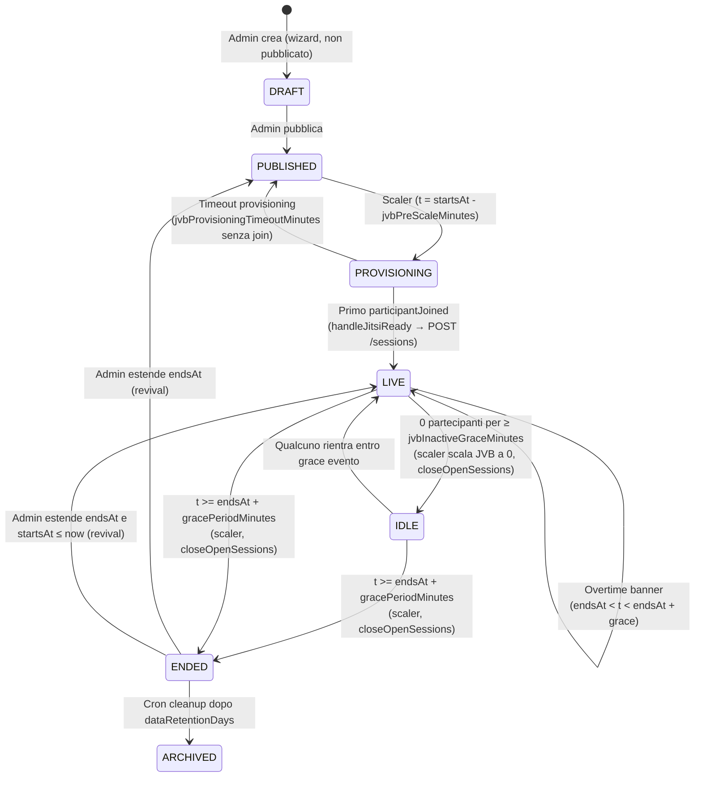
```mermaid
stateDiagram-v2
    [*] --> DRAFT: Admin crea (wizard, non pubblicato)
    DRAFT --> PUBLISHED: Admin pubblica
    PUBLISHED --> PROVISIONING: Scaler (t = startsAt - jvbPreScaleMinutes)
    PROVISIONING --> LIVE: Primo participantJoined<br/>(handleJitsiReady → POST /sessions)
    PROVISIONING --> PUBLISHED: Timeout provisioning<br/>(jvbProvisioningTimeoutMinutes senza join)
    LIVE --> IDLE: 0 partecipanti per ≥ jvbInactiveGraceMinutes<br/>(scaler scala JVB a 0, closeOpenSessions)
    IDLE --> LIVE: Qualcuno rientra entro grace evento
    IDLE --> ENDED: t >= endsAt + gracePeriodMinutes<br/>(scaler, closeOpenSessions)
    LIVE --> ENDED: t >= endsAt + gracePeriodMinutes<br/>(scaler, closeOpenSessions)
    LIVE --> LIVE: Overtime banner<br/>(endsAt < t < endsAt + grace)
    ENDED --> ARCHIVED: Cron cleanup dopo dataRetentionDays
    ENDED --> PUBLISHED: Admin estende endsAt (revival)
    ENDED --> LIVE: Admin estende endsAt e startsAt ≤ now (revival)
```

Parametri chiave (tutti `SiteSetting`, override per-evento su `Event` quando applicabile):

| Parametro | Ruolo nello stato |
|---|---|
| `jvbPreScaleMinutes` | Lookahead per `PUBLISHED → PROVISIONING` (default 10 min) |
| `jvbProvisioningTimeoutMinutes` | Timeout per `PROVISIONING → PUBLISHED` se nessuno joina (default 15 min) |
| `jvbInactiveGraceMinutes` | Soglia per `LIVE → IDLE` su inattività (default 45 min) |
| `eventGracePeriodMinutes` / `Event.gracePeriodMinutes` | Overtime post `endsAt` prima di `ENDED` (default 15 min; `-1` = mai auto-close) |

### CallSession lifecycle

Da v0.4.x ogni evento che genera traffico produce una `CallSession`, anche senza recording (prima di `233dd60` la riga veniva creata solo dal webhook Jibri):

1. **Apertura** — il live client, dopo il primo `videoConferenceJoined`, fa `POST /api/events/:slug/sessions` (endpoint idempotente: se esiste una sessione `endedAt IS NULL` ritorna quella). Rate-limited 30 req/min per IP, no auth (chi è arrivato nella live room di un evento LIVE/PROVISIONING è signal valido). File: `app/src/app/api/events/[param]/sessions/route.ts`.

2. **Aggiornamento live** — `peakParticipants` è aggiornato in-place dallo scaler ad ogni tick leggendo dall'aggregato cross-pod.

3. **Chiusura** — lo scaler chiude le sessioni ancora aperte in due transizioni dentro lo stesso `$transaction`:
   - `LIVE → IDLE` (inattività ≥ `jvbInactiveGraceMinutes`)
   - `* → ENDED` (`t >= endsAt + gracePeriodMinutes`)

   Chiusura = `endedAt = now()`, `duration = endedAt - startedAt`, `peakParticipants` copiato dal latest snapshot.

4. **Webhook recording** — il webhook Jibri esistente (`/api/webhooks/recording`) continua a creare la sua riga con `recordingUrl` / `recordingFileSize` / `recordingDuration`. Le due righe non vengono unite perché scoped a time-window diverse (apertura = lifetime room; webhook = span recording).

Le query analytics in `/admin/monitoring/analytics` joinano via CallSession e quindi ora vedono **tutti** gli eventi che hanno avuto traffico, non solo quelli registrati.

### Scaling

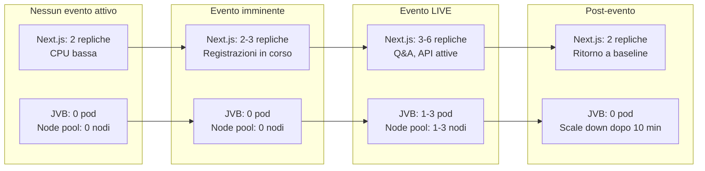
```mermaid
graph LR
    subgraph "Nessun evento attivo"
        S1_APP["Next.js: 2 repliche<br/>CPU bassa"]
        S1_JVB["JVB: 0 pod<br/>Node pool: 0 nodi"]
    end

    subgraph "Evento imminente"
        S2_APP["Next.js: 2-3 repliche<br/>Registrazioni in corso"]
        S2_JVB["JVB: 0 pod<br/>Node pool: 0 nodi"]
    end

    subgraph "Evento LIVE"
        S3_APP["Next.js: 3-6 repliche<br/>Q&A, API attive"]
        S3_JVB["JVB: 1-3 pod<br/>Node pool: 1-3 nodi"]
    end

    subgraph "Post-evento"
        S4_APP["Next.js: 2 repliche<br/>Ritorno a baseline"]
        S4_JVB["JVB: 0 pod<br/>Scale down dopo 10 min"]
    end

    S1_APP --> S2_APP --> S3_APP --> S4_APP
    S1_JVB --> S2_JVB --> S3_JVB --> S4_JVB
```

**Parametri di scaling:**

| Componente | Strategia | Min | Max | Trigger |
|---|---|---|---|---|
| Next.js | HPA | 2 | 6 | CPU > 70%, Memoria > 80% |
| JVB | Cluster Autoscaler | 0 | 4 | Pod pending su node pool `jvb` |
| PostgreSQL | Verticale | - | - | Azure Flexible Server auto-tuning |

#### Capacità e limiti: due metriche distinte

Nel valutare la capacità della piattaforma vanno tenute separate **due metriche** che hanno caratteristiche di scaling molto diverse:

| Metrica | Valore indicativo | Scaling | Limitato da |
|---|---|---|---|
| **Partecipanti per singolo evento** | ~200-300 (fino a ~500 con JVB generosamente dimensionato) | Verticale (JVB sizing) oppure orizzontale con **bridge cascading / Octo** | Un singolo JVB, perché Jicofo di default assegna una conferenza a un unico bridge |
| **Partecipanti totali concorrenti (cross-event)** | Limite dato dalle risorse del cluster | **Orizzontale**: ogni nuovo evento può essere assegnato a un JVB diverso (`min=0, max=4` nel chart di default, configurabile) | Segnalazione Prosody/Jicofo (migliaia di sessioni), banda di uplink del cluster |

In pratica:
- **Per alzare il tetto di un singolo evento** oltre ~300 partecipanti servono più CPU/RAM sul JVB, oppure l'abilitazione del **bridge cascading** (Octo), che distribuisce una stessa conferenza su più JVB. Cascading non è attivo di default in questo chart e richiede configurazione aggiuntiva su Jicofo e sui canali inter-bridge.
- **Per supportare più eventi contemporanei** è sufficiente aggiungere pod JVB: Jicofo bilancia automaticamente le nuove conferenze sui bridge disponibili. Con il default `max=4` il cluster autoscaler porta fino a 4 pod JVB su un node pool dedicato, sufficienti per ~4 eventi da ~300 partecipanti ciascuno in parallelo.

#### Bottleneck effettivi, in ordine di probabilità

1. **Jibri = 1 registrazione concorrente per pod.** Per N registrazioni parallele servono N Jibri. Questo è il primo limite che si incontra in scenari multi-evento con registrazione.
2. **Singolo meeting > ~500 partecipanti**: richiede cascading/Octo, non presente.
3. **Prosody XMPP**: comincia a soffrire intorno a qualche migliaio di sessioni concorrenti.
4. **Banda e egress cloud**: spesso il vero tetto economico prima di quello tecnico.

#### Validazione con carico reale

I numeri sopra sono riferimenti basati sulle metriche pubblicate dal progetto Jitsi e su hardware tipico (4 vCPU, 8 GB per JVB, 1 Gbps). Prima di pubblicare SLA o sizing per la propria infrastruttura è necessario un **test di carico reale** con [jitsi-meet-torture](https://github.com/jitsi/jitsi-meet-torture) sul proprio deployment. Il repository include script e istruzioni pronti all'uso in [`docs/LOAD-TESTING.md`](LOAD-TESTING.md) e [`scripts/load-test/`](../scripts/load-test/).

#### Dimensionamento dinamico (SiteSetting sizing calculator)

Fino alla v0.3.43 il numero di JVB per evento era derivato da una logica binaria basata su soglie hardcoded tarate su Azure `Standard_F16s_v2`. Questo legava il chart a un'assunzione di VM che non vale su altri cloud/VM families (AWS c6i, GCP n2, on-prem).

Dalla v0.3.44 il calcolo vive in `app/src/lib/jvb-sizing.ts` come **formula lineare configurabile** alimentata da 7 colonne `SiteSetting` (modificabili a caldo dall'admin UI `/admin/settings` → tab "Dimensionamento infra"):

```
senders   = maxParticipants × (expectedSenderRatioPct / 100)   [se videoEnabled]
receivers = maxParticipants − senders
coresNeeded = senders / sendersPerCore + receivers / receiversPerCore
replicas = clamp(1, maxReplicas, ceil(coresNeeded / cpuCoresPerPod))
```

| SiteSetting | Default (F16s_v2) | Ruolo |
|---|---|---|
| `jvbCpuCoresPerPod` | 16 | Core CPU per pod JVB |
| `jvbReceiversPerCore` | 18.75 | Partecipanti passivi sostenibili per core |
| `jvbSendersPerCore` | 3.125 | Partecipanti video-attivi sostenibili per core |
| `jvbMaxReplicas` | 6 | Cap superiore scaler (protezione cost) |
| `jibriCpuCoresPerPod` | 4 | Core per pod Jibri (F4s_v2) |
| `defaultSenderRatioPct` | 30 | % sender attesa default |
| `eventGracePeriodMinutes` | 15 | Grace period default post-endsAt |

**Per-event override** (tab "Programmazione" in create/edit event):

- `Event.expectedSenderRatioPct` — % sender per questo evento specifico (fallback sul default globale se `null`).
- `Event.gracePeriodMinutes` — minuti di grace (`0` chiusura netta, `-1` evento mai auto-chiuso, `5-240` grace custom).

Il cron scaler (`/api/internal/jvb-desired-replicas`, chiamato ogni 2 min) usa questa formula per calcolare `desiredReplicas` e applicarle via `kubectl scale` (job esterno) o tramite KEDA `ScaledObject` quando abilitato.

#### Soft event exit (grace period)

Scenario: un moderatore imposta `endsAt` alle 11:00 ma la sessione si protrae. Prima della v0.3.44 l'evento veniva marcato `ENDED` alle 11:00 netto e il JVB scaler riduceva i pod a 0, scollegando i partecipanti ancora in call.

Dalla v0.3.44:
1. Un evento `LIVE` con `endsAt` passato resta `LIVE` finché `now <= endsAt + gracePeriodMinutes`.
2. Un banner "overtime" (arancione, non invasivo) appare ai partecipanti con countdown: `closingIn 3m`, `closingNow`, o `indefinite` se `gracePeriodMinutes = -1`.
3. Superato il grace, l'evento passa `ENDED` e lo scaler libera le risorse.
4. Se il moderatore estende `endsAt` via edit-event (anche da `ENDED`), l'evento viene **revived** — torna `PUBLISHED` o `LIVE` (in base a `startsAt`) — senza ricreare risorse.

Implementazione:
- `app/src/app/api/internal/jvb-desired-replicas/route.ts` — logica lifecycle + `inOvertime` flag esposto.
- `app/src/components/live/live-event-client.tsx` → `OvertimeBanner` — polling wall-clock ogni 30s.
- `app/src/app/api/events/[param]/route.ts` PUT — logica di revival.

### Restrizione accesso Jitsi

In produzione, Jitsi Web non deve essere accessibile direttamente agli utenti. Deve essere raggiungibile solo tramite l'embedding IFrame del portale.

Configurazione Ingress NGINX per il sottodominio Jitsi:

```yaml
apiVersion: networking.k8s.io/v1
kind: Ingress
metadata:
  name: jitsi-web
  annotations:
    nginx.ingress.kubernetes.io/server-snippet: |
      # Blocca la welcome page e la creazione diretta di room
      location = / {
        return 403;
      }
      # Permetti solo IFrame API, BOSH e WebSocket
      location /external_api.js { }
      location /external_api.min.js { }
      location /http-bind { }
      location /xmpp-websocket { }
      location /css/ { }
      location /libs/ { }
      location /images/ { }
      location /static/ { }
      location /sounds/ { }
      location /lang/ { }
      # Permetti connessioni alle room (necessario per IFrame)
      location ~ ^/[a-zA-Z0-9-]+$ { }
      # Blocca tutto il resto
      location / {
        return 403;
      }
spec:
  tls:
    - hosts:
        - jitsi.eventi.dominio.gov.it
      secretName: jitsi-tls
  rules:
    - host: jitsi.eventi.dominio.gov.it
      http:
        paths:
          - path: /
            pathType: Prefix
            backend:
              service:
                name: jitsi-web
                port:
                  number: 80
```

In sviluppo locale, Jitsi è esposto su `https://localhost:8443` per comodità.

### Monitoraggio

Lo stack di monitoraggio è quello già presente nel cluster DTD:

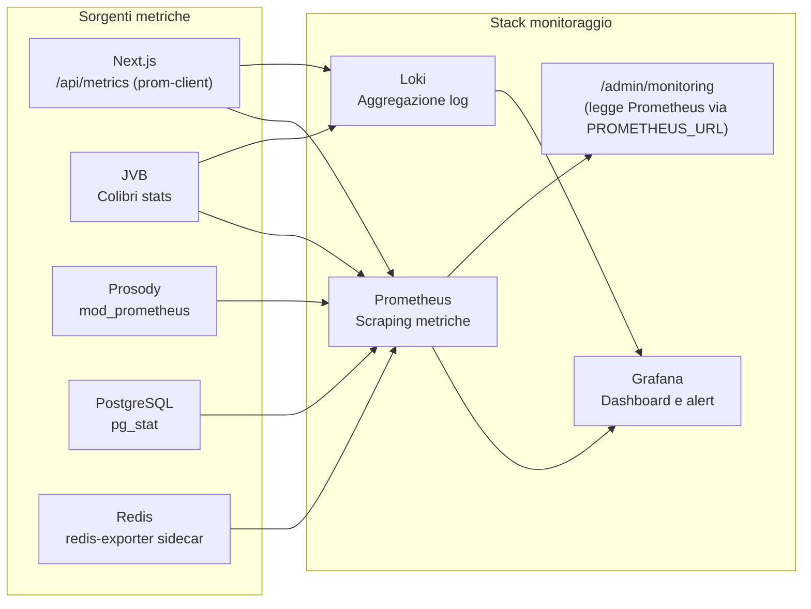
```mermaid
graph LR
    subgraph "Sorgenti metriche"
        APP["Next.js<br/>/api/metrics (prom-client)"]
        JVB_M["JVB<br/>Colibri stats"]
        PROSODY_M["Prosody<br/>mod_prometheus"]
        PG["PostgreSQL<br/>pg_stat"]
        REDIS_M["Redis<br/>redis-exporter sidecar"]
    end

    subgraph "Stack monitoraggio"
        PROM["Prometheus<br/>Scraping metriche"]
        LOKI["Loki<br/>Aggregazione log"]
        GRAF["Grafana<br/>Dashboard e alert"]
        ADMIN["/admin/monitoring<br/>(legge Prometheus via PROMETHEUS_URL)"]
    end

    APP --> PROM
    JVB_M --> PROM
    PROSODY_M --> PROM
    PG --> PROM
    REDIS_M --> PROM

    APP --> LOKI
    JVB_M --> LOKI

    PROM --> GRAF
    PROM --> ADMIN
    LOKI --> GRAF
```

**Health endpoint:**

| Endpoint | Probe K8s | Verifica |
|---|---|---|
| `/api/health` | Liveness | DB raggiungibile (`SELECT 1`). Se fallisce, K8s riavvia il pod |
| `/api/ready` | Readiness + Startup | Compatibilità schema DB via query ORM Prisma. Se fallisce, K8s rimuove il pod dal Service (niente 500 agli utenti) |
| `/api/status` | — (dashboard) | Stato completo: DB, Jitsi, SMTP, JVB, metriche |

La separazione liveness/readiness è importante: un pod con schema DB incompatibile (migration mancante) è un pod sano che non deve servire traffico. La readiness probe lo rileva, ma il pod non viene ucciso inutilmente.

**Metriche chiave monitorate:**

| Metrica | Sorgente | Soglia alert |
|---|---|---|
| Partecipanti attivi per room | JVB Colibri | > 250 (warning), > 290 (critical) |
| CPU JVB | Kubernetes metrics | > 80% sustained per 5 min |
| Latenza API portale (p95) | Next.js custom metrics | > 500ms |
| Errori 5xx | Ingress access log | > 5/min |
| Connessioni DB attive | pg_stat_activity | > 80% pool |
| Rate registrazioni | Application log | > 100/min (possibile abuso) |
| Spazio disco recording | Provider storage (Azure Blob / S3 / MinIO metrics) | > 80% quota |
| SSE chat per pod | `eventi_chat_sse_connections` | > 300 (scala app) |
| Memoria Redis | `redis_memory_used_bytes` | > 80% del limit del pod |
| Redis raggiungibile | `/api/status` probe | `outage` → chat fan-out broken |

---

## Postprod AI pipeline

Dalla v0.5.0, le registrazioni Jibri sono opzionalmente arricchite da
una pipeline di post-produzione che produce trascrizione, sintesi e
traduzioni. Tutta la pipeline gira **in-cluster** sul node pool GPU
dedicato — niente API esterne, niente egress dati. Documentazione
completa in [`docs/POSTPROD.md`](POSTPROD.md).

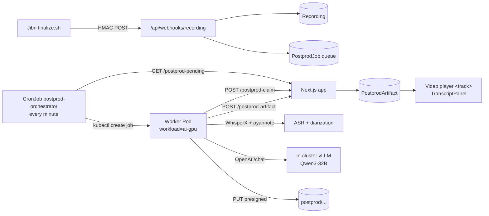
```mermaid
graph LR
    JIBRI[Jibri finalize.sh] -->|HMAC POST| WH["/api/webhooks/recording"]
    WH --> REC[(Recording)]
    WH --> QJ[(PostprodJob queue)]
    ORCH[CronJob postprod-orchestrator<br/>every minute] -->|GET /postprod-pending| API[Next.js app]
    ORCH -->|kubectl create job| WORKER[Worker Pod<br/>workload=ai-gpu]
    WORKER -->|POST /postprod-claim| API
    WORKER -->|WhisperX + pyannote| ASR[ASR + diarization]
    WORKER -->|OpenAI /chat| VLLM[in-cluster vLLM<br/>Qwen3-32B]
    WORKER -->|PUT presigned| STORE[(postprod/...)]
    WORKER -->|POST /postprod-artifact| API
    API --> ART[(PostprodArtifact)]
    ART --> PLAYER[Video player &lt;track&gt;<br/>TranscriptPanel]
```

| Component | Tipo | Node pool |
|---|---|---|
| postprod-orchestrator | CronJob (1 min) | app pool |
| postprod-reclaim / -retention | CronJob | app pool |
| postprod-worker | Job one-shot | `workload=ai-gpu` |
| vLLM | Deployment (out-of-chart) | `workload=ai-gpu` |

La queue è Postgres-outbox (claim atomico con `FOR UPDATE SKIP
LOCKED`, lease + backoff esponenziale, idempotency-key SHA-256
deterministica) — stesso pattern di `EmailOutbox`. Lo scaling
on-demand del GPU pool è ottenuto con `kubectl create job --from=cronjob`
sul template `postprod-worker` (suspended): replica del pattern dello
scaler JVB.

I modelli aggiunti allo schema (`prisma/schema.prisma`):

| Modello | Scopo |
|---|---|
| `Recording` | Lifecycle post-prod, 1:1 con `CallSession` |
| `PostprodJob` | Coda di job tipizzati (TRANSCRIBE / SUMMARIZE / TRANSLATE / SUBTITLE) con dependency graph |
| `PostprodArtifact` | Una riga per blob prodotto, unique `(recordingId, type, language)` |
| `Speaker` | Diarization label → Person (rubrica) o free-text |

GDPR / AI Act:
- Base giuridica Art. 6.1.b per trascrizione/sintesi (esecuzione
  contratto). Voice cloning resta esplicitamente fuori scope
  (Art. 9 → richiede DPIA dedicata).
- Ogni artefatto ha `isSynthetic=true` (AI Act Art. 50). La UI
  pubblica espone un badge "AI-generated content" sul TranscriptPanel.
- Retention configurabile in `SiteSetting.aiArtifactRetentionDays`
  oppure per-recording via `Recording.retentionUntil`. Cron
  `postprod-retention` daily.

## Sicurezza

Riepilogo delle misure di sicurezza implementate:

| Area | Misura | Dettaglio |
|---|---|---|
| **Trasporto** | TLS ovunque | cert-manager + Let's Encrypt, HTTPS e WSS |
| **Autenticazione Jitsi** | JWT event-scoped | Token a breve scadenza, firmato con shared secret |
| **Autenticazione admin** | API key + JWT cookie | Cookie HttpOnly, Secure, SameSite=Strict |
| **Autenticazione moderatore** | Magic link UUID | Token unico per evento, verificato server-side |
| **Autorizzazione** | Middleware Next.js | Controllo su tutte le route `/admin/*` e API protette |
| **PII a riposo** | AES-256-GCM | Email cifrata a livello applicativo prima del salvataggio |
| **Minimizzazione dati** | Solo nome + email | Nessun dato aggiuntivo raccolto dai partecipanti |
| **Consenso GDPR** | Checkbox esplicita | Non pre-selezionata, timestamp registrato, link privacy obbligatorio |
| **Retention** | Configurabile per evento | Cron job giornaliero elimina PII dopo scadenza |
| **CSP** | Content-Security-Policy | Frame-src limitato al dominio Jitsi |
| **Rate limiting** | In-memory per IP | Su endpoint registrazione e Q&A |
| **CSRF** | Validazione origin/referer | Su tutte le mutation API |
| **Secrets** | Variabili d'ambiente | Nessun secret nel codice; gestiti via K8s Secrets |
| **Accesso Jitsi** | Ingress restriction | Blocco accesso diretto, solo IFrame API permesso |
| **Font e asset** | Self-hosted | Nessun CDN esterno, nessun tracking |
| **Cookie** | Solo funzionali | Nessun cookie di marketing o analytics |
| **Log** | No PII nei log | Retention log 30 giorni, nessun logging IP applicativo |

---

## Monitoring & Observability

### Stack di monitoraggio

Il progetto supporta un'integrazione completa con lo stack Prometheus/Grafana/Alertmanager.

### Livelli di integrazione

| Livello | Requisiti | Funzionalità |
|---------|-----------|--------------|
| **Base** | Nessuno | Status page con probe HTTP, JVB Colibri stats |
| **Metriche** | `ServiceMonitor` abilitato | Prometheus scraping, Grafana dashboard |
| **Alerting** | `PrometheusRule` abilitato | 8 regole di alert pre-configurate |
| **Monitoring UI** | `PROMETHEUS_URL` configurato | Dashboard admin con grafici real-time, sparkline nella status page |
| **Grafana** | `grafanaDashboard` abilitato | Dashboard importata automaticamente via sidecar |

### Metriche applicative

L'app espone 14 metriche custom tramite `prom-client`:
- **HTTP**: `http_request_duration_seconds` (histogram), `http_requests_total` (counter)
- **Eventi**: `eventi_active_events`, `eventi_events_total`, `eventi_registrations_total`, `eventi_questions_total`, `eventi_jitsi_tokens_issued_total`
- **JVB**: `eventi_jvb_participants`, `eventi_jvb_conferences`, `eventi_jvb_stress_level`, `eventi_jvb_scaling_events_total`
- **Lifecycle**: `eventi_event_participants_total` (histogram), `eventi_event_duration_seconds` (histogram)

### PromQL Proxy

L'app espone un endpoint interno `POST /api/admin/metrics/query` (protetto da autenticazione admin) che funge da proxy verso Prometheus. Questo permette alla dashboard admin di mostrare grafici storici senza esporre Prometheus al browser. La status page pubblica accede a query predefinite tramite `GET /api/status/metrics`.

### Alerting

8 regole PrometheusRule pre-configurate: `PaWebinarDown`, `PaWebinarHighLatency`, `PaWebinarHighErrorRate`, `PaWebinarDatabaseDown`, `JvbHighStress`, `JvbScalingStuck`, `JibriUnavailable`, `HighEventLoopLag`.

### Grafana Dashboard

Dashboard JSON importabile in `infra/grafana/pa-webinar-dashboard.json` con 5 sezioni: Overview, Application Performance, JVB/Jitsi, Infrastructure, Events Lifecycle. Auto-importabile via Helm ConfigMap con sidecar Grafana.
