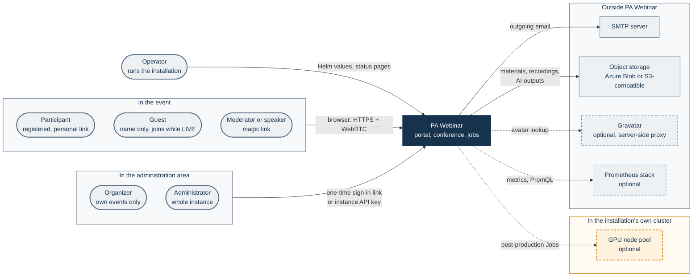
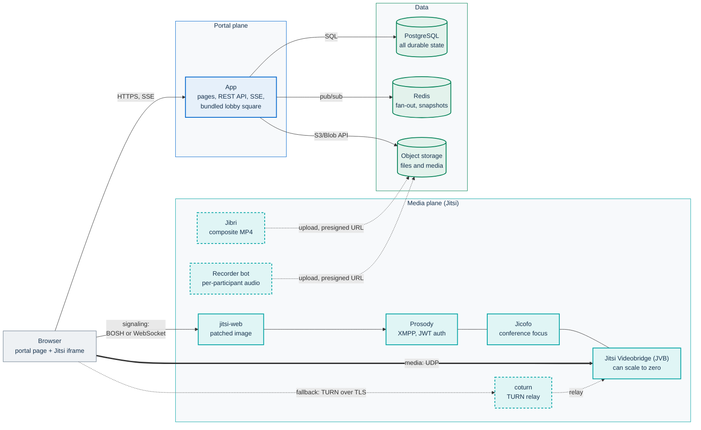
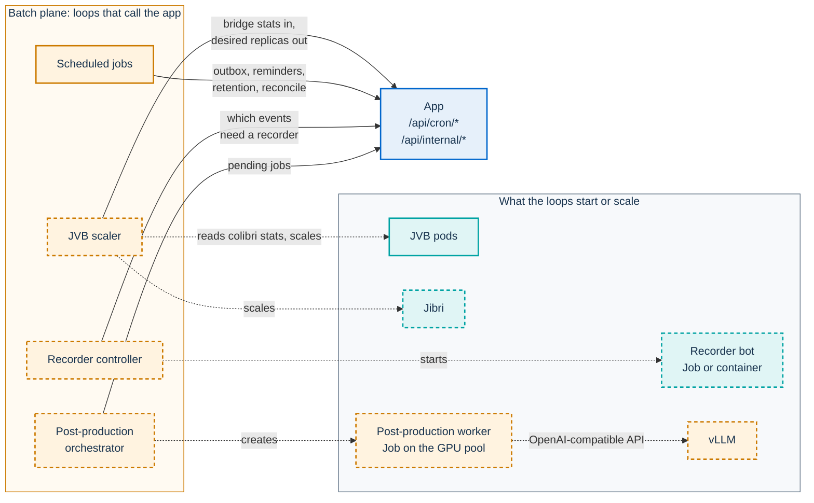
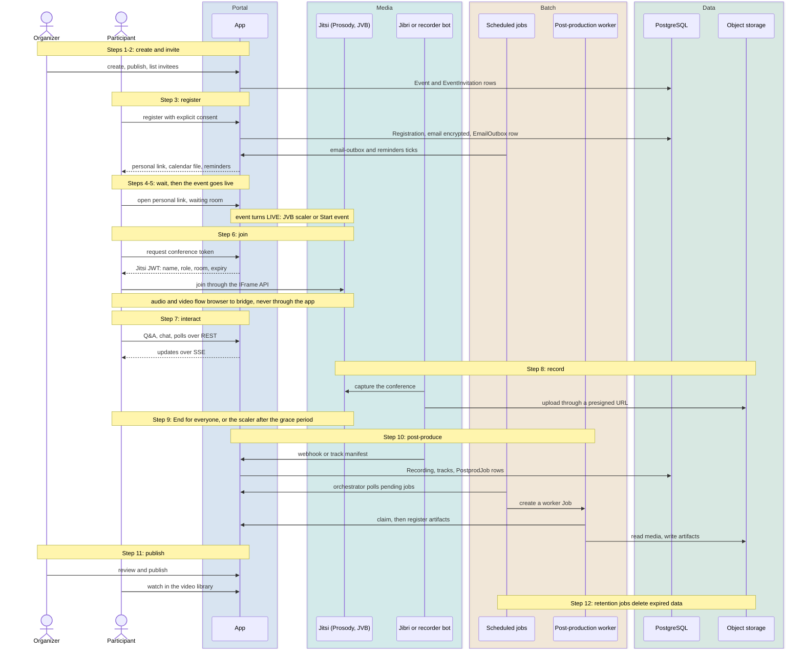

# Architecture

PA Webinar is an open-source platform for public events of public administrations (PAs): webinars, presentations and open meetings. A Next.js portal built on the .italia design system handles everything around the call, from registration and the waiting room to live interaction and the recap. Jitsi Meet, embedded through its IFrame API, carries the audio and video. Optional components record events and turn recordings into transcripts, subtitles, summaries and dubbed audio. The AI models for that work run inside the installation's own cluster.

This page is the map. It shows the parts, how they connect and where each concept is explained in depth.

## How to read this page

- Each section gives the shape of one concept and ends with a link to the page that owns it. Owner pages go into detail. This page does not.
- Colors are the same on every diagram. Blue is the portal, teal the media plane (Jitsi), green data, amber batch work, and gray people and systems outside PA Webinar. Dark navy is PA Webinar as a whole, in the context diagram only. A dashed border means optional, off by default.
- Running an installation (upgrades, monitoring, troubleshooting) is covered by the operations pages linked from [Deploying with Helm](DEPLOYMENT.md). Choosing and sizing a platform is covered in [Installing PA Webinar](install/README.md).
- Terms such as *seat*, *named grant* or *the square* are defined in the [glossary](GLOSSARY.md).

## System context

| Actor | How they get in | What they reach |
|---|---|---|
| Participant | The personal link sent after registration | The waiting room and live room of one event, then its recap |
| Guest | Their typed name, while the event is `LIVE`, after the event's join password if one is set. Scheduled events admit guests only while the site setting **Guest access enabled** is on (the default). Instant calls always admit them, and guests can wait there from `PROVISIONING` | The live room of one event |
| Moderator or speaker | The event's moderator link or a personal magic link (named grant) | Running one event. Speakers get full audio and video, with no moderation powers |
| Organizer | A one-time sign-in link sent by email (staff role `ORGANIZER`) | The administration area, limited to the events they own |
| Administrator | A one-time sign-in link (staff role `ADMIN`) or the instance API key (`ADMIN_API_KEY`) | The whole instance: settings, every event, the address book and the **GDPR audit** log |
| Operator | Helm values and cluster access, plus the status and infrastructure pages | The installation itself |

There is **no external identity provider**, no user account and no personal password. The only password is an optional per-event join password that guests type before entering. Participants have a registration token, moderators and speakers have magic links, staff have one-time sign-in links, and the instance key exists for first access, emergencies and automation. A token identifies a *seat*, not a person. The credentials, their lifetimes and their revocation are covered in [Identity, access and tokens](architecture/identity-and-access.md).

Systems around the portal:

- **SMTP server** for every outgoing email, sent through a persistent outbox ([Email and calendar](architecture/email.md), [SMTP settings](configuration/email.md)).
- **Object storage**, Azure Blob or any S3-compatible service, for materials, recordings, audio tracks and AI outputs ([Object storage](configuration/storage.md)).
- **A GPU node pool in the installation's own cluster**, optional, for AI post-production ([AI post-production](POSTPROD.md)).
- **Gravatar**, optional and off by default (`gravatarEnabled` in `app/prisma/schema.prisma`). The server queries it through the `/api/avatar` proxy, so participants' browsers never contact it.
- **A Prometheus stack**, optional. It scrapes `/api/metrics`, and the app queries it through `PROMETHEUS_URL` ([Monitoring and health](operations/monitoring.md)).

## Building blocks

The first diagram is the component map: what serves a request, and where media and files flow.

The second diagram shows the batch plane's control loops. Each loop asks the app what should exist, then starts or scales it in the cluster. Every batch component reaches the app over plain HTTP on its in-cluster Service (`pa-webinar.internalUrl` in the chart's `templates/_helpers.tpl`; `http://app:3000` in Compose), authenticated with a machine key.

The components that the loops start call the app back: Jibri and the recorder bot for upload URLs and to report finished media, and the worker to claim jobs, report progress and register artifacts. [What crosses each boundary](#what-crosses-each-boundary) lists these calls and how each is authenticated.

In the table, the "Default" column gives the chart default from `infra/helm/pa-webinar/values.yaml`. Images published under `ghcr.io/italia/` are named without that prefix.

| Component | Responsibility | How it runs | Built by | Default | Owner page |
|---|---|---|---|---|---|
| Portal app (`pa-webinar`) | Pages, REST API, SSE streams, Jitsi token minting and the endpoints that scheduled work calls | Deployment with an HPA. Compose service `app` | `release.yml` on version tags, `dev.yml` as `:dev` | On | [API surface](architecture/api.md) |
| Migration image (`pa-webinar:<tag>-migrate`) | Runs `prisma migrate deploy` before the app starts | initContainer `db-migrate` of the app Deployment. Compose service `db-migrate` (profile `setup`) | Same workflows. It is the `builder` stage of the same `Dockerfile` | On | [Data model](architecture/data-model.md), [Upgrades](operations/upgrades.md) |
| Lobby square (`lobby/`) | The Phaser 2D square that people can step into from the waiting room | Workspace package `@pa-webinar/lobby`, compiled into the app bundle | Part of the app image | Offered unless the waiting-room engine is `CLASSIC` (`waitingRoomEngine`, site-wide with a per-event override) | [Waiting room](architecture/waiting-room.md) |
| Patched jitsi-web (`pa-webinar-jitsi-web`) | The Jitsi Meet web front end, patched where no configuration point exists | `jitsi-meet.web.image` in the subchart. Compose runs the stock `jitsi/web` | `jitsi-web.yml` | On | [Jitsi integration](architecture/jitsi-integration.md), [ADR-017](adr/017-patched-jitsi-web-image.md) |
| Prosody, Jicofo, Jitsi Videobridge (JVB) | XMPP signaling and JWT authentication, conference focus, and selective forwarding of media | The jitsi-contrib `jitsi-meet` subchart, or an external Jitsi (`jitsi.enabled: false`) | Upstream images | On | [Jitsi integration](architecture/jitsi-integration.md), [Scaling](architecture/scaling.md) |
| coturn | TURN/TURNS relay for networks that block UDP | `jitsi-meet.coturn` in the subchart | Upstream | Off | [TURN](INFRASTRUCTURE.md#turn), [DEPLOYMENT](DEPLOYMENT.md#coturn-turn-and-turns) |
| Jibri | Composite MP4 recording of the conference | `jitsi-meet.jibri` in the subchart, with the finalize script from a chart ConfigMap | Upstream | Off | [Recording](architecture/recording.md) |
| PostgreSQL | All durable application state | Bitnami subchart, or external (`postgresql.enabled: false`) | Upstream | On | [Data model](architecture/data-model.md) |
| Redis | Pub/sub fan-out, the JVB snapshot and square presence | Bitnami subchart, standalone with no persistence, or external | Upstream | On | [Live interaction](architecture/live-interaction.md) |
| Object storage | Materials, recordings, audio tracks and AI outputs | External service: Azure Blob or S3-compatible | n/a | Configured per installation | [Object storage](configuration/storage.md) |
| Recorder bot (`pa-webinar-recorder`) | Joins as a receive-only client and saves one audio track per participant. It is invisible to participants only when the hidden Prosody domain is configured (`recorder.hiddenDomain`); otherwise it appears under a reserved name | A Job from the suspended CronJob template `recorder`. In Compose, a container started through the Docker socket | `dev.yml` (`:dev`) | Off (`recorder.enabled`) | [Recording](architecture/recording.md), [recorder README](../infra/recorder/README.md) |
| Recorder controller (`pa-webinar-recorder-controller`) | Keeps one recorder running per `LIVE` event that has recording, AI transcription and per-participant recording all enabled | Deployment. Compose service (profile `recorder`) | `dev.yml` (`:dev`) | Off (follows `recorder.enabled`) | [Recording](architecture/recording.md), [controller README](../infra/recorder-controller/README.md) |
| JVB scaler | Aggregates bridge statistics, drives automatic event status changes and scales JVB and Jibri | CronJob running `kubectl` | Upstream kubectl image | Off (`jvbScaler.enabled`, which also needs `jitsi.mode: full`) | [Scaling](architecture/scaling.md), [Running the JVB scaler](operations/jvb-scaler.md) |
| Scheduled jobs | Email outbox, reminders, GDPR cleanup, address-book retention, recording reconciliation and post-production housekeeping | CronJobs calling `/api/cron/*`. The Compose `cron` service calls a subset | Upstream curl image | Core jobs on | [Scheduled and background jobs](architecture/background-jobs.md) |
| Post-production orchestrator | Turns queued post-production jobs into worker Jobs | CronJob running `kubectl` | Upstream kubectl image | Off (`postprod.enabled`) | [AI post-production](POSTPROD.md) |
| Post-production worker (`pa-webinar-postprod-worker`) | Transcription, diarization, subtitles, summaries, translations and dubbing | A Job on the GPU node pool, from a suspended CronJob template | `dev.yml` (`:dev`) | Off | [AI post-production](POSTPROD.md), [worker README](../infra/ai/worker/README.md) |
| vLLM | OpenAI-compatible LLM server for summaries and translations | A GPU Deployment that the chart does not render | Upstream | Not installed by the chart | [AI post-production](POSTPROD.md) |
| Service inventory | A per-installation CycloneDX 1.6 document listing the software and the operated services, shown at `/service-inventory` | A JSON document at `SERVICE_INVENTORY_URL`, either an `http(s)` URL or a path under the app's `public/` folder | Generated per installation. The reference generator is in `infra/service-inventory/azure/` | Placeholder page while unset | [Service inventory](SERVICE-INVENTORY.md) |
| Monitoring add-ons | ServiceMonitor, alert rules and the Grafana dashboard | `metrics.*` in the chart | n/a | Off | [Monitoring and health](operations/monitoring.md) |

The workflows are described in [CI, images and releases](development/ci-and-release.md). The Helm keys are in [Deploying with Helm](DEPLOYMENT.md).

### Inside the portal

The portal is a single Next.js App Router application under `app/`. Pages are Server Components by default, and Client Components are used only where the browser must act, for example the Jitsi embed, the live panels and forms. There are no Server Actions: every mutation is a route handler in `app/src/app/api/**/route.ts`, validated with Zod.

| Surface | Internal paths | Who uses it |
|---|---|---|
| Public pages | `/`, `/events`, `/events/[slug]`, `/events/[slug]/registration`, `/calendar`, `/video-library`, `/status`, `/service-inventory`, `/changelog`, `/privacy/my-data` | Anyone |
| Waiting room and live room | `/events/[slug]/live` | Participants, guests, moderators, speakers |
| Administration area | `/admin/**` (events, sign-ups, recordings, publications, address book, settings, monitoring, infrastructure) | Organizers and administrators. A moderator link also opens the management page of its own event |
| Event API | `/api/events/[param]/**` | The portal's own pages, authenticated per route |
| Staff and administration API | `/api/admin/**`, `/api/staff/**` | The administration area |
| Machine API | `/api/cron/**`, `/api/internal/**`, `/api/webhooks/recording` | Scheduled jobs, the scaler, the recorder, Jibri, the post-production worker |
| Probes and telemetry | `/api/health`, `/api/ready`, `/api/status`, `/api/metrics` | Kubernetes, status pages, Prometheus |

The paths above are internal paths, and they are in English. The URL a visitor sees is localized through the `pathnames` map in `app/src/i18n/routing.ts`: the same page is `/it/eventi/<slug>` in Italian and `/en/events/<slug>` in English. The middleware at `app/src/middleware.ts` does three things: it resolves the locale, keeps the administration area behind a staff session, and sets the security headers, including the CSP. It does not run on `/api/*`, so every route handler authenticates its own caller. See [API surface](architecture/api.md), [Languages and localization](architecture/i18n.md) and [Security architecture](architecture/security.md).

## Where it runs

- **Kubernetes with the Helm chart** is the only production target, from single-node k3s on one VM to managed clusters with dedicated node pools. The profiles (`simple`, `standard`, `full`) are sets of values over the same chart. Capabilities that need a cluster exist only here: bridge scale-to-zero on a dedicated node pool, CronJobs, recorder and post-production Jobs, and External Secrets.
- **Docker Compose** is the development stack. It runs the app, PostgreSQL, Redis, the Jitsi stack, Mailpit as a local mail catcher, a `cron` service that calls a subset of the scheduled endpoints and, behind the optional `recorder` profile, the recorder controller. It has no bridge scale-to-zero and no AI post-production, and it is not meant for events.

To choose a platform and install it, read [Installing PA Webinar](install/README.md) and the guide for your platform; the network design, firewall and TURN are in the [Infrastructure reference](INFRASTRUCTURE.md). To install and configure the chart, read [Deploying with Helm](DEPLOYMENT.md). What runs locally compared with a cluster is covered in [Local development](DEVELOPMENT.md).

## Three planes and what crosses between them

PA Webinar is split into planes that fail, scale and are secured independently:

- **The portal (control) plane** is the app. It decides who may enter, holds all state and runs every live-interaction feature.
- **The media plane** is Jitsi. It carries audio and video, and knows nothing about registrations or events beyond a room name and a signed token.
- **The batch plane** is scheduled and on-demand work: email delivery, retention, bridge scaling, recorder orchestration and AI post-production.

### Two contexts in one browser tab

The browser holds two separate contexts, linked only by `JitsiMeetExternalAPI`:

- **The portal page** (React). It holds the waiting room, the control bar and the drawer with Q&A, chat, polls and materials. Before the iframe exists, the waiting room's device check uses the camera and microphone from this page.
- **The Jitsi iframe**, served from the conference host. In the live room it owns the camera, the microphone and WebRTC.

The two exchange nothing except IFrame API commands and events. `JitsiRoom` (`app/src/components/jitsi/jitsi-room.tsx`) is the only place that creates the API object, and it disposes of it on unmount. This boundary explains a key design choice: Q&A, chat, polls and the word cloud are portal features stored in PostgreSQL, not Jitsi features carried over XMPP ([ADR-005](adr/005-live-interaction-in-portal.md)). Reactions follow the site setting `reactionsMode`: by default (`NATIVE`) they use Jitsi's own reaction button and are not stored, and with the app's reaction bar (`CUSTOM`) they are portal data too.

### What crosses each boundary

| Boundary | What crosses | How it is protected | Owner page |
|---|---|---|---|
| Portal to media, through the browser | A Jitsi JWT minted by `/api/events/[param]/jitsi/token`. It carries the display name, avatar URL, role, room and expiry, and never an email address | HS256 with `JITSI_JWT_SECRET`. Prosody checks the signature, issuer and audience, and rejects everything else | [Identity, access and tokens](architecture/identity-and-access.md) |
| Portal page to Jitsi iframe | IFrame API commands and events | Browser same-tab messaging only | [Jitsi integration](architecture/jitsi-integration.md) |
| Media to portal: capacity | `/colibri/stats` read from every JVB pod by the scaler, then sent as one aggregate, in the query string of `GET /api/internal/jvb-desired-replicas`. The result is kept in Redis as `jvb:replicas:snapshot` | `x-api-key` with `CRON_API_KEY`. Namespaced RBAC for `kubectl` | [Scaling](architecture/scaling.md) |
| Media to portal: recordings | Jibri gets a presigned URL from `/api/internal/recording-upload-url`, uploads, then calls `/api/webhooks/recording`. The recorder bot claims its session, uploads tracks through presigned URLs and posts `/api/internal/multitrack-manifest` | Bearer `CRON_API_KEY` for the webhook, plus an HMAC signature when `RECORDING_WEBHOOK_SECRET` is set. `x-api-key` for the internal routes | [Recording](architecture/recording.md) |
| Batch to portal | Scheduled jobs call `/api/cron/*`. The scaler, recorder controller, orchestrator and worker call `/api/internal/*` | `x-api-key` with `CRON_API_KEY` | [Scheduled and background jobs](architecture/background-jobs.md), [Security architecture](architecture/security.md) |
| Batch to cluster | The scaler scales JVB and Jibri, and the orchestrator can scale vLLM (`postprod.vllm.autoscale`). The orchestrator and the recorder controller create Jobs from suspended CronJob templates. In Docker Compose, the controller starts containers through the Docker socket | Namespaced Roles, one ServiceAccount per component | [Background jobs](architecture/background-jobs.md), [Recording](architecture/recording.md) |

**Media never touches the app.** Audio and video go from the browser straight to a Jitsi Videobridge over the bridge's UDP port (`jitsi-meet.jvb.UDPPort` in `values.yaml`, 10000). Where coturn is deployed, clients behind networks that block UDP fall back to it over TURN over TLS on TCP 443, the subchart's TURNS listener ([Media path](architecture/jitsi-integration.md#media-path)). Recordings and tracks go from Jibri or the recorder bot straight to object storage through short-lived presigned URLs, and players stream them from storage. The app only issues URLs and keeps metadata. So a busy event loads the bridges, not the portal ([Scaling the media plane](architecture/scaling.md)).

**Jitsi is not forked.** Everything uses supported extension points: the IFrame API, configuration (`configOverwrite` and the Helm values that generate `config.js`), the portal-signed JWT and a Prosody module that sets room affiliation from the token (loaded by the Compose stack only). [How PA Webinar extends Jitsi Meet](architecture/jitsi-integration.md) details each one. Three points stand out:

- **One modified Jitsi artifact.** The patched `jitsi/web` image (`infra/jitsi-web-patched/`, [ADR-017](adr/017-patched-jitsi-web-image.md)) fixes three defects that have no configuration point. Its patches locate code by shape, not by minified identifiers, and the image build fails when one no longer applies to a new Jitsi release.
- **One exception to "no `lib-jitsi-meet`".** The recorder bot runs `lib-jitsi-meet` in headless Chrome. It runs outside the portal, which talks to Jitsi only through the IFrame API.
- **A public host that is not usable on its own.** The conference host is public, because browsers load the iframe and signaling from it. Browsers still need a portal-signed token to join, and the host's root can redirect to the portal ([Restricting direct access to the Jitsi host](architecture/jitsi-integration.md#restricting-direct-access-to-the-jitsi-host)).

## One journey, end to end

This walkthrough follows a single event from the invitation to the published recording. The notes in the diagram carry the step numbers of the list below it.

1. **Create and invite.** An organizer or administrator builds the event in the five-step event wizard, often starting from an event template, and publishes it. Invitations (`EventInvitation`) record who is invited. The platform sends no invitation email: invitees register themselves, and while public registration is off only they can register. See [the event journey](architecture/event-journey.md).
2. **Emails leave through the outbox.** Code never sends mail directly. It adds rows to `EmailOutbox`, and the `email-outbox` job delivers them over SMTP. See [Email and calendar](architecture/email.md) and [background jobs](architecture/background-jobs.md).
3. **Register.** The registration form collects a name, an email address and consent that is never pre-ticked. The email is encrypted at rest and looked up by hash. The confirmation carries the personal link and a calendar file. Reminders follow. While public registration is off, the form answers every address in the same way and the personal link reaches the registrant only by email. See [the event journey](architecture/event-journey.md) and [Privacy and data protection](GDPR.md).
4. **Wait.** Everyone arrives at the same front door, `/events/[slug]/live`. The waiting room offers a device check, virtual backgrounds, waiting-room music and, unless the classic view is in use, the square. What it shows depends on the event status and the time. See [The waiting room and the square](architecture/waiting-room.md).
5. **Go live.** The event reaches `LIVE`. Where the JVB scaler runs, it moves the event there through `PROVISIONING`, once a bridge is ready and the start time has passed. Otherwise a moderator presses **Start event**. See [Event lifecycle](architecture/event-lifecycle.md) and [Scaling the media plane](architecture/scaling.md).
6. **Join.** The page asks the portal for a Jitsi JWT for this seat, and `JitsiRoom` opens the conference with it. See [Identity, access and tokens](architecture/identity-and-access.md) and [Jitsi integration](architecture/jitsi-integration.md).
7. **Interact.** Q&A, chat, polls, the word cloud, reactions from the app's bar, the raised-hand queue and live-toggleable features are REST calls. Server-Sent Events fan out through Redis. See [Live interaction and realtime](architecture/live-interaction.md).
8. **Record.** Jibri records a composite video when a moderator starts it, or automatically if the event is set to. The recorder controller starts the recorder bot for `LIVE` events that have recording, AI transcription and per-participant recording all enabled. On those events, participants must give explicit consent to it before they enter, either at registration or in the waiting room. See [Recording](architecture/recording.md) and [Recordings, voice data and AI outputs](privacy/recordings-and-ai.md).
9. **End.** **End for everyone** closes the room. The moderator chooses where the event goes next (archived, a public post-event page, or also the video library) and can request AI outputs. Otherwise the scaler ends the event after its end time plus the grace period. See [Event lifecycle](architecture/event-lifecycle.md).
10. **Post-produce.** The Jibri webhook creates a `Recording` row and queues post-production jobs in PostgreSQL. For per-participant recording, the row already exists from the moment the recorder was dispatched: the Jibri webhook only adds the composite video to it, and the track manifest adds the tracks and queues the jobs. Jobs are queued only when the event has AI transcription on and post-production is enabled for the installation. The orchestrator starts GPU worker Jobs. They claim work, transcribe, summarize, translate, subtitle and dub, then register every output as an artifact. See [AI post-production](POSTPROD.md).
11. **Publish.** Staff review and edit the outputs, then publish. The recording appears on the event's post-event page and, when listed, in the public **Video library**. See [the event journey](architecture/event-journey.md).
12. **Forget.** Retention jobs delete personal data and recordings when their retention periods expire. See [Privacy and data protection](GDPR.md).

## Design properties

**One portal deployable, plus auxiliary images** ([ADR-002](adr/002-nextjs-fullstack.md)). Pages, API, streaming endpoints and the endpoints that scheduled work calls all ship in one Next.js image. A separate image exists only where the work cannot run inside a web process:

- the migration image, which is a build stage of the same `Dockerfile`;
- the patched jitsi-web;
- the recorder bot and its controller;
- the post-production worker.

**Stateless app replicas.** Any replica can serve any request. Sessions are signed cookies, and live updates reach every replica through Redis, so the app scales horizontally behind a plain Service. Per-process state is limited to short-lived caches, open SSE connections and the approximate in-memory rate limiter ([Security architecture](architecture/security.md)).

**All state is in PostgreSQL. Redis is not storage.** Everything that must survive a restart lives in PostgreSQL. Binary content (materials, recordings, tracks, AI outputs) lives in object storage. Redis runs without persistence and carries only short-lived data:

- the fan-out channels `chat:<eventId>`, `control:<eventId>`, `live:<eventId>` and `garden:<eventId>`;
- the JVB snapshot;
- positions in the square, which expire in seconds.

Losing Redis loses no data. Real-time delivery degrades until it returns ([Live interaction and realtime](architecture/live-interaction.md)).

**Configuration without rebuilds.** The code reads `NEXT_PUBLIC_*` variables at request time with `getPublicEnv()` (`app/src/lib/env.ts`), and client components receive the values as props, so one image can serve every installation. Build metadata is baked in on purpose. Known limitation: a few call sites still use the build-inlined `process.env.NEXT_PUBLIC_*` form and see the image's build-time value. They include the links in GDPR export and erasure emails (`NEXT_PUBLIC_APP_URL`), the Jitsi reachability check on the infrastructure page and the JWT `sub` fallback (`NEXT_PUBLIC_JITSI_DOMAIN`), and the bridge maximum on the status page ([Build-time values](CONFIGURATION.md#build-time-values)). Branding, languages, feature toggles and the scaler's knobs live in the `SiteSetting` singleton ([ADR-010](adr/010-site-settings-singleton.md)), editable from the administration area. See [Configuration reference](CONFIGURATION.md), [Runtime settings](configuration/runtime-settings.md) and [Branding and white-labeling](configuration/branding.md).

**Optional capabilities are additive.** Composite recording, per-participant recording, AI post-production, the JVB scaler and coturn are all off in the chart defaults. The portal works without any of them, and each one is enabled with its own values.

**Data sovereignty for AI.** Speech recognition, diarization, language models and speech synthesis run on the installation's own GPU pool. Once the models volume is seeded, the worker talks only to the app, to object storage through presigned URLs and to the in-cluster vLLM service, and no external AI API is called ([ADR-016](adr/016-in-cluster-ai-postproduction.md)). The one exception to watch is the AudioSeal watermark generator used for dubbing: when it is not seeded under `AUDIOSEAL_CACHE_DIR`, the worker tries to download it from a public URL ([Data sovereignty](POSTPROD.md#data-sovereignty)).

## Technology stack

Names and roles only. Versions are in `package.json` (root, `app/`, `lobby/`, `infra/recorder/`, `infra/recorder-controller/`), `infra/helm/pa-webinar/Chart.yaml` and `Chart.lock`, `infra/ai/worker/requirements.txt`, and `.github/workflows/jitsi-web.yml` for the Jitsi base image.

| Layer | Technology | Role |
|---|---|---|
| Portal | Next.js (App Router), React, TypeScript in `strict` mode | Server-rendered pages, route handlers, SSE |
| Design system | design-react-kit, Bootstrap Italia | The .italia design system, with self-hosted fonts and icons |
| Languages | next-intl | 24 EU languages with localized URLs; Italian is the default ([ADR-008](adr/008-eu-languages.md)) |
| Data | PostgreSQL, Prisma | Durable state, typed access, migrations |
| Realtime | Redis (ioredis), SWR on the client | Pub/sub fan-out, client data fetching and polling fallback |
| Security primitives | jose, Zod, marked with isomorphic-dompurify | JWT signing and verification, request validation, sanitized Markdown |
| Email | Nodemailer | SMTP delivery from the outbox |
| Storage | `@azure/storage-blob`, `@aws-sdk/client-s3` | Azure Blob and S3-compatible providers |
| Observability | prom-client | Prometheus metrics at `/api/metrics` |
| Square | Phaser | The 2D waiting-room world in `lobby/` |
| Conference | Jitsi Meet: web, Prosody, Jicofo, JVB, optional Jibri and coturn | Media, signaling, composite recording, relay |
| Recorder | Puppeteer, headless Chrome, lib-jitsi-meet | Per-participant audio capture |
| Recorder controller | `@kubernetes/client-node`, dockerode | Kubernetes and Docker runners |
| AI post-production | Python, WhisperX, pyannote.audio, vLLM, Piper | Transcription, diarization, LLM tasks, synthetic voices |
| Packaging | Docker multi-stage builds, Helm with Bitnami and jitsi-contrib subcharts | Images and the Kubernetes install unit |
| Tests | Vitest, Playwright, pytest | Unit, end-to-end and worker tests ([Testing](development/testing.md)) |

## Repository map

| Path | What it holds | Start here |
|---|---|---|
| `app/` | The portal: pages and API (`src/app`), components, libraries, the Prisma schema and migrations (`prisma/`), i18n catalogs (`src/i18n/messages`), static assets (`public/`) | [Local development](DEVELOPMENT.md), [Extending PA Webinar](development/extending.md) |
| `lobby/` | The square, an isolated workspace mounted by the waiting room | [lobby/README.md](../lobby/README.md) |
| `infra/` | Everything that is not the portal, one folder per component | [Helm chart](../infra/helm/pa-webinar/README.md), [patched jitsi-web](../infra/jitsi-web-patched/README.md), [Jitsi extras](../infra/jitsi/README.md), [recorder](../infra/recorder/README.md), [recorder controller](../infra/recorder-controller/README.md), [AI worker](../infra/ai/worker/README.md), [off-cluster post-production](../infra/ai/local-out/README.md), [service-inventory generator](../infra/service-inventory/azure/README.md), [k3s scripts](../infra/onprem/k3s/README.md), OpenTofu modules for [AKS](../infra/tofu/aks/README.md), [GKE](../infra/tofu/gke/README.md) and [EKS](../infra/tofu/eks/README.md), [AKS node pools](../infra/aks/node-pools.md) |
| `scripts/` | Repository tooling: chart validation, the minikube installer, i18n sync, changelog and license-report generation, the load-test toolkit | [Try PA Webinar on minikube](install/minikube.md), [Load-test toolkit](../scripts/load-test/README.md), [Testing](development/testing.md) |
| `docs/` | This documentation, with the installation guides in `docs/install/` | [Documentation hub](README.md), [Installing PA Webinar](install/README.md) |
| `.github/` | Workflows, pull-request and issue templates, Dependabot | [CI, images and releases](development/ci-and-release.md) |
| Root files | `Dockerfile`, `docker-compose.yml` and its dev override, `publiccode.yml`, license files | [Local development](DEVELOPMENT.md), [Reusing PA Webinar](REUSE.md) |

## Deep dives

| Concept | Page | The question it answers |
|---|---|---|
| Jitsi boundary | [How PA Webinar extends Jitsi Meet](architecture/jitsi-integration.md) | What we configure, what we patch, and what we never touch in Jitsi |
| Event statuses | [Event lifecycle](architecture/event-lifecycle.md) | What each status means, who changes it, and what each status admits |
| Media capacity | [Scaling the media plane](architecture/scaling.md) | How bridges are sized, started and scaled to zero |
| In-room features | [Live interaction and realtime](architecture/live-interaction.md) | How Q&A, chat, polls and live flags reach everyone in the room |
| Credentials | [Identity, access and tokens](architecture/identity-and-access.md) | Which credential opens what, how it travels, and how it is revoked |
| Before and after the live room | [The event journey](architecture/event-journey.md) | How events are built, published, joined and wrapped up |
| Front door | [The waiting room and the square](architecture/waiting-room.md) | What an arriving person sees, and why |
| Capture | [Recording](architecture/recording.md) | How composite video and per-speaker audio are captured and handed on |
| AI outputs | [AI post-production](POSTPROD.md) | How recordings become transcripts, subtitles, summaries and dubbing |
| Schema | [Data model](architecture/data-model.md) | How the data is organized, and the rules migrations follow |
| Email | [Email and calendar](architecture/email.md) | Which emails go out, when, and in which language |
| Scheduled work | [Scheduled and background jobs](architecture/background-jobs.md) | What runs on a schedule, where, and what breaks if it stops |
| Languages | [Languages and localization](architecture/i18n.md) | How 24 languages and localized URLs are kept consistent |
| API | [API surface](architecture/api.md) | Route families, their authentication and the error shape |
| Security controls | [Security architecture](architecture/security.md) | The trust boundaries, and what defends each one |
| Personal data | [Privacy and data protection](GDPR.md) | What personal data is kept, for how long, and how it is erased |
| Runtime settings | [Runtime settings](configuration/runtime-settings.md) | Which knobs exist, their defaults, and their precedence |
| Storage | [Object storage](configuration/storage.md) | Where files go and how providers are chosen |
| Content Security Policy | [SECURITY-CSP.md](SECURITY-CSP.md) | Exactly what the browser is allowed to load |
| Transparency | [Service inventory](SERVICE-INVENTORY.md) | What an installation publishes about itself |
| Measured behavior | [Load testing](LOAD-TESTING.md) | What the platform has been measured to sustain |

## Architecture decision records

The decisions behind this shape are recorded as ADRs in [`adr/`](adr/README.md): the IFrame API embed, the single Next.js deployable, magic-link moderators, the no-PII Jitsi JWT, live interaction in the portal, recording and storage, bridge scale-to-zero, the EU languages, the administration session and the `SiteSetting` singleton, followed by the later records for the address book, the square, multitrack recording, the organizer role, named administrators, in-cluster AI post-production and the patched jitsi-web image. The index gives each record's status.
