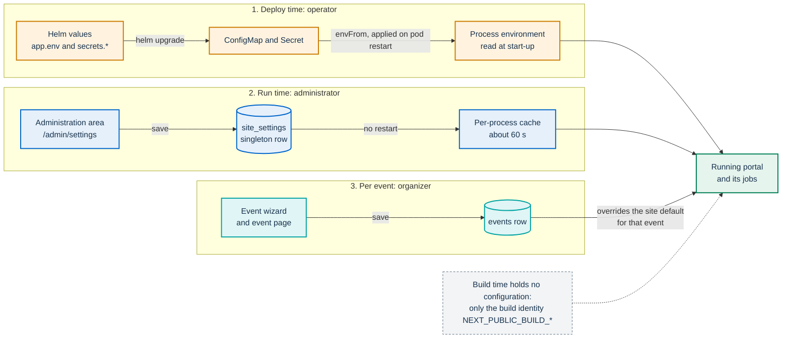

# Configuration reference

This page describes how PA Webinar is configured. It covers the three configuration layers, every environment variable the application reads, and the map of secrets and keys. It is written for operators who install and run an instance, and for developers who add a new setting.

The in-depth pages for single topics are [Object storage](configuration/storage.md), [Email delivery (SMTP)](configuration/email.md), [Branding and white-labeling](configuration/branding.md) and [Runtime settings](configuration/runtime-settings.md). Network design, firewall rules and TURN are covered in [Networking](INFRASTRUCTURE.md#networking) and [Deploying with Helm](DEPLOYMENT.md). The Content Security Policy is in [SECURITY-CSP.md](SECURITY-CSP.md), and AI operations are in [AI post-production](POSTPROD.md).

## Configuration layers

PA Webinar reads its configuration from three places. Each one has its own owner and its own way of taking effect.


```mermaid
flowchart LR
  classDef job fill:#FFF3E0,stroke:#CC7A00,stroke-width:2px,color:#17324D
  classDef portal fill:#E6F0FA,stroke:#0066CC,stroke-width:2px,color:#17324D
  classDef event fill:#E0F5F5,stroke:#00A3A3,stroke-width:2px,color:#17324D
  classDef app fill:#E6F4EE,stroke:#008055,stroke-width:2px,color:#17324D
  classDef note fill:#F2F4F6,stroke:#5C6F82,stroke-width:1px,stroke-dasharray:4 3,color:#17324D

  subgraph deploy["1. Deploy time: operator"]
    direction LR
    V["Helm values<br/>app.env and secrets.*"]:::job
    CM["ConfigMap and Secret"]:::job
    ENV["Process environment<br/>read at start-up"]:::job
    V -->|helm upgrade| CM
    CM -->|"envFrom, applied on pod restart"| ENV
  end

  subgraph runtime["2. Run time: administrator"]
    direction LR
    UI["Administration area<br/>/admin/settings"]:::portal
    ROW[("site_settings<br/>singleton row")]:::portal
    CACHE["Per-process cache<br/>about 60 s"]:::portal
    UI -->|save| ROW
    ROW -->|"no restart"| CACHE
  end

  subgraph perevent["3. Per event: organizer"]
    direction LR
    WIZ["Event wizard<br/>and event page"]:::event
    EV[("events row")]:::event
    WIZ -->|save| EV
  end

  APP["Running portal<br/>and its jobs"]:::app
  ENV --> APP
  CACHE --> APP
  EV -->|"overrides the site default<br/>for that event"| APP

  BUILD["Build time holds no configuration:<br/>only the build identity NEXT_PUBLIC_BUILD_*"]:::note
  BUILD -.-> APP
```

### Deploy time: environment variables

The operator sets environment variables through Helm values. The chart renders them in two places:

- Keys under `app.env` go into a ConfigMap named after the release. They are for values that are not secret.
- Secret values go into the application Secret. Its name is `secrets.existingSecretName`, and the chart's default is `videocall-secrets`; the k3s installer names it `pa-webinar-secrets`. The three ways to provide it are described in [Deploying with Helm](DEPLOYMENT.md#secret-modes): in production the Secret is created outside Helm (`existing`), and the chart renders it only for evaluation (`generate`).
- Two chart values name the installation: `site.portalHost` and `site.conferenceHost`. The chart derives `NEXT_PUBLIC_APP_URL`, `NEXT_PUBLIC_JITSI_DOMAIN` and every Ingress host from them ([Where each hostname goes](DEPLOYMENT.md#where-each-hostname-goes)).

The app container and the `db-migrate` init container load both through `envFrom`, so every key becomes an environment variable. Values are read when the process starts, and several modules keep what they read for the life of the process. A change therefore needs a restart:

- A change to `app.env` rolls the pods on the next `helm upgrade`. The Deployment carries a `checksum/config` annotation computed from the ConfigMap.
- A change to the Secret does **not** roll the pods, because nothing hashes the Secret. This is also true when the External Secrets Operator refreshes it. Restart the Deployment yourself. With the literal names used in this documentation (release and namespace `pa-webinar`), the command is `kubectl -n pa-webinar rollout restart deployment/pa-webinar`.
- Scheduled jobs start a new pod on every run, so they pick up a changed Secret at their next run.

On a single VM, Docker Compose sets the same variables in the `environment:` block of the `app` service in `docker-compose.yml`. Recreate the container to apply a change (`docker compose up -d app`). `.env.example` is the template for running the development server outside Compose. It is described in [Local development](DEVELOPMENT.md).

### Public variables are read at run time

Next.js normally copies `process.env.NEXT_PUBLIC_*` into the bundle when the image is built. PA Webinar does not rely on that. Server code reads these variables at run time through `getPublicEnv()` in `app/src/lib/env.ts`, and Client Components receive the values as props. The published image is built with neutral local defaults, and one image serves every installation.

`getPublicEnv()` is the only correct way to read a `NEXT_PUBLIC_*` variable. A dot-notation read (`process.env.NEXT_PUBLIC_X`) of a variable that the build defines is replaced with its build-time value, in server code as well as in the browser, and changing the Helm value then has no effect. An ESLint rule (`no-restricted-syntax` in `app/eslint.config.mjs`) forbids that form outside `app/src/lib/env.ts` and the test files. The build identity, `NEXT_PUBLIC_BUILD_*`, is allowed by name, because it is read that way on purpose ([Build-time values](#build-time-values)).

### Run time: site settings

Everything an administrator can change without a redeploy lives in one database row: the `SiteSetting` singleton, table `site_settings` ([ADR-010](adr/010-site-settings-singleton.md)). It covers branding, languages, feature switches, the scaler's knobs, email sender details and the AI switches. It is edited under **Settings** in the administration area (`/admin/settings`), with languages on their own page, **Languages**.

- The row is created on first use with the defaults declared on the `SiteSetting` model in `app/prisma/schema.prisma`.
- Most reads go through `getSettings()` in `app/src/lib/settings.ts`, which caches the row for 60 seconds in each process. Saving clears the cache of the pod that handled the save. Other pods follow within a minute. No restart is needed.

The setting groups, the operational knobs and their defaults are described in [Runtime settings](configuration/runtime-settings.md).

### Per event

Some behavior is set on each event in the event wizard or on the event page, and is stored on the `Event` row. Examples are the grace period, the expected share of video senders, the video quality, the waiting-room engine, the recording and AI switches, the privacy notice and the retention period. An event template (`EventTemplate`) only pre-fills the wizard. After the event is created, its row does not depend on the template. The flows are described in [From creation to recap: the event journey](architecture/event-journey.md).

### Precedence

When two layers set the same thing, a per-event value wins over the site setting, and the site setting wins over the environment. Most settings exist in one layer only. The table lists the ones that meet, with the order the code applies (first value set wins).

| Setting | Order |
|---|---|
| Email sender display name | `SiteSetting.emailFromName`, then `SMTP_FROM_NAME`, then `SiteSetting.siteName`, then `PA Webinar` (`app/src/lib/email/send.ts`) |
| Email sender address | `SMTP_FROM` only. The administration area cannot change it, because the relay authorizes a specific sender |
| Privacy link on the registration form | `Event.privacyPolicyUrl`, then `DEFAULT_PRIVACY_POLICY_URL`, then `/privacy` |
| Video quality | `Event.videoQuality`, then `SiteSetting.videoQuality` |
| Grace period after the scheduled end | `Event.gracePeriodMinutes`, then `SiteSetting.eventGracePeriodMinutes` |
| Expected share of video senders, for sizing | `Event.expectedSenderRatioPct`, then `SiteSetting.defaultSenderRatioPct` |
| Title kicker | `Event.parseTitleKicker`, then `SiteSetting.parseTitleKicker` |
| Waiting-room engine | `Event.waitingRoomEngine`, then `SiteSetting.waitingRoomEngine`. In the browser, the `?engine=` parameter, the viewer's classic-view preference and phone detection apply on top (see [The waiting room and the square](architecture/waiting-room.md#engines-classic-view-and-the-square)) |
| Number of bridges | Each event is capped by `SiteSetting.jvbMaxReplicas`. The total is capped by `JVB_MAX_REPLICAS` |
| Scaler timings (pre-scale, inactivity, empty close) | The `SiteSetting` columns. The environment fallbacks are never reached, because the columns cannot be null |
| Video watermark image | `SiteSetting.jitsiWatermarkUrl`, then `SiteSetting.logoUrl`, then `/images/default-watermark.svg` |
| AI engines | The provider comes from `SiteSetting` (one in-cluster option each). The endpoint and model come from the `AI_*` variables, then the code defaults |

### Adding a setting

Choose the layer by who changes the value and how often:

- **An environment variable** for secrets, addresses of other services and anything that must be fixed before the first request. Read it on the server. Read `NEXT_PUBLIC_*` only with `getPublicEnv()`. Add it to the reference below, and to `values.yaml` or the Secret examples.
- **A `SiteSetting` column** for what an administrator adjusts. It needs a migration, the validation schema in `app/src/lib/validation/site-settings.ts`, the form, and labels in all 24 languages.
- **An `Event` column** for what varies per event. If it can be switched on during a live event, it must follow the four-place rule in [Live interaction](architecture/live-interaction.md#live-toggleable-flags).

The step-by-step recipes are in [Extending PA Webinar](development/extending.md).

## Environment variable reference

This reference is derived from the code: every `process.env` and `getPublicEnv()` read under `app/src`. Each group names the files that define its defaults.

The columns mean:

- **Required**: *Yes* when the instance does not work properly without the variable. *Recommended* when the instance runs without it but loses a function. *Conditional* when it depends on a feature.
- **Secret**: *Yes* when the value must be kept in the Secret and never in `app.env`.
- **Helm key**:
  - `app.env`: a key under `app.env` in your values file, rendered into the ConfigMap.
  - *Secret*: a key of the application Secret. In `generate` mode it is `secrets.generate.<NAME>`.
  - *Chart*: the Deployment template sets it, and the cell names the value that controls it. `<fullname>` is the chart's full name: the release name when it contains `pa-webinar`, otherwise `<release>-pa-webinar`. With the literal names used in this documentation, it is `pa-webinar`.

### Core

Defaults: `app/src/lib/env.ts`. At startup, `app/src/instrumentation.ts` logs an error if `APP_SECRET`, `DATABASE_URL`, `JITSI_JWT_SECRET` or `NEXT_PUBLIC_JITSI_DOMAIN` is missing, and a warning if `CRON_API_KEY`, `ADMIN_API_KEY` or `SMTP_HOST` is missing. It does not stop the process. The only fatal check is a production `APP_SECRET` shorter than 32 characters.

| Name | Required | Default | Secret | Helm key | Description |
|---|---|---|---|---|---|
| `NEXT_PUBLIC_APP_URL` | Yes | `http://localhost:3000` | No | Chart: `https://` and `site.portalHost`; or `app.env`, which must then agree | Public base URL of the portal, with the scheme: `https://webinar.example.com`. Used for links in emails and calendar files, moderator links, avatars, preview images, the sitemap and SEO metadata. A value without `http://` or `https://` counts as missing (`appBaseUrl()`) |
| `NEXT_PUBLIC_JITSI_DOMAIN` | Yes | `localhost:8443` | No | Chart: `site.conferenceHost`; or `app.env`, which must then agree | Host of the conference front end, without the scheme: `meet.webinar.example.com`. Used by the IFrame API, the Content Security Policy, the `Permissions-Policy` header, the administration's **Infrastructure** page, and the status probes when the in-cluster addresses of the conference are not set ([Conference status probes](#conference-status-probes)) |
| `DEFAULT_PRIVACY_POLICY_URL` | No | `/privacy` (`app/src/app/[locale]/events/[slug]/registration/page.tsx`) | No | `app.env` | Privacy link on the registration form when the event has none. Set it only to point at a privacy notice published elsewhere. `values.yaml` leaves it unset |

### Authentication and tokens

Defaults: `app/src/lib/auth/jwt.ts` and `app/src/app/api/events/[param]/jitsi/token/route.ts`. Every credential and how it travels is described in [Identity, access and tokens](architecture/identity-and-access.md). What each key protects is in the [secrets map](#secrets-map).

| Name | Required | Default | Secret | Helm key | Description |
|---|---|---|---|---|---|
| `APP_SECRET` | Yes | none | Yes | Secret | Signing key of the portal's own cookies and links, and HMAC key of stored email hashes. At least 32 characters. In production, the process refuses to start when the value is set but shorter |
| `PII_ENCRYPTION_KEY` | Yes | none | Yes | Secret | AES-256-GCM key for personal data at rest: 64 hexadecimal characters. It is checked on every read and write, not at startup |
| `ADMIN_API_KEY` | Recommended | none | Yes | Secret | Instance API key. It is how the first administrator of a new installation signs in. When unset, key sign-in is refused |
| `CRON_API_KEY` | Yes in a cluster | none | Yes | Secret | Shared key of every scheduled job and internal service. Without it, no job can call the portal |
| `JITSI_JWT_SECRET` | Yes | none | Yes | Secret | HS256 key of the tokens that admit people to the conference. Prosody must hold the same value (`JWT_APP_SECRET`) |
| `JITSI_JWT_ISSUER` | No | `pa-webinar` | No | Secret | `iss` claim. It must be accepted by Prosody (`JWT_ACCEPTED_ISSUERS` in the `jitsi-meet.prosody.extraEnvs` values) |
| `JITSI_JWT_AUDIENCE` | No | `jitsi` | No | Secret | `aud` claim. It must be accepted by Prosody (`JWT_ACCEPTED_AUDIENCES`) |
| `JITSI_JWT_APP_ID` | No | `pa_webinar` | No | Secret | Prefix of the token id (`jti`). The chart examples keep it equal to Prosody's `JWT_APP_ID` |
| `JITSI_JWT_SUBJECT` | No | `localhost:8443` | No | Secret or `app.env` | `sub` claim. When unset or empty, the portal sends the constant `DEFAULT_JITSI_JWT_SUBJECT` in `app/src/lib/auth/jwt.ts`, the value every published image has always sent. Prosody requires a non-empty `sub`, but compares it with its XMPP domain only when `JWT_ENABLE_DOMAIN_VERIFICATION` is on, which the chart and Docker Compose leave off. If you turn that on, set this variable to the XMPP domain or to `*` |
| `ALLOW_INSECURE_PII_KEY` | No | unset | No | never | `true` lets a placeholder-shaped `PII_ENCRYPTION_KEY` work in production mode. Only `docker-compose.yml` sets it, for the local stack. Never set it on a real installation |

### Client address and rate limits

Defaults: `app/src/lib/rate-limit.ts`. The rate-limit model, how a client is identified and the reference limits are described in [Security architecture](architecture/security.md#rate-limits-and-abuse-controls).

| Name | Required | Default | Secret | Helm key | Description |
|---|---|---|---|---|---|
| `TRUSTED_PROXY_HOPS` | Conditional | `0` | No | `app.env` | Number of `X-Forwarded-For` entries that trusted infrastructure adds after the client's entry. Needed when a proxy or load balancer that appends to the header sits in front of the ingress, or is the ingress. The portal reads only `X-Forwarded-For` and keys every per-IP limit and the administration audit log on the (N+1)-th entry from the right, or on the first entry when there are fewer. `0` is the rightmost entry, the one the ingress writes. The count follows Envoy's `xff_num_trusted_hops`, not Express's `trust proxy`: the ingress itself counts as `0`. Integers from 0 to 10 are accepted; any other value counts as `0` and logs one warning. The value for each setup is in the table below. Never expose the portal's Service directly to the internet: the client then writes the whole header |
| `GUEST_JWT_RATE_LIMIT_PER_MINUTE` | No | `120` (`app/src/app/api/events/[param]/jitsi/token/route.ts`) | No | `app.env` | Conference tokens issued to guests, per client IP address, per minute, per pod. The limiter is in memory, so the real ceiling is this value times the number of pods |

`TRUSTED_PROXY_HOPS` for common setups:

| Setup | Value |
|---|---|
| ingress-nginx with its defaults (`use-forwarded-headers: false`), or Traefik with its defaults. Both replace the header | `0` |
| Docker Compose or a port-forward, with no proxy. The client writes the header, so never expose the portal like this | `0` |
| ingress-nginx behind an L7 proxy, with `use-forwarded-headers: true`, `proxy-real-ip-cidr` restricted to that proxy and `compute-full-forwarded-for: false`. ingress-nginx resolves the client itself | `0` |
| ingress-nginx with `compute-full-forwarded-for: true` behind one proxy that appends | `1` |
| Traefik with `forwardedHeaders.trustedIPs` set to one front proxy that appends | `1` |
| GKE Ingress (classes `gce` and `gce-internal`): Google Cloud's Application Load Balancer is the ingress and appends two entries, `<client-ip>,<load-balancer-ip>` | `1` |
| Google Cloud's Application Load Balancer in front of an ingress that appends | `2` |
| Each further proxy that appends one entry | add `1` |

Getting it wrong has a cost either way:

- With an ingress that appends, a value one too high makes the chosen entry one that the client wrote, so the client chooses its own key and escapes every per-IP limit.
- A value too low makes every client behind the last proxy share that proxy's counter. On the GKE Ingress, `0` puts every visitor on the load balancer's counter: registrations and guest conference tokens then fail with `429` at the start of an event, and the audit log records the load balancer's address.
- The chain must not be skippable: the ingress must be reachable only through the proxies counted here. A request that bypasses them carries fewer trusted entries, and the chosen one may be the client's.
- ingress-nginx with `use-forwarded-headers: true` and the default `proxy-real-ip-cidr` (`0.0.0.0/0`) lets the client choose its own address, whatever the portal does.

### Database connection

The database is described in [Database](#database) below.

| Name | Required | Default | Secret | Helm key | Description |
|---|---|---|---|---|---|
| `DATABASE_URL` | Yes | none | Yes | Secret. In `generate` mode with the in-cluster subchart, the chart composes it | PostgreSQL connection string for Prisma (`app/prisma/schema.prisma`) and for the `db-migrate` init container |

`POSTGRES_PASSWORD` and `POSTGRES_ADMIN_PASSWORD` belong to the datastore Secret. The PostgreSQL subchart reads them, and the application does not.

### Redis connection

Redis is described in [Redis](#redis) below. Code: `app/src/lib/redis.ts`, chart: `templates/deployment.yaml`.

| Name | Required | Default | Secret | Helm key | Description |
|---|---|---|---|---|---|
| `REDIS_URL` | Yes | none | Yes | Chart, derived when `redis.enabled`. Otherwise Secret | `redis://` or `rediss://` (TLS) connection string. When unset, realtime fan-out is off and the status page reports an outage |
| `REDIS_PASSWORD` | Conditional | none | Yes | Datastore Secret | Password of the in-cluster Redis. The app receives it only to build `REDIS_URL` |

### Email

Defaults: `app/src/lib/email/send.ts`. Provider examples and delivery troubleshooting are in [Email delivery (SMTP)](configuration/email.md). What the platform sends, and when, is in [Email and calendar](architecture/email.md).

| Name | Required | Default | Secret | Helm key | Description |
|---|---|---|---|---|---|
| `SMTP_HOST` | Yes | none | No | Secret (chart examples) | SMTP relay host. Without it no email leaves the outbox |
| `SMTP_PORT` | No | `587` | No | Secret (chart examples) | SMTP port |
| `SMTP_SECURE` | No | `false` | No | Secret (chart examples) | `true` opens the connection with TLS from the first byte (implicit TLS, usually port 465). With `false`, the transport upgrades through STARTTLS when the server offers it, which is the setting for port 587 |
| `SMTP_USER` | No | none | No | Secret | SMTP user name. Authentication is used only when both user and password are set |
| `SMTP_PASSWORD` | No | none | Yes | Secret | SMTP password or API key |
| `SMTP_FROM` | Yes | a placeholder address | No | Secret (chart examples) | Sender address. The relay must authorize it (SPF, DKIM). It is also the organizer address in calendar files |
| `SMTP_FROM_NAME` | No | none | No | Secret (chart examples) | Sender display name. The **Settings** value wins when set (see [Precedence](#precedence)) |
| `SMTP_POOL_MAX_CONNECTIONS` | No | `5` | No | `app.env` | Pooled SMTP connections per pod |
| `SMTP_POOL_MAX_MESSAGES` | No | `100` | No | `app.env` | Messages sent on one connection before it is replaced |

### Object storage

PA Webinar has two independent storage domains: **files** (event materials) and **recordings**. Each can use Azure Blob Storage or any S3-compatible service. Resolution: `app/src/lib/storage/index.ts`. Providers, key layout and examples: [Object storage](configuration/storage.md).

| Name | Required | Default | Secret | Helm key | Description |
|---|---|---|---|---|---|
| `STORAGE_FILES_PROVIDER` | No | auto-detected | No | `app.env` | `azure` or `s3`. Any other value, `azure-blob` included, is ignored and detection runs: the connection string first, then the bucket |
| `AZURE_STORAGE_CONNECTION_STRING` | Conditional | none | Yes | Secret | Azure connection string for files. It must contain `AccountName` and `AccountKey`, because the app signs SAS URLs with the account key. When the files domain uses Azure, the account host is added to `connect-src` |
| `AZURE_STORAGE_CONTAINER_NAME` | No | `eventi-files` | No | `app.env` | Container for files |
| `STORAGE_FILES_S3_BUCKET` | Conditional | none | No | `app.env` | Bucket for files |
| `STORAGE_FILES_S3_REGION` | No | `AWS_REGION`, then `us-east-1` | No | `app.env` | Region |
| `STORAGE_FILES_S3_ENDPOINT` | No | none, which means AWS | No | `app.env` | Endpoint of a non-AWS service. Only the pods need to reach it: in every flow the application ships, files pass through the portal, which writes uploads itself and streams downloads through `/api/assets/…`, so browsers never contact this endpoint. When the files domain uses the S3 client, its origin is still added to `connect-src`, for the signed upload URL of `POST /api/events/{id}/files`. No page calls that route; a client that does needs an HTTPS endpoint that browsers can reach, with a valid certificate |
| `STORAGE_FILES_S3_FORCE_PATH_STYLE` | No | `false`, or `true` when an endpoint is set | No | `app.env` | Path-style addressing. It is switched on automatically whenever `STORAGE_FILES_S3_ENDPOINT` is set |
| `STORAGE_FILES_S3_ACCESS_KEY_ID` | Conditional | `AWS_ACCESS_KEY_ID` | Yes | Secret | Access key. Without a key pair the domain is disabled: there is no fallback to workload identity |
| `STORAGE_FILES_S3_SECRET_ACCESS_KEY` | Conditional | `AWS_SECRET_ACCESS_KEY` | Yes | Secret | Secret key |
| `RECORDING_STORAGE_TYPE` | With Jibri | auto-detected | No | `app.env` | Accepted values are `azure-blob` or `azure`, and `s3`, `minio` or `gcs`. The last three use the S3 client. Any other value is ignored and detection runs: the connection string first, then the bucket. Set it when Jibri records: the live room and the status pages expect Jibri only when it is set (`jibriRecordingExpected()` in `app/src/lib/infrastructure.ts`), and otherwise show recording as not configured. The Content Security Policy derives the storage origin from the provider actually resolved (`app/src/lib/storage/provider-type.ts`): the Azure account host from the connection string, the endpoint origin for an S3-compatible service (or `https://*.amazonaws.com` without an endpoint), plus `https://storage.googleapis.com` for `gcs`. Use `RECORDING_MEDIA_CSP_HOSTS` only for origins that differ from the signed URLs, such as a custom domain or a CDN |
| `RECORDING_AZURE_CONNECTION_STRING` | Conditional | none | Yes | Secret | Azure connection string for recordings, with `AccountName` and `AccountKey`. When the recordings domain uses Azure, the account host is added to `media-src` and `connect-src` |
| `RECORDING_AZURE_CONTAINER` | No | `recordings` | No | `app.env` | Container for recordings |
| `RECORDING_S3_BUCKET` | Conditional | none | No | `app.env` | Bucket for recordings |
| `RECORDING_S3_REGION` | No | `AWS_REGION`, then `us-east-1` | No | `app.env` | Region |
| `RECORDING_S3_ENDPOINT` | No | none, which means AWS | No | `app.env` | Endpoint of a non-AWS service. When the recordings domain uses the S3 client, its origin is added to `media-src` and `connect-src`. The same endpoint signs the URLs that the pods use (Jibri, the recorder bot, the AI worker) and the URLs that browsers use to upload videos and play recordings, so it must be a public HTTPS origin with a valid certificate that browsers and pods can both reach. An in-cluster address such as `http://minio.<namespace>.svc:9000` does not work: browsers cannot resolve it, and an `http://` endpoint is blocked as mixed content on the `https` portal |
| `RECORDING_S3_FORCE_PATH_STYLE` | No | `false`, or `true` when an endpoint is set | No | `app.env` | Path-style addressing |
| `RECORDING_S3_ACCESS_KEY_ID` | Conditional | `AWS_ACCESS_KEY_ID` | Yes | Secret | Access key |
| `RECORDING_S3_SECRET_ACCESS_KEY` | Conditional | `AWS_SECRET_ACCESS_KEY` | Yes | Secret | Secret key |
| `RECORDING_MEDIA_CSP_HOSTS` | No | none | No | `app.env` | Extra origins, separated by spaces, allowed in `media-src` and `connect-src` (`app/src/middleware.ts`). For custom domains, CDNs and S3-compatible services that are not derived automatically. See [SECURITY-CSP.md](SECURITY-CSP.md) |
| `AWS_REGION`, `AWS_ACCESS_KEY_ID`, `AWS_SECRET_ACCESS_KEY` | No | none | Key pair: Yes | `app.env` / Secret | Shared fallbacks for both S3 domains |

When a domain resolves to no provider, it is disabled, and the features that depend on it are unavailable.

### Recording

How the two capture paths work is described in [Recording](architecture/recording.md). Which values turn them on is in [Setting up recording](operations/recording-setup.md).

| Name | Required | Default | Secret | Helm key | Description |
|---|---|---|---|---|---|
| `RECORDING_WEBHOOK_SECRET` | Recommended with Jibri | unset | Yes | Secret | HMAC-SHA256 key for the body of `POST /api/webhooks/recording`. The body is signed in the `X-Webhook-Signature: sha256=<hex>` header. When set, a request needs both the signature and the `CRON_API_KEY` bearer. When unset, the bearer alone is accepted and the app logs a warning once. The Jibri finalize script must receive the same value (`app/src/app/api/webhooks/recording/route.ts`) |
| `RECORDER_CONTROLLER_URL` | Conditional | none | No | Chart, when `recorder.enabled`: `http://<fullname>-recorder-controller:<recorder.controller.port>`, default port `8080`. With the literal names, `http://pa-webinar-recorder-controller:8080` | When a tick of the scaler or of the lifecycle cron opens an event (`LIVE`), the portal calls `POST <url>/dispatch`, so the per-participant recorder starts without waiting for the controller's next reconcile (`dispatchRecorder()` in `app/src/lib/events/lifecycle-tick.ts`). Other paths to `LIVE`, such as **Start event** and instant calls, which are created `LIVE`, rely on that reconcile. A failed call does no harm. Its presence also tells the live room that the installation can record, so the recording notice and consent are shown for events with recording on. They are left out only when the chart installs Jitsi without Jibri, no recordings storage is declared and this variable is unset (`app/src/lib/recording/availability.ts`). Docker Compose always sets it, even when its `recorder` profile is not started |

### Videobridge and scaler

The sizing model and the scaler tick are described in [Scaling the media plane](architecture/scaling.md). Enabling and tuning the scaler is described in [Running the JVB scaler](operations/jvb-scaler.md). Defaults: `app/src/lib/jvb-sizing.ts`, `app/src/lib/events/lifecycle-tick.ts` and `app/src/app/api/internal/jvb-desired-replicas/route.ts`. How the portal reads the bridge without a scaler is in [Monitoring and health](operations/monitoring.md#get-apistatus).

| Name | Required | Default | Secret | Helm key | Description |
|---|---|---|---|---|---|
| `JVB_MAX_REPLICAS` | No | `6` | No | `app.env`, or chart | **Global** cap on the number of bridges the scaler asks for, applied to the final sum. Without the scaler it is also the number of fixed bridges that the status pages and the **Infrastructure** page expect. It is read once when the process starts. The per-event cap is the runtime setting `jvbMaxReplicas`. When the chart does not render the scaler, it writes the value from `jitsi-meet.jvb.replicaCount` into the application ConfigMap, if that count is above zero and `app.env` neither sets this variable nor sets `JVB_SCALER_ENABLED` to `"true"`. The examples for managed clusters set it in `app.env` |
| `JVB_SCALER_ENABLED` | No | `false` | No | Chart, in the application ConfigMap: `"true"` when it renders the scaler (`jitsi.mode: full` and `jvbScaler.enabled`), `"false"` otherwise. A value in `app.env` takes its place | Says that something scales the bridges. Together with `JVB_HEALTH_URL` it chooses how `/api/status`, the infrastructure map, the **Infrastructure** page and the waiting room read the bridge: scale-to-zero (`true`), fixed bridges (`false` with `JVB_HEALTH_URL`) or not monitored (`false` without it) ([Monitoring and health](operations/monitoring.md#get-apistatus)). It is also the lifecycle driver's fallback when Redis does not answer ([Event lifecycle](architecture/event-lifecycle.md#which-driver-runs)). Set it to `"true"` in `app.env` when another tool, such as KEDA, scales the bridges (`app/src/lib/infrastructure.ts`, `app/src/lib/status/bridge.ts`) |
| `JVB_HEALTH_URL` | Conditional | none | No | Chart, when `jitsi.enabled`: `jitsi.jvbHealthUrl`. When it is empty, the chart uses the subchart's bridge Service (`http://<release>-jitsi-meet-jvb:8080`) if that Service exists and exposes port 8080 in `jitsi-meet.jvb.service.extraPorts`. Otherwise it renders a Service for this purpose and uses `http://<fullname>-jvb-rest:8080` (`templates/jvb-rest-service.yaml`). The defaults in `values.yaml` set `jitsi-meet.jvb.useHostPort`, and the subchart then renders no bridge Service, so a default install is in the second case | Base URL of the bridge's REST interface (`/colibri/stats`). Used by the status page, the bridge gauges of `/api/metrics`, the scaler's single-bridge fallback and the lifecycle cron, which opens a room only while the bridge answers (without the variable, the bridge is assumed present). With several bridges, the Service reaches one pod at a time, so the figures read through it are a lower bound. The chart writes full Service names (see [Conference status probes](#conference-status-probes)) |
| `JIBRI_HEALTH_URL` | Conditional | none | No | Chart, when `jitsi.enabled`: `jitsi.jibriHealthUrl`, or, only when `jitsi-meet.jibri.enabled` is on and `useExternalJibri` off, the subchart's Jibri Service on port 2222. Without Jibri the chart does not write it | Base URL of the Jibri health API. It is probed only when Jibri is expected (`RECORDING_STORAGE_TYPE` declared, `jibriRecordingExpected()`). When it is unset while Jibri is expected, Jibri is reported as not running |
| `JVB_PRE_SCALE_MINUTES`, `JVB_INACTIVE_GRACE_MIN`, `JVB_EMPTY_CLOSE_MIN` | No | unused | No | none | Fallbacks for the runtime settings `jvbPreScaleMinutes`, `jvbInactiveGraceMinutes` and `jvbEmptyCloseMinutes`. Those columns cannot be null, so the fallbacks never apply. Set the values in [Runtime settings](configuration/runtime-settings.md) |

### Conference status probes

The status page, the infrastructure map and the **Infrastructure** page probe the conference's web container, Prosody and Jicofo where they run (`app/src/lib/status/jitsi-health.ts`). A probe waits at most 3 seconds for an in-cluster address and 5 seconds for the public host, and every result is kept in memory for 5 seconds per pod. With the conference installed by the chart (`jitsi.enabled`), the chart writes the three addresses into the application ConfigMap, unless `app.env` sets them; `jitsi.webInternalUrl`, `jitsi.prosodyInternalUrl` and `jitsi.jicofoHealthUrl` override the computed values. The chart builds every in-cluster address, `JVB_HEALTH_URL` and `JIBRI_HEALTH_URL` included, from the full Service name `<service>.<namespace>.svc.<global.clusterDomain>` (`cluster.local` by default; an empty `global.clusterDomain` gives the short name). The Docker Compose stack sets the three addresses and `JVB_HEALTH_URL` to its service names ([Local services](DEVELOPMENT.md#local-services)).

| Name | Required | Default | Secret | Helm key | Description |
|---|---|---|---|---|---|
| `JITSI_WEB_INTERNAL_URL` | No | none | No | Chart, with `jitsi.enabled`: `http://<release>-jitsi-meet-web.<namespace>.svc.<clusterDomain>`, plus `:<port>` when `jitsi-meet.web.service.port` is not 80 | The status page fetches `<url>/external_api.js`. When unset, it fetches the same file from the public conference host (`NEXT_PUBLIC_JITSI_DOMAIN`); there a certificate or name the app pod does not accept counts as `degraded` with the error code, not as an outage |
| `PROSODY_INTERNAL_URL` | No | none | No | Chart, with `jitsi.enabled`: Prosody's Service on its BOSH port, 5280 | The status page asks `<url>/http-bind`; a `405` also counts as an answer. When unset, it asks `/http-bind` on the public conference host, through the web container |
| `JICOFO_HEALTH_URL` | No | none | No | Chart, with `jitsi.enabled`: `http://<fullname>-jicofo-rest.<namespace>.svc.<clusterDomain>:8888`, a Service the chart renders for this purpose | The status page asks `<url>/about/version`. When unset, Jicofo is reported as `unknown` (**Not monitored**) |

With `networkPolicy.enabled`, the app's egress must reach ports 80 and 8888 of the Jitsi pods; the chart's defaults allow both ([NetworkPolicy](DEPLOYMENT.md#networkpolicy)). With an external Jitsi, leave the three unset or point them at addresses the app pod can reach.

### AI post-production

The application reads these variables, not the worker. When a worker claims a job, the portal resolves the engines and sends the endpoint and model in the claim response (`app/src/lib/ai/providers.ts`, `app/src/app/api/internal/postprod-claim/route.ts`). Set them in `app.env`. Setting them only in `postprod.worker.extraEnv` changes nothing, and that includes the commented example of `AI_VLLM_BASE_URL` and `AI_VLLM_MODEL_ID` under `postprod.worker.extraEnv` in `values.yaml`. The pipeline, the models and the operational checklist are in [AI post-production](POSTPROD.md).

| Name | Required | Default | Secret | Helm key | Description |
|---|---|---|---|---|---|
| `AI_VLLM_BASE_URL` | Conditional | `http://pa-webinar-vllm:8000/v1` | No | `app.env` | OpenAI-compatible endpoint of the vLLM service, for summaries and translations. The sovereignty policy requires a service inside the cluster. The code does not enforce it |
| `AI_VLLM_MODEL_ID` | No | `mistralai/Mistral-Small-3.2-24B-Instruct-2506` | No | `app.env` | Model id served by vLLM. The transparency record of each run stores the model id actually used, but its vendor and license fields are fixed to those of the default model (`app/src/lib/ai/pipeline-snapshot.ts`) |
| `AI_ASR_MODEL_ID` | No | `large-v3` | No | `app.env` | WhisperX model for transcription |
| `AI_TTS_VOICES_PATH` | No | `/models/piper` | No | `app.env` | Path inside the worker where the Piper voices are stored |
| `GIT_SHA` | No | unset, then `NEXT_PUBLIC_APP_VERSION`, then `cluster` | No | `app.env` | Pipeline version written in the transparency record of each run (`app/src/lib/ai/pipeline-snapshot.ts`). Nothing in the chart, the image or Docker Compose sets it, so the record says `cluster` unless you set it |
| `NEXT_PUBLIC_APP_VERSION` | No | unset | No | none | Read only as the fallback of `GIT_SHA`. Nothing sets it. Set `GIT_SHA` instead |

The switches that turn the pipeline on belong to the site settings (`aiPipelineEnabled` and related) and to each event. The worker's own settings, such as `HF_TOKEN` and the models volume, are Helm values under `postprod.worker`.

### Public variables (`NEXT_PUBLIC_*`)

`NEXT_PUBLIC_APP_URL` and `NEXT_PUBLIC_JITSI_DOMAIN` are listed under [Core](#core). The other public variables read at run time are these:

| Name | Required | Default | Secret | Helm key | Description |
|---|---|---|---|---|---|
| `NEXT_PUBLIC_WHITEBOARD_ENABLED` | No | unset, which hides the whiteboard | No | `app.env` | Only `true` (case and spaces ignored) shows the whiteboard button in Jitsi's toolbar and in the moderator's control bar, and the reminder to export the whiteboard (`app/src/lib/jitsi/whiteboard.ts`); this applies to instant calls too. It also drives the administration forms: when it is not `true`, the whiteboard switch in step 2 of the event wizard and in the event-template form cannot be switched on and shows a one-line reason, while a value already on can still be switched off. The live room's Server Component and the new-event, edit-event and templates pages read it at request time, so a change needs a pod restart, not a new image. Set it only when the Jitsi installation has the whiteboard collaboration backend and `config.whiteboard.enabled`. The chart installs none: the Jitsi subchart has an optional one (`jitsi-meet.excalidraw.enabled`, off), and that combination has not been tested |
| `NEXT_PUBLIC_JITSI_RNNOISE_ENFORCE` | No | unset, which forces advanced noise suppression off | No | `app.env` | Only the exact value `false` (case and spaces ignored) lets Jitsi's advanced noise suppression run (`app/src/lib/jitsi/rnnoise.ts`). It is safe only with the patched `jitsi/web` image. The chart refuses to render `false` with an image it does not recognize as patched, unless `jitsi.patchedWebImage: true` declares it. See [How PA Webinar extends Jitsi Meet](architecture/jitsi-integration.md) |

#### Build-time values

These values are fixed when the image is built. They are not configuration: do not set them in `app.env`.

| Name | Set by | Effect |
|---|---|---|
| `NEXT_PUBLIC_BUILD_VERSION`, `NEXT_PUBLIC_BUILD_SHA`, `NEXT_PUBLIC_BUILD_CHANNEL`, `NEXT_PUBLIC_BUILD_DATE` | Build arguments passed by the release and development workflows (`Dockerfile`) | The build identity shown in the footer, in `/api/health`, on the release-notes page and in the OpenAPI document. `NEXT_PUBLIC_BUILD_VERSION` is also the version on the **Infrastructure** page and the infrastructure map; the page shows `—` when it is empty |

The status page reads the number of bridges it expects from the server (`jvbMaxReplicas` in `/api/status`), not from a public variable.

### Observability

Probes, metrics and alerts are described in [Monitoring and health](operations/monitoring.md).

| Name | Required | Default | Secret | Helm key | Description |
|---|---|---|---|---|---|
| `PROMETHEUS_URL` | No | empty | No | `app.env` | Prometheus base URL for the PromQL queries behind the status and infrastructure pages. When it is empty, those pages use direct probes only (`app/src/lib/prometheus.ts`) |
| `METRICS_APP_LABEL` | No | `pa-webinar` | No | `app.env` | Value of the `app` label on every application metric and in the portal's own PromQL queries (`app/src/lib/metrics.ts`). The chart's alert rules and dashboard match `app="pa-webinar"`, so change it only if you adapt them too. The **Monitoring** page receives it from the server |
| `METRICS_JOB` | No | unset | No | Chart: the app's full name, which is the scrape `job` of the chart's ServiceMonitor | The Prometheus job whose `up` series the sparklines, the infrastructure map and the **Monitoring** page read, as `up{namespace="<POD_NAMESPACE>",job="<METRICS_JOB>"}` (`app/src/lib/status/prometheus-selectors.ts`). When unset, they select `job=~".*eventi.*"` |
| `DEPLOY_PROFILE` | No | unset | No | Chart: the value of `jitsi.mode` | `simple`, `standard` or `full`: the deployment mode shown on the **Infrastructure** page and the map. When unset, the mode is inferred: `simple` outside Kubernetes; inside, `full` when `JVB_MAX_REPLICAS` is greater than 1 and `standard` otherwise (`deploymentMode()` in `app/src/lib/infrastructure.ts`) |
| `DATABASE_BUNDLED` | No | unset | No | Chart: the value of `postgresql.enabled` | `true` when the database is the one installed with the platform, `false` when it is external: the database type on the **Infrastructure** page and the map. When unset, a host name without a dot that contains `postgres` counts as bundled (`databaseBundled()`) |
| `APP_VERSION` | No | unset | No | `app.env` | Version shown on the infrastructure map only when the image carries no `NEXT_PUBLIC_BUILD_VERSION`. Published images carry it, so this is a fallback for local builds |

`/api/metrics` requires `Authorization: Bearer <CRON_API_KEY>`. To let the ServiceMonitor present it, set `metrics.bearerTokenSecret` in the Helm values.

### Service inventory

| Name | Required | Default | Secret | Helm key | Description |
|---|---|---|---|---|---|
| `SERVICE_INVENTORY_URL` | No | empty | No | `app.env` | Source of the `/service-inventory` page: an `https://` URL, fetched by the server, or a path beginning with `/`, served from the image. When it is empty, the page says that the inventory is not published. See [Service inventory: publishing](SERVICE-INVENTORY.md) |

### Set by the platform

Do not set these by hand.

| Name | Set by | Used for |
|---|---|---|
| `NODE_ENV` | Image and chart: `production` | Enables the production guards (`APP_SECRET` length, placeholder `PII_ENCRYPTION_KEY`, `Secure` cookies) |
| `PORT`, `HOSTNAME` | Image and chart: `3000`, `0.0.0.0` | Where the server listens |
| `POD_NAMESPACE`, `POD_NAME` | Chart, from the pod metadata | `POD_NAMESPACE` scopes the PromQL queries. Without it they use `default` and return nothing |
| `KUBERNETES_SERVICE_HOST` | Kubernetes | Its presence tells the status and infrastructure pages that they run in a cluster and not on a single VM (the **Infrastructure** page's platform line, and the fallback for `DEPLOY_PROFILE`) |
| `NODE_EXTRA_CA_CERTS` | Chart, when `app.extraCaCerts` is set: `/etc/pa-webinar/extra-ca/ca-bundle.pem` | Extra certificate authorities that Node.js trusts for the app's outbound TLS, besides the system ones (see below) |

### Extra certificate authorities

When the portal calls a service whose certificate comes from an internal certificate authority (an SMTP relay, object storage, an external Jitsi, or the portal's and the conference's own public names), give it that authority with `app.extraCaCerts`. The chart mounts one key of an existing Secret or ConfigMap read-only in the app container, and points `NODE_EXTRA_CA_CERTS` at it:

```yaml
app:
  extraCaCerts:
    configMapName: ente-ca     # or secretName, never both: the render stops
    key: ca.crt                # PEM, one or more certificates
```

- Node.js reads the file when the process starts: after changing it, restart the Deployment.
- The `db-migrate` init container does not use it. TLS to the database is configured in `DATABASE_URL`.
- Browsers need the authority too, and that is outside the chart: participants whose devices do not trust it cannot load the conference ([Installing on your own VMs with k3s](install/k3s.md)).
- With the conference installed by the chart, the status page does not need it: it probes the components in the cluster ([Conference status probes](#conference-status-probes)).

### Variables that have no effect

Older examples and templates still set the variables below, but the application does not read them, or uses them for display only. They can be removed.

| Name | Where it appears | What to use instead |
|---|---|---|
| `DEFAULT_DATA_RETENTION_DAYS` | `values.yaml`, `.env.example` | Retention is set per event (`Event.dataRetentionDays`). An event template can pre-fill it. See [Privacy and data protection](GDPR.md) |
| `RECORDING_WEBHOOK_URL` | The standalone script `infra/jitsi/jibri-finalize.sh` | Not an application variable. The finalize script that the chart mounts in the Jibri pod (`infra/helm/pa-webinar/files/jibri-finalize.sh`) builds the webhook address from `APP_INTERNAL_URL`. Only the standalone script in `infra/jitsi/` reads it. See [Jitsi extras](../infra/jitsi/README.md) |
| `NEXT_PUBLIC_DEFAULT_LOCALE` | `values.yaml`, `.env.example`, `docker-compose.yml` | The default language is a site setting, on the **Languages** page |
| `NEXT_PUBLIC_WATERMARK_URL` | `.env.example` | The video watermark is set under **Settings**. See [Branding and white-labeling](configuration/branding.md) |
| `NEXT_PUBLIC_GUEST_ACCESS` | Nowhere by default | Display only, on the infrastructure page. Guest access is the site setting `guestAccessEnabled` |
| `METRICS_ENABLED` | Nowhere by default | Display only. `false` does not turn `/api/metrics` off |
| `JWT_SECRET` | Nowhere by default | Display only, on the infrastructure page |
| `JVB_DESIRED_REPLICAS` | Nowhere by default | Nothing: the application does not read it. The **Infrastructure** page computes the bridges wanted by the events |
| `NEXT_PUBLIC_JVB_MAX_REPLICAS` | Nowhere by default | Nothing. The status page reads the expected bridges from the server (`JVB_MAX_REPLICAS`) |
| `AZURE_STORAGE_CONTAINER`, `AWS_S3_BUCKET`, `GCS_BUCKET` | `infra/k8s/secret-template.yaml`, `.env.example` | `AZURE_STORAGE_CONTAINER_NAME`, `STORAGE_FILES_S3_BUCKET`, `RECORDING_S3_BUCKET` |
| `DOCKER_HOST_ADDRESS` | `.env.example` | Read by Docker Compose for the local bridge, not by the application |

## Secrets and keys

### Where secrets live

The chart keeps secret values in three Secrets. They are kept apart because some components load a whole Secret, and nothing else should be readable there.

- **The application Secret** (`secrets.existingSecretName`) holds every key of the portal. The app container and the `db-migrate` init container load it whole. The scheduled jobs, the JVB scaler, the recorder controller and its jobs, and the AI worker read only `CRON_API_KEY` from it.
- **The datastore Secret** (`secrets.datastoreSecretName`) holds the passwords of the in-cluster PostgreSQL and Redis. The PostgreSQL subchart mounts its Secret whole inside the database container, so no application key belongs there. When the name is empty, the chart uses the application Secret.
- **The conference JWT Secret** holds only `JWT_APP_SECRET`, with the same value as `JITSI_JWT_SECRET`, because the jitsi-meet subchart loads it whole into Prosody's environment.

Who creates each Secret in each `secrets.mode`, how to separate the datastore passwords, and what the External Secrets Operator renders are covered in [Deploying with Helm](DEPLOYMENT.md#secrets), under [Secret modes](DEPLOYMENT.md#secret-modes), [Datastore passwords](DEPLOYMENT.md#datastore-passwords), [The Prosody JWT secret](DEPLOYMENT.md#the-prosody-jwt-secret) and [External Secrets Operator](DEPLOYMENT.md#external-secrets-operator). Other components have credentials of their own: the invisible recorder's XMPP account (`recorder.xmppSecretName`, in [Setting up recording](operations/recording-setup.md)), the AI worker's Hugging Face token (`postprod.worker.hfTokenSecret`, in [AI post-production](POSTPROD.md)), and the TLS certificates and internal passwords of the Jitsi components (in [Deploying with Helm](DEPLOYMENT.md)).

### Secrets map

| Key | Held by | Protects | Generate with | Changing it |
|---|---|---|---|---|
| `APP_SECRET` | Application Secret | The staff session cookie, event access and join cookies, signed links sent by email (data-subject requests, address-book opt-out, the entry links of invitation-only registration), chat attachment links. It is also the HMAC key of every stored email hash, of the chat sender key that colors chat bubbles, and of the deduplication key of moderator-link emails | `openssl rand -hex 32` | Signs every staff member out and voids every event cookie and signed link. Stored email hashes stop matching, so staff accounts, registrations and address-book entries can no longer be found by email address, and duplicate registrations are no longer detected. Chat bubble colors change once, which is harmless. Treat it as a permanent key |
| `PII_ENCRYPTION_KEY` | Application Secret | Personal data encrypted at rest (AES-256-GCM), and the Gravatar reference in conference tokens | `openssl rand -hex 32` | There is no re-encryption: data written with the old key can no longer be read. Do not change it on an installation that holds data. See [Security architecture](architecture/security.md) |
| `JITSI_JWT_SECRET` | Application Secret, plus the conference JWT Secret as `JWT_APP_SECRET` | Admission to the conference | `openssl rand -hex 32` | Change both copies in the same rollout. Tokens already issued stop verifying. A participant who reconnects gets a new token from the portal |
| `ADMIN_API_KEY` | Application Secret | Sign-in with the instance key | `openssl rand -hex 32` | New sign-ins need the new key. Existing sessions continue |
| `CRON_API_KEY` | Application Secret | `/api/cron/*` and `/api/internal/*` (`x-api-key` header), `/api/metrics` and `/api/webhooks/recording` (bearer) | `openssl rand -hex 32` | Every consumer must change at once: the portal, the jobs, the recorder controller, the ServiceMonitor bearer, and the Jibri finalize script if it is used. Restart the portal and the recorder controller |
| `RECORDING_WEBHOOK_SECRET` | Application Secret, plus the Jibri pod's environment | Integrity of the recording webhook | `openssl rand -hex 32` | Change both sides together |
| `DATABASE_URL` | Application Secret | Database access, including schema changes by `db-migrate` | Built from the database credentials | Restart the portal |
| `POSTGRES_PASSWORD`, `POSTGRES_ADMIN_PASSWORD` | Datastore Secret | The in-cluster PostgreSQL | `openssl rand -hex 24` | The database keeps the password it was initialized with. Changing only the Secret breaks authentication |
| `REDIS_PASSWORD` | Datastore Secret | The in-cluster Redis | `openssl rand -hex 24` | Restart Redis and the portal together |
| `REDIS_URL` | Application Secret, for an external Redis only | The managed Redis | From the provider | Restart the portal |
| `SMTP_PASSWORD` | Application Secret | The mail relay | From the provider | Restart the portal |
| Storage credentials: `AZURE_STORAGE_CONNECTION_STRING`, `RECORDING_AZURE_CONNECTION_STRING`, `*_S3_ACCESS_KEY_ID`, `*_S3_SECRET_ACCESS_KEY` | Application Secret | Access to the buckets | From the provider | Restart the portal |

Which keys can be rotated on a running installation, and how, is in
[Secrets rotation](install/checklists.md#secrets-rotation).

The development placeholders in `.env.example` and `docker-compose.yml` are public. They are shaped to pass the production guards, or, for `PII_ENCRYPTION_KEY`, to be caught by them. Never copy them into a real installation. In production, a `PII_ENCRYPTION_KEY` that is a short block repeated to length raises an error on every read and write. Only the Compose stack sets `ALLOW_INSECURE_PII_KEY=true` to run with its dummy key, and `.env.example` deliberately does not carry that setting. The guard is intentional: replace the key, never the guard.

## Database

PA Webinar needs PostgreSQL. The chart can run it in the cluster, or the app can use an external or managed server. The schema and the migration policy are described in [Data model](architecture/data-model.md).

**In the cluster** (`postgresql.enabled: true`, the default): the Bitnami subchart creates the database `pa_webinar` for the user `eventi` (defaults in `values.yaml`), with the passwords from the datastore Secret. The connection string is `postgresql://eventi:<password>@<release>-postgresql:5432/pa_webinar`, where the host is subject to the subchart's `nameOverride` and `fullnameOverride`. URL-encode a password that contains `@`, `/`, `#`, `:` or spaces. In `generate` mode the chart composes this value itself. See [Datastore passwords](DEPLOYMENT.md#datastore-passwords).

**External or managed** (`postgresql.enabled: false`): put the full connection string in the application Secret as `DATABASE_URL`. Managed services usually require TLS: add `sslmode=require`.

| Service | Shape |
|---|---|
| Managed PostgreSQL (Azure, AWS, Google Cloud) | `postgresql://<user>:<password>@<host>:5432/pa_webinar?sslmode=require` |
| Self-hosted on a private network | `postgresql://<user>:<password>@10.0.0.10:5432/pa_webinar` |

The keys under `postgresql.external` in `values.yaml` are not used by any template. Only `DATABASE_URL` counts.

Migrations run in the `db-migrate` init container (`prisma migrate deploy`) before each new pod starts. It uses the same `DATABASE_URL`, so that user must be allowed to create and alter tables. How upgrades and rollbacks treat migrations is described in [Upgrades and rollback](operations/upgrades.md).

## Redis

Redis is a required dependency. PostgreSQL holds the durable state, and Redis carries what must reach every portal pod at once: the chat stream, the push channel of the live-room panels, the lower-hand signals, presence in the square, and the bridge snapshot read by the status page. Rate limiting is in memory in each pod and does not use Redis. What degrades without Redis is described in [Live interaction](architecture/live-interaction.md#redis-availability). The status page reports it as an outage.

**In the cluster** (`redis.enabled: true`, the default): a single standalone node with authentication and no persistence. The Deployment builds `REDIS_URL` itself from `REDIS_PASSWORD` in the datastore Secret, and that value wins over a `REDIS_URL` in the application Secret (see [Datastore passwords](DEPLOYMENT.md#datastore-passwords)). The address is `redis://default:<password>@<release>-redis-master.<namespace>.svc.cluster.local:6379/0`, where the host is subject to the subchart's `nameOverride` and `fullnameOverride`. The password goes into the URL without encoding, so generate it in hex (`openssl rand -hex 24`): a base64 password can contain `/` and break the address. The pod starts even when the key is missing, but Redis then refuses the connection and the status page reports an outage.

**External or managed** (`redis.enabled: false`): put `REDIS_URL` in the application Secret. Use `rediss://` (two s) for TLS. Some managed services accept only TLS.

| Service | Shape |
|---|---|
| Managed Redis with TLS | `rediss://:<access-key>@<host>:6380/0` |
| Managed or self-hosted without TLS, private network only | `redis://:<password>@10.0.0.20:6379/0` |

**Image.** Bitnami's public catalog keeps only the `latest` tag, so the chart pins the Redis image by digest inside the tag (`latest@sha256:…` in `redis.image.tag`, `values.yaml`). Every node therefore runs the same build. The metrics exporter (`redis.metrics.image.tag`) is pinned the same way. Setting `redis.image.tag` replaces the whole value, digest included. When you point `registry` or `repository` at a mirror, set `tag` too. The comment next to the value in `values.yaml` names the Redis release behind the digest. It belongs to the Redis 8 line, whose server license is not BSD: see [Third-party licenses](../THIRD-PARTY-LICENSES.md#redis). PA Webinar uses only basic commands (publish and subscribe, plus strings and hashes with an expiry), which are stable across Redis versions.

Docker Compose runs Redis without a password (`redis://redis:6379`) and without persistence, so the local stack follows the same code path as a cluster.

## Scaling

The sizing knobs (vCPU per bridge, participants per core, per-event cap, pre-scale window, grace periods) are runtime settings: see [Runtime settings](configuration/runtime-settings.md).
How they turn events into a number of bridges, and the global cap `JVB_MAX_REPLICAS`, are explained in [Scaling the media plane](architecture/scaling.md).
Choosing and sizing the machines is covered in [Installing PA Webinar](install/README.md#requirements).

## Drill-downs

| Page | What it covers |
|---|---|
| [Object storage](configuration/storage.md) | The two storage domains, providers and their settings, key layout, deletion |
| [Email delivery (SMTP)](configuration/email.md) | SMTP settings, provider examples, delivery troubleshooting |
| [Branding and white-labeling](configuration/branding.md) | What an administration can brand without a rebuild, and the limits |
| [Runtime settings](configuration/runtime-settings.md) | Every `SiteSetting` group, the operational knobs and their defaults, per-event overrides |

Related pages:

- [Deploying with Helm](DEPLOYMENT.md) covers the chart, its profiles and the install walkthrough.
- [Installing PA Webinar](install/README.md) covers choosing and sizing a platform, and the [Infrastructure reference](INFRASTRUCTURE.md) the network design.
- [Identity, access and tokens](architecture/identity-and-access.md) covers every credential and cookie.
- [Security architecture](architecture/security.md) covers the application's controls, and [SECURITY.md](../SECURITY.md) covers supply chain and disclosure.
- [Privacy and data protection](GDPR.md) covers retention and encryption.
