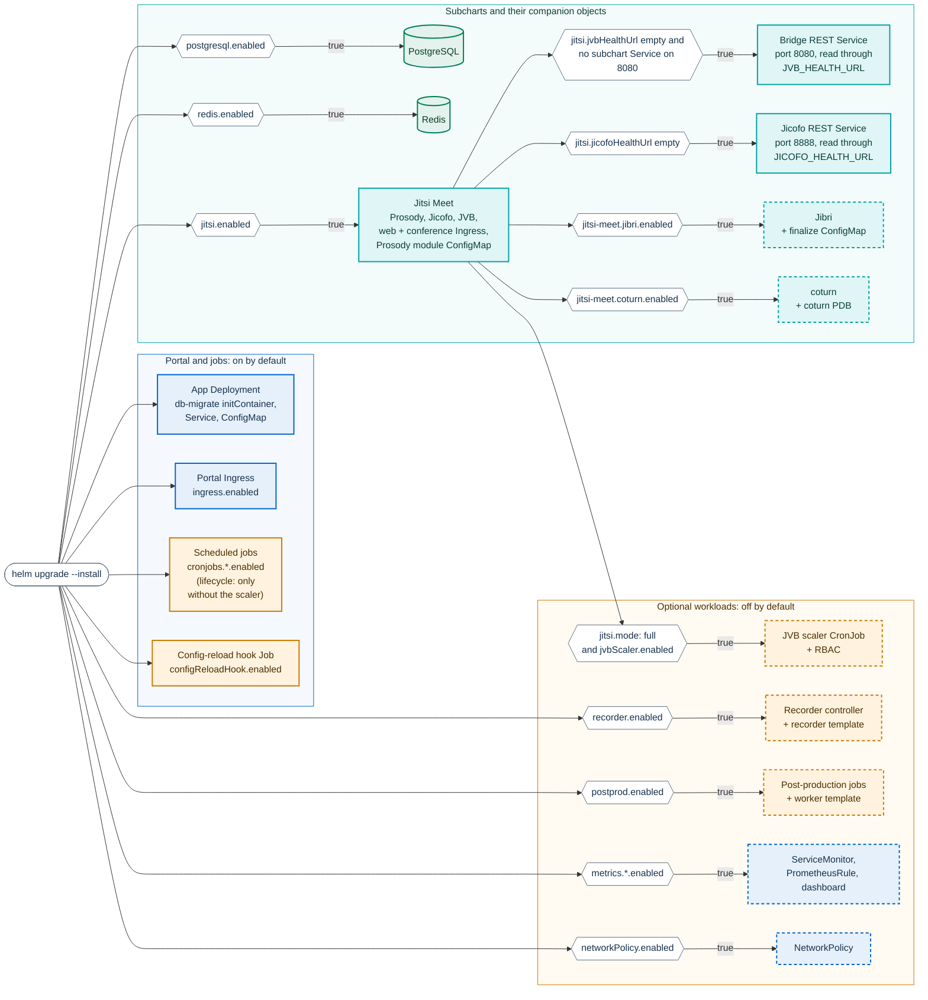
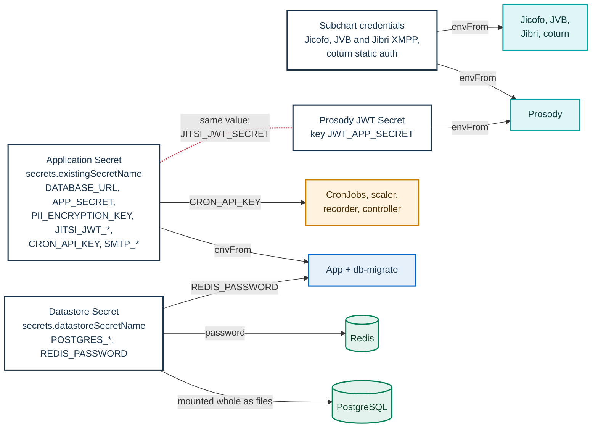
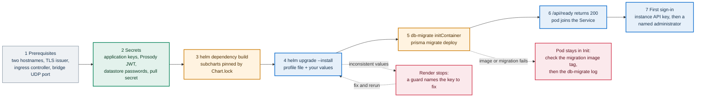

# Deploying with Helm

This page is the reference for the PA Webinar Helm chart (`infra/helm/pa-webinar`) and the guide to
installing it. It is written for Kubernetes operators. It covers what the chart renders, which value
switches each part on, which Secrets you must create, how to install each example profile, and how to
check a fresh installation. The day-2 procedures (upgrades, the bridge scaler, recording, monitoring,
troubleshooting) have their own pages, listed at the end.

**Start from [Installing PA Webinar](install/README.md).** It helps you choose a platform, lists what to
prepare, gives the measured requirements and the known limitations, and links a guide for each
platform: [minikube](install/minikube.md) to evaluate on a workstation, [k3s](install/k3s.md) on your
own VMs, and [AKS](install/aks.md), [GKE](install/gke.md) or [EKS](install/eks.md). Each guide installs
this chart with a platform overlay. This page is the chart reference those guides rely on, and the
install path for any other conformant cluster. The network design, the node pools and the evidence
behind the sizes are in the [Infrastructure reference](INFRASTRUCTURE.md). Docker Compose is for
changing the code, not for installing ([Local development](DEVELOPMENT.md)).

On this page:

- [Before you start](#before-you-start)
- [What the chart renders](#what-the-chart-renders)
- [Profiles and values files](#profiles-and-values-files)
- [Prerequisites](#prerequisites)
- [Hostnames and ingress](#hostnames-and-ingress)
- [Secrets](#secrets)
- [Install walkthroughs](#install-walkthroughs)
- [Jitsi keys](#jitsi-keys)
- [NetworkPolicy](#networkpolicy)
- [Video recording (Jibri)](#video-recording-jibri)
- [Metrics](#metrics)
- [First-run checks](#first-run-checks)
- [Operations drill-downs](#operations-drill-downs)

## Before you start

- **The chart is `apiVersion: v2`.** It installs with Helm 3 and Helm 4. CI renders and validates it
  with Helm 3, the lowest version it claims to support.
- **Kubernetes flavor.** The chart targets any conformant cluster. The repository carries reference
  infrastructure for Azure Kubernetes Service (AKS), Google Kubernetes Engine (GKE) and Amazon EKS
  (`infra/tofu/aks`, `infra/tofu/gke`, `infra/tofu/eks`) and scripts for k3s on your own VMs
  (`infra/onprem/k3s`). What has run real events, what was tested in lab and what is only validated is
  in [What has been exercised](install/README.md#what-has-been-exercised-and-what-is-only-validated).
- **Examples on this page** use `pa-webinar` as both the release name and the namespace, and
  `webinar.example.com` (portal) and `meet.webinar.example.com` (conference) as hostnames.
- **Before you change the chart**, run `./scripts/validate-chart.sh` from the repository root. It runs
  `helm lint`, renders the example profiles and several variants, and checks invariants that would
  otherwise fail only at install time, such as a Secret that a pod mounts but no template renders, a
  database host that matches no Service, or an Ingress class that disagrees with its annotation. It
  needs Helm, OpenSSL, Python 3 with PyYAML, and the subcharts ([Get the chart](#get-the-chart)). CI
  runs it and then applies the rendered profiles to a disposable cluster with
  `kubectl apply --dry-run=server` ([CI, images and releases](development/ci-and-release.md)).

## What the chart renders

A release always contains the portal application and its scheduled jobs. Everything else is switched on
by a value. In the diagram, hexagons are those values and dashed boxes are off by default.



The same information as a table. "Default" is the chart's `values.yaml`; the last three columns are the
example profiles in `infra/helm/pa-webinar/examples/`.

| Component | Rendered when | Default | simple | standard | full |
|---|---|---|---|---|---|
| App Deployment with the `db-migrate` initContainer, Service, ConfigMap built from `app.env`, ServiceAccount | Always | on | on | on | on |
| Portal Ingress | `ingress.enabled` | on | on | on | on |
| HorizontalPodAutoscaler for the app (CPU and memory) | `autoscaling.enabled` | on | off | on | on |
| PodDisruptionBudget for the app | `podDisruptionBudget.enabled` | on | off | on | on |
| Application Secrets | `secrets.mode`: `generate` renders them, `external` renders a SecretStore and ExternalSecrets, `existing` renders nothing | `existing` | `generate` | `existing` | `existing` |
| Scheduled jobs `reminders`, `email-outbox`, `cleanup`, `recordings-reconcile`, `rubrica-retention` | `cronjobs.<key>.enabled`, with the keys `reminders`, `emailOutbox`, `cleanup`, `recordingsReconcile`, `rubricaRetention` | on | on | on | on |
| Event lifecycle CronJob `<fullname>-lifecycle`, every minute | `cronjobs.lifecycle.enabled`, and the JVB scaler CronJob not rendered | on | on | on | off |
| Config-reload hook: a post-install and post-upgrade Job with its RBAC | `configReloadHook.enabled` | on | on | on | on |
| PostgreSQL (Bitnami subchart) | `postgresql.enabled` | on | on | off, external database | off, external database |
| Redis (Bitnami subchart) | `redis.enabled` | on | on | on | on |
| Jitsi Meet (jitsi-contrib subchart): Prosody, Jicofo, JVB, web and the conference Ingress | `jitsi.enabled` | on | on | on | on |
| Bridge REST Service `<fullname>-jvb-rest` (port 8080, for the status page and metrics) | `jitsi.enabled`, `jitsi.jvbHealthUrl` empty, and the subchart's bridge Service not exposing 8080 | on | on | on | on |
| Jicofo REST Service `<fullname>-jicofo-rest` (port 8888, for the status page) | `jitsi.enabled` and `jitsi.jicofoHealthUrl` empty | on | on | on | on |
| ConfigMap `pa-webinar-prosody-plugins` with the Prosody module that sets room roles from the token | `jitsi.enabled`, and a Prosody volume that names it (`jitsi-meet.prosody.extraVolumes`, set by default) | on | on | on | on |
| Conference-root redirect Ingress | `jitsi.webIngress.redirectUrl` is not empty | off | off | off | off |
| Jibri (subchart) and the chart's finalize-script ConfigMap | `jitsi-meet.jibri.enabled` | off | off | on | on |
| coturn (subchart) and its PodDisruptionBudget | `jitsi-meet.coturn.enabled`; the PDB also needs `coturnPodDisruptionBudget.enabled` | off | off | off | off |
| JVB scaler CronJob with its ServiceAccount and Role | `jitsi.mode: full` and `jvbScaler.enabled` | off | off | off | on |
| Recorder controller Deployment, suspended recorder CronJob, RBAC | `recorder.enabled` and `recorder.controller.enabled` | off | off | off | off |
| Post-production: orchestrator, suspended worker template, reclaim, retention and multitrack-purge jobs | `postprod.enabled`; each job except the multitrack purge also has its own `enabled` | off | off | off | off |
| ServiceMonitor for the app | `metrics.serviceMonitor.enabled` | off | off | off | on |
| PrometheusRule | `metrics.prometheusRule.enabled` | off | off | off | off |
| Grafana dashboard ConfigMap | `metrics.grafanaDashboard.enabled` | off | off | off | off |
| NetworkPolicy for the chart's pods | `networkPolicy.enabled` | off | off | off | off |

What each scheduled job does, and what breaks when it does not run, is in
[Scheduled and background jobs](architecture/background-jobs.md).

Things the table does not show:

- **Names.** The chart's full name is the release name when that name already contains `pa-webinar`,
  and `<release>-pa-webinar` otherwise. With the release `pa-webinar`, the app Deployment and Service are
  `pa-webinar`, the jobs are `pa-webinar-<job>`, and the subchart objects are `pa-webinar-jitsi-meet-*`,
  `pa-webinar-postgresql` and `pa-webinar-redis-master`. The bridge Deployment is
  `pa-webinar-jitsi-meet-jvb-0`: the subchart adds an index to the name.
- **`jitsi.mode` does less than its name suggests.** It gates only the JVB scaler (with
  `jvbScaler.enabled`), and through it the lifecycle CronJob, the text of the post-install notes, and
  the `DEPLOY_PROFILE` that the status pages show. Bridge placement, Jibri and replica counts come from
  the values in the profile file, not from the mode.
- **Values the chart writes into the app ConfigMap.** Besides `app.env`, the ConfigMap carries
  `JVB_SCALER_ENABLED`, `DEPLOY_PROFILE`, `DATABASE_BUNDLED`, `METRICS_JOB` and, with `jitsi.enabled`,
  the in-cluster addresses of the conference's components (`JITSI_WEB_INTERNAL_URL`,
  `PROSODY_INTERNAL_URL`, `JICOFO_HEALTH_URL`). Without the scaler it also writes `JVB_MAX_REPLICAS`
  from `jitsi-meet.jvb.replicaCount`, when that is above zero and `app.env` does not declare that
  another tool scales the bridges (`JVB_SCALER_ENABLED: "true"`). A key set in `app.env` always wins
  ([Configuration reference](CONFIGURATION.md#videobridge-and-scaler)).
- **In-cluster addresses use full Service names**, `<service>.<namespace>.svc.<global.clusterDomain>`,
  with `cluster.local` when `global.clusterDomain` is unset and the short name when it is empty. A full
  name resolves at once even when the Service does not exist, where a short name first walks every
  search domain the node inherits.
- **Keys that no template reads.** `postgresql.external.*` and `jitsi.external.*` are not used by any
  template, except that the install notes print `jitsi.external.domain`. An external database is
  configured through `DATABASE_URL`, and recording storage through `app.env` and Secret keys
  ([Object storage](configuration/storage.md)).
- **Subchart extras.** The Bitnami subcharts render their own NetworkPolicy and PodDisruptionBudget
  objects whatever `networkPolicy.enabled` says. The jitsi-meet subchart adds a test Pod that only
  `helm test` runs.
- **The app pod runs with a read-only root filesystem.** Two `emptyDir` volumes, `tmp` and
  `next-cache`, are declared in `app.extraVolumes` and `app.extraVolumeMounts`. Helm replaces lists
  instead of merging them, so an override of either list must repeat both volumes.
- **One image for every environment.** `NEXT_PUBLIC_*` variables are read at runtime, so the same image
  serves any hostname without a rebuild.

## Profiles and values files

A profile is an example values file, not a mode of the chart. Each one is layered on the chart's
defaults with `-f` and sets a coherent group of keys. None of them encodes a capacity: how many people
and events a profile carries depends on your nodes, and [Requirements](install/README.md#requirements) sizes it,
using the measurements in [Load testing](LOAD-TESTING.md).

| Keys the profile sets | `examples/values-simple.yaml` | `examples/values-standard.yaml` | `examples/values-full.yaml` |
|---|---|---|---|
| `secrets.mode` | `generate`, with `secrets.datastoreSecretName` and `secrets.jitsiJwtSecretName` set | `existing` | `existing` (an `external` block is commented out) |
| Database | In the cluster (`postgresql.enabled: true`, 5Gi volume) | External: `DATABASE_URL` in the application Secret | External |
| App replicas | One, no HPA, no PDB | HPA from 2 to 4, PDB | HPA from 2 to 8, PDB, `app.nodeSelector: {}` (any untainted node; set your pool label to pin it) |
| Bridge (`jitsi-meet.jvb`) | One replica on any node | One replica on any node | Zero replicas on nodes labeled and tainted `workload=jitsi-jvb`, with the bridge's Prometheus exporter and a ServiceMonitor |
| Bridge STUN (`jitsi-meet.jvb.stunServers`) | Chart default, a third-party server | Chart default | Chart default |
| Jibri (`jitsi-meet.jibri`) | Off | One replica | Zero replicas on the bridge nodes |
| `jitsi.mode` and scaler | `simple` | `standard` | `full`, `jvbScaler.enabled: true` |
| Conference credentials | `jitsi.requirePinnedCredentials: false`; empty placeholders for the Jicofo and JVB XMPP passwords | `false`; empty placeholders for Jicofo, JVB and both Jibri passwords | As standard |
| Prosody JWT secret | `videocall-jitsi-jwt`, rendered by the chart | `videocall-jitsi-jwt`, created by you | `videocall-jitsi-jwt`, created by you |
| Portal Ingress (`ingress.annotations` added to the chart defaults) | None, and `tls: []` (you must set TLS) | `ssl-redirect` | `ssl-redirect`, `force-ssl-redirect` and ingress-nginx rate limits |
| App ServiceMonitor | Off | Off | On |

The Secret names (`videocall-secrets`, `videocall-datastore`, `videocall-jitsi-jwt`) are the example
files' defaults. Any names work, as long as every key that refers to them agrees. The empty password
placeholders are for you to fill: see
[Pin the conference's internal credentials](#pin-the-conferences-internal-credentials). The comments in
each file list the alternatives to the third-party STUN default
([Bridge (JVB)](#bridge-jvb)).

**Platform overlays.** Each installation guide layers a small file from the same folder on a profile:
`examples/values-minikube.yaml` and `examples/values-k3s.yaml` on the simple profile, and
`examples/values-aks.yaml`, `values-gke.yaml` and `values-eks.yaml` on the full profile, together with
the values that the platform's OpenTofu module outputs. The guides explain each overlay:
[minikube](install/minikube.md#what-the-overlay-changes), [k3s](install/k3s.md),
[AKS](install/aks.md), [GKE](install/gke.md) and [EKS](install/eks.md).
`scripts/validate-chart.sh` renders the minikube and k3s overlays with every other profile.

**Known issues in `examples/values-full.yaml`.** Fix them in your copy of the file:

- `jvbScaler.schedule: "*/5 * * * *"` makes the scaler tick less often than the chart default
  (`"*/2 * * * *"`), so bridges follow the event calendar more slowly. See
  [Scaling the media plane](architecture/scaling.md) before you change it.
- The app ServiceMonitor is enabled without `metrics.bearerTokenSecret`. `/api/metrics` requires a
  bearer token, so every scrape gets 401 until you add it ([Metrics](#metrics)).

**`values-production.yaml`, `values-prod.yaml` and `values-dev.yaml`** in the chart directory are
examples too, not the configuration of any environment. The real values of an installation belong in
the operator's own configuration repository. `values-production.yaml` shows a full-profile layout with
the invisible recorder and the patched web image, but its `app.image.tag` uses a `v` prefix that the app
image tags do not have, and its `jitsi-meet.jicofo.env` block is ignored because the subchart reads
Jicofo settings only from `jitsi-meet.jicofo.extraEnvs`.

## Prerequisites

Get these ready before the first install. The first item is the one that surprises people.

- **Two hostnames, not one.** The portal (`webinar.example.com`) and the conference
  (`meet.webinar.example.com`) are served by separate Ingresses, in every profile. Both DNS records
  point at the ingress controller. Without the conference hostnames in the values, the install
  succeeds, but the portal sends participants to the example domain and nobody can enter a room.
- **TLS certificates for both.** The Ingress annotations ask cert-manager for certificates from a
  ClusterIssuer named `letsencrypt-prod`. Create an issuer with that name, or replace the annotation
  with your own. Without an issuer, no certificate is issued and the Ingresses serve no valid TLS.
- **ingress-nginx.** The chart's annotations are ingress-nginx annotations. Other controllers that serve
  `Ingress` objects need their class set on both Ingresses, and listed in `ingress.nonNginxClassNames` if it
  is not there already ([Other ingress controllers](#other-ingress-controllers)).
- **A reachable address for the bridge.** Participants send media to the bridge on UDP port 10000,
  bound on the node. The nodes that run JVB need an address that participants can reach and that port
  open. Without it the conference opens and nobody hears anybody. How to provide it on each cloud is in
  [Exposing the bridges over UDP](INFRASTRUCTURE.md#exposing-the-bridges-over-udp).
- **metrics-server**, for the app's HorizontalPodAutoscaler.
- **A default StorageClass**, for the in-cluster PostgreSQL volume.
- **Prometheus Operator CRDs**, only if you enable a ServiceMonitor or the PrometheusRule. The full
  profile enables ServiceMonitors, so without the CRDs its install fails with "no matches for kind".
- **External Secrets Operator**, only with `secrets.mode: external`.
- **An SMTP relay.** Without it no email is ever delivered: no registration confirmation, reminder,
  date-change notice, post-event follow-up, staff sign-in link or verification link for a data-subject
  request ([Email delivery](configuration/email.md)). Event invitations are not emailed at all: with
  public registration off, they only decide who may register.
- **Object storage**, only to record events or upload materials ([Object storage](configuration/storage.md)).
  An evaluation works without it. Staff browsers upload videos straight to it, so the bucket or container
  must allow `PUT` from the portal's origin (CORS), and an S3-compatible endpoint must be an HTTPS address
  that browsers can reach ([Creating buckets and containers](configuration/storage.md#creating-buckets-and-containers)).
- **Access to the container images.** The images published under `ghcr.io/italia/` accept no
  anonymous pulls ([CI, images and releases](development/ci-and-release.md#image-tags)). For each
  image you have three options: registry credentials in a pull Secret, a mirror in your own registry,
  or a build from source (for the patched web image, see
  [infra/jitsi-web-patched](../infra/jitsi-web-patched/README.md)). Pull secrets reach the pods by two
  lists:
  - `app.imagePullSecrets` covers the app and migration images, the config-reload hook, and the
    recorder bot, recorder controller and AI worker, each of which can override it with its own
    `imagePullSecrets`;
  - `jitsi-meet.imagePullSecrets` is a single list for every Jitsi pod. Its default names
    `ghcr-secret`, for the patched web image, and `dockerhub-secret`, to avoid the anonymous pull limit
    on the stock Jitsi images.
- **Public images.** The scheduled jobs run `curlimages/curl` (`cronjobs.<key>.image`). The jobs that
  talk to the Kubernetes API (the JVB scaler, the post-production orchestrator and the config-reload
  hook) fall back to `kubectlImage`, a Bitnami kubectl image pinned by digest. The PostgreSQL and
  Redis subchart images are pinned as `latest@sha256:...` in `values.yaml`. To mirror them, set
  `kubectlImage`, the `cronjobs.<key>.image` values, and for each subchart its `image.tag` together
  with `image.registry` or `image.repository`, because the tag carries the digest.
- **kubectl and Helm 3 or 4.**

<a id="get-the-chart"></a>
**Get the chart.** Each GitHub release has the packaged chart attached (`pa-webinar-<version>.tgz`),
with the subcharts included, the example files inside, and `appVersion` set to that release. From a
clone of the repository, fetch the subcharts first; the archives are not committed:

```bash
helm repo add bitnami https://charts.bitnami.com/bitnami
helm repo add jitsi-contrib https://jitsi-contrib.github.io/jitsi-helm/
helm dependency build infra/helm/pa-webinar
```

Use `helm dependency build`, not `update`. `build` installs exactly the versions in `Chart.lock`, which
are the ones CI validated; `update` resolves them again within the ranges of `Chart.yaml`.

## Hostnames and ingress

### Where each hostname goes

Each hostname appears in several keys, and they must agree.

| Hostname | Keys |
|---|---|
| Portal, `webinar.example.com` | `app.env.NEXT_PUBLIC_APP_URL` (with `https://`), `ingress.hosts[].host`, `ingress.tls[].hosts`, and `jitsi.webIngress.redirectUrl` if you use the redirect |
| Conference, `meet.webinar.example.com` | `app.env.NEXT_PUBLIC_JITSI_DOMAIN` (host only, no scheme), `jitsi-meet.publicURL` (with `https://`), `jitsi-meet.web.ingress.hosts[].host`, `jitsi-meet.web.ingress.tls[].hosts`, and `jitsi.webIngress.hosts` and `tls` if you use the redirect |
| TURN, for example `turn.webinar.example.com` (optional) | `jitsi-meet.turnHost`. Its DNS record points at the coturn LoadBalancer, not at the ingress controller |

The recorder bot joins the conference through `NEXT_PUBLIC_JITSI_DOMAIN` unless `recorder.jitsiDomain`
says otherwise.

### Portal Ingress defaults

`values.yaml` gives the portal Ingress `className: nginx` and these annotations in
`ingress.annotations`. Every profile keeps them, because Helm merges maps key by key: an
`annotations: {}` in a values file, as in the simple profile, removes nothing.

| Annotation | Value | Why |
|---|---|---|
| `cert-manager.io/cluster-issuer` | `letsencrypt-prod` | Certificate from cert-manager |
| `nginx.ingress.kubernetes.io/proxy-body-size` | `30m` | Largest request body ingress-nginx accepts (its own default is `1m`). It must stay above the largest upload that passes through the portal ([Settings the defaults leave out](#settings-the-defaults-leave-out)) |
| `nginx.ingress.kubernetes.io/proxy-buffer-size` and `proxy-buffers-number` | `16k` and `4` | The app sends large response headers (Content Security Policy, preload links, cookies). With the default 4k buffer, ingress-nginx answers 502 on the heavier pages, such as the administration area |
| `nginx.ingress.kubernetes.io/hsts`, `hsts-max-age`, `hsts-include-subdomains`, `hsts-preload` | on, one year | HSTS at the edge. The app's middleware also sends its own `Strict-Transport-Security` header on pages |

To drop one of these defaults, set it to `null` in your values file. When `ingress.className` is one of
the classes listed in `ingress.nonNginxClassNames` (Traefik, HAProxy, Kong and the cloud controllers,
among others; see `values.yaml`), the chart leaves every `nginx.ingress.kubernetes.io/*` annotation out
of the portal Ingress by itself. With any other class it keeps them, because an ingress-nginx
controller running under a custom class name cannot be recognized by its name, and without
`proxy-body-size` it would fall back to a 1 MB limit.

### The conference Ingress

The conference Ingress belongs to the jitsi-meet subchart and is configured under
`jitsi-meet.web.ingress`. Two details differ from the portal Ingress:

- It selects its controller with `jitsi-meet.web.ingress.ingressClassName` (default `nginx`), which the
  subchart renders as `spec.ingressClassName`, and its only default annotation is the cert-manager
  issuer.
- `paths` is a list of strings (`paths: ["/"]`). The pinned subchart writes each entry directly into
  `path:` and always adds `pathType: Prefix`. Writing `- path: /` as a map renders the map itself into
  the field, and the API server rejects the Ingress.

The room pages, `external_api.js`, the static assets and the XMPP transport must stay reachable on the
conference host, because the embedded conference needs them. How to keep visitors off the Jitsi welcome
page is in [Conference-root redirect](#conference-root-redirect).

### Settings the defaults leave out

- **Long-lived streams.** The live room keeps server-sent-event streams open for the duration of a call
  (chat, live panels, control channel). Each stream sends a heartbeat every 25 seconds
  (`KEEPALIVE_MS` in the stream route handlers under `app/src/app/api/events/`), so the 60-second idle
  timeout of ingress-nginx does not close them. `values-production.yaml` also raises
  `nginx.ingress.kubernetes.io/proxy-read-timeout` and `proxy-send-timeout` to `3600`, one hour, as a
  margin. With another proxy, keep its idle timeout above 25 seconds and make sure it does not buffer
  responses: the streams send `X-Accel-Buffering: no`, which nginx honors and other proxies may not.
  When a stream breaks, the room falls back to periodic reads, so it degrades rather than failing
  ([Live interaction and realtime](architecture/live-interaction.md)).
- **Rate limits.** `values.yaml` sets none on purpose, because the live room opens several connections
  per participant and a tight limit takes it down. The full profile adds `limit-rps: "20"`,
  `limit-burst-multiplier: "5"` and `limit-connections: "20"` to `ingress.annotations`, and
  `values-production.yaml` a lower `limit-rps`. Tune them against real traffic. The edge limit
  applies before requests are spread over the app replicas; the app's own limits count per process
  ([Security architecture](architecture/security.md)).
- **Body size against upload caps.** Three kinds of upload pass through the Ingress as multipart
  bodies: staff uploads of images up to 10 MiB and audio up to 20 MiB (`MAX_SIZE` in
  `app/src/app/api/admin/assets/upload-url/route.ts`), event materials up to 25 MiB, from the
  administration area or from the live room (`MATERIAL_FILE_MAX_BYTES` in
  `app/src/lib/validation/materials.ts`), and chat attachments up to 10 MiB
  (`CHAT_ATTACHMENT_MAX_BYTES` in `app/src/lib/chat/attachments.ts`). The default `proxy-body-size: 30m`
  leaves room for the largest cap plus the multipart framing. If you lower it, or a proxy in front of the
  Ingress has a smaller limit, the larger uploads fail with 413. Video uploads go straight to object
  storage and do not pass through the Ingress.

### Other ingress controllers

If your controller still serves `Ingress` objects (Traefik, which k3s ships, and Contour, HAProxy or
the Istio gateway), the objects are served but three settings change:

1. **Portal Ingress:** set `ingress.className` to your class. If that class is not in
   `ingress.nonNginxClassNames`, add it there so that the chart leaves out the ingress-nginx
   annotations. Helm replaces lists instead of merging them, so your list takes the place of the
   default one ([Portal Ingress defaults](#portal-ingress-defaults)).
2. **Conference Ingress:** set its class:

   ```yaml
   jitsi-meet:
     web:
       ingress:
         ingressClassName: traefik
   ```

   If you also add the legacy annotation `kubernetes.io/ingress.class` yourself, it must equal
   `ingressClassName`: the `pa-webinar.validateIngressClass` guard fails the render otherwise, and the
   API server would reject the Ingress on a new install.
3. **Redirect Ingress**, if you use it: set `jitsi.webIngress.ingressClassName`.

With a class in `ingress.nonNginxClassNames`, the chart leaves the ingress-nginx annotations out of
the portal Ingress; with any other controller they are rendered and ignored. Either way, translate the
ones whose behavior you need into your controller's configuration:

| Annotation | What is lost without a translation |
|---|---|
| `proxy-buffer-size`, `proxy-buffers-number` | Nothing, if your proxy's header buffer is already large enough. Otherwise 502 on the heavier pages |
| `proxy-body-size` | Uploads above your controller's default body limit are rejected |
| `limit-rps`, `limit-burst-multiplier`, `limit-connections` (full profile, production example) | The only rate limit applied before the app replicas |
| `permanent-redirect` (redirect Ingress) | The conference root shows Jitsi's welcome page instead of redirecting to the portal. The post-install notes warn about it when `jitsi.webIngress.ingressClassName` is in `ingress.nonNginxClassNames` |
| `server-snippet` (production example) | Any custom location rules. Snippet annotations are nginx-only, and ingress-nginx accepts them only when the controller allows snippets |
| `hsts*`, `ssl-redirect`, `force-ssl-redirect` | HSTS and the HTTP-to-HTTPS redirect at the edge, unless your controller does them itself |

**Gateway API-only controllers are not supported.** The chart renders no `HTTPRoute` resources. With a
controller that serves only the Gateway API (Envoy Gateway, for example), you would have to write and
maintain the routing outside the chart, and chart upgrades would not update it.

## Secrets

A release reads four groups of secret values. Keeping them in separate Secrets is deliberate: some
components load a whole Secret into their environment or filesystem, and nothing else should be there.



### Secret modes

`secrets.mode` decides who creates the application Secret named by `secrets.existingSecretName`
(default `videocall-secrets`).

| Mode | Who creates the application Secret | Use it for |
|---|---|---|
| `existing` (default) | You, before the install | Production. The chart renders no Secret |
| `external` | The External Secrets Operator, from a SecretStore and an ExternalSecret that the chart renders for `azure-key-vault`, `aws-secrets-manager` or `gcp-secret-manager`. With `secrets.jitsiJwtSecretName` set, a second ExternalSecret writes the Prosody JWT Secret | Production with a cloud secret store |
| `generate` | The chart, from `secrets.generate.*`, together with the datastore and Prosody JWT Secrets when `secrets.datastoreSecretName` and `secrets.jitsiJwtSecretName` are set | Evaluation and test only. The values end up in the Helm release record, readable by anyone who can read Secrets in the namespace |

What each key of the application Secret means, its format and whether it is required is in the
[Configuration reference](CONFIGURATION.md). The install walkthroughs below show a complete command.

The app Deployment carries a checksum of its ConfigMap, so a change to `app.env` rolls the pods. It
carries no checksum of the Secret: after you change a Secret, restart the app with
`kubectl rollout restart deployment/pa-webinar -n pa-webinar`.

### Datastore passwords

The in-cluster PostgreSQL and Redis read their passwords from the Secret named by
`secrets.datastoreSecretName`. Keep it separate from the application Secret: the PostgreSQL subchart
mounts its password Secret whole, as files, inside the database container, and the application keys
(the encryption key for personal data first of all) must not be readable there.

- **Empty `secrets.datastoreSecretName`** means the application Secret (a single-Secret layout). The
  chart does not change it on its own.
- **When you set it**, point the subcharts at the same Secret: `postgresql.auth.existingSecret` and
  `redis.auth.existingSecret`. The `pa-webinar.validateDatastoreSecret` guard fails the render when
  they disagree, and in `generate` mode also when a subchart names a Secret that no template renders.
- **The chart never invents these passwords.** In `generate` mode you pass `secrets.generate.POSTGRES_PASSWORD`,
  `POSTGRES_ADMIN_PASSWORD` and `REDIS_PASSWORD` (the subchart values `postgresql.auth.password`,
  `postgresql.auth.postgresPassword` and `redis.auth.password` are also accepted), and the render
  fails without them. A password generated at render time would change at every render, and tools
  that reconcile with `helm template` would rewrite the Secret on every pass.
- **Keep them.** The database is initialized with the first password and keeps it; changing the value
  later does not change the database's password, it only breaks the login at the next restart.
- **`DATABASE_URL` in `generate` mode** is composed by the chart from the subchart's Service name,
  port, user and database, with the password URL-encoded. With the subchart off, pass the full URL in
  `secrets.generate.DATABASE_URL` or in your Secret.
- **Redis.** With the subchart on, the Deployment builds `REDIS_URL` itself from `REDIS_PASSWORD`, and
  that value wins over a `REDIS_URL` in the Secret. To use a managed Redis, set `redis.enabled: false`
  and put `REDIS_URL` in the application Secret.
- **Existing single-Secret installations.** New installations set `secrets.datastoreSecretName`
  from the start, as the walkthroughs below do. To separate the passwords on an installation that
  keeps them in the application Secret, follow
  [Moving datastore passwords into a separate Secret](operations/upgrades.md#moving-datastore-passwords-into-a-separate-secret)
  before you upgrade.

### The Prosody JWT secret

The portal signs a JWT for every person who enters a room, and Prosody accepts only tokens it can
verify. Prosody needs the same signing secret as the portal, and the same app ID, issuer and audience.

| Prosody side | Must equal (application Secret) |
|---|---|
| One of: `jitsi-meet.prosody.jwt.existingSecretName` (a Secret with the key `JWT_APP_SECRET`); `jitsi-meet.prosody.jwt.secret` inline; or a `jitsi-meet.prosody.extraSecrets` entry named `JWT_APP_SECRET` that reads `JITSI_JWT_SECRET` from the application Secret, so there is one value to rotate. Never both `secret` and `existingSecretName`. A plain `JWT_APP_SECRET` value in `jitsi-meet.prosody.extraEnvs` or `jitsi-meet.extraCommonEnvs` also works, but the latter lands in the ConfigMap that every Jitsi component loads: prefer a Secret | `JITSI_JWT_SECRET` |
| `jitsi-meet.prosody.extraEnvs.JWT_APP_ID` (default `pa_webinar`) | `JITSI_JWT_APP_ID` |
| `jitsi-meet.prosody.extraEnvs.JWT_ACCEPTED_ISSUERS` (default `pa-webinar`) | `JITSI_JWT_ISSUER` |
| `jitsi-meet.prosody.extraEnvs.JWT_ACCEPTED_AUDIENCES` (default `jitsi`) | `JITSI_JWT_AUDIENCE` |

The defaults of the last three rows already agree. If any pair diverges, Prosody rejects every token:
**nobody can enter a room, and the portal shows a room that never opens, with no error**.

- **`existing` mode:** create the Secret yourself, with the single key `JWT_APP_SECRET`. It is separate
  from the application Secret because the subchart loads it whole into Prosody's environment.
- **`generate` mode:** set `secrets.jitsiJwtSecretName` and give
  `jitsi-meet.prosody.jwt.existingSecretName` the same name. The chart renders that Secret from
  `secrets.generate.JITSI_JWT_SECRET`.
- **`external` mode:** the same two keys, with the same name. The chart renders a second
  ExternalSecret that writes `JWT_APP_SECRET` from the same remote key as `JITSI_JWT_SECRET`, so the
  two cannot diverge. The render fails if the provider's `secretMappings` have no `JITSI_JWT_SECRET`
  entry.
- **The `pa-webinar.validateJitsiJwt` guard** runs when `jitsi-meet.enableAuth` is on and Prosody's
  `AUTH_TYPE` is `jwt`. It fails the render when:
  - Prosody has no source for the secret: none of `jwt.secret`, `jwt.existingSecretName`, a
    `JWT_APP_SECRET` entry in `prosody.extraSecrets`, `prosody.extraEnvFrom`, a
    `releaseSecretsOverride`, or a `JWT_APP_SECRET` value in `prosody.extraEnvs` or
    `jitsi-meet.extraCommonEnvs`;
  - `jwt.secret` and `jwt.existingSecretName` are both set, because the subchart silently ignores the
    secret;
  - in `generate` or `external` mode, `jwt.existingSecretName` differs from
    `secrets.jitsiJwtSecretName`;
  - in `generate` mode, `JITSI_JWT_ISSUER` or `JITSI_JWT_AUDIENCE` is missing from Prosody's accepted
    lists.

  Separately, and whenever Jitsi is enabled, it fails when `jitsi-meet.extraCommonEnvs` sets
  `AUTH_TYPE`, `JWT_APP_ID`, `JWT_ACCEPTED_ISSUERS` or `JWT_ACCEPTED_AUDIENCES` to a value different
  from `jitsi-meet.prosody.extraEnvs`, which wins for Prosody. It cannot compare secret values or the
  app ID, nor the issuer and audience outside `generate` mode: check those yourself.

The claims the portal puts in the token, and the no-personal-data rule, are in
[Identity, access and tokens](architecture/identity-and-access.md). How Prosody verifies tokens, and
what the chart does not configure on the Prosody side, is in
[How PA Webinar extends Jitsi Meet](architecture/jitsi-integration.md#authentication-bridge-the-prosody-side).

### Pin the conference's internal credentials

The jitsi-meet subchart generates the XMPP passwords of Jicofo, JVB and Jibri, and coturn's shared
secret, with a random function at **every render** when you do not set them. Every upgrade then writes
new values. Each component's pod template carries a checksum of its Secret, so every upgrade with
unpinned values restarts Prosody, Jicofo, the bridge and Jibri (and coturn, when enabled), and drops
the conferences in progress. Set each of them once, before the first install, and keep them:

| Component | Value | Or an existing Secret |
|---|---|---|
| Jicofo | `jitsi-meet.jicofo.xmpp.password` | `jitsi-meet.jicofo.xmpp.existingSecretName` (key `JICOFO_AUTH_PASSWORD`) |
| JVB | `jitsi-meet.jvb.xmpp.password` | `jitsi-meet.jvb.xmpp.existingSecretName` (keys `JVB_AUTH_USER`, `JVB_AUTH_PASSWORD`) |
| Jibri, when enabled | `jitsi-meet.jibri.xmpp.password` and `jitsi-meet.jibri.recorder.password` | `existingSecretName` under each (keys `JIBRI_XMPP_USER`, `JIBRI_XMPP_PASSWORD`, `JIBRI_RECORDER_USER`, `JIBRI_RECORDER_PASSWORD`) |
| coturn, when enabled | `jitsi-meet.coturn.staticAuth.secret` | `jitsi-meet.coturn.staticAuth.existingSecretName` (key `TURN_CREDENTIALS`) |

Jigasi and the transcriber, if you enable them, follow the same pattern with
`jitsi-meet.jigasi.xmpp.password` and `jitsi-meet.transcriber.xmpp.password`. The Jibri recorder
password matters twice when the invisible recorder bot is on: the bot signs in with it
([Setting up recording](operations/recording-setup.md)).

Set `jitsi.requirePinnedCredentials: true` in your values file, together with the passwords. With it,
a render with any of these values missing fails and lists them. Without it (the chart default, and
the value in the three profiles under `examples/`; `values-production.yaml` sets it to `true`), the
post-install notes list them. To check an existing
installation and pin the values it already uses, see
[Pin the generated credentials](operations/upgrades.md#pin-the-generated-credentials).

### External Secrets Operator

With `secrets.mode: external`, the chart renders a SecretStore and an ExternalSecret that writes the
application Secret. Before you rely on it:

- **Authentication.** The store authenticates as the chart's ServiceAccount through workload identity.
  Annotate it with `serviceAccount.annotations` for your cloud (examples in `values.yaml`).
- **API version.** The chart uses `external-secrets.io/v1` when the cluster serves it and `v1beta1`
  otherwise. Under `helm template`, with no cluster to ask, it uses `v1`. Set
  `secrets.external.apiVersion` to force one, for example `external-secrets.io/v1beta1` for an
  operator that serves only that version when you render offline.
- **Mappings.** The ExternalSecret owns the target Secret (`creationPolicy: Owner`), so it must map
  **every** key the application needs. The AWS and GCP mappings (`secretMappings` under
  `awsSecretsManager` and `gcpSecretManager`) are empty by default. The default Azure Key Vault mapping
  has no entry for `SMTP_SECURE`, `SMTP_FROM`, `SMTP_FROM_NAME`, `JITSI_JWT_APP_ID`,
  `JITSI_JWT_ISSUER` or `JITSI_JWT_AUDIENCE`; add the ones you need. A missing key makes the app use
  its built-in fallback, which for `SMTP_FROM` is a placeholder sender address.
- **GCP.** `secrets.external.gcpSecretManager.clusterLocation` and `clusterName` are optional. Left
  empty, they are omitted, and the operator derives them from the GKE cluster it runs on.
- **Prosody JWT Secret.** Set `secrets.jitsiJwtSecretName` and give
  `jitsi-meet.prosody.jwt.existingSecretName` the same name, and the chart produces it
  ([The Prosody JWT secret](#the-prosody-jwt-secret)).
- **Datastore Secret.** The chart does not produce it in this mode. Create it with your own
  ExternalSecret or by hand.

## Install walkthroughs

Every profile follows the same path. A render that stops is a guard doing its job: the message names
the key to fix.



The `db-migrate` initContainer runs `prisma migrate deploy` with the migration image in every new app
pod, before the app container starts. The startup and readiness probes call `/api/ready`, which
queries the schema through the ORM, so a pod whose schema does not match its code never receives
traffic.

### The values file for your installation

Keep your installation's settings in one file, layered after the profile. This is the part that is the
same for every profile. Commands below assume a clone of the repository at the release you install;
with the packaged chart, use `./pa-webinar-<version>.tgz` as the chart and the example files from its
`examples/` directory.

```yaml
# pa-webinar.values.yaml
app:
  image:
    tag: "<version>"               # release number, without a leading "v"
  migration:
    image:
      tag: "v<version>-migrate"    # with a leading "v": published for every release
  imagePullSecrets:                # the published images need credentials, see Prerequisites;
    - name: ghcr-secret            # inherited by the recorder, controller, AI worker and hook
  env:
    NEXT_PUBLIC_APP_URL: "https://webinar.example.com"
    NEXT_PUBLIC_JITSI_DOMAIN: "meet.webinar.example.com"

ingress:
  hosts:
    - host: webinar.example.com
      paths:
        - path: /
          pathType: Prefix
  tls:
    - secretName: pa-webinar-portal-tls
      hosts:
        - webinar.example.com

jitsi:
  webIngress:                      # optional: redirect the conference root to the portal
    redirectUrl: "https://webinar.example.com"
    hosts:
      - host: meet.webinar.example.com
    tls:
      - secretName: pa-webinar-meet-tls
        hosts:
          - meet.webinar.example.com

jitsi-meet:
  publicURL: "https://meet.webinar.example.com"
  web:
    ingress:
      hosts:
        - host: meet.webinar.example.com
          paths: ["/"]
      tls:
        - secretName: pa-webinar-meet-tls
          hosts:
            - meet.webinar.example.com
```

Pass both image tags explicitly. The app tag has no `v`. The migration tag `v<version>-migrate` exists
for every release. The tag the chart derives when the value is empty (`<app tag>-migrate`) is not
published for every release, and a tag that does not exist leaves the new pods in
`Init:ImagePullBackOff`. The tags each release publishes are listed in
[CI, images and releases](development/ci-and-release.md#migration-image-tags).

Create the pull Secrets that your registries need, as described in
[Prerequisites](#prerequisites). If you mirror the images or build them yourself, change the image
references and drop the pull secrets you do not use. The Jitsi pods also list `dockerhub-secret`: a
listed Secret that does not exist does not block a public image, but leaves an error event on every
Jitsi pod. To use the stock `jitsi/web` image instead of the patched one, see
[Web image and pull secrets](#web-image-and-pull-secrets).

```bash
kubectl create namespace pa-webinar
kubectl create secret docker-registry ghcr-secret -n pa-webinar \
  --docker-server=ghcr.io --docker-username='<user>' --docker-password='<token>'
```

### Simple profile

Everything runs in the cluster, and the chart renders the Secrets from values (`generate` mode). Use it
to evaluate.

1. Generate the secret values **once**, into a file that you keep private and outside version control.
   You need the same file for every later upgrade.

   ```bash
   umask 077
   cat > pa-webinar.secrets.yaml <<EOF
   secrets:
     generate:
       APP_SECRET: "$(openssl rand -hex 32)"
       JITSI_JWT_SECRET: "$(openssl rand -hex 32)"
       PII_ENCRYPTION_KEY: "$(openssl rand -hex 32)"
       CRON_API_KEY: "$(openssl rand -hex 32)"
       ADMIN_API_KEY: "$(openssl rand -hex 32)"
       POSTGRES_PASSWORD: "$(openssl rand -hex 24)"
       POSTGRES_ADMIN_PASSWORD: "$(openssl rand -hex 24)"
       REDIS_PASSWORD: "$(openssl rand -hex 24)"
       SMTP_HOST: "smtp.example.com"
       SMTP_PORT: "587"
       SMTP_SECURE: "false"
       SMTP_USER: "<user>"
       SMTP_PASSWORD: "<password>"
       SMTP_FROM: "webinar@example.com"
       SMTP_FROM_NAME: "<sender name>"
   jitsi:
     requirePinnedCredentials: true
   jitsi-meet:
     jicofo:
       xmpp:
         password: "$(openssl rand -hex 16)"
     jvb:
       xmpp:
         password: "$(openssl rand -hex 16)"
   EOF
   ```

   `SMTP_SECURE` means implicit TLS: use `"false"` with port 587, which upgrades with STARTTLS, and
   `"true"` only with port 465 ([Email delivery](configuration/email.md)).

2. Install:

   ```bash
   helm upgrade --install pa-webinar ./infra/helm/pa-webinar -n pa-webinar \
     -f infra/helm/pa-webinar/examples/values-simple.yaml \
     -f pa-webinar.values.yaml \
     -f pa-webinar.secrets.yaml \
     --wait --timeout 15m
   ```

The profile renders `videocall-secrets`, `videocall-datastore` and `videocall-jitsi-jwt` from these
values. Keep the database passwords: see [Datastore passwords](#datastore-passwords).

### Standard profile

External database, Jibri on, HPA on the app, Secrets created by you (`existing` mode).

1. Create the Secrets. The Prosody JWT Secret must hold the same value as `JITSI_JWT_SECRET`. Redis
   still runs in the cluster and needs its password, in a Secret of its own.

   ```bash
   JITSI_JWT_SECRET="$(openssl rand -hex 32)"

   kubectl create secret generic videocall-secrets -n pa-webinar \
     --from-literal=DATABASE_URL='postgresql://<user>:<password>@<db-host>:5432/pa_webinar?sslmode=require' \
     --from-literal=APP_SECRET="$(openssl rand -hex 32)" \
     --from-literal=PII_ENCRYPTION_KEY="$(openssl rand -hex 32)" \
     --from-literal=CRON_API_KEY="$(openssl rand -hex 32)" \
     --from-literal=ADMIN_API_KEY="$(openssl rand -hex 32)" \
     --from-literal=JITSI_JWT_SECRET="$JITSI_JWT_SECRET" \
     --from-literal=JITSI_JWT_APP_ID=pa_webinar \
     --from-literal=JITSI_JWT_ISSUER=pa-webinar \
     --from-literal=JITSI_JWT_AUDIENCE=jitsi \
     --from-literal=SMTP_HOST=smtp.example.com \
     --from-literal=SMTP_PORT=587 \
     --from-literal=SMTP_SECURE=false \
     --from-literal=SMTP_USER='<user>' \
     --from-literal=SMTP_PASSWORD='<password>' \
     --from-literal=SMTP_FROM=webinar@example.com \
     --from-literal=SMTP_FROM_NAME='<sender name>'

   kubectl create secret generic videocall-jitsi-jwt -n pa-webinar \
     --from-literal=JWT_APP_SECRET="$JITSI_JWT_SECRET"

   kubectl create secret generic videocall-datastore -n pa-webinar \
     --from-literal=REDIS_PASSWORD="$(openssl rand -hex 24)"
   ```

   A password in `DATABASE_URL` must be URL-encoded if it contains characters such as `@`, `/`, `:`
   or `#`.

2. Add to a private overrides file the datastore Secret and the pinned conference passwords, Jibri's
   included:

   ```yaml
   # pa-webinar.private.yaml
   secrets:
     datastoreSecretName: videocall-datastore
   redis:
     auth:
       existingSecret: videocall-datastore
   jitsi:
     requirePinnedCredentials: true
   jitsi-meet:
     jicofo:
       xmpp:
         password: "<random>"
     jvb:
       xmpp:
         password: "<random>"
     jibri:
       xmpp:
         password: "<random>"
       recorder:
         password: "<random>"
   ```

3. Install:

   ```bash
   helm upgrade --install pa-webinar ./infra/helm/pa-webinar -n pa-webinar \
     -f infra/helm/pa-webinar/examples/values-standard.yaml \
     -f pa-webinar.values.yaml \
     -f pa-webinar.private.yaml \
     --wait --timeout 15m
   ```

Jibri is deployed but records nothing until it has storage and its finalize script:
[Video recording (Jibri)](#video-recording-jibri).

### Full profile

External database, bridges and Jibri on a dedicated node pool that scales to zero, the JVB scaler, and
ServiceMonitors.

1. Prepare the cluster, following [Node pools and bridge exposure](INFRASTRUCTURE.md#node-pools-and-bridge-exposure),
   or the guide for [AKS](install/aks.md), [GKE](install/gke.md) or [EKS](install/eks.md), whose modules
   create all of it:
   - a node pool for bridges and Jibri whose nodes carry the label `workload=jitsi-jvb` and the taint
     `workload=jitsi-jvb:NoSchedule`, with a cluster autoscaler minimum of zero
     ([The JVB pool contract](../infra/aks/node-pools.md#the-jvb-pool-contract));
   - a reachable address and the bridge UDP port open on those nodes;
   - the Prometheus Operator CRDs, or set `metrics.serviceMonitor.enabled` and
     `jitsi-meet.jvb.metrics.serviceMonitor.enabled` to `false`.
2. Create the same Secrets as for the standard profile, or use `secrets.mode: external`.
3. Copy `examples/values-full.yaml` to `pa-webinar.full.yaml` and fix it:
   - optionally, set `app.nodeSelector` to your application pool's label. Left empty, the app lands on
     any node without a taint, which keeps it off the tainted bridge and GPU pools. The scheduled jobs,
     the scaler and the recorder controller inherit the same selector, so a label that no node carries
     leaves them all `Pending`;
   - unless you have a reason, set `jvbScaler.schedule: "*/2 * * * *"`;
   - add the scrape credentials, and replace `release: prometheus` with your Prometheus selector in
     both ServiceMonitors:

     ```yaml
     metrics:
       bearerTokenSecret:
         name: videocall-secrets
         key: CRON_API_KEY
       serviceMonitor:
         enabled: true
         additionalLabels:
           release: <prometheus-release>
     jitsi-meet:
       jvb:
         metrics:
           serviceMonitor:
             selector:
               release: <prometheus-release>
     ```

4. Install, with the same private overrides file as the standard profile:

   ```bash
   helm upgrade --install pa-webinar ./infra/helm/pa-webinar -n pa-webinar \
     -f pa-webinar.full.yaml \
     -f pa-webinar.values.yaml \
     -f pa-webinar.private.yaml \
     --wait --timeout 15m
   ```

5. Check that the scaler exists and ticks: `kubectl get cronjob pa-webinar-jvb-scaler -n pa-webinar`.
   With no event scheduled, the bridge Deployment stays at zero replicas; that is the expected state.
   Validating and tuning the scaler is covered in [Running the JVB scaler](operations/jvb-scaler.md).

## Jitsi keys

The subchart's own documentation is at [jitsi-contrib/jitsi-helm](https://github.com/jitsi-contrib/jitsi-helm).
This section covers the keys that PA Webinar sets or depends on. Why the media path works the way it does
is in [How PA Webinar extends Jitsi Meet](architecture/jitsi-integration.md#media-path); which ports to
open and whether you need TURN is in [Networking](INFRASTRUCTURE.md#networking).

### Authentication

`jitsi-meet.enableAuth: true` and `jitsi-meet.enableGuests: false` make every room require a portal
JWT; the secret is covered in [The Prosody JWT secret](#the-prosody-jwt-secret). The chart's values
also make the token decide the room role: Prosody loads `token_affiliation` and the project's
`token_affiliation_custom` module (mounted from the ConfigMap `pa-webinar-prosody-plugins`), and Jicofo
runs without its own authentication and auto-owner rule. Keep those entries if you set your own
`jitsi-meet.prosody.extraVolumes`, `extraVolumeMounts` or `XMPP_MUC_MODULES`: the
`pa-webinar.validateJitsiRoles` guard stops the render otherwise. Details in
[Server-side role enforcement](architecture/jitsi-integration.md#server-side-role-enforcement).

### Web image and pull secrets

- `jitsi-meet.web.image` defaults to the patched image `ghcr.io/italia/pa-webinar-jitsi-web` with
  `pullPolicy: Always`, so a node never serves a stale copy. Pin the tag you have tested: the image
  workflow publishes a new tag for each patch change rather than re-pushing an existing one. Why the
  patch exists is in [ADR-017](adr/017-patched-jitsi-web-image.md), and how to build it yourself is in
  [infra/jitsi-web-patched](../infra/jitsi-web-patched/README.md).
- `jitsi-meet.imagePullSecrets` is one list for every Jitsi pod; the subchart has no per-component
  list.
- **The chart default tag and the published tag are maintained separately.** Compare
  `jitsi-meet.web.image.tag` in `values.yaml` with `IMAGE_TAG` in `.github/workflows/jitsi-web.yml`
  before you rely on the default.
- **To use the stock image**, set `jitsi-meet.web.image.repository: jitsi/web` and
  `jitsi-meet.web.image.tag: null`, so that the subchart uses its own Jitsi release (its
  `appVersion`), and set `jitsi-meet.imagePullSecrets: []`:

  ```yaml
  jitsi-meet:
    imagePullSecrets: []
    web:
      image:
        repository: jitsi/web
        tag: null
  ```

  Advanced noise suppression must then stay off. It is off unless
  `app.env.NEXT_PUBLIC_JITSI_RNNOISE_ENFORCE` is `"false"` (ignoring case and surrounding spaces), and
  the `pa-webinar.validateRnnoise` guard fails the render when it is on with a web image that is not
  recognized as patched. If you publish the patched image under your own name, declare it with
  `jitsi.patchedWebImage: true`.

### Bridge (JVB)

| Key | Chart value | Effect |
|---|---|---|
| `jitsi-meet.jvb.useHostPort` | `true` | The UDP port is bound on the node. One bridge per node, the Deployment uses the `Recreate` strategy, and the subchart renders no JVB Service |
| `jitsi-meet.jvb.useNodeIP` | `true` | The bridge announces its node's address (`status.hostIP`, as Kubernetes reports it) as its media address |
| `jitsi-meet.jvb.publicIPs` | unset | An explicit list of addresses to announce. It takes precedence over `useNodeIP` |
| `jitsi-meet.jvb.UDPPort` | `10000` | The media port |
| `jitsi-meet.jvb.stunServers` | `meet-jit-si-turnrelay.jitsi.net:443`, a third-party server run by the Jitsi project, which learns the bridge's address. The example profiles keep it, and the post-install notes warn about it | STUN lets the bridge discover its public address. Use `""` when the announced address is already right (`publicIPs`, or `useNodeIP` on a node whose network interface carries a reachable address). Otherwise use your own STUN server, or the chart's coturn with `jitsi-meet.turnHost` and `jitsi-meet.jvb.useInternalStun: true`. With neither STUN nor `publicIPs`, a bridge behind NAT announces a private address and remote participants hear and see nobody |
| `jitsi-meet.jvb.replicaCount` | `1` | Fixed bridges in simple and standard; `0` in full, where the scaler owns the count |
| `jitsi-meet.jvb.nodeSelector`, `tolerations`, `resources` | any node | The full profile pins bridges to the dedicated pool |

Several bridges behind a single address break calls; the reason and the safe configurations are in
[The single-IP pitfall](architecture/scaling.md#the-single-ip-pitfall).

The app probes the bridge and Jibri for its status page and metrics at `JVB_HEALTH_URL` and
`JIBRI_HEALTH_URL`:

- **Bridge.** Leave `jitsi.jvbHealthUrl` empty. The chart then renders its own Service,
  `<fullname>-jvb-rest` on port 8080, that selects the bridge pods, because with `useHostPort` the
  subchart renders no bridge Service. When the subchart's bridge Service is enabled
  (`jitsi-meet.jvb.service.enabled`) and exposes 8080 through `extraPorts`, which is possible only
  without `useHostPort` and `useHostNetwork`, the chart uses that Service instead.
- **Several bridges.** The scaler's snapshot aggregates every bridge, and the status page prefers it.
  Without the scaler, the status page reads `/colibri/stats` from whichever bridge the Service picks,
  so with more than one bridge the figures are a lower bound, and the page reports one bridge running
  out of the `JVB_MAX_REPLICAS` expected.
- **Jibri.** With `jitsi-meet.jibri.enabled` (and not `useExternalJibri`), `JIBRI_HEALTH_URL` defaults
  to the subchart's Jibri Service on port 2222. Without Jibri the chart writes no `JIBRI_HEALTH_URL`,
  unless `jitsi.jibriHealthUrl` sets one.
- **The other components.** The status page probes the conference's web container, Prosody and Jicofo
  at their in-cluster addresses, so the public certificate plays no part there:
  `JITSI_WEB_INTERNAL_URL` (the subchart's web Service), `PROSODY_INTERNAL_URL` (Prosody's BOSH port,
  5280) and `JICOFO_HEALTH_URL` (the chart's `<fullname>-jicofo-rest` Service on 8888).
  `jitsi.webInternalUrl`, `jitsi.prosodyInternalUrl` and `jitsi.jicofoHealthUrl` override them; with
  the last one set, the chart renders no Jicofo REST Service.

How to read the status page is in [Monitoring and health](operations/monitoring.md).

### coturn (TURN and TURNS)

The subchart can deploy coturn as a relay for participants whose networks block UDP. It is off by
default; whether you need it is an infrastructure decision.

```yaml
jitsi-meet:
  turnHost: turn.webinar.example.com       # announced to clients; required for TURNS
  coturn:
    enabled: true
    staticAuth:
      secret: "<random>"                   # pin it, see "Pin the conference's internal credentials"
    turns:
      enabled: true                        # TURN over TLS on TCP 443
      certificate:
        create: true                       # a cert-manager Certificate for turnHost
        issuerRef:
          name: letsencrypt-prod
          kind: ClusterIssuer
        # existingSecretName: ""           # or an existing TLS Secret (tls.crt, tls.key)
    service:
      type: LoadBalancer                   # ports: turn 3478, turns 443
    allowedPeerIPs:                        # a list of ranges coturn may relay to
      - "10.0.0.0-10.255.255.255"
```

- `jitsi-meet.turnHost` goes to Prosody, which announces STUN, TURN and, with TURNS on, TURNS to clients
  through XMPP external service discovery (XEP-0215). The Certificate cannot render without it.
- `allowedPeerIPs` is a **list** of ranges. Set it to the node or pod range through which coturn
  reaches the bridges, when coturn cannot reach them on their announced addresses.
- **Certificate validation.** With an HTTP-01 issuer, the ACME challenge for `turnHost` reaches the
  coturn address, not the ingress controller. The subchart can add a small proxy that forwards
  challenges to the controller: set `jitsi-meet.coturn.turns.certificate.acmeProxy.enabled: true`
  (it is off by default) and point `target` and `targetPort` at your controller's Service, because
  the default `target` is a Traefik Service. A DNS-01 issuer or an existing certificate avoids the
  problem.
- **Disruption budget.** `coturnPodDisruptionBudget` (on by default, `minAvailable: 1`) stops a
  voluntary node drain from evicting the only relay during an event. On a cluster that switches coturn
  off outside working hours, the budget blocks every drain, node-image upgrades included; set
  `coturnPodDisruptionBudget.maxUnavailable` there to make the pool drainable, at the cost of that
  protection. `unhealthyPodEvictionPolicy: AlwaysAllow` lets a pod that is not ready be evicted.

### Custom Jitsi configuration and the config-reload hook

`jitsi-meet.web.custom.configs._custom_config_js` and `_custom_interface_config_js` add JavaScript to
the conference's `config.js` and `interface_config.js`. They land in a separate ConfigMap that the
subchart's checksum does not cover, so changing them would not restart the web pod. The chart's
`configReloadHook` runs a Job after every install and upgrade that restarts the components listed in
`configReloadHook.components` (default `web`). Add `jicofo` or `prosody` if you change their custom
configuration. The Job uses `configReloadHook.image`, then `jvbScaler.image`, then the chart's
digest-pinned `kubectlImage`.
The web tier is stateless, but the restart happens on every upgrade: plan upgrades between events
([Upgrades and rollback](operations/upgrades.md)).

### Conference-root redirect

Set `jitsi.webIngress.redirectUrl` to the portal URL, with `hosts` and `tls` for the conference
hostname, and the chart renders one more Ingress. It matches only the exact path `/` and answers with a
permanent redirect, so visitors to the conference root reach the portal instead of Jitsi's welcome page.
ingress-nginx gives an exact match priority over the subchart's prefix Ingress, which keeps serving
everything else. The redirect is an ingress-nginx annotation (`permanent-redirect`), and the backend
Service name is computed as `<release>-jitsi-meet-web`, so it does not follow a `fullnameOverride` on
the subchart. Why rooms stay closed without a portal token regardless is in
[Restricting direct access to the Jitsi host](architecture/jitsi-integration.md#restricting-direct-access-to-the-jitsi-host).

### External Jitsi

With `jitsi.enabled: false` the chart deploys no Jitsi. The portal still reads the conference host from
`NEXT_PUBLIC_JITSI_DOMAIN` and the token settings from the `JITSI_JWT_*` keys, and your Prosody must
accept the portal's tokens. What the external deployment needs to behave the same way is in
[Deployment modes](architecture/jitsi-integration.md#deployment-modes).

## NetworkPolicy

`networkPolicy.enabled: false` by default. When on, the chart renders one NetworkPolicy that applies a
default deny to the **app pods only**. It selects pods with the chart's selector labels and no
`app.kubernetes.io/component` label, which describes the app Deployment. The other pods of the release
(the scheduled jobs, the JVB scaler, the config-reload hook, the recorder bot and controller, and the
post-production jobs) carry that label and are not selected: they talk to the Kubernetes API server,
the bridges or the GPU pool, which this allow-list does not describe.

The policy allows:

- **Ingress** on the app port, 3000:
  - from the ingress controller: the namespaces in `networkPolicy.ingress.fromNamespaceSelectors`
    (default `kubernetes.io/metadata.name: ingress-nginx`) and the pods in `fromPodSelectors`. With
    both lists empty, any source may reach the port;
  - from every pod that carries the release's selector labels, which is how the scheduled jobs, the
    scaler, the recorder controller and the post-production worker reach the app. The recorder bot's
    pods do not carry them (see below);
  - from the Jibri pods, when `jitsi-meet.jibri.enabled` is on, for the finalize script's calls at the
    end of a recording;
  - from the monitoring namespace (`monitoringNamespaceSelector`), when `allowMonitoring` is on;
  - from anything in `ingress.extraRules`.
- **Egress**:
  - DNS on port 53 to `egress.dns.to` (default: `k8s-app: kube-dns` pods in any namespace). With
    NodeLocal DNSCache, add its address, for example an `ipBlock` for `169.254.20.10/32`;
  - PostgreSQL (`egress.postgres`) and Redis (`egress.redis`) pods;
  - the Jitsi pods on 5222 and 5280 (Prosody), 8080 (the bridge REST API), 2222 (the Jibri health
    API), 80 (the web container, the value of `jitsi-meet.web.service.port`) and 8888 (the Jicofo REST
    API), through `egress.jitsi`. The last two carry the status page's in-cluster probes: a values file
    that replaces `egress.jitsi.ports` must keep them, or the web page and Jicofo appear down;
  - the recorder controller, when `recorder.enabled` and `recorder.controller.enabled` are on;
  - the ingress controller's namespaces (the same `fromNamespaceSelectors`) on 443 and 8443
    (`egress.ingressController`). The app calls the portal's and the conference's public hostnames,
    and inside the cluster those calls often land on the controller pod and its container port;
  - SMTP on `egress.smtpPort`, plus 465 with `allowImplicitTlsSmtp`;
  - TCP 443 anywhere except `egress.httpsExcept` (default `169.254.0.0/16`, the cloud metadata
    endpoints);
  - anything in `egress.extraRules`.

Set what the defaults cannot know before you rely on the policy:

- **Your ingress controller's namespace**, in `fromNamespaceSelectors`: for example
  `kubernetes.io/metadata.name: kube-system` for Traefik on k3s, or `app-routing-system` for AKS
  application routing. With the wrong namespace, the portal is unreachable.
- **In-cluster Prometheus.** If `app.env.PROMETHEUS_URL` points at a Prometheus in the cluster, add an
  `egress.extraRules` entry for it; `values.yaml` has a commented example. The same applies to an
  in-cluster S3 endpoint.
- **External database or Redis.** Replace `egress.postgres.to` or `egress.redis.to` with an `ipBlock`
  for its address.
- **An internal certificate authority.** The app's outbound TLS (SMTP, object storage, an external
  Jitsi) trusts only the system authorities. Give it yours with `app.extraCaCerts`
  ([Configuration reference](CONFIGURATION.md#extra-certificate-authorities)).
- **Per-participant recording.** The recorder controller gives each bot pod only its own labels, not the
  release's selector labels, so the policy drops the bot's calls to the app unless
  `fromNamespaceSelectors` and `fromPodSelectors` are both empty. Admit the bots with a `networkPolicy.ingress.extraRules` entry for pods labeled
  `app.kubernetes.io/component: recorder` on port 3000
  ([Before enabling the NetworkPolicy](architecture/background-jobs.md#before-enabling-the-networkpolicy)).

Without a CNI that enforces NetworkPolicy, the object is accepted and ignored. Which platforms enforce
it is in [Network policies](INFRASTRUCTURE.md#network-policies).

To test enforcement, run a short-lived pod that carries the app's labels, so that the policy selects
it:

```bash
kubectl run np-probe -n pa-webinar --rm -i --restart=Never --image=curlimages/curl \
  --labels=app.kubernetes.io/name=pa-webinar,app.kubernetes.io/instance=pa-webinar \
  --command -- sh -c '
    curl -s -o /dev/null --max-time 5 http://example.com && echo "port 80 out: open" || echo "port 80 out: blocked";
    curl -s -o /dev/null --max-time 5 http://pa-webinar:3000/api/health && echo "app: reachable" || echo "app: blocked"'
```

With the policy enforced, both lines say `blocked`: the app's own egress allows neither port 80 nor
the app port. That proves enforcement. Run it again with a third label,
`app.kubernetes.io/component=np-probe`. That pod is not selected, like a scheduled job, and should
report `app: reachable`, which is the path the scheduled jobs use. Its first line says `open`,
because nothing restricts that pod.

The design of network isolation for the whole installation is in
[Network policies](INFRASTRUCTURE.md#network-policies).

<!-- Legacy anchor: app/src/components/admin/infrastructure-panel.tsx links here. -->
<a id="configurazione-registrazione-video-jibri"></a>
## Video recording (Jibri)

Composite video recording runs on Jibri from the jitsi-meet subchart (`jitsi-meet.jibri.enabled`, on in
the standard and full profiles; in the full profile the JVB scaler also sets Jibri's replica count). The
chart renders its finalize script (`files/jibri-finalize.sh`) as the ConfigMap `<fullname>-jibri-finalize`,
but does not mount it. Jibri runs whatever is at `/config/finalize.sh` after each recording: mount the
chart's ConfigMap there with `jitsi-meet.jibri.extraVolumes` and `extraVolumeMounts`, or pass the script
through `jitsi-meet.jibri.custom.other._finalize_sh`, and in both cases give Jibri the `APP_INTERNAL_URL`
and `CRON_API_KEY` the script needs
([Mount the finalize script](operations/recording-setup.md#mount-the-finalize-script)). The
per-participant audio recorder is a separate path (`recorder.enabled`). Which values turn on each path,
the storage they need and how to verify them: [Setting up recording](operations/recording-setup.md).

## Metrics

| Key | Default | What it does |
|---|---|---|
| `metrics.serviceMonitor.enabled` | `false` | Renders a ServiceMonitor that scrapes `metrics.path` (`/api/metrics`) on the app Service, every `interval`, with `additionalLabels` to match your Prometheus's `serviceMonitorSelector` |
| `metrics.bearerTokenSecret.name`, `.key` | unset | The Secret key the scrape sends as a bearer token. **Required:** `/api/metrics` answers 401 without `Authorization: Bearer <CRON_API_KEY>`. Point it at the application Secret and `CRON_API_KEY`. The key sits under `metrics`, not under `metrics.serviceMonitor` |
| `metrics.prometheusRule.enabled` | `false` | Renders the alert rules in `templates/prometheusrule.yaml`, with `additionalLabels` for your rule selector and `rules` for extra rules of your own. Some rules need kube-state-metrics |
| `metrics.grafanaDashboard.enabled` | `false` | Renders the dashboard as a ConfigMap labeled `grafana_dashboard: "1"` for the Grafana sidecar; `folder` becomes the `grafana-folder` annotation |
| `jitsi-meet.jvb.metrics.enabled` | `false` (on in the full profile) | Adds the subchart's bridge exporter sidecar, with its own ServiceMonitor selector under `jitsi-meet.jvb.metrics.serviceMonitor` |
| `app.env.PROMETHEUS_URL` | empty | The in-cluster Prometheus the app queries for the administration monitoring pages and the status page. Empty means probes only |

What the metrics and alerts mean, the dashboard, and how to read the status pages are in
[Monitoring and health](operations/monitoring.md).

## First-run checks

1. **Post-install notes, pods and migrations.**

   ```bash
   helm get notes pa-webinar -n pa-webinar
   kubectl get pods -n pa-webinar
   kubectl logs deployment/pa-webinar -c db-migrate -n pa-webinar
   ```

   When the chart detects a problem, the notes (in Italian) include a checks section, headed
   `Da controllare`, that lists it: values still on `example.com`, unpinned conference credentials, a
   third-party STUN server, no STUN and no `publicIPs`, a redirect Ingress on a class that ignores it,
   or neither the JVB scaler nor the lifecycle CronJob rendered, so that events would open and close only
   by hand. Outside the checks, the notes name the lifecycle CronJob when it is rendered.
   Resolve every item.
   An app pod in `Init:ImagePullBackOff` means an image tag that does not exist, most often the
   migration tag: `kubectl describe pod` names the image. A pod that stays in `Init` otherwise points
   at the migration log. A pod that runs but never becomes ready points at `/api/ready`.

2. **Health, readiness and status.**

   ```bash
   curl -s https://webinar.example.com/api/health    # liveness: database reachable, image version
   curl -s https://webinar.example.com/api/ready     # readiness: schema matches the code
   curl -s https://webinar.example.com/api/status    # status summary, field "overall"
   ```

   `/api/health` answers `{"status":"ok", ...}` with the version, commit and build date of the running
   image. `/api/ready` answers `{"status":"ready"}`, or 503 with the error. The human-readable status
   page is `/status` (**System status**). It exists only while **Status page enabled** is on, the
   default; with it off, `/status` answers 404 for everyone. With it off, `/api/status` and the
   `/api/status/*` routes still answer a signed-in administrator in full. Anyone else gets 404 from the
   `/api/status/*` routes and, from `/api/status`, only the bridge and recorder readiness that the live
   room reads, without the `overall` field
   ([Monitoring and health](operations/monitoring.md#status-endpoints-and-pages)).

3. **Sign in with the instance API key (`ADMIN_API_KEY`).** Open
   `https://webinar.example.com/en/admin/login` and use **Sign in with the instance key** with its
   value:

   ```bash
   kubectl get secret videocall-secrets -n pa-webinar -o jsonpath='{.data.ADMIN_API_KEY}' | base64 -d
   ```

4. **Create a named administrator.** In **Accounts** (`/en/admin/organizers`), under **Add a person**,
   choose the **Administrator** role and tick **Send the sign-in link now**. From then on, people sign
   in under their own names with a one-time sign-in link sent by email, and the instance API key can
   stay in a safe for emergencies and automation ([ADR-015](adr/015-named-administrators.md)). The link arriving also
   proves that SMTP and the `email-outbox` job work.

5. **Enter a room.** Create a test event, open its room with **Start event** and join from two devices
   on different networks. Without the scaler, check also that the lifecycle CronJob runs
   (`kubectl get cronjob pa-webinar-lifecycle -n pa-webinar`): it opens published events at their start
   time and ends them after their end time and grace.
   This is the only check that exercises the Prosody JWT and the media path. A room that never opens
   points at the JWT settings; a room with no audio or video points at the bridge's address and port.
   Symptoms and fixes are in [Troubleshooting](operations/troubleshooting.md).

## Operations drill-downs

- [Upgrades and rollback](operations/upgrades.md): the drift-safe upgrade, passing both image tags,
  `--reuse-values` and chart defaults, and what a rollback does not roll back.
- [Running the JVB scaler](operations/jvb-scaler.md): enabling, tuning, validating and pausing the
  scaler. The mechanism is in [Scaling the media plane](architecture/scaling.md).
- [Setting up recording](operations/recording-setup.md): Jibri wiring, the per-participant recorder
  and its controller, the invisible recorder's Prosody prerequisites.
- [Monitoring and health](operations/monitoring.md): probes, status pages, metrics, alerts, dashboard.
- [Troubleshooting](operations/troubleshooting.md): symptom, cause and fix for running installations.
- [AI post-production](POSTPROD.md): the GPU pool, models, vLLM and the `postprod.*` values.
- [Configuration reference](CONFIGURATION.md): every environment variable, with
  [Object storage](configuration/storage.md), [Email delivery](configuration/email.md),
  [Branding](configuration/branding.md) and [Runtime settings](configuration/runtime-settings.md).
