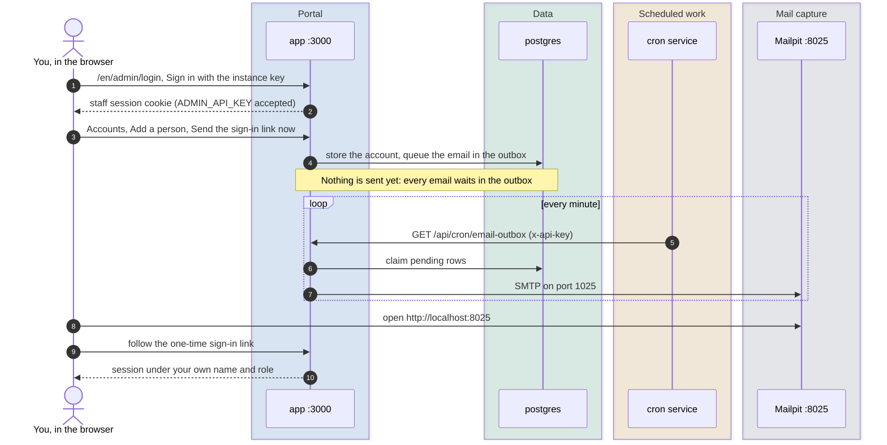
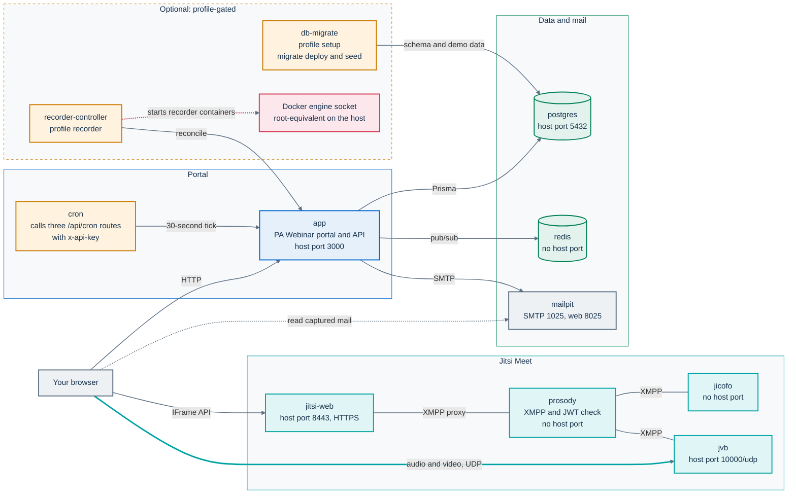
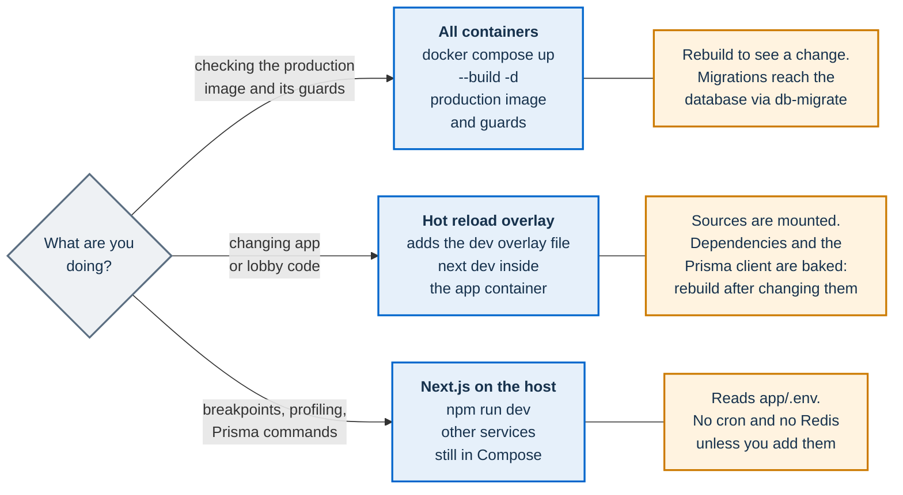

# Local development

This page explains how to run PA Webinar on your own machine: the Docker Compose stack, the three ways to work on the code, the database workflow, the separate components and the problems people run into most often. It is for contributors who change the code. Docker Compose is the development loop, not an installation: to try the product or the Helm chart on a workstation, use [minikube](install/minikube.md), which installs the same chart that runs in production.

Other topics have their own pages:

- how to run and write tests: [Testing](development/testing.md);
- branching, commits, review and the gates a change must pass: [How we develop PA Webinar](development/methodology.md) and [Contributing](../CONTRIBUTING.md);
- code conventions and step-by-step recipes for each kind of change: [Extending PA Webinar](development/extending.md);
- installing PA Webinar, from minikube on a workstation to a single VM or a managed cluster: [Installing PA Webinar](install/README.md); the chart's keys: [Deploying with Helm](DEPLOYMENT.md).

## Prerequisites

| Tool | Version | Needed for |
|---|---|---|
| Docker Engine with the Compose plugin | Docker 24 or later, Compose 2.20 or later | The local stack. Podman also runs it, with `podman compose` |
| Git | Any recent version | Cloning the repository |
| Node.js | 20 or later (`engines` in the root `package.json`) | Running Next.js on the host, tests, lint, type checks and scripts |
| npm | 10 or later (`engines` in the root `package.json`) | Installing the workspaces |

Only Docker and Git are needed to start the stack. Some component checks need more tools: Helm 3, `openssl` and Python 3 with PyYAML for the chart validator, and Python 3 for the AI worker tests. [Testing](development/testing.md) lists what each check needs.

The repository is an npm workspace with two packages, `app` (the Next.js portal) and `lobby` (the waiting-room square). The recorder bot and the recorder controller under `infra/` are separate npm projects with their own lockfiles. The AI worker is a Python package.

## Quick start

```bash
git clone https://github.com/italia/pa-webinar.git
cd pa-webinar

# Build the portal image and start every default service
docker compose up --build -d

# First run only: apply the database migrations and load the demo data
docker compose --profile setup run --rm db-migrate
```

| What | Address |
|---|---|
| Portal | <http://localhost:3000> (redirects to your browser's language when it is one of the 24, otherwise to the default `/it`) |
| Jitsi Meet | <https://localhost:8443> |
| Mailpit, the captured email | <http://localhost:8025> |

**Accept the Jitsi certificate once.** The local Jitsi serves a self-signed certificate. Open <https://localhost:8443> in the browser you will test with and accept the warning. Until you do, the browser refuses the embedded conference and the live room shows no call. You only need to visit port 8443 for this: Jitsi accepts only tokens signed by the portal (`AUTH_TYPE=jwt`, `ENABLE_GUESTS=0` in `docker-compose.yml`), so rooms are always opened from the portal.

**What the `setup` profile does.** The `db-migrate` service runs `npx prisma migrate deploy` and then `npx tsx prisma/seed.ts`. The seed script (`app/prisma/seed.ts`):

- makes sure the system event templates exist;
- creates the site settings row if it is missing;
- creates three demo events, two `PUBLISHED` and one `ENDED`, and prints a moderator link for each one.

> **Re-running the profile resets the demo content.** Before it creates its examples, the seed deletes every event (with its registrations, questions, polls and materials), the GDPR audit log and the event templates that staff created. To apply new migrations without the seed, see [Where migrations are applied](#where-migrations-are-applied).

The `app` container never applies migrations itself. Its entrypoint (`scripts/docker-entrypoint.sh`) only waits for the database. After you pull code that adds a migration, apply it before you restart the app.

## First access

The administration area has two ways in. The instance API key (`ADMIN_API_KEY`) is for the first access, emergencies and automation. Named staff accounts, organizers and administrators, sign in with a one-time link sent by email. How both work is described in [Identity, access and tokens](architecture/identity-and-access.md).

1. Open <http://localhost:3000/en/admin/login>. The English UI is used here so that the labels match this page. Expand **Sign in with the instance key**, which is collapsed by default, enter the key in **Access key** and press **Sign in**.
   - The Compose stack sets `ADMIN_API_KEY=dev_admin_key_2026` in `docker-compose.yml`.
   - When Next.js runs on the host, the key comes from `app/.env`. The template `.env.example` sets `change_me_admin_key_in_production`.
   - Both values are public development placeholders. Never use them in a real installation (see [Development placeholders](../SECURITY.md#development-placeholders)).
2. Open **Accounts** (`/en/admin/organizers`). Under **Add a person**, enter a name and an email, choose the **Role** (**Organiser** or **Administrator**) and press **Add**. **Send the sign-in link now** is selected by default.
3. The sign-in email is queued in the email outbox, like every email the platform sends. The Compose `cron` service drains the outbox every minute, and the message then appears in Mailpit at <http://localhost:8025>. When Next.js runs on the host, the `cron` service cannot reach it: drain the outbox yourself (see [Next.js on the host](#nextjs-on-the-host)).
4. Follow the link. It works once and expires after the number of minutes set by `DURATA_LINK_MINUTI` in `app/src/lib/auth/staff-link-config.ts`. Later, request a new link from the same sign-in page with **Send me the link**.



To act as a moderator of a demo event, open one of the moderator links that the seed printed. There is no scaler in the local stack, so a room opens only when a moderator presses **Start event** (see [Local stack vs cluster](#local-stack-vs-cluster)).

## Local services

`docker compose up` starts every service below, except the two in a profile. The image tags are in `docker-compose.yml`.

| Service | Image or build | Host port | Role |
|---|---|---|---|
| `app` | Built from the root `Dockerfile` (the production image) | 3000 | The PA Webinar portal and its API. It starts once `postgres` and `redis` are healthy |
| `postgres` | `postgres` (Alpine) | 5432 | Database `pa_webinar`, user `eventi`. Data lives in the `postgres_data` volume |
| `redis` | `redis` (Alpine) | none | Realtime fan-out (chat, raised hands, live panels, square presence). Runs without persistence |
| `jitsi-web` | `jitsi/web` | 8443 (HTTPS, self-signed) | Jitsi Meet web app and IFrame API |
| `prosody` | `jitsi/prosody` | none | XMPP server. Verifies the portal's JWT and loads the custom module from `infra/jitsi/prosody-plugins/` |
| `jicofo` | `jitsi/jicofo` | none | Conference focus |
| `jvb` | `jitsi/jvb` | 10000/udp | Jitsi Videobridge. Carries the audio and video |
| `mailpit` | `axllent/mailpit` | 8025 (web), 1025 (SMTP) | Captures every outgoing email, so nothing reaches a real inbox |
| `cron` | `curlimages/curl` | none | Calls three `/api/cron/*` routes of `app` with the `x-api-key` header |
| `db-migrate` (profile `setup`) | The `builder` stage of the root `Dockerfile` | none | One-shot: `prisma migrate deploy`, then the seed |
| `recorder-controller` (profile `recorder`) | Built from `infra/recorder-controller/` | none | Starts one recorder bot container per recording (the per-participant recording path) through the Docker socket |

A few details matter when something does not work:

- **The `cron` loop.** It ticks every 30 seconds. It calls `email-outbox` every minute, `reminders` every 5 minutes and `cleanup` every hour, all three once at start-up. Each call logs `[cron] <route> ok` or a failure line (`docker compose logs cron`). Calls fail while the app is still starting, which is harmless. The cluster runs more jobs, at other cadences: see the parity matrix below and [Scheduled and background jobs](architecture/background-jobs.md).
- **The bridge address.** The `jvb` service advertises `DOCKER_HOST_ADDRESS` (default `host.docker.internal`) as its address, and asks a public STUN server (`JVB_STUN_SERVERS` in `docker-compose.yml`) for its public address. Browsers on the same machine connect without changes. Other devices need more than this: see [Testing from another device](#testing-from-another-device).
- **Shared placeholders.** `JITSI_JWT_SECRET` (default `s3cr3t_dev_only`) must be the same for `app`, `jitsi-web` and `prosody`, and `CRON_API_KEY` must be the same for `app`, `cron` and `recorder-controller`. Only `JITSI_JWT_SECRET`, `DOCKER_HOST_ADDRESS` and `COMPOSE_PROJECT_NAME` are read from your shell or from a `.env` file next to `docker-compose.yml` (ignored by Git). Every other value, `CRON_API_KEY` and `ADMIN_API_KEY` included, is written literally in each service, and changes only through an override file that updates every service that uses it.
- **The PII key escape hatch.** The Compose `app` runs the production image with a dummy `PII_ENCRYPTION_KEY`, so it sets `ALLOW_INSECURE_PII_KEY=true`. Only `docker-compose.yml` sets it; `.env.example` deliberately does not. The reason is in [Development placeholders](../SECURITY.md#development-placeholders).



The Docker engine socket, and the controller's edge to it, are drawn in red on purpose. A process that holds the Docker socket controls every container on the host. Enable the `recorder` profile only where per-participant recording is wanted.

## Local stack vs cluster

PA Webinar is built for Kubernetes, and the Helm chart is the supported way to install it. The Compose stack is a development stack, but not a reduced demo: it runs the same portal image, the same Jitsi components and the same Redis fan-out. Some capabilities, however, belong to the cluster, and some need hardware or services that Compose does not ship. This matrix tells you which is which, so that you do not chase a bug that is really a missing piece.

Legend:

- **Same**: the same code path as in a cluster.
- **Partial**: present, with the differences given.
- **Manual**: works, but a person does what automation does in a cluster.
- **Not included**: Compose does not ship it; you can add it yourself.
- **Not applicable**: a cluster capability that means nothing on a single machine.

| Capability | Local (Compose) | Kubernetes (Helm chart) |
|---|---|---|
| Portal, registration, live room, Q&A, polls, word cloud, reactions, timer, waiting room | **Same** | Same |
| Realtime fan-out: chat, raised hands, live panels, the square | **Same**, with Redis running without persistence. When Next.js runs on the host without `REDIS_URL`, fan-out degrades as described in [Redis availability](architecture/live-interaction.md#redis-availability) | Redis subchart or managed Redis |
| Email: confirmations, reminders, calendar files, sign-in links | **Same** outbox path. Mailpit captures the messages, and the `cron` service drains the outbox | CronJob `email-outbox` and a real SMTP relay |
| Scheduled jobs | **Partial**: only `email-outbox` (every minute), `reminders` (every 5 minutes) and `cleanup` (hourly). `recordings-reconcile`, `rubrica-retention`, `multitrack-purge`, the post-production jobs and the JVB scaler never run. Call a `/api/cron/*` route by hand with the same header if you need it | CronJobs, at the schedules in `infra/helm/pa-webinar/values.yaml` ([catalog](architecture/background-jobs.md)) |
| Event lifecycle automation: pre-start provisioning, `IDLE`, automatic end | **Manual**: a moderator opens the room with **Start event** and closes it with **End for everyone**. Without an end, an event stays `LIVE` ([Running without the scaler](architecture/event-lifecycle.md#running-without-the-scaler)) | Automatic with the `full` profile and the JVB scaler |
| JVB scale-to-zero | **Not applicable**: the bridge is always on | JVB scaler CronJob and a dedicated node pool ([Scaling the media plane](architecture/scaling.md)) |
| Jitsi images | **Partial**: stock `jitsi/*` images on the moving `stable` tag. Advanced noise suppression stays off, which is the application default | Versions pinned by the Jitsi subchart, plus the patched web image ([ADR-017](adr/017-patched-jitsi-web-image.md)) |
| TURN relay for restrictive networks | **Not included**: browsers must reach UDP port 10000 directly | Optional coturn from the Jitsi subchart, off by default (`jitsi-meet.coturn.enabled`; keys in [Deploying with Helm](DEPLOYMENT.md#coturn-turn-and-turns), when TURN is needed in [Infrastructure](INFRASTRUCTURE.md#turn)) |
| Object storage: uploads, recordings, AI outputs | **Not included**: Compose ships no object store. Uploads in the administration area and chat attachments answer `503`, while materials given as links keep working. To test them, add an S3-compatible store and configure both domains ([Object storage](configuration/storage.md)) | Azure Blob Storage or an S3-compatible service |
| Composite video recording (Jibri) | **Not included**. Pressing the record control shows **Recording unavailable — Jibri not configured** | Optional (`jitsi-meet.jibri.enabled`), on in the standard and full example profiles ([Deploying with Helm](DEPLOYMENT.md)) |
| Per-participant recording | **Partial**: the `recorder` profile starts the controller and its Docker runner. As shipped, the Compose file does not complete a recording: see [the `recorder` profile](operations/recording-setup.md#docker-compose-the-recorder-profile) | Recorder controller and one Job per recording |
| AI post-production | **Not included**: no GPU, no worker, no orchestrator, no vLLM | GPU node pool that scales to zero ([AI post-production](POSTPROD.md)) |
| Metrics, alerts, dashboards | **Partial**: the app serves the same metrics endpoint and **System status** page; there is no Prometheus, no alert rules and no dashboard ([Monitoring and health](operations/monitoring.md)) | Optional ServiceMonitor, PrometheusRule and Grafana dashboard |
| Horizontal scaling, TLS, managed secrets | **Not applicable**: one machine does not scale out. The portal is served over plain HTTP and the secrets are public placeholders | HPA, cert-manager annotations, External Secrets Operator |

### Hard limits

Three capabilities are not part of the Compose stack and are impractical on a typical workstation:

- **AI post-production** needs a CUDA GPU and the weights of every model the pipeline runs: speech recognition (WhisperX), diarization (pyannote), speech synthesis (Piper) and a language model served by vLLM. The default language model, set in `app/src/lib/ai/providers.ts` (`mistralai/Mistral-Small-3.2-24B-Instruct-2506`), needs tens of gigabytes of GPU memory at fp16 on its own. On a CPU the pipeline would take far too long to be usable. The in-cluster pipeline (orchestrator, worker and vLLM) runs only in a cluster. A workstation with an NVIDIA GPU can run the stages off-cluster with the `infra/ai/local-out/` development tool, on test data only (see [AI post-production worker](#ai-post-production-worker)). Everything else in the platform works without it. GPU node pools are covered in [Node pools](INFRASTRUCTURE.md#node-pools), the pipeline in [AI post-production](POSTPROD.md).
- **JVB scale-to-zero** is only useful where nodes are billed by use and a cluster autoscaler can remove them. On a single machine the bridge is already running.
- **Jibri** needs the ALSA loopback kernel module on its host and elevated container privileges: the Jitsi subchart adds the `SYS_ADMIN` capability. A developer workstation is rarely prepared for either. Without a cluster, the recording path is the per-participant recorder, with the limits linked above ([Recording](architecture/recording.md)).

The Compose stack is for development, not for evaluating an installation or running events: the portal is served over plain HTTP, the secrets are public placeholders and no container has resource limits. To try the product and the chart on a workstation, use [minikube](install/minikube.md). To run PA Webinar on a single machine, [Installing on your own VMs with k3s](install/k3s.md) installs the Helm chart on one VM. Making a single server a supported production path is tracked under **Single-server installation** in the [roadmap](ROADMAP.md#installation-and-operations).

## Development modes

There are three ways to run the portal while you work. They share the Compose services for the database, Jitsi and email.



### All containers

This mode runs the production image, built with `NODE_ENV=production`, so the production guards on secrets apply as in a real installation, except the `PII_ENCRYPTION_KEY` guard, which Compose deliberately bypasses with `ALLOW_INSECURE_PII_KEY=true`. To see a code change, rebuild.

```bash
docker compose up --build -d      # build and start
docker compose ps                 # state and health of each service
docker compose logs -f app        # follow one service
docker compose down               # stop, keep the data
docker compose down -v            # stop and delete the volumes: database and Jitsi configuration
```

After `down -v`, run the `setup` profile again.

### Hot reload with the dev overlay

```bash
docker compose -f docker-compose.yml -f docker-compose.dev.yml up --build
```

`docker-compose.dev.yml` changes only the `app` service:

- It builds the `deps` stage of the `Dockerfile`, which holds the dependencies and the generated Prisma client, and runs `npx next dev --hostname 0.0.0.0` with `NODE_ENV=development`.
- It mounts `app/src`, `app/public`, `app/prisma` and `lobby/src` from your checkout. `lobby/src` is mounted because the live-room page imports the square: without it the page does not compile.
- Edits under those folders reload in the browser without a rebuild.

Everything else is baked into the image at build time: `node_modules`, the Prisma client, and configuration outside the mounts such as `app/next.config.ts` and the `package.json` files. After you change dependencies, `schema.prisma` or those files, run the command again with `--build`.

Because `app/public` comes from your checkout, the icon sprite must exist there. `app/public/svg/sprites.svg` is not in Git: `npm install` (or `npm ci`) on the host copies it from `bootstrap-italia` in the app's `postinstall` step. If icons are missing in this mode, run that once on the host.

The development server applies no production guards, so the placeholders are accepted as they are. The `cron` service keeps calling `http://app:3000`, so email works as in the first mode.

### Next.js on the host

Use this mode for breakpoints, profiling, or Prisma commands against the local database.

```bash
# 1. Start the infrastructure only, without the app and cron containers
docker compose up -d postgres prosody jicofo jvb jitsi-web mailpit
#    (if the full stack is already running: docker compose stop app cron)

# 2. Create the environment file the app reads
cp .env.example app/.env

# 3. Install the workspaces: postinstall generates the Prisma client and copies the icon sprite
npm ci

# 4. Apply the migrations and, optionally, load the demo data (the seed deletes existing events)
npm run db:migrate --workspace=app
npm run db:seed --workspace=app

# 5. Start the development server on port 3000
npm run dev
```

Things that differ from the container modes:

- **Where settings come from.** Next.js and the Prisma CLI run in `app/`, so they read `app/.env`, not a `.env` at the repository root. `.env.example` already points at the Compose services on `localhost`: PostgreSQL on 5432, Mailpit SMTP on 1025, Jitsi on 8443, and the same `JITSI_JWT_SECRET` as Compose. Every variable is described in the [Configuration reference](CONFIGURATION.md).
- **The instance key** is the one in `app/.env` (`change_me_admin_key_in_production` in the template), not the Compose one.
- **No email is sent until you drain the outbox.** The `cron` service calls `http://app:3000` and cannot reach a server on the host. Call the route yourself:

  ```bash
  curl -fsS -H "x-api-key: dev_cron_key_change_in_production" \
    http://localhost:3000/api/cron/email-outbox
  ```

  Use the `CRON_API_KEY` value from `app/.env`. The same works for `reminders` and `cleanup`.
- **Redis is optional.** `.env.example` sets no `REDIS_URL`, so realtime fan-out is off: chat still works through its backfill, live panels fall back to polling, and **System status** reports Redis as an outage ([Redis availability](architecture/live-interaction.md#redis-availability)). The Compose `redis` service publishes no host port. To use it, publish one in a local override file that you keep out of Git. Compose loads `docker-compose.override.yml` automatically when you pass no `-f` option:

  ```yaml
  # docker-compose.override.yml
  services:
    redis:
      ports:
        - "6379:6379"
  ```

  Then run `docker compose up -d redis` and add `REDIS_URL="redis://localhost:6379"` to `app/.env`.
- **Guards.** `npm run dev` runs with `NODE_ENV=development`, where the placeholder secrets are accepted. `npm run build` followed by `npm run start` runs with `NODE_ENV=production` and refuses the placeholder `PII_ENCRYPTION_KEY`. Generate real values for such a build.

## Database workflow

PostgreSQL is managed with Prisma and versioned SQL migrations in `app/prisma/migrations/`. `app/prisma/schema.prisma` is the authority on the data model. The rules for writing a migration, such as additive only and never editing an applied one, are in [Data model: migrations](architecture/data-model.md#migrations).

### Scripts

Run them from the repository root with `--workspace=app`. They are defined in `app/package.json`. They read `DATABASE_URL` from `app/.env`, so they target the local database when you follow [Next.js on the host](#nextjs-on-the-host).

| Script | Runs | Use it to |
|---|---|---|
| `db:migrate:dev` | `prisma migrate dev` | Create a migration from your schema change, apply it and regenerate the client |
| `db:migrate:create` | `prisma migrate dev --create-only` | Create the SQL without applying it, so you can add what Prisma cannot express (a CHECK constraint, a partial index) |
| `db:migrate` | `prisma migrate deploy` | Apply pending migrations only. This is what installations run |
| `db:migrate:status` | `prisma migrate status` | See which migrations are applied |
| `db:migrate:reset` | `prisma migrate reset` | Drop the local database and replay every migration. Destroys all data |
| `db:generate` | `prisma generate` | Regenerate the client after pulling a schema change |
| `db:seed` | `tsx prisma/seed.ts` | Load the demo data. Deletes existing events first |
| `db:studio` | `prisma studio` | Browse and edit the data in a local web UI |
| `db:push` | `prisma db push` | **Do not use.** It changes the database without writing a migration |

The root `package.json` also has shortcuts for `db:migrate`, `db:push` and `db:studio`.

### Changing the schema

1. Edit `app/prisma/schema.prisma`. Every model has `@@map` to a snake_case plural table name and every field its `@map` (see [Data model](architecture/data-model.md)).
2. Run `npm run db:migrate:dev --workspace=app` and give the migration a descriptive name. Prisma writes `app/prisma/migrations/<timestamp>_<name>/migration.sql`, applies it and regenerates the client.
3. Read the generated SQL. Check that it only adds things, and that it keeps existing data.
4. Commit `schema.prisma` and the new migration folder together. CI rejects a schema that the migrations do not reproduce.
5. If the model holds participants' personal data, also add it to the GDPR cleanup: see [Extending PA Webinar](development/extending.md) and [Privacy and data protection](GDPR.md).

Never use `db:push`, on your machine or anywhere else. It leaves no migration behind, so every other installation drifts from yours, and the CI check fails.

### Where migrations are applied

| Where | How | What runs |
|---|---|---|
| Host, during development | `npm run db:migrate:dev --workspace=app` | Creates and applies migrations, regenerates the client |
| Docker Compose | `docker compose --profile setup run --rm db-migrate` | `prisma migrate deploy`, then the seed |
| Docker Compose, migrations only | `docker compose --profile setup run --rm --build db-migrate npx prisma migrate deploy` | `prisma migrate deploy` from a freshly built image, without the seed |
| Kubernetes | The `db-migrate` init container of the app Deployment | `npx prisma migrate deploy` before each new app pod starts ([Upgrades and rollback](operations/upgrades.md)) |
| CI | The **Migration Integrity** job in `.github/workflows/ci.yml` | Applies every migration to an empty database, then fails if `schema.prisma` differs from the result |

The `db-migrate` image copies `app/prisma/` at build time. Without `--build`, a new migration pulled since the last build is not in the image.

To reproduce the CI **Migration Integrity** check before you push, follow [CI parity](development/methodology.md#ci-parity-before-every-push); never point the shadow database at your development database.

## Working on components

Beyond the portal, the repository holds components that you build and run on their own. This section covers running them during development. How to test each one, and what CI runs, is in [Testing](development/testing.md).

### The square (`lobby/`)

The optional 2D waiting-room square is a Phaser game in the `lobby` workspace. It never talks to a backend: presence, conference state, schedule and media devices come in through four injected ports. Its harness wires mock implementations, so you can work on it without the stack:

```bash
npm run lobby:dev          # Vite harness on http://localhost:5180
```

Query parameters shape the harness: `?in=<seconds>` until the event goes live (`0` means live now), `?bots=<n>` simulated people, `?host=1` to enter early as a host, `?map=classic` for the alternative map, and `?embed=1` to reproduce how the square behaves inside the portal. The canvas cannot be tested in a headless browser, so check canvas behavior by hand here. The portal loads the library as source (`transpilePackages` in `app/next.config.ts`), so changes to `lobby/src/` also show up in the live room with the dev overlay; the harness in `lobby/dev/` is never loaded by the portal. The type check is in [Testing: Lobby](development/testing.md#lobby). See also [`lobby/README.md`](../lobby/README.md) and [The waiting room and the square](architecture/waiting-room.md).

### Recorder bot and recorder controller

`infra/recorder/` (the per-participant recorder bot) and `infra/recorder-controller/` (the reconciling controller) are separate npm projects with their own lockfiles. Their type checks and unit tests are in [Testing: Recorder bot and controller](development/testing.md#recorder-bot-and-controller). Capture itself needs a real conference and cannot run in unit tests.

To run the pair against the local stack, start the `recorder` profile (`docker compose --profile recorder up -d`). Keep in mind:

- `docker-compose.yml` sets `RECORDER_IMAGE` to the moving `ghcr.io/italia/pa-webinar-recorder:dev` tag, and the controller requires that variable. The controller creates bot containers through the Docker Engine API without pulling images, so an image that is not local fails with "No such image". Run `docker pull ghcr.io/italia/pa-webinar-recorder:dev` first;
- to test local changes, build `docker build -t pa-webinar-recorder:local infra/recorder`. `RECORDER_IMAGE` is written literally in `docker-compose.yml`, so setting it in your shell or in `.env` does nothing. Override it in `docker-compose.override.yml`:

  ```yaml
  # docker-compose.override.yml
  services:
    recorder-controller:
      environment:
        RECORDER_IMAGE: pa-webinar-recorder:local
  ```

- the controller attaches bot containers to the network `${COMPOSE_PROJECT_NAME:-pa-webinar}_default`. Compose names the project after your checkout folder, so set `COMPOSE_PROJECT_NAME=pa-webinar` if the folder has another name;
- as shipped, the profile does not complete a recording: the bot needs more settings, a reachable Jitsi host with a trusted certificate and a recordings store. The list is in [Setting up recording](operations/recording-setup.md#docker-compose-the-recorder-profile).

Component details are in [`infra/recorder/README.md`](../infra/recorder/README.md) and [`infra/recorder-controller/README.md`](../infra/recorder-controller/README.md). The mechanism is described in [Recording](architecture/recording.md).

### AI post-production worker

The worker in `infra/ai/worker/` is a Python package. Its unit tests need no GPU. No test loads a model: the heavy libraries (torch, WhisperX, pyannote) are imported only inside the functions that use them, and the tests do not call those functions. The commands and what the suite covers are in [Testing: AI worker](development/testing.md#ai-worker).

`WORKER_STUB=1` (`postprod.worker.stub` in the chart) replaces speech recognition, the language model and speech synthesis with canned outputs. It exercises the claim, upload and register loop without a GPU, but the worker still needs a portal (`APP_INTERNAL_URL`, `CRON_API_KEY`), a queued job and a recordings store. In practice, stub mode is useful in a test cluster rather than in Compose.

`infra/ai/local-out/` holds a development tool that runs the pipeline stages off-cluster on a workstation with an NVIDIA GPU and writes the results straight into a database. It bypasses the portal's encryption. Read its [README](../infra/ai/local-out/README.md) before you use it, and never point it at real data. See also [`infra/ai/worker/README.md`](../infra/ai/worker/README.md) and [AI post-production](POSTPROD.md).

### Helm chart

No other local check reads the chart, so run `./scripts/validate-chart.sh` whenever you touch `infra/helm/`. It renders every profile and checks the invariants that would break an installation. What it needs (Helm 3, `openssl`, Python 3 with PyYAML and the subcharts), how to fetch the subcharts, and the server-side dry run that only CI adds are in [Testing: Helm chart](development/testing.md#helm-chart). The chart reference is [Deploying with Helm](DEPLOYMENT.md), with a pointer in [`infra/helm/pa-webinar/README.md`](../infra/helm/pa-webinar/README.md).

To see a chart change running, install it on minikube with `scripts/minikube-up.sh` ([Try PA Webinar on minikube](install/minikube.md)). Without registry credentials, the script builds the portal and migration images from your checkout, uncommitted changes included, and loads them into the node. Running it again after a change rebuilds the images when needed and upgrades the release with the same secrets. Loading the two images into the node takes about 96 s after each rebuild, which is why Compose stays the faster loop for application code, and minikube the place to test the chart, its values and the Kubernetes jobs.

## Working with translations

The interface ships in 24 languages, with catalogs in `app/src/i18n/messages/`. A new string goes into all 24, and the parity test in the unit suite fails when a key is missing or empty in any catalog, or when its placeholders differ. The steps are in [Extending PA Webinar](development/extending.md#adding-ui-text-or-a-language), and the sync script is described in [Languages and localization](architecture/i18n.md#the-sync-script).

## Troubleshooting

### The live room shows no call

The embedded conference stays empty or shows a connection error. The browser has not accepted the self-signed certificate of the local Jitsi. Open <https://localhost:8443>, accept the warning, and reload the live room. The Content Security Policy also allows frames only from the host in `NEXT_PUBLIC_JITSI_DOMAIN` (`localhost:8443` locally): if you changed it, the browser console names the blocked source ([Content Security Policy](SECURITY-CSP.md)).

### A port is already in use

The stack publishes 3000, 5432, 8443, 8025, 1025 and 10000/udp on the host. A local PostgreSQL on 5432 is the most common conflict. Find the process:

```bash
ss -tulpn | grep -E ':(3000|5432|8443|8025|1025|10000)\b'
# or: lsof -i :5432
```

Stop it, or move the Compose port in a local override file. Plain lists of ports are merged, so replace the list with the `!override` tag (Compose 2.24.4 or later):

```yaml
# docker-compose.override.yml
services:
  postgres:
    ports: !override
      - "55432:5432"
```

When Next.js runs on the host, change the port in `DATABASE_URL` in `app/.env` to match.

### `ChunkLoadError` after a rebuild

The browser still holds chunks from the previous build. Reload with the cache bypassed (Ctrl+Shift+R, or Cmd+Shift+R on macOS). When Next.js runs on the host and the error persists, delete the build cache and restart:

```bash
rm -rf app/.next
npm run dev
```

### Fonts do not load

The fonts are self-hosted: the files are in `app/public/fonts/` and are declared with `@font-face` in `app/src/styles/_fonts.scss`. No CDN is involved. A 404 on `/fonts/…` means the files are not served from `app/public`: check that they exist and, with the dev overlay, that `app/public` is mounted. The font licenses are listed in [`app/public/fonts/README.md`](../app/public/fonts/README.md).

### Icons are missing

The icons come from `app/public/svg/sprites.svg`, which is not in Git. The image build copies it from `bootstrap-italia`. On the host and with the dev overlay, it exists only after `npm install` or `npm ci` on the host has run the app's `postinstall` step (`npm run copy-sprites --workspace=app` does only the copy).

### The database is unreachable

```bash
docker compose ps postgres
docker compose logs postgres
docker compose exec postgres pg_isready -U eventi -d pa_webinar
```

After `docker compose down -v`, the database is empty: run the `setup` profile again.

### Database errors after updating the code

Errors about a missing table or column after a pull mean that a new migration has not been applied. The `app` container does not migrate on start. Apply the migrations without the seed, then restart the app:

```bash
docker compose --profile setup run --rm --build db-migrate npx prisma migrate deploy
docker compose up -d --build app
```

When Next.js runs on the host, run `npm run db:migrate --workspace=app` and `npm run db:generate --workspace=app` instead.

### Emails do not arrive

Check the `cron` service first. Without it, every email stays queued in the outbox, and a registration looks half done: the page confirms it, but no email ever comes.

1. `docker compose logs cron` should show `[cron] email-outbox ok` every minute.
2. Open Mailpit at <http://localhost:8025>. The Compose `app` sends to `mailpit:1025`. When Next.js runs on the host, `app/.env` sends to `localhost:1025` and you drain the outbox yourself (see [Next.js on the host](#nextjs-on-the-host)).
3. If the outbox rows stay pending or fail, see [Email delivery: troubleshooting](configuration/email.md#troubleshooting-delivery).

### The instance key is rejected

Compose and the host server use different keys: `dev_admin_key_2026` from `docker-compose.yml` for the container, and `ADMIN_API_KEY` from `app/.env` for the host server. Make sure you are using the key of the server that answers on port 3000.

### Testing from another device

The local stack is addressed as `localhost`, so a phone or a second computer cannot use it as it is. Everything below points at the development machine:

- `NEXT_PUBLIC_APP_URL` (`http://localhost:3000`): links in emails and redirects;
- `NEXT_PUBLIC_JITSI_DOMAIN` (`localhost:8443`): the host of the embedded conference, the frame source allowed by the Content Security Policy, and the default subject of the Jitsi token;
- `PUBLIC_URL` of `jitsi-web` (`https://localhost:8443`);
- `DOCKER_HOST_ADDRESS` of `jvb` (default `host.docker.internal`): the address the bridge advertises for media;
- the self-signed certificate, which every device must accept;
- camera and microphone: browsers grant them only in a secure context (HTTPS, or `localhost`), and the conference frame inherits the portal page's context, so over plain HTTP from another device no one can join with audio or video;
- the staff session cookie (`app/src/lib/auth/admin-session.ts`) and the participants' event-access cookie (`app/src/lib/event-session.ts`). The all-containers mode runs the production image, which marks both cookies `Secure`. Browsers drop a `Secure` cookie sent over plain HTTP, and most make an exception only for `localhost`, so a registrant who returns to the live room without `?token=` in the link is not recognized. The dev overlay and Next.js on the host run with `NODE_ENV=development` and do not mark them.

Media also needs UDP port 10000 open on the host, and there is no TURN relay, so a network that blocks UDP carries no audio or video. There is no ready-made recipe for changing all of these together. For tests with several real devices, install on a VM that they can reach ([Installing on your own VMs with k3s](install/k3s.md)): minikube with the Docker driver is reachable only from the workstation.

## Related pages

- [Testing](development/testing.md): test layers, commands and what CI runs.
- [How we develop PA Webinar](development/methodology.md): branches, commits, gates, review.
- [Extending PA Webinar](development/extending.md): code conventions and recipes.
- [Configuration reference](CONFIGURATION.md): every environment variable and secret.
- [Scheduled and background jobs](architecture/background-jobs.md): what the `cron` service and the CronJobs call.
- [Installing PA Webinar](install/README.md) and [Deploying with Helm](DEPLOYMENT.md): from minikube on a workstation to an installation.
