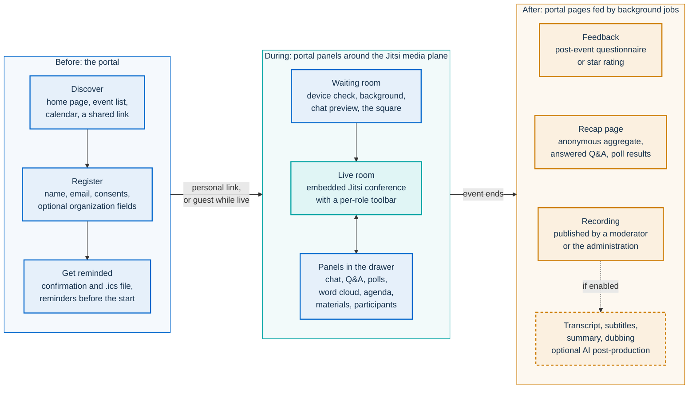
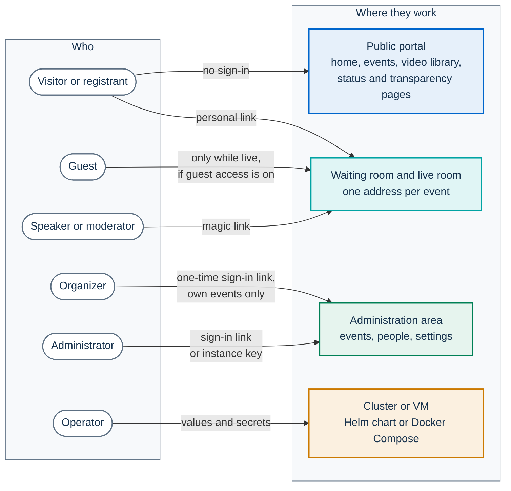
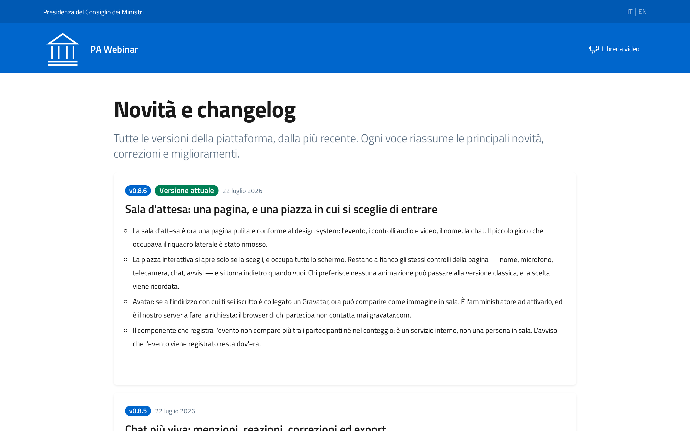

# Feature tour

PA Webinar is a platform that a public administration (PA) can use to run public online events: webinars, presentations, public meetings and instant calls. It embeds [Jitsi Meet](https://jitsi.org/) for audio and video. Everything around the call belongs to PA Webinar: the public portal, registration, the waiting room, live interaction, moderation, the administration area and what comes after the event.

This page lists what the platform does today, grouped by who uses it. Every item describes current behavior. Features that are off until someone turns them on are marked *Optional*. Anything not yet built is in the [roadmap](ROADMAP.md), not here. Terms are defined in the [glossary](GLOSSARY.md).

The interface can be offered in 24 EU languages, an administrator chooses which, and it defaults to Italian. UI labels are quoted in **bold** exactly as they appear in the English interface (`app/src/i18n/messages/en.json`). The screenshots show the Italian interface, so the Italian label follows in parentheses on first use where a screenshot shows it.

- [At a glance](#at-a-glance)
- [Public portal](#public-portal)
- [Registration and access](#registration-and-access)
- [Waiting room](#waiting-room)
- [Live room](#live-room)
- [Moderators and speakers](#moderators-and-speakers)
- [Organizers](#organizers)
- [Administrators](#administrators)
- [After the event](#after-the-event)
- [For operators](#for-operators)

## At a glance

### An event from the audience's side

Before the event, participants use the portal. During the event, they sit in portal panels that surround the Jitsi media plane. After the event, they see portal pages that background jobs fill in. Boxes with a dashed border are optional.

### Who uses which surface

Nobody has a user account with a password. Participants use a personal link. Guests need no link while an event is live, unless an administrator turns guest access off. Moderators and speakers use a magic link. Staff sign in with a one-time link sent by email, and the instance API key remains available to administrators.

Configured in: [Identity, access and tokens](architecture/identity-and-access.md).

## Public portal

The portal uses the .italia design system (Bootstrap Italia + design-react-kit) and serves its own fonts, icons and scripts: no page loads code or fonts from a third-party CDN. Every URL starts with a language prefix, and path segments are translated: `/it/eventi` and `/en/events` are the same page. The mechanism is described in [Languages and localization](architecture/i18n.md).

### Home page

An administrator picks one of five layouts under **Home page mode**: **Landing page** (the default), **Institutional landing**, **Plain-language landing**, **Events list** or **Custom**. They range from a full presentation of what the platform offers to a single invitation for people new to online events, or the administration's own HTML. What each layout contains is described in [Branding and white-labeling](configuration/branding.md#home-page).

### Finding events

- **Event list.** The **Events** (Eventi) page lists **Upcoming events** (Prossimi eventi) and **Past events** (Eventi passati). Tags can filter it (**Filter by tag**). Each tag has an Italian and an English name, a color and a sort order. Events that are warming up (`PROVISIONING`, `IDLE`) stay listed, so a visitor who arrives a few minutes early still finds the event.
- **Calendar.** *Optional.* A public calendar with day, week, month, year and list views, turned on by **Public calendar**. It is off by default. When it is off, its page returns "not found".
- **Event page.** The page shows the title and Markdown description in the visitor's language, the date and time zone, the cover image, the tags, the speakers and organizer when set, and the registration button. It also offers add-to-calendar links (Google, Outlook, Yahoo, and an `.ics` download). The page carries schema.org `Event` data and appears in the sitemap. When the event is live, it offers a link into the room.
  - **Before the start**, it also lists the event's materials marked **Always** or **Before the event**. The list disappears at the scheduled start time.
  - **With public registration off**, it says that registration is reserved for invited people and that the link to enter arrives by email. When the event has no invitees, it removes the registration button, says that registration is not open to the public, and links to **Already registered? Get your personal link again**.
- **Link previews.** When someone shares an event link, the preview image is a card that the server draws with the title, date, speakers, poster and organization. An administrator chooses which of these appear, or turns the card off.

Instant calls have no public event page while they run: whoever has the link goes straight into the room.

### Video library

The **Video library** (Libreria video) lists concluded events whose public page is visible, that were published to the library, and that have a published recording or a YouTube link. It has a search box for title and description and pages through results. Each card opens the event page, which holds the player or the YouTube link, the materials and any AI outputs.

### Transparency pages

- **Status page** (`/status`, **System status**). It shows an infrastructure map with live service health, latency and error figures, bridge capacity, and current participant and conference counts. It is on by default. When an administrator turns off **Status page enabled**, the page and its footer link disappear (`/status` answers "not found"), and its data is shown only to administrators, who keep it on the administration's **Infrastructure** page. The live room still reads whether the bridge and the recorder are ready.
- **Changelog** (`/changelog`, **What's new & changelog**, Novità e changelog). It shows release notes in the reader's language, with English as the fallback, and marks the running version with **Current version** (Versione attuale). If the installation links a public GitHub repository, each release that ships an SBOM has an **SBOM** button. The button opens a searchable view of the release's SPDX SBOM, which the server fetches and trims, and links to the release, its pipeline and the OpenSSF Scorecard.
- **Service inventory** (`/service-inventory`, **Provider service inventory**). It renders the installation's CycloneDX 1.6 document. The document has two parts: the software components (DEV) and the operational services each provider runs (OPS). If no document has been published, the page says so. Publishing is covered in [Service inventory: publishing](SERVICE-INVENTORY.md).
- **Security and transparency** (`/security`). It summarizes open source, SBOMs, the Scorecard, automated scanning and how to report vulnerabilities.

### Legal and privacy pages

- **Accessibility statement.** A built-in statement based on the AgID model (Agenzia per l'Italia Digitale, the Italian digital agency). The administration can replace it with its own text in each language.
- **Legal notes.** They name the organization that the site settings define.
- **Privacy policy.** The site-wide notice. Each event can link its own notice or a reusable privacy notice template.
- **My data.** Anyone can request a copy of their data (right of access, Art. 15) or its erasure (right to erasure, Art. 17). The platform emails a confirmation link that is valid for one hour, so nobody can read or delete another person's data by typing their address.
- **Address book opt-out.** The `/rubrica/opt-out` page removes a person from the address book when opened with a signed opt-out link. The platform's emails do not include such a link yet, so otherwise an administrator deletes the entry in **Address book**. An erasure request under **My data** deletes registrations but not the address-book entry. See [Privacy and data protection](GDPR.md#the-address-book).

### Screenshots

The screenshots show demo data (`npm run db:seed`) in the Italian interface. The live room is not pictured: it would need an event in progress and the faces of the people in it.

| | |
|---|---|
|  |  |
| **Home page** in the `LANDING` layout | **Events** with **Upcoming events** |
|  |  |
| **Video library** with search | **What's new & changelog** |

Configured in: [Branding and white-labeling](configuration/branding.md) · [Runtime settings](configuration/runtime-settings.md) · [Service inventory: publishing](SERVICE-INVENTORY.md).

## Registration and access

- **Registration form.** It asks for a name and an email, plus a set of consents that are never pre-checked:
  - the privacy notice (required);
  - recording (required when the event is recorded);
  - per-participant audio recording (required when that is on);
  - news about future events (optional);
  - inclusion in the address book (optional).
- **Organization fields.** The form can also ask for an organization (with autocomplete), a role and an organization type. An event turns these on with `requireOrganization`, `requireOrganizationRole` and `requireOrganizationType`. When on, the organization name is mandatory.
- **Pre-registration questionnaire.** *Optional.* When an event has one, it follows the registration form.
- **Personal link.** Registration returns a personal join link and sets a signed cookie in that browser (with invitation-only registration, opening the emailed link sets the cookie instead). A registrant who comes back to the room without the link is still recognized. A forwarded link does not carry the registrant's name: whoever opens it enters as a guest under a name they type. With invitation-only registration the emailed link is signed, so forwarding the whole email forwards the identity too.
- **Routing after registration.** If the event starts soon, the new registrant goes straight to the waiting room. How soon is set by the `waitingRoomLeadMinutes` site setting. Otherwise they see a confirmation screen with the calendar links. With invitation-only registration they are told to check their email instead.
- **Emails.**
  - A confirmation with the personal link and an `.ics` file.
  - Reminders. A new scheduled event gets two, one day and one hour before the start. The organizer can change them: up to five per event, chosen from presets between **7 days before** and **15 minutes before**.
  - A notice when the date of a published event changes.
  - An *optional* thank-you email after the event, with a recap and a feedback link.

  Emails are written in the registrant's language when copy exists for it, and in English otherwise. See [Email and calendar](architecture/email.md).
- **Capacity.** The expected number of participants sizes the video infrastructure. It is not a registration cap.
- **Guests.** Unless an administrator turns off **Guest access enabled**, anyone can join a scheduled event without registering while it is live (`LIVE`), after typing a name. Instant calls always admit anyone with the link, whatever the setting, including while the room is warming up.
- **Join password.** *Optional.* It is set in the instant-call form, or through the API for any event. Guests must type it. Registrants who use their personal link and people with a magic link skip it.
- **Invitations.** An organizer can keep a list of invitees (name, email, role **Guest** or **Speaker**) on each event, and administrators can fill it from the address book.
- **Invitation-only registration.** When an administrator turns off **Public registration enabled**, only addresses on the event's invitation list can register. The form gives the same answer, **Check your email**, whatever address is typed: an invited address is registered, an address that is already registered gets its link again, and any other address gets nothing. The personal link arrives only by email, and opening it binds that browser to the registration. An event with no invitees then accepts no new registrations, and its registration page only offers to send the link again to people who registered earlier. People who already hold a personal link or a magic link are not affected. Guest access is a separate switch: for a closed meeting, turn off **Guest access enabled** as well, or anyone can still join as a guest while the event is live.

Current limits:

- The platform does not send invitation emails and does not create a personal link for each invitee: invitees register themselves with the address they were invited with.
- With invitation-only registration, the pre-registration questionnaire is not shown, because the form's answer carries no personal link to submit it with.
- The event wizard does not show the organization fields. They can be switched on only through the API.

Configured in: [From creation to recap: the event journey](architecture/event-journey.md) · [Email and calendar](architecture/email.md) · [Privacy and data protection](GDPR.md).

## Waiting room

The waiting room is the single front door. Personal links and magic links always land there, whatever the event's status. The public room link lands there while guests are admitted, and otherwise sends the visitor to registration, or to the event page once the event has ended. The room adapts to the event's status: see [Event lifecycle](architecture/event-lifecycle.md) for the states.

- **Before the start.** It shows a countdown, a short netiquette and who moderates the event. A moderator sees **Start event**.
- **While the room warms up.** When the event is `IDLE` or `PROVISIONING`, a progress indicator shows how long the preparation has taken. Entry opens when the event goes live. The first visitor to an `IDLE` event wakes it.
- **When the bridge lags.** If the event is live but the bridge still reports not ready after a minute, the room offers **Enter anyway**, so a stale readiness signal never locks people out.
- **When live.** A short cue announces that the room is open, and the join button turns on.
- **After the end.** It links to the recording and the feedback.
- **Device check.** A camera preview, a microphone level meter and an audio test, with on and off switches. Participants start with camera and microphone off. Moderators, speakers and instant-call participants start with them on. On phones everyone joins muted, because mobile browsers need a tap to open the camera.
- **Virtual background.** A few neutral images, such as **Light office** and **Institutional blue**, applied on entry. Background blur is available inside the room.
- **Waiting-room music.** *Optional.* A track set on the event. It plays only before the start, and only after the participant chooses **Enable music**.
- **Chat preview.** If the event has chat turned on, registrants and moderators can already read and write in it while the room warms up. Once the event is live, everyone can.
- **Notices and consent gates.**
  - When AI post-production is on for the event, an **AI processing after the event** notice appears. Its text can be customized.
  - When per-participant recording is on, entry requires explicit consent.

### Classic view and the square

The waiting room has two layouts. The **classic view** is a static page with every control inline. **The square** is an optional 2D space built with Phaser: the people in it appear as avatars, and once the event is live you can walk into the gate to enter. A participant opens the square with **Step into the square**, leaves it with **Back to the waiting room**, and can switch to **Classic version** at any time, then return with **Back to the park**. The choice is remembered in that browser. Phones get the classic view by default.

An administrator sets the starting view per site or per event: **Videogame (Phaser lobby)** offers the square, and **Classic (static)** opens the classic view first. Visitors can still switch. How the view is resolved, the square's presence model and the accessibility contract are in [The waiting room and the square](architecture/waiting-room.md#engines-classic-view-and-the-square).

Current limits:

- The waiting room's "watch from the start" option needs a temporary recording URL. The platform does not produce one automatically, so catching up during a live event is not available.

Configured in: [Runtime settings](configuration/runtime-settings.md) · [From creation to recap: the event journey](architecture/event-journey.md).

## Live room

### The conference

- **Embedded Jitsi Meet.** The platform embeds Jitsi Meet through the IFrame API, and each role gets its own toolbar. There is no native hang-up button: every exit goes through the app, so that moderators get the leave prompt. Fullscreen is also handled by the app, so the side panels stay visible. See [How PA Webinar extends Jitsi Meet](architecture/jitsi-integration.md).
- **Participant permissions.** Each event decides whether participants may unmute, turn on their camera and share their screen. When a permission is off, its button disappears. Speakers always have full audio and video.
- **Video quality.** A site-wide preset that each event can override: **Save data (360p)**, **Balanced (540p)**, **High (720p, recommended)** or **Maximum (1080p, high fidelity)**. On phones the platform limits resolution and the number of incoming videos to protect battery and data.
- **Watermark.** The administration's logo can appear over the video, with configurable opacity and position.
- **Advanced noise suppression.** *Optional.* It needs the patched Jitsi web image. See [How PA Webinar extends Jitsi Meet](architecture/jitsi-integration.md).
- **Reconnection.** After a network drop the app tries to rejoin automatically and shows each attempt.
- **Top bar.** It shows the number of people present, the time left or the time elapsed (the audience can switch this on), **Share** (the **Link to join** and the **Event page**; moderators can also show the moderator link), and **Leave room**. When guest access is off, scheduled events offer only the event page, because the link to join would send the recipient to registration.
- **Banners.** One banner announces who is sharing their screen. Another appears after the scheduled end, stating when the room will close.

### Panels in the drawer

The drawer is a column on the right on desktop and a sheet from the bottom on smaller screens. It holds these panels:

| Panel | What it does | Default |
|---|---|---|
| **Chat** | Messages with replies, @mentions (with a browser notification), emoji reactions, image and PDF attachments up to 10 MB, and edits within 15 minutes. **Mark as a question** feeds a questions filter. Moderators can hide messages. Anyone who can read the chat can **Download the chat**. | On |
| **Q&A** | Questions of up to 500 characters with upvotes. Moderators **Highlight**, **Mark as answered** or **Dismiss**. | Off |
| **Polls** | Moderators create a poll, then **Close voting**, **Publish results** or **Reopen**. Each person votes once. | Always shown |
| **Word cloud** | A moderator starts a round with a topic and a duration, and participants send words. | Off |
| **Notes / Checklist** | Moderators list and tick off topics. The audience can mark **Agree** or **Disagree** on each item. | Off |
| **Materials** | Links and files shared for the event. The audience sees the materials marked **Always** or **During the event**. Moderators see every material, with its visibility marked on the restricted ones, and can add more during the call. | Always shown |
| **Participants** | Who is present, with a volume control for each person that changes only what you hear. Moderators also see their own connection quality and can remove people. | Always shown |

Moderators can switch Q&A, chat, **Notes / Checklist** and **Word cloud** on and off during the event. Everyone's panels update within seconds. See [Live interaction and realtime](architecture/live-interaction.md).

### Reactions, timers and raised hands

- **Reactions.** The site chooses the mode:
  - `NATIVE` (the default): Jitsi's own reactions button. It is ephemeral and nothing is counted.
  - `CUSTOM`: the app's reaction bar. Reactions are counted and appear in event analytics.
- **Presentation timer.** A moderator starts a countdown (presets **5 min** to **30 min**, or custom). With **Show to all**, everyone sees it. It ends with **Time's up!**
- **Event timer.** It shows the time to the scheduled end and keeps counting past it. It is on by default for moderators. Everyone else can switch it on, and the choice is remembered in the browser.
- **Raised hands.** The queue is visible to everyone, in order. A hand stays up while its owner speaks, until they lower it or a moderator deals with it.

### Recording in the room

*Optional*, and only when the event enables recording.

- Participants and guests see a **Recording consent** dialog before they enter. They can choose **Do not participate**.
- While recording is running, a banner stays visible to everyone.
- Moderators start and stop the recording. With **Start recording automatically**, it starts on its own.

The two capture paths (a composite video from Jibri, and per-participant audio from the recorder bot) are described in [Recording: composite video and per-speaker audio](architecture/recording.md).

### Whiteboard

*Optional.* This is the native Jitsi whiteboard (Excalidraw). It is opt-in per event and always on in instant calls, and only moderators on desktop can open it.

- It needs a whiteboard backend on the Jitsi side (`config.whiteboard.enabled`). The chart does not deploy one.
- The app's own **Whiteboard** button and the reminder to export the board also need `NEXT_PUBLIC_WHITEBOARD_ENABLED=true` in the app's runtime environment. It is read at request time, so no rebuild is needed. See [Configuration reference](CONFIGURATION.md).

Its content is not saved: moderators are reminded to export it and attach it as a material.

### Mobile

Below 992 px, the layout is a full-screen video with a floating control bar, and the drawer opens as a bottom sheet. Below 768 px, the Jitsi toolbar shrinks to microphone, camera, raised hand and settings, plus reactions in native mode. Moderators also get the participants pane. Screen sharing is hidden on phones because `getDisplayMedia` is not available inside iframes on iOS and most Android browsers.

### Leaving

**Leave room** takes participants out. Moderators get a choice:

- **Just leave.** The call goes on for everyone else.
- **End for everyone.** This opens **Event destiny**, which offers **Keep it public**, **Publish to the library** or **Archive (private)**. When the event records and AI post-production is on for it, it also offers a checkbox to generate the transcript and summary.

When the event ends, participants get the feedback form, unless feedback is turned off for the event.

Configured in: [Runtime settings](configuration/runtime-settings.md) · [Configuration reference](CONFIGURATION.md) · [From creation to recap: the event journey](architecture/event-journey.md).

## Moderators and speakers

Moderators and speakers have no accounts. They enter through magic links.

- **Moderator link.** It is the event's primary link (`?token=`). It identifies a *seat*, not a person: everyone who opens it is a moderator. An administrator can regenerate it from **Moderators**, and the old link then stops working.
- **Named grants.** Each is a personal link for one co-moderator (role `MODERATOR`) or speaker (role `SPEAKER`). They are created in the wizard's **People** step or on the event page, and each can be revoked on its own.
- **Where to find the links.** The event page in the administration area shows them. **Share** in the room can also reveal the moderator link to a moderator, with a warning. The platform does not email magic links.

What a moderator can do in the room:

| Area | Controls |
|---|---|
| Start and end | **Start event** in the waiting room. **End event** in the moderator bar, or **End for everyone** from **Leave room**. |
| Audio and video | **Participant mic** and **Participant video** moderation. Jitsi's own mute-everyone, security and participants-pane buttons. Remove a participant. |
| Raised hands | **Give the floor** (audio and video), **Audio only**, **Lower hand**. |
| Recording | **Start recording** and **Stop recording**, when the event enables recording. While the recorder starts, the button reads **Recording starting…**; if it has not started within the provisioning timeout, **Recording unavailable**; without a declared recordings storage (`RECORDING_STORAGE_TYPE`), **Recording not configured in infrastructure**. A running recording can always be stopped. |
| Interaction | Toggle Q&A, chat, **Notes / Checklist** and **Word cloud**. Run polls, word-cloud rounds and the presentation timer. Moderate Q&A and hide chat messages. Add materials. |

Speakers always have full audio, video and screen sharing. They have no moderation powers and no recording control, and they skip the participant recording-consent dialog.

A token that is shared or forwarded cannot act as another person: editing a chat message, for example, needs a personal identity. See [Identity, access and tokens](architecture/identity-and-access.md).

Configured in: [Identity, access and tokens](architecture/identity-and-access.md).

## Organizers

Organizers are staff accounts with the role `ORGANIZER`. They sign in with a one-time link sent by email, and they see and manage only the events they created. See [ADR-014](adr/014-organizer-role.md).

### The event wizard

Creating and editing an event use the same five steps. The wizard keeps an unsaved draft in the browser and offers to restore it.

| Step | Label | What it covers |
|---|---|---|
| 1 | **Basics** | Title and Markdown description in each enabled language, cover image, schedule and time zone, recurrence, tags, expected participants and the share expected to use a microphone or camera. Also the waiting-room audio. In **Advanced options**: the waiting-room layout, the video quality and the title kicker. |
| 2 | **Permissions** | **Who can do what**: a grid of roles against chat, Q&A, microphone, camera, screen share and recording control. Recording and its options. Room features (**Live notes / checklist (agenda)**, **Live word cloud**, **Shared whiteboard**). *Optional* **Automatic post-production**. |
| 3 | **People** | Co-organizing organizations, co-moderators, speakers and invitations. Administrators can also pick people from the address book. |
| 4 | **Content** | Materials (a file or a link, each with a visibility setting) and questionnaires. |
| 5 | **Review** | A summary, a capacity estimate, the privacy notice (a template, custom text or a document), the retention period and the primary moderator. **Save as draft** or **Publish event**. |

A new blank event starts with chat on, Q&A off, and participants' microphone, camera and screen share off (`defaultMatrix()` in `app/src/lib/utils/permission-matrix.ts`).

### Reuse and series

- **Event templates.** A template pre-fills the wizard: features, permissions, recording and AI options, default duration, retention and a description skeleton. Organizers pick templates, and administrators manage them.
- **Duplicate.** **Duplicate as next occurrence** (in the event card's menu) and **Duplicate for next time** (on the event page) create a draft copy of the whole configuration, including tags, co-organizing organizations, named grants (with new links), agenda, questionnaires and reminders. If the event has a recurrence rule, the copy is dated to the next occurrence.
- **Recurrence.** Daily, weekly, weekdays, monthly or a custom RRULE, with a preview of the next five occurrences. The rule does not create occurrences by itself: each one is made by duplicating the previous one.

### Running your events

- **Questionnaires.** A pre-registration questionnaire and a post-event questionnaire. Each combines reusable templates with questions for that event only (single choice, multiple choice, yes/no, Likert scale, open text).
- **Materials.** Documents and links, uploaded to object storage or referenced by URL. Each material has a visibility of **Always**, **Before the event**, **During the event** or **After the event**, and the server applies it on every public surface: the event page before the start, the live-room materials panel and the concluded event page. The status decides the phase: `LIVE` counts as during, `ENDED` and `ARCHIVED` as after, and otherwise the schedule decides. **Always** is the default, so a material appears on the public event page as soon as the event is published: set it to **During the event** or **After the event** to keep it off the page until then. Moderators see every material in the room, and staff see every material in the administration area. A staff session does not change what the public surfaces list. Visibility filters the lists only: a file stays downloadable from its URL by anyone who already has it, so it is not a way to keep a document confidential.
- **Co-organizing organizations.** A name, logo and website for each partner organization. These are display information only and grant no access.
- **Event page tabs.** **Overview**, **People** (registrations with CSV export, and the named grants), **Content**, **After the event** and **Statistics**. Invitations are edited in the wizard's **People** step.
- **Statistics.** Conversion, peak participants, duration, distinct interactors, raised hands, reactions, retention and an activity timeline. The composite attention score appears only in the administration area, to staff who manage the event. It is never public.
- **Instant calls.** Under **Instant calls**, **Create and join** opens a room immediately. The creator gets the moderator link. Everyone else gets full audio, video, screen sharing and file sharing. The whiteboard is on, where the installation supports it, and the creator (moderator) can open it for everyone. An optional join password is available. An instant call closes after inactivity, keeps its data for a short period, and has no public page unless someone turns one on.
- **Recordings and AI.** Organizers work with the recordings and AI outputs of their own events under **Video & sessions** and **Transcripts / AI**. They can also upload an existing video onto an event.

Current limits:

- Co-organizing organizations are stored and returned by `GET /api/events/<slug>/organizers`, but the public event page does not show them yet.
- The speaker names and organizer line on the public event page come from fields the wizard does not fill.

Configured in: [From creation to recap: the event journey](architecture/event-journey.md) · [Identity, access and tokens](architecture/identity-and-access.md).

## Administrators

Administrators are staff accounts with the role `ADMIN`, and they manage the whole installation. The instance API key (`ADMIN_API_KEY`) still works for emergencies and automation. See [ADR-015](adr/015-named-administrators.md).

- **Accounts** (**Staff accounts**). Add a person as an organizer or an administrator, send them a sign-in link, deactivate or reactivate them, or delete them. A deleted organizer's events go back to the administration.
- **Settings.** One runtime panel, with no redeploy needed: **Branding**, **Header**, **SEO**, **Home page**, **Pages**, **Footer**, **Features**, **Infra sizing** and **Post-event AI pipeline**. It covers the organization's names, logo, favicon and primary color, the email sender name and reply-to, link previews, the reactions mode, Gravatar (*optional*, fetched through the platform's own server), the scale-to-zero knobs and the AI switches. Under **Features**, **Guest access enabled** decides whether people can join a live scheduled event without registering, **Public registration enabled** decides whether anyone can register or only invitees (see [Registration and access](#registration-and-access)), and **Status page enabled** decides whether the status page is public. Each pod applies a change within a minute. See [Runtime settings](configuration/runtime-settings.md) and [Branding and white-labeling](configuration/branding.md).
- **Languages.** Choose the enabled EU languages and the default language, and override any interface string for the organization's own terminology (**Custom translations**).
- **Templates and catalogs.** **Event templates**, **GDPR templates** (reusable privacy notices, one marked as the default), **Email templates** (the confirmation and reminder emails, per language) and **Tag management**.
- **Address book.** People who opted in at registration. Their profile updates when they register again. Opting out removes them. The address book is for administrators only. See [ADR-011](adr/011-person-rubrica.md).
- **People.** **Sign-ups** across all events, **Moderators** (copy or regenerate each event's moderator link) and **GDPR audit** (a log of deletions, recorded consents and exports).
- **Questionnaires.** The **Template library**, **Responses and statistics**, and a **Feedback** dashboard.
- **Publications.** One editorial hub for every published video: events, instant calls, uploaded archive items, and recordings waiting to be promoted. **New publication** uploads an existing video (MP4, WebM, MOV or M4V, up to 5 GB) straight to object storage and adds its metadata. It works with Azure Blob and with S3-compatible stores (AWS S3, MinIO, Google Cloud Storage through its S3 interoperability). The storage must accept the upload from the browser: its CORS policy must allow `PUT` from the portal origin, and an S3-compatible endpoint must be an HTTPS address that browsers can reach. See [Object storage](configuration/storage.md#5-browser-upload-of-videos).
- **Video & sessions.** A library of all recordings, with **Orphans** (files in storage that belong to no event, deleted after a grace period unless kept), and **Transcripts / AI**.
- **Analytics.** Figures across all events: registrations, participants, conversion, peaks, Q&A, polls and feedback.
- **Monitoring** and **Infrastructure.** Availability, latency, capacity, hardware, chat and Redis charts (these need Prometheus), plus a component view: deployment mode, database, Jitsi, bridges and scaler, Jibri, storage and email. See [Monitoring and health](operations/monitoring.md).

Configured in: [Runtime settings](configuration/runtime-settings.md) · [Branding and white-labeling](configuration/branding.md) · [Configuration reference](CONFIGURATION.md).

## After the event

### The concluded event page

- **Visibility.** The page stays public after the end unless it is switched off, and it can close at a set date. Instant calls start with it off. When it is off or has expired, the page returns "not found" and leaves listings and the sitemap.
- **Recap.** An anonymous summary is computed the first time someone opens the page, then stored so that it outlives the retention cleanup. It shows peak and registered participants, the top questions, poll results, the most-shared words and the average rating.
- **Video.** A published recording plays in the platform's player, with speed control, picture-in-picture, keyboard shortcuts, subtitle tracks and a download link. If the event has a YouTube URL, the page shows a **Watch the video on YouTube** link. Nothing from YouTube loads until the visitor follows it.
- **Tabs.** **AI transcript**, **Questions & Answers** (answered and highlighted questions), **Materials**, **Polls** (published results only) and **Feedback**. Each event can hide the Q&A, materials, polls, feedback, recap and word-cloud sections.

### Recording publication

A recording stays private until a moderator or the administration publishes it (**Publish recording**) and picks how long it stays online, from **24 hours (temporary)** up to the event's retention deadline. **Publish to the video library** then lists the event in the **Video library**. Whatever is chosen, the event's GDPR retention still applies. See [Recordings, voice data and AI outputs](privacy/recordings-and-ai.md).

### AI outputs

*Optional.* AI post-production runs entirely inside the installation's cluster, and no data goes to outside AI services. It needs three things:

- the site-wide pipeline switch, which is off by default;
- the event's **Automatic post-production** options;
- a recording.

The public page shows AI outputs only when the recording is published and the concluded page is public.

| Output | Where it appears | Needs |
|---|---|---|
| Transcript | **AI transcript** tab: search, click a line to jump the video there, follow mode, **Now speaking**, shareable links to a moment, personal bookmarks kept in the browser, low-confidence and overlapping-speech marks, and downloads (`.txt`, `.srt`, `.vtt`). | **Automatic transcription** |
| Subtitles | Subtitle tracks in the player, in the original language and in each translation. | Transcription (translations also need **Translation into other languages**) |
| Summary and chapters | A summary card with **Decisions taken**, **Action items** and chapters that jump the video. It can be read in several languages. | **Summary and chapters** |
| Translations | The transcript, summary and subtitles in the target languages. | **Translation into other languages** |
| Dubbed audio | An **Audio** selector in the player, with a banner saying the voice is synthetic. It uses catalog voices only and never clones anyone's voice. | **Audio dubbing** (needs translation) |
| Speaker labels | Speaker names on transcript lines. By default, diarization separates the voices and staff name them. Per-participant recording attributes each line with certainty. | Transcription. For certain attribution, **Per-participant recording**, with each participant's consent |

The transcript and the summary carry the **AI-generated content** label, and dubbed audio carries a synthetic-voice banner.

In the administration area, staff can:

- correct the transcript and speaker names (the machine text is kept, with **Show original text**, and **Erase from the original too** handles erasure requests);
- edit the summary;
- regenerate translations;
- check an **AI reliability** report and the models that were used;
- *optionally* generate a per-participant MKV archive, which only staff who manage the event (administrators and the event's organizer) can download. It is never public.

The pipeline is described in [AI post-production](POSTPROD.md), and the decision in [ADR-016](adr/016-in-cluster-ai-postproduction.md).

### Feedback

When the event ends, participants get the post-event questionnaire if the event has one, or a 1–5 star rating otherwise. Results feed the **Feedback** tab, the recap and the **Feedback** dashboard. The follow-up email is *optional* and sends registrants a thank-you with the recap and a feedback link, and the moderator a recap.

Configured in: [AI post-production](POSTPROD.md) · [Setting up recording](operations/recording-setup.md) · [Recordings, voice data and AI outputs](privacy/recordings-and-ai.md).

## For operators

This is a summary. Each item links to the page that covers it.

- **Where it runs.** On Kubernetes, the Helm chart ships three example profiles, `simple`, `standard` and `full` (dedicated bridge nodes with scale-to-zero, plus Jibri), each a values file in `infra/helm/pa-webinar/examples/` built around a `jitsi.mode` value. Docker Compose runs it on a single VM. One app image serves every environment, configured at runtime. See [Deploying with Helm](DEPLOYMENT.md), and [INFRASTRUCTURE](INFRASTRUCTURE.md) for choosing and sizing a setup.
- **Scale to zero.** The Jitsi Videobridge node pool scales to zero when no event is active. It starts ahead of scheduled events and wakes when someone opens an idle event. See [Scaling the media plane](architecture/scaling.md) and [Running the JVB scaler](operations/jvb-scaler.md).
- **Storage.** There are two independent domains: event files, and recordings with AI artifacts. Each can use Azure Blob or an S3-compatible store (AWS S3, MinIO, Google Cloud Storage through its S3 interoperability). See [Object storage](configuration/storage.md).
- **Observability.**
  - A Prometheus endpoint, with an optional ServiceMonitor, alert rules and a Grafana dashboard.
  - Health and readiness probes.
  - The status page, public unless an administrator turns it off, and the administration's monitoring pages.

  See [Monitoring and health](operations/monitoring.md).
- **Supply chain.** Every release attaches an SPDX SBOM for the container image and, when its generation succeeds, a CycloneDX SBOM for the npm dependencies. The changelog page can browse the SPDX one. See [SECURITY.md](../SECURITY.md).
- **Service inventory.** The installation publishes a CycloneDX 1.6 document of its software and operational services at `/service-inventory`. See [Service inventory: generating the document](SERVICE-INVENTORY-GENERATION.md).
- **Scheduled work.** Email delivery, reminders, GDPR cleanup, the JVB scaler, recording reconciliation and the AI pipeline run as scheduled jobs. See [Scheduled and background jobs](architecture/background-jobs.md).

Configured in: [Deploying with Helm](DEPLOYMENT.md) · [Configuration reference](CONFIGURATION.md) · [INFRASTRUCTURE](INFRASTRUCTURE.md).
