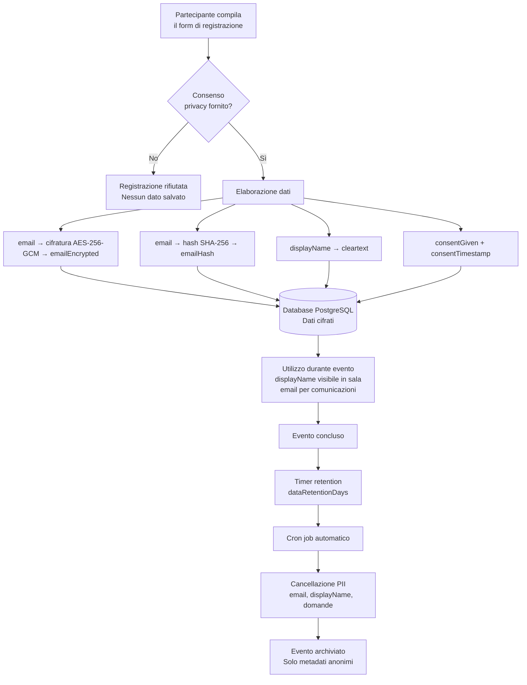
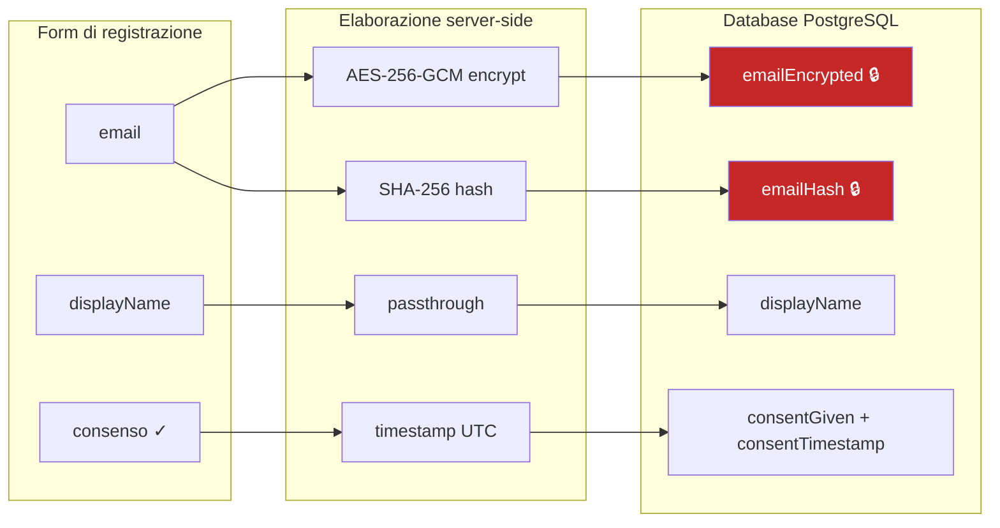
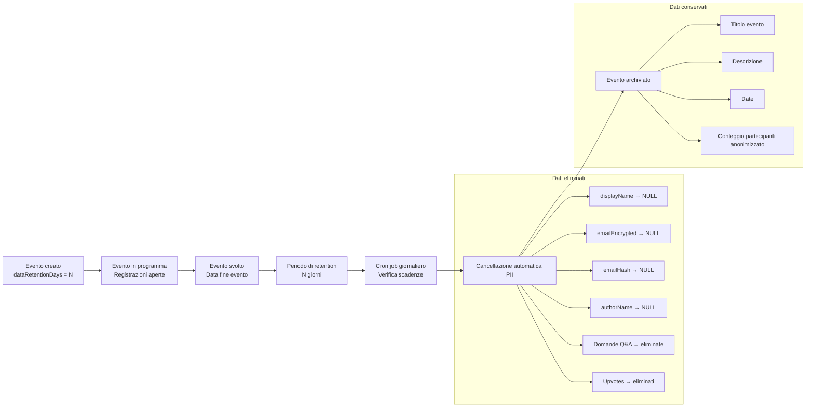
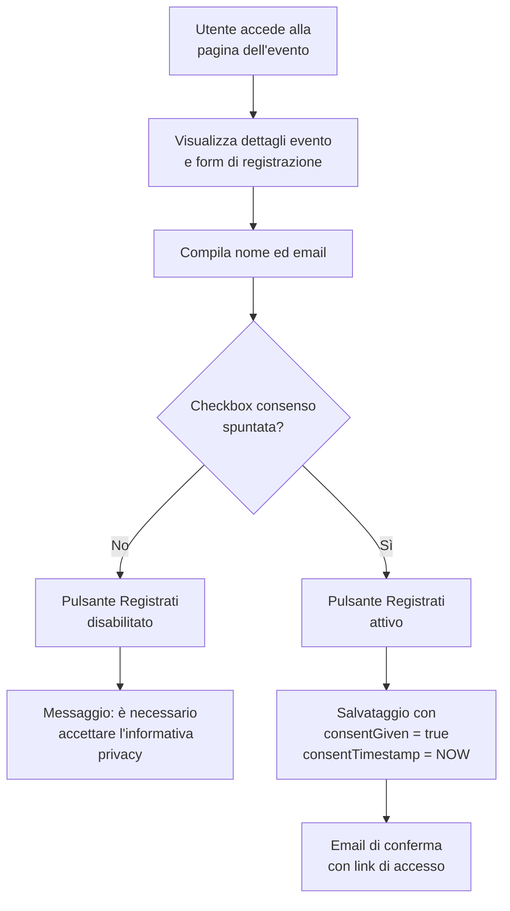

# Conformità GDPR — eventi-dtd

## Sommario

La piattaforma eventi-dtd è progettata secondo i principi di **privacy by design** e **privacy by default** (Art. 25 GDPR). Raccoglie esclusivamente i dati strettamente necessari alla gestione degli eventi digitali, applica cifratura AES-256-GCM ai dati identificativi diretti e implementa la cancellazione automatica dei dati personali al termine del periodo di retention configurato per ciascun evento. Non vengono utilizzati cookie di profilazione, analytics di terze parti né viene effettuato alcun tracciamento degli utenti.

## Flusso dei dati personali

## Dati trattati

### Tabella dei trattamenti

| Categoria | Dato | Base giuridica | Cifratura | Retention |
|---|---|---|---|---|
| Partecipante | `displayName` | Consenso (Art. 6.1.a) | Nessuna (cleartext) | `dataRetentionDays` dall'evento |
| Partecipante | `email` | Consenso (Art. 6.1.a) | AES-256-GCM | `dataRetentionDays` dall'evento |
| Partecipante | `emailHash` | Consenso (Art. 6.1.a) | SHA-256 (one-way) | `dataRetentionDays` dall'evento |
| Partecipante | `consentGiven` | Obbligo legale (Art. 6.1.c) | Nessuna | `dataRetentionDays` dall'evento |
| Partecipante | `consentTimestamp` | Obbligo legale (Art. 6.1.c) | Nessuna | `dataRetentionDays` dall'evento |
| Partecipante | `accessToken` | Consenso (Art. 6.1.a) | Token opaco (UUID) | `dataRetentionDays` dall'evento |
| Q&A | `authorName` | Consenso (Art. 6.1.a) | Nessuna (cleartext) | `dataRetentionDays` dall'evento |
| Q&A | `text` | Consenso (Art. 6.1.a) | Nessuna (max 500 caratteri) | `dataRetentionDays` dall'evento |
| Q&A | `status` | Legittimo interesse (Art. 6.1.f) | Nessuna | `dataRetentionDays` dall'evento |
| Q&A | `QuestionUpvote` | Consenso (Art. 6.1.a) | Nessuna (link question↔registration) | `dataRetentionDays` dall'evento |
| Moderatore | `name` | Esecuzione contratto (Art. 6.1.b) | Nessuna | Vita dell'evento |
| Moderatore | `email` | Esecuzione contratto (Art. 6.1.b) | Nessuna | Vita dell'evento |
| Registrazione | Allegato iCal | Consenso (Art. 6.1.a) | Generato al volo, non persistito | N/A |
| Evento | Registrazione video | Consenso esplicito (Art. 6.1.a) | Cifrata a riposo (Azure Blob) | Retention separata configurabile |

### Dati NON raccolti

La piattaforma **non raccoglie** i seguenti dati:

- **Indirizzo IP** — nessun logging applicativo degli indirizzi IP dei partecipanti
- **User agent** del browser
- **Dati di geolocalizzazione**
- **Cookie di profilazione** o di marketing — nessun cookie di terze parti
- **Browser fingerprint** o device fingerprint
- **Dati di navigazione** — nessun analytics di terze parti (Google Analytics, Matomo, ecc.)
- **Dati biometrici** — il flusso audio/video è gestito interamente da Jitsi via SRTP, la piattaforma non accede ai media
- **Storico di partecipazione** — non viene mantenuto un profilo trasversale tra eventi diversi

## Misure tecniche

### Cifratura dei dati

**A riposo (at rest):**

- L'indirizzo email dei partecipanti viene cifrato con **AES-256-GCM** prima della scrittura nel database. La chiave di cifratura è gestita tramite variabile d'ambiente (`PII_ENCRYPTION_KEY`), non presente nel codice sorgente.
- Per la deduplica delle registrazioni (impedire doppie iscrizioni allo stesso evento), viene calcolato un hash **SHA-256** dell'email (`emailHash`). L'hash è irreversibile: non è possibile risalire all'email dall'hash.
- Le registrazioni video sono cifrate a riposo in Azure Blob Storage tramite le funzionalità native della piattaforma Azure (SSE con chiavi gestite).

**In transito (in transit):**

- Tutte le comunicazioni client-server avvengono su **TLS 1.2+** (HTTPS).
- I flussi audio/video di Jitsi sono protetti da **SRTP** (Secure Real-time Transport Protocol).
- Le comunicazioni tra i servizi interni (applicazione → database, applicazione → Jitsi) avvengono su rete privata.

### Minimizzazione

Ogni campo raccolto ha una giustificazione specifica:

| Campo | Necessità |
|---|---|
| `displayName` | Identificazione del partecipante nella sala evento e nel sistema Q&A |
| `email` | Invio conferma registrazione, link di accesso, reminder pre-evento |
| `emailHash` | Prevenzione registrazioni duplicate allo stesso evento senza esporre l'email in chiaro |
| `consentGiven` | Prova del consenso ai sensi del GDPR |
| `consentTimestamp` | Timestamp del consenso per audit trail |
| `accessToken` | Autenticazione del partecipante per l'accesso alla sala evento |
| `authorName` (Q&A) | Attribuzione delle domande nella sessione Q&A |
| `text` (Q&A) | Contenuto della domanda (limitato a 500 caratteri) |

Non vengono raccolti dati aggiuntivi. Non è presente alcun campo opzionale (es. organizzazione, ruolo, telefono).

### Retention automatica

Il valore predefinito di `dataRetentionDays` è **30 giorni**. Ogni evento può essere configurato con un valore diverso. Il cron job viene eseguito quotidianamente e verifica tutti gli eventi la cui data di fine più il periodo di retention è trascorsa.

## Consensi

**Caratteristiche del meccanismo di consenso:**

- La checkbox di consenso **non è pre-selezionata** (opt-in esplicito).
- Il link all'informativa privacy è **obbligatorio e visibile** accanto alla checkbox.
- Il consenso viene registrato con **timestamp UTC** per audit trail.
- Senza consenso, la registrazione è tecnicamente impossibile (validazione lato server).

**Consenso alla registrazione video:**

- La registrazione video è attivabile solo dal moderatore.
- Quando la registrazione è attiva, un **banner visibile** è mostrato a tutti i partecipanti nella sala.
- Al momento dell'accesso alla sala, se la registrazione è prevista, viene mostrato un avviso informativo.
- Il partecipante può abbandonare la sala in qualsiasi momento.

## Diritti dell'interessato

### Diritto di accesso (Art. 15)

Il partecipante può richiedere quali dati sono stati raccolti in relazione alla propria registrazione. L'identificazione avviene tramite il link personale di accesso (contenente l'`accessToken`). I dati restituibili sono: `displayName`, `email` (decifrata al momento della richiesta), `consentTimestamp`, eventuali domande Q&A associate.

**Implementazione tecnica:** endpoint API che, dato un `accessToken` valido, restituisce i dati associati alla registrazione in formato JSON esportabile.

### Diritto alla cancellazione (Art. 17)

Il partecipante può richiedere la cancellazione dei propri dati in qualsiasi momento, anche prima della scadenza del periodo di retention. La cancellazione comporta:

- Eliminazione di `displayName`, `emailEncrypted`, `emailHash` dalla registrazione
- Eliminazione di tutte le domande Q&A associate
- Eliminazione di tutti gli upvotes associati
- Il record di registrazione viene mantenuto in forma anonimizzata (per integrità dei conteggi)

**Implementazione tecnica:** endpoint API di cancellazione autenticato tramite `accessToken`. La cancellazione è immediata e irreversibile.

### Diritto di portabilità (Art. 20)

Il partecipante può richiedere l'esportazione dei propri dati in formato strutturato, leggibile da dispositivo automatico (JSON).

**Implementazione tecnica:** lo stesso endpoint del diritto di accesso restituisce dati in formato JSON, direttamente utilizzabile per la portabilità.

### Diritto di opposizione (Art. 21)

Il partecipante può opporsi al trattamento dei propri dati. Poiché la base giuridica è il consenso, l'opposizione equivale alla revoca del consenso e comporta la cancellazione dei dati (vedi Art. 17). Dopo la cancellazione, il partecipante non potrà più accedere all'evento.

**Implementazione tecnica:** la revoca del consenso attiva la stessa procedura di cancellazione dell'Art. 17.

## Sub-responsabili

| Servizio | Ruolo | Localizzazione dati |
|---|---|---|
| Azure AKS (Kubernetes) | Hosting infrastruttura applicativa | EU (regione Azure configurata) |
| Azure Database for PostgreSQL | Database relazionale | EU (stessa regione del cluster) |
| Azure Blob Storage | Archiviazione registrazioni video | EU (stessa regione del cluster) |
| Jitsi Meet (self-hosted) | Motore video/audio | Self-hosted nel cluster AKS (EU) |
| SMTP provider (configurabile) | Invio email transazionali | Da verificare in base al provider scelto |

Tutti i servizi Azure sono configurabili in regioni EU. Jitsi Meet è self-hosted all'interno del cluster, pertanto i dati audio/video non transitano su servizi terzi.

## Checklist per il DPO

- [ ] Verificare che l'informativa privacy sia pubblicata e accessibile dal form di registrazione
- [ ] Verificare che la checkbox di consenso non sia pre-selezionata
- [ ] Verificare il valore di `dataRetentionDays` per ogni evento (default: 30 giorni)
- [ ] Verificare che il cron job di pulizia automatica sia attivo e funzionante
- [ ] Verificare che la variabile `PII_ENCRYPTION_KEY` sia impostata e che la cifratura AES-256-GCM funzioni correttamente
- [ ] Verificare l'assenza di logging degli indirizzi IP nei log applicativi
- [ ] Verificare l'assenza di cookie di terze parti e di analytics esterni
- [ ] Verificare che i font siano serviti localmente (nessun CDN esterno)
- [ ] Verificare che le registrazioni video siano cifrate a riposo su Azure Blob Storage
- [ ] Verificare la configurazione TLS/HTTPS per tutti gli endpoint esposti
- [ ] Aggiornare il registro dei trattamenti (Art. 30) con i dati della tabella soprastante
- [ ] Valutare la necessità di una DPIA (Art. 35) in caso di trattamento su larga scala
- [ ] Verificare che gli endpoint per i diritti degli interessati (accesso, cancellazione, portabilità) siano funzionanti
- [ ] Verificare la procedura di notifica data breach (Art. 33 — 72 ore)
- [ ] Verificare che i sub-responsabili siano coperti da DPA (Data Processing Agreement)
- [ ] Verificare la retention separata per le registrazioni video rispetto ai dati dei partecipanti

## Informativa privacy

L'informativa privacy da pubblicare sul form di registrazione deve contenere, ai sensi dell'Art. 13 GDPR:

1. **Identità e dati di contatto del titolare** — Dipartimento per la Trasformazione Digitale
2. **Dati di contatto del DPO** — come da nomina interna
3. **Finalità e base giuridica** — gestione della partecipazione all'evento, consenso dell'interessato
4. **Categorie di dati** — nome visualizzato, indirizzo email
5. **Destinatari** — nessuna comunicazione a terzi (i sub-responsabili trattano i dati per conto del titolare)
6. **Trasferimento extra-UE** — non previsto (infrastruttura Azure EU)
7. **Periodo di conservazione** — come da `dataRetentionDays` dell'evento specifico
8. **Diritti dell'interessato** — accesso, rettifica, cancellazione, portabilità, opposizione, revoca del consenso
9. **Diritto di reclamo** — presso il Garante per la Protezione dei Dati Personali
10. **Natura obbligatoria/facoltativa** — il conferimento dei dati è facoltativo; il mancato conferimento impedisce la partecipazione all'evento

Si consiglia di predisporre l'informativa utilizzando il template standard del DPO dell'ente, integrato con le informazioni specifiche di questa tabella.
