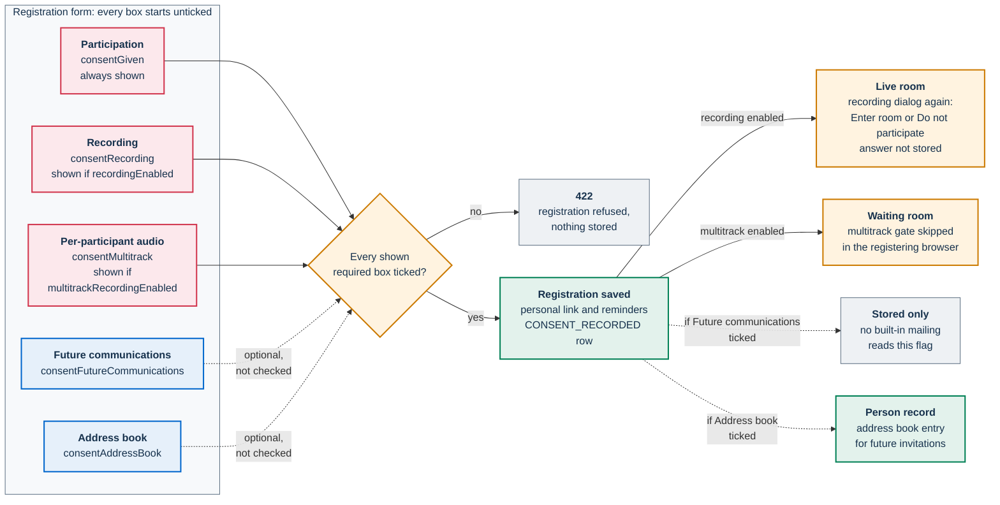
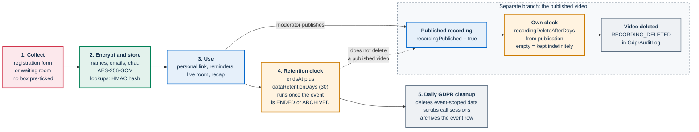
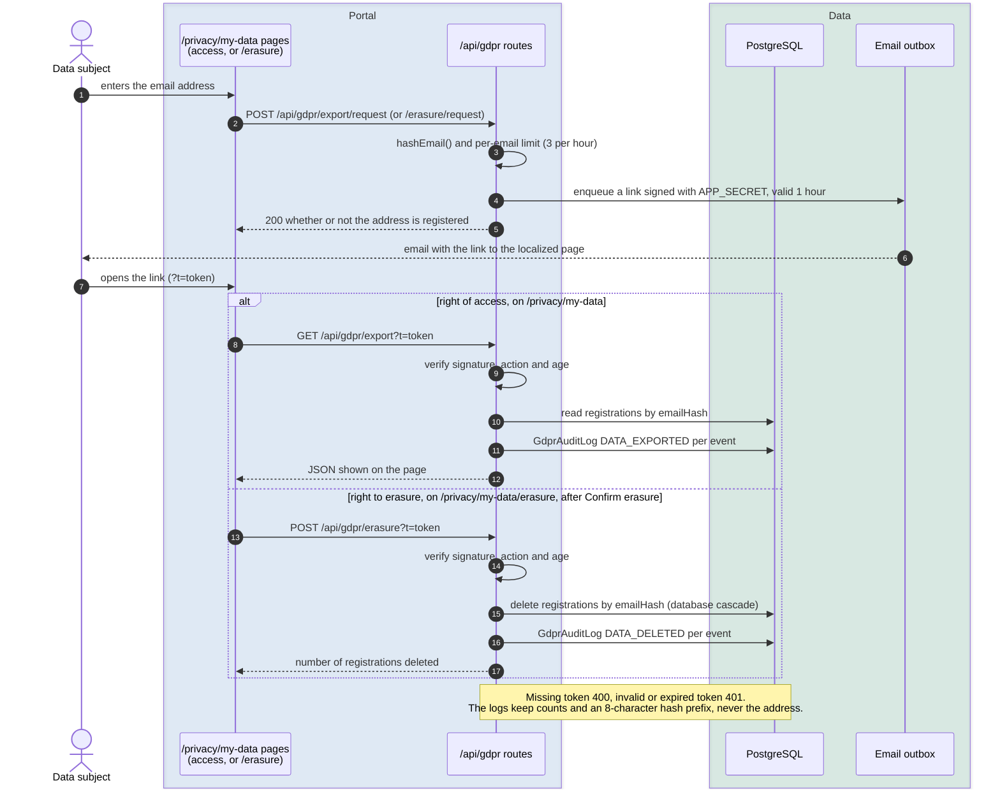

# Privacy and data protection

This page owns the personal data that PA Webinar handles. It covers who is responsible for what, the single inventory of personal data with its retention, the consent model, the cleanup mechanics, the flows for data-subject rights, the address book, staff and guest data, cookies, logs and external resources, the audit trails, how the privacy notice of an event is chosen, and the exact consent texts that people see.

It is written for the data protection officers (DPOs) and controllers of administrations that adopt PA Webinar, for auditors, for operators who write privacy notices, and for developers who touch personal data. Every statement describes the current code. Where the code falls short of what a reader might expect, the limitation is stated, and all of them are collected in [Known limitations](#known-limitations).

This page is not legal advice. It tells a controller what the software does, so that the controller can decide what its privacy notice, its records of processing and its data protection impact assessment must say.

Related pages:

- recordings, per-participant audio and AI outputs, with their legal bases and retention regimes: [Recordings, voice data and AI outputs](privacy/recordings-and-ai.md);
- the facts a privacy notice needs, mapped to the settings that control them: [Privacy notice checklist for controllers](privacy/privacy-notice-checklist.md);
- every credential and the technical cookie inventory: [Identity, access and tokens](architecture/identity-and-access.md);
- when each cleanup job runs and which Helm key holds its schedule: [Scheduled and background jobs](architecture/background-jobs.md);
- encryption keys, the secrets map and the application's security controls: [Security architecture](architecture/security.md);
- the event statuses that start the retention clock: [Event lifecycle](architecture/event-lifecycle.md).

## Roles and responsibilities

The public administration (PA) that runs an installation is the **controller** of the personal data processed in it. The providers it uses to run that installation act as **processors**: typically the hosting or cloud provider, the SMTP relay, the object storage provider and, if the installation uses one, an external Jitsi or TURN service. The PA Webinar project does not operate installations, and the software sends no telemetry to the project or to anyone else.

| The software guarantees | The operator must do |
|---|---|
| Consent boxes are never pre-ticked, and required consents are enforced on the server | Write the privacy notice of the installation and of each event, and decide the legal basis of each processing |
| Email addresses, most names, chat messages and email bodies are encrypted at rest with AES-256-GCM; the inventory lists the fields that are not | Generate real values for `PII_ENCRYPTION_KEY` and `APP_SECRET`, keep them secret and back them up. Losing `PII_ENCRYPTION_KEY` makes the encrypted data unreadable |
| A daily job deletes event-scoped personal data once an event's retention period has passed | Make sure events reach `ENDED` or `ARCHIVED` (see [Retention and cleanup](#retention-and-cleanup)), and keep the scheduled jobs running |
| Self-service access and erasure, confirmed by email | Handle the requests that self-service does not cover (see [What needs an administrator](#what-needs-an-administrator)) |
| No analytics, no tracking cookies, no third-party CDN, self-hosted fonts | Decide whether to use the few external resources that exist (Gravatar, links to YouTube) and declare them |
| Cookies and local-storage entries are functional only | Tell staff that an unsaved event-wizard draft, with the names and email addresses of the contact, moderators, speakers and invitees, stays in the browser's local storage. On shared devices, staff should save or discard drafts (see [Cookies and browser storage](#cookies-and-browser-storage)) |
| Application logs carry no IP addresses | Set retention for ingress, Jitsi, TURN and log-stack logs, which do carry IP addresses |
| The GDPR cleanup and the self-service requests write count-only audit rows | Keep database backups under a retention policy of their own. Deleted rows survive in backups until those expire |

## Principles

- **Minimization.** A registration asks for a display name and an email address. Organization, role and organization type appear only when the event is configured to ask for them. Guests give only a display name.
- **Consent is never pre-ticked.** Every consent box on the registration form starts unticked, and the server rejects a registration that lacks a required consent (see [Consent model](#consent-model)).
- **Encryption at rest.** `encryptPII()` in `app/src/lib/crypto/pii.ts` encrypts with AES-256-GCM under `PII_ENCRYPTION_KEY` (64 hex characters). In production the application refuses a key that looks like a placeholder, a short block repeated to length, and fails closed. The local Docker Compose stack sets `ALLOW_INSECURE_PII_KEY=true` to run with its public development key; a real installation must never set it. The inventory below says, column by column, what is encrypted and what is not.
- **Email lookups use a keyed hash.** `hashEmail()` computes an HMAC-SHA-256 of the lowercased, trimmed address, keyed with `APP_SECRET`. The hash finds duplicates and serves the rights requests without decrypting anything. Without `APP_SECRET`, which only a development setup allows, it falls back to plain SHA-256.
- **No analytics and no third-party CDN.** The portal loads no analytics script or tracking pixel. Fonts are self-hosted from `app/public/fonts`. The Content Security Policy that enforces this is described in [SECURITY-CSP.md](SECURITY-CSP.md).
- **No IP addresses in application logs.** The portal's log lines carry event and row identifiers, not client addresses (see [Logs and external resources](#logs-and-external-resources)). Two places in the database hold a client IP address: the staff audit log (see [Audit trails](#audit-trails)) and, in reversible form, the sender identifier of chat messages written by guests (see [Known limitations](#known-limitations)).
- **Jitsi never receives an email address or a usable hash of one.** The conference token carries a display name, an opaque per-join identifier and an avatar. When Gravatar is enabled, the avatar URL carries the Gravatar hash encrypted with the platform key, which no other participant can reverse (see [Avatars](architecture/identity-and-access.md#avatars)).

## Data inventory and retention

This is the single inventory of the personal data that PA Webinar stores. `app/prisma/schema.prisma` is the authority on fields. This table says what matters for privacy.

**Event retention** means: after the event's `endsAt` plus its `dataRetentionDays`, and only once the event is `ENDED` or `ARCHIVED`. The daily GDPR cleanup (`/api/cron/cleanup`) applies it. See [Retention and cleanup](#retention-and-cleanup).

| Data | Where | Protection | Retention | Removed by |
|---|---|---|---|---|
| **Registration**: display name, email address, page language, optional organization, role and organization type, consent flags and consent time, personal access token, join and leave times | `Registration` | Name and email encrypted. Email looked up by HMAC `emailHash`. Organization fields in plain text | Event retention | GDPR cleanup, or the registrant's self-service erasure |
| **Primary event contact**: the name and email typed in the event wizard | `Event.moderatorName`, `Event.moderatorEmail` | Email encrypted, name in plain text. The email is shown to registrants as the organizer of the calendar invitation in their emails. The name is published as the organizer of the event's public calendar file (`/api/events/{slug}/calendar.ics`, no sign-in, every status except `DRAFT`), and copied into `EventMaterial.addedBy` when a moderator adds material | Kept with the event row, including after archiving | Nothing automatic ([limitation](#known-limitations)) |
| **Public speaker list** | `Event.speakersInfo` | Free text per language (names and descriptions), plain text, public on the event page | Kept with the event, including after archiving | Nothing automatic; edit the event |
| **Named moderator and speaker grants** | `EventModerator` | Name and email encrypted. The token is a durable sign-in credential | Event retention. Duplicating an event copies its grants | GDPR cleanup |
| **Invitations** | `EventInvitation` | Name and email encrypted, email HMAC, token of the pre-filled registration link. With public registration off, the list decides who may register: the registration route matches the typed address against the HMAC, and sends the personal link only to that mailbox ([Invitation-only registration](architecture/event-journey.md#invitation-only-registration)) | Event retention | GDPR cleanup |
| **Guests** | No row of their own. The typed name lives in the chat, Q&A and questionnaire rows below. A random `paw_guest_id` kept in the browser keys their votes and reactions | As the rows below | Event retention | GDPR cleanup |
| **Chat**, including questions asked in the chat, reactions to messages and attachments | `ChatMessage`, `ChatMessageReaction`, attachment files in object storage | Sender name, message text and attachment file name encrypted. For a guest, the sender identifier (`senderId`) is a plain-text, truncated base64 encoding of the client IP address and the typed name, which decodes back to the start of the address: all of an IPv4 address ([limitation](#known-limitations)). Redis relays messages in plain text while live and stores none | Event retention. Messages hidden by a moderator stay until then; hiding deletes the attachment file at once | GDPR cleanup, rows and files |
| **Q&A panel** questions and upvotes | `Question`, `QuestionUpvote`, `QuestionGuestUpvote` | Plain text: author name and question. A registrant's upvote holds the registration (`QuestionUpvote`); the upvote of a guest, speaker or moderator holds only the random browser id (`QuestionGuestUpvote`) | Event retention | GDPR cleanup. Erasure removes a registrant's own questions |
| **Polls, word cloud, live reactions, agenda and agenda reactions** | `Poll`, `PollVote`, `WordCloudRound`, `WordCloudSubmission`, `Reaction`, `EventAgendaItem`, `AgendaItemReaction` | A registration ID or a browser guest ID, no names. Live reactions store only the emoji and the time | Event retention | GDPR cleanup |
| **Feedback and questionnaire responses** | `EventFeedback`, `QuestionnaireResponse`, `QuestionnaireAnswer` | `EventFeedback`: a rating, an optional free-text comment, and a registration or guest ID. `QuestionnaireResponse`: the respondent name in plain text and a hash field (`respondentEmailHash`) that is computed from the encrypted address, so it cannot be used to find the person by email ([limitation](#known-limitations)); answers, including free text | Event retention | GDPR cleanup |
| **Materials** | `EventMaterial` and its files | Files in object storage. The visibility setting (**In the room and after the event**, the default, **Before the event**, **During the event**, **After the event**) decides which public lists show a material, not who can download it: an uploaded file is served from its `/api/assets/…` URL to anyone who has the URL. Before the start, only materials marked **Before the event** are listed publicly | Event retention | GDPR cleanup, rows and files |
| **Reminder bookkeeping** | `EventReminder`, `ReminderSent` | Identifiers only | Event retention | GDPR cleanup |
| **Call sessions** | `CallSession` | Participant list encrypted. Dominant-speaker log (endpoint ID and display name) in plain text; it is collected in every live room, whether or not the event records. Hand-raise log with opaque IDs | Personal columns emptied at event retention. Duration and peak attendance are kept | GDPR cleanup (scrub) |
| **Event recap** | `Event.postEventRecap` | Aggregates and question texts without their authors, including questions asked in the chat, which are decrypted and stored in plain text | Kept with the event: it survives the retention cleanup | Nothing automatic |
| **Temporary recording** | `Event.tempRecordingUrl` | Recordings storage, private | 24 hours after `tempRecordingStartedAt`, unless published | GDPR cleanup |
| **Composite video recording** | `Event.recordingUrl`, recordings storage | Private container, short-lived signed playback URLs, the provider's encryption at rest | Not published: event retention. Published: `recordingDeleteAfterDays` after publication, or indefinitely when unset | GDPR cleanup, or deletion through the primary moderator link. Details in [Recordings, voice data and AI outputs](privacy/recordings-and-ai.md) |
| **Per-participant audio tracks** | `RecordingTrack` and its files | Never public. Name encrypted | Deleted shortly after transcription, unless the event keeps them. At the latest at event retention, when the post-production jobs run ([limitation](#known-limitations)) | `multitrack-purge`, `postprod-retention`, the orphan sweep of `recordings-reconcile`, GDPR cleanup for the rows. See [Recordings, voice data and AI outputs](privacy/recordings-and-ai.md) |
| **AI outputs**: transcripts, summaries, subtitles, translations, dubbed audio, speaker labels | `PostprodArtifact`, `PostprodOriginalBody`, `Speaker`, `Recording.pipelineSnapshot`, post-production storage | Inline text encrypted. Files under the provider's encryption. Speaker names (`Speaker.displayName`) and the pipeline snapshot (`Recording.pipelineSnapshot`, which includes speaker names) in plain text | Follow the recording: event retention if the video is not published, the video's lifetime if it is. An optional site-wide cap applies on top. The purge deletes the `Speaker` rows and scrubs job payloads, but the speaker names copied into `Recording.pipelineSnapshot` remain ([limitation](#known-limitations)) | `postprod-retention`. See [Recordings, voice data and AI outputs](privacy/recordings-and-ai.md) |
| **Address book** | `Person` | Display name encrypted. No email address is stored, only its HMAC. Organization fields in plain text | `retentionMonths` (default 24) after the last activity. Opted-out entries at the next run | `rubrica-retention`, or an administrator's deletion |
| **Staff accounts** | `StaffAccount` | Name and email encrypted, email HMAC | Until an administrator deletes the account | An administrator |
| **Staff sign-in links** | `StaffLoginToken` | Only the SHA-256 of the token | One day after use or expiry | GDPR cleanup |
| **Email outbox** | `EmailOutbox` | Recipient, HTML and text encrypted. Subject, calendar attachment and metadata (row IDs) in plain text | Never purged ([limitation](#known-limitations)) | Nothing |
| **GDPR audit log** | `GdprAuditLog` | No personal data: counts, consent flags, an 8-character prefix of the email hash | Kept | Only by deleting the event row |
| **Staff audit log** | `AdminAuditLog` | Actor identifier, client IP address, user agent. The detail of the speaker-naming action (`POSTPROD_SPEAKER_MAP`) may include the speaker's name | Kept | Nothing |
| **Orphaned recording files** | `OrphanRecording` | File names only | `orphanRecordingGraceDays` (default 30) | `recordings-reconcile` |
| **Presence in the square** | Redis | Display name, avatar choice, position | Removed at once when a person leaves normally. Otherwise, the event's presence record expires about 10 seconds after the last update from anyone in the square; until then, a departed person's entry stays in Redis but is no longer shown | The leave signal, or Redis expiry |
| **Rate-limit counters** | Memory of each app pod | Keyed by IP address or email hash | The end of each limit window | The process |
| **Application logs** | Container standard output | No IP addresses. Email addresses only inside relayed SMTP errors | The operator's log stack | The operator |
| **Data-subject request links** | Not stored. The email that carries them is in the outbox | HMAC-signed with `APP_SECRET` | 1 hour | Expiry |

### What stays after an event is archived

The event row itself survives as `ARCHIVED`, as a historical record: title, description, dates, the public speaker list (`Event.speakersInfo`), the co-organizing organizations (`EventOrganizer`), the event recap (with the texts of Q&A and chat questions, without their authors), the questionnaire configuration without answers, the `Recording` rows (emptied of AI outputs and tracks by `postprod-retention` unless the video is published, but still holding the speaker names in `pipelineSnapshot`), and the `GdprAuditLog` rows. The primary event contact also stays, and its name stays public in the event's calendar file; see [Known limitations](#known-limitations).

## Consent model

### At registration

The registration form shows up to five consent boxes. All start unticked (`app/src/components/registration/registration-form-client.tsx`). `POST /api/events/{slug}/registrations` enforces the required ones on the server and rejects the request with a validation error (`422`) when one is missing.

| Consent | Stored as | Shown when | Required | Effect |
|---|---|---|---|---|
| Participation | `Registration.consentGiven`, `consentTimestamp` | Always | Yes | The registration is stored. When the event asks for organization data, the label adds that it is processed for statistics |
| Audio and video recording | `Registration.consentRecording`, `null` when the event does not record | `recordingEnabled` | Yes, when shown | The registration is stored. The live room asks again before entry (see below) |
| Per-participant audio track | `Registration.consentMultitrack`, `null` when not asked | `multitrackRecordingEnabled` | Yes, when shown | The registration is stored, and the waiting room does not ask again in the registering browser |
| Future communications | `Registration.consentFutureCommunications` | Always | No | Recorded and included in the export. No built-in feature sends anything based on it |
| Address book | `Person.optedInAt`, and the `consentAddressBook` flag in the audit row | Always | No | Creates or refreshes the person's address-book entry (see [The address book](#the-address-book)) |

Making recording consent a condition of registration is a design choice of the platform. Whether consent is the right legal basis for a recorded event, and whether it can be a condition of taking part, is for the controller to assess.

```mermaid
flowchart LR
  classDef req fill:#FCE8EC,stroke:#D1344C,stroke-width:2px,color:#17324D
  classDef opt fill:#E6F0FA,stroke:#0066CC,stroke-width:2px,color:#17324D
  classDef gate fill:#FFF3E0,stroke:#CC7A00,stroke-width:2px,color:#17324D
  classDef data fill:#E3F2EC,stroke:#008055,stroke-width:2px,color:#17324D
  classDef ext fill:#EEF1F4,stroke:#5C6F82,stroke-width:1px,color:#17324D

  subgraph FORM["Registration form: every box starts unticked"]
    direction TB
    C1["<b>Participation</b><br/>consentGiven<br/>always shown"]:::req
    C2["<b>Recording</b><br/>consentRecording<br/>shown if recordingEnabled"]:::req
    C3["<b>Per-participant audio</b><br/>consentMultitrack<br/>shown if<br/>multitrackRecordingEnabled"]:::req
    C4["<b>Future communications</b><br/>consentFutureCommunications"]:::opt
    C5["<b>Address book</b><br/>consentAddressBook"]:::opt
  end
  style FORM fill:#F7F9FB,stroke:#5C6F82,color:#17324D

  Q{"Every shown<br/>required box ticked?"}:::gate
  NO["<b>422</b><br/>registration refused,<br/>nothing stored"]:::ext
  G1["<b>Registration saved</b><br/>personal link and reminders<br/>CONSENT_RECORDED row"]:::data
  G2["<b>Live room</b><br/>recording dialog again:<br/>Enter room or Do not participate<br/>answer not stored"]:::gate
  G3["<b>Waiting room</b><br/>multitrack gate skipped<br/>in the registering browser"]:::gate
  G4["<b>Stored only</b><br/>no built-in mailing<br/>reads this flag"]:::ext
  G5["<b>Person record</b><br/>address book entry<br/>for future invitations"]:::data

  C1 --> Q
  C2 --> Q
  C3 --> Q
  C4 -.->|"optional,<br/>not checked"| Q
  C5 -.->|"optional,<br/>not checked"| Q
  Q -->|"no"| NO
  Q -->|"yes"| G1
  G1 -->|"recording enabled"| G2
  G1 -->|"multitrack enabled"| G3
  G1 -.->|"if Future communications<br/>ticked"| G4
  G1 -.->|"if Address book<br/>ticked"| G5
```

### In the room

- **Recording dialog.** When an event has `recordingEnabled`, guests and registrants see a full-screen dialog before they enter the live room: **Recording consent**, with the text "This event is being recorded. By entering, you consent to audio/video recording." and two buttons, **Enter room** and **Do not participate**. Declining returns to the event page. Holders of moderator and speaker links skip the dialog. The answer is not stored. A banner, **Recording in progress**, stays visible while Jibri records. The per-participant recorder shows no banner, because it joins the conference as a hidden participant and starts no Jitsi recording; participants learn about it through the waiting-room gate below and the privacy notice (see [Recordings, voice data and AI outputs](privacy/recordings-and-ai.md)).
- **Per-participant audio gate.** On an event with `multitrackRecordingEnabled`, anyone who reaches the waiting room without a stored multitrack consent must tick the same consent text there before entering: guests, speakers, and a registrant who opens a personal link in a browser other than the one used to register. Holders of a moderator link are exempt. The tick opens the door in that browser and is not stored ([limitation](#known-limitations)).
- **AI disclosure.** When the installation enables AI post-production (`aiPipelineEnabled`) and the event turns on at least one AI output (transcript, summary, translation or dubbing), the waiting room shows the disclosure text from the site settings (`aiConsentDisclosure`, per language), or a built-in generic text (`waiting.aiNotice`) when none is set for the page language. The AI regime is described in [Recordings, voice data and AI outputs](privacy/recordings-and-ai.md).

Recording is off unless both the operator and the event turn it on. Jibri is disabled in the chart's default values (`jitsi-meet.jibri.enabled: false`; the profiles that enable it are listed in [Deploying with Helm](DEPLOYMENT.md)), `recordingEnabled` is off by default on every event, and `autoStartRecording`, which starts Jibri as soon as a moderator joins, is a separate opt-in per event. The per-participant recorder runs only for events that have `recordingEnabled`, `aiTranscriptEnabled` and `multitrackRecordingEnabled` all set.

### Evidence of consent

- Each registration stores its consent flags and `consentTimestamp`.
- Each registration writes a `CONSENT_RECORDED` row to `GdprAuditLog` with the flags given, including `consentAddressBook`, and no personal data.
- When a recording enters AI post-production, `Recording.consentSnapshot` freezes the event-level AI and multitrack flags of that moment.

When the registration is deleted, at retention or by erasure, the per-person proof goes with it. The `CONSENT_RECORDED` rows remain, and they prove that consents were collected without saying by whom.

`Registration` also has the columns `aiConsentTranscript`, `aiConsentSummary` and `aiConsentTranslation`. No code writes or reads them. AI processing is governed at the event level.

### Withdrawing consent

There is no per-consent withdrawal screen. A registrant withdraws by erasing the registration (see [Data-subject rights](#data-subject-rights)). Address-book consent has its own opt-out (see [The address book](#the-address-book)). Anything else goes to the controller.

## Retention and cleanup

### The retention window

- **Per event.** `Event.dataRetentionDays` is set in step 5 of the event wizard (**Retention days**), from 1 to 365, default 30 (`app/prisma/schema.prisma`, `app/src/lib/validation/schemas.ts`). An event template can preset it (`EventTemplate.defaultRetentionDays`). The wizard shows only one help line under the field: "After this threshold, personal data is automatically deleted." The environment variable `DEFAULT_DATA_RETENTION_DAYS` in the chart's `app.env` is not read by the application.
- **The clock starts at `endsAt`.** The comparison is strict: with 30 days, the data is still there on day 30 and becomes eligible after it (`isEventDataRetentionExpired()` in `app/src/lib/gdpr/cleanup-selection.ts`).
- **The event must be finished.** Only events in `ENDED` or `ARCHIVED` are considered. On a Helm `full` installation with the JVB scaler, the scaler moves past events to `ENDED` on its own. On Docker Compose, the Helm `simple` and `standard` profiles, and any installation without the scaler, a moderator must end the event, or an administrator (or the event's organizer) must archive it with **Archive** in the event list; otherwise its data is never cleaned up. Archiving does not start the clock early: the data still stays until `endsAt` plus the retention days. See [Running without the scaler](architecture/event-lifecycle.md#running-without-the-scaler).

```mermaid
flowchart LR
  classDef risk fill:#FCE8EC,stroke:#D1344C,stroke-width:2px,color:#17324D
  classDef data fill:#E3F2EC,stroke:#008055,stroke-width:2px,color:#17324D
  classDef portal fill:#E6F0FA,stroke:#0066CC,stroke-width:2px,color:#17324D
  classDef job fill:#FFF3E0,stroke:#CC7A00,stroke-width:2px,color:#17324D
  classDef ext fill:#EEF1F4,stroke:#5C6F82,stroke-width:2px,color:#17324D

  C["<b>1. Collect</b><br/>registration form<br/>or waiting room<br/>no box pre-ticked"]:::risk
  S["<b>2. Encrypt and store</b><br/>names, emails, chat:<br/>AES-256-GCM<br/>lookups: HMAC hash"]:::data
  U["<b>3. Use</b><br/>personal link, reminders,<br/>live room, recap"]:::portal
  R["<b>4. Retention clock</b><br/>endsAt plus<br/>dataRetentionDays (30)<br/>runs once the event<br/>is ENDED or ARCHIVED"]:::job
  X["<b>5. Daily GDPR cleanup</b><br/>deletes event-scoped data<br/>scrubs call sessions<br/>archives the event row"]:::ext

  C --> S --> U --> R --> X

  subgraph EXEMPT["Separate branch: the published video"]
    direction LR
    P["<b>Published recording</b><br/>recordingPublished = true"]:::portal
    K["<b>Own clock</b><br/>recordingDeleteAfterDays<br/>from publication<br/>empty = kept indefinitely"]:::job
    D["<b>Video deleted</b><br/>RECORDING_DELETED<br/>in GdprAuditLog"]:::ext
    P --> K --> D
  end
  style EXEMPT fill:#F7F9FB,stroke:#5C6F82,stroke-dasharray:5 4,color:#17324D

  U -->|"moderator publishes"| P
  R -.->|"does not delete<br/>a published video"| P
```

### The daily GDPR cleanup

`GET /api/cron/cleanup` runs daily in the Helm chart and hourly in Docker Compose (schedules in [Scheduled and background jobs](architecture/background-jobs.md)). It works in phases:

1. **Temporary recordings.** An unpublished `Event.tempRecordingUrl` whose `tempRecordingStartedAt` is more than 24 hours old is deleted from storage and cleared, with a `TEMP_RECORDING_DELETED` audit row. No built-in flow creates temporary recordings today; phase 3 also deletes any that exist at event retention.
2. **Published recordings past their own retention.** A published video whose `recordingDeleteAfterDays` has passed since `recordingPublishedAt` is deleted from storage and unpublished, with a `RECORDING_DELETED` row.
3. **Event data past event retention.** For each eligible event, one database transaction deletes, in this order: Q&A upvotes and questions, poll votes and polls, feedback, questionnaire responses (their answers cascade), word-cloud submissions and rounds, materials, reminder bookkeeping and reminders, registrations, chat messages, live reactions, agenda reactions and agenda items, invitations, named grants, and the per-participant track rows whose audio is already gone. It then empties the personal columns of every call session (`participants`, `dominantSpeakerLog`, `handRaiseLog`), sets the event to `ARCHIVED`, and writes a `DATA_DELETED` row with the count of each kind. After the transaction commits, it deletes the files: the temporary recording, the composite video unless it is published, material files and chat attachments. File deletion is best effort: a storage error is logged and does not undo the database cleanup.
4. **Staff sign-in links.** Links used or expired more than a day ago are deleted.

Phase 3 also runs again on events that are already `ARCHIVED`, so anything written after archiving, or left behind by an older version of the job, is removed on the next run. Because archived events are revisited, each run writes a new `DATA_DELETED` row for every archived event past retention, usually with all counts at zero: once a day on Helm, once an hour on Docker Compose. The selection rules live in `app/src/lib/gdpr/cleanup-selection.ts`, and the job's contract is tested in `app/src/app/api/cron/cleanup/route.test.ts`.

### The published-recording exemption

A published video is a public record, so the event's retention does not delete it. Its lifetime is `recordingDeleteAfterDays`, counted from publication and chosen in the recording panel: **24 hours (temporary)**, **7 days**, **30 days**, **90 days**, or **Never (until event expiry)**, which stores no value. With no value the video is kept until someone deletes it; despite the label and the note under it, event retention does not remove a published video ([limitation](#known-limitations)). Unpublishing a video whose event is already past retention makes it eligible for deletion on the next run. The AI outputs of a published video follow the video; see [Recordings, voice data and AI outputs](privacy/recordings-and-ai.md).

### Other retention jobs

| Job | What it deletes | Runs in |
|---|---|---|
| `/api/cron/rubrica-retention` | Address-book entries past their retention, and opted-out entries | Helm chart, daily |
| `/api/cron/multitrack-purge` | Per-participant track audio once transcription is done | Helm chart, with `postprod.enabled` |
| `/api/cron/postprod-retention` | AI outputs, speaker labels and remaining tracks, by the recording's retention | Helm chart, with `postprod.enabled` and `postprod.retention.enabled` |
| `/api/cron/recordings-reconcile` | Files under `recordings/` that no event or call session references, after `orphanRecordingGraceDays`. This includes per-participant track files, which no field it checks points to | Helm chart |

An installation that turns on the recorder (`recorder.enabled`) without post-production (`postprod.enabled`) renders neither purge job: only the orphan sweep of `recordings-reconcile` removes per-participant audio ([limitation](#known-limitations)). The Docker Compose `cron` service calls only `email-outbox`, `reminders` and `cleanup`. On a Compose installation, address-book retention, the orphan sweep and the track purges do not run unless the operator schedules them ([limitation](#known-limitations)).

### Rules for developers

The cascade does not fire: every event-scoped model has `onDelete: Cascade` on its event, but the cleanup never deletes the event row, it archives it. A model that is not named in the cleanup transaction therefore keeps its rows forever, and `app/src/lib/gdpr/cleanup-coverage.ts` with its test makes every table with an `eventId` column declare whether the cleanup purges it. The checklist for a new model with personal data is in [Extending PA Webinar](development/extending.md#a-model-that-holds-participant-data).

Deleting an event outright (`DELETE /api/events/{id}` with a moderator credential, or the bulk delete in the administration area) removes every row of the event by cascade, including its `GdprAuditLog` rows. Before the cascade it deletes the event's uploaded material files and chat attachments (`removeFilesOfEventsBeingDeleted()` in `app/src/lib/events/material-files.ts`); when storage does not confirm a deletion, the event is kept and the request answers 503, so a retry finishes the job. It does not delete the event's other stored files. Composite recordings and per-participant track files, which live under `recordings/`, are swept by the orphan sweep of `recordings-reconcile` after `orphanRecordingGraceDays` (Helm only); post-production files are not. Removing a single uploaded material, from the room or the administration area, deletes its file first as well, and so does replacing the file in the administration area; when storage does not confirm, the material stays.

## Data-subject rights

### Self-service access and erasure

People who registered with an email address can exercise the right of access (Art. 15) and the right to erasure (Art. 17) on their own: access at `/privacy/my-data` and erasure at `/privacy/my-data/erasure` (Italian URLs `/it/privacy/i-miei-dati` and `/it/privacy/i-miei-dati/cancellazione`). The public privacy page links to the access page, which links to the erasure page. Both flows prove ownership of the mailbox in two steps, so that knowing someone's address is not enough to read or delete their data.

```mermaid
sequenceDiagram
  autonumber
  actor P as Data subject
  box rgba(0,102,204,0.10) Portal
    participant W as /privacy/my-data pages<br/>(access, or /erasure)
    participant API as /api/gdpr routes
  end
  box rgba(0,128,85,0.12) Data
    participant DB as PostgreSQL
    participant OB as Email outbox
  end

  P->>W: enters the email address
  W->>API: POST /api/gdpr/export/request (or /erasure/request)
  API->>API: hashEmail() and per-email limit (3 per hour)
  API->>OB: enqueue a link signed with APP_SECRET, valid 1 hour
  API-->>W: 200 whether or not the address is registered
  OB-->>P: email with the link to the localized page
  P->>W: opens the link (?t=token)
  alt right of access, on /privacy/my-data
    W->>API: GET /api/gdpr/export?t=token
    API->>API: verify signature, action and age
    API->>DB: read registrations by emailHash
    API->>DB: GdprAuditLog DATA_EXPORTED per event
    API-->>W: JSON shown on the page
  else right to erasure, on /privacy/my-data/erasure, after Confirm erasure
    W->>API: POST /api/gdpr/erasure?t=token
    API->>API: verify signature, action and age
    API->>DB: delete registrations by emailHash (database cascade)
    API->>DB: GdprAuditLog DATA_DELETED per event
    API-->>W: number of registrations deleted
  end
  Note over API,DB: Missing token 400, invalid or expired token 401.<br/>The logs keep counts and an 8-character hash prefix, never the address.
```

1. **Request.** `POST /api/gdpr/export/request` or `POST /api/gdpr/erasure/request` takes the email address and the page language. It answers `200` whether or not the address is registered, so the answer reveals nothing. A malformed address answers `422`. More than 5 requests per hour from one IP address answer `429`. After 3 emails per hour to the same address, further requests still answer `200` but send nothing.
2. **Email.** The link goes out through the email outbox, in Italian, English, French, German or Spanish, with English for every other language. It opens the localized page for the language of the request.
3. **Token.** The link carries a token signed with HMAC-SHA-256 under `APP_SECRET` over the action, the email hash and the issue time (`app/src/lib/gdpr/request-token.ts`). It is valid for one hour and only for the action it was issued for. It is not stored and is not single-use: it works for the whole hour.
4. **Fulfillment.** `GET /api/gdpr/export?t=…` returns the data. The erasure page shows **Confirm erasure** first, so opening the link erases nothing; the button calls `POST /api/gdpr/erasure?t=…`. Both answer `400` without a token and `401` for an invalid or expired one, and both allow 10 calls per hour per IP address.

Rate limits are counted in the memory of each app pod, so with several replicas they are approximate.

### What the export contains

For every registration with the requester's email hash:

- the registration: display name, email address, organization, role and organization type, every consent flag with the consent time, the email language, the registration time and the first join time;
- the event: title, start, end and status;
- the questions the person posted in the Q&A panel, with status and time;
- the person's poll votes, with the poll question, the chosen option index and the time.

It does not contain chat messages, including questions asked in the chat, questionnaire answers, feedback, word-cloud words, agenda reactions, the address-book entry, invitations, named grants, staff accounts, recordings, audio tracks or transcripts. Each export writes one `DATA_EXPORTED` row per event concerned.

### What erasure deletes

Erasure deletes every `Registration` with the requester's email hash. The database cascade removes the person's Q&A questions and upvotes, poll votes, agenda reactions and reminder bookkeeping with it.

It does not delete:

- feedback and questionnaire responses: they lose their link to the registration but keep their content until event retention. A questionnaire response also keeps the respondent name and its hash field, which is derived from the encrypted address and cannot be matched to an email;
- chat messages, including questions asked in the chat, and word-cloud words;
- the address-book entry, invitations and named grants;
- recordings, audio tracks and AI outputs, which follow their own retention;
- copies of emails in the outbox.

The confirmation page says that feedback is deleted, which is not the case ([limitation](#known-limitations)). Each erasure writes one `DATA_DELETED` row per event concerned, with the source and an 8-character hash prefix.

### What needs an administrator

Self-service covers only registrations found by email address. Everything else goes to the controller, through the contact published in its privacy notice.

| Request | How an administrator handles it |
|---|---|
| Rectification (Art. 16) | There is no editing tool for registrations. The registrant can erase the registration and register again |
| Removal from the address book | **Address book**, open the entry, delete it. The deletion is logged in `AdminAuditLog` as `RUBRICA_PERSON_DELETE` |
| A person's words in a transcript | The transcript editor's erasure mode removes a segment from both the machine version and the revised version, and logs `POSTPROD_TRANSCRIPT_REDACT`. See [Recordings, voice data and AI outputs](privacy/recordings-and-ai.md) |
| A recording | Delete it from the event's recording panel. This writes `RECORDING_DELETED` |
| A single chat message | A moderator can hide it, which deletes its attachment. The text is removed at event retention |
| Staff account data | **Accounts**: an administrator deletes the account |
| A person who cannot receive the email, or data the self-service does not reach | Only in the database, today. Chat messages carry an encrypted name and a seat identifier, not an email address, so they cannot be found by email |
| Objection (Art. 21) and other rights | Decided by the controller. The platform's only built-in objection path is the address-book opt-out |

## The address book

The address book (model `Person`, admin UI **Address book**) keeps people who asked to be invited to future events. It is described in [ADR-011](adr/011-person-rubrica.md).

- **Opt-in only.** An entry is created only when a registrant ticks the address-book box. A registration without that tick creates nothing. If an entry already exists, a new registration without the tick only refreshes its last-activity time.
- **Contents.** Email HMAC (the address itself is not stored), encrypted display name, organization, role and organization type in plain text, opt-in and opt-out times, last activity and `retentionMonths`. Participation history is not copied: an administrator sees the person's registrations only while those registrations exist.
- **Retention.** The daily `rubrica-retention` job deletes entries whose last activity is older than `retentionMonths` (default 24, per entry; no screen changes it), and deletes opted-out entries at its next run. Registrations linked to a deleted entry stay, with the link cleared. The job writes no audit row.
- **Opt-out.** `/rubrica/opt-out?token=…` and `POST /api/rubrica/opt-out` accept a token signed with `APP_SECRET`, valid for 90 days (`app/src/lib/persons/opt-out-token.ts`). The page shows the name and organization, and the button marks the entry opted out; the daily job then deletes it. No email contains this link today, although the help text on the registration form says it does ([limitation](#known-limitations)).
- **Administrator deletion.** An administrator can delete an entry at once, logged as `RUBRICA_PERSON_DELETE`.
- **Who sees it.** Administrators only. Organizers have no access.
- **Invitations.** An administrator can link an invitation to an entry, but must type the email address, because the entry does not hold one.

## Staff and guest data

### Staff accounts

Staff members are organizers and named administrators ([ADR-014](adr/014-organizer-role.md), [ADR-015](adr/015-named-administrators.md)). Administrators create them in **Accounts**.

- **Stored.** Name and email encrypted, email HMAC for sign-in, role, active flag, creation time and last sign-in time. No password.
- **Sign-in links.** Only the SHA-256 of the token is stored. A link lasts 20 minutes and works once. The daily cleanup deletes links a day after use or expiry.
- **Session.** The `admin_session` cookie carries the role and the account ID, never a name or an email address.
- **Deactivation and deletion.** Deactivating an account blocks it at the next request. Deleting it also deletes its sign-in links, hands its events back to the administration and changes the moderator links of those events. Audit rows keep the actor as `organizer:<id>` or `admin:<id>`, which no longer resolves to a name once the account is gone.
- **Retention.** Accounts stay until an administrator deletes them. The last sign-in time helps find inactive ones.

The instance API key (`ADMIN_API_KEY`) has no owner. Its sessions appear in the audit log as a hash of the session cookie.

### Guests

Guests join without registering, and only while the event is `LIVE`.

- They give only a display name, typed in the waiting room. It appears in the conference, in chat messages (encrypted), as the author of Q&A questions (plain text) and as the respondent of questionnaires (plain text).
- Their votes, word-cloud words, agenda reactions and feedback are keyed by `paw_guest_id`, a random identifier kept in the browser's local storage.
- In one of its layouts, the waiting room offers guests an optional email field with the hint "Only for post-event follow-up". The value stays in the browser's local storage and is never sent to the server ([limitation](#known-limitations)).
- Everything a guest leaves follows event retention. A guest cannot use the self-service export or erasure, because nothing ties their data to an email address.

## Cookies and browser storage

PA Webinar sets only first-party, functional cookies. None is used for analytics, advertising or tracking, and the platform ships no cookie banner. Flags, contents and the routes that set each cookie are listed in the [cookie inventory](architecture/identity-and-access.md#cookie-inventory).

| Cookie | Who gets it | Purpose | Lifetime |
|---|---|---|---|
| `admin_session` | Staff | Keeps a staff member signed in | 24-hour cookie holding a 6-hour token, `SameSite=Lax` |
| `event_access_<eventId>` | The browser that registered | Lets a registrant return to the room without the link, and binds the registrant's name and multitrack consent to that browser | Until 6 hours after the event ends, between 1 hour and 30 days, `SameSite=Lax` |
| `join_granted_<eventId>` | Anyone who enters an event password | Remembers the correct password for that event | 12 hours, `SameSite=Lax` |
| `NEXT_LOCALE` | Visitors whose page language differs from the browser's | Remembers the interface language | Browser session, `SameSite=Lax` |

The portal also uses the browser's local storage, which never leaves the device, for these entries:

- the last display name and optional email typed in the waiting room (`pawebinar.participant.name`, `pawebinar.participant.email`);
- the guest identifier `paw_guest_id`, and the separate identifiers with which moderators and speakers vote in the room (`paw_moderator_voter_id`, `paw_speaker_voter_id`);
- in the administration area, a draft of the event wizard (`pa-wizard-draft:<id>`, or `pa-wizard-draft:new` for a new event), saved as the form is filled in. It can contain the names and email addresses of the primary contact, moderators, speakers and invitees, in plain text, and stays in the browser until the event is saved or the draft is discarded;
- preferences such as the chosen virtual background, the classic waiting-room view, bookmarks and the language of the recap summary.

Whether this storage needs consent under the ePrivacy rules is the controller's assessment.

## Logs and external resources

- **Application logs.** The portal writes to standard output. Its log lines carry event, registration and job identifiers, never IP addresses, and no email addresses of its own making. The exception is an SMTP error relayed from the mail server, which can quote the recipient's address; the outbox job logs permanent failures and stores the last error in `EmailOutbox.lastError`. How long logs are kept depends on the operator's log stack: the application enforces no log retention. See [Monitoring and health](operations/monitoring.md).
- **Staff audit log.** `AdminAuditLog` stores the IP address and user agent of every privileged write action, and no job deletes its rows. The only other place the portal stores a client address is the sender identifier of guests' chat messages, which encodes it reversibly until event retention (see [Known limitations](#known-limitations)).
- **Which address is recorded.** The address in the audit log and in the rate-limit counters is the one read from `X-Forwarded-For` according to `TRUSTED_PROXY_HOPS` ([Configuration reference](CONFIGURATION.md#client-address-and-rate-limits)). With the wrong value it can be the address of a load balancer instead of the client's.
- **Infrastructure logs.** The ingress controller, Jitsi (Prosody, Jicofo, Jitsi Videobridge), coturn and the SMTP relay log IP addresses in their own logs. Their retention is set by the operator.
- **Redis.** Chat messages and live updates pass through Redis in plain text on their way to other participants; Redis stores none of them. Presence in the square (display name, avatar and position) is removed when a person leaves normally. Otherwise, the presence record of an event's square expires about 10 seconds after the last update from anyone in it; while others are still in the square, a departed person's entry stays in Redis but is no longer shown.
- **Fonts and scripts.** Everything the portal loads is served by the installation itself. See [SECURITY-CSP.md](SECURITY-CSP.md).
- **Gravatar (off by default).** By default every avatar is generated by the server from the initials of the name. An administrator can enable Gravatar in the site settings (`gravatarEnabled`). Then:
  - the portal's own `/api/avatar` proxy calls gravatar.com, and the participant's browser never does, so Gravatar receives neither the participant's IP address nor their user agent;
  - the proxy sends the MD5 hash of the email address, never the address, which is the format Gravatar requires;
  - the proxy asks with `d=404`, so a person without a Gravatar keeps their initials and nothing is inferred;
  - the avatar URL inside the Jitsi token carries that hash encrypted with the platform key, so other participants receive neither the address nor a hash they could test guesses against;
  - with the setting off, the proxy sends no request to Gravatar, even if called directly.

  Gravatar is a service of Automattic Inc., in the United States. Enabling it must be declared in the privacy notice.
- **YouTube links.** An ended event that carries a `youtubeUrl` shows an external link, **Watch the video on YouTube**, that opens in a new tab with a note that YouTube is an external site. Nothing from YouTube loads until the visitor clicks, and the Content Security Policy allows frames only from the portal and its conference server ([SECURITY-CSP.md](SECURITY-CSP.md)). No page embeds third-party content. A controller that uses `youtubeUrl` may still want to mention the link in its notice.

## Audit trails

`GdprAuditLog` is the privacy audit trail. Its rows hold an event ID, an action, a record count and a JSON detail with no personal data. The administration reads it at **GDPR audit** (`/admin/gdpr-audit`, administrators only).

| Action | Written by | Details |
|---|---|---|
| `CONSENT_RECORDED` | Every registration | The consent flags given, including `consentAddressBook` |
| `DATA_DELETED` | The cleanup, per eligible event on every run, including events it has already archived; self-service erasure, per event | Counts of each kind deleted, often all zero for an already archived event; for erasure, the source and an 8-character hash prefix |
| `DATA_EXPORTED` | Self-service export, per event | An 8-character hash prefix |
| `RECORDING_DELETED` | The cleanup when a published video expires; manual deletion by the primary moderator link | The reason and the retention days, or which files existed |
| `TEMP_RECORDING_DELETED` | The cleanup, 24 hours after a temporary recording | The reason |

Address-book deletions by the retention job, AI-output purges and track purges write no `GdprAuditLog` row; the jobs report counts in their response and in the application log.

`AdminAuditLog` records privileged write actions, by staff and by moderator links: the actor, the action, the target ID, the IP address, the user agent and a JSON detail that normally holds IDs, field names and counts. The speaker-naming action of AI post-production (`POSTPROD_SPEAKER_MAP`) also records the name assigned to the speaker, which therefore outlives the purge of the AI outputs. Read-only requests are not recorded. The actor format is described in [Audit actor format](architecture/identity-and-access.md#audit-actor-format). There is no screen for this table, and no job deletes its rows.

## Privacy notices

### The notice of an event

The registration form shows the event's privacy notice above the consent boxes. `app/src/app/[locale]/events/[slug]/registration/page.tsx` resolves it in this order:

1. the event's own text, `privacyPolicyText`;
2. the body of the linked GDPR template (`gdprTemplateId`) in the page language, then in Italian;
3. the event's `privacyPolicyUrl`;
4. the environment variable `DEFAULT_PRIVACY_POLICY_URL`;
5. the installation's own page, `/privacy`.

An event's `privacyPolicyUrl` can be replaced but not removed, so once set it keeps taking precedence over steps 4 and 5 ([Roadmap](ROADMAP.md#known-limitations-of-shipped-features)). A text from steps 1 or 2 appears in an expandable section of the form. Otherwise the form shows a link that opens in a new tab. GDPR templates are managed at **GDPR templates** in the settings; the template marked as default is preselected on new events, and choosing a template in the wizard clears any text typed by hand.

### The installation's privacy page

`/privacy` shows the privacy text an administrator enters in the site settings (**Privacy policy content**), which has fields for Italian and English. For a language without a text of its own, the page shows a built-in generic notice from the translation catalogs: it names the controller from the site settings and always includes a paragraph on AI post-production that names specific models, even when the installation does not enable it. This is one more reason for a controller to publish its own text. What that text needs to cover is listed in the [Privacy notice checklist for controllers](privacy/privacy-notice-checklist.md).

## Consent texts shown to users

These are the English texts, quoted from `app/src/i18n/messages/en.json`. Italian is the default interface language, and each key exists in all 24 languages: the locale parity test fails when a key is missing or empty. Operators can change these texts through translation overrides; a changed text should still match the processing it asks consent for.

| Key | Where | English text |
|---|---|---|
| `registration.gdprConsent` | Registration form, participation | I consent to the processing of my personal data (name, email) pursuant to EU Regulation 2016/679 (GDPR) for participation in this event. |
| `registration.gdprConsentProfiling` | Appended when the event asks for organization data | Organization data will be processed for statistical purposes. |
| `registration.gdprLink` | Link or expander for the privacy notice | Read the full privacy policy |
| `gdpr.consent.recording` | Registration form, recording | I consent to the audio/video recording of this event |
| `gdpr.consent.recordingRequired` | Error when missing | Recording consent is required to participate in this event |
| `gdpr.consent.multitrack` | Registration form and waiting room, per-participant audio | I consent to recording a separate audio track of my voice, for the sole purpose of correctly attributing the transcript to each speaker. The track is temporary and deleted after transcription; it is not used to identify or reproduce my voice. |
| `gdpr.consent.multitrackRequired` | Error when missing | Consent to recording your audio track is required to participate in this event |
| `gdpr.consent.futureCommunications` | Registration form | I would like to receive information about upcoming events published on this platform |
| `gdpr.consent.addressBook` | Registration form | I want to be added to the events address book to be invited to similar events |
| `gdpr.consent.addressBookHelp` | Help under the address-book box | Separate consent (GDPR art. 6.1.a). You can withdraw it at any time using the "Remove me from the address book" link in emails. Your name and organization are taken from your registration profile. |
| `registration.errors.consentRequired` | Error when participation consent is missing | Consent to data processing is required |
| `live.recordingConsentTitle` | Live room dialog, title | Recording consent |
| `live.recordingConsent` | Live room dialog, text | This event is being recorded. By entering, you consent to audio/video recording. |
| `live.enterRoom`, `live.declineRecording` | Live room dialog, buttons | Enter room / Do not participate |
| `waiting.multitrackConsentTitle` | Waiting-room gate, title | Per-participant recording |
| `waiting.multitrackConsentRequired` | Waiting-room gate, hint | You must accept the recording of your audio track to enter |

The multitrack text covers the purpose, the exclusion of biometric use and the temporary nature of the track, unless the event keeps tracks (see [Recordings, voice data and AI outputs](privacy/recordings-and-ai.md)). Encryption, legal basis and rights are not repeated in the box; they belong in the event's privacy notice.

## Known limitations

These are verified differences between what a reader might expect and what the code does today. Each one is also something a controller may need to mention or work around.

| Limitation | Effect | What an operator can do |
|---|---|---|
| The email outbox is never purged | Sent emails stay in `EmailOutbox`, encrypted, including personal links. Calendar attachments with the event contact's name and email are in plain text | Purge old `SENT` rows periodically at database level |
| The primary event contact survives archiving | `Event.moderatorName` and the encrypted `Event.moderatorEmail` stay on archived events, and the name stays public as the organizer of the event's calendar file | Leave the fields empty, or use a role mailbox and a role name |
| Retention needs a finished event | Events that never reach `ENDED` or `ARCHIVED` keep their data. Without the JVB scaler, only a moderator ends an event, and only an administrator or the event's organizer archives it | End or archive events after they finish, or run the scaler |
| The address-book opt-out link is never emailed | The help text promises a link that no email carries. Withdrawal goes through the controller | Delete entries on request in **Address book** |
| The event's custom recording consent text is not shown | `recordingConsentText` is stored and editable, but the room dialog always shows the default text | Put event-specific wording in the privacy notice |
| The waiting-room multitrack consent is not recorded | Guests, speakers and registrants on another browser leave no trace of their consent | Rely on the registration consent where proof matters |
| Erasure and export are narrower than a reader might assume | See [What the export contains](#what-the-export-contains) and [What erasure deletes](#what-erasure-deletes). The erasure confirmation says feedback is deleted; it is only unlinked | Handle the remainder by hand |
| No tool to edit or delete a single registration | Rectification and requests from people who cannot receive the email need database access | Document the internal procedure |
| Guest chat messages keep the guest's IP address | The sender identifier of a guest's chat message is a truncated base64 encoding of the client IP address and the typed name (`app/src/lib/chat/authenticate.ts`). It is stored in plain text in `chat_messages.sender_id` until event retention, and decodes back to the whole of an IPv4 address or the start of an IPv6 one | Declare it in the notice, or turn guest access or the chat off where this matters |
| `AdminAuditLog` is kept indefinitely with IP addresses | Staff IP addresses accumulate with no screen and no purge. Speaker names assigned in post-production (`POSTPROD_SPEAKER_MAP`) stay there too | Purge old rows under the controller's policy |
| Speaker names survive the AI-output purge | The purge deletes the `Speaker` rows but not the copy of their names in `Recording.pipelineSnapshot` (see [Recordings, voice data and AI outputs](privacy/recordings-and-ai.md#known-limitations)) | Clear the snapshot at database level when a purge must be complete |
| The questionnaire respondent hash is not an email hash | `respondentEmailHash` is computed from the encrypted address, which differs on every encryption, so it cannot link a response to an email address | Nothing needed for privacy; do not rely on the field to find a respondent |
| The speaking timeline is kept in plain text | `CallSession.dominantSpeakerLog` stores display names unencrypted in every live room until event retention | Declare it in the notice |
| A published video with no deletion date is kept indefinitely | The option **Never (until event expiry)** and its note suggest otherwise | Choose a deletion period when publishing |
| Deleting an event leaves some of its files | Chat attachments and post-production files of a deleted event stay in storage, and recording and track files under `recordings/` are removed only by the orphan sweep. Its material files are deleted; its `GdprAuditLog` rows go | Prefer letting retention archive the event |
| Recorder on, post-production off | With `recorder.enabled` and without `postprod.enabled`, the chart renders neither `multitrack-purge` nor `postprod-retention`. Per-participant audio is then deleted only by the orphan sweep of `recordings-reconcile`, after `orphanRecordingGraceDays`, not at event retention | Enable post-production whenever the recorder is on, and keep `recordings-reconcile` running |
| Docker Compose schedules only three jobs | Address-book retention, the orphan sweep and the track purges do not run. With the `recorder` profile, per-participant audio is never deleted by a job | Schedule `/api/cron/rubrica-retention` in the host's cron, and with the `recorder` profile the purge routes too ([how](architecture/background-jobs.md#docker-compose)) |
| Changing `APP_SECRET` breaks email lookups | Stored email hashes stop matching, so rights requests no longer find older data, and every session and personal cookie is invalidated | Treat `APP_SECRET` as permanent |
| The waiting room asks guests for an optional email that goes nowhere | The hint promises post-event follow-up, but the server never receives the address | Nothing needed for privacy; the value stays in the browser |
