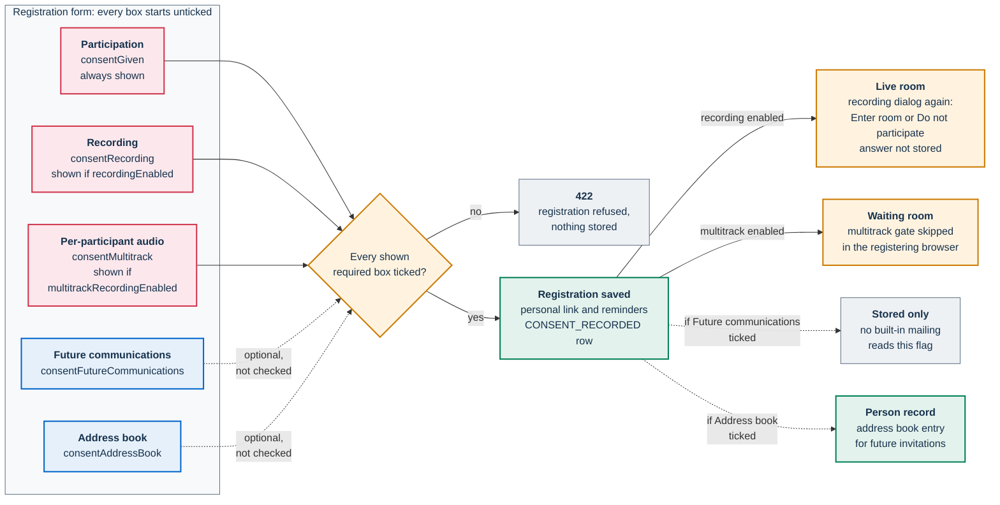
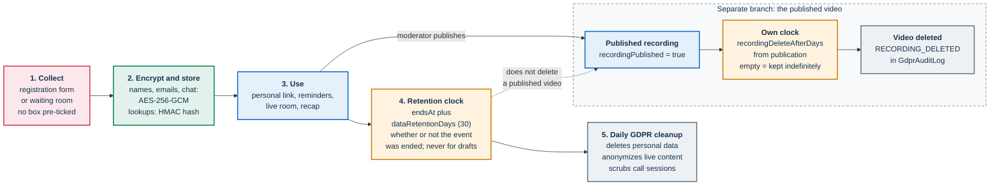
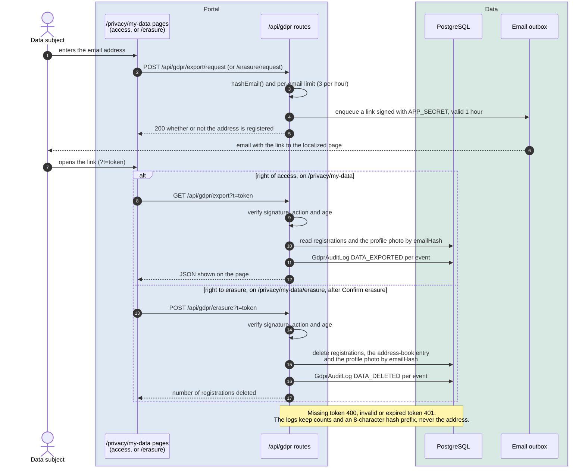

# Privacy and data protection

This page owns the personal data that PA Webinar handles. It covers who is responsible for what, the single inventory of personal data with its retention, the consent model, the cleanup mechanics, the flows for data-subject rights, the address book, staff and guest data, cookies, logs and external resources, the audit trails, how the privacy notice of an event is chosen, and the exact consent texts that people see.

It is written for the data protection officers (DPOs) and controllers of administrations that adopt PA Webinar, for auditors, for operators who write privacy notices, and for developers who touch personal data. Every statement describes the current code. Where the code falls short of what a reader might expect, the limitation is stated, and all of them are collected in [Known limitations](#known-limitations).

This page is not legal advice. It tells a controller what the software does, so that the controller can decide what its privacy notice, its records of processing and its data protection impact assessment must say.

Related pages:

- recordings, per-participant audio and AI outputs, with their legal bases and retention regimes: [Recordings, voice data and AI outputs](privacy/recordings-and-ai.md);
- the facts a privacy notice needs, mapped to the settings that control them: [Privacy notice checklist for controllers](privacy/privacy-notice-checklist.md);
- every credential and the technical cookie inventory: [Identity, access and tokens](architecture/identity-and-access.md);
- when each cleanup job runs and which Helm key holds its schedule: [Scheduled and background jobs](architecture/background-jobs.md);
- encryption keys, the secrets map and the application's security controls: [Security architecture](architecture/security.md);
- the event statuses that start the retention clock: [Event lifecycle](architecture/event-lifecycle.md).

## Roles and responsibilities

The public administration (PA) that runs an installation is the **controller** of the personal data processed in it. The providers it uses to run that installation act as **processors**: typically the hosting or cloud provider, the SMTP relay, the object storage provider and, if the installation uses one, an external Jitsi or TURN service. The PA Webinar project does not operate installations, and the software sends no telemetry to the project or to anyone else.

| The software guarantees | The operator must do |
|---|---|
| Consent boxes are never pre-ticked, and required consents are enforced on the server | Write the privacy notice of the installation and of each event, and decide the legal basis of each processing |
| Email addresses, most names, chat messages and email bodies are encrypted at rest with AES-256-GCM; the inventory lists the fields that are not | Generate real values for `PII_ENCRYPTION_KEY` and `APP_SECRET`, keep them secret and back them up. Losing `PII_ENCRYPTION_KEY` makes the encrypted data unreadable |
| A daily job deletes event-scoped personal data once an event's retention period has passed, whether or not the event was ended, and strips names and identifiers from the live content the event keeps | Keep the scheduled jobs running: the cleanup job, and the lifecycle job or the JVB scaler that end events on time (see [Retention and cleanup](#retention-and-cleanup)) |
| Self-service access and erasure, confirmed by email | Handle the requests that self-service does not cover (see [What needs an administrator](#what-needs-an-administrator)) |
| No analytics, no tracking cookies, no third-party CDN, self-hosted fonts | Decide whether to use the few external resources that exist (Gravatar, links to YouTube) and declare them |
| Cookies and local-storage entries are functional only | Tell staff that an unsaved event-wizard draft, with the names and email addresses of the contact, moderators, speakers and invitees, stays in the browser's local storage. On shared devices, staff should save or discard drafts (see [Cookies and browser storage](#cookies-and-browser-storage)) |
| Application logs carry no IP addresses | Set retention for ingress, Jitsi, TURN and log-stack logs, which do carry IP addresses |
| In the call, only moderators see the name and email address given at registration, or on a named grant, next to each person; the portal keeps only a link between call connections and registrations or grants, which expires 12 hours after the last person joins the call | Say in the event's notice that its moderators see the registration name and email address of the people in the room |
| The GDPR cleanup and the self-service requests write count-only audit rows | Keep database backups under a retention policy of their own. Deleted rows survive in backups until those expire |

## Principles

- **Minimization.** A registration asks for a display name and an email address. Organization, role and organization type appear only when the event is configured to ask for them. Guests give only a display name.
- **Consent is never pre-ticked.** Every consent box on the registration form starts unticked, and the server rejects a registration that lacks a required consent (see [Consent model](#consent-model)).
- **Encryption at rest.** `encryptPII()` in `app/src/lib/crypto/pii.ts` encrypts with AES-256-GCM under `PII_ENCRYPTION_KEY` (64 hex characters). In production the application refuses a key that looks like a placeholder, a short block repeated to length, and fails closed. The local Docker Compose stack sets `ALLOW_INSECURE_PII_KEY=true` to run with its public development key; a real installation must never set it. The inventory below says, column by column, what is encrypted and what is not.
- **Email lookups use a keyed hash.** `hashEmail()` computes an HMAC-SHA-256 of the lowercased, trimmed address, keyed with `APP_SECRET`. The hash finds duplicates and serves the rights requests without decrypting anything. Without `APP_SECRET`, which only a development setup allows, it falls back to plain SHA-256.
- **No analytics and no third-party CDN.** The portal loads no analytics script or tracking pixel. The only usage figure that the audience's browsers report is first-party and aggregate: a click on an event material increments that material's open count, and nothing records who clicked (see **Materials** in the inventory). Fonts are self-hosted from `app/public/fonts`. The Content Security Policy that enforces this is described in [SECURITY-CSP.md](SECURITY-CSP.md).
- **No IP addresses in application logs.** The portal's log lines carry event and row identifiers, not client addresses (see [Logs and external resources](#logs-and-external-resources)). The database holds client IP addresses in one place, the staff audit log, for 90 days (see [Audit trails](#audit-trails)). Guest chat messages store only a keyed hash of the address; messages written before that change keep a reversible encoding until event retention.
- **Jitsi never receives an email address or a usable hash of one.** The conference token carries a display name, an opaque per-join identifier and an avatar. An uploaded profile photo is linked by a random identifier. When Gravatar is enabled, the avatar URL carries the Gravatar hash encrypted with the platform key, which no other participant can reverse (see [Avatars](architecture/identity-and-access.md#avatars)).

## Data inventory and retention

This is the single inventory of the personal data that PA Webinar stores. `app/prisma/schema.prisma` is the authority on fields. This table says what matters for privacy.

**Event retention** means: after the event's `endsAt` plus its `dataRetentionDays`. For an event that was never ended, the clock starts at the later of `endsAt` and its last activity. Drafts are never cleaned. The daily GDPR cleanup (`/api/cron/cleanup`) applies it: it deletes the event's personal data, and removes names and identifiers from the live content that stays with the event ([What stays after event retention](#what-stays-after-event-retention)). See [Retention and cleanup](#retention-and-cleanup).

| Data | Where | Protection | Retention | Removed by |
|---|---|---|---|---|
| **Registration**: display name, email address, page language, optional organization, role and organization type, consent flags and consent time, personal access token, join and leave times | `Registration` | Name and email encrypted. Email looked up by HMAC `emailHash`. Organization fields in plain text | Event retention | GDPR cleanup, or the registrant's self-service erasure |
| **Primary event contact**: the name and email typed in the event wizard (the lead organizer) | `Event.moderatorName`, `Event.moderatorEmail`, `Event.moderatorOrganization` | Email encrypted, name and organization in plain text. With **Show on the public page** on (`moderatorPublicListed`, off by default) the name and organization also appear on the public event page. The address receives the moderator-link email ([Email and calendar](architecture/email.md)); calendar files never show it, because their organizer address is the platform's (`SMTP_FROM`). The name is published as the organizer of the event's calendar files, including the public one (`/api/events/{slug}/calendar.ics`, no sign-in, every status except `DRAFT`), and copied into `EventMaterial.addedBy` when material is added from the room with the primary moderator link | Kept with the event row, including after event retention; the copies in `EventMaterial.addedBy` are emptied then | Nothing automatic ([limitation](#known-limitations)) |
| **Public speaker list** | `Event.speakersInfo` | Free text per language (names and descriptions), plain text, public on the event page only when the event lists no speaker (`publicListed` grants) | Kept with the event, including after event retention | Nothing automatic; edit the event |
| **Named moderator and speaker grants** | `EventModerator` | Name and email encrypted, with the email's keyed fingerprint (`emailHash`, to recognize a staff account with the same address); organization and its logo address in plain text. The token is a durable sign-in credential. When **Show on the public page** is on (`publicListed`, off by default), the name and the organization appear on the public event page and in its structured data: whoever adds the person decides it, and should have their agreement | Event retention. Duplicating an event copies its grants | GDPR cleanup; self-service export and erasure find the grants by the fingerprint, which the daily cleanup fills in for older grants (erasure also ends the person's link) |
| **Invitations** | `EventInvitation` | Name and email encrypted, email HMAC, token of the pre-filled registration link. With public registration off, the list decides who may register: the registration route matches the typed address against the HMAC, and sends the personal link only to that mailbox ([Invitation-only registration](architecture/event-journey.md#invitation-only-registration)) | Event retention | GDPR cleanup |
| **Guests** | No row of their own. The typed name lives in the chat, Q&A and questionnaire rows below. A random `paw_guest_id` kept in the browser keys their votes and reactions | As the rows below | Event retention | GDPR cleanup |
| **Chat**, including questions asked in the chat, reactions to messages and attachments | `ChatMessage`, `ChatMessageReaction`, attachment files in object storage | Sender name, message text and attachment file name encrypted. For a guest, the sender identifier (`senderId`) is an HMAC, keyed with `APP_SECRET`, of the client IP address and the typed name: it keeps a guest's messages grouped without storing the address. Messages written before this change keep the older identifier, a reversible encoding of the address, until event retention. It is never sent to other attendees: the history, the live stream and the export carry only a key derived from it with HMAC under `APP_SECRET`, which cannot be reversed by enumeration. Redis relays messages in plain text while live and stores none | Event retention. Messages hidden by a moderator stay until then; hiding deletes the attachment file at once | GDPR cleanup, rows and files |
| **Q&A panel** questions and upvotes | `Question`, `QuestionUpvote`, `QuestionGuestUpvote` | Plain text: author name, question and the moderator's written answer. A registrant's upvote holds the registration (`QuestionUpvote`); the upvote of a guest, speaker or moderator holds only the random browser id (`QuestionGuestUpvote`) | Author name, registration link and upvote rows: event retention. Question text, answer, status and upvote count: kept with the event | GDPR cleanup: empties the author name, removes the registration link and deletes the upvote rows. Erasure removes a registrant's own questions. The questions go with the event |
| **Polls and word cloud** | `Poll`, `PollVote`, `WordCloudRound`, `WordCloudSubmission` | A registration ID or a browser guest ID on each vote and word, no names | Registration and browser IDs: event retention. Polls, votes, rounds and words: kept with the event | GDPR cleanup: removes the registration and replaces the browser ID with a per-event pseudonym ([What stays after event retention](#what-stays-after-event-retention)). Erasure deletes a registrant's own votes and words |
| **Live reactions, agenda and agenda reactions** | `Reaction`, `EventAgendaItem`, `AgendaItemReaction` | Live reactions store only the emoji and the time. Agenda items hold the moderators' topics. An agenda reaction holds a registration ID or a browser guest ID | Live reactions and agenda reactions: event retention. Agenda items: kept with the event | GDPR cleanup, for the reactions. Agenda items: deleting them or the event |
| **Live action journal**: what happened in the room and when, read by AI post-production for the summary | `LiveAction` | No names and no Jitsi endpoint IDs: the role of whoever acted, the server time, and IDs, counts and texts written by moderators (agenda topics, poll questions with their results, word-cloud prompts), plus the most frequent words of each closed word-cloud round, which participants typed. Raised hands are recorded as times only ([details](architecture/live-interaction.md#live-action-journal)) | Kept with the event | Deleting the event |
| **Feedback and questionnaire responses** | `EventFeedback`, `QuestionnaireResponse`, `QuestionnaireAnswer` | `EventFeedback`: the older star ratings, which the room does not write: a rating, an optional free-text comment, and a registration or guest ID. `QuestionnaireResponse` of the end-of-event rating (`POST_EVENT`): no name and no email hash, only the registration ID, kept to allow one response per registration, or the browser's guest ID; organizers see the answers without a name, and the form says so. Pre-registration responses (`PRE_REGISTRATION`): the respondent name in plain text and, for a registrant, the registration's email HMAC (`respondentEmailHash`). Answers in both, including free text | Pre-registration responses: event retention. End-of-event responses and star ratings: kept with the event, without registration, browser ID, name or email hash after event retention | GDPR cleanup: deletes pre-registration responses with their answers; removes the identities from the others, replacing the browser ID with the same per-event pseudonym |
| **Materials** | `EventMaterial` and its files | Files in object storage. The visibility setting (**In the room and after the event**, the default, **Before the event**, **During the event**, **After the event**) decides which public lists show a material, not who can download it: an uploaded file is served from its `/api/assets/…` URL to anyone who has the URL. Before the start, only materials marked **Before the event** are listed publicly. Each material also keeps `openCount`, how many times it was opened or downloaded from a list: one number per material, with nothing about who opened it, shown only to the event's moderators. To count each caller once every 10 minutes, the server holds a hash of the room token or, without a valid one, the client IP address in its memory for those 10 minutes, and never logs or stores it ([Materials](architecture/live-interaction.md#materials)) | Kept with the event, files included. The name of whoever added a material (`addedBy`) is emptied at event retention | Deleting the material or the event, rows and files. The GDPR cleanup empties `addedBy` |
| **Reminder bookkeeping** | `EventReminder`, `ReminderSent` | Identifiers only | Event retention | GDPR cleanup |
| **Call sessions** | `CallSession` | Participant list encrypted. Dominant-speaker log (endpoint ID and display name) in plain text; it is collected in every live room that a moderator attends, whether or not the event records. Hand-raise log with opaque IDs | Personal columns emptied at event retention. Duration and peak attendance are kept | GDPR cleanup (scrub) |
| **Event recap** | `Event.postEventRecap` | Aggregates and question texts without their authors, including questions asked in the chat, which are decrypted and stored in plain text | Kept with the event: it survives the retention cleanup | Nothing automatic |
| **Temporary recording** | `Event.tempRecordingUrl` | Recordings storage, private | 24 hours after `tempRecordingStartedAt`, unless published | GDPR cleanup |
| **Composite video recording** | `Event.recordingUrl`, recordings storage | Private container, short-lived signed playback URLs, the provider's encryption at rest | Not published: event retention. Published: `recordingDeleteAfterDays` after publication, or indefinitely when unset | GDPR cleanup, or deletion through the primary moderator link. Details in [Recordings, voice data and AI outputs](privacy/recordings-and-ai.md) |
| **Per-participant audio tracks** | `RecordingTrack` and its files | Never public. Name encrypted | Deleted shortly after transcription, unless the event keeps them. At the latest at event retention, when the post-production jobs run ([limitation](#known-limitations)) | `multitrack-purge`, `postprod-retention`, the orphan sweep of `recordings-reconcile`, GDPR cleanup for the rows. See [Recordings, voice data and AI outputs](privacy/recordings-and-ai.md) |
| **Per-participant recording consent given in the waiting room** | `MultitrackConsent` | Name encrypted; the conference seat identifier, the time and the page language in plain text. Written when someone who had not consented at registration (a guest, a speaker, a registrant on another device) ticks the box in the waiting room and receives the conference token | Event retention; with the registration, when linked to one | GDPR cleanup; erasure on request, through the registration |
| **AI outputs**: transcripts, summaries, subtitles, translations, dubbed audio, speaker labels | `PostprodArtifact`, `PostprodOriginalBody`, `Speaker`, `Recording.pipelineSnapshot`, post-production storage | Inline text encrypted. Files under the provider's encryption. Speaker names (`Speaker.displayName`) and the pipeline snapshot (`Recording.pipelineSnapshot`, which includes speaker names) in plain text | Follow the recording: event retention if the video is not published, the video's lifetime if it is. An optional site-wide cap applies on top. The purge deletes the `Speaker` rows and scrubs job payloads, but the speaker names copied into `Recording.pipelineSnapshot` remain ([limitation](#known-limitations)) | `postprod-retention`. See [Recordings, voice data and AI outputs](privacy/recordings-and-ai.md) |
| **Address book** | `Person` | Display name encrypted. No email address is stored, only its HMAC. Organization fields in plain text | `retentionMonths` (default 24) after the last activity. Opted-out entries at the next run | `rubrica-retention`, or an administrator's deletion |
| **Profile photo**: the picture a registrant chooses to show in the room instead of initials | `ProfilePhoto` | Not encrypted. Keyed by the email HMAC, with no name and no address, and shared by every event of that address. Uploading needs proof of the address: a registration whose browser has opened the entry link from an email. Named moderator and speaker grants cannot upload or show a photo, because staff choose their address. The server re-encodes every upload as a 256×256 JPEG without metadata such as date, place or device, whatever the client sent. Served without a credential at `/api/avatar/photo/{id}`, a random address that the conference token gives to everyone in the room, and cached by browsers for up to an hour. Not shown in the chat ([Avatars](architecture/identity-and-access.md#avatars)) | While a registration with the same email hash exists, at any event. Then until it has gone 30 days without a change | The person, in the waiting room. Self-service erasure. GDPR cleanup |
| **Who is behind each video tile**: which registration or named grant each connection to the call belongs to | Redis hash `live:seats:<eventId>`; the memory of an app pod when Redis is missing or does not answer | Only references: the Jitsi endpoint id and the registration or grant id, no name and no address. Through it, moderators (the primary link and `MODERATOR` grants, not speakers) see in the participants panel the registration's or grant's name and email address next to each person in the call ([Who is behind each video tile](architecture/identity-and-access.md#who-is-behind-each-video-tile)) | In Redis, 12 hours after the last connection declared in the event. In a pod's memory, 12 hours after each declaration | Redis expiry; in memory, the next use of the map after expiry, or the end of the process |
| **Staff accounts** | `StaffAccount` | Name and email encrypted, email HMAC | Until an administrator deletes the account | An administrator |
| **Staff sign-in links** | `StaffLoginToken` | Only the SHA-256 of the token | One day after use or expiry | GDPR cleanup |
| **Email outbox** | `EmailOutbox` | Recipient, HTML and text encrypted. Subject, calendar attachment and metadata in plain text. The calendar attachment names the primary contact as organizer, with the platform's address. Metadata holds row IDs. For moderator-link emails, the deduplication column holds an HMAC of the recipient's address, used to send each link once | Sent and failed rows: 30 days after their last update (`EMAIL_OUTBOX_RETENTION_DAYS`). Rows with a deduplication key are emptied instead of deleted, so that each link is still sent only once. Rows written for a registration are also deleted by erasure | GDPR cleanup |
| **GDPR audit log** | `GdprAuditLog` | No personal data: counts, consent flags, an 8-character prefix of the email hash | Kept | Only by deleting the event row |
| **Staff audit log** | `AdminAuditLog` | Actor identifier, client IP address, user agent. The detail of the speaker-naming action (`POSTPROD_SPEAKER_MAP`) may include the speaker's name | Rows kept. IP address, user agent and the speaker-naming detail are emptied after 90 days (`AUDIT_LOG_PERSONAL_DATA_RETENTION_DAYS`) | GDPR cleanup |
| **Orphaned recording files** | `OrphanRecording` | File names only | `orphanRecordingGraceDays` (default 30) | `recordings-reconcile` |
| **Presence in the square** | Redis | Display name, avatar choice, position | Removed at once when a person leaves normally. Otherwise, the event's presence record expires about 10 seconds after the last update from anyone in the square; until then, a departed person's entry stays in Redis but is no longer shown | The leave signal, or Redis expiry |
| **Rate-limit counters** | Memory of each app pod | Keyed by IP address, email hash or a hash of the room token, including the once-per-10-minutes count of material openings | The end of each limit window | The process |
| **Application logs** | Container standard output | No IP addresses. Email addresses only inside relayed SMTP errors | The operator's log stack | The operator |
| **Data-subject request links** | Not stored. The email that carries them is in the outbox | HMAC-signed with `APP_SECRET` | 1 hour | Expiry |

### Emails after the event

Two emails can reach registrants after the event. Both go through the email outbox and the SMTP relay, use only the registration's address and language, and go only to people who registered for that event ([Email and calendar](architecture/email.md#emails-the-platform-sends)):

- **Post-event thank-you**, *opt-in* per event (**Send recap email when the event ends**, `postEventEmailEnabled`): once, to every registrant, for events that ended within the previous seven days.
- **Recording notice**, on by default per event (**Notify registrants when the recording is published**, `recordingNotifyEnabled`): once, when the event's published recording or external video becomes visible on its public page, to every registration the event still keeps. Its purpose is to tell the people who registered that they can watch the event. It ends with retention: once the cleanup has deleted the registrations, nobody is notified. Staff can turn it off on the event until it is sent.

Neither email depends on the future-communications consent. If your notice does not cover the recording notice, turn it off on each event, in the **Post-event configuration** panel of the **After the event** tab, before it is sent.

### What stays after event retention

The cleanup never deletes the event row, and it does not change the status of a concluded event: an `ENDED` event stays `ENDED`, and one that staff archived stays `ARCHIVED`. Only an event that was never ended is set to `ARCHIVED`. Whether the event keeps a public page, and what that page shows, is decided by its post-event settings: page visibility (`postEventPublic`, `postEventPublicUntil`), the video library (`libraryListed`) and the toggles of what the page shows (`postEventShow*`) ([The post-event page](architecture/event-journey.md#the-post-event-page)).

For as long as the event exists, it keeps:

- its record: title, description, dates, the public speaker list (`Event.speakersInfo`), the co-organizing organizations (`EventOrganizer`), the event recap (with the texts of Q&A and chat questions, without their authors), the questionnaire configuration, the `Recording` rows (emptied of AI outputs and tracks by `postprod-retention` unless the video is published; the purge also removes the speaker names from `pipelineSnapshot`), and the `GdprAuditLog` rows. The primary event contact also stays, and its name stays public in the event's calendar file; see [Known limitations](#known-limitations);
- its live content, without any link to a person, so that organizers can decide what to publish:
  - Q&A questions and the moderators' answers, with their status and upvote count. The author name is emptied, the registration link removed and the upvote rows deleted; the public post-event page shows these questions without an author;
  - polls with their votes, and word-cloud rounds with their words. Each vote and word loses its registration, and its browser ID is replaced by a pseudonym: `anon:` followed by the MD5 of the event ID and the original registration ID, or browser ID, or the row's own ID when it has neither. The pseudonym is the same for one person across the event's poll votes, word-cloud words, older star ratings and end-of-event answers, and differs from one event to the next. The one-per-person unique indexes therefore still hold, and per-person counts, such as the event's analytics and the words each person sent, stay as they were. Once the registrations are deleted, nothing in the database leads from a pseudonym back to a person; a browser that still holds its browser ID could recompute the pseudonym of its own contributions;
  - end-of-event questionnaire responses with their answers, without name, email hash or registration, and the older star ratings and comments, without registration; in both, the browser ID is replaced by the same pseudonym;
  - materials and their files, without the name of whoever added them. Material files are deleted only when the material or the event is deleted;
  - the agenda items and the live action journal, which hold no names.

What the audience wrote (question texts, comments, free-text answers, word-cloud words) stays as it was typed, and can itself contain personal data; see [Known limitations](#known-limitations).

## Consent model

### At registration

The registration form shows up to five consent boxes. All start unticked (`app/src/components/registration/registration-form-client.tsx`). `POST /api/events/{slug}/registrations` enforces the required ones on the server and rejects the request with a validation error (`422`) when one is missing.

| Consent | Stored as | Shown when | Required | Effect |
|---|---|---|---|---|
| Participation | `Registration.consentGiven`, `consentTimestamp` | Always | Yes | The registration is stored. When the event asks for organization data, the label adds that it is processed for statistics |
| Audio and video recording | `Registration.consentRecording`, `null` when the event does not record | `recordingEnabled` | Yes, when shown | The registration is stored. The live room asks again before entry (see below) |
| Per-participant audio track | `Registration.consentMultitrack`, `null` when not asked | `multitrackRecordingEnabled` | Yes, when shown | The registration is stored, and the waiting room does not ask again in the registering browser |
| Future communications | `Registration.consentFutureCommunications` | Always | No | Recorded and included in the export. No built-in feature sends anything based on it |
| Address book | `Person.optedInAt`, and the `consentAddressBook` flag in the audit row | Always | No | Creates or refreshes the person's address-book entry (see [The address book](#the-address-book)) |

Making recording consent a condition of registration is a design choice of the platform. Whether consent is the right legal basis for a recorded event, and whether it can be a condition of taking part, is for the controller to assess.

```mermaid
flowchart LR
  classDef req fill:#FCE8EC,stroke:#D1344C,stroke-width:2px,color:#17324D
  classDef opt fill:#E6F0FA,stroke:#0066CC,stroke-width:2px,color:#17324D
  classDef gate fill:#FFF3E0,stroke:#CC7A00,stroke-width:2px,color:#17324D
  classDef data fill:#E3F2EC,stroke:#008055,stroke-width:2px,color:#17324D
  classDef ext fill:#EEF1F4,stroke:#5C6F82,stroke-width:1px,color:#17324D

  subgraph FORM["Registration form: every box starts unticked"]
    direction TB
    C1["<b>Participation</b><br/>consentGiven<br/>always shown"]:::req
    C2["<b>Recording</b><br/>consentRecording<br/>shown if recordingEnabled"]:::req
    C3["<b>Per-participant audio</b><br/>consentMultitrack<br/>shown if<br/>multitrackRecordingEnabled"]:::req
    C4["<b>Future communications</b><br/>consentFutureCommunications"]:::opt
    C5["<b>Address book</b><br/>consentAddressBook"]:::opt
  end
  style FORM fill:#F7F9FB,stroke:#5C6F82,color:#17324D

  Q{"Every shown<br/>required box ticked?"}:::gate
  NO["<b>422</b><br/>registration refused,<br/>nothing stored"]:::ext
  G1["<b>Registration saved</b><br/>personal link and reminders<br/>CONSENT_RECORDED row"]:::data
  G2["<b>Live room</b><br/>recording dialog again:<br/>Enter room or Do not participate<br/>answer not stored"]:::gate
  G3["<b>Waiting room</b><br/>multitrack gate skipped<br/>in the registering browser"]:::gate
  G4["<b>Stored only</b><br/>no built-in mailing<br/>reads this flag"]:::ext
  G5["<b>Person record</b><br/>address book entry<br/>for future invitations"]:::data

  C1 --> Q
  C2 --> Q
  C3 --> Q
  C4 -.->|"optional,<br/>not checked"| Q
  C5 -.->|"optional,<br/>not checked"| Q
  Q -->|"no"| NO
  Q -->|"yes"| G1
  G1 -->|"recording enabled"| G2
  G1 -->|"multitrack enabled"| G3
  G1 -.->|"if Future communications<br/>ticked"| G4
  G1 -.->|"if Address book<br/>ticked"| G5
```

### In the room

- **Recording dialog.** When an event has `recordingEnabled` and the installation may be able to record, guests and registrants see a full-screen dialog before they enter the live room: **Recording consent**, with the text "This event is being recorded. By entering, you consent to audio/video recording." and two buttons, **Enter room** and **Do not participate**. For an event where participants may use neither microphone, nor camera, nor screen, the text is the registration form's information notice instead (`gdpr.consent.recordingNotice`). Declining returns to the event page. The dialog is left out only when the absence of a recorder is certain: Jitsi is the one the chart installs, the chart runs no Jibri (it sets no `JIBRI_HEALTH_URL`), no recordings storage is declared, and the per-participant recorder is not configured (`RECORDER_CONTROLLER_URL`). With an external Jitsi the dialog is always shown, because the portal cannot know whether that deployment records (`app/src/lib/recording/availability.ts`). Holders of moderator and speaker links skip the dialog. The answer is not stored. A red **REC** icon in the top bar, labelled **Recording in progress** for screen readers and on hover, stays visible while Jibri records. The per-participant recorder shows no banner, because it joins the conference as a hidden participant and starts no Jitsi recording; participants learn about it through the waiting-room gate below and the privacy notice (see [Recordings, voice data and AI outputs](privacy/recordings-and-ai.md)).
- **Per-participant audio gate.** On an event with `multitrackRecordingEnabled`, anyone who reaches the waiting room without a stored multitrack consent must tick the same consent text there before entering: guests, speakers, and a registrant who opens a personal link in a browser other than the one used to register. Holders of a moderator link are exempt. The tick opens the door in that browser and is not stored ([limitation](#known-limitations)).
- **AI disclosure.** When the installation enables AI post-production (`aiPipelineEnabled`) and the event turns on at least one AI output (transcript, summary, translation or dubbing), the waiting room shows the disclosure text from the site settings (`aiConsentDisclosure`, per language), or a built-in generic text (`waiting.aiNotice`) when none is set for the page language. The AI regime is described in [Recordings, voice data and AI outputs](privacy/recordings-and-ai.md).

Recording is off unless both the operator and the event turn it on. Jibri is disabled in the chart's default values (`jitsi-meet.jibri.enabled: false`; the profiles that enable it are listed in [Deploying with Helm](DEPLOYMENT.md)), `recordingEnabled` is off by default on every event, and `autoStartRecording`, which starts Jibri as soon as a moderator joins, is a separate opt-in per event. The per-participant recorder runs only for events that have `recordingEnabled`, `aiTranscriptEnabled` and `multitrackRecordingEnabled` all set.

### Evidence of consent

- Each registration stores its consent flags and `consentTimestamp`.
- Each registration writes a `CONSENT_RECORDED` row to `GdprAuditLog` with the flags given, including `consentAddressBook`, and no personal data.
- When a recording enters AI post-production, `Recording.consentSnapshot` freezes the event-level AI and multitrack flags of that moment.

When the registration is deleted, at retention or by erasure, the per-person proof goes with it. The `CONSENT_RECORDED` rows remain, and they prove that consents were collected without saying by whom.

`Registration` also has the columns `aiConsentTranscript`, `aiConsentSummary` and `aiConsentTranslation`. No code writes or reads them. AI processing is governed at the event level.

### Withdrawing consent

There is no per-consent withdrawal screen. A registrant withdraws by erasing the registration (see [Data-subject rights](#data-subject-rights)). Address-book consent has its own opt-out (see [The address book](#the-address-book)). Anything else goes to the controller.

## Retention and cleanup

### The retention window

- **Per event.** `Event.dataRetentionDays` is set in step 5 of the event wizard (**Retention days**), from 1 to 365, default 30 (`app/prisma/schema.prisma`, `app/src/lib/validation/schemas.ts`). An event template can preset it (`EventTemplate.defaultRetentionDays`). The wizard shows only one help line under the field: "After this threshold, personal data is automatically deleted." The environment variable `DEFAULT_DATA_RETENTION_DAYS` in the chart's `app.env` is not read by the application.
- **The clock starts at `endsAt`.** The comparison is strict: with 30 days, the data is still there on day 30 and becomes eligible after it (`isEventDataRetentionExpired()` in `app/src/lib/gdpr/cleanup-selection.ts`).
- **The event need not be finished.** `ENDED` and `ARCHIVED` events are cleaned once `endsAt` plus the retention days has passed. Events that were never ended (`PUBLISHED`, `PROVISIONING`, `IDLE` or `LIVE`) are cleaned too, once the later of `endsAt` and their last activity (`lastActiveAt`) plus the retention days has passed, so an open-ended room still in use is not emptied under its participants. Every installation also ends events on time: the JVB scaler in the Helm `full` profile, the lifecycle job everywhere else ([Event lifecycle](architecture/event-lifecycle.md#running-without-the-scaler)). `DRAFT` events are never cleaned: they hold no registrations, and their configuration is what copies inherit. Archiving does not start the clock early: the data still stays until `endsAt` plus the retention days.

```mermaid
flowchart LR
  classDef risk fill:#FCE8EC,stroke:#D1344C,stroke-width:2px,color:#17324D
  classDef data fill:#E3F2EC,stroke:#008055,stroke-width:2px,color:#17324D
  classDef portal fill:#E6F0FA,stroke:#0066CC,stroke-width:2px,color:#17324D
  classDef job fill:#FFF3E0,stroke:#CC7A00,stroke-width:2px,color:#17324D
  classDef ext fill:#EEF1F4,stroke:#5C6F82,stroke-width:2px,color:#17324D

  C["<b>1. Collect</b><br/>registration form<br/>or waiting room<br/>no box pre-ticked"]:::risk
  S["<b>2. Encrypt and store</b><br/>names, emails, chat:<br/>AES-256-GCM<br/>lookups: HMAC hash"]:::data
  U["<b>3. Use</b><br/>personal link, reminders,<br/>live room, recap"]:::portal
  R["<b>4. Retention clock</b><br/>endsAt plus<br/>dataRetentionDays (30)<br/>whether or not the event<br/>was ended; never for drafts"]:::job
  X["<b>5. Daily GDPR cleanup</b><br/>deletes personal data<br/>anonymizes live content<br/>scrubs call sessions"]:::ext

  C --> S --> U --> R --> X

  subgraph EXEMPT["Separate branch: the published video"]
    direction LR
    P["<b>Published recording</b><br/>recordingPublished = true"]:::portal
    K["<b>Own clock</b><br/>recordingDeleteAfterDays<br/>from publication<br/>empty = kept indefinitely"]:::job
    D["<b>Video deleted</b><br/>RECORDING_DELETED<br/>in GdprAuditLog"]:::ext
    P --> K --> D
  end
  style EXEMPT fill:#F7F9FB,stroke:#5C6F82,stroke-dasharray:5 4,color:#17324D

  U -->|"moderator publishes"| P
  R -.->|"does not delete<br/>a published video"| P
```

### The daily GDPR cleanup

`GET /api/cron/cleanup` runs daily in the Helm chart and hourly in Docker Compose (schedules in [Scheduled and background jobs](architecture/background-jobs.md)). It works in phases:

1. **Temporary recordings.** An unpublished `Event.tempRecordingUrl` whose `tempRecordingStartedAt` is more than 24 hours old is deleted from storage and cleared, with a `TEMP_RECORDING_DELETED` audit row. No built-in flow creates temporary recordings today; phase 3 also deletes any that exist at event retention.
2. **Published recordings past their own retention.** A published video whose `recordingDeleteAfterDays` has passed since `recordingPublishedAt` is deleted from storage and unpublished, with a `RECORDING_DELETED` row.
3. **Event data past event retention.** Eligible events are the `ENDED` and `ARCHIVED` ones past retention, and those never ended past retention as defined above. Every run goes through all of them again, including those cleaned on an earlier run. An event that was never ended is archived in the same run, and its open call sessions are closed with an estimated end time; the job's response counts these as `unfinishedEventsArchived`. A concluded event keeps its status. For each eligible event, one database transaction:
   - deletes the Q&A upvotes, of registrants and of browser IDs;
   - removes the identities from the live content that stays with the event ([What stays after event retention](#what-stays-after-event-retention)): it empties the author name of Q&A questions and removes their registration; it removes the registration from poll votes, older star ratings and word-cloud words and replaces their browser ID with the per-event pseudonym; it does the same on end-of-event questionnaire responses and also empties their name and email hash; and it empties `addedBy` on materials;
   - deletes the pre-registration questionnaire responses (their answers cascade), reminder bookkeeping and reminders, the per-participant recording consents given in the waiting room, registrations, chat messages, live reactions, agenda reactions, invitations, named grants, and the per-participant track rows whose audio is already gone;
   - empties the personal columns of every call session (`participants`, `dominantSpeakerLog`, `handRaiseLog`);
   - sets `ARCHIVED` on an event that was never ended;
   - writes a `DATA_DELETED` row with the count of each kind deleted or anonymized, only when the run deleted or anonymized at least one row. Emptying the call-session columns, which every run does again, does not count.

   The identities are removed before the registrations are deleted because Q&A questions and poll votes reference their registration with a cascading delete: deleting the registrations first would delete them too. After the transaction commits, the job deletes the files: the temporary recording, the composite video unless it is published, and chat attachments. Material files stay with the event. File deletion is best effort: a storage error is logged and does not undo the database cleanup. The event still references its unpublished composite video, so every later run tries to delete it again; a chat attachment is not retried, because its message is already deleted.
4. **Staff sign-in links.** Links used or expired more than a day ago are deleted.
5. **Profile photos.** A photo is deleted once no registration with its email hash is left, at any event, and it has not been changed for 30 days. Registrations leave with their events' retention, so the photo outlives the last of them by up to 30 days, depending on when it was last changed. The job does this with a single SQL `DELETE` on the photos last changed more than 30 days ago for which no registration with the same email hash exists, so no list of photos passes through the application. The response counts these as `profilePhotosDeleted`.

Phase 3 runs on every eligible event at every run, and every step is idempotent: the deletions remove whatever is there, and the updates touch only rows that still carry a name or an identity. A later run therefore changes nothing that an earlier run already handled, and removes what was written afterwards or left behind by a failed run: for example the data collected by an event whose end date was moved later after a first cleanup, once its new retention passes, or rows written after the first run. An event that staff archived before its retention passed is processed like an `ENDED` one when it does. The selection rules live in `app/src/lib/gdpr/cleanup-selection.ts`, and the job's contract is tested in `app/src/app/api/cron/cleanup/route.test.ts`.

### The published-recording exemption

A published video is a public record, so the event's retention does not delete it. Its lifetime is `recordingDeleteAfterDays`, counted from publication and chosen in the recording panel: **24 hours (temporary)**, **7 days**, **30 days**, **90 days**, or **No automatic deletion**, which stores no value. With no value the video stays public until someone deletes it, and the note under the options says so: event retention does not remove a published video. Unpublishing a video whose event is already past retention makes it eligible for deletion on the next run. The AI outputs of a published video follow the video; see [Recordings, voice data and AI outputs](privacy/recordings-and-ai.md).

### Other retention jobs

| Job | What it deletes | Runs in |
|---|---|---|
| `/api/cron/rubrica-retention` | Address-book entries past their retention, and opted-out entries | Helm chart, daily |
| `/api/cron/multitrack-purge` | Per-participant track audio once transcription is done | Helm chart, with `postprod.enabled` |
| `/api/cron/postprod-retention` | AI outputs, speaker labels and remaining tracks, by the recording's retention | Helm chart, with `postprod.enabled` and `postprod.retention.enabled` |
| `/api/cron/recordings-reconcile` | Files under `recordings/` that no event or call session references, after `orphanRecordingGraceDays`. This includes per-participant track files, which no field it checks points to | Helm chart |

With the recorder on (`recorder.enabled`) the chart renders `multitrack-purge` even without post-production (`postprod.enabled`): tracks that no transcription consumes are deleted when the event's data retention expires, the same rule as the GDPR cleanup. The Docker Compose `cron` service calls only `email-outbox`, `lifecycle`, `reminders` and `cleanup`. On a Compose installation, address-book retention, the orphan sweep and the track purges do not run unless the operator schedules them ([limitation](#known-limitations)).

### Rules for developers

The cascade does not fire: every event-scoped model has `onDelete: Cascade` on its event, but the cleanup never deletes the event row. A model that is not named in the cleanup transaction therefore keeps its rows forever, and `app/src/lib/gdpr/cleanup-coverage.ts` with its test makes every table with an `eventId` column declare whether the cleanup purges it. A table whose rows stay with the event and reference a registration with a cascading delete, as Q&A questions and poll votes do, must lose that reference in the transaction before the registrations are deleted. Every step of the transaction must stay idempotent, because phase 3 runs again every day on every event past retention: an update selects only the rows that still carry an identity, so that a run that finds nothing new reports zero and writes no `DATA_DELETED` row. The checklist for a new model with personal data is in [Extending PA Webinar](development/extending.md#a-model-that-holds-participant-data).

Deleting an event outright (`DELETE /api/events/{id}` with a moderator credential, or the bulk delete in the administration area) removes every row of the event by cascade, including its `GdprAuditLog` rows. Before the cascade it deletes the event's uploaded material files and chat attachments (`removeFilesOfEventsBeingDeleted()` in `app/src/lib/events/material-files.ts`); when storage does not confirm a deletion, the event is kept and the request answers 503, so a retry finishes the job. It does not delete the event's other stored files. Composite recordings and per-participant track files, which live under `recordings/`, are swept by the orphan sweep of `recordings-reconcile` after `orphanRecordingGraceDays` (Helm only); post-production files are not. Removing a single uploaded material, from the room or the administration area, deletes its file first as well, and so does replacing the file in the administration area; when storage does not confirm, the material stays.

## Data-subject rights

### Self-service access and erasure

People who registered with an email address can exercise the right of access (Art. 15) and the right to erasure (Art. 17) on their own: access at `/privacy/my-data` and erasure at `/privacy/my-data/erasure` (Italian URLs `/it/privacy/i-miei-dati` and `/it/privacy/i-miei-dati/cancellazione`). The public privacy page links to the access page, which links to the erasure page. Both flows prove ownership of the mailbox in two steps, so that knowing someone's address is not enough to read or delete their data.

```mermaid
sequenceDiagram
  autonumber
  actor P as Data subject
  box rgba(0,102,204,0.10) Portal
    participant W as /privacy/my-data pages<br/>(access, or /erasure)
    participant API as /api/gdpr routes
  end
  box rgba(0,128,85,0.12) Data
    participant DB as PostgreSQL
    participant OB as Email outbox
  end

  P->>W: enters the email address
  W->>API: POST /api/gdpr/export/request (or /erasure/request)
  API->>API: hashEmail() and per-email limit (3 per hour)
  API->>OB: enqueue a link signed with APP_SECRET, valid 1 hour
  API-->>W: 200 whether or not the address is registered
  OB-->>P: email with the link to the localized page
  P->>W: opens the link (?t=token)
  alt right of access, on /privacy/my-data
    W->>API: GET /api/gdpr/export?t=token
    API->>API: verify signature, action and age
    API->>DB: read registrations and the profile photo by emailHash
    API->>DB: GdprAuditLog DATA_EXPORTED per event
    API-->>W: JSON shown on the page
  else right to erasure, on /privacy/my-data/erasure, after Confirm erasure
    W->>API: POST /api/gdpr/erasure?t=token
    API->>API: verify signature, action and age
    API->>DB: delete registrations, the address-book entry<br/>and the profile photo by emailHash
    API->>DB: GdprAuditLog DATA_DELETED per event
    API-->>W: number of registrations deleted
  end
  Note over API,DB: Missing token 400, invalid or expired token 401.<br/>The logs keep counts and an 8-character hash prefix, never the address.
```

1. **Request.** `POST /api/gdpr/export/request` or `POST /api/gdpr/erasure/request` takes the email address and the page language. It answers `200` whether or not the address is registered, so the answer reveals nothing. A malformed address answers `422`. More than 5 requests per hour from one IP address answer `429`. After 3 emails per hour to the same address, further requests still answer `200` but send nothing.
2. **Email.** The link goes out through the email outbox, in Italian, English, French, German or Spanish, with English for every other language. It opens the localized page for the language of the request.
3. **Token.** The link carries a token signed with HMAC-SHA-256 under `APP_SECRET` over the action, the email hash and the issue time (`app/src/lib/gdpr/request-token.ts`). It is valid for one hour and only for the action it was issued for. It is not stored and is not single-use: it works for the whole hour.
4. **Fulfillment.** `GET /api/gdpr/export?t=…` returns the data. The erasure page shows **Confirm erasure** first, so opening the link erases nothing; the button calls `POST /api/gdpr/erasure?t=…`. Both answer `400` without a token and `401` for an invalid or expired one, and both allow 10 calls per hour per IP address.

Rate limits are counted in the memory of each app pod, so with several replicas they are approximate.

### What the export contains

For every registration with the requester's email hash:

- the registration: display name, email address, organization, role and organization type, every consent flag with the consent time, the email language, the registration time and the first join time, and every per-participant recording consent given in the waiting room with its time and language;
- the event: title, start, end and status;
- the questions the person posted in the Q&A panel, with status and time;
- the person's poll votes, with the poll question, the chosen option index and the time.

Beside the registrations, the export returns the profile photo of the address as `profilePhoto`, with its upload time (`uploadedAt`) and the image as a data URL (`dataUrl`), or `null` when there is none. The photo is included also when no registration is left, and the **My data** page shows it.

It does not contain chat messages, including questions asked in the chat, questionnaire answers, feedback, word-cloud words, agenda reactions, the address-book entry, invitations, named grants, staff accounts, recordings, audio tracks or transcripts. Each export writes one `DATA_EXPORTED` row per event concerned.

### What erasure deletes

Erasure deletes every `Registration` with the requester's email hash. The database cascade removes the person's Q&A questions and upvotes, poll votes, agenda reactions, reminder bookkeeping and waiting-room recording consents with it. The route also deletes, explicitly, what a cascade does not reach:

- the address-book entry (`Person`) with the same email hash, even when no registration is left; the response reports it as `addressBookDeleted`, and the confirmation page says so;
- the invitations addressed to the same email hash, even when no registration is left;
- the profile photo (`ProfilePhoto`) of the same email hash, even when no registration is left; the response reports it as `profilePhotoDeleted`;
- the feedback and questionnaire responses linked to those registrations;
- the chat messages written with those registrations (sender `reg-<registrationId>`), including questions asked in the chat, and their attachment files;
- the word-cloud words sent with those registrations, which have no foreign key to the registration and are not reached by the cascade;
- the outbox rows written for those registrations (confirmation, reminders, date changes, post-event recap, recording notice), including the ones not yet sent.

It does not delete:

- chat messages written from another device as a guest, and word-cloud words and questionnaire responses given as a guest: nothing ties them to the email address;
- named grants, which belong to the event's staff;
- recordings, audio tracks and AI outputs, which follow their own retention;
- the outbox rows of the data-subject request emails themselves, which follow the outbox retention.

Each erasure writes one `DATA_DELETED` row per event concerned, with the source and an 8-character hash prefix.

### What needs an administrator

Self-service covers only registrations found by email address. Everything else goes to the controller, through the contact published in its privacy notice.

| Request | How an administrator handles it |
|---|---|
| Rectification (Art. 16) | On the event page, **People** tab, **Correct** on the registration row: name, a new email address, organization and role (the API also accepts the organization type). The email is never shown, because the page does not decrypt it. Emails still queued for that registration go to the new address; one that the sender has already picked up at that moment still reaches the old one. The address-book entry is shared across events and keyed by the email, so: a correction by an administrator also updates the name and organization in the linked entry, while an organizer's correction stays on the registration; the email of a registration linked to an entry cannot be changed there, because the entry, its invitations and the opt-out links already sent stay tied to the old address: an administrator first deletes the entry from the address book (the registration is detached), then the email is corrected. The change is logged in `AdminAuditLog` as `REGISTRATION_RECTIFY`, with the names of the changed fields only |
| Erasure of one registration, for a request that did not come through **My data** | On the same row, **Delete**: the registration to this event with what it brought (chat, feedback, questionnaire answers, word-cloud words, queued emails, waiting-room consents), as self-service erasure does for each registration. The address-book entry and the invitations tied to the address do not belong to one event and stay: an administrator deletes the entry from the address book, or the person uses **My data**, which removes everything tied to the address. It writes a `DATA_DELETED` row with the source `admin-registration-delete`, and `REGISTRATION_DELETE` in `AdminAuditLog` |
| Removal from the address book | The person can use the opt-out link in the emails, or self-service erasure, which deletes the entry. Otherwise **Address book**, open the entry, delete it. The deletion is logged in `AdminAuditLog` as `RUBRICA_PERSON_DELETE` |
| A person's words in a transcript | The transcript editor's erasure mode removes a segment from both the machine version and the revised version, and logs `POSTPROD_TRANSCRIPT_REDACT`. See [Recordings, voice data and AI outputs](privacy/recordings-and-ai.md) |
| A recording | Delete it from the event's recording panel. This writes `RECORDING_DELETED` |
| A single chat message | A moderator can hide it, which deletes its attachment. The text is removed at event retention |
| Staff account data | **Staff and access** > **Staff accounts**: an administrator deletes the account |
| A person who cannot receive the email, or data the self-service does not reach | Only in the database, today. Chat messages carry an encrypted name and a seat identifier, not an email address, so they cannot be found by email |
| Objection (Art. 21) and other rights | Decided by the controller. The platform's only built-in objection path is the address-book opt-out |

## The address book

The address book (model `Person`, admin UI **Address book**) keeps people who asked to be invited to future events. It is described in [ADR-011](adr/011-person-rubrica.md).

- **Opt-in only.** An entry is created only when a registrant ticks the address-book box. A registration without that tick creates nothing. If an entry already exists, a new registration without the tick only refreshes its last-activity time.
- **Contents.** Email HMAC (the address itself is not stored), encrypted display name, organization, role and organization type in plain text, opt-in and opt-out times, last activity and `retentionMonths`. Participation history is not copied: an administrator sees the person's registrations only while those registrations exist.
- **Retention.** The daily `rubrica-retention` job deletes entries whose last activity is older than `retentionMonths` (default 24, per entry; no screen changes it), and deletes opted-out entries at its next run. Registrations linked to a deleted entry stay, with the link cleared. The job writes no audit row.
- **Opt-out.** `/rubrica/opt-out?token=…` and `POST /api/rubrica/opt-out` accept a token signed with `APP_SECRET`, valid for 90 days (`app/src/lib/persons/opt-out-token.ts`). The page shows the name and organization, and the button marks the entry opted out; the daily job then deletes it. For registrants in the address book, the confirmation, reminder, post-event thank-you and recording-notice emails carry this link, with a footer note on how to leave the address book, also when an administrator has customized the footer (`app/src/lib/persons/opt-out-link.ts`).
- **Administrator deletion.** An administrator can delete an entry at once, logged as `RUBRICA_PERSON_DELETE`.
- **Who sees it.** Administrators only. Organizers have no access.
- **Invitations.** An administrator can link an invitation to an entry, but must type the email address, because the entry does not hold one.

## Staff and guest data

### Staff accounts

Staff members are organizers and named administrators ([ADR-014](adr/014-organizer-role.md), [ADR-015](adr/015-named-administrators.md)). Administrators create them in **Staff and access** > **Staff accounts**.

- **Stored.** Name and email encrypted, email HMAC for sign-in, role, active flag, creation time and last sign-in time. No password.
- **Sign-in links.** Only the SHA-256 of the token is stored. A link lasts 20 minutes and works once. The daily cleanup deletes links a day after use or expiry.
- **Session.** The `admin_session` cookie carries the role and the account ID, never a name or an email address.
- **Deactivation and deletion.** Deactivating an account blocks it at the next request. Deleting it also deletes its sign-in links, hands its events back to the administration and changes the moderator links of those events. Audit rows keep the actor as `organizer:<id>` or `admin:<id>`, which no longer resolves to a name once the account is gone.
- **Retention.** The GDPR cleanup deactivates an account with no sign-in for `STAFF_INACTIVE_DEACTIVATE_DAYS` days (default 365), counted from the latest of its creation, its last sign-in and its last reactivation; `0` turns this off. Unlike a manual deactivation, it does not change the moderator links of the account's events, which others may be using. A deactivated account stays until an administrator deletes it, and can be reactivated.

The instance API key (`ADMIN_API_KEY`) has no owner. Its sessions appear in the audit log as a hash of the session cookie.

### Guests

Guests join without registering, and only while the event is `LIVE`.

- They give only a display name, typed in the waiting room. It appears in the conference, in chat messages (encrypted), as the author of Q&A questions (plain text) and as the respondent of pre-registration questionnaires (plain text). The end-of-event rating stores no name.
- Their votes, word-cloud words, agenda reactions and feedback are keyed by `paw_guest_id`, a random identifier kept in the browser's local storage.
- In one of its layouts, the waiting room offers guests an optional email field with the hint "Only for post-event follow-up". The value stays in the browser's local storage and is never sent to the server ([limitation](#known-limitations)).
- Everything a guest leaves follows event retention: the chat messages are deleted, the name on Q&A questions is removed, and the browser ID on votes, words and answers is replaced by a per-event pseudonym in the content that stays with the event. A guest cannot use the self-service export or erasure, because nothing ties their data to an email address.

## Cookies and browser storage

PA Webinar sets only first-party, functional cookies. None is used for analytics, advertising or tracking, and the platform ships no cookie banner. Flags, contents and the routes that set each cookie are listed in the [cookie inventory](architecture/identity-and-access.md#cookie-inventory).

| Cookie | Who gets it | Purpose | Lifetime |
|---|---|---|---|
| `admin_session` | Staff | Keeps a staff member signed in | 24-hour cookie holding a 6-hour token, `SameSite=Lax` |
| `event_access_<eventId>` | The browser that registered, or the browser that opened a personal link from an email built while public registration was off | Lets a registrant return to the room without the link, and binds the registrant's name and multitrack consent to that browser. Once the browser has opened the personal link from an email, it also records that the address was proved, which the profile photo requires | Until 6 hours after the event ends, between 1 hour and 30 days, `SameSite=Lax` |
| `join_granted_<eventId>` | Anyone who enters an event password | Remembers the correct password for that event | 12 hours, `SameSite=Lax` |
| `NEXT_LOCALE` | Visitors whose page language differs from the browser's | Remembers the interface language | Browser session, `SameSite=Lax` |

The portal also uses the browser's local storage, which never leaves the device, for these entries:

- the last display name and optional email typed in the waiting room (`pawebinar.participant.name`, `pawebinar.participant.email`);
- the guest identifier `paw_guest_id`, and the separate identifiers with which moderators and speakers vote in the room (`paw_moderator_voter_id`, `paw_speaker_voter_id`);
- in the administration area, a draft of the event wizard (`pa-wizard-draft:<id>`, or `pa-wizard-draft:new` for a new event), saved as the form is filled in. It can contain the names and email addresses of the primary contact, moderators, speakers and invitees, in plain text, and stays in the browser until the event is saved or the draft is discarded;
- preferences such as the chosen virtual background, the classic waiting-room view, bookmarks, the language of the recap summary and the chat alerts (`pa-webinar.chat-notify`: when to alert, with sound and with browser notifications).

Whether this storage needs consent under the ePrivacy rules is the controller's assessment.

## Logs and external resources

- **Application logs.** The portal writes to standard output. Its log lines carry event, registration and job identifiers, never IP addresses, and no email addresses of its own making. The exception is an SMTP error relayed from the mail server, which can quote the recipient's address; the outbox job logs permanent failures and stores the last error in `EmailOutbox.lastError`. How long logs are kept depends on the operator's log stack: the application enforces no log retention. See [Monitoring and health](operations/monitoring.md).
- **Staff audit log.** `AdminAuditLog` stores the IP address and user agent of every privileged write action. The GDPR cleanup empties both after `AUDIT_LOG_PERSONAL_DATA_RETENTION_DAYS` days (default 90) and keeps the rows. Guest chat messages store a keyed hash of the client address, not the address itself.
- **Which address is recorded.** The address in the audit log and in the rate-limit counters is the one read from `X-Forwarded-For` according to `TRUSTED_PROXY_HOPS` ([Configuration reference](CONFIGURATION.md#client-address-and-rate-limits)). With the wrong value it can be the address of a load balancer instead of the client's.
- **Infrastructure logs.** The ingress controller, Jitsi (Prosody, Jicofo, Jitsi Videobridge), coturn and the SMTP relay log IP addresses in their own logs. Their retention is set by the operator.
- **Redis.** Chat messages and live updates pass through Redis in plain text on their way to other participants; Redis stores none of them. Presence in the square (display name, avatar and position) is removed when a person leaves normally. Otherwise, the presence record of an event's square expires about 10 seconds after the last update from anyone in it; while others are still in the square, a departed person's entry stays in Redis but is no longer shown. The map of who is behind each video tile holds only endpoint, registration and grant ids, and expires 12 hours after the last connection declared in the event; in a pod's memory, when Redis is missing, each entry expires 12 hours after it was declared.
- **Fonts and scripts.** Everything the portal loads is served by the installation itself. See [SECURITY-CSP.md](SECURITY-CSP.md).
- **Gravatar (off by default).** By default every avatar is generated by the server from the initials of the name, unless the person uploaded a profile photo, which the portal serves itself. An administrator can enable Gravatar in the site settings (`gravatarEnabled`). Then:
  - the portal's own `/api/avatar` proxy calls gravatar.com, and the participant's browser never does, so Gravatar receives neither the participant's IP address nor their user agent;
  - the proxy sends the MD5 hash of the email address, never the address, which is the format Gravatar requires;
  - the proxy asks with `d=404`, so a person without a Gravatar keeps their initials and nothing is inferred;
  - the avatar URL inside the Jitsi token carries that hash encrypted with the platform key, so other participants receive neither the address nor a hash they could test guesses against;
  - with the setting off, the proxy sends no request to Gravatar, even if called directly.

  Gravatar is a service of Automattic Inc., in the United States. Enabling it must be declared in the privacy notice.
- **YouTube links.** An ended event that carries a `youtubeUrl` shows an external link, **Watch the video on YouTube**, that opens in a new tab with a note that YouTube is an external site. Nothing from YouTube loads until the visitor clicks, and the Content Security Policy allows frames only from the portal and its conference server ([SECURITY-CSP.md](SECURITY-CSP.md)). No page embeds third-party content. A controller that uses `youtubeUrl` may still want to mention the link in its notice.

## Audit trails

`GdprAuditLog` is the privacy audit trail. Its rows hold an event ID, an action, a record count and a JSON detail with no personal data. The administration reads it at **People → GDPR log** (`/admin/gdpr-audit`, administrators only).

| Action | Written by | Details |
|---|---|---|
| `CONSENT_RECORDED` | Every registration | The consent flags given, including `consentAddressBook` |
| `DATA_DELETED` | The cleanup, per event past retention, on each run that deletes or anonymizes something: the first run after the retention passes, and any later run that finds data written since; self-service erasure, per event; deletion of one registration by staff | For the cleanup, counts of each kind deleted or anonymized; for self-service erasure, the source and an 8-character hash prefix; for deletion by staff, the source `admin-registration-delete` and the counts |
| `DATA_EXPORTED` | Self-service export, per event | An 8-character hash prefix |
| `RECORDING_DELETED` | The cleanup when a published video expires; manual deletion by the primary moderator link | The reason and the retention days, or which files existed |
| `TEMP_RECORDING_DELETED` | The cleanup, 24 hours after a temporary recording | The reason |

Address-book deletions by the retention job, AI-output purges and track purges write no `GdprAuditLog` row; the jobs report counts in their response and in the application log.

`AdminAuditLog` records privileged write actions, by staff and by moderator links: the actor, the action, the target ID, the IP address, the user agent and a JSON detail that normally holds IDs, field names and counts. The speaker-naming action of AI post-production (`POSTPROD_SPEAKER_MAP`) also records the name assigned to the speaker, which therefore outlives the purge of the AI outputs. Read-only requests are not recorded. The actor format is described in [Audit actor format](architecture/identity-and-access.md#audit-actor-format). There is no screen for this table. The GDPR cleanup keeps its rows but empties the IP address, the user agent and the speaker-naming detail after `AUDIT_LOG_PERSONAL_DATA_RETENTION_DAYS` days (default 90).

## Privacy notices

### The notice of an event

The registration form shows the event's privacy notice above the consent boxes. `app/src/app/[locale]/events/[slug]/registration/page.tsx` resolves it in this order:

1. the event's own text, `privacyPolicyText`;
2. the body of the linked GDPR template (`gdprTemplateId`) in the page language, then in Italian;
3. the event's `privacyPolicyUrl`;
4. the environment variable `DEFAULT_PRIVACY_POLICY_URL`;
5. the installation's own page, `/privacy`.

An event's `privacyPolicyUrl` can be replaced but not removed, so once set it keeps taking precedence over steps 4 and 5 ([Roadmap](ROADMAP.md#known-limitations-of-shipped-features)). A text from steps 1 or 2 appears in an expandable section of the form. Otherwise the form shows a link that opens in a new tab. Privacy notice templates are managed at **Settings → Privacy notices**; an event's text saved empty counts as no text, so the template applies; the template marked as default is preselected on new events, and choosing a template in the wizard clears any text typed by hand.

### The installation's privacy page

`/privacy` shows the privacy text an administrator enters in the site settings (**Privacy policy content**), which has fields for Italian and English. For a language without a text of its own, the page shows a built-in generic notice from the translation catalogs: it names the controller from the site settings and always includes a paragraph on AI post-production that names specific models, even when the installation does not enable it. This is one more reason for a controller to publish its own text. What that text needs to cover is listed in the [Privacy notice checklist for controllers](privacy/privacy-notice-checklist.md).

## Consent texts shown to users

These are the English texts, quoted from `app/src/i18n/messages/en.json`. Italian is the default interface language, and each key exists in all 24 languages: the locale parity test fails when a key is missing or empty. Operators can change these texts through translation overrides; a changed text should still match the processing it asks consent for.

| Key | Where | English text |
|---|---|---|
| `registration.gdprConsent` | Registration form, participation | I consent to the processing of my personal data (name, email) pursuant to EU Regulation 2016/679 (GDPR) for participation in this event. |
| `registration.gdprConsentProfiling` | Appended when the event asks for organization data | Organization data will be processed for statistical purposes. |
| `registration.gdprLink` | Link or expander for the privacy notice | Read the full privacy policy |
| `gdpr.consent.recording` | Registration form, recording, when participants may use the microphone, camera or screen | I consent to the audio/video recording of this event |
| `gdpr.consent.recordingNotice` | Registration form and live room dialog, instead of the recording box, when participants may use none of them | This event is recorded (audio and video). You take part without microphone or camera: the recording does not contain your voice or your image, unless the host gives you the floor. |
| `gdpr.consent.recordingRequired` | Error when missing | Recording consent is required to participate in this event |
| `gdpr.consent.multitrack` | Registration form and waiting room, per-participant audio, whenever the event records it (also for listen-only events: the recorder takes the track of anyone who is given the floor) | I consent to recording a separate audio track of my voice, for the sole purpose of correctly attributing the transcript to each speaker. The track is temporary and deleted after transcription; it is not used to identify or reproduce my voice. |
| `gdpr.consent.multitrackRequired` | Error when missing | Consent to recording your audio track is required to participate in this event |
| `gdpr.consent.stayInTouch` | Registration form, one optional box for one purpose: being contacted about upcoming events | I want to receive information about upcoming events and be added to the address book, to be invited to similar events |
| `gdpr.consent.stayInTouchHelp` | Help under that box | Optional consent (GDPR art. 6.1.a). You can withdraw it at any time with the "Remove me from the address book" link in the emails you receive. Your name and organization are the ones in this registration. |
| `registration.requiredMark`, `registration.optionalMark` | Beside each box | required / optional |
| `registration.errors.consentRequired` | Error when participation consent is missing | Consent to data processing is required |
| `live.recordingConsentTitle` | Live room dialog, title | Recording consent |
| `live.recordingConsent` | Live room dialog, text, unless the event sets its own `recordingConsentText` | This event is being recorded. By entering, you consent to audio/video recording. |
| `live.enterRoom`, `live.declineRecording` | Live room dialog, buttons | Enter room / Do not participate |
| `waiting.multitrackConsentTitle` | Waiting-room gate, title | Per-participant recording |
| `waiting.multitrackConsentRequired` | Waiting-room gate, hint | You must accept the recording of your audio track to enter |

The multitrack text covers the purpose, the exclusion of biometric use and the temporary nature of the track, unless the event keeps tracks (see [Recordings, voice data and AI outputs](privacy/recordings-and-ai.md)). Encryption, legal basis and rights are not repeated in the box; they belong in the event's privacy notice.

## Known limitations

These are verified differences between what a reader might expect and what the code does today. Each one is also something a controller may need to mention or work around.

| Limitation | Effect | What an operator can do |
|---|---|---|
| The primary event contact survives retention | `Event.moderatorName` and the encrypted `Event.moderatorEmail` stay on the event after its retention, and the name stays public as the organizer of the event's calendar file | Leave the fields empty, or use a role mailbox and a role name |
| What the audience wrote stays after retention | Question texts, comments, free-text answers and word-cloud words stay with the event without their authors, for as long as the event exists. People may have typed personal data into them, their own or someone else's, and the cleanup does not read them | Say in the notice that contributions are kept without their authors. Choose with the post-event settings what the public page shows, and delete the event when its content is no longer needed |
| Erasure and export are narrower than a reader might assume | See [What the export contains](#what-the-export-contains) and [What erasure deletes](#what-erasure-deletes) | Handle the remainder by hand |
| The speaking timeline is kept in plain text | `CallSession.dominantSpeakerLog` stores display names unencrypted in every live room that a moderator attends, until event retention | Declare it in the notice |
| Deleting an event leaves some of its files | Post-production files of a deleted event stay in storage, and recording and track files under `recordings/` are removed only by the orphan sweep. Its material files and chat attachments are deleted; its `GdprAuditLog` rows go | Prefer keeping the event and letting retention and `postprod-retention` remove its personal data |
| Docker Compose schedules only four jobs | The email outbox, the event lifecycle, reminders and the cleanup run. Address-book retention, the orphan sweep and the track purges do not run. With the `recorder` profile, per-participant audio is never deleted by a job | Schedule `/api/cron/rubrica-retention` in the host's cron, and with the `recorder` profile the purge routes too ([how](architecture/background-jobs.md#docker-compose)) |
| Changing `APP_SECRET` breaks email lookups | Stored email hashes stop matching, so rights requests no longer find older data, and every session and personal cookie is invalidated | Treat `APP_SECRET` as permanent |
| The waiting room asks guests for an optional email that goes nowhere | The hint promises post-event follow-up, but the server never receives the address | Nothing needed for privacy; the value stays in the browser |
