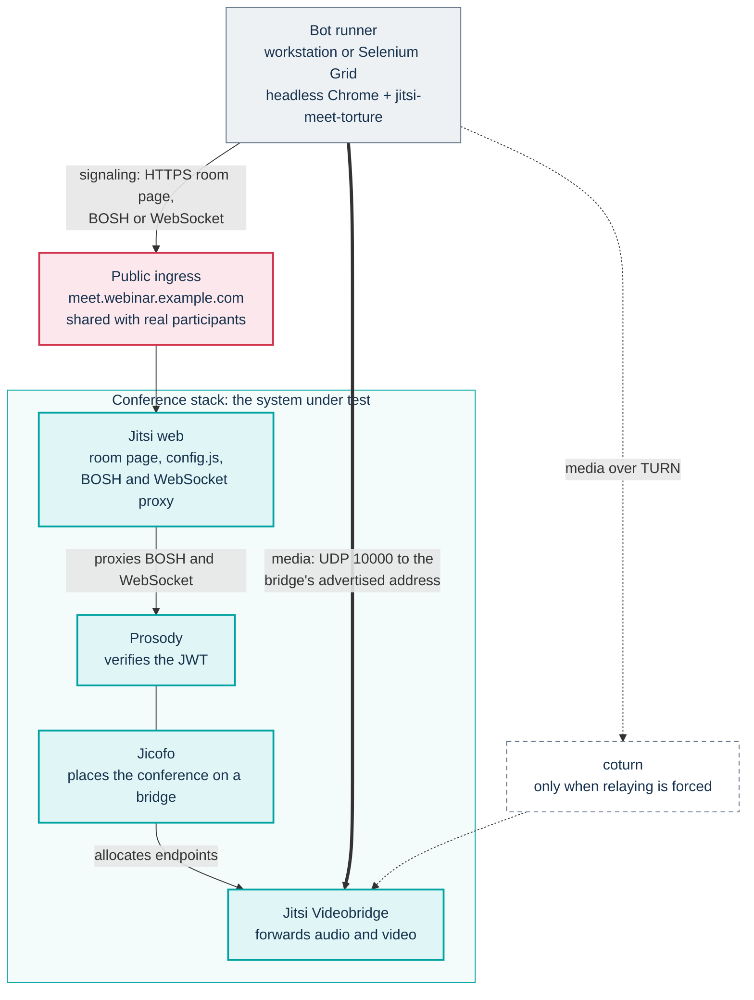
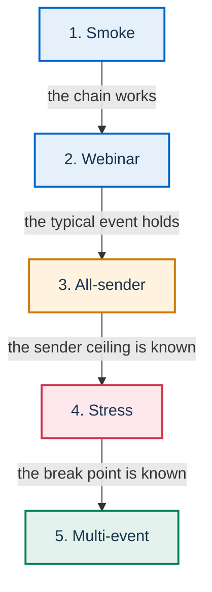

# Load testing and reference measurements

This page explains how to measure what a PA Webinar installation can carry and what the reference runs
measured. It is written for maintainers and for public administrations (PAs) that reuse the platform and
want to check capacity on their own hardware before they rely on it.

The page owns the **method** and the **reference results**. Two companion files cover the tooling:

- [Load-test toolkit](../scripts/load-test/README.md) is the tool manual: the container image, its
  variables, how to run it and how to fix it when it breaks.
- [In-cluster load test with Selenium Grid](../scripts/load-test/SELENIUM-GRID.md) is the runbook for
  running the bots inside the cluster, next to its manifests.

How bridges are sized and scaled is explained in [Scaling the media plane](architecture/scaling.md).
Choosing and sizing hardware is covered in [Requirements](install/README.md#requirements), with the lab
measurements in [Infrastructure reference: Sizing](INFRASTRUCTURE.md#sizing). They link here for
numbers.

## What is measured

A PA Webinar event has two very different loads, and each needs its own tool.

- **The media plane** is Jitsi: Prosody for signaling, Jicofo for conference placement and the Jitsi
  Videobridge (JVB) for audio and video. It is measured with
  [jitsi-meet-torture](https://github.com/jitsi/jitsi-meet-torture) and its `MalleusJitsificus`
  scenario, the load tool the Jitsi project uses itself. Each bot is a real Chrome browser that joins a
  room, and some of the bots publish audio and video. This is the measurement that decides how many
  bridges an installation needs and how big they must be.
- **The portal** is the Next.js application: pages, registration, Q&A, chat and the other live features.
  It is measured separately with an HTTP load tool, as described in [Portal load](#portal-load).

The bots do not go through the portal. They open the room page on the conference host directly, with a
token they carry themselves. That makes the test clean, and it also sets limits on what it covers:

| The bots exercise | The bots do not exercise |
|---|---|
| Token authentication in Prosody | Registration, the waiting room and the event pages |
| Conference placement by Jicofo | The IFrame embed (`JitsiRoom`) and the per-role configuration the portal applies through it |
| Media forwarding by the bridge, and the network path to it | The portal's video quality presets: bots get the server-side Jitsi defaults |
| The conference host's ingress, for the room page and signaling | Q&A, polls, word cloud, chat and every other in-room feature, which live in the portal |
| | Recording: neither Jibri nor the per-participant recorder is started by a test run |

**Never run a load test during a real event.** The bots share the ingress, Prosody, Jicofo and the
bridges with real participants. They degrade real calls, and their traffic makes the event's own metrics
meaningless. Use a test installation, or a window with no event scheduled.

## Prerequisites

### A token that Prosody accepts

Every room requires a JWT signed by the portal's secret, and guest access to Jitsi is off (see
[Authentication bridge: the Prosody side](architecture/jitsi-integration.md#authentication-bridge-the-prosody-side)).
A bot launched without a token fails before it opens the signaling connection, so Prosody logs nothing.
A token that Prosody rejects (wrong secret, issuer or audience) fails at authentication, and a room claim
that does not match fails when the bot joins the room. In every case no bot joins. The token must:

- be signed with HS256 using the installation's `JITSI_JWT_SECRET`;
- carry the same `iss` and `aud` as the portal's tokens (`JITSI_JWT_ISSUER` and `JITSI_JWT_AUDIENCE`,
  which Prosody accepts as issuer and audience), and a non-empty `sub`, set as the portal sets it
  (`JITSI_JWT_SUBJECT`, or `localhost:8443` when it is unset);
- carry a `room` claim of `*`, or the exact room name. Malleus appends the conference index to the room
  prefix, so the prefix `load-test` becomes the room `load-test0`, and a token for `load-test` does not
  match it.

The toolkit mints tokens from these values: `mint-jwt.sh` issues a wildcard-room token, and
`mint-jwt.mjs` issues a token for the room passed with `--room`. The secret is in the Secret named by
`secrets.existingSecretName` in the chart:

```bash
kubectl -n pa-webinar get secret <app-secret> \
  -o jsonpath='{.data.JITSI_JWT_SECRET}' | base64 -d
```

Treat that value as a credential. Whoever holds it can mint a moderator token for any room of the
installation. Keep it out of shared shells and CI logs, and delete the test tokens and any Secret created
for them when the run ends.

### A room that behaves like a real one

Because the bots open the room page directly, the portal's IFrame settings do not reach them. Two Jitsi
defaults then change what is measured:

- **Peer-to-peer.** The portal turns P2P off for every call (see
  [Media path](architecture/jitsi-integration.md#media-path)). A bot gets Jitsi's server-side default
  instead, which uses P2P when only two participants are in the room. The media then bypasses the bridge,
  and the bridge statistics show connected endpoints with no traffic. Always run with three participants
  or more.
- **The prejoin screen.** Jitsi turns off camera and microphone capture when a page that is not embedded
  sets `config.prejoinConfig.enabled=false` in its URL, and Malleus sets it. The toolkit's image removes
  that parameter. The target installation must then have the prejoin screen disabled server-side
  (`ENABLE_PREJOIN_PAGE=false` on the Jitsi web Deployment) for full-media runs. This is a temporary
  change: revert it after the test, because a later `helm upgrade` is not guaranteed to remove an
  environment variable added by hand. The tool manual has the exact commands.

The conference root `/` redirects to the portal only when `jitsi.webIngress.redirectUrl` is set, which
renders the extra Ingress in `templates/ingress-jitsi-web.yaml`. That Ingress matches the exact path `/`
alone. Room pages, `external_api.js`, BOSH and the XMPP WebSocket stay reachable either way, so
`https://meet.webinar.example.com/<room>` works as the test URL.

### Bridges that stay up for the whole run

In the `full` profile the JVB scaler sets the number of bridges from the events in the database, not
from the rooms in use. A test room has no event behind it. With no `LIVE` or `PROVISIONING` event, and
stress at or below the warning threshold, the scaler asks for zero bridges and scales the bridge
Deployment down within a tick, in the middle of the test.

Before a run on an installation with the scaler enabled, do one of the following:

- pause the scaler and set the number of bridges by hand, then restore both afterwards;
- or make sure an event is `LIVE` or `PROVISIONING` for the whole run, sized so that the scaler keeps the
  bridges you want. Use an event with recording turned off. A billable event with `recordingEnabled` also
  makes the scaler start a Jibri replica, and its move to `LIVE` notifies the per-participant recorder
  controller.

Pausing the scaler also stops the automatic event lifecycle, so pause it only when no real event is
scheduled. [Running the JVB scaler](operations/jvb-scaler.md) explains how to pause and resume it, and
what a pause stops.

While the scaler runs, it also reacts to measured stress: one extra bridge above
`jvbStressWarnPercent` and two above `jvbStressCriticalPercent` (defaults in `app/prisma/schema.prisma`).
A test that pushes stress up can therefore change the number of bridges it is measuring, even with no
event.

## Test topology



Two paths leave the bot runner. Signaling goes through the public ingress of the conference host, the
same one real participants use. The ingress has one backend, the Jitsi web pods, which serve the room
page and proxy BOSH and the XMPP WebSocket to Prosody. Media goes straight to the address the bridge
advertises, on UDP 10000, or through TURN if the installation forces relaying. The portal is not on
either path. It appears in a test only through the JVB scaler, which can change the number of bridges
(see [Bridges that stay up for the whole run](#bridges-that-stay-up-for-the-whole-run)) and hands the
bridge statistics to the portal (see [Across bridges](#across-bridges)).

## Where to run the bots

### From a workstation

The toolkit's container image bundles Chrome, a matching chromedriver, a virtual display and a patched
copy of jitsi-meet-torture. It runs with Podman or Docker against the public conference host. It has two
modes:

- **Full media** (`USE_LOAD_TEST=false`). Every bot is a real browser. Senders publish a synthetic video,
  and receivers subscribe to and decode the streams. This is the mode that loads the bridge, and every
  synthetic reference result on this page comes from it.
- **Signaling only** (`USE_LOAD_TEST=true`). The bots use Jitsi's lightweight load-test client, which
  joins without media and can run many clients per browser tab. It loads Prosody, Jicofo and token
  authentication, and puts almost no load on the bridge.

In full-media mode the generator is often the first limit. Each browser needs roughly half a gigabyte of
memory and a noticeable share of a CPU core, and the generator's own network link carries all the video
the bridge sends back. In the reference runs a single large workstation reached its ceiling at about 80
browsers, before the bridge did. Past that point, use several generators or the grid.

### In the cluster with Selenium Grid

The runbook [In-cluster load test with Selenium Grid](../scripts/load-test/SELENIUM-GRID.md) deploys a
Selenium hub with Chrome nodes and a Job that drives them with Malleus. It removes the workstation's
limits, and it adds one requirement: bots inside the cluster reach the bridge on its public advertised
address. If the cloud load balancer does not route traffic from inside the cluster back to that address,
no media flows. The runbook starts with a small smoke run for exactly this reason.

The grid Job uses Chrome's synthetic fake device, without the patched video file. The senders then
publish no real video, so a grid run validates signaling, ICE and connection stability at scale, not
video throughput. The runbook explains how to add a real video source.

### Why the local-Chrome Job does not work

`scripts/load-test/k8s-job.yaml` runs Malleus with Chrome inside the Maven container. It gets as far as
starting the browsers, and then Chrome exits on startup. jitsi-meet-torture offers no property to pass
the extra flags Chrome needs in that container, and the Jitsi project runs its own browsers on Selenium
nodes. The file stays as a reference only; use the grid.

`scripts/load-test/coherence-bots.mjs` is not a capacity tool either. It drives a few senders with
distinct names, toggling microphones and joining on a stagger, to validate per-participant recording.

### Signaling always crosses the public ingress

The conference web configuration points BOSH and the XMPP WebSocket at the public conference URL. A
browser that loaded the room page from anywhere, even from inside the cluster, still signals through the
public ingress. There is no way to take the ingress out of the test, so count it as part of the system
under test and watch it.

Port-forwarding does not isolate a test either. The Jitsi web Service listens on port 80, plain HTTP:

```bash
kubectl -n pa-webinar port-forward svc/pa-webinar-jitsi-meet-web 8080:80
# then point the bots at http://localhost:8080
```

This serves only the room page from the tunnel. Signaling still goes to the public host, and media still
goes to the bridge's advertised address.

## Modeling the load

- **Senders and receivers.** A sender publishes audio and video; a receiver only subscribes. Malleus
  takes the total number of bots and the number of senders. The bridge's work grows with the number of
  streams it forwards, roughly senders multiplied by receivers, so a sender costs far more than a
  receiver.
- **Express capacity as two numbers.** "The bridge holds 100 participants" means nothing on its own.
  Write "100 participants with 6 senders". A webinar has a few senders (moderator and speakers) and many
  receivers; a meeting where everyone is on camera is the worst case for the same headcount.
- **Match the platform's model.** The scaler models each event the same way, with an expected sender
  ratio (see [The formula](architecture/scaling.md#the-formula)). Choose sender counts that match the
  events you actually run.
- **Three participants or more.** With two participants the call goes peer-to-peer and bypasses the
  bridge (see [A room that behaves like a real one](#a-room-that-behaves-like-a-real-one)).
- **Synthetic video is light.** The test video is a transcoded sample with little motion. Real cameras,
  the portal's quality presets and screen sharing produce more traffic per stream. Treat bandwidth figures
  from synthetic runs as a lower bound.

## What to watch

### On each bridge

`/colibri/stats` on each bridge is the authoritative source. Read it from inside the JVB container:

```bash
kubectl -n pa-webinar exec <jvb-pod> -- curl -s http://127.0.0.1:8080/colibri/stats
```

Sample it every 30 seconds or so during the run. The useful fields are:

| Field | What it tells you |
|---|---|
| `participants`, `conferences` | Whether every bot actually joined, and on which bridge |
| `endpoints_sending_video`, `endpoints_sending_audio` | Whether the senders are really sending. Zero with senders configured means P2P, the prejoin trap, or a fake device with no video |
| `stress_level` | The bridge's own load estimate. It is not the container's CPU utilization |
| `bit_rate_upload`, `bit_rate_download` | Media leaving and entering the bridge, in kbps |
| `largest_conference` | How many endpoints the biggest conference has on this bridge |
| `octo_*` | Relay traffic between bridges; zero unless cascading is enabled |

Jicofo treats a bridge whose stress is above its stress threshold (Jicofo's own
`bridge.stress-threshold` setting, 0.8 by default) as overloaded and avoids it for new conferences.
Around that point call quality starts to degrade: dropped frames and audio glitches, not a crash.

### Across bridges

The scaler reads `/colibri/stats` on every bridge at each tick and passes the totals to the portal,
which stores them in Redis (`jvb:replicas:snapshot`): participants and bitrates summed, stress as the
maximum across bridges. The `eventi_jvb_*` gauges served by `/api/metrics`, the public **System status**
page and the **Infrastructure** page (`/admin/infrastructure`) all read that snapshot. Before taking the
maximum, the scaler caps each bridge's stress at 1.0 and ignores the stress of bridges with no
participants, so a run pushed past saturation must be read on `/colibri/stats` directly.

The snapshot expires 300 seconds after the scaler's last tick. When the scaler is paused, as it often
is during a test, `/api/metrics` falls back to a single probe of `JVB_HEALTH_URL`. The chart points that
variable at a Service in front of the bridge pods, so the probe reaches one bridge per scrape, whichever
one the Service picks. If it does not answer, the gauges keep their last value. During a run with the
scaler paused, read each bridge directly.
[The Redis snapshot](architecture/scaling.md#the-redis-snapshot) describes the mechanism, and
[Monitoring and health](operations/monitoring.md) covers the metrics, their authentication and the
dashboard.

### Network and resources

- **Bridge egress** is often the real ceiling. Watch the JVB pod's transmit rate, for example
  `rate(container_network_transmit_bytes_total{pod=~".*jvb.*"}[1m]) * 8`, and the node's network limits.
- **JVB CPU and memory**, from `kubectl top pod -l app.kubernetes.io/component=jvb` or your usual
  dashboards.
- **The generator**: its CPU, memory and network. A saturated generator produces failures that look like
  bridge problems.
- **The ingress and Prosody**, in signaling-heavy runs.

### Success criteria

A run passes when:

- every bot joins and stays joined for the whole duration, with no reconnections;
- `stress_level` stays below 0.8 in the steady state, and below your scaler's warning threshold if you
  want the run to represent normal operation;
- `endpoints_sending_video` matches the configured senders;
- the JVB logs show no ICE failures and the JVB container is not restarted or killed for memory;
- Maven ends with `Failures: 0` and every participant logs `Hung up` followed by `Closing`.

### Reading bandwidth figures

The bridge's `bit_rate_upload` counts the media payload it sends. Network-level tools usually show more,
for four reasons:

1. **Protocol overhead.** UDP, IP, SRTP and DTLS headers add a few percent on the wire.
2. **TURN relaying.** If the installation forces relaying, or a bot's ICE picks a relay candidate, the
   traffic goes bridge to coturn to bot. It is counted at both hops, and twice at the cluster edge.
3. **Other clients.** A real participant, or a person watching the test in a browser, adds a few Mbps.
   Check that nobody else is in a call on the installation.
4. **Host-wide capture.** Tools like `iftop` on the generator see all of its traffic. Use the container's
   own counters (`podman stats` or `docker stats`) for the test traffic alone.

For a clean report, compare the bridge's `/colibri/stats`, the generator container's counters and the
ingress counters.

## Scenario ladder

Build a capacity curve by climbing from the smallest run to the largest, on the installation you want to
qualify. Move to the next step only when the previous one passes the
[success criteria](#success-criteria), and record every run with the metadata listed in
[Publishing results](#publishing-results).



| Step | Participants / senders | Duration | What it proves | Notes |
|---|---|---|---|---|
| Smoke | 10 / 2 | 2 min | Tokens, signaling, ICE and media all work | Three or more participants, so the bridge is used |
| Webinar | 50 / 3, then 150 / 5 | 10 to 15 min | The typical event holds at steady state | 150 full-media bots need more than one workstation |
| All-sender | 25 to 30 / all | 5 min | The ceiling for meetings where everyone is on camera | Watch egress: it grows much faster than headcount |
| Stress | Webinar pattern, in steps of about 25 | Until failure | The bridge's break point | Stop at the first failures; repeat the last good step to confirm it |
| Multi-event | 2 rooms of 150 / 5 each | 15 min | Two conferences on two bridges | Run two generators with different room prefixes. Needs every bridge reachable on its own address; see [The single-IP pitfall](architecture/scaling.md#the-single-ip-pitfall) |

A single conference never spreads over several bridges unless cascading is enabled, and the chart does
not enable it. The multi-event step is therefore the only one that tests more than one bridge.

## Portal load

Load the portal separately with an HTTP tool such as [k6](https://k6.io/) or
[Locust](https://locust.io/). The OpenAPI description is served at `/api/openapi.json`, and
[API surface](architecture/api.md) describes the route families. The requests that peak around a large
event are:

| Request | What happens | What to plan around |
|---|---|---|
| `GET /api/events/{slug}` | Public event data | The app does not cache it, so every request that reaches a pod queries the database. The public response carries `Cache-Control: public, s-maxage=30, stale-while-revalidate=60`: a caching proxy or CDN in front of the portal would absorb repeats, and the chart's ingress does not cache. The moderator response (a request with a valid token) carries no such header |
| `POST /api/events/{slug}/registrations` | Creates a registration: encrypted personal data, a consent audit entry, a person record, and a confirmation email queued in the email outbox | A per-address limit on each app pod. A repeated email address returns `409`, so give every virtual user its own address |
| `POST /api/events/{slug}/jitsi/token` | Issues the conference JWT at join time | Guest tokens have a per-address limit on each app pod, set by `GUEST_JWT_RATE_LIMIT_PER_MINUTE` |
| `GET /api/events/{slug}/questions` | Reads the Q&A panel. The room re-reads it after every `qa` poke, and polls it every 3 seconds while push is unavailable | While push is unavailable, each pod caches the question list for 2 seconds. Finding the caller's own upvotes is not cached: every read from a caller with a voting identity (a registration, or the browser id the room sends for everyone else) costs one more indexed query, once at least one listed question has an upvote |
| `POST /api/events/{slug}/questions` | Submits a Q&A question | A cooldown per registration, or per address for guests |
| `POST /api/events/{slug}/questions/{id}/upvote` | Upvotes a question | 10 per minute per registration or browser id, plus 300 per minute per address and event for browser ids (`app/src/app/api/events/[param]/questions/[id]/upvote/route.ts`); a browser id is accepted only inside the guest window or with a room token |

The values of the other limits are in [Reference limits](architecture/security.md#reference-limits).

A registration test sends a JSON body with `displayName`, `email` and `consentGiven: true`. Add
`consentRecording: true` when the event records and `consentMultitrack: true` when it has per-participant
recording; without them the call answers `422`. The event must be open for registration. With public
registration on (`publicRegistrationEnabled` in site settings), an accepted call answers `201` with
`accessToken` and `joinUrl` and sets the `event_access_<eventId>` cookie. With it off, every valid call
answers `202` with no token and no cookie, because the personal link travels only by email.

Registrations are real personal data. Run portal tests against a dedicated test event on a test
installation, use addresses you control, point the installation's SMTP at a mail catcher so the email
outbox does not send real mail (see [Email delivery](configuration/email.md)), and delete the test event
afterwards. [Privacy and data protection](GDPR.md) describes what each record holds and how it is erased.

**Rate limits.** The application's limits are held in memory on each app pod
(`app/src/lib/rate-limit.ts`), so more app pods raise the effective limit. Per-address limits use the
`X-Forwarded-For` entry written by the nearest trusted proxy (`TRUSTED_PROXY_HOPS`), so only real source
addresses spread a generator; forged headers do not. The Q&A limit is per registration (per address for
guests), and the upvote limit is per registration or browser id. A generator on one address therefore meets `429`
almost at once on the per-address routes. Spread it over
several source addresses, or accept that the run measures the limiter. If the ingress sets
`nginx.ingress.kubernetes.io/limit-rps` or `limit-connections` (see the example in
`infra/helm/pa-webinar/values-production.yaml`; the chart's default ingress sets neither), a
single-address generator is throttled there first, with ingress-nginx `503` responses, before any
application `429`. [Security architecture](architecture/security.md#how-a-client-is-identified)
explains how a client is identified.

**Open connections.** The live room keeps connections open. Each participant holds the live stream
(`/api/events/{slug}/live/stream`), holds the chat stream while the chat is on, and holds the control
stream while their hand is raised. On top of that come the polling fallbacks and the waiting room's
lifecycle poll ([Live interaction and realtime](architecture/live-interaction.md)). Size the test by
concurrent open connections as well as by requests per second, and check that any `limit-connections`
on the ingress allows them.

Measure with the `http_request_duration_seconds` histogram. It carries the labels `method`, `route` and
`status_code`, plus `app` (`METRICS_APP_LABEL`, `pa-webinar` by default in `app/src/lib/metrics.ts`).
The `route` label is the request path with UUIDs and numeric segments replaced by `:id`; slugs stay as
they are. For example:

```promql
histogram_quantile(0.95,
  sum by (le) (rate(http_request_duration_seconds_bucket{app="pa-webinar", route=~"/api/events/.*/registrations"}[5m])))
```

The histogram covers API handlers wrapped in `withErrorHandling` (`app/src/lib/api-handler.ts`). It does
not cover page rendering, whose latency the load tool reports from its side, or the streaming endpoints.
For chat streaming, watch `eventi_chat_sse_connections`. The app pods scale on CPU and memory through the
HorizontalPodAutoscaler configured under `autoscaling` in `values.yaml`; watch its replica count during
the run.

## Reference measurements

These are the reference results for dedicated bridges. They describe the hardware they ran on and
nothing else. Measure your own installation before you publish a capacity figure.

Two other sets of results are published next to the pages they serve:

- Measurements of small single-node installations (the simple profile on k3s and minikube: resources
  per component, meeting patterns, the cost of a participant) are in
  [Infrastructure reference: Sizing](INFRASTRUCTURE.md#sizing), and the tables of each platform in
  [minikube](install/minikube.md#measured-usage) and [k3s](install/k3s.md#measured-numbers).
- The in-cluster grid run, 30 bots on one bridge behind one address, is in
  [In-cluster load test with Selenium Grid](../scripts/load-test/SELENIUM-GRID.md#reference-result-and-what-it-validates).

### How the runs were made

- **Generator**: full-media bots in the toolkit's container, from one workstation over the public
  internet, joining at one bot per second.
- **Video source**: the synthetic test video, transcoded to 1280×720 at 30 fps.
- **Sampling**: `/colibri/stats` every 30 seconds after the join ramp.
- **Network**: direct UDP to the bridge, no TURN.
- **Cascading**: off, except in the two-bridge experiment.

### Small bridge: 3 CPUs

The JVB container was limited to 3 CPUs and 2 GiB of memory, on a 4-vCPU, 16 GiB general-purpose VM. The
CPU limit is the same as in the chart's default JVB resources (`jitsi-meet.jvb.resources` in
`values.yaml`), whose memory limit is higher.

| Pattern | Participants | Video senders | Stress, steady | Bridge egress | Bridge ingress |
|---|---|---|---|---|---|
| Webinar | 20 | 5 | 0.19 | about 6.2 Mbps | about 520 kbps |
| Webinar | 60 | 6 | about 0.47 (0.43 to 0.51) | about 19 Mbps | about 860 kbps |
| All senders | 30 | 26 active | 0.83, saturated | about 42 Mbps | about 2.1 Mbps |

- **Webinar.** At 60 participants the bridge was at about half its stress budget. Each receiver drew
  about 350 to 410 kbps with five or six senders visible, that is 60 to 80 kbps per visible sender with
  this video. Extrapolated to a stress of 0.8, the practical limit of this bridge in the webinar pattern
  is about 100 to 120 participants.
- **All senders.** Stress reached 0.77 with 25 active video senders and 0.83 with 26. Egress rose
  steeply as senders came online, from 3.5 Mbps with 14 senders to 42 Mbps with 26. On this bridge,
  about 25 participants all on camera is the ceiling.
- **Memory.** Some 60 to 80-participant webinar runs ended with the bridge killed for exceeding its 2 GiB
  memory limit. Size memory as well as CPU.

### Large bridge: 15 CPUs

The JVB container ran alone on a 16-vCPU, 32 GiB compute-optimized VM, with a request of 14 CPUs and
24 GiB and a limit of 15 CPUs and 28 GiB. The JVM options, set through `VIDEOBRIDGE_OPTS`, were
`-Xms4g -Xmx16g -XX:MaxDirectMemorySize=8g -XX:+UseG1GC -XX:MaxGCPauseMillis=40`.

| Pattern | Participants | Video senders | Peak stress | Peak egress | JVB CPU used |
|---|---|---|---|---|---|
| Webinar | 78 | 6 to 7 | 0.183 | about 54.5 Mbps | about 1.1 of 15 cores |
| All senders | 47 | 25 | 0.095 | about 23.4 Mbps | about 1.05 of 15 cores |

In both runs the generator, not the bridge, set the ceiling: 78 browsers in the first, 25 working senders
out of 50 requested in the second. The JVM heap stayed at about 1.1 GiB of 16. There were no errors.

### How well the two bridges agree

The sizing model assumes that a bridge's capacity grows in proportion to the CPU it is given. Projecting
the small bridge's results to the large one, in proportion to load and CPU:

| Pattern | Small-bridge result | Projected to the large bridge | Measured on the large bridge |
|---|---|---|---|
| Webinar | 0.47 at 60 participants | 0.47 × 78/60 × 3/15 ≈ 0.12 at 78 | 0.183 |
| All senders | 0.83 at 26 senders | 0.83 × 25/26 × 3/15 ≈ 0.16 at 25 | 0.095 |

More CPU brought stress down sharply, as the model expects. The agreement is loose: within a factor of
about 1.5 to 1.7, higher than projected for the webinar pattern and lower for the all-sender pattern.
Stress is also not CPU utilization: on the large bridge, stress was 0.18 while the container used under
8% of its CPU. Use the per-core model as a starting point, and measure.

### Two bridges with cascading

This experiment enabled Octo, Jitsi's bridge cascading, in the jitsi-meet subchart values, and forced
Jicofo to split one conference over two large bridges. The chart does not enable cascading by default.

- 60 participants in one room, about 30 on each bridge, with 6 senders in total.
- Each bridge reported one cascaded conference (`octo_conferences` = 1) and 30 remote endpoints.
- Stress stayed at 3 to 4% on each bridge.
- The inter-bridge relay carried about 85 to 100 Mbps in each direction, as read from the bridges' Octo
  bitrate counters.

Cascading adds inter-bridge traffic that grows with senders and simulcast layers, even for a handful of
senders. `/colibri/stats` reports the Octo bitrates in bytes per second (see
[Monitoring and health](operations/monitoring.md)), and the relay figures above have not been reconciled
with that unit. Treat them as a sign that relay traffic is substantial, and measure it on your own
bridges before enabling cascading.

### A real event

A live webinar with a moderator, speakers and a passive audience, lasting 44 minutes:

| Measure | Value | Source |
|---|---|---|
| Peak concurrent participants | 65 | The scaler's cross-bridge snapshot, confirmed by `eventi_jvb_participants` |
| Bridges running at the peak | 3, of the large type | Provisioned by the scaler from the event's `maxParticipants` and sender ratio, not from attendance |
| Highest stress across bridges | 0.186 | The snapshot, which keeps the maximum |
| Bridge egress, summed over bridges | about 66 Mbps | `bit_rate_upload` from each bridge |

The highest stress is a per-bridge figure. It matches the 78-participant single-bridge run (0.183), which
is what one bridge carrying the whole conference looks like. It is not 18% of the platform's capacity:
the other two bridges were room for other conferences. Real traffic was also heavier than synthetic
traffic: about 1 Mbps of bridge egress per participant, against about 0.7 Mbps in the 78-participant
test.

### What the numbers do and do not say

- **Measured directly**: up to about 80 participants on one bridge in the webinar pattern, and about 25
  participants all on camera.
- **Projected linearly, not measured**: anything above about 80 participants per bridge. On the large
  bridge the webinar pattern cost about 0.23% of stress per participant, which projects to about 35% at
  150 participants and about 70% at 300. No run has confirmed these figures.
- **All-sender load grows faster than headcount**, because every sender is forwarded to every other
  participant. Do not project it linearly.
- **The default sizing constants** in `app/src/lib/jvb-sizing.ts`, 300 receive-only viewers or 50
  all-senders per 16-core bridge, derive from these runs. Neither was measured end to end.
- **Platform capacity is not event capacity.** Without cascading, one conference stays on one bridge. Six
  bridges multiply the room for concurrent events, never the size of one event. With the default
  constants and a 30% sender ratio, one 16-core bridge models about 120 participants, since
  16 ÷ (0.3/3.125 + 0.7/18.75) = 120. Six bridges model about 720 participants across events, and still
  about 120 for a single event. See [Per event: one bridge](architecture/scaling.md#per-event-one-bridge).
- **Things that can break before a linear projection does**: JVM garbage-collection pauses on large
  heaps, UDP socket buffer limits on the node (`net.core.rmem_max`), the node's network bandwidth, screen
  sharing, and inter-bridge traffic when cascading is on.

Before promising an event larger than anything measured here, run a confirmation test at the target
scale, with enough generators or the grid to reach it.

## Turning results into sizing settings

The scaler sizes events from per-core constants that an administrator can change at runtime, in the
**Infra sizing** tab of the site settings. Derive them from your own runs:

1. Give the JVB container a fixed CPU allocation, with the request equal to the limit, and set
   **vCPU per JVB pod** (`jvbCpuCoresPerPod`) to that number.
2. Run the webinar pattern on one bridge until stress reaches the level you want as a ceiling, for
   example your warning threshold. Divide the number of receivers at that point by the cores: that is
   **Passive viewers per core** (`jvbReceiversPerCore`).
3. Run the all-sender pattern the same way. Divide the number of senders by the cores: that is
   **Active senders per core** (`jvbSendersPerCore`).
4. Check the **Sizing preview** in the same tab against what you measured.

[Align the defaults with your bridges](architecture/scaling.md#align-the-defaults-with-your-bridges)
explains why this matters on bridges smaller than 16 cores, and
[Runtime settings](configuration/runtime-settings.md) is the reference for each setting.

## Publishing results

Results from other installations are the most useful evidence for PAs evaluating reuse. When you
publish a run, include:

- the PA Webinar version, the Jitsi image tags and the jitsi-meet subchart version;
- the cloud or platform, the VM type of the bridge nodes, and whether they are dedicated;
- the JVB container's CPU and memory requests and limits, and its JVM options;
- the number of bridges, whether cascading was on, and whether the scaler was running;
- the network path: direct UDP, TURN, or relay-only;
- the generator: where it ran, how many browsers, full media or signaling only, and the video source;
- the scenario: participants, senders, duration and join rate;
- the observations: steady and peak stress, egress and ingress, CPU and memory, failures, and the
  success criteria that held or failed;
- the sizing settings in force (**Infra sizing** tab).

Leave out anything that identifies the installation: hostnames, IP addresses, cluster and namespace
names, and secrets.

## Related pages

- [Load-test toolkit](../scripts/load-test/README.md): the image, its variables, running it, and fixes.
- [In-cluster load test with Selenium Grid](../scripts/load-test/SELENIUM-GRID.md): the in-cluster
  runbook.
- [Scaling the media plane](architecture/scaling.md): how bridges are sized, provisioned and scaled to
  zero.
- [Installing PA Webinar](install/README.md) and the [Infrastructure reference](INFRASTRUCTURE.md):
  choosing and sizing hardware and network.
- [Running the JVB scaler](operations/jvb-scaler.md): pausing and resuming the scaler around a test.
- [Monitoring and health](operations/monitoring.md): metrics, alerts and the dashboard.
- [How PA Webinar extends Jitsi Meet](architecture/jitsi-integration.md): the media path and token
  authentication.
- [Runtime settings](configuration/runtime-settings.md): the sizing settings.
- [jitsi-meet-torture](https://github.com/jitsi/jitsi-meet-torture) and the
  [Jitsi scalability guide](https://jitsi.github.io/handbook/docs/devops-guide/scalable).
