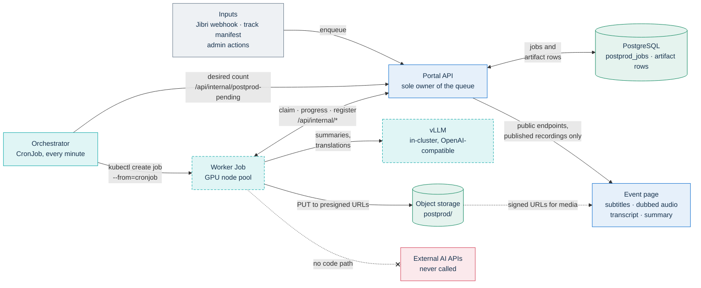
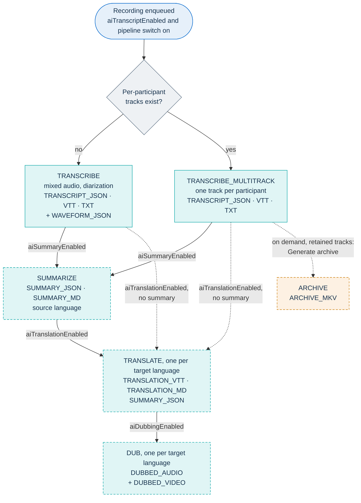
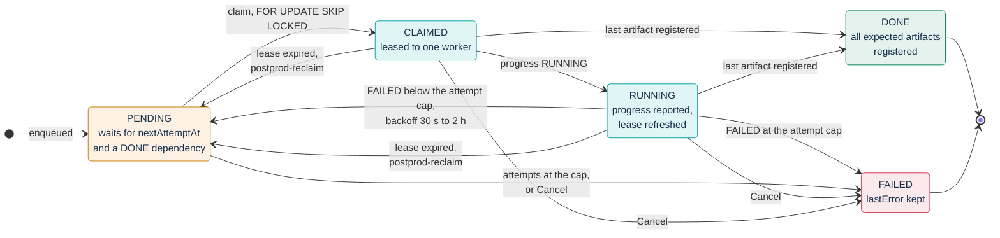
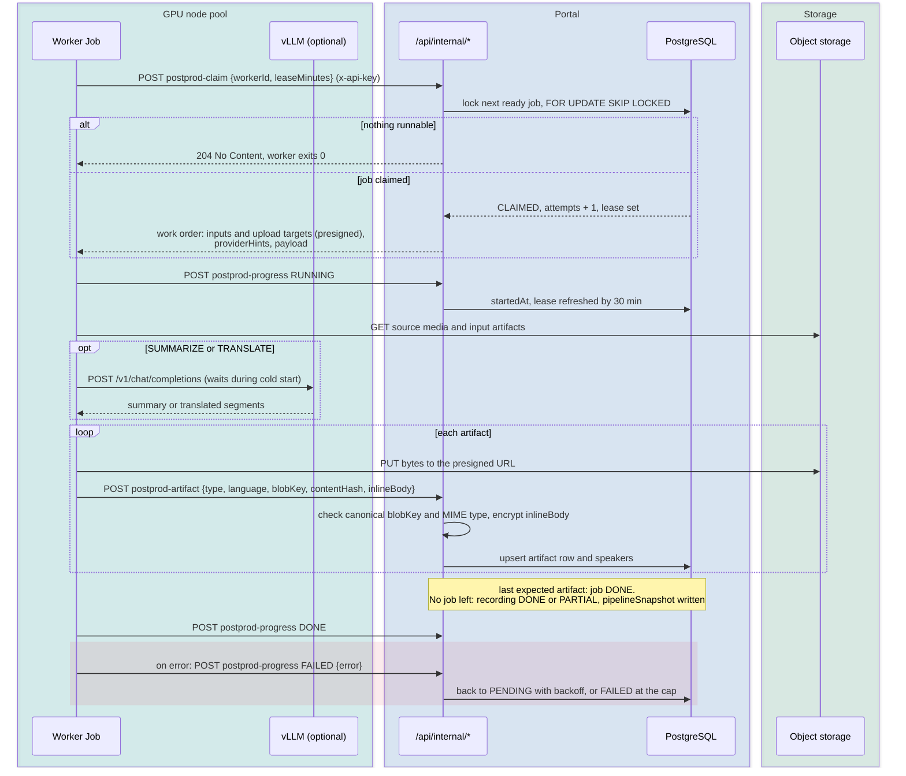
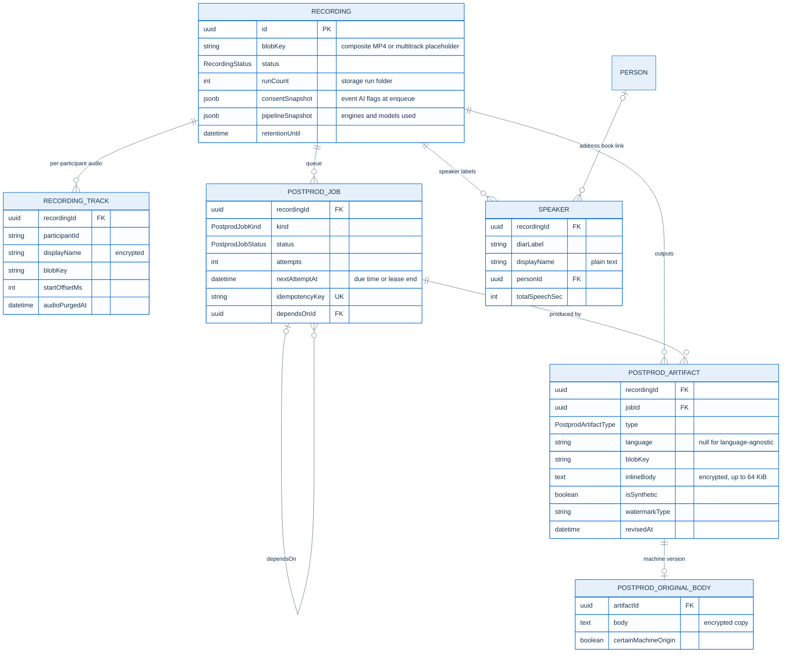

# AI post-production

PA Webinar can turn an event recording into a transcript, subtitles, a
structured summary, translations and dubbed audio. The work runs after the
event, on a GPU node pool inside the installation's own Kubernetes cluster,
with open-weights models that the operator hosts. No recording, transcript or
summary is sent to an external AI service.

The pipeline is optional and off by default. The chart renders none of it
until `postprod.enabled` is set, and the portal queues no work until an
administrator turns on the site-wide switch and an event opts in.

This page is for operators who enable the pipeline, for developers of
`app/src/lib/ai` and `infra/ai/worker`, and for data protection officers who
need the transparency facts. Related pages:

- the decision: [ADR-016](adr/016-in-cluster-ai-postproduction.md); per-participant
  recording: [ADR-013](adr/013-multitrack-speaker-attribution.md);
- how recordings are captured: [Recording](architecture/recording.md);
- legal bases, voice data and retention regimes:
  [Recordings, voice data and AI outputs](privacy/recordings-and-ai.md);
- GPU memory and quota needs: [Provisioning a GPU node pool](#provisioning-a-gpu-node-pool);
  node pool layout per cloud: [Infrastructure](INFRASTRUCTURE.md#node-pools).

**On this page:**
[What it produces](#what-it-produces) ·
[Data sovereignty](#data-sovereignty) ·
[Architecture and inputs](#architecture-and-inputs) ·
[Job graph](#job-graph) ·
[Queue semantics](#queue-semantics) ·
[Orchestrator and worker](#orchestrator-and-worker) ·
[Models](#models) ·
[Data model and storage](#data-model-and-storage) ·
[Operational checklist](#operational-checklist) ·
[Configuration](#configuration) ·
[Provisioning a GPU node pool](#provisioning-a-gpu-node-pool) ·
[Administration](#administration) ·
[Public experience](#public-experience) ·
[Transparency (AI Act Article 50)](#transparency-ai-act-article-50) ·
[Observability](#observability) ·
[Local development and tests](#local-development-and-tests) ·
[Troubleshooting](#troubleshooting) ·
[Known limitations](#known-limitations)

## What it produces

Every output is a `PostprodArtifact` row that points to one file in object
storage. `PostprodArtifactType` in `app/prisma/schema.prisma` is the
authoritative list.

| Artifact type | Produced by | Language | Contents | Where it is used |
|---|---|---|---|---|
| `TRANSCRIPT_JSON` | `TRANSCRIBE`, `TRANSCRIBE_MULTITRACK` | none | Segments with start, end, text, speaker label and recognition scores, plus the speaker list | Transcript panel, editor, `.txt` and `.srt` downloads |
| `TRANSCRIPT_VTT` | `TRANSCRIBE`, `TRANSCRIBE_MULTITRACK` | source | WebVTT subtitles with a `<v>` voice tag per speaker | Player subtitle track; `.vtt` download, served by the subtitle endpoint |
| `TRANSCRIPT_TXT` | `TRANSCRIBE`, `TRANSCRIBE_MULTITRACK` | source | Plain text with speaker prefixes | Stored only; the `.txt` download is built from `TRANSCRIPT_JSON` |
| `WAVEFORM_JSON` | `TRANSCRIBE`, optional | none | Normalized audio peaks | Waveform in the transcript editor |
| `SUMMARY_JSON` | `SUMMARIZE`; `TRANSLATE` for each target language | source or target | Overall summary, key decisions, action items, topics with a start time | Summary card and topic chips on the post-event page |
| `SUMMARY_MD` | `SUMMARIZE` | source | Markdown rendered from `SUMMARY_JSON` without a second model call | Summary tab, `.md` download |
| `TRANSLATION_VTT` | `TRANSLATE` | target | Translated subtitles on the original timings | Player subtitle track |
| `TRANSLATION_MD` | `TRANSLATE` | target | Markdown of the translated summary | Summary tab in that language |
| `DUBBED_AUDIO` | `DUB` | target | AAC audio in an `.m4a` file, synthetic voices aligned to the subtitle timings | Alternative audio in the player |
| `DUBBED_VIDEO` | `DUB`, optional | target | The source video with the dubbed audio track | Listed in the administration area; no route serves it |
| `ARCHIVE_MKV` | `ARCHIVE`, on demand | none | Composite video, one audio track per participant labeled with the name, source subtitles | Administration area only: administrators and the event's organizer |

`SUBTITLE` (job kind) and `SUBTITLE_VTT` (artifact type) exist in the enums,
but nothing enqueues or produces them: source subtitles are `TRANSCRIPT_VTT` and
translated subtitles are `TRANSLATION_VTT`.

**Out of scope, by design:**

- **Voice cloning.** Dubbing uses catalog synthetic voices only. The pipeline
  does not analyze, store or reproduce a participant's voice to synthesize
  speech.
- **Live captions.** Everything runs after the event on the finished
  recording. Live subtitles would need a streaming speech-recognition engine
  next to the conference ([Roadmap](ROADMAP.md#further-out)).

## Data sovereignty

All inference runs inside the cluster: speech recognition and alignment
(WhisperX), diarization (pyannote.audio), the language model (vLLM) and speech
synthesis (Piper). Three rules in the code keep it that way:

- **Closed provider lists.** `app/src/lib/ai/providers.ts` declares one
  allowed value per engine: `vllm` for the language model, `whisperx` for
  speech recognition, `piper` for synthesis. The site settings store the
  engine as text, but the claim endpoint parses it through these enums, so any
  other value makes the claim fail. Adding a backend means adding an enum
  value, a resolver branch and a worker implementation, and the backend must
  run in-cluster.
- **The portal decides, the worker executes.** The worker holds no endpoint
  or model configuration of its own. Every claim response carries
  `providerHints` (engine, vLLM base URL, model ids, voice path), resolved by
  the portal from its own environment.
- **Narrow data paths.** The worker talks to three places: the portal's
  internal API, object storage through presigned URLs, and the vLLM service
  named in `providerHints`. Model weights are read from a volume mounted at
  `/models`, and the image sets `HF_HUB_OFFLINE=1`.

Two components download public model weights (never data) outside the
Hugging Face offline switch when their files are missing from the cache: the
torchaudio alignment models that WhisperX uses for some languages, and the
AudioSeal watermark generator. The [operational checklist](#operational-checklist)
seeds both.

The rule is enforced by what the code calls, not by the network. The chart's
NetworkPolicy (`networkPolicy.enabled`, off by default) selects only the
application pods, so it neither blocks nor restricts the worker
([checklist](#operational-checklist), step 9). If you need network-level
enforcement, write your own policy that limits the worker's egress to the
portal, the storage endpoint and vLLM.

## Architecture and inputs

### The pipeline at a glance



The queue lives in PostgreSQL behind the portal, following the same outbox
pattern as the email queue. Scaling follows the JVB scaler's pattern: a
CronJob asks the portal for a number and acts on the cluster. There is no
workflow engine, no KEDA and no Redis stream. Dashed nodes run only while
there is work: the GPU node pool scales to zero between runs.

### How work enters the queue

| Input | Trigger | Root job |
|---|---|---|
| Composite recording | Jibri's finalize script calls `POST /api/webhooks/recording` (bearer `CRON_API_KEY`, plus an HMAC signature when `RECORDING_WEBHOOK_SECRET` is set; see [Recording](architecture/recording.md)). The portal creates the `CallSession` and `Recording` rows and enqueues when the event has `aiTranscriptEnabled`. If the event already has a per-participant recording, the webhook only attaches the MP4 to it and enqueues nothing. | `TRANSCRIBE` |
| Per-participant tracks | The recorder bot calls `POST /api/internal/multitrack-manifest` at the end of the event. The portal stores one `RecordingTrack` per track and enqueues. A silence guard marks the recording `POSTPROD_FAILED` instead when every track is silent. | `TRANSCRIBE_MULTITRACK` |
| **End for everyone** | The moderator ticks **Generate AI transcript and summary from the recording (once processing finishes)**. The event gets `aiTranscriptEnabled` and `aiSummaryEnabled`, and the webhook enqueues when the recording arrives. The checkbox appears only when the event records, the site switch is on and the event already uses an AI option. | as above |
| **Generate AI now** (event page) and **Generate AI** (recording page) | `POST /api/admin/events/<id>/generate-ai` and `POST /api/admin/postprod/recordings/<id>/generate-ai` turn on transcription and summary for the event and enqueue in the same transaction, for a recording that already exists. The event-page route acts on the event's newest recording. | detected |
| **Re-run** | `POST /api/admin/postprod/recordings/<id>/rerun` bumps the run counter and enqueues a new run. | detected |
| **Add language** | `POST /api/admin/postprod/recordings/<id>/translations` enqueues one `TRANSLATE` job, and a `DUB` job when the event has dubbing on. | none |
| **Generate archive** | `POST /api/admin/postprod/recordings/<id>/archive` enqueues one `ARCHIVE` job. | none |

Every path goes through `app/src/lib/ai/enqueue.ts`, and every path is gated
by the site-wide switch `aiPipelineEnabled`: the automatic paths do nothing
while it is off, and the admin routes answer with an error. "Detected" means
that the root job is `TRANSCRIBE_MULTITRACK` when the recording's key is the
multitrack placeholder or the recording has any `RecordingTrack` rows, and
`TRANSCRIBE` otherwise.

Capture itself (Jibri, the recorder bot, the manifest and its trust
boundaries) is described in [Recording](architecture/recording.md#hand-off-to-post-production).

## Job graph

A full enqueue builds this graph for one recording and one run:



- **One root job.** Either `TRANSCRIBE` or `TRANSCRIBE_MULTITRACK` runs, never
  both. Both produce the same three artifacts, so everything downstream is
  identical.
- **`SUMMARIZE`** runs when `aiSummaryEnabled` is on and depends on the root
  job.
- **`TRANSLATE`** runs once per target language when `aiTranslationEnabled`
  is on. The target languages come from the event's `aiTargetLocales` or, when
  that is empty, from the site's `aiDefaultTargetLocales`. The source language
  is always removed from the list. `TRANSLATE` depends on `SUMMARIZE` when the
  summary is on, so that it can also translate the summary; otherwise it
  depends on the root job and produces empty summary artifacts.
- **`DUB`** runs once per target language when `aiDubbingEnabled` is on, and
  depends on the `TRANSLATE` job of that language. Without translation there
  are no target languages, so there is no dubbing either.
- **`ARCHIVE`** is never part of a full enqueue. An administrator starts it,
  and it depends on the job that produced the current `TRANSCRIPT_JSON`.
- **Optional extras.** `WAVEFORM_JSON` (from `TRANSCRIBE`) and `DUBBED_VIDEO`
  (from `DUB`) get upload targets but are not part of the job's expected
  artifacts. They are best-effort: failing to produce them never fails the
  job, and a worker that does not know about them still completes it.

What each job reads, as prepared by `POST /api/internal/postprod-claim`:

| Job | Inputs | Extra context in the claim |
|---|---|---|
| `TRANSCRIBE` | The composite MP4 | `asrInitialPrompt` built from the event title, organizer name and speaker information (at most 800 characters); `expectedSpeakers` |
| `TRANSCRIBE_MULTITRACK` | Each unpurged track, with participant id, decrypted display name and start offset; the composite MP4 when one exists | none |
| `SUMMARIZE` | `TRANSCRIPT_JSON` | `speakerNames` (label to name, from the `Speaker` rows); agenda items and their checked state, when the event uses the agenda |
| `TRANSLATE` | `TRANSCRIPT_JSON`; the source-language `SUMMARY_JSON` when it exists | `speakerNames` |
| `DUB` | `TRANSCRIPT_JSON`; the target-language `TRANSLATION_VTT`; the composite MP4 for `DUBBED_VIDEO` | `speakerNames` |
| `ARCHIVE` | The composite MP4; each unpurged track; the source `TRANSCRIPT_VTT` when it exists | none |

## Queue semantics

### Job states



### Claiming

A job is runnable when it is `PENDING`, its `nextAttemptAt` has passed, and it
has no dependency or its dependency is `DONE`. The claim endpoint picks the
runnable job with the oldest `nextAttemptAt` in one SQL statement with
`FOR UPDATE OF j SKIP LOCKED`, so concurrent workers never receive the same
job. The same statement sets `CLAIMED`, records the worker's pod name in
`leasedBy`, increments `attempts` and moves `nextAttemptAt` to the end of the
lease. When nothing is runnable the endpoint answers `204`, and the worker
exits cleanly.

The response is the whole work order: presigned download URLs for the inputs,
presigned upload URLs for every expected artifact, the job payload and the
provider hints. The worker never signs URLs and never writes to the database.

### Leases and reclaim

- The worker asks for a lease in `leaseMinutes`; the endpoint defaults to 30
  and accepts up to 120. The worker uses the default.
- Every `RUNNING` progress report moves the lease to 30 minutes from now.
- The `postprod-reclaim` job (every minute by default) returns to `PENDING`
  every `CLAIMED` or `RUNNING` job whose lease expired more than a minute ago,
  for example after an out-of-memory kill or a lost node. It does not reset
  `attempts`, because the claim already counted that attempt.
- The presigned URLs in the work order are valid for the lease length. They
  are not renewed when the lease is refreshed (see
  [Known limitations](#known-limitations)).

### Retries and backoff

A worker that fails reports `FAILED` with the error text. Below the cap
(`aiJobMaxAttempts`, default 5 in `schema.prisma`) the job goes back to
`PENDING` with a delay that depends on the attempt number: 30 seconds, 2
minutes, 10 minutes, 30 minutes, then 2 hours for any further attempt. At the
cap it becomes `FAILED` for good, `lastError` keeps the message, and the
recording moves to `POSTPROD_PARTIAL`. `postprod-reclaim` also marks `FAILED`
any `PENDING` job whose attempts reached the cap, which covers a worker that
died on its last attempt.

A job whose dependency failed is never runnable and stays `PENDING`.
**Cancel** clears it (see [Troubleshooting](#troubleshooting)).

### Idempotency and runs

- **Idempotency key.** Each job's `idempotencyKey` is the first 40 hex
  characters of `sha256(recordingId | kind | runCount | canonical payload)`,
  where the payload is serialized with sorted keys
  (`app/src/lib/ai/idempotency.ts`). The column is unique, so a double click,
  a retried manifest or an **Add language** for a language already in the run
  never creates a second job. The key deduplicates work within one recording
  and one run only. The composite-recording webhook is not deduplicated: each
  delivery creates a new call session and recording, and with it a new
  pipeline for the same MP4.
- **Runs.** `Recording.runCount` starts at 1. **Re-run** increments it, which
  changes every key and therefore creates a fresh set of jobs, and changes the
  storage folder, so the new run's files do not overwrite the old ones.
  **Generate AI**, **Add language** and **Generate archive** do not bump the
  counter.
- **Repeating an action.** **Add language** and **Generate archive** are safe
  to repeat: they never change the recording's status. **Generate AI** is not.
  A full enqueue always sets the recording to `POSTPROD_QUEUED` before it
  checks the keys. Repeating **Generate AI** after the run has finished, when
  every job it would queue already exists, creates no job, and nothing moves
  the recording out of `POSTPROD_QUEUED`. Its public outputs stay hidden
  meanwhile ([Public experience](#public-experience)). **Re-run** recovers it.
- **Artifact rows.** `PostprodArtifact` is unique on
  `(recordingId, type, language)`. A new run replaces the row of the same type
  and language when it registers its file.

### Snapshots

- **`consentSnapshot`** is written at every full enqueue (automatic,
  **Generate AI**, **Re-run**). It records the event's transcription, summary
  and translation flags, `multitrackRecordingEnabled`, the target and source
  languages, and a timestamp. It does not include the dubbing flag. It is a
  record only: nothing reads it to allow or block work, there is one per
  recording rather than one per run, and each full enqueue overwrites it.
- **`pipelineSnapshot`** is written together with the `POSTPROD_DONE` or
  `POSTPROD_PARTIAL` status, when a job registers its last artifact and no
  job of the recording is left to run ([Recording status](#recording-status)). It records the engines, models, versions, voices,
  watermark, speakers and languages actually used, taken from the artifacts
  rather than from the current settings. Viewers see it next to the video (see
  [Transparency](#transparency-ai-act-article-50)).

### Recording status

`RecordingStatus` summarizes the pipeline for one recording:

| Status | Set when |
|---|---|
| `READY` | The recording exists and no pipeline has been queued. |
| `POSTPROD_QUEUED` | Any full enqueue: automatic, **Generate AI** or **Re-run**, even one that creates no new job. |
| `POSTPROD_DONE` | A job registers its last artifact, no job of the recording is left `PENDING`, `CLAIMED` or `RUNNING`, and no job of the recording failed. |
| `POSTPROD_PARTIAL` | A job fails for good, or the last job completes while any job of the recording is `FAILED`. Other artifacts may exist. |
| `POSTPROD_FAILED` | An administrator canceled the pipeline, or the silence guard rejected the tracks. |
| `ARCHIVED` | The retention job purged the recording's artifacts. |

`POSTPROD_RUNNING` exists in the enum but no code sets it: a recording stays
`POSTPROD_QUEUED` while its jobs run.

Both checks cover the jobs of every run, not only the latest:

- a successful **Re-run** after a failed or canceled run still ends in
  `POSTPROD_PARTIAL`, because the earlier `FAILED` jobs remain;
- a **Re-run** without **Cancel** after a failure that had jobs depending on
  it never completes. Those old jobs stay `PENDING`, so the recording stays
  `POSTPROD_QUEUED` and gets no new `pipelineSnapshot`. **Cancel** first, then
  **Re-run**.

## Orchestrator and worker

### The orchestrator

`templates/cronjob-postprod-orchestrator.yaml` renders a CronJob that runs
every minute (`postprod.orchestrator.schedule`) with
`concurrencyPolicy: Forbid`, so a slow run skips the next tick instead of
piling up. Each run:

1. calls `GET /api/internal/postprod-pending` with `CRON_API_KEY`. The portal
   answers with `pipelineEnabled`, `runnable`, `claimed`, `running`,
   `maxConcurrent` and `desired = min(runnable + claimed, aiMaxConcurrentJobs)`.
   While the site switch is off, `desired` is zero and the orchestrator stops
   here;
2. counts the active worker Jobs in the release namespace by the label
   `app.kubernetes.io/component=postprod-worker`;
3. creates `desired - active` Jobs with
   `kubectl create job --from=cronjob/<fullname>-postprod-worker`, where
   `<fullname>` is the chart's full name (`pa-webinar` for a release named
   `pa-webinar`).

`RUNNING` jobs are not in `desired`, but their pods are in the active count.
A new worker therefore starts only when runnable plus claimed jobs outnumber
the active workers. **Parallel jobs** (`aiMaxConcurrentJobs`) is an upper
bound, reached only when that many jobs are runnable at once. With a cap of
two, one `RUNNING` job and one runnable job start no second worker: a `DUB`,
for example, waits for the other language's `TRANSLATE` to finish.

The orchestrator never reads the database: the portal is the only owner of
the queue. Its namespaced Role allows only `get` and `list` on CronJobs and
`get`, `list`, `create` and `delete` on Jobs, plus Deployment scaling when
`postprod.vllm.autoscale` is on. The pattern of a suspended CronJob used as a
Job template, shared with the recorder, is described in
[Scheduled and background jobs](architecture/background-jobs.md).

### vLLM on demand

A vLLM Deployment that always has one replica keeps a GPU node running and
defeats scale-to-zero. With `postprod.vllm.autoscale: true`, the orchestrator
scales the Deployment named in `postprod.vllm.deploymentName` (empty means
`<fullname>-vllm`) in the release namespace: to one replica while `desired`
is above zero or any worker is active, and to zero when the pipeline is idle.
It does nothing when the Deployment does not exist. Leave the Deployment at
zero replicas as its resting state.

The vLLM step runs only when the portal answers and the site switch is on. If
you turn **Post-event pipeline active** off while vLLM is up, the orchestrator
never scales it down, and its GPU node stays up. Scale it to zero yourself:

```bash
kubectl scale deploy -n <namespace> <fullname>-vllm --replicas=0
```

### The worker Job

`templates/cronjob-postprod-worker.yaml` renders the worker as a suspended
CronJob (`@yearly`, `suspend: true`). Only its pod template matters:

- **One job per pod.** Each Job runs one pod that claims one queue job, runs
  it and exits. `backoffLimit: 0`, because the queue owns retries. Pod
  evictions (`DisruptionTarget`) do not count as failures.
- **Deadline and cleanup.** `postprod.worker.activeDeadlineSeconds` (3600 in
  `values.yaml`) stops a runaway job; `ttlSecondsAfterFinished` (600) removes
  finished Jobs.
- **Placement.** `postprod.worker.nodeSelector` and `tolerations` target the
  GPU node pool (`workload: ai-gpu` in `values.yaml`); `gpu.enabled` requests
  `nvidia.com/gpu` (`gpu.count`, default 1).
- **Hardening.** Non-root user 10001, read-only root file system, all
  capabilities dropped, no service-account token.
- **Volumes.** `/models` is the PVC named in `postprod.worker.modelsPvc`, or an
  empty scratch volume when that key is empty. `/work` is a scratch volume
  (`workSizeLimit`) that also serves as `HOME` and `TMPDIR`.
- **Environment.** `APP_INTERNAL_URL` (the portal's internal Service),
  `CRON_API_KEY` from the app Secret, `HF_TOKEN` from
  `postprod.worker.hfTokenSecret`, `WORKER_STUB=1` when `stub` is set, and
  anything in `postprod.worker.extraEnv`.
- **Pull credentials.** A GPU node that has just scaled up has no cached
  image, so the pod needs pull credentials: `postprod.worker.imagePullSecrets`,
  or `app.imagePullSecrets` when that is empty.

### Claim, progress, register

The worker's whole protocol is three internal endpoints, all authenticated
with `x-api-key: <CRON_API_KEY>` ([Identity, access and tokens](architecture/identity-and-access.md)):



The register endpoint, `POST /api/internal/postprod-artifact`, is the
authoritative completion signal. It recomputes the canonical key from
`app/src/lib/ai/paths.ts` and rejects any `blobKey` that differs, so a faulty
worker cannot point a row at an arbitrary object. It also rejects a MIME type
that does not match the artifact type. It encrypts `inlineBody` with the PII
key, and for `TRANSCRIPT_JSON` it upserts one `Speaker` row per speaker label.
The worker sends an inline copy only for text and JSON files of at most 64 KiB.

### Waiting for a cold language model

When vLLM scales from zero it needs several minutes to load weights. A
`SUMMARIZE` or `TRANSLATE` worker that finds the backend unreachable, or
answering `503`, keeps retrying for up to `LLM_CONNECT_WAIT_S` seconds (720 by
default, in `infra/ai/worker/llm.py`) instead of failing. The job stays
`RUNNING` meanwhile, so the orchestrator keeps vLLM up and the warm-up is not
wasted. Any other HTTP error fails that attempt at once, and the queue retries
it with backoff.

## Models

### Defaults

| Stage | Default | Set in | Notes |
|---|---|---|---|
| Speech recognition | WhisperX with `large-v3`, the faster-whisper conversion `Systran/faster-whisper-large-v3` | `AI_ASR_MODEL_ID` on the app, default in `providers.ts` | Word-level alignment with a wav2vec2 model per source language |
| Diarization | `pyannote/speaker-diarization-3.1` through WhisperX | `infra/ai/worker/transcribe.py` | Gated model; mixed-audio recordings only |
| Summary and translation | `mistralai/Mistral-Small-3.2-24B-Instruct-2506` served by vLLM | `AI_VLLM_MODEL_ID` on the app, default in `providers.ts` | OpenAI-compatible `/v1/chat/completions` |
| Dubbing | Piper voices | `AI_TTS_VOICES_PATH` on the app (default `/models/piper`) | Voices for `en`, `fr` and `it` are baked into the image under `/opt/piper-voices` |
| Watermark | AudioSeal `audioseal_wm_16bits` | `infra/ai/worker/tts.py` | Dubbed audio only; `AI_WATERMARK=0` on the worker turns it off |

Licenses of the models and libraries are listed in
[Third-party licenses](../THIRD-PARTY-LICENSES.md#ai-stack-and-model-weights).

### Speech recognition

- The portal builds an initial prompt from the event's title, organizer name
  and speaker information, so that Whisper spells names, acronyms and
  organizations correctly.
- Segments that Whisper is unsure about are dropped as probable
  hallucinations (average log-probability below -1.0, or no-speech probability
  above 0.6; see the thresholds in `transcribe.py`). Segments with a borderline
  score are kept and flagged in the public transcript with the badge
  **review**.
- The source language comes from `Recording.sourceLanguage` and is `it` when
  that field is empty. WhisperX is given the language instead of detecting it,
  and no screen sets the field, so every recording is transcribed as Italian
  (see [Known limitations](#known-limitations)).

### Diarization and its fallback

On mixed audio, pyannote groups voices into anonymous clusters labeled
`SPEAKER_00`, `SPEAKER_01` and so on. When the event sets **Expected number of
speakers** (`expectedSpeakers`, 1 to 30), the clustering is forced to that
number.

Diarization is best-effort. The worker skips it and labels every segment
`SPEAKER_00` when `HF_TOKEN` is missing or does not look like a Hugging Face
token (`hf_` followed by at least 17 characters), and it falls back the same
way if pyannote fails. The transcript remains usable for summaries,
translations and dubbing, but every line has the same speaker.

Speaker labels become names in three ways: an administrator or the event's
organizer maps them in the recording page; the public transcript aligns anonymous clusters with the
dominant-speaker timeline captured live, when one exists; and any label left
unmatched is shown as a numbered participant.

### Multitrack transcription

With per-participant recording, each track holds one known speaker, so there
is no diarization. The worker loads the speech model once, transcribes each
track, and merges the segments on one timeline (`infra/ai/worker/multitrack.py`).
Speaker names come from the portal's JWT, so no mapping is needed, and two
people talking at once produce two overlapping segments. When the composite
MP4 exists, each track's start offset is refined by cross-correlating its
energy envelope with the mix (`align.py`); otherwise the offsets from the
recorder's manifest are used. Several track sessions of the same participant
(after a rejoin) merge under one speaker. No waveform is produced on this
path.

### Summaries and translation

- **Summary.** One JSON-mode request sends the whole transcript, with real
  speaker names where known and the agenda when the event uses one, and asks
  for an overall summary, key decisions, action items and topics with a start
  time. `SUMMARY_MD` is rendered from that JSON without a second call.
- **Translation.** Segments are translated in numbered batches and matched
  back by index, keeping timings and speakers. If a batch comes back with the
  wrong number of lines, that batch is retried segment by segment. The
  structured summary is translated with the same JSON shape.
- **Context length.** Because the summary request carries the whole
  transcript, vLLM's `--max-model-len` must fit your longest events.

### Dubbing

`DUB` reads the translated subtitles, synthesizes each cue with Piper, and
inserts silence before each line so that it starts at its original time. A
synthesized line longer than the original is not compressed: it runs over,
and the lines after it start later. Each speaker
label gets a different catalog voice; when a language has few voices, pitch
variants of the same voice provide more timbres. Voices for languages other
than `en`, `fr` and `it` must be placed under the path in
`AI_TTS_VOICES_PATH`, one folder per language code with `.onnx` and
`.onnx.json` files. When the configured folder has no voice for a language,
the worker falls back to the voices baked into the image.

After synthesis the worker applies an inaudible AudioSeal watermark. The step
is best-effort: if it fails, the audio is published without a watermark and
the artifact's `watermarkType` stays empty. The muxed `DUBBED_VIDEO` is also
best-effort, and it needs the composite MP4.

### Choosing another model

The default language model is an open-weights model under Apache-2.0 from a
European vendor. Its 16-bit weights, about 48 GB, fit on a single 80 GB GPU
with room left for the KV cache. To use another model, serve it with vLLM and
set `AI_VLLM_MODEL_ID` in `app.env`; the worker sends that id as the `model`
of each request. Before switching, check:

- the model's license and terms, and record them in
  [Third-party licenses](../THIRD-PARTY-LICENSES.md);
- that its context window fits your longest transcript;
- that it follows JSON-mode output (`response_format: json_object`), which
  the summary depends on;
- that the transparency panel stays true: `app/src/lib/ai/pipeline-snapshot.ts`
  records the model id from the artifacts, but writes the LLM vendor and
  license as fixed values (Mistral AI, Apache-2.0). Change them together with
  the model.

## Data model and storage

### Tables

Post-production uses these tables. `app/prisma/schema.prisma` is the authority
for their fields; deletion and retention are described in
[Recordings, voice data and AI outputs](privacy/recordings-and-ai.md).

| Table (model) | Holds |
|---|---|
| `recordings` (`Recording`) | One capture, one-to-one with a call session: source key, status, run counter, `consentSnapshot`, `pipelineSnapshot`, `retentionUntil` |
| `recording_tracks` (`RecordingTrack`) | One per-participant audio track session: participant id, encrypted display name, key, start offset, `audioPurgedAt` |
| `postprod_jobs` (`PostprodJob`) | The queue: kind, status, attempts, lease, `idempotencyKey`, `dependsOnId`, `lastError` |
| `postprod_artifacts` (`PostprodArtifact`) | One output per `(recording, type, language)`: key, size, MIME type, encrypted inline copy, `contentHash` (SHA-256), `isSynthetic`, `watermarkType`, model id and version, `revisedAt` |
| `postprod_original_bodies` (`PostprodOriginalBody`) | The machine version of a transcript, copied byte for byte (still encrypted) at its first manual correction |
| `speakers` (`Speaker`) | One speaker label per recording: display name in plain text, optional link to an address-book `Person`, total speaking time |



On `Event` (and on `EventTemplate`, which pre-fills the wizard), the flags
`aiTranscriptEnabled`, `aiSummaryEnabled`, `aiTranslationEnabled`,
`aiDubbingEnabled`, `multitrackRecordingEnabled`, `retainParticipantTracks`,
`aiTargetLocales` and `expectedSpeakers` configure the pipeline per event.
The `ai*` fields of `SiteSetting` configure it site-wide
([Configuration](#configuration)).

### Storage layout

Post-production shares the recordings storage domain: same provider, same
container or bucket, different prefix. `app/src/lib/storage/postprod.ts`
resolves it and fails with an explicit error when the recordings domain is
not configured ([Object storage](configuration/storage.md)). Keys are built
only by `app/src/lib/ai/paths.ts`:

```text
postprod/<eventId>/<recordingId>/<runId>/     runId = runCount, zero-padded: 001, 002, …
  transcript.raw.json          TRANSCRIPT_JSON
  waveform.json                WAVEFORM_JSON
  transcript.<lang>.vtt        TRANSCRIPT_VTT (source) or TRANSLATION_VTT (target)
  transcript.<lang>.txt        TRANSCRIPT_TXT
  summary.<lang>.md            SUMMARY_MD (source) or TRANSLATION_MD (target)
  summary.<lang>.json          SUMMARY_JSON
  dubbed.<lang>.m4a            DUBBED_AUDIO
  dubbed.<lang>.mp4            DUBBED_VIDEO
  archive.mkv                  ARCHIVE_MKV

recordings/multitrack/<eventId>/<recordingId>/    written by the recorder bot
  audio/<trackFileId>.opus     one file per participant track session
  tracks.json                  the manifest
```

Source and translated files of the same kind share a pattern and differ only
by language. Composite MP4s live under `recordings/`, with keys set by Jibri's
finalize script. The worker reads everything through presigned GET URLs and
writes through presigned PUT URLs, so bytes never pass through the portal.
Azure Blob uploads need the header `x-ms-blob-type: BlockBlob`, which the
worker adds for Azure hosts.

## Operational checklist

Enable the pipeline in this order. The administration area in every language
points to this section.

1. **A GPU node pool.** Label and taint it `workload=ai-gpu`
   (`NoSchedule`), with autoscaling from a minimum of zero nodes. These are
   the defaults of `postprod.worker.nodeSelector` and `tolerations`. vLLM and
   each worker request a whole GPU (`nvidia.com/gpu: 1`), so without GPU
   sharing a summary or translation run occupies two GPU nodes: one for vLLM,
   one for the worker. GPU memory and quota needs are in
   [Provisioning a GPU node pool](#provisioning-a-gpu-node-pool); the node
   pool layout per cloud is in [Infrastructure](INFRASTRUCTURE.md#node-pools).
2. **The NVIDIA GPU Operator**, or your platform's device plugin, so that GPU
   nodes advertise `nvidia.com/gpu`. Its DaemonSets must tolerate the pool's
   taint (`daemonsets.tolerations` in the operator's chart). Without it, the
   worker stays `Pending` with `Insufficient nvidia.com/gpu`. Where the
   platform already installs the NVIDIA drivers, as GKE does, do not let the
   operator install them too: turn off its driver component
   (`driver.enabled=false`).
3. **A Hugging Face token Secret** in the release namespace:

   ```bash
   kubectl create secret generic hf-token -n pa-webinar \
     --from-literal=HF_TOKEN=<hugging-face-read-token>
   ```

   Set `postprod.worker.hfTokenSecret.name: hf-token`. The token must belong to
   an account that accepted the conditions of the gated pyannote models.
   The name is required even if you do not want diarization, because of a
   chart defect: the worker template checks whether the `hfTokenSecret` map
   exists, not whether the name is set, and the default map always exists.
   With an empty name the chart renders a `secretKeyRef` without a name, which
   is not a valid pod template.
4. **A models volume, seeded once.** Create a `ReadWriteMany` PVC in the
   release namespace, because pods on different GPU nodes mount it at the same
   time, and set `postprod.worker.modelsPvc`. A PVC's access modes cannot be
   changed after it is created, and the worker mounts `/models` read-write.
   The worker image runs offline with `HF_HOME=/models`, `TORCH_HOME=/models/torch`, `PYANNOTE_CACHE=/models/pyannote`
   and `HF_HUB_OFFLINE=1`, so the files must be in those libraries' cache
   layouts, not in plain folders. The reliable way is to seed with the worker
   image itself, so that every library writes where it will later read. See
   [Seeding the models volume](#seeding-the-models-volume). Without a PVC,
   `/models` is an empty scratch volume and every real transcription fails.
5. **vLLM in the release namespace.** The chart does not render it. Deploy it
   as `<fullname>-vllm` (`pa-webinar-vllm` for a release named `pa-webinar`)
   with a Service of the same name on port 8000. That is the name the
   orchestrator's autoscaling expects and, for a release named `pa-webinar`,
   the one the portal's default base URL points to (step 6). See
   [An example vLLM Deployment](#an-example-vllm-deployment).
6. **Point the portal at vLLM.** The portal's default base URL is fixed to
   `http://pa-webinar-vllm:8000/v1`, whatever the release is called, while
   the orchestrator scales `<fullname>-vllm`. If your chart's full name is not
   `pa-webinar`, or vLLM lives elsewhere, set `AI_VLLM_BASE_URL` in `app.env`,
   the portal's environment. If the Deployment has a name other than
   `<fullname>-vllm`, also set `postprod.vllm.deploymentName` for autoscaling.
   Set `AI_VLLM_MODEL_ID` in `app.env` if you serve another model.
   The portal puts both values in every claim. They have no effect in
   `postprod.worker.extraEnv`, because the worker reads them from the claim,
   not from its own environment.
7. **The worker image.** The worker is built only by `.github/workflows/dev.yml`,
   which publishes `ghcr.io/italia/pa-webinar-postprod-worker` as `:dev` (moving)
   and `:dev-<sha>` (fixed). Pin `postprod.worker.image` to a `:dev-<sha>` tag:
   with `:dev`, nodes may run different builds, and rolling back the release
   does not roll back the worker ([CI, images and releases](development/ci-and-release.md)).
   If you cannot pull from that registry, build the image from
   `infra/ai/Dockerfile.worker` and push it to your own.
8. **Object storage for recordings**, configured in the portal
   ([Object storage](configuration/storage.md)). The pipeline has no storage
   of its own.
9. **Network policy.** The chart's NetworkPolicy (`networkPolicy.enabled`)
   selects only the application pods. Every pod that carries
   `app.kubernetes.io/component` is left out, the worker and the
   post-production CronJobs included, and the application accepts traffic
   from every pod of the release. The policy therefore neither blocks nor
   restricts the worker. To confine the GPU pool's egress to the portal,
   object storage and vLLM, write your own policy for pods labeled
   `app.kubernetes.io/component=postprod-worker`. Seed the models first
   ([Data sovereignty](#data-sovereignty)).
10. **Turn it on, in order:**
    1. `postprod.enabled: true`, then `helm upgrade`
       ([Upgrades and rollback](operations/upgrades.md));
    2. the site switch **Post-event pipeline active** (`aiPipelineEnabled`)
       in the site settings;
    3. per event, **Automatic transcription** and the other options in the
       wizard's **Permissions** step.
11. **Check it.** Run a short test event with transcription on, or start one
    worker by hand with
    `kubectl create job -n pa-webinar --from=cronjob/pa-webinar-postprod-worker pa-webinar-postprod-worker-manual`
    after queueing a job, then follow the worker's log and
    `/api/status/postprod`.

### Seeding the models volume

A one-off Job with the worker image, the models PVC mounted read-write, network
access to Hugging Face, and the token. The script loads each model through the
same library calls the worker uses:

```yaml
apiVersion: batch/v1
kind: Job
metadata:
  name: pa-webinar-models-seed
  namespace: pa-webinar
spec:
  backoffLimit: 0
  template:
    spec:
      restartPolicy: Never
      securityContext:
        fsGroup: 10001          # the worker image's user, as in the worker template
      volumes:
        - name: models
          persistentVolumeClaim:
            claimName: <models-pvc>
      containers:
        - name: seed
          image: ghcr.io/italia/pa-webinar-postprod-worker:dev-<sha>
          env:
            - name: HF_HUB_OFFLINE
              value: "0"
            - name: AUDIOSEAL_CACHE_DIR
              value: /models
            - name: HF_TOKEN
              valueFrom:
                secretKeyRef:
                  name: hf-token
                  key: HF_TOKEN
          volumeMounts:
            - name: models
              mountPath: /models
          command: ["python", "-c"]
          args:
            - |
              import os
              import whisperx
              from huggingface_hub import snapshot_download
              from audioseal import AudioSeal

              # Speech recognition: WhisperX loads "large-v3" from this repository.
              snapshot_download("Systran/faster-whisper-large-v3")
              # Word alignment: one model per source language you transcribe.
              for lang in ("it", "en"):
                  whisperx.load_align_model(language_code=lang, device="cpu")
              # Diarization (gated): accept its conditions on Hugging Face first.
              whisperx.DiarizationPipeline(use_auth_token=os.environ["HF_TOKEN"], device="cpu")
              # Language model, if vLLM mounts this volume as its Hugging Face cache.
              snapshot_download("mistralai/Mistral-Small-3.2-24B-Instruct-2506")
              # Watermark generator for dubbed audio.
              AudioSeal.load_generator("audioseal_wm_16bits")
```

Then set `postprod.worker.extraEnv.AUDIOSEAL_CACHE_DIR: /models`. Otherwise
AudioSeal looks in `/work/.cache`, which is empty on every Job, downloads its
generator each time, and publishes unwatermarked audio when it cannot. The
token is only needed while seeding: at run time the gated models are read from
the cache, although the worker still needs a well-formed `HF_TOKEN` to attempt
diarization. Seed an alignment model for every source language you expect,
and add Piper voices for dubbing languages beyond `en`, `fr` and `it` under
`/models/piper/<lang>/`.

### An example vLLM Deployment

A minimal Deployment and Service, resting at zero replicas for
`postprod.vllm.autoscale`. Take the image tag and any loader flags from the
model card and the vLLM documentation for your model:

```yaml
apiVersion: apps/v1
kind: Deployment
metadata:
  name: pa-webinar-vllm
  namespace: pa-webinar
spec:
  replicas: 0            # the orchestrator scales it with postprod.vllm.autoscale
  selector:
    matchLabels: { app: pa-webinar-vllm }
  template:
    metadata:
      labels: { app: pa-webinar-vllm }
    spec:
      nodeSelector: { workload: ai-gpu }
      tolerations:
        - { key: workload, operator: Equal, value: ai-gpu, effect: NoSchedule }
        # On spot instances, also tolerate your platform's spot taint.
      containers:
        - name: vllm
          image: vllm/vllm-openai:<version>
          args:
            - --model=mistralai/Mistral-Small-3.2-24B-Instruct-2506
            - --port=8000
            - --max-model-len=<tokens for your longest transcript>
            - --gpu-memory-utilization=0.90
            # plus the loader flags that the model card recommends
          env:
            - { name: HF_HUB_OFFLINE, value: "1" }
          ports: [{ containerPort: 8000 }]
          readinessProbe:
            httpGet: { path: /health, port: 8000 }
          resources:
            limits: { nvidia.com/gpu: 1 }
          volumeMounts:
            - { name: models, mountPath: /root/.cache/huggingface }
      volumes:
        - name: models
          persistentVolumeClaim: { claimName: <models-pvc> }
---
apiVersion: v1
kind: Service
metadata:
  name: pa-webinar-vllm
  namespace: pa-webinar
spec:
  selector: { app: pa-webinar-vllm }
  ports: [{ port: 8000, targetPort: 8000 }]
```

Mounting the PVC at vLLM's Hugging Face cache works because the seed Job
wrote the model in the cache layout under `/models`. With autoscaling off and
one replica, the GPU node that hosts vLLM never scales down.

## Configuration

### Helm values

All keys live under `postprod` in `infra/helm/pa-webinar/values.yaml`, which
holds the defaults quoted here. Chart-wide keys are in
[Deploying with Helm](DEPLOYMENT.md).

| Key | Default | Purpose |
|---|---|---|
| `enabled` | `false` | Renders the orchestrator, worker template, reclaim, retention and multitrack-purge CronJobs |
| `orchestrator.enabled`, `.schedule`, `.image` | `true`, `* * * * *`, empty (falls back to the chart-wide `kubectlImage`, a digest-pinned `bitnami/kubectl`) | The orchestrator CronJob |
| `reclaim.enabled`, `.schedule`, `.image` | `true`, `* * * * *`, `curlimages/curl:8.10.1` | Lease reclaim, terminal failures, gauge refresh |
| `retention.enabled`, `.schedule`, `.image` | `true`, `30 3 * * *`, `curlimages/curl:8.10.1` | Artifact retention; its image is also used by multitrack purge |
| `multitrackPurgeSchedule` | not in `values.yaml`; the template uses `*/15 * * * *` | Deletes per-participant audio after transcription |
| `vllm.autoscale` | `false` | Lets the orchestrator scale vLLM between zero and one replica |
| `vllm.deploymentName` | empty, meaning `<fullname>-vllm` | The Deployment to scale |
| `worker.enabled` | `true` | Renders the suspended worker template |
| `worker.image`, `.imagePullPolicy`, `.imagePullSecrets` | `ghcr.io/italia/pa-webinar-postprod-worker:dev`, `IfNotPresent`, empty (inherits `app.imagePullSecrets`) | Worker image |
| `worker.activeDeadlineSeconds`, `.ttlSecondsAfterFinished` | `3600`, `600` | Per-Job deadline and cleanup |
| `worker.stub` | `false` | Sets `WORKER_STUB=1`: canned outputs, no models |
| `worker.nodeSelector`, `.tolerations`, `.affinity` | `workload: ai-gpu`, the matching toleration, empty | Placement on the GPU pool |
| `worker.modelsPvc`, `.modelsSizeLimit`, `.workSizeLimit` | empty, `30Gi`, `20Gi` | Models volume (a scratch volume of `modelsSizeLimit` when empty) and scratch space |
| `worker.hfTokenSecret.name`, `.key` | empty, `HF_TOKEN` | Hugging Face token; set the name (see the [checklist](#operational-checklist)) |
| `worker.extraEnv` | empty | Extra worker environment, for example `AUDIOSEAL_CACHE_DIR` or `LLM_CONNECT_WAIT_S` |
| `worker.gpu.enabled`, `.count` | `true`, `1` | GPU request and limit |
| `worker.resources` | requests 8 CPU and 32Gi; limits 22 CPU and 200Gi | Sized for a GPU node with 24 vCPU and about 220 GiB; lower them for smaller nodes |

### Portal environment

These variables go in `app.env`, the portal's environment. The portal reads
them when it answers a claim; defaults are in `app/src/lib/ai/providers.ts`.

| Variable | Default | Purpose |
|---|---|---|
| `AI_VLLM_BASE_URL` | `http://pa-webinar-vllm:8000/v1` | The vLLM OpenAI-compatible endpoint. A short name resolves in the worker's namespace. |
| `AI_VLLM_MODEL_ID` | `mistralai/Mistral-Small-3.2-24B-Instruct-2506` | Model id sent to vLLM |
| `AI_ASR_MODEL_ID` | `large-v3` | WhisperX model |
| `AI_TTS_VOICES_PATH` | `/models/piper` | Piper voice folder on the worker |

The full environment reference is in [Configuration](CONFIGURATION.md).

### Worker environment

Set these through `postprod.worker.extraEnv` unless noted:

| Variable | Default | Purpose |
|---|---|---|
| `LLM_CONNECT_WAIT_S` | `720` | How long a worker waits for vLLM to come up |
| `AI_WATERMARK` | `1` | `0` disables the AudioSeal watermark on dubbed audio |
| `AUDIOSEAL_CACHE_DIR` | unset (AudioSeal then uses `XDG_CACHE_HOME`, `/work/.cache`) | Where the watermark generator is cached |
| `WHISPERX_VERSION`, `PIPER_VERSION` | `whisperx-3.1`, `piper-1.2` | Version labels written to each artifact's `modelVersion`. They are labels, not detected versions: set them to the versions in `infra/ai/worker/requirements.txt` if you need exact provenance. |
| `LOG_LEVEL` | `INFO` | Worker log level |
| `HF_TOKEN` | from `hfTokenSecret` | Hugging Face token |
| `WORKER_STUB` | from `stub` | Canned outputs without models |

### Site settings

The site-wide settings are fields of `SiteSetting`, edited in the site
settings page without a redeploy. Their defaults and accepted ranges are in
[Runtime settings](configuration/runtime-settings.md#ai-post-production);
this table gives only their effect on the pipeline.

| Field | UI label | Effect on the pipeline |
|---|---|---|
| `aiPipelineEnabled` | **Post-event pipeline active** | Master switch: no enqueue, no new workers, and every public AI endpoint answers `404` while it is off. It does not scale vLLM down ([vLLM on demand](#vllm-on-demand)) |
| `aiAsrProvider`, `aiLlmProvider`, `aiTtsEngine` | **Transcription engine**, **Summary and translation engine**, **Dubbing engine** | One allowed value each ([Data sovereignty](#data-sovereignty)) |
| `aiDefaultTargetLocales` | **Default translation languages** | Target languages for events without their own |
| `aiMaxConcurrentJobs` | **Parallel jobs** | Upper bound on concurrent workers, reached only when that many jobs are runnable at once ([The orchestrator](#the-orchestrator)) |
| `aiJobMaxAttempts` | **Attempts before failure** | Attempt cap per job ([Retries and backoff](#retries-and-backoff)) |
| `aiArtifactRetentionDays` | **Artifact retention (days)** | `0` sets no site-wide cap: outputs follow the event's retention, or the published video's lifetime. A positive value makes the daily retention job delete every artifact older than that many days, published recordings included ([Recordings, voice data and AI outputs](privacy/recordings-and-ai.md)) |
| `aiConsentDisclosure` | **AI notice in the waiting room** | Per-language notice text; empty uses the built-in text |

### Per-event settings

In the event wizard, step **Permissions**, section **Automatic
post-production**. An event template can pre-fill all of them.

| Field | UI label | Effect |
|---|---|---|
| `aiTranscriptEnabled` | **Automatic transcription** | Required for everything else. Turning it off in the wizard also turns off summary, translation, dubbing and per-participant recording. |
| `multitrackRecordingEnabled` | **Per-participant recording (high accuracy)** | Records one track per participant, with each participant's explicit consent ([Recording](architecture/recording.md)) |
| `retainParticipantTracks` | **Keep per-participant tracks** | Keeps the tracks after transcription, for per-speaker playback and the archive |
| `aiSummaryEnabled` | **Summary and chapters** | Adds `SUMMARIZE` |
| `aiTranslationEnabled` | **Translation into other languages** | Adds `TRANSLATE` for each target language |
| `aiTargetLocales` | **Translation languages** | Comma-separated language codes; the wizard asks for at least one when translation is on |
| `aiDubbingEnabled` | **Audio dubbing** | Adds `DUB` for each target language; needs translation |
| `expectedSpeakers` | **Expected number of speakers** | Forces the diarization to that number of speakers (1 to 30) |

## Provisioning a GPU node pool

The chart only needs a node pool that matches the worker's `nodeSelector` and
`tolerations`, can scale to zero, and has a device plugin exposing
`nvidia.com/gpu`.

What the GPUs must hold:

- **One GPU per worker, and one for vLLM.** Each worker and the vLLM
  Deployment request a whole `nvidia.com/gpu`.
- **Transcription** (WhisperX `large-v3` in 16-bit, plus pyannote) fits a
  16 GB GPU.
- **The default language model** needs about 48 GB for its 16-bit weights,
  plus room for the KV cache, so an 80 GB GPU
  ([Choosing another model](#choosing-another-model)).
- **Quota** for `aiMaxConcurrentJobs` + 1 GPUs in the region: the workers at
  the cap, plus vLLM.

On any cloud:

1. Create an autoscaling node pool with a GPU instance type, a minimum of zero
   and a maximum that covers `aiMaxConcurrentJobs` workers plus vLLM.
2. Label it `workload=ai-gpu` and taint it `workload=ai-gpu:NoSchedule`, or
   change `postprod.worker.nodeSelector` and `tolerations` to your own label
   and taint.
3. Check that your account has GPU quota in the region. Without quota, the
   autoscaler cannot add nodes and the worker stays `Pending`.
4. Install the NVIDIA GPU Operator or your platform's device plugin, and
   check that a GPU node shows `nvidia.com/gpu` in `kubectl describe node`.
   On GKE the platform installs the drivers: turn off the operator's driver
   component there.

The reference modules create the pool on request, with a minimum of zero and
the `workload=ai-gpu` label and taint: `gpu_pool` in `infra/tofu/aks`, whose
default machine carries an 80 GB A100, `gpu_pool` in `infra/tofu/gke` and
`gpu_enabled` in `infra/tofu/eks`. The default language model needs an 80 GB
GPU: on a smaller GPU, choose a larger instance type for vLLM, or add a second
pool for it and point the vLLM Deployment's `nodeSelector` at that pool. The
node's allocatable CPU and memory must also exceed the worker's requests
(`postprod.worker.resources` in `values.yaml`), or the autoscaler never adds
it. The device plugin must tolerate the pool's taint, and on spot capacity
the spot taint too. Each platform guide covers its pool:
[AKS](install/aks.md), [GKE](install/gke.md) and [EKS](install/eks.md). The node pool layout per cloud is in
[Infrastructure](INFRASTRUCTURE.md#node-pools).

## Administration

### The recording list

**Transcripts / AI** in the administration menu opens `/admin/postprod`
(**AI post-production pipeline**). It lists recordings with their status,
jobs and artifacts, filters by status, and refreshes every 10 seconds.
Administrators see every recording; organizers see only the recordings of
their own events ([ADR-014](adr/014-organizer-role.md)).

### The recording page

**Manage** opens `/admin/postprod/<recordingId>`, with the tabs
**Transcript**, **Summary**, **Translations**, **Archive** and
**Reliability**:

- **Transcript** is the editor: each segment with its speaker, a waveform
  when `WAVEFORM_JSON` exists, and playback of the source media through a
  short-lived signed URL. The speaker roster maps each label to a free-text
  name or, for administrators only, to a person in the address book.
- **Summary** edits the Markdown and structured summary of each language.
- **Translations** shows the translated languages and adds new ones.
- **Archive** plays each retained participant track in sync with the video,
  generates the MKV archive and downloads it. Isolated voice is sensitive
  personal data, so this tab exists only in the administration area.
- **Reliability** estimates how far the AI output can be trusted, from the
  recognition scores and the pipeline's timings.

### Actions

| Action | What it does | Audit action |
|---|---|---|
| **Generate AI** | Turns on transcription and summary for the event and enqueues. The recording page shows it only for `READY` recordings; the event page's **Generate AI now** is always shown once the event has ended and has a recording. Repeating it on a finished run leaves the recording `POSTPROD_QUEUED` ([Idempotency and runs](#idempotency-and-runs)). | `POSTPROD_RERUN` |
| **Re-run** | New run: bumps `runCount`, sets `POSTPROD_QUEUED`, enqueues a full graph. Refused while the event has transcription off. | `POSTPROD_RERUN` |
| **Cancel** | Marks every `PENDING`, `CLAIMED` and `RUNNING` job of the recording `FAILED` (`cancelled by admin`) and the recording `POSTPROD_FAILED` | `POSTPROD_CANCEL` |
| **Add language** | One `TRANSLATE` job for a language other than the source, plus `DUB` if dubbing is on. The tab offers the languages enabled on the site that are not yet translated. Needs an existing `TRANSCRIPT_JSON`. | `POSTPROD_TRANSLATE_ADD` |
| **Generate archive** | One `ARCHIVE` job. Needs unpurged tracks and the composite MP4. | `POSTPROD_ARCHIVE` |
| Speaker mapping | Names a speaker label or links it to an address-book person | `POSTPROD_SPEAKER_MAP` |
| Transcript edit | Rewrites the segments, then the source VTT and the speaking times | `POSTPROD_TRANSCRIPT_EDIT`, or `POSTPROD_TRANSCRIPT_REDACT` with erasure |
| Summary edit | Rewrites the summary of one language | `POSTPROD_SUMMARY_EDIT` |

All actions write to the administration audit log. All of them except the
recording list require the administrator or the organizer who created the
event. Semantics worth knowing:

- **Cancel does not stop a running worker.** The worker finishes its current
  job and can still register its outputs, which marks that job `DONE` again.
  Cancel prevents further jobs from being claimed.
- **Cancel before Re-run after a failure.** Otherwise the old run's `PENDING`
  jobs keep the new run from completing ([Recording status](#recording-status)).
- **Re-run replaces manual work.** When the new run registers its transcript,
  the corrected version is replaced, `revisedAt` is cleared and the preserved
  machine version of the previous run is deleted. Correct the transcript after
  the last run, not before.
- **Editing does not cascade.** Editing the source transcript does not refresh
  translations, summaries or dubbing, and no action regenerates them from the
  edited text: **Re-run** transcribes again and replaces the edits, and
  **Add language** adds nothing for a language already queued in the current
  run.

### Machine version, revised version and erasure

The first time a transcript is corrected, the portal copies the machine
version, still encrypted and byte for byte, into `PostprodOriginalBody`, and
sets `revisedAt` on the artifact. Later corrections do not touch the copy.
**Show original text** displays the machine text under each corrected line.
**Erase from the original too** applies the correction to the preserved copy
as well, for erasure requests. An ordinary correction changes only the
database copies of the transcript and its source subtitles; the files in
object storage keep the machine text until an erasure rewrites them too. A copy captured from a transcript that had already
been corrected is marked `certainMachineOrigin = false`, shown as **Origin not
certain**. The data-subject rights flow is described in
[Privacy and data protection](GDPR.md).

## Public experience

AI outputs are public only for a recording that is published. Every public
endpoint under `/api/events/<slug>/postprod/` answers `404` unless all of
these hold (`app/src/lib/ai/access.ts`):

- the site switch `aiPipelineEnabled` is on;
- the event exists and `recordingPublished` is true;
- the post-event page is public (`postEventPublic`) and, when set,
  `postEventPublicUntil` has not passed.

The same `404` covers every case, so the endpoints do not reveal why an
output is unavailable.

A fourth condition applies to the transcript and the downloads: they come
from the most recent of the event's recordings whose status is
`POSTPROD_DONE` or `POSTPROD_PARTIAL`. The event page builds its subtitle and
audio menus, its summary card and its transcript tab from the transcript
response. For an event with one recording, all of them are therefore hidden
while that recording is `POSTPROD_QUEUED` (a run in progress),
`POSTPROD_FAILED` (after **Cancel**) or `ARCHIVED`. The subtitle and dubbed-audio endpoints
themselves serve the newest matching artifact of the event whatever the
recording's status, but the page does not link them then. How an event reaches that state is described in
[From creation to recap](architecture/event-journey.md).

| Endpoint | Serves |
|---|---|
| `GET …/postprod/transcript` | Segments with display names, low-confidence flags, the available subtitle languages, the summaries of each language and the public `pipelineSnapshot` |
| `GET …/postprod/subtitle/<lang>` | The WebVTT file: inline from the database when it has an inline copy, otherwise a `302` to a signed storage URL |
| `GET …/postprod/dubbed-audio/<lang>` | A `302` to a signed URL of the `.m4a` file |
| `GET …/postprod/download/<file>` | `transcript.txt`, `transcript.srt` and `summary.md` as attachments, with `?lang=`. Any other file name answers `400`; the **Download** menu's `.vtt` link points to `…/postprod/subtitle/<lang>` |

On the event page:

- **The player** (`app/src/components/events/video-player.tsx`) offers the
  subtitle languages under **Subtitles** and the dubbed languages under
  **Audio**. While a dubbed track plays, the video is muted, an `<audio>`
  element follows the video's time, and the banner **AI-dubbed audio —
  synthetic voice, automatically generated content.** is shown. The storage
  host must be allowed in the CSP's `media-src`
  ([Content Security Policy](SECURITY-CSP.md)).
- **The summary card** above the video shows the overall summary and topic
  chips that seek the video, when a `SUMMARY_JSON` exists.
- **The AI transcript tab** (`transcript-panel.tsx`, inside
  `post-event-tabs.tsx`, UI **AI transcript**) lists segments with speakers, follows playback,
  seeks on click, searches the text, marks lines to **review** and lines that
  overlap, copies a link to a moment, and offers the downloads under
  **Download**. It shares the player's `<video>` element through a ref.

## Transparency (AI Act Article 50)

Article 50 of the EU AI Act requires that people know when content is
generated by AI. The pipeline marks its outputs in five ways:

- **In the data.** Every `PostprodArtifact` has `isSynthetic = true`, a
  transcript included, and records the producing component in `modelId` and
  `modelVersion`. Per-participant transcripts record `multitrack`, so the
  provenance panel shows that value as the speech-recognition model; the
  archive records `archive-mux`, and the waveform records none.
- **In the interface.** The transcript and summary carry the badge
  **AI-generated content**, with the text "Transcript and summary are
  produced automatically by the in-cluster AI pipeline. They may contain
  errors; the video remains the authoritative source." The disclaimer is part
  of the interface, not of the summary file. Dubbed audio shows the synthetic
  voice banner.
- **In the audio.** Dubbed audio carries an AudioSeal watermark when
  watermarking succeeds (`watermarkType = audioseal`).
- **In the provenance panel.** **AI processing transparency** opens the
  recording's `pipelineSnapshot`: the engines, models, versions, voices,
  languages and processing date of that run.
- **Before the event.** When the site switch is on and the event uses any AI
  option, the waiting room shows the notice from **AI notice in the waiting
  room**.

The legal analysis (bases, voice data, retention, the difference between
transcription and biometric identification) is in
[Recordings, voice data and AI outputs](privacy/recordings-and-ai.md). What
a controller's privacy notice has to say is listed in the
[privacy notice checklist](privacy/privacy-notice-checklist.md).

## Observability

### Status endpoint

`GET /api/status/postprod` is public while the status page is enabled
(`statusPageEnabled`); otherwise it answers `404` except to administrators.
A request answered with `404` does not refresh the gauges. Its states, its
other fields and the status-page setting are described in
[Monitoring and health](operations/monitoring.md#status-endpoints-and-pages).
What the states mean for the queue:

- `degraded` wins over everything else for 24 hours after any job reaches
  `FAILED`, canceled jobs included. It does not mean the pipeline is stuck:
  later jobs may have succeeded.
- `running` means that some job is `PENDING`, `CLAIMED` or `RUNNING`. It
  includes jobs that can never run because their dependency failed
  ([Troubleshooting](#troubleshooting)), so a `running` state that never ends
  is a sign to look at the queue.

`/api/status/infrastructure` adds a post-production node to the
infrastructure map only while the site switch is on.

### Metrics

The portal exports the `eventi_postprod_*` series on its metrics endpoint;
`app/src/lib/metrics.ts` is the authority for their names and labels, and
[Monitoring and health](operations/monitoring.md#metric-families) covers
scraping, per-replica behavior and an example alert for a stalled queue. The
gauges are refreshed by `postprod-reclaim` every minute, so they stay current
when nobody uses the portal. The chart's own alert rules do not cover the
pipeline.

### Logs

The worker writes JSON-formatted log lines (timestamp, level, module,
message) to standard error; exception tracebacks follow on extra lines. The
orchestrator logs the portal's answer and every Job it creates. Finished
worker Jobs are deleted after `ttlSecondsAfterFinished`, and their logs go
with them:

```bash
kubectl get jobs -n pa-webinar -l app.kubernetes.io/component=postprod-worker
kubectl logs -n pa-webinar job/<worker-job-name>
kubectl logs -n pa-webinar job/<orchestrator-job-name>
```

## Local development and tests

- **Portal unit tests.** The queue logic (idempotency, paths, providers,
  schemas, snapshots, reliability, speaker alignment, silence detection) is
  tested without a database or GPU:

  ```bash
  npm run test --workspace=app -- src/lib/ai
  ```

- **Worker unit tests.** Alignment, merge, subtitles, LLM parsing,
  transcription helpers and dubbing helpers run on CPU, with only the packages
  in `requirements-test.txt`:

  ```bash
  cd infra/ai/worker && python -m pytest -q
  ```

- **End to end without a GPU.** On any cluster, `worker.stub: true` makes the
  worker emit canned outputs without loading models, which exercises claim,
  upload, registration and the public views:

  ```yaml
  postprod:
    enabled: true
    worker:
      stub: true
      gpu:
        enabled: false
      nodeSelector: null    # null removes the chart default; {} would keep it
      tolerations: []
      resources:            # the defaults request 8 CPU and 32Gi
        requests: { cpu: 500m, memory: 1Gi }
        limits: { cpu: "2", memory: 4Gi }
      hfTokenSecret:
        name: hf-token      # required even in stub mode, see the checklist
  ```

  Helm merges maps, so an empty map leaves the default
  `nodeSelector: {workload: ai-gpu}` in place and the stub worker stays
  `Pending` on a cluster without that pool. A map default is removed with
  `null`. Lists such as `tolerations` are replaced, so `[]` works.

  The Docker Compose stack has no post-production: it has no orchestrator
  and no reclaim or retention jobs ([Local development](DEVELOPMENT.md)).
- **Building the image.** It installs CUDA libraries, PyTorch, WhisperX and
  Piper voices, so the build is long and the image large:

  ```bash
  docker build -f infra/ai/Dockerfile.worker -t pa-webinar-postprod-worker:local infra/ai
  ```

- **Keep tests off shared GPUs.** Every worker Job can wake a GPU node, so
  prefer the stub, the unit tests or your own workstation to a shared GPU
  pool when testing.

The worker's code layout is described in [its README](../infra/ai/worker/README.md).
Running the pipeline stages off-cluster on a workstation GPU is a development
tool described in [infra/ai/local-out](../infra/ai/local-out/README.md). The
test layers are in [Testing](development/testing.md).

## Troubleshooting

**The worker stays `Pending` with `Insufficient nvidia.com/gpu`.** No GPU
node can be added or none advertises GPUs. Check that the pool can scale
(quota, maximum size), that the device plugin runs on GPU nodes
(`kubectl describe node <gpu-node> | grep nvidia.com/gpu`), and that its
DaemonSets tolerate the pool's taint.

**The install or upgrade fails on the `postprod-worker` CronJob with an
invalid `secretKeyRef` name.** `postprod.worker.hfTokenSecret.name` is empty.
Create the Secret and set the name ([checklist](#operational-checklist),
step 3).

**No worker is ever created.** Look at the orchestrator's log line
`API response:`. `pipelineEnabled: false` means the site switch is off.
`desired: 0` with jobs in the list means no job is runnable: their
`nextAttemptAt` is in the future, or their dependency is not `DONE`.

**`401` from `/api/internal/*`.** The worker or a CronJob does not have the
portal's `CRON_API_KEY`. All of them read it from the app Secret
(`secrets.existingSecretName`); check that the key exists there.

**Every line of the transcript has the same speaker.** Diarization was
skipped or failed. Search the worker log for `diarization` and `pyannote raw`.
Causes: `HF_TOKEN` missing or malformed, the pyannote models missing from
`/models/pyannote`, or the Hugging Face account not having accepted their
conditions when seeding. Setting **Expected number of speakers** helps when
pyannote merges voices.

**The transcription fails at once with a missing model.** The worker runs
offline and the model is not in the cache, or it is in plain folders instead
of the cache layout. Seed again with the
[seed Job](#seeding-the-models-volume), and add the alignment model for the
recording's language.

**Summary or translation jobs wait for 12 minutes, then fail with a connection
error.** vLLM is not reachable at the base URL in the claim. Check that the
Service exists in the release namespace with the expected name, that
`AI_VLLM_BASE_URL` in `app.env` matches it, and, with autoscaling on, that the
orchestrator scaled the Deployment up (its log shows `vLLM <name>: scaling`).

**vLLM answers `400` on summaries of long events.** The transcript is longer
than `--max-model-len`. Raise it within the GPU's memory.

**vLLM runs out of GPU memory.** Lower `--gpu-memory-utilization` or
`--max-model-len`, or choose a GPU with more memory.

**`blobKey mismatch` from the register endpoint.** The worker registered a
key that differs from the one in its work order. The portal and the worker
come from different builds, or the worker is faulty. Pin matching images.

**`transcript missing despite DONE dependency`.** The root job reached `DONE`
without registering `TRANSCRIPT_JSON`. Cancel the recording and re-run it.

**A long job fails when uploading, with `403`.** The presigned upload URLs
expired: they last as long as the lease (30 minutes with the worker's default
claim). Check the worker's timings; a faster GPU or shorter recordings avoid
it (see [Known limitations](#known-limitations)).

**A job is processed twice.** A stage ran for more than half an hour without
a progress report, `postprod-reclaim` returned the job to `PENDING`, and a
second worker claimed it.

**Jobs stay `PENDING` for good after a failure.** Their dependency is
`FAILED`, so they will never be runnable. The status page reports `degraded`
for 24 hours after the failure, then `running`. **Cancel** the recording to
clear them, then **Re-run**. **Cancel** must come first: a **Re-run** alone
leaves the old `PENDING` jobs in place, and they keep the new run from
finishing ([Recording status](#recording-status)).

**A recording stays `POSTPROD_QUEUED` with no job left to run.** Either
**Generate AI** was repeated on a finished run, or a **Re-run** was started
without **Cancel** after a failure
([Idempotency and runs](#idempotency-and-runs)). Its public outputs are
hidden meanwhile. **Cancel**, then **Re-run**.

**A job waits although a GPU slot is free.** Another job is `RUNNING` and
fewer runnable jobs exist than active workers, so the orchestrator starts no
new worker ([The orchestrator](#the-orchestrator)). The job starts when the
running one finishes.

**A per-participant recording is `POSTPROD_FAILED` right after the event.**
The silence guard found only silence on every track, usually a recorder
capture problem ([Recording](architecture/recording.md)). If the audio is
actually fine, use **Re-run** on the recording page, or **Generate AI now**
on the event page.

**Dubbed audio has no watermark.** AudioSeal could not load its generator.
Seed it and set `AUDIOSEAL_CACHE_DIR`
([seeding](#seeding-the-models-volume)).

**Published transcripts and subtitles disappeared.** The site switch was
turned off, or the post-event page is no longer public: the public endpoints
then answer `404`. Otherwise the recording has left `POSTPROD_DONE` and
`POSTPROD_PARTIAL`: a run is in progress or stuck in `POSTPROD_QUEUED`
(a **Re-run**, or a repeated **Generate AI**), the pipeline was canceled
(`POSTPROD_FAILED`), or the retention job purged it (`ARCHIVED`)
([Public experience](#public-experience)).

**vLLM keeps a GPU node up after the pipeline was switched off.** The
orchestrator scales vLLM only while the site switch is on. Scale the
Deployment to zero by hand ([vLLM on demand](#vllm-on-demand)).

## Known limitations

Several of these are tracked in the [Roadmap](ROADMAP.md).

- **Every recording is transcribed as Italian.** The source language is
  `Recording.sourceLanguage`, which no screen or API sets, so it falls back to
  `it`. Translations therefore never target Italian.
- **Long transcripts are not shown.** The worker keeps an inline copy only
  for files up to 64 KiB. The transcript panel, the editor and the `.txt` and
  `.srt` downloads read only that copy, so for a recording of realistic length
  they find no text.
- **Long subtitle files may not load.** Above the same size, the subtitle
  endpoint redirects to storage. The player's `<video>` has no `crossorigin`
  attribute, and browsers load a subtitle track for such an element only from
  the page's own origin.
- **URLs and leases are tied to 30 minutes.** Presigned upload URLs are not
  renewed when a long job refreshes its lease, and a stage that runs for more
  than half an hour without a progress report is reclaimed while it is still
  running.
- **Jobs downstream of a failure stay `PENDING`** until someone cancels the
  recording. The status page reports `degraded` for 24 hours after the
  failure, then `running`.
- **A recording can stay `POSTPROD_QUEUED` for good.** A full enqueue sets
  that status before it checks whether the jobs already exist, and completion
  counts the jobs of every run. A repeated **Generate AI** on a finished run,
  or a **Re-run** without **Cancel** after a failure, leaves the recording
  there with its public outputs hidden
  ([Idempotency and runs](#idempotency-and-runs)).
- **Status counts every run.** A successful **Re-run** after a failed or
  canceled run ends in `POSTPROD_PARTIAL`.
- **Composite recordings are not deduplicated.** A redelivered recording
  webhook creates a second recording and a second pipeline for the same MP4.
- **Parallel jobs is an upper bound.** `RUNNING` jobs count against the
  active workers but not against the desired count, so jobs can wait while a
  GPU slot is free ([The orchestrator](#the-orchestrator)).
- **vLLM is not scaled down while the pipeline is off.** Turning off the site
  switch with vLLM up leaves its GPU node running until someone scales it
  down ([vLLM on demand](#vllm-on-demand)).
- **Dubbing drifts on long lines.** A synthesized line longer than the
  original runs over, and the lines after it start later.
- **Old runs stay in storage.** After a re-run, the retention job deletes only
  the files that artifact rows point to, and the recordings reconciliation job
  scans only `recordings/`. Files of earlier runs under `postprod/` are never
  deleted.
- **The provenance snapshot can be stale.** It is written when the last job
  of a run finishes by registering an artifact; a run whose last job fails,
  or that never completes, keeps the previous snapshot. Its LLM vendor and license are fixed values
  ([Choosing another model](#choosing-another-model)).
- **Consent is per event.** `Registration` has columns for per-person consent
  to transcription, summary and translation, but nothing writes or reads them.
  `consentSnapshot` is a record of the event's flags, not a gate
  ([Snapshots](#snapshots)).
- **Corrections do not reach derived outputs.** Translations, summaries and
  dubbing cannot be regenerated from an edited transcript without discarding
  the edits.
- **Some text is Italian in every language.** The summary prompt is written
  in Italian; Markdown section headings exist for Italian, English and French,
  and other languages get English headings. Unmapped speakers appear in the
  public transcript as `Partecipante <n>` whatever the page language.
- **The Hugging Face Secret is mandatory.** The worker template renders the
  `HF_TOKEN` reference whenever the `hfTokenSecret` map exists, so an empty
  `postprod.worker.hfTokenSecret.name` breaks the worker template
  ([checklist](#operational-checklist), step 3).
- **The worker image has no release tag.** It is published only as `:dev`
  and `:dev-<sha>` ([Roadmap](ROADMAP.md#installation-and-operations)).
- **No post-production on a single VM**, and without `postprod.enabled` no
  job deletes per-participant tracks
  ([Scheduled and background jobs](architecture/background-jobs.md)).
- **No live captions** and **no full-text search** in transcripts
  ([Roadmap](ROADMAP.md)).

## Related pages

- [Recording](architecture/recording.md): the two capture paths and the
  hand-off to this pipeline.
- [Setting up recording](operations/recording-setup.md): the values for
  Jibri and the recorder.
- [Recordings, voice data and AI outputs](privacy/recordings-and-ai.md):
  legal bases, retention and erasure.
- [Scheduled and background jobs](architecture/background-jobs.md): every
  CronJob, including the post-production ones.
- [Installing PA Webinar](install/README.md): choosing a platform, with the
  GPU pool of each managed cloud in its guide; the node pool layout on any
  cluster is in [Node pools](INFRASTRUCTURE.md#node-pools).
- [Monitoring and health](operations/monitoring.md): probes, metrics and
  alerts.
- [Glossary](GLOSSARY.md): the pipeline's terms.
