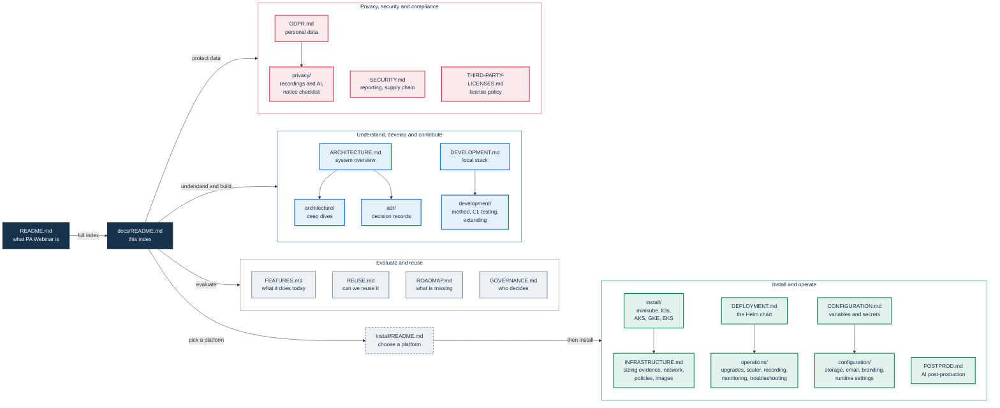

# PA Webinar documentation

This is the index of the PA Webinar documentation. It lists every page, grouped by what you are trying to do, with one line on what each page answers. If you are new to the project, start with the [project README](../README.md), which explains the idea and gives a short tour of the platform. Then come back here to find the page that owns your question.

## How these docs work

- **One owner page per topic.** Each subject is described on one page, the owner listed in this index. Other pages summarize it in a sentence and link to it instead of writing a second description. If two pages seem to disagree, the owner is the one to trust and the other one needs fixing.
- **Current behavior only, checked against the code.** Pages describe what the code does today. When a page and the code disagree, the code wins and the page gets fixed. The authoritative files are the code and its configuration: `app/prisma/schema.prisma`, `infra/helm/pa-webinar/values.yaml`, `.github/workflows/*`, `app/package.json` and the interface catalogs in `app/src/i18n/messages/`. What is still missing is on the [roadmap](ROADMAP.md). What changed, and when, is in the [changelog](../CHANGELOG.md) and the git history.
- **ADRs record why.** The [Architecture Decision Records](adr/README.md) keep the reasoning behind each architecture-level choice and the alternatives that were rejected. The deep dives under `architecture/` describe how the system works now.
- **Component READMEs sit next to their code.** Pages under `docs/` explain concepts, procedures and settings. A README inside a component folder, such as `lobby/` or `infra/recorder/`, covers that component's implementation, build and tests, and links back to the concept page.

## Documentation map

The four journeys below match the sections of this index. The dark nodes are the two entry points. Each folder node stands for the drill-down pages of the page above it. [Installing PA Webinar](install/README.md), drawn with a dashed outline, belongs to two journeys: evaluators read it to judge what a platform costs and try the product on minikube, and operators start their installation there.

## Evaluate and reuse

For decision-makers in a public administration (PA): IT managers, procurement and legal offices, and data protection officers (DPOs).

| Page | What it answers |
|---|---|
| [Project README](../README.md) | What PA Webinar is and why it exists, with a short tour of the architecture, the Jitsi integration, scaling, AI post-production, privacy and the development method. |
| [Feature tour](FEATURES.md) | What the platform does today, organized by role, with screenshots and a link to where each feature is configured. |
| [Reusing PA Webinar](REUSE.md) | Whether your administration can reuse it and what that takes: the EUPL-1.2 in practice, the Italian reuse framework and `publiccode.yml`, requirements, early decisions, maturity, your responsibilities and an adoption checklist. |
| [Roadmap](ROADMAP.md) | What is still missing, and the known limitations of shipped features. It lists only what is not done yet. |
| [Governance](../GOVERNANCE.md) | Who owns and maintains the project, the roles, how decisions are made and recorded, and what is not defined. |
| [Glossary](GLOSSARY.md) | Each product, Jitsi, operations and privacy term in one or two lines, linked to its owner page, with the Italian interface labels mapped to their English ones. |
| [Changelog](../CHANGELOG.md) | Release notes, newest first. The file is generated from the curated notes in `app/src/content/changelog/`, which every installation also shows at `/changelog` in the reader's language. |

## Install and operate

For the IT staff who install and run an installation. Start with [Installing PA Webinar](install/README.md): it tells you which platform fits what you have, what to prepare and how large it must be, before you touch the chart. PA Webinar is Kubernetes-native: every guide installs the same Helm chart, and minikube is the way to evaluate it.

### Choose a platform and install it

| Page | What it answers |
|---|---|
| [Installing PA Webinar](install/README.md) | Which platform to run (a workstation, one VM, three VMs, or managed Kubernetes on AKS, GKE or EKS), the checklist before you install, the measured requirements, how scaling works, and the known limitations: TURN, ingress controllers and proxies, UDP load balancers, network plugins, registry access and high availability. |
| [Try PA Webinar on minikube](install/minikube.md) | The evaluation path: one command, `scripts/minikube-up.sh`, installs the chart on a workstation. First steps, measured usage, troubleshooting, the installation by hand and what the minikube overlay changes. |
| [Installing on your own VMs with k3s](install/k3s.md) | One or three VMs with the scripts in `infra/onprem/k3s`: layouts, ports, proxies and air-gapped nodes, RHEL with SELinux, certificates, backups, failure behavior and measurements. |
| [Installing on AKS](install/aks.md), [GKE](install/gke.md) and [EKS](install/eks.md) | The full profile on a managed cluster, from the reference OpenTofu module to a first event: decisions, checklist, install steps, bridge and TURN exposure, storage, scaling, upgrades and what has been verified. |
| [Infrastructure reference](INFRASTRUCTURE.md) | The evidence and the design behind the guides: how the lab measured capacity, what a participant costs on the bridge, node pools and bridge exposure on any cluster, ports, advertised addresses, TURN, TLS, ingress controllers and client addresses, the chart's NetworkPolicy, the published images and the chart issues the lab installs found. |
| [Deploying with Helm](DEPLOYMENT.md) | The chart reference and install guide: what the chart renders, the `simple`, `standard` and `full` profiles, secrets, hostnames and ingress, the Jitsi keys, NetworkPolicy, metrics and first-run checks. |

### Run it day to day

| Page | What it answers |
|---|---|
| [Upgrades and rollback](operations/upgrades.md) | How to upgrade without drifting from the live values, how to roll back, and what a rollback does not restore. |
| [Running the JVB scaler](operations/jvb-scaler.md) | How to enable, tune, validate and pause the job that scales the bridges in the `full` profile. |
| [Setting up recording](operations/recording-setup.md) | Which values turn on composite video (Jibri), per-speaker audio (the recorder bot), or both, and how to check that each works. |
| [Monitoring and health](operations/monitoring.md) | Health probes, the status pages, metrics and their authentication, alert rules, Grafana dashboards and logs. |
| [Troubleshooting](operations/troubleshooting.md) | Symptom, cause and fix for problems on running installations, with a quick-reference table. |

### Configure it

| Page | What it answers |
|---|---|
| [Configuration reference](CONFIGURATION.md) | The three configuration layers (environment, site settings, per event) and which one wins, every environment variable, and the secrets map. |
| [Object storage](configuration/storage.md) | How Azure Blob Storage or an S3-compatible service is configured for the files and recordings domains, the key layout, the access paths and who deletes what. |
| [Email delivery (SMTP)](configuration/email.md) | The SMTP relay settings, provider examples, and relay-side delivery troubleshooting. |
| [Branding and white-labeling](configuration/branding.md) | What an administration can brand without a rebuild, from logo and home page to emails and the video watermark, and where branding stops. |
| [Runtime settings (SiteSetting)](configuration/runtime-settings.md) | The settings panel: each setting group, the operational knobs with their defaults, per-event overrides and precedence. |

### Optional subsystems and capacity

| Page | What it answers |
|---|---|
| [AI post-production](POSTPROD.md) | The in-cluster pipeline that produces transcripts, subtitles, summaries, translations and dubbing: architecture, queue, models, operational checklist, configuration, administration and troubleshooting. |
| [Load testing and reference measurements](LOAD-TESTING.md) | How to load-test the bridges and the portal, what to watch, and the reference results that sizing relies on. |
| [Service inventory: publishing](SERVICE-INVENTORY.md) | What `/service-inventory` shows, how `SERVICE_INVENTORY_URL` is resolved, where to host the document and the rendering contract. |
| [Service inventory: generating the document](SERVICE-INVENTORY-GENERATION.md) | How to produce the CycloneDX 1.6 document: the software half from the release SBOMs, the operational half per cloud provider, and a checklist for a new installation. |

## Understand the system

For architects, reviewers and developers who need to know how the parts fit. Start with [Architecture](ARCHITECTURE.md): the system context, the building blocks, the planes and what crosses between them, one event followed end to end, and a map of the repository.

### Deep dives

| Page | What it answers |
|---|---|
| [How PA Webinar extends Jitsi Meet](architecture/jitsi-integration.md) | How the portal embeds Jitsi without forking it: the extension ladder, the IFrame API, per-role configuration, the Prosody side, the patched web image, the media path and the Jitsi upgrade checklist. |
| [Event lifecycle](architecture/event-lifecycle.md) | The `EventStatus` state machine: what each status means, who changes it in each install mode, which joins each status admits, and the grace period, overtime and revival. |
| [Scaling the media plane](architecture/scaling.md) | How bridge capacity is modeled and provisioned: the sizing formula, the scaler tick, node-pool scale to zero, the single-IP pitfall and why the chart does not use KEDA. |
| [Live interaction and realtime](architecture/live-interaction.md) | Chat, Q&A, polls, word cloud, reactions, timer and the raised-hand queue: who reads and writes what, the Redis fan-out over SSE, and the live-toggleable flags. |
| [Identity, access and tokens](architecture/identity-and-access.md) | Every credential the platform issues or accepts, how it travels, how long it lasts and how it is revoked; staff sign-in; where authorization is enforced; the Jitsi JWT claims; the cookie inventory. |
| [From creation to recap: the event journey](architecture/event-journey.md) | Everything outside the live room: the event wizard, templates, duplication and series, registration and access modes, invitations, questionnaires, materials, the recap, the video library, event analytics and instant calls. |
| [The waiting room and the square](architecture/waiting-room.md) | The single front door to every live page: what each state shows, the device check, music, consent notices, the optional 2D square and the accessibility contract. |
| [Recording: composite video and per-speaker audio](architecture/recording.md) | The two capture paths, Jibri and the multitrack recorder bot: how each is triggered, the ingest contracts, the hidden Prosody domain, the runners and the recording lifecycle. |
| [Data model](architecture/data-model.md) | Schema conventions, the domain map, ER diagrams of the core and live-interaction models, invariants and the migration policy. |
| [Email and calendar](architecture/email.md) | The email outbox, every email the platform sends, email languages, reminders, calendar files, sender identity, and how to trace a missing email. |
| [Scheduled and background jobs](architecture/background-jobs.md) | Every scheduled job: what it does, where it runs, which Helm key sets its schedule, how it authenticates and what breaks if it does not run. |
| [Languages and localization](architecture/i18n.md) | The 24-language model: catalogs and the parity test, localized URLs and their helpers, runtime language settings, translation overrides and event content languages. |
| [API surface](architecture/api.md) | API conventions and route families: the credential each family checks, the error shape, streaming endpoints, OpenAPI coverage and stability. |
| [Security architecture](architecture/security.md) | The application's security controls and where each one stops: trust boundaries, the CSRF stance, sanitization, encryption at rest, the secrets map, rate limits, runtime hardening and logging. |

### Decision records

The [ADR index](adr/README.md) gives each record's status and relations, the status legend, the template and the process for proposing a new one.

| ADR | Decision |
|---|---|
| [001](adr/001-jitsi-iframe-api.md) | Embed Jitsi Meet through the IFrame API |
| [002](adr/002-nextjs-fullstack.md) | A single Next.js full-stack application |
| [003](adr/003-moderator-magic-links.md) | Moderators and speakers by magic link, no accounts |
| [004](adr/004-jitsi-jwt.md) | Portal-signed Jitsi JWT with no personal data |
| [005](adr/005-live-interaction-in-portal.md) | Live interaction lives in the portal |
| [006](adr/006-recording-and-storage.md) | Optional recording paths on provider-agnostic storage |
| [007](adr/007-jvb-scale-to-zero.md) | Scale bridges to zero, driven by events |
| [008](adr/008-eu-languages.md) | 24 EU languages with next-intl |
| [009](adr/009-admin-session.md) | Administration by instance key and signed session cookie |
| [010](adr/010-site-settings-singleton.md) | A SiteSetting singleton for runtime configuration |
| [011](adr/011-person-rubrica.md) | Cross-event person record and opt-in address book |
| [012](adr/012-garden-waiting-room.md) | An optional 2D social waiting room |
| [013](adr/013-multitrack-speaker-attribution.md) | Per-participant multitrack recording for speaker attribution |
| [014](adr/014-organizer-role.md) | The organizer role |
| [015](adr/015-named-administrators.md) | Named administrators alongside the instance key |
| [016](adr/016-in-cluster-ai-postproduction.md) | In-cluster AI post-production |
| [017](adr/017-patched-jitsi-web-image.md) | Patch the jitsi/web bundle by shape for fixes with no configuration point |

## Develop and contribute

For developers who change the code or the documentation.

| Page | What it answers |
|---|---|
| [Local development](DEVELOPMENT.md) | The development loop with Docker Compose: prerequisites, quick start and first access, local services, what differs from a cluster, the database workflow, trying a chart change on minikube, and local troubleshooting. |
| [How we develop PA Webinar](development/methodology.md) | The development method: branches, Conventional Commits, pre-commit gates, CI parity before every push, code review, regression discipline, the coverage ratchet, database changes, ADRs and documentation discipline. |
| [CI, images and releases](development/ci-and-release.md) | What each GitHub Actions workflow does and produces, the image-tag table, SBOMs, release notes and the step-by-step release procedure. |
| [Testing](development/testing.md) | Every test layer with its command and CI job, the guard tests that turn project rules into failing tests, the coverage ratchet and what cannot be tested headless. |
| [Extending PA Webinar](development/extending.md) | The code conventions, and a checklist recipe for each kind of change: pages, API routes, the data model, live features, text and languages, emails, settings, storage, AI engines, Jitsi, jobs, the chart and dependencies. |
| [Contributing](../CONTRIBUTING.md) | How to report a bug, propose a feature, set up, branch, commit, check and open a pull request, and the license of contributions. |
| [Code of conduct](../CODE_OF_CONDUCT.md) | The Contributor Covenant 2.1 and the enforcement contact. |

The [pull request template](../.github/pull_request_template.md) and the issue templates for [bugs](../.github/ISSUE_TEMPLATE/bug.md) and [feature requests](../.github/ISSUE_TEMPLATE/feature.md) turn these rules into checklists.

## Privacy, security and compliance

For controllers, DPOs, security reviewers and anyone who handles a vulnerability report.

| Page | What it answers |
|---|---|
| [Privacy and data protection](GDPR.md) | Personal data in PA Webinar: controller and processor roles, the data inventory and retention table, the consent model, the daily GDPR cleanup, data-subject rights, the address book, cookies, logs, audit trails and the consent texts. |
| [Recordings, voice data and AI outputs](privacy/recordings-and-ai.md) | The privacy side of recording, per-participant audio and AI post-production: what is captured, voice-data minimization, retention regimes, editing and erasure, and legal bases. |
| [Privacy notice checklist for controllers](privacy/privacy-notice-checklist.md) | The platform facts a controller's privacy notice has to cover, each mapped to the setting that controls it, and the settings to review before the first public event. It is not legal advice. |
| [Security policy](../SECURITY.md) | How to report a vulnerability privately, which versions are supported, what the maintainers commit to, and the supply-chain and CI controls: runner isolation, pinned actions, token permissions, dependency updates, scanners, SBOMs and the secrets policy. |
| [Security architecture](architecture/security.md) | The application's own security controls and their limits. |
| [Content Security Policy](SECURITY-CSP.md) | The exact CSP and companion headers, directive by directive, how the nonce works, how storage hosts are mapped, and a manual test plan. |
| [Third-party licenses](../THIRD-PARTY-LICENSES.md) | The license policy and how it is enforced, and the components no npm report covers: container images, AI models and voices, fonts and music. The npm report itself is the generated `license-report.json`. |
| [Release SBOMs](development/ci-and-release.md#sboms) | The SPDX SBOM of the application image and the CycloneDX SBOM of the npm dependencies that a GitHub Release can carry, and the SBOM viewer on the `/changelog` page. |

## Component documentation

Each of these files sits next to the code it describes.

| File | What it covers |
|---|---|
| [`lobby/README.md`](../lobby/README.md) | The waiting-room square as an isolated workspace: its public API, ports and adapters, the development harness and its limitations. |
| [`infra/recorder/README.md`](../infra/recorder/README.md) | The multitrack recorder bot: capture in headless Chrome, configuration, storage layout, personal data and development. |
| [`infra/recorder-controller/README.md`](../infra/recorder-controller/README.md) | The recorder controller: the reconcile loop, the Kubernetes and Docker runners, credentials, enabling and operating it. |
| [`infra/ai/worker/README.md`](../infra/ai/worker/README.md) | The AI post-production worker from the inside: the portal protocol, job handlers, module map, stub mode, tests and the image build. |
| [`infra/ai/local-out/README.md`](../infra/ai/local-out/README.md) | A development tool that runs post-production on a workstation GPU and pushes the results to a test installation, with its safety warnings. |
| [`infra/jitsi-web-patched/README.md`](../infra/jitsi-web-patched/README.md) | The patched `jitsi/web` image: the three fixes, patching by shape, building, bumping to a new Jitsi release and verification. |
| [`infra/jitsi/README.md`](../infra/jitsi/README.md) | The custom Prosody module and the two Jibri finalize scripts, and which script the chart uses. |
| [`infra/helm/pa-webinar/README.md`](../infra/helm/pa-webinar/README.md) | The short README that travels inside the packaged chart, pointing to the full documentation. |
| [`infra/onprem/k3s/README.md`](../infra/onprem/k3s/README.md) | The reference for the k3s installation scripts: every option, proxies, registry mirrors, air-gapped nodes and SELinux. The procedure is in [Installing on your own VMs with k3s](install/k3s.md). |
| [`infra/tofu/aks/README.md`](../infra/tofu/aks/README.md), [`gke`](../infra/tofu/gke/README.md), [`eks`](../infra/tofu/eks/README.md) | The reference OpenTofu modules for the managed clouds: what each creates, its variables and outputs, network rules and what has been verified. |
| [`infra/aks/node-pools.md`](../infra/aks/node-pools.md) | The JVB pool contract that every bridge pool must meet, and how to add the pool to an AKS cluster you already have. |
| [`infra/service-inventory/azure/README.md`](../infra/service-inventory/azure/README.md) | The reference Azure automation for the operational half of the service inventory, and what it publishes. |
| [`scripts/load-test/README.md`](../scripts/load-test/README.md) | The load-test toolkit manual: the image, variables, runs and known issues. Its companion [`SELENIUM-GRID.md`](../scripts/load-test/SELENIUM-GRID.md) is the runbook for an in-cluster load test. |
| [`app/public/audio/README.md`](../app/public/audio/README.md) | The bundled waiting-room music: when it plays, how to replace it, and its attribution. |
| [`app/public/fonts/README.md`](../app/public/fonts/README.md) | The self-hosted fonts of the .italia design system: families, coverage and license. |
| [`app/public/images/virtual-backgrounds/README.md`](../app/public/images/virtual-backgrounds/README.md) | The bundled virtual backgrounds: the catalog, format rules and how to add one. |
| [`docs/examples/service-inventory.example.json`](examples/service-inventory.example.json) | The template for an installation's service-inventory base document. |

## Where do I find...?

| Question | Page |
|---|---|
| Which platform fits our administration, and how large must it be? | [Installing PA Webinar: choose a platform](install/README.md#choose-a-platform) and [requirements](install/README.md#requirements) |
| How do I try PA Webinar on my workstation? | [Try PA Webinar on minikube](install/minikube.md) |
| How many participants can one bridge carry? | [Load testing: reference measurements](LOAD-TESTING.md#reference-measurements) and [Scaling: sizing](architecture/scaling.md#sizing-from-an-event-to-a-number-of-bridges) |
| Which ports must the firewall open? | [Infrastructure reference: ports and firewall](INFRASTRUCTURE.md#ports-and-firewall) |
| How do I install on Kubernetes? | The guide for your platform, from [Installing PA Webinar](install/README.md#choose-a-platform), and [Deploying with Helm: install walkthroughs](DEPLOYMENT.md#install-walkthroughs) for any other cluster |
| What are the known limits of an installation (TURN, ingress, proxies)? | [Installing PA Webinar: known limitations](install/README.md#known-limitations) |
| What does an environment variable do? | [Configuration: environment variable reference](CONFIGURATION.md#environment-variable-reference) |
| How do I upgrade, and how do I roll back? | [Upgrades and rollback](operations/upgrades.md) |
| Participants cannot hear or see each other. | [Troubleshooting: no audio or video](operations/troubleshooting.md#no-audio-or-video) |
| An email never arrived. | [Email and calendar: tracing a missing email](architecture/email.md#tracing-a-missing-email) |
| When does a room open, and when does it close? | [Event lifecycle](architecture/event-lifecycle.md#quick-answers) |
| What can a moderator link do, and how is it revoked? | [Identity, access and tokens: moderator and speaker links](architecture/identity-and-access.md#moderator-and-speaker-links) |
| How do I record events? | [Setting up recording](operations/recording-setup.md) |
| How do I get transcripts, subtitles and translations? | [AI post-production: operational checklist](POSTPROD.md#operational-checklist) |
| How do I put our logo and colors on the portal? | [Branding and white-labeling](configuration/branding.md) |
| How long is personal data kept, and what deletes it? | [Privacy: data inventory and retention](GDPR.md#data-inventory-and-retention) |
| What must our privacy notice say? | [Privacy notice checklist](privacy/privacy-notice-checklist.md) |
| How do I report a vulnerability? | [Security policy: reporting a vulnerability](../SECURITY.md#reporting-a-vulnerability) |
| How do I add interface text or a new page? | [Extending: UI text and languages](development/extending.md#adding-ui-text-or-a-language) and [adding a page](development/extending.md#adding-a-page) |
| What must pass before I commit or push? | [Methodology: local gates](development/methodology.md#local-gates-before-every-commit) and [CI parity](development/methodology.md#ci-parity-before-every-push) |
| How is a release cut? | [CI, images and releases: cutting a release](development/ci-and-release.md#cutting-a-release) |
| What does a term mean? | [Glossary](GLOSSARY.md) |

## Conventions

These rules apply to every page in the repository. Documentation changes follow the same review as code, as described in [Contributing](../CONTRIBUTING.md#contributing-documentation).

**Where content goes**

- Update the owner page of a subject and link to it from elsewhere. A new subject gets an owner page and a row in this index.
- Describe behavior on the owner page and the reasoning in an ADR. Put implementation details of a component in the README next to its code.
- Keep headings stable, because other pages link to them. When a heading must change and other pages link to it, keep the old anchor with an `<a id="...">` tag above the new heading.

**Language and style**

- Write in English with American spelling: -ize, color, behavior, center, catalog, artifact, license (noun and verb), canceled. The one exception is the official name of the European Union Public Licence (EUPL-1.2). This matches the interface's English catalog and the code identifiers.
- Use sentence case for headings. Describe behavior in the present tense, and write procedures in the imperative.
- Quote interface labels verbatim from `app/src/i18n/messages/en.json`, in bold, for example **Start event**. Never translate a label again. The default interface language is Italian, so where a screenshot shows the Italian interface, give the Italian label in parentheses on first use.
- Keep code identifiers, Prisma models and enum values, Helm keys, environment variables, API routes, file paths, i18n keys and commands verbatim in backticks, even when they are Italian.
- Write the product name as PA Webinar. Use `pa-webinar` only as an identifier: package, repository, image, chart or metric prefix.
- Keep Italian proper names in Italian with an English gloss on first use, for example Dipartimento per la Trasformazione Digitale (Italian Department for Digital Transformation).

**Placeholders and real data**

- Use `webinar.example.com` for the portal and `meet.webinar.example.com` for the conference.
- Write other names as `<release>`, `<namespace>`, `<cluster>`, `<tenant>`, `<storage-account>` and `<location>`, and a public address as `<public-ip>`. Private address examples use RFC 1918 ranges only.
- Literal Helm examples use `pa-webinar` as both the release and the namespace.
- Never publish real environment data: cluster, namespace or resource-group names, hostnames, IP addresses, secret names of a real deployment, or credentials.

**Facts that stay true**

- Quote a default only together with the file it comes from, such as `infra/helm/pa-webinar/values.yaml` or `app/prisma/schema.prisma`, so a reader can check it.
- Do not write inventories that drift: no counts of metrics, alerts, tests, packages or models, no version tables and no line numbers. Point to the authoritative file or to the command that produces the answer.
- Describe the product, not its history: no dates, no "since version X", no people, meetings or internal ticket codes. History lives in the changelog and in `git log`. A roadmap item carries "open since <Month YYYY>".

**Diagrams**

- Draw diagrams in Mermaid, one idea per diagram, with explicit labels on nodes and edges.
- Color them with `classDef` from the palette: primary `#0066CC`, dark `#17324D`, teal `#00A3A3`, green `#008055`, amber `#CC7A00`, red `#D1344C` and neutral `#5C6F82`. Use a light tint of the stroke color as the fill, such as `#E6F0FA`, with dark text, so the diagram reads in both GitHub themes.
- Render every diagram before you commit it, for example with `npx -y @mermaid-js/mermaid-cli -i diagram.mmd -o diagram.svg`, because GitHub shows a diagram that fails to parse as an error box.

**Reporting drift**

If a page does not match what the code does, open an issue with the [bug report template](../.github/ISSUE_TEMPLATE/bug.md). Name the page and the section, quote the claim, and point to the code that contradicts it. A pull request that fixes the page is just as welcome.
