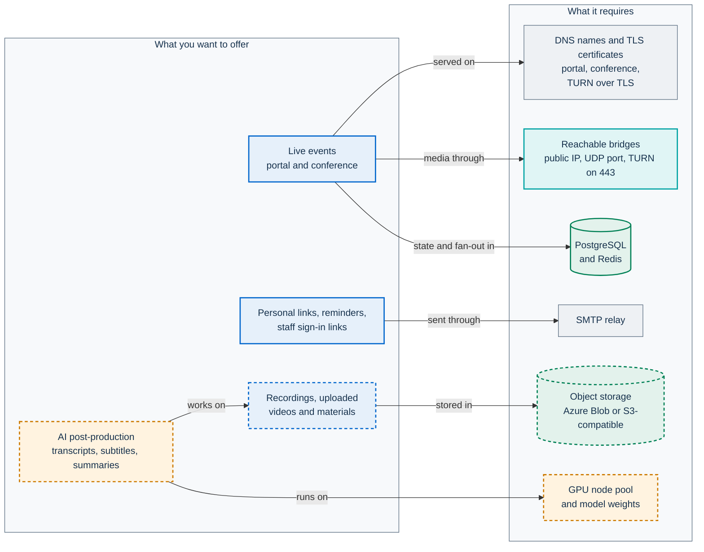
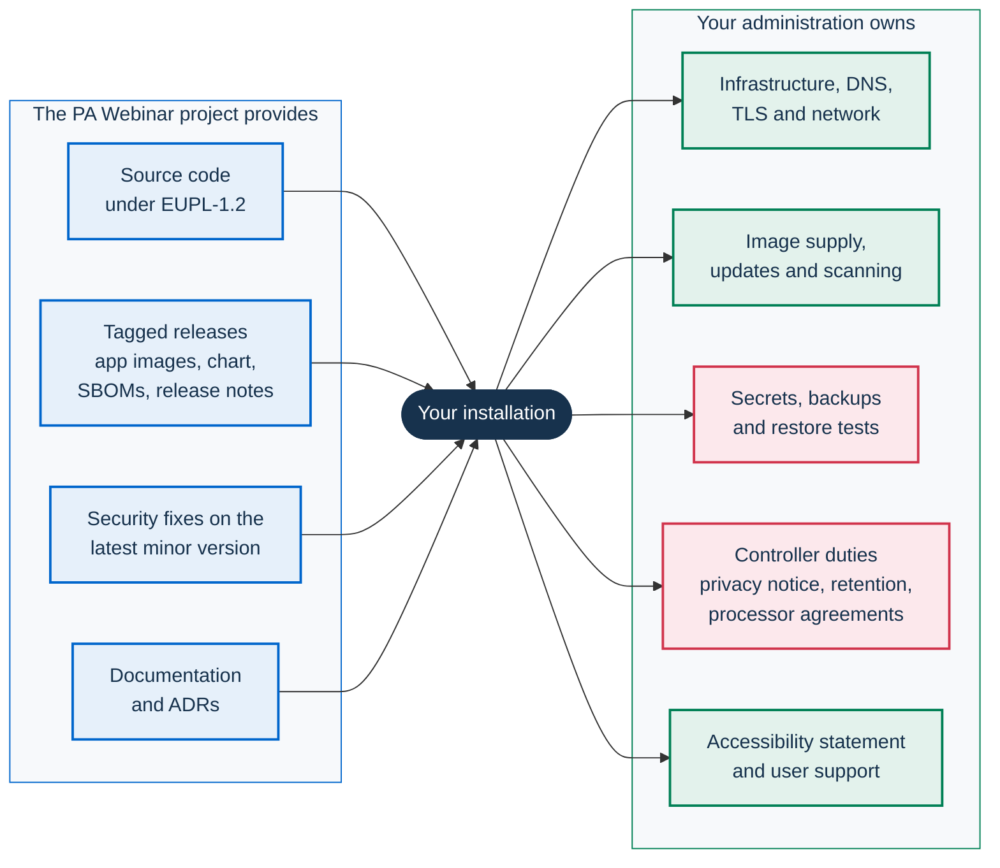

# Reusing PA Webinar

This page answers three questions for a public administration (PA) that is
considering PA Webinar: can we reuse it, what does it take, and what is proven
today. It is written for the people who decide, not for the people who
install. Each section summarizes and links the page that owns the detail.

PA Webinar is an open-source platform for public digital events such as
webinars, presentations and public meetings. It is built on Jitsi Meet and the
.italia design system (Bootstrap Italia and design-react-kit), and it is
developed by the Dipartimento per la Trasformazione Digitale (Italian
Department for Digital Transformation). The [feature tour](FEATURES.md) shows
what it does. [Architecture](ARCHITECTURE.md) shows how it is built.

On this page:

- [Who this is for](#who-this-is-for)
- [License and reuse framework](#license-and-reuse-framework)
- [What you need](#what-you-need)
- [Decisions to make first](#decisions-to-make-first)
- [Maturity today](#maturity-today)
- [Your responsibilities as operator and controller](#your-responsibilities-as-operator-and-controller)
- [Staying close to upstream](#staying-close-to-upstream)
- [Adoption checklist](#adoption-checklist)

## Who this is for

- **IT managers** who need to know the infrastructure and skills an
  installation requires and how mature each part is.
- **Procurement and legal offices** who need the license terms in plain words
  and the reuse framework the project follows.
- **Data protection officers (DPOs)** who need to know which choices change the
  personal data an installation processes and which duties stay with the
  controller.

The software is meant for any public body in the European Union, and its
interface ships in 24 EU languages. Some parts still assume an Italian
installation. [Languages](#languages) lists them.

## License and reuse framework

> This section summarizes the license terms. It is not legal advice. The license
> text is authoritative, and your legal office should read it.

### EUPL-1.2 in plain words

PA Webinar is released under the European Union Public Licence (EUPL-1.2). The
[`LICENSE`](../LICENSE) file carries the notice, and the
[official text](https://interoperable-europe.ec.europa.eu/collection/eupl/eupl-text-eupl-12)
is published on the Interoperable Europe Portal (formerly Joinup) in every EU
language. In practice:

- **Use.** Any administration, company or person may install and run it for any
  purpose, with no fee and no registration.
- **Modify.** You may adapt the code to your needs.
- **Share alike.** If you distribute or communicate a modified version, your
  changes must be licensed under EUPL-1.2 or under a license the EUPL appendix
  lists as compatible, and you must make their source code available. The
  license counts online access to the software's essential functions as
  communication. A modified version that you run as a public service can
  therefore trigger this obligation. Ask your legal office before you run
  local changes that you do not publish.
- **Keep the notices.** Keep the copyright and license notices, and include a
  copy of the license with every copy you distribute.
- **No warranty.** The software is provided "as is". Liability is excluded as
  far as the law allows.
- **No trademark rights.** The license does not let you use the licensor's names
  or marks beyond describing where the work comes from. Run your installation
  under your own administration's name. The [branding settings](configuration/branding.md)
  exist for this purpose.

Contributions to the project are accepted under the same license. See
[CONTRIBUTING](../CONTRIBUTING.md).

### Third-party components

PA Webinar depends on open-source packages that have their own licenses.
[THIRD-PARTY-LICENSES](../THIRD-PARTY-LICENSES.md) states the license policy
and lists the components that no package report covers. The generated
inventory of the npm workspaces is [`license-report.json`](../license-report.json),
which `npm run license:report` produces. CI fails when the committed report is
out of date, so every dependency change shows its licenses in a reviewed diff.
The same CI job also runs a license deny list, but that step matches exact
license identifiers only and, as CI runs it, inspects no packages. Do not read
it as a guarantee ([Limits of the automated check](../THIRD-PARTY-LICENSES.md#limits-of-the-automated-check)).

Some parts run beside the application under their own licenses: the Jitsi Meet
services, PostgreSQL, Redis and coturn. AI post-production downloads model
weights that have their own terms. One of them, the diarization model, is gated
behind the model host's user agreement ([AI post-production](POSTPROD.md)).
Several AI components have terms still open for a legal reading, among them
non-commercial alignment weights
([Open points](../THIRD-PARTY-LICENSES.md#open-points)).

Two bundled assets have open license points
([Bundled assets](../THIRD-PARTY-LICENSES.md#bundled-assets)):

- **Fonts.** They are under the SIL Open Font License, which requires its text
  to travel with the fonts. The fonts folder does not contain it yet.
- **Waiting-room music.** It is under the Pixabay Content License, which
  forbids distribution "on a Standalone basis". Whether shipping the unmodified
  file in the repository and in the image is covered has not been settled.

### The Italian reuse framework and publiccode.yml

Italian administrations reuse software under the
[AgID Guidelines on the acquisition and reuse of software](https://docs.italia.it/italia/developers-italia/lg-acquisizione-e-riuso-software-per-pa-docs/).
The guidelines apply Articles 68 and 69 of the Codice dell'Amministrazione
Digitale (Italian Digital Administration Code). Under those rules an
administration assesses existing and reusable software before it acquires new
software. This page supplies the facts for that assessment.

The repository contains a [`publiccode.yml`](../publiccode.yml), the metadata
format that the Developers Italia catalog reads. It declares the license, the
maintainer, the development status, the open-source dependencies and the
available languages. For the current version, use the repository's release tags
and the [changelog](../CHANGELOG.md) instead.

## What you need

Dashed boxes are optional.

| You need | What depends on it | Details |
|---|---|---|
| A Kubernetes cluster and Helm 3 or 4: minikube to evaluate the chart, one k3s server (installed with one command) or three k3s nodes for a small production, managed Kubernetes for concurrent or large events. Docker Compose is only for changing the code | Everything | [Installing PA Webinar](install/README.md#support-levels), [Deploying with Helm](DEPLOYMENT.md) |
| Two DNS names with TLS certificates, one for the portal (`webinar.example.com`) and one for the conference (`meet.webinar.example.com`). TURN over TLS needs a third name: on a managed cluster on coturn's own IP, with a certificate issued through DNS-01; on one k3s server on the same address and port as the portal. Object storage on one k3s server needs a fourth | The portal and the conference are served by separate ingresses | [DNS and TLS](INFRASTRUCTURE.md#dns-and-tls), [TURN](INFRASTRUCTURE.md#turn) |
| A network path for media: a public IP on the bridge nodes with the bridge UDP port open, plus TURN over TLS on port 443 for participants behind restrictive firewalls | Audio and video. Media never passes through the portal | [Networking](INFRASTRUCTURE.md#networking), [Jitsi integration](architecture/jitsi-integration.md) |
| PostgreSQL and Redis, in the cluster through the chart or as managed services | All state (PostgreSQL) and realtime fan-out in the live room (Redis) | [Deploying with Helm](DEPLOYMENT.md) |
| An SMTP relay | Registration confirmations with the personal link (the only way it reaches registrants while public registration is off), reminders, staff sign-in links, confirmations of data-subject requests | [Email delivery](configuration/email.md), [Email and calendar](architecture/email.md) |
| Object storage: Azure Blob Storage or an S3-compatible service (AWS S3, Google Cloud Storage through its S3-compatible API, or Garage, which the k3s installer adds to one server) | Recordings, uploaded materials and videos, AI outputs. Evaluation does not need it | [Object storage](configuration/storage.md) |
| Optional: a GPU node pool, model weights, and an LLM server (vLLM) that you deploy separately from the chart | AI post-production only | [AI post-production](POSTPROD.md) |

The chart assumes a few components in the cluster:

- an ingress controller that serves `Ingress` objects. The values default to
  ingress-nginx;
- cert-manager with a ClusterIssuer named `letsencrypt-prod`, unless you supply
  your own certificates;
- metrics-server;
- a default StorageClass;
- the Prometheus Operator CRDs, for the full profile, which enables
  ServiceMonitors.

On another ingress controller, change only the Ingress class of the portal
and of the conference (`ingress.className` and
`jitsi-meet.web.ingress.ingressClassName`). The chart drops its ingress-nginx
annotations when the class is listed in `ingress.nonNginxClassNames`; add
your class there if it is not. The ingress-nginx settings (HSTS, the
request-size limit, the conference-root redirect, the rate limits of the
production example) then apply only if you translate them into your
controller's configuration. Traefik is tested in lab.

If a load balancer, WAF or reverse proxy that appends to `X-Forwarded-For`
sits in front of the ingress, or if Google Cloud's load balancer is the
ingress (GKE Ingress), set `TRUSTED_PROXY_HOPS` in `app.env`. Otherwise
per-IP limits and the audit log see the proxy's address instead of the
client's. A value higher than the real chain, or a chain that requests can
bypass, lets a client choose its own key. The value for each setup, including
the ingress-nginx and Traefik defaults that replace the header, is in
[Client address and rate limits](CONFIGURATION.md#client-address-and-rate-limits). The chart produces no routes for a controller that speaks
only the Gateway API. See
[Ingress controllers](INFRASTRUCTURE.md#ingress-controllers).

This page gives no sizing figures. [Installing PA Webinar](install/README.md)
covers choosing and sizing a platform, and [load testing](LOAD-TESTING.md) has
the measurements. Before installing, read its
[Known limitations](install/README.md#known-limitations), and the
[chart issues](INFRASTRUCTURE.md#chart-issues-found-by-the-lab-installs) that
the lab installs ran into, with their workarounds.

Skills your team, or a supplier, needs:

- Kubernetes and Helm, including ingress, certificates and node pools. This
  holds for a single VM too, which runs k3s.
- WebRTC networking: UDP reachability, public-IP advertisement and TURN. Most
  cases where participants cannot hear or see each other start here.
- PostgreSQL operations: backups, restores and upgrades.
- Email deliverability for the sender domain.
- GPU node operations, if you enable AI post-production.
- A DPO and an owner for the privacy notice.

## Decisions to make first

Some choices are cheap to change later, such as branding or the active
languages. Others shape the infrastructure, the budget or the legal basis of
processing. Make those before you install.

### Choosing a setup

[Installing PA Webinar](install/README.md#choose-a-platform) compares the
platforms, from minikube on a workstation through k3s on one or three VMs to
managed Kubernetes on AKS, GKE or EKS, with a guide for each. It gives the
measured requirements, what you give up and how far each is proven. Docker
Compose is only for changing the code. Choose the platform there, then a
profile.

Profiles are example value sets in `infra/helm/pa-webinar/examples/`, each
built around a `jitsi.mode`, and [Deploying with Helm](DEPLOYMENT.md#profiles-and-values-files)
documents them. The differences that shape a budget:

- **simple**: one bridge and no Jibri, with PostgreSQL and Redis in the
  cluster.
- **standard**: adds Jibri, and expects an external PostgreSQL and secrets you
  create beforehand (`postgresql.enabled: false`, `secrets.mode: existing`).
- **full**: adds a dedicated bridge node pool that scales to zero, with the same
  external PostgreSQL and pre-created secrets.

Three points the profiles do not settle:

- The per-participant recorder (the recorder bot and the recorder controller,
  `recorder.enabled`) is independent of the profile, and it is not Jibri.
- AI post-production needs recordings to work on: per-participant tracks, or
  composite recordings from a Jibri whose upload you have wired (see
  [Recording](#recording)).
- Docker Compose can run the per-participant recorder through the Docker socket
  (`--profile recorder`), given object storage you configure. It cannot run the
  bridge scale-to-zero or AI post-production.

If your administration already runs Jitsi Meet, the chart can skip its own
Jitsi (`jitsi.enabled: false`). In that case, you point the portal at your
Jitsi through `NEXT_PUBLIC_JITSI_DOMAIN` and the `JITSI_JWT_*` settings, and
your Prosody must accept the portal's tokens. The chart's `jitsi.external.*`
values appear only in the install notes and do not reach the application. No
such setup has been exercised. Several features rely on the Jitsi configuration
that the chart ships, and [Jitsi integration](architecture/jitsi-integration.md)
describes it.

### Recording

Recording is switched on per event, and it is off by default. There are two
capture paths, and you can enable either one or both:

- **Composite video** (Jibri): a video of the room as participants see it. The
  standard and full profiles enable Jibri, but the chart does not wire its
  upload: you must give Jibri the finalize script yourself. Without it, the MP4
  stays on the Jibri pod, the portal never registers the recording, and AI
  post-production never receives it
  ([Mount the finalize script](operations/recording-setup.md#mount-the-finalize-script)).
- **Per-participant audio** (the recorder bot and the recorder controller): one
  audio track per participant, used for speaker attribution in transcripts.

Both paths need object storage. Per-participant audio is intermediate voice
data, and the platform deletes it after the multitrack transcription completes,
unless the event is set to keep the tracks. Kept tracks are deleted once the
recording's own retention date passes. The jobs that delete tracks run only
when AI post-production is enabled. **Without
the pipeline, raw per-participant tracks stay in storage indefinitely**, and
the [roadmap](ROADMAP.md) lists this as an open item. Enable per-participant
audio only together with AI post-production. See
[Recording](architecture/recording.md),
[Setting up recording](operations/recording-setup.md) and
[Recordings, voice data and AI outputs](privacy/recordings-and-ai.md).

### AI post-production

AI post-production is off by default (`postprod.enabled: false` in
`infra/helm/pa-webinar/values.yaml`). When it is on, it produces the following
from recordings:

- transcripts;
- subtitles;
- summaries;
- translations;
- dubbing with synthetic catalog voices. It never clones a voice.

Every model runs in your cluster, and no external AI API is called. This is the
data-sovereignty property ([ADR-016](adr/016-in-cluster-ai-postproduction.md)).
The cost of that property:

- a GPU node pool;
- model weights to download, one of them gated;
- a vLLM server that you deploy yourself;
- the AI Act transparency duties that come with publishing AI outputs.

[AI post-production](POSTPROD.md) has the checklist.

### Languages

- The interface ships in 24 EU languages. The site default is Italian, and
  administrators choose the active languages at runtime (`availableLocales`,
  Italian and English by default in `app/prisma/schema.prisma`).
- **Event titles and descriptions need an Italian version**:
  `app/src/lib/validation/schemas.ts` rejects them without one. The Italian
  input tab appears only when Italian is an active language. An installation
  outside Italy must keep Italian active and fill in Italian text.
- Emails are sent in Italian, English, French, German and Spanish. Recipients
  who use any other language receive English.
- A UI key missing from a catalog falls back to Italian, not English.
- The site's default time zone is `Europe/Rome` (`defaultTimezone`, a site
  setting), and each event carries its own time zone.

See [Languages and localization](architecture/i18n.md).

### Branding

One installation serves one organization. The following change from the site
settings without a rebuild:

- the site and organization names;
- the logo, favicon and primary color;
- the home page and the footer;
- the legal pages;
- the Jitsi watermark.

Translation overrides change any interface text. Hosting several separate
bodies on one installation is not supported. See
[Branding and white-labeling](configuration/branding.md) and
[Runtime settings](configuration/runtime-settings.md).

### Privacy notice and retention

- **Privacy notice.** You write it. The platform shows it from a site-wide page,
  from a default URL (`DEFAULT_PRIVACY_POLICY_URL`), from reusable
  **GDPR templates**, or per event as a URL or as text.
  The [privacy notice checklist](privacy/privacy-notice-checklist.md) maps each
  fact your notice needs to the setting that controls it.
- **Retention.** Each event has a retention period for participant data
  (`dataRetentionDays`, 30 days by default in `app/prisma/schema.prisma`). The
  daily GDPR cleanup applies it. Address-book entries, recordings and AI
  outputs follow their own regimes. [Privacy and data protection](GDPR.md) is
  the authoritative source for durations.
- **Third parties.** Avatar lookup on Gravatar is off by default. If you turn it
  on, you add a recipient to your notice. A YouTube address set on an event is
  shown as a link that visitors open themselves; the page embeds nothing from
  YouTube. The Jitsi subchart's default STUN server for the bridge is a
  third-party service. The chart's own values, the example profiles and
  `values-production.yaml` keep it (`jitsi-meet.jvb.stunServers` in
  `infra/helm/pa-webinar/values.yaml`), and the post-install notes flag it.
  To drop it, set the bridge's public address (`jitsi-meet.jvb.publicIPs`)
  and then an empty `stunServers`, or point `stunServers` at your own server.
  Otherwise declare it
  ([Advertised addresses and NAT](INFRASTRUCTURE.md#advertised-addresses-and-nat)).

### Administration model

- **Instance API key** (`ADMIN_API_KEY`): a shared credential with no named
  holder. It opens a new installation, and it serves emergencies and
  automation.
- **Named administrators** (staff role `ADMIN`) and **organizers** (staff role
  `ORGANIZER`, who manage only their own events): personal accounts that sign
  in through one-time links sent by email, so SMTP is required. Deactivating
  an account takes effect on its next request, and the audit trail records who
  acted.
- **Moderators and speakers** have no accounts. They receive per-event magic
  links ([ADR-003](adr/003-moderator-magic-links.md)).

The recommended path: sign in with the key once, create named administrators
under **Accounts**, then keep the key in a vault
([ADR-015](adr/015-named-administrators.md)). See
[Identity, access and tokens](architecture/identity-and-access.md).

### Transparency pages

The public status page (`/status`) is on by default. It shows component
health, replica counts, the deployment mode, the namespace and the titles of
upcoming public events, but no personal data. Turning off **Status page enabled** removes the page and keeps its data
for administrators, while the live room still learns whether the bridge is
ready. The service inventory
(`/service-inventory`) publishes a CycloneDX document that describes what runs
and where. You produce that document yourself, and the reference generator for
its operations half works only on Azure. See
[Service inventory: publishing](SERVICE-INVENTORY.md) and
[Service inventory: generating the document](SERVICE-INVENTORY-GENERATION.md).

## Maturity today

`publiccode.yml` declares PA Webinar as `beta`, and its versions are still
`0.x`. The application layer is the most mature part. Installation and
operations are the least mature, and the [roadmap](ROADMAP.md) says so openly.

[Installing PA Webinar](install/README.md) gives every platform one of
three statuses, and this page uses the same ones:

- **Exercised**: Azure Kubernetes Service (AKS), which runs real events.
- **Tested in lab**: minikube, and k3s on one VM and on three. Each was
  installed from scratch on lab machines and loaded with synthetic
  participants.
- **Not yet verified**: GKE and EKS. OpenShift is not covered at all.

kind is used only by CI, to validate the rendered manifests against a
Kubernetes API server. What is still unproven:

- No managed-cloud installation has been walked from scratch on a clean
  cluster through to a working event.
- No recurring test repeats any installation.
- The lab installs used the simple profile, with certificates from a private
  authority or from a test ACME server, and exercised neither Jibri recording
  nor a real SMTP relay. TURN and object storage were exercised on one k3s
  server.

Plan the first installation as a project, not as a routine procedure.

| Area | State today | What it means for you |
|---|---|---|
| Helm chart | Rendered for every profile and validated in CI (invariant checks and a server-side dry run on kind) | The manifests are valid. That does not prove the installation works. [Chart issues found by the lab installs](INFRASTRUCTURE.md#chart-issues-found-by-the-lab-installs) lists them with their workarounds |
| Kubernetes flavor | AKS exercised. minikube and k3s tested in lab. GKE and EKS not yet verified. OpenShift not covered | Expect to adapt node pools, load balancers and ingress to your provider ([Node pools and bridge exposure](INFRASTRUCTURE.md#node-pools-and-bridge-exposure)) |
| Ingress | The values default to ingress-nginx and to a cert-manager ClusterIssuer named `letsencrypt-prod` | On another controller, set the Ingress classes and translate the ingress-nginx settings you need. Traefik is tested in lab. Controllers that speak only the Gateway API get no routes ([Ingress controllers](INFRASTRUCTURE.md#ingress-controllers)) |
| Docker Compose | A development stack. Its placeholder secrets live in the tracked file. The portal is served without TLS, and the session cookie is `Secure`, so staff sign-in works only on `localhost`. It has no object storage and no TURN. It schedules only the `email-outbox`, `lifecycle`, `reminders` and `cleanup` jobs | For changing the code. It is not built to serve events ([Scheduled jobs](architecture/background-jobs.md)). To evaluate the chart, use [minikube](install/minikube.md) |
| Single VM | One k3s server, installed with `infra/onprem/k3s/pa-webinar-up.sh`: a supported small-production layout, tested in lab. The VM is a single point of failure, there is no Jibri, and object storage and TURN are options of the installer | The documented path for a single server, with its limits stated once ([Installing on your own VMs with k3s](install/k3s.md)) |
| Object storage | Azure Blob and S3-compatible providers are implemented, including video uploads from the administration area. Unit tests cover both providers with mocked SDKs. The S3 upload path has been exercised by hand against S3-compatible servers, but no automated test runs against a real storage service | The storage must accept uploads from browsers: CORS that allows `PUT` from the portal's origin and, on S3-compatible storage, an endpoint that is a public HTTPS address reachable by browsers and pods, and an access key with the permissions listed in [Object storage](configuration/storage.md#creating-buckets-and-containers). Test uploads and playback on your provider before the first event |
| Composite recording (Jibri) | The standard and full profiles enable Jibri, but the chart does not wire the upload | The finalize script must be given to Jibri by hand, or composite recordings are neither uploaded nor registered ([Mount the finalize script](operations/recording-setup.md#mount-the-finalize-script)) |
| TURN over TLS | coturn is an option of the Jitsi subchart, run by the AKS reference installation, and an add-on of the k3s installer tested in lab | On a managed cluster it needs its own IP, a third DNS name and a DNS-01 certificate; on one k3s server, `--turn` and a third DNS name. Test from a restrictive network before the first event ([TURN](INFRASTRUCTURE.md#turn)) |
| Azure-specific tooling | `infra/tofu` holds only reference AKS node pools (bridges and GPU). The service-inventory generator in `infra/service-inventory/azure` reads Azure Resource Graph. The AI post-production setup procedure is written for AKS | Write the equivalents for your cloud |
| Container images | The app and migration images are versioned per release and built only for `linux/amd64`. The recorder bot, recorder controller and AI worker images come only from the development branch, as `:dev` and `:dev-<sha>`, and the chart defaults to `:dev`. The patched `jitsi/web` image sits on a registry that needs a pull secret. Published images accept no anonymous pulls, and after publication they are neither scanned nor signed | Build from source or mirror into your own registry. Pin the auxiliary images to a `:dev-<sha>` you have tested, because rolling back the chart does not roll them back. The stock `jitsi/web` image also works, with advanced noise suppression off ([ADR-017](adr/017-patched-jitsi-web-image.md)) |
| Backup and restore | `scripts/backup.sh` and `scripts/restore.sh` cover the database, the keys and an object store on a volume of the cluster, such as the Garage add-on of one k3s server, and the chart can take a nightly dump. An object store outside the cluster is backed up with its provider's tools | Schedule them, copy the backups away from the cluster, and run the restore drill. See [Backups](#backups) |
| Alerting | Alert rules cover the application, database, bridges, scaler and TURN. They do not cover scheduled jobs, the email outbox, retention or disk. `scripts/verify-install.sh --quiet` checks those from cron. The cleanup job reports success even when it fails on individual events | Run the installation check on a schedule, and add checks on job outcomes ([Monitoring](operations/monitoring.md)) |
| Post-install verification | `scripts/verify-install.sh` checks an installation from outside and inside the cluster, and with `--call` joins two headless browsers to a room and checks audio and video both ways | Run it after every install and upgrade, and hold a call from two real networks before you announce anything ([Post-install verification](install/checklists.md#post-install-verification)) |
| Automated tests | Unit tests focus on library logic under a coverage ratchet. Browser tests do not enter a conference | See [Testing](development/testing.md) |
| Accessibility | An accessibility-statement page is provided. Conformance has not been measured, and nothing checks accessibility automatically | Evaluate the platform before you publish your statement |
| Participant identity | Registration by name and email. There is no SPID, CIE or eIDAS sign-in | SPID/CIE sign-in is a conditional roadmap item. eIDAS sign-in is not on the roadmap |

The roadmap's known limitations section lists the boundaries of features that
have already shipped. Read the [roadmap](ROADMAP.md) before you commit.

## Your responsibilities as operator and controller

### Updates

- Only the latest released minor version receives security fixes. See the
  [security policy](../SECURITY.md).
- Follow the repository's releases, and read the release notes in
  [`CHANGELOG.md`](../CHANGELOG.md) or on the in-app `/changelog` page.
- Upgrade with the layered files, as in [Upgrades and rollback](operations/upgrades.md).
  Database migrations run automatically when the application pod starts (the
  `db-migrate` init container), and they are additive by policy.
- The auxiliary `:dev` images change independently of releases. Pin them, and
  update them deliberately.
- Scan the images you deploy with your own scanner, because published images
  are not scanned after publication.

### Vulnerability reporting

If your own assessment finds a vulnerability in PA Webinar, report it
privately as the [security policy](../SECURITY.md) describes, not in a public
issue. A fix made upstream protects every administration that reuses the
software.

### Data protection roles

- Your administration is the **controller** for the personal data its
  installation processes: participants, staff accounts, the address book,
  recordings and AI outputs. The software contains no analytics or tracking,
  and it sends no personal data to the project.
- The providers that host your cluster, storage, database or SMTP relay act as
  **processors**. Put processor agreements in place with them (Article 28
  GDPR).
- Data subjects can exercise access and erasure themselves. Erasure deletes
  the person's registrations and what cascades from them, and leaves the
  rest to other regimes:
  - chat messages, questionnaire answers, invitations and named grants remain
    until the event's retention;
  - the address-book entry remains until its own retention or until an
    administrator deletes it;
  - recordings, per-participant tracks and AI outputs follow their own
    regimes;
  - copies of sent emails stay in the email outbox, which no job purges.

  The roadmap lists the narrow erasure as an open item, so account for it in
  your procedures. Rectification, portability and objection come to you. The
  address book has its own opt-out link in the emails its members receive. See
  [What erasure deletes](GDPR.md#what-erasure-deletes).
- Public bodies in the EU must publish an accessibility statement for their
  websites (Directive (EU) 2016/2102). In Italy, the Legge Stanca (Italian
  accessibility law) and the AgID guidelines apply. The platform provides the
  page, and you supply the evaluation and the text.

### Backups

Back up the following together, and test the restore:

- **PostgreSQL**, including the runtime configuration that lives in the
  database: site settings, templates and translation overrides.
- **Object storage**: recordings, per-participant tracks, AI outputs, materials
  and uploaded images.
- **Secrets**, above all `PII_ENCRYPTION_KEY` and `APP_SECRET`. Without the
  first, encrypted personal data becomes unreadable. The second keys the email
  hashes that sign-in and data-subject requests look up.

`scripts/backup.sh` covers all three when the object store runs on a volume
of the cluster, as the Garage add-on of one k3s server does: an encrypted
database dump with the installation's state folder and, with
`--include-storage`, the store's files, a manifest and checksums. The store
stops for the whole copy, so that it matches the database
([Backup and restore](install/k3s.md#backup-and-restore)). A store outside the
cluster is backed up with your provider's tools, at the same moment as the
database. The chart's `backup.enabled` adds a nightly dump inside the
cluster, which must still be copied elsewhere.

Restore order matters. The recording reconciliation job deletes stored
recordings that the database no longer references once a grace period expires
(`orphanRecordingGraceDays` in `app/prisma/schema.prisma`). A database restored
from a copy older than the storage can therefore delete recordings.
`scripts/restore.sh` stops every scheduled job during the restore, restores
the database and, with `--include-storage`, the store's files together, and
sets the grace period to 0, which lists the unreferenced recordings without
deleting them until you have reviewed them and run
`scripts/restore.sh --reset-orphan-grace <days>`
([Restore a backup](operations/upgrades.md#restore-a-backup)). The drill that
proves a backup restores is in
[Restore drill](install/checklists.md#restore-drill).

### Support

There is no support contract and no service level. The repository accepts
issues for bugs and proposals, and private reports for vulnerabilities.
[GOVERNANCE](../GOVERNANCE.md) states who maintains the project and how
decisions are made. Budget for the skills listed under
[What you need](#what-you-need), whether they are internal or contracted.

## Staying close to upstream

An installation that tracks the project upgrades with configuration only. A
fork that has drifted turns every upgrade into a merge. An upgrade still needs
the procedure in [Upgrades and rollback](operations/upgrades.md): pass both
image tags explicitly, and pin the conference's internal credentials, or every
`helm upgrade` restarts the conference and drops live calls
([Pin the generated credentials](operations/upgrades.md#pin-the-generated-credentials)).

- **Consume releases.** Each `vX.Y.Z` tag publishes the application and
  migration images, the packaged chart as an asset of the GitHub Release (there
  is no Helm repository), SBOMs and release notes.
  [CI, images and releases](development/ci-and-release.md) lists the tags.
- **Configure, don't fork.** Most adaptations are configuration:
  - Helm values;
  - site settings (branding, languages, legal pages, translation overrides);
  - email templates;
  - GDPR templates.

  See the [configuration reference](CONFIGURATION.md).
- **Contribute fixes upstream.** [CONTRIBUTING](../CONTRIBUTING.md) explains
  how, and [How we develop PA Webinar](development/methodology.md) describes
  the review and release discipline that a change goes through. Everyone
  maintains a fix that is merged upstream.
- **Read the ADRs before changing the architecture.** The [decision records](adr/README.md)
  explain what is deliberate. For Jitsi, read these two in particular:
  - [ADR-001](adr/001-jitsi-iframe-api.md): extend Jitsi only through the
    IFrame API and configuration.
  - [ADR-017](adr/017-patched-jitsi-web-image.md): the one patched Jitsi
    artifact.

  Jitsi upgrades follow the checklist in
  [Jitsi integration](architecture/jitsi-integration.md).
- **Watch the [roadmap](ROADMAP.md).** When your needs differ from it, open an
  issue.

## Adoption checklist

Before deciding:

- [ ] Your legal office has read EUPL-1.2 and the third-party license policy,
      including the model-weight terms if you plan AI post-production.
- [ ] Italian administrations only: the comparative assessment under the AgID
      guidelines is recorded.
- [ ] You have decided whether to keep or replace the bundled waiting-room
      music ([Bundled assets](../THIRD-PARTY-LICENSES.md#bundled-assets)).
- [ ] The platform has been tried on minikube
      ([Try PA Webinar on minikube](install/minikube.md)).
- [ ] The roadmap's installation items and known limitations have been read.
- [ ] Your DPO has reviewed [Privacy and data protection](GDPR.md) and
      [Recordings, voice data and AI outputs](privacy/recordings-and-ai.md).

Before installing:

- [ ] Platform and profile chosen ([Choose a platform](install/README.md#choose-a-platform)),
      and its [Known limitations](install/README.md#known-limitations) read.
- [ ] The technical checks are done: the
      [pre-install checks by constraint](install/checklists.md#pre-install-checks-by-constraint),
      the [services and accounts](install/checklists.md#services-and-accounts)
      and the [preflight](install/checklists.md#workstation-and-server-preflight).
- [ ] Backup and restore of database, storage and secrets are designed, and
      a [restore drill](install/checklists.md#restore-drill) has passed.
- [ ] Recording paths are decided. If you use Jibri, its finalize script is
      mounted. Per-participant audio is enabled only with AI post-production.
- [ ] If you use AI: GPU quota, model weights, the vLLM server and the
      transparency texts are ready.

Before the first public event:

- [ ] The [go-live checklist](install/checklists.md#go-live) is complete, with
      its items for IT, the DPO and communications: certificates, networks
      and TURN, email, backups, monitoring, named administrators, the privacy
      notice, processor agreements, the site's content and a test event end
      to end.

Ongoing:

- [ ] You follow releases and stay on the supported minor version.
- [ ] The images you run are scanned.
- [ ] Vulnerabilities are reported privately, and your fixes are contributed
      upstream.
