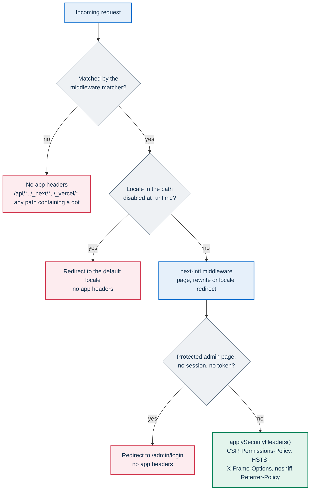
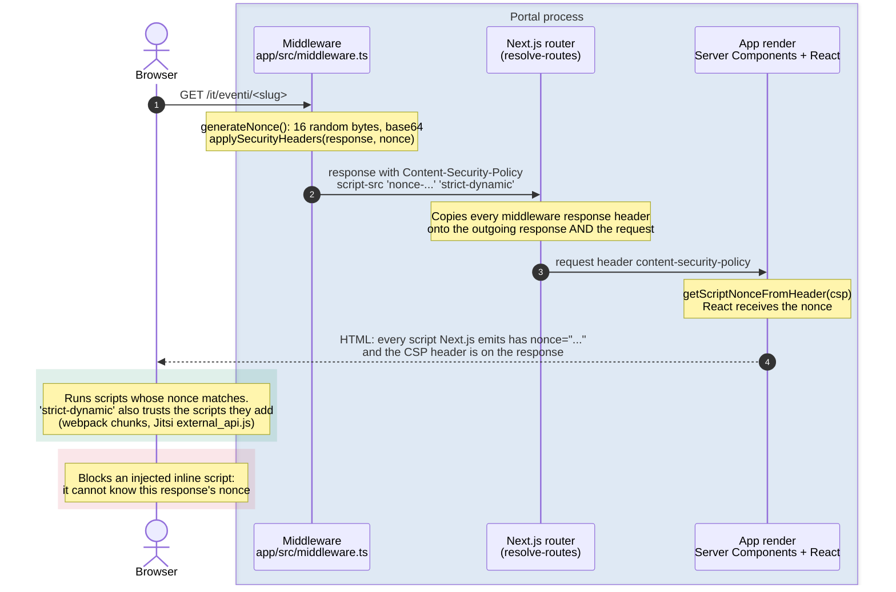
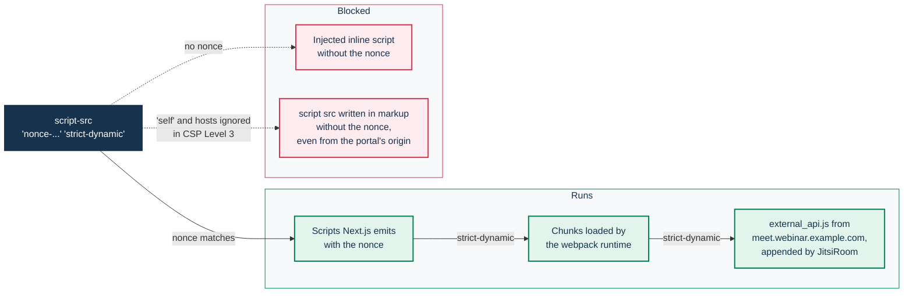

# Content Security Policy

This page covers the Content Security Policy (CSP) and the other security headers that PA Webinar puts
on its pages. It gives the exact policy, which responses carry it, why each directive has its current
value, how the per-request nonce reaches Next.js, which storage hosts the policy admits and how to
test a change. It is written for developers who touch the middleware, inline styles or third-party
embeds, and for security reviewers.

Everything described here is produced by `applySecurityHeaders()` in `app/src/middleware.ts`, with
the storage hosts from `storageCspHosts()` in `app/src/lib/storage/provider-type.ts`. The headers
are computed on every request. The conference host and the storage hosts come from environment
variables read at runtime, so changing them needs a restart, not a rebuild.

Related pages:

- [Security architecture](architecture/security.md) covers trust boundaries, sanitization and the
  other application controls.
- [Object storage](configuration/storage.md) covers provider settings. This page owns the mapping from
  storage settings to CSP hosts.
- [How PA Webinar extends Jitsi Meet](architecture/jitsi-integration.md) covers the conference iframe
  that the policy admits.
- [Security policy](../SECURITY.md) covers supply-chain controls and vulnerability reporting.

## Scope: which responses carry the headers

The headers come from the Next.js middleware, so they reach only the responses that the middleware
handles and then returns through `applySecurityHeaders()`.



- **Pages get every header.** The matcher in `app/src/middleware.ts` is
  `/((?!api|_next|_vercel|.*\..*).*)`. It covers every localized page, including the redirects and
  rewrites that next-intl produces.
- **API routes, build assets and static files get none.** This covers `/api/*`, `/_next/*`,
  `/_vercel/*` and any path with a dot, such as `/audio/…`, `/images/…` and `/robots.txt`. An API route
  that needs a header sets it itself. For example, `/api/assets/[...path]` sends
  `X-Content-Type-Options: nosniff` and forces a download for active document types (SVG, HTML,
  XHTML, XML) and for unknown binary content (see [Security architecture](architecture/security.md)).
- **The middleware's own redirects get none.** There are two: the redirect away from a locale
  that is disabled at runtime, and the redirect to `/admin/login`. Both have empty bodies.
- **HSTS is host-wide anyway.** Once a browser has received `Strict-Transport-Security` on a page, it
  applies it to every request to that host, including API and static paths. Before that first page
  load, HSTS can come only from the ingress or reverse proxy in front of the portal. With
  ingress-nginx, HSTS is a setting of the controller's ConfigMap (`hsts`, `hsts-max-age`,
  `hsts-include-subdomains`, `hsts-preload`), on by default for hosts with TLS. The `hsts*` keys in
  the chart's default ingress annotations (`infra/helm/pa-webinar/values.yaml`) are not
  ingress-nginx annotations and have no effect.
- **The ingress may replace the app's HSTS value.** When HSTS is on, ingress-nginx sets
  `Strict-Transport-Security` on TLS responses and overwrites the header the app sent. With the
  controller's defaults, the browser then receives `max-age=31536000; includeSubDomains` rather
  than the app's value (see [Companion headers](#companion-headers)). Check what a real
  installation sends; see [Testing CSP changes](#testing-csp-changes).
- **The Jitsi iframe has its own policy.** The conference page inside the iframe is served by the
  Jitsi web server on the conference host, so these headers do not govern it. The portal's policy
  only decides whether the portal may frame it, load its script and delegate devices to it.

Nonces also require dynamic rendering. The `[locale]` layout (`app/src/app/[locale]/layout.tsx`) reads
cookies, so every page under it renders per request and gets a fresh nonce. If a change made a page
static, for example by removing that cookie read and relying on `revalidate`, its cached HTML would
carry a stale nonce or none. The browser would then block its scripts and the page would never
hydrate.

## The policy

### Content-Security-Policy directives

Values as built by `applySecurityHeaders()`. `<jitsi-host>` is the runtime value of
`NEXT_PUBLIC_JITSI_DOMAIN`, read with `getPublicEnv()`: a host with an optional port, such as
`meet.webinar.example.com`. The default is `localhost:8443`, set in `app/src/lib/env.ts`.
`<recording-hosts>` and `<files-hosts>` are the storage lists described in
[Storage and media hosts](#storage-and-media-hosts). `media-src` and `connect-src` receive different
lists.

| Directive | Value | Why |
|---|---|---|
| `default-src` | `'self'` | Fallback for every fetch directive not listed below |
| `frame-ancestors` | `'none'` | No site can frame the portal: clickjacking protection. This also rules out embedding the portal in an intranet page |
| `frame-src` | `'self' https://<jitsi-host>` | Only the Jitsi IFrame API. The event page shows an ended event's `youtubeUrl` as an external link (**Watch the video on YouTube**) and never embeds a third-party player, so visitors' browsers do not contact YouTube unless they choose to |
| `script-src` | `'self' 'nonce-<nonce>' 'strict-dynamic' https: https://<jitsi-host>` | Per-request nonce plus `'strict-dynamic'`, with no `'unsafe-inline'`. See [What 'strict-dynamic' trusts](#what-strict-dynamic-trusts) |
| `style-src` | `'self' 'unsafe-inline'` | Deliberate trade-off. See [Why style-src keeps 'unsafe-inline'](#why-style-src-keeps-unsafe-inline) |
| `font-src` | `'self' data:` | Fonts are self-hosted (`app/src/styles/_fonts.scss`); `data:` covers fonts embedded in stylesheets |
| `img-src` | `'self' data: blob: https://i.ytimg.com` | Images come from the portal itself (uploads are served through `/api/assets`), from `data:` and `blob:` URLs built in the page, and from YouTube thumbnail URLs. No component builds an `i.ytimg.com` URL; the entry lets a pasted YouTube thumbnail render |
| `connect-src` | `'self' https://<jitsi-host> wss://<jitsi-host> <recording-hosts> <files-hosts>` | API calls and SSE streams on the portal origin, the conference host, recording storage, and the files-storage host (direct uploads to signed URLs) |
| `media-src` | `'self' blob: <recording-hosts>` | Waiting-room music from the portal, and recordings, subtitles and dubbed audio streamed from recording storage |
| `object-src` | `'none'` | No plugins |
| `base-uri` | `'self'` | A stray `<base href>` cannot redirect relative URLs |
| `form-action` | `'self'` | Forms can submit only to the portal |

The policy has no `report-uri` or `report-to`. A violation shows up only in the browser console of
the person who hits it.

### Differences in development

When `NODE_ENV` is not `production`, `script-src` also contains `'unsafe-eval'`. `next dev` needs it
for hot reload, React Refresh and webpack's eval-based modules. Without it the dev bundle never
hydrates. `NODE_ENV` is fixed at build time, and a production build (`next build`, the container
image, the default `docker compose up --build -d`) never contains `'unsafe-eval'`. The hot-reload
setups (`npm run dev`, or Compose with `docker-compose.dev.yml`) run `next dev` and do contain it.
Test policy changes against a production build.

### Companion headers

| Header | Value | Purpose |
|---|---|---|
| `Strict-Transport-Security` | `max-age=63072000; includeSubDomains; preload` | Two years of HTTPS-only access, including subdomains of the portal host. The `preload` token only signals consent: joining browsers' preload lists is a separate submission by the operator. An ingress that sets its own HSTS value replaces this one (see [Scope](#scope-which-responses-carry-the-headers)) |
| `X-Frame-Options` | `DENY` | Legacy counterpart of `frame-ancestors 'none'` for older browsers |
| `X-Content-Type-Options` | `nosniff` | Browsers do not guess a different content type |
| `Referrer-Policy` | `strict-origin-when-cross-origin` | Cross-origin requests (storage, the conference host) receive only the portal origin. A `?token=` in a page URL, such as a moderator link, does not leak through `Referer` |
| `Permissions-Policy` | `camera=(self "https://<jitsi-host>"), microphone=(self "https://<jitsi-host>"), display-capture=(self "https://<jitsi-host>"), geolocation=()` | See below |
| `x-nonce` | the request's nonce | Not used. See [How the nonce reaches Next.js](#how-the-nonce-reaches-nextjs) |

### Permissions-Policy and the conference iframe

The camera, microphone and screen capture are allowed in two places:

- **The portal's own origin (`self`).** The waiting room's device check and the square call
  `getUserMedia` from portal code.
- **The conference host.** A cross-origin iframe can use a device only when the top-level policy
  lists its origin and the iframe's `allow` attribute delegates the feature. The Jitsi IFrame API sets
  that attribute. With `camera=(self)` alone, the conference could not open the camera, whatever the
  iframe declared.

`geolocation=()` turns geolocation off for the page and every frame. Features the header does not
mention keep the browser's defaults and are delegated, or not, by the iframe's `allow` attribute.

## How the nonce reaches Next.js

The middleware never hands the nonce to Next.js directly. It builds the nonce into the
`Content-Security-Policy` response header. Next.js then copies every header the middleware set on
its response onto the request it is about to render, and reads the nonce back from that copy.



1. The middleware generates a nonce of 16 random bytes, base64-encoded, with `crypto.getRandomValues`.
2. `applySecurityHeaders()` writes it into `script-src` as `'nonce-<value>'` on the response.
3. The Next.js router copies the middleware's response headers onto the request as well as onto the
   outgoing response (`resolve-routes` in Next.js).
4. The App Router renderer reads `content-security-policy` from the request headers and extracts the
   nonce with `getScriptNonceFromHeader()`. It falls back to
   `content-security-policy-report-only` when the first header is absent.
5. React adds `nonce="…"` to every script Next.js emits: framework chunks, RSC payload chunks and
   hydration data.

This chain relies on Next.js internals rather than on a documented middleware API. Run the test plan
below after every Next.js upgrade.

**The `x-nonce` header is unused.** The middleware also creates a copy of the request headers with
`x-nonce` set, but never passes that copy on: `intlMiddleware(request)` receives the original request.
That copy is dead code. The middleware additionally sets `x-nonce` on the response. The router
mirrors it into the request, so `headers().get('x-nonce')` would return the nonce in a Server
Component, and it also reaches the browser as a response header. No code reads it. The browser gains
nothing from it, since the nonce already appears in the HTML. The comments around `generateNonce()`
describe the dead request copy as the mechanism. The actual mechanism is the CSP header.

### What 'strict-dynamic' trusts



- **In browsers that support CSP Level 3**, which is every current browser, `'strict-dynamic'`
  makes the browser ignore `'self'`, `https:` and host entries in `script-src`. Trust starts from the
  nonce and passes to any script that a trusted script creates at runtime. The Jitsi IFrame API is
  loaded this way: `JitsiRoom` (`app/src/components/jitsi/jitsi-room.tsx`) appends a
  `<script src="https://<jitsi-host>/external_api.js">` element from bundle code.
- **In browsers that support nonces but not `'strict-dynamic'`** (CSP Level 2), the nonce still works,
  while `'self'` and the bare `https:` let the bundle's chunks and the Jitsi script load. `https:` is
  the fallback that keeps those browsers working. It also makes the explicit `https://<jitsi-host>`
  entry redundant, since that entry would matter only if `https:` were removed.
- **An attacker who finds an HTML injection point cannot run a script.** An injected
  `<script>…</script>` or `<script src>` has no valid nonce, and the nonce changes on every response.
  `'unsafe-inline'` is deliberately absent. Browsers would ignore it next to a nonce anyway.
- **Data blocks are not scripts.** The event page's `<script type="application/ld+json">`
  (structured data, in `app/src/app/[locale]/events/[slug]/page.tsx`) is never executed, so
  `script-src` does not apply to it.

Rules for code that adds scripts:

- Load third-party scripts from client code (`document.createElement('script')`), as `JitsiRoom`
  does, so `'strict-dynamic'` covers them.
- A `<script>` written into server-rendered markup needs the nonce. Read it from
  `headers().get('content-security-policy')`, or from `x-nonce` through the mirroring described
  above. Without the nonce it is blocked, even from the portal's own origin.
- Never add `'unsafe-inline'` or `'unsafe-eval'` to the production `script-src`.

## Why style-src keeps 'unsafe-inline'

Server-rendered HTML carries every React `style={{…}}` prop as a `style="…"` attribute. CSP treats
style attributes as inline styles, allowed only by `'unsafe-inline'` or by `'unsafe-hashes'` with one
hash per exact attribute value. Without `'unsafe-inline'`, the browser drops those attributes when it
parses the page. Hydration does not re-apply them, so the layout breaks.

Inline styles come from four sources:

- **Application components.** To see where they are, run
  `grep -rn 'style={{' app/src --include='*.tsx'`, or `grep -rl` for just the file names. Many values
  are computed at render time, such as widths, transforms and colors, so hashes cannot cover them.
- **design-react-kit components.** Several of them render `style` props internally.
- **`<style>` elements.** The `[locale]` layout injects the brand color from site settings as a
  `<style>` block. That value is validated as a `#RRGGBB` hex color in
  `app/src/lib/validation/site-settings.ts`. A few components render their own `<style>` blocks.
- **Scripts that set styles.** When a script sets a style through the CSSOM, such as
  `element.style.x = …`, CSP does not restrict it. This is why client-side libraries that animate with
  inline styles work either way.

Do not add a nonce or a hash to `style-src` while style attributes remain. When a nonce or hash is
present, browsers ignore `'unsafe-inline'`, and every style attribute would be dropped. A style nonce
only ever applies to `<style>` elements, never to attributes.

### Migration paths

Removing `'unsafe-inline'` from `style-src` means that no server-rendered markup may contain a
`style` attribute, including markup rendered by the design system. The feasible path, in order:

1. **Static values become classes.** Replace constant `style={{…}}` props with Bootstrap Italia
   utilities or classes in the application stylesheets. The project's code conventions exclude
   CSS-in-JS (see [Extending PA Webinar](development/extending.md)). Stylesheet-generating CSS-in-JS
   libraries are therefore not an option.
2. **Dynamic values move to the CSSOM.** Set them from client code after mount, for example
   `ref.current.style.setProperty('--progress', value)` in an effect, and read the custom property from
   a class. A `style={{ '--x': value }}` bridge does not help, because it is still a style attribute.
3. **Design-system components that render `style` props** need wrapping, replacing or an upstream
   change.
4. **`<style>` elements** move to stylesheets or receive the nonce.
5. **Trial first.** Add a `Content-Security-Policy-Report-Only` header without `'unsafe-inline'` next
   to the enforced policy, walk the test plan and read the console. Keep the enforced header named
   `Content-Security-Policy`: Next.js takes the nonce from it first.
6. **Switch.** Drop `'unsafe-inline'`, optionally add `'nonce-<nonce>'` to `style-src`, and update
   the comment in `applySecurityHeaders()` and this page in the same change.

## Storage and media hosts

The policy admits storage hosts for three kinds of direct browser traffic:

- **Playback.** The recording player, the subtitle and dubbed-audio tracks and the transcript editor
  request a portal URL, for example `/api/events/<slug>/recording`,
  `/api/events/<slug>/postprod/dubbed-audio/<lang>` or
  `/api/admin/postprod/recordings/<id>/media`. That URL answers with a 302 to a short-lived signed
  URL on the storage host. The subtitle route serves cached WebVTT text itself and otherwise
  redirects too. CSP checks every hop of a redirect, so the storage host must be in `media-src` even
  though the element's `src` is on the portal's origin. The per-participant track player gets signed
  storage URLs straight from its API.
- **Recording upload.** The manual upload of a recording (`/admin/publications/new`, or the upload
  in the recording section of an event's management page, **Upload an existing recording**) sends
  the file straight to storage with signed URLs: Azure block upload, or a single or multipart PUT
  on S3-compatible storage (`app/src/lib/storage/browser-upload.ts`). The storage host must
  therefore also be in `connect-src`. On S3, the bucket's CORS must also allow PUT from the portal
  origin; see [Object storage](configuration/storage.md).
- **Signed upload to the files domain.** `POST /api/events/<id>/files` (moderator token) returns a
  signed `uploadUrl` and the `uploadHeaders` to send with it, and the caller PUTs the file straight
  to files storage. The files-domain host is added to `connect-src` only, for this PUT. No page
  mounts the component that performs it (`app/src/components/admin/file-management.tsx`): the
  event's materials page uploads through the portal, as described below.

Pages never read the files domain (materials, branding assets, chat attachments) directly. They
read it only through `/api/assets` on the portal's origin. The administration area's asset upload
(`/api/admin/assets/upload-url`), which the materials page also uses, and chat attachments go
through the portal. The files domain therefore never appears in `media-src` or `img-src`. See
[Object storage](configuration/storage.md) for the two domains.

### Hosts the policy derives

`storageCspHosts()` builds both lists on every request. It resolves each domain's provider with
`resolveProviderType()` in `app/src/lib/storage/provider-type.ts`, the same rule the storage
factory in `app/src/lib/storage/index.ts` uses, so the policy admits the host the app signs URLs
for. `<recording-hosts>` goes into `media-src` and `connect-src`; `<files-hosts>` goes into
`connect-src` only.

Recording hosts, by resolved provider:

| Recordings provider | Host the CSP adds |
|---|---|
| Azure Blob: `RECORDING_STORAGE_TYPE` is `azure-blob` or `azure`, or it is unset and `RECORDING_AZURE_CONNECTION_STRING` is set | `https://<storage-account>.blob.core.windows.net`, from `AccountName=` in `RECORDING_AZURE_CONNECTION_STRING` |
| S3 client: `RECORDING_STORAGE_TYPE` is `s3`, `minio` or `gcs`, or it is unset and `RECORDING_S3_BUCKET` is set, with `RECORDING_S3_ENDPOINT` | the endpoint's origin |
| The same, without an endpoint | `https://*.amazonaws.com` |
| `gcs`, in addition to the row that applies above | `https://storage.googleapis.com` |
| Nothing configured | none |

Details of the rule:

- **Other values fall back to auto-detection.** A `RECORDING_STORAGE_TYPE` outside the list above,
  such as `local`, is not a provider: the provider is detected from the credentials, as when the
  variable is unset.
- **The host follows the settings, not a working provider.** An explicit type derives its host
  even when the credentials are incomplete and the factory builds no provider. For example,
  `RECORDING_STORAGE_TYPE: "s3"` alone adds `https://*.amazonaws.com`.
- **An endpoint that is not a valid URL adds nothing.** The provider would not start either.

Files hosts follow the same pattern for the files domain. The provider comes from
`STORAGE_FILES_PROVIDER` (`azure` or `s3`), or else from `AZURE_STORAGE_CONNECTION_STRING`, or else
from `STORAGE_FILES_S3_BUCKET`. The host is the account from `AZURE_STORAGE_CONNECTION_STRING`, the
origin of `STORAGE_FILES_S3_ENDPOINT`, or `https://*.amazonaws.com` when an S3 provider has no
endpoint.

Two cases still derive the wrong host:

- **An Azure connection string with `BlobEndpoint=`** (a custom domain or an emulator) or with an
  `EndpointSuffix` other than `core.windows.net`. The provider uses that endpoint, but the CSP still
  adds `https://<storage-account>.blob.core.windows.net`.
- **A CDN or custom domain in front of the bucket.** The signed URLs point at it, but the CSP derives
  the bucket's host.

The gap is invisible until playback. The video stays black or the upload fails, and the console shows
a `media-src` or `connect-src` violation.

### RECORDING_MEDIA_CSP_HOSTS

`RECORDING_MEDIA_CSP_HOSTS` is a space-separated list of origins that `storageCspHosts()` appends to
`<recording-hosts>` in every case. Set it when the derived host is wrong, as with a custom Azure
endpoint or a CDN:

```yaml
app:
  env:
    RECORDING_STORAGE_TYPE: "minio"
    RECORDING_MEDIA_CSP_HOSTS: "https://media.webinar.example.com"
```

- **Scope.** It extends `media-src` and `connect-src` only, never `img-src` or `frame-src`.
- **It only adds.** It cannot remove a derived host.
- **Values are copied into the header verbatim.** List origins only: scheme, host and optional port,
  such as `https://minio.example.com:9000`. A `;` in the value would start a new directive, and a
  bare `https:` would admit every host.

The variable is listed with the other recording settings in the
[Configuration reference](CONFIGURATION.md).

### Images and audio from other hosts

`img-src` has no configuration point. An image URL pasted into an admin form instead of an upload,
such as a logo on an organization's website, is saved but blocked when the page renders. Audio pasted
as a URL plays only if its host is in `media-src`, which `RECORDING_MEDIA_CSP_HOSTS` can extend.
Uploading the file is the reliable choice. See [Branding and white-labeling](configuration/branding.md).

## Changing the policy

- Edit `applySecurityHeaders()` in `app/src/middleware.ts`, or `storageCspHosts()` in
  `app/src/lib/storage/provider-type.ts` for storage hosts. Keep their comments and this page in
  step, in the same change.
- **A new third-party embed** needs `frame-src`. If it uses the camera, microphone or screen, it
  also needs its origin in `Permissions-Policy`.
- **A new browser-side call to another origin** needs `connect-src`. Prefer routing it through a
  portal API route, as the Gravatar lookup (`/api/avatar`) and files (`/api/assets`) are routed. That
  keeps the policy narrow and keeps personal data away from third parties.
- **A new storage provider or URL shape** needs a matching branch in `domainHosts()`
  (`app/src/lib/storage/provider-type.ts`) and a case in `provider-type.test.ts`, or a documented
  `RECORDING_MEDIA_CSP_HOSTS` value.
- Treat a policy change as a non-trivial change: it goes through code review and the manual test plan
  below. See [How we develop PA Webinar](development/methodology.md).

## Testing CSP changes

No unit test covers the header assembly in the middleware. Storage-host derivation is covered by
`app/src/lib/storage/provider-type.test.ts`. The E2E smoke job in `.github/workflows/ci.yml` runs Playwright
against the Compose stack built for production. It does not listen for CSP violations, and it is
non-blocking (`continue-on-error: true`). A policy that stops hydration will probably turn it red,
but a red E2E job does not block a merge. The manual plan is the gate. See
[Testing](development/testing.md) for the test layers.

1. Start a production build: `docker compose up --build -d` from the repository root (see
   [Local development](DEVELOPMENT.md)). The hot-reload server serves a different policy.
2. Check the headers on a page:

   ```bash
   curl -s -D - -o /dev/null http://localhost:3000/it \
     | grep -iE 'content-security-policy|permissions-policy|strict-transport-security'
   ```

3. On an installation behind its ingress or reverse proxy, check which HSTS value the browser
   actually receives, since the ingress may replace the app's value:

   ```bash
   curl -sI https://webinar.example.com/it | grep -i strict-transport
   ```

4. Open each page below with the browser's developer tools open. Watch the Console and, in
   Chromium-based browsers, the Issues panel. A violation reads like "Refused to execute inline
   script…", "Refused to load media from…", "Refused to frame…" or "Refused to connect to…", and it
   names the directive.
5. If a violation appears, either widen the directive for that exact origin or change the code that
   triggers it. Do not widen a directive to a scheme or a wildcard.

The default locale is Italian, and URLs are localized through `app/src/i18n/routing.ts`. Check at
least the Italian and the English form of each page.

| Page | Italian URL | English URL | What it exercises |
|---|---|---|---|
| Home | `/it` | `/en` | Nonced Next.js scripts, self-hosted fonts, the brand-color `<style>` block (set a non-default primary color in site settings first: with the default `#0066CC`, the block is not rendered) |
| Event page of an ended event | `/it/eventi/<slug>` | `/en/events/<slug>` | `media-src` through the 302 to storage, subtitle and dubbed-audio tracks, the external YouTube link when `youtubeUrl` is set (no frame, and no request to YouTube until it is clicked), the JSON-LD block |
| Password-protected event | `/it/eventi/<slug>/password` | `/en/events/<slug>/password` | Password check through `fetch`, `connect-src 'self'` |
| Registration | `/it/eventi/<slug>/registrazione` | `/en/events/<slug>/registration` | Form submission through the API, `connect-src 'self'` |
| Live room, waiting room | `/it/eventi/<slug>/live` | `/en/events/<slug>/live` | Device check (camera and microphone on the portal's origin), waiting-room music, the square |
| Live room, after joining | same page | same page | `external_api.js` through `'strict-dynamic'`, the Jitsi `frame-src`, camera, microphone and screen-sharing delegation |
| Staff sign-in and event wizard | `/it/admin/login`, `/it/admin/eventi/nuovo` | `/en/admin/login`, `/en/admin/events/new` | design-react-kit inline styles |
| Manual recording upload | `/it/admin/pubblicazioni/nuova`, `/it/admin/eventi/<id>` (recording section) | `/en/admin/publications/new`, `/en/admin/events/<id>` (recording section) | `connect-src` to storage |
| Transcript editor | `/it/admin/post-produzione/<recordingId>` | `/en/admin/postprod/<recordingId>` | `media-src` to storage through the 302 |
| Video library | `/it/video-library` | `/en/video-library` | Public recordings |
| Data-subject self-service | `/it/privacy/i-miei-dati`, `/it/privacy/i-miei-dati/cancellazione` | `/en/privacy/my-data`, `/en/privacy/my-data/erasure` | Forms and API calls |

The rows that involve storage need a configured recordings domain. The local Compose stack has
none. Run those rows on a test installation, or point the local app at a bucket.

## Known limitations

- **`style-src` allows `'unsafe-inline'`.** CSS injection through an HTML injection point stays
  possible. See [Migration paths](#migration-paths).
- **Violations are not reported.** Without `report-uri` or `report-to`, the operator never sees a
  violation that a user hits.
- **`https:` in `script-src` is a wide fallback.** Browsers that honor `'strict-dynamic'` ignore it.
  Older CSP Level 2 browsers accept any HTTPS script.
- **Storage hosts come from the Azure account name or the S3 endpoint only.** A custom Azure
  `BlobEndpoint` or `EndpointSuffix`, or a CDN, needs `RECORDING_MEDIA_CSP_HOSTS`.
- **`https://*.amazonaws.com` admits every S3 bucket**, not only the installation's. Any S3-family
  type without an endpoint (`s3`, `minio` or `gcs`, or an auto-detected S3 provider) adds it.
- **`connect-src` admits the files-storage host for a direct upload that no page performs.** See
  [Storage and media hosts](#storage-and-media-hosts).
- **`img-src` cannot be extended by configuration**, so images from other hosts are always blocked.
- **`img-src` still admits `https://i.ytimg.com`.** No component builds a URL on that host, and it is
  the only third-party host in `img-src`. The privacy view of external resources is in
  [Privacy and data protection](GDPR.md).
- **API routes and static files carry no headers from the middleware.**
- **The `x-nonce` header is unused**, and the request-header copy that sets it is dead code.
