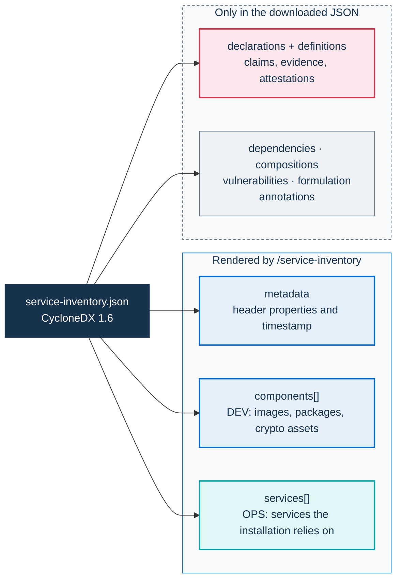
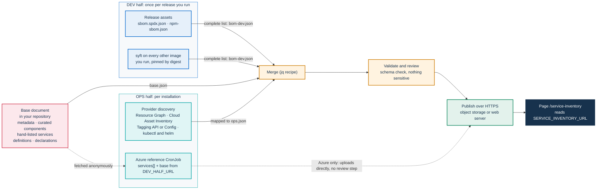

# Service inventory: generating the document

The `/service-inventory` page renders one CycloneDX 1.6 document per installation. This page explains how to produce that document: what goes into each part, where the data comes from, how to merge and review it, and how often to regenerate it. Hosting the document, how the portal resolves `SERVICE_INVENTORY_URL`, the rendering contract and validation are covered in [Service inventory: publishing](SERVICE-INVENTORY.md).

Every installation writes its own document. The application's part of the software half is the same for everyone who runs a given release; the other images depend on how the installation is configured. The services, providers, regions and declarations describe one deployment run for one public administration (PA), and only the operator of that installation can state them.

**Audience:** platform engineers who automate the inventory, and compliance staff who add declarations.

## The document model

The document is plain [CycloneDX 1.6](https://cyclonedx.org/docs/1.6/json/) JSON. It has three parts:

| Part | CycloneDX fields | What it describes | Changes when | Produced from |
|---|---|---|---|---|
| DEV half | `components[]`, `dependencies[]` | The software the installation runs: container images, packages, cryptographic assets | You deploy another release or image | Release SBOMs and `syft` |
| OPS half | `services[]` | The services the installation relies on: cluster, database, object storage, SMTP relay, DNS, certificate authority | The installation is reconfigured or changes provider | Provider discovery and a manual list |
| PA enrichments | `declarations`, `definitions`, `compositions[]`, `vulnerabilities[]`, `formulation[]`, `annotations[]` | Conformance claims with evidence, completeness statements, vulnerability statements, build and deployment provenance, notes | The evidence changes | Written by the operator |

`metadata` identifies the installation. `metadata.component` names the deployed application and its version. `metadata.manufacturer` names the operator. `metadata.properties` carries the header values that the page displays.

The page renders only part of the document:



The page renders the header properties, `components[]`, `services[]` and the items tagged `pa-webinar:layer`; everything else reaches readers only in the raw JSON, through the **Download raw JSON** link. Which fields each block shows, and which values turn on the service badges, is set out in [Rendering contract](SERVICE-INVENTORY.md#rendering-contract).

### Where an item belongs

| You want to record | Put it in | Notes |
|---|---|---|
| A container image or package the installation runs | `components[]`, type `container`, `library` or `framework` | Identify images by digest (see [Cover every other image you run](#cover-every-other-image-you-run)) |
| A service that a provider runs for you: managed cluster, database, storage, SMTP relay, DNS | `services[]` | Name the provider's legal entity in `provider.name` |
| A service your own team runs outside the portal images, such as an on-premises database or a backup system | `services[]` | Your organization is the provider. This keeps the OPS view complete |
| A TLS certificate or an encryption key | `components[]`, type `cryptographic-asset` | CycloneDX 1.6 models cryptographic material as components |
| A model that AI post-production loads | `components[]`, type `machine-learning-model` | See [What no API finds](#what-no-api-finds) for where the weights come from |
| A statement about how the installation is operated | `declarations.claims[]` | It needs evidence and an assessor ([PA declarations](#pa-declarations)) |
| How the installation was built and deployed: chart version, pipeline | `formulation[]` | Optional |

## The DEV half: software components

### Start from the release assets

Each `v<version>` tag runs `.github/workflows/release.yml`, which attaches two SBOMs to the GitHub release:

| Asset | Format | Covers | Generated by |
|---|---|---|---|
| `sbom.spdx.json` | SPDX JSON | The published application image `ghcr.io/italia/pa-webinar:<version>`, operating-system packages included | Syft, through `anchore/sbom-action` |
| `npm-sbom.json` | CycloneDX JSON | The npm dependency tree of the `app` workspace | `@cyclonedx/cyclonedx-npm` |

The npm step may fail without failing the release, so check that the asset exists. The SPDX asset is also what the **SBOM** viewer on `/changelog` reads ([Security policy](../SECURITY.md#release-artifacts-and-sboms)).

Download both assets for the release you deploy, which is not necessarily the latest one. Then convert the image SBOM, because the inventory is CycloneDX:

```bash
gh release download v<version> --repo italia/pa-webinar \
  --pattern sbom.spdx.json --pattern npm-sbom.json

syft convert sbom.spdx.json -o cyclonedx-json=image-app.cdx.json
```

Keep two details in mind:

- **Development dependencies.** The release step runs `cyclonedx-npm` without `--omit dev`. To list only production dependencies, check out the tag, run `npm ci`, then run `npx @cyclonedx/cyclonedx-npm --workspace app --omit dev --output-file npm-sbom.json`.
- **Licenses.** On a container image, Syft reports many licenses as `NOASSERTION`. The npm SBOM carries the license that each npm package declares. The project's own license report, `license-report.json`, lists every npm package in the workspace tree, development tools included, with its declared license ([Third-party licenses](../THIRD-PARTY-LICENSES.md)).

### Cover every other image you run

The release SBOMs cover only the application image. An installation runs more images, for example:

- the migration image, which the `db-migrate` initContainer uses;
- the Jitsi images, including the patched `jitsi/web` image if you use it, and coturn;
- the database and Redis images, when they run in the cluster;
- the images of the scheduled jobs: a `curl` image for the application's cron jobs and for the post-production reclaim and retention jobs, and a `kubectl` image for the JVB scaler, the post-production orchestrator and the config-reload hook (`cronjobs.*.image`, `postprod.*.image`, `jvbScaler.image`, `configReloadHook.image` and `kubectlImage` in `infra/helm/pa-webinar/values.yaml`);
- when their features are on, the recorder bot, the recorder controller and the AI post-production worker. These three are built only from the development branch, as `:dev` and `:dev-<sha>` ([CI, images and releases](development/ci-and-release.md)).

Several of these run only some of the time: the bridge has no pod while it is scaled to zero, and the recorder bot and the AI worker run as Jobs created from suspended CronJob templates. Use two sources, so that the list does not depend on when you take it.

**What the release declares.** The release's rendered manifest lists every image reference, including those of workloads that are not running. Helm keeps hooks apart from the manifest, so read both:

```bash
{ helm get manifest <release> -n <namespace>; helm get hooks <release> -n <namespace>; } \
  | grep -E '^[[:space:]-]*image:' \
  | sed -E 's/^[[:space:]-]*image:[[:space:]]*//; s/"//g' \
  | sort -u
```

These references are written as the values set them, usually by tag. Resolve each tag to a digest with `docker buildx imagetools inspect <image>`, or pin the images by digest in your values so that the reference already is one.

**What is running now.** The pod status gives the digest that each running container actually uses:

```bash
kubectl -n <namespace> get pods -o json \
  | jq -r '.items[].status
      | (.initContainerStatuses // []) + (.containerStatuses // [])
      | .[] | "\(.image)\t\(.imageID)"' \
  | sort -u
```

`imageID` holds `<registry>/<repository>@sha256:<digest>`. If your runtime prefixes it, for example with `docker-pullable://`, remove the prefix. On its own, this snapshot is incomplete: taken while the bridge is scaled to zero, or while no recording or post-production Job is running, it misses those images. On k3s, including a single-VM installation, both commands work as they are.

Neither source lists workloads deployed outside the release, such as the vLLM Deployment that AI post-production can use ([AI post-production](POSTPROD.md)). Add those by hand.

Record each image by digest. Tags can move, but a digest cannot. Then generate one SBOM per image:

```bash
syft <registry>/<repository>@sha256:<digest> -o cyclonedx-json=image-<image-name>.cdx.json
```

If the registry requires authentication, run `docker login <registry>` first. Syft reuses the Docker credentials.

### A curated or a complete component list

Decide this before you merge anything. A complete image SBOM lists every operating-system and language package in the image. The page renders one table row per component, so a complete list makes a long page and a large document, which can exceed the portal's fetch-cache limit or the 1 MiB ConfigMap limit ([Remote URLs](SERVICE-INVENTORY.md#remote-urls), [ConfigMap in the cluster](SERVICE-INVENTORY.md#configmap-in-the-cluster)).

For most installations, a curated list reads better:

- In the base document's `components[]`, list the images, identified by digest and tagged with `pa-webinar:layer`, plus any framework or cryptographic asset worth naming.
- Link each image's full SBOM through an `externalReferences` entry of type `bom`.
- Declare the list as partial with a `compositions[]` entry whose `aggregate` is `incomplete`.

```json
{
  "bom-ref": "pkg:oci/pa-webinar@sha256%3A<digest>",
  "type": "container",
  "name": "pa-webinar",
  "version": "<version>",
  "purl": "pkg:oci/pa-webinar@sha256%3A<digest>?repository_url=ghcr.io/italia/pa-webinar&tag=<version>",
  "licenses": [{ "license": { "id": "EUPL-1.2" } }],
  "externalReferences": [
    {
      "type": "bom",
      "url": "https://github.com/italia/pa-webinar/releases/download/v<version>/sbom.spdx.json"
    }
  ],
  "properties": [
    { "name": "pa-webinar:layer", "value": "app" },
    { "name": "pa-webinar:stack-label", "value": "PA Webinar portal" }
  ]
}
```

On the curated path, the SBOMs stay where they are and are only linked: skip the merge below, and pass an empty document (`echo '{}' > bom-dev.json`) as the DEV input of [Assemble the document](#assemble-the-document).

### Merge the DEV sources

This step applies to the complete path. Combine the CycloneDX files into one DEV half. The recipe below deduplicates components by `bom-ref`, or by `name@version` when a component has no `bom-ref`. It deduplicates dependency entries by `ref`. When two files share a key, the entry from the earlier file wins.

```bash
jq -s '
  reduce .[1:][] as $bom (.[0];
      .components   = ((.components   // []) + ($bom.components   // [])
                       | unique_by(.["bom-ref"] // "\(.name)@\(.version // "")"))
    | .dependencies = ((.dependencies // []) + ($bom.dependencies // [])
                       | unique_by(.ref)))
' npm-sbom.json image-*.cdx.json > bom-dev.json
```

The CycloneDX CLI can also merge files, with its own rules: `cyclonedx merge --input-files <files> --output-file bom-dev.json`.

Nothing merges the DEV half into the inventory for you. The release publishes SBOMs, and the Azure reference automation expects a finished base document at a URL ([The Azure reference automation](#the-azure-reference-automation)).

## The OPS half: operational services

Use the provider's own inventory as the source of truth. Never copy another operator's values. Each recipe below produces raw JSON that you then map to `services[]` ([Mapping a service to `services[]`](#mapping-a-service-to-services)). Choosing a provider and sizing the platform are covered in [Installing PA Webinar](install/README.md).

### Azure

Azure Resource Graph lists a subscription's resources in one query. It needs the `Reader` role on the subscription or on the resource group.

```bash
az graph query -q "
  Resources
  | where subscriptionId == '<subscription-id>'
  | where resourceGroup =~ '<resource-group>'
  | project name, type, location, kind, sku, properties, id
" --first 1000 -o json > azure-resources.json
```

One call returns at most 1,000 resources. For a larger scope, repeat the query with `--skip-token <token>`, taken from the `skip_token` field of the previous result, until no token is returned.

The resource types that usually matter:

- `microsoft.containerservice/managedclusters` (AKS)
- `microsoft.dbforpostgresql/flexibleservers`
- `microsoft.storage/storageaccounts`
- `microsoft.cache/redis`
- `microsoft.keyvault/vaults`
- `microsoft.network/dnszones`, `microsoft.network/privatednszones`, `microsoft.network/publicipaddresses`
- `microsoft.operationalinsights/workspaces` (Log Analytics), `microsoft.insights/components` (Application Insights)
- `microsoft.containerregistry/registries`

AKS keeps the cluster's load balancers, public IP addresses and disks in a separate node resource group. To include them, query that group as well. `az aks show -g <resource-group> -n <cluster> --query nodeResourceGroup -o tsv` returns its name.

### The Azure reference automation

`infra/service-inventory/azure/` holds a reference implementation of the OPS half for Azure. Its [README](../infra/service-inventory/azure/README.md) owns the setup, what the job publishes and its limits. The folder contains two pieces:

- `scripts/azure-to-cyclonedx.py` queries Resource Graph for one subscription and one resource group, following pagination. It turns every resource whose type matches an entry of `TYPE_MAPPERS` into a service tagged with `pa-webinar:layer`, and lists the skipped types on standard error. It writes `services` plus installation-level `properties`.
- `cronjob.yaml` holds a ConfigMap for the script, a ServiceAccount for Azure Workload Identity and a daily CronJob. The CronJob runs the script, downloads your base document from `DEV_HALF_URL`, merges the generated services into it and uploads the result to a Blob container.

In short, before you publish its output:

- **It publishes Azure identifiers:** resource IDs, which contain the subscription ID and the resource group, and the subscription ID and resource group in the header ([What gets published](../infra/service-inventory/azure/README.md#what-gets-published)).
- **It fills fixed values in every service,** such as `authenticated` and `x-trust-boundary`. Review them before the first publication (same section).
- **Its merge replaces `services[]` wholesale** and overwrites the header's `pa-webinar:tenant` and `pa-webinar:cloud-provider`, so services listed by hand in the base disappear at every run ([What the merge keeps and replaces](../infra/service-inventory/azure/README.md#what-the-merge-keeps-and-replaces)).
- **It ships placeholders.** `SUBSCRIPTION_ID`, `RESOURCE_GROUP`, `TENANT_NAME`, `BLOB_ACCOUNT`, `DEV_HALF_URL` and the ServiceAccount's `azure.workload.identity/client-id` annotation ship as `REPLACE_WITH_*` values, and `BLOB_NAME` is derived from `TENANT_NAME`. Point `DEV_HALF_URL` at your own base document, at a fixed version rather than a moving branch. The manifest needs further edits and a set apply order before its first run ([Edit your copy of the manifest](../infra/service-inventory/azure/README.md#4-edit-your-copy-of-the-manifest), [Apply the manifest, then load the script](../infra/service-inventory/azure/README.md#5-apply-the-manifest-then-load-the-script)).

### Google Cloud

Cloud Asset Inventory searches a project's resources. It needs `roles/cloudasset.viewer`.

```bash
gcloud asset search-all-resources \
  --scope=projects/<project> \
  --asset-types='container.googleapis.com/Cluster,sqladmin.googleapis.com/Instance,storage.googleapis.com/Bucket,redis.googleapis.com/Instance,dns.googleapis.com/ManagedZone,compute.googleapis.com/Address' \
  --format=json > gcp-resources.json
```

For a complete point-in-time snapshot, `gcloud asset export` writes the full inventory to a Cloud Storage bucket. Map each result's `assetType` to `group` and to a resource-type property, and map `location` to a region property. [Mapping a service to `services[]`](#mapping-a-service-to-services) has a worked example.

### AWS

No single AWS API covers everything. There are two options:

- **The Resource Groups Tagging API.** It is simple and works per region. It finds only resources that carry, or once carried, tags, so it depends on disciplined tagging. It needs `tag:GetResources`.

  ```bash
  aws resourcegroupstaggingapi get-resources \
    --tag-filters Key=<tag-key>,Values=<tag-value> \
    --region <region> --output json > aws-tagged.json
  ```

- **AWS Config advanced queries.** They are complete for the recorded resource types, but they need AWS Config enabled, which is billed separately. Use `select-resource-config` (`config:SelectResourceConfig`) for one account, or `select-aggregate-resource-config` with an aggregator for several accounts.

  ```bash
  aws configservice select-resource-config \
    --expression "SELECT resourceId, resourceName, resourceType, awsRegion WHERE resourceType = 'AWS::RDS::DBInstance'" \
    --output json
  ```

Per-service commands add the details that inventories leave out: `aws eks describe-cluster --name <cluster>`, `aws rds describe-db-instances`, `aws s3api get-bucket-encryption --bucket <bucket>`.

### Self-hosted and on-premises

No cloud API exists here. Build the inventory from the cluster itself and from a manual list:

```bash
kubectl version -o json                                      > k8s-version.json
kubectl get nodes -o wide                                    > k8s-nodes.txt
kubectl get deployments,statefulsets,daemonsets,cronjobs -A -o json > k8s-workloads.json
kubectl get services,ingresses -A -o json                    > k8s-endpoints.json
helm list -A -o json                                         > helm-releases.json
kubectl get certificates,clusterissuers -A -o json           > certificates.json   # cert-manager only
```

`helm get values <release> -n <namespace>` shows how a release is configured. Values usually contain credentials, so read them and never publish them.

### What no API finds

Some services sit outside every inventory API, whatever the platform. Add them by hand to the base document:

- **The SMTP relay.** It receives addresses, names and personal links in clear, so it is a processor of personal data ([Email delivery (SMTP)](configuration/email.md)).
- **DNS.** Record the DNS provider and the domain registrar.
- **The TLS certificate authority,** for example an ACME provider.
- **External object storage,** when it is not in the discovered scope ([Object storage](configuration/storage.md)).
- **The container registry** the images are pulled from.
- **Backups and their location.**
- **External monitoring** and uptime checks.
- **TURN servers** that run outside the cluster.

AI post-production processes recordings inside the cluster and sends no data to external APIs ([AI post-production](POSTPROD.md)). Its images and models belong in the DEV half, and the GPU node pool is part of the cluster service. Its model weights, however, are downloaded from a public model hub when the models volume is prepared, so list that hub as a supplier.

## Mapping a service to `services[]`

Every service becomes one CycloneDX `service` object. This skeleton validates against the CycloneDX 1.6 schema:

```json
{
  "bom-ref": "svc:<provider>/<kind>/<instance>",
  "provider": { "name": "<provider legal entity>", "url": ["https://<provider-website>"] },
  "group": "<provider service family>",
  "name": "<service name>",
  "version": "<version, when it means something>",
  "description": "<one sentence: what this installation uses the service for>",
  "endpoints": ["https://<endpoint>"],
  "authenticated": true,
  "x-trust-boundary": true,
  "data": [
    {
      "flow": "bi-directional",
      "classification": "personal-data",
      "description": "<which personal data the service holds, and the legal basis>"
    }
  ],
  "externalReferences": [
    { "type": "documentation", "url": "https://<data-processing-agreement>" }
  ],
  "properties": [
    { "name": "<provider>:resource-type", "value": "<provider resource type>" },
    { "name": "<provider>:region", "value": "<location>" },
    { "name": "pa-webinar:layer", "value": "data" },
    { "name": "pa-webinar:stack-label", "value": "<short label>" }
  ]
}
```

| Field | Convention |
|---|---|
| `bom-ref` | Stable and unique within the document, so that claims and dependencies can point to it across regenerations. The Azure generator derives it from the resource ID |
| `provider.name` | The legal entity you have a contract with, the same entity named in the data processing agreement |
| `data[]` | `flow` is one of `inbound`, `outbound`, `bi-directional` or `unknown`. Use `personal-data` for services that hold registrations, email addresses or chat, and `recording` for recording storage. These two values turn on the page's badges ([Privacy and data protection](GDPR.md), [Recordings, voice data and AI outputs](privacy/recordings-and-ai.md)) |
| `x-trust-boundary` | `true` when data leaves your administrative control, which is the case for any third-party service |
| `externalReferences` | Link the data processing agreement, the provider's certification pages and the service documentation |
| `<provider>:*` properties | Use a provider prefix (`azure:`, `gcp:`, `aws:`, `onprem:`) for raw facts such as the region, SKU, TLS minimum version or SLA |
| `pa-webinar:layer` | One of `access`, `app`, `data` or `platform`. Without it, the item does not appear in **Architecture at a glance** |
| `pa-webinar:stack-label` | A short label for that block. Without it, the page uses `name` |

The four layers match the page's own captions:

| `pa-webinar:layer` | Page caption | Typical members |
|---|---|---|
| `access` | Web entry point and TLS termination | Public IP address, load balancer, DNS zone, TURN |
| `app` | Portal, video, real-time media | Portal image, Jitsi components, recorder |
| `data` | Persistence, cache, object storage | PostgreSQL, Redis, object storage |
| `platform` | Kubernetes runtime, SMTP, CI/CD, observability | Managed cluster, SMTP relay, registry, log workspace |

### Turning discovery output into `services[]`

The Azure generator does this step in Python. For other providers, a short `jq` program is enough. This example maps the Google Cloud search results from [Google Cloud](#google-cloud). It keeps only the asset types listed in the lookup table and assigns each one a layer:

```bash
jq --arg provider "<provider legal entity>" '
  {"container.googleapis.com/Cluster": "platform",
   "sqladmin.googleapis.com/Instance": "data",
   "storage.googleapis.com/Bucket":    "data",
   "redis.googleapis.com/Instance":    "data",
   "dns.googleapis.com/ManagedZone":   "access",
   "compute.googleapis.com/Address":   "access"} as $layer
  | {services: [ .[] | select($layer[.assetType]) | {
      "bom-ref": ("svc:gcp" + .name),
      name: (.displayName // .name),
      group: (.assetType | split("/")[0]),
      provider: {name: $provider},
      authenticated: true,
      "x-trust-boundary": true,
      properties: [
        {name: "gcp:asset-type",   value: .assetType},
        {name: "gcp:location",     value: (.location // "unknown")},
        {name: "pa-webinar:layer", value: $layer[.assetType]}
      ]
    } ]}' gcp-resources.json > ops.json
```

Then add descriptions, data flows and document links by hand, or in a second pass keyed by `bom-ref`.

## PA declarations

Declarations turn the inventory from a list into a statement that someone stands behind. CycloneDX 1.6 places them in a top-level `declarations` object. They do not go under `metadata`, and `declarations` is not an array. The standards they refer to go in `definitions.standards`. Its main parts are:

- `assessors`: who evaluates the claims. `thirdParty: false` marks a self-assessment.
- `claims`: one statement each (`predicate`), about a `target` that is the `bom-ref` of the installation or of a service, with links to `evidence`.
- `evidence`: what supports a claim, usually a URL.
- `attestations`: an assessor's mapping from requirements, defined in `definitions.standards`, to claims.
- `affirmation`: who signs the whole set. A signatory needs either a `signature`, or an `organization` plus an `externalReference`. An office or role name is preferable to a person's name, because the document is public.

`targets` can also list the organizations, components or services that claims refer to, and `signature` can sign the declarations as a whole.

Some claims are true of the software for every installation that runs an unmodified release. Others depend on how you operate it, and only you can affirm those:

| Claim | What it affirms | Evidence you can cite | Scope |
|---|---|---|---|
| Open source | The software is published under the European Union Public Licence (EUPL-1.2) in a public repository | `LICENSE`, `publiccode.yml`, `https://github.com/italia/pa-webinar` ([Reusing PA Webinar](REUSE.md)) | Software |
| Vulnerability scanning | Dependabot tracks dependencies. CI runs Trivy filesystem and image scans on pull requests and pushes to `main`, and fails on CRITICAL or HIGH findings. CodeQL and OpenSSF Scorecard also run, weekly and on pushes, without blocking. Each release publishes SBOMs | `.github/dependabot.yml`, `.github/workflows/`, the release assets ([Security policy](../SECURITY.md)) | Software. Published images are not rescanned after release: add your own registry or cluster scanning before you claim continuous scanning |
| Data minimization | The platform collects the minimum data it needs, and retention jobs delete it | [Privacy and data protection](GDPR.md), your retention settings | Software defaults plus your settings |
| Encryption at rest | The application encrypts personal data fields with AES-256-GCM before it writes them to the database (`PII_ENCRYPTION_KEY`). The database and storage services encrypt their volumes | `app/src/lib/crypto/pii.ts` at the deployed tag ([Security architecture](architecture/security.md)); the provider's documentation | Software for the application layer. Installation for volumes and keys |
| Encryption in transit | Browsers reach the portal and Jitsi over TLS. WebRTC media is encrypted per hop with DTLS-SRTP: the bridge decrypts and re-encrypts each stream, so media is not end-to-end encrypted by default | Your ingress and certificate configuration. Model the certificate as a `cryptographic-asset` component ([Security architecture](architecture/security.md), [Media path](architecture/jitsi-integration.md#media-path)) | Installation |
| Access control | Administration uses the instance API key or named staff accounts signed in by one-time email link. Staff sessions are signed HTTP-only cookies. Moderators and speakers use magic links. Organizers reach only their own events | [Identity, access and tokens](architecture/identity-and-access.md), your cluster RBAC and secret management | Software plus installation |
| Qualified cloud provider | The cloud services are qualified for use by the Italian PA | The provider's entry in the qualification catalog | Installation |

**About cloud qualification.** This claim is often framed against AgID (Agenzia per l'Italia Digitale, the Agency for Digital Italy) Circular 2/2018. That circular has been superseded, and qualification of cloud services for the PA is now administered by the Agenzia per la Cybersicurezza Nazionale (ACN, Italian National Cybersecurity Agency). Cite the framework and the catalog entry that your administration relies on.

This skeleton validates against the CycloneDX 1.6 schema:

```json
{
  "definitions": {
    "standards": [
      {
        "bom-ref": "std:gdpr",
        "name": "General Data Protection Regulation (EU) 2016/679",
        "owner": "European Union",
        "requirements": [
          { "bom-ref": "req:gdpr-art32", "identifier": "Art. 32", "title": "Security of processing" }
        ]
      }
    ]
  },
  "declarations": {
    "assessors": [
      { "bom-ref": "assessor:operator", "thirdParty": false, "organization": { "name": "<operator>" } }
    ],
    "attestations": [
      {
        "summary": "Security measures of the <tenant> installation.",
        "assessor": "assessor:operator",
        "map": [
          { "requirement": "req:gdpr-art32", "claims": ["claim:encryption-at-rest"] }
        ]
      }
    ],
    "claims": [
      {
        "bom-ref": "claim:encryption-at-rest",
        "target": "tenant:<tenant>",
        "predicate": "Personal data fields are encrypted by the application with AES-256-GCM before they are written to the database.",
        "evidence": ["evidence:pii-encryption"]
      }
    ],
    "evidence": [
      {
        "bom-ref": "evidence:pii-encryption",
        "description": "Source of the application-layer encryption, at the deployed release.",
        "data": [
          {
            "name": "source",
            "contents": {
              "url": "https://github.com/italia/pa-webinar/blob/v<version>/app/src/lib/crypto/pii.ts"
            }
          }
        ]
      }
    ],
    "affirmation": {
      "statement": "<operator> affirms that the claims above are accurate for the <tenant> installation.",
      "signatories": [
        {
          "name": "<office or role>",
          "role": "<role>",
          "organization": { "name": "<operator>" },
          "externalReference": { "type": "website", "url": "https://<operator-website>" }
        }
      ]
    }
  }
}
```

Keep claims within their evidence. Cite the release tag you deploy, not a moving branch. Remove a claim when its evidence no longer holds.

### Other enrichments

- **`compositions[]`** states how complete each part is. Use `aggregate: "incomplete"` for a curated component list and `complete` only when you mean it.
- **`vulnerabilities[]`** holds vulnerability or VEX statements. An empty array is valid, but it does not assert that no vulnerabilities exist, so readers should not take it as a clean result.
- **`formulation[]`** describes how the installation was built and deployed, for example the chart version and the release workflow ([CI, images and releases](development/ci-and-release.md)).
- **`annotations[]`** carries free-text notes for readers of the raw JSON.

## Merging and publishing



### Assemble the document

Keep a base document under version control in your deployment configuration, not in a fork of the application code. It holds what no tool generates: `metadata`, curated components, hand-listed services, `definitions`, `declarations` and the other enrichments. Start it from [`docs/examples/service-inventory.example.json`](examples/service-inventory.example.json).

Then combine the base with the generated halves. This recipe does four things:

- It keeps the base document.
- It adds the DEV components, and on a clash the curated base entry wins.
- It adds the generated services, and on a clash the fresh generated entry wins, while hand-listed services survive.
- It sets a new serial number and timestamp.

```bash
jq -s --arg serial "urn:uuid:$(uuidgen | tr 'A-F' 'a-f')" '
  .[0] as $base | .[1] as $dev | .[2] as $ops
  | $base
  | .components   = (($base.components // []) + ($dev.components // [])
                     | unique_by(.["bom-ref"] // "\(.name)@\(.version // "")"))
  | .dependencies = (($base.dependencies // []) + ($dev.dependencies // [])
                     | unique_by(.ref))
  | .services     = (($ops.services // []) + ($base.services // [])
                     | unique_by(.["bom-ref"] // .name))
  | .serialNumber = $serial
  | .metadata.timestamp = (now | todate)
' base.json bom-dev.json ops.json > service-inventory.json
```

`bom-dev.json` is the output of [Merge the DEV sources](#merge-the-dev-sources) on the complete path. On the curated path, the image components are already in the base, so pass an empty document: `echo '{}' > bom-dev.json`.

CycloneDX recommends a unique `serialNumber` for every generated document, and its schema accepts only the lowercase `urn:uuid:` form. The page shows `metadata.timestamp` as **Generated at**.

The Azure reference CronJob does not use this recipe. It takes the base from `DEV_HALF_URL`, replaces its `services[]` with the generated list, overwrites some header properties and leaves `serialNumber` unchanged ([What the merge keeps and replaces](../infra/service-inventory/azure/README.md#what-the-merge-keeps-and-replaces)).

### Review, validate and publish

The published document is public. Before every publication, check that it contains none of the following:

- Credentials, connection strings, access keys, SAS tokens or Helm values.
- Personal data. Use office names instead of people's names in `affirmation` and `annotations`.
- Private endpoints and identifiers that your security policy keeps internal, such as subscription IDs, resource IDs or API server addresses.

Validate the document against the CycloneDX 1.6 schema. The page does not validate it: it renders whatever parses, and a document with the wrong structure, such as `components` as an object instead of an array, can break the page instead of showing **Could not load the inventory**. The commands are in [Validation](SERVICE-INVENTORY.md#validation).

Publish the document at an `https://` URL that you control, and set it in the Helm values as `app.env.SERVICE_INVENTORY_URL`. An HTTPS URL lets you regenerate the document on its own schedule, without rebuilding or redeploying the portal, and gives every consumer one address. Use the same form for every installation you run. Hosting options are in [Service inventory: publishing](SERVICE-INVENTORY.md).

## Cadence

| Part | Regenerate | Trigger |
|---|---|---|
| DEV half | Every time you deploy another release, or change an image pin such as a recorder or worker `:dev-<sha>` | Your upgrade procedure ([Upgrades and rollback](operations/upgrades.md)) |
| OPS half | Daily or weekly, and after every infrastructure change | A schedule. The reference CronJob runs daily |
| Declarations | When evidence changes (new provider, new control, audit outcome) and at each periodic review | Manual |
| `serialNumber` and `metadata.timestamp` | At every regeneration | The merge step |

## New-installation checklist

1. Choose the HTTPS location where the document will live ([Service inventory: publishing](SERVICE-INVENTORY.md)).
2. Create the base document from [`docs/examples/service-inventory.example.json`](examples/service-inventory.example.json):
   - Set a new `serialNumber`, `metadata.manufacturer` and `metadata.component` (name, deployed version, website).
   - Set the header properties `pa-webinar:tenant`, `pa-webinar:cloud-provider`, `pa-webinar:region` and `pa-webinar:deployment-mode`. For the deployment mode you can use the chart's `jitsi.mode`: `simple`, `standard` or `full`.
   - Replace the template's placeholder text, which is in Italian.
   - Change the license entries from `AGPL-3.0-only` to `EUPL-1.2`, the license PA Webinar is published under.
3. Build the DEV half for the release you deploy, including every other image, by digest. Choose a curated or a complete component list first ([The DEV half](#the-dev-half-software-components)).
4. Build the OPS half from your provider's inventory, and add the services no API finds ([The OPS half](#the-ops-half-operational-services)).
5. Write the declarations your evidence supports, with an assessor and an affirmation ([PA declarations](#pa-declarations)).
6. Merge the parts, validate the result against the schema and review it for sensitive content ([Merging and publishing](#merging-and-publishing)).
7. Publish the result, set `app.env.SERVICE_INVENTORY_URL`, roll out, then open `/<locale>/service-inventory`. Check the header, the tables, the badges and **Architecture at a glance**, and download the raw JSON once to confirm it is the file you meant to publish.
8. Schedule regeneration ([Cadence](#cadence)).

## Known limitations

- **The DEV half is not automated.** Releases publish SBOMs only for the application image and the `app` npm workspace. Every other image needs `syft`, and nothing merges the SBOMs into an inventory.
- **Only Azure has reference automation.** For Google Cloud, AWS and self-hosted installations, this page offers recipes, not tools. A multi-cloud installation needs one discovery per provider, merged into one `services[]`.
- **The reference automation is a starting point.** It is not rendered by the Helm chart, and no CI job exercises it. Its merge drops hand-listed services, it publishes Azure identifiers, it has no review step, and its manifest needs edits before the first run ([The Azure reference automation](#the-azure-reference-automation); the generator's own [Known limitations](../infra/service-inventory/azure/README.md#known-limitations)).
- **The page shows a subset.** Declarations, dependencies, compositions, vulnerabilities, formulation and annotations are only in the download. Items without `pa-webinar:layer` are missing from **Architecture at a glance**, although they still appear in the lists.
- **The document is not signed.** Readers trust the host that serves it.
