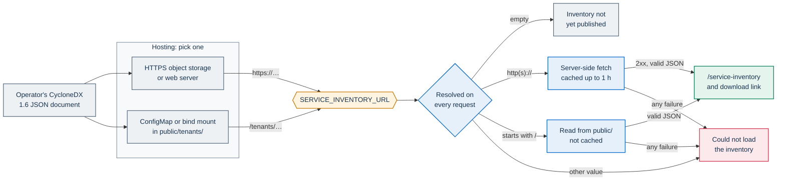

# Service inventory: publishing

Every PA Webinar installation has a public page at `/service-inventory` (UI title **Provider service inventory**). It tells visitors what the installation is made of: the software that runs and the services of the providers it depends on. This page describes how an operator publishes that document, how the application finds and renders it, and how to check it before going live.

Producing the document is covered in [Service inventory: generating the document](SERVICE-INVENTORY-GENERATION.md): the DEV half from release SBOMs, the OPS half per cloud provider, and merging the two.

**Audience:** operators of an installation, and procurement or compliance readers who need to know what the page promises.

## What the page is for

The page gives per-installation transparency about the provider. A public administration (PA) can use it to answer questions such as:

- which software and container images the installation runs;
- which managed services it relies on, and from which providers;
- which of those services handle personal data or recorded content;
- which services cross a trust boundary.

It renders one [CycloneDX 1.6](https://cyclonedx.org/) JSON document, the OWASP open standard for bills of materials.

PA Webinar is reusable software released under the European Union Public Licence (EUPL-1.2). Each installation has its own cloud provider, region, contracts and sub-processors, so this document:

- is **not part of the container image**;
- is **not committed to the PA Webinar repository**.

Each operator publishes its own document and points the `SERVICE_INVENTORY_URL` environment variable at it. When the variable is empty, the page shows **Inventory not yet published** instead.

Start from the template in [`docs/examples/service-inventory.example.json`](examples/service-inventory.example.json), and read [Template](#template) first.

Where the page appears:

- It is public and needs no sign-in.
- The site footer links to it (**Service inventory**), and so does the `/changelog` page.
- The home page's project section, when it is enabled in the home settings (**Show the “The project” section**), links to it through its **Service transparency** button.
- The path segment is the same in every language, for example `https://webinar.example.com/en/service-inventory`.

The page covers the **installation**, not the release. Release SBOMs, the `/security` page and the SBOM viewer on `/changelog` describe the software of a release: see [SECURITY.md](../SECURITY.md).

## The two halves: DEV and OPS

The published document merges two halves. The DEV half, `components[]`, lists the software the installation runs, such as container images, packages and cryptographic assets, and the page shows it as a table. The OPS half, `services[]`, lists the services the installation relies on and the providers behind them, and the page shows it as cards.

What goes into each half, how to generate it, and the Azure reference automation in [`infra/service-inventory/azure/`](../infra/service-inventory/azure/README.md) are in [Service inventory: generating the document](SERVICE-INVENTORY-GENERATION.md#the-document-model).

## How `SERVICE_INVENTORY_URL` is resolved

The page is a server component, `app/src/app/[locale]/service-inventory/page.tsx`. It is rendered on every request, and it reads `SERVICE_INVENTORY_URL` from the app's environment each time.



| Value of `SERVICE_INVENTORY_URL` | Behavior |
|---|---|
| Empty or unset (the default in `values.yaml`) | **Inventory not yet published**. This is not an error. |
| Absolute `https://…` URL (recommended) | Fetched by the app server and cached for up to one hour. No image rebuild is needed. |
| Absolute `http://…` URL | Handled like `https://`, but not recommended (see below). |
| Path starting with `/` | Read from the app's `public/` directory on disk, on every request. |
| Any other value, or any loading failure | **Could not load the inventory**. |

A loading failure is any of these:

- the value has another form;
- the server returns a non-2xx status (redirects are followed);
- a network error;
- a missing file;
- a body that is not valid JSON.

A document that loads but contains a field of the wrong type fails differently: see [Rendering contract](#rendering-contract).

Changing the variable needs only a restart of the app pods. With Helm, a change to `app.env` rolls the pods by itself, because the pod template carries a checksum of the app ConfigMap.

### Remote URLs

- **The app server fetches the document, not the browser.** The app pods therefore need outbound access to the host. With `networkPolicy.enabled: true`, the chart's egress rule for web traffic covers TCP 443 only, and excludes the ranges in `networkPolicy.egress.httpsExcept` (see `values.yaml`). A URL on another web port, including a plain `http://` URL on port 80, is blocked there. Plain HTTP also leaves the document open to tampering in transit. Use `https://` on port 443. If the host cannot serve on 443, allow it with `networkPolicy.egress.extraRules`, but prefer moving the document to an HTTPS host on 443.
- **Caching.** The fetch goes through the Next.js data cache with a one-hour revalidation. Once the hour has passed, the next request still gets the cached copy and starts a refresh in the background, so an update can take a little over an hour to appear. Each app pod keeps its own copy, so two pods can briefly show different versions.
- **What gets cached.** Only 200 responses are cached. A 200 response is cached even when its body is not valid JSON, so a broken upload can keep the error page up for about an hour after you fix it. A document larger than about 1.5 MB is not cached at all (the data cache stores the body base64-encoded and caps each entry at 2 MB), so it is fetched on every request.
- **Outages.** If the host becomes unreachable, a running app container that already holds a copy keeps showing it. A container started during the outage, including a restarted one, shows the error page.
- **The download link opens the remote URL itself.** Visitors' browsers must be able to read it, not just the cluster. A URL reachable only from inside the cluster renders the page but leaves visitors with a broken download link.

### Local paths

- **Where the file must be.** The server joins the path to its working directory plus `public/`. In the PA Webinar image, the standalone server runs from `/app/app`. So `/tenants/<tenant>/service-inventory.json` resolves to `/app/app/public/tenants/<tenant>/service-inventory.json`.
- **No cache.** The file is read and parsed on every request. An updated file shows up on the next page load.
- **Download link.** The link points to the same path on the portal, and Next.js serves it from `public/`. Next.js lists the files in `public/` when the server starts, so the link works only if the file was there at startup. A mounted volume always is. A file created later is read by the page, but the download link returns 404 until the pod restarts.

## Hosting options

Whichever option you choose, keep the source of the document in your deployment layer, for example the private configuration or IaC repository that holds your Helm values. Do not keep it in a fork of the application code.

Both the page and the raw file are public. Everything in the document is published, including fields the page does not render, such as `endpoints` or `externalReferences`. Leave out anything you would not put on a public web page: internal host names, private addresses, account identifiers or credentials.

### HTTPS object storage or web server (recommended)

Host the JSON on an HTTPS endpoint that visitors can read, and set `SERVICE_INVENTORY_URL` to its URL. You update the document by uploading a new file. The image and the Helm release stay untouched.

- **Azure Blob Storage.** Use a container with anonymous read access at blob level, or put a CDN in front. The storage account must allow public blob access.

  ```bash
  az storage container create -n public --account-name <storage-account> --public-access blob
  az storage blob upload -c public -n service-inventory.json -f service-inventory.json \
    --account-name <storage-account> --content-type application/json --overwrite
  # SERVICE_INVENTORY_URL=https://<storage-account>.blob.core.windows.net/public/service-inventory.json
  ```

- **Amazon S3.** Make the object readable through a bucket policy, or serve it through CloudFront.

  ```bash
  aws s3 cp service-inventory.json s3://<bucket>/service-inventory.json --content-type application/json
  # SERVICE_INVENTORY_URL=https://<bucket>.s3.<region>.amazonaws.com/service-inventory.json
  ```

- **Google Cloud Storage.** Use a dedicated bucket, because this binding makes every object in it public.

  ```bash
  gcloud storage cp service-inventory.json gs://<bucket>/service-inventory.json --content-type=application/json
  gcloud storage buckets add-iam-policy-binding gs://<bucket> \
    --member=allUsers --role=roles/storage.objectViewer
  # SERVICE_INVENTORY_URL=https://storage.googleapis.com/<bucket>/service-inventory.json
  ```

- **On premises.** Any HTTPS server you already run works: a public MinIO bucket, a static web server, or a documentation site.

The Azure reference generator publishes to Blob Storage in exactly this way. See [`infra/service-inventory/azure/README.md`](../infra/service-inventory/azure/README.md).

### ConfigMap in the cluster

Use this option when object storage cannot serve public blobs. Create a ConfigMap from the JSON and mount it into the app's `public/` directory.

1. Create or update the ConfigMap **before** the `helm upgrade` that references it. A pod whose ConfigMap volume is missing stays in `ContainerCreating`.

   ```bash
   kubectl create configmap pa-webinar-service-inventory -n pa-webinar \
     --from-file=service-inventory.json=service-inventory.json \
     --dry-run=client -o yaml | kubectl apply -f -
   ```

2. Add the volume through `app.extraVolumes` and `app.extraVolumeMounts`, and set the variable. Helm **replaces** lists instead of merging them. Your override must therefore repeat the chart's default `tmp` and `next-cache` entries. Without the `tmp` volume, the app cannot write to `/tmp` on its read-only root filesystem. Copy both entries from the `values.yaml` of the chart version you deploy. The entries below match the current `values.yaml`:

   ```yaml
   app:
     env:
       SERVICE_INVENTORY_URL: "/tenants/<tenant>/service-inventory.json"
     extraVolumes:
       # chart defaults from values.yaml, repeated because Helm replaces lists
       - { name: tmp,        emptyDir: { sizeLimit: 100Mi } }
       - { name: next-cache, emptyDir: { sizeLimit: 500Mi } }
       - name: service-inventory
         configMap: { name: pa-webinar-service-inventory }
     extraVolumeMounts:
       - { name: tmp,        mountPath: /tmp }
       - { name: next-cache, mountPath: /app/.next/cache }
       - name: service-inventory
         mountPath: /app/app/public/tenants/<tenant>   # public/ of the standalone server (cwd /app/app)
         readOnly: true
   ```

3. Keep these rules in mind:

   - Mount the ConfigMap as a directory, without `subPath`. A `subPath` mount never receives updates.
   - A ConfigMap is limited to 1 MiB, so a full transitive npm SBOM may not fit. See [Rendering contract](#rendering-contract).
   - After `kubectl apply`, the kubelet refreshes the mounted file, typically within a minute or two. The page then shows the new content with no restart. `kubectl rollout restart deploy/pa-webinar -n pa-webinar` makes the change immediate.

### Docker Compose installation

On a single VM, bind-mount a **directory** (not a single file) into the app container. Then set the variable on the `app` service, preferably in a Compose override file:

```yaml
services:
  app:
    environment:
      - SERVICE_INVENTORY_URL=/tenants/<tenant>/service-inventory.json
    volumes:
      - ./service-inventory:/app/app/public/tenants/<tenant>:ro
```

A single-file bind mount keeps pointing at the old file after an editor replaces it. That is why you mount the directory. An `https://` URL works on Compose as well.

### Baking the file into an image (discouraged)

A downstream image can add the file under `public/tenants/<tenant>/` and use a local path. This ties the image to one installation and breaks the single-image model. Every edit to the inventory then needs a rebuild and a redeploy. Use it only for private builds that are never reused.

## Rendering contract

The page reads a small subset of CycloneDX 1.6 and ignores everything else. It does not check the document against the schema. Missing fields appear as "—" or are left out, but a field of the wrong type (for example `components` as an object, `licenses` or `data` not an array, or a numeric `metadata.timestamp`) makes the page fail with the generic error page instead of **Could not load the inventory**. That is why the [Validation](#validation) step exists.

The page shows descriptions and labels exactly as written in the document, in every UI language. It does not translate document content.

### Header

| Page label | Source in the document | When absent |
|---|---|---|
| **Instance** | `metadata.properties` `pa-webinar:tenant`, else `metadata.component.name` | "—" |
| **Cloud provider** | `metadata.properties` `pa-webinar:cloud-provider` | "—" |
| **Region** | `metadata.properties` `pa-webinar:region` | Row hidden |
| **Deployment mode** | `metadata.properties` `pa-webinar:deployment-mode` (free text; the Helm profile from `jitsi.mode`, `simple`, `standard` or `full`, is a good value) | Row hidden |
| **Generated at** | `metadata.timestamp`, shown with `T` replaced by a space and `Z` by `UTC`. Write it in UTC with a trailing `Z`. | Row hidden |
| **Format** | `bomFormat` (default `CycloneDX`) and `specVersion` | — |
| **Download raw JSON** | The value of `SERVICE_INVENTORY_URL` | — |

The header reads only these four `metadata.properties`. Other properties, such as `pa-webinar:environment` in the template, stay in the downloadable file and are not displayed.

### Software components (DEV)

The page shows one table row per `components[]` entry, in document order:

| Column | Source |
|---|---|
| **Name** | `name`, with `description` underneath |
| **Type** | `type` |
| **Version** | `version`, else "—" |
| **License** | For each `licenses[]` entry: `expression`, else `license.id`, else `license.name`. Entries with none of these are skipped. Values are joined with commas; "—" if none. |

The page lists every entry. A full transitive npm SBOM produces a very long table, and it can push the document past the fetch-cache limit (about 1.5 MB of JSON) or the 1 MiB ConfigMap limit. Consider publishing the images and the direct dependencies, and linking the full release SBOMs instead. [Generating the document](SERVICE-INVENTORY-GENERATION.md) explains how.

### Operational services (OPS)

The page shows one card per `services[]` entry:

- the card title is `name`, followed by `version` and `provider.name`, then `description`;
- a badge appears for each condition in the table below.

| Badge | Condition |
|---|---|
| **crosses trust boundary** | `"x-trust-boundary": true` |
| **personal data** | At least one `data[]` entry with `"classification": "personal-data"` |
| **recorded content** | At least one `data[]` entry with `"classification": "recording"` |

CycloneDX 1.6 requires `flow` and `classification` on every `data[]` entry. Other classification values, such as `application` or `media` in the template, are valid but produce no badge. For which PA Webinar data counts as personal data, see [Privacy and data protection](GDPR.md).

### Architecture at a glance

The stack diagram collects items from **both** `components[]` and `services[]`. It includes each item that carries a `pa-webinar:layer` property with one of four values:

| `pa-webinar:layer` | Layer shown | Subtitle on the page |
|---|---|---|
| `access` | **Access** | Web entry point and TLS termination. When at least one item is tagged `access`, the page adds "End users (browser)" to this layer. |
| `app` | **Application** | Portal, video, real-time media |
| `data` | **Data** | Persistence, cache, object storage |
| `platform` | **Platform** | Kubernetes runtime, SMTP, CI/CD, observability |

How items are placed and labeled:

- Each item appears under the label in its `pa-webinar:stack-label` property, or under its `name` if that property is absent.
- Items with any other layer value are ignored. The exception is a value that names a built-in JavaScript object property, such as `constructor` or `toString`: it makes the page fail. The stack-tags check in [Validation](#validation) catches both cases.
- Layers with no items are left out.
- The whole section is hidden when no item is tagged.

### Not rendered

Among the fields the page does not render:

- `dependencies[]`, `compositions[]`, `formulation[]`, `annotations[]`, `vulnerabilities[]`, `declarations` and `definitions`;
- `metadata.manufacturer`, and everything in `metadata.component` apart from its `name`, which is the fallback for **Instance**;
- `endpoints`, `authenticated` and `externalReferences` on services, and `flow` and `description` on their `data[]` entries;
- `purl` on components, and any component or service `properties` other than `pa-webinar:layer` and `pa-webinar:stack-label`.

All of them are part of the public download. Compliance declarations and supplier agreement links belong in these fields, and readers get them from the raw JSON.

## Validation

Run these checks before you publish, and again after every regeneration.

1. **Minimal structure.** It must be CycloneDX 1.6, and `services` must be an array:

   ```bash
   jq -e '.bomFormat=="CycloneDX" and .specVersion=="1.6" and (.services|type=="array")' service-inventory.json
   ```

2. **Stack tags.** Every `pa-webinar:layer` value must be one the page knows:

   ```bash
   jq -e '[(.components // [])[], (.services // [])[] | (.properties // [])[]
           | select(.name=="pa-webinar:layer") | .value]
          | all(IN("access","app","data","platform"))' service-inventory.json
   ```

3. **Full schema validation** with the CycloneDX CLI:

   ```bash
   docker run --rm -v "$PWD":/work:ro cyclonedx/cyclonedx-cli \
     validate --input-file /work/service-inventory.json --input-version v1_6 --fail-on-errors
   ```

   The template itself fails this check while it still contains `<placeholder>` values in URL and endpoint fields, because those are not valid IRIs. Once every placeholder is filled in, the template passes. A failure on those fields therefore usually means something was left unfilled.

4. **Reachability from the app**, for a remote URL. Run this from inside an app pod, so that NetworkPolicy and DNS apply as in production:

   ```bash
   kubectl -n pa-webinar exec deploy/pa-webinar -c pa-webinar -- \
     node -e "fetch(process.env.SERVICE_INVENTORY_URL).then(r => console.log(r.status, r.headers.get('content-type')))"
   ```

   For a local path, check that the file is where the server looks for it:

   ```bash
   kubectl -n pa-webinar exec deploy/pa-webinar -c pa-webinar -- ls -l /app/app/public/tenants/<tenant>/
   ```

5. **The page itself.** Open `https://webinar.example.com/en/service-inventory`. Check the header fields and the badges. Then follow **Download raw JSON** from a machine outside the cluster. For a remote URL, remember the cache of up to one hour.

## Template

[`docs/examples/service-inventory.example.json`](examples/service-inventory.example.json) is the starting point. It contains:

- the `metadata` block with the header properties;
- one example of each component kind: the application image, a framework package and a TLS certificate as a cryptographic asset;
- typical services: compute, database, object storage, SMTP and TURN;
- a `dependencies` graph.

The application image and every service are tagged with `pa-webinar:layer` and `pa-webinar:stack-label`. The framework package and the TLS certificate are not, so they appear only in the tables.

Fill it in by following step 2 of the [new-installation checklist](SERVICE-INVENTORY-GENERATION.md#new-installation-checklist). Three things in the template must change before you publish:

- Its placeholder text and descriptions are in Italian. The page shows descriptions exactly as written, so write them in the language your readers expect.
- Its PA Webinar entries, `metadata.component` and the application image, declare `AGPL-3.0-only`. PA Webinar is released under `EUPL-1.2`: change both.
- Its `annotations[]` entry is a note for the operator. Annotations are published in the download, so rewrite or remove it.

## Related documents

- [Service inventory: generating the document](SERVICE-INVENTORY-GENERATION.md): producing the DEV and OPS halves, and PA declarations.
- [Configuration reference](CONFIGURATION.md): `SERVICE_INVENTORY_URL` among the other environment variables.
- [Deploying with Helm](DEPLOYMENT.md): `app.extraVolumes`, `app.extraVolumeMounts` and the NetworkPolicy keys.
- [Installing PA Webinar](install/README.md): choosing and sizing a platform, which decides most of what goes into the OPS half.
- [SECURITY.md](../SECURITY.md): release SBOMs and supply-chain controls.
- [Privacy and data protection](GDPR.md): the personal data behind the **personal data** and **recorded content** badges.
- [Feature tour](FEATURES.md): the public transparency pages in context.
