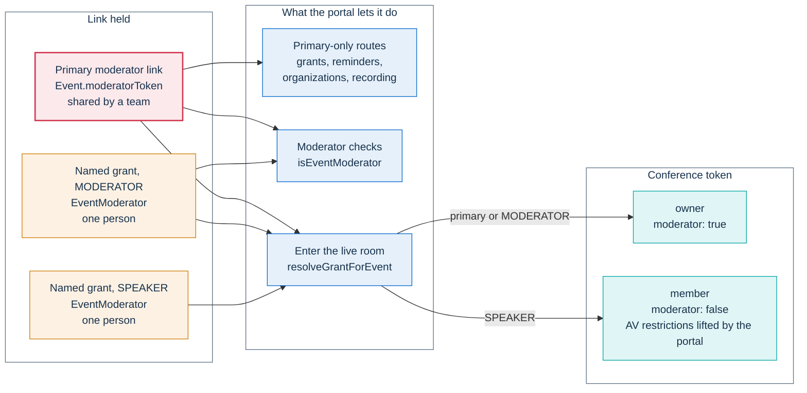

# ADR-003: Moderators and speakers by magic link, no accounts

**Status:** Accepted

**Related decisions:** [ADR-014](014-organizer-role.md) and [ADR-015](015-named-administrators.md)
add staff accounts for the administration area and leave room access unchanged.

## Context

The people who run an event's room are often not staff of the installation. A moderator can be a
colleague from another office. A speaker can come from another public body, a university or a
company, and many of them take part in a single event. Asking each of them to create an account would
put a sign-up, a password and a reset flow between them and the room, often minutes before the event
starts. It would also leave behind personal data that outlives the event.

The room still has to know who may moderate. Jitsi Meet's own authentication is replaced by a token
that the portal signs ([ADR-004](004-jitsi-jwt.md)), so the portal decides who enters as a moderator.
Two needs shape that decision:

- a team, not a single person, often runs an event together;
- invited speakers must be able to speak, show their camera and share their screen, but must not be
  able to end the event, eject people or start a recording.

The administration area is opened by the instance API key ([ADR-009](009-admin-session.md)). The key
opens everything, so it cannot be handed to an external speaker.

## Decision

**Moderators and speakers get per-event magic links. Nobody who runs a room needs an account.**

### A primary link per event

Every event has a primary moderator token: a random UUID generated with the event. A duplicated event
gets a fresh one. The primary link (the event's **Moderator link**) carries the token as `?token=`,
either to the event management page or to the live room. Of the magic links, only this one opens the
event management page. Staff open it with their session instead.

The primary token is always accepted for its event. It has no expiry and cannot be revoked, but it can
be rotated (see [Rotation and revocation](#rotation-and-revocation)). The primary link is the event's
owner seat: its holder creates and revokes the named grants, and a few other routes accept only this
token.

### Named grants

Besides the primary link, an event can have any number of **named grants**. A grant is issued to one
person. It has its own token, the person's name and an optional email address, and a role, and it can
be revoked without touching any other link. The holder of the primary link creates the grants. When an
event is duplicated, its grants are copied with fresh tokens, so an old link never opens the new event.

| Role | In the conference | In the portal |
|---|---|---|
| `MODERATOR` | A Jitsi moderator (`owner`) | Passes every moderator check, like the primary link, except on the routes reserved to the primary link. Opens the live room, not the event management page |
| `SPEAKER` | A Jitsi participant (`member`), with microphone, camera and screen sharing allowed regardless of the event's participant restrictions | Passes no moderator check. Opens the live room |

The diagram shows what each link leads to in the portal and which conference token it can obtain.

### How the token travels

A token travels in one of two ways:

- `Authorization: Bearer <token>` on API calls, which is preferred;
- `?token=<token>` on the landing pages that a magic link opens, and where a header cannot be sent,
  such as the chat stream.

No custom header is accepted. A token sent any other way is ignored, so a route that requires a
moderator token answers 401. The first token that arrives in the query string is logged as a warning,
once per server process, because URLs end up in access logs and browser history.

### One module decides

The rules that turn a token into a seat are written once, in one module:

- one rule decides whether a token may moderate an event: the primary token, or a named grant that
  belongs to the same event, is not revoked and has role `MODERATOR`;
- one rule turns any grant token (the primary token, a `MODERATOR` grant or a `SPEAKER` grant) into a
  role and a display name. Every entry point that needs the role uses it and none re-implements it.

The Jitsi token endpoint maps the role onto the conference token: moderator seats become `owner`, and
speakers become `member`. The claims are described in
[The Jitsi JWT](../architecture/identity-and-access.md#the-jitsi-jwt).

### People hand out the links

The platform does not email moderator or grant links. Staff copy them from the administration area
and pass them on, and a moderator in the live room can reveal the link they entered with. Getting each
link to the right person is up to the organizer.

## Consequences

### A token is a seat, not a person

A team shares the primary link, and everyone who holds it occupies the same seat. The platform
therefore does not treat the primary link as an identity:

- Entering the room with the primary link requires a typed display name. The Jitsi token endpoint
  refuses to issue a token without one. Without this rule, every moderator would appear under the same
  generic name.
- In the chat, all holders of the primary link share one seat id, `mod-<eventId>-primary`. Each named
  grant has its own seat id.
- Any action that works *as the author* requires a per-person identity. Editing an existing chat
  message is one example. A named grant qualifies. The primary link does not, because holding a shared
  token proves nothing about who is typing. Any new feature that changes or removes content under
  another person's name must apply the same check.
- Edits and deletions through `PUT` and `DELETE /api/events/{id}` made from a browser without a staff
  session are recorded with the actor `unknown` (see
  [Audit actor format](../architecture/identity-and-access.md#audit-actor-format)). The log records
  what changed, not which moderator changed it. Creating or revoking a named grant, and the other
  token-authenticated routes, write no entry to the administration audit log.

Named grants give an identity to the people who need one. Give each co-moderator and speaker their
own grant instead of the primary link.

### The link is a durable credential

Neither kind of link expires on its own. Whoever holds a link keeps its powers until the link is
rotated or revoked:

- the primary link and a `MODERATOR` grant can run the room. Through the event API they can also edit
  the event, change its status and delete it;
- the link stays in the address bar and in the browser history of whoever opened it;
- anyone who can open the event in the administration area can obtain its primary link. Staff edits go
  through the same token-authenticated routes, so the event page hands the token to the browser (see
  [Ways in](../architecture/identity-and-access.md#ways-in)).

**Event links** warns next to the moderator link not to show it while sharing your screen and not to
paste it into a chat. The live room and the **Moderators** page tell the user to share it only with
moderators. Grant links carry no warning of their own; treat them the same way. The token travels in a
header, not in a cookie, so the browser never attaches it to a request on its own. This is part of the
[CSRF stance](../architecture/security.md#csrf-stance).

### Rotation and revocation

The two kinds of link end in different ways:

- **The primary token is rotatable.** It cannot be revoked, because the event always needs an owner
  seat, but an administrator can replace it. The old link stops working, and staff find the new one on
  the event page. Deactivating or deleting a staff account also rotates the primary token of every
  event that account created, because the account's holder has seen those links. Organizers cannot
  rotate a link, not even for their own events.
- **A named grant is revocable.** The holder of the primary link revokes it. The grant is marked as
  revoked and kept, so the event page still shows who had access. Polling endpoints on other replicas
  may accept the token for a few more seconds. The GDPR cleanup deletes grants along with the rest of
  the event's personal data.
- **Neither reaches into a conference in progress.** Jitsi keeps no revocation list, so a Jitsi token
  already issued stays valid until it expires. Rotating or revoking a link only stops it from minting
  a new one. A holder who is already in the conference stays there until a moderator removes them.

### Speakers get full audio and video and no moderation powers

A speaker is held to non-moderator rights on both sides:

- **In Jitsi.** A speaker's conference token has `moderator: false` and affiliation `member`, and its
  `recording` feature is off. Jitsi's own permissions therefore refuse moderator-only actions, such as
  muting everyone or ejecting a participant. Hidden buttons are not the only barrier. When a moderator
  turns on Jitsi's audio and video moderation, it applies to a speaker as to any other participant.
- **In the portal.** The moderator check rejects `SPEAKER` grants, so speakers pass no moderation
  endpoint. The chat shows no moderator badge for them.

The full audio and video come from the portal. In the room, it lifts the event's participant
restrictions on microphone, camera and screen sharing for speakers, and their devices start on by
default.

### What is not a grant

- **Co-organizing organizations** (`EventOrganizer`) are display metadata: a name, a logo and an
  optional link on the public event page. They grant no access, carry no magic link and receive no
  email.
- **Invitations** (`EventInvitation`), including those with role `SPEAKER`, are a staged guest list.
  Adding one does not create a named grant. To give an invited speaker speaker rights in the room,
  create a `SPEAKER` grant.

### Staff accounts sit beside this model

Staff accounts ([ADR-014](014-organizer-role.md), [ADR-015](015-named-administrators.md)) give
administrators and organizers a named sign-in to the administration area. They did not replace magic
links for the room. A staff member who manages an event acts on it through its primary token, which
the event page hands to the browser.

## Alternatives considered

### Accounts for moderators and speakers

Personal accounts with a password for everyone who runs a room were rejected:

- **Friction where it hurts.** Most moderators and speakers take part once. A sign-up and a password
  would stand between them and the room just before the event starts.
- **More to protect and more to keep.** Password storage, reset flows and lockout rules would be needed
  for people who are not staff. Their personal data would also outlive the event instead of following
  its retention.
- **No gain for the room.** Access still has to be scoped to one event and one role, and a per-event
  grant expresses that directly.

Named grants give a per-person identity where it matters, without an account.

### Single sign-on (OAuth or OpenID Connect)

Delegating sign-in to an identity provider was rejected for the room:

- **Every installation is different.** Each public body that reuses PA Webinar has its own identity
  provider, or none, and would need its own integration before its first event.
- **External people are not in the host's directory.** Speakers from another body, a university or a
  company would still need another way in.
- **It would not remove the grant.** A signed-in person still needs a per-event role, so single
  sign-on would add a step in front of the same decision.

The administration area has no OAuth flow either ([ADR-009](009-admin-session.md)). Sign-in with the
Italian public digital identity systems (SPID and CIE) appears in the [roadmap](../ROADMAP.md) only as
a conditional item for participants.

## Implementation notes

The owner page for every detail below is
[Identity, access and tokens](../architecture/identity-and-access.md#moderator-and-speaker-links).

- **Models.** The primary token is `Event.moderatorToken`, a unique column. Named grants are
  `EventModerator` (table `event_moderators`): a unique `token`, `name` and `email` encrypted at rest,
  `role` and `revokedAt`. `app/prisma/schema.prisma` is the authority.
- **The rules.** They live in `app/src/lib/auth/moderator.ts`:
  - `extractModeratorToken` reads only `Authorization: Bearer` and `?token=`, and logs the
    once-per-process warning for a query-string token. The client uses `?token=` for the chat stream and the chat
    export download, because `EventSource` and a plain link cannot set a header.
  - `isEventModerator` compares the primary token in constant time, then accepts an unrevoked
    `MODERATOR` grant of the same event. `verifyModeratorToken` and `isEventModeratorCached`, the
    variant used by polling endpoints, both go through it.
  - `resolveGrantForEvent` resolves any grant token to a role and a display name. The live room
    (`app/src/app/[locale]/events/[slug]/live/page.tsx`), the chat and the peak-attendance analytics
    endpoint call it directly, and the Jitsi token endpoint calls it through `verifyGrantToken`.
  - Two endpoints read the token under another name: the Jitsi token endpoint's `moderatorToken` body
    field and `GET /api/events?moderatorToken=`. See
    [Shape and transport](../architecture/identity-and-access.md#shape-and-transport).
  - The routes reserved to the primary link compare against `Event.moderatorToken` directly instead
    of calling `isEventModerator`. They are listed in
    [What each seat can do](../architecture/identity-and-access.md#what-each-seat-can-do).
- **Seats.** `resolveTokenSender` in `app/src/lib/chat/sender.ts` assigns the chat seat ids and
  returns `isPerPersonIdentity`, the per-person check. The seat table is in
  [Seats and people](../architecture/identity-and-access.md#seats-and-people).
- **Grants.** `POST /api/events/{id}/moderators` creates a grant, from the event wizard or from
  **Co-moderators and speakers** on the event page. `DELETE /api/events/{id}/moderators/{modId}` sets
  `revokedAt` and calls `invalidateModeratorCache`, which clears only the local pod's cache. Other
  replicas wait for `MODERATOR_CACHE_TTL_MS`. No route removes a holder from a running conference.
  Duplication (`POST /api/admin/events/{id}/duplicate`) issues fresh tokens.
- **Rotation.** **Regenerate** on the administrator-only **Moderators** page calls
  `POST /api/admin/moderators` with `{ "eventId": "<id>", "action": "regenerate" }`, audited as
  `EVENT_MODERATOR_TOKEN_ROTATE`. Deactivating or deleting a staff account rotates tokens in
  `app/src/app/api/admin/organizers/[id]/route.ts`. See
  [Lifecycle](../architecture/identity-and-access.md#lifecycle).
- **Where links are copied.** Staff copy the primary link from **Event links** on the event page.
  Administrators can also copy it from the **Moderators** page, which lists events that are not
  drafts. Each grant link is copied with **Copy link** under **Co-moderators and speakers**. In the
  live room, **Show moderator link** reveals the link the moderator entered with.
- **Link warnings.** The texts are the i18n keys `admin.links.warning`, `live.share.moderatorWarning`
  and `admin.moderators.searchHelp`.
- **Jitsi token lifetimes.** `MODERATOR_JWT_TTL_SECONDS` and `PARTICIPANT_JWT_TTL_SECONDS` in
  `app/src/lib/auth/jwt.ts` set them: 2 hours for moderator seats and 90 minutes for speakers.
- **Audit.** `PUT` and `DELETE /api/events/{id}` call `logAdminAction` (`EVENT_UPDATE`,
  `EVENT_DELETE`). `deriveActor` in `app/src/lib/audit/admin-audit.ts` returns `unknown` when the
  request carries no `admin_session` cookie. Deleting the event's recording writes a
  `RECORDING_DELETED` row to the GDPR audit log (`gdpr_audit_logs`), which has no actor column.
- **Speaker audio and video.** `app/src/components/live/live-event-client.tsx` passes
  `participantsCanUnmute || isSpeaker` and the matching camera and screen-sharing flags to
  `JitsiRoom`, and turns devices on by default for moderators and speakers.
- **Guard tests.** `app/src/lib/auth/moderator.test.ts` (speaker, revoked and cross-event grants are
  refused), `app/src/app/api/events/[param]/jitsi/token/route.test.ts` (a speaker gets no moderator
  powers; the shared link needs a typed name) and `app/src/lib/chat/sender.test.ts`.

## Related

- [Identity, access and tokens](../architecture/identity-and-access.md#moderator-and-speaker-links):
  every credential, how it travels, its lifetime and how it ends
- [Live interaction and realtime](../architecture/live-interaction.md): what moderators, speakers and
  participants can read and write in each live panel
- [Security architecture](../architecture/security.md): the CSRF stance and rate limits
- [Privacy and data protection](../GDPR.md): retention and deletion of grant rows
- [Data model](../architecture/data-model.md): schema conventions; `app/prisma/schema.prisma` is the
  authority for `Event` and `EventModerator`
- [ADR-004](004-jitsi-jwt.md), [ADR-009](009-admin-session.md), [ADR-014](014-organizer-role.md),
  [ADR-015](015-named-administrators.md)
