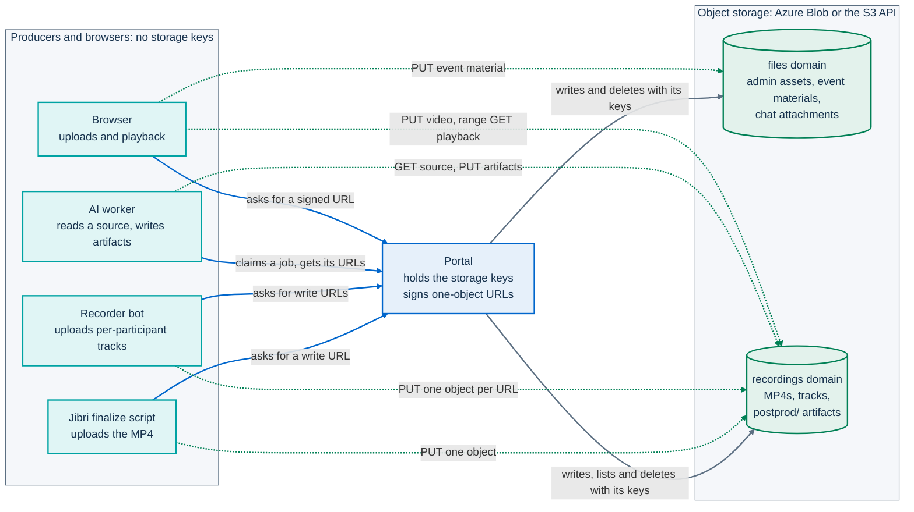

# ADR-006: Optional recording paths on provider-agnostic storage

**Status:** Accepted; extended by [ADR-013](013-multitrack-speaker-attribution.md)

## Context

An event on PA Webinar can outlive its live hour. The recording is published on the event page and in
the video library, and AI post-production turns it into a transcript, subtitles, summaries and
translations ([ADR-016](016-in-cluster-ai-postproduction.md)). Recording is also processing of personal
data. It needs consent, and many events do not want it at all.

Four constraints shape how recording and file storage are built:

- **Recording is expensive and privileged.** Jitsi's recorder, Jibri, runs headless Chrome against a
  virtual display. It needs the ALSA loopback kernel module on its node and elevated container
  privileges, and one Jibri instance records one conference at a time. Some installations cannot grant
  that, and some do not need recording.
- **A mix loses who spoke.** Jibri writes one MP4 with a single mixed audio track. A transcript made from
  the mix can only guess speakers acoustically, while Jitsi knows exactly whose voice each stream carries.
- **Every public administration (PA) has a different cloud.** Reusing administrations run on Azure, on
  AWS, on sovereign or on-premises clouds, or on a single VM. Almost all of them offer either Azure Blob
  Storage or a service that speaks the S3 API. Few offer anything else in common.
- **Files are large, and several components write them.** A recording is hundreds of megabytes or more.
  Jibri, the recorder bot and the AI worker all write files, each in its own pod, and none of them should
  hold storage credentials. Browsers must be able to stream a video with range requests.

## Decision

Recording is **optional at every level**. It is split into **two independent capture paths**, and every
file goes to **object storage behind one provider-agnostic interface**. Media and uploaded files never go
into the database.

### Optional at every level

| Level | Composite video (Jibri) | Per-participant audio (multitrack recorder) |
|---|---|---|
| Installation | `jitsi-meet.jibri.enabled`, default `false` | `recorder.enabled`, default `false` |
| Event | `recordingEnabled` | `recordingEnabled` + `aiTranscriptEnabled` + `multitrackRecordingEnabled` |
| Start | A moderator presses **Start recording**, or the room starts it when `autoStartRecording` is on | The recorder controller starts a bot while the event is `LIVE` |

The Helm keys are in `infra/helm/pa-webinar/values.yaml` and the event flags in
`app/prisma/schema.prisma`. An event can use either path, both, or neither. An installation with neither
path runs every feature that does not depend on a recording.

### Composite video: Jibri

- **Jibri is the only capture path that produces video.** Its MP4 becomes the event's recording, which
  can be published to the event page and the video library. For events without per-participant audio,
  it is also the input of the AI transcript: the `TRANSCRIBE` job diarizes the mix.
- **The moderator drives it.** The control bar sends the IFrame API command `startRecording` in `file`
  mode ([ADR-001](001-jitsi-iframe-api.md)). Each start and stop produces one MP4. The live room treats
  Jibri as available only when `RECORDING_STORAGE_TYPE` is set to a value other than `local` and, in a
  cluster, Jibri's health endpoint reports it healthy.
- **The finalize script hands the file over.** When a recording stops, the script shipped with the chart
  uploads the MP4 through a URL that the portal signs for that one object, then notifies the portal. The
  portal records the file as a `Recording` and, when the event has the AI transcript on, enqueues
  post-production ([Recording](../architecture/recording.md#from-mp4-to-recording-the-finalize-contract)).
- **Capacity follows the events.** The JVB scaler asks for one Jibri replica while any `LIVE` or
  `PROVISIONING` event has recording enabled, and for zero otherwise
  ([Scaling the media plane](../architecture/scaling.md)).

The two paths are complementary. The multitrack recorder produces no video, so an event whose video will
be published needs Jibri, or a video that staff upload afterwards.

### Per-participant audio: the multitrack recorder

- **Purpose: exact speaker attribution.** A recorder bot joins the conference and records one audio
  track per participant. Each track carries the participant's identity from the portal-issued JWT, so
  the transcript names who said what and keeps overlapping speech. The options that were weighed and the
  orchestration are recorded in [ADR-013](013-multitrack-speaker-attribution.md).
- **A per-event opt-in.** An administrator turns it on with **Per-participant recording (high
  accuracy)**. It takes effect only when the event also has recording and the AI transcript on.
- **A separate consent.** An isolated voice track is more sensitive than the event recording, so it has
  its own consent, asked at registration and again in the waiting room. The gates and their limits are
  in [ADR-013](013-multitrack-speaker-attribution.md#consent-gates) and
  [Recording](../architecture/recording.md#consent-gates).
- **Tracks are intermediate input.** They are deleted once the transcription is done, unless the event
  has **Keep per-participant tracks** on.
- **Audio only.** The recorder produces no video. It does not raise Jitsi's in-room recording
  indicator, which follows Jibri alone.

### One storage interface, two domains

- **One interface, two implementations.** `StorageProvider` (`app/src/lib/storage/provider.ts`) offers
  signed upload and download URLs, server-side writes, deletion, listing and key-to-URL mapping.
  `azure-provider.ts` implements it for Azure Blob Storage. `s3-provider.ts` implements it for
  S3-compatible services, and is written for AWS S3, MinIO, Cloudflare R2, Wasabi, Google Cloud Storage
  through its S3 interoperability API with HMAC keys, and sovereign or on-premises services that expose
  the S3 API. There is no native Google Cloud Storage client and no local-filesystem provider.
- **Two domains, configured independently** (`app/src/lib/storage/index.ts`):
  - **files**: images, audio and documents uploaded in the administration area, event material files,
    and chat attachments. The portal writes most of them itself. Event material files are uploaded by
    the browser with a URL signed for one object;
  - **recordings**: Jibri MP4s, videos uploaded by staff, per-participant tracks and their manifest, and
    AI post-production artifacts under the `postprod/` prefix.

  Each domain has its own provider, credentials and bucket, so an operator can apply different lifecycle
  and access policies to small assets and to large media. Each domain resolves an explicit setting first,
  then auto-detects from the Azure connection string or the S3 bucket variable that is set. With
  neither, the domain is disabled and the features that depend on it degrade.
- **Only the portal holds credentials.** Jibri, the recorder bot and the AI worker receive URLs signed
  for one object each. The recorder's URLs are also confined to its own recording's prefix. A browser
  uploads through signed URLs too, and plays a published recording through a redirect to a signed read
  URL, then streams straight from storage.

### Never in the database

The database stores storage keys (`Recording.blobKey`, `RecordingTrack.blobKey`,
`PostprodArtifact.blobKey`, `EventMaterial.blobPath`) or storage URLs (`Event.recordingUrl`), never the
bytes of media or uploaded files. The schema has no binary columns.

There are two deliberate exceptions, both small encrypted text. `PostprodArtifact.inlineBody` mirrors a
transcript or a summary so that pages and the transcript editor render it without a storage round trip,
and the file in storage stays the reference. `PostprodOriginalBody.body` keeps the machine version of a
transcript once someone revises it, and it exists only in the database.

## Consequences

### What the decision buys

- **Each installation shape takes only what it needs.** The simple profile runs without Jibri, the
  standard profile runs one, and the full profile scales it to zero between recordings. The Docker
  Compose stack ships neither Jibri nor an object store. Its `recorder` profile adds the recorder
  controller, which needs storage and bot settings before it records (see
  [Recording](../architecture/recording.md#docker-single-vm)).
- **Any cloud that offers Azure Blob Storage or the S3 API** can hold the files, without code changes.
- **A small database.** Backups and restores stay fast, and the portal never proxies a video: playback
  uses range requests against storage.
- **Contained credentials.** Jibri, the recorder bot and the worker never hold storage keys. They can
  write only what the portal agrees to sign, one object at a time.
- **Retention works on keys.** Deleting a recording, a track or an artifact deletes an object by key, and
  the jobs that enforce retention do not depend on the provider.

### When both paths run

- **One `Recording` gathers both.** The Jibri MP4 joins the event's multitrack `Recording`, while that
  row still waits for a video, instead of creating a second one. Post-production starts from the
  per-participant tracks, not from the mix
  ([Recording](../architecture/recording.md#hand-off-to-post-production),
  [ADR-013](013-multitrack-speaker-attribution.md)).
- **Both can end up in one archive.** On demand, staff can have the video, the retained tracks and the
  subtitles muxed into one file. That needs both paths on the same recording and, in practice,
  **Keep per-participant tracks**, because tracks are otherwise purged once the transcription is done.

### What it costs

- **`RECORDING_STORAGE_TYPE` does more than pick a provider.** The live room and the status page read it
  directly: when it is unset or `local`, Jibri counts as unavailable, even when auto-detection finds a
  recordings bucket. Set it explicitly whenever Jibri is used
  ([Object storage](../configuration/storage.md#recording-availability-follows-the-resolved-provider)).
- **One composite recording at a time.** The scaler asks for at most one Jibri replica.
- **The recording indicator follows Jibri only.** When an event is captured by the multitrack recorder
  alone, participants learn about it from the consent gates, not from a banner in the room.
- **Portability is designed, not proven.** No automated test runs either implementation against a real
  service.
- **Browser uploads need CORS.** Browsers upload videos straight to storage, so the recordings bucket or
  storage account needs a CORS rule that allows `PUT` from the portal's origin. On S3-compatible storage
  the rule must also allow the `Content-Type` header
  ([Object storage](../configuration/storage.md#creating-buckets-and-containers)).
- **Moving storage means rewriting URLs.** Keys survive a move to a new bucket, but `Event.recordingUrl`,
  `Event.tempRecordingUrl` and `CallSession.recordingUrl` embed the account or bucket and must be
  rewritten. There is no migration tool, and nothing backs up the object store.
- **Deletion is spread out.** User actions and several scheduled jobs delete objects. The orphan sweep
  covers only `recordings/` and has known false positives; see
  [Object storage](../configuration/storage.md#deletion-who-removes-what).
- **Two sets of variables.** Each domain reads its own settings. On Azure, two domains on one account need
  the connection string twice. On S3, the credentials can come from the shared `AWS_*` variables, but
  the bucket and the endpoint are set per domain.
- **The Helm keys are spread out too.** The paths are switched by `jitsi-meet.jibri.*` and `recorder.*`,
  and storage is configured through `app.env` and the application Secret.

Setup and wiring are in [Setting up recording](../operations/recording-setup.md), and the full list of
limits is in [Recording](../architecture/recording.md#known-limitations) and
[Object storage](../configuration/storage.md#deletion-who-removes-what).

## Alternatives considered

### Jibri plus diarization only

With this alternative, the composite MP4 would be the only capture, and speakers would be attributed by
diarizing the mix. This is still what an event without per-participant audio gets, and it needs no extra
service or extra consent. It was rejected as the only path. A mix discards the identity Jitsi already
has. Diarization labels voices by acoustic clusters, assigns one speaker per segment and loses overlapping
speech, and every label has to be mapped to a name by hand. [ADR-013](013-multitrack-speaker-attribution.md)
compares this with the other options.

### A local filesystem

With this alternative, recordings and uploads would be written to a volume, such as Jibri's disk or a
volume shared with the portal. It was rejected for these reasons:

- It ties files to nodes, while the portal runs as several stateless replicas and the producers run in
  their own pods. Every component would need a shared read-write volume.
- It offers no signed URLs, so the portal would have to stream every video itself.
- Lifecycle policies, replication and backup would be left to each operator.

`RECORDING_STORAGE_TYPE` accepts `local`, but the value selects no provider. It only tells the live room
that Jibri is not available, and a recordings bucket that is configured is still auto-detected.

### Blobs in the database

With this alternative, videos, tracks and files would be stored in PostgreSQL, as `bytea` columns or large
objects. It was rejected for these reasons:

- Multi-gigabyte recordings would dominate backups, restores and replication.
- Every playback would pass through the portal and the database.
- Storage lifecycle policies, such as cheaper tiers for old recordings, would not be available.

## Related

- [Recording: composite video and per-speaker audio](../architecture/recording.md): the mechanisms of both
  paths, the lifecycle and playback
- [Object storage](../configuration/storage.md): providers, settings, key layout, access patterns and
  deletion
- [Setting up recording](../operations/recording-setup.md): the values that turn each path on
- [AI post-production](../POSTPROD.md): what happens after the hand-off
- [Privacy and data protection](../GDPR.md) and
  [Recordings, voice data and AI outputs](../privacy/recordings-and-ai.md): consent, retention and legal
  bases
- [ADR-001](001-jitsi-iframe-api.md), [ADR-013](013-multitrack-speaker-attribution.md),
  [ADR-016](016-in-cluster-ai-postproduction.md)
