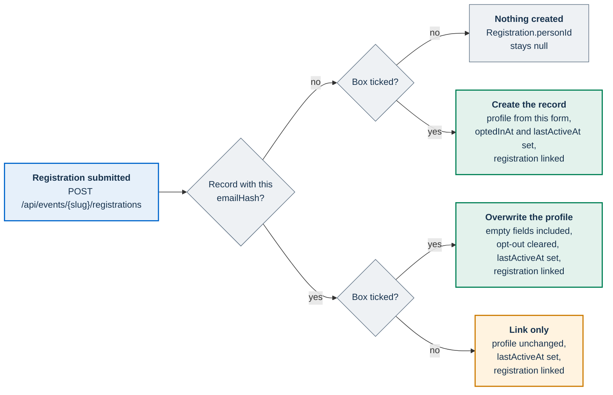
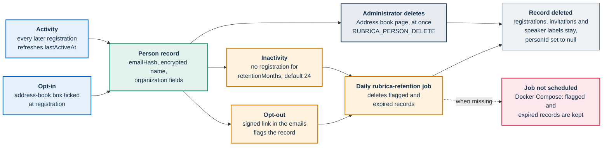

# ADR-011: Cross-event person record and opt-in address book

**Status:** Accepted

**Related decisions:** [ADR-004](004-jitsi-jwt.md) (the keyed email hash stays in the portal),
[ADR-010](010-site-settings-singleton.md) (runtime settings, which do not cover the address book),
[ADR-014](014-organizer-role.md) (the address book stays administrator-only),
[ADR-015](015-named-administrators.md) (named administrators also see the address book),
[ADR-016](016-in-cluster-ai-postproduction.md) (transcript speaker labels can point to a person record)

## Context

PA Webinar stores participation per event. A `Registration` holds one registrant's name, email address,
optional organization fields and consent flags for a single event. The daily GDPR cleanup deletes it
once the event's retention period has passed ([GDPR.md](../GDPR.md#retention-and-cleanup)). After that
deletion nothing about the person is left, so the platform cannot recognize the same person at the next
event.

Public bodies that run recurring community events need three things that depend on recognizing people:

1. **An address book.** Administrators need a list of people to invite to the next event without retyping
   their details.
2. **A stable profile.** A returning participant should not have to declare an organization, a role and an
   organization type from scratch every time.
3. **A participation history.** Administrators need to see which events a person has registered for.

These needs create a record that outlives the retention of any single event. That changes the legal
footing:

- **Taking part in one event** is the purpose of a registration. This record assumes Art. 6(1)(b), a
  request to take part. The controller's privacy notice names the actual basis, and for a public body
  that may be Art. 6(1)(e). Whatever the basis, it ends with the event's retention.
- **Being invited to future events** is a different purpose, and the event's basis does not extend to it.
  It needs a consent of its own under Art. 6(1)(a). That consent must be distinguishable from other
  matters (Art. 7(2)), must not be a condition of taking part (Art. 7(4)) and must be as easy to withdraw
  as to give (Art. 7(3)). The data kept under it must be limited in time (Art. 5(1)(e)).

| | Event registration | Address book |
|---|---|---|
| Purpose | Take part in one event | Be invited to future events |
| Legal basis | Chosen by the controller for the event. This record assumes Art. 6(1)(b) | Consent, Art. 6(1)(a) |
| Model | `Registration` | `Person` |
| Lifetime | Event retention (`Event.dataRetentionDays`) | Inactivity window (`Person.retentionMonths`) |
| Ended by | The daily GDPR cleanup, or self-service erasure | Deletion by an administrator, self-service erasure, or the daily `rubrica-retention` job after an opt-out or once the inactivity window has passed |

## Decision

### A person record separate from the registration

`Person` (table `persons`) is a model of its own. It is not a view over registrations. It is keyed by
`emailHash`, the same keyed hash that `Registration.emailHash` uses: HMAC-SHA-256 of the lowercased,
trimmed address, keyed with `APP_SECRET` (`hashEmail()` in `app/src/lib/crypto/pii.ts`). The hash is the
portal's lookup key and never leaves the portal. [ADR-004](004-jitsi-jwt.md) keeps it out of the Jitsi
token.

`Registration.personId` is a nullable foreign key. It stays `null` for anyone without a person record. Two
other models can also point to a person record: `EventInvitation.personId` and `Speaker.personId`. All
three relations use `onDelete: SetNull`, so deleting a person record never deletes a registration, an
invitation or a speaker label.

A person record is never created retroactively. Registrations that were made without the address-book box
ticked stay unlinked unless the same person later registers again.

### A separate, optional consent

The registration form has its own address-book box. The box starts unticked and is never required. It
reads **I want to be added to the events address book to be invited to similar events**. It is separate
from the required participation consent. It is also separate from the optional future-communications box
(`Registration.consentFutureCommunications`), which is a per-registration flag and creates nothing. The
server receives the address-book box as `consentAddressBook`, which defaults to `false` in
`createRegistrationSchema` (`app/src/lib/validation/schemas.ts`).

Only a ticked box creates a person record. If the box is not ticked and no record exists, nothing is
created.

### Stable profile fields only

A person record holds the fields that describe a person, as opposed to a single moment:

- `displayName`, encrypted at rest with AES-256-GCM under `PII_ENCRYPTION_KEY`;
- `organization`, `organizationRole` and `organizationType`, in plain text so that administrators can
  search and filter by them;
- the consent state, in `optedInToAddressBook`, `optedInAt` and `optedOutAt`;
- `lastActiveAt` and `retentionMonths`, which drive retention.

The record holds no email address. The address stays on each registration, encrypted, for as long as
that registration exists.

Answers that belong to an event stay on that event's records and expire with them. These are
questionnaire responses, feedback, Q&A, poll votes and chat. The platform never copies them to the person
record and never uses the record to skip asking them again. The profile is kept, and the answers are not.
Each registration also keeps its own copy of the organization fields as they were declared at that event.

### Retention per record

Each record has its own retention window, independent of any event. A record expires when `lastActiveAt`
plus `retentionMonths` calendar months lies in the past. `retentionMonths` defaults to 24 in
`app/prisma/schema.prisma`. A daily job deletes expired records and records that have been opted out.

### A stateless signed opt-out token

Withdrawal works through a signed token. There is no account and no stored nonce. The token is issued
and verified in `app/src/lib/persons/opt-out-token.ts`:

- **Format.** The token is `<payload>.<signature>`. The payload is `<personId>:<issued-at seconds>`,
  base64url-encoded. The signature is HMAC-SHA-256, keyed with `APP_SECRET`, over that encoded payload,
  also base64url-encoded, and it is compared in constant time.
- **Validity.** A token is valid for 90 days from issue (`TOKEN_TTL_SECONDS`), so a link in an old email
  still works.
- **No server state.** A token can be used more than once while it is valid. Tokens cannot be revoked one
  by one, although deleting the record makes its tokens useless. Changing `APP_SECRET` revokes all of
  them.
- **Not a JWT.** A token with a single purpose needs no algorithm header and no claims, and so it offers
  less to attack.

The page `/<locale>/rubrica/opt-out?token=…` reads the token from the query string. The path is the same
in every language. The page calls `GET /api/rubrica/opt-out?token=…` to show the name and organization on
the record. It then calls `POST /api/rubrica/opt-out?token=…` to confirm; the API also accepts the token
in a JSON body. The confirmation is rate-limited per client address. Confirming sets
`optedInToAddressBook` to `false` and stamps `optedOutAt`. The daily job deletes the record at its next
run. The page warns that event registrations are not deleted.

### What the record never holds

- **Audio and video telemetry**, such as whether or for how long someone used the microphone, the camera
  or screen sharing. That would be behavioral profiling and would need a basis of its own. Event
  analytics are computed per event, not on the person record.
- **Free text** from questionnaire answers, Q&A questions and chat messages.
- **Technical and location data**, such as the IP address, the user agent or the device.

## Consequences

### What the decision buys

- **Invitations with consent.** Administrators keep a directory of people who asked to be invited again,
  and nobody else is in it.
- **Privacy by design.** A record exists only after an explicit opt-in. It has its own purpose, its own
  lifecycle and its own retention. It holds no event answers and no email address, and the name on it is
  encrypted.
- **Separation by purpose, not by storage.** Records live in the same database as registrations. What
  keeps them apart is the purpose, the lifecycle and access limited to administrators.
- **Current profile, historical truth.** The record holds the latest profile. Each registration keeps the
  organization as it was declared at that event.

### What it costs

- **More moving parts.** The decision adds a model, three nullable relations, a public endpoint, a daily
  job and a conditional step in registration.
- **A second purpose to disclose.** The privacy notice has to describe a second purpose, basis and
  retention period ([privacy notice checklist](../privacy/privacy-notice-checklist.md)).
- **No search by name.** The encrypted name cannot be searched or sorted.
- **No address in the address book.** The record cannot address an invitation on its own. Someone always
  has to supply the email address.

### Risks and how they are contained

| Risk | Effect | Containment |
|---|---|---|
| The promised withdrawal link does not exist | Withdrawing consent is harder than giving it (Art. 7(3)) | The controller handles withdrawal requests, and an administrator deletes the record. See [Known limitations](#known-limitations) |
| The retention job is not scheduled, as in Docker Compose | Opted-out and expired records are kept indefinitely | Call `GET /api/cron/rubrica-retention` daily from the host's cron with the header `x-api-key: <CRON_API_KEY>` ([background jobs](../architecture/background-jobs.md#rubrica-retention)) |
| A record is linked without a fresh opt-in | A person who opted in once keeps collecting linked registrations and extending the record's retention | State in the privacy notice that later registrations count as activity, and delete records on request |
| `APP_SECRET` changes | Hashes stop matching. Returning registrants who tick the box get a new record, others are no longer linked, old records wait for the inactivity purge, and every opt-out token becomes invalid | Treat `APP_SECRET` as permanent ([GDPR.md](../GDPR.md#known-gaps)) |
| A name copied onto a speaker label | The name stays on the label after the record is deleted | Speaker labels go with their recording |

## Alternatives considered

### A1. Derive the address book from registrations

The address book could have been a query: the distinct email hashes of registrations that carry an
address-book flag. This was rejected for two reasons. First, registrations expire with their event, so the
address book would empty itself as events are archived. Second, purpose limitation (Art. 5(1)(b)) calls
for data kept for another purpose to be held under that purpose's own rules and retention. Stretching the
event's records to cover it would not meet that.

### A2. One consent for taking part and for the address book

A single box ("I take part and want to be contacted about future events") was rejected. Consent must be
distinguishable when it covers other matters (Art. 7(2)). Taking part must not depend on consent to a
purpose that the event does not need (Art. 7(4)). A bundled consent would not be freely given.

### A3. A rich profile

A profile with audio and video telemetry, an engagement score or preferences was rejected. It would breach
data minimization (Art. 5(1)(c)). It would also turn the record into profiling as defined in Art. 4(4).
Profiling needs safeguards of its own, and Art. 22 restricts decisions based solely on automated
processing, including profiling, that have legal or similarly significant effects.

### A4. Reusing event-specific answers

Not asking again a question that a person answered at an earlier event was rejected. An answer about one
event means nothing for another. Keeping it beyond its event would breach purpose limitation and storage
limitation (Art. 5(1)(b) and Art. 5(1)(e)). Only stable profile fields carry over.

## Implementation notes

### Where it lives

| Concern | Location |
|---|---|
| Model and indexes | `Person` in `app/prisma/schema.prisma`: unique `emailHash`, and an index on `optedInToAddressBook` with `lastActiveAt` |
| Create, refresh and link at registration | `upsertPersonOnRegistration()` in `app/src/lib/persons/index.ts`, called inside the transaction of `POST /api/events/{slug}/registrations` |
| Opt-out token | `app/src/lib/persons/opt-out-token.ts` |
| Opt-out page and API | `app/src/app/[locale]/rubrica/opt-out/page.tsx` and `app/src/app/api/rubrica/opt-out/route.ts` |
| Retention job | `app/src/app/api/cron/rubrica-retention/route.ts`. Chart template `infra/helm/pa-webinar/templates/cronjob-rubrica-retention.yaml`, with the keys `cronjobs.rubricaRetention.enabled` and `cronjobs.rubricaRetention.schedule` in `infra/helm/pa-webinar/values.yaml` |
| Administration | **Address book** (`/admin/rubrica` and `/admin/rubrica/{id}`), backed by `GET /api/admin/rubrica`, `GET /api/admin/rubrica/{id}` and `DELETE /api/admin/rubrica/{id}` |
| Picker | `app/src/components/admin/rubrica-picker.tsx`, used in step 3 (**People**) of the event wizard |

### What a registration does to the record

Registration is the only code path that creates or refreshes a person record. It runs inside the
registration's database transaction, so a failed registration never leaves a record behind.

- **An existing record is linked even without a new opt-in.** Suppose a record with the same hash exists
  and the box is not ticked. The registration is still linked to the record, and `lastActiveAt` moves
  forward, which extends the record's retention. The profile is not refreshed and the consent state is not
  changed. Leaving the box unticked is treated as "not now", not as a withdrawal. The same applies to an
  opted-out record that the daily job has not deleted yet: the registration is linked to it until the next
  run deletes it.
- **An opt-in overwrites the whole profile.** A registration with the box ticked writes that form's name
  and organization fields over the stored ones, empty values included. The form sends the organization
  fields only when the event asks for them. So an opted-in registration for an event that does not ask
  for the organization clears the stored organization.
- **Re-consent.** Ticking the box on an opted-out record that has not been deleted yet clears
  `optedOutAt` and sets a new `optedInAt`. On a record that is already opted in, `optedInAt` keeps its
  first value.

### Who sees the address book

- **Administrators only.** An administrator signs in with the instance API key (`ADMIN_API_KEY`) or with a
  named administrator account ([ADR-015](015-named-administrators.md)). The pages are guarded by
  `soloAdmin()` and the APIs by `isAdminAuthenticated()`. Organizers do not see the picker. An organizer
  who sends a `personId` to the invitations API or to the speaker-label API receives `403`
  ([ADR-014](014-organizer-role.md)).
- **List.** By default the list shows opted-in records, most recently active first, each with its number
  of linked registrations. It can filter by organization type and can include opted-out records. Its text
  search matches the organization only. The name is encrypted, so neither search nor alphabetical order
  can use it.
- **Detail.** The detail page shows the profile, the consent times, the last activity, the retention window
  and the most recent linked registrations with their events and organization snapshots. So the
  participation history is visible only for as long as those registrations exist.
- **Picker.** The wizard's picker searches opted-out records as well. A withdrawn record therefore stays
  selectable until the daily job deletes it. Like the list, it matches the organization only, so typing a
  person's name finds nothing.
- **Links from other records.** The invitations API accepts a `personId` from administrators and stores
  it as a link only: the invitation keeps the name the administrator typed, independent of the record.
  The speaker-label API of AI post-production also accepts a `personId`, and fills the label's name from
  the record when the request supplies none. No current screen links a speaker label or an invitation to
  a record. In the current screens, only the single-choice picker for co-organizing organizations makes
  use of a pick: it copies the name and organization into the form. The multi-select pickers for
  moderators, speakers and invitations add a pick only when it carries an email address. Address-book
  rows carry none, so a pick there adds nobody, and the administrator types the person in by hand.

### Audit trail

| Action | What is recorded |
|---|---|
| Opt-in at registration | The `consentAddressBook` flag in the `CONSENT_RECORDED` row of `GdprAuditLog`, which holds no personal data, and `optedInAt` on the record |
| Profile refresh, link or activity | Only the record's own `updatedAt` and `lastActiveAt` |
| Opt-out | `optedOutAt` on the record, until the record is deleted. No audit row |
| Deletion by an administrator | `RUBRICA_PERSON_DELETE` in `AdminAuditLog`, with the record id, the actor, the client IP and the user agent |
| Deletion by the retention job | No audit row. A log line and the job's JSON response give the counts |
| Deletion by self-service erasure | `addressBookDeleted` in the details of the erasure's `DATA_DELETED` rows in `GdprAuditLog`, written only when the person also had registrations; the response carries the same flag |

Once a record is deleted, nothing refers to it except the `AdminAuditLog` entry, if an administrator
deleted it. The `CONSENT_RECORDED` rows still show that an opt-in happened at a given event, without
pointing to the record.

### Deletion paths

There are four ways a record ends:

- **An administrator deletes it.** The deletion takes effect at once.
- **The person erases their data.** The self-service erasure at `/api/gdpr/erasure` deletes the
  registrations that match the email hash and, at once, the person record with the same hash.
- **The person opts out.** The record is flagged, and the daily job deletes it.
- **The record goes inactive.** The daily job deletes it once its window has passed.

The opt-out page only flags the record. The self-service export at `/api/gdpr/export` does not include
the record ([GDPR.md](../GDPR.md#data-subject-rights)).

Each run of the retention job deletes a bounded batch of opted-out records. It also checks a bounded batch
of opted-in records, oldest activity first, and deletes the expired ones. The batch size is `BATCH_SIZE`
in the route. A backlog larger than one batch clears over several runs. The Helm chart schedules the job
daily. The `cron` service in Docker Compose does not call it
([background jobs](../architecture/background-jobs.md#rubrica-retention)).

## Known limitations

These parts of the decision are not built:

- **Retention as a site setting.** `retentionMonths` is a per-record column with a schema default. No
  screen, no API and no `SiteSetting` field ([ADR-010](010-site-settings-singleton.md)) changes it.
  Changing the window takes a schema change and a data update.
- **A prefilled registration form.** The form does not fill in the profile from the record. A record can
  be matched only after the person has typed an address, and showing a stored profile to whoever types an
  address would disclose it. The invitation model has columns for a prefilled personal link
  (`EventInvitation.token`), but nothing sends invitations yet
  ([event journey](../architecture/event-journey.md#known-limitations)).
- **CSV export** of the address book.
- **The record in the self-service export.** The self-service erasure deletes the record, but the export
  does not include it. See [Deletion paths](#deletion-paths).

## Related

- [Privacy and data protection](../GDPR.md#the-address-book) owns the privacy view of the address book.
  The same page has the data inventory, the consent texts and the known gaps.
- [Scheduled and background jobs](../architecture/background-jobs.md#rubrica-retention) covers the
  retention job, its schedule and what breaks if it does not run.
- [Data model](../architecture/data-model.md) shows where `Person` sits among the participation models.
- [The event journey](../architecture/event-journey.md#invitations-and-named-grants) covers registration,
  invitations and the wizard's address-book picker.
- [Identity, access and tokens](../architecture/identity-and-access.md) explains who counts as an
  administrator.
- [API surface](../architecture/api.md) covers the self-service link endpoints, including
  `/api/rubrica/opt-out`.
- [Privacy notice checklist](../privacy/privacy-notice-checklist.md) lists what a controller's notice must
  say, including the address book.
