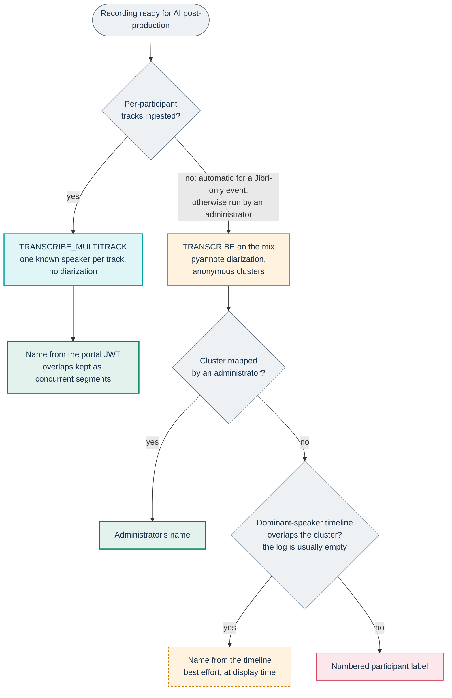
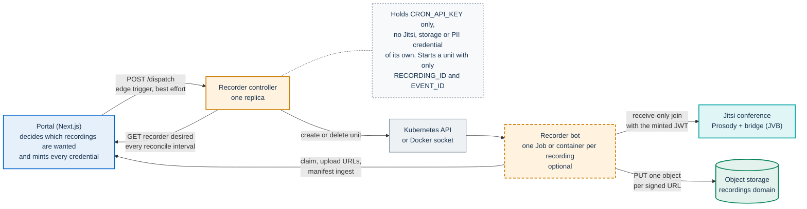

# ADR-013: Per-participant multitrack recording for speaker attribution

**Status:** Accepted

**Extends:** [ADR-006](006-recording-and-storage.md)

The capability is implemented and optional. An installation turns it on with `recorder.enabled`, which
defaults to `false` in `infra/helm/pa-webinar/values.yaml`, together with `recorder.controller.enabled`,
which defaults to `true` there. Each event then opts in. The `recorder` profile of Docker Compose defines
the controller, but the shipped Compose file needs the additions listed in
[Recording](../architecture/recording.md#docker-single-vm) before it completes a recording. This record
states the decision and the design facts it rests on. The mechanisms are described in full in
[Recording](../architecture/recording.md#per-participant-audio-with-the-multitrack-recorder).

## Context

AI post-production ([ADR-016](016-in-cluster-ai-postproduction.md)) turns a recording into a transcript.
For an event that only Jibri records, the input is one MP4 with a single mixed audio track
([ADR-006](006-recording-and-storage.md)). The `TRANSCRIBE` job runs WhisperX on the mix, then pyannote
diarization to split it by voice. Diarization groups voices into anonymous acoustic clusters
(`SPEAKER_00`, `SPEAKER_01`, and so on) that carry no identity. It has structural limits:

- **Mislabels.** It can get the number of speakers wrong when voices are similar, interventions are short
  or the conference audio is compressed. The expected number of speakers (`Event.expectedSpeakers`)
  fixes the cluster count, which helps, but it does not make the attribution right.
- **One speaker per segment.** When two people talk at once, one of them is lost or attributed to the
  other.
- **Manual work.** Each cluster has to be mapped to a real name by hand in the transcript editor.

Jitsi already knows the ground truth. Each endpoint sends its own audio stream to the bridge. Each
participant carries the display name from the portal-signed JWT ([ADR-004](004-jitsi-jwt.md)). The
conference also reports who the dominant speaker is. The mix discards all of this.

The goal is exact attribution, meaning a real name rather than an acoustic cluster, and natural handling
of overlapping speech. Four constraints apply:

- **The Jitsi boundary.** Jitsi source code is never modified, and a Jitsi upgrade must stay cheap
  ([ADR-001](001-jitsi-iframe-api.md)).
- **An isolated voice is sensitive personal data.** A file that holds one person's voice is closer to
  biometric data than a mix is. It needs its own consent, a short retention, encryption of what
  identifies the speaker, and no public exposure.
- **Portability.** Public administrations (PAs) that reuse PA Webinar run any Kubernetes distribution, or
  a single VM with Docker Compose. The portal is one platform-agnostic deployable
  ([ADR-002](002-nextjs-fullstack.md)), and it must not depend on the Kubernetes API.
- **Contained credentials.** Only the portal holds storage keys and the key that encrypts personal data
  ([ADR-006](006-recording-and-storage.md)).

## Decision

PA Webinar records per-participant audio with a headless recorder bot (option A in
[Alternatives considered](#alternatives-considered)), orchestrated by a small reconciling controller. It
keeps two fallbacks.

- **The recorder bot** (`infra/recorder`) joins the conference of a `LIVE` event receive-only. It writes
  one audio track per participant track session, labeled with the participant's Jitsi endpoint id and
  display name. The worker's `TRANSCRIBE_MULTITRACK` job transcribes each track without diarization and
  merges the segments. Overlaps are kept, and segments that overlap another speaker are marked as
  concurrent.
- **The dominant-speaker timeline** (option D) is captured in every live room. Each browser reports
  dominant-speaker changes through the IFrame API to `POST /api/events/<param>/speaker-events`, and the
  portal appends them to a call session's `CallSession.dominantSpeakerLog`. The transcript view uses the
  timeline to name anonymous diarization clusters. In the current code this fallback rarely finds a
  timeline to use (see [below](#how-a-transcript-gets-its-speaker-names)).
- **Diarization of the mix** remains the path for every event without per-participant tracks.

The decision sets these boundaries:

- **A deliberate exception to ADR-001.** The bot uses `lib-jitsi-meet`. It loads the library and the
  deployment's `config.js` at run time from the installation's own Jitsi web server, so it always matches
  the deployed Jitsi version. No Jitsi source is modified, and no Jitsi client code is bundled.
- **The portal decides and mints.** It decides which recordings are wanted and issues every Jitsi token
  and storage permission. In the recording path, the controller is the only component that talks to the
  Kubernetes API or the Docker socket; the portal never does.
- **Optional at two levels.** `recorder.enabled` (with `recorder.controller.enabled`) controls the
  installation. For each event, `multitrackRecordingEnabled` (**Per-participant recording (high
  accuracy)**) takes effect only together with `recordingEnabled` and `aiTranscriptEnabled`.
- **A consent of its own**, separate from the recording consent.
- **Tracks are intermediate input.** They are never public, and they are deleted after transcription
  unless the event keeps them.
- **Audio only.** The bot publishes nothing and records no video.

### How a transcript gets its speaker names

The fallbacks form a chain. The transcript route
(`app/src/app/api/events/[param]/postprod/transcript/route.ts`) applies the last three steps each time a
transcript is displayed.

The transcript route reads the timeline from the call session linked to the recording. When nothing
matches, the cluster gets a numbered participant label, and an administrator can still map it by hand.

In the current code the timeline branch rarely names a cluster. The speaker-events route appends to the
event's newest open call session, which is normally the analytics session that the live page opens on
the first join. The Jibri webhook links a Jibri-only recording to a new call session that it creates
already closed, so the log the transcript route reads for that recording is normally empty. Each browser
also measures `atMs` from its own join, not from the start of the recording.

## Consequences

### What the decision buys

- **Named transcripts with no mapping.** Names come from the identity the portal issued, and overlapping
  speech is kept. The transcript panel marks concurrent segments.
- **No diarization model for these events,** and the rest of the pipeline is unchanged.
- **Portable orchestration.** The same controller and the same reconcile run on Kubernetes and on Docker.
  The portal stays platform-agnostic and never needs cluster permissions.
- **Contained credentials.** The controller holds no Jitsi, storage or personal-data credential, but its
  `CRON_API_KEY` can obtain them. Each upload URL the bot receives covers one object.
- **Self-healing.** Missed edge triggers and controller restarts are repaired at the next tick. A failed
  bot is replaced after its unit is cleaned up.

### What it costs

- **A heavy media component.** The bot image carries headless Chrome and PulseAudio. Headless Chrome
  records remote audio as silence unless the track is also being played out. The bot plays each track
  through a hidden `<audio>` element and starts a best-effort PulseAudio null sink so that Chrome has an
  output device. Each bot requests 1 CPU and 2 GiB in `values.yaml`, and one bot runs per recorded `LIVE`
  event.
- **Hard to test.** The capture needs a real Jitsi deployment. CI runs the unit tests and type checks of
  the recorder and the controller, which cover the manifest, the paths, the upload, the claim and the
  reconcile logic. End-to-end capture is validated against a running installation. As a safeguard, the
  portal refuses to transcribe a recording whose tracks are all silent: it marks the recording
  `POSTPROD_FAILED` instead (`app/src/lib/ai/track-silence.ts`).
- **More personal data.** An isolated voice per person, mitigated by consent, encryption of names and
  early deletion, but still real. The waiting-room consent leaves no stored record, and moderators are
  recorded without a gate.
- **A shared machine key.** The bot and the controller hold `CRON_API_KEY`, which authorizes every
  internal and scheduled endpoint. The controller's role can create Jobs, and a Job can mount any Secret in
  the release namespace. On Docker, the socket is root-equivalent on the host.
- **A dependency on post-production.** Tracks are transcribed only when post-production runs, and the
  purge and retention CronJobs render only when `postprod.enabled` is true. Its default is `false`. Turn
  the recorder on only together with post-production.
- **No indicator in the room** when only the recorder captures.
- **The edge trigger needs the JVB scaler.** Without it, a recorder starts within one reconcile interval.
- **Runs after the first.** When a bot ends while its event is still `LIVE`, for example at the capture
  cap, a new run starts for the same recording once the finished unit is cleaned up. Its tracks are
  stored, but they do not start a new transcription. The new run writes into the same folder, replaces
  `tracks.json`, and can reuse a track key of the first run. A re-uploaded track whose row is already
  marked purged is not purged again.
- **A changed transcript contract.** Segments may overlap in time. The transcript panel marks them as
  concurrent, and WebVTT allows overlapping cues. Any other consumer of `TRANSCRIPT_JSON` must not assume
  that segments are sequential.

## Alternatives considered

### A. A receive-only recorder bot (chosen)

A bot joins the conference as a participant that publishes nothing. It subscribes to every remote audio
track and writes one audio file per participant. Each file is labeled with the identity that Jitsi
already has. After the event, the bot uploads the files and a manifest. The worker transcribes each
track on its own, without diarization, and merges the segments on a common timeline.

- **Exact attribution.** The identity comes from the JWT, not from acoustic inference, so no manual
  mapping is needed.
- **Overlaps are solved by construction.** Two people speaking at once produce two concurrent segments
  from two separate files.
- **Better input for speech recognition.** Each track is clean single-speaker audio with no cross-talk,
  and the job needs no diarization model.
- **Only the ingest changes.** Storage, the job queue, the transcript editor and the downstream jobs
  (summary, translation, subtitles, dubbing) consume the same `TRANSCRIPT_JSON`.

The costs:

- It is a new media component to write and maintain, and it is the riskiest piece of the design.
- It scales with events: one bot per recorded event, with the CPU and the bandwidth to receive every
  stream.
- It creates more sensitive personal data, one isolated voice per person.
- It needs more storage than one mix. Tracks are Opus audio at 32 kbps (`infra/recorder/src/capture.ts`),
  and they are deleted after transcription by default.

### B. Jigasi

Jigasi is Jitsi's gateway for SIP and live transcription. It joins a conference and receives
per-participant streams with their identity, so it is the native Jitsi way to reach separate voices. It is
built for live speech-to-text through its own integrations, not for high-quality capture that is
processed after the event. Turning it into a track recorder works against its design, and it would still
be a new service to run. It was rejected.

### C. An RTP dump inside the bridge

This option extends or patches Jitsi Videobridge to dump the RTP of each endpoint. It touches the core of
the SFU, breaks with Jitsi upgrades, contradicts [ADR-001](001-jitsi-iframe-api.md), and is outside what
the project maintains. It was rejected.

### D. Keep the mix and add a dominant-speaker timeline

This option keeps the Jibri mix and captures the dominant-speaker changes in the live room. It then
aligns the diarization clusters to that timeline to give them real names. It is small: a listener, an
ingest route and an alignment step, with no new service and no extra audio. It does not solve overlaps,
because only one person is the dominant speaker at a time, and it still depends on diarization for
segmentation. D is not an alternative to A. It is a low-cost complement, and it is adopted as a fallback
(see [Decision](#decision)).

### Within option A: a browser, not a Node WebRTC stack

`lib-jitsi-meet` is written for a browser. It uses DOM APIs and the browser's WebRTC implementation:
simulcast, data channels, statistics, `MediaStreamTrack` and `MediaRecorder`. Node WebRTC libraries such
as `node-webrtc` and `werift` do not implement all of it, and the shims they would need tend to break at
each Jitsi upgrade. Chrome, driven headless by Puppeteer, runs the same WebRTC stack as the participants'
browsers; Jibri likewise records through a real Chrome. The price is a heavier image. Headless Chrome was
chosen.

### Within option A: a controller, not a CronJob

The AI pipeline's orchestrator is a CronJob that starts workers for a queue
([ADR-016](016-in-cluster-ai-postproduction.md)). That shape does not fit recording:

- **Latency.** A Kubernetes CronJob runs at most once a minute. It can miss the opening of an event, and
  an opening cannot be recorded later.
- **Waste.** A queue-driven spawner starts generic workers up to a target count. For recording, it would
  start bots that have no event to record.
- **Portability.** A CronJob exists only on Kubernetes, and the same logic must run on a VM with Docker.

## Implementation notes

`app/prisma/schema.prisma` is the authority for the data model. The mechanisms, contracts and trust
boundaries are described in [Recording](../architecture/recording.md); the values that turn them on are in
[Setting up recording](../operations/recording-setup.md).

### Orchestration

`infra/recorder-controller` runs one reconcile function from two triggers:

- **Level-triggered: the backbone.** Every `RECONCILE_INTERVAL_MS` (Helm
  `recorder.controller.reconcileIntervalMs`), the controller reads `GET /api/internal/recorder-desired`
  and compares the answer with the recorder units that exist. The reconcile repairs lost triggers,
  replaces failed units once the runner has removed them (after `recorder.ttlSecondsAfterFinished` on
  Kubernetes, at once on Docker) and removes duplicates.
- **Edge-triggered: for latency.** When the JVB scaler's call to `/api/internal/jvb-desired-replicas`
  moves an event from `PROVISIONING` to `LIVE`, the portal sends a fire-and-forget `POST /dispatch` to
  `RECORDER_CONTROLLER_URL`. The controller answers `202` and reconciles at once. Every other way of
  reaching `LIVE`, and every installation without the JVB scaler, relies on the next tick.

The reconcile keeps **one unit per recording**. The portal lists the events that are `LIVE` and have
`recordingEnabled`, `aiTranscriptEnabled` and `multitrackRecordingEnabled` set, each as a `recordingId`
and an `eventId`. A unit is created only for a desired recording that has no active or succeeded unit. Its
name is derived from the `recordingId`, so a name conflict on create counts as success; this is also why a
failed Kubernetes Job blocks its replacement until it is removed. On Kubernetes, the Job itself retries a
crashed pod in place (`recorder.backoffLimit`). When two active units exist for the same recording, the
first is kept and the others are deleted. The controller does not stop a recorder when its event leaves
`LIVE`: the bot ends on its own timeouts, and the runner cleans up finished units. The decision logic is a
pure, unit-tested function, `infra/recorder-controller/src/reconcile.ts`; the runners only do I/O. The
labels and naming are in [Recording](../architecture/recording.md#reconcile-rules).

The chart runs the controller as a one-replica `Deployment` with the `Recreate` strategy and no leader
election. The reconcile is idempotent and the names are deterministic, so two controllers that overlap
briefly still converge on one unit per recording. `/dispatch` is unauthenticated. It only triggers a
reconcile, which reads the desired state from the portal, so a stray call cannot create a recorder that
the portal does not want.

The controller starts units through the `RecorderRunner` interface, chosen with `RUNNER`: `kubernetes`
creates a `Job` from a suspended CronJob template with a namespaced `Role`, and `docker` creates a
container through the Docker socket. The runners, their privileges and their clean-up are in
[Recording](../architecture/recording.md#runners). The shipped Compose file does not run the Docker path
end to end; the missing settings are listed in [Recording](../architecture/recording.md#docker-single-vm).

### Who mints what

The controller starts a unit with only `RECORDING_ID` and `EVENT_ID`, plus the static settings of its
runner. The portal mints everything else when the bot asks for it.

| What | Minted by | When | Scope |
|---|---|---|---|
| The `Recording` and a dedicated `CallSession` | `GET /api/internal/recorder-desired` | The first reconcile that sees the eligible `LIVE` event | One per event while its key is still the placeholder. Once a Jibri webhook has attached an MP4, a later recorder-desired call for a `LIVE` event creates a new `Recording` and `CallSession`, and the controller starts a new bot for it |
| The bot's Jitsi JWT | `POST /api/internal/recorder-claim` | When the bot starts | The event's room. The bot is not a moderator. It has the stable user id `rec-bot-<recordingId>` and the reserved display name `RECORDER_DISPLAY_NAME` (`app/src/lib/jitsi/participants.ts`) |
| Each upload URL | `POST /api/internal/recorder-upload-url` | For each object, after the capture | One object confined to `recordings/multitrack/<eventId>/<recordingId>/` (`app/src/lib/recorder/blob-key.ts`). Refused once the recording is `ARCHIVED` |
| `RecordingTrack` rows, encrypted names, the pipeline | `POST /api/internal/multitrack-manifest` | After the upload | That recording. Each key must sit under its prefix |
| Read URLs for the worker | The post-production claim | For each job | One object each, for the length of the job's lease |

Credentials that are held rather than minted:

- **The controller** holds `CRON_API_KEY`, which it uses only to read the desired list, and a namespaced
  service account.
- **The bot** holds `CRON_API_KEY`. With the hidden domain set, it also holds the recorder's XMPP
  account. It holds no storage key and no key that encrypts personal data. The participant names travel
  in plain text in the manifest, and the portal encrypts them on ingest.

`CRON_API_KEY` is the installation-wide key for internal and scheduled endpoints. Each credential the
portal mints with it is confined to one room or one object. The key itself is not scoped to a recording:
whoever holds it can claim any recording and call every internal and scheduled endpoint (see
[A shared machine key](#what-it-costs)). The trust boundaries are detailed in
[Recording](../architecture/recording.md#trust-boundaries) and in
[Identity, access and tokens](../architecture/identity-and-access.md).

### Data model

The diagram of the recording models is in [Recording](../architecture/recording.md#data-model).

- **The `Recording` exists before any file.** The recorder needs a `recordingId` from the moment it
  starts, while the Jibri webhook arrives only when Jibri stops recording. `ensureMultitrackRecording`
  (`app/src/lib/recorder/lifecycle.ts`) is called by `recorder-desired`. It creates a dedicated
  `CallSession`, which starts at the event's `startsAt`, and a `Recording` whose `blobKey` is the
  placeholder `recordings/multitrack/<eventId>/`. The call is idempotent only while that placeholder key
  is in place. When Jibri's webhook arrives, it attaches the MP4 to this row, replacing the placeholder
  key, and enqueues nothing.
- **`RecordingTrack` is one row per track session.** It is unique on (`recordingId`, `blobKey`), and the
  key contains the track session id `<participantId>-<sequence>`. When a participant's audio track is
  added again, the bot writes a new file and the portal adds a new row, so the first session is never
  overwritten. A row holds the Jitsi endpoint id (`participantId`), the encrypted `displayName`, the
  storage key, the size, `startOffsetMs`, `durationMs` and `audioPurgedAt`. A retried ingest updates the
  same rows.
- **Speaker labels come from the tracks.** The worker merges the rows that share a `participantId` under
  one speaker label. The transcript's speaker list carries the names, and the portal stores them on
  `Speaker` rows, so nobody maps speaker labels by hand.
- **Timing.** Each track's origin is the moment its `MediaRecorder` starts. The manifest's t0 is the
  earliest origin, and each track carries its offset from t0. When the Jibri mix exists on the same
  recording, the worker refines each offset by cross-correlating energy envelopes against the mix
  (`infra/ai/worker/align.py`). When the correlation is weak, it keeps the manifest offset.
- **A shared contract.** Three components depend on the storage layout and on the `tracks.json`
  manifest: the recorder (`infra/recorder/src/paths.ts`, `infra/recorder/src/manifest.ts`), the portal's
  confinement checks, and the worker (`infra/ai/worker/multitrack.py`). A change to the layout changes all
  three.

### Consent gates

The privacy view, including legal bases and retention regimes, is owned by
[Recordings, voice data and AI outputs](../privacy/recordings-and-ai.md). This section and the three that
follow record what the decision requires and where the code enforces it.

- **At registration.** When `multitrackRecordingEnabled` is on, the registration API rejects a
  registration without `consentMultitrack`. The answer is stored on `Registration.consentMultitrack`,
  which is null for events without per-participant recording.
- **In the waiting room.** The consent checkbox in the **Per-participant recording** box must be ticked
  before entry. A registrant who consented at registration and opens the room in the same browser is not
  asked again. That browser is the one that holds the signed event-access cookie. Moderators are exempt.
  Speakers (named grants with role `SPEAKER`) and guests must tick the box.
- **What the gates are.** They are admission gates, not a filter on tracks. The bot records every remote
  audio track, including those of the exempt moderators. The waiting-room tick is checked in the browser
  only. It is not stored, and the room-token route (`/api/events/[param]/jitsi/token`) does not check it.
  Jitsi's in-room recording indicator follows Jibri only, so a capture made only by the recorder does not
  raise it.

### Consent snapshot

When post-production is enqueued at manifest ingest, the portal writes `Recording.consentSnapshot`. The
snapshot holds the event's AI flags, including `multitrackRecordingEnabled`, and a timestamp. It records
what was switched on when processing started. No code reads it back to gate processing.

### Purge after transcription

`GET /api/cron/multitrack-purge` deletes a track's audio and stamps `audioPurgedAt` once two conditions
hold:

- a `TRANSCRIBE_MULTITRACK` job of the track's recording is `DONE`;
- no `TRANSCRIBE_MULTITRACK` or `ARCHIVE` job of that recording is still pending or running.

In the chart, the job is a CronJob that renders only when `postprod.enabled` is true. Its schedule is
`postprod.multitrackPurgeSchedule`, every 15 minutes by default in
`infra/helm/pa-webinar/templates/cronjob-multitrack-purge.yaml`.

### Keeping tracks

**Keep per-participant tracks** (`Event.retainParticipantTracks`, off by default) keeps the audio after
transcription, for the downloadable archive and per-speaker playback. The audio is then meant to live
until the recording's retention expires, when `multitrack-purge` or `postprod-retention` deletes it. The
orphan sweep (`recordings-reconcile`) also treats these objects as orphans and deletes them after
`SiteSetting.orphanRecordingGraceDays` unless they are marked **Keep** (see
[Known limitations](#known-limitations)). Turning per-participant recording off in the event wizard also
turns this option off. The consent text that participants see still says that the track is deleted after
transcription.

```mermaid
stateDiagram-v2
    direction LR
    state "On the bot's work volume<br/>during the event" as Local
    state "In object storage<br/>RecordingTrack row, name encrypted" as Stored
    state "Transcribed<br/>TRANSCRIBE_MULTITRACK done" as Transcribed
    state "Kept<br/>Keep per-participant tracks on" as Kept
    state "Audio deleted<br/>audioPurgedAt set" as Purged
    state "Audio deleted by the orphan sweep<br/>row kept, audioPurgedAt not set" as Swept
    state "Row deleted" as Gone

    [*] --> Local: consent gates passed, bot captures
    Local --> Stored: upload with one signed URL per object, then manifest ingest
    Stored --> Transcribed: worker reads the track through a signed URL
    Transcribed --> Purged: multitrack-purge, default
    Transcribed --> Kept: event keeps tracks
    Kept --> Purged: recording retention expires, multitrack-purge
    Kept --> Gone: recording retention expires, postprod-retention
    Kept --> Swept: orphan sweep after the grace period, unless marked Keep
    Purged --> Gone: event data retention (cleanup) or recording retention
    Swept --> Gone: recording retention, postprod-retention
    Gone --> [*]

    classDef capture fill:#E0F5F5,stroke:#00A3A3,color:#17324D
    classDef stored fill:#E6F0FA,stroke:#0066CC,color:#17324D
    classDef job fill:#FFF3E0,stroke:#CC7A00,color:#17324D
    classDef risk fill:#FCE8EC,stroke:#D1344C,color:#17324D
    classDef done fill:#E3F2EC,stroke:#008055,color:#17324D
    class Local capture
    class Stored stored
    class Transcribed job
    class Kept risk
    class Swept risk
    class Purged done
    class Gone done
```

The tracks serve only to attribute text. They are not used to build voiceprints or to clone voices.
Dubbing uses synthetic voices from a catalog ([ADR-016](016-in-cluster-ai-postproduction.md)). The
manifest `tracks.json` keeps the display names in plain text, and the purge jobs do not delete it; in
practice the orphan sweep is what removes it. See the known limitations in
[Recording](../architecture/recording.md#known-limitations).

### The hidden Prosody domain (optional)

By default, the bot joins with its JWT. It is then a visible participant under the reserved display name,
and the portal leaves that name out of its headcounts and rosters. Setting `recorder.hiddenDomain` makes
the bot invisible with Jitsi's native mechanism for bots, the one Jibri uses. The bot logs in with SASL on
Prosody's hidden virtual host instead of presenting the JWT. Every Jitsi client drops the participants
whose real JID is on `config.hiddenDomain`: they get no tile, no roster entry and no join notification,
and they are not counted.

This path has these requirements:

- `recorder.xmppSecretName` must name the Secret that holds the recorder account. The chart refuses to
  render when the domain is set without it.
- The account must exist on Prosody. The Jitsi subchart creates it, and its Secret, only when
  `jitsi-meet.jibri.enabled` is true; `replicaCount` can stay at `0`.
- The MUC must admit that single account without a token, through `mod_token_verification`'s
  allowlist. Allowing the whole domain would let anyone who holds the password into any room.
- The account's password must be pinned, so that an upgrade does not regenerate it.

The steps are in [Setting up recording](../operations/recording-setup.md#make-the-bot-invisible), and the
Jitsi side is in [How PA Webinar extends Jitsi Meet](../architecture/jitsi-integration.md).

A rejected login must not cost the event its audio. If the bot never joins the conference with the
hidden-domain login, it runs the whole capture again with the JWT, and it stays visible for the rest of
the event. The condition, "never joined", is checked after the capture ends. A room that simply stayed
empty is therefore not retried, and a disconnection in the middle of the event does not make the bot
reappear as a visible participant. A bot that never joins with either method exits with an error, so the
unit fails and is retried. Hiding the bot does not hide the recording: the consent gates apply
regardless.

### Timeouts and limits

- **The JWT lifetime follows the event.** It is the time left until the event's `endsAt` plus 30
  minutes, at least 10 minutes and at most 6 hours (`app/src/app/api/internal/recorder-claim/route.ts`).
  The 6-hour ceiling matches the Job's default deadline. The bot presents the JWT only when it joins with
  it.
- **The capture cap stays at or below the Job deadline.** Keep `recorder.maxDurationSec` at or below
  `recorder.activeDeadlineSeconds`, so that the bot saves its tracks before Kubernetes stops it.
- **Every exit saves.** When the capture ends for any reason, whether an empty room, the cap or a failed
  conference, the bot saves what it has recorded. Each upload URL covers one object for 30 minutes.
  Uploads run four at a time with three attempts per object. A track that still fails is skipped, and the
  manifest lists only the tracks that were uploaded, so the portal never refers to a missing object.

The defaults of the wait for the first participant, the idle timeout, the capture cap, the Job deadline,
retries, clean-up and the work volume are in
[Setting up recording](../operations/recording-setup.md#recorder-values).

## Known limitations

- **The dominant-speaker fallback rarely names a cluster.** The timeline and the recording normally sit
  on different call sessions, and each browser times the timeline from its own join (see
  [How a transcript gets its speaker names](#how-a-transcript-gets-its-speaker-names)).
- **A second multitrack recording in one event.** The portal recognizes the event's multitrack
  `Recording` by its placeholder key, and a Jibri webhook replaces that key. Once a webhook has attached
  an MP4, the next desired-state call for a `LIVE` event (Jibri stopped mid-event, or the event went
  `LIVE` again after `IDLE`) creates a second `Recording` and `CallSession`, and the controller starts a
  second bot even if the first is still in the room. The event then gets two sets of tracks and two `TRANSCRIBE_MULTITRACK` pipelines.
- **No automatic transcript when the recorder captures nothing.** On an event with per-participant
  recording, the Jibri webhook attaches the MP4 to the placeholder and enqueues nothing. If the recorder
  produced no tracks, the mix is not transcribed until an administrator runs post-production.
- **Kept tracks and the orphan sweep.** Retained track audio and every `tracks.json` can be deleted by the
  orphan sweep before the recording's retention (see [Keeping tracks](#keeping-tracks)).
- **Re-used track keys.** A later run for the same recording can overwrite a track of the first run, and
  the purge jobs skip it when its row is already marked purged (see [What it costs](#what-it-costs)).

The complete list of limits of both recording paths is in
[Recording](../architecture/recording.md#known-limitations).

## Related

- [Recording: composite video and per-speaker audio](../architecture/recording.md): triggers, the claim
  model, capture, the manifest and ingest contracts, the runners and the lifecycle
- [Setting up recording](../operations/recording-setup.md): the `recorder.*` values, the hidden domain and
  checks
- [AI post-production](../POSTPROD.md): `TRANSCRIBE_MULTITRACK`, the archive and the transcript editor
- [Recordings, voice data and AI outputs](../privacy/recordings-and-ai.md) and
  [Privacy and data protection](../GDPR.md): consent, retention regimes and legal bases
- [How PA Webinar extends Jitsi Meet](../architecture/jitsi-integration.md): Prosody, the hidden domain and
  the IFrame API
- [Identity, access and tokens](../architecture/identity-and-access.md): the Jitsi JWT and `CRON_API_KEY`
- [Scheduled and background jobs](../architecture/background-jobs.md): `multitrack-purge`,
  `postprod-retention` and `recordings-reconcile`
- Component READMEs: [`infra/recorder`](../../infra/recorder/README.md) and
  [`infra/recorder-controller`](../../infra/recorder-controller/README.md)
- [ADR-001](001-jitsi-iframe-api.md), [ADR-004](004-jitsi-jwt.md), [ADR-006](006-recording-and-storage.md),
  [ADR-016](016-in-cluster-ai-postproduction.md)
