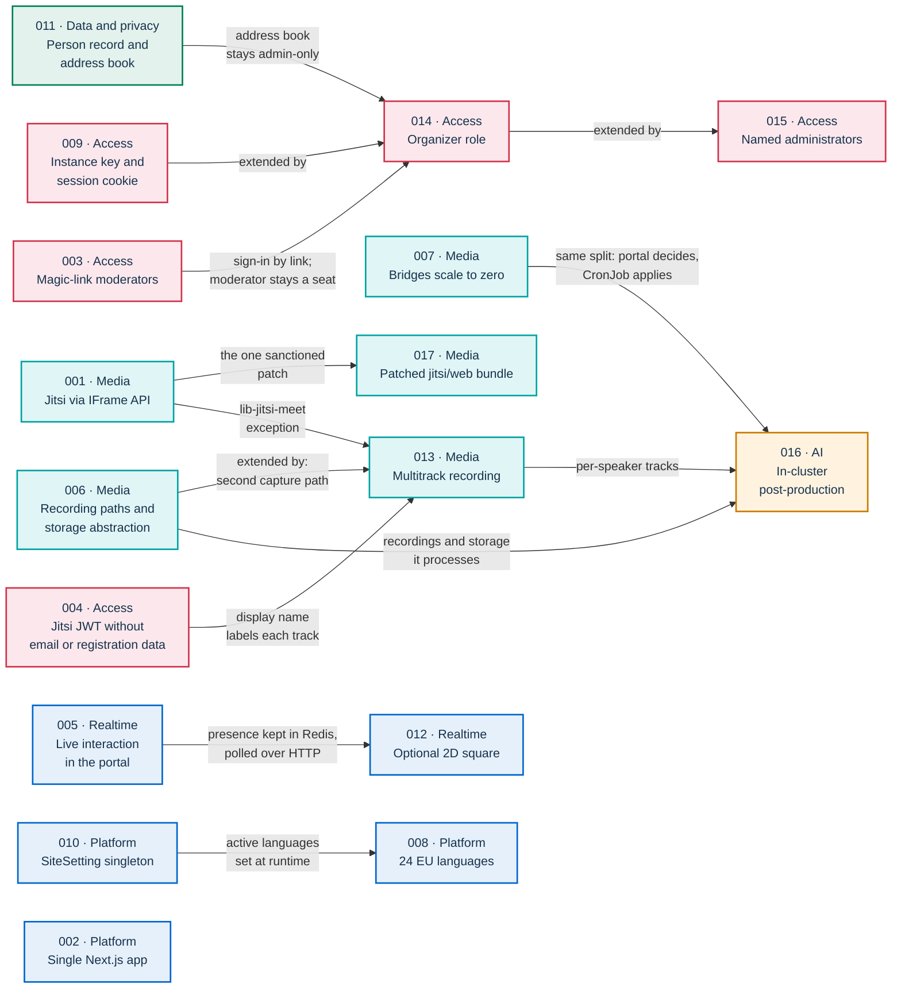
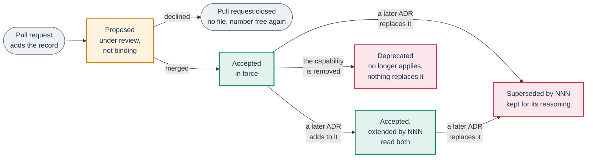

# Architecture decision records

An Architecture Decision Record (ADR) states one decision that shapes PA Webinar. It gives the context that forced the decision, what was chosen, what was rejected and why, and the consequences the project accepted. This page is the index of those records, the status legend, the template and the process for adding one.

This page is for maintainers and contributors who change the architecture, and for architects who evaluate PA Webinar for reuse by another public administration (PA).

## What an ADR is here

An ADR explains **why** the platform is built the way it is. The deep-dive pages explain **how** it behaves now. If a record and the code disagree about behavior, the code wins. The record is then corrected in place, as described in [Changing a decision](#changing-a-decision), and the deep dive is the page to read for detail.

Write an ADR when a decision does at least one of these things:

- **It constrains future work.** It sets a boundary that other changes must respect, for example "Jitsi Meet is extended only through the IFrame API and configuration" or "the Jitsi JWT carries no email address, no email hash and no registration data, and the display name is the only personal data the room can read in it".
- **It is expensive to reverse.** Examples are a new deployable or external service, a credential model, a new data domain, or a new category of personal data.
- **It explains why an obvious alternative was rejected.** A newcomer will propose that alternative again. Examples are an off-the-shelf social lobby instead of the in-house square (ADR-012), or Jigasi or an RTP dump inside the bridge instead of the recorder bot (ADR-013).

In practice, the triggers named in [CONTRIBUTING.md](../../CONTRIBUTING.md) always need a record: a new component, a new external service, a change to a trust boundary or to the Jitsi boundary, and a new data domain.

A bug fix, a new setting inside an existing mechanism, a UI change, a dependency update or a refactor that keeps its contracts does not need an ADR. Pull-request review settles those, as described in [GOVERNANCE.md](../../GOVERNANCE.md).

ADR-001 to ADR-010 record the platform's founding decisions. Later records take the next free number when their pull request is opened; see [Numbering and filenames](#numbering-and-filenames).

## Index

| ADR | Decision | Status | Relations | Owner deep dive |
|---|---|---|---|---|
| [001](001-jitsi-iframe-api.md) | Embed Jitsi Meet through the IFrame API | Accepted | Deliberate exceptions: [013](013-multitrack-speaker-attribution.md) (the recorder bot uses `lib-jitsi-meet`) and [017](017-patched-jitsi-web-image.md) (the patched web bundle) | [Jitsi integration](../architecture/jitsi-integration.md) |
| [002](002-nextjs-fullstack.md) | A single Next.js full-stack application | Accepted | None. Every other record assumes it | [Architecture](../ARCHITECTURE.md) |
| [003](003-moderator-magic-links.md) | Moderators and speakers by magic link, no accounts | Accepted | [014](014-organizer-role.md) builds on it: staff also sign in by link, and the moderator stays a seat | [Identity, access and tokens](../architecture/identity-and-access.md) |
| [004](004-jitsi-jwt.md) | Portal-signed Jitsi JWT with no email or registration data | Accepted | [013](013-multitrack-speaker-attribution.md) builds on it: the display name in the JWT labels each per-participant audio track | [Identity, access and tokens](../architecture/identity-and-access.md) |
| [005](005-live-interaction-in-portal.md) | Live interaction lives in the portal | Accepted | [012](012-garden-waiting-room.md) builds on it: presence lives in Redis, not PostgreSQL | [Live interaction and realtime](../architecture/live-interaction.md) |
| [006](006-recording-and-storage.md) | Optional recording paths on provider-agnostic storage | Accepted; extended by [013](013-multitrack-speaker-attribution.md) | Extended by [013](013-multitrack-speaker-attribution.md) with the per-participant path; [016](016-in-cluster-ai-postproduction.md) processes its recordings | [Recording](../architecture/recording.md), [Object storage](../configuration/storage.md) |
| [007](007-jvb-scale-to-zero.md) | Scale bridges to zero, driven by events | Accepted | [016](016-in-cluster-ai-postproduction.md) reuses its split: the portal decides, and a CronJob applies the decision to the cluster | [Scaling the media plane](../architecture/scaling.md) |
| [008](008-eu-languages.md) | 24 EU languages with next-intl | Accepted | Builds on [010](010-site-settings-singleton.md) for the active languages and translation overrides | [Languages and localization](../architecture/i18n.md) |
| [009](009-admin-session.md) | Administration by instance key and signed session cookie | Accepted; extended by [014](014-organizer-role.md) and [015](015-named-administrators.md) | [014](014-organizer-role.md) adds organizers; [015](015-named-administrators.md) adds named administrators | [Identity, access and tokens](../architecture/identity-and-access.md) |
| [010](010-site-settings-singleton.md) | A `SiteSetting` singleton for runtime configuration | Accepted | [008](008-eu-languages.md) builds on it | [Runtime settings](../configuration/runtime-settings.md) |
| [011](011-person-rubrica.md) | Cross-event person record and opt-in address book | Accepted | Constrains [014](014-organizer-role.md): the address book stays admin-only | [Privacy and data protection](../GDPR.md) |
| [012](012-garden-waiting-room.md) | An optional 2D social waiting room | Accepted | Builds on [005](005-live-interaction-in-portal.md) | [The waiting room and the square](../architecture/waiting-room.md) |
| [013](013-multitrack-speaker-attribution.md) | Per-participant multitrack recording for speaker attribution | Accepted | Extends [006](006-recording-and-storage.md); builds on [004](004-jitsi-jwt.md); exception to [001](001-jitsi-iframe-api.md); feeds [016](016-in-cluster-ai-postproduction.md) | [Recording](../architecture/recording.md) |
| [014](014-organizer-role.md) | The organizer role | Accepted; extended by [015](015-named-administrators.md) | Extends [009](009-admin-session.md); builds on [003](003-moderator-magic-links.md); respects [011](011-person-rubrica.md) | [Identity, access and tokens](../architecture/identity-and-access.md) |
| [015](015-named-administrators.md) | Named administrators alongside the instance key | Accepted | Extends [014](014-organizer-role.md) and, through it, [009](009-admin-session.md) | [Identity, access and tokens](../architecture/identity-and-access.md) |
| [016](016-in-cluster-ai-postproduction.md) | In-cluster AI post-production | Accepted | Builds on [006](006-recording-and-storage.md) and [013](013-multitrack-speaker-attribution.md); reuses [007](007-jvb-scale-to-zero.md)'s scale-to-zero split | [AI post-production](../POSTPROD.md) |
| [017](017-patched-jitsi-web-image.md) | Patch the jitsi/web bundle by shape for fixes with no configuration point | Accepted | The one sanctioned exception to [001](001-jitsi-iframe-api.md)'s rule against modifying Jitsi | [Jitsi integration](../architecture/jitsi-integration.md), [component README](../../infra/jitsi-web-patched/README.md) |

"Accepted" means that the decision is in force. It does not mean that the component runs by default. Several accepted decisions govern optional parts that an installation turns on. In `infra/helm/pa-webinar/values.yaml`, these keys default to `false`: `jvbScaler.enabled` (ADR-007), `jitsi-meet.jibri.enabled` (the composite path of ADR-006), `recorder.enabled` (ADR-013) and `postprod.enabled` (ADR-016).

### How the decisions relate

An arrow runs from a decision to the record that builds on it, extends it, or makes an exception to it. Color marks the area: blue for platform and realtime, red for access, teal for media, green for data and privacy, and amber for AI. ADR-002 has no arrows, because every other record assumes it.



### Where to start

| If you are | Read first |
|---|---|
| Evaluating PA Webinar for reuse | [Reusing PA Webinar](../REUSE.md), then [001](001-jitsi-iframe-api.md), [002](002-nextjs-fullstack.md), [007](007-jvb-scale-to-zero.md), [016](016-in-cluster-ai-postproduction.md), [017](017-patched-jitsi-web-image.md) |
| Changing sign-in, roles or permissions | [003](003-moderator-magic-links.md), [004](004-jitsi-jwt.md), [009](009-admin-session.md), [014](014-organizer-role.md), [015](015-named-administrators.md), then [011](011-person-rubrica.md) |
| Adding a live feature | [005](005-live-interaction-in-portal.md), then [012](012-garden-waiting-room.md) for presence |
| Working on recording or transcripts | [006](006-recording-and-storage.md), [013](013-multitrack-speaker-attribution.md), [016](016-in-cluster-ai-postproduction.md) |
| Adding a language or a runtime setting | [008](008-eu-languages.md), [010](010-site-settings-singleton.md) |

## Status legend

| Status | Meaning |
|---|---|
| **Proposed** | The record is open in a pull request. It is under review and not yet binding. |
| **Accepted** | The pull request was merged. The decision is in force. |
| **Accepted; extended by ADR-NNN** | The decision is still in force, and a later record adds to it. Read both. |
| **Superseded by ADR-NNN** | A later record replaces the decision. The file stays for its reasoning. |
| **Deprecated** | The decision no longer applies and nothing replaces it, for example because the capability was removed. |

A record that extends or supersedes another says so under its status line, with **Extends:** or **Supersedes:** and a link, each on a line of its own separated by a blank line so that the lines do not run together when rendered.



## Template

Copy this block into `docs/adr/NNN-short-slug.md`. Delete the relation lines and the optional sections that do not apply. Every new record has an **Implementation notes** section. Some older records predate that rule and keep their file paths, Helm keys and defaults in the Decision and Consequences sections instead.

```markdown
# ADR-NNN: <the decision, as a short phrase>

**Status:** Proposed

**Extends:** [ADR-NNN](NNN-slug.md)

**Supersedes:** [ADR-NNN](NNN-slug.md)

## Context

The problem and the forces at play: what the platform did before, the
constraints (data protection, accessibility, operation by other public
bodies, licensing), and what breaks or stays impossible without a decision.

## Decision

What we do, in the present tense. State it precisely enough that a reviewer
can check a future change against it. Name the boundary it sets and what it
rules out.

## Consequences

What becomes easier and what becomes harder. The risks accepted and how they
are contained. The effect on operators of other installations and on
personal data.

## Alternatives considered

Each serious option and why it was not chosen, including the obvious
alternative that a newcomer would propose.

## Implementation notes

Required. Current behavior and where it lives: file paths, models, Helm keys,
environment variables, and the guard tests that enforce the decision. Use no
line numbers, counts or version numbers. Keep this section current as the
code changes.

## Known limitations

Optional. The parts of the decision that the code does not implement. When a
gap is planned work, link its roadmap entry. Delete the section when there
are none.

## Related

Other ADRs, the owner deep-dive page, and the relevant configuration or
operations pages.
```

## Process

### Numbering and filenames

- Numbers have three digits. Take the next free number when you open the pull request. If another record is merged with the same number first, renumber yours before merging. A number that has been merged is never reused.
- Filenames are `NNN-short-slug.md` in lowercase kebab case. New slugs are in English.
- **Filenames are stable.** Never rename a record, even when its title changes. Paths to records appear in the documentation, in component READMEs, in `THIRD-PARTY-LICENSES.md`, in comments in `app/prisma/schema.prisma` and in a migration file (applied migrations are never edited). This is why `011-person-rubrica.md` keeps its original slug. ADR numbers are also cited in code comments and in migrations, which is another reason a merged number is never reused.

### Proposing and accepting

1. Write the record from the template, with `**Status:** Proposed`, and open a pull request into `dev`. The pull request may carry the implementation, or it may come first so that the approach is agreed before the code is written.
2. Reviewers check the following:
   - The decision is stated precisely enough to review later changes against it.
   - The alternatives are real.
   - The consequences cover operators of other installations and personal data.
3. Before the merge, complete the pull request:
   - Change the status to **Accepted**.
   - Add the row to the [index](#index) on this page.
   - If the record relates to others, add its arrows to [How the decisions relate](#how-the-decisions-relate).
   - Update the status lines of the older records it extends or supersedes.
4. The merge makes the record accepted. A pull request that is closed without merging leaves no file, and its reasoning stays in the closed pull request.

### Changing a decision

- **Update the status rather than rewriting.** Once a record is accepted, the substance of its decision is not rewritten: the context, what was chosen and the alternatives rejected keep their original reasoning. A changed decision gets a new record that extends or supersedes the old one. The old record's status line then points to the new one.
- Only these edits are made in place:
  - the status and relation lines;
  - file paths, identifiers, Helm keys and defaults, wherever they appear in the record, when files move or identifiers change;
  - **Implementation notes**, **Known limitations** and **Related**, when behavior changes within the decision;
  - corrections of statements that were never true of the code.
- Behavior that changes within a decision is documented in the owner deep dive and in the record's implementation notes, when it has them. It does not need a new record.

### What a record never contains

- **No dates, no names of the people who decided, no meetings and no internal ticket codes.** The history of a record is in git: `git log --follow -- docs/adr/NNN-slug.md`.
- **No progress logs or phase checklists.** A record states the decision and the current implementation. Work that is still missing belongs in the [roadmap](../ROADMAP.md). A record lists only the parts of its own decision that are not built, under **Known limitations**.
- **No real environment data**, such as hostnames, cluster or namespace names, or secret names. Use placeholders such as `webinar.example.com` or `<namespace>`.
- Records are written in English. Code identifiers, Helm keys, environment variables and commands stay verbatim.

Where decisions fit in the wider governance of the project, including who accepts them, is described in [GOVERNANCE.md](../../GOVERNANCE.md). The development process around them is in [How we develop PA Webinar](../development/methodology.md).
