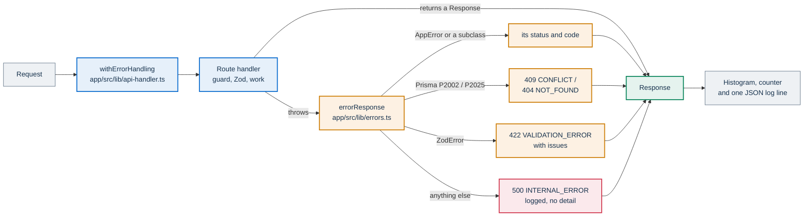
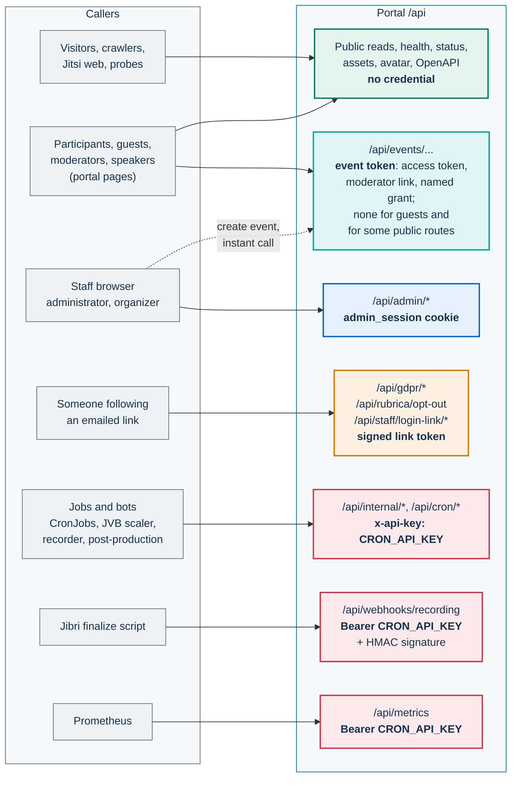

# API surface

The PA Webinar portal exposes a single HTTP API under `/api`. Its main client is the portal's own pages, and the same routes also serve the jobs and bots that run alongside it. This page covers:

- the conventions every route follows;
- the route families and how each one authenticates its caller;
- the error shape;
- the streaming endpoints;
- the OpenAPI document;
- what is stable and what is not.

It does not list every route. The route files under `app/src/app/api/` are the authority.

Other pages own the neighboring topics:

- [Identity, access and tokens](identity-and-access.md) covers each credential: how it is obtained, its lifetime and its revocation.
- [Security architecture](security.md) covers rate limits, the CSRF stance and content sanitization.
- [Live interaction and realtime](live-interaction.md) covers the read and write rules of each live panel, and the framing of the streams.
- [Scheduled and background jobs](background-jobs.md) catalogs the jobs that call the cron routes.
- [Monitoring and health](../operations/monitoring.md) covers probes, metrics and the status page.

## Conventions

### Route handlers, not Server Actions

- Every endpoint is an App Router route handler. It is a `route.ts` file under `app/src/app/api/`, its folder path is the URL, and it exports one function per HTTP method (`GET`, `POST`, `PUT`, `PATCH`, `DELETE`, and `OPTIONS` where a route answers cross-origin preflights). The OpenGraph card, `app/src/app/api/og/event/[slug]/route.tsx`, is the only `.tsx` route, because it renders JSX into an image.
- The code has no Server Actions. Every mutation is an HTTP request to a route handler, including the mutations made by the administration area. The result is one surface that can be reviewed, exercised with `curl` and shared with clients that are not browsers ([ADR-002](../adr/002-nextjs-fullstack.md)).
- The middleware (`app/src/middleware.ts`) does not run on `/api/*`, so there is no global authentication layer. Each handler authenticates its own caller with the check that belongs to its [family](#route-families).
- Most routes also declare `export const dynamic = 'force-dynamic'`. It makes explicit that the answer is never served from a build-time cache.

### Validation

- Structured request bodies are validated with Zod. Shared schemas live in `app/src/lib/validation/schemas.ts`, and the OpenAPI document reuses them. Schemas used by a single route sit at the top of its file.
- Most routes read the body with `parseJsonBody()` in `app/src/lib/api-handler.ts`, which turns malformed JSON into `400 INVALID_BODY`. Some routes call `request.json()` directly instead, and answer malformed JSON differently ([Error shape](#error-shape)).
- The usual pattern is `schema.safeParse(body)`, followed on failure by `throw new ValidationError('Validation failed', parsed.error.issues.map((i) => ({ path: i.path, message: i.message })))`. A route that calls `schema.parse()` instead lets the `ZodError` reach the wrapper, which also answers 422 but puts the list in `issues` rather than `details`.
- Bodies with one or two fields are type-checked by hand. Examples are the instance API key (`ADMIN_API_KEY`) on `POST /api/admin/login`, a join password, and the email address of a resend request.

### The error wrapper

Each handler is wrapped: `export const POST = withErrorHandling(async (request, context) => { … })`. The wrapper, in `app/src/lib/api-handler.ts`:

- catches anything the handler throws and turns it into a response through `errorResponse`, described in [Error shape](#error-shape);
- records the request in the `http_request_duration_seconds` histogram and the `http_requests_total` counter, with the labels `method`, `route` and `status_code`. The `route` label replaces UUIDs and numeric segments with `:id`, but leaves every other segment as it is. Each event slug is therefore its own series, and so is a token carried in a path ([Where tokens end up](#where-tokens-end-up));
- writes one JSON log line per request with the level (`error` for 5xx, `warn` for 4xx, `info` otherwise), method, path, status and duration. The path excludes the query string, and no client IP address is logged, so a `?token=` never reaches the application log. A token in the path does.

Handlers therefore throw typed errors, such as `NotFoundError` or `ForbiddenError`, instead of building error responses themselves.



### Routes outside the wrapper

The routes below export plain functions instead of wrapped ones. They do not appear in the HTTP metrics and write no per-request log line.

| Route | What it does |
|---|---|
| `GET /api/events/{slug}/chat/stream` | Chat stream (SSE). It maps its errors through `errorResponse`, so they keep the standard JSON shape |
| `GET /api/events/{slug}/live/stream` | Live-panel stream (SSE). A missing or non-visible event gets a plain-text 404 |
| `GET /api/events/{slug}/control/stream` | Control-signal stream (SSE). A missing event gets a plain-text 404 |
| `GET /api/openapi.json` | The OpenAPI document ([OpenAPI](#openapi)) |
| `GET /api/assets/{key}` | Serves uploaded files from object storage. Errors are plain text (`Not found`, `Bad request`, `Upstream error`) |
| `GET /api/avatar` | An avatar image: the Gravatar picture through a server-side proxy when Gravatar is enabled (`gravatarEnabled`), generated initials otherwise |
| `GET /api/ready` | Readiness probe. It answers `503 { "status": "not_ready", "error": … }` when the schema queries fail |
| `GET /api/jitsi-branding.json` | A Jitsi dynamic-branding document built from site settings |

### The event segment: slug or UUID

The event routes live under `app/src/app/api/events/[param]/`. Which form of the segment a route accepts depends on the route:

- **Slug only.** Most routes look the event up by slug, and answer 404 to a UUID.
- **Slug or UUID.** The routes that resolve the segment with `eventParamWhere` (`app/src/lib/events/event-param.ts`) match either form. So do a number of routes that test for a UUID themselves, among them the event detail (`GET`), files, moderators, organizers, recording and call sessions. `grep -rln UUID_RE app/src/app/api/events` lists them.
- **UUID only.** `PUT` and `DELETE /api/events/{id}` answer `400 BAD_REQUEST` ("Event ID must be a UUID") to anything that is not a UUID.

The portal sends the slug to the live-room panel routes. It sends the UUID to the management routes: updating and deleting the event (including the start and end controls in the live room), files, moderators, organizers and lowering raised hands. A client should use the UUID to update or delete an event, and the slug everywhere else. This documentation writes the segment as `{slug}`, which stands for whichever form the route accepts, and as `{id}` where only the UUID works.

Administration routes are different: they take the event's UUID, as in `/api/admin/events/{id}/…`.

### One route, several views

Many routes shape their answer to fit the caller:

- `GET /api/events/{slug}` returns the public view, or the full view when the caller holds a moderator token;
- `GET /api/events/{slug}/questions` shows `DISMISSED` questions to moderators only;
- `GET /api/admin/settings` returns every setting to an administrator, and a public subset, cacheable for a few minutes, to anyone else;
- `GET /api/events/{slug}/materials` returns the materials of the current phase (before the start only `BEFORE`; during the event `ALWAYS` and `DURING`; after it `ALWAYS` and `AFTER`), or every material to the primary moderator link or a co-moderator grant sent as a bearer. Each item carries its `visibility` and `fileSize` (bytes for an uploaded file, otherwise `null`). The answer also carries `uploadsEnabled`, true when the installation has files storage, and is `Cache-Control: private, no-store`. `GET /api/events/{slug}/files` applies the same filter to uploaded files, answers `404` for an event without a public page, and returns mapped fields (`fileSize` as a string, no storage path). A staff session does not widen either list ([From creation to recap](event-journey.md#materials-and-agenda));
- `GET /api/status/metrics` and `GET /api/status/postprod` answer an administrator with `Cache-Control: private, no-store` while the status page is off; `/api/status/metrics` is `public, max-age=30` only while it is on.

A response obtained with a credential therefore must not be stored in a shared cache. The same rule is why the live stream pushes snapshots only for data that is identical for every caller ([Live interaction and realtime](live-interaction.md)).

### Localized content

Routes that return titles and descriptions pick the language in this order:

1. `?locale=`, when it is one of the supported locales;
2. the first supported language in `Accept-Language`;
3. `defaultLocale` from `app/src/i18n/config.ts`, which is `it`.

The logic is `resolveLocale` in `app/src/lib/utils/locale.ts`. How languages work across the product is covered in [Languages and localization](i18n.md).

### Uploads

- **Small files go through the app** as `multipart/form-data`. This covers administration assets such as logos, audio, flyers and event material files (`POST /api/admin/assets/upload-url`, which is a direct upload despite its name), material files uploaded from the live room, and chat attachments (`POST /api/events/{slug}/chat/attachment`). The app checks the size, and checks the file's magic bytes against the declared type.
  - The room upload, `POST /api/events/{slug}/materials/upload`, takes a `file` field and optional `title` and `description`, from the primary moderator link or a `MODERATOR` grant. It creates the material with visibility `ALWAYS` and answers `201` with it. It answers `411` without a `Content-Length`, `413` for a file over the material cap, `415` for a type outside the material list or content that does not match it, `409` `MATERIALS_QUOTA_EXCEEDED` once the event holds the maximum number or size of uploaded files, `429` beyond the per-minute limit or while the pod is already receiving other files, and `503` when files storage is not configured. The caps are in `app/src/lib/validation/materials.ts`.
- **Larger files go straight to object storage** through a short-lived presigned URL issued by a route:
  - event material files: `POST /api/events/{slug}/files`, whose answer carries `uploadHeaders`, the headers to send with the `PUT` to `uploadUrl`. No page calls this route; the portal uploads materials through the app, as above;
  - videos uploaded in the administration area: `POST /api/admin/publications/upload-url` with `{ filename, contentType?, sizeBytes }`, for administrators and organizers. It answers with the object's `recordingUrl`, its `objectName`, `contentType`, `expiresInSeconds` and an `upload` plan whose `protocol` is `azure-block` (`url`), `s3-put` (`url`, `headers`) or `s3-multipart` (`uploadId`, `partSize`, `partUrls`). For `s3-multipart`, `POST /api/admin/publications/upload-url/multipart` with `{ objectName, uploadId, sizeBytes }` completes the upload: `200` `{ completed: true }`, also when the upload is already complete and the object has the declared size; `409` `UPLOAD_INCOMPLETE` when parts are missing or the size does not match; `502` `STORAGE_ERROR` on a storage error. `DELETE` on the same route with `{ objectName, uploadId }` aborts it and answers `204`, also when the upload is already complete or aborted, and never deletes a completed object. Both routes accept only `publications/<year>/<uuid>.<ext>` names ([Browser upload of videos](../configuration/storage.md#5-browser-upload-of-videos));
  - recorder audio tracks: `/api/internal/recorder-upload-url`;
  - Jibri recordings: `/api/internal/recording-upload-url`.

Providers, key layout and access patterns are covered in [Object storage](../configuration/storage.md).

### Machine routes that change data on GET

The `/api/cron/*` routes run on `GET`, even though they change data. `GET /api/cron/cleanup`, for example, deletes personal data. `GET /api/internal/jvb-desired-replicas` also moves events through their lifecycle while it computes the bridge count. The callers are `curl` commands in CronJobs. Never link to these routes from a page, and never put them behind a cache.

## Route families

The route families group routes by who calls them and which credential they check. In the diagram, the color of each family shows its credential. The red families accept the shared machine key.



| Family | Paths | Credential and check | Main callers | Owner page |
|---|---|---|---|---|
| Public reads | `GET /api/events`, `GET /api/events/calendar`, `GET /api/events/{slug}`, `GET /api/events/{slug}/calendar.ics`, `GET /api/public/video-library`, `GET /api/organizations/suggestions`, `GET /api/changelog/{version}/sbom`, `GET /api/og/event/{slug}` | None. The listing, the calendar feed and the OpenGraph card apply the rules in `app/src/lib/events/visibility.ts`. The video library applies the same post-event rule inline, and lists only events marked for the library. The event detail hides `DRAFT` and `ARCHIVED` events, and the `.ics` file hides only `DRAFT`. The default calendar feed (`mode=public`) returns an empty list while the public calendar is off (`calendarPublic`) | Public pages, calendar clients, link-preview crawlers | [Event journey](event-journey.md) |
| Event | `/api/events/{slug}/…` | Event tokens: the registrant's access token, the primary moderator link, a named grant (`MODERATOR` or `SPEAKER`), or nothing for a guest while the room is open to guests. Some routes take no credential at all (see below). Some routes also read the `event_access_<eventId>` or `join_granted_<eventId>` cookie. The checks are `verifyModeratorToken`, `isEventModerator` and `verifyGrantToken` (`app/src/lib/auth/moderator.ts`), `authorizePanelRead` and `authorizeChatRead` | Waiting room, live room, event management page | [Identity, access and tokens](identity-and-access.md), [Live interaction and realtime](live-interaction.md) |
| Self-service links | `/api/gdpr/export/request`, `/api/gdpr/export`, `/api/gdpr/erasure/request`, `/api/gdpr/erasure`, `/api/rubrica/opt-out`, `/api/staff/login-link`, `/api/staff/login-link/verify` | A request step takes only an email address, and gives the same answer whether or not the address is known. The follow-up step takes the signed, single-purpose token from the emailed link: `?t=` for data export and erasure, `?token=` or a JSON body for the address-book opt-out, a JSON body for the one-time sign-in link | Data subjects acting on their own data, staff signing in | [Privacy and data protection](../GDPR.md), [Identity, access and tokens](identity-and-access.md) |
| Administration | `/api/admin/*` | The `admin_session` cookie, checked by the staff guards in `app/src/lib/auth/staff-session.ts` and `admin-session.ts`. Routes are for administrators only unless they have been opened to organizers, with an ownership check. The exceptions are `login` (the instance API key in the body), `logout` and `refresh`. `GET /api/admin/settings` also answers without a session, with the public subset | Administration area, and automation after it has signed in with the instance API key | [Identity, access and tokens](identity-and-access.md) |
| Internal | `/api/internal/*` | `x-api-key: <CRON_API_KEY>`, checked by `assertCronApiKey` in `app/src/lib/auth/cron.ts` | JVB scaler, recorder controller, recorder bot, Jibri finalize script, post-production orchestrator and worker | [Scaling](scaling.md), [Recording](recording.md), [AI post-production](../POSTPROD.md) |
| Scheduled jobs | `/api/cron/*` | Same as Internal | The chart's CronJobs, or the `cron` service in Docker Compose | [Scheduled and background jobs](background-jobs.md) |
| Webhook | `POST /api/webhooks/recording` | `Authorization: Bearer <CRON_API_KEY>`. When `RECORDING_WEBHOOK_SECRET` is set, `X-Webhook-Signature: sha256=<hex>` is also required: an HMAC-SHA256 of the raw body. Without the secret, the bearer alone is accepted and a one-time warning is logged | Jibri finalize script | [Recording](recording.md) |
| Health, status, metrics | `GET /api/health`, `GET /api/ready`, `GET /api/status`, `GET /api/status/metrics`, `GET /api/status/infrastructure`, `GET /api/status/postprod`, `GET /api/metrics` | None while the status page is on (`statusPageEnabled` in site settings). When it is off, `/api/status/metrics`, `/api/status/infrastructure` and `/api/status/postprod` answer 404 except to an administrator session, and `/api/status` answers everyone else with only the bridge and recorder readiness that the live room needs (`app/src/lib/status-page.ts`). `/api/metrics` always requires `Authorization: Bearer <CRON_API_KEY>` | Kubernetes probes, the status page, Prometheus | [Monitoring and health](../operations/monitoring.md) |
| Assets and embeds | `GET /api/assets/{key}`, `GET /api/avatar`, `GET /api/jitsi-branding.json`, `GET /api/openapi.json` | None | `` tags, emails, OpenAPI viewers | [Object storage](../configuration/storage.md), [Jitsi integration](jitsi-integration.md), this page |

Some facts about the families are easy to miss:

- **Staff routes outside `/api/admin`.** Two event routes require a staff session rather than an event token: `POST /api/events` (create an event) and `POST /api/events/instant` (create an instant call). `GET /api/events/calendar?mode=admin` uses the staff session when there is one: it returns every event to an administrator and only their own events to an organizer. Without a session it answers with the public set, and it skips the `calendarPublic` check, which applies only to the default `mode=public`. Both modes answer with `Cache-Control: public, s-maxage=30`. Staff edits to an existing event go the other way. The staff event page gives the browser the event's moderator token, and the edits pass through the token-checked event routes ([Identity, access and tokens](identity-and-access.md#where-authorization-is-enforced)).
- **Some event routes take no credential, and some of them write.** The waiting-room poll `GET /api/events/{slug}/lifecycle` and the live-flag read `GET /api/events/{slug}/flags` are open. `POST /api/events/{slug}/wake` moves an `IDLE` event to `PROVISIONING`, which can start a bridge. It is bounded by a limit per address and event, and by the pre-scale window ([Event lifecycle](event-lifecycle.md#wake)). The square's position ping, the reaction counter and the live-room telemetry ingests (`POST /speaker-events` and `POST /hand-raises`) are also open. The telemetry ingests append only to the event's open call session. The writes are guarded only by rate limits per address and by state checks, and the two reads have no rate limit.
- **Opening an administration route to organizers is a tested decision.** `app/src/lib/auth/staff-access.test.ts` fails when a route under `app/src/app/api/admin` has no guard, or when a route uses a staff guard without being on the allowlist in the test.
- **Machine routes are reachable from outside the cluster.** The chart's default ingress routes the whole `/` prefix, so `/api/internal/*`, `/api/cron/*`, `/api/webhooks/recording` and `/api/metrics` can be reached through the public host. The shared `CRON_API_KEY` is their only protection. The chart's own callers use the in-cluster Service URL. A single key opens every one of these doors, so keep it long and out of anything public-facing ([Identity, access and tokens](identity-and-access.md#machine-credentials)).
- **Asset URLs are public.** `/api/assets/{key}` needs no credential, and chat attachments are capability URLs: whoever has the URL can fetch them. Serving headers are in [Security architecture](security.md#uploaded-files), and access control for attachments is on the [roadmap](../ROADMAP.md).
- **Few routes allow cross-origin reads.** Only `/api/openapi.json`, `/api/avatar` and `/api/jitsi-branding.json` send `Access-Control-Allow-Origin: *`, so integrations call the API from a server ([Security architecture](security.md#csrf-stance)).
- **`/api/jitsi-branding.json` is not wired to Jitsi.** Nothing in the chart or in Docker Compose points Jitsi's dynamic branding at it ([Jitsi integration](jitsi-integration.md)).

## Credential transport

What each credential is, and how long it lives, is covered in [Identity, access and tokens](identity-and-access.md). This section covers where the API reads it.

### Event tokens

- **`Authorization: Bearer <token>`** is the preferred transport for the registrant's access token, the primary moderator link and named grants.
- **`?token=<token>`** is also accepted. It exists for landing pages opened from a magic link, and for `EventSource`, which cannot set headers: the chat stream receives its token this way. `extractModeratorToken` logs a warning the first time a process receives a token in the query string.
- **In the JSON body.** Participant writes carry the registrant's token as `accessToken`. These are questions, upvotes, poll votes, word-cloud answers, feedback, questionnaire responses, agenda reactions and the attendance beacon. Guests send a browser-generated `guestId` or a `guestName` instead. `POST /api/events/{slug}/jitsi/token` takes `accessToken`, `moderatorToken` or `guestName` in its body.
- **An empty `Bearer`** header counts as no token. On panel reads, the caller is treated as a guest.
- **No custom header is read.** A token sent as `X-Moderator-Token`, or any other header, is ignored. The call is then treated as tokenless, and fails wherever a token is required.
- **A legacy listing mode.** `GET /api/events?moderatorToken=<token>` lists the events whose primary token matches, drafts included. No page of the portal calls it.

### Staff session

The `admin_session` cookie is `HttpOnly` and `SameSite=Lax`. It is set by these routes:

- `POST /api/admin/login`, with the instance API key in a JSON body;
- `POST /api/staff/login-link/verify`, with the token from a one-time sign-in link;
- `POST /api/admin/refresh`, which renews it.

No route accepts the instance API key as a bearer. Scripts sign in once and reuse the cookie:

```bash
curl -c cookies.txt -H 'Content-Type: application/json' \
  -d '{"key":"<ADMIN_API_KEY>"}' \
  https://webinar.example.com/api/admin/login

curl -b cookies.txt https://webinar.example.com/api/admin/analytics
```

`POST /api/admin/login` is rate-limited per client IP address (see the `rateLimit` call in `app/src/app/api/admin/login/route.ts`). There are no CSRF tokens. Mutations rely on the `SameSite` cookie and on bearer tokens ([Security architecture](security.md)).

### Machine credentials

`/api/internal/*` and `/api/cron/*` read `x-api-key`. `/api/metrics` and the recording webhook read `Authorization: Bearer`, and the webhook also reads `X-Webhook-Signature`. Every comparison is constant-time. Rotating the key is covered in [Identity, access and tokens](identity-and-access.md#keys-behind-the-credentials).

### Where tokens end up

The application log records paths without query strings. Proxy and ingress access logs usually record full URLs, including any `?token=`. Every client you write should send `Authorization: Bearer`.

With public registration off, the emails carry the access token together with a signature, on `GET /api/events/{slug}/registrations/enter?token=…&sig=…&lang=…`. The route answers `303` to the room with `Referrer-Policy: no-referrer`, so the signature does not follow the visitor as a `Referer` ([Identity, access and tokens](identity-and-access.md#registrants)).

One route carries a credential in its path: `GET /api/events/{slug}/registrations/{accessToken}`. Its path, with the registrant's access token in it, is written to the application log and to the `route` label of the HTTP metrics. Prefer the routes that take the token as a bearer.

## Error shape

Errors are JSON:

```json
{
  "error": "Validation failed",
  "code": "VALIDATION_ERROR",
  "details": [{ "path": ["email"], "message": "Invalid email" }]
}
```

| Raised by | Status | `code` | Notes |
|---|---|---|---|
| Malformed JSON body (`parseJsonBody`) | 400 | `INVALID_BODY` | |
| `UnauthorizedError` | 401 | `UNAUTHORIZED` | |
| `ForbiddenError` | 403 | `FORBIDDEN` | |
| `NotFoundError` | 404 | `NOT_FOUND` | |
| Prisma `P2025` (record not found) | 404 | `NOT_FOUND` | |
| `ConflictError` | 409 | `CONFLICT` | For example, an event that is not open for registration |
| `AlreadyRegisteredError` | 409 | `ALREADY_REGISTERED` | The same address already registered for this event. The form offers to send the access link again |
| Prisma `P2002` (unique constraint) | 409 | `CONFLICT` | |
| `ValidationError` | 422 | `VALIDATION_ERROR` | `details` is usually a list of `{ path, message }` |
| An uncaught `ZodError` | 422 | `VALIDATION_ERROR` | The list is in `issues`, not `details` |
| `RateLimitError` | 429 | `RATE_LIMIT` | Sends `Retry-After` in seconds when the route knows the window |
| `AppError(message, status, code)` | Any | Route-defined | For example, `503 SERVICE_UNAVAILABLE` from `/api/health` when the database is unreachable |
| Anything else | 500 | `INTERNAL_ERROR` | Generic message. The error is logged on the server |

The classes are in `app/src/lib/errors.ts`. The response carries `details` only for `VALIDATION_ERROR`, or for any `AppError` when `NODE_ENV=development`. `error` is meant for developers. It is sometimes a sentence, sometimes a short key such as `invalid_key` or `invalid_link`, and some validation messages are i18n keys that the portal translates. Clients should branch on the HTTP status and on `code`, never on `error`.

Some responses do not fit this shape:

- The unwrapped routes answer errors in plain text. The exception is the chat stream ([Routes outside the wrapper](#routes-outside-the-wrapper)).
- Routes that read the body with `request.json()` directly, rather than `parseJsonBody()`, answer a malformed body with `500 INTERNAL_ERROR`, unless they catch the parse error themselves.
- A few wrapped routes build `{ "error": … }` by hand, without `code`.
- When the event token is missing, some routes answer 401 and others 403. A token that does not match answers 403 or, on some routes, 401. Treat both statuses as "not allowed".
- `POST /api/rubrica/opt-out` answers its rate limit with 422 instead of 429.

## Streaming endpoints

The live room uses Server-Sent Events streams, one for each Redis channel:

| Route | Redis channel | Gate | Held open by |
|---|---|---|---|
| `GET /api/events/{slug}/chat/stream` | `chat:<eventId>` | The chat read gate (`authorizeChatRead`), with the token in `?token=` | The chat panel, while the chat is on |
| `GET /api/events/{slug}/live/stream` | `live:<eventId>` | The event is publicly visible. No token is read | Every live room |
| `GET /api/events/{slug}/control/stream` | `control:<eventId>` | The event exists | A participant whose hand is raised |

These streams differ from the other routes in the following ways:

- **They are not wrapped.** A stream returns a `ReadableStream` that lives as long as the connection. It is therefore outside the HTTP histogram and writes no request log line. Chat connections have their own gauge, `eventi_chat_sse_connections`.
- **Errors come before the stream starts, as a status code.** The chat stream returns the standard JSON. The live and control streams return a plain-text 404.
- **Headers and keepalive.** The streams send `Content-Type: text/event-stream`, `Cache-Control: no-cache, no-transform` and `X-Accel-Buffering: no`, so the ingress does not buffer frames. A keepalive goes out every 25 seconds, below the 60-second default idle timeout of ingress-nginx.
- **Duration.** The routes declare `maxDuration = 3600` for hosting platforms that cap how long a function may run. In a self-hosted installation, a stream ends when the client leaves, the pod stops or a proxy closes it, and `EventSource` then reconnects on its own. The chart sets no longer ingress timeout by default, so the keepalive is what holds a quiet stream open ([Deploying with Helm](../DEPLOYMENT.md)).
- **One pod per connection.** Each stream stays on the pod that accepted it. That pod subscribes to the Redis channel, so the pods scale horizontally without sticky sessions.

The waiting-room square has no stream. It polls `POST /api/events/{slug}/garden/ping` ([The waiting room and the square](waiting-room.md)). Framing, replay, the snapshot-or-reload rule and the polling fallbacks are covered in [Live interaction and realtime](live-interaction.md#streams).

## OpenAPI

`GET /api/openapi.json` serves an OpenAPI 3.1 document:

- **It is generated on each request.** The source is the registry in `app/src/lib/openapi/generate.ts`, which uses `@asteasolutions/zod-to-openapi`. Request bodies are declared with the same Zod schemas that the routes validate with, so the declared bodies follow the code. Responses are mostly descriptions without schemas.
- **Version and server.** `info.version` is the application's build version (`NEXT_PUBLIC_BUILD_VERSION`, set by the image build). `servers[0]` is fixed when the image is built, not read at run time: the Dockerfile's default for `NEXT_PUBLIC_APP_URL` is `http://localhost:3000`, and a published image advertises that address whatever the installation's URL. Point your OpenAPI tool at your installation's URL.
- **Headers.** The document is served with `Access-Control-Allow-Origin: *` and `Cache-Control: public, max-age=3600`. No documentation viewer is bundled, so load the URL into any OpenAPI tool.

### Coverage

Coverage is partial. The document declares the health and metrics routes, the status routes except `/api/status/postprod`, event listing and editing, registration, the Jitsi token, the main live panels, sign-in with the instance API key (`POST /api/admin/login`) and a few other administration routes, data export and the recording webhook. Whole families are missing: internal, cron, the one-time sign-in link routes (`/api/staff/*`), the chat, the streams, post-production, erasure requests, assets, and most of the administration API. To see exactly what is declared, read the `registerPath` calls in `generate.ts`, or the paths of the served document. Closing the gap is the roadmap item **Documented public API** ([Roadmap](../ROADMAP.md)).

The security schemes are approximate:

- `BearerAuth` is described as the cron key "for metrics and cron endpoints". The cron routes actually read `x-api-key`, and they are not in the document. Only `/api/metrics` and the webhook use the bearer.
- `ModeratorToken` is declared as a `token` query parameter. The routes also accept the same value as `Authorization: Bearer`, and prefer it.
- The webhook's `X-Webhook-Signature` header is not declared.
- The registrant `accessToken` appears as a body field and as a path parameter, with no security scheme.

### Registering a route

1. Put the request schema in `app/src/lib/validation/schemas.ts`, and validate with it in the route.
2. Add a `registry.registerPath` call in `app/src/lib/openapi/generate.ts`. Use an existing tag, or add the new one to the `tags` list. For example, the question route is declared like this:

   ```ts
   registry.registerPath({
     method: 'post',
     path: '/api/events/{param}/questions',
     tags: ['Q&A'],
     summary: 'Submit a question',
     request: {
       params: z.object({ param: z.string() }),
       body: { content: { 'application/json': { schema: createQuestionSchema } } },
     },
     responses: { 201: { description: 'Question created' } },
   });
   ```

3. Declare `security` with one of the registered schemes (`BearerAuth`, `AdminSession`, `ModeratorToken`) when the route needs a credential.
4. Open `/api/openapi.json` on a running stack and check the new path.

No test checks that a route is registered, or that a registered path still exists. Keeping the two in step is part of [code review](../development/methodology.md).

## Stability and versioning

- **No API versioning.** There is no `/api/v1` prefix, no deprecation policy and no API changelog separate from the release notes. The OpenAPI version is the application version.
- **The portal's own routes change with the portal.** A route and the page that calls it ship in the same release. An external consumer should pin a release and test again on every upgrade.
- **Not a contract.** These surfaces are private between the app and components built from this repository, and change in step with them:
  - `/api/internal/*`, used by the scaler script in the chart, the recorder bot, the recorder controller, the post-production orchestrator and worker, and the Jibri finalize script;
  - `/api/cron/*`;
  - `/api/webhooks/recording`;
  - the response of `/api/status/infrastructure`.

  The recorder, the controller and the worker are published with a floating `:dev` tag, so rolling the app back does not bring them back with it ([CI, images and releases](../development/ci-and-release.md), [Upgrades and rollback](../operations/upgrades.md)).
- **The most dependable surfaces for integrators** are the public read routes: event listing, and the routes the public pages call themselves (the calendar feed, the `.ics` file, the video library and the status routes). While the status page is off, the status routes serve their full answer only to an administrator ([Route families](#route-families)). Nothing about them is guaranteed.
- **No per-integrator credentials.** There are no API keys for third parties and no OAuth. Automation that needs to write signs in with the instance API key and uses the resulting session ([Staff session](#staff-session)).

A public, documented API is on the [roadmap](../ROADMAP.md). It needs broader coverage and a versioning policy first, because declaring an API public commits the project to keeping it stable.

## Notes for load testing

The method and the reference measurements are in [Load testing and reference measurements](../LOAD-TESTING.md). The media load toolkit in `scripts/load-test/` mints Jitsi tokens and drives the conference directly, bypassing the portal API. When you test the portal itself, keep the following in mind:

- **Registration is `POST /api/events/{slug}/registrations`**, with a JSON body that includes `displayName`, `email` and `consentGiven: true`. Add `consentRecording: true` when the event records, and `consentMultitrack: true` when it has per-participant recording; without them the call answers 422. The event must be open for registration, and public registration must be on (`publicRegistrationEnabled` in site settings). While it is off, only invited addresses are registered, and every valid call answers `202` with no access token and no cookie, because the link travels only by email. With public registration on, each accepted call:
  - creates or updates the address-book person record (`Person`);
  - creates a `Registration` row with personal data encrypted at rest;
  - writes a consent entry to the GDPR audit log;
  - queues a confirmation email in the email outbox;
  - sets the `event_access_<eventId>` cookie;
  - returns `201` with `accessToken` and `joinUrl`.

  Point SMTP at a sink before you run a registration test ([Email delivery](../configuration/email.md)). Afterwards, delete the test event, or let the GDPR cleanup remove its registrations when its retention ends ([Privacy and data protection](../GDPR.md)).
- **Rate limits are kept in memory, per pod and per client address.** The key is one `X-Forwarded-For` entry, counted from the right: with `TRUSTED_PROXY_HOPS` unset (0), the entry the ingress wrote; with N, the (N+1)-th from the right. No other header is read, and requests without a usable address share one bucket. Forged leftmost values therefore do not spread virtual users across buckets: users that reach the ingress from one source address share one bucket on each pod, and the effective limit grows with the number of replicas. The registration route, for example, allows a fixed number of calls per minute per address; the number is in its `rateLimit` call in `app/src/app/api/events/[param]/registrations/route.ts`. How clients are identified is covered in [Security architecture](security.md#how-a-client-is-identified), and the ingress can add limits of its own ([Deploying with Helm](../DEPLOYMENT.md)).
- **The live room keeps connections open.** Each participant holds the live stream, holds the chat stream while the chat is on, and holds the control stream while their hand is raised. On top of that come the polling fallbacks and the waiting room's lifecycle poll. Size the test by open connections as well as by requests per second.
- **Read latency from the wrapper's histogram.** `http_request_duration_seconds` covers every wrapped route, labeled by route. The streams are not in it.

## Adding a route

The full recipe is in [Extending PA Webinar](../development/extending.md). Whatever the route does, the conventions on this page apply:

- [ ] Place the route in the family that matches its caller, and call that family's check first: a staff guard, an event token check, or `assertCronApiKey`.
- [ ] Wrap it in `withErrorHandling` and throw typed errors. Leave it unwrapped only for a streamed body.
- [ ] Validate the body with a Zod schema, shared through `app/src/lib/validation/schemas.ts` when the OpenAPI document declares the route.
- [ ] For a new event route, resolve the segment with `eventParamWhere`, so that both the slug and the UUID work.
- [ ] Add a `rateLimit` call keyed on `getClientIp` to any route that anyone can call without a credential ([Security architecture](security.md)).
- [ ] Record staff mutations with `logAdminAction` ([Identity, access and tokens](identity-and-access.md#audit-actor-format)).
- [ ] Before a route under `/api/admin` admits organizers, add it to the allowlist in `app/src/lib/auth/staff-access.test.ts`, with the reason.
- [ ] Send email through `enqueueEmail()`, never directly ([Email and calendar](email.md)).
- [ ] Register the route in the OpenAPI document when it is meant for callers outside the portal.
- [ ] When you change the response shape of an existing route, check every caller of that route: the pages, the hooks, the bots and the scripts.

## Related pages

- [Identity, access and tokens](identity-and-access.md): the credentials behind each family.
- [Security architecture](security.md): rate limits, the CSRF stance, sanitization, logging policy.
- [Live interaction and realtime](live-interaction.md): read and write rules of the live panels, and stream framing.
- [Scheduled and background jobs](background-jobs.md): the callers of `/api/cron/*`.
- [Monitoring and health](../operations/monitoring.md): probes, `/api/metrics`, the status routes.
- [Testing](../development/testing.md): the guard tests that cover the API.
- [ADR-002: A single Next.js full-stack application](../adr/002-nextjs-fullstack.md)
