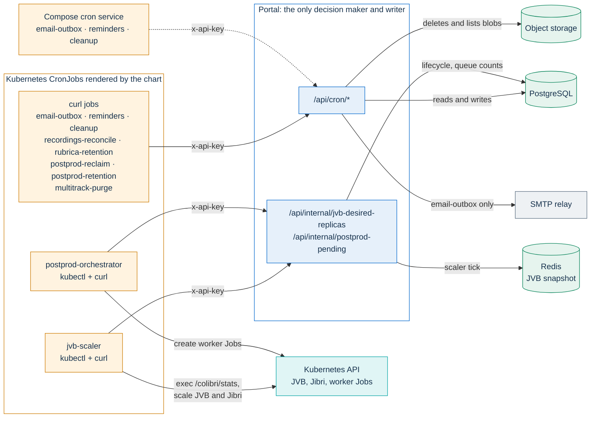
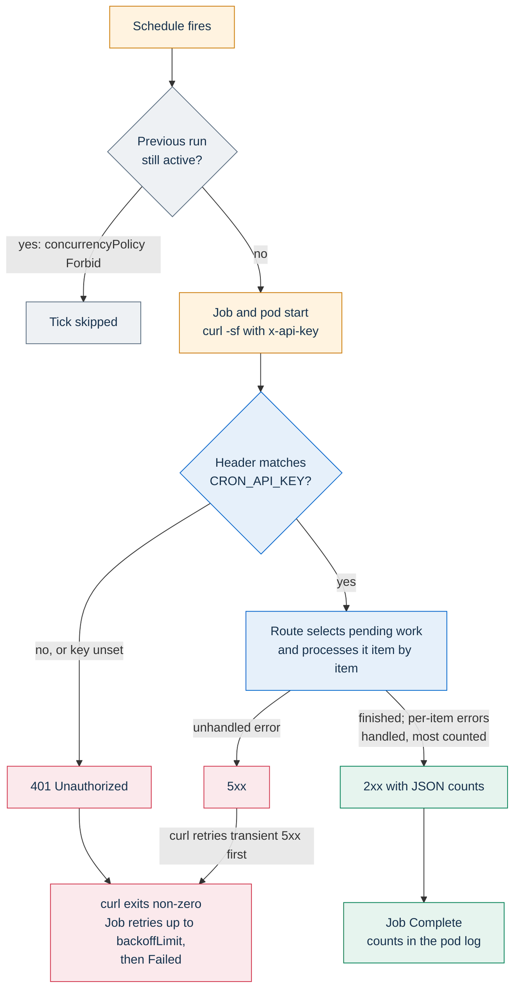
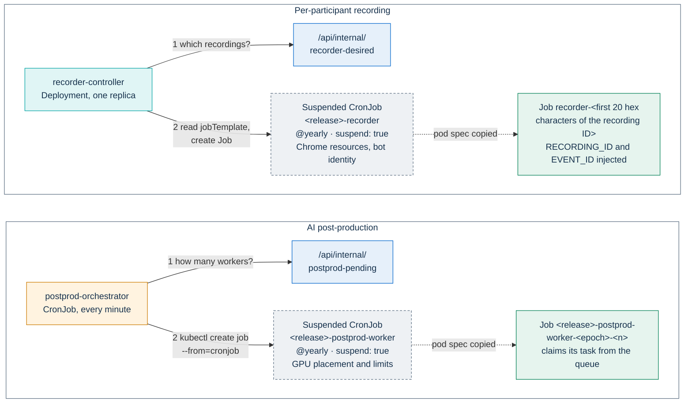

# Scheduled and background jobs

PA Webinar has no scheduler inside the application. Everything that must happen on a clock, such as sending queued email, reminding registrants, deleting expired personal data, scaling the bridges or starting AI workers, is triggered from outside the portal. On Kubernetes, the Helm chart renders CronJobs, a long-running controller and a deploy hook. On a single VM, a small `cron` service in Docker Compose calls a subset of the same routes.

This page is the catalog of that work: what each job does, where it runs, which Helm key holds its schedule, how it authenticates and what breaks when it does not run. It is written for operators running the chart or the Compose stack, and for developers adding a job.

Related pages:

- the event statuses that the JVB scaler moves: [event-lifecycle.md](event-lifecycle.md);
- how the scaler computes bridge capacity: [scaling.md](scaling.md); enabling, tuning and pausing it: [operations/jvb-scaler.md](../operations/jvb-scaler.md);
- what the emails say, in which language, and how SMTP is configured: [email.md](email.md) and [configuration/email.md](../configuration/email.md);
- what the cleanup deletes and after how long: [GDPR.md](../GDPR.md) and [privacy/recordings-and-ai.md](../privacy/recordings-and-ai.md);
- the recorder controller and the recording jobs: [recording.md](recording.md); the AI worker and its queue: [POSTPROD.md](../POSTPROD.md);
- the `CRON_API_KEY` credential and the other machine credentials: [identity-and-access.md](identity-and-access.md).

## How scheduled work runs

Every scheduled job follows the same model:

- **Jobs are thin HTTP clients.** A job pod runs `curl` (or `kubectl` plus `curl`) against the portal's cluster Service, `http://<release>:3000` by default (the `pa-webinar.internalUrl` helper in `infra/helm/pa-webinar/templates/_helpers.tpl`). Routes under `/api/cron/*` do housekeeping. Routes under `/api/internal/*` answer the jobs that act on the cluster, such as the JVB scaler and the post-production orchestrator.
- **The portal decides and writes.** Jobs never connect to PostgreSQL or object storage. All selection logic, database writes and blob deletions happen in the route handler. The two `kubectl` jobs only act on the Kubernetes API, and only with the numbers the portal returns.
- **One shared key.** Each route calls `assertCronApiKey()` (`app/src/lib/auth/cron.ts`) first. The route compares the `x-api-key` header with `CRON_API_KEY` in constant time and answers `401` on a mismatch, or when `CRON_API_KEY` is unset. In the chart, the key comes from the application Secret (`secrets.existingSecretName`, whose default name is `videocall-secrets`), key `CRON_API_KEY`. In Compose, the `app` and `cron` services each set it in their environment, and the two values must match.
- **Safe to re-run.** Each route selects only the work that is still pending: rows still `PENDING`, reminders without a `ReminderSent` row, tracks whose audio is not purged yet. A second run does not send, purge or delete again what an earlier run completed. The exception is `cleanup`, which goes through every archived event past retention again on each run and writes a new audit entry for it ([Known limitations](#known-limitations)).
- **Bounded and unbounded runs.** Some routes cap the work of a single run, so a backlog drains over several runs: `email-outbox` (50 rows), `rubrica-retention` (500 records of each kind), `multitrack-purge` (500 tracks), `postprod-retention` (50 recordings per pass, and 200 artifacts under the site-wide limit) and the sweep of `recordings-reconcile` (200 orphans). The caps are constants in each route under `app/src/app/api/cron/`. `cleanup`, `reminders` and the storage scan of `recordings-reconcile` have no cap: each handles everything that is due in one request.
- **No overlap.** Every CronJob uses `concurrencyPolicy: Forbid`. A run that is still going makes the next tick skip. Ticks are not queued.



The routes are not restricted at the network level. The chart's ingress forwards every path under `/`, and the Next.js middleware skips `/api`, so `/api/cron/*` and `/api/internal/*` can be reached from the internet like any other API route. `CRON_API_KEY` is the only barrier. Treat it as a secret with the same weight as the instance API key, and rotate it together with every consumer listed in [identity-and-access.md](identity-and-access.md).

### What a successful job means

A `curl` job succeeds when the route answers with a 2xx status. Routes handle errors item by item and carry on; most report failures in their JSON counts (`cleanup` reports only successes). A green Job therefore means that the route ran. It does not mean that every item succeeded. `curl` prints the JSON response, so the counts can be read in the pod log for as long as the Job is kept.



The two `kubectl` jobs behave differently. When the portal returns nothing, as with a wrong key, a portal outage or a database outage, the JVB scaler and the post-production orchestrator log an error line and **exit successfully** without changing anything. A wrong `CRON_API_KEY` therefore shows up as a Failed Job for every `curl` job, but only as log lines for these two.

## Job catalog

Every CronJob is named `<release>-<job>`, where `<release>` is the chart's full name (equal to the release name when that name contains `pa-webinar`: release `pa-webinar` gives `pa-webinar-cleanup`). Defaults are read from `infra/helm/pa-webinar/values.yaml`. Schedules set no `timeZone`, so they run in the time zone of the cluster's controller manager, which is usually UTC.

| Job | Calls | Schedule key (default) | Rendered when |
|---|---|---|---|
| `email-outbox` | `GET /api/cron/email-outbox` | `cronjobs.emailOutbox.schedule` (`*/1 * * * *`) | `cronjobs.emailOutbox.enabled` (default `true`) |
| `reminders` | `GET /api/cron/reminders` | `cronjobs.reminders.schedule` (`*/15 * * * *`) | `cronjobs.reminders.enabled` (default `true`) |
| `cleanup` | `GET /api/cron/cleanup` | `cronjobs.cleanup.schedule` (`0 3 * * *`) | `cronjobs.cleanup.enabled` (default `true`) |
| `recordings-reconcile` | `POST /api/cron/recordings-reconcile` | `cronjobs.recordingsReconcile.schedule` (`17 */6 * * *`) | `cronjobs.recordingsReconcile.enabled` (default `true`) |
| `rubrica-retention` | `GET /api/cron/rubrica-retention` | `cronjobs.rubricaRetention.schedule` (`0 4 * * *`) | `cronjobs.rubricaRetention.enabled` (default `true`) |
| `jvb-scaler` | `GET /api/internal/jvb-desired-replicas`, then the Kubernetes API | `jvbScaler.schedule` (`*/2 * * * *`) | `jitsi.enabled`, `jitsi.mode: full` and `jvbScaler.enabled` (default `false`) |
| `postprod-orchestrator` | `GET /api/internal/postprod-pending`, then the Kubernetes API | `postprod.orchestrator.schedule` (`* * * * *`) | `postprod.enabled` (default `false`) and `postprod.orchestrator.enabled` |
| `postprod-reclaim` | `GET /api/cron/postprod-reclaim` | `postprod.reclaim.schedule` (`* * * * *`) | `postprod.enabled` and `postprod.reclaim.enabled` |
| `postprod-retention` | `GET /api/cron/postprod-retention` | `postprod.retention.schedule` (`30 3 * * *`) | `postprod.enabled` and `postprod.retention.enabled` |
| `multitrack-purge` | `GET /api/cron/multitrack-purge` | `postprod.multitrackPurgeSchedule`, not declared in `values.yaml`; the template falls back to `*/15 * * * *` | `postprod.enabled` (no key of its own) |
| `web-config-reload` hook | Kubernetes API (`kubectl rollout restart`) | none: a Helm `post-install` and `post-upgrade` hook | `configReloadHook.enabled` (default `true`) |

Two more objects render as CronJobs but never run on a schedule: `postprod-worker` and `recorder`. They are suspended templates (see [Suspended CronJobs as Job templates](#suspended-cronjobs-as-job-templates)). The recorder controller is a Deployment, not a CronJob (see [Long-running controllers](#long-running-controllers)).

## What each job does

### email-outbox

**Does.** Every piece of code that sends mail only inserts a row into `EmailOutbox` through `enqueueEmail()`. This job delivers the rows. It claims a batch of due `PENDING` rows with `FOR UPDATE SKIP LOCKED` and pushes their next attempt a few minutes ahead as a lease, so an overlapping run cannot pick them up. It sends them over the pooled SMTP transport a few at a time, then marks each row `SENT` or schedules a retry with backoff. After the last attempt, the row becomes `FAILED`. Batch size, parallelism, lease and backoff are constants in `app/src/app/api/cron/email-outbox/route.ts` and `app/src/lib/email/outbox.ts`. Delivery semantics and the catalog of emails are in [email.md](email.md).

**If it does not run.** No email leaves the platform, yet every page that queues one still reports success. Registration confirmations with personal join links, reminders, date-change notices, post-event follow-ups, staff one-time sign-in links and the verification links of data-subject requests all wait in `email_outbox`. When mail does not arrive, check this job first, then SMTP ([configuration/email.md](../configuration/email.md)).

### reminders

**Does.** The job looks at each configured reminder of an event in `PUBLISHED`, `LIVE`, `PROVISIONING` or `IDLE`. When the send time (`startsAt` minus `offsetMinutes`) has passed and `startsAt` is still ahead, it queues one reminder for each registration that has no `ReminderSent` row for it yet. Each reminder goes out in the registrant's language with an `.ics` attachment, and the job records a `ReminderSent` row. The same run also sends the opt-in post-event follow-up emails, for events that ended within the previous seven days (`app/src/lib/events/post-event-finalize.ts`). It claims each event before queueing, so no event is emailed twice. The job only queues; `email-outbox` delivers.

**Cadence matters.** A reminder is sent only by a run that falls between its send time and the event start. The shortest reminder offset the API accepts is 15 minutes (`REMINDER_PRESETS` in `app/src/lib/validation/schemas.ts`), which equals the default schedule. A slower schedule lets short reminders fall between two runs, and they are then never sent.

**If it does not run.** No reminders and no post-event follow-ups are sent. Reminders whose window has closed are not caught up later.

### cleanup

**Does.** This job is the daily GDPR cleanup, and it runs in three phases (`app/src/app/api/cron/cleanup/route.ts`, selection rules in `app/src/lib/gdpr/cleanup-selection.ts`):

1. It deletes temporary recordings that were never published, 24 hours after they started.
2. It deletes published recordings whose own retention (`recordingDeleteAfterDays`, counted from publication) has expired.
3. For every `ENDED` or `ARCHIVED` event past `endsAt` plus `dataRetentionDays`, it deletes the participant data (registrations, Q&A, polls, chat, questionnaire responses, invitations, named grants and more) in one transaction. It scrubs the personal fields of call sessions and deletes the related files. Then it **sets the event to `ARCHIVED`**, so title, description and dates remain as a historical record.

It also deletes staff sign-in link rows one day after they were used or expired. Each phase writes an entry to the GDPR audit log. The full list of what is deleted, and when, is in [GDPR.md](../GDPR.md).

**If it does not run.** Personal data outlives the retention the controller has declared, and ended events are never archived. The cleanup selects only `ENDED` and `ARCHIVED` events. An event that never reaches `ENDED` is therefore never cleaned, whether or not this job runs. Without the JVB scaler, only a moderator or an administrator ends events ([event-lifecycle.md](event-lifecycle.md#running-without-the-scaler)).

### recordings-reconcile

**Does.** The job lists every object under `recordings/` in the recordings storage domain. It records each object that no `Event.recordingUrl`, `CallSession.recordingUrl` or `CallSession.recordingFilename` references as an orphan in `orphan_recordings`. It forgets orphan rows whose object has disappeared. It then sweeps: it deletes orphans marked **Delete now**, and pending orphans discovered more than `orphanRecordingGraceDays` ago (a `SiteSetting` field, default in `app/prisma/schema.prisma`; `0` disables the time-based sweep). Orphans marked **Keep** are never deleted. Administrators see and decide on orphans in the **Orphans** tab of **Video recordings** (`/admin/recordings`). It is the only curl job that uses `POST`. When recording storage is not configured, it answers `skipped: true`.

**If it does not run.** Recording files that lost their link to an event, for example after a failed upload webhook, stay in storage indefinitely. The **Orphans** tab stays empty. This job also removes the per-participant objects that the purge jobs leave behind; see [Known limitations](#known-limitations) and [recording.md](recording.md#background-jobs-that-touch-recordings).

### rubrica-retention

**Does.** The job enforces the retention of the address book ([ADR-011](../adr/011-person-rubrica.md)). It deletes the person records of people who opted out, and opted-in person records whose last activity is older than their `retentionMonths` (default in `app/prisma/schema.prisma`). It processes a bounded batch of each kind per run. Registrations linked to a deleted person keep existing, with the link cleared, so per-event consent trails stay auditable.

**If it does not run.** People who opted out disappear from the address book view, because opting out only flags the record. The record itself, with its encrypted personal data, is never deleted. Inactive contacts are kept beyond their retention window.

### jvb-scaler

**Does.** Every tick, the job finds the JVB Deployment and reads its requested and ready replica counts. It runs `kubectl exec` into each running bridge to read `/colibri/stats`, then calls `/api/internal/jvb-desired-replicas` with the aggregated figures. The portal applies every automatic event-status transition in one transaction, writes the bridge snapshot to Redis for the status pages, and returns the desired number of bridges and Jibri replicas. The job then scales the JVB Deployment and, if one exists, the Jibri Deployment or StatefulSet. When the tick promotes an event to `LIVE`, the portal also notifies the recorder controller. The job runs under its own ServiceAccount (`<release>-scaler`) with a namespaced Role. Mechanics, permissions and failure handling are in [scaling.md](scaling.md#one-scaler-tick).

**If it does not run.** This job is also the clock of the event lifecycle. Without it, events do not move from `PUBLISHED` to `PROVISIONING` or `LIVE` on their own, rooms are not closed after their grace period and nothing goes `IDLE`. Bridges also stay at their last replica count: an idle cluster keeps paying for bridges, or an event starts with none. Manual actions (**Start event**, **End for everyone**) keep working. See [event-lifecycle.md](event-lifecycle.md#running-without-the-scaler) and, for pausing it on purpose, [operations/jvb-scaler.md](../operations/jvb-scaler.md).

### postprod-orchestrator

**Does.** The job asks `/api/internal/postprod-pending` how many workers should be running. The answer is capped by the `aiMaxConcurrentJobs` site setting, and it is zero while `aiPipelineEnabled` is off. The job counts active worker Jobs by label and creates the difference from the worker template, with `kubectl create job --from=cronjob/<release>-postprod-worker`. When `postprod.vllm.autoscale` is `true`, it also scales the vLLM Deployment to one while there is work and back to zero when the queue is empty. The vLLM step runs only while `aiPipelineEnabled` is on: disabling the pipeline does not scale vLLM down, so scale it to zero by hand. The job never reads the database; the queue lives in PostgreSQL behind the portal. The pipeline is described in [POSTPROD.md](../POSTPROD.md).

**If it does not run.** Post-production tasks stay queued, no worker starts and no new GPU node is requested for workers. A vLLM replica that was running stays up.

### postprod-reclaim

**Does.** This job is the queue janitor. It returns tasks whose worker lease expired more than a minute ago to `PENDING`, for example after an evicted pod or an out-of-memory kill. It marks `FAILED` the pending tasks that reached the `aiJobMaxAttempts` site setting, and moves their recordings to `POSTPROD_PARTIAL`. It also refreshes the post-production queue gauges on `/api/metrics`, so the metrics stay current when nobody is using the portal.

**If it does not run.** A task whose worker died stays claimed forever and blocks the tasks that depend on it. Tasks that exhausted their retries are never failed, and the queue gauges go stale.

### postprod-retention

**Does.** The job purges AI outputs and per-participant tracks at the end of their retention. It covers recordings of ended events past `endsAt` plus `dataRetentionDays`, except published videos, whose subtitles and transcripts live as long as the video. For a published video, it purges only the raw tracks, at the same point. It applies the site-wide `aiArtifactRetentionDays` limit when that is set. It also purges recordings whose own `Recording.retentionUntil` date has passed, but that branch is a hook that nothing sets today: no screen or API writes the field ([privacy/recordings-and-ai.md](../privacy/recordings-and-ai.md#per-recording-date-recordingretentionuntil)). It defers any recording with a multitrack transcription or archive task in flight, and it answers `skipped: true` when recording storage is not configured. The retention regimes are in [privacy/recordings-and-ai.md](../privacy/recordings-and-ai.md).

**If it does not run.** Transcripts, summaries, speaker labels (`Speaker` rows) and retained tracks outlive their retention. The GDPR cleanup does not delete them: it archives the event but leaves AI outputs and speaker labels in place.

### multitrack-purge

**Does.** The job deletes the audio object of each per-participant track once the multitrack transcription of its recording has completed, and stamps `audioPurgedAt` on the track. It skips recordings that still have a multitrack transcription or archive task pending or running. When an event keeps its tracks (**Keep per-participant tracks**), it waits for `Recording.retentionUntil`, which the application never sets, so retained tracks are in practice removed by `postprod-retention` at the end of the event's retention ([privacy/recordings-and-ai.md](../privacy/recordings-and-ai.md#keeping-tracks)). The transcript stays. The track audio, isolated voice data, does not. Details are in [recording.md](recording.md) and [privacy/recordings-and-ai.md](../privacy/recordings-and-ai.md).

**If it does not run.** Isolated voice audio stays in storage until `postprod-retention` removes it at the end of the event's retention window, instead of minutes after transcription. The job renders only with `postprod.enabled`. An installation that enables `recorder.enabled` without `postprod.enabled` records tracks that neither purge job deletes. Only the orphan sweep of `recordings-reconcile` eventually removes them (see [Known limitations](#known-limitations)).

### web-config-reload hook

**Does.** After every `helm install` and `helm upgrade`, a hook Job (`<release>-web-config-reload`) runs `kubectl rollout restart` on each Jitsi Deployment whose `app.kubernetes.io/component` label is listed in `configReloadHook.components` (default `web`). The Jitsi web Deployment's `checksum/config` annotation covers only its main ConfigMap. Custom `config.js` settings live in a separate ConfigMap, and without a restart the pods keep serving the old configuration. The hook uses `configReloadHook.image`, falling back to `jvbScaler.image` and then to the chart-wide `kubectlImage` value (`values.yaml`). Helm deletes the Job before the next hook and after it succeeds. A component with no matching Deployment is skipped, so the hook is harmless when Jitsi runs outside the chart.

**If it does not run.** Changes to the custom Jitsi configuration, such as TURN or ICE settings, are not served until someone restarts the web pods by hand. If the hook itself fails, `helm upgrade` reports a failure even though the chart's resources were already applied. Because the hook restarts the web pods on every upgrade, run upgrades outside live events ([operations/upgrades.md](../operations/upgrades.md)).

## Common job settings

The CronJob templates (`infra/helm/pa-webinar/templates/cronjob-*.yaml`) share these settings:

- **History and garbage collection.** Each CronJob keeps three successful and three failed Jobs. Finished Jobs are deleted after `cronjobs.jobTtlSeconds` for the frequent jobs (`email-outbox`, `reminders`, `multitrack-purge`, `postprod-reclaim`, `jvb-scaler`, `postprod-orchestrator`). The daily and six-hourly jobs (`cleanup`, `recordings-reconcile`, `rubrica-retention`, `postprod-retention`) use `cronjobs.dailyJobTtlSeconds`, which is long enough for a night-time failure to still be visible on the next working day. The worker and recorder templates have their own TTL keys (`postprod.worker.ttlSecondsAfterFinished`, `recorder.ttlSecondsAfterFinished`).
- **Deadlines.** Each template sets `activeDeadlineSeconds`. The deadline counts from Job creation, so it includes waiting for a node and pulling the image on a freshly scaled node, not only the HTTP call. The frequent jobs therefore allow several minutes for a call that normally takes seconds.
- **Disruptions are not failures.** The `curl` jobs, the worker and the recorder set a `podFailurePolicy` that ignores pods killed by a node drain, an eviction or a spot preemption (`pa-webinar.disruptionTolerantFailurePolicy` in `_helpers.tpl`), so these interruptions do not use up `backoffLimit` or leave a Failed Job behind. That policy requires `restartPolicy: Never`. The scaler and the orchestrator use `restartPolicy: OnFailure` and do not have it.
- **Hardening.** The scheduled jobs, the worker and the recorder controller run as non-root with a read-only root filesystem, all capabilities dropped and the `RuntimeDefault` seccomp profile. The recorder bot runs as non-root with capabilities dropped but a writable root filesystem. The config-reload hook sets no security context. The `curl` jobs mount no ServiceAccount token. The scaler, the orchestrator and the recorder controller each have their own ServiceAccount, bound to a namespaced Role that grants only what they need.
- **Placement.** The scheduled jobs use the portal's placement (`app.nodeSelector`, `app.tolerations`, empty by default in `values.yaml`). With the bridge and GPU pools tainted, as in the [reference node pools](../../infra/aks/node-pools.md), they never land on or wake those pools.

## Docker Compose on a single VM

The Compose stack has no CronJobs. Its `cron` service is a shell loop in a `curl` container. The loop ticks every 30 seconds and calls three routes with the same `x-api-key` header (`docker-compose.yml`):

| Job | Chart default | Compose |
|---|---|---|
| `email-outbox` | every minute | every minute |
| `reminders` | every 15 minutes | every 5 minutes |
| `cleanup` | daily at 03:00 | every hour |

The cadences differ from the chart's. All three routes also run once when the service starts. The calls run one after another with a 30-second timeout each, so the intervals are approximate. `docker compose logs cron` prints one line per call. The routes' JSON responses are discarded.

Running the cleanup every hour does not delete anything earlier: retention is computed per event, so data is removed within an hour of expiry instead of within a day. It does add a GDPR audit entry per archived event on every run (see [Known limitations](#known-limitations)).

Nothing else runs on a schedule on a single VM:

| Not run in Compose | Consequence |
|---|---|
| `rubrica-retention` | Opted-out and inactive address-book records are never deleted. |
| `recordings-reconcile` | Orphan recording files are never listed or swept. |
| `jvb-scaler` | No automatic event lifecycle: events start and end only by moderator or administrator action ([event-lifecycle.md](event-lifecycle.md#running-without-the-scaler)). There is no bridge scaling to lose, because the Compose stack runs one bridge. |
| `multitrack-purge`, `postprod-retention` | With the `recorder` profile, per-participant tracks are never deleted by a job. |
| `postprod-orchestrator`, `postprod-reclaim` | Nothing to do: AI post-production does not run on a single VM. |
| `web-config-reload` hook | Restart `jitsi-web` yourself after changing its configuration. |

To run one of these routes on a single VM, add it to the `cron` service's loop or call it from the host's scheduler with the same header. For example:

```bash
docker compose exec cron sh -c \
  'curl -sf -H "x-api-key: $CRON_API_KEY" http://app:3000/api/cron/rubrica-retention'
```

## Long-running controllers

Scheduled work suits tasks that can wait for the next tick. Starting a recorder cannot wait: the bot must join within seconds of an event going `LIVE`, and a CronJob fires at most once a minute and then needs time to start a pod. Per-participant recording therefore uses a controller, a Deployment that runs all the time.

The **recorder controller** (`infra/recorder-controller`) is a Deployment with a single replica, the `Recreate` strategy and no leader election; its reconcile is idempotent. The chart renders it when both `recorder.enabled` and `recorder.controller.enabled` are true. It reconciles on a fixed interval (`recorder.controller.reconcileIntervalMs`) and at once when the portal reports that an event went `LIVE`; both triggers are described in [recording.md](recording.md#edge-and-level-triggers). It authenticates to the portal with `CRON_API_KEY`, like the jobs. Its Role lets it read CronJobs; read, create and delete Jobs; and read pods and their logs.

On a single VM, the same controller runs as the `recorder-controller` Compose service (profile `recorder`, `RUNNER=docker`) and starts bot containers through the host's Docker socket. What that setup needs is in [recording.md](recording.md#docker-single-vm).

The JVB scaler and the post-production orchestrator are CronJobs, but they also reconcile a desired state against the cluster on every tick. The difference is latency: a one-to-two-minute delay is acceptable for bridges, which are pre-scaled before events, and for batch AI work.

## Suspended CronJobs as Job templates

The post-production worker and the recorder bot run as one-shot Jobs created on demand, not on a schedule. Their pod specs still have to come from the chart: image, pull secrets, GPU node selector and tolerations, resources, volumes, security context and the secret references for `CRON_API_KEY` and the bot's credentials. The chart renders each spec as a CronJob with `schedule: "@yearly"` and `suspend: true`, which never fires. The CronJob only holds a `jobTemplate`.



The two creators use the template differently:

- **The orchestrator** runs `kubectl create job --from=cronjob/<release>-postprod-worker` and changes nothing. Each worker claims its own task from the queue, so all workers are identical. The Jobs carry the template's `app.kubernetes.io/component: postprod-worker` label, which the orchestrator uses to count active workers.
- **The controller** reads the template's `jobTemplate` through the Kubernetes API and injects `RECORDING_ID` and `EVENT_ID` into the first container. It creates a Job named `recorder-<first 20 hex characters of the recording ID>`. The Job and its pod carry only `app.kubernetes.io/component: recorder` and the recording and event IDs: the controller replaces the template's pod labels, so bot pods do not carry the release's selector labels (see [Before enabling the NetworkPolicy](#before-enabling-the-networkpolicy)). The deterministic name makes a duplicate creation fail harmlessly with a conflict.

The pattern keeps both specs inside the chart, so `helm template` and the chart checks see them, and it needs no operator framework. Its costs are two CronJob objects that look inactive, and a rule for operators: never unsuspend them. An unsuspended template fires on its placeholder schedule, outside the control of the orchestrator or the controller. A recorder started that way has no recording to capture.

## Jobs outside the chart

- **Service inventory generator.** `infra/service-inventory/azure/cronjob.yaml` is a reference CronJob, not part of the chart, for installations on Azure. It queries Azure Resource Graph, builds the operations half of the service inventory and uploads it to storage, where the portal reads it through `SERVICE_INVENTORY_URL`. It does not call the portal and does not use `CRON_API_KEY`. See [SERVICE-INVENTORY-GENERATION.md](../SERVICE-INVENTORY-GENERATION.md) and its [README](../../infra/service-inventory/azure/README.md).
- **`infra/aks/cronjobs.yaml`.** A standalone manifest, independent of the chart, that defines only `reminders` and `cleanup`, with its own Secret and Service names. Do not apply it where the chart is installed: depending on the release name, it either duplicates those two jobs or overwrites the chart's CronJobs of the same name with jobs that point at a Service and a Secret the chart does not create. On its own it leaves email undelivered, because it has no `email-outbox`.

## Operating the jobs

### Find a job's runs and logs

Jobs and their pods carry the same `app.kubernetes.io/component` value. The templates label the pod template, and a Job created without labels of its own takes the labels of its pod template, so both Jobs and pods can be selected by component:

```bash
kubectl get cronjobs -n pa-webinar
kubectl get jobs -n pa-webinar -l app.kubernetes.io/component=cronjob-cleanup
kubectl get pods -n pa-webinar -l app.kubernetes.io/component=cronjob-cleanup
kubectl logs -n pa-webinar -l app.kubernetes.io/component=cronjob-cleanup --tail=50
```

The `app.kubernetes.io/component` values are `cronjob-<job>` for the `curl` jobs and the orchestrator (for example `cronjob-email-outbox`, `cronjob-postprod-orchestrator`), `jvb-scaler` for the scaler, `postprod-worker`, `recorder`, `recorder-controller` and `config-reload`. The logs disappear with the Job when its TTL expires.

### Run a job once

Create a Job from the CronJob with a name of your choice:

```bash
kubectl create job -n pa-webinar pa-webinar-cleanup-manual-$(date +%s) \
  --from=cronjob/pa-webinar-cleanup
kubectl logs -n pa-webinar -l app.kubernetes.io/component=cronjob-cleanup --tail=20
```

A manual run does exactly what a scheduled run does, including deletions that are due. The same command on `pa-webinar-postprod-worker` starts one worker, which claims the next runnable task and may scale up a GPU node. Do not run it on `pa-webinar-recorder`: the controller injects the recording to capture, and a bare Job has none.

### Suspend and resume

```bash
kubectl patch cronjob pa-webinar-reminders -n pa-webinar -p '{"spec":{"suspend":true}}'
kubectl patch cronjob pa-webinar-reminders -n pa-webinar -p '{"spec":{"suspend":false}}'
```

A patch is a runtime change that the chart does not declare, so check it again after each upgrade. To switch a job off durably, set its `enabled` key to `false`; the next upgrade then removes the CronJob. Suspending `jvb-scaler` also pauses the automatic event lifecycle ([operations/jvb-scaler.md](../operations/jvb-scaler.md)). Never unsuspend `postprod-worker` or `recorder`.

### Before enabling the NetworkPolicy

`networkPolicy.enabled` is `false` by default. The policy it renders selects only the portal's own pods; its rules are described in [DEPLOYMENT.md](../DEPLOYMENT.md#networkpolicy). The scheduled jobs, the JVB scaler, the post-production orchestrator and worker, the recorder controller and the config-reload hook are not selected, so their own traffic is not restricted. The policy admits them into the portal, because it accepts calls on the portal's port from every pod that carries the release's selector labels. The portal's egress rules include the recorder controller's port, so the call that starts recorders when an event goes `LIVE` still arrives.

Per-participant recorder bots are the exception. Their pods carry only the labels the controller sets ([Suspended CronJobs as Job templates](#suspended-cronjobs-as-job-templates)), not the selector labels, so the policy drops their calls to `/api/internal/recorder-*`. They get through only when `networkPolicy.ingress.fromNamespaceSelectors` and `fromPodSelectors` are both empty, which leaves the portal's port open to any source. Admit them with an extra ingress rule:

```yaml
networkPolicy:
  ingress:
    extraRules:
      - from:
          - podSelector:
              matchLabels:
                app.kubernetes.io/component: recorder
        ports:
          - protocol: TCP
            port: 3000
```

Port `3000` is the portal container's port, which is what the policy sees after the Service translates the address. After enabling the policy, run each job once ([Run a job once](#run-a-job-once)), record a test event with per-participant recording on, and check that every one of them reaches the portal.

### After restoring a database backup

`recordings-reconcile` deletes recording files that the database no longer references once the grace period expires. A database restored from a copy older than the storage can therefore cause recordings to be deleted. Until the two agree again, suspend `recordings-reconcile` or set `orphanRecordingGraceDays` to `0`. Backup and restore order are covered in [REUSE.md](../REUSE.md).

## Adding a job

A new scheduled task needs a route, a chart template, a decision for Compose and a row on this page. The general conventions are in [development/extending.md](../development/extending.md).

1. **Route.** Add `app/src/app/api/cron/<name>/route.ts`. Wrap the handler in `withErrorHandling`, export `dynamic = 'force-dynamic'`, and call `assertCronApiKey(request)` before anything else. Export the HTTP method your job will call. Select only pending work, bound each run with a batch size, and keep network and blob I/O outside database transactions. Return JSON counts. Log per-item failures and count them rather than failing the whole run, and let a condition that blocks all work surface as an error status.
2. **Tests.** Test the selection rules as pure functions, as `app/src/lib/gdpr/cleanup-selection.ts` does for the cleanup, and add a route test next to the handler.
3. **Chart template.** Copy an existing `curl` template such as `templates/cronjob-rubrica-retention.yaml`. Keep `concurrencyPolicy: Forbid`, the history limits, the TTL key that matches the cadence, a deadline that includes scheduling and image pull, the disruption policy with `restartPolicy: Never`, the security context, `CRON_API_KEY` from `pa-webinar.secretName`, and a pod label `app.kubernetes.io/component: cronjob-<name>`.
4. **Values.** Add `cronjobs.<name>` with `enabled`, `schedule` and `image`. `helm upgrade --reuse-values` keeps the previous release's values and does not pick up keys that are new in the chart, so the whole `cronjobs.<name>` map is then missing. A guard copied from the existing templates, `{{- if .Values.cronjobs.<name>.enabled }}`, then fails to render with a nil pointer error before any `| default` is evaluated. Read the guard and every new key with a nil-safe lookup, for example `dig "<name>" "enabled" true (.Values.cronjobs | default dict)` or `(.Values.cronjobs.<name> | default dict)`, and give each key its default there. Run `./scripts/validate-chart.sh`.
5. **Compose.** Decide whether a single VM needs the job. If it does, add it to the `cron` service's loop. If it does not, add the consequence to the Compose table on this page.
6. **Documentation.** Add a catalog row and a section on this page. If the job deletes personal data, update the retention table in [GDPR.md](../GDPR.md).

A job that acts on the cluster also needs its own ServiceAccount and a namespaced Role limited to the verbs it uses, like `cronjob-jvb-scaler.yaml` and `cronjob-postprod-orchestrator.yaml`. It should get its numbers from an `/api/internal/*` route instead of reading the database.

## Known limitations

- **Green does not mean healthy.** Routes absorb per-item failures and still return 2xx, and the `kubectl` jobs exit successfully when the portal does not answer. The chart ships no alert rule for scheduled jobs, the email outbox or retention. Only a cluster-wide rule such as `KubeJobFailed`, where installed, sees Failed Jobs. See [operations/monitoring.md](../operations/monitoring.md) and the open item in [ROADMAP.md](../ROADMAP.md).
- **Per-participant objects look like orphans.** `recordings-reconcile` lists everything under `recordings/`, including `recordings/multitrack/`, and none of the fields it checks references those objects. Retained tracks and track manifests therefore appear in the **Orphans** tab and are deleted after the grace period unless marked **Keep**, whatever the event's track retention says ([recording.md](recording.md#known-limitations)).
- **The audit log grows on every cleanup run.** Each run writes a `DATA_DELETED` entry for every event past retention, including events archived earlier with nothing left to delete. That means one entry per archived event per day in the chart, and per hour in Compose.
- **Sent email is kept.** No job deletes rows from `email_outbox`. Sent and failed messages stay in the table. The recipient address and the bodies are encrypted at rest; the subject is not.
- **Tracks without post-production.** `multitrack-purge` and `postprod-retention` render only with `postprod.enabled`. With the recorder on and post-production off, no job deletes per-participant track audio on purpose. Only the orphan sweep above removes it, after the grace period and regardless of the event's retention settings.
- **NetworkPolicy and recorder bots.** With `networkPolicy.enabled`, per-participant recorder bots cannot reach the portal until a `networkPolicy.ingress.extraRules` entry admits pods labeled `app.kubernetes.io/component: recorder` ([Before enabling the NetworkPolicy](#before-enabling-the-networkpolicy)). The other jobs are admitted by the policy itself.
