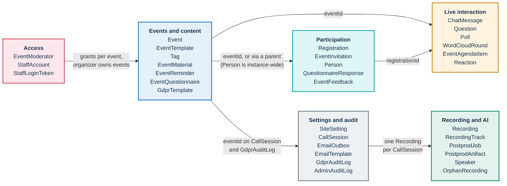
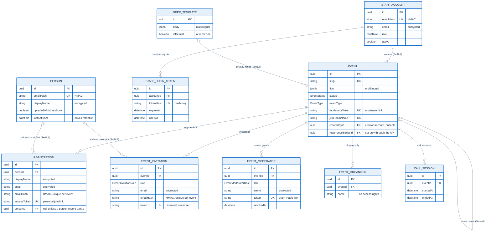
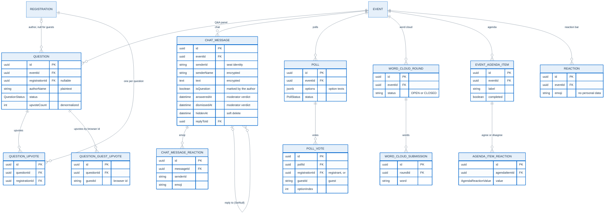
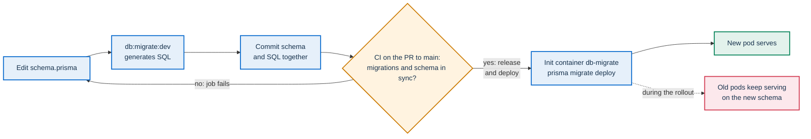

# Data model

PA Webinar keeps its persistent records in one PostgreSQL database, accessed through Prisma. Files are in object storage ([storage.md](../configuration/storage.md)), and transient live state is in Redis or in the memory of each app pod ([live-interaction.md](live-interaction.md)). This page covers four things about the database:

- the conventions every model follows, including how personal data is stored;
- a map of the models by domain;
- the relationships of the core and live-interaction domains;
- the invariants and the migration policy that keep the schema safe to change on a running installation.

It is written for developers who change the schema and for the reviewers of those changes. Data protection officers (DPOs) can read [Conventions](#conventions) to see how personal data is stored.

[`app/prisma/schema.prisma`](../../app/prisma/schema.prisma) is the authority. This page describes shapes and rules, not columns: for the fields of a model, read the schema. Other pages own the rest:

- The `Recording` and post-production models are drawn only in [recording.md](recording.md) and [POSTPROD.md](../POSTPROD.md).
- What is deleted, and when, is in [GDPR.md](../GDPR.md).
- The commands for creating and applying migrations are in [DEVELOPMENT.md](../DEVELOPMENT.md).

## Quick answers

- **Where is the schema?** In `app/prisma/schema.prisma`. The SQL history is in `app/prisma/migrations/`.
- **How do I add a column?** Edit the schema, run `npm run db:migrate:dev --workspace=app`, and commit the generated SQL together with the schema. The change must be additive ([Migrations](#migrations)).
- **Is personal data encrypted?** Names, email addresses and chat content are encrypted in the application with AES-256-GCM before they reach the database, and email lookups go through a keyed hash. A few fields are plaintext ([Plaintext fields worth knowing](#plaintext-fields-worth-knowing)).
- **I added a model with an `eventId` column. What else?** Classify it for the GDPR cleanup, or the test suite fails ([Deleting data](#deleting-data)).

## Conventions

### The schema is the authority

- Code uses the typed Prisma client by default. Raw SQL (`$queryRaw`, `$executeRaw`) is reserved for work the client cannot do atomically:
  - job claims with `FOR UPDATE SKIP LOCKED` (the email outbox and the post-production queue);
  - atomic appends to JSONB columns (the raised-hand log of a call session);
  - a capped insert (the reaction-bar rows, which supply their own `gen_random_uuid()` id);
  - a row lock that serializes concurrent writers (opening a word-cloud round locks the event row);
  - aggregations and health probes.
- A few constraints cannot be expressed in Prisma and exist only in migration SQL ([Invariants](#invariants)). Reading `schema.prisma` alone does not show them.
- Some status-like columns are plain strings rather than PostgreSQL enums, for example `SiteSetting.reactionsMode`, `EventMaterial.visibility`, `WordCloudRound.status`, `OrphanRecording.decision` and the `action` column of both audit logs. Their allowed values live in application code, with Zod schemas guarding the ones that arrive in requests (in the route handlers or in `app/src/lib/validation/`). A new value needs no migration, but it does need the validator.

### Names

- Models are PascalCase in code and mapped to snake_case table names with `@@map`, for example `SiteSetting` to `site_settings` and `EventModerator` to `event_moderators`. New tables use plural names. A few older tables are singular (`event_feedback`, `reminder_sent`, `email_outbox`). Leave them as they are: renaming a table is not an additive change.
- Every camelCase field carries `@map("snake_case")`, so the database has no PascalCase or camelCase identifiers. Single-word fields such as `slug` or `status` need no mapping. One legacy exception exists: `EmailTemplate` has camelCase columns without `@map`. Do not copy it.
- Raw SQL therefore uses database names, not model names: `site_settings`, `"hand_raise_log"`, not `SiteSetting` or `handRaiseLog`.
- The table `event_moderators` holds both moderator and speaker grants: read it as the event's named access grants.

### Keys and timestamps

- Primary keys are UUIDs (`@db.Uuid`). Some are generated by Prisma (`@default(uuid())`) and some by PostgreSQL (`@default(dbgenerated("gen_random_uuid()"))`). A row inserted with raw SQL gets an id only from the second form.
- Link tables use composite keys (`EventTagLink`, `QuestionnaireTemplateLink`).
- `SiteSetting` has the fixed id `singleton` ([Invariants](#invariants)).
- Most models carry `createdAt` (`@default(now())`), and many also carry `updatedAt` (`@updatedAt`).

### Multilingual content in JSONB

Text that an administrator writes in several languages is stored as one JSONB object keyed by locale code:

```json
{ "it": "Titolo dell'evento", "en": "Event title" }
```

Examples are the event title, description and speaker information, tag names, privacy notice templates, questionnaire prompts and headings, the site tagline, the legal pages and the AI disclosure text. The helpers are in [`app/src/lib/utils/locale.ts`](../../app/src/lib/utils/locale.ts):

- **Read** with `getLocalized()`. It tries the requested locale, then a fallback locale (Italian by default; the site tagline falls back to English), then the first non-empty value. An empty or whitespace-only string counts as missing.
- **Write** through `pruneEmptyTranslations()`, which drops empty locales. The event create and update routes apply it to the title and description, because the wizard posts a key for every enabled locale. Stored empty strings would reappear as blank titles in any reader that bypasses `getLocalized()`, so new write paths for multilingual fields should prune too.
- **Site legal pages** (`SiteSetting.privacyPolicy`, `SiteSetting.accessibility`) use `getLocalizedExact()`, which has no fallback: a page missing in the reader's language shows the built-in translated document instead of the Italian text. An event's privacy notice template (`GdprTemplate`) does fall back to Italian ([GDPR.md](../GDPR.md#the-notice-of-an-event)).

The language model as a whole is in [i18n.md](i18n.md).

### Encrypted fields

Personal data is encrypted in the application, not by the database. The code is in [`app/src/lib/crypto/pii.ts`](../../app/src/lib/crypto/pii.ts):

- **Writing.** `encryptPII()` uses AES-256-GCM with a random 12-byte IV and a 16-byte authentication tag. It stores `base64(iv + tag + ciphertext)` in an ordinary text column. `encryptPIIOrNull()` does the same for nullable columns and stores `null` for empty input.
- **Reading.** `tryDecryptPII()` returns legacy plaintext rows unchanged. A value shorter than 40 characters or containing `@` is treated as plaintext without an attempt to decrypt it.
- **JSONB columns.** `encryptJSON()` stores `{ "enc": "<ciphertext>" }`, and `tryDecryptJSON()` reads both that wrapper and the legacy plain shape. `CallSession.participants` uses this form.
- **The key.** `PII_ENCRYPTION_KEY` must be 64 hex characters. In production (`NODE_ENV=production`), a key that is a short block repeated to length, like the development placeholders, raises `PiiKeyError` on every encryption and decryption. Only the Compose stack sets the `ALLOW_INSECURE_PII_KEY=true` escape hatch. A missing key, or one that is not 64 characters long, also raises `PiiKeyError`, and the read helpers propagate it instead of showing ciphertext. Only the length is checked: a 64-character value that is not hex fails with a generic error on write, and reads then show the stored ciphertext. A stored value that the read heuristic above treats as plaintext never touches the key. How to generate the key is in [CONFIGURATION.md](../CONFIGURATION.md).

What follows from this design:

- **No search, sort or uniqueness on encrypted columns.** Each write uses a new IV, so equal plaintexts produce different ciphertexts. Uniqueness and lookups use a hash column instead ([Keyed email hash](#keyed-email-hash)). For the same reason, the address-book search matches only `organization` and sorts by `lastActiveAt`.
- **Encryption covers storage only.** Redis messages and SSE streams carry plaintext ([live-interaction.md](live-interaction.md)).
- **No key rotation.** A different but well-formed key is not detected: decryption fails, and `tryDecryptPII()` returns the stored base64 as if it were a legacy plaintext row. No tooling re-encrypts existing data, so replacing `PII_ENCRYPTION_KEY` on a populated database makes every encrypted value unreadable.

Which columns are encrypted is recorded once, in the data inventory of [GDPR.md](../GDPR.md). The control itself and its limits are in [security.md](security.md).

### Keyed email hash

`hashEmail()` in the same file trims and lowercases the address, then computes an HMAC-SHA-256 keyed with `APP_SECRET`, as hex. If `APP_SECRET` is unset it falls back to an unkeyed SHA-256. In production a missing `APP_SECRET` is only logged at start-up (the start-up check stops the app only for a secret shorter than 32 characters). A registration commits its rows with an unkeyed hash before any later step that signs with `APP_SECRET` fails, so set `APP_SECRET` before the first registration and never leave it unset.

The hash is stored as `emailHash` on `Registration`, `EventInvitation`, `Person` and `StaffAccount`. The Jitsi JWT does not carry it ([the Jitsi JWT](identity-and-access.md#the-jitsi-jwt)). The hash carries:

- the one-registration-per-email-per-event rule;
- deduplication of address-book entries;
- the staff-account lookup when someone asks for a sign-in link;
- the lookup behind data-subject access and erasure requests.

`APP_SECRET` therefore also keys data: changing it changes every hash. Existing rows then stop matching new lookups. A known address can register twice for the same event, staff accounts cannot request a sign-in link, and data-subject requests no longer find their rows.

### Hashed secrets and stored tokens

- **Join passwords.** An event's optional join password is stored in `Event.joinPasswordHash` as `scrypt:<salt>:<key>` (`app/src/lib/auth/password.ts`) and never returned by the API.
- **Staff sign-in links.** A one-time link is stored only as a SHA-256 hash in `StaffLoginToken.tokenHash`, so reading the database does not let anyone sign in.
- **Seat tokens.** These are stored as issued, because they are looked up by equality: the primary moderator link (`Event.moderatorToken`), named grants (`EventModerator.token`) and personal join links (`Registration.accessToken`). Their lifetimes and revocation are in [identity-and-access.md](identity-and-access.md).

### Plaintext fields worth knowing

Most personal data is encrypted, but these fields are stored in plaintext. Retention and deletion for each one are in [GDPR.md](../GDPR.md).

| Field | What it holds |
|---|---|
| `Question.authorName` | The name shown on a Q&A question. It is copied from the registration or the named grant, or typed by a guest. |
| `QuestionnaireResponse.respondentName` | A snapshot of the respondent's name at submission. |
| `CallSession.dominantSpeakerLog` | The live speaker timeline, including display names as the room showed them. |
| `Event.moderatorName`, `EventMaterial.addedBy`, `Speaker.displayName` | The primary moderator's name, a copy of that name on materials added from the room with the primary moderator link (links and file uploads alike; additions by named co-moderators and from the administration area store an empty string, shown as a translated "Added by the organisers"), and the name attached to a transcript speaker label. `Event.moderatorEmail` is encrypted. |
| `Registration.organization`, `Registration.organizationRole`, `Person.organization` | Optional profiling fields. They stay searchable on purpose. |
| `Question.text`, `EventFeedback.comment`, `QuestionnaireAnswer.valueText`, `WordCloudSubmission.word` | Free text typed by participants. |
| `EmailOutbox.subject`, `EmailOutbox.attachments`, `EmailOutbox.lastError` | The subject (the public event title), the calendar attachment (which names the event contact and gives their email address), and the last SMTP error (which can quote the recipient). The recipient and both bodies are encrypted. |
| `AdminAuditLog.ip`, `AdminAuditLog.userAgent` | The client IP address and user agent of every administrative write. No job deletes these rows. |

## Domain map

Every model belongs to one domain. Most event data hangs off `Event`, either directly through `eventId` or through a parent that has one (a `PollVote` through its `Poll`). The address book, staff accounts, templates, settings, email tables and audit logs are instance-wide.



| Domain | Key models | What it holds | Owner page |
|---|---|---|---|
| Events and content | `Event`, `EventTemplate`, `Tag` and `EventTagLink`, `EventMaterial`, `EventReminder`, `EventQuestionnaire` with `QuestionTemplate`, `QuestionnaireTemplateLink` and `QuestionItem`, `GdprTemplate` | The event and everything an organizer prepares for it. `EventTemplate` only pre-fills the wizard: an event keeps no reference to its template, so editing a template never changes existing events. | [event-journey.md](event-journey.md); statuses in [event-lifecycle.md](event-lifecycle.md) |
| Participation | `Registration`, `EventInvitation`, `Person`, `ReminderSent`, `QuestionnaireResponse` and `QuestionnaireAnswer`, `EventFeedback` | Who registered, who was invited, the opt-in address book, and what participants answered. | [event-journey.md](event-journey.md); address book in [GDPR.md](../GDPR.md) and [ADR-011](../adr/011-person-rubrica.md) |
| Live interaction | `ChatMessage` and `ChatMessageReaction`, `Question`, `QuestionUpvote` and `QuestionGuestUpvote`, `Poll` and `PollVote`, `WordCloudRound` and `WordCloudSubmission`, `EventAgendaItem` and `AgendaItemReaction`, `Reaction` | The table-backed features beside the video during a live event. PostgreSQL holds their state, and Redis only fans it out. The timer and the reaction-bar counters have no table ([Live interaction](#live-interaction)). | [live-interaction.md](live-interaction.md), [ADR-005](../adr/005-live-interaction-in-portal.md) |
| Access | `EventModerator`, `StaffAccount`, `StaffLoginToken` | Named moderator and speaker grants, staff accounts and their one-time sign-in links. The primary moderator link is a column on `Event`, and the instance API key is not stored in the database. `EventOrganizer` sits next to these models but is display metadata only: it lists co-organizing organizations on the event page and grants no access. | [identity-and-access.md](identity-and-access.md) |
| Recording and AI | `Recording`, `RecordingTrack`, `Speaker`, `PostprodJob`, `PostprodArtifact`, `PostprodOriginalBody`, `OrphanRecording` | Recordings, per-participant audio tracks, the AI post-production queue and its outputs. | [recording.md](recording.md), [POSTPROD.md](../POSTPROD.md) |
| Settings and audit | `SiteSetting`, `EmailTemplate`, `EmailOutbox`, `CallSession`, `GdprAuditLog`, `AdminAuditLog` | The runtime settings singleton, email overrides and the outbox, call-session analytics, and the two audit trails. | [runtime-settings.md](../configuration/runtime-settings.md), [email.md](email.md), [call sessions](event-lifecycle.md#call-sessions), [GDPR.md](../GDPR.md), [audit actor format](identity-and-access.md#audit-actor-format) |

## Events, people and access

The diagram shows key fields only. Every child of `Event` drawn here is deleted with the event row (`onDelete: Cascade`). The labels mark the relations that use `SetNull` instead.



How to read it:

- **How a person relates to an event.**
  - A `Registration` is a self-service sign-up with its own join link.
  - An `EventInvitation` is an entry on the event's invitation list: an encrypted name and email, a `GUEST` or `SPEAKER` role and an optional address-book link. The columns for a pre-filled registration link (`token`, `sentAt`, `acceptedAt`, `declinedAt`) exist, but no code sends invitations or sets them. A `SPEAKER` invitation grants no room access; access comes from a named grant.
  - An `EventModerator` row is a named grant with its own magic link and a role, `MODERATOR` or `SPEAKER`.
  - An `EventOrganizer` row is only a name, logo and link shown on the event page.
- **The address book is opt-in.** A `Person` row is created only when someone ticks the separate address-book consent. A later registration from the same address is linked to that row, and refreshes `lastActiveAt`, even when the box is left unticked. This also happens after an opt-out, because opting out keeps the row until the address-book retention job deletes it. `Registration.personId` is `null` only when no person record exists for the address. The model and its retention are in [ADR-011](../adr/011-person-rubrica.md) and [GDPR.md](../GDPR.md#the-address-book).
- **Organizer scoping runs through `createdById`.** An event created by a staff account records that account, and an organizer sees only events whose `createdById` is their own. Events created with the instance API key have no creator and are managed by administrators only. The rules are in [identity-and-access.md](identity-and-access.md).
- **Series.** `recurrenceRule` stores an RFC 5545 `RRULE`. The wizard shows it on the review step, and duplication uses it to propose the next date; nothing else reads it. `recurrenceSeriesId` can link an occurrence to a parent event, but only an API client sets it: no screen does, no job creates occurrences, and a copy never inherits it ([event-journey.md](event-journey.md#recurrence)).
- **Call sessions.** A `CallSession` records one span of real use of the room. It is the anchor of a `Recording` (one-to-one) and of the live speaker and raised-hand logs. Its lifecycle is in [event-lifecycle.md](event-lifecycle.md#call-sessions).
- **Questionnaires (not drawn).** Reusable `QuestionTemplate`s and ad-hoc `QuestionItem`s make up an `EventQuestionnaire`. Answers are stored as `QuestionnaireResponse` rows with their `QuestionnaireAnswer`s. The flow is in [event-journey.md](event-journey.md).

## Live interaction

The table-backed live features (chat, Q&A, polls, word cloud, agenda, reaction-bar analytics) each have their own tables under `Event`. Registrants are identified by `registrationId`. Guests are identified by a `guestId` that their browser generates and keeps in local storage. The chat identifies its authors by `senderId`, a seat identity such as `reg-<registrationId>`. Why a token identifies a seat and not a person is explained in [identity-and-access.md](identity-and-access.md).



How to read it:

- **Two ways to ask a question.** A chat message ticked as a question (`ChatMessage.isQuestion`) stays in the conversation. The moderator's verdict on it is two timestamps, `answeredAt` and `dismissedAt`, kept separate from the author's intent. The Q&A panel uses its own `Question` rows, with upvotes and the `QuestionStatus` workflow. Both are described in [live-interaction.md](live-interaction.md).
- **Hiding is a soft delete.** A moderator sets `hiddenAt` and `hiddenBy`. The row stays, but it leaves history and exports. Hiding also deletes the message's attachment file, on a best-effort basis.
- **Reactions come in three kinds.** `ChatMessageReaction` is an emoji on one chat message. `AgendaItemReaction` is agree or disagree on an agenda item. `Reaction` is one click on the app's reaction bar and stores only the emoji and the time. These rows are analytics only: they are written best-effort after the in-memory counter, capped per event, and do not drive the live count.
- **PostgreSQL is canonical for these tables.** Each route writes its row first, then notifies the other pods through Redis ([ADR-005](../adr/005-live-interaction-in-portal.md)). Some live state has no table: the timer and the reaction-bar counters live in each pod's memory, presence in the square lives in Redis with a short TTL, and the raised-hand queue belongs to Jitsi ([live-interaction.md](live-interaction.md)).

## Enums worth knowing

The values below are copied from `schema.prisma`. The owner page explains what each value does.

| Enum | Values | Where it is used | Owner page |
|---|---|---|---|
| `EventStatus` | `DRAFT`, `PUBLISHED`, `PROVISIONING`, `LIVE`, `IDLE`, `ENDED`, `ARCHIVED` | `Event.status`. The scaler or the lifecycle cron, the API and the cleanup job move it. | [event-lifecycle.md](event-lifecycle.md) |
| `EventType` | `SCHEDULED`, `INSTANT`, `LEGACY` | A scheduled event, an instant call, or a historical entry with no room and no registrations (metadata and a `youtubeUrl` only). | [event-journey.md](event-journey.md) |
| `EventModeratorRole` | `MODERATOR`, `SPEAKER` | The role of a named grant. | [identity-and-access.md](identity-and-access.md) |
| `StaffRole` | `ORGANIZER`, `ADMIN` | A staff account manages its own events, or the whole instance under a name. The instance API key is not an account. | [identity-and-access.md](identity-and-access.md), [ADR-014](../adr/014-organizer-role.md), [ADR-015](../adr/015-named-administrators.md) |
| `WaitingRoomEngine` | `GARDEN` (**Garden (standard)**), `GAME` (**Videogame (Phaser lobby)**), `CLASSIC` (**Classic (static)**) | Site default on `SiteSetting` (`GARDEN` in the schema), with a nullable override on `Event` and `EventTemplate`. | [waiting-room.md](waiting-room.md) |
| `HomePageMode` | `LANDING` (**Landing page**), `LANDING_ISTITUZIONALE` (**Institutional landing**), `LANDING_SEMPLICE` (**Plain-language landing**), `EVENTS_LIST` (**Events list**), `CUSTOM` (**Custom**) | `SiteSetting.homePageMode`. Some values keep Italian identifiers. | [branding.md](../configuration/branding.md) |
| `VideoQuality` | `SAVE_DATA`, `BALANCED`, `HIGH`, `MAX` | Site default on `SiteSetting` (`HIGH` in the schema) with a per-event override. The mapping to Jitsi parameters is in `app/src/lib/jitsi/config.ts`. | [jitsi-integration.md](jitsi-integration.md) |
| `QuestionStatus`, `PollStatus` | See the schema | Q&A and poll workflows. | [live-interaction.md](live-interaction.md) |
| `RecordingStatus`, `PostprodJobKind`, `PostprodJobStatus`, `PostprodArtifactType` | See the schema | The recording lifecycle, the post-production job kinds and their outputs. | [recording.md](recording.md), [POSTPROD.md](../POSTPROD.md) |

## Invariants

Each rule below names the mechanism that enforces it. Keep that mechanism in place when you change the model.

- **One registration per email per event.** Enforced by the unique index `(eventId, emailHash)` on `Registration`. The email column holds ciphertext with a random IV, so only the hash can carry uniqueness. `EventInvitation` has the same pair. Its older `(eventId, email)` index only affects legacy plaintext rows.
- **One upvote per identity per question.** A registrant's upvote is a `QuestionUpvote` row, unique on `(questionId, registrationId)`, and `registrationId` is required there. Anyone without a registration (a guest, a speaker or a moderator) upvotes with the browser id, stored as a `QuestionGuestUpvote` row, unique on `(questionId, guestId)`. The two identities live in separate tables so that `QuestionUpvote.registrationId` stays required, and an earlier release that reads it never meets a row without a registration.
- **`Question.upvoteCount` is denormalized.** The upvote route creates or deletes the `QuestionUpvote` or `QuestionGuestUpvote` row and increments or decrements the counter in a single transaction. The counter covers both tables. The index `(eventId, status, upvoteCount DESC)` serves the sorted list. Any new code that adds or removes upvotes must keep the row and the counter in step.
- **Guests can ask questions.** `Question.registrationId` is nullable. `authorName` is always set and is the name displayed.
- **One vote per identity.** `PollVote`, `AgendaItemReaction`, `EventFeedback` and `QuestionnaireResponse` each carry two unique indexes, one on the parent plus `registrationId` and one on the parent plus `guestId`. PostgreSQL ignores `NULL` in unique indexes, so each index constrains only the identity present on the row. A `guestId` comes from the browser and the server cannot verify it, so for guests the index stops double submissions, not a guest who clears local storage. `ChatMessageReaction` is unique on `(messageId, senderId, emoji)`, which makes a toggle idempotent.
- **At most one questionnaire per placement.** Enforced by the unique index `(eventId, placement)` on `EventQuestionnaire`.
- **Constraints that exist only in SQL.**
  - A `QuestionItem` belongs to exactly one owner, a template or an event questionnaire. A CHECK constraint enforces this.
  - At most one `GdprTemplate` is the default. The partial unique index `gdpr_templates_only_one_default` enforces this.

  Neither constraint appears in `schema.prisma`. Both are in `app/prisma/migrations/`, so keep them when you rewrite those tables.
- **One settings row.** `SiteSetting.id` defaults to `singleton`. The settings loader upserts that row on first read, so the schema defaults are a new installation's initial settings ([ADR-010](../adr/010-site-settings-singleton.md), [runtime-settings.md](../configuration/runtime-settings.md)).
- **Unique handles.** `Event.slug`, `Event.jitsiRoomName`, every seat token and `StaffLoginToken.tokenHash` are unique. Code resolves an event or a seat from them with a single lookup.
- **`SetNull` where ownership must not cascade.** Every relation in the schema declares its `onDelete`. All of them cascade except the ones below, which set the reference to `NULL` instead:

  | Reference | Effect when the referenced row is deleted |
  |---|---|
  | `Event.createdById` | Deleting a staff account keeps its events, which then only administrators manage. |
  | `Event.gdprTemplateId` | Deleting a privacy notice template leaves its events without a template. How a notice is resolved then is in [GDPR.md](../GDPR.md). |
  | `Event.recurrenceSeriesId` | An event survives the parent event it is linked to. |
  | `personId` on `Registration`, `EventInvitation` and `Speaker` | Deleting a person record keeps the registrations and speaker labels. |
  | `ChatMessage.replyToId` | A reply survives its parent. |
  | `registrationId` on `EventFeedback` and `QuestionnaireResponse` | Answers survive their registration. The GDPR cleanup deletes them explicitly. |
  | `PostprodJob.dependsOnId` | A job survives the job it depended on. |

## Migrations

**Rules.**

- **A migration must be additive.** Add tables, nullable columns, columns with defaults and indexes. Do not drop or rename anything that the previous release still reads, and do not relax a constraint it relies on: once a required column becomes nullable, the new release can write rows that the previous release's generated client fails to read. To give an existing relation a second kind of owner, add a table, as `QuestionGuestUpvote` does beside `QuestionUpvote`.
- **Never use `db:push`.** The `db:push` script bypasses migrations, can drop data, and leaves the migration history out of sync with the schema.
- **Never edit a migration that has been applied anywhere.** Prisma records a checksum for every applied migration, and `prisma migrate dev` treats a changed file as drift and offers to reset the database. Write a new migration instead.
- **Data changes inside a migration must be idempotent** and must not overwrite a value an administrator may have changed. Seed rows use `WHERE NOT EXISTS` or `ON CONFLICT DO NOTHING`. A changed default updates only the rows that still hold the old value (for example `WHERE jvb_pre_scale_minutes = 10`), or only rows nobody has edited.
- **Constraints Prisma cannot express** (a CHECK constraint, a partial index) go into a migration created with `npm run db:migrate:create --workspace=app`. Append the SQL to the generated file, then apply it.

The additive rule follows from how migrations reach an installation. `prisma migrate deploy` applies pending migrations in folder order; each folder name starts with a timestamp.

With Helm, every app pod has an init container, `db-migrate`, that runs `npx prisma migrate deploy` from the migration image before the app container starts ([`deployment.yaml`](../../infra/helm/pa-webinar/templates/deployment.yaml)). Every other place migrations run is listed in [DEVELOPMENT.md](../DEVELOPMENT.md#where-migrations-are-applied).

The app Deployment uses a rolling update with `maxUnavailable: 0` and `maxSurge: 1`. What that means for a schema change:

- **Old code meets the new schema.** The first new pod migrates the database while the old pods keep serving, so the previous release runs against the new schema for the whole rollout. A dropped or renamed column breaks it at that moment.
- **A failed migration stalls the rollout.** The new pod stays in its init phase, and the old pods keep serving.
- **Prisma migrations have no down step.** Rolling the app image back leaves the newer schema in place, and the older code must still work with it. What does and does not roll back is in [upgrades.md](../operations/upgrades.md).



**Checks.**

- **Continuous integration.** The **Migration Integrity** job in `.github/workflows/ci.yml` applies every migration to an empty PostgreSQL database. It then runs `prisma migrate diff --from-migrations app/prisma/migrations --to-schema-datamodel app/prisma/schema.prisma --shadow-database-url <url> --exit-code` and fails when the migrations and the schema disagree. When the job runs, and how to run the same check locally, is in [ci-and-release.md](../development/ci-and-release.md).
- **Before committing.** When `schema.prisma` changes, run `npm run db:migrate:dev --workspace=app` and commit the SQL with it. Review rules for data-model changes are in [methodology.md](../development/methodology.md).

## Deleting data

The GDPR cleanup archives an expired event instead of deleting it, so the `onDelete: Cascade` of its children never fires. Every model with an `eventId` column must be classified in [`cleanup-coverage.ts`](../../app/src/lib/gdpr/cleanup-coverage.ts), or its test fails. The rules, including tables without `eventId`, blob deletion and outright event deletion, are in [GDPR.md](../GDPR.md#rules-for-developers). The checklist for adding a model that holds participant data is in [extending.md](../development/extending.md).

## Related pages

- [ARCHITECTURE.md](../ARCHITECTURE.md): where the database sits in the system.
- [GDPR.md](../GDPR.md): the data inventory, retention and the cleanup job.
- [security.md](security.md): encryption at rest and the secrets map.
- [identity-and-access.md](identity-and-access.md): seats, tokens, staff accounts and the audit actor.
- [live-interaction.md](live-interaction.md): the behavior behind the live-interaction tables.
- [recording.md](recording.md) and [POSTPROD.md](../POSTPROD.md): the recording and post-production models.
- [DEVELOPMENT.md](../DEVELOPMENT.md): the database workflow on a development machine.
