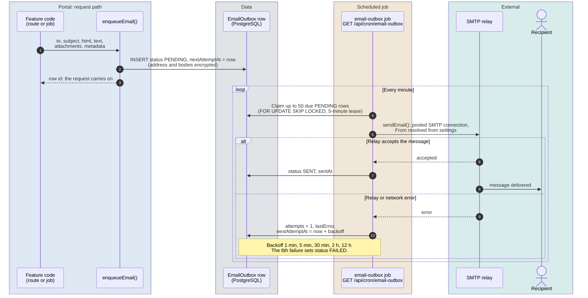
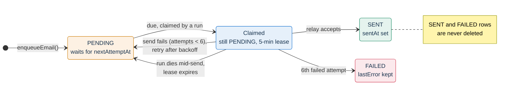
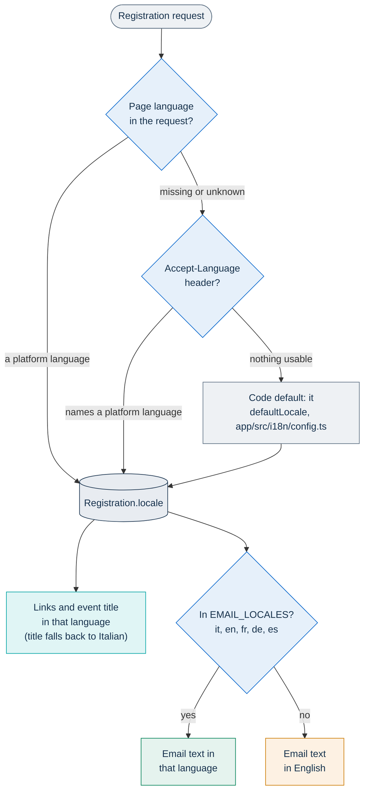
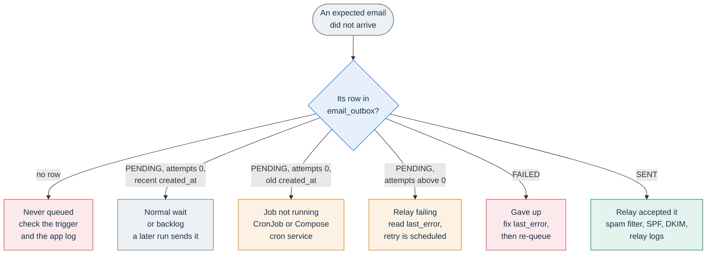

# Email and calendar

PA Webinar sends a small, fixed set of transactional emails: registration confirmations, reminders, date-change notices, post-event follow-ups, staff sign-in links and the verification links of data-subject requests. It never sends marketing mail, and there is no mailing-list feature. Every message goes through one durable queue, the email outbox, and leaves over SMTP from a single scheduled job.

This page owns outgoing email behavior: the outbox pattern, the catalog of emails, their languages, reminders, calendar files, the sender identity and the editable templates, and the known gaps. It is written for developers who add or change an email and for operators who need to find out why a message did not arrive.

It does not repeat the neighboring topics:

- SMTP host, port, TLS, credentials, provider examples and relay-side delivery problems: [Email delivery (SMTP)](../configuration/email.md);
- the schedule, authentication and deployment of the `email-outbox` and `reminders` jobs: [Scheduled and background jobs](background-jobs.md);
- the security of the staff sign-in link and of the personal join link: [Identity, access and tokens](identity-and-access.md);
- retention of registrations and of the data the emails reference: [Privacy and data protection](../GDPR.md);
- the site name and other branding an administration can set: [Branding and white-labeling](../configuration/branding.md).

## Quick answers

| Question | Answer |
|---|---|
| Does registering send the confirmation right away? | No. The registration route **queues** the confirmation in the outbox and returns. The `email-outbox` job sends it at its next run, normally within a minute. |
| What happens if the `email-outbox` job does not run? | Nothing is sent. Messages pile up as `PENDING` rows and go out once the job runs again. In Docker Compose the job is the `cron` service; in the Helm chart it is the CronJob enabled by `cronjobs.emailOutbox.enabled`. |
| In which language does an email arrive? | Italian, English, French, German or Spanish. Anyone whose language is not one of those five receives English text, with links that open the pages in their own language. |
| Can the wording be changed? | Only for the registration confirmation and the reminder, per language, in **Email templates**. Every other email has fixed text. |
| Can the sender be changed? | The display name and the reply-to address, yes, from the administration area. The sending address comes only from the deployment (`SMTP_FROM`). |
| Do moderators, speakers or invited guests get their link by email? | Moderators and speakers, no. Invited people receive nothing until they register themselves; their personal link then arrives in the confirmation, like everyone else's. See [What the platform does not email](#what-the-platform-does-not-email). |

## The outbox pattern

### From feature to inbox



### The rules

- **Producers only enqueue.** Every feature that sends mail calls `enqueueEmail()` (`app/src/lib/email/outbox.ts`), which is a single `INSERT` into `EmailOutbox` (table `email_outbox`). The request that triggered the email does not wait for SMTP, and a pod restart cannot lose a message that was already queued.
- **One consumer sends.** `sendEmail()` (`app/src/lib/email/send.ts`) is called only by the `GET /api/cron/email-outbox` route. Nothing enforces this mechanically: it is a convention that code review upholds. A direct call would bypass retries, the durable record and the shared SMTP pool.
- **Without the job, nothing leaves.** The web application never drains the queue on its own. When email "does not work" on a local stack, the `cron` service is almost always stopped ([Local development](../DEVELOPMENT.md)).
- **Delivery is at least once.** A run leases the rows it claims for five minutes. If the run dies after the relay accepted a message but before the row was marked `SENT`, the lease expires and the message is sent again. SMTP offers the same guarantee, so recipients may occasionally see a duplicate, but never a silent loss.
- **The job is protected by `CRON_API_KEY`**, passed in the `x-api-key` header, like every scheduled route ([Scheduled and background jobs](background-jobs.md)).

To add a new kind of email, follow the checklist in [Extending PA Webinar](../development/extending.md).

### What a row holds

| Column | Stored as | Why |
|---|---|---|
| `to_address`, `html`, `text` | Encrypted with `PII_ENCRYPTION_KEY` (AES-256-GCM, `encryptPII()`) | A database dump or an ad hoc query does not reveal recipients, personalized greetings or the access links inside the body |
| `subject` | Plain text | It contains at most the event title or the site name, and keeping it readable makes triage possible |
| `attachments` | Plain JSON | The calendar file, when there is one (see [Calendar files](#calendar-files)) |
| `metadata` | Plain JSON | A `kind` (listed in the [catalog](#emails-the-platform-sends)) plus record ids such as `registrationId`, `eventId` or `accountId`. The job never reads it; it exists for tracing |
| `status`, `attempts`, `next_attempt_at`, `sent_at`, `last_error` | Scheduling state | `last_error` is truncated to 1,000 characters (`app/src/app/api/cron/email-outbox/route.ts`) |

Because the recipient column is encrypted with a random nonce, a row cannot be found by email address. Operators look rows up by `metadata` or `subject` instead ([Tracing a missing email](#tracing-a-missing-email)).

### A row's life



"Claimed" is not a separate status in the table: the run pushes the row's `next_attempt_at` five minutes into the future, so no other run sees it as due. The retry schedule and the attempt limit are `nextAttemptDelayMs()` and `MAX_EMAIL_OUTBOX_ATTEMPTS` in `app/src/lib/email/outbox.ts`: six attempts in all, spaced 1 minute, 5 minutes, 30 minutes, 2 hours and 12 hours apart, so a message is given up about fourteen and a half hours after its first failure. A `FAILED` row is never retried automatically.

### Throughput and timing

The constants live in `app/src/app/api/cron/email-outbox/route.ts`:

- each run claims at most 50 rows (`BATCH_SIZE`), oldest due first;
- it sends them five at a time (`PARALLELISM`), matching the default size of the SMTP connection pool;
- it leases them for five minutes (`LEASE_MS`).

The schedules belong to [Scheduled and background jobs](background-jobs.md#job-catalog): in the chart they are `cronjobs.emailOutbox.schedule` and `cronjobs.reminders.schedule` in `infra/helm/pa-webinar/values.yaml`, and in Docker Compose the `cron` service of `docker-compose.yml`. With the defaults, the outbox job runs once a minute in both, and runs never overlap; the reminders job runs every 15 minutes in the chart and every five minutes in Compose. The outbox therefore delivers **at most about 50 messages a minute**. For most events this is invisible. For a large one it is not: a reminder to 1,500 registrants needs about 30 runs, so the last copies leave half an hour after the first, and a confirmation queued in that window waits behind them. On events with thousands of registrants, reminders with short offsets can therefore arrive after the start.

Each run answers with a JSON summary (`processed`, `sent`, `retried`, `failed`); in the chart it is the log of each CronJob run.

## Emails the platform sends

This is the complete list of producers: every call to `enqueueEmail()` in the application belongs to one of these rows.

| Email | Sent when | To | Carries | Editable | `metadata.kind` |
|---|---|---|---|---|---|
| Registration confirmation | A registration is created (`POST /api/events/<slug>/registrations`), or someone presses **Resend my access link** after the form reports that the address is already registered (`POST /api/events/<slug>/registrations/resend`). When public registration is off, also whenever the form is submitted again for an address that is already registered ([Invitation-only registration](#invitation-only-registration)) | The registrant | Personal join link, event page link, add-to-calendar links, `event.ics` attachment | Yes, **Registration confirmation** | `confirmation` |
| Reminder | The reminders job finds one of the event's reminders due ([Reminders](#reminders)) | Every registrant who has not received that reminder | The same as the confirmation, plus a "starts tomorrow / in N hours / in N minutes" note | Yes, **Event reminder** | `reminder` |
| Date-change notice | An edit of the event (`PUT /api/events/<id>`) changes its start or end time while the event is `PUBLISHED` | Every registrant | The new date and time and an `event-updated.ics` attachment. No link: it says that the personal join link is unchanged | No | `date-change-notification` |
| Post-event thank-you | The reminders job finalizes an event that opted in (see [After the event](#after-the-event)) | Every registrant, whether or not they attended | Event page link, where the recap and the feedback form are | No | `post_event_participant` |
| Post-event recap | The same run | The event's moderator contact (`moderatorEmail`), if set | Headcount, registrations, questions, polls and average feedback; event page link; recording link if the recording is published | No | `post_event_moderator` |
| Staff sign-in link | A request from the sign-in page (`POST /api/staff/login-link`), an administrator creating a staff account with the invitation option, or re-sending the link from **Accounts** | An active staff account | One-time sign-in link ([lifetime](#what-each-link-is)) | No | `staff-login` |
| Data export link | A data subject asks for a copy of their data (`POST /api/gdpr/export/request`, right of access, Art. 15) | The address typed in the form | Signed link to `/privacy/my-data` ([lifetime](#what-each-link-is)) | No | `gdpr-export-request` |
| Erasure link | A data subject asks for erasure (`POST /api/gdpr/erasure/request`, right to erasure, Art. 17) | The address typed in the form | Signed link to `/privacy/my-data/erasure` ([lifetime](#what-each-link-is)) | No | `gdpr-erasure-request` |

### What each link is

| Link | Path | Lifetime | Owner page |
|---|---|---|---|
| Personal join link | `/events/<slug>/live?token=<accessToken>`; while public registration is off, `/api/events/<slug>/registrations/enter?token=…&sig=…&lang=…` instead ([Invitation-only registration](#invitation-only-registration)) | As long as the registration exists; it identifies a seat, and a forwarded copy works for whoever holds it | [Identity, access and tokens](identity-and-access.md) |
| Event page | `/events/<slug>` | Public while the event page is visible | [Event lifecycle](event-lifecycle.md) |
| Calendar download | `/api/events/<slug>/calendar.ics` | Public; 404 for drafts | [Calendar files](#calendar-files) |
| Staff sign-in link | `/admin/access?t=<token>` | 20 minutes (`DURATA_LINK_MINUTI` in `app/src/lib/auth/staff-link-config.ts`), one use; opening it consumes nothing until **Sign in** is pressed | [Identity, access and tokens](identity-and-access.md) |
| Data-subject links | `/privacy/my-data?t=…`, `/privacy/my-data/erasure?t=…` | One hour (`TOKEN_TTL_SECONDS` in `app/src/lib/gdpr/request-token.ts`) | [Privacy and data protection](../GDPR.md) |

Every page link is built with `localizedUrl()`, so it carries the localized path for the recipient's language (`/it/eventi/<slug>`, `/en/events/<slug>`). The calendar download and the entry route are API routes and are not localized; the entry route carries the language in `lang` and redirects to the localized live page.

### The confirmation in detail

The confirmation is **queued, not sent directly**. `sendConfirmationEmail()` (`app/src/lib/email/confirmation.ts`) builds the message, calls `enqueueEmail()` and sets `Registration.confirmationSentAt` to the time of queuing: from the registrant's point of view, the platform has taken responsibility for delivery. Whether the relay accepted it is recorded only on the outbox row.

Queuing errors are logged and swallowed, so a registration never fails because of email. In that case `confirmationSentAt` stays empty, and the registrant can ask for the message again with **Resend my access link**.

The resend route answers the same way whether or not the address is registered, and queues a message only when it is. It is rate-limited per IP address ([Security architecture](security.md)). It uses the language stored with the registration, not the language of the page that asked, so someone who knows an address cannot change the language in which its owner receives the link.

The confirmation contains, in order:

- the event's cover image as a banner, when there is one (an absolute `http` or `https` address; the recipient's mail client loads it from its host);
- the event title and a details table (date, time, duration);
- a **Join the event** button with the personal join link;
- add-to-calendar links for Google, Outlook and Yahoo, and a **Download .ics** link;
- the note "Keep this email — it contains your personal link to access the event";
- a **View event page** link;
- a footer note, then the `event.ics` attachment.

A reminder has the same layout, with the "starts in…" sentence as its introduction and no note under the button.

### Invitation-only registration

When an administrator turns off **Public registration enabled** (`SiteSetting.publicRegistrationEnabled`, in the **Features** tab of the **General** settings page), only addresses on the event's invitation list (`EventInvitation`) can register, and the email becomes the only way to receive the personal link (`app/src/lib/events/registration-access.ts`, `app/src/lib/events/registration-link.ts`):

- The registration form answers `202` with the same body whether the address is invited, already registered or neither. It queues a confirmation for a new registration and again for an existing one, and nothing for an address that is not on the list. The form shows no link and sets no cookie.
- Confirmations, resends and reminders carry the personal link through the entry route, `/api/events/<slug>/registrations/enter`, with a signature (`sig`, an HMAC keyed with `APP_SECRET`) next to the token. Opening it binds that browser to the registration with the signed `event_access_<eventId>` cookie and redirects to the live room. The form proves nothing about the address; opening the email does.
- The add-to-calendar links (Google, Outlook, Yahoo) in the same emails always carry the unsigned personal link, `/live?token=…`, because calendar entries are forwarded and shared without much thought. That link admits whoever opens it to the registrant's seat, but not with the registrant's identity.
- The link form is chosen when each message is built, so emails queued while registration was public keep the plain `/live?token=` link.

The access model behind this is in [Identity, access and tokens](identity-and-access.md#registrants), and the registration flow in [From creation to recap](event-journey.md#invitation-only-registration).

### After the event

When an event has **Send recap email when the event ends** turned on (`Event.postEventEmailEnabled`), the reminders job finalizes it once it is `ENDED`. The logic is in `app/src/lib/events/post-event-finalize.ts`:

- only events that ended within the last seven days (`MAX_AGE_DAYS`) are considered, so turning the option on for an old event sends nothing;
- historical events created from **Publications** (type `LEGACY`) are skipped;
- the event is claimed first by setting `postEventEmailSentAt`, with a conditional update, so two overlapping runs cannot both send; the follow-up goes out at most once per event;
- the recap is computed if nobody has opened it yet, and its figures go into the moderator's email.

The thank-you links to the event page. An `ENDED` event's page answers 404 unless **Event page visible after end** is on and its **Visible until:** date (`postEventPublicUntil`), if set, has not passed ([Event lifecycle](event-lifecycle.md)). The finalization checks neither, so the two options should be turned on together, with an end date that leaves registrants time to open the link ([Known gaps](#known-gaps)).

### What the platform does not email

- **Moderator and speaker links.** Neither the event's moderator link nor the links of named grants (`EventModerator`) are ever emailed. Staff copy them from the administration area (**Copy moderator link**) and pass them on. The email address stored with a grant is contact information only.
- **Invitations.** `EventInvitation` rows are the allow-list for invitation-only registration ([Invitation-only registration](#invitation-only-registration); [From creation to recap](event-journey.md#invitations-and-named-grants)). The model has `token` and `sentAt` columns, but nothing sets them, and no email goes out: staff must send invited people the event page themselves.
- **Announcements of future events.** The registration form can collect consent to receive information about upcoming events (`consentFutureCommunications`), but the platform sends nothing based on it. The flag is included in the **Export CSV** file of **Sign-ups** and in the data subject's own data export, for the controller to use outside the platform ([Privacy and data protection](../GDPR.md)).
- **The outcome of a data-subject request.** The export is delivered in the browser that opens the signed link, and a completed erasure is confirmed on screen only.
- **Event cancellation.** Archiving or deleting an event notifies nobody.
- **Address-book opt-out links.** See [Known gaps](#known-gaps).

Several texts in the administration area say otherwise; they are listed under [Known gaps](#known-gaps).

## Languages

Emails exist in five languages, listed in `EMAIL_LOCALES` in `app/src/lib/email/lingua.ts`: Italian, English, French, German and Spanish. **English is the fallback** for every other interface language. Each email uses two languages:

- the **page language**, for the event title and the links, which can be any of the 24 platform languages;
- the **text language**, for everything written by the platform: the page language if it is one of the five, otherwise English.

A Polish registrant therefore receives English text, the event title in Polish if the event has one (otherwise in Italian), and links that open the Polish pages.

### How a registrant's language is chosen



The language is stored once, at registration, and every later email to that registrant uses it.

| Email | Where its language comes from |
|---|---|
| Confirmation | The page the person registered from, as above; a resend uses the stored `Registration.locale` |
| Reminder, date-change notice, post-event thank-you | `Registration.locale`; for registrations that have none, the installation's default language (`SiteSetting.defaultLocale`) |
| Post-event recap to the moderator | The installation's default language (`SiteSetting.defaultLocale`) |
| Staff sign-in link | The page the link was requested from: the sign-in page, or the administration page of the administrator who sent it |
| Data-subject links | The page the request was made from, otherwise Italian |

**Staff sign-in emails exist in all five languages**, like every other email. Dates and times in the body are written in the text language's regional format (English uses day-month order and a 24-hour clock) and in the event's time zone (`Event.timezone`, falling back to `Europe/Rome` in `app/src/lib/utils/date-format.ts`), with no zone label. The calendar attachment carries the exact instant ([Time zones](#time-zones)).

That emails cover five languages while the interface covers 24 is a known limitation tracked in the [roadmap](../ROADMAP.md#known-limitations-of-shipped-features). The interface side is described in [Languages and localization](i18n.md).

## Reminders

### Defaults and choices

- **Two by default.** Every event created through `POST /api/events` (the event wizard) gets two reminders: one day before (1,440 minutes) and one hour before (60 minutes). The defaults are written in `app/src/app/api/events/route.ts`.
- **Duplicates copy them.** Duplicating an event copies its reminders with the rest of the configuration. Instant calls and historical events created from **Publications** have none.
- **Fixed presets, at most five per event.** Reminder offsets must be one of `REMINDER_PRESETS` in `app/src/lib/validation/schemas.ts` (from seven days to fifteen minutes before the start). `POST /api/events/<slug>/reminders` (`app/src/app/api/events/[param]/reminders/route.ts`) refuses a sixth reminder and a duplicate offset, and `DELETE /api/events/<slug>/reminders/<id>` removes one. Both routes require the event's moderator link token; a named grant is not enough.
- **No screen changes them.** The administration area has no control that calls those routes. The event page in the administration area lists the reminders read-only in the **Notifications** panel, with how many were sent or when the next one goes out.

A reminder is stored as `EventReminder` (`offsetMinutes`, `label`), and each delivery as a `ReminderSent` row, unique per reminder and registration. The GDPR cleanup deletes `ReminderSent` rows together with the registrations they point to.

### When a reminder goes out

On each run, the reminders job (`GET /api/cron/reminders`) does the following:

1. It loads the reminders of every event that is `PUBLISHED`, `LIVE`, `PROVISIONING` or `IDLE`. Drafts receive nothing, and neither do ended or archived events.
2. It keeps the reminders that are due: `startsAt − offset ≤ now < startsAt`.
3. For each due reminder, it takes every registration of the event with no `ReminderSent` row for it, queues the email, then writes the `ReminderSent` row.
4. It runs the post-event finalization ([After the event](#after-the-event)).

What follows from these rules:

- **Late registrants catch up.** Someone who registers after a reminder's moment still receives it at the next run, as long as the event has not started. With the defaults, a person who registers in the last hour receives the confirmation and both reminders, including the one that says the event "starts tomorrow".
- **Publishing late sends every overdue reminder at once**, for the same reason.
- **The start closes the window.** A reminder that has not gone out when the event starts never goes out; the **Notifications** panel then shows "Not sent — the moment has passed".
- **Rescheduling does not reset anything.** `ReminderSent` rows are kept when the date changes, so after an event is postponed, reminders that already went out are not sent again for the new date. Registrants learn about the change from the date-change notice, which is sent only while the event is `PUBLISHED`.
- **Precision depends on the schedule.** A reminder is queued by the first run of the reminders job after its moment, so it leaves up to one run interval late ([default schedules](#throughput-and-timing)), plus the outbox's minute and the [throughput](#throughput-and-timing) limit. With the chart default, the fifteen-minute preset can arrive at, or just after, the start: for an event that starts at 10:00:30, the only run inside the window is the one at 10:00, and the outbox sends the message at 10:01.
- **At least once.** The email is queued before its `ReminderSent` row is written, so a failure between the two repeats the reminder at the next run.

Reminders go to registrants only. Moderators and speakers receive none.

## Calendar files

### Where they appear

| Where | File | Organizer (`ORGANIZER`) |
|---|---|---|
| Attached to the confirmation and to every reminder | `event.ics`, `text/calendar; method=REQUEST` | The event's moderator contact (`moderatorName`, `moderatorEmail`), falling back to `SMTP_FROM` |
| Attached to the date-change notice | `event-updated.ics` | The same |
| Public download, `GET /api/events/<slug>/calendar.ics`, linked from emails, the registration confirmation screen and the add-to-calendar menu on the event page (**Download .ics file**) | `evento-<slug>.ics`, cached publicly for an hour (`app/src/app/api/events/[param]/calendar.ics/route.ts`) | Always `SMTP_FROM`, never the moderator's address |

The organizer column gives the address. The organizer name is `moderatorName`; when it is not set, the name is "PA Webinar" in confirmation and date-change files, and the site name in reminder files and in the public download.

The generator is `generateEventICal()` in `app/src/lib/ical/generate.ts`, built on `ical-generator`.

### Time zones

Start and end are written as **UTC instants** (`DTSTART:20300115T091500Z`), with no `TZID` parameter and no `VTIMEZONE` component. Every calendar client converts them to the reader's own time zone, which is also what an online audience spread across time zones needs. `Event.timezone` is used only to write the human-readable time in the email body.

A `TZID` label must not be added without a matching `VTIMEZONE` and a real conversion: the library does not convert the instant, so labeling a UTC wall-clock time as local time shifts the event by the zone's offset.

### What the file contains

- `SUMMARY`: the event title in the recipient's page language.
- `DESCRIPTION`: the event description as stored, which is Markdown source, not rendered text.
- `URL`: the public event page. The personal join link is **not** in the file.
- `ORGANIZER`: as in the table above. In emailed files, every registrant therefore receives the moderator contact's address.
- `UID`: generated at random for every file, with `SEQUENCE:0`.

Because the `UID` is new each time, a calendar client cannot tell that `event-updated.ics` describes the event it already holds from the confirmation. The update arrives as a second, separate entry rather than as a change to the first.

### Add-to-calendar links

Confirmation and reminder emails also carry links that open a pre-filled entry in Google Calendar, Outlook on the web and Yahoo Calendar (`app/src/lib/ical/calendar-links.ts`). In those links the entry's location and details hold the **personal join link**, in its unsigned form even while public registration is off: following one hands the link to that calendar provider and stores it in the recipient's calendar. The add-to-calendar menu on the public event page uses the same generator with the public event page address instead.

## Sender identity and templates

### Sender name, address and reply-to

`resolveSender()` in `app/src/lib/email/send.ts` resolves the `From` and `Reply-To` of every message at send time:

| Part | Source, in order of precedence | Where it is set |
|---|---|---|
| Display name | `SiteSetting.emailFromName`, then `SMTP_FROM_NAME`, then `SiteSetting.siteName`, then "PA Webinar" | **Sender name** under **Email sender** in the **Features** tab of the **General** settings page, or the deployment environment |
| Address | `SMTP_FROM` only | The deployment environment ([Email delivery (SMTP)](../configuration/email.md)) |
| Reply-To | `SiteSetting.emailReplyTo`, or none | **Reply-to address** under **Email sender** in the **Features** tab of the **General** settings page |

- **The address is not editable from the administration area** on purpose. The relay authorizes a specific sender, and an address typed in by hand would silently break SPF and DKIM alignment instead of rebranding anything.
- **Set a reply-to address.** The sending address is normally a no-reply mailbox, so without **Reply-to address** a registrant's reply reaches nobody.
- **An empty `SMTP_FROM` is not the same as an absent one.** The built-in fallback address applies only when the variable is not set at all. An empty value, which is the placeholder in the chart's `values.yaml`, produces an empty sender address, and calendar files get an empty organizer.
- **If the settings cannot be read** (a database blip), the display name falls back to `SMTP_FROM_NAME`, then to "PA Webinar", no Reply-To is set, and a warning is logged. The send is not blocked.

The display name is passed to the mail library as a structured value, which quotes and encodes it, so no character in a configured name can corrupt the `From` header.

### Editable templates

Administrators can override the text of two emails from **Email templates** (`/admin/settings/email-templates`): **Registration confirmation** (key `confirmation`) and **Event reminder** (key `reminder`). Organizers cannot open this page.

- **Scope.** One override per email and per language (`EmailTemplate`, unique on `key` and `locale`), for the five email languages. Overrides apply to the whole installation, not to single events.
- **Fields.** Subject, main heading, intro paragraph, button label, info note and footer note. The layout, the details table, the calendar links and the labels stay as built in. The lists are `OVERRIDABLE_FIELDS` and `ALLOWED_PLACEHOLDERS` in `app/src/lib/email/resolve-template.ts`.
- **Placeholders.** `{{eventTitle}}`, `{{eventDate}}`, `{{eventTime}}`, `{{eventDuration}}`, `{{joinUrl}}`, `{{eventPageUrl}}`, `{{siteName}}` and `{{offsetMinutes}}` are replaced at send time. Unknown placeholders are left as typed. `{{offsetMinutes}}` and `{{siteName}}` have a value only in reminders; in a confirmation both render empty (for `{{siteName}}`, see [Known gaps](#known-gaps)).
- **One text for every offset.** A reminder override applies to every reminder of every event, whatever its offset. The built-in subject and intro adapt ("starts tomorrow", "starts in 1 hour"); an override does so only through `{{offsetMinutes}}`, which is a number of minutes.
- **Empty means default.** A field left empty, or cleared, uses the built-in text. A built-in text therefore cannot be blanked, only replaced. **Reset to default** deletes the override.
- **Plain text only.** The heading, intro, info note and footer note are HTML-escaped when inserted. The button label is inserted as is, so it must stay plain text, and it should not contain `{{eventTitle}}` ([Known gaps](#known-gaps)).
- **Defaults are visible.** The editor shows the built-in text of every field from `GET /api/admin/email-templates/defaults`, with placeholders in place of real values, except the reminder offset, which is shown for one hour.

The date-change notice, the post-event emails, the staff sign-in email and the data-subject emails have fixed texts in code: `app/src/lib/email/notification.ts`, `app/src/lib/email/templates.ts` and the two `request` routes under `app/src/app/api/gdpr/`.

### What the emails look like

Every email is self-contained HTML with inline styles and a plain-text alternative. None loads web fonts, style sheets or tracking pixels. The only remote resource is the event banner image in confirmations and reminders.

The layout differs by email:

- **Confirmations, reminders, post-event emails and the staff sign-in email** share one layout from `app/src/lib/email/templates.ts`, with a header band above the heading. The band shows the site name in post-event and staff emails; in confirmations and reminders it always reads "PA Webinar" ([Known gaps](#known-gaps)).
- **The date-change notice** has its own layout in `app/src/lib/email/notification.ts`: its header band shows its heading, and its footer always says the email was sent automatically by PA Webinar, whatever the site name is.
- **The data-subject emails** are plain paragraphs with the signed link, with no header or footer.

## Tracing a missing email

For operators. Relay-side causes (authentication, TLS, SPF and DKIM, provider limits) are covered in [Email delivery (SMTP)](../configuration/email.md); symptoms that span several subsystems are in [Troubleshooting](../operations/troubleshooting.md).



**1. Find the row.** The recipient column is encrypted, so search by `metadata` or `subject`:

```sql
-- State of the queue
SELECT status, count(*) AS messages, min(next_attempt_at) AS oldest_next_attempt
FROM email_outbox
GROUP BY status;

-- Everything queued for one registration
SELECT id, metadata->>'kind' AS kind, status, attempts, created_at, sent_at, last_error
FROM email_outbox
WHERE metadata->>'registrationId' = '<registration-id>'
ORDER BY created_at;

-- Recent failures and retries
SELECT id, metadata->>'kind' AS kind, subject, attempts, next_attempt_at, last_error
FROM email_outbox
WHERE status = 'FAILED' OR (status = 'PENDING' AND attempts > 0)
ORDER BY updated_at DESC
LIMIT 20;
```

**2. Read what the row says.**

- **No row:** the producer never queued the message. Check its trigger in the [catalog](#emails-the-platform-sends): a draft event gets no reminders, a date change on an event that is not `PUBLISHED` notifies nobody, while public registration is off an address that is not on the invitation list gets no confirmation, the post-event follow-up needs its option on and a recently ended event ([After the event](#after-the-event)), and the data-subject and staff forms stop queuing, without saying so, once their per-address rate limits are reached ([Security architecture](security.md)). Queuing errors are logged by the application with an `[email]`, `[cron/reminders]` or `[post-event-finalize]` prefix.
- **`PENDING` with `attempts` at 0 and a recent `created_at`:** the row is waiting for the next run, or behind a large mailing ([Throughput and timing](#throughput-and-timing)).
- **`PENDING` with `attempts` at 0 and an old `created_at`:** nothing is draining the queue. Check the job:

  ```bash
  # Helm (release and namespace pa-webinar)
  kubectl -n pa-webinar get cronjob pa-webinar-email-outbox
  kubectl -n pa-webinar get jobs --sort-by=.metadata.creationTimestamp | grep email-outbox

  # Docker Compose
  docker compose logs cron
  ```

- **`PENDING` with `attempts` above 0:** the relay refuses the message or cannot be reached. `last_error` holds the relay's answer, and `next_attempt_at` says when the next try is due. With the chart's NetworkPolicy enabled, egress to the relay is open only on `networkPolicy.egress.smtpPort` (587 by default) unless `networkPolicy.egress.allowImplicitTlsSmtp` also opens 465 ([Deploying with Helm](../DEPLOYMENT.md)).
- **`FAILED`:** all six attempts are used. Fix the cause shown in `last_error`, then put the row back in the queue; the next run sends it:

  ```sql
  UPDATE email_outbox
  SET status = 'PENDING', attempts = 0, next_attempt_at = now()
  WHERE id = '<row-id>';
  ```

- **`SENT`:** the relay accepted the message. What happens next is outside the platform: spam filtering, SPF and DKIM alignment of `SMTP_FROM`, and the relay's own logs.

**3. Run the job by hand** to see its summary without waiting for the schedule:

```bash
# Helm: start a one-off Job from the CronJob, then read its output
kubectl -n pa-webinar create job email-outbox-manual --from=cronjob/pa-webinar-email-outbox
kubectl -n pa-webinar logs job/email-outbox-manual

# From the Compose host, with the key
curl -fsS -H "x-api-key: $CRON_API_KEY" http://localhost:3000/api/cron/email-outbox
# From any other host that reaches the portal, with the key
curl -fsS -H "x-api-key: $CRON_API_KEY" https://webinar.example.com/api/cron/email-outbox
# {"ok":true,"processed":3,"sent":3,"retried":0,"failed":0}
```

In the chart, each Job's log is that JSON summary. The Compose `cron` service discards the body and logs only `[cron] email-outbox ok` or a failure line.

Two things do **not** prove that email works:

- the SMTP entry on the status page (**System status**, `/status`) and on the infrastructure page (`/admin/infrastructure`) turns healthy as soon as `SMTP_HOST` is set: `/api/status` and `/api/status/infrastructure` never contact the relay;
- a successful job run. The route answers `200` even when every message in the batch failed, and reports the failures only in the `retried` and `failed` counts, so the Job succeeds while the relay refuses mail.

No built-in metric or alert covers the outbox; alerting on it is an open roadmap item ([Roadmap](../ROADMAP.md#installation-and-operations)). [Monitoring and health](../operations/monitoring.md#what-the-rules-do-not-cover) gives a custom rule that fires when the job stops succeeding. It catches a stopped job, not a refusing relay, which only `last_error` and `attempts` show.

On a local stack, every message is captured by Mailpit instead of being delivered; see [Local development](../DEVELOPMENT.md).

## Known gaps

| Gap | Effect | Tracked in |
|---|---|---|
| **The outbox is never emptied.** No job deletes `SENT` or `FAILED` rows, and erasure on request does not touch them. | Encrypted addresses and bodies, including personal join links, stay in the database indefinitely. The plain-text calendar attachments keep the moderator contact's address. | [Roadmap: the email outbox is never emptied](../ROADMAP.md#next) |
| **The address-book opt-out link is never emitted.** `issueRubricaOptOutToken()` (`app/src/lib/persons/opt-out-token.ts`) has no caller, although the opt-out page and `POST /api/rubrica/opt-out` accept its tokens. | The registration form says consent to the address book can be withdrawn "using the 'Remove me from the address book' link in emails", but no email carries that link. | [Privacy and data protection](../GDPR.md) |
| **Texts promise emails that are not sent.** The event wizard says speakers "receive a moderator link via email", that invited guests each get "a personal join link", and that the primary moderator receives "a private link by email". | Nobody receives those links unless staff copy and send them. | Not yet tracked |
| **Confirmations and reminders ignore the site name in their header.** No caller passes the site name to these two templates. | The header band always reads "PA Webinar", and `{{siteName}}` renders empty in confirmation overrides (it works in reminder overrides). | Not yet tracked |
| **The date-change notice always names PA Webinar.** Its footer text is fixed in `app/src/lib/email/notification.ts`. | A white-labeled installation still tells registrants that the email was sent automatically by PA Webinar. | Not yet tracked |
| **The button label of the confirmation and reminder is not escaped.** `ctaButton()` in `app/src/lib/email/templates.ts` inserts it into the HTML as is. | An override, or an event title placed in it through `{{eventTitle}}`, can add markup to the email. | Not yet tracked |
| **Rescheduling does not reset reminders, and the updated calendar file has a new identity.** | After a postponement, reminders already sent are not sent again, and `event-updated.ics` creates a second calendar entry instead of moving the first. | Not yet tracked |
| **The post-event thank-you does not check page visibility.** | With **Event page visible after end** off, or its end date already passed, every registrant receives a link that answers 404. | Not yet tracked |
| **Emails in five languages.** | Registrants in any other interface language receive English text. | [Roadmap: known limitations](../ROADMAP.md#known-limitations-of-shipped-features) |
| **Outbox throughput is fixed.** | At about 50 messages a minute, large mailings drain slowly and short-offset reminders can arrive late ([Throughput and timing](#throughput-and-timing)). | Not yet tracked |
| **Nothing watches the queue.** No built-in metric or alert covers the outbox, and the job succeeds even when the relay refuses every message. | A custom rule on the CronJob's last success catches a stopped job ([Monitoring and health](../operations/monitoring.md#what-the-rules-do-not-cover)). A failing relay shows only in `last_error` and `attempts`, and is otherwise noticed when people complain. | [Roadmap: noticing when something breaks](../ROADMAP.md#installation-and-operations) |

## Where the code lives

| Concern | File |
|---|---|
| Queue, encryption, retry schedule | `app/src/lib/email/outbox.ts` |
| Transport, sender resolution | `app/src/lib/email/send.ts` |
| Draining the queue | `app/src/app/api/cron/email-outbox/route.ts` |
| Reminders and post-event run | `app/src/app/api/cron/reminders/route.ts`, `app/src/lib/events/post-event-finalize.ts` |
| Confirmation | `app/src/lib/email/confirmation.ts` |
| Personal join link and invitation-only registration | `app/src/lib/events/registration-link.ts`, `app/src/lib/events/registration-access.ts` |
| Date-change notice | `app/src/lib/email/notification.ts` |
| Built-in texts and layouts | `app/src/lib/email/templates.ts` |
| Template overrides | `app/src/lib/email/resolve-template.ts`, `app/src/app/api/admin/email-templates/` |
| Email languages | `app/src/lib/email/lingua.ts` |
| Calendar files and links | `app/src/lib/ical/` |
| Staff sign-in email | `app/src/lib/auth/staff-login.ts` |
| Data model (`EmailOutbox`, `EmailTemplate`, `EventReminder`, `ReminderSent`) | `app/prisma/schema.prisma`; see [Data model](data-model.md) |
