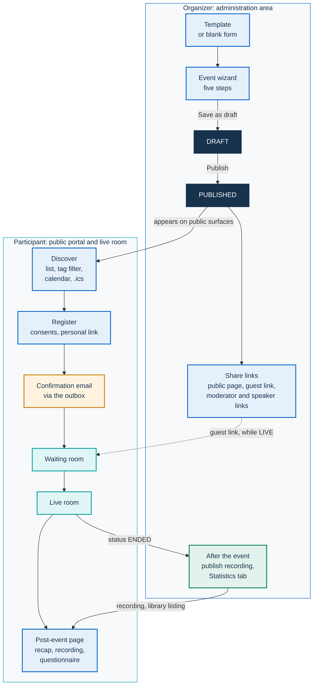
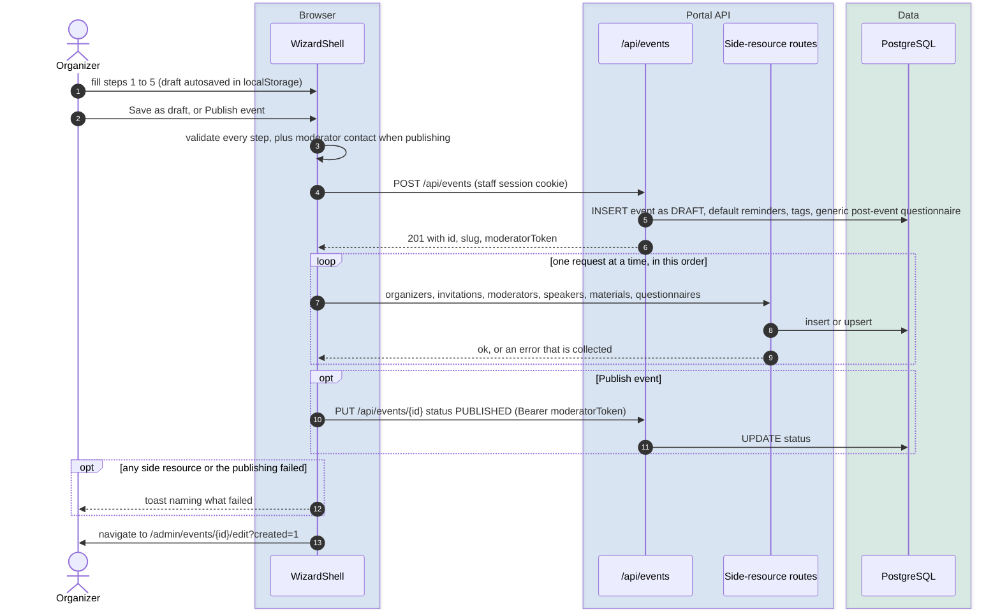
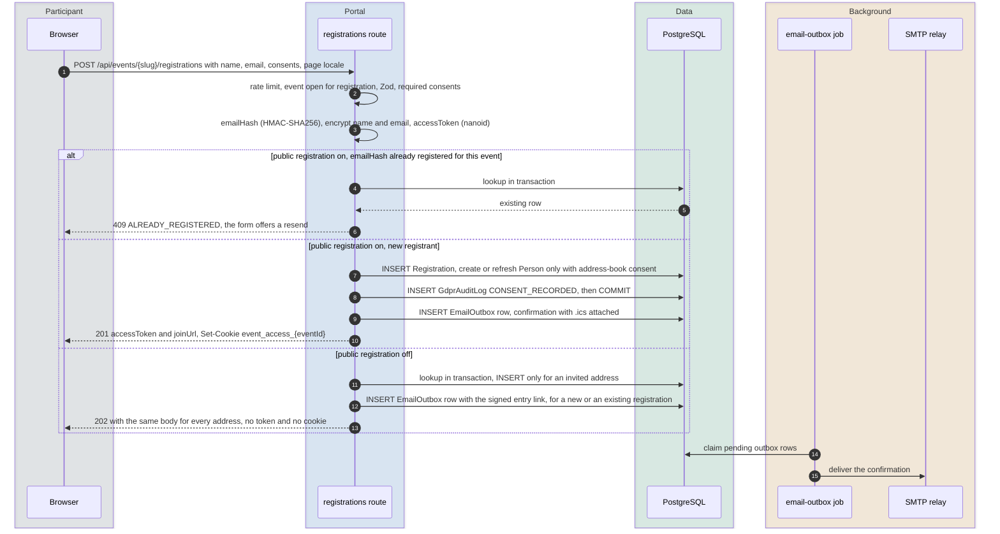

# From creation to recap: the event journey

This page follows an event outside the live room. It covers how an organizer creates, templates, duplicates and publishes an event, how people discover it, register or get invited, which access modes exist, how questionnaires and materials are attached, and what happens after the event: the recap, the recording and the video library, the transcript and the analytics. It also covers how an instant call is created.

Neighboring mechanisms have their own pages:

- statuses and who changes them: [event-lifecycle.md](event-lifecycle.md);
- the waiting room and the optional square: [waiting-room.md](waiting-room.md);
- Q&A, polls, chat, agenda and the other in-room features: [live-interaction.md](live-interaction.md);
- moderator links, named grants, registrant and guest identities, cookies: [identity-and-access.md](identity-and-access.md);
- every email the platform sends, reminders and calendar files: [email.md](email.md);
- consent texts, retention and the cleanup job: [GDPR.md](../GDPR.md).

Paths on this page are the internal route paths (`/events/…`, `/admin/events/…`). Public URLs are localized per language, for example `/it/eventi/…` and `/en/events/…`; see [i18n.md](i18n.md#localized-urls).

## The event at a glance

An event is one row of the `Event` model (table `events`) plus a handful of related records. `app/prisma/schema.prisma` is the authority for its fields; the ones that shape the journey are:

| Aspect | How it is stored |
|---|---|
| Content | `title`, `description` and `speakersInfo` are JSONB objects keyed by language code (`{ "it": "…", "en": "…" }`). Empty translations of the title and description are dropped on write. Reads fall back from the requested language to Italian, then to any non-empty value (`getLocalized()` in `app/src/lib/utils/locale.ts`). |
| Address | `slug`, derived from the Italian title (or the first available one) in kebab case, with a numeric suffix when taken (`app/src/lib/utils/slug.ts`). Public URLs are localized: `/it/eventi/<slug>`, `/en/events/<slug>` ([i18n.md](i18n.md)). |
| Type | `eventType`: `SCHEDULED` (the default), `INSTANT` for [instant calls](#instant-calls), `LEGACY` for recordings imported from an external source, which have no live room. |
| Status | `status`, one of `DRAFT`, `PUBLISHED`, `PROVISIONING`, `LIVE`, `IDLE`, `ENDED`, `ARCHIVED` ([event-lifecycle.md](event-lifecycle.md)). |
| Tags | `Tag` (slug, multilingual name, color, sort order) linked through `EventTagLink`. |
| Co-organizing organizations | `EventOrganizer` rows: a name, an optional logo and an optional website, shown on the public page. Display metadata only: they grant no access and receive no email. The older single-string `organizerName` column is still read as a fallback. |
| Owner | `createdById`, the staff account that created the event. Administrators manage every event; an organizer manages only the events they created ([ADR-014](../adr/014-organizer-role.md)). An event without an owner is managed by administrators only. |
| Room and moderator seat | `jitsiRoomName` (a fresh UUID-based name per event) and `moderatorToken` (a UUID, the event's primary moderator link). Both are generated on creation and never copied ([identity-and-access.md](identity-and-access.md#moderator-and-speaker-links)). |

## Creating an event

Administrators and organizers create events at `/admin/events/new` (**New event**). The page first offers the [template picker](#templates) and, above it, the card that creates an [instant call](#instant-calls). Choosing a template reloads the page with `?template=<id>`; skipping the picker opens a blank wizard. When no template exists, the blank wizard opens directly.

### The five wizard steps

The wizard (`app/src/components/admin/event-wizard/`, shell in `wizard-shell.tsx`) keeps all five steps in one shared form state. Every step can be revisited from the step bar without losing later work.

| Step | What it sets |
|---|---|
| 1. **Basics** | Title and Markdown description for each enabled language; start, end and time zone (the site's default time zone; a new event starts tomorrow and lasts the template's default duration, or 120 minutes); expected participants; one cover image, stored both as the library cover and as the event image; waiting-room audio; tags; recurrence; per-event overrides for the title kicker, the waiting-room engine, the video quality preset and the expected share of participants who send audio or video. |
| 2. **Permissions** | The role-by-feature permission matrix (the moderator column is always on), recording and automatic start, agenda, word cloud and whiteboard, and the AI post-production options. The whiteboard can be switched on only when the installation declares the whiteboard service (`NEXT_PUBLIC_WHITEBOARD_ENABLED`, read by the page at request time); otherwise the switch says why, and a value already on can only be switched off. The options depend on each other: transcription needs recording; summary and translation need transcription; dubbing needs translation; per-participant recording needs recording and transcription; keeping participant tracks needs per-participant recording. Translation requires at least one target language. |
| 3. **People** | Co-organizing organizations, co-moderators and speakers ([named grants](#invitations-and-named-grants)), and [invitations](#invitations-and-named-grants). The address-book picker appears only to administrators. |
| 4. **Content** | [Materials](#materials-and-agenda) and the pre-registration and post-event [questionnaires](#questionnaires-and-post-event-feedback). **Save draft and go to questionnaire management** creates the event as a draft and opens its questionnaire page. |
| 5. **Review** | A summary, a configuration diagram and an estimated-capacity preview computed from the site's bridge-sizing settings ([scaling.md](scaling.md)); the data retention in days, with a one-line reminder that personal data is deleted after that threshold; the privacy notice template (the one marked as default is preselected), a custom privacy text and a privacy document; the primary moderator's name and email, to which the moderator link is emailed ([email.md](email.md#moderator-and-speaker-links)). |

Client-side checks run before moving on (`app/src/components/admin/event-wizard/validation.ts`): a title of at least three characters and a description of at least 10 characters, both in the site's default language and with leading and trailing spaces ignored; an end after the start; 2 to 500 expected participants; and target languages when translation is on. Title and description carry a `*` on the default language's tab, and when another language tab is open the error says which tab to switch to. The step 1 checks apply to **Save as draft** too, because the server stores drafts under the same rules. **Publish event** also requires the moderator name and a valid moderator email; **Save as draft** does not.

The events API also requires an Italian title of at least 3 characters and an Italian description of at least 10 characters (`eventBaseSchema` in `app/src/lib/validation/schemas.ts`, with the threshold in `app/src/lib/validation/event-description.ts`), whatever the site's default language, on creation and on every edit that sends them. When the server still refuses the data (`422 VALIDATION_ERROR`), the wizard maps each issue to its step and field, jumps there and shows the localized message asking to check the highlighted fields. An issue that no field can show, such as a missing Italian text on a site whose default language is another, is quoted in the alert. The alert scrolls into view.

`maxParticipants` is an estimate of attendance used for capacity planning, not a cap: registrations beyond it are accepted. The events API accepts up to 10,000 as a sanity bound (`app/src/lib/validation/schemas.ts`); the wizard stops at 500.

The permission matrix is authoritative. The wizard and the server both derive the older boolean toggles (`qaEnabled`, `chatEnabled`, `participantsCanUnmute`, `participantsCanStartVideo`, `participantsCanShareScreen`) from it, so the two representations never disagree.

### What happens on submit

1. **`POST /api/events`** requires a staff session (administrator or organizer) and is rate-limited to 5 requests per minute per IP address. It validates the body with Zod, rejects an unknown privacy notice template with a field error, and creates the event:
   - with the column default status `DRAFT` (the create endpoint does not accept a status);
   - with a fresh `slug`, `jitsiRoomName` and `moderatorToken`, and `createdById` set to the caller;
   - with a capacity estimate snapshot (`capacityEstimateJson`) for later comparison with real usage;
   - with two reminders, one day and one hour before the start ([email.md](email.md));
   - with the tags whose slugs exist (unknown slugs are dropped silently);
   - with the platform's generic post-event feedback questionnaire attached, unless `feedbackEnabled` is `false`.

   It records an `EVENT_CREATE` entry in the administration audit log and answers `201` with the event and two links: the public page and the moderator link.
2. **Side resources** are created one request at a time, in a fixed order. Each route authenticates differently:

   | Resource | Route | Credential |
   |---|---|---|
   | Co-organizing organizations | `POST /api/events/{id}/organizers` | `Authorization: Bearer <moderatorToken>` |
   | Invitations | `POST /api/admin/events/{id}/invitations` | Staff session cookie |
   | Co-moderators, then speakers | `POST /api/events/{id}/moderators` with role `MODERATOR` or `SPEAKER` | `Authorization: Bearer <moderatorToken>` |
   | Materials | `POST /api/admin/events/{id}/materials` | Staff session cookie |
   | Questionnaires | `PUT /api/admin/events/{id}/questionnaires/{placement}`, for `PRE_REGISTRATION` and `POST_EVENT` | Staff session cookie |

   A failure does not stop the sequence: the wizard collects the names of the resources that failed.
3. **Publishing.** With **Publish event**, the wizard sends `PUT /api/events/{id}` with `{ "status": "PUBLISHED" }` and the moderator token.
4. **Outcome.** If any side resource failed, a toast names it ("Event created, but some items weren't saved: …"). If the publishing request fails, the event stays a draft and a second toast says so, with the server's answer when there is one ("The event was created but not published: it is still a draft. …"). The toast lives in the administration layout, so it survives navigation. The wizard then clears its saved draft and navigates to `/admin/events/{id}/edit?created=1`, or to the event's questionnaire page when the organizer came from **Save draft and go to questionnaire management**.

The browser keeps an unsaved copy of the form in `localStorage` under `pa-wizard-draft:new` (or `pa-wizard-draft:<eventId>` when editing), written 800 ms after the last change. When the wizard opens and finds one, it offers to restore or discard it.

### Editing reuses the wizard

`/admin/events/{id}/edit?token=<moderatorToken>` loads the event with its organizations, active named grants, invitations, materials and questionnaires, and opens the same wizard in `edit` mode. The page answers `404` without the matching token in the URL. On **Update event**:

1. The wizard sends the whole form to `PUT /api/events/{id}` with the moderator token. The server:
   - ignores the capture flags (`recordingEnabled`, `autoStartRecording`, `whiteboardEnabled`, `multitrackRecordingEnabled`, `waitingRoomEngine`, `videoQuality`) on an `ENDED` or `ARCHIVED` event when the request carries no status and no dates, and lists them in `ignoredCreationOnlyFields`. The wizard always sends the dates, so this guard applies only to partial updates from other callers;
   - revives an ended event whose end is moved into the future ([event-lifecycle.md](event-lifecycle.md#revival));
   - recomputes the capacity estimate when the request carries any of its inputs, which a wizard save always does;
   - queues a date-change email to registrants when the dates of a `PUBLISHED` event change ([email.md](email.md)).
2. Related records are reconciled by difference against a snapshot taken when the page opened. A row is identified by a stable key: `name|organization` for organizations, `role|email` for named grants, the email for invitations, `title|url` for materials. Rows present only in the form are created and rows present only in the snapshot are deleted; rows on both sides are left untouched, so renaming one amounts to deleting it and adding it again.
3. Questionnaires are written only if they changed, because the upsert rewrites fields the wizard does not show (title, required flag, extra languages). The upsert is refused with `409` once responses exist. An emptied questionnaire is deleted, together with all its responses: the wizard asks for no confirmation and shows no response count. Only the event's **Questionnaires** page shows the count and asks before deleting.
   Every request of this reconciliation carries the primary moderator link as `Authorization: Bearer` (`app/src/components/admin/event-wizard/edit-fanout.ts`). Each ends as done, already done (a `404` on a removal, a `409` on an invitation that exists) or failed.
4. If anything fails, the wizard stays on the page with a persistent alert that names the resources and the server's first reason, and keeps the local draft. The snapshot changes only for requests that are done or already done: saving again creates no second copy of anything (a duplicated named grant would otherwise be one more working credential), and retries whatever failed, removals included. A failed revocation of a co-moderator or speaker is named in the alert, one line per person, saying that their link is still valid and that it can be revoked from the **People** tab of the event page.
5. On success, the wizard navigates to the event page, `/admin/events/{id}?token=<moderatorToken>`.

## Templates

An event template (`EventTemplate`, UI **Event templates** at `/admin/events/template`) is a preset that pre-fills the wizard. Everything stays editable in the wizard. A template can set:

- the live features: Q&A, chat, agenda, word cloud and whiteboard, and the participants' microphone, camera and screen-sharing permissions, or a full permission matrix;
- recording, automatic start, per-participant recording and the retention of participant tracks;
- the AI post-production options and their target languages (empty means the site default);
- the waiting-room engine (empty means the site default);
- the expected participants and the default duration, from which the wizard computes the end time;
- a description in Italian and English, the suggested retention days and the expected number of speakers.

The dependencies of step 2 apply when a template is loaded: a template that turns on transcription without recording pre-fills neither.

System templates (`isSystem`) are inserted by database migrations that skip templates already present. Administrators can edit and delete them like any other: events copy the template's values at creation and keep no reference to it, so deleting a template never changes an existing event.

The API is `/api/admin/templates`: `GET` lists templates, and `POST`, `PUT` and `DELETE` require the administrator session and write an audit entry. Organizers use templates but cannot manage them.

For developers: the new-event page (`app/src/app/[locale]/admin/events/new/page.tsx`) passes the selected template to the wizard through an explicit list of fields. A new template column reaches the wizard only after it is added to that list and to `WizardTemplatePreset`.

## Duplication and series

### Duplicating as the next occurrence

A recurring meeting is recreated by duplicating the previous occurrence. Two buttons do it: **Duplicate as next occurrence** in the event card's menu (not offered for instant calls) and **Duplicate for next time** on the event page. Both call `POST /api/admin/events/{id}/duplicate` with `{ "nextOccurrence": true }`, then open the copy's edit page with its new moderator token.

The route is open to administrators and to the organizer who owns the source event; the copy belongs to whoever creates it. The optional body is validated strictly and accepts either `nextOccurrence` or explicit `startsAt` and `endsAt`. The dates are resolved in this order:

1. Explicit dates win. An explicit start without an end keeps the original duration.
2. With `nextOccurrence` and a recurrence rule, the copy gets the first occurrence of the rule after the later of the source's start and the current time, computed in the event's own time zone and keeping the original duration.
3. Otherwise, including when the rule is exhausted, the copy keeps the source's dates and the response says so with `scheduleProjected: false`.

The copy is always a `DRAFT`, with a new slug, moderator token and room name, and a title followed by "(copy)" in English and "(copia)" in every other language. It records an `EVENT_DUPLICATE` audit entry.

### What a copy inherits

The rule is that a copy inherits the configuration, not the life of the occurrence that ran. Two classified lists implement it, and a test fails when a new column or relation is left out of them:

- `app/src/lib/events/duplicate-fields.ts` for columns;
- `app/src/lib/events/duplicate-relations.ts` for relations.

| Inherited | Not inherited |
|---|---|
| Description, time zone, event type, sizing and quality settings, every live-feature and permission setting, registration rules, the moderator contact, branding, the privacy and retention settings, recording and AI post-production flags, the post-event page settings and the library listing, the recurrence rule | Title (suffixed), slug, dates (resolved as above), status, room name, moderator token, owner, join password, series membership, `postEventPublicUntil`, `youtubeUrl`, and all runtime, analytics and recording state |
| Tags, co-organizing organizations, active named grants (each with a fresh token), agenda items, questionnaires, reminder schedule | Registrations, invitations, questions, chat, reactions, polls, word-cloud rounds, feedback, call sessions, recordings, materials, GDPR audit entries |

Revoked grants are not recreated. Materials and polls are left out on purpose: they are the content of a specific day.

### Recurrence

Step 1 compiles a recurrence preset (daily, weekly, weekdays, monthly, or a custom rule) into an RFC 5545 rule stored in `recurrenceRule` (`app/src/lib/utils/recurrence.ts`). The rule is shown on the review step and used to propose the next date when duplicating. Nothing else consumes it: no scheduler creates occurrences, and a series is not an entity. `recurrenceSeriesId` can be set through the API when the caller may manage the parent event, but no screen sets it and a copy never inherits it. The target design, in which a series owns the configuration and each occurrence inherits it, is in [ROADMAP.md](../ROADMAP.md#recurring-events-and-series).

## Markdown descriptions

Descriptions are written in Markdown, one text per language, in an editor with a preview toggle (`MarkdownEditor` in `app/src/components/ui/markdown.tsx`). `renderMarkdown()` in the same file turns them into HTML for the public event page and the event page in the administration area; the same renderer displays AI summaries in the transcript panel. It uses `marked` with GitHub-flavored Markdown and line breaks, then DOMPurify with an allowlist of tags and attributes. The sanitization rules are described in [security.md](security.md).

The same text is reused without conversion elsewhere:

- the page's meta and Open Graph description take the first 160 characters of the raw text in the page's language;
- the calendar file's `DESCRIPTION` receives the raw text;
- the video library's search matches against it.

Markdown syntax therefore appears as typed in those places.

A template can pre-fill the description; the wizard takes its Italian and English texts.

## Publishing and discovery

An event is published with **Publish event** in the wizard, or later with **Publish** in the event card's menu or on the event page; **Unpublish** sets it back to `DRAFT` and keeps the registrations received so far. The card menu offers these buttons only for scheduled events in `DRAFT` or `PUBLISHED`; the event page disables its button, with an explanation, while the event is `LIVE` or `ENDED`. All of them send a status change to `PUT /api/events/{id}` with the moderator token.

Whether an event appears on public surfaces depends on its status, its type and, once ended, its post-event settings. The rules live in `app/src/lib/events/visibility.ts` and are tabulated in [event-lifecycle.md](event-lifecycle.md#public-visibility-and-registration-by-status). Instant calls never appear on the public surfaces while they are running.

| Surface | What it shows |
|---|---|
| Home page | Upcoming public events |
| `/events` | Upcoming and past public events, with tag chips and a tag filter: `/en/events?tag=<slug>` |
| `/calendar` | Upcoming public events, read from `GET /api/events/calendar`. When the site setting `calendarPublic` is off, the page answers `404` and the feed returns an empty list |
| Sitemap | Every public event |
| `GET /api/events` | The same public events as JSON, cached for 60 seconds |
| `GET /api/events/{slug}/calendar.ics` | A calendar file for any event that is not a `DRAFT`, including `ARCHIVED` events, concluded events whose post-event page is off or expired, and instant calls ([known limitations](#known-limitations)). Times are UTC instants. The organizer's address is the platform's sender address (`SMTP_FROM`), never the moderator's personal email; its name is the moderator name, or the site name when none is set |
| Event page | A schema.org `Event` block, with the expected participants as the attendee capacity |

Tags are managed by administrators in **Tag management** (`/admin/settings/tags`, API `/api/admin/tags`) and attached in step 1 of the wizard.

## Registration

The registration page is `/events/{slug}/registration`. It is reachable while the event is open for registration: `PUBLISHED` until `endsAt`, `LIVE` also past it, and for scheduled events also `PROVISIONING` or `IDLE` until `endsAt` (`isEventOpenForRegistration()` in `app/src/lib/events/visibility.ts`). Past that point the page answers 404 and the registration API `409`.

### The form

The form asks for a name and an email address and shows the privacy notice ([GDPR.md](../GDPR.md) describes how the notice is resolved and the exact consent texts). Its checkboxes are never pre-checked:

- consent to the processing, which is mandatory;
- consent to the recording, mandatory when the event has recording on;
- a separate consent to per-participant audio recording, mandatory when the event has it on;
- future communications and the address book, both optional.

When the event's `requireOrganization`, `requireOrganizationRole` or `requireOrganizationType` flags are on, the form also asks for the organization, the role and the type of public body. Only the organization is mandatory, and only in the browser: the registration API accepts a request without any of the three, and the role and the type are optional even in the form ([ROADMAP.md](../ROADMAP.md#known-limitations-of-shipped-features)). The wizard does not expose these flags: they are set through the events API or inherited by duplication.

The page's language is sent along and stored on the registration. Later emails use it for their links, and for their text when it is one of the email languages; otherwise the text is in English ([email.md](email.md#languages)).

### What the server does

`POST /api/events/{slug}/registrations` (`app/src/app/api/events/[param]/registrations/route.ts`):

1. Allows 10 requests per minute per IP address and answers `409` if the event is not open for registration.
2. Validates the body with Zod: `consentGiven` must be literally `true`, and the recording consents are checked against the event's flags.
3. Computes `emailHash`, an HMAC-SHA256 of the lowercased, trimmed address keyed with `APP_SECRET` (plain SHA-256 when the variable is unset; `hashEmail()` in `app/src/lib/crypto/pii.ts`). The hash deduplicates registrations and is the form used for every lookup and match. The encrypted address is decrypted only where the address itself is needed: to send email, in the staff **Sign-ups** list and its export, in a data-subject export, and to derive the optional avatar reference in the room token ([identity-and-access.md](identity-and-access.md)).
4. Encrypts the name and the email address with AES-256-GCM (`encryptPII()`), and generates the personal `accessToken` with `nanoid` (24 characters).
5. In one transaction:
   - refuses a second registration with the same hash for the same event (`409` with code `ALREADY_REGISTERED`). With public registration off it keeps the existing row instead, to send its link again (see [Invitation-only registration](#invitation-only-registration));
   - with public registration off, stops without writing anything when the address is not on the event's invitation list (`isInvited()` in `app/src/lib/events/registration-access.ts`);
   - links the address-book person record, which is created or refreshed only with the separate address-book consent ([ADR-011](../adr/011-person-rubrica.md));
   - inserts the registration with the consent timestamp;
   - writes a `CONSENT_RECORDED` entry to `GdprAuditLog` with the consent flags and no personal data.
6. After the commit, queues the confirmation email in the outbox (`sendConfirmationEmail()`, which calls `enqueueEmail()`): the personal link, links to add the event to Google, Outlook and Yahoo calendars, and an `.ics` attachment. A failure to queue is logged and does not fail the registration. `confirmationSentAt` records the time the email was queued; delivery status lives in the outbox row ([email.md](email.md)).
7. Answers `201` with the access token and the personal link, `/events/{slug}/live?token=<accessToken>` localized to the page's language, and sets the signed `event_access_<eventId>` cookie. The cookie lets the same browser return to the live page without the token in the URL ([identity-and-access.md](identity-and-access.md#registrants)). With public registration off, it answers `202` instead, as described next.

### Invitation-only registration

When the site setting `publicRegistrationEnabled` (**Public registration enabled**) is off, the event's invitation list (`EventInvitation`) is the list of addresses that may register. Whoever fills in the form has not proved that they own the address they typed, so the response never carries the personal link:

- `POST /api/events/{slug}/registrations` answers `202` with `{ eventSlug, delivery: "email" }` and no cookie, whatever the address. An invited address is registered. An address that is already registered gets its confirmation again, in the language of the registration. Any other address gets nothing. The form shows **Check your email**. Neither the status code nor the body tells the caller which case applied.
- The personal link in the confirmation, resend and reminder emails is the signed entry link `/api/events/{slug}/registrations/enter?token=…&sig=…&lang=…`. Opening it sets the `event_access_<eventId>` cookie and redirects to the room, so the mailbox is the proof of identity ([identity-and-access.md](identity-and-access.md#registrants)). The add-to-calendar links in the same emails carry the unsigned `/live?token=…` link, which gives a seat but not the registrant's identity.
- An event with no invitations accepts no new registrations. Its registration page says that registration is not open to the public and offers only the resend form, and the event page links to it with **Already registered? Get your personal link again**.
- Existing registrations, moderator and speaker links, and staff paths are unaffected. Guest entry is a separate switch (`guestAccessEnabled`): a closed meeting needs both off.
- The pre-registration questionnaire is not shown, because the `202` carries no access token to submit it with.

The registration page and the event page choose what to show with `registrationAccessFor()` in `app/src/lib/events/registration-access.ts`: `open`, `invitation` (public registration off, at least one invitation) or `closed` (public registration off, no invitations).

### After the form

When the event has a pre-registration questionnaire, the confirmation screen shows it and submits it with the new access token. When it has none and the event starts within `waitingRoomLeadMinutes` (a site setting, 15 by default in `app/prisma/schema.prisma`), the browser moves into the waiting room after about a second. Otherwise the participant sees a thank-you screen that checks the time again every 30 seconds and moves them in once the event is close.

With public registration on, a second registration with the same address shows **Resend my access link**. With it off, the form answers every address in the same way and emails the link to an address that is already registered. `POST /api/events/{slug}/registrations/resend` queues the original confirmation again when the address is registered, with the signed entry link while public registration is off. It always answers `200` with the same neutral body, so it cannot be used to find out who is registered, and allows 5 requests per minute per IP address. The registration page also offers it on its own, under **Already registered? Get your personal link again**, when registration is closed.

Registrations are listed in the administration area under **Sign-ups**, both across events and on each event's page.

## Invitations and named grants

Step 3 of the wizard handles two different things.

**Named grants** are co-moderators (role `MODERATOR`) and speakers (role `SPEAKER`), stored as `EventModerator` rows, each with its own magic-link token. The wizard creates them through `POST /api/events/{id}/moderators` with the primary moderator token. Each person's link, `/events/{slug}/live?token=<grant token>`, is emailed once when the grant is created with an address ([email.md](email.md#moderator-and-speaker-links)), and can be copied from the **Co-moderators and speakers** panel on the event page, where each grant can also be revoked. The panel builds the links with the localized path of the page language. What each seat can do is described in [identity-and-access.md](identity-and-access.md#moderator-and-speaker-links).

**Invitations** (`EventInvitation`) are a per-event list of people to invite, with role `GUEST` or `SPEAKER`:

- The email address is stored encrypted, next to its HMAC hash, which keeps it unique per event (a duplicate answers `409`). The optional name is encrypted too.
- An invitation can be linked to an address-book person (`personId`). Only administrators can link one: the address book belongs to the administration ([ADR-014](../adr/014-organizer-role.md)), and an organizer who sends a `personId` gets `403`.
- The API is `/api/admin/events/{id}/invitations`, for administrators and the owning organizer. Each creation writes an `EVENT_INVITATION_CREATE` audit entry.
- Invitations are not copied by duplication, and the GDPR cleanup deletes them with the event's other personal data.
- With public registration off, the list is the set of addresses allowed to register for the event ([Invitation-only registration](#invitation-only-registration)). The wizard does not say so; only the help text of the setting does.

The schema has the columns for a pre-filled personal registration link (`token`, `sentAt`, `acceptedAt`, `declinedAt`), but nothing sends invitations yet: see [known limitations](#known-limitations).

## Access modes

| Mode | Who gets in | How |
|---|---|---|
| Registration | Anyone who registers while registration is open. With public registration off, only the addresses on the invitation list | The personal link from the confirmation email, or the `event_access_<eventId>` cookie in the browser that registered, or, with public registration off, in the browser that opened the signed entry link |
| Guest link | Anyone holding `/events/{slug}/live`. The administration's event page shows it under **Event links** as **Direct invite (no registration)**, and hides it for scheduled events while `guestAccessEnabled` is off | The visitor types a name in the waiting room. Scheduled events admit guests only while `LIVE`, and only when the site setting `guestAccessEnabled` is on; instant calls, whatever that setting, admit them while `LIVE`, `IDLE` or `PROVISIONING`. At other times a scheduled event redirects to its registration page, or to the event page once `ENDED` or `ARCHIVED` |
| Join password | Visitors arriving without a personal token, when `joinPasswordHash` is set | Redirected to `/events/{slug}/password` first. A correct password sets a 12-hour grant cookie ([identity-and-access.md](identity-and-access.md#password-protected-events)) |
| Moderator and speaker links | Holders of the primary moderator link or of a named grant | [identity-and-access.md](identity-and-access.md#moderator-and-speaker-links) |

The join password can be set when creating an instant call, or with the `joinPassword` field of the events API (an empty string removes it). The wizard has no field for it.

A personal link with an unknown token, for example after the registration was deleted at the end of retention, sends the visitor back to the event page with a notice, as long as that page is public.

The status-by-status table of who can obtain a Jitsi token is in [event-lifecycle.md](event-lifecycle.md#which-joins-each-status-admits).

Capacity is not enforced at any of these doors. `maxParticipants` sizes the bridges ([scaling.md](scaling.md)) and appears as the attendee capacity in the page's structured data.

## Questionnaires and post-event feedback

### The template library

Reusable question sets (`QuestionTemplate`) are managed under **Questionnaires**, in the **Template library** (`/admin/questionnaires`). Each question has a multilingual prompt and one of five types: `SINGLE_CHOICE`, `MULTI_CHOICE`, `YES_NO`, `LIKERT` (1 to 5 by default, with optional labels at the ends) and `OPEN_TEXT`. System templates are seeded by migrations and cannot be deleted.

### Questionnaires on an event

An event has at most one questionnaire per placement: `PRE_REGISTRATION` and `POST_EVENT` (`EventQuestionnaire`). A questionnaire combines linked library templates, in link order, with questions written for that event. It also has a title, a description, a `required` flag and an `allowEdit` flag.

- **Where they are edited.** In step 4 of the wizard, or on the event's **Questionnaires** page (`/admin/events/{id}/questionnaires`), through `GET`, `PUT` and `DELETE` on `/api/admin/events/{id}/questionnaires/{placement}`. `PUT` replaces the questionnaire as a whole and is refused with `409` once responses exist. `DELETE` removes it together with all its responses, whether or not responses exist. The **Questionnaires** page shows the response count and asks for confirmation first; emptying the questionnaire in the edit wizard sends the same `DELETE` without either.
- **Default feedback.** Every new event gets the platform's generic feedback template as its post-event questionnaire (the system template named by `FEEDBACK_GENERIC_TEMPLATE_NAME` in `app/src/lib/feedback/constants.ts`), unless `feedbackEnabled` is off. A questionnaire configured in the wizard replaces it.
- **Where participants answer.** The pre-registration questionnaire appears on the registration confirmation screen. The post-event questionnaire appears in the feedback dialog when leaving the call and on the public post-event page. The standalone page `/events/{slug}/questionnaire/{placement}` shows either one.
- **Submission.** `POST /api/events/{slug}/questionnaires/{placement}/responses` allows 10 requests per minute per IP address and validates the answers against the questions. A registrant is identified by the access token (one response per registration). Everyone else is identified by a random id kept in the browser's local storage (one response per id). A second submission updates the response when `allowEdit` is on, and is refused with `409` otherwise.
- **Results.** Responses and statistics are under **Questionnaires**, **Responses and statistics** (`/admin/questionnaires/responses`).

The older rating-and-comment feedback (`EventFeedback`, `POST /api/events/{slug}/feedback`, accepted while `LIVE` or `ENDED`) is still accepted. The post-event page's star summary uses it when it exists, and otherwise averages the 1-to-5 `LIKERT` answers of the post-event questionnaire.

## Materials and agenda

Materials (`EventMaterial`) are links or uploaded files, each with a title, an optional description and a visibility: `ALWAYS`, `BEFORE`, `DURING` or `AFTER`. `ALWAYS` is the default and the interface labels it **In the room and after the event**: despite the stored value's name, it is never listed before the start. Files go through the upload widget to object storage (`POST /api/admin/assets/upload-url`) and are served under `/api/assets/…` ([configuration/storage.md](../configuration/storage.md)).

| Where | Route | Credential |
|---|---|---|
| Wizard step 4, and the event's **Materials** page (`/admin/events/{id}/materials`) | `/api/admin/events/{id}/materials` | Staff session (administrator or owning organizer) |
| Live room, by moderators | `POST /api/events/{slug}/materials`, 20 per minute per IP address and event | Moderator token |
| Public read | `GET /api/events/{slug}/materials` and `GET /api/events/{slug}/files`, while the event is publicly visible (`isEventPubliclyVisible()`, which also covers a running instant call) | None for the public view; the primary moderator link or a co-moderator grant returns every material. On a password-protected event, a reader needs a room token of the event (registration or named grant), the join-password grant cookie or the registrant's access cookie, otherwise 401 |

Visibility is enforced on the server (`app/src/lib/events/material-visibility.ts`). The event's phase comes from its status when the status is decisive: `LIVE` is `DURING`, and `ENDED` and `ARCHIVED` are `AFTER`. In any other status the clock decides: before `startsAt` is `BEFORE`, from `endsAt` on is `AFTER`, and in between is `DURING`.

- **Public readers** see only the `BEFORE` materials before the start, the `ALWAYS` and `DURING` materials during the event, and the `ALWAYS` and `AFTER` materials after it. This applies on every surface that lists materials: the public event page before the start, the live room's drawer, the post-event page's **Materials** tab (when `postEventShowMaterials` is on) and the public API.
- **Holders of the primary moderator link or of an active co-moderator grant** see every material on the public API (`app/src/lib/events/material-access.ts`), and the room's drawer shows them each item's visibility, the default included. Speakers, registrants and guests get the public view. A speaker who enters the room while it warms up, before the start and before the event is `LIVE`, therefore sees only the `BEFORE` materials: to give speakers their slides before the start, mark them **Before the event**, which also lists them on the public event page, or share them outside the platform.
- **Staff** see every material in the administration area. A staff session does not widen the public API: staff who open the live room as a registrant or a guest see what the public sees.

The filter governs lists, not access: a link stays an external address, and an uploaded file stays downloadable from its `/api/assets/…` URL by anyone who already has it. Materials are not copied when an event is duplicated.

The agenda is a checklist of points to cover. It is turned on with `agendaEnabled` in step 2, or during the event, and moderators add items from the live room, even while the event is running ([live-interaction.md](live-interaction.md#feature-catalog)). Agenda items are copied when an event is duplicated.

## After the event

The event page in the administration area has five tabs: **Overview**, **People**, **Content**, **After the event** and **Statistics**.

### Ending and choosing the destination

When a moderator chooses **End for everyone**, the **Event destiny** dialog asks what the concluded event becomes, preselecting the current configuration:

- **Keep it public**: the post-event page stays visible.
- **Publish to the library**: the page stays visible and the event is also listed in the video library.
- **Archive (private)**: the page returns `404`; data is kept until retention expires.

The dialog preselects **Publish to the library** when the event is already listed. Only that option writes `libraryListed`: choosing **Keep it public** does not remove an existing library listing. **Archive (private)** takes the event out of the library in practice, because the library shows only events whose post-event page is public.

A checkbox can also turn on the AI transcript and summary, which then run when the recording is processed. The choice is sent with the status change in a single `PUT /api/events/{id}`. How the status itself changes is in [event-lifecycle.md](event-lifecycle.md#leaving-and-ending).

### The post-event page

The **Post-event configuration** panel on the **After the event** tab controls the concluded event's public page:

- **Event page visible after end** (`postEventPublic`), always or until a date (`postEventPublicUntil`). When off or expired, the page returns `404` and the event leaves the listings and the sitemap.
- **Publish to the video library** (`libraryListed`).
- What the page shows: Q&A, materials, poll results, feedback, the recap and the word cloud (`postEventShow*`).
- **Send recap email when the event ends** (`postEventEmailEnabled`), described in [email.md](email.md).
- **Feedback survey active at event end** (`feedbackEnabled`).

The page shows, when available:

- **The video**: the self-hosted recording once published. A `youtubeUrl` is shown as an external link, **Watch the video on YouTube**, never embedded, and only when it is an `http(s)` address on a YouTube host. Both appear when both exist.
- **The event recap** (`app/src/lib/events/recap.ts`): an anonymous, aggregate snapshot with the peak headcount, the number of registrations, the most upvoted answered questions and questions asked in chat (text only, no author), published poll results, the most frequent word-cloud words and the average feedback. It is generated on the first view of the concluded page and stored on the event (`postEventRecap`), so it survives the GDPR cleanup that deletes the rows it came from.
- **Tabs**: **AI transcript** (when AI outputs are available for the recording), **Questions & Answers** (answered and highlighted questions, when Q&A was on), **Materials**, **Polls** (published polls) and **Feedback** (the star summary).
- **An invitation to answer the post-event questionnaire**, when feedback is shown and the event has one. It is meant for people who did not answer when leaving the call.

### The recording and the video library

A recording is published with **Publish recording** in the recording panel of the event page, which sets `recordingPublished`. The recording lifecycle, capture paths and storage are described in [recording.md](recording.md); retention is in [GDPR.md](../GDPR.md).

The public **Video library** (`/video-library`, fed by `GET /api/public/video-library`) lists an event when all of these hold:

- it is `ENDED`;
- `libraryListed` is on;
- its post-event page is public and not expired;
- it has a published self-hosted recording or a YouTube link.

Library membership is thus always a subset of the visible post-event pages.

Administrators curate the library in **Publications** (`/admin/publications`). The page lists every event with a playable recording, plus instant calls whose session recordings are waiting to be promoted, and toggles each listing. **New publication** creates a `LEGACY` event, already `ENDED`, from a video that the browser uploads straight to the recordings storage, with an optional YouTube link. The upload works on Azure Blob and on S3-compatible storage ([Browser upload of videos](../configuration/storage.md#5-browser-upload-of-videos)).

### Transcript and AI outputs

When the installation's AI pipeline is on (the site setting `aiPipelineEnabled`) and AI post-production is enabled for the event, subtitles, the transcript, the summary, translations and dubbed audio are attached to the recording. The public page shows them next to the player, and staff review them in the administration area. The pipeline, the review workflow and the transparency notices are described in [POSTPROD.md](../POSTPROD.md); the privacy regime is in [privacy/recordings-and-ai.md](../privacy/recordings-and-ai.md).

### Event analytics

The **Statistics** tab reads `GET /api/admin/events/{id}/analytics`, open to administrators and the owning organizer. It works for any event, recorded or not, and combines:

- the recap;
- attendance and conversion from the registrations' join and leave times;
- the newest call session's peak headcount and times, and the raised-hand log across all sessions;
- dwell and retention for registrants with both a join and a leave time;
- chat volume and authorship;
- an engagement timeline of chat, questions, upvotes, poll votes, words and reactions over the call;
- reactions by emoji;
- a speaker leaderboard and talk-time balance when a recording carries speaker data;
- a composite attention score.

Per-person speaker figures are pseudonymous by default. Guests and people who used a forwarded link never record a join time, so the headcount prefers the call session's peak. Call sessions are described in [event-lifecycle.md](event-lifecycle.md#call-sessions).

The platform-wide **Analytics** page (`/admin/events/statistics`) is for administrators only.

## Instant calls

An instant call is a room created on the spot, for internal meetings that need no announcement. There are two ways to create one:

- the **Instant video call** card above the template picker at `/admin/events/new`, which asks for a name, an optional display name for the creator, an optional join password and an optional number of expected participants, and then takes the creator straight into the room as moderator;
- the quick form of the **Instant calls** list (`/admin/events/calls`), which asks only for the name and the creator's display name and opens the new call's event page.

Both call `POST /api/events/instant`, which requires a staff session and allows 10 requests per minute per IP address. The join password must have at least 4 characters; the expected participants range from 2 to 500, 50 by default. The route creates an event with:

- event type `INSTANT` and status `LIVE` straight away: no draft, no publication, no registration;
- start time now and a nominal end four hours later. The end is cosmetic: it does not close the room;
- `gracePeriodMinutes` set to `-1`, so the room closes on inactivity instead of at its nominal end ([event-lifecycle.md](event-lifecycle.md#instant-calls));
- chat and whiteboard on, Q&A off, and microphone, camera and screen sharing open to everyone;
- recording on (`recordingEnabled: true`), so the creator and the other moderators can record. The guest view of an instant call forces the recording flags off, so guests are not shown the recording-consent step before joining ([known limitations](#known-limitations));
- a retention of 7 days and the post-event page off;
- the name as the title, and the fixed Italian description `Videocall istantanea`. The API requires the `it` key, so the card stores the name there whatever language it was typed in; the list's quick form stores it under both `it` and `en`.

The response carries the moderator's room link and the share link, `/events/{slug}/live`. Anyone with the share link enters as a guest while the call is `LIVE`, `IDLE` or `PROVISIONING`.

Instant calls do not get the bridge pre-scaling of scheduled events, so a large audience has to wait for a cold start. The creation form suggests a scheduled event with some lead time when more than about 50 participants are expected ([scaling.md](scaling.md)). Instant calls stay off the public surfaces; a concluded call gets a public page only if staff turn its post-event page on. They cannot be duplicated from the event card.

## Known limitations

These describe the current code. Planned work is tracked in [ROADMAP.md](../ROADMAP.md).

- **Invitations are not sent.** No route generates `EventInvitation.token` or queues an invitation email, although step 3 describes invitees as receiving a personal link.
- **Content must exist in Italian.** The events API refuses a title or description without an Italian version, whatever the site's default language. The wizard checks the default language; on a site whose default is another language, the Italian requirement appears in the alert only after submit ([ROADMAP.md](../ROADMAP.md#known-limitations-of-shipped-features)).
- **Post-create navigation.** After creating an event, the wizard opens `/admin/events/{id}/edit?created=1` without the moderator token, and the edit page answers `404` without it. The event itself exists and is reachable from the event list.
- **Materials in the wizard.** Step 4 sends the material type in lowercase (`link`, `file`) while the materials API accepts only `LINK` and `FILE`, so materials added in the wizard are rejected and reported as not saved. The event's **Materials** page works.
- **Emptying a questionnaire deletes its responses.** In the edit wizard, removing every template and question from a questionnaire deletes it with all collected responses, without a confirmation or a response count ([ROADMAP.md](../ROADMAP.md#known-limitations-of-shipped-features)).
- **Tags in edit mode.** `PUT /api/events/{id}` does not write `tagSlugs`, and the wizard does not call `/api/admin/events/{id}/tags`, so tag changes made while editing are not saved.
- **Unchecked publication.** On **Publish event**, the wizard does not check the result of the publishing request: if it fails, the event stays a `DRAFT` without any message.
- **Organization names.** Step 3 asks for a contact name and an organization for each co-organizing organization, but only the contact name, the logo and the website are stored.
- **Calendar file of hidden events.** `GET /api/events/{slug}/calendar.ics` answers for every event that is not a `DRAFT`, with no visibility check. Anyone who knows the slug of an `ARCHIVED` event, of a concluded event whose post-event page is off or expired, or of an instant call can still download its title, description, dates and moderator name.
- **Recording consent in instant calls.** Instant calls have recording on, but their guest view skips the recording-consent step that participants of a recorded scheduled event see, so people who join through the share link are not asked before a moderator records.
- **Feedback can be counted twice.** A registrant who answered the post-event questionnaire when leaving the call can answer again on the public post-event page, which submits as an anonymous respondent.
- **No series.** A recurrence rule only proposes the next date on duplication; occurrences are not created automatically and have no shared configuration ([ROADMAP.md](../ROADMAP.md#recurring-events-and-series)).

## Where the code lives

| Area | Path under `app/src/` |
|---|---|
| Wizard | `components/admin/event-wizard/`, `components/admin/create-event-with-template.tsx`, `app/[locale]/admin/events/new/`, `app/[locale]/admin/events/[id]/edit/` |
| Event create, list and update | `app/api/events/route.ts`, `app/api/events/[param]/route.ts`, `lib/validation/schemas.ts` |
| Templates | `app/api/admin/templates/route.ts`, `components/admin/template-management.tsx` |
| Duplication | `app/api/admin/events/[id]/duplicate/route.ts`, `lib/events/duplicate-fields.ts`, `lib/events/duplicate-relations.ts`, `lib/events/event-actions.ts` |
| Visibility | `lib/events/visibility.ts` |
| Registration | `app/api/events/[param]/registrations/`, `components/registration/registration-form-client.tsx`, `lib/event-session.ts`, `lib/crypto/pii.ts`, `lib/events/registration-access.ts`, `lib/events/registration-link.ts` |
| Invitations and grants | `app/api/admin/events/[id]/invitations/`, `app/api/events/[param]/moderators/`, `app/api/events/[param]/organizers/` |
| Questionnaires | `app/api/admin/events/[id]/questionnaires/`, `app/api/events/[param]/questionnaires/`, `lib/questionnaires/` |
| Materials | `app/api/admin/events/[id]/materials/`, `app/api/events/[param]/materials/`, `app/api/events/[param]/files/`, `lib/events/material-visibility.ts`, `lib/events/material-access.ts`, `lib/validation/materials.ts` |
| Post-event | `app/[locale]/events/[slug]/page.tsx`, `components/events/post-event-*.tsx`, `components/admin/post-event-config.tsx`, `lib/events/recap.ts` |
| Library and publications | `app/api/public/video-library/route.ts`, `app/api/admin/publications/` |
| Analytics | `app/api/admin/events/[id]/analytics/route.ts`, `lib/analytics/event-analytics.ts` |
| Instant calls | `app/api/events/instant/route.ts`, `components/admin/create-instant-call.tsx`, `components/admin/instant-calls-list.tsx` |

## Related pages

- [event-lifecycle.md](event-lifecycle.md): statuses, transitions, joins by status, call sessions, archiving.
- [waiting-room.md](waiting-room.md): the single front door before the live room.
- [live-interaction.md](live-interaction.md): Q&A, polls, chat, agenda, materials drawer and feedback during the event.
- [identity-and-access.md](identity-and-access.md): moderator links, named grants, registrants, guests, cookies.
- [email.md](email.md): confirmation, reminders, date changes, post-event emails and calendar files.
- [data-model.md](data-model.md): schema conventions and the domain map.
- [api.md](api.md): API conventions and route families.
- [recording.md](recording.md) and [POSTPROD.md](../POSTPROD.md): recording and AI post-production.
- [GDPR.md](../GDPR.md): consent, retention and the cleanup job.
- [runtime-settings.md](../configuration/runtime-settings.md): site settings such as `waitingRoomLeadMinutes` and `calendarPublic`.
- [ROADMAP.md](../ROADMAP.md#recurring-events-and-series): what is missing, including series.
