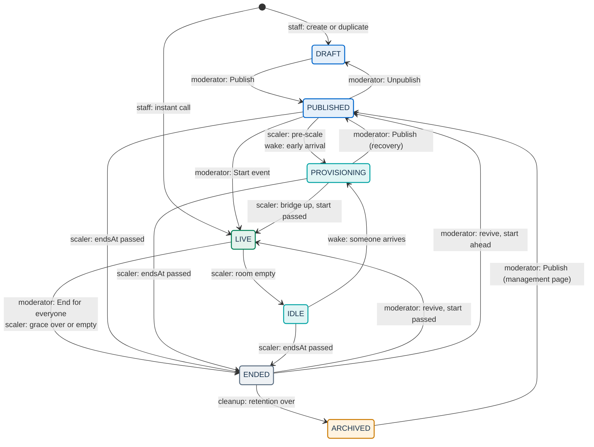
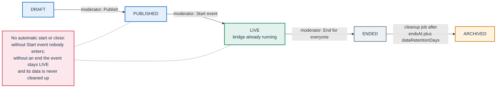
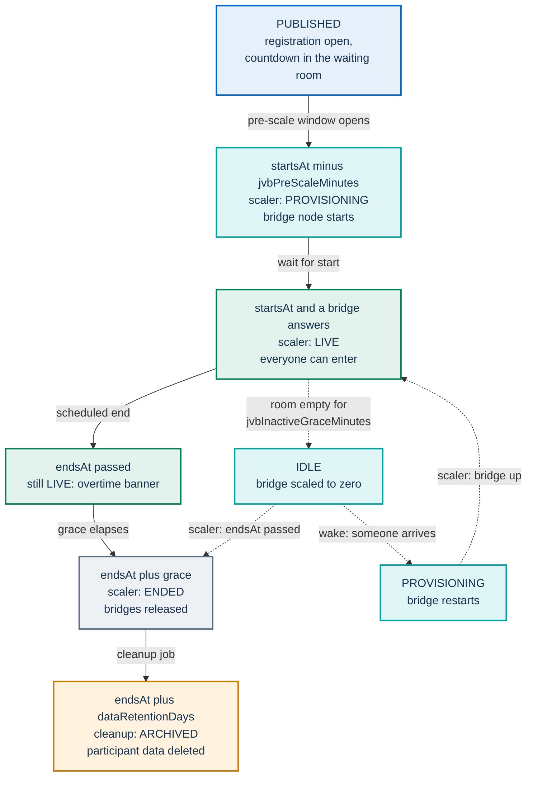

# Event lifecycle

Every event in PA Webinar carries a single `status` (Prisma enum `EventStatus`). The status decides whether the event has a public page, whether people can register, whether anyone can enter the live room, whether a Jitsi Videobridge (JVB) is paid for, and when participant data is deleted. This page owns that state machine: what each status means, who moves an event from one status to the next in each kind of installation, which joins each status admits, how grace, overtime and revival work, how call sessions are recorded, and how an ended event is handed over to archiving.

It does not repeat the neighboring mechanisms:

- how the JVB scaler computes bridge capacity, aggregates bridge statistics and scales node pools: [scaling.md](scaling.md);
- every runtime setting with its default and where it is edited: [runtime-settings.md](../configuration/runtime-settings.md);
- what the waiting room contains and how the optional square works: [waiting-room.md](waiting-room.md);
- credentials, tokens and the Jitsi JWT: [identity-and-access.md](identity-and-access.md);
- enabling, tuning and pausing the scaler on a cluster: [operations/jvb-scaler.md](../operations/jvb-scaler.md).

## Quick answers

For organizers and moderators who need to predict when a room opens and closes:

| Question | Helm `full` profile with the JVB scaler | Any other installation (Docker Compose, Helm `simple` or `standard`) |
|---|---|---|
| When can people enter? | At the first scaler tick at or after `startsAt` once a bridge answers, or earlier if a moderator pressed **Start event** while the event was still `PUBLISHED` | Only after a moderator presses **Start event** (instant calls are open from creation) |
| When does the room close? | At `endsAt` plus the grace period, when a moderator chooses **End for everyone**, or when an open-ended room has been empty long enough | Only when a moderator chooses **End for everyone** or **End event** |
| What happens during a long break with nobody connected? | Before `endsAt`, the room goes `IDLE` and its bridge is released; the first person to come back wakes it (a few minutes on a cold node) | Nothing: the room stays `LIVE` |
| When is participant data deleted? | After `endsAt` plus the event's retention days, by the cleanup job, once the event is `ENDED` or `ARCHIVED` | Same, but only if the event was ended or archived first |

## Statuses

| Status | Meaning | Waiting room, in brief |
|---|---|---|
| `DRAFT` | Created but not published. Only staff and moderator-link holders can see it. New events, duplicates and events saved with **Save as draft** start here. | Entry disabled with a valid link; without one, the live URL redirects to registration, which answers 404 |
| `PUBLISHED` | Announced: public page, listings and registration are open. No bridge is reserved. | Countdown, then an about-to-start notice; **Start event** for moderators |
| `PROVISIONING` | A bridge is being brought up for the event, set by the scaler's pre-scale or by a wake. Nobody can enter yet. | **Room warming up** banner; entry disabled |
| `LIVE` | The room is open. It is the only status in which the waiting room lets anyone into the Jitsi conference and the only one that admits guests. | **Enter now** |
| `IDLE` | The room was `LIVE`, stayed empty for the inactivity grace and its bridge was scaled to zero. Only the scaler sets it. | As `PROVISIONING`; opening the page wakes the room |
| `ENDED` | The event is over. With the scaler, bridges are released on the next tick. The post-event page stays public unless it was turned off (`postEventPublic`, on by default for scheduled events and off for instant calls) or `postEventPublicUntil` has passed. | Closing view: recording and feedback |
| `ARCHIVED` | Hidden from every public surface. The event row (title, description, dates) is kept as a record; participant data is deleted once retention expires. | Entry disabled with a valid link; without one, a redirect to the event page, which is not public |

The exact screen for each combination of status, time and bridge readiness, with every label, is described in [waiting-room.md](waiting-room.md#what-each-state-shows).

Historical events imported from an external video source (event type `LEGACY`) are created directly as `ENDED` and never enter the live flow.

### Public visibility and registration by status

The rules live in `app/src/lib/events/visibility.ts`.

| Status | Public page and listings | Registration |
|---|---|---|
| `DRAFT` | No | Closed |
| `PUBLISHED`, `LIVE` | Yes (instant calls never get a public page while running) | Open |
| `PROVISIONING`, `IDLE` | Scheduled events only, until `endsAt` | Open on the same terms |
| `ENDED` | Only while the post-event page is enabled (`postEventPublic`) and `postEventPublicUntil`, if set, is in the future | Closed |
| `ARCHIVED` | No | Closed |

"Open" means open to anyone while the site setting `publicRegistrationEnabled` is on. With it off, only the addresses on the event's invitation list can register, and an event without invitations accepts no new registrations ([Invitation-only registration](event-journey.md#invitation-only-registration)).

Page visibility after the event and the event journey around it are described in [event-journey.md](event-journey.md).

## The state machine

Each transition is labeled with the actor that performs it:

- `staff:` an administrator or organizer session in the administration area;
- `moderator:` anyone holding a moderator credential (the event's moderator link or a named `MODERATOR` grant); the administration area uses the event's moderator token on the staff member's behalf;
- `scaler:` the JVB scaler tick, which runs only in the Helm `full` profile with the scaler enabled;
- `wake:` the unauthenticated `POST /api/events/<slug>/wake` endpoint, called by the event and waiting-room pages;
- `cleanup:` the GDPR cleanup job (daily in the Helm chart, hourly in Compose).

Blue statuses are set by people, teal ones only by automation, green is the open room, gray is the end of the live phase and amber is the retention hand-off. Instant calls are created directly as `LIVE`. Two staff and moderator actions are left out of the drawing to keep it readable: bulk archive moves any status to `ARCHIVED`, and **Publish** on the management page also moves an `IDLE` event to `PUBLISHED`. The diagram shows the transitions the user interface offers; the events API itself accepts an explicit `DRAFT`, `PUBLISHED`, `LIVE` or `ENDED` from any status (see [Manual transitions](#manual-transitions)). Outside the `full` profile with the scaler, none of the `scaler:` edges exist and `IDLE` never occurs: see [Running without the scaler](#running-without-the-scaler).

## Who moves an event

### Transition reference

"Compose" is the single-VM Docker Compose installation. The Helm columns follow `jitsi.mode`; the scaler CronJob renders only when `jitsi.enabled` is true, `jitsi.mode` is `full` and `jvbScaler.enabled` is true (`infra/helm/pa-webinar/templates/cronjob-jvb-scaler.yaml`; `jvbScaler.enabled` is `false` in `infra/helm/pa-webinar/values.yaml`). A `full` installation with the scaler disabled behaves like the middle column.

| Transition | Trigger | Actor | Compose | Helm `simple` / `standard` | Helm `full` with scaler |
|---|---|---|---|---|---|
| create → `DRAFT` | Event wizard, **Duplicate for next time** on the management page, or **Duplicate as next occurrence** in the event card menu | Administrator or organizer | Yes | Yes | Yes |
| create → `LIVE` | **New call** under **Instant calls** | Administrator or organizer | Yes | Yes | Yes |
| `DRAFT` → `PUBLISHED` | **Publish event** in the wizard, or **Publish** on the management page or in the event card menu | Moderator credential | Yes | Yes | Yes |
| `PUBLISHED` → `DRAFT` | **Unpublish** | Moderator credential | Yes | Yes | Yes |
| `PROVISIONING`, `IDLE`, `ARCHIVED` → `PUBLISHED` | **Publish** on the management page | Moderator credential | Yes (no `IDLE`) | Yes (no `IDLE`) | Yes |
| `PUBLISHED` → `LIVE` | **Start event** on the management page or in the waiting room | Moderator credential | Yes | Yes | Yes, while still `PUBLISHED` |
| `LIVE` → `ENDED` | **End for everyone** (after **Leave room**) or **End event** in the moderator bar | Moderator credential | Yes | Yes | Yes |
| `ENDED` → `PUBLISHED` or `LIVE` | Saving the event with a future `endsAt` (revival) | Moderator credential | Yes | Yes | Yes |
| any → `ARCHIVED` | Bulk **Archive** in the event list | Administrator, or organizer for their own events | Yes | Yes | Yes |
| `PUBLISHED` → `PROVISIONING` | Scaler pre-scale at `startsAt` minus `jvbPreScaleMinutes` | Scaler | No | No | Yes |
| `PUBLISHED` → `PROVISIONING` | `POST /wake` inside the wake window | Any visitor | Yes (see [the pitfall](#pitfall-a-wake-without-a-scaler)) | Yes (same pitfall) | Yes |
| `PROVISIONING` → `LIVE` | Bridge reachable and `startsAt` passed | Scaler | No | No | Yes |
| `LIVE` → `IDLE` | Room empty for `jvbInactiveGraceMinutes`, before `endsAt` | Scaler | No | No | Yes |
| `IDLE` → `PROVISIONING` | `POST /wake` | Any visitor | Does not occur (no `IDLE`) | Does not occur | Yes |
| `LIVE` → `ENDED` | `endsAt` plus grace elapsed | Scaler | No | No | Yes |
| `LIVE` → `ENDED` | Opt-in empty close (`jvbEmptyCloseMinutes`) | Scaler | No | No | Yes, if enabled |
| `LIVE` → `ENDED` | Open-ended room (grace `-1`) past `endsAt` and empty for `jvbInactiveGraceMinutes` | Scaler | No | No | Yes |
| `PUBLISHED`, `PROVISIONING`, `IDLE` → `ENDED` | `endsAt` passed | Scaler | No | No | Yes |
| `ENDED` → `ARCHIVED` | Retention expired | Cleanup job | Yes (hourly) | Yes (daily) | Yes (daily) |

### Manual transitions

All manual changes to an existing event's status, except bulk archive, go through `PUT /api/events/<id>`, authenticated with a moderator credential (the primary moderator link or a non-revoked named `MODERATOR` grant; `SPEAKER` grants are refused). The request schema accepts an explicit `status` of `DRAFT`, `PUBLISHED`, `LIVE` or `ENDED`; `PROVISIONING`, `IDLE` and `ARCHIVED` cannot be set this way. The endpoint does not check the current status before applying an explicit one: the user interface is what limits the choices, by showing only the buttons that make sense. Every status change through this endpoint is written to the administration audit log (`EVENT_UPDATE`) and announced on the room's live channel; waiting rooms and live rooms also poll `GET /api/events/<slug>/lifecycle` (every 3 seconds in the waiting room and every 5 seconds in the call, in `app/src/components/live/live-event-client.tsx`), which is how they notice changes made by the scaler.

- **Publish.** The wizard always creates the event as `DRAFT` (`POST /api/events`). If the organizer chose **Publish event**, the wizard then sends a second request that sets `PUBLISHED`. The event card menu offers **Publish** or **Unpublish** only for scheduled events in `DRAFT` or `PUBLISHED`, and toggles between the two. The management page button reads **Unpublish** on a `PUBLISHED` event, which it sends back to `DRAFT`, and **Publish** on any other status, which it sets to `PUBLISHED`. It is disabled only while the event is `LIVE` or `ENDED`, so it also moves `PROVISIONING`, `IDLE` and `ARCHIVED` events to `PUBLISHED`; that is the way out of [the pitfall](#pitfall-a-wake-without-a-scaler).
- **Start event.** Shown on the management page and, to moderators only, in the waiting room, but only while the event is `PUBLISHED`. It sets `LIVE` immediately. When the start is more than 30 minutes away (`app/src/components/admin/event-management-client.tsx`), the management page adds a warning that the video servers may take a couple of minutes to come up. In the `full` profile the scaler moves the event to `PROVISIONING` `jvbPreScaleMinutes` before the start, and from then on the button is no longer offered: the event goes `LIVE` by itself at `startsAt`.
- **End.** A moderator who clicks **Leave room** chooses between **Just leave** (the call continues for everyone else) and **End for everyone**. The latter asks what should happen to the event page afterwards (**Keep it public**, **Publish to the library** or **Archive (private)**, plus an option to generate an AI transcript and summary once the recording is processed) and then sets `ENDED` together with those choices. **Archive (private)** only hides the post-event page: the status is `ENDED`, not `ARCHIVED`. The moderator bar also has an **End event** button that sets `ENDED` after a confirmation, without the follow-up questions.
- **Revival.** See [Revival](#revival).
- **Bulk archive.** `POST /api/admin/events/bulk-archive` sets `ARCHIVED` on the selected events whatever their status, restricted to the organizer's own events when the caller is an organizer. It deletes nothing; see [After the event](#after-the-event-hand-off-archiving-and-retention).

### Automatic transitions: the scaler tick

The scaler is a CronJob (every two minutes by default, `jvbScaler.schedule` in `infra/helm/pa-webinar/values.yaml`) that collects bridge statistics and calls `GET /api/internal/jvb-desired-replicas`. That route applies every lifecycle transition in one database transaction, in this order, and then computes the number of bridges to run. How the statistics are gathered and how capacity is computed is in [scaling.md](scaling.md).

1. **Activity refresh.** If a bridge is reachable and reports at least one participant, every `LIVE` event gets `lastActiveAt` set to now. The participant count is bridge-wide, so a room is seen as empty only when the whole bridge is.
2. **Opt-in empty close** (`LIVE` → `ENDED`, before `endsAt`). Only when `jvbEmptyCloseMinutes` is not `-1`: a room that had traffic and has been empty for that many minutes is closed for good. It runs before the demotion below, so when both match the terminal close wins.
3. **Idle demotion** (`LIVE` → `IDLE`, before `endsAt`). See [Inactivity grace](#inactivity-grace-live-to-idle).
4. **Timeouts** (`PUBLISHED`, `PROVISIONING`, `IDLE` → `ENDED`). Any of these whose `endsAt` has passed ends immediately, without grace.
5. **Overtime close** (`LIVE` → `ENDED`, past `endsAt`). See [Grace period and overtime](#grace-period-and-overtime).
6. **Pre-scale** (`PUBLISHED` → `PROVISIONING`). Events whose `startsAt` is within `jvbPreScaleMinutes` from now, or already past, and whose `endsAt` is still ahead. `provisioningStartedAt` is stamped.
7. **Promotion** (`PROVISIONING` → `LIVE`). Only if a bridge is reachable, `startsAt` has passed and `endsAt` has not. `provisioningStartedAt` is stamped again, because the room became usable now. Because steps 6 and 7 run in the same tick, an event published after its start time goes `LIVE` within one tick once a bridge answers.

Steps 2 and 3 are skipped when the participant count cannot be trusted: more than one bridge replica and no cross-pod aggregation from the scaler. Step 2 also needs a reachable bridge. Every transition to `IDLE` or `ENDED` made by the scaler closes the event's open call sessions in the same transaction (see [Call sessions](#call-sessions)). When at least one event was promoted to `LIVE`, the route also notifies the recorder controller, if `RECORDER_CONTROLLER_URL` is set, so that multitrack recording starts without waiting for the controller's own reconcile loop ([recording.md](recording.md)).

Only `LIVE` and `PROVISIONING` events count toward the number of bridges; `IDLE` contributes zero. Suspending the scaler CronJob therefore pauses the whole automatic lifecycle, not only scaling: events stay `PUBLISHED` past their start, `LIVE` rooms are not closed after their grace and nothing goes `IDLE`, while every manual action keeps working ([operations/jvb-scaler.md](../operations/jvb-scaler.md)).

### Wake

`POST /api/events/<slug>/wake` records the intent to use a room; the scaler does the actual scaling on its next tick. It has no authentication, so it is bounded by a per-IP, per-event rate limit (60 requests per minute, `app/src/app/api/events/[param]/wake/route.ts`) and by a time window:

- `IDLE` → `PROVISIONING` at any time before `endsAt`. This is the only way out of `IDLE`: the scaler never promotes an `IDLE` event directly.
- `PUBLISHED` → `PROVISIONING` only once the start is closer than the larger of `jvbPreScaleMinutes` and `waitingRoomLeadMinutes`. Earlier calls get `409`. Instant calls are exempt from the window.
- `PROVISIONING` or `LIVE`: no change, `200`.
- `DRAFT`, `ENDED`, `ARCHIVED`, or any event past its `endsAt`: `409`.

The live page calls it once per page load, as soon as the status it shows is `IDLE`, whether on load or after a waiting-room poll: a visitor already waiting when the room goes `IDLE` wakes it at once. The event page calls it when a registrant presses the link to enter the room, so that the bridge starts a few seconds earlier. Both transitions stamp `provisioningStartedAt`.

### Instant calls

An instant call is created directly as `LIVE` by `POST /api/events/instant` (staff only). It gets (`app/src/app/api/events/instant/route.ts`):

- `endsAt` four hours after creation, a cosmetic upper bound;
- `gracePeriodMinutes` set to `-1`, so it never closes on the clock;
- `lastActiveAt` and `provisioningStartedAt` stamped at creation, so the inactivity rules have a starting point;
- `dataRetentionDays` set to 7 and `postEventPublic` off.

With the scaler, an empty instant call goes `IDLE` after the inactivity grace while its `endsAt` is ahead. Past `endsAt` an `IDLE` instant call ends, and a `LIVE` one ends once it has been empty for the inactivity grace. Anyone with the link can wait in the room while it is `LIVE`, `IDLE` or `PROVISIONING`, and enters when it is `LIVE`. Without the scaler an instant call stays `LIVE` until a moderator ends it.

## Running without the scaler

Docker Compose, the Helm `simple` and `standard` profiles, a `full` installation with `jvbScaler.enabled: false`, and any installation that uses an external Jitsi (`jitsi.enabled: false`) run no scaler. PA Webinar does not start or stop the bridges there: they run with the fixed replicas of the chart or of Compose, or are managed by the external Jitsi deployment. A started room is therefore usable at once, but the lifecycle is entirely manual.

What moderators must do:

1. Press **Start event** when the event should open. Until then everyone, moderators included, waits in the waiting room.
2. End the event with **End for everyone** or **End event**.

What never happens automatically:

- `PUBLISHED` → `PROVISIONING` → `LIVE` at the scheduled time.
- `IDLE`: an empty room stays `LIVE`.
- Closing at `endsAt` plus grace. The overtime banner is computed in the browser from `endsAt` and the grace period, so it still counts down to a close that never comes.
- Ending events that were never started: a `PUBLISHED` event whose date has passed stays `PUBLISHED`.
- Closing call sessions: they stay open, and the **Statistics** tab falls back to the recording duration or the scheduled window.
- Retention. The cleanup job only processes `ENDED` and `ARCHIVED` events, so the registrations of an event left `PUBLISHED` or `LIVE` are kept indefinitely. Ending or archiving the event is what makes retention start to apply.

### Pitfall: a wake without a scaler

`/wake` does not know whether a scaler exists. A registrant who presses the link to enter the room from the event page inside the wake window (within 15 minutes of the start with the `jvbPreScaleMinutes` and `waitingRoomLeadMinutes` defaults in `app/prisma/schema.prisma`) moves a `PUBLISHED` event to `PROVISIONING`. Without a scaler nothing promotes it, the waiting room shows **Room warming up** indefinitely, the Jitsi token endpoint answers `409`, and **Start event** is no longer shown because the event is not `PUBLISHED`. The way out is the management page: its **Publish** button on a `PROVISIONING` event sets it back to `PUBLISHED`, after which **Start event** appears again.

## Which joins each status admits

Two layers decide whether someone gets into the conference: the waiting room, and the Jitsi token endpoint `POST /api/events/<slug>/jitsi/token`.

- **The waiting room** enables its join button only when the event is `LIVE`, for every role. Moderators reach `LIVE` from `PUBLISHED` with **Start event**.
- **The token endpoint** mints a JWT only when the event is `PUBLISHED` or `LIVE`, and only when the event is `LIVE` for guests without a token. Any other status gets `409`. Guests also need guest access to be allowed: always for instant calls, and for scheduled events only while the `guestAccessEnabled` site setting is on (otherwise `403`).

| Status | Moderator or speaker link | Registrant | Guest (no token) |
|---|---|---|---|
| `DRAFT` | `409` | `409` | `409` |
| `PUBLISHED` | Token issued; the waiting room still waits for `LIVE` | Token issued; the waiting room still waits for `LIVE` | `409`; the live URL redirects to registration |
| `PROVISIONING`, `IDLE` | `409` | `409` | `409`; scheduled events redirect to registration (so tokenless guests cannot wake an `IDLE` room); instant calls show the waiting room |
| `LIVE` | Token issued | Token issued | Token issued when guest access is allowed, rate-limited per IP |
| `ENDED`, `ARCHIVED` | `409` | `409` | `409`; the live URL redirects to the event page (instant calls answer 404) |

A registrant is recognized from the personal link or from the signed per-event cookie set at registration, or, while public registration is off, by the signed entry link in the email. A forwarded personal link still gets in, but under the typed name and a fresh guest identity. On a password-protected event, the live page asks visitors without a token for the password before showing the waiting room. These rules, and the JWT claims themselves, are described in [identity-and-access.md](identity-and-access.md).

## Timing semantics

A scheduled event in the `full` profile with the scaler: solid arrows are the usual path, dotted arrows the detour a room takes when it empties before its end time. Teal marks statuses that only the scaler and wake set, green the open room, amber the cleanup job. Every automatic step happens on the first tick after its condition becomes true, so transitions lag their nominal time by up to one `jvbScaler.schedule` interval (two minutes by default in `infra/helm/pa-webinar/values.yaml`).

### Lifecycle settings

These `SiteSetting` columns, edited in the administration area without a restart, drive the transitions on this page:

| Setting | Transition it drives |
|---|---|
| `jvbPreScaleMinutes` | `PUBLISHED` → `PROVISIONING` by the scaler ([Pre-scale window](#pre-scale-window)); with `waitingRoomLeadMinutes`, how early a visitor can [wake](#wake) a `PUBLISHED` room |
| `waitingRoomLeadMinutes` | How early a visitor can [wake](#wake) a `PUBLISHED` room (the larger of the two settings applies) |
| `jvbInactiveGraceMinutes` | `LIVE` → `IDLE` ([Inactivity grace](#inactivity-grace-live-to-idle)); the close of an empty open-ended room past `endsAt` ([Grace period and overtime](#grace-period-and-overtime)) |
| `eventGracePeriodMinutes`, overridden per event by `Event.gracePeriodMinutes` | `LIVE` → `ENDED` after `endsAt` ([Grace period and overtime](#grace-period-and-overtime)) |
| `jvbEmptyCloseMinutes` | Opt-in `LIVE` → `ENDED` before `endsAt` ([Opt-in empty close](#opt-in-empty-close)) |
| `jvbProvisioningTimeoutMinutes` | None: a status-page signal only ([The provisioning timeout is only a signal](#the-provisioning-timeout-is-only-a-signal)) |

Their defaults, accepted ranges and panel labels, and why the `JVB_PRE_SCALE_MINUTES` and `JVB_INACTIVE_GRACE_MIN` environment variables have no effect, are in [runtime-settings.md](../configuration/runtime-settings.md#event-lifecycle-and-bridge-timing).

### Pre-scale window

The pre-scale window exists because a scale-to-zero node pool needs a few minutes to provide a bridge (node creation plus bridge start). The scaler starts the bridge `jvbPreScaleMinutes` before `startsAt`, but promotes the event to `LIVE` only once `startsAt` has passed, so a pre-warmed room still opens on time rather than early. A moderator who wants to open earlier must press **Start event** before the pre-scale window begins. Choosing the value against the node pool's cold-start time is covered in [INFRASTRUCTURE.md](../INFRASTRUCTURE.md) and [scaling.md](scaling.md).

### Grace period and overtime

The effective grace is `Event.gracePeriodMinutes` when set, otherwise `SiteSetting.eventGracePeriodMinutes`.

| Effective grace | Behavior of a `LIVE` room once `endsAt` has passed |
|---|---|
| `0` | Ended on the first tick after `endsAt` |
| `N` > 0 | Stays `LIVE`, with the overtime banner, until `endsAt` plus `N` minutes, then ended whether or not people are still connected |
| `-1` | Never ended on the clock. Once the room has been empty for `jvbInactiveGraceMinutes` it is ended to free its bridge; this reclaim needs a reachable bridge and a reliable count (aggregated across pods, or a single replica) |

The time-based close with a finite grace does not depend on the participant count or on bridge reachability. A room with a finite grace is not reclaimed early when it empties past `endsAt`: it keeps its promised overtime window.

`Event.gracePeriodMinutes` accepts `-1` to `240`, or `null` to inherit (`app/src/lib/validation/schemas.ts`). The event wizard does not expose it: it is set through the events API, copied when an event is duplicated, and set to `-1` for instant calls. The site default is edited in the administration settings.

### Inactivity grace (`LIVE` to `IDLE`)

A `LIVE` room whose `endsAt` is still ahead goes `IDLE` when the latest sign of life is older than `jvbInactiveGraceMinutes`. Signs of life are:

- `lastActiveAt`, the last tick in which the bridge reported traffic;
- `provisioningStartedAt`, the last time the room was provisioned or promoted;
- `startsAt`, but only once it has passed. An event cannot have been idle for longer than it has been scheduled to run, and a start date moved into the future does not keep a room alive.

A room with neither `lastActiveAt` nor `provisioningStartedAt` is never demoted, because there is no evidence of inactivity. This is the case, for example, for an event that a moderator started with **Start event** before any pre-scale or wake and that nobody has joined yet, or for one that was never provisioned (no pre-scale and no wake), never joined and was then revived by moving `endsAt` forward. A room that the scaler promoted and nobody joins goes `IDLE` `jvbInactiveGraceMinutes` after its promotion. The scaler's pre-scale stamps `provisioningStartedAt` on every scheduled event it reaches, so an event that was pre-scaled before it ended keeps that old stamp: if it is revived to `LIVE`, it can go `IDLE` on the next tick and is woken by the first visitor.

`IDLE` is reversible: `/wake` sends it to `PROVISIONING` and the scaler promotes it to `LIVE` once a bridge answers. The wake re-stamps `provisioningStartedAt`, which protects the woken room from being demoted again before people have had time to rejoin. An `IDLE` room whose `endsAt` passes is ended.

### Opt-in empty close

`jvbEmptyCloseMinutes` (off by default with `-1`) ends a `LIVE` room before its `endsAt` once it had traffic and has then been completely empty, moderator included, for that many minutes (`0` closes on the first empty tick). Unlike `IDLE`, the result is terminal: people who come back find an ended event. It is off by default because a stale `participants=0` reading from a degraded bridge could end a room that is still in use, and because a break in which even the moderator leaves would end a room the moderator meant to come back to. It requires a reachable bridge and a reliable count.

### The provisioning timeout is only a signal

There is no automatic return from `PROVISIONING` to `PUBLISHED`. A `PROVISIONING` event whose bridge never becomes reachable stays `PROVISIONING` until a bridge answers or `endsAt` passes. `jvbProvisioningTimeoutMinutes` only drives the status pages: an event waiting for a bridge for longer than that, counted from `provisioningStartedAt` (or `startsAt` when unset), while fewer bridges are ready than needed, turns the bridge component to `degraded` with a "stale" message ([operations/monitoring.md](../operations/monitoring.md)).

## Overtime, leaving and revival

### The overtime banner

In the live room, once `endsAt` has passed, participants see a banner computed in the browser from `endsAt` and the effective grace, refreshed every 30 seconds (`app/src/components/live/live-event-client.tsx`):

- with a finite grace: "The scheduled end time has passed. The event will close automatically in N minutes", then "End time reached. The event is about to close.";
- with grace `-1`: "The scheduled end time has passed. The event will stay open while participants are connected.";
- with grace `0`: no banner.

The banner does not ask the server. Without a scaler, the countdown reaches zero and nothing closes the room.

### Leaving and ending

**Leave room** is the single exit for every role; the native Jitsi hang-up button is not shown. Participants simply leave. Moderators choose between **Just leave** and **End for everyone**, described under [Manual transitions](#manual-transitions).

When an event becomes `ENDED`, whoever set it, clients notice on their next poll of `/lifecycle`: people in the call are taken to the closing screen (everyone except moderators is offered the post-event feedback form) and people in the waiting room see its closing view. The scaler releases the bridges on its next tick, because `ENDED` events no longer count toward capacity.

### Revival

Saving an `ENDED` event with an `endsAt` in the future revives it, without recreating any resource (`reviveStatus` in `app/src/lib/events/lifecycle.ts`):

- revival applies only to `ENDED` events, and only when the request does not set `status` explicitly;
- the new status is `LIVE` if the effective `startsAt` (the new one if sent, otherwise the stored one) has passed, `PUBLISHED` otherwise;
- the wizard always sends both dates and never a status, so editing and saving an ended event with a later end time is enough.

With the scaler, a revived `LIVE` event that was never provisioned (no pre-scale and no wake) and never joined has no activity signal and is not demoted before someone joins. One that already ran keeps its old `lastActiveAt`, and one that was pre-scaled or woken before it ended keeps its old `provisioningStartedAt`: either can go `IDLE` on the next tick and is then woken by the first visitor (see [Inactivity grace](#inactivity-grace-live-to-idle)).

## Call sessions

A `CallSession` row records a span of real use of a room, independently of recording. It feeds the **Statistics** tab and the monitoring analytics.

- **Opening.** When a client joins the Jitsi conference (`videoConferenceJoined`), it calls `POST /api/events/<slug>/sessions`. The call needs no authentication, is rate-limited per IP (30 per minute, `app/src/app/api/events/[param]/sessions/route.ts`) and is accepted only while the event is `LIVE` or `PROVISIONING` (`409` otherwise). It is idempotent: if the event already has an open session (no `endedAt`), that one is returned.
- **Peak headcount.** Clients in the call report the room's participant count every 30 seconds (`app/src/components/live/live-event-client.tsx`) to `POST /api/events/<slug>/analytics/peak`, accepted only while the event is `LIVE`. The value is clamped to the event capacity plus a margin and only ever increases; it updates `Event.peakParticipants` and the newest open session. The scaler does not write it.
- **Live telemetry.** Dominant-speaker changes and raised hands are appended to the newest open session during the call ([live-interaction.md](live-interaction.md); the speaker log also serves speaker attribution, see [recording.md](recording.md)).
- **Closing.** The scaler closes every open session of an event in the same transaction that moves the event to `IDLE` or `ENDED`: `endedAt` is the tick time and `duration` is computed from it. If a session never received a peak, it inherits the event's peak. A later wake and rejoin opens a new session, so a room that empties and refills produces several sessions.
- **Sessions that stay open.** A status change made through the events API does not close sessions. An event ended with **End for everyone** or **End event**, and every event in an installation without the scaler, keeps its session open; the **Statistics** tab then uses the recording duration or the scheduled window.
- **Recording sessions.** The recording finalize webhook creates its own, already closed session together with the `Recording` row. A multitrack event instead gets an open placeholder session as soon as the recorder controller first asks for its desired state while the event is `LIVE`. Because `/sessions` reuses any open session, live clients may attach to that placeholder rather than open a separate one; the scaler's close ends it like any other open session, and the finalize webhook completes it. Details are in [recording.md](recording.md#when-a-recorder-is-wanted).

The GDPR cleanup scrubs the personal data held in sessions (participants, speaker and raised-hand logs) but keeps the rows and their counts ([GDPR.md](../GDPR.md)).

## After the event: hand-off, archiving and retention

`ENDED` is where the live lifecycle hands over to the post-event machinery:

- **The post-event page** is public only while `postEventPublic` is on and `postEventPublicUntil` has not passed. **End for everyone** sets `postEventPublic` from the moderator's choice (off only for **Archive (private)**) and `libraryListed` for **Publish to the library**; `postEventPublicUntil` is set only in the event's post-event settings or through the events API ([event-journey.md](event-journey.md)).
- **Follow-up emails** are sent at most once per event by the reminders job, for `ENDED` events that opted in (`postEventEmailEnabled`) and whose `endsAt` is within the last seven days (`app/src/lib/events/post-event-finalize.ts`). `ARCHIVED` events are skipped, and an event that is never ended, as in installations without the scaler, gets none ([email.md](email.md), [background-jobs.md](background-jobs.md)).
- **The recording and AI post-production** start from the recording finalize path, not from the status change ([recording.md](recording.md), [POSTPROD.md](../POSTPROD.md)).

**`ENDED` to `ARCHIVED`.** The GDPR cleanup job (`GET /api/cron/cleanup`) selects `ENDED` and `ARCHIVED` events whose `endsAt` plus `dataRetentionDays` is strictly in the past. For each one it deletes participant data and sets `ARCHIVED` in the same transaction. Retention is counted from `endsAt`, not from the moment the event was ended. It runs daily in the Helm chart (`cronjobs.cleanup.schedule`, 03:00 by default in `infra/helm/pa-webinar/values.yaml`) and hourly in the Compose `cron` service. `Event.dataRetentionDays` is 30 by default in `app/prisma/schema.prisma` and 7 for instant calls (`app/src/app/api/events/instant/route.ts`). What exactly is deleted, what is kept and why is in [GDPR.md](../GDPR.md).

**Bulk archive** hides events from every public surface immediately but deletes nothing. Because `ARCHIVED` events are still processed by the cleanup job, their participant data is deleted when retention expires, as for `ENDED` events. Archiving an event that was never ended is also how an installation without the scaler makes its data eligible for cleanup.

`ARCHIVED` is not locked: an explicit status change through the events API, including **Publish** on the management page, moves an archived event like any other.

## Related pages

- [scaling.md](scaling.md): capacity model, scaler tick and Redis snapshot, node-pool scale-to-zero.
- [operations/jvb-scaler.md](../operations/jvb-scaler.md): enabling, tuning, validating and pausing the scaler.
- [runtime-settings.md](../configuration/runtime-settings.md): every `SiteSetting` knob and per-event override.
- [waiting-room.md](waiting-room.md): the front door that renders each status.
- [identity-and-access.md](identity-and-access.md): moderator links, grants, registrant and guest identities, JWT claims.
- [event-journey.md](event-journey.md): creating, publishing, registering and the post-event page.
- [GDPR.md](../GDPR.md): retention, cleanup and data-subject rights.
- [DEPLOYMENT.md](../DEPLOYMENT.md): the Helm profiles (`jitsi.mode`) and the `jvbScaler` keys.
