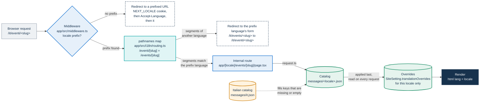
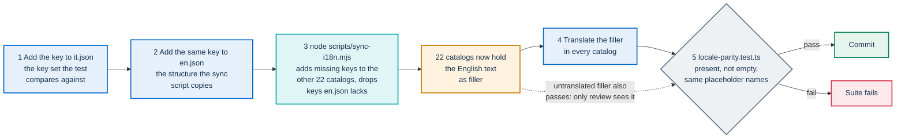
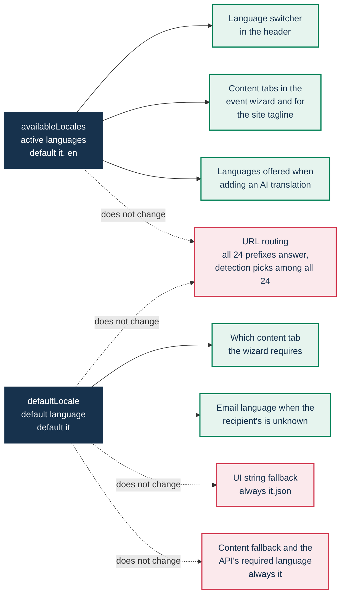

# Languages and localization

PA Webinar ships its interface in the 24 official languages of the European Union. This page explains how that promise is kept:

- where interface text lives, and how its completeness is tested;
- how every page gets a localized URL, and which helper builds each kind of link;
- what the language settings in the administration area change, and what they do not;
- how translatable event content is stored and read back;
- how release notes follow the same rule.

Emails are summarized here and owned by [Email and calendar](email.md).

It is written for developers who add strings or pages, for translators, and for administrators who choose which languages an installation offers.

The decision record is [ADR-008](../adr/008-eu-languages.md); related pages are listed [at the end](#related-pages).

## Quick answers

- **Which languages?** The 24 codes in `locales` in `app/src/i18n/config.ts`. Italian (`it`) is the default, and that constant, not a setting, decides it.
- **Where is the interface text?** In one nested JSON catalog per language in `app/src/i18n/messages/`. `it.json` defines the set of keys.
- **What is the rule?** 24/24: every key exists in every catalog, is not empty, and uses the same placeholders. `app/src/i18n/locale-parity.test.ts` fails otherwise.
- **What if a key is still missing at runtime?** The Italian text is shown. That is a safety net, not a permission to ship a partial language.
- **Can administrators turn languages off?** They choose which languages the switcher and the content forms offer. Every language prefix still answers.
- **Can they change a string without a rebuild?** Yes, per language and per key, with translation overrides.
- **Must event content exist in Italian?** Yes. The API rejects an event whose title or description has no Italian version.

## Scope

| Surface | Where the text lives | Languages | Who writes it |
|---|---|---|---|
| Interface text, public pages and administration area | `app/src/i18n/messages/<locale>.json` | All 24 | Developers and translators, through pull requests |
| URL segments | The `pathnames` map in `app/src/i18n/routing.ts` | Italian and English have their own segments. The other 22 use the internal English path | Developers |
| Single messages for one installation | `SiteSetting.translationOverrides` | The active languages (any code through the API) | Administrators, without a rebuild |
| Event content: title, description, questionnaires, tags | JSON columns keyed by language code | The active languages | Organizers and administrators, in the forms |
| Privacy and accessibility pages | `SiteSetting.privacyPolicy` and `SiteSetting.accessibility`, per language. Otherwise a built-in document from the catalogs | All 24 built in | Administrators |
| Emails and calendar files | `app/src/lib/email/templates.ts` plus editable templates | Five | See [Email and calendar](email.md#languages) |
| Release notes | `app/src/content/changelog/translations/<locale>.json` | All 24 | The release procedure |
| Conference interface | Jitsi Meet's own translations, selected with the IFrame API `lang` option | Jitsi's own set | Upstream |
| Transcripts, subtitles, summaries, dubbing | Post-production artifacts | The source language plus the target languages | See [AI post-production](../POSTPROD.md) |

Dates and times are formatted in three places:

- **Pages** format them with next-intl in the installation's time zone. `app/src/i18n/request.ts` reads `SiteSetting.defaultTimezone`. If the database cannot be read, it uses `Europe/Rome` (`DEFAULT_TIMEZONE` in `app/src/lib/utils/date-format.ts`).
- **Emails and reminders** format the event date with `formatDate()` and `formatTime()` in `app/src/lib/utils/date-format.ts`, in the event's own time zone (`Event.timezone`). Those helpers use a regional format for Italian, English, French, German and Spanish, and the bare language code for the others. `en` is formatted as `en-GB`: day before month, 24-hour clock.
- **Recurrences in the event wizard** bypass both. The recurrence preview (`app/src/components/admin/recurrence-picker.tsx`) formats its dates as `it-IT` on Italian pages and as `en-GB` on every other page. The review step describes the rule with wording hard-coded in Italian and English (`describeRRule()` in `app/src/lib/utils/recurrence.ts`): Italian when the default language is Italian, English otherwise.

## From request to rendered text



1. **Prefix.** Every page URL carries a language prefix (`localePrefix: 'always'` in `routing.ts`). A request for `/` or any other unprefixed path is redirected to a prefixed one. next-intl picks the language in this order: the `NEXT_LOCALE` cookie, then the browser's `Accept-Language` header, then `it`. Detection considers all 24 languages, active or not.
2. **Path.** With a prefix, next-intl maps the localized path to the internal route through the `pathnames` map. If the segments belong to another language, as in `/it/events/<slug>` or `/en/eventi/<slug>`, it redirects to the form that matches the prefix.
3. **Catalog.** `app/src/i18n/request.ts` loads the catalog of the requested language. For every language except Italian, it deep-merges that catalog over `it.json`. A key that is missing, or whose value is an empty string, takes the Italian text. The merged catalog is computed once per language and kept for the life of the process.
4. **Overrides.** The overrides for that language are read from `SiteSetting.translationOverrides` on every request and applied last. If the override payload is malformed, it is skipped: it never stops the page from rendering.
5. **Render.** `app/src/app/[locale]/layout.tsx` sets `<html lang>`. It passes the whole resulting catalog to `NextIntlClientProvider` so that client components can translate. Every page therefore carries the full catalog of its language to the browser.

The middleware is `app/src/middleware.ts`. Its matcher excludes `/api`, `/_next`, `/_vercel` and any path with a file extension, so route handlers are not localized. Where an API needs a language, it reads it from the request: a `locale` field or parameter, or the `Accept-Language` header. The middleware also guards the administration area and sets the security headers. Those are covered in [Identity, access and tokens](identity-and-access.md) and [Security architecture](security.md).

## Catalogs

### Structure

Catalogs are nested, not flat. Top-level namespaces group the interface by area (`common`, `nav`, `events`, `live`, `admin`, `gdpr` and others). Nested objects inside them group the strings of one screen or component. Code addresses a message by its dotted path:

- in Server Components, `const t = await getTranslations('admin.languages')`;
- in Client Components, `const t = useTranslations('admin.languages')`;
- then `t('defaultLocaleTitle')` reads `admin.languages.defaultLocaleTitle`.

Messages use ICU MessageFormat. Arguments are written `{name}`, and plurals select a branch:

```json
"registeredCount": "{count, plural, =0 {No registrations} one {1 registration} other {# registrations}}"
```

Each language uses the plural categories its grammar needs: Polish adds `few` and `many` branches that Italian does not have. That is correct, and the parity test accepts it, because it compares argument names, not branches.

Message keys are not type-checked. If code uses a key that is absent from `it.json`, TypeScript and every test still pass, and the page shows the raw dotted path. Look at the page after adding a key.

By convention, no visible text is hardcoded in a component, `aria-label` values included. No lint rule enforces this, so code review does.

### The two reference catalogs

- `it.json` is the source language and the reference for the parity test. The key set of every other catalog is compared against it.
- `en.json` is the reference for the sync script, and its text is the placeholder that new keys receive in the other catalogs. It must hold exactly the keys of `it.json`. A test enforces that it holds every key of `it.json` (see [Guard tests](#guard-tests)). No test detects a key that exists only in `en.json`, and the sync script would copy such a key into every other catalog.
- The other 22 catalogs are translations.

### The parity test

`app/src/i18n/locale-parity.test.ts` runs in the unit suite: `npm run test --workspace=app` locally, and the Unit Tests job in CI. It checks:

| Check | Fails when |
|---|---|
| Language count | `app/src/i18n/messages/` does not hold exactly 24 catalogs. Changing that number is a decision, not an accident |
| No missing key | A catalog lacks a key that `it.json` has |
| No empty string | A value is empty or only whitespace. An empty value passes the presence check but shows Italian at runtime. A whitespace-only value renders blank |
| Same placeholders | The set of argument names differs from the Italian message. It compares names, not occurrences. Branch text is ignored when it has more than one word or uses `#`. A branch that is a single bare word, such as `one {vote}`, is read as an argument name, so write such branches with `#` or with more words |

It does not check:

- keys that exist only in a translation. The sync script removes them;
- whether a value is actually translated. English placeholder text left by the sync script passes;
- ICU syntax beyond the argument names;
- keys used in code but missing from `it.json`.

### The sync script

`node scripts/sync-i18n.mjs`, run from the repository root, aligns the structure of the 22 translated catalogs with `en.json`:

- a key missing from a catalog is added with the English text;
- an existing, non-empty translation is kept;
- where the shape differs (a string where `en.json` now has an object), the `en.json` shape wins;
- a key that `en.json` does not have is dropped;
- `it.json` and `en.json` are never modified.

The script propagates structure, not translations. After it runs, every new key reads English in 22 catalogs until someone translates it, and the parity test cannot tell the difference. Because it drops keys that `en.json` lacks, run it only after `en.json` holds every key of `it.json`.



### The Italian fallback is a safety net

The runtime merge over `it.json` exists so that a missing key never shows a raw key path. It is not a policy for shipping a language partially. The rule is 24/24 for every key. Text that people must understand, such as consent to recording, privacy notices and error messages, informs them only when it is in their language.

## Localized URLs

### Internal paths and the pathnames map

Page directories under `app/src/app/[locale]/` are named in English (`events`, `calendar`, `admin/settings`). Those names form the internal paths. The `pathnames` map in `app/src/i18n/routing.ts` gives each internal path its public form in each language:

| Internal path | Italian | English | Any other language |
|---|---|---|---|
| `/events/[slug]/registration` | `/it/eventi/[slug]/registrazione` | `/en/events/[slug]/registration` | `/fr/events/[slug]/registration` |
| `/admin/events/calls` | `/it/admin/eventi/chiamate-rapide` | `/en/admin/events/calls` | `/de/admin/events/calls` |
| `/privacy` | `/it/privacy` | `/en/privacy` | `/pl/privacy` |

- Only Italian and English have their own segments. The other languages use the internal path.
- An entry given as a plain string, such as `'/privacy': '/privacy'`, is the same in every language.
- A static path is declared explicitly even where a dynamic one could match it, as with `/admin/events/calls` next to `/admin/events/[id]`. Path recognition tries static templates first.
- Every sub-page is declared on its own. An undeclared sub-page of a localized path exists only under its English form, and its Italian URL returns 404.

### Every page must be declared

`app/src/lib/utils/localized-url.test.ts` walks `app/src/app/[locale]/` and fails if any `page.tsx` has no entry in `pathnames`. The same file fails if a page of the administration area has no label in `app/src/components/admin/admin-breadcrumb.tsx`; the sign-in and access pages are exempt. That label is a key in the `admin.nav` namespace, shared with the menu, so it also needs all 24 translations.

### Building links

All links come from the map. Nobody writes `/it/eventi/…` or `locale === 'it' ? … : …` by hand.

| Where the link is used | Helper | Behavior |
|---|---|---|
| `<Link>` and `router.push` inside the app | ``percorso(`/events/${slug}`)``, with `Link` and `useRouter` from `@/i18n/navigation` | Turns an internal path string into the `{ pathname, params, query, hash }` object that the router localizes. Throws on a path the map does not know |
| An address typed into site settings, such as footer links | `percorsoSeNoto(path)` from `@/i18n/navigation` | Accepts internal and already-localized forms. Returns `null` for an unknown path, and the caller renders a plain link |
| Outside the router: emails, calendar files, share and copy links, the sitemap, Next.js `redirect()` | `localizedPath(path, locale)` or `localizedUrl(baseUrl, path, locale)` from `@/lib/utils/localized-url` | Returns `/<locale>/<localized path>` with the query and fragment intact. An unknown path keeps its segments as written, behind the language prefix |
| Reading the current page | `usePathname()` from `@/i18n/navigation` | Returns the internal template with placeholders and no language, such as `/admin/events/[id]` |

`percorso()`, `percorsoSeNoto()`, `localizedPath()` and `localizedUrl()` recognize paths through `app/src/i18n/percorsi.ts`, which accepts both internal and localized forms. The router itself (`Link`, `useRouter` and `usePathname()`, created by next-intl's `createNavigation(routing)` in `app/src/i18n/navigation.ts`) reads the same `pathnames` map in `routing.ts`. A link built for an email and a link built by the router for the same page are therefore the same URL.

### The language switcher

`app/src/components/layout/language-switcher.tsx`, in the header, links to the same page in each active language:

- It builds each link from the internal path, the route parameters and the query string. A moderator who arrived with `?token=` keeps the token after switching.
- It is hidden when only one language is active. It shows an inline list for up to four languages, and a menu beyond that.
- Each link carries its `lang` attribute. The inline list shows uppercase language codes (`IT | EN`), and marks the current language with an unlinked code. The menu shows each code with its endonym from `localeNames` in `config.ts`.

### Search engines

- next-intl adds a `Link` response header with alternate URLs for every language in `config.ts`, active or not.
- `app/src/app/sitemap.ts` lists the home page, the event list and the public events under their Italian URLs, with Italian and English alternates only.

## Runtime language settings

Administrators manage languages under **Settings** → **Languages** (`/admin/settings/languages`, page title **Language management**). The page and its APIs are for administrators only: an organizer sees an access-denied page. The settings are fields of the `SiteSetting` singleton ([ADR-010](../adr/010-site-settings-singleton.md)), and their defaults are in `app/prisma/schema.prisma`.

| Field | Default in `schema.prisma` | UI section | Saved through |
|---|---|---|---|
| `availableLocales` | `["it","en"]` | **Enabled languages** | `PUT /api/admin/settings` |
| `defaultLocale` | `"it"` | **Default language** | `PUT /api/admin/settings` |
| `localeNames` | Italian and English | Set automatically when a language is turned on | `PUT /api/admin/settings` |
| `translationOverrides` | `{}` | **Custom translations** | `PUT /api/admin/languages` |

Each save is recorded in the administration audit log, as `SITE_SETTINGS_UPDATE` or `LANGUAGES_TRANSLATIONS_UPDATE`.

Each app process caches the settings for up to 60 seconds (`app/src/lib/settings.ts`). A save clears the cache only in the process that handled it, so other replicas may take up to a minute to show a change to the active languages. Overrides do not go through this cache.



### Active languages

`availableLocales` decides what is offered, not what is reachable. It drives:

- the languages listed by the language switcher;
- the content tabs of the event wizard and of the site tagline editor, one per active language;
- the target languages offered when staff who manage the recording (an administrator, or the organizer who owns the event) add a translation on the post-production page.

Every one of the 24 prefixes keeps answering whether its language is active or not. A shared `/de/…` link still works after German is turned off. A visitor whose browser prefers an inactive language lands on it from `/`.

- The grid cannot turn off the default language, and choosing a default language turns it on.
- The API accepts any code of two to five characters. The switcher ignores codes that are not in `config.ts`.
- `localeNames` is saved with the active languages and labels the buttons of the overrides section. The public switcher uses the endonyms in `config.ts`.
- The middleware contains a redirect for prefixes missing from an `enabled_locales` cookie, towards a `default_locale` cookie. No part of the application sets those cookies, so the redirect never fires in normal use.

### Default language

`defaultLocale` reaches less than its name suggests. It decides:

- which content tab the event wizard requires a title in, and which tab the wizard and the tagline editor open on;
- the language of emails whose recipient's language is unknown: registrations that stored no language, and the recap sent to the moderator after the event ([Email and calendar](email.md#languages)).

It does not change:

- the routing default: detection ends at `it`, the constant in `config.ts`;
- the fallback for interface text, which is always `it.json`;
- the fallback for event content, which is always Italian (see [Event content languages](#event-content-languages));
- the language the API requires for event content, which is always Italian.

### Translation overrides

An override replaces one message in one language, without a rebuild. It is stored as `{ "<locale>": { "<dotted.key>": "<text>" } }` and applied on the server after the Italian fallback. Typical uses are an administration's own terminology and the home page's headline and calls to action.

- **Key.** The full dotted path of one message, exactly as in the catalog, for example `common.appName`. A key that names a namespace replaces the whole namespace with a string and breaks every message inside it.
- **Key typos.** Nothing checks the key. A misspelled key is stored and changes nothing on screen.
- **Value.** Text in ICU syntax. Placeholders are not checked: keep those the original message uses. The parity test covers the bundled catalogs, not overrides.
- **Scope.** One language. Overriding the Italian text leaves the English one unchanged. The **Custom translations** editor lists only the active languages. An override for another language can be set only through the API.
- **Reach.** Every message the portal renders through the catalogs: public pages, the waiting room, the live-room controls and the administration area. Not emails, which have their own texts ([Email and calendar](email.md)). Not the Jitsi interface inside the frame, and not the custom home HTML.
- **Effect.** From the next request, on every app process, because `request.ts` reads overrides from the database and not from the settings cache.
- **Removal.** The page adds and replaces overrides but cannot remove one. To remove one, send the whole map again without that entry, as `translationOverrides` in a `PUT /api/admin/settings` request made with an administrator session.
- **Visibility.** Overrides are public. They reach every browser inside the page catalog, and anonymous callers of `GET /api/admin/settings` receive them.

Overrides are the rebranding seam for text. Logos, colors and page content are covered in [Branding and white-labeling](../configuration/branding.md).

## Event content languages

Translatable content is stored as a JSON object keyed by language code, such as `{ "it": "Dati aperti", "en": "Open data" }`. This applies to event titles and descriptions, tags, questionnaires and their questions, and GDPR templates. It also applies to site texts: the tagline, the privacy and accessibility pages, and the AI disclosure. `app/prisma/schema.prisma` is the authority on which columns are multilingual.

### Writing

- The event wizard shows one tab per active language and marks the tabs already filled in.
- The events API drops empty values before saving (`pruneEmptyTranslations()` in `app/src/lib/utils/locale.ts`). An event written only in Italian is stored as `{ "it": "…" }`.
- The API requires Italian. `app/src/lib/validation/schemas.ts` rejects:
  - an event whose `title.it` has fewer than 3 characters, or whose `description.it` has fewer than 10;
  - an instant call without `title.it`;
  - a questionnaire question without `prompt.it`.
- If Italian is not an active language, the wizard shows no Italian tab, and events cannot be created. This is listed among the [known limitations in the roadmap](../ROADMAP.md#known-limitations-of-shipped-features).
- The event slug is derived from the Italian title, and it is the same in every language.

### Reading and fallback chains

| What is read | Reader | Order |
|---|---|---|
| Event title and description, and most multilingual fields | `getLocalized(field, locale)` in `app/src/lib/utils/locale.ts` | The requested language, then Italian, then the first non-empty value. An empty string counts as missing |
| Privacy and accessibility pages | `getLocalizedExact()` | The administration's text in the requested language only. Otherwise, the built-in document from the catalogs, in the page language. An Italian notice is never presented as the English one |
| Site tagline | `mottoDelSito()` | The requested language, then English, then any language |
| Privacy text on the registration form | The registration page | The event's own `privacyPolicyText` (a single language), then the GDPR template body in the page language, then its Italian body |
| Interface text | `request.ts` | The requested language, then `it.json` |
| Release notes | `getChangelog()` | The requested language, then English, then Italian |
| Email text | `linguaEmail()` | One of five languages, otherwise English |

Several administration views, and the upcoming-events list on the public status page, show event titles in Italian whatever the page language, because their routes call `getLocalized(title, 'it')`. The metadata that recordings receive from `/api/internal/recording-metadata` also carries the Italian title and description.

## Emails and calendar files

This is a summary. [Email and calendar](email.md#languages) owns the detail.

- A registration stores the language of the page it came from (`Registration.locale`). When the request does not say, the API uses the `Accept-Language` header.
- Email text exists in the five languages of `EMAIL_LOCALES` in `app/src/lib/email/lingua.ts`: Italian, English, French, German and Spanish. Recipients who use any other language receive English.
- The event title, the links and the calendar files follow the registrant's page language, and the links are built with `localizedUrl()`. A Polish registrant therefore receives English text with links to the Polish pages.

## Release notes in 24 languages

The public page `/changelog` reads `app/src/content/changelog/`:

- `releases.json` holds each release's version, date and flags, newest first;
- `translations/<locale>.json` holds each release's title and notes, one file per language.

`app/src/content/changelog/changelog.test.ts` requires:

- a translation file for every language in `app/src/i18n/messages/`;
- a non-empty title and non-empty notes for every release, in every language;
- the same number of notes per release as the Italian original.

When a release's text comes from a fallback language, the page marks it with that language's `lang` attribute.

`CHANGELOG.md` at the repository root is generated from the English text by `npm run changelog:md`. The same test fails if a release heading is missing or the newest English title is absent, but it does not compare the notes. Regenerate the file after every change to the texts. The release procedure is in [CI, images and releases](../development/ci-and-release.md).

## Beyond the catalogs

- **The conference.** `app/src/components/jitsi/jitsi-room.tsx` passes the page language to Jitsi Meet as the IFrame API `lang` option when the participant joins, so the conference opens in that language with Jitsi's own translations. During the call the call surface covers the header, which holds the language switcher, so the language cannot be changed in the room. To use another language, join from a page in that language. See [How PA Webinar extends Jitsi Meet](jitsi-integration.md).
- **The square.** The `lobby/` workspace has no catalog of its own. The host page passes the gate labels already translated (`app/src/components/live/garden/phaser-lobby.tsx`). The Italian defaults in `lobby/src/lobby/public-types.ts` serve only the standalone test bench. One string is not translated: an avatar with no name is labeled `Tu` (you) on one's own screen and `Ospite` (guest) for everyone else, in every language (`lobby/src/lobby/systems/AvatarSprite.ts` and `app/src/lib/lobby/presence-adapter.ts`). See [The waiting room and the square](waiting-room.md).

## How to add a string, a page or a language

These are summaries. The full checklists are in [Extending PA Webinar](../development/extending.md).

**A string**

1. Add the key to `it.json` and `en.json`, in the namespace of the screen that uses it.
2. Run `node scripts/sync-i18n.mjs` from the repository root.
3. Translate the English placeholder text in the other 22 catalogs.
4. Run `npm run test --workspace=app`, then look at the page.

**A page**

1. Create the directory under `app/src/app/[locale]/` with English segment names.
2. Add its entry to `pathnames`, with `it` and `en` forms. Sub-pages are declared too.
3. For a page of the administration area, add its label to `admin-breadcrumb.tsx`, and the label's key to `admin.nav` in all 24 catalogs.
4. Link to it with `percorso()`, or with `localizedUrl()` outside the router.

**A language**

The set of 24 is a decision recorded in [ADR-008](../adr/008-eu-languages.md), and the parity test asserts the count. Adding a language takes at least:

- its code in `locales` and its endonym in `localeNames` in `app/src/i18n/config.ts`;
- a complete catalog in `app/src/i18n/messages/`;
- a release-notes file in `app/src/content/changelog/translations/`, imported in `app/src/content/changelog/index.ts`;
- the new count in `locale-parity.test.ts`;
- a decision on emails: without changes to `EMAIL_LOCALES` and the templates, its speakers receive English ([Email and calendar](email.md)).

The middleware and the administration grid build their language lists from `config.ts`, so they need no change.

## Guard tests

| Test | What it enforces |
|---|---|
| `app/src/i18n/locale-parity.test.ts` | Exactly 24 catalogs. Every key of `it.json` present in every catalog, not empty, with the same placeholder names |
| `app/src/i18n/chat-keys.test.ts` | The live-room chat keys exist and are non-empty in every catalog. `en.json` holds every key of `it.json` with no blank value. In every file, `sidebarTabChat` sits between `sidebarTabQa` and `sidebarTabPolls`, so reordering those keys in one catalog fails the suite. Every catalog is valid JSON |
| `app/src/lib/utils/localized-url.test.ts` | Every page is declared in `pathnames`. Every administration page has a breadcrumb label. The helpers localize sub-pages and keep the query and fragment |
| `app/src/i18n/localized-paths-guard.test.ts` | No source file builds a localized address with a `/${locale}/…` template; every link goes through the helpers in [Building links](#building-links) |
| `app/src/content/changelog/changelog.test.ts` | Release notes exist for every release in every language, with the Italian note count, and `CHANGELOG.md` lists every release |

All of them run in the unit suite. See [Testing](../development/testing.md).

## Known limitations

- **Italian content is mandatory.** The API requires an Italian title, description and question text, whatever the default language. See [Event content languages](#event-content-languages).
- **The settings page overstates two settings.** Its help text says the default language is the fallback for missing translations, and that a change to the active languages needs a restart before it affects URLs. In the code, the fallback is always Italian, and URLs never depend on these settings.
- **Inactive languages stay reachable.** Every prefix answers, browser detection can land on an inactive language, and the `Link` header lists all 24.
- **Every page carries its language's whole catalog** to the browser, overrides included.
- **Keys are not type-checked, and filler is invisible to tests.** A key missing from `it.json` shows as a raw path, and an untranslated English placeholder passes the parity test.
- **Some administration views and the public status page show event titles in Italian.** See [Reading and fallback chains](#reading-and-fallback-chains).
- **Recurrences in the event wizard are described in Italian or English only.** See [Scope](#scope).
- **Nameless avatars in the square are labeled in Italian** (`Tu`, `Ospite`) in every language.
- **The sitemap lists Italian and English URLs only.**
- **The conference interface uses the language of the page the participant joined from.**
- **Emails come in five languages.** See [Email and calendar](email.md#languages).

## Related pages

- [ADR-008](../adr/008-eu-languages.md): why 24 EU languages with next-intl.
- [Email and calendar](email.md): email languages, templates and calendar files.
- [Runtime settings](../configuration/runtime-settings.md): the `SiteSetting` panel and its other groups.
- [Branding and white-labeling](../configuration/branding.md): what else can be customized without a rebuild.
- [Event journey](event-journey.md): the wizard, templates and publication.
- [Identity, access and tokens](identity-and-access.md): the middleware's access checks and the cookie inventory.
- [Extending PA Webinar](../development/extending.md): recipes for strings, pages and languages.
- [CI, images and releases](../development/ci-and-release.md): the release procedure, including release notes.
- [Testing](../development/testing.md): the unit suite and the guard tests.
- [Glossary](../GLOSSARY.md): the product terms used on this page.
