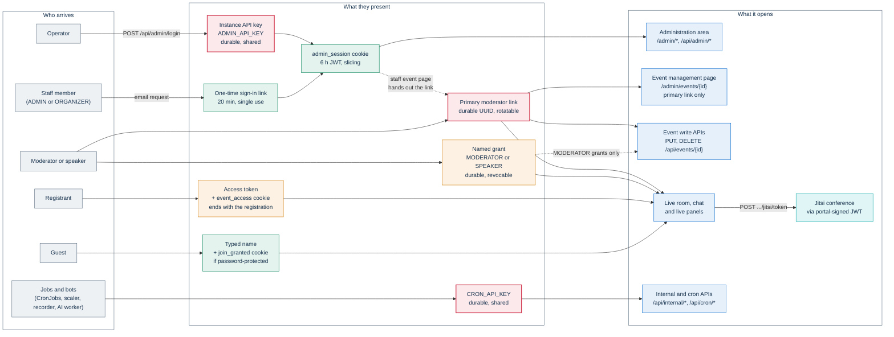
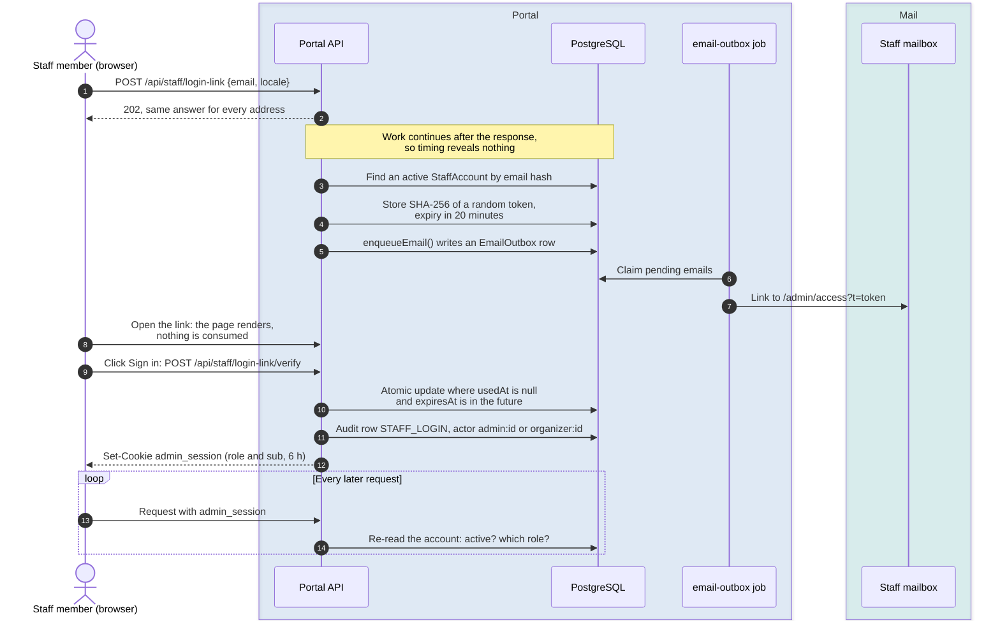
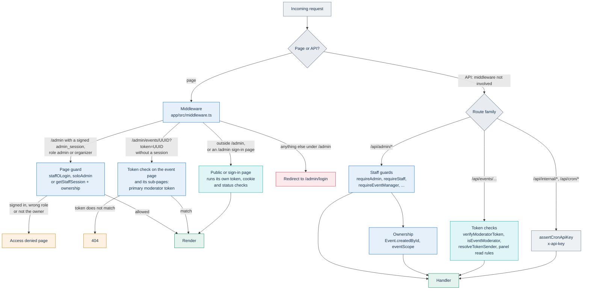

# Identity, access and tokens

This page owns the PA Webinar access model: every credential the platform issues or accepts, how each one travels, how long it lives and how it ends; how staff sign in and how their sessions work; where authorization is enforced; what the Jitsi token carries; how machines authenticate; how the administrative audit log names its actors; and which cookies exist.

It is written for developers who touch authentication, for security reviewers, and for administrators who delegate access to other people.

Related pages:

- Rate limits, the CSRF stance and the full application security model: [Security architecture](security.md).
- How the browser joins the conference with the portal-signed token (the join sequence diagram): [How PA Webinar extends Jitsi Meet](jitsi-integration.md).
- Who may read and write each live panel: [Live interaction and realtime](live-interaction.md).
- The privacy view of cookies, logs and retention: [Privacy and data protection](../GDPR.md).
- The decisions behind this model: [ADR-003](../adr/003-moderator-magic-links.md), [ADR-004](../adr/004-jitsi-jwt.md), [ADR-009](../adr/009-admin-session.md), [ADR-014](../adr/014-organizer-role.md), [ADR-015](../adr/015-named-administrators.md).

## Principles

- **No accounts for audiences or moderators.** Participants register with a name and an email address and receive a personal link. Moderators and speakers use magic links. Nobody outside the staff has a password or an account.
- **A token identifies a seat, not a person.** The primary moderator link is shared by the whole team that runs an event. A personal registration link that gets forwarded still points at the same registration. Anything that holds a token is treated as occupying that seat.
- **Acting as an author needs a per-person identity.** Changing or removing content under someone's name, such as editing a chat message after the fact, requires proof that the caller is that one person. Holding a shared token is not enough. See [Seats and people](#seats-and-people).
- **Staff are named people.** Administrators and organizers sign in to their own staff accounts through a one-time email link. The instance API key remains for first access, emergencies and automation. It has no owner, and the audit log records it as a session fingerprint.
- **Authorization is re-read, not trusted from the cookie.** A staff session re-reads the account's role and active flag on every request. Deactivating someone takes effect on their next request.
- **Jitsi receives only what the conference needs.** That means a display name, a per-join session identifier, an avatar and role flags. Jitsi never receives an email address or a readable email hash.
- **Fail closed.** A missing or short `APP_SECRET`, a bad signature, a token for another event or an expired link all resolve to "no access". Where an answer could reveal whether a staff account or a registration exists, or whether an organizer's event id exists, it is the same as for an unknown credential. Public event routes do answer 404 for an unknown slug, which reveals nothing because events are public by slug.

## Ways in

The diagram shows who arrives, what they present, and which surface each credential opens. Red credentials never expire on their own. Amber credentials are durable and end when one record is revoked or deleted: a named grant is revoked, an access token ends with its registration. Green credentials are short-lived.



The dotted edge from the session matters. Core edits to an event made from the administration area (the event itself, named grants, co-organizing organizations, uploaded files and the event's recording) go through the token-authenticated routes that a moderator uses. Materials, questionnaires, tags, invitations, duplication, analytics and AI generation go through `/api/admin/events/{id}/…`, behind a staff guard with an ownership check. For the token routes, the staff event page checks the session and ownership, then gives the browser the event's moderator token. Anyone who can open an event in the administration area can therefore obtain its moderator link.

## Credentials

| Credential | Obtained | Carried as | Lifetime | Ended by |
|---|---|---|---|---|
| Instance API key (`ADMIN_API_KEY`) | Set by the operator in the environment or the chart's secret | JSON body of `POST /api/admin/login`, once, to obtain a session. No route accepts it as a bearer | Until the operator changes it | Changing the secret. Sessions already opened with it survive: see [Sessions](#sessions) |
| Staff account, role `ADMIN` or `ORGANIZER` (`StaffAccount`) | Created by an administrator on **Accounts** | Never carried directly. It is the identity behind the one-time link and the session | Until deleted | **Deactivate** or **Delete**, effective on the next request |
| One-time sign-in link (`StaffLoginToken`) | Emailed on request, on account creation, or by an administrator | `?t=` on `/admin/access`, then JSON body of `POST /api/staff/login-link/verify` | 20 minutes, single use | Use, expiry, or deactivation of the account (unused links are deleted) |
| Staff session (`admin_session` cookie) | Minted at sign-in | HttpOnly cookie | 6-hour JWT, slid while in use. The cookie itself lasts 24 hours | Logout, expiry, account deactivation, `APP_SECRET` change |
| Primary moderator link (`Event.moderatorToken`) | Generated with the event (a duplicate gets a fresh one). Emailed once to the event's contact address, when there is one ([Email and calendar](email.md#moderator-and-speaker-links)) | `?token=` on landing pages, then `Authorization: Bearer` | No expiry. It lives as long as the event row | **Regenerate** on **Moderators** (administrators), or automatic rotation when the owning staff account is deactivated or deleted |
| Named grant (`EventModerator`, role `MODERATOR` or `SPEAKER`) | Created by the holder of the primary link, in the wizard or under **Co-moderators and speakers**. Emailed once to the grant's address, when there is one | Same as the primary link | No expiry | Individual revocation (`revokedAt`), and row deletion by the GDPR cleanup |
| Registrant access token (`Registration.accessToken`) | Issued at registration and sent in the confirmation email. **Resend my access link** sends it again | `?token=` on `/events/{slug}/live`, or with a signature on the entry link of invitation-only registration ([Registrants](#registrants)); `Authorization: Bearer` on chat requests and panel reads; `accessToken` in the JSON body of the Jitsi token, poll-vote, question, upvote and feedback requests; a path segment in `GET /api/events/{slug}/registrations/{accessToken}` | As long as the registration exists | Deletion of the registration by the GDPR cleanup or an erasure request, or deletion of the event |
| `event_access_<eventId>` cookie | Set in the browser that registered, or, with public registration off, in the browser that opened the signed entry link from the email | HttpOnly cookie | Until 6 hours after the event ends, clamped between 1 hour and 30 days | Expiry, `APP_SECRET` change |
| Guest | Nothing is issued. The guest types a name | Name in the Jitsi token request | Nothing persists; each join mints a 2-hour guest Jitsi token | Not applicable |
| `join_granted_<eventId>` cookie | Correct password on `POST /api/events/{slug}/verify-password` | HttpOnly cookie | 12 hours | Expiry, `APP_SECRET` change. Changing the password does not revoke grants already issued |
| Jitsi JWT | `POST /api/events/{slug}/jitsi/token`, or the recorder claim | Handed to the Jitsi IFrame API | 90 minutes or 2 hours for people; 10 minutes to 6 hours for the recorder bot (see [Seats, identifiers and lifetimes](#seats-identifiers-and-lifetimes)) | Expiry only |
| Machine key (`CRON_API_KEY`) | Set by the operator, shared with every job and bot | `x-api-key` header; `Authorization: Bearer` on two routes | Until changed | Changing it in the app and in every consumer together |

The lifetimes above come from `app/src/lib/auth/admin-session.ts`, `app/src/lib/auth/staff-link-config.ts`, `app/src/lib/event-session.ts`, `app/src/app/api/events/[param]/verify-password/route.ts` and `app/src/lib/auth/jwt.ts`.

Two things that look like credentials are not credentials:

- **Invitations** (`EventInvitation`) are a staged guest list attached to an event, managed in the event wizard. Adding one stores the contact only. The platform does not mint a link or send an email for it, and invitees register themselves. With public registration off, only invitees can register, using the invited address, and their personal link arrives by email ([Registrants](#registrants)).
- **Co-organizing organizations** (`EventOrganizer`) are display metadata shown on the public event page: a name, a logo and an optional link. They grant no access, carry no magic link and receive no email.

### Other signed links

Four more tokens are self-contained HMAC-SHA256 signatures under `APP_SECRET`. The server keeps no copy of them, so none can be revoked individually: each ends at expiry, when `APP_SECRET` changes or, for the registration entry signature, when the registration is deleted.

| Token | Obtained | Carried as | Lifetime | Owner page |
|---|---|---|---|---|
| Data-subject request link (`app/src/lib/gdpr/request-token.ts`) | Emailed on request from the privacy pages, for an export or an erasure. The payload carries the email hash, never the address | `?t=` on `/privacy/my-data` or `/privacy/my-data/erasure`, then to `GET /api/gdpr/export` or `POST /api/gdpr/erasure` | 1 hour, not single use | [Data-subject rights](../GDPR.md#data-subject-rights) |
| Address-book opt-out token (`app/src/lib/persons/opt-out-token.ts`) | Minted by `issueRubricaOptOutToken`. No platform email sends it | `?token=` on `/rubrica/opt-out` and on `GET` and `POST /api/rubrica/opt-out` | 90 days | [The address book](../GDPR.md#the-address-book) |
| Registration entry signature (`app/src/lib/events/registration-link.ts`) | Put in the confirmation, resend and reminder emails while public registration is off. It signs the event id and the access token | `sig` next to `token` and `lang` on `GET /api/events/{slug}/registrations/enter` | No expiry, not single use | [Registrants](#registrants) |
| Chat attachment token (`app/src/lib/chat/attachment-token.ts`) | Returned by `POST /api/events/{slug}/chat/attachment` after an upload | `attachmentToken` in the JSON body of `POST /api/events/{slug}/chat` | 30 minutes, bound to the event and the sender's seat | [Chat](live-interaction.md#chat) |

## Staff sign-in

The administration area has two entrances. Both end with the same `admin_session` cookie.

### The instance key exchange

On `/admin/login`, the **Sign in with the instance key** section posts `{ "key": "…" }` to `POST /api/admin/login`. The route:

- compares the key with `ADMIN_API_KEY` in constant time and answers 401 `invalid_key` on a mismatch;
- is rate-limited per IP address (limits are listed in [Security architecture](security.md));
- signs a JWT with `{ "role": "admin" }` and **no subject**, because the key has no owner;
- writes an `ADMIN_LOGIN` row to the audit log and sets the cookie.

Automation signs in the same way and then uses the cookie. No route accepts the key as a bearer. The key's intended uses are the first sign-in of a new installation (to create the first named administrators), emergencies, and scripts. After named administrators exist, the key can stay in a safe.

### The one-time email link

Named staff sign in without a password.



The details that make this safe:

- **No enumeration.** `POST /api/staff/login-link` always answers 202. The account lookup, the token and the email happen after the response is sent (Next.js `after()`), so neither the status code nor the response time tells a caller whether an address has access. Only active accounts receive mail. The route is rate-limited per IP address and per address.
- **Only the hash is stored.** The link carries 32 random bytes (base64url). The `staff_login_tokens` table keeps only their SHA-256, so a copy of the database cannot be used to sign in as anyone.
- **Twenty minutes, one use.** `DURATA_LINK_MINUTI` in `app/src/lib/auth/staff-link-config.ts` sets both the real expiry and the duration promised on the login page, so the two cannot drift apart.
- **An explicit click.** The link opens `/admin/access?t=…` (in Italian, `/admin/accesso`). That page, **Enter the administration area**, consumes nothing. Only the **Sign in** button posts the token. Mail scanners that follow links therefore cannot burn the sign-in.
- **Atomic consumption.** The token is marked used with a conditional update (`usedAt` is null and `expiresAt` is in the future), so two simultaneous clicks cannot open two sessions. Expired, used, unknown and deactivated-account tokens all produce the same `invalid_link` answer.
- **Delivery through the outbox.** The email goes through `enqueueEmail()` and the email-outbox job, in the language of the page that asked for it (or of the administrator who sent it). Languages and fallbacks are in [Email and calendar](email.md).
- **Housekeeping.** Requesting a new link does not invalidate an earlier unused one, which stays valid until it expires. The daily GDPR cleanup deletes link rows one day after they were used or expired ([Scheduled and background jobs](background-jobs.md)).

### Managing staff accounts

The **Accounts** page (`/admin/organizers`, title **Staff accounts**) is for administrators only. It lists every account with its role, state, last sign-in and number of owned events. From there an administrator can:

- **Add a person**: name, email address and role (`ORGANIZER` by default, or `ADMIN`), then **Add**. **Send the sign-in link now** is on by default, so a sign-in link goes out right away unless the administrator clears it. The account exists even if sending fails, and the link can be sent again from its row.
- **Make administrator**, after a confirmation step, or demote an administrator with **Change to organiser**. The change applies on the account's next request and is logged as `STAFF_ROLE_CHANGE`.
- **Deactivate** an account. On its next request the session stops working. Unused sign-in links are deleted, and the primary moderator link of every event the account owns is rotated. **Reactivate** lets the account sign in again with a new link; the rotated moderator links stay rotated.
- **Delete** an account. The same rotation happens. The account's events are not deleted: `createdById` becomes null, so they return to the administration.
- Send a new sign-in link with the row's **Send link** button (`POST /api/admin/organizers/{id}/invite`).

Nobody acts on themselves. An administrator's account cannot demote, deactivate or delete itself (403 `not_on_self`). Otherwise a single mistake could leave the instance with the key as its only way in.

Rotation covers only the events that the account owns. An administrator who leaves may also know the links of other events. Treat that situation like a leaked key: regenerate the links of the events that matter from **Moderators**.

## Sessions

Every staff member uses the same cookie, `admin_session`.

| Property | Value | Source |
|---|---|---|
| Format | HS256 JWT signed with `APP_SECRET` | `app/src/lib/auth/staff-session.ts`, `app/src/app/api/admin/login/route.ts` |
| Payload | `role` (`admin` or `organizer`). Account sessions also carry `sub` = the account id. Key sessions have no `sub` | same |
| Token lifetime | 6 hours (`ADMIN_SESSION_TTL_SECONDS`) | `app/src/lib/auth/admin-session.ts` |
| Cookie | `HttpOnly`, `SameSite=Lax`, `Path=/`, `Secure` when `NODE_ENV=production`, `Max-Age` 24 hours (`ADMIN_COOKIE_MAX_AGE_SECONDS`) | same |

**Sliding while in use.** `AdminSessionKeepAlive` calls `POST /api/admin/refresh` every 10 minutes, but only while the tab is visible and there was activity in the previous 30 minutes. The intervals are set in `app/src/components/admin/admin-session-keepalive.tsx`. The refresh re-mints the token with the account's current role, so the role in the token catches up after a promotion or a demotion. It writes no audit row. A workstation left unattended stops refreshing and decays to the 6-hour ceiling. The cookie outlives the token only so that an expired session remains recognizable as expired. A cookie that holds an expired token grants nothing.

**The role comes from the account.** `getStaffSession` verifies the signature. For an account session it then reads the `StaffAccount` row on every request, once per request because the call is memoized, and uses that row's `active` flag and `role`. For account sessions, the role inside the token is used by only one component: the middleware, which cannot read the database and only decides whether a page under `/admin` may render at all. A key session has no account to re-read, so its token's `role: "admin"` is its whole identity.

**Ending a session.** `POST /api/admin/logout` clears the cookie in that browser and writes `ADMIN_LOGOUT`. The token is not blocklisted, so a copy of it stays valid until it expires. What cuts a session short depends on its kind:

- An **account session** ends as soon as the account is deactivated or deleted, and loses administrator rights as soon as it is demoted, because the role and state are re-read on every request.
- A **key session** survives a change of `ADMIN_API_KEY`: the key is checked only at sign-in, and the refresh keeps extending the session while it is in use. Only a change of `APP_SECRET` ends every session at once.

## Where authorization is enforced

Authorization is spread over several layers. None of them is optional, and the middleware is not a security boundary for the API.



### The middleware covers pages only

The matcher in `app/src/middleware.ts` excludes `/api`, `/_next`, `/_vercel` and any path with a file extension. Route handlers enforce API access themselves. Under `/{locale}/admin`, the middleware:

- lets the sign-in pages through (`/admin/login` and `/admin/access`, including its Italian form `/admin/accesso`);
- lets through any request with a validly signed, unexpired `admin_session` whose role is `admin` or `organizer`. It checks the signature only and reads no database;
- without a session, lets through the event management page and its direct sub-pages when the path is `/admin/events/{uuid}` and `?token=` is a UUID. The page then checks the token itself. The creation wizard (`/admin/events/new`) is deliberately excluded;
- redirects everything else to `/{locale}/admin/login`.

### Page guards

Every administration page declares its audience with one of the helpers in `app/src/lib/auth/staff-page.ts`:

- `staffOLogin(locale)`: any staff session. It returns the session so that the page can filter its data. Without a session, it redirects to the login page.
- `soloAdmin(locale)`: administrators only. A signed-in organizer sees an "access denied" page. Redirecting an organizer to the login page would send them around in a loop.

The event management page, `/admin/events/{id}`, has two paths. With `?token=`, the token must equal the event's **primary** moderator token, otherwise the page returns 404. Without a token, it needs a staff session that may manage the event. The edit page, `/admin/events/{id}/edit`, opens only with the primary token in the URL.

### Staff guards on the administration API

Route handlers under `app/src/app/api/admin` call one of these guards from `app/src/lib/auth/staff-session.ts` or `admin-session.ts`. Three routes have no guard by design: `login`, `logout` and `refresh`. Two handlers answer without a session:

- `GET /api/admin/settings` returns the public subset of the site settings to anyone, and the full row only to administrators.
- `GET /api/admin/templates` returns the event template list without any guard, while its `POST`, `PUT` and `DELETE` siblings require an administrator. Templates hold wizard defaults, not personal data, but the handler is a gap rather than a decision. The [guard test](#the-guard-test) does not catch it, because it checks route files rather than handlers.

| Guard | Admits |
|---|---|
| `isAdminAuthenticated(cookies)`, `requireAdmin(cookies)` | The instance key session and active `ADMIN` accounts. **Never an organizer.** |
| `requireStaff(cookies)` | Any active staff session |
| `requireEventManager(cookies, eventId)` | Administrators, or the organizer who created the event. A malformed id answers 400 for everyone. For an organizer, an unknown event answers 403, like someone else's event, so the response cannot be used to probe which ids exist. Administrators pass the guard for any well-formed id, and the handler then answers, usually with 404 |
| `requireRecordingManager(cookies, recordingId)` | Same ownership rule, resolved through the recording. An organizer gets 403 for an unknown or malformed id. Administrators pass without a lookup |
| `requireSpeakerManager(cookies, speakerId)` | Same ownership rule, resolved through a transcript speaker label (`Speaker`) and its recording. An organizer gets 403 for an unknown or malformed id. Administrators pass without a lookup |
| `eventScope(session)` | Not a guard: the Prisma filter for lists, which is `{}` for administrators and `{ createdById }` for organizers |

Ownership is `Event.createdById`. Events created by an organizer or a named administrator belong to that account. Events created with the instance key have no owner and belong to the administration. A duplicated event belongs to whoever duplicated it. An owner keeps their events after a demotion.

`isAdminAuthenticated` stays true **only** for administrators. A route that nobody has reviewed for the organizer role therefore keeps rejecting organizers, instead of opening to them by accident.

What an organizer can reach, in summary: creating events and instant calls; managing their own events (editing, publishing, materials, questionnaires, invitations, tags, duplication, analytics, and AI post-production of their recordings); and read-only access to the shared tag and question libraries. The following remain administrator-only: platform settings, languages, GDPR and email templates, infrastructure and monitoring, the address book, sign-ups across all events, the GDPR log, instance statistics, orphaned files, the **Moderators** directory and staff accounts. The organizer's menu shows an allowlist of entries (`VOCI_ORGANIZZATORE` in `app/src/components/admin/admin-nav.tsx`), so a new section starts out as administrator-only.

### The guard test

`app/src/lib/auth/staff-access.test.ts` turns the rule into a failing test:

- every route file under `app/src/app/api/admin` must contain a call to an admin guard or a staff guard. The only exceptions are `login`, `logout` and `refresh`, which are listed with their reasons. The check reads each file as a whole, so a file passes as long as one of its handlers is guarded: an unguarded handler next to guarded ones is not detected;
- the set of administration routes that use a **staff** guard must equal the allowlist in the test, and each entry states why an organizer needs it. Opening a route to organizers is therefore a written decision, not a side effect of a copied guard;
- every administration page must declare its audience with `soloAdmin`, `staffOLogin` or `getStaffSession`. The exceptions are the login page, the access page, and the edit page that opens only with the moderator token. No page may use the old `isAdminAuthenticated`-plus-redirect pattern.

To open a route or page to organizers, switch it to a staff guard with an ownership check and add it to the allowlist with a reason. See [Extending PA Webinar](../development/extending.md) and [Testing](../development/testing.md).

### Token checks on the event API

Routes under `/api/events/{slug-or-id}/…` authenticate on the tokens described below, not on the staff session. There are three exceptions: creating an event (`POST /api/events`), creating an instant call (`POST /api/events/instant`) and the staff calendar feed, which all require a staff session. The route families and their conventions are in [API surface](api.md). The read and write rules of each live panel are in [Live interaction and realtime](live-interaction.md).

## Moderator and speaker links

### Shape and transport

| Link | Opens |
|---|---|
| `/{locale}/admin/events/{id}?token=<moderatorToken>` (localized path) | The event management page. Primary token only |
| `/{locale}/events/{slug}/live?token=<token>` | The live room as moderator or speaker. The primary token or a named grant |

Only `?token=` is accepted. There is no `?moderator=` parameter. Event APIs read the token from `Authorization: Bearer <token>`, which is preferred, or from `?token=`, which is kept for landing pages. When a token arrives in the query string, the server logs a one-time warning, because URLs end up in access logs and browser history. No custom header is accepted: a token sent any other way gets 401. There are two exceptions. The Jitsi token endpoint takes the token as the `moderatorToken` field of its JSON body. The event list, `GET /api/events?moderatorToken=<token>`, takes a primary token as a query parameter and returns the events it belongs to, drafts included.

Primary and grant tokens are random UUIDs. The primary token is compared in constant time; grant tokens are looked up through their unique index.

### What each seat can do

| Seat | Moderates the room | Event write APIs (`PUT`, `DELETE /api/events/{id}`) | Primary-only routes | Jitsi role |
|---|---|---|---|---|
| Primary moderator link | Yes | Yes | Yes | Moderator (`owner`) |
| Named grant, `MODERATOR` | Yes | Yes | No | Moderator (`owner`) |
| Named grant, `SPEAKER` | No | No | No | Participant (`member`), with audio, video and screen sharing |

The primary-only routes include managing named grants, co-organizing organizations and reminders, and deleting the event's recording. A named co-moderator never receives the primary token: `GET /api/events/{id}` returns the caller's own token to a co-moderator, not the event's.

A `SPEAKER` grant gets full audio and video from the app, but a participant-level Jitsi token (`moderator: false`). Jitsi's own permissions therefore also refuse moderator-only actions. `verifyModeratorToken` and `isEventModerator` in `app/src/lib/auth/moderator.ts` reject speaker tokens, so speakers cannot call moderation endpoints either.

Because the primary link is shared, entering the room with it requires a typed display name. Without one, every moderator would appear under the same generic name. Named grants carry their own name.

### Lifecycle

- **Issued.** The primary token is generated with the event, and a duplicated event gets a fresh one. The holder of the primary link creates named grants with `POST /api/events/{id}/moderators`, from the wizard or from **Co-moderators and speakers**.
- **Distributed by hand.** The platform does not email moderator or grant links. Staff copy them from **Event links** on the event page, where the **Moderator link** stays hidden until **Show** is pressed, or from the **Moderators** page. In the live room, **Show moderator link** reveals the link to moderators only.
- **Revoked.** The holder of the primary link revokes a named grant with `DELETE /api/events/{id}/moderators/{modId}`, which sets `revokedAt` and keeps the row for the record. The revocation takes effect at once on the pod that handled it. Polling endpoints on other replicas may accept the token for up to 5 more seconds (`MODERATOR_CACHE_TTL_MS` in `app/src/lib/auth/moderator.ts`). Grant rows are deleted by the event's GDPR cleanup.
- **Rotated.** The primary token has no expiry and cannot be revoked. It can be **rotated**. An administrator presses **Regenerate** on **Moderators**, which lists events that are not drafts and can be searched by slug or moderator name (`POST /api/admin/moderators` with `{ eventId, action: "regenerate" }`, logged as `EVENT_MODERATOR_TOKEN_ROTATE`). Organizers cannot rotate links, not even for their own events. Deactivating or deleting a staff account rotates the tokens of every event it owns. After a rotation the old link stops working in the portal. Legitimate users find the new link on the event page.
- **Not covered by revocation or rotation:** Jitsi tokens already issued, which remain valid until they expire. The next section covers them.

Treat both kinds of link as durable credentials. Do not show them during screen sharing and do not paste them into chat.

### Seats and people

The chat attributes messages, attachments and reactions to a **seat**. Q&A, polls and the word cloud do not use seats: they identify participation by registration or guest id, and give moderators no seat id.

| Token | Seat id | One person? (`isPerPersonIdentity`) |
|---|---|---|
| Primary moderator link | `mod-<eventId>-primary` | No: the link is shared by the team |
| Named `MODERATOR` grant | `mod-<eventId>-<grantId>` | Yes |
| Named `SPEAKER` grant | `spk-<eventId>-<grantId>` | Yes |
| Registrant access token, in the browser that registered | `reg-<registrationId>` | Yes |
| The same access token, opened elsewhere (forwarded link) | `reg-<registrationId>` | No |

A forwarded link keeps the registrant's seat on purpose, so that a registrant who switches devices does not split into two identities in analytics. It never inherits the registrant's name, though. The opener is shown under the name they typed. Any action that works *as the author*, such as editing an existing chat message, requires `isPerPersonIdentity`. The single implementation is `resolveTokenSender` in `app/src/lib/chat/sender.ts`.

## Participants and guests

### Registrants

With public registration on, `POST /api/events/{slug}/registrations` creates the registration and does three things:

- issues `accessToken`, a 24-character nanoid;
- sends the confirmation email with the personal link `/events/{slug}/live?token=<accessToken>`;
- sets the signed `event_access_<eventId>` cookie in the registering browser. The cookie carries `{ eventId, token }`.

The cookie does two jobs:

- **Return without the link.** A registrant who comes back to `/live` without `?token=`, for example after a refresh, from a bookmark or through the event page, is recognized from the cookie instead of being sent to register again. On a password-protected event the password check comes first: see [Password-protected events](#password-protected-events).
- **Identity binding.** Only the browser that holds a cookie with the same token receives the registrant's name and their per-participant recording consent. A personal link opened in another browser still admits the person, but they must type a name. In Jitsi they join as a guest with a fresh `guest-` identity and a 2-hour token. In the chat they occupy the registrant's seat under the typed name.

**Resend my access link** (`POST /api/events/{slug}/registrations/resend`) sends the confirmation again, in the language of the registration. It always gives the same answer, so it cannot be used to find out who registered.

**Invitation-only registration.** With the site setting `publicRegistrationEnabled` off, the browser that fills in the form proves nothing: the address is not verified, and whoever knows an invitee's address could otherwise take that invitee's identity. So the registration route answers `202` with the same body for every address and sets no cookie, and the personal link reaches the registrant only by email ([event-journey.md](event-journey.md#invitation-only-registration)). In that mode the confirmation, resend and reminder emails carry the entry link `GET /api/events/{slug}/registrations/enter?token=…&sig=…&lang=…`, where `sig` is an HMAC-SHA256 under `APP_SECRET` over the event and the access token (`app/src/lib/events/registration-link.ts`). The route:

- sets the `event_access_<eventId>` cookie only when the registration exists, belongs to the event and the signature verifies, which binds that browser to the registration as registering does in open mode;
- redirects (`303`, `Cache-Control: no-store`, `Referrer-Policy: no-referrer`) to `/live?token=…` whenever a token is present, so a missing or wrong signature, another event's token and an unknown token get the same answer without a cookie, and the visitor then holds a seat with no identity;
- redirects to the event page when there is no token, and answers `404` only for an unknown event.

The entry link does not expire and is not single use, because mail scanners open links before the recipient does. Forwarding the email therefore forwards the identity. The add-to-calendar links in the same emails, and the address bar after the redirect, carry only the unsigned `/live?token=…` link, which gives a seat without the identity. Someone who lures a registrant into opening another registrant's entry link rebinds that browser's cookie for the event to the other registration.

Registration never verifies the address, in either mode. Someone who knows an invitee's address can create that invitee's registration, with a name and consents of their choosing. With public registration off, the link then still goes only to the invitee's mailbox, and the room shows the name typed at registration.

### Guests

A guest presents nothing but a typed name. Whether an event admits guests at all is decided by `guestAccessAllowed` in `app/src/lib/events/guest-window.ts`. Instant calls always admit them, because the link is the invitation. Scheduled events admit them only while the site setting `guestAccessEnabled` (**Guest access enabled**, see [Runtime settings](../configuration/runtime-settings.md)) is on. When it is off, a scheduled event can be joined only by registering or with a moderator or speaker link: the live page sends a visitor without a token to registration, the Jitsi token endpoint refuses a guest token with `403` `GUEST_ACCESS_DISABLED`, and the chat and panel read rules refuse tokenless readers. These all share the one rule. A registrant's link opened on another device is a registration seat, not a guest, so it keeps working. Endpoints that act in the room without any identity, such as agenda reactions, the app's reaction bar, raised hands, presence in the square and post-event feedback, do not check the setting, because moderators and speakers call them without a bearer token too. The statuses in which guests get in are listed in [Event lifecycle](event-lifecycle.md#which-joins-each-status-admits). Guest Jitsi tokens are rate-limited per IP address (`GUEST_JWT_RATE_LIMIT_PER_MINUTE`, see [Security architecture](security.md)).

### Password-protected events

An event can carry a join password. The password is stored only as a scrypt hash in `joinPasswordHash` and must be at least 4 characters (`app/src/lib/auth/password.ts`). When the event admits guests, anyone who opens the live page without `?token=` and without a grant is sent to `/events/{slug}/password` first. The password check comes before the `event_access` cookie is read, so a registrant who returns without `?token=` must enter the password or use their personal link. The form posts to `POST /api/events/{slug}/verify-password`, which is rate-limited per IP address and event. On success, the route sets `join_granted_<eventId>`, a signed cookie carrying `{ eventId, role: "guest" }` that lasts 12 hours. The live page, the chat and panel read rules and the Jitsi token endpoint check this cookie through `hasJoinGrant` (`app/src/lib/events/join-grant.ts`). The token endpoint refuses a guest token without it with `403` `JOIN_PASSWORD_REQUIRED`. The grant is bound to the event, not to the password, so changing the password does not revoke grants already issued.

### When a Jitsi token is issued

The Jitsi token endpoint issues tokens only in the statuses listed in [Event lifecycle](event-lifecycle.md#which-joins-each-status-admits) and answers 409 with the current status otherwise, so the waiting room keeps waiting.

## The Jitsi JWT

The portal signs every conference token. Prosody verifies it and derives the participant's role from it. The join sequence is drawn in [How PA Webinar extends Jitsi Meet](jitsi-integration.md), and the Prosody side of authentication is described there too.

### Claims

```json
{
  "context": {
    "user": {
      "name": "Jane Doe",
      "displayName": "Jane Doe",
      "id": "reg-<registrationId>-1a2b3c4d",
      "avatar": "data:image/svg+xml;base64,…",
      "affiliation": "member",
      "moderator": "false"
    },
    "features": { "recording": false, "livestreaming": false, "screen-sharing": true, "outbound-call": false }
  },
  "moderator": false,
  "affiliation": "member",
  "room": "<jitsiRoomName>",
  "sub": "localhost:8443",
  "iss": "pa-webinar",
  "aud": "jitsi",
  "jti": "pa_webinar:reg-<registrationId>-1a2b3c4d",
  "iat": 1700000000,
  "exp": 1700005400
}
```

| Claim | Meaning |
|---|---|
| `context.user.name`, `displayName` | The display name. `name` is the canonical field. `displayName` covers modules that read the other one |
| `context.user.id` | A per-join session identifier (prefixes below), unique for each entry |
| `context.user.avatar` | A data-URI SVG with initials, generated locally, or a link to the portal's own `/api/avatar` proxy (see [Avatars](#avatars)) |
| `context.user.affiliation`, `moderator` and the top-level copies | `owner`/`true` for moderators, `member`/`false` for everyone else |
| `context.features` | `recording` is true for moderators only. `screen-sharing` is true for everyone. `livestreaming` and `outbound-call` are false for everyone (`app/src/lib/jitsi/config.ts`) |
| `room` | The event's `jitsiRoomName`, a UUID |
| `sub` | `JITSI_JWT_SUBJECT`, or the constant `localhost:8443` (`DEFAULT_JITSI_JWT_SUBJECT`) when it is unset or empty. Prosody requires the claim but compares it with its XMPP domain only when `JWT_ENABLE_DOMAIN_VERIFICATION` is on, which the chart and Docker Compose leave off |
| `iss`, `aud` | `JITSI_JWT_ISSUER` (default `pa-webinar`) and `JITSI_JWT_AUDIENCE` (default `jitsi`). They must match Prosody's `JWT_ACCEPTED_ISSUERS` and `JWT_ACCEPTED_AUDIENCES` |
| `jti` | `<JITSI_JWT_APP_ID>:<session id>`. The app id defaults to `pa_webinar` |
| `iat`, `exp` | Issue time and expiry (TTLs below) |

The token is signed with HS256 using `JITSI_JWT_SECRET`, which must equal Prosody's `JWT_APP_SECRET`. Defaults are set in `app/src/lib/auth/jwt.ts` and `infra/helm/pa-webinar/values.yaml`. The endpoint answers with `Cache-Control: no-store`.

**No email address and no readable email hash appear in the token, in any form.** The HMAC `emailHash` that the portal keeps for lookups never leaves the database.

### Seats, identifiers and lifetimes

| Who | `context.user.id` | Role | Lifetime | Avatar |
|---|---|---|---|---|
| Primary moderator link, `MODERATOR` grant | `mod-<eventId>-<8 hex>` | `owner` | 2 hours | Initials. Gravatar is possible for a named grant that has an email address |
| `SPEAKER` grant | `mod-<eventId>-<8 hex>` | `member` | 90 minutes | As above |
| Registrant, in the browser that registered | `reg-<registrationId>-<8 hex>` | `member` | 90 minutes | Initials, or Gravatar when enabled |
| Guest, or a forwarded personal link | `guest-<uuid>` | `member` | 2 hours | Initials |
| Recorder bot, JWT path only (see [Machine credentials](#machine-credentials)) | `rec-bot-<recordingId>`, stable per recording | `member` | Time left until the event ends plus 30 minutes, clamped between 10 minutes and 6 hours | Initials |

A random suffix gives every entry, including a second tab, its own conference identity. Jitsi keeps no revocation list for these tokens, so the expiry is the only limit on how long a copied token can be used to join. Re-entering through the magic link mints a fresh token.

### Avatars

By default the avatar is an SVG with initials, inlined as a data URI. It triggers no request and passes any restriction of the Jitsi web app.

When an administrator enables Gravatar in the site settings (`gravatarEnabled`, see [Runtime settings](../configuration/runtime-settings.md)) and the seat has an email address, the avatar becomes `https://webinar.example.com/api/avatar?name=…&g=<ref>&size=200`, where:

- `<ref>` is the Gravatar MD5 of the address, **encrypted** with `PII_ENCRYPTION_KEY` (`app/src/lib/gravatar-ref.ts`). Jitsi broadcasts avatar URLs to the whole room, and a bare MD5 of an address could be tested against guessed addresses. Only the portal can decrypt the reference.
- the proxy, and never the participant's browser, calls gravatar.com. It asks with `d=404`, so a person without a Gravatar keeps their initials. It does this only while the setting is on.

The shared primary link and guests have no email address, so they always show initials.

## Machine credentials

| Credential | Presented as | Accepted by | Used by |
|---|---|---|---|
| `CRON_API_KEY` | `x-api-key` header | `/api/cron/*` and `/api/internal/*`, through `assertCronApiKey` in `app/src/lib/auth/cron.ts` | The chart's CronJobs or the Compose `cron` service, the JVB scaler, the recorder controller, the recorder bot, the AI post-production worker, the Jibri finalize script |
| `CRON_API_KEY` | `Authorization: Bearer` | `GET /api/metrics` ([Monitoring and health](../operations/monitoring.md)) and `POST /api/webhooks/recording` | Prometheus scraping, the Jibri finalize script |
| `RECORDING_WEBHOOK_SECRET` | `X-Webhook-Signature: sha256=<hex>`, an HMAC-SHA256 of the raw body | `POST /api/webhooks/recording`, in addition to the bearer | The Jibri finalize script |
| Hidden-domain recorder account (XMPP user and password from the Secret named in `recorder.xmppSecretName`, keys `recorder.xmppSecretUserKey` and `recorder.xmppSecretPasswordKey`) | SASL sign-in to Prosody on `recorder.hiddenDomain` | Prosody, not the portal | The recorder bot, only when `recorder.hiddenDomain` is set. See [Recording](recording.md#the-invisible-bot-hidden-prosody-domain) and [Setting up recording](../operations/recording-setup.md#make-the-bot-invisible) |

All comparisons run in constant time. When `RECORDING_WEBHOOK_SECRET` is unset, the recording webhook accepts the bearer alone and logs a one-time warning.

**The recorder claim model.** The recorder controller starts a recorder Job. At start-up the bot always calls `POST /api/internal/recorder-claim`, and the portal mints its Jitsi token at that moment. The token is receive-only by behavior, `member` by role, and tied to the event's remaining time. Upload URLs come from `/api/internal/recorder-upload-url` in the same way. What else the Job carries depends on `recorder.hiddenDomain`:

- **Not set.** The Job carries only `RECORDING_ID`, `CRON_API_KEY` and non-secret settings. The bot joins with the claim JWT, as `rec-bot-<recordingId>`, and is visible in the room.
- **Set.** The Job specification also references the hidden-domain XMPP account from the Secret named in `recorder.xmppSecretName`. The bot signs in with that account over SASL and stays invisible. If that sign-in never reaches the conference, the bot falls back to the claim JWT and becomes visible.

The mechanism is in [Recording](recording.md#the-claim-model), the values in [Setting up recording](../operations/recording-setup.md).

**One key, many doors.** A single `CRON_API_KEY` opens every internal and cron route and the metrics endpoint. Keep it out of anything public-facing. Rotate it by changing the secret for the app and all its consumers in the same rollout.

## Keys behind the credentials

The secrets that sign or check these credentials are listed below. The complete secrets map is in [Configuration reference](../CONFIGURATION.md).

| Secret | Signs or checks | Changing it |
|---|---|---|
| `APP_SECRET`, at least 32 characters; verification fails closed otherwise | `admin_session`, `event_access_*`, `join_granted_*`. It also signs data-subject request links, address-book opt-out tokens, registration entry links and chat attachment tokens ([Other signed links](#other-signed-links)), and it is the HMAC key of every stored email hash | Signs every staff member out, voids every event cookie and voids any outstanding signed link, including the entry links already emailed for invitation-only registration. Email hashes computed afterwards no longer match the stored ones, so staff accounts, registrations and address-book entries stop being found by email address |
| `JITSI_JWT_SECRET` | Jitsi JWTs (Prosody verifies them with the same value) | Tokens already issued stop verifying. Change it together with Prosody's `JWT_APP_SECRET` |
| `ADMIN_API_KEY` | The instance key exchange | New key sign-ins need the new value. Existing sessions continue |
| `CRON_API_KEY` | Machine calls | Every consumer must change at the same time |
| `RECORDING_WEBHOOK_SECRET` | Recording webhook signatures | The finalize script must use the same value |
| `PII_ENCRYPTION_KEY` | Encrypts the Gravatar reference (and personal data at rest, see [Security architecture](security.md)) | Covered in [Security architecture](security.md) |

## Audit actor format

Staff actions that change something are written to `admin_audit_log` (model `AdminAuditLog`) by `logAdminAction` in `app/src/lib/audit/admin-audit.ts`. Read-only listings and the silent session refresh are not recorded. A failed audit write never blocks the action; the failure appears in the server log. The `actorHash` column holds one of:

| Actor | When |
|---|---|
| `admin:<accountId>` | A named administrator |
| `organizer:<accountId>` | An organizer |
| 16 hex characters | The first 16 hex digits of the SHA-256 of the session cookie. This is how instance key sessions appear, and so does a cookie that no longer resolves to an account. The value stays stable within one session and changes when the session is refreshed |
| `unknown` | The request carried no `admin_session` cookie. This is the case, for example, when a moderator link edits an event outside the administration area |

The role prefix comes from the account **at the time of the action**, not from the token. A sign-in (`STAFF_LOGIN`) records its actor explicitly, because the new cookie does not exist yet. Each row also stores the action, the target id, the client IP address as reported by the proxy headers, the user agent and a small JSON detail, usually changed field names and ids. The speaker-mapping action (`POSTPROD_SPEAKER_MAP`) also records the name assigned to a transcript speaker label and the linked person id. PA Webinar has no screen for this table and no scheduled job deletes its rows. Read it from the database. The privacy implications are covered in [Privacy and data protection](../GDPR.md).

## Cookie inventory

| Cookie | Set by | Contents | Lifetime | Flags |
|---|---|---|---|---|
| `admin_session` | `POST /api/admin/login`, `POST /api/staff/login-link/verify`, `POST /api/admin/refresh` | HS256 JWT: `role`, plus `sub` for accounts | 24-hour cookie, 6-hour token | `HttpOnly`, `SameSite=Lax`, `Secure` when `NODE_ENV=production`, `Path=/` |
| `event_access_<eventId>` | `POST /api/events/{slug}/registrations`, or `GET /api/events/{slug}/registrations/enter` with a valid signature while public registration is off | HS256 JWT: `eventId`, the access token | Until 6 hours after the event ends, clamped between 1 hour and 30 days | `HttpOnly`, `SameSite=Lax`, `Secure` when `NODE_ENV=production`, `Path=/` |
| `join_granted_<eventId>` | `POST /api/events/{slug}/verify-password` | HS256 JWT: `eventId`, `role: "guest"` | 12 hours | `HttpOnly`, `SameSite=Lax`, `Secure` when `NODE_ENV=production`, `Path=/` |
| `NEXT_LOCALE` | The next-intl middleware | The interface language code | Browser session | `SameSite=Lax`. Set only when the page language differs from the browser's preferred language or from an earlier value |

All four are first-party and functional. None is used for analytics, advertising or tracking. The middleware also honors `enabled_locales` and `default_locale` cookies when a request carries them, but the application never sets them. The privacy view of these cookies, including the question of consent, is owned by [Privacy and data protection](../GDPR.md).
