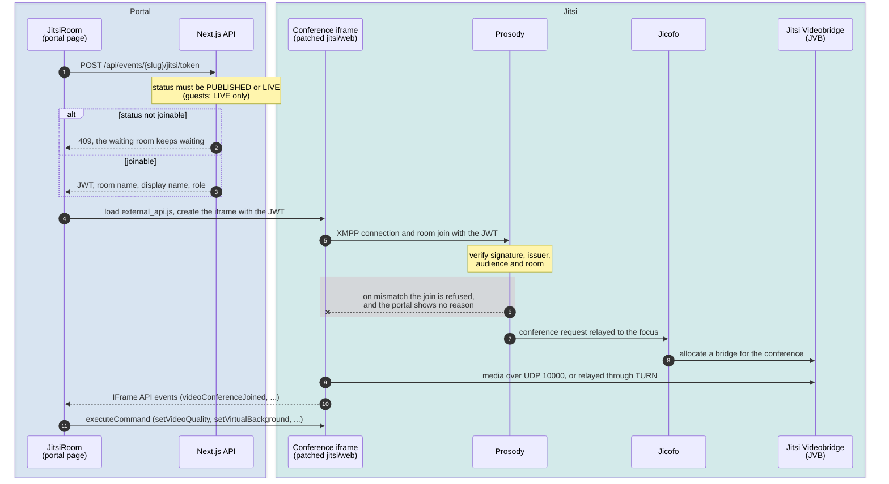
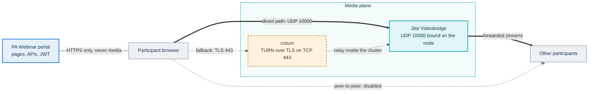

# How PA Webinar extends Jitsi Meet

PA Webinar uses [Jitsi Meet](https://jitsi.org/jitsi-meet/) as its conference engine and builds the event
platform around it: registration, the waiting room, live interaction, moderation, recording and
post-production all live in the portal. This page owns the boundary between the two: how the portal
embeds Jitsi, what it configures, what it adds on the Jitsi side, and what to check when Jitsi is
upgraded.

It is written for developers working on the live room, for architects evaluating whether a Jitsi-based
product can be reused, and for maintainers bumping the Jitsi version.

Out of scope here, and owned elsewhere:

- firewall, TURN and network design decisions: [INFRASTRUCTURE](../INFRASTRUCTURE.md#networking);
- Helm keys and install walkthroughs: [DEPLOYMENT](../DEPLOYMENT.md);
- the claims inside the Jitsi JWT and every other credential: [identity and access](identity-and-access.md);
- the live panels (Q&A, chat, polls and the rest): [live interaction](live-interaction.md);
- capture paths and the recorder bot: [recording](recording.md).

## Principle: embed, don't fork

Jitsi is never forked. Every customization uses a mechanism Jitsi supports, and the least invasive one
that works is the one used. The reasoning is recorded in
[ADR-001](../adr/001-jitsi-iframe-api.md): a fork would turn every upstream security fix into a merge
project for each public administration (PA) that reuses the platform.

### The extension ladder

Each rung costs more to maintain than the one before it, because it depends more closely on Jitsi's
internals and breaks more quietly on an upgrade.

```mermaid
flowchart LR
  classDef portal fill:#E6F0FA,stroke:#0066CC,stroke-width:2px,color:#17324D
  classDef job fill:#FFF3E0,stroke:#CC7A00,stroke-width:2px,color:#4D2E00
  classDef risk fill:#FCE8EC,stroke:#D1344C,stroke-width:2px,color:#5C0F1B
  classDef never fill:#FFFFFF,stroke:#D1344C,stroke-width:3px,stroke-dasharray:6 4,color:#5C0F1B

  subgraph LOW["Least invasive: portal code only"]
    L1["1. IFrame API<br/>commands and events"]:::portal
    L2["2. Config overrides<br/>configOverwrite per role and device"]:::portal
  end
  subgraph MID["Jitsi server configuration"]
    L3["3. JWT authentication<br/>Prosody verifies portal-signed tokens"]:::job
    L4["4. Prosody module<br/>room role taken from the token"]:::job
  end
  subgraph HIGH["Most invasive: modified Jitsi artifact"]
    L5["5. Patched web bundle<br/>three fixes, located by shape"]:::risk
  end
  NO["Source fork, lib-jitsi-meet in the portal,<br/>custom WebRTC: never"]:::never

  L1 --> L2 --> L3 --> L4 --> L5
  L5 -.-x|"the ladder ends here"| NO

  style LOW fill:#F7F9FB,stroke:#0066CC,color:#17324D
  style MID fill:#FFFAF2,stroke:#CC7A00,color:#4D2E00
  style HIGH fill:#FFF7F8,stroke:#D1344C,color:#5C0F1B
```



| Rung | Where it lives | Section |
|---|---|---|
| IFrame API | `app/src/components/jitsi/jitsi-room.tsx`, `app/src/hooks/use-jitsi-events.ts` | [Embedding through the IFrame API](#embedding-through-the-iframe-api) |
| Config overrides | `app/src/lib/jitsi/config.ts` | [Configuration applied to every room](#configuration-applied-to-every-room) |
| JWT authentication | `app/src/lib/auth/jwt.ts` (signing), Prosody environment (verification) | [Authentication bridge](#authentication-bridge-the-prosody-side) |
| Prosody module | `infra/jitsi/prosody-plugins/mod_token_affiliation_custom.lua` | [Prosody extensions](#prosody-extensions) |
| Patched web bundle | `infra/jitsi-web-patched/` | [The patched web image](#the-patched-web-image) |

### What is never done

- **No fork of the Jitsi source.** Server-side behavior changes only through the configuration that the
  official Jitsi images expose, plus one Prosody module that Jitsi's plugin mechanism loads.
- **No `lib-jitsi-meet` in the portal.** The portal talks to Jitsi only through the IFrame API. The only
  code that uses `lib-jitsi-meet` directly is the recorder bot (`infra/recorder`) and test harnesses
  such as `scripts/load-test/coherence-bots.mjs`.
- **No custom WebRTC.** Media capture, encoding, simulcast and ICE stay inside Jitsi's client.
- **No second instantiation point.** `JitsiRoom` is the only place that creates a
  `JitsiMeetExternalAPI`.

## Embedding through the IFrame API

### JitsiRoom, the single instantiation point

`JitsiRoom` (`app/src/components/jitsi/jitsi-room.tsx`) is a Client Component. On mount it:

1. loads `external_api.js` from the conference host (for example
   `https://meet.webinar.example.com/external_api.js`), or reuses the script if it is already on the
   page;
2. works out the configuration for this role, device and event (see
   [Configuration applied to every room](#configuration-applied-to-every-room));
3. creates `JitsiMeetExternalAPI` with the room name, the portal-issued JWT, the display name and the UI
   language;
4. sets an accessible `title` on the iframe (**Event video call**) and the `allow` list it needs:
   `camera; microphone; display-capture; autoplay; clipboard-write; screen-wake-lock`;
5. registers its listeners and hands the API object to the rest of the live room.

On unmount it flushes its pending analytics buffers, clears its timers and calls `dispose()`.

Two behaviors matter to anyone changing the live room:

- **Changing a prop that shapes the conference tears the iframe down and rejoins.** Examples are the
  JWT, the role, the participant policies, the quality preset, the reactions mode and the start-muted
  flags. The UI language is deliberately excluded, so switching language does not disconnect anyone.
- **The mobile layout is chosen once, at mount** (viewport below 768 px). Switching the toolbar mid-call
  would need a new iframe, which means a reconnect.

The conference host is the runtime value of `NEXT_PUBLIC_JITSI_DOMAIN`, read on the server with
`getPublicEnv()` and passed down as a prop. The portal's Content Security Policy allows that host as a
frame and script source, and its Permissions-Policy delegates camera, microphone and screen capture to
it. The details are in [SECURITY-CSP](../SECURITY-CSP.md).

### Joining a room, end to end



The token route (`app/src/app/api/events/[param]/jitsi/token/route.ts`) mints a JWT only while the
event is `PUBLISHED` or `LIVE`. During `PROVISIONING` or `IDLE` it answers 409, so nobody lands on a
Jitsi Videobridge (JVB), the media server, that is still starting. Which screen people see while they
wait is covered in [the waiting room](waiting-room.md); the status machine itself is in
[event lifecycle](event-lifecycle.md).

### Commands the app sends

| Command | Sent from | Purpose |
|---|---|---|
| `setVideoQuality` | `JitsiRoom` | Enforce the quality preset's maximum height on join and whenever the camera is turned on |
| `setNoiseSuppressionEnabled` | `JitsiRoom` | Keep advanced noise suppression off, or turn it on; see [noise suppression](#noise-suppression-and-the-patched-image) |
| `setVirtualBackground` | `JitsiRoom` | Apply the background chosen in the waiting room |
| `hangup` | Live room (**Leave room**, the leave prompt); moderator control bar (**End event**) | Every exit path, for every role |
| `startRecording`, `stopRecording` (`mode: 'file'`) | Moderator control bar; the live room's recording prompt, or automatically on join when `autoStartRecording` is set | Composite recording through Jibri; see [recording](recording.md) |
| `muteEveryone` + `toggleModeration` | Moderator control bar | **Participant mic** mutes everyone and turns on Jitsi's audio moderation; **Participant video** toggles video moderation |
| `askToUnmute`, `approveVideo` | Raised-hand queue | **Give the floor** (audio and video) or **Audio only** for someone with a raised hand |
| `kickParticipant` | Participants panel | Remove a participant (moderators) |
| `setParticipantVolume` | Participants panel | Change how loud one participant sounds in this browser only |
| `toggleRaiseHand` | Live room | Lower your own hand when a moderator asks for it (see below) |
| `toggleWhiteboard` | Moderator control bar | Open Jitsi's whiteboard, when enabled (see [below](#reactions-whiteboard-and-instant-calls)) |

To find every call site, run `grep -rn "executeCommand(" app/src --include=*.tsx` (a few comments match
too); for listeners, `grep -rn "addListener(" app/src/components app/src/hooks`. The typed overloads in
`app/src/types/jitsi.ts` declare what the API accepts, not what the app sends.

### Events the app listens to

| Event | What the app does with it |
|---|---|
| `videoConferenceJoined` | Marks the room ready, seeds the participant count, applies quality, noise suppression and background, opens the call session (`POST /api/events/{slug}/sessions`) and starts the speaker timeline |
| `videoConferenceLeft` | Flushes pending buffers and starts the leave-or-reconnect decision |
| `readyToClose` | Treated as the authoritative "this person meant to leave" signal (see [Leaving](#leaving-the-room-and-readytoclose)) |
| `participantJoined`, `participantLeft`, `displayNameChange` | Recounts people and refreshes the roster and the raised-hand queue; the recorder bot is excluded |
| `audioMuteStatusChanged`, `videoMuteStatusChanged` | Re-enables noise suppression on unmute; reapplies quality and background when the camera turns on |
| `raiseHandUpdated` | Updates the raised-hand queue. Each non-moderator also reports their own raises, batched, to `/api/events/{slug}/hand-raises` for event analytics |
| `dominantSpeakerChanged` | Builds the dominant-speaker timeline, batched to `/api/events/{slug}/speaker-events` for speaker attribution ([ADR-013](../adr/013-multitrack-speaker-attribution.md)) |
| `recordingStatusChanged` | Drives the recording indicator |
| `moderationStatusChanged` | Keeps the audio and video moderation toggles in sync |
| `screenSharingStatusChanged` | Shows the screen-share banner |

### Why the IFrame API and not lib-jitsi-meet

| Concern | IFrame API (chosen) | lib-jitsi-meet in the portal |
|---|---|---|
| Scope of work | Embed Jitsi's complete conference UI and build only what surrounds it | Rebuild every control, layout and media state in the portal |
| WebRTC | Jitsi's own client, maintained upstream | Portal code handles tracks, simulcast and ICE |
| Version coupling | The Jitsi host serves `external_api.js` together with the UI, so the API always matches the conference build | The library version is fixed at portal build time and must track the server |
| Isolation | The conference runs on its own origin; portal code never touches media | Media code runs in the portal's origin |
| Control | Commands, events and the configuration keys Jitsi accepts from an embedder | Complete |

The last row is the price of the choice. The next section lists what it rules out.

### Limits of the boundary

Some things cannot be reached from outside the iframe. The design works around them instead of
patching Jitsi:

- **Background blur.** The remote command sets image backgrounds only. Blur is available only from
  Jitsi's own backgrounds button inside the room, and that button is in the desktop toolbars only:
  the narrow-screen toolbars leave out `select-background` (see
  [Toolbars by role and device](#toolbars-by-role-and-device)).
- **Jitsi's browser storage.** The conference runs on its own origin, so the portal cannot read or clear
  what Jitsi stores in the browser. That is why the portal sends an explicit "no background"
  command, and why the self-view fix needs the patched image.
- **Another participant's hand.** The API can only toggle your own hand. When a moderator clicks
  **Lower hand**, the portal sends the request over its own realtime channel, and the raiser's client
  lowers its own hand. The raise is identified by its shared raise ID, so a hand raised again in the
  meantime is left alone.
- **Portal identity of a Jitsi participant.** The IFrame API exposes endpoint IDs and display names, not
  the JWT's user ID. Headcounts therefore de-duplicate on the normalized display name
  (`app/src/lib/jitsi/participants.ts`), so two people with an identical name count as one. The
  participants roster lists every connection, so a moderator can act on each.
- **Theming inside the iframe.** See [Branding limits](#branding-limits).

## Configuration applied to every room

All static overrides live in `app/src/lib/jitsi/config.ts`; `JitsiRoom` merges them with the
per-role, per-device and per-event values when it creates the iframe. The guard tests in
`app/src/lib/jitsi/config.test.ts` and `app/src/lib/jitsi/theme.test.ts` fail if a rule below is
undone by accident.

### Toolbars by role and device

Every role gets Jitsi's native toolbar, and it stays visible (`TOOLBAR_ALWAYS_VISIBLE: true`).
Moderators get a larger set of buttons than other participants.

| Toolbar | Buttons | Used for |
|---|---|---|
| `baseToolbarButtons` | `microphone`, `camera`, `select-background`, `desktop`, `filmstrip`, `tileview`, `settings`, `raisehand` | Participants, guests and speakers on desktop |
| `moderatorToolbarButtons` | the base set plus `mute-everyone`, `security`, `participants-pane` | Moderators on desktop |
| `mobileBaseToolbarButtons` | `microphone`, `camera`, `raisehand`, `settings` | Participants below 768 px |
| `mobileModeratorToolbarButtons` | the mobile set plus `participants-pane` | Moderators below 768 px |

On top of these, `JitsiRoom` adds `reactions` when the reactions mode is native, and `whiteboard` for
moderators on desktop when the event has opted in.

What is deliberately missing, for every role:

- **`hangup`.** Jitsi's own hangup leaves without going through the app, and the app must control every
  exit to tell a deliberate leave from a network drop. Every exit goes through the app's own controls
  instead: **Leave room**, or **End event** for moderators.
- **`fullscreen`.** Jitsi's fullscreen covers only the iframe and hides the portal's drawer. The app
  offers its own **Fullscreen** toggle for the whole live area.
- **`chat`.** The portal's chat panel is the chat. Jitsi's chat is *not* disabled by configuration
  (`disableChat: false`, and private messages stay enabled in the participant tile menu), so it can still
  be reached from Jitsi's own UI. Those messages travel over XMPP and are neither stored nor moderated
  by the portal.
- **`desktop` on mobile.** Most mobile browsers do not support screen capture inside an iframe, so the
  button would only produce an error.

Speakers join with the participant role in Jitsi. The event's participant restrictions do not apply to
them: the portal keeps their microphone, camera and screen-share buttons. Jitsi's audio and video
moderation, when a moderator turns it on, applies to them like any other participant. Their JWT carries
the `member` affiliation, so where [server-side role enforcement](#server-side-role-enforcement) is in
place, Jitsi itself refuses them moderator-only actions.

The app's own drawer switches to its mobile layout at a different width, 992 px. Between 768 and 991 px
people therefore see the desktop Jitsi toolbar with the mobile drawer.

### Jitsi features switched off or pinned

| Area | Setting | Effect |
|---|---|---|
| Pre-join | `prejoinConfig.enabled: false` | The portal's waiting room is the pre-join screen |
| Pages and prompts | `enableWelcomePage`, `enableClosePage: false`; `disableDeepLinking`; `disableInviteFunctions`; `MOBILE_APP_PROMO: false` | No Jitsi landing, closing or "open in the app" pages, and no invite dialog |
| Header and notices | `hideConferenceSubject`; `notifications: []`; `DISABLE_JOIN_LEAVE_NOTIFICATIONS` | No room title bar and no Jitsi toast notifications |
| Watermarks | `SHOW_JITSI_WATERMARK`, `SHOW_BRAND_WATERMARK`, `SHOW_POWERED_BY: false`; `APP_NAME: 'PA Webinar'` | No Jitsi branding inside the frame (see [Branding limits](#branding-limits)) |
| Raised hands | `raisedHands.disableRemoveRaisedHandOnFocus: true` | A hand stays up until it is lowered, even when that person starts speaking. The key must stay nested: the flat form is ignored |
| Self view | `disableSelfViewSettings: true`, `disableSelfView: false` | Nobody can hide their own tile, and anyone who did so earlier gets it back (explicit `false` wins only with the patched image) |
| Moderation menu | `remoteVideoMenu.disableKick` (`false` for moderators only); `disableGrantModerator: true` | Only moderators see "remove"; nobody can promote another participant from the UI |
| Peer-to-peer | `p2p.enabled: false` | Every call goes through the bridge, even with two people |
| Other features | breakout-room buttons hidden, `enableLobbyChat: false`, `disableProfile`, `enableFileSharing: false` except in instant calls | Features the portal does not support stay out of sight |
| Avatars | `gravatar.disabled: true` | The browser never contacts Gravatar; an avatar in the JWT is used instead ([identity and access](identity-and-access.md)) |
| Audio processing | `disableAEC`, `disableNS`, `disableAGC: false`; `enableTalkWhileMuted: true`; `enableNoisyMicDetection: false` | Echo cancellation, noise suppression and gain control stay on; people are told when they speak while muted |
| Start state | `startWithAudioMuted`, `startWithVideoMuted` | Desktop follows the device check in the waiting room; mobile always starts muted, because the browser needs a fresh tap to open the camera inside an iframe |
| Diagnostics | `statisticsId`, `statisticsDisplayName` | Jitsi-side logs show the portal display name instead of a random name |

One key is added outside `config.ts`: `JitsiRoom` passes an experimental `paFaceFx: true` when the page
URL has `?facefx=1` or `?facefx=true`. It has an effect only with a custom Jitsi-side script that reads
it, and this repository does not ship one.

### Per-event participant policies

Each event has three flags: `participantsCanUnmute`, `participantsCanStartVideo` and
`participantsCanShareScreen`. They apply to the participant role:

- when `participantsCanUnmute` or `participantsCanStartVideo` is off, `JitsiRoom` removes the
  microphone or camera button and forces that participant to join muted;
- when `participantsCanShareScreen` is off, it removes the screen-share button.

These flags shape the interface; they are not enforced by the server. Jitsi's audio and video
moderation *is* enforced by the server, and a moderator switches it on from the control bar
(**Participant mic**, **Participant video**). Each of those two toggles appears only when the matching
flag, `participantsCanUnmute` or `participantsCanStartVideo`, is on.

### Video quality presets

The preset comes from the site setting **Default quality** (`SiteSetting.videoQuality`, default
`HIGH` in `app/prisma/schema.prisma`) unless the event sets its own `Event.videoQuality`. Each preset
maps to configuration keys that actually change the stream, and `setVideoQuality` enforces the height
again at runtime. Values below are from `QUALITY_DEFINITIONS` in `app/src/lib/jitsi/config.ts`.

| Preset | Max height | Remote videos received | Full-resolution senders | Opus audio | Screen share |
|---|---|---|---|---|---|
| `SAVE_DATA` | 360p | 6 | 5 | 24 kbps mono | 5 fps |
| `BALANCED` | 540p | 20 | 10 | 48 kbps mono | 5 fps |
| `HIGH` | 720p | all | 25 | 96 kbps mono | 5 fps |
| `MAX` | 1080p | all | 25 | 510 kbps stereo, redundancy on | up to 30 fps |

Every preset prefers VP9 and falls back to VP8, except `SAVE_DATA`, which prefers VP8 because it
is lighter to encode on weak devices. Screen sharing runs at 5 fps on the everyday presets, so the
bitrate goes into sharp slides rather than smooth motion.

On mobile the preset is capped further: at most 360p, at most 4 remote videos, and no full-resolution
senders. Decoding many 720p streams on a phone drains the battery and can crash the tab.

Where the knob lives and how the per-event override takes precedence is covered in
[runtime settings](../configuration/runtime-settings.md).

### Noise suppression and the patched image

Jitsi offers two levels of noise suppression. The browser's standard WebRTC processing is always on.
The advanced filter (rnnoise) is controlled by the portal, because on the stock `jitsi/web` image it
silences microphones that do not run at 48 kHz, with no error anywhere.

| `NEXT_PUBLIC_JITSI_RNNOISE_ENFORCE` | Behavior | Requires |
|---|---|---|
| unset, or any value other than `false` (default) | `JitsiRoom` turns advanced suppression off on join and re-asserts it every two seconds, so a participant cannot switch it back on | nothing |
| the string `false` (case and surrounding spaces ignored) | `JitsiRoom` turns advanced suppression on at join and again on every unmute (the audio track only exists after an unmute) | the patched web image |

The value is read at runtime with `getPublicEnv()` in the live page's Server Component
(`app/src/app/[locale]/events/[slug]/live/page.tsx`) and resolved by `resolveRnnoiseEnforceOff()` in
`app/src/lib/jitsi/rnnoise.ts`, so changing it needs a pod restart, not a rebuild. In the chart it is
`app.env.NEXT_PUBLIC_JITSI_RNNOISE_ENFORCE`, which is where the chart's guard reads it. The chart
refuses to render an inconsistent pair: the `pa-webinar.validateRnnoise` guard in
`infra/helm/pa-webinar/templates/_guards.tpl` fails when the variable is `false` (with the same case
and space handling) and the web image is not recognized as patched. An operator who publishes the patch
under another name declares it with `jitsi.patchedWebImage: true`. A bundle check proves that the patch
is present, not that audio works: test it in a real call.

### Virtual backgrounds

People choose a background in the waiting room's device check; the bundled set and how the choice is
stored are in [the waiting room](waiting-room.md#device-check-and-virtual-backgrounds). At the Jitsi
boundary, `JitsiRoom` applies it with `setVirtualBackground`:

- it sends the choice once, when the conference is joined, and tries again when the camera is turned on
  if the image could not be loaded yet;
- the image travels as a data URI, because the conference runs on another origin and a cross-origin URL
  would taint the canvas Jitsi draws on;
- "none" is sent as an explicit "background off" command, because Jitsi may remember an earlier
  background in storage the portal cannot reach;
- a background changed later from Jitsi's own button is not overwritten when the camera is toggled.

Blur is not available from outside the iframe (see [Limits of the boundary](#limits-of-the-boundary)).

### Reactions, whiteboard and instant calls

- **Reactions.** The site setting **Reactions (emoji)** (`reactionsMode`) chooses between **Jitsi native
  (in the toolbar, ephemeral)**, the default, which adds the `reactions` button on desktop and mobile,
  and **App custom (left-hand bar, with stats)**, which keeps Jitsi's reactions off and renders the
  portal's reaction bar.
- **Whiteboard in Jitsi's toolbar.** The button appears for moderators on desktop when the event opts
  in (`Event.whiteboardEnabled`, always on for instant calls) and the Jitsi web configuration enables
  `config.whiteboard` with a collaboration backend. Neither the chart's values nor Docker Compose
  enables one; the pinned subchart offers `jitsi-meet.excalidraw.enabled` (off by default), which is
  not tested with PA Webinar.
- **The portal's whiteboard controls.** The **Whiteboard** button in the moderator control bar (desktop
  widths) and the drawer's reminder to export the board before the event ends also need
  `NEXT_PUBLIC_WHITEBOARD_ENABLED=true` in the app's environment. It is read at runtime with
  `getPublicEnv()` in the live page's Server Component (`app/src/lib/jitsi/whiteboard.ts`), so
  changing it needs a pod restart, not a rebuild. Set it only when the Jitsi side has a backend: the
  button toggles Jitsi's whiteboard and does nothing without one.
- **Instant calls** use the same `JitsiRoom`, toolbars and configuration as events, with
  `enableFileSharing: true` and the whiteboard opt-in forced on. `config.ts` also exports
  `instantCallToolbarButtons`, `instantCallModeratorToolbarButtons` and `instantCallConfigOverwrite`;
  `JitsiRoom` does not use them.

## App-owned controls around the iframe

The portal draws its own controls around the iframe (`app/src/components/live/live-event-client.tsx`
and `app/src/components/jitsi/`):

- **Top bar.** Event title, participant count, recording indicator, sharing links, **Fullscreen**
  (desktop) and **Leave room**. The app's
  fullscreen covers the whole live area, so the drawer stays visible. Dialogs render inside the
  fullscreen element, so they do not disappear behind it.
- **Moderator control bar** (`ModeratorControls`, `app/src/components/jitsi/moderator-controls.tsx`):
  - **Participant mic** and **Participant video**, the audio and video moderation toggles. Turning on
    audio moderation also mutes everyone. While moderation is on, the labels read **Mic disabled** and
    **Video disabled**. Each toggle appears only when the event lets participants unmute
    (`participantsCanUnmute`) or start video (`participantsCanStartVideo`).
  - **Raised hands**, with a counter badge, which opens the raised-hand queue. Each entry offers
    **Give the floor** (audio and video), **Audio only** and **Lower hand**.
  - **Start recording** and **Stop recording**, when the event has composite recording
    (`recordingEnabled`). The control follows the recorder state that `/api/status` reports in
    `metrics.jibriStatus`, which the room polls every 3 seconds while the event is `LIVE`
    (`leggiFaseRegistratore()` in `app/src/lib/jitsi/bridge-readiness.ts`):
    - `ready`, `standby` (no event currently needs Jibri) or no readable answer: the usual button. If
      Jibri turns out to be missing, Jitsi refuses the start, and after three retries the moderator
      sees **The recording did not start. Try again in a few minutes; if the problem persists, let
      the platform administrators know.**
    - `scaling`: a disabled **Recording starting…** with a spinner, while Jibri is being started.
    - `failed`: Jibri's health check has not answered within the provisioning timeout
      (`jvbProvisioningTimeoutMinutes`), counted on a clock that the app replicas share through Redis
      (`app/src/lib/jitsi/recorder-wait.ts`). The button becomes a disabled **Recording unavailable**,
      and each moderator gets one notice: **The recording service has not started yet: for now the
      event continues without recording. Let the platform administrators know.** Within the same
      wait, the control does not go back to **Recording starting…**.
    - `unavailable`: the installation does not expect Jibri, because `RECORDING_STORAGE_TYPE` is
      unset or no recordings storage resolves
      ([Object storage](../configuration/storage.md#recording-availability-follows-the-resolved-provider)),
      and the button is a disabled **Recording not configured in infrastructure**.

    A recording in progress can always be stopped, whatever the state says.
  - **Whiteboard**, under the conditions in [Reactions, whiteboard and instant calls](#reactions-whiteboard-and-instant-calls).
  - The presentation timer's control, and **End event** (see
    [Leaving the room](#leaving-the-room-and-readytoclose)).
- **Drawer** (`LiveSidebar`). The live panels: Q&A, chat, polls, word cloud, agenda, materials and
  participants. It is a side drawer from 992 px up and a bottom sheet with a tab strip below that. The
  panels themselves are documented in [live interaction](live-interaction.md).
- **Participants panel.** The roster from `getParticipantsInfo()` with the recorder bot filtered out, a
  per-listener volume slider, and removal for moderators.
- **Raised-hand queue.** A read-only queue in order of raising, shown to every non-moderator so the
  room can see who is next. It stays hidden while no hand is up.
- **Screen-share banner.** A banner that announces who started sharing; the presenter does not see it.
- **Device check.** Camera and microphone checks in the waiting room. Their result becomes the start
  state described above ([the waiting room](waiting-room.md)).

### Leaving the room and readyToClose

Every role leaves through **Leave room**. Participants, guests and speakers hang up straight away.
Moderators get the prompt **How do you want to leave?**:

- **Just leave** hangs up this moderator only. The call continues for everyone else.
- **End for everyone** asks where the event goes next (**Keep it public**, **Publish to the library**
  or **Archive (private)**), sets the event to `ENDED` through the event API with the moderator's
  token, and then hangs up. When the event has recording and AI post-production enabled, the same
  dialog offers to generate the AI transcript and summary once the recording is processed (it sets
  `aiTranscriptEnabled` and `aiSummaryEnabled`; see [AI post-production](../POSTPROD.md)). The other
  clients see the new status and move to the closing screen.

Moderators can also end the event from **End event** in the control bar. After a confirmation, it sets
`ENDED` without asking where the event goes next, and hangs up. The primary moderator is then taken to
the event's administration page; other moderators see the closing screen.

Jitsi raises `videoConferenceLeft` both for a deliberate exit and for a network drop, so the live room
does not trust it alone. `readyToClose` fires only after an intentional hangup, and it is the
authoritative signal: it cancels any pending reconnect. When `videoConferenceLeft` arrives without
it, the room waits a short grace window (`LEAVE_RECONNECT_GRACE_MS`), then asks
`/api/events/{slug}/lifecycle`. If the event has ended, it shows the closing screen. Otherwise it
treats the leave as a drop and reconnects, up to `MAX_RECONNECT_ATTEMPTS` times.

## Authentication bridge: the Prosody side

Jitsi does not know who anyone is. The portal decides who may enter which room, signs a short-lived JWT,
and Prosody, Jitsi's XMPP server, accepts only tokens it can verify. The decision and its no-personal-data
rule are in [ADR-004](../adr/004-jitsi-jwt.md), and the claims and lifetimes are in
[identity and access](identity-and-access.md).

On the Prosody side, token authentication is switched on (`AUTH_TYPE=jwt`), and four Prosody values must
agree with the portal's: `JWT_APP_ID` with `JITSI_JWT_APP_ID`, `JWT_ACCEPTED_ISSUERS` with
`JITSI_JWT_ISSUER`, `JWT_ACCEPTED_AUDIENCES` with `JITSI_JWT_AUDIENCE`, and the signing secret
`JWT_APP_SECRET` with `JITSI_JWT_SECRET`. If any pair diverges, Prosody rejects every token. **Nobody
can join, and the portal shows a room that never opens, without saying why.**

The app ID, issuer and audience defaults already agree between `infra/helm/pa-webinar/values.yaml`,
`docker-compose.yml` and the fallbacks in `app/src/lib/auth/jwt.ts`. The secret has no chart default and
must be supplied on both sides: the portal refuses to sign without `JITSI_JWT_SECRET`. The Helm keys
for each value, the secret modes, and what the `pa-webinar.validateJitsiJwt` render guard can and
cannot catch are in [The Prosody JWT secret](../DEPLOYMENT.md#the-prosody-jwt-secret).

Jitsi's own guest access is off (`jitsi-meet.enableGuests: false`). A PA Webinar "guest" is a person
who joins a `LIVE` event without registering, and they still hold a portal-signed JWT.

## Prosody extensions

### Server-side role enforcement

The JWT carries `context.user.affiliation`: `owner` for moderators and `member` for everyone else.
Jitsi grants moderator rights to room owners. For that to come from the token and not from Jicofo's
default "auto-owner" rule, three pieces work together in the Docker Compose stack:

- the community `token_affiliation` module, which ships in the stock `jitsi/prosody` image and is
  enabled through `XMPP_MUC_MODULES`;
- this repository's `mod_token_affiliation_custom.lua`, a safety net that sets the affiliation again
  just before the join: `owner` only when the token says `owner`, `member` otherwise, including
  sessions without a token context;
- Jicofo's auto-owner rule switched off (`ENABLE_AUTO_OWNER=false`).

Compose mounts `infra/jitsi/prosody-plugins/` into the Prosody container at `/prosody-plugins-custom`
and enables both modules.

**Known limitation: the Helm chart does not ship this wiring.** Its default values pass only the JWT
settings to Prosody. They do not enable `token_affiliation` or mount the custom module, and they do not
turn off Jicofo's auto-owner rule. The token's affiliation then plays no part in conference-level
rights, and Jicofo's default applies (`enable-auto-owner = true` in Jicofo's reference configuration):
the first participant to join the conference becomes its owner, and when the owner leaves, the next
participant in line is promoted. On a default Helm install this means:

- whoever enters the conference first, a registrant or a guest included, holds Jitsi moderator rights
  whatever their portal role, and can use the moderator actions Jitsi's own interface still offers,
  such as muting another participant from their tile;
- a portal moderator who joins while that owner is still there is not a Jitsi moderator, so the
  control-bar actions that Jitsi reserves for moderators (moderation, muting everyone, recording) do not
  take effect for them;
- the portal's per-role configuration hides Jitsi's kick action and moderator toolbar buttons from
  non-moderators, but it is applied in the browser, so it is not an access control.

This follows from Jicofo's documented rule; check it in a call on your installation before relying on
it. The consequence for the trust boundary is listed in [security architecture](security.md#known-gaps).

To get the Compose behavior on Kubernetes, add both settings; the pinned subchart reads Jicofo
variables only from `extraEnvs`:

```yaml
jitsi-meet:
  prosody:
    extraEnvs:
      XMPP_MUC_MODULES: token_affiliation
  jicofo:
    extraEnvs:
      ENABLE_AUTO_OWNER: "false"
```

Then check in a real call that a participant gets no moderator badge and cannot mute others, and that a
moderator can. The custom safety-net module can also be mounted through the subchart's
`prosody.extraVolumes` and `prosody.extraVolumeMounts`.

### The hidden domain for the recorder bot

The per-participant recorder bot has to be in the room to receive every audio track, but people should
not see it. Jitsi's native mechanism for bots is a hidden XMPP domain: every client hides a participant
whose address is on `config.hiddenDomain`. That participant gets no tile, no roster entry, no join
notice, and is not counted.

When `recorder.hiddenDomain` is set, the bot signs in to that domain with the Jibri recorder account
instead of a portal JWT. Because the conference requires a token, that single account must be
allow-listed on Prosody's MUC component (`token_verification_allowlist`, set through Prosody's
`XMPP_MUC_CONFIGURATION`). Allow-list only the account, never the whole domain: whoever holds that
password enters any room without a token.

The hidden domain works only when Jibri is enabled in the subchart (`jitsi-meet.jibri.enabled: true`;
Jibri itself can stay at zero replicas). Only then does the subchart render the recorder account's
Secret, from which Prosody registers the account, and turn on recording for the Jitsi components,
without which the web configuration does not set `config.hiddenDomain`. The simple profile leaves
Jibri off.

When the hidden domain is not configured (for example in Docker Compose), or the hidden-domain login is
refused before the bot ever enters the conference, the bot joins with a portal JWT under a reserved
display name (`RECORDER_DISPLAY_NAME` in `app/src/lib/jitsi/participants.ts`). The portal leaves it out
of its own counts and rosters, but Jitsi still shows it. The login paths are in
[recording](recording.md#the-invisible-bot-hidden-prosody-domain), and the values to set in
[setting up recording](../operations/recording-setup.md#make-the-bot-invisible).

## The patched web image

`infra/jitsi-web-patched/` builds `ghcr.io/italia/pa-webinar-jitsi-web`: the official `jitsi/web` image
with three fixes applied to its built assets. Upstream has no configuration point for any of them. This
is the only sanctioned modification of a Jitsi artifact, and [ADR-017](../adr/017-patched-jitsi-web-image.md)
records why.

| Fix | Problem in the stock image | Patch |
|---|---|---|
| Noise-suppression sample rate | The rnnoise audio context takes the hardware sample rate; the worklet does not resample and silences microphones that do not run at 48 kHz | Create that audio context at 48 kHz, so the Web Audio graph resamples |
| Self view | A "hide self view" choice lives in storage on the Jitsi origin and overrides any configuration, so people who hid their tile could not get it back | An explicit `config.disableSelfView: false` takes precedence over the stored value; the rule for visitors is untouched |
| Reaction overlay | Flying reaction emoji intercept clicks on the toolbar underneath | Append a CSS rule that sets `pointer-events: none` on the reaction animations |

**Patching by shape.** Minified identifiers change with every upstream build, so the patch script
(`patch-bundle.mjs`) never names them. It matches each target by its structure and requires **exactly
one** match. It confirms that the audio context it found is the one that loads the noise-suppression
worklet. The CSS step checks that the upstream selector exists and that the marker is not already there.
Zero matches means upstream changed or fixed the code; more than one means ambiguity. Either way the
build stops instead of shipping a bundle that might silence microphones.

**Build and publication.** `.github/workflows/jitsi-web.yml` runs when `infra/jitsi-web-patched/` or the
workflow changes on `dev`, or on manual dispatch. It builds the image without pushing it and extracts
the patched and original bundles. It checks each patch by occurrence count, verifies that the patched
bundle still parses, and then pushes the exact image it validated. A patch change comes with a new
`IMAGE_TAG`, so a rollback stays possible. The chart pulls with `pullPolicy: Always` as a safety net in
case a tag is ever rewritten.

**Chart default versus published tag.** `jitsi-meet.web.image.tag` in `values.yaml` and `IMAGE_TAG` in
the workflow are maintained separately, and a comment in `values.yaml` records when they diverge.
Compare them before relying on the chart default. Aligning them is a conference-image rollout, done
through [upgrades and rollback](../operations/upgrades.md), never in passing.

**Without the patched image.** An installation that cannot pull it sets
`jitsi-meet.web.image.repository: jitsi/web` and a matching upstream `jitsi-meet.web.image.tag` (the
subchart's `appVersion`, unless the backend images are pinned to another release), and empties
`jitsi-meet.imagePullSecrets`. Changing only the repository keeps the chart's default tag, which exists
only for the patched image, and the pull fails. It must also leave noise suppression
enforced off, which the rnnoise guard enforces. It loses the self-view recovery and the click-through
reactions. The Docker Compose stack uses stock `jitsi/web` for this reason.

Building, bumping and verifying the image step by step is covered in
[infra/jitsi-web-patched/README.md](../../infra/jitsi-web-patched/README.md).

## Branding limits

- **The watermark over the video is drawn by the portal.** It is not part of Jitsi: `JitsiRoom` overlays an
  image on the iframe, configured under **Video customization** in the site settings: `jitsiWatermarkUrl`,
  which falls back to the organization logo and then to `/images/default-watermark.svg`,
  `jitsiWatermarkEnabled`, `jitsiWatermarkOpacity` and `jitsiWatermarkPosition`. Defaults are in
  `app/prisma/schema.prisma`. Jitsi's own watermarks and "powered by" are hidden.
- **The UI inside the iframe keeps Jitsi's look.** The IFrame API ignores `customTheme` and
  `dynamicBrandingUrl` in `configOverwrite`, so colors, fonts and logos inside the conference can only
  change on the server: through `jitsi-meet.web.custom.configs._custom_config_js` or the web image's
  environment. The chart ships no such theme. The subchart does not restart the web pod when only
  that custom configuration changes, so the chart's config-reload hook (`configReloadHook`) restarts it
  after every install and upgrade.
- **`/api/jitsi-branding.json` exists but is not wired.** The route serves a Jitsi dynamic-branding
  document built from site settings, but nothing in the chart or in Docker Compose points Jitsi at it.
- **Jitsi runs on its own host**, for example `meet.webinar.example.com` next to the portal on
  `webinar.example.com`. That separation is what keeps media code out of the portal's origin. It is
  also why the portal cannot reach Jitsi's storage, and why background images travel as data URIs.

What an administration can brand in the portal itself is covered in
[branding and white-labeling](../configuration/branding.md).

## Media path

Media never passes through the portal. The portal serves pages and APIs and signs the JWT; audio and
video flow between browsers and the bridge. JVB is a selective forwarding unit: it relays each stream
to the other participants without mixing them.



- **Direct path.** JVB listens on UDP 10000, bound on its node (`jitsi-meet.jvb.useHostPort: true`),
  and by default announces the node address that Kubernetes reports (`jitsi-meet.jvb.useNodeIP: true`,
  which sets `JVB_ADVERTISE_IPS` from `status.hostIP`). On most managed clouds that is a private
  address; `jitsi-meet.jvb.publicIPs` announces an explicit one instead. Whatever it announces must be
  reachable from participants' networks. The bridge also asks a STUN server for its public address,
  by default a public one run by the Jitsi project, unless `jitsi-meet.jvb.stunServers` is set to `""`
  or `jitsi-meet.jvb.useInternalStun: true` points it at the chart's coturn (which takes effect only
  with `jitsi-meet.coturn.enabled` and `jitsi-meet.turnHost` both set). Setting `publicIPs` alone does
  not stop the STUN lookup, and an empty `stunServers` without `publicIPs` is safe only when the node's
  own network interface has the public address: behind NAT, participants outside the network then join
  with no audio or video. The post-install notes flag both the default STUN server and that
  combination. Which of these to choose is covered in
  [Advertised addresses and NAT](../INFRASTRUCTURE.md#advertised-addresses-and-nat).
- **Relay path, optional.** For networks that allow only TCP 443, the subchart can deploy coturn
  (`jitsi-meet.coturn.enabled`, off by default, with `turnHost` and `coturn.turns.enabled`). The
  subchart passes the TURN host and ports to Prosody, which announces them to clients through XMPP
  external service discovery (XEP-0215). coturn relays to JVB over the cluster network. A fully relayed
  setup (`iceTransportPolicy: 'relay'` in the server-side custom configuration) is possible too.
- **No peer-to-peer.** The app disables P2P (`p2p.enabled: false`), so even a two-person call goes
  through the bridge. The media path stays the same for every call, and bridge metrics reflect all
  traffic.
- **Signaling** travels over HTTPS to the conference host (BOSH or WebSocket, depending on
  `jitsi-meet.websockets`).

Which ports to open, whether to deploy TURN, and how to give JVB a reachable address on each cloud are
infrastructure decisions, covered in [INFRASTRUCTURE](../INFRASTRUCTURE.md#networking). The Helm keys are in
[DEPLOYMENT](../DEPLOYMENT.md). How bridges scale, including why several bridges behind one address
break calls, is in [scaling](scaling.md).

## Restricting direct access to the Jitsi host

People should reach conferences only through the portal. Two mechanisms work together:

- **Rooms need a portal JWT.** With `enableAuth: true` and `enableGuests: false`, opening
  `https://meet.webinar.example.com/<room>` without a valid token does not get anyone into the
  conference.
- **The conference root redirects to the portal.** Setting `jitsi.webIngress.redirectUrl` renders an
  extra Ingress (`templates/ingress-jitsi-web.yaml`) that matches only the exact path `/` and returns a
  permanent redirect to the portal, so visitors never see Jitsi's welcome page. The redirect uses the
  ingress-nginx `permanent-redirect` annotation, and nginx gives an exact match priority over the
  subchart's prefix Ingress. Other controllers ignore the annotation; the post-install notes warn when
  the class is listed in `ingress.nonNginxClassNames`. Everything else — the room pages, `external_api.js`, static assets and the
  XMPP transport — must stay served by the subchart's own Ingress (`jitsi-meet.web.ingress`), because
  the iframe needs it.

```yaml
jitsi:
  webIngress:
    redirectUrl: "https://webinar.example.com"
    hosts:
      - host: meet.webinar.example.com
    tls:
      - secretName: <jitsi-tls-secret>
        hosts:
          - meet.webinar.example.com
```

In local development Docker Compose publishes Jitsi on `https://localhost:8443` with no redirect.

## Deployment profiles and external Jitsi

<a id="deployment-modes"></a>

The simple, standard and full profiles all deploy Jitsi from the pinned subchart; they differ in bridge
placement, Jibri and the JVB scaler, and are compared in
[Profiles and values files](../DEPLOYMENT.md#profiles-and-values-files). Choosing a platform and sizing it
is covered in [Installing PA Webinar](../install/README.md).

With external Jitsi (`jitsi.enabled: false`) the chart deploys no Jitsi. The portal still needs
`NEXT_PUBLIC_JITSI_DOMAIN` and the `JITSI_JWT_*` settings to match the external deployment, and that
deployment must provide what this page describes on the Jitsi side: JWT verification, server-side role
enforcement, the hidden domain for the recorder bot and, if advanced noise suppression is switched on,
a patched web bundle. The chart's guards cannot check an external deployment.

## Jitsi upgrade checklist

Bumping Jitsi is a change to the conference that every event depends on. Work through the list in
order, and roll out through [upgrades and rollback](../operations/upgrades.md).

1. **Bump the subchart and the backend images.** Update the `jitsi-meet` dependency in
   `infra/helm/pa-webinar/Chart.yaml`. The Prosody, Jicofo and JVB images follow the subchart's
   `appVersion` unless pinned. Run `helm dependency update infra/helm/pa-webinar`, commit the vendored
   chart and `Chart.lock`,
   and run `./scripts/validate-chart.sh`.
2. **Rebuild the patched web image on the same Jitsi release.** Update `BASE_TAG` in
   `infra/jitsi-web-patched/Dockerfile`, and `BASE_TAG`, `BASE_IMAGE` and a new `IMAGE_TAG` in
   `.github/workflows/jitsi-web.yml`. Every exactly-one-match assertion and every workflow check must
   pass. If one fails, find out whether upstream changed shape or fixed the bug; do not loosen the
   assertion.
3. **Align the web image tag** in `jitsi-meet.web.image.tag` with the new `IMAGE_TAG`, and check that the
   web pod can pull it (`jitsi-meet.imagePullSecrets`) before the upgrade.
4. **Re-verify the Prosody side.** Token authentication still accepts portal JWTs. `token_affiliation` is
   still in the image and `mod_token_affiliation_custom` still loads. The recorder account on the hidden
   domain is still allow-listed.
5. **Check the configuration keys and API surface the app relies on.** Toolbar button names, the nested
   `raisedHands.disableRemoveRaisedHandOnFocus`, `disableSelfView`, the IFrame API commands and events
   in the tables above, and the roster shape of `getParticipantsInfo()` (`app/src/lib/jitsi/participants.ts`
   and `app/src/hooks/use-jitsi-events.ts` explain what depends on it). Run
   `npm run test --workspace=app`, which includes the Jitsi configuration guard tests.
6. **Make a real call.** Use several devices and at least one microphone that does not run at 48 kHz.
   Check that audio works with noise suppression in its configured state, that participants cannot act
   as moderators, and that moderators can. Check self view, reactions over the toolbar, screen sharing,
   raised hands, the leave prompt and recording if it is enabled.
7. **Run a load-test smoke test** with the toolkit in
   [scripts/load-test/README.md](../../scripts/load-test/README.md), and compare with the reference
   measurements in [LOAD-TESTING](../LOAD-TESTING.md).

## Related pages

- [ADR-001: Embed Jitsi Meet through the IFrame API](../adr/001-jitsi-iframe-api.md)
- [ADR-004: Portal-signed Jitsi JWT with no personal data](../adr/004-jitsi-jwt.md)
- [ADR-017: Patch the jitsi/web bundle by shape](../adr/017-patched-jitsi-web-image.md)
- [Identity, access and tokens](identity-and-access.md)
- [Live interaction and realtime](live-interaction.md)
- [Recording](recording.md)
- [Scaling the media plane](scaling.md)
- [Jitsi extras: Prosody module and Jibri finalize scripts](../../infra/jitsi/README.md)
- [Patched jitsi/web image](../../infra/jitsi-web-patched/README.md)
