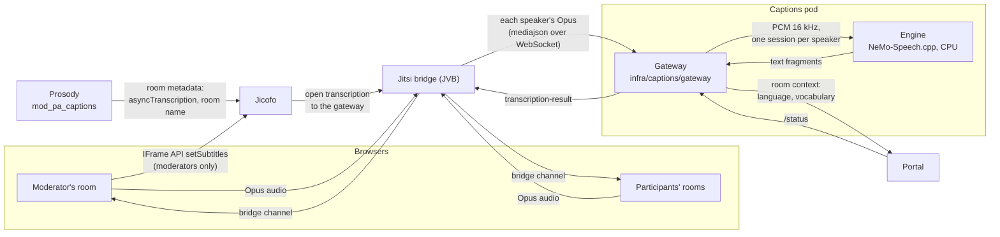

# Live captions

While an event runs, the room shows what each person is saying, as captions over the video. Speech is transcribed inside the installation, on CPU, by a streaming recognizer; no audio or text leaves the cluster and nothing is stored. This page explains how the pieces fit, how to turn captions on and off, how the service protects itself under load, and how to size it. The decision and the alternatives that were rejected are in [ADR-018](../adr/018-live-captions.md).

This page is for operators who install or size the service and for developers who change it.

## How it works

1. **Prosody marks the room.** When the service is installed, the project's module `mod_pa_captions` sets two room metadata keys at creation: `asyncTranscription`, which clients cannot set, and `transcription.urlParams.room`, the room name. Nothing is transcribed yet.
2. **The moderator's room turns it on.** If captions are on for the event, the room page of each moderator sends the IFrame API command `setSubtitles` after joining. Jitsi writes `recording.isTranscribingEnabled` into the room metadata; only a moderator's token, which carries the `transcription` feature, may do it.
3. **Jicofo connects the bridge.** Jicofo builds the service URL from its template (`jicofo.transcription.url-template`, with the meeting id and, from Jitsi stable-10978, the room name as a query parameter) and tells the bridge to open it.
4. **The bridge streams speakers.** The bridge sends the Opus audio of every participant whose microphone is on, pauses included; a muted microphone sends nothing.
5. **The gateway transcribes.** For each speaker it decodes Opus to 16 kHz mono PCM, finds the stretches with voice, sends only those to an engine session opened with the room's language and vocabulary, and turns the engine's fragments into captions. Silence on an open microphone costs no engine time.
6. **Every room shows the captions.** The bridge relays each `transcription-result` to all participants. The room receives it through the IFrame API event `transcriptionChunkReceived`, resolves the speaker's display name from the endpoint id, and draws it over the video (`app/src/components/live/live-captions.tsx`).

Turning captions off during the event (the **Automatic captions** switch in the control room) sends `setSubtitles` with `false`, which stops the transcription for the room.

Jitsi treats transcription as a kind of recording: when it starts or stops, every client plays the spoken "recording on/off" announcement and the IFrame API reports a recording status change. Nothing is recorded, so once captions are on in a room, from the start or turned on later, the room turns those two sounds off for the rest of the session (`disabledSounds`); it never takes a "stopped" status it has not seen start as the end of a recording. During a real recording Jitsi skips the sounds by itself while transcription is on, and the room shows its own recording notice.

## Turning captions on and off

| Level | Where | Default | Effect |
|---|---|---|---|
| Installation | Helm: `global.captions.enabled` | `true` | Renders the captions pod, the Prosody module setting and Jicofo's URL template, and gives the portal `CAPTIONS_STATUS_URL`. Without it the portal never tries to start captions. |
| Instance | **Settings → Features → Live captions** (`SiteSetting.liveCaptionsEnabled`) | on | Off, no event starts captions and the scaler keeps the service at zero. On, the scaler keeps it up while any event is live or starting, also when a moderator turns captions off in the room, so that turning them back on is immediate. |
| Event | `Event.liveCaptionsEnabled`: **Automatic captions** in the event wizard (advanced settings, room features) and in event templates, and switched live from the control room | on | Off, the room's moderators stop the transcription. The wizard and the templates show the switch only where captions are available on the instance. |
| Viewer | **Captions** button in the Jitsi toolbar | shown | Hides the captions for that viewer only; the icon is crossed out while they are hidden, and the choice is kept in the browser. |

Captions start only when a moderator is in the room: speakers and participants cannot start them.

## The gateway

The gateway (`infra/captions/gateway`) is a small Node service with no state outside memory. Its behavior is set by environment variables, listed in `src/config.ts`; the chart sets them from `captions.*` values.

- **Protocol.** It speaks the bridge's "mediajson" format: `start` for each audio source, `media` with one RTP Opus payload in base64, `ping` (answered with `pong`) and `session-end`. Results carry both `event` and `type` set to `transcription-result`, because the bridge reads one and the Jitsi client the other.
- **Voice.** Each 20 ms frame counts as voice when its level is above both `CAPTIONS_VAD_MIN_DBFS` (−55 dBFS, between −100 and −20) and the speaker's noise floor plus `CAPTIONS_VAD_MARGIN_DB` (10 dB), capped at −35 dBFS so that a window with no pauses in it does not push the threshold above quiet speech. The noise floor is the lowest level of the last three seconds of audio: speech always has gaps between words, steady noise does not, so a fan or a murmur does not keep a sentence open. A sentence starts after 60 ms of continuous voice, so a single click or the first frame of a noisy microphone does not open an engine session; the 300 ms before it go to the engine too, because they hold the start of the first syllable. The silence the gateway inserts for lost packets does not count towards the noise floor.
- **Sentences.** The engine's text grows with the speech, punctuation included, and is settled when the sentence is closed. A caption grows until the speaker pauses: with no voice for `CAPTIONS_PAUSE_GAP_MS` (900 ms by default), as silence on an open microphone or as no packets, the gateway closes the sentence on the engine and sends it as final. A caption longer than `CAPTIONS_MAX_CHARS` is split at the end of a sentence, a clause or a word. Interim updates are sent at most every `CAPTIONS_INTERIM_INTERVAL_MS`, and always contain the whole sentence so far.
- **Lead-in silence.** The engine receives no pauses, so a sentence after a pause reaches it with no silence before it. When speech starts in the first milliseconds of a session, the model loses the first word and, for the whole sentence, capitals and punctuation. The gateway puts 300 ms of silence before each new sentence.
- **Vocabulary.** For each room it asks the portal (`/api/internal/captions/context`, authenticated with the internal API key) for the language and the vocabulary: glossary terms of the instance and of the event, the organizers, the moderators and the speakers. Phrases bias the engine at weight `CAPTIONS_BOOST` (0.5); glossary aliases are replaced by their term in the text. The language is the instance's default language when the model transcribes it, and automatic detection otherwise.
- **Authentication.** If `global.captions.bridgeToken` is set, Jicofo sends it in the `X-Captions-Token` header and the gateway refuses connections without it. With the chart's NetworkPolicy on, only the bridge and the portal can reach the service.
- **Logs.** No transcript and no name is ever logged.

## Load governance and status

The gateway measures, for every fragment, the delay between sending a piece of audio and receiving its text, and keeps the 95th percentile over ten seconds.

| State | When | What the gateway does |
|---|---|---|
| `ok` | delay below `CAPTIONS_DEGRADE_LAG_MS` (1.5 s) | Up to `CAPTIONS_MAX_STREAMS` speakers at once. Beyond that, a new speaker takes the place of the one silent for longest. |
| `degraded` | delay above 1.5 s | Half the speakers, those who spoke most recently. |
| `paused` | delay above `CAPTIONS_PAUSE_LAG_MS` (3 s) for five seconds | No transcription for `CAPTIONS_PAUSE_COOLDOWN_MS` (60 s), doubling at each relapse up to `CAPTIONS_MAX_PAUSE_MS`; then it tries again. |
| `unavailable` | the engine does not answer | No transcription; the gateway checks the engine every two seconds until it is back. |

`GET /status` on the gateway returns the state, the delay, the number of speakers transcribed and the limit, with no personal data. The portal reads it (`app/src/lib/status/captions.ts`) and shows it:

- on the status page, as the **Live captions** node of the infrastructure map, which also says when the service is on standby (no live event uses captions) or starting;
- in the room, as a short notice over the video when captions are paused or unavailable (`/api/status/captions`).

Audio and video never depend on the captions service: a paused or failed service only means no captions.

## Sizing and placement

Measured with `infra/captions/bench/` on a desktop CPU (AMD Ryzen 9 7900), with budgets simulated by confining the engine to hardware threads, Italian speech at real-time pace, 320 ms chunks. A point "holds" when the processing delay stays at or below half a second without drifting.

| CPU budget | Simultaneous speakers that hold | CPU used |
|---|---|---|
| 2 vCPU | 2 | about 1.3 cores |
| 4 vCPU | 4 | about 2.2 cores |
| 8 vCPU | 4 with margin, 8 to 12 at the limit | about 3.2 cores at 4 speakers |

The engine uses about 1 GB of memory, a little more with more speakers. A cloud vCPU is slower than a desktop core: measure on the node type you use with the Job in `infra/captions/bench/job.example.yaml`, and set `captions.engine.threads`, `captions.maxStreams` and the pod's CPU limit together.

In a webinar people speak one at a time, and the bridge sends only the audio of those who speak: the default of four threads and four speakers covers a panel of four or five people with margin.

The service runs where `captions.nodeSelector` and `captions.tolerations` place it, by default with the application. Keep it off the bridges' nodes unless they have cores to spare: while someone speaks the engine uses its CPU continuously, and a lost audio packet costs more than a late caption.

The chart values are commented in `infra/helm/pa-webinar/values.yaml` under `global.captions` and `captions`:

- `global.captions.enabled` is the single switch, read by this chart and by the Jitsi subchart (which sees only `global`);
- `global.captions.bridgeToken` is the secret the bridge presents; it travels in Jicofo's JVM options and therefore sits in Jicofo's ConfigMap;
- `captions.model.url` and `captions.model.sha256` say where the model comes from; an installation without Internet access points the URL to a mirror with the same file;
- `networkPolicy.captions.extraIngressRules` and `extraEgressRules` open the captions pod to a bridge on the host network or to an in-cluster mirror.

- `captions.modelVolume` replaces the temporary volume the model is downloaded into: with a volume that outlives the pod, such as a persistent volume claim, the download is skipped when the file is already there with the right checksum, and the pod is updated with the `Recreate` strategy.

Turning captions on or off changes Prosody's and Jicofo's configuration, which restart: do it with no conference running. With `--reuse-values`, an upgrade from a release without captions does not pick up `global.captions.enabled: true`, and captions stay off until the value is passed. Without `captions.modelVolume` the model is downloaded again at every start of the pod (about 750 MB), which with the scaler means at the start of each live window.

The gateway's readiness is the process answering, not the engine: the pod joins the Service only once the engine has started, and if the engine fails later the gateway stays reachable and reports `unavailable`.

## Privacy

While captions are on, the voice of everyone who speaks is processed by the service, inside the installation. The text exists only in the participants' browsers while it is on screen; the service keeps nothing, and logs neither text nor names. The waiting room tells participants before they enter. The vocabulary the service receives contains the names of the event's organizers, moderators and speakers, and never data of registered participants. See [Privacy and data protection](../GDPR.md).

## Known limitations

- **A moderator must be in the room.** Captions are turned on by a moderator's room page; a room with only speakers and participants has none. Before Jitsi stable-10978, Jicofo puts a conference on the bridge only from two participants: a moderator alone is captioned once someone else joins.
- **A restart of the service during a conference.** On Jitsi stable-10741 the bridge tries to reconnect once; if the service is not back yet, transcription resumes only when a moderator turns captions off and on again, or joins again.
- **The "recording" announcements of Jitsi.** A participant whose room learns that captions were turned on only after transcription has started (the room falls back to polling when the push channel is unavailable) can hear Jitsi's "recording is on" once. Once captions have been on in a room, Jitsi's spoken recording announcements stay off for that session, also for a real recording started after captions are turned off; the room's own recording notice is unaffected.
- **Numbers come out in words.** The engine has no inverse text normalization for Italian.
- **Language.** The model transcribes 18 of the 24 interface languages; for Greek, Irish, Latvian, Lithuanian, Maltese and Slovenian the service falls back to automatic detection, which does not transcribe them reliably.
- **Room name on older Jitsi.** Before stable-10978 the bridge does not pass the room name: the service uses the instance's language and glossary, and cannot tell which event a room belongs to.
- **Accuracy is measured on read speech.** Spontaneous speech in a meeting, with overlapping voices and poor microphones, is harder; the accuracy in real events is still to be measured.
