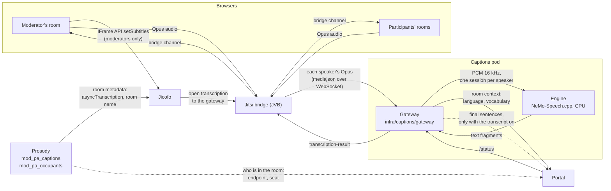
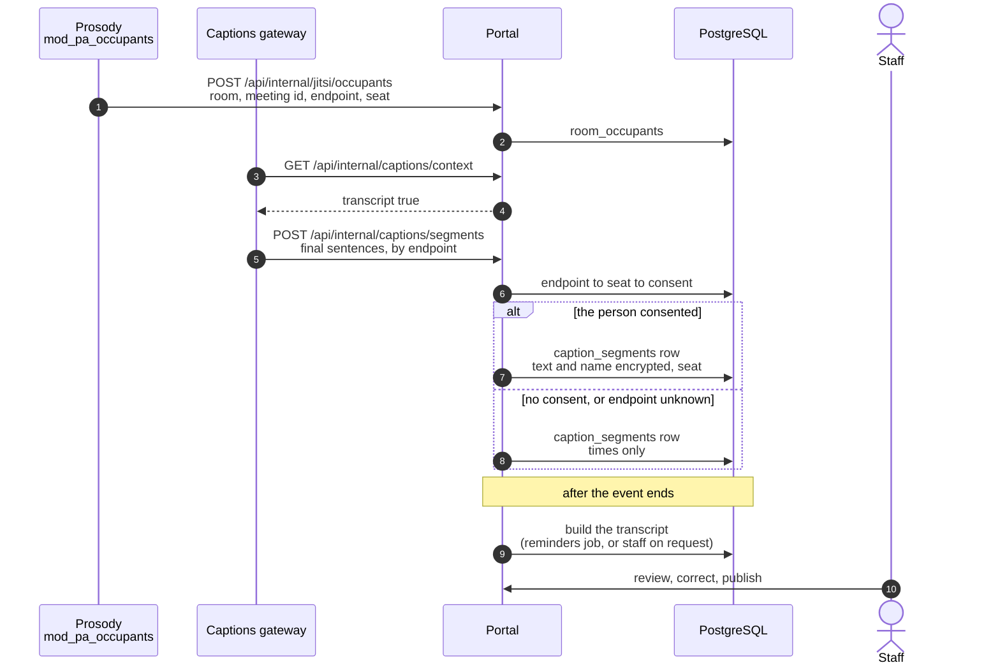

# Live captions

While an event runs, the room shows what each person is saying, as captions over the video. Speech is transcribed inside the installation, on CPU, by a streaming recognizer; no audio or text leaves the cluster. By default no caption text is stored. An event can instead keep a transcript built from its captions, with the sentences of the people who consented to the transcription of what they say ([Transcript from captions](#transcript-from-captions)). This page explains how the pieces fit, how to turn captions on and off, how the service protects itself under load, how the transcript is built, and how to size the service. The decision and the alternatives that were rejected are in [ADR-018](../adr/018-live-captions.md).

This page is for operators who install or size the service and for developers who change it.

## How it works

The dashed arrows tell the portal who is behind each voice and, when the event keeps a transcript, carry its sentences: see [Transcript from captions](#transcript-from-captions).

1. **Prosody marks the room.** When the service is installed, the project's module `mod_pa_captions` sets two room metadata keys at creation: `asyncTranscription`, which clients cannot set, and `transcription.urlParams.room`, the room name. Nothing is transcribed yet.
2. **The moderator's room turns it on.** If captions are on for the event, the room page of each moderator sends the IFrame API command `setSubtitles` after joining. Jitsi writes `recording.isTranscribingEnabled` into the room metadata; only a moderator's token, which carries the `transcription` feature, may do it.
3. **Jicofo connects the bridge.** Jicofo builds the service URL from its template (`jicofo.transcription.url-template`, with the meeting id and, from Jitsi stable-10978, the room name as a query parameter) and tells the bridge to open it.
4. **The bridge streams speakers.** The bridge sends the Opus audio of every participant whose microphone is on, pauses included; a muted microphone sends nothing.
5. **The gateway transcribes.** For each speaker it decodes Opus to 16 kHz mono PCM, finds the stretches with voice, sends only those to an engine session opened with the room's language and vocabulary, and turns the engine's fragments into captions. Silence on an open microphone costs no engine time.
6. **Every room shows the captions.** The bridge relays each `transcription-result` to all participants. The room receives it through the IFrame API event `transcriptionChunkReceived`, resolves the speaker's display name from the endpoint id, and draws it over the video (`app/src/components/live/live-captions.tsx`).

Turning captions off during the event (the **Automatic captions** switch in the control room) sends `setSubtitles` with `false`, which stops the transcription for the room.

Jitsi treats transcription as a kind of recording: when it starts or stops, every client plays the spoken "recording on/off" announcement and the IFrame API reports a recording status change. Nothing is recorded, so once captions are on in a room, from the start or turned on later, the room turns those two sounds off for the rest of the session (`disabledSounds`); it never takes a "stopped" status it has not seen start as the end of a recording. During a real recording Jitsi skips the sounds by itself while transcription is on, and the room shows its own recording notice.

## Turning captions on and off

| Level | Where | Default | Effect |
|---|---|---|---|
| Installation | Helm: `global.captions.enabled` | `true` | Renders the captions pod, the Prosody module setting and Jicofo's URL template, and gives the portal `CAPTIONS_STATUS_URL`. Without it the portal never tries to start captions. |
| Instance | **Settings → Features → Live captions** (`SiteSetting.liveCaptionsEnabled`) | on | Off, no event starts captions and the scaler keeps the service at zero. On, the scaler keeps it up while any event is live or starting, also when a moderator turns captions off in the room, so that turning them back on is immediate. |
| Event | `Event.liveCaptionsEnabled`: **Automatic captions** in the event wizard (advanced settings, room features) and in event templates, and switched live from the control room | on | Off, the room's moderators stop the transcription. The wizard and the templates show the switch only where captions are available on the instance. |
| Viewer | **Captions** button in the Jitsi toolbar | shown | Hides the captions for that viewer only; the icon is crossed out while they are hidden, and the choice is kept in the browser. |

Captions start only when a moderator is in the room: speakers and participants cannot start them.

## The gateway

The gateway (`infra/captions/gateway`) is a small Node service with no state outside memory. Its behavior is set by environment variables, listed in `src/config.ts`; the chart sets them from `captions.*` values.

- **Protocol.** It speaks the bridge's "mediajson" format: `start` for each audio source, `media` with one RTP Opus payload in base64, `ping` (answered with `pong`) and `session-end`. Results carry both `event` and `type` set to `transcription-result`, because the bridge reads one and the Jitsi client the other.
- **Voice.** Each 20 ms frame counts as voice when its level is above both `CAPTIONS_VAD_MIN_DBFS` (−55 dBFS, between −100 and −20) and the speaker's noise floor plus `CAPTIONS_VAD_MARGIN_DB` (10 dB), capped at −35 dBFS so that a window with no pauses in it does not push the threshold above quiet speech. The noise floor is the lowest level of the last three seconds of audio: speech always has gaps between words, steady noise does not, so a fan or a murmur does not keep a sentence open. A sentence starts after 60 ms of continuous voice, so a single click or the first frame of a noisy microphone does not open an engine session; the 300 ms before it go to the engine too, because they hold the start of the first syllable. The silence the gateway inserts for lost packets does not count towards the noise floor.
- **Sentences.** The engine's text grows with the speech, punctuation included, and is settled when the sentence is closed. A caption grows until the speaker pauses: with no voice for `CAPTIONS_PAUSE_GAP_MS` (900 ms by default), as silence on an open microphone or as no packets, the gateway closes the sentence on the engine and sends it as final. A caption longer than `CAPTIONS_MAX_CHARS` is split at the end of a sentence, a clause or a word. Interim updates are sent at most every `CAPTIONS_INTERIM_INTERVAL_MS`, and always contain the whole sentence so far.
- **Lead-in silence.** The engine receives no pauses, so a sentence after a pause reaches it with no silence before it. When speech starts in the first milliseconds of a session, the model loses the first word and, for the whole sentence, capitals and punctuation. The gateway puts 300 ms of silence before each new sentence.
- **Vocabulary.** For each room it asks the portal (`/api/internal/captions/context`, authenticated with the internal API key) for the language and the vocabulary: glossary terms of the instance and of the event, the organizers, the moderators and the speakers. The request carries the room name, when the bridge passes it, and the meeting id, which the bridge always passes; the portal finds the event from the room name or, failing that, from the meeting id that Prosody reported when someone joined (`app/src/lib/captions/room.ts`). Phrases bias the engine at weight `CAPTIONS_BOOST` (0.5); glossary aliases are replaced by their term in the text. The language is the instance's default language when the model transcribes it, and automatic detection otherwise. The same answer says whether the event keeps a transcript (`transcript`).
- **Transcript.** When the room's context says `transcript: true`, the gateway also posts every final sentence to the portal ([Transcript from captions](#transcript-from-captions)). Otherwise the text goes only to the bridge.
- **Authentication.** If `global.captions.bridgeToken` is set, Jicofo sends it in the `X-Captions-Token` header and the gateway refuses connections without it. With the chart's NetworkPolicy on, only the bridge and the portal can reach the service.
- **Logs.** No transcript and no name is ever logged.

## Load governance and status

The gateway measures, for every fragment, the delay between sending a piece of audio and receiving its text, and keeps the 95th percentile over ten seconds.

| State | When | What the gateway does |
|---|---|---|
| `ok` | delay below `CAPTIONS_DEGRADE_LAG_MS` (1.5 s) | Up to `CAPTIONS_MAX_STREAMS` speakers at once. Beyond that, a new speaker takes the place of the one silent for longest. |
| `degraded` | delay above 1.5 s | Half the speakers, those who spoke most recently. |
| `paused` | delay above `CAPTIONS_PAUSE_LAG_MS` (3 s) for five seconds | No transcription for `CAPTIONS_PAUSE_COOLDOWN_MS` (60 s), doubling at each relapse up to `CAPTIONS_MAX_PAUSE_MS`; then it tries again. |
| `unavailable` | the engine does not answer | No transcription; the gateway checks the engine every two seconds until it is back. |

`GET /status` on the gateway returns the state, the delay, the number of speakers transcribed and the limit, with no personal data. The portal reads it (`app/src/lib/status/captions.ts`) and shows it:

- on the status page, as the **Live captions** node of the infrastructure map, which also says when the service is on standby (no live event uses captions) or starting;
- in the room, as a short notice over the video when captions are paused or unavailable (`/api/status/captions`).

Audio and video never depend on the captions service: a paused or failed service only means no captions.

## Transcript from captions

**Transcript from captions** (`Event.captionsTranscriptEnabled`, off by default) keeps what was said at the event as its transcript, built from the captions. The event wizard shows it under **Automatic captions**, where captions are available, and the new-event questions turn it on when the answer to **Do you want to be able to record?** is yes. It needs neither a recording nor AI post-production. It keeps only the sentences of the people who consented to the transcription of what they say, and it works only while captions run: the service installed, and captions on for the instance and for the event.

1. **Who is behind each voice.** The captions service knows only the bridge endpoint of each voice. The project's Prosody module `mod_pa_occupants` tells the portal, at every join and leave of an occupant who entered with a token, the room, the meeting id, the endpoint (the resource of the occupant's nickname in the room, the id the bridge uses for that person's audio) and the seat of the token (`context.user.id` of the JWT). The portal receives it through `POST /api/internal/jitsi/occupants` and stores it in `room_occupants` (`RoomOccupant`) for every event of an installation where live captions are available (the captions service is installed, `CAPTIONS_STATUS_URL`, and the site setting `liveCaptionsEnabled` is on), whatever the event's own captions switch, which can be turned on during the event, and for every event with per-participant recording. People who joined before captions or the transcript were turned on are therefore still attributed, and the meeting id leads to the event. Otherwise, and for a room that belongs to no event, it stores nothing. The module sends no name and no address, and occupants without a token, such as Jicofo or a recorder signed in on the hidden domain, are not reported. It acts only when Prosody's environment has `PA_PORTAL_URL`, which the chart and Docker Compose set, and `JWT_APP_SECRET`, the conference token secret Prosody already holds. Each notification carries its send time and an HMAC-SHA256 signature made with a key derived from that secret; the portal checks it with `JITSI_JWT_SECRET` and refuses notifications more than 300 seconds off (`app/src/lib/auth/prosody-signature.ts`, [Jitsi extras](../../infra/jitsi/README.md#the-occupants-module)). The same records let the [multitrack recorder](recording.md#consent-gates) record only the voices of people who consented.
2. **The gateway sends the final sentences.** The portal's context answer carries `transcript: true` when the event has both captions and the transcript on. Only then does the gateway post each final sentence, with its endpoint, text, language, start and end times and an id, to `POST /api/internal/captions/segments`, with the internal API key (`infra/captions/gateway/src/transcript.ts`). Before it queues a sentence, the gateway fits it to the portal's limits: the text is trimmed and cut to 2000 characters, a sentence left empty or with an id or endpoint longer than the portal accepts is dropped, and a language tag of the wrong length is left out, so one bad sentence never makes the portal reject a batch. Sentences leave in batches, every two seconds or every 20 sentences. When the portal does not answer, answers with a server error, or answers `401`, `403`, `404`, `408` or `429` (a key not yet in place, a portal not yet updated, a timeout, a rate limit), the sentences stay queued and are retried; each conference keeps at most 500 waiting sentences in memory, and drops the oldest beyond that, so the room never waits for the portal. A batch refused with any other `4xx`, such as invalid data, is dropped. Nothing is written to disk or to the logs, and the gateway sends what is waiting before it stops. The address is `CAPTIONS_SEGMENTS_URL`; when it is empty, the context address with `segments` in place of its last segment (`…/captions/context` becomes `…/captions/segments`).
3. **The portal keeps the text only of those who consented.** For each endpoint it looks up the seat in `room_occupants`, then the consent behind the seat (`app/src/lib/captions/room.ts`). For a registrant's seat (`reg-<registrationId>-…`) that is the consent given at registration (`Registration.consentMultitrack`) or in the waiting room (`MultitrackConsent`); for any other seat (a moderator, a speaker, a guest, a personal link opened in another browser), the waiting-room consent stored for that seat. Only a consent given with the version of the text that covers the transcription of one's contributions with one's name counts (`VERSIONE_TESTO_TRASCRIZIONE` in `app/src/lib/registration/consents.ts`, stored as `Registration.consentMultitrackVersion` and `MultitrackConsent.textVersion`); an earlier consent, which covered only the per-person audio track, does not, and the waiting room asks that registrant again. With consent, the sentence is stored with its text and the speaker's name, both encrypted with `PII_ENCRYPTION_KEY`, and with the seat; the name is the one given with the consent in the waiting room, or else the registration's. Without consent, or when the endpoint is unknown, the row keeps only the endpoint, the language and the times: no text, no name and no seat. Rows are in `caption_segments` (`CaptionSegment`), and a sentence sent twice is stored once. The route stores nothing for an event whose captions or transcript are off, including when a switch is turned off during the event.
4. **The transcript is built after the event** (`app/src/lib/captions/transcript.ts`). The reminders job (`/api/cron/reminders`) looks at `ENDED` events of the last seven days that keep a transcript and have saved sentences. It builds the transcript once no sentence has arrived for two minutes, builds it again when sentences arrived after the last build, and moves it to the recording with video when that recording appears after the build, deleting the recording without media that held it. Staff can build or update it from the event page. Neither the job nor staff can build it once the event's data retention has ended (the result is `scaduta`, and the panel says so), so that a rebuild cannot bring back what the GDPR cleanup removes. The sentences become a `TRANSCRIPT_JSON` artifact with the model id `live-captions`, in the same shape as an AI transcript, with one speaker label (`SPEAKER_00`, `SPEAKER_01`, …) per person, named after them. Every entry into the room gets a new conference seat, so sentences are grouped by registration for a registrant's seats (`reg-<registrationId>-…`) and by the name entered for any other seat: a person who reconnects keeps the same label. For each registrant speaker, the transcript's encrypted body also keeps the registration id, so that an erasure request can remove that person later. While the AI pipeline is transcribing a recording of the event (a transcription job pending, claimed or running), no transcript from captions is built or moved: the result is `ai-in-corso`, and the admin panel and the recording page say that the AI transcript will take its place. If the AI job fails, a later pass builds it. Otherwise the artifact goes on the event's recording with media: a file, or the per-participant tracks once their manifest has given the start of the media. An event without one gets a recording with no media file (empty `blobKey`, status `POSTPROD_DONE`) that holds only the transcript. On a recording with video its times count from the same zero the pipeline uses (`recordingTimeZero` in `app/src/lib/postprod/live-timeline.ts`: the start of the media, the recording start journaled by the room, or the recording's creation minus its duration), and a recording without a source language gets the transcript's. The transcript is stored in the database, encrypted, with no file in object storage, and no subtitle track is made from it.
5. **It never replaces better text.** No build happens while any recording of the event carries an AI transcript or a transcript corrected by hand. The builder checks it, and reads the sentences, under a per-event database lock, which the registration of an AI transcript and an erasure request for the same event also take, so a build never overlaps an AI upload or undoes an erasure. An AI run on the same recording later replaces the transcript from captions, and the captions transcript's speaker labels, with their names, are deleted before the AI's are written (`app/src/app/api/internal/postprod-artifact/route.ts`). When an AI transcript is registered for any recording of the event, the event's recordings without media whose transcript from captions was not corrected by hand are deleted. The AI pipeline is never queued for a recording without media: the enqueue does nothing, and **Generate AI** and **Re-run** answer `400`. On a recording whose transcript from captions was corrected by hand, the automatic enqueue (recording webhook, track manifest, lifecycle) does nothing, and **Generate AI** (for the recording or for the event) and **Re-run** answer `409`, because the AI transcript would replace the corrections. **Generate AI** for the event acts on its latest recording with a media file.
6. **Review and publication.** The **After the event** tab of the event page has a **Transcript from captions** panel, for the staff who manage the event (`GET` and `POST /api/admin/events/{id}/captions-transcript`): how many sentences were saved, from how many people (counted as the transcript groups them), and how many were not saved for lack of consent; **Build the transcript** or **Update from captions**, once the event has ended and unless the transcript comes from AI or was corrected by hand; **Open in the editor**; and **Publish the transcript on the event page** (`Event.transcriptPublished`, off by default). The recording page works without audio: it has no player, and offers **Update from captions** instead of **Generate AI** and **Re-run**; when the update moves the transcript to the recording with video, the page goes to that recording. Corrections, speaker names and erasure work as for AI transcripts ([AI post-production](../POSTPROD.md#administration)).
7. **On the event page.** The transcript is public when the post-event page is public and either the video (`recordingPublished`) or the transcript (`transcriptPublished`) is published (`app/src/lib/ai/access.ts`). When only the transcript is published, or the AI pipeline is switched off for the instance, only the transcript text in its source language is served: no subtitles, translations, summaries or dubbing, and the downloads offer only `.txt` and `.srt`. The public page and the downloads take, in order: the latest recording with an AI transcript and completed post-production; else the recording with the transcript from captions, the one with video first; else the latest recording with completed post-production. With the AI pipeline off, only a transcript built from captions is served, never an AI transcript. Downloads are named with the transcript's own language. The page shows the transcript tab even without a video, and its notice says that the text comes from the live event's automatic captions and includes only the people who consented.

## Sizing and placement

Measured with `infra/captions/bench/` on a desktop CPU (AMD Ryzen 9 7900), with budgets simulated by confining the engine to hardware threads, Italian speech at real-time pace, 320 ms chunks. A point "holds" when the processing delay stays at or below half a second without drifting.

| CPU budget | Simultaneous speakers that hold | CPU used |
|---|---|---|
| 2 vCPU | 2 | about 1.3 cores |
| 4 vCPU | 4 | about 2.2 cores |
| 8 vCPU | 4 with margin, 8 to 12 at the limit | about 3.2 cores at 4 speakers |

The engine uses about 1 GB of memory, a little more with more speakers. A cloud vCPU is slower than a desktop core: measure on the node type you use with the Job in `infra/captions/bench/job.example.yaml`, and set `captions.engine.threads`, `captions.maxStreams` and the pod's CPU limit together.

In a webinar people speak one at a time, and the bridge sends only the audio of those who speak: the default of four threads and four speakers covers a panel of four or five people with margin.

The service runs where `captions.nodeSelector` and `captions.tolerations` place it, by default with the application. Keep it off the bridges' nodes unless they have cores to spare: while someone speaks the engine uses its CPU continuously, and a lost audio packet costs more than a late caption.

The chart values are commented in `infra/helm/pa-webinar/values.yaml` under `global.captions` and `captions`:

- `global.captions.enabled` is the single switch, read by this chart and by the Jitsi subchart (which sees only `global`);
- `global.captions.bridgeToken` is the secret the bridge presents; it travels in Jicofo's JVM options and therefore sits in Jicofo's ConfigMap;
- `captions.model.url` and `captions.model.sha256` say where the model comes from; an installation without Internet access points the URL to a mirror with the same file;
- `networkPolicy.captions.extraIngressRules` and `extraEgressRules` open the captions pod to a bridge on the host network or to an in-cluster mirror.

- `captions.modelVolume` replaces the temporary volume the model is downloaded into: with a volume that outlives the pod, such as a persistent volume claim, the download is skipped when the file is already there with the right checksum, and the pod is updated with the `Recreate` strategy.

Turning captions on or off changes Prosody's and Jicofo's configuration, which restart: do it with no conference running. With `--reuse-values`, an upgrade from a release without captions does not pick up `global.captions.enabled: true`, and captions stay off until the value is passed. Without `captions.modelVolume` the model is downloaded again at every start of the pod (about 750 MB), which with the scaler means at the start of each live window.

The gateway's readiness is the process answering, not the engine: the pod joins the Service only once the engine has started, and if the engine fails later the gateway stays reachable and reports `unavailable`.

## Privacy

While captions are on, the voice of everyone who speaks is processed by the service, inside the installation, and every viewer sees the captions of every speaker. The service keeps no audio and no text on disk, and logs neither text nor names.

- **Without the transcript from captions**, the text exists only in the participants' browsers while it is on screen. The waiting room says so before people enter (`waiting.captionsNotice`).
- **With it**, the gateway sends every final sentence to the portal, which stores the text, with the speaker's name, only for the people who consented to the transcription of what they say, and keeps for everyone else only when a voice spoke. The consent is optional and never pre-ticked. It is asked at registration and in the waiting room of everyone who has not given it, moderators and speakers included, and refusing it does not keep anyone out. The waiting room says that the text is kept, with the name, only for those who consented (`waiting.captionsNoticeTranscript`).
- **Who is in the room** (`room_occupants`) is recorded for every event of an installation where live captions are available and on for the instance, whatever the event's own captions switch and whether or not the event keeps a transcript, and for every event with per-participant recording: the bridge endpoint and the conference seat of each occupant, with the meeting id and join and leave times, and no name. For other events nothing is stored.
- **Retention.** The occupant rows and the stored sentences are deleted by the GDPR cleanup at the event's retention. Erasure of a registration deletes those of its conference seats and removes the person's sentences, name and speaker entry from the transcript already built, in its published text and in the original text kept at the first correction; a transcript left empty is deleted. The transcript goes at retention too, unless the event's video or transcript is published: a recording that holds only the transcript is deleted with it, and from a recording with video only the transcript and its speaker labels are removed. A published transcript stays while it, or the video, stays published ([Recordings, voice data and AI outputs](../privacy/recordings-and-ai.md#transcript-from-live-captions)).

The vocabulary the service receives contains the names of the event's organizers, moderators and speakers, and never data of registered participants. See [Privacy and data protection](../GDPR.md).

## Known limitations

- **A moderator must be in the room.** Captions are turned on by a moderator's room page; a room with only speakers and participants has none. Before Jitsi stable-10978, Jicofo puts a conference on the bridge only from two participants: a moderator alone is captioned once someone else joins.
- **A restart of the service during a conference.** On Jitsi stable-10741 the bridge tries to reconnect once; if the service is not back yet, transcription resumes only when a moderator turns captions off and on again, or joins again.
- **The "recording" announcements of Jitsi.** A participant whose room learns that captions were turned on only after transcription has started (the room falls back to polling when the push channel is unavailable) can hear Jitsi's "recording is on" once. Once captions have been on in a room, Jitsi's spoken recording announcements stay off for that session, also for a real recording started after captions are turned off; the room's own recording notice is unaffected.
- **Numbers come out in words.** The engine has no inverse text normalization for Italian.
- **Language.** The model transcribes 18 of the 24 interface languages; for Greek, Irish, Latvian, Lithuanian, Maltese and Slovenian the service falls back to automatic detection, which does not transcribe them reliably.
- **Room name on older Jitsi.** Before stable-10978 the bridge does not pass the room name. The portal then finds the event from the meeting id that `mod_pa_occupants` reported; without that module the service uses the instance's language and glossary, cannot tell which event a room belongs to, and no transcript is kept.
- **Voices are matched through Prosody.** Without `mod_pa_occupants` active (an external Jitsi, or a Prosody without `PA_PORTAL_URL` or `JWT_APP_SECRET`), the portal cannot tell whose voice a sentence is: the transcript keeps no text, and the multitrack recorder records no track.
- **Speakers on shared or guest seats are told apart by name.** Outside registrations, two people who enter the same name share one speaker label, and one person who changes name between entries gets two. Staff can reassign the lines in the editor.
- **Accuracy is measured on read speech.** Spontaneous speech in a meeting, with overlapping voices and poor microphones, is harder; the accuracy in real events is still to be measured.
