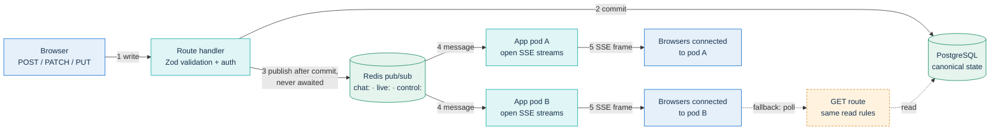
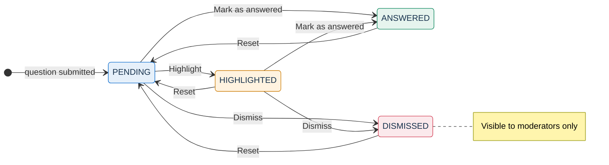
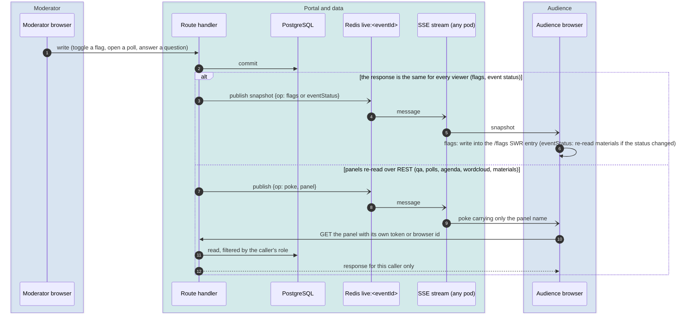
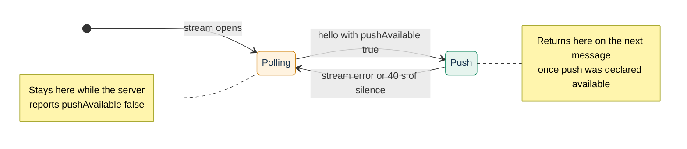

# Live interaction and realtime

This page covers everything that happens beside the video during a live event: chat, Q&A, polls, word cloud, agenda, materials, reactions, timer, the raised-hand queue and post-event feedback. It explains who may read and write each feature and how a change reaches every open browser. It also covers what happens when Redis is missing.

It is written for developers who add or change a live feature, and for operators who run the Redis tier.

Related pages: the decision record is [ADR-005](../adr/005-live-interaction-in-portal.md). The credentials behind "moderator", "speaker" and "registrant" are defined in [identity-and-access.md](identity-and-access.md). Rate limits and the CSRF stance are in [security.md](security.md). Retention and deletion of interaction data are in [GDPR.md](../GDPR.md). The waiting-room square and its `garden:` channel are in [waiting-room.md](waiting-room.md).

## Principle: PostgreSQL holds the state, Redis fans it out

Interaction data belongs to the portal, not to Jitsi's XMPP layer ([ADR-005](../adr/005-live-interaction-in-portal.md)). Every feature follows the same path:

1. A browser calls a route handler under `app/src/app/api/events/[param]/`. The handler validates the body with Zod and checks the caller's credential.
2. The handler writes to PostgreSQL. That row is the only copy of the state.
3. After the commit, the handler publishes a message on the event's Redis channel. It fires the publish without awaiting it, so a slow or missing Redis never fails a write.
4. Every app pod that holds an open Server-Sent Events (SSE) stream for that event receives the message and forwards it to its browsers.

Redis stores no interaction state. Losing a Redis message costs latency, never data, because the next read goes to PostgreSQL. Push is the primary path. Polling stays underneath as the fallback.

Two features do not follow this principle: the presentation timer and the counters of the app's reaction bar keep their state in the memory of one app process. See [Known limitations](#known-limitations).

## Feature catalog

In this page, **moderator** means a caller holding the event's primary moderator link or a non-revoked named grant with role `MODERATOR`. Speakers (named grant with role `SPEAKER`) never pass a moderator check. **Registrant** means a caller holding the `accessToken` of a `Registration` for this event. A **browser id** is a random identifier the room stores in `localStorage`, under one key per role (`paw_guest_id`, `paw_speaker_voter_id`, `paw_moderator_voter_id`), so a moderator who previews the room as a guest in the same browser does not carry over the moderator's votes. The poll and word-cloud panels and Q&A upvotes use it for everyone without a registration (guests, speakers and moderators); Q&A questions, agenda reactions and the post-event rating send it only for guests.

| Feature | Stored in | Who writes | Who reads | How a change reaches the room |
|---|---|---|---|---|
| Chat | `ChatMessage`, `ChatMessageReaction` | Members and guests in the guest window. Attachments, reactions and edits: members only | Chat read gate | The message itself on `chat:<eventId>` |
| Q&A | `Question`, `QuestionUpvote`, `QuestionGuestUpvote` | Registrants, named-grant holders, guests. Upvotes: registrants, everyone else by browser id. Status: moderators | Panel read rule | Poke `qa` on `live:<eventId>` |
| Polls | `Poll`, `PollVote` | Create, close, publish, delete: moderators. Vote: registrants, everyone else by browser id | Panel read rule | Poke `polls` |
| Word cloud | `WordCloudRound`, `WordCloudSubmission` | Rounds: moderators. Words: registrants, everyone else by browser id | Panel read rule | Poke `wordcloud`, plus a 30 s poll |
| Agenda | `EventAgendaItem`, `AgendaItemReaction` | Items: moderators. **Agree** / **Disagree**: registrants and browser ids | Anyone who knows the event slug | Poke `agenda` |
| Materials | `EventMaterial` | Moderators | Anyone while the event is publicly visible: before the start only `BEFORE`; during the event `ALWAYS` and `DURING`; after it `ALWAYS` and `AFTER`. Every material with a moderator token | Poke `materials`, plus a 120 s poll |
| Reactions (app bar) | Process memory, plus `Reaction` rows for analytics | Anyone who knows the event slug | Anyone who knows the event slug | 5 s poll |
| Timer | Process memory | Moderators | Anyone who knows the event slug | 5 s poll |
| Raised hands | Jitsi. Analytics in `CallSession.handRaiseLog` | Participants in Jitsi. **Lower hand**: moderators | Jitsi roster | Jitsi events, plus `control:<eventId>` |
| Post-event feedback | `EventFeedback`, or a post-event questionnaire | Registrants and browser ids while `LIVE` or `ENDED` | Summary: anyone. Comments: primary moderator link | Not live |
| Live flags | `Event` columns | Moderators | Anyone who knows the event slug | Snapshot `flags` on `live:<eventId>` |

### Who is in the room: the read rules

Q&A, polls and the word cloud share one read rule in `app/src/lib/events/panel-read-access.ts` (`authorizePanelRead`). The word cloud looks the same to every caller who passes it. One rule, not one per panel, is what keeps every panel consistent for the same caller: separate rules drift, and a guest or a speaker who can watch the stream then gets 401 or 403 from one panel and a normal view from another.

| Caller | Recognized by | Q&A view | Polls view |
|---|---|---|---|
| Moderator | Primary moderator link or `MODERATOR` grant (lookup cached a few seconds per pod) | Every status, including `DISMISSED` | Every poll, with live counts |
| Speaker | Non-revoked `SPEAKER` grant for this event | Audience view | Audience view |
| Registrant | Registration `accessToken` for this event | Audience view, with own upvotes | Audience view, with own vote |
| Guest | No token, inside the guest window | Audience view | Audience view |

A token that matches nothing is an error (403), not a silent downgrade to guest. A stale link fails loudly. A request with no token outside the guest window gets 401. An empty `Authorization: Bearer ` header counts as no token, because the room sends an empty token for guests.

The **guest window** is defined once in `app/src/lib/events/guest-window.ts` and shared with the chat. It is open when the event admits guests and the room is open. A scheduled event admits guests only while the site setting `guestAccessEnabled` is on, and an instant call always admits them. The room is open when the event is `LIVE`, or when an instant call is `PROVISIONING` or `IDLE` (the waiting room of an instant call works while the bridge warms up). On a password-protected event, a tokenless reader also needs the join-password grant cookie. That is the same cookie the live page requires before it issues a guest Jitsi token. Knowing the URL is not enough to read the room.

The room token is not a voting identity. Poll votes, word-cloud words and agenda reactions are keyed either by a registration (`accessToken`) or by the browser id. The server looks up `accessToken` only among registrations. A moderator or speaker link sent as `accessToken` is therefore refused, which is why the poll and word-cloud panels send a browser id for those callers. A browser-id vote or word is also gated by `authorizePanelRead` with the caller's bearer token. Deduplication by browser id assumes an honest browser: a room poll is not an election.

The other panels have lighter gates. Agenda, timer, the reaction counters and `GET /flags` answer anyone who knows the event slug. Materials and the `live:` stream require the event to be publicly visible (`isEventPubliclyVisible`). The `control:` stream requires only that the event exists, because it carries opaque Jitsi endpoint ids and nothing else.

### Chat

The chat is the primary audience channel. It is the first drawer tab whenever `chatEnabled` is on.

- **Storage.** One `ChatMessage` row per message. The sender's display name, the body and the attachment filename are encrypted at rest with `encryptPII` (AES-256-GCM, see [security.md](security.md)). Encryption covers storage only: Redis and the SSE stream carry plaintext. The envelope on `chat:<eventId>`, and therefore the stream, carries `senderKey` and never the raw sender id, which for a guest encodes the IP address; the subscriber also strips a raw id that an older pod may still publish during a rolling update (`app/src/lib/chat/pubsub.ts`).
- **Who posts.** Holders of the primary moderator link, named moderator and speaker grants, registrants, and tokenless guests inside the guest window. A guest must supply a display name. Only role `MODERATOR` (and the primary link) gets the moderator badge. Speakers post as ordinary members. On the shared primary link, the author can set a display name, because the server has no per-person name for it.
- **Who reads.** `authorizeChatRead` in `app/src/lib/chat/read-access.ts` gates the history, the stream and the export. A member token grants access in any status, so moderators keep the archive after the event. Tokenless readers get the guest-window rule above, including the password check (the chat answers 403 rather than 401 outside the window or without the password grant). The read side is deliberately stricter than the write side: posting injects one message, reading exposes everyone's.
- **History.** `GET /api/events/{slug}/chat` returns the newest 100 messages by default, up to 500 (`?limit=`), or, with `?since=<ISO timestamp>`, up to the same limit of messages newer than that time, in ascending order. Hidden messages are excluded. Each row carries `senderKey` and server-computed `mine`, `canEdit` and `myReactions`. A seat is shared by several people, so the client cannot work these out itself. `senderKey` is a keyed hash of the sender id (HMAC-SHA-256 with `APP_SECRET`, truncated; plain SHA-256 only where `APP_SECRET` is absent, which only a development setup allows), used only for the bubble color: a plain hash of so little input could be reversed by enumeration (`app/src/lib/chat/sender-key.ts`). The history, the stream and the export all carry the same key, so live and reloaded bubbles share a color. The response also carries `attachmentsEnabled`, true when the installation has files storage.
- **Replies.** A message can quote one earlier, visible message of the same event. A reply whose parent was later hidden shows no quote.
- **Attachments.** Members only (never tokenless guests). One image (PNG, JPEG, WebP, GIF) or PDF of up to 10 MiB per message. The type is checked against the file's magic bytes. The upload route returns a signed token, and `POST /chat` accepts only that token, never a client-supplied URL or metadata. Files are stored under `assets/chat/<eventId>/` and served by `/api/assets`. That route evaluates no authorization: an attachment is protected by an unguessable address, by deletion of the blob on moderation or retention, and by `Cache-Control: private, max-age=60`. Anyone who has the link can open it (see [security.md](security.md#uploaded-files) and the [roadmap](../ROADMAP.md)). Without files storage the panel shows no paperclip and ignores pasted files: it offers attachments only after a `GET /chat` answer with `attachmentsEnabled: true`, the same rule as the materials' `uploadsEnabled`. A direct upload then answers `503 STORAGE_UNAVAILABLE`, which the panel reports with its own message. Storage providers are described in [configuration/storage.md](../configuration/storage.md).
- **Reactions.** Members toggle one emoji from a fixed set (`CHAT_REACTION_EMOJIS` in `app/src/lib/chat/emoji.ts`) on a message. The unique index (message, sender, emoji) makes the toggle idempotent. Tallies travel as whole counts, never as sender ids.
- **Edits.** The author can correct a visible message for 15 minutes, and the UI then shows **edited**. Editing requires an identity that belongs to one person: a named grant, or the browser that made the registration. The shared primary moderator link, a forwarded registration link and guests cannot edit (**This link is shared, so it cannot edit messages.**). See [identity-and-access.md](identity-and-access.md) for why a token identifies a seat, not a person.
- **Moderation.** A moderator hides a message (`DELETE /chat/{messageId}`). This is a soft delete: `hiddenAt` and `hiddenBy` are set, the row stays in the database, and any attachment blob is deleted. `hiddenBy` is `mod-<eventId>` for every moderator, so it does not record which person hid the message. The message disappears live for everyone and is excluded from history and export.
- **Questions in the chat.** An author can tick **Mark as a question** on a message with text. The lens toggle above the list (**All**, and **Questions** with a count) filters the messages already loaded. A moderator can mark a question **Mark answered** or **Dismiss** (`PATCH /chat/{messageId}/question`), and can undo either with **Reopen** or **Restore**. The state is two timestamps, `answeredAt` and `dismissedAt`, kept apart from `isQuestion`: the author states the intent, the moderator judges it. Dismissing is not hiding. The message stays readable and only leaves the open-questions list.
- **Export.** **Download the chat** calls `GET /chat/export?format=txt|json`. It uses the same read gate, excludes hidden messages and returns at most 5,000 messages.

Every change travels on `chat:<eventId>` as a `ChatEnvelope` (`app/src/lib/chat/pubsub.ts`). The `op` field tells the client what to do:

| `op` | Meaning for the client |
|---|---|
| absent | Append a new message (deduplicated by id) |
| `delete` | Remove a hidden message |
| `edit` | Replace the text of a message |
| `reaction` | Replace that message's reaction tallies |
| `question` | Replace the answered/dismissed state of a question |

A new `op` is safe during a rolling update. A client from the previous release falls through to the "append" branch, which deduplicates by id and so ignores the unknown operation.

### Q&A with upvotes

The Q&A panel is a separate, moderated queue with upvotes. It is shown when `qaEnabled` is on. The two ways of asking complement each other:

| | Question in the chat | Q&A panel |
|---|---|---|
| Where it is asked | In the conversation, with **Mark as a question** | In its own **Q&A** tab |
| Upvotes | No | Yes: registrants, and guests and speakers by browser id (moderators only through the API) |
| Moderator states | Answered, dismissed (timestamps) | `PENDING`, `HIGHLIGHTED`, `ANSWERED`, `DISMISSED` |
| Model | `ChatMessage.isQuestion` | `Question` |

- **Posting.** `POST /api/events/{slug}/questions` accepts 3 to 500 characters and only while `qaEnabled` is on. The author can be a registrant (named from the registration), the holder of a named grant for this event (named from the grant), or a tokenless caller inside the guest window with a display name of at least 2 characters (outside the window the route answers 401). The primary moderator link is neither a registration nor a grant, so it cannot post. Posting is limited to one question every 30 seconds per registration, per named grant, or, for a guest, per browser id and event (`guestId`, which the room sends for guests). Guests who send a browser id also share a cap of 60 questions per minute per IP address and event, the same capacity as the poll cap, which stops a client that changes its id on every question. The cap answers 429 with its own code, `NETWORK_RATE_LIMIT`, so the panel asks to retry in a few seconds instead of saying to wait before another question. A guest request without a browser id is keyed by IP address alone.
- **Upvoting.** `POST /questions/{id}/upvote` toggles one upvote per identity: a registrant sends the registration `accessToken`, everyone else the browser id (`guestId`), with the room token as `Authorization: Bearer` when they have one. A browser-id upvote passes the panel read rule first, so a guest can upvote only inside the guest window; a registrant who sends a browser id with the registration as bearer is counted once, by registration. The toggle deletes or inserts the row (`QuestionUpvote` for a registration, `QuestionGuestUpvote` for a browser id) and moves `upvoteCount` by the rows that changed, in one transaction, so a double click never double-counts. Limits: 10 per minute per identity, and, for browser ids, 300 per minute per IP address and event (`NETWORK_RATE_LIMIT`), the word-cloud capacity. `GET /questions?guestId=` marks the questions that browser id has upvoted, and `canUpvote` is true for any caller with a registration or a browser id. Finding the caller's own upvotes costs one indexed query per read, outside the 2-second cache; it runs only when at least one listed question has an upvote. The moderator view keeps the counter without the button, so a moderator can upvote only through the API.
- **Moderating.** A moderator changes the status with `PATCH /questions/{id}`. The audience sees `PENDING`, `HIGHLIGHTED` and `ANSWERED`. `DISMISSED` questions are visible to moderators only. Highlighted questions come first, then the rest by status, upvotes and age.
- **Caching.** While push is unavailable, the audience response is cached for 2 seconds in the memory of each pod, which absorbs the 3-second polling of a full room. While push is active, the cache is off: a client re-reads right after a poke, and another pod's stale copy would stay on screen with no second read to correct it.

The diagram shows the usual paths. The API and the moderator panel also allow a direct move between any two states (for example from `ANSWERED` back to `HIGHLIGHTED`). The states come from the `QuestionStatus` enum in `app/prisma/schema.prisma`.

### Polls

- Moderators create a poll with a question of 3 to 300 characters and 2 to 6 options. A new poll starts `OPEN`.
- The moderator buttons map to `PollStatus`: **Close voting** sets `CLOSED`, **Publish results** sets `PUBLISHED`, **Reopen** sets `OPEN` again. Moderators can also delete a poll.
- The audience sees `OPEN` and `PUBLISHED` polls only. Vote counts stay hidden from the audience until results are published. Moderators see live counts at all times.
- Each identity votes once and cannot change the vote. The unique indexes on (`pollId`, `registrationId`) and (`pollId`, `guestId`) settle double clicks, and the loser gets 409 **You have already voted in this poll.**
- The panel stays mounted on other tabs, so the **Polls** tab can show a dot while an open poll still waits for this person's vote.
- The audience part of the `GET /polls` response is cached per pod exactly like Q&A (2 s, only while push is unavailable). The caller's own vote is looked up outside the cache.

### Word cloud

- A moderator opens a round with a prompt of 3 to 200 characters and a duration of 30 to 300 seconds (120 by default). Opening a round closes any round still open. The two steps run in one transaction that locks the event row, so two quick openings cannot leave two open rounds.
- The API accepts words from a registrant (`accessToken`) or a browser id (`guestId`): up to 5 words per identity per round, each up to 30 characters, lowercased and trimmed. The room's panel sends the registration token for registrants and the browser id for everyone else, guests, speakers and moderators, with the room token as `Authorization: Bearer`. A browser-id word passes the panel read rule first, so a guest can add words only inside the guest window. A sixth word answers 409 `WORD_LIMIT_REACHED`; a closed or expired round also answers 409, with a different message, so the panel tells the two apart by the code.
- A round closes when a moderator clicks **Close word cloud**, or lazily when a read or a submission finds its duration expired; the request that closes it sends a `wordcloud` poke, so panels that read just before the end see the result. No scheduled job closes rounds. That is why the word-cloud panel keeps a 30-second poll even while push is active.
- `GET /wordcloud` passes the panel read rule, then returns the latest round with aggregated word counts and no per-caller data.

### Agenda (**Notes / Checklist**)

- Moderators add, rename, check off and delete items, live or in advance. The room shows the list as a checklist.
- While `agendaEnabled` is on, registrants and browser ids can **Agree** or **Disagree** with an item, change their answer, or withdraw it. There is one answer per identity per item. The room does not show the buttons to moderators and speakers, who see the tallies only.
- `GET /agenda` returns the items, the tallies and the caller's own answer (from the bearer registration token or `?guestId=`).
- When a recording of the event goes through AI post-production, the summary job receives the agenda items and their checked state ([POSTPROD.md](../POSTPROD.md)).

### Materials

Moderators add links (title, URL, optional description) from the room. When the installation has files storage, they can also upload a file (`POST /api/events/{slug}/materials/upload`): the room's panel offers it only when `GET /materials` answers `uploadsEnabled: true`. Accepted types, size and per-event caps are in [security.md](security.md#uploaded-files). A file uploaded from the room is visible `ALWAYS`; the phase can be changed in the administration area. Speakers cannot add materials. A material added from the room records its author (`addedBy`) only when it is added with the primary moderator link, as the event's `moderatorName`; for named co-moderators, whose names are encrypted at rest, and for events without a moderator name, it stays empty. Materials added from the administration area store no name either. The panel and the administration's event page then show **Added by the organisers**, and treat the fixed labels `Admin` and `moderator` found in existing rows the same way (`app/src/lib/events/material-author.ts`). Material management before the event is covered in [event-journey.md](event-journey.md).

The drawer lists what the audience may see in the room: the materials marked `ALWAYS` or `DURING` while the event is live, and only those marked `BEFORE` while the room warms up before the scheduled start and the event is not yet `LIVE`. Speakers and registrants get this audience view too. Only moderators send their token with the poll, so the server widens the list only for the primary moderator link or a co-moderator grant, and the panel shows each item's visibility only to them, the default included. The visibility rule is described in [event-journey.md](event-journey.md#materials-and-agenda). Adding, editing or removing a material, from the room or the administration area, pokes `materials`. The audience's list also depends on the event's phase, which can change without any material changing, so the panel re-reads when an `eventStatus` snapshot carries a status different from the previous one. With push active, the panel also polls every 120 seconds, for a phase that changes with the clock and no status change; without push it polls every 30 seconds.

### Reactions

`SiteSetting.reactionsMode` selects one of two modes. Administrators set it under **Reactions (emoji)** in the site settings ([configuration/runtime-settings.md](../configuration/runtime-settings.md)):

- `NATIVE` (the default in `schema.prisma`), **Jitsi native (in the toolbar, ephemeral)**: Jitsi's own reactions button. The portal stores nothing.
- `CUSTOM`, **App custom (left-hand bar, with stats)**: the app's reaction bar. `POST /reactions` increments an in-process counter for the live display. It also inserts one `Reaction` row (emoji and timestamp only, capped per event) for [event analytics](event-journey.md). Clients poll `GET /reactions` every 5 seconds.

### Timer

Moderators **Start**, **Pause** and **Reset** a countdown. The room offers presets of 5, 10, 15 and 30 minutes; `POST /timer` accepts any duration from 10 seconds to 2 hours. **Show to all** toggles its visibility without restarting it. The state lives in the memory of the pod that received the command, for up to two hours. Clients poll `GET /timer` every 5 seconds and count down locally between polls.

### Raised-hand queue

Jitsi owns the raised-hand state. The portal builds the queue from Jitsi's `raiseHandUpdated` events:

- Every participant sees a read-only queue with names and order. Moderators get the full panel: **Give the floor**, **Audio only** (both issue Jitsi commands) and **Lower hand**.
- The Jitsi IFrame API can lower only the local participant's hand. **Lower hand** therefore calls `POST /hand-raises/lower`, which publishes `{op: 'lowerHand', targetEndpointId, raiseId}` on `control:<eventId>`. The raiser's own browser toggles its hand, and Jitsi then drains every queue.
- A browser opens the control stream only while its own hand is up. It acts only if `raiseId` matches its current raise, so a late signal cannot lower (and so re-raise) a hand that was already lowered and raised again. The signal is best effort, with no replay: a lost signal is a no-op, and the moderator can click again.
- For analytics, each non-moderator client reports only its own raises to `POST /hand-raises`. The server appends opaque Jitsi endpoint ids to `CallSession.handRaiseLog` without names.

How the toolbar and roster are configured is in [jitsi-integration.md](jitsi-integration.md).

### Post-event feedback

When the event ends, participants who are not moderators see a post-event feedback prompt:

- If the event has a `POST_EVENT` questionnaire, the prompt renders it and answers go to `QuestionnaireResponse` (see [event-journey.md](event-journey.md)).
- Otherwise the prompt collects a single rating from 1 to 5 and an optional comment of up to 500 characters through `POST /feedback`. It is accepted only while the event is `LIVE` or `ENDED`, once per registration or browser id. The room sends the registration token for registrants and the browser id for guests (see [Known limitations](#known-limitations) for speakers). `GET /feedback` returns the average and distribution to anyone. Comments are returned only to the primary moderator link.

## Channels

Each event has its own Redis pub/sub channels. A pod receives no traffic for events it has never served; chat and control subscriptions stay in place after their streams close (see **Connections** below).

| Channel | Carries | Published by | Stream route | Stream gate |
|---|---|---|---|---|
| `chat:<eventId>` | Chat envelopes (full messages and ops) | Chat routes | `GET /api/events/{slug}/chat/stream` | Chat read gate, token in `?token=` |
| `live:<eventId>` | Flag and status snapshots, panel pokes | Event `PUT`, Q&A, polls, agenda, word-cloud and materials routes (room and administration area) | `GET /api/events/{slug}/live/stream` | Event publicly visible; no token |
| `control:<eventId>` | Targeted control signals (`lowerHand`) | `POST /hand-raises/lower` | `GET /api/events/{slug}/control/stream` | Event exists |
| `garden:<eventId>` | Square presence | `POST /garden/ping` | None. Nothing subscribes; presence is read through the `POST /garden/ping` response (see [waiting-room.md](waiting-room.md)) | — |

The channels are kept apart on purpose. A panel listener gets no chat traffic. The chat contract (`ChatEnvelope`, dedup by id, history backfill) never changes because of a control or panel feature. The control stream keeps working when a moderator turns the chat off.

Redis also holds two short-lived keys outside interaction: the square's position hash `garden:<eventId>:pos`, and the JVB snapshot `jvb:replicas:snapshot` written by the scaler ([scaling.md](scaling.md)).

**Connections.** Each pod keeps one command connection and one subscriber connection (`app/src/lib/redis.ts`). All streams on the pod share the subscriber. The `live:` module registers a single message handler per process and dispatches through a registry, because every participant opens that stream. When the last local listener of an event leaves, it unsubscribes from the channel. The chat and control modules attach a handler per stream and leave the Redis subscription in place when a stream closes.

**Publishing never blocks a write.** The Redis client retries forever and queues commands while disconnected (`maxRetriesPerRequest: null`). Publishers therefore check that the connection is `ready` and give up at once otherwise. Among the interaction channels, the only publish a request waits for is **Lower hand**, and `withDeadline` caps that wait at one second. The square's ping route also waits for its Redis pipeline, capped at 500 ms (see [waiting-room.md](waiting-room.md)).

## Streams

### Framing and keepalive

All three stream routes return `text/event-stream` with `Cache-Control: no-cache, no-transform` and `X-Accel-Buffering: no`, so the ingress does not buffer frames. Each stream opens with an SSE comment, so `EventSource` switches to open on the first byte. Each sends a keepalive every 25 seconds, below the 60-second idle timeout that ingress-nginx applies by default.

| Stream | On open | Keepalive | Replay |
|---|---|---|---|
| Chat | Opener comment; the client then backfills with `GET /chat?since=` | SSE comment | None from the stream; frames carry `id:`, and the client backfills over REST |
| Live | `hello`, then a `flags` snapshot and an `eventStatus` snapshot read from the database | A `ping` **message** | None; every envelope is a full snapshot or a poke |
| Control | Opener comment | SSE comment | None; control signals are fire-and-forget |

The live stream's keepalive is a real message, not a comment, because `EventSource` never passes comments to `onmessage`. A commented heartbeat would keep the connection alive but leave the client unable to tell a quiet channel from a dead one.

`hello` carries `pushAvailable`, which is true only when the pod's Redis connection is `ready`. Without Redis the stream carries only its opening snapshots and keepalive pings, so the client must know that before it turns its polling off. The live stream takes no token, so no credential ends up in proxy access logs.

SSE was chosen over WebSocket because the traffic is one-way broadcast plus ordinary POST requests. Browsers support `EventSource` natively and reconnect on their own, and SSE passes through the ingress without upgrade headers.

### Snapshot or reload

Two shapes travel on `live:<eventId>`. The boundary between them is who sees what.

| Envelope | Shape | Used for |
|---|---|---|
| `{op: 'flags', flags, ts}` | Snapshot | The live flags. Every viewer gets the same answer |
| `{op: 'eventStatus', status, ts}` | Snapshot | The event status |
| `{op: 'poke', panel, ts}` | Reload notice | `qa`, `polls` and `materials` (visibility depends on the role), `agenda` (the response carries the caller's own answer) and `wordcloud` (same for everyone, but re-read over REST like the others; the read also closes expired rounds) |
| `{op: 'hello', pushAvailable}` | Stream control | First message of every stream |
| `{op: 'ping', ts}` | Stream control | Keepalive |

`eventStatus` is published for status changes made through `PUT /api/events/{id}` and for the transitions of the scaler and the lifecycle cron, after their transaction commits; those of `/wake`, bulk archive and the cleanup are not. Every stream also opens with an `eventStatus` snapshot read from the database, so a reconnection can reveal a change made elsewhere. The room uses it only to re-read the materials when the status changes; it follows the event's status through `/lifecycle`.

A snapshot is sent only where the response is identical for every viewer. The panels get only a notice that says "this panel changed". The client then re-reads the panel through its REST route with its own token or browser id, so the route's authorization decides what the caller sees. Sending a snapshot where answers differ would mean keeping a second copy of the authorization rules in the publisher. A divergence would raise no error: it would silently show one person another person's state.

Envelopes are always full snapshots, never deltas. There is no persistence and no replay, so the first message a late joiner receives must be enough to correct it.

A boundary test in `app/src/lib/live-state/publish.test.ts` guards this rule. It publishes every kind of envelope and fails if any of them contains a per-user or role-dependent field name (`hasUpvoted`, `myReaction`, `votedOptionIndex`, `optionCounts`, `authorName`, `displayName`, `email`, `token`). This is the automatic defense against someone adding a "useful" field to a snapshot. [development/testing.md](../development/testing.md) lists the other guard tests.

The client (`app/src/hooks/use-live-state.ts`) writes a `flags` snapshot straight into the SWR cache entry of `/api/events/{slug}/flags`. The hook also exposes the latest `eventStatus`, and re-reads the materials when it differs from the previous one. The room itself follows status changes by polling `/lifecycle` (every 3 seconds in the waiting room, every 5 seconds in the room); see [event-lifecycle.md](event-lifecycle.md).

### Debounce with a trailing edge

A burst of votes should not become a burst of reads from every open browser. Both ends therefore throttle, and both keep a trailing edge. Dropping the last notice of a burst would lose the last change, and with polling off nothing else would bring it in.

- **Server** (`pokeLivePanel` in `app/src/lib/live-state/publish.ts`): per event and panel, the first poke goes out immediately. Further changes within one second produce one more poke at the end of that second.
- **Client** (`useLiveState`): per panel, at most one re-read every 3 seconds. A poke that arrives inside the window is postponed to its end, not dropped. A random delay of up to 500 ms keeps a full room from re-reading in the same millisecond. The re-read revalidates every SWR key under the panel's prefix (`/api/events/{slug}/questions`, `/polls`, `/agenda`, `/wordcloud`, `/materials`).
- **Flags** are published only when a flag actually changed (`publishFlagsIfChanged`). The event `PUT` route also receives every wizard save, which resends dozens of unrelated fields.

### Polling fallback

The live hook is mounted once, in the room container. It exposes `pushLive` through `LivePushContext`, and each panel sets its SWR refresh interval from it.

The 40-second silence guard runs only while the tab is visible, because browsers slow down timers in background tabs.

| Panel | Polling without push | Polling with push |
|---|---|---|
| Q&A | Every 3 s | Off |
| Polls | Every 3 s while the **Polls** tab is open, every 15 s otherwise | Off |
| Agenda | Every 3 s | Off |
| Word cloud | Every 3 s | Every 30 s (closes expired rounds) |
| Live flags | Every 15 s | Off |
| Chat | Watchdog: `GET /chat?since=` after 15 s without a frame, visible tab only | Same |
| Materials | Every 30 s | Every 120 s |
| Timer, reaction bar | Every 5 s | Every 5 s |

The chat has its own fallback because its stream carries the messages themselves. It backfills when the stream opens and when the tab becomes visible again. It also backfills when no frame has arrived for 15 seconds, checking every 5 seconds while the tab is visible. After a stream error, the next read is a full one, because edits and reactions on older messages do not move `createdAt` and `?since=` would miss them. A pill shows the transport state: **Reconnecting…** while `EventSource` retries, and **Updates delayed** when polling had to recover messages the stream should have delivered (typically a proxy that buffers SSE).

## Live-toggleable flags

Five `Event` columns travel on the live channel. They are listed once in `LIVE_FLAG_FIELDS` (`app/src/lib/live-state/pubsub.ts`): `qaEnabled`, `chatEnabled`, `agendaEnabled`, `wordCloudEnabled` and `recordingEnabled`. Moderators toggle the first four from the **Features:** row at the top of the drawer. `recordingEnabled` is carried and served but has no toggle there.

A toggle updates the SWR cache optimistically, then sends `PUT /api/events/{eventId}` with the moderator token, then re-syncs from the server. A failed `PUT` therefore rolls the button back. The route accepts only the event UUID: a slug gets 400 before the database is touched. After a successful update, the route publishes the flags snapshot, and every room re-renders its tabs.

The flags are passed to the room as props at mount. After that, the room reads them only through the `/flags` SWR entry, which the channel updates. Every place below must agree, or the flag works only at mount:

| # | Place | What breaks if it is missed |
|---|---|---|
| 1 | The column on `Event` in `app/prisma/schema.prisma`, with its migration, plus the `updateEventSchema` field and the data mapping of `PUT /api/events/[param]` | The flag cannot be stored or changed |
| 2 | The `select` of `GET /api/events/[param]/flags` | The polling fallback never sees the flag, so a room that loses push falls back to the value it got at mount |
| 3 | `LIVE_FLAG_FIELDS` in `app/src/lib/live-state/pubsub.ts` (the live stream's `select` must list the same fields; TypeScript enforces it) | No snapshot carries the change. With push on, flags polling is off, so the room never sees the change until reload |
| 4 | The SWR type and the `eff*` value in `app/src/components/live/live-event-client.tsx` | The room keeps using the prop it got at mount |
| 5 | The `toggleFeature` key union and the **Features:** button list in the same file | Moderators cannot toggle it from the room |

Rows 1, 2, 4 and 5 are the four places of the rule. Row 3 is the push channel's copy of row 2, and a comment in `pubsub.ts` requires the two lists to stay identical. The step-by-step recipe is in [development/extending.md](../development/extending.md).

Server enforcement varies: `qaEnabled` gates `POST /questions` (404 while off) and `agendaEnabled` gates agenda reactions (403 while off); `chatEnabled` and `wordCloudEnabled` only hide the tab, and the chat and word-cloud write routes keep accepting requests while they are off. A new flag needs its own server check if turning it off must stop writes.

## Drawer and tabs

The room's side panel is a drawer with these tabs, in this order:

| Key | Label | Shown when |
|---|---|---|
| `chat` | **Chat** | `chatEnabled` |
| `qa` | **Q&A** | `qaEnabled` |
| `polls` | **Polls** | Always |
| `wordcloud` | **Word cloud** | `wordCloudEnabled` (hidden until the flags are read) |
| `agenda` | **Notes / Checklist** | `agendaEnabled` |
| `materials` | **Materials** | Always |
| `participants` | **Participants** | Always; list and count come from the Jitsi roster |

The initial tab is the chat, or Q&A when the chat is off, or polls when both are off. If a moderator turns off the feature of the open tab, the drawer falls back to the first visible tab. The chat and polls panels stay mounted while another tab is open. That keeps the chat stream alive, and it lets the tab strip show an unread dot for the chat and a pending-vote dot for polls. The document title is also prefixed with a dot while chat messages are unread in a background tab.

- **Desktop (992 px and wider).** The drawer is a persistent 400 px column (at most 42% of the viewport width) with a tab list. A floating control bar (**Event controls**) is also drawn over the video.
- **Mobile (below 992 px).** The control bar becomes a tab strip fixed at the bottom of the screen. The drawer opens as a bottom sheet above it and closes on a second tap, on the scrim or with Escape.

The Jitsi toolbar, per-device buttons and the screen-share banner are covered in [jitsi-integration.md](jitsi-integration.md).

## Redis availability

**How it is deployed.** The chart deploys the Bitnami Redis subchart as a single standalone node with no persistence (`save ""`, `appendonly no`) and authentication on. It requests 50m CPU and 128Mi memory, and raises the pub/sub output-buffer limit for bursts during a live event. See the `redis:` block of `infra/helm/pa-webinar/values.yaml`. To use a managed Redis instead, disable the subchart and set `REDIS_URL` ([CONFIGURATION.md](../CONFIGURATION.md), [DEPLOYMENT.md](../DEPLOYMENT.md)). The Docker Compose stack also runs Redis without persistence, so a single VM exercises the same code path as a cluster.

**When Redis restarts or is evicted.** Fan-out stops until the pod is back. Nothing is lost: every write is already in PostgreSQL. Chat clients catch up through the watchdog backfill. Open live streams do not notice (see [Known limitations](#known-limitations)): panels stay on push, pokes published during the outage are lost, and they catch up at the next change after the subscriber reconnects. A browser whose stream errors for another reason goes back to polling. The Redis client reconnects on its own, with a back-off capped at 3 seconds.

**When `REDIS_URL` is not set.** Publish and subscribe become no-ops:

- The chat keeps working. Messages are stored, and other clients receive them through the backfill watchdog (about 15 seconds of delay) instead of the stream.
- The live stream sends `pushAvailable: false`, and every panel keeps polling.
- **Lower hand** signals are not delivered.
- `/api/status`, which backs the **System status** page, reports Redis as `outage` and the overall status as `outage`, because realtime fan-out is treated as a required dependency. The administration's infrastructure page shows the Redis node as standby. See [operations/monitoring.md](../operations/monitoring.md).

**Metrics.** The app exports `eventi_chat_messages_total` and `eventi_chat_sse_connections` (chat streams only). Redis's own metrics need the subchart's exporter, which is off by default. Enable it with the subchart's `redis.metrics` values if you want the Redis figures in the **In-app chat & Redis** section of the administration's **Monitoring** page (`/admin/monitoring`). Details are in [operations/monitoring.md](../operations/monitoring.md).

**High availability.** The chart does not deploy a replicated Redis tier. It is tracked in [ROADMAP.md](../ROADMAP.md), together with distributed rate limiting, which would make Redis a harder dependency.

## Known limitations

- **Timer and reaction-bar counters are per pod.** They live in process memory. The chart runs at least two app replicas by default (`autoscaling.minReplicas`, or `app.replicaCount` when autoscaling is off in `values.yaml`), with no session affinity. A browser whose requests land on another pod can see a different timer or different reaction counts, and a pod restart resets them. The `Reaction` rows used for analytics are not affected.
- **A Redis outage that starts after a live stream opened is not signaled to the client.** The `ping` keepalive comes from the app pod, not from Redis, so the client keeps polling off. Pokes published during the outage are dropped. Panels catch up at the next change after Redis returns, or on reload. The chat is not affected, because its watchdog relies on real message frames.
- **Browser-id identities are chosen by the client.** Poll, word-cloud and agenda deduplication for browsers without a registration is only as strong as the browser's honesty.
- **Speakers cannot submit the post-event rating.** Speakers see the rating prompt, but the room sends no identity for them, so `POST /feedback` refuses the rating while the prompt reports success.
- **The whiteboard is not stored.** Jitsi's whiteboard is ephemeral. When it is enabled for the event (`whiteboardEnabled`, always on for instant calls) and for the installation (`NEXT_PUBLIC_WHITEBOARD_ENABLED`), the drawer reminds moderators to export it and attach it as a material before ending.

## Design notes

Why interaction lives in the portal rather than in Jitsi's XMPP layer, and the alternatives considered, are recorded in [ADR-005](../adr/005-live-interaction-in-portal.md).

**Horizontal scaling.** Every pod subscribes to the channels its own clients need, so any replica can serve any browser, and adding app replicas needs no coordination. App-tier scaling is summarized in [scaling.md](scaling.md).

## Related pages

- [ARCHITECTURE.md](../ARCHITECTURE.md): where the live room sits in the system.
- [api.md](api.md): conventions of the route families and streaming endpoints.
- [data-model.md](data-model.md): the interaction models in the domain map.
- [event-journey.md](event-journey.md): questionnaires, materials management, recap and analytics.
- [recording.md](recording.md): how `recordingEnabled` drives capture.
