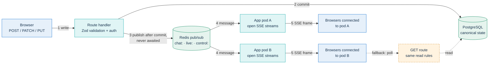
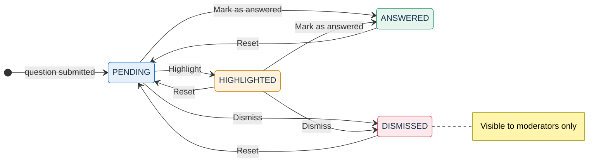
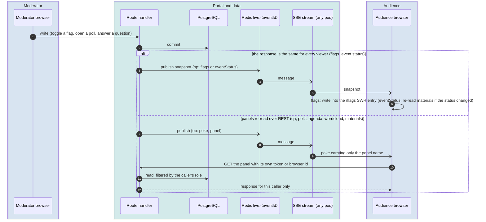
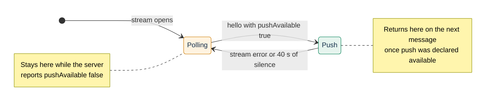

# Live interaction and realtime

This page covers everything that happens beside the video during a live event: chat, Q&A, polls, word cloud, agenda, materials, reactions, timer, the raised-hand queue and post-event feedback. It explains who may read and write each feature, how a change reaches every open browser, and which actions the room records in its journal. It also covers what happens when Redis is missing.

It is written for developers who add or change a live feature, and for operators who run the Redis tier.

Related pages: the decision record is [ADR-005](../adr/005-live-interaction-in-portal.md). The credentials behind "moderator", "speaker" and "registrant" are defined in [identity-and-access.md](identity-and-access.md). Rate limits and the CSRF stance are in [security.md](security.md). Retention and deletion of interaction data are in [GDPR.md](../GDPR.md). The waiting-room square and its `garden:` channel are in [waiting-room.md](waiting-room.md).

## Principle: PostgreSQL holds the state, Redis fans it out

Interaction data belongs to the portal, not to Jitsi's XMPP layer ([ADR-005](../adr/005-live-interaction-in-portal.md)). Every feature follows the same path:

1. A browser calls a route handler under `app/src/app/api/events/[param]/`. The handler validates the body with Zod and checks the caller's credential.
2. The handler writes to PostgreSQL. That row is the only copy of the state.
3. After the commit, the handler publishes a message on the event's Redis channel. It fires the publish without awaiting it, so a slow or missing Redis never fails a write.
4. Every app pod that holds an open Server-Sent Events (SSE) stream for that event receives the message and forwards it to its browsers.

Redis stores no interaction state. Losing a Redis message costs latency, never data, because the next read goes to PostgreSQL. Push is the primary path. Polling stays underneath as the fallback.

```mermaid
flowchart LR
  W["Browser<br/>POST / PATCH / PUT"]:::client
  RH["Route handler<br/>Zod validation + auth"]:::portal
  PG[("PostgreSQL<br/>canonical state")]:::data
  RD[("Redis pub/sub<br/>chat: · live: · control:")]:::data
  PA["App pod A<br/>open SSE streams"]:::portal
  PB["App pod B<br/>open SSE streams"]:::portal
  VA["Browsers connected<br/>to pod A"]:::client
  VB["Browsers connected<br/>to pod B"]:::client
  GR["GET route<br/>same read rules"]:::fallback

  W -->|"1 write"| RH
  RH -->|"2 commit"| PG
  RH -->|"3 publish after commit,<br/>never awaited"| RD
  RD -->|"4 message"| PA
  RD -->|"4 message"| PB
  PA -->|"5 SSE frame"| VA
  PB -->|"5 SSE frame"| VB
  VB -.->|"fallback: poll"| GR
  GR -.->|"read"| PG

  classDef client fill:#E6F0FA,stroke:#0066CC,color:#17324D
  classDef portal fill:#E0F5F5,stroke:#00A3A3,color:#17324D
  classDef data fill:#E6F4EE,stroke:#008055,color:#17324D
  classDef fallback fill:#FFF3E0,stroke:#CC7A00,color:#17324D,stroke-dasharray:4 3
```

Two features do not follow this principle: the presentation timer and the counters of the app's reaction bar keep their state in the memory of one app process. See [Known limitations](#known-limitations). The chat's typing indicator stores nothing at all: it travels only through Redis (see [Chat](#chat)).

## Feature catalog

In this page, **moderator** means a caller holding the event's primary moderator link or a non-revoked named grant with role `MODERATOR`. Speakers (named grant with role `SPEAKER`) never pass a moderator check. **Registrant** means a caller holding the `accessToken` of a `Registration` for this event. A **browser id** is a random identifier the room stores in `localStorage`, under one key per role (`paw_guest_id`, `paw_speaker_voter_id`, `paw_moderator_voter_id`), so a moderator who previews the room as a guest in the same browser does not carry over the moderator's votes. The poll and word-cloud panels and Q&A upvotes use it for everyone without a registration (guests, speakers and moderators); Q&A questions and agenda reactions send it only for guests; the post-event rating sends it for guests and speakers, and moderators are not asked.

| Feature | Stored in | Who writes | Who reads | How a change reaches the room |
|---|---|---|---|---|
| Chat | `ChatMessage`, `ChatMessageReaction` | Members and guests in the guest window. Attachments, reactions and edits: members only | Chat read gate | The message itself on `chat:<eventId>`; the typing indicator on `chat-typing:<eventId>` |
| Q&A | `Question`, `QuestionUpvote`, `QuestionGuestUpvote` | Registrants, named-grant holders, guests. Upvotes: registrants, everyone else by browser id. Status: moderators | Panel read rule | Poke `qa` on `live:<eventId>` |
| Polls | `Poll`, `PollVote` | Create, close, publish, delete: moderators. Vote: registrants, everyone else by browser id | Panel read rule | Poke `polls` |
| Word cloud | `WordCloudRound`, `WordCloudSubmission` | Rounds and word removal: moderators. Words: registrants, everyone else by browser id | Panel read rule | Poke `wordcloud`, plus a 30 s poll |
| Agenda | `EventAgendaItem`, `AgendaItemReaction` | Items: moderators. **Agree** / **Disagree**: registrants and browser ids | Anyone who knows the event slug | Poke `agenda` |
| Materials | `EventMaterial` | Moderators. The open count: the audience's clicks | Anyone while the event is publicly visible: before the start only `BEFORE`; during the event `ALWAYS` and `DURING`; after it `ALWAYS` and `AFTER`. Every material, with its open count, with a moderator token | Poke `materials`, plus a 120 s poll |
| Reactions (app bar) | Process memory, plus `Reaction` rows for analytics | Anyone who knows the event slug | Anyone who knows the event slug | 5 s poll |
| Timer | Process memory | Moderators | Anyone who knows the event slug | 5 s poll |
| Raised hands | Jitsi. Analytics in `CallSession.handRaiseLog` and the [live action journal](#live-action-journal) | Participants in Jitsi. **Lower hand**: moderators | Jitsi roster | Jitsi events, plus `control:<eventId>` |
| Post-event feedback | The `POST_EVENT` questionnaire (`QuestionnaireResponse`); older star ratings in `EventFeedback` | Registrants and browser ids, except moderators, while feedback collection is on, the event is `LIVE`, `IDLE` or `ENDED` and its retention (`endsAt` plus `dataRetentionDays`) has not expired | Average and distribution: the concluded event page, when it shows feedback. Every answer: staff who manage the event and its moderators (**Ratings** panel) | Not live |
| Live flags | `Event` columns | Moderators | Anyone who knows the event slug | Snapshot `flags` on `live:<eventId>` |

### Who is in the room: the read rules

Q&A, polls and the word cloud share one read rule in `app/src/lib/events/panel-read-access.ts` (`authorizePanelRead`). The word cloud looks the same to every caller who passes it. One rule, not one per panel, is what keeps every panel consistent for the same caller: separate rules drift, and a guest or a speaker who can watch the stream then gets 401 or 403 from one panel and a normal view from another.

| Caller | Recognized by | Q&A view | Polls view |
|---|---|---|---|
| Moderator | Primary moderator link or `MODERATOR` grant (lookup cached a few seconds per pod) | Every status, including `DISMISSED` | Every poll, with live counts |
| Speaker | Non-revoked `SPEAKER` grant for this event | Audience view | Audience view |
| Registrant | Registration `accessToken` for this event | Audience view, with own upvotes | Audience view, with own vote |
| Guest | No token, inside the guest window | Audience view | Audience view |

A token that matches nothing is an error (403), not a silent downgrade to guest. A stale link fails loudly. A request with no token outside the guest window gets 401. An empty `Authorization: Bearer ` header counts as no token, because the room sends an empty token for guests.

The **guest window** is defined once in `app/src/lib/events/guest-window.ts` and shared with the chat. It is open when the event admits guests and the room is open. A scheduled event admits guests only while the site setting `guestAccessEnabled` is on, and an instant call always admits them. The room is open when the event is `LIVE`, or when an instant call is `PROVISIONING` or `IDLE` (the waiting room of an instant call works while the bridge warms up). On a password-protected event, a tokenless reader also needs the join-password grant cookie. That is the same cookie the live page requires before it issues a guest Jitsi token. Knowing the URL is not enough to read the room.

The room token is not a voting identity. Poll votes, word-cloud words and agenda reactions are keyed either by a registration (`accessToken`) or by the browser id. The server looks up `accessToken` only among registrations. A moderator or speaker link sent as `accessToken` is therefore refused, which is why the poll and word-cloud panels send a browser id for those callers. A browser-id vote or word is also gated by `authorizePanelRead` with the caller's bearer token. Deduplication by browser id assumes an honest browser: a room poll is not an election.

The other panels have lighter gates. Agenda, timer, the reaction counters and `GET /flags` answer anyone who knows the event slug. Materials and the `live:` stream require the event to be publicly visible (`isEventPubliclyVisible`). The `control:` stream requires only that the event exists, because it carries opaque Jitsi endpoint ids and nothing else.

### Chat

The chat is the primary audience channel. It is the first drawer tab whenever `chatEnabled` is on.

- **Storage.** One `ChatMessage` row per message. The sender's display name, the body and the attachment filename are encrypted at rest with `encryptPII` (AES-256-GCM, see [security.md](security.md)). Encryption covers storage only: Redis and the SSE stream carry plaintext. The envelope on `chat:<eventId>`, and therefore the stream, carries `senderKey` and never the raw sender id, which for a guest is derived from the IP address; the subscriber also strips a raw id that an older pod may still publish during a rolling update (`app/src/lib/chat/pubsub.ts`).
- **Who posts.** Holders of the primary moderator link, named moderator and speaker grants, registrants, and tokenless guests inside the guest window. A guest must supply a display name. Only role `MODERATOR` (and the primary link) gets the moderator badge. Speakers post as ordinary members. On the shared primary link, the author can set a display name, because the server has no per-person name for it.
- **Who reads.** `authorizeChatRead` in `app/src/lib/chat/read-access.ts` gates the history, the stream and the export. A member token grants access in any status, so moderators keep the archive after the event. Tokenless readers get the guest-window rule above, including the password check (the chat answers 403 rather than 401 outside the window or without the password grant). The read side is deliberately stricter than the write side: posting injects one message, reading exposes everyone's.
- **History.** `GET /api/events/{slug}/chat` returns the newest 100 messages by default, up to 500 (`?limit=`), or, with `?since=<ISO timestamp>`, up to the same limit of messages newer than that time, in ascending order. Hidden messages are excluded. Each row carries `senderKey` and server-computed `mine`, `canEdit` and `myReactions`. A seat is shared by several people, so the client cannot work these out itself. `senderKey` is a keyed hash of the sender id (HMAC-SHA-256 with `APP_SECRET`, truncated; plain SHA-256 only where `APP_SECRET` is absent, which only a development setup allows), used only for the bubble color: a plain hash of so little input could be reversed by enumeration (`app/src/lib/chat/sender-key.ts`). The history, the stream and the export all carry the same key, so live and reloaded bubbles share a color. The response also carries `attachmentsEnabled`, true when the installation has files storage.
- **Replies.** A message can quote one earlier, visible message of the same event. A reply whose parent was later hidden shows no quote.
- **Attachments.** Members only (never tokenless guests). One image (PNG, JPEG, WebP, GIF) or PDF of up to 10 MiB per message. The type is checked against the file's magic bytes. The upload route returns a signed token, and `POST /chat` accepts only that token, never a client-supplied URL or metadata. Files are stored under `assets/chat/<eventId>/` and served by `/api/assets`. That route evaluates no authorization: an attachment is protected by an unguessable address, by deletion of the blob on moderation or retention, and by `Cache-Control: private, max-age=60`. Anyone who has the link can open it (see [security.md](security.md#uploaded-files) and the [roadmap](../ROADMAP.md)). Without files storage the panel shows no paperclip and ignores pasted files: it offers attachments only after a `GET /chat` answer with `attachmentsEnabled: true`, the same rule as the materials' `uploadsEnabled`. A direct upload then answers `503 STORAGE_UNAVAILABLE`, which the panel reports with its own message. Storage providers are described in [configuration/storage.md](../configuration/storage.md).
- **Reactions.** Members toggle one emoji from a fixed set (`CHAT_REACTION_EMOJIS` in `app/src/lib/chat/emoji.ts`) on a message. The unique index (message, sender, emoji) makes the toggle idempotent. Tallies travel as whole counts, never as sender ids.
- **Edits.** The author can correct a visible message for 15 minutes, and the UI then shows **edited**. Editing requires an identity that belongs to one person: a named grant, or the browser that made the registration. The shared primary moderator link, a forwarded registration link and guests cannot edit (**This link is shared, so it cannot edit messages.**). See [identity-and-access.md](identity-and-access.md) for why a token identifies a seat, not a person.
- **Avatars.** Each group of messages shows the sender's initials, colored from `senderKey`, never a profile photo. A chat seat is shared by whoever opens a forwarded registration link, so a photo could show the registrant next to a name someone else typed ([Avatars](identity-and-access.md#avatars)).
- **Moderation.** A moderator hides a message (`DELETE /chat/{messageId}`). This is a soft delete: `hiddenAt` and `hiddenBy` are set, the row stays in the database, and any attachment blob is deleted. `hiddenBy` is `mod-<eventId>` for every moderator, so it does not record which person hid the message. The message disappears live for everyone and is excluded from history and export.
- **Questions.** The room does not mark chat messages as questions: questions go through the **Q&A** panel. The chat API still accepts `isQuestion` on `POST /chat` and `PATCH /chat/{messageId}/question` for the answered/dismissed state, which the room does not use.
- **Export.** **Download the chat** calls `GET /chat/export?format=txt|json`. It uses the same read gate, excludes hidden messages and returns at most 5,000 messages.
- **Typing indicator.** While someone composes a message, the panel sends `POST /chat/typing` at most every 3 seconds. The route recognizes the sender with the same rules as `POST /chat` (`authenticateChatSender`), so whoever cannot post cannot appear to be typing either: the body is `{}` for a token holder, carries `guestName` for a tokenless guest, and may carry `displayNameOverride` on the shared primary moderator link. It answers 204 and writes nothing to the database. It publishes `{senderKey, senderName}` on `chat-typing:<eventId>`, never the raw sender id, and the chat stream delivers it as an SSE event named `typing` (`app/src/lib/chat/typing.ts`, `typing-pubsub.ts`). There is no "stopped typing" signal: a reader drops a person after 5 seconds without a new signal, or as soon as their message arrives, and lists two names at most (three or more people show as **Several people are typing…**). Limits: 40 signals per minute per sender and event (429), and 10 per second per event and pod; past the second limit a signal is accepted and not published. Without Redis the chat works and the indicator is missing.

Every change travels on `chat:<eventId>` as a `ChatEnvelope` (`app/src/lib/chat/pubsub.ts`). The `op` field tells the client what to do:

| `op` | Meaning for the client |
|---|---|
| absent | Append a new message (deduplicated by id) |
| `delete` | Remove a hidden message |
| `edit` | Replace the text of a message |
| `reaction` | Replace that message's reaction tallies |
| `question` | Replace the answered/dismissed state of a question |

A new `op` is safe during a rolling update. A client from the previous release falls through to the "append" branch, which deduplicates by id and so ignores the unknown operation.

### Q&A with upvotes

The Q&A panel is the room's place for questions: a separate, moderated queue with upvotes (`Question`), shown when `qaEnabled` is on. Registrants, and guests and speakers by browser id, can upvote (moderators only through the API). Moderators move questions through `PENDING`, `HIGHLIGHTED`, `ANSWERED` and `DISMISSED`.

- **Posting.** `POST /api/events/{slug}/questions` accepts 3 to 500 characters and only while `qaEnabled` is on. The author can be a registrant (named from the registration), the holder of a named grant for this event (named from the grant), or a tokenless caller inside the guest window with a display name of at least 2 characters (outside the window the route answers 401). The primary moderator link is neither a registration nor a grant, so it cannot post. Posting is limited to one question every 30 seconds per registration, per named grant, or, for a guest, per browser id and event (`guestId`, which the room sends for guests). Guests who send a browser id also share a cap of 60 questions per minute per IP address and event, the same capacity as the poll cap, which stops a client that changes its id on every question. The cap answers 429 with its own code, `NETWORK_RATE_LIMIT`, so the panel asks to retry in a few seconds instead of saying to wait before another question. A guest request without a browser id is keyed by IP address alone.
- **Upvoting.** `POST /questions/{id}/upvote` toggles one upvote per identity: a registrant sends the registration `accessToken`, everyone else the browser id (`guestId`), with the room token as `Authorization: Bearer` when they have one. A browser-id upvote passes the panel read rule first, so a guest can upvote only inside the guest window; a registrant who sends a browser id with the registration as bearer is counted once, by registration. The toggle deletes or inserts the row (`QuestionUpvote` for a registration, `QuestionGuestUpvote` for a browser id) and moves `upvoteCount` by the rows that changed, in one transaction, so a double click never double-counts. Limits: 10 per minute per identity, and, for browser ids, 300 per minute per IP address and event (`NETWORK_RATE_LIMIT`), the word-cloud capacity. `GET /questions?guestId=` marks the questions that browser id has upvoted, and `canUpvote` is true for any caller with a registration or a browser id. Finding the caller's own upvotes costs one indexed query per read, outside the 2-second cache; it runs only when at least one listed question has an upvote. The moderator view keeps the counter without the button, so a moderator can upvote only through the API.
- **Moderating.** A moderator changes the status with `PATCH /questions/{id}`. The audience sees `PENDING`, `HIGHLIGHTED` and `ANSWERED`. `DISMISSED` questions are visible to moderators only. Highlighted questions come first, then the rest by status, upvotes and age.
- **Written answers.** The same `PATCH` takes `answer` (up to 2000 characters, trimmed), alone or with `status`. The first answer to a `PENDING` or `HIGHLIGHTED` question, sent without a status, makes it `ANSWERED`. Correcting an existing answer changes neither the status nor its dates, a dismissed question stays dismissed (the room offers no **Answer** on it), and an empty or `null` answer removes the text and leaves the status, since the question may have been answered aloud. The post-event page also lists a question put back to pending after a written answer. The answer is stored in `Question.answerText`, returned by `GET /questions` to everyone who sees the question, and shown on the post-event page with the question.
- **Alerts.** The room reads the list on its own schedule, whichever tab is open (`app/src/hooks/use-qa-alerts.ts`): every 5 s for moderators, every 15 s for everyone else. Its SWR key does not start with the list's URL, so `qa` pokes, which every upvote sends, do not make every attendee re-read the list; only an open panel follows them. Between two reads, a new question or a new answer lights a dot on the **Q&A** tab until the tab is in view. Sound and the browser notification follow the chat's bell and its rules (`app/src/lib/chat/notify-prefs.ts`): nothing while the Q&A tab is in view and the page visible, and the browser notification only while the page is in the background or its window does not have focus. A moderator gets them for a new question, anyone else when one of their own questions is answered. The room remembers which questions this browser asked in `localStorage` (`pa-webinar.qa-mine.<slug>`, question ids only), so a question asked from another device does not alert this one.
- **Caching.** While push is unavailable, the audience response is cached for 2 seconds in the memory of each pod, which absorbs the 3-second polling of a full room. While push is active, the cache is off: a client re-reads right after a poke, and another pod's stale copy would stay on screen with no second read to correct it.

```mermaid
stateDiagram-v2
  direction LR
  [*] --> PENDING: question submitted
  PENDING --> HIGHLIGHTED: Highlight
  PENDING --> ANSWERED: Mark as answered
  HIGHLIGHTED --> ANSWERED: Mark as answered
  PENDING --> DISMISSED: Dismiss
  HIGHLIGHTED --> DISMISSED: Dismiss
  HIGHLIGHTED --> PENDING: Reset
  ANSWERED --> PENDING: Reset
  DISMISSED --> PENDING: Reset
  note right of DISMISSED
    Visible to moderators only
  end note

  classDef open fill:#E6F0FA,stroke:#0066CC,color:#17324D
  classDef hot fill:#FFF3E0,stroke:#CC7A00,color:#17324D
  classDef done fill:#E6F4EE,stroke:#008055,color:#17324D
  classDef gone fill:#FBE9EC,stroke:#D1344C,color:#17324D
  class PENDING open
  class HIGHLIGHTED hot
  class ANSWERED done
  class DISMISSED gone
```

The diagram shows the usual paths. The API and the moderator panel also allow a direct move between any two states (for example from `ANSWERED` back to `HIGHLIGHTED`). The states come from the `QuestionStatus` enum in `app/prisma/schema.prisma`.

### Polls

- Moderators create a poll with a question of 3 to 300 characters and 2 to 6 options. A new poll starts `OPEN`.
- The moderator buttons map to `PollStatus`: **Close voting** sets `CLOSED`, **Publish results** sets `PUBLISHED`, **Reopen** sets `OPEN` again. Moderators can also delete a poll.
- The audience sees `OPEN` and `PUBLISHED` polls only. Vote counts stay hidden from the audience until results are published. Moderators see live counts at all times.
- Each identity votes once and cannot change the vote. The unique indexes on (`pollId`, `registrationId`) and (`pollId`, `guestId`) settle double clicks, and the loser gets 409 **You have already voted in this poll.**
- The panel stays mounted on other tabs, so the **Polls** tab can show a dot while an open poll still waits for this person's vote.
- The audience part of the `GET /polls` response is cached per pod exactly like Q&A (2 s, only while push is unavailable). The caller's own vote is looked up outside the cache.

### Word cloud

The room calls the feature **In one word**: a moderator asks a question, and the answers form the cloud.

- A moderator opens a round with a prompt of 3 to 200 characters and a duration of 30 to 300 seconds (120 by default), or `0` for no time limit: such a round stays open until a moderator closes it. Opening a round closes any round still open. The two steps run in one transaction that locks the event row, so two quick openings cannot leave two open rounds.
- The API accepts words from a registrant (`accessToken`) or a browser id (`guestId`): up to 5 words per identity per round, each up to 30 characters. The room's panel sends the registration token for registrants and the browser id for everyone else, guests, speakers and moderators, with the room token as `Authorization: Bearer`. A browser-id word passes the panel read rule first, so a guest can add words only inside the guest window.
- The server stores and counts each word in one normalized form (`app/src/lib/wordcloud/normalize.ts`): Unicode NFC, lowercase, runs of spaces collapsed, and punctuation and symbols trimmed at both ends, while inner apostrophes and hyphens stay. A word with no letter or digit left answers 422 `WORD_INVALID`. Each identity can send a given word once per round: a repeat answers 409 `WORD_DUPLICATE`. A sixth word answers 409 `WORD_LIMIT_REACHED`, and a word a moderator removed answers 409 `WORD_REMOVED`. A closed or expired round also answers 409, with a different message, so the panel tells the cases apart by the code.
- A moderator removes a word with `DELETE /wordcloud/{roundId}/words?word=<word>`, normalized the same way. Every submission of that round whose normalized form matches gets `hiddenAt`, including rows stored before normalization (`Clarity!` and `clarity` are the same word); the duplicate and removed-word checks compare normalized forms in the same way, and the route answers `{word, hidden}` with the number of rows it hid. The rows stay, so they still count toward each author's five words. A removed word leaves the cloud and the [event recap](event-journey.md#after-the-event), and nobody can send it again in that round.
- A round closes when a moderator clicks **Close the answers**, or lazily when a read or a submission finds its duration expired; the request that closes it sends a `wordcloud` poke, so panels that read just before the end see the result. No scheduled job closes rounds. That is why the word-cloud panel keeps a 30-second poll even while push is active.
- `GET /wordcloud` passes the panel read rule, then returns the latest round with no per-caller data. Each word's count is the number of distinct identities that sent it, and removed words are left out of the words and of `totalSubmissions`. The event recap counts words the same way (`countWordsByPerson`), one person once per word in each round.
- `GET /wordcloud?lite=1` answers only whether the latest round is open and its id, with no words and no write (expired rounds are closed by the full read). It passes the same panel read rule as the full read; each pod keeps the event for 5 seconds and the outcome of a token check for 60 seconds, so the dot's re-reads do not query the database. It lights the tab dot for everyone but moderators: the same answer for everyone, kept in memory by each pod for 2 seconds and dropped by the pod that opens or closes a round. The dot follows `wordcloud` pokes and also re-reads every 20 seconds, because another pod may answer a poke with the state of a moment earlier.
- Moderators see the tab even while `wordCloudEnabled` is off. The panel then explains the feature, and asking the first question turns the flag on for everyone before the round opens.

### Agenda

The agenda is the list of topics for the meeting.

- Moderators add, rename, reorder and delete topics, live or in advance. A topic can carry a planned duration (`plannedMinutes`, 1 to 600). The panel accepts a pasted list, one topic per line, and strips bullet and number markers.
- Each topic has a status (`AgendaItemStatus`): `PENDING` (**To discuss**), `CURRENT` (**In progress**), `DONE` (**Discussed**) or `SKIPPED` (**Skipped**). Only one topic is current at a time: a `PATCH` that sets `CURRENT` moves the previous current topic to `DONE` in the same transaction, which locks the event row first (`FOR NO KEY UPDATE`, which does not block the inserts of chat messages, questions or registrations of the same event), so two simultaneous starts (two moderators, a double click) run one after the other. Adding and reordering take the same lock. The rule lives in the route, not in a database constraint. Starting the topic that is already current keeps its `startedAt`. Starting a topic sets `startedAt`; marking it discussed sets `completedAt` and keeps `startedAt`, so the room shows how long it took; reopening it clears both. The moderator's **Next topic** button starts the next topic still to discuss, which closes the current one.
- The room shows each topic's status and timing to everyone. Moderators also see the time elapsed against the planned duration, and when a topic runs over it.
- `completed` stays in step with the status, true only for `DONE`, because the post-production summary reads it. `PATCH /agenda/{id}` takes `status`, `label`, `plannedMinutes` (`null` clears it) and still accepts the boolean `completed`, read as `DONE` or `PENDING`.
- `POST /agenda` takes `{label, plannedMinutes?}` and answers the new topic, or `{labels: [...]}` with up to 50 topics and answers `{items}`. New topics go at the end. An agenda holds at most 200 topics (`MAX_AGENDA_ITEMS`), so that a reorder can always list them all. `PUT /agenda` with `{order: [...]}` reorders: the list must name every topic of the agenda exactly once, otherwise the route answers 409, because the agenda changed in the meantime.
- While `agendaEnabled` is on, registrants and browser ids can **Agree** or **Disagree** with a topic, change their answer, or withdraw it. There is one answer per identity per topic. The room offers the buttons only on the current topic, and shows the tallies on every topic that has answers; the API accepts an answer on any topic. The room does not show the buttons to moderators and speakers, who see the tallies only.
- `GET /agenda` returns the topics, the tallies and the caller's own answer (from the bearer registration token or `?guestId=`). `GET /agenda?lite=1` returns only `agendaEnabled` and each topic's id, title, status, `startedAt`, `completedAt` and `plannedMinutes`: no reactions and no identity. That answer is the same for everyone, so each pod keeps it in memory for 2 seconds and drops it on every agenda write it handles.
- The room's top bar shows the current topic and how many topics are discussed, to everyone, while the agenda is on and has topics. Hovering over it or clicking it opens the whole agenda with each topic's status. It reads `GET /agenda?lite=1`, and `agenda` pokes re-read it like the panel; with push active it also re-reads every 15 seconds, because another pod may answer a poke with the state of a moment earlier.
- When a recording of the event goes through AI post-production, the summary job receives the agenda topics with their status and planned duration, and the room timeline built from the [live action journal](#live-action-journal). The topic in progress when the recording starts and the topics started during it, in the order the host started them, become the chapters of the summary ([POSTPROD.md](../POSTPROD.md#room-timeline)).

### Materials

Moderators add links (title, URL, optional description) from the room. When the installation has files storage, they can also upload a file (`POST /api/events/{slug}/materials/upload`): the room's panel offers it only when `GET /materials` answers `uploadsEnabled: true`. Accepted types, size and per-event caps are in [security.md](security.md#uploaded-files). Moderators choose the visibility as they add a link or a file; both routes store `ALWAYS` when the request leaves `visibility` out. From the panel they can later change a material's title, description and visibility (`PATCH /api/events/{slug}/materials/{id}`, with the credential that deleting needs: the primary moderator link or a `MODERATOR` grant). The address cannot be changed: a wrong link is removed and added again. Speakers cannot add, edit or remove materials. A material added from the room records its author (`addedBy`) only when it is added with the primary moderator link, as the event's `moderatorName`; for named co-moderators, whose names are encrypted at rest, and for events without a moderator name, it stays empty. Materials added from the administration area store no name either. The panel and the administration's event page then show **Added by the organisers**, and treat the fixed labels `Admin` and `moderator` found in existing rows the same way (`app/src/lib/events/material-author.ts`). Material management before the event is covered in [event-journey.md](event-journey.md).

The drawer lists what the audience may see in the room: the materials marked `ALWAYS` or `DURING` while the event is live, and only those marked `BEFORE` while the room warms up before the scheduled start and the event is not yet `LIVE`. Speakers and registrants get this audience view too. Every caller that holds a room token sends it with the poll, which on a password-protected event is what lets registrants and speakers read the list. The server widens the list only for the primary moderator link or a co-moderator grant, and the panel shows each item's visibility only to them, the default included. The visibility rule is described in [event-journey.md](event-journey.md#materials-and-agenda). Adding, editing or removing a material, from the room or the administration area, pokes `materials`. The audience's list also depends on the event's phase, which can change without any material changing, so the panel re-reads when an `eventStatus` snapshot carries a status different from the previous one. With push active, the panel also polls every 120 seconds, for a phase that changes with the clock and no status change; without push it polls every 30 seconds.

Each item shows an icon and a label for its format (`app/src/lib/materials/file-kind.ts`), then the size of an uploaded file or the host name of a link without `www.`, so that a reader knows where a link leads before opening it, then who added it and when. When the list holds more than four items and mixes files and links, **All**, **Files** and **Links** filter it; once one kind has no items left, the filter disappears and the list shows everything again. Moderators also see each item's visibility and open count (clicks for a link, downloads for a file), with **Copy link** on links, **Edit** in place (Escape cancels, and focus returns to the button) and **Delete material**. Deleting takes two clicks: the first arms the button for 4 seconds and is announced to screen readers through a polite live region, the second deletes, and focus moves to the next item.

A click on a material, in the room's panel or in the list on the public event page, sends `POST /api/events/{slug}/materials/{id}/opened` without waiting for the answer, with the room token as a bearer when there is one. A middle click counts too, a right click does not. The route:

- **Counts only what the caller can see.** The rule is the one of `GET /materials` (`materialAccessFor` in `app/src/lib/events/material-access.ts`): the event is publicly visible, the material's phase is visible to the public, and on a password-protected event the caller can enter the room.
- **Never counts moderators or staff.** A request whose token sees every phase (the primary moderator link or a co-moderator grant), or from a browser with a staff session, is a check, not audience use.
- **Requires `Content-Type: application/json`.** Another origin cannot send such a request without a CORS preflight, which the API does not answer, so a third-party page cannot make its visitors' browsers inflate the number ([security.md](security.md#csrf-stance)).
- **Counts each caller once per material every 10 minutes.** The caller is the SHA-256 hash of the room token when the token is valid for the event (a registration or a non-revoked named grant), and otherwise the client IP address. An unknown token is not an identity, because a new one on every request would defeat the limit. The key is held only in the pod's memory until the window ends, and the address is not logged. Each replica keeps its own windows, so with several replicas the number is indicative.
- **Always answers `204`**, counted or not, so the answer does not reveal whether a material exists or is visible.
- **Publishes no poke.** An opening changes nothing the audience sees; moderators get the new number at the panel's next read.

The count is one number per material (`EventMaterial.openCount`), with no record of who opened what ([data-model.md](data-model.md#invariants)). Only moderators receive it: in the moderator view of `GET /materials` and in the answer to `PATCH …/materials/{id}`.

### Reactions

`SiteSetting.reactionsMode` selects one of two modes. Administrators set it under **Reactions (emoji)** in the site settings ([configuration/runtime-settings.md](../configuration/runtime-settings.md)):

- `NATIVE` (the default in `schema.prisma`), **Jitsi native (in the toolbar, ephemeral)**: Jitsi's own reactions button. The portal stores nothing.
- `CUSTOM`, **App custom (left-hand bar, with stats)**: the app's reaction bar. `POST /reactions` increments an in-process counter for the live display. It also inserts one `Reaction` row (emoji and timestamp only, capped per event) for [event analytics](event-journey.md). Clients poll `GET /reactions` every 5 seconds.

### Timer

Moderators **Start**, **Pause** and **Reset** a countdown. The room offers presets of 5, 10, 15 and 30 minutes; `POST /timer` accepts any duration from 10 seconds to 2 hours. **Show to all** toggles its visibility without restarting it. The state lives in the memory of the pod that received the command, for up to two hours. Clients poll `GET /timer` every 5 seconds and count down locally between polls.

### Raised-hand queue

Jitsi owns the raised-hand state. The portal builds the queue from Jitsi's `raiseHandUpdated` events:

- Every participant sees a read-only queue with names and order. Moderators get the full panel: **Give the floor**, **Audio only** (both issue Jitsi commands) and **Lower hand**.
- The Jitsi IFrame API can lower only the local participant's hand. **Lower hand** therefore calls `POST /hand-raises/lower`, which publishes `{op: 'lowerHand', targetEndpointId, raiseId}` on `control:<eventId>`. The raiser's own browser toggles its hand, and Jitsi then drains every queue.
- A browser opens the control stream only while its own hand is up. It acts only if `raiseId` matches its current raise, so a late signal cannot lower (and so re-raise) a hand that was already lowered and raised again. The signal is best effort, with no replay: a lost signal is a no-op, and the moderator can click again.
- For analytics, each non-moderator client reports only its own raises to `POST /hand-raises`, in batches of `{participantId, raised, atEpochMs}` with the batch's `sentAt`; both times are optional and come from the browser's clock. The server appends opaque Jitsi endpoint ids to `CallSession.handRaiseLog` without names or times, and writes the raises, not the lowerings, to the [live action journal](#live-action-journal) at server time, without the endpoint id. The route takes no credential, so the journal caps what one request can add.

How the toolbar and roster are configured is in [jitsi-integration.md](jitsi-integration.md).

### Post-event feedback

The end-of-event rating is the event's `POST_EVENT` questionnaire ([event-journey.md](event-journey.md#questionnaires-and-post-event-feedback)), shown by `app/src/components/live/post-event-feedback.tsx`. The room asks for it when feedback collection is on (`feedbackEnabled`) and the event has one, and never asks moderators:

- **Closing screen.** However the call ends (the end time passes, a moderator ends it for everyone, or the connection drops after the end), the closing card shows the form.
- **Leaving screen.** Someone who leaves while the event is still running sees **Leave a rating**, which opens the form on the same screen. It is an offer, not a prompt.
- **Ended waiting room.** **Leave feedback** opens the form in a modal `<dialog>`: focus stays inside, the page behind it cannot be used, and Esc, **Skip** or the close button close it and return focus to the button.

The rating is shown once per visit: after it is answered or skipped, the closing screen does not ask again. **Submit feedback** stays disabled until at least one question has an answer, because each identity has a single response. If the server already holds a response for that identity, the form says **You have already left your rating: thank you!** instead of an error.

`GET /questionnaires/POST_EVENT` and `POST /questionnaires/POST_EVENT/responses` answer only while feedback collection is on, the event is `LIVE`, `IDLE` or `ENDED`, and, for an `ENDED` event, its retention has not expired, that is `endsAt` plus `dataRetentionDays` is not yet past; a room still `LIVE` or `IDLE` past its scheduled end stays open, as the cleanup does not touch it while it is in use (`feedbackOpen()` in `app/src/lib/feedback/default-questionnaire.ts`; the older `POST /feedback` applies the same cut-off and answers `409` after it). Otherwise the read answers `404`, so no form appears, and the write answers `403`. The room sends the registration token for registrants and the browser id for everyone else, guests and speakers included. The response stores neither the respondent's name nor an email hash: the registration link is kept only to allow one response per registration. The form tells respondents that organizers see the answers without their name.

The room does not offer the older star rating (`EventFeedback`). `POST /feedback` accepts one while the event is `LIVE` or `ENDED` and its retention has not expired, and `GET /feedback` returns the average and distribution of those rows to anyone and their comments to the primary moderator link. These rows count in the event's average rating and appear in the **Ratings** panel ([event-journey.md](event-journey.md#ratings)).

## Live action journal

The room also keeps a journal of what happened and when: one `LiveAction` row per action, written by `recordLiveAction` and `recordLiveActions` in `app/src/lib/live/actions.ts`. AI post-production places it beside the transcript, so the summary knows when a topic started or a poll closed ([POSTPROD.md](../POSTPROD.md#room-timeline)). The journal has no reader in the room.

- **One time base.** `at` is the server's clock. An action that happened in a browser is converted to server time, described below.
- **No people.** `actor` holds the role (`moderator`, `participant`, or `system` for a round closed at its expiry), never a person. `data` holds ids, counts and texts written by moderators. It never holds names or endpoint ids, nor the text of a Q&A question or a chat message: post-production reads those from their own tables.
- **Best effort.** The write runs after the response (Next's `after()`, which keeps it alive during an orderly pod shutdown): the response does not wait for it, and a failed write is only logged, so it never fails or delays the action that caused it.

| `kind` | Written by | When | `data` |
|---|---|---|---|
| `agenda.topic` | `PATCH /agenda/{id}` | A status change. Starting a topic first writes each topic it closes, as `DONE`. Restarting the current topic, or changing only the title or duration, writes nothing | `itemId`, `label`, `status` |
| `poll.opened` | `POST /polls` | A new poll, which starts open | `pollId`, `question`, `options` |
| `poll.closed`, `poll.published`, `poll.reopened` | `PATCH /polls/{id}` | A real status change | `pollId`, `question`; closing and publishing add `options`, `counts` per option and `totalVotes` at that moment |
| `poll.deleted` | `DELETE /polls/{id}` | Every deletion | `pollId`, `question` |
| `wordcloud.opened` | `POST /wordcloud` | Every new round | `roundId`, `prompt`, `duration` |
| `wordcloud.closed` | `PATCH /wordcloud/{id}` on an open round; `POST /wordcloud`, for the round the new one closes; the read or submission that finds a round expired, timed at its expiry | When the round closes | `roundId`, `prompt`, `words`: the 15 most frequent words with the number of people who sent each |
| `wordcloud.word_removed` | `DELETE /wordcloud/{id}/words` | At least one row hidden | `roundId`, `hidden` (the number of rows hidden); never the word |
| `question.status` | `PATCH /questions/{id}` | A request that sets a status or carries a written answer | `questionId`, `status`, `answered` |
| `chat.question.status` | `PATCH /chat/{messageId}/question` | A real change of the answered or dismissed state | `messageId`, `status` |
| `chat.hidden` | `DELETE /chat/{messageId}` | A message hidden | `messageId` |
| `feature.toggled` | `PUT /api/events/{eventId}` | A change of one of the live flags in `LIVE_FLAG_FIELDS` ([Live-toggleable flags](#live-toggleable-flags)) | `feature`, `enabled` |
| `event.ended` | `PUT /api/events/{eventId}` | The status moves to `ENDED` | none |
| `timer.started`, `timer.stopped` | `POST /timer` | Every start; a pause or reset that stops a running countdown | `durationSec` on start |
| `hand.raised` | `POST /hand-raises` | A reported raise: at most one per endpoint id and 20 per request, 60 per IP address and event every five minutes, and none once the event has 5,000. The count and the write run after the response. Lowered hands are not written | none |
| `recording.started`, `recording.stopped` | `POST /live-actions` | A moderator's browser sees Jitsi's recording status change | none |

**Times from the browser.** Hand raises and recording changes are seen only by browsers. The browser sends the time of the action (`atEpochMs`) and the time it sent the request (`sentAt`), both from its own clock. The server adds the difference between its arrival time and `sentAt`, so a browser clock that is off does not move the action (`serverTimeOf`). Without both times, or when the result lies in the future or more than a day back, the arrival time is used.

**Recording start and stop.** The server does not see the Jitsi recording start or stop, so the room's moderators report it. On `recordingStatusChanged`, a moderator's browser sends `POST /api/events/{slug}/live-actions` with `{kind, atEpochMs, sentAt}`, where `kind` is `recording.started` or `recording.stopped`, and the moderator token as `Authorization: Bearer`. The route accepts only those two kinds, from the primary moderator link or a `MODERATOR` grant (403 for anyone else), at most 30 times per minute per token and event. A browser reports only the changes it sees: not a repeat of the last status, and not the status it finds in its first 10 seconds in the call, which is how the recording already was, unless that browser asked for the recording itself (automatic start, or **Start** right after joining). Every moderator in the room reports the same change, so the route skips a report equal to the last recording action less than 10 minutes apart, and answers 204 either way; the check and the write run under a per-event advisory lock, so simultaneous reports write one row. A later one is written, so that a start that follows a stop nobody reported is not lost.

**Retention.** The journal is event content without names. The GDPR cleanup keeps it at event retention, like the Q&A, polls and words it refers to ([GDPR.md](../GDPR.md#what-stays-after-event-retention)), deleting the event removes it by cascade, and duplicating an event does not copy it.

## Channels

Each event has its own Redis pub/sub channels. A pod receives no traffic for events it has never served; chat and control subscriptions stay in place after their streams close (see **Connections** below).

| Channel | Carries | Published by | Stream route | Stream gate |
|---|---|---|---|---|
| `chat:<eventId>` | Chat envelopes (full messages and ops) | Chat routes | `GET /api/events/{slug}/chat/stream` | Chat read gate, token in `?token=` |
| `chat-typing:<eventId>` | Typing signals (`senderKey`, `senderName`) | `POST /chat/typing` | The chat stream, as `event: typing` | Same as the chat stream |
| `live:<eventId>` | Flag and status snapshots, panel pokes | Event `PUT`, Q&A, polls, agenda, word-cloud and materials routes (room and administration area) | `GET /api/events/{slug}/live/stream` | Event publicly visible; no token |
| `control:<eventId>` | Targeted control signals (`lowerHand`) | `POST /hand-raises/lower` | `GET /api/events/{slug}/control/stream` | Event exists |
| `garden:<eventId>` | Square presence | `POST /garden/ping` | None. Nothing subscribes; presence is read through the `POST /garden/ping` response (see [waiting-room.md](waiting-room.md)) | — |

The channels are kept apart on purpose. A panel listener gets no chat traffic. The chat contract (`ChatEnvelope`, dedup by id, history backfill) never changes because of a control or panel feature. The control stream keeps working when a moderator turns the chat off. The typing indicator has a channel of its own because the chat stream forwards everything on `chat:` as a message, and a client appends every message to the list: a typing signal there would show up as an empty message in a client of the previous release during a rolling update.

Redis also holds three short-lived keys outside interaction: the square's position hash `garden:<eventId>:pos`, the hash `live:seats:<eventId>` that ties each call connection to its registration or grant for moderators ([Who is behind each video tile](identity-and-access.md#who-is-behind-each-video-tile)), and the JVB snapshot `jvb:replicas:snapshot` written by the scaler ([scaling.md](scaling.md)).

**Connections.** Each pod keeps one command connection and one subscriber connection (`app/src/lib/redis.ts`). All streams on the pod share the subscriber. The `live:` and `chat-typing:` modules each register a single message handler per process and dispatch through a registry, because every participant opens those streams. When the last local listener of an event leaves, they unsubscribe from the channel. The chat and control modules attach a handler per stream and leave the Redis subscription in place when a stream closes.

**Publishing never blocks a write.** The Redis client retries forever and queues commands while disconnected (`maxRetriesPerRequest: null`). Publishers therefore check that the connection is `ready` and give up at once otherwise. Among the interaction channels, the only publish a request waits for is **Lower hand**, and `withDeadline` caps that wait at one second. The square's ping route also waits for its Redis pipeline, capped at 500 ms (see [waiting-room.md](waiting-room.md)).

## Streams

### Framing and keepalive

All three stream routes return `text/event-stream` with `Cache-Control: no-cache, no-transform` and `X-Accel-Buffering: no`, so the ingress does not buffer frames. Each stream opens with an SSE comment, so `EventSource` switches to open on the first byte. Each sends a keepalive every 25 seconds, below the 60-second idle timeout that ingress-nginx applies by default.

| Stream | On open | Keepalive | Replay |
|---|---|---|---|
| Chat | Opener comment; the client then backfills with `GET /chat?since=` | SSE comment | None from the stream; message frames carry `id:`, and the client backfills over REST. `typing` events carry no `id:`, so they do not move the resume point (`Last-Event-ID`) |
| Live | `hello`; then, once the stream is subscribed to Redis, a `flags` snapshot and an `eventStatus` snapshot read from the database, followed by any envelope that arrived during that read | A `ping` **message** | None; every envelope is a full snapshot or a poke |
| Control | Opener comment | SSE comment | None; control signals are fire-and-forget |

The live stream's keepalive is a real message, not a comment, because `EventSource` never passes comments to `onmessage`. A commented heartbeat would keep the connection alive but leave the client unable to tell a quiet channel from a dead one.

The snapshots are read after the subscription, and envelopes that arrive during the read follow them in order, so no change falls between the read and the subscription. The subscription is awaited for at most 3 seconds. Past that, the stream sends a second `hello` with `pushAvailable: false`, so the client keeps polling, and still sends the snapshots from the database; a subscription that completes later sends `hello` with `pushAvailable: true`, and one that fails closes the stream so that the client reopens it. When the subscriber connection comes back after an interruption, every open live stream sends the snapshots again and a poke for every panel (`resync`, generated in the pod by `subscribeLiveState`), because whatever was published during the gap never arrives. The streams of the same event in a pod share one database read, and envelopes that arrive during it follow the snapshots, as at opening.

Publishing (`publishLiveState`) waits up to 2 seconds for a connection that is still opening, which is the case for the first publish after a pod starts or reconnects, and gives up after that, because the client queues commands forever. The callers do not wait for it, so no write is slowed down.

`hello` carries `pushAvailable`, which is true only when the pod's Redis connection is `ready`; a connection that is still opening is awaited for up to 1 second. Without Redis the stream carries only its opening snapshots and keepalive pings, so the client must know that before it turns its polling off. The live stream takes no token, so no credential ends up in proxy access logs.

SSE was chosen over WebSocket because the traffic is one-way broadcast plus ordinary POST requests. Browsers support `EventSource` natively and reconnect on their own, and SSE passes through the ingress without upgrade headers.

### Snapshot or reload

Two shapes travel on `live:<eventId>`. The boundary between them is who sees what.

| Envelope | Shape | Used for |
|---|---|---|
| `{op: 'flags', flags, ts}` | Snapshot | The live flags. Every viewer gets the same answer |
| `{op: 'eventStatus', status, ts}` | Snapshot | The event status |
| `{op: 'poke', panel, ts}` | Reload notice | `qa`, `polls` and `materials` (visibility depends on the role), `agenda` (the response carries the caller's own answer) and `wordcloud` (same for everyone, but re-read over REST like the others; the read also closes expired rounds) |
| `{op: 'hello', pushAvailable}` | Stream control | First message of every stream |
| `{op: 'ping', ts}` | Stream control | Keepalive |

`eventStatus` is published for status changes made through `PUT /api/events/{id}` and for the transitions of the scaler and the lifecycle cron, after their transaction commits; those of `/wake`, bulk archive and the cleanup are not. Every stream also opens with an `eventStatus` snapshot read from the database, so a reconnection can reveal a change made elsewhere. The room uses it only to re-read the materials when the status changes; it follows the event's status through `/lifecycle`.

A snapshot is sent only where the response is identical for every viewer. The panels get only a notice that says "this panel changed". The client then re-reads the panel through its REST route with its own token or browser id, so the route's authorization decides what the caller sees. Sending a snapshot where answers differ would mean keeping a second copy of the authorization rules in the publisher. A divergence would raise no error: it would silently show one person another person's state.

Envelopes are always full snapshots, never deltas. There is no persistence and no replay, so the first message a late joiner receives must be enough to correct it.

```mermaid
sequenceDiagram
  autonumber
  box rgba(0,102,204,0.12) Moderator
    participant M as Moderator browser
  end
  box rgba(0,163,163,0.14) Portal and data
    participant R as Route handler
    participant DB as PostgreSQL
    participant X as Redis live:<eventId>
    participant S as SSE stream (any pod)
  end
  box rgba(0,102,204,0.12) Audience
    participant A as Audience browser
  end
  M->>R: write (toggle a flag, open a poll, answer a question)
  R->>DB: commit
  alt the response is the same for every viewer (flags, event status)
    R-)X: publish snapshot {op: flags or eventStatus}
    X-)S: message
    S-)A: snapshot
    A->>A: flags: write into the /flags SWR entry (eventStatus: re-read materials if the status changed)
  else panels re-read over REST (qa, polls, agenda, wordcloud, materials)
    R-)X: publish {op: poke, panel}
    X-)S: message
    S-)A: poke carrying only the panel name
    A->>R: GET the panel with its own token or browser id
    R->>DB: read, filtered by the caller's role
    R-->>A: response for this caller only
  end
```

A boundary test in `app/src/lib/live-state/publish.test.ts` guards this rule. It publishes every kind of envelope and fails if any of them contains a per-user or role-dependent field name (`hasUpvoted`, `myReaction`, `votedOptionIndex`, `optionCounts`, `authorName`, `displayName`, `email`, `token`). This is the automatic defense against someone adding a "useful" field to a snapshot. [development/testing.md](../development/testing.md) lists the other guard tests.

The client (`app/src/hooks/use-live-state.ts`) writes a `flags` snapshot straight into the SWR cache entry of `/api/events/{slug}/flags`. The hook also exposes the latest `eventStatus`, and re-reads the materials when it differs from the previous one. The room itself follows status changes by polling `/lifecycle` (every 3 seconds in the waiting room, every 5 seconds in the room); see [event-lifecycle.md](event-lifecycle.md).

### Debounce with a trailing edge

A burst of votes should not become a burst of reads from every open browser. Both ends therefore throttle, and both keep a trailing edge. Dropping the last notice of a burst would lose the last change, and with polling off nothing else would bring it in.

- **Server** (`pokeLivePanel` in `app/src/lib/live-state/publish.ts`): per event and panel, the first poke goes out immediately. Further changes within one second produce one more poke at the end of that second.
- **Client** (`useLiveState`): per panel, at most one re-read every 3 seconds. A poke that arrives inside the window is postponed to its end, not dropped. A random delay of up to 500 ms keeps a full room from re-reading in the same millisecond. The re-read revalidates every SWR key under the panel's prefix (`/api/events/{slug}/questions`, `/polls`, `/agenda`, `/wordcloud`, `/materials`).
- **Flags** are published only when a flag actually changed (`publishFlagsIfChanged`). The event `PUT` route also receives every wizard save, which resends dozens of unrelated fields.

### Polling fallback

The live hook is mounted once, in the room container. It exposes `pushLive` through `LivePushContext`, and each panel sets its SWR refresh interval from it.

```mermaid
stateDiagram-v2
  direction LR
  [*] --> Polling: stream opens
  Polling --> Push: hello with pushAvailable true
  Push --> Polling: stream error or 40 s of silence
  note left of Polling
    Stays here while the server
    reports pushAvailable false
  end note
  note right of Push
    Returns here on the next message
    once push was declared available
  end note

  classDef poll fill:#FFF3E0,stroke:#CC7A00,color:#17324D
  classDef push fill:#E6F4EE,stroke:#008055,color:#17324D
  class Polling poll
  class Push push
```

The 40-second silence guard runs only while the tab is visible, because browsers slow down timers in background tabs.

| Panel | Polling without push | Polling with push |
|---|---|---|
| Q&A | Every 3 s while the **Q&A** tab is open | Off |
| Q&A alerts (tab dot) | Every 5 s for moderators, every 15 s for everyone else | Same |
| Polls | Every 3 s while the **Polls** tab is open, every 15 s otherwise | Off |
| Agenda | Every 3 s | Off |
| Agenda in the top bar (`?lite=1`) | Every 10 s while the agenda is on, every 30 s while it is off | Every 15 s |
| Word cloud | Every 3 s | Every 30 s (closes expired rounds) |
| Word cloud tab dot (`?lite=1`) | Every 20 s while the word cloud is on, for everyone but moderators | Same |
| Live flags | Every 15 s | Off |
| Chat | Watchdog: `GET /chat?since=` after 15 s without a frame, visible tab only | Same |
| Materials | Every 30 s | Every 120 s |
| Timer, reaction bar | Every 5 s | Every 5 s |

The chat has its own fallback because its stream carries the messages themselves. It backfills when the stream opens and when the tab becomes visible again. It also backfills when no frame has arrived for 15 seconds, checking every 5 seconds while the tab is visible. After a stream error, the next read is a full one, because edits and reactions on older messages do not move `createdAt` and `?since=` would miss them. A pill shows the transport state: **Reconnecting…** while `EventSource` retries, and **Updates delayed** when polling had to recover messages the stream should have delivered (typically a proxy that buffers SSE).

## Live-toggleable flags

Five `Event` columns travel on the live channel. They are listed once in `LIVE_FLAG_FIELDS` (`app/src/lib/live-state/pubsub.ts`): `qaEnabled`, `chatEnabled`, `agendaEnabled`, `wordCloudEnabled` and `recordingEnabled`. Moderators toggle the first four from the **Features:** row at the top of the drawer. `recordingEnabled` is carried and served but has no toggle there.

A toggle updates the SWR cache optimistically, then sends `PUT /api/events/{eventId}` with the moderator token, then re-syncs from the server. A failed `PUT` therefore rolls the button back. The route accepts only the event UUID: a slug gets 400 before the database is touched. After a successful update, the route publishes the flags snapshot, and every room re-renders its tabs.

The flags are passed to the room as props at mount. After that, the room reads them only through the `/flags` SWR entry, which the channel updates. Every place below must agree, or the flag works only at mount:

| # | Place | What breaks if it is missed |
|---|---|---|
| 1 | The column on `Event` in `app/prisma/schema.prisma`, with its migration, plus the `updateEventSchema` field and the data mapping of `PUT /api/events/[param]` | The flag cannot be stored or changed |
| 2 | The `select` of `GET /api/events/[param]/flags` | The polling fallback never sees the flag, so a room that loses push falls back to the value it got at mount |
| 3 | `LIVE_FLAG_FIELDS` in `app/src/lib/live-state/pubsub.ts` (the live stream's `select` must list the same fields; TypeScript enforces it) | No snapshot carries the change. With push on, flags polling is off, so the room never sees the change until reload |
| 4 | The SWR type and the `eff*` value in `app/src/components/live/live-event-client.tsx` | The room keeps using the prop it got at mount |
| 5 | The `toggleFeature` key union and the **Features:** button list in the same file | Moderators cannot toggle it from the room |

Rows 1, 2, 4 and 5 are the four places of the rule. Row 3 is the push channel's copy of row 2, and a comment in `pubsub.ts` requires the two lists to stay identical. The step-by-step recipe is in [development/extending.md](../development/extending.md).

Server enforcement varies: `qaEnabled` gates `POST /questions` (404 while off) and `agendaEnabled` gates agenda reactions (403 while off); `chatEnabled` and `wordCloudEnabled` only hide the tab (the word-cloud tab from everyone but moderators), and the chat and word-cloud write routes keep accepting requests while they are off. A new flag needs its own server check if turning it off must stop writes.

## Drawer and tabs

The room's side panel is a drawer with these tabs, in this order:

| Key | Label | Shown when |
|---|---|---|
| `chat` | **Chat** | `chatEnabled` |
| `qa` | **Q&A** | `qaEnabled` |
| `polls` | **Polls** | Always |
| `wordcloud` | **In one word** | `wordCloudEnabled` (hidden until the flags are read); always for moderators |
| `agenda` | **Agenda** | `agendaEnabled` |
| `materials` | **Materials** | Always |
| `participants` | **Participants** | Always; list, avatars, raised hands, the current speaker and the count come from the Jitsi roster and its events ([Participants panel](jitsi-integration.md#app-owned-controls-around-the-iframe)) |

The initial tab is the chat, or Q&A when the chat is off, or polls when both are off. If a moderator turns off the feature of the open tab, the drawer falls back to the first visible tab. The chat, polls and participants panels stay mounted while another tab is open; the participants panel then draws nothing. That keeps the chat stream alive and the participants panel following the people count, raised hands and the current speaker, and it lets the tab strip show the unread count on the chat tab, as `@` and the count while a mention of the reader or a reply to them is unread, and a pending-vote dot for polls. The materials tab gets its dot from the panel's own list, read while another tab is open, and the Q&A tab from the alert read described in [Q&A with upvotes](#qa-with-upvotes). The word-cloud tab gets a dot when a round opens while another tab is in view, from `GET /wordcloud?lite=1` (see [Word cloud](#word-cloud)): it follows `wordcloud` pokes like the panel, and since the event, the reader's authorization and the answer are kept in memory, the poke sent for every word mostly costs the room in-memory reads. While the chat is not in view, a message that the bell would alert for also shows as a preview over the room, for 6 seconds, or 12 for a mention or a reply; a click on it opens the chat. The document title is also prefixed with the unread count, for example `(3)`, while chat messages are unread in a background tab.

- **Desktop (992 px and wider).** The drawer is a persistent column with a tab list, 400 px wide by default (at most 42% of the viewport width). Dragging its left edge, or the arrow keys on that edge, resizes it from 320 to 960 px, always leaving at least 420 px to the call. The browser remembers the width (`localStorage`, `pa-webinar.sidebar-width`), and a double click on the edge restores the default. A floating control bar (**Event controls**) is also drawn over the video.
- **Mobile (below 992 px).** The control bar becomes a tab strip fixed at the bottom of the screen. The drawer opens as a bottom sheet above it and closes on a second tap, on the scrim or with Escape.

The Jitsi toolbar, per-device buttons and the screen-share banner are covered in [jitsi-integration.md](jitsi-integration.md).

## Redis availability

**How it is deployed.** The chart deploys the Bitnami Redis subchart as a single standalone node with no persistence (`save ""`, `appendonly no`) and authentication on. It requests 50m CPU and 128Mi memory, and raises the pub/sub output-buffer limit for bursts during a live event. See the `redis:` block of `infra/helm/pa-webinar/values.yaml`. To use a managed Redis instead, disable the subchart and set `REDIS_URL` ([CONFIGURATION.md](../CONFIGURATION.md), [DEPLOYMENT.md](../DEPLOYMENT.md)). The Docker Compose stack also runs Redis without persistence, so a single VM exercises the same code path as a cluster.

**When Redis restarts or is evicted.** Fan-out stops until the pod is back. Nothing is lost: every write is already in PostgreSQL. Chat clients catch up through the watchdog backfill. Open live streams stay on push: when the subscriber reconnects, each one sends the snapshots again and a poke for every panel, so the panels catch up then (see [Known limitations](#known-limitations) for the outage itself). A browser whose stream errors for another reason goes back to polling. The Redis client reconnects on its own, with a back-off capped at 3 seconds.

**When `REDIS_URL` is not set.** Publish and subscribe become no-ops:

- The chat keeps working. Messages are stored, and other clients receive them through the backfill watchdog (about 15 seconds of delay) instead of the stream.
- The live stream sends `pushAvailable: false`, and every panel keeps polling.
- **Lower hand** signals are not delivered.
- `/api/status`, which backs the **System status** page, reports Redis as `outage` and the overall status as `outage`, because realtime fan-out is treated as a required dependency. The administration's infrastructure page shows the Redis node as standby. See [operations/monitoring.md](../operations/monitoring.md).

**Metrics.** The app exports `eventi_chat_messages_total` and `eventi_chat_sse_connections` (chat streams only). Redis's own metrics need the subchart's exporter, which is off by default. Enable it with the subchart's `redis.metrics` values if you want the Redis figures in the **In-app chat & Redis** section of the administration's **Monitoring** page (`/admin/monitoring`). Details are in [operations/monitoring.md](../operations/monitoring.md).

**High availability.** The chart does not deploy a replicated Redis tier. It is tracked in [ROADMAP.md](../ROADMAP.md), together with distributed rate limiting, which would make Redis a harder dependency.

## Known limitations

- **Timer and reaction-bar counters are per pod.** They live in process memory. The chart runs at least two app replicas by default (`autoscaling.minReplicas`, or `app.replicaCount` when autoscaling is off in `values.yaml`), with no session affinity. A browser whose requests land on another pod can see a different timer or different reaction counts, and a pod restart resets them. The `Reaction` rows used for analytics are not affected.
- **A Redis outage that starts after a live stream opened is not signaled to the client.** The `ping` keepalive comes from the app pod, not from Redis, so the client keeps polling off. Pokes published during the outage are dropped, and the panels stay as they were until Redis returns; then every open stream resends the snapshots and pokes every panel. The chat is not affected, because its watchdog relies on real message frames.
- **Browser-id identities are chosen by the client.** Poll, word-cloud and agenda deduplication for browsers without a registration is only as strong as the browser's honesty.
- **The whiteboard is not stored.** Jitsi's whiteboard is ephemeral. When it is enabled for the event (`whiteboardEnabled`, always on for instant calls) and for the installation (`NEXT_PUBLIC_WHITEBOARD_ENABLED`), the drawer reminds moderators to export it and attach it as a material before ending.

## Design notes

Why interaction lives in the portal rather than in Jitsi's XMPP layer, and the alternatives considered, are recorded in [ADR-005](../adr/005-live-interaction-in-portal.md).

**Horizontal scaling.** Every pod subscribes to the channels its own clients need, so any replica can serve any browser, and adding app replicas needs no coordination. App-tier scaling is summarized in [scaling.md](scaling.md).

## Related pages

- [ARCHITECTURE.md](../ARCHITECTURE.md): where the live room sits in the system.
- [api.md](api.md): conventions of the route families and streaming endpoints.
- [data-model.md](data-model.md): the interaction models in the domain map.
- [event-journey.md](event-journey.md): questionnaires, materials management, recap and analytics.
- [recording.md](recording.md): how `recordingEnabled` drives capture.
