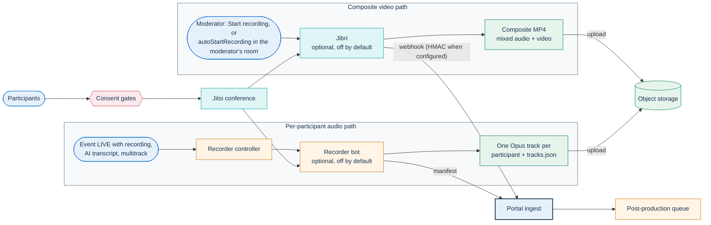
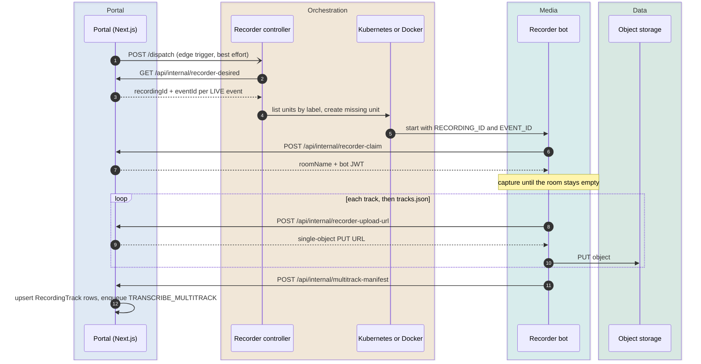
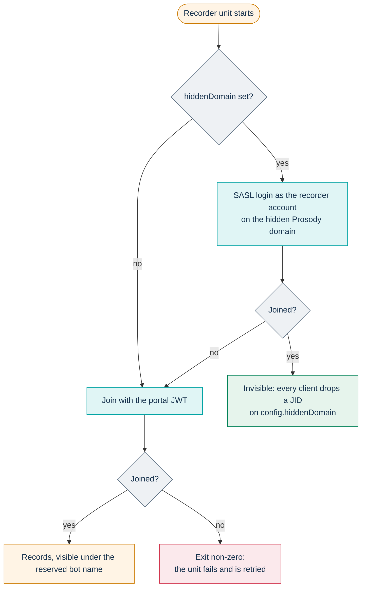
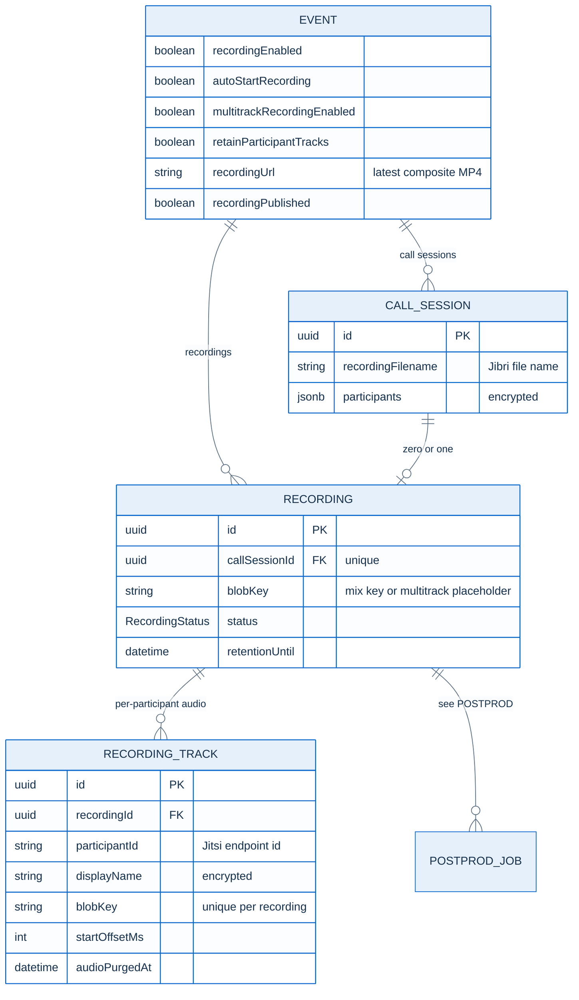
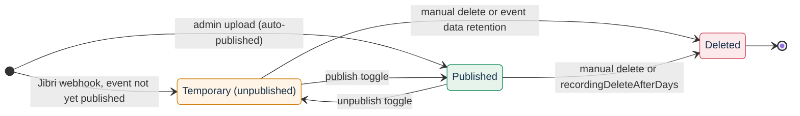

# Recording: composite video and per-speaker audio

PA Webinar can capture an event in two independent ways. **Jibri** records the
conference as one composite MP4 with mixed audio: it is the only path that
produces video, and it feeds the published recording, the video library and
AI post-production. The **multitrack recorder** records one audio track per
participant so that the transcript can say who said what with certainty. Both
are optional and off by default. An event can use either path, both, or
neither.

This page owns the mechanisms: how each path is triggered and orchestrated,
the ingest contracts, the hidden-domain mechanism, the runners, and the
lifecycle states up to the hand-off to post-production. Other topics live on
their owner pages:

| Topic | Owner |
|---|---|
| Retention durations, legal bases, data-subject rights | [GDPR](../GDPR.md), [Recordings, voice data and AI outputs](../privacy/recordings-and-ai.md) |
| Storage providers, credentials, key layout of other producers | [Object storage](../configuration/storage.md) |
| Helm values that turn each path on | [Setting up recording](../operations/recording-setup.md) |
| Transcription, summaries, translation, dubbing, the archive | [AI post-production](../POSTPROD.md) |
| Node pools, sizing, kernel modules on nodes | [Node pools](../INFRASTRUCTURE.md#node-pools), [Installing PA Webinar](../install/README.md) |
| The decision records | [ADR-006](../adr/006-recording-and-storage.md), [ADR-013](../adr/013-multitrack-speaker-attribution.md) |

## Two paths, two purposes

| | Composite video (Jibri) | Per-participant audio (multitrack recorder) |
|---|---|---|
| Output | One MP4 per recording session, mixed audio and video | One Opus track per participant session, plus a `tracks.json` manifest |
| Purpose | Playback, publication, video library, AI transcript from the mix | Exact speaker attribution in the AI transcript; optionally a downloadable archive |
| Who starts it | A moderator (**Start recording**), or automatically when a moderator's room loads with `Event.autoStartRecording` on | The recorder controller, when an eligible event is `LIVE` |
| Event flags | `recordingEnabled` (+ optional `autoStartRecording`) | `recordingEnabled` + `aiTranscriptEnabled` + `multitrackRecordingEnabled` |
| Default | Off: `jitsi-meet.jibri.enabled: false`, every event flag `false` | Off: `recorder.enabled: false`, every event flag `false` |
| Runs as | The Jitsi Jibri pod (headless Chrome capturing a virtual display) | A headless Chrome Job (Kubernetes) or container (Docker), one per recording |
| Needs | The ALSA loopback kernel module on its node and elevated container privileges (the bundled subchart adds `SYS_ADMIN`) | An ordinary node, no special privileges |
| Hands off with | An HMAC-signable webhook, `POST /api/webhooks/recording` | A manifest, `POST /api/internal/multitrack-manifest` |
| Post-production root job | `TRANSCRIBE` (diarization on the mix) | `TRANSCRIBE_MULTITRACK` (one known speaker per track) |



Why two paths: a mixed track destroys the information Jitsi already has about
whose voice is whose. Diarizing the mix guesses speakers acoustically and
assigns one speaker per segment, so overlaps are lost and every speaker label
must be mapped to a name by hand. A separate track per participant carries its
identity from the portal-issued JWT and keeps overlapping speech on separate
tracks. [ADR-013](../adr/013-multitrack-speaker-attribution.md) records the
options that were weighed.

## Consent gates

Both capture paths rely on consent that the portal collects before a person
reaches the conference; neither filters what it records. `Event.recordingEnabled`
adds a recording consent to registration and, when the installation can record
(Jibri is expected, or `RECORDER_CONTROLLER_URL` is set:
`app/src/lib/recording/availability.ts`), a consent dialog before the room loads
and a notice in the waiting room; `Event.multitrackRecordingEnabled` adds
`consentMultitrack` and a waiting-room gate. Holders of moderator and speaker links skip the dialog, yet
the recorder captures every remote audio track, theirs included. The consent
model and exact texts are in [GDPR](../GDPR.md#consent-model), the gate in
[The waiting room](waiting-room.md#consent-and-transparency-notices), and the
gaps under [Known limitations](#known-limitations).

## Composite video with Jibri

### Starting and stopping

The moderator control bar shows a recording button when the event has
recording enabled. The room enables it only while `GET /api/status`, polled
every few seconds while the event is `LIVE`, reports `jibriStatus: 'ready'`.
That takes recordings storage configured (`RECORDING_STORAGE_TYPE` set and not
`local`) and a Jibri health check that answers `HEALTHY` at
`JIBRI_HEALTH_URL`, which the chart sets whenever `jitsi.enabled` is true.
Outside Kubernetes, with no `JIBRI_HEALTH_URL`, Jibri is assumed ready. Until
then the button is disabled and shows **Recording starting…**; with no
recordings storage it stays that way. Once enabled it toggles between **Start
recording** and **Stop recording**. The toast **Recording unavailable — Jibri
not configured** appears when a start command still fails after its retries.

When a moderator's room is ready on a `LIVE` event with recording enabled, and
`/api/status` reports Jibri ready, the room either:

- asks **Start recording?** (**Start now** / **Later**), or
- starts recording without asking when `Event.autoStartRecording` is on (admin
  toggle **Start recording automatically**, default off). Instant calls are
  created with recording enabled and automatic start off.

Both run in the moderator's browser: with no moderator in the room, nothing
starts.

Starting sends the IFrame API command `startRecording` with `mode: 'file'`,
retried a few times with a growing delay while Jibri joins. Stopping sends
`stopRecording('file')` and disables the button for a short cooldown. Each
start/stop pair produces its own MP4 and its own webhook.

Jibri capacity comes from the JVB scaler: it asks for one Jibri replica while
any `LIVE` or `PROVISIONING` event has recording enabled, and zero otherwise
(see [Scaling the media plane](scaling.md)). With the chart's scaler, one
composite recording runs at a time.

### From MP4 to recording: the finalize contract

When a recording stops, Jibri runs its finalize script with the recording
directory as argument. The script shipped with the chart,
`infra/helm/pa-webinar/files/jibri-finalize.sh`:

1. reads duration and size with `ffprobe`;
2. re-muxes the file with `-movflags +faststart` (no re-encode), so the index
   sits at the front and the file streams from object storage;
3. derives the room name from the file name (`<room>_<yyyy-mm-dd-HH-MM-SS>.mp4`)
   and calls `POST /api/internal/recording-upload-url` with `x-api-key:
   CRON_API_KEY` and `{roomName, filename}`. The portal rejects file names
   containing `/` or `..`, and returns a write URL for the single object
   `recordings/<filename>`, valid for 30 minutes, plus the object's URL. The
   storage credentials never reach the Jibri pod;
4. `PUT`s the file to that URL;
5. posts `{roomName, recordingUrl, filename, duration, fileSize}` to
   `POST /api/webhooks/recording`;
6. deletes the local recording directory.

The webhook finds the event by `jitsiRoomName` and, in one transaction:

- sets `Event.recordingUrl`, `recordingDuration` and `recordingFileSize`, so the
  event always points at its latest MP4. It leaves `recordingPublished`
  unchanged (see [States of the event's video](#states-of-the-events-video));
- creates a `CallSession` (ended now) and its `Recording`, whose `blobKey` is
  the MP4's storage key. An optional `participants` array in the payload is
  capped and stored encrypted on the `CallSession`;
- enqueues post-production with a `TRANSCRIBE` root job when the event has
  `aiTranscriptEnabled` (the enqueue is a no-op while the site-wide AI pipeline
  switch is off).

If the event has a multitrack `Recording` that still carries its placeholder
key (see [below](#when-a-recorder-is-wanted)), the webhook attaches the MP4 to
that row instead of creating a second one, and does not enqueue anything: the
multitrack pipeline starts from the track manifest. The attach replaces the
placeholder key, so a later MP4 of the same event attaches only to a new
placeholder, if one has been created since (see
[When a recorder is wanted](#when-a-recorder-is-wanted)); otherwise it gets
its own `Recording`, like any Jibri-only event.

### Webhook authentication

| Portal has `RECORDING_WEBHOOK_SECRET` | The request must carry |
|---|---|
| Yes | `Authorization: Bearer <CRON_API_KEY>` **and** `X-Webhook-Signature: sha256=<hex>`, an HMAC-SHA256 of the raw body with the secret |
| No | The bearer only; the portal logs a one-time warning |

The script adds the signature only when `RECORDING_WEBHOOK_SECRET` is set in
the Jibri container and `openssl` is available, so the secret must be set on
both sides.

If the upload succeeds but the webhook fails, the object exists but nothing
links it to the event. The recordings reconcile job lists it as an orphan; it
does not re-link it (see [Background jobs that touch
recordings](#background-jobs-that-touch-recordings)).

### Where the finalize script comes from

The chart renders the script as the ConfigMap `<fullname>-jibri-finalize` when
`jitsi.enabled` and `jitsi-meet.jibri.enabled` are both true, but does not
mount it in the Jibri pod or pass it its variables: that wiring is an operator
step, described in
[Setting up recording](../operations/recording-setup.md#mount-the-finalize-script).
`infra/jitsi/jibri-finalize.sh` is an older standalone variant that the chart
does not use (see [`infra/jitsi/README.md`](../../infra/jitsi/README.md)).

## Per-participant audio with the multitrack recorder

The multitrack path has three parts: the portal decides which recordings are
wanted and mints every credential; a small **recorder controller** keeps one
recorder unit running per wanted recording; the **recorder bot** captures,
uploads and reports. Component details are in
[`infra/recorder/README.md`](../../infra/recorder/README.md) and
[`infra/recorder-controller/README.md`](../../infra/recorder-controller/README.md).

### When a recorder is wanted

`GET /api/internal/recorder-desired` (authenticated with `x-api-key:
CRON_API_KEY`) returns one entry per event that is:

- `LIVE`, and
- `recordingEnabled`, `aiTranscriptEnabled` and `multitrackRecordingEnabled`.

For each, the portal makes sure a multitrack `Recording` exists and returns its
id. The row is created early, during the event, because the recorder needs a
`recordingId` long before any file exists: a dedicated `CallSession` (start =
the event's `startsAt`) and a `Recording` whose `blobKey` is the placeholder
`recordings/multitrack/<eventId>/`. The portal looks the row up by that
placeholder key (`ensureMultitrackRecording` in
`app/src/lib/recorder/lifecycle.ts`), so repeated calls, including after the
event goes `LIVE` again, reuse one multitrack `Recording` per event only while
the row still carries the placeholder. A Jibri webhook replaces the placeholder
with the MP4 key (see [above](#from-mp4-to-recording-the-finalize-contract)).
If the event is still `LIVE` at that point, the next call creates a second
`CallSession` and `Recording`, and the controller starts a second recorder for
it (see [Known limitations](#known-limitations)). The controller never touches
the database.

### Edge and level triggers

The controller runs one reconcile function from two triggers:

- **Level-triggered (the backbone).** Every `RECONCILE_INTERVAL_MS` (30 s by
  default; Helm `recorder.controller.reconcileIntervalMs`) it reads the desired
  list and compares it with the units that exist. This repairs lost triggers,
  restarts after crashes and removes duplicates.
- **Edge-triggered (latency).** When a call from the JVB scaler to
  `/api/internal/jvb-desired-replicas` moves at least one event from
  `PROVISIONING` to `LIVE`, and `RECORDER_CONTROLLER_URL` is set, the portal
  sends a fire-and-forget `POST /dispatch` (no body) to the controller, which
  answers `202` and reconciles at once. The chart sets
  `RECORDER_CONTROLLER_URL` on the app whenever `recorder.enabled` is true.

Events that become `LIVE` another way (an instant call, or **Start event** from
the room or the administration area, which sets `LIVE` directly; see
[Event lifecycle](event-lifecycle.md)) are picked up by the next tick. A woken
event (`POST /wake`) returns to `PROVISIONING` and reaches `LIVE` through the
scaler's step, which fires the edge trigger. Without the scaler, the lifecycle
cron fires the same trigger when it opens a room at its start time. Reconciles are serialized: a
trigger that arrives while one is running is dropped, and the next tick covers
it. The controller also serves `GET /healthz`.

### Reconcile rules

The decision logic is a pure, unit-tested function
(`infra/recorder-controller/src/reconcile.ts`); the runners only do I/O.

- One unit per `recordingId`, with a deterministic name
  (`recorder-` + the first 20 hex characters of the id) and the labels
  `app.kubernetes.io/component=recorder`, `pa-webinar.it/recording-id` and
  `pa-webinar.it/event-id`. A name conflict on create counts as success.
- A desired recording with no active or succeeded unit gets a new one; a
  failed unit is replaced once it is gone.
- When two active units exist for the same recording (a race between the edge
  and level triggers), the first is kept and the others are deleted.
- The controller does not stop a recorder when its event leaves `LIVE`. The
  recorder ends by itself (see [Capture inside the bot](#capture-inside-the-bot)).
  Finished units are garbage-collected by the runner: after
  `ttlSecondsAfterFinished` on Kubernetes, immediately on Docker, where
  containers are auto-removed. If the event is still `LIVE` at that point, a
  new run starts for the same recording.

### The claim model

The controller holds no Jitsi or storage credentials: it starts a unit with
only `RECORDING_ID` and `EVENT_ID` (plus the static settings of its runner).
Everything else is minted by the portal when the bot asks for it, scoped to
that one recording.



| Call | Request | Response and rules |
|---|---|---|
| `POST /api/internal/recorder-claim` | `{recordingId}` | `{recordingId, eventId, roomName, jwt}`. The JWT is a non-moderator Jitsi token for the event's room, with the reserved recorder display name and the stable user id `rec-bot-<recordingId>`. Its lifetime is the time left until the event's `endsAt` plus 30 minutes, at least 10 minutes and at most 6 hours. |
| `POST /api/internal/recorder-upload-url` | `{recordingId, blobKey, contentType}` | `{uploadUrl}`: a `PUT` URL for that single object in the recordings storage domain, valid 30 minutes. Refused with `409` when the recording is `ARCHIVED` (retention already ran), and with `422` unless the key is confined to `recordings/multitrack/<eventId>/<recordingId>/`: relative segments of letters, digits, `.`, `_` and `-`, none starting with a dot, at most four deep (`app/src/lib/recorder/blob-key.ts`). |
| `POST /api/internal/multitrack-manifest` | `{eventId, recordingId, tracks[]}` | Described in [Ingest contract](#ingest-contract). |

All three authenticate with `x-api-key: CRON_API_KEY`. The bot asks for one
upload URL per object because participants are not known at claim time; a URL
per object keeps each write permission as narrow as possible.

### Capture inside the bot

The bot is headless Chrome driven by Puppeteer, running the same
`lib-jitsi-meet` the Jitsi web client uses. It opens
`https://<JITSI_DOMAIN>/`, loads `libs/lib-jitsi-meet.min.js` and `config.js`
from the Jitsi web server, and joins with the deployment's own configuration,
so bridge-channel settings match those of real clients.

- **Receive-only.** It creates no local tracks, and asks the bridge for every
  participant (`lastN: -1`) with video at height 0.
- **Direct media path.** The bot keeps the served configuration but overrides
  ICE: it sets `iceTransportPolicy: 'all'` (also for peer-to-peer) and
  `useStunTurn: false` (`infra/recorder/src/capture.ts`). A relay-only policy
  or TURN server in `config.js` does not apply to it, so the bot needs direct
  reachability to the bridge's media port through its host candidates (in a
  cluster, the JVB pod or node address) rather than the public TURN relay.
  NetworkPolicies and single-VM setups must allow that path.
- **One recorder per remote audio track.** For each remote audio track it
  builds an audio-only stream, plays it through a hidden `<audio>` element,
  routes it through WebAudio, and records it with a `MediaRecorder`
  (`audio/webm;codecs=opus`, 32 kbps, 3-second chunks streamed to Node and
  appended to a file). The container starts a PulseAudio null sink so that
  Chrome has an output device; without the playing element and the sink,
  headless Chrome decodes remote audio as silence.
- **Track sessions.** Each track gets a `trackFileId` of
  `<participantId>-<sequence>`, where `participantId` is the Jitsi endpoint id.
  A rejoin or an unmute produces a new session and a new file instead of
  overwriting the previous one.
- **Timing.** A track's origin is the moment its `MediaRecorder` starts. The
  manifest's t0 is the earliest origin; each track carries `startOffsetMs`
  from t0 and `durationMs`. Tracks with no bytes are dropped.
- **Names.** Each track takes the participant's Jitsi display name, which comes
  from the portal-issued JWT. It travels in plain text in the manifest and the
  ingest body; the bot holds no PII key and the portal encrypts the name on
  ingest.
- **Ending.** The bot leaves when the room has been empty for
  `IDLE_TIMEOUT_SEC` after someone was seen (90 s by default), when nobody
  arrives within `INITIAL_GRACE_SEC` (900 s in the code, 300 s in the chart's
  `values.yaml`), after `MAX_DURATION_SEC` (4 h by default), or when the
  connection or conference fails. In every case it saves what it has.
- **Exit status.** If the bot never joined the conference it exits non-zero, so
  the unit fails and is retried. If it joined but captured nothing, it exits
  normally without uploading or reporting.

Uploads run four at a time, with three attempts per object. A track that still
fails is skipped; `tracks.json` is uploaded last and lists only the tracks that
made it, so the portal never references a missing object.

### Storage layout and manifest

```text
recordings/multitrack/<eventId>/<recordingId>/
  audio/<trackFileId>.opus    one file per participant track session
  tracks.json                 the manifest
```

The files are WebM containers carrying Opus; `.opus` is a storage label, and
the worker probes the content. Path segments are sanitized to letters, digits,
`_` and `-`. The manifest (`infra/recorder/src/manifest.ts`) looks like this:

```jsonc
{
  "version": 1,
  "eventId": "<eventId>",
  "recordingId": "<recordingId>",
  "roomName": "<room>",
  "recordingStartedAtMs": 1760000000000,
  "tracks": [
    {
      "participantId": "<endpointId>",
      "trackFileId": "<endpointId>-0",
      "displayName": "<participant name, plain text>",
      "trackKey": "recordings/multitrack/<eventId>/<recordingId>/audio/<endpointId>-0.opus",
      "startOffsetMs": 0,
      "durationMs": 5000
    }
  ]
}
```

The layout is shared by the recorder, the portal's confinement checks and the
post-production worker; changing it means changing all three.

### Ingest contract

`POST /api/internal/multitrack-manifest` takes `{eventId, recordingId,
tracks[]}`, where each track has `participantId`, `displayName`, `blobKey`,
`mimeType`, `sizeBytes`, `startOffsetMs` and `durationMs` (at least one and at
most 500 tracks). The portal:

1. checks that the recording exists and belongs to `eventId`, and that every
   `blobKey` starts with the string `recordings/multitrack/<eventId>/<recordingId>/`;
2. upserts one `RecordingTrack` per `(recordingId, blobKey)`, encrypting the
   display name, so a retried ingest updates rather than duplicates;
3. if every track's byte rate is under the floor set in
   `app/src/lib/ai/track-silence.ts` and the event has AI transcription on,
   marks the recording `POSTPROD_FAILED` instead of enqueueing. The tracks
   stay stored; the failure is visible in the administration area and can be
   re-run. The guard fails open: a track without size or duration disables it;
4. otherwise enqueues post-production with a `TRANSCRIBE_MULTITRACK` root job.
   The enqueue is idempotent per recording and pipeline run
   (`Recording.runCount`).

The manifest carries no HMAC. Its authenticity rests on the shared
`CRON_API_KEY` and on the recording-to-event match. Path confinement is
weaker here than for writes: the upload-URL route checks each key segment by
segment (`isConfinedBlobKey` in `app/src/lib/recorder/blob-key.ts`), but the
ingest compares only a string prefix. A manifest can therefore name keys such
as `…/<recordingId>/../../x`, which leave the folder wherever a client or
gateway normalizes the path, and the consumers of `RecordingTrack.blobKey`
(the worker's download, the purge jobs' deletes) act on them.

### Trust boundaries

- The controller holds `CRON_API_KEY`, which it uses only to read the desired
  list, and no Jitsi or storage credential. Its namespaced role can create
  Jobs, though, and a Job can mount any Secret in the release namespace: treat
  the controller's service account as being as sensitive as those Secrets.
- The bot holds `CRON_API_KEY`, which is the installation-wide machine
  credential for internal and scheduled endpoints (see
  [Identity, access and tokens](identity-and-access.md)). It receives its
  Jitsi JWT and each storage write permission from the portal, and the portal
  confines both to one room and one folder. The keys it reports in the
  manifest are checked less strictly (see [Ingest contract](#ingest-contract)).
- `/dispatch` is unauthenticated. It only triggers a reconcile, which reads the
  desired state from the portal, so a stray call cannot create a recorder the
  portal does not want.

## The invisible bot: hidden Prosody domain

By default the bot joins with the portal JWT and is a visible participant under
a reserved display name; the portal's own participant counts and analytics
exclude it by that name. Setting `recorder.hiddenDomain` makes it invisible
with Jitsi's native bot mechanism, the one Jibri uses.

Prosody serves a hidden virtual host (`XMPP_HIDDEN_DOMAIN`, which the bundled
subchart sets to `hidden.<xmpp domain>`, for example `hidden.meet.jitsi`). Each
Jitsi client compares the domain of a participant's real JID with
`config.hiddenDomain` and drops matching participants before they reach its
state: no tile, no list entry, no join notification, not counted. Hiding the
bot does not hide the recording: the consent gates still apply.

With `recorder.hiddenDomain` set, the recorder Job receives `JITSI_XMPP_DOMAIN`,
`JITSI_XMPP_USER` and `JITSI_XMPP_PASSWORD` (from the Secret named in
`recorder.xmppSecretName`), and the bot logs in with SASL as
`<user>@<hiddenDomain>` instead of presenting the JWT. The chart refuses to
render when the domain is set without the Secret name.



For the login to work, the recorder account must exist on Prosody, be
allowlisted on the MUC so it can enter without a token (the single account,
never the whole domain), and have a pinned password. The values are in
[Setting up recording](../operations/recording-setup.md#make-the-bot-invisible);
the Prosody side is in [How PA Webinar extends Jitsi Meet](jitsi-integration.md).

### Fallback to a visible join

A rejected login (a regenerated password, a missing allowlist entry) must not
cost the event its audio. When the bot never joined the conference with the
hidden-domain login, it runs the whole capture again with the portal JWT and
is visible for the rest of the event. The condition is "never joined", checked
after the capture ends: a room that simply stayed empty is not retried, and a
disconnection in the middle of the event does not make the bot reappear as a
visible participant.

## Runners

The controller creates recorder units through a `RecorderRunner` interface
with two implementations, chosen with `RUNNER`. The reconcile logic, the labels
and the naming are the same in both.

| | Kubernetes (`RUNNER=kubernetes`, Helm) | Docker (`RUNNER=docker`, Compose) |
|---|---|---|
| Unit | A `Job` created from a suspended CronJob template | A container created through the Docker socket |
| Recorder settings | The CronJob's pod template, rendered from `recorder.*` | `RECORDER_IMAGE`, `DOCKER_NETWORK` and every `RECORDER_ENV_<NAME>` variable, passed as `<NAME>` |
| Clean-up | `ttlSecondsAfterFinished` | `AutoRemove` when the container exits |
| Privileges | Namespaced Role only | The Docker socket, which is root-equivalent on the host |

### Kubernetes

Both objects render only when `recorder.enabled` and
`recorder.controller.enabled` are true.

- **Controller:** a one-replica `Deployment` with the `Recreate` strategy (the
  reconcile is idempotent, so no leader election), non-root with a read-only
  root filesystem, a `ServiceAccount`, and a `Service` whose port is named
  `ctrl` so the pod never joins the app Service's endpoints. Its `Role` allows
  `get`/`list` on `batch/cronjobs`, `get`/`list`/`create`/`delete` on
  `batch/jobs`, and `get`/`list` on `pods` and `pods/log`. Nothing is
  cluster-wide.
- **Recorder template:** the CronJob `<fullname>-recorder`, with `suspend: true`
  and a yearly schedule, never runs by itself. The controller copies its
  `jobTemplate.spec` and injects `RECORDING_ID` and `EVENT_ID`. From
  `values.yaml`: `backoffLimit: 1`, `activeDeadlineSeconds: 21600` (6 hours),
  `ttlSecondsAfterFinished: 600`, an `emptyDir` work volume capped by
  `workSizeLimit`, and requests of 1 CPU and 2 GiB. Node disruptions do not
  count as failures (`podFailurePolicy`), the pod runs as non-root with all
  capabilities dropped and without a service-account token.
- **Placement:** the recorder runs on the ordinary application node pool.
  `recorder.nodeSelector` and `recorder.tolerations` are empty by default; it
  needs no GPU and no media node.

### Docker (single VM)

The Compose file defines `recorder-controller` under the `recorder` profile
(`docker compose --profile recorder up`), with `RUNNER=docker` and
`/var/run/docker.sock` mounted. It is the way to run per-participant recording
on a single VM, where Jibri is impractical.

As shipped, the Compose file does not complete a recording; the missing
settings are listed in
[Setting up recording](../operations/recording-setup.md#docker-compose-the-recorder-profile).
Its `cron` loop calls only `email-outbox`, `reminders` and `cleanup`: without
`multitrack-purge`, `postprod-retention` and `recordings-reconcile`, nothing
removes track audio or `tracks.json` files, and without
`jvb-desired-replicas` the edge trigger never fires (the reconcile tick still
runs).

### Images

The bot and controller images are `ghcr.io/italia/pa-webinar-recorder` and
`ghcr.io/italia/pa-webinar-recorder-controller`, published with a moving
`:dev` tag (see [CI, images and releases](../development/ci-and-release.md)).
The chart's default `imagePullPolicy` is `IfNotPresent`, so a node can keep
serving an old image under the same tag; pin a digest or use `Always` when the
cluster can reach the registry.

## Recording lifecycle

### Data model

`schema.prisma` is the authority. The post-production models hanging off
`Recording` (jobs, artifacts, speakers) are drawn in
[AI post-production](../POSTPROD.md).



Three layers have their own states:

- **the event's video**, tracked on `Event` (below);
- **the `Recording` row**, whose `RecordingStatus` (`READY`, the
  `POSTPROD_*` states, `ARCHIVED`) follows the AI pipeline and its retention,
  owned by [AI post-production](../POSTPROD.md);
- **each `RecordingTrack`**: present, then audio purged (`audioPurgedAt` set),
  then the row deleted.

### States of the event's video



- **Temporary (unpublished).** The webhook replaces the event's video
  (`Event.recordingUrl`) and leaves `recordingPublished` as it is, so an MP4 on
  an unpublished event starts here, while one on an already published event
  replaces the public video at once. A temporary recording appears in the
  administration area; the public playback route refuses it. It is deleted
  together with the event's participant data when the event's data retention
  expires.
- **Published by upload.** An administrator, or the organizer who owns the
  event, can upload a video to an event; an administrator can also create a
  publication. Attaching a video this way publishes it unless the caller opts
  out (see
  [The recording and the video library](event-journey.md#the-recording-and-the-video-library)).
- **Published.** The event's recording panel toggles `recordingPublished` (the
  portal stamps `recordingPublishedAt`) and can set `recordingDeleteAfterDays`
  from a fixed list of options. A published video is exempt from the event's
  data retention: it lives until it is deleted by hand or until
  `recordingDeleteAfterDays` have passed since publication.
- **Deleted.** `DELETE /api/events/<slug>/recording` (moderator link) removes
  the stored objects, clears the event's recording fields and writes a
  `RECORDING_DELETED` entry to the GDPR audit log. The cleanup job deletes the
  video when either retention window ends.

A separate field, `Event.tempRecordingUrl`, holds an optional catch-up URL that
the waiting room plays while the event is `LIVE`. No component of the platform
fills it automatically: it is set through the event update API. The cleanup
job's fixed-window deletion applies only when `Event.tempRecordingStartedAt`
is set, and the update API does not set it. A URL set through the API is
therefore removed by `DELETE /api/events/<slug>/recording`, or its object is
deleted when the event's data retention expires. The durations of every window
are in [GDPR](../GDPR.md).

### Per-participant tracks

Tracks are intermediate input. By default the `multitrack-purge` job deletes a
track's audio as soon as a `TRANSCRIBE_MULTITRACK` job for its recording is
`DONE` and no transcription or archive job that reads the tracks is still
pending or running, then stamps `audioPurgedAt`. With **Keep per-participant
tracks** (`Event.retainParticipantTracks`) on, `multitrack-purge` skips them,
which makes the downloadable archive and per-speaker playback possible. Its
branch for kept tracks waits on `Recording.retentionUntil`, which the platform
never sets, so kept tracks are deleted by `postprod-retention` once the event
is `ENDED` or `ARCHIVED` and its data retention (`endsAt` +
`dataRetentionDays`) has passed, whether or not the video is published. That
job exists in the chart only when `postprod.enabled` and
`postprod.retention.enabled` are both true. The retention regimes are
described in [Recordings, voice data and AI outputs](../privacy/recordings-and-ai.md).

### Background jobs that touch recordings

| Job | What it does to recordings |
|---|---|
| `cleanup` | Deletes catch-up URLs past their fixed window (only when `tempRecordingStartedAt` is set) and published videos past `recordingDeleteAfterDays`. When an event's data retention expires, it deletes the objects of the unpublished video and of the catch-up URL, deletes the track rows whose audio was already purged, and clears the participant lists of its call sessions. |
| `multitrack-purge` | Deletes per-participant track audio once transcription is done, for events that do not keep their tracks. Its branch for kept tracks applies only when `Recording.retentionUntil` is set, which the platform does not do. In the chart it exists only when `postprod.enabled` is true. |
| `postprod-retention` | Purges post-production artifacts and remaining tracks, including kept tracks, once the event's data retention has passed; for a published video it purges only the tracks. See [AI post-production](../POSTPROD.md). |
| `recordings-reconcile` | Lists every object under `recordings/` in the recordings storage domain, by key without the `recordings/` prefix, and compares it with names derived from `Event.recordingUrl` and `CallSession.recordingUrl` (the URL path after its first segment) and with `CallSession.recordingFilename`. An object with no match becomes an orphan, shown in the **Orphans** tab of **Video recordings** in the administration area. Orphans are deleted after `SiteSetting.orphanRecordingGraceDays` unless an administrator marks them **Keep**; **Delete now** deletes them at the next run. It never re-links an orphan to an event. See [Known limitations](#known-limitations) for what the match misses. |

Schedules, Helm keys and what breaks when a job does not run are in
[Scheduled and background jobs](background-jobs.md).

### Hand-off to post-production

| Case | Root job | Enqueued by |
|---|---|---|
| Jibri only | `TRANSCRIBE` on the MP4 | The webhook, when `aiTranscriptEnabled` |
| Multitrack only | `TRANSCRIBE_MULTITRACK` on the tracks | The manifest ingest |
| Both | `TRANSCRIBE_MULTITRACK`; the MP4 is attached to the same `Recording`, where the archive job finds it | The manifest ingest (the webhook enqueues nothing) |

Enqueueing snapshots the event's AI flags onto the recording and does nothing
while the site-wide AI pipeline switch is off. On demand, an `ARCHIVE` job can
mux the composite video, the retained per-participant tracks (labeled with
names) and the subtitles into one MKV, available to administrators and the
event's organizer from the administration area, never through a moderator
link or publicly. From here on, the pipeline is described in
[AI post-production](../POSTPROD.md).

## Playback

- **Public video.** The event page plays the recording through
  `GET /api/events/<slug>/recording`, which answers only for a published
  recording of an `ENDED` or `ARCHIVED` event (`404` without a recording, `403`
  otherwise). It redirects (`302`) to a signed read URL valid for 120 minutes,
  so the browser streams straight from object storage with range requests and
  the portal never proxies the bytes. If signing fails, it redirects to the
  stored URL. Which events the **Video library** lists is described in
  [The recording and the video library](event-journey.md#the-recording-and-the-video-library).
- **Progressive streaming.** The faststart re-mux in the finalize script puts
  the index at the start of the file, so playback begins before the download
  ends.
- **Tracks in the player.** The player (`app/src/components/events/video-player.tsx`)
  adds WebVTT subtitles from `/api/events/<slug>/postprod/subtitle/<lang>` and
  alternative audio from `/api/events/<slug>/postprod/dubbed-audio/<lang>`,
  kept in sync with the video and marked as synthetic. When tracks are
  retained, the administration area can play each participant's track at its
  offset. See [AI post-production](../POSTPROD.md).
- **Content Security Policy.** The storage host must be allowed in
  `media-src`; see [Content Security Policy](../SECURITY-CSP.md).

## Known limitations

- **Consent text.** The in-room consent dialog ignores
  `Event.recordingConsentText`. The per-participant consent text states that
  the track is deleted after transcription, and does not change when
  **Keep per-participant tracks** is on.
- **Instant calls.** Guests joining an instant call are not shown the recording
  consent dialog, although the moderator can record.
- **Recording indicator.** Only Jibri raises the in-room **Recording in
  progress** banner.
- **One composite recording at a time.** The JVB scaler asks for at most one
  Jibri replica.
- **A second multitrack recording in one event.** The portal recognizes the
  event's multitrack `Recording` by its placeholder key, and a Jibri webhook
  replaces that key. If a composite recording finishes while the event is
  still `LIVE` (a moderator stops Jibri and starts it again), the next
  desired-state call creates a second multitrack `Recording`, and the
  controller starts a second recorder while the first one is still running.
  The event then gets two sets of tracks and two `TRANSCRIBE_MULTITRACK`
  pipelines.
- **A second recorder run for the same recording.** When a recorder ends while
  its event is still `LIVE`, a new run starts for the same `Recording`. Its
  tracks are stored, but the enqueue is idempotent per pipeline run
  (`Recording.runCount`), so they do not start a new transcription. The ingest
  still resets the recording's status: if every job of the pipeline already
  exists, the status stays `POSTPROD_QUEUED` with nothing to move it on, and
  the public transcript and downloads, which require `POSTPROD_DONE` or
  `POSTPROD_PARTIAL`, disappear. If the second run's tracks are all silent,
  the silence guard marks the whole recording `POSTPROD_FAILED` instead.
- **Orphan sweep and event videos.** `recordings-reconcile` derives a name from
  `Event.recordingUrl` by dropping the URL's first path segment, which matches
  the listed object only for virtual-hosted AWS S3 URLs. On Azure Blob, and on
  S3-compatible storage with a custom endpoint (path-style URLs, the default
  when an endpoint is set, as with MinIO), the derived name keeps the
  `recordings/` prefix and never matches. Jibri MP4s still match through
  `CallSession.recordingFilename`. A video referenced only by
  `Event.recordingUrl`, such as an upload to an event or a publication, appears
  under **Orphans** and is deleted after `SiteSetting.orphanRecordingGraceDays`
  (30 days by default in `schema.prisma`), even when it is published, unless an
  administrator marks it **Keep**. The chart runs the job by default
  (`cronjobs.recordingsReconcile.enabled: true` in `values.yaml`).
- **Orphan sweep and multitrack objects.** `recordings-reconcile` also lists
  the objects under `recordings/multitrack/`, which none of the fields it
  checks reference. Retained tracks and every `tracks.json` therefore appear as
  orphans and are deleted after the grace period unless marked **Keep**. The
  purge jobs delete track audio but not `tracks.json`, which holds display
  names in plain text; in practice the orphan sweep is what removes it.
- **No automatic transcript when the recorder captures nothing.** On an event
  with per-participant recording, the Jibri webhook does not enqueue
  post-production. If the recorder produced no tracks, no pipeline starts
  until an administrator runs it.
- **Webhook failures.** An MP4 uploaded without a successful webhook becomes an
  orphan and is not linked to its event automatically.
- **Compose.** The per-participant path needs the additions listed under
  [Docker (single VM)](#docker-single-vm).

## Related pages

- [Setting up recording](../operations/recording-setup.md): the values that turn each path on.
- [Object storage](../configuration/storage.md): the recordings domain and its providers.
- [AI post-production](../POSTPROD.md): what happens after the hand-off.
- [GDPR](../GDPR.md) and [Recordings, voice data and AI outputs](../privacy/recordings-and-ai.md): retention and legal bases.
- [How PA Webinar extends Jitsi Meet](jitsi-integration.md): Prosody, the hidden domain and the IFrame API.
- [Event lifecycle](event-lifecycle.md) and [Scaling the media plane](scaling.md): when events are `LIVE` and how Jibri is scaled.
- [Data model](data-model.md) and [Scheduled and background jobs](background-jobs.md).
- [ADR-006](../adr/006-recording-and-storage.md) and [ADR-013](../adr/013-multitrack-speaker-attribution.md).
