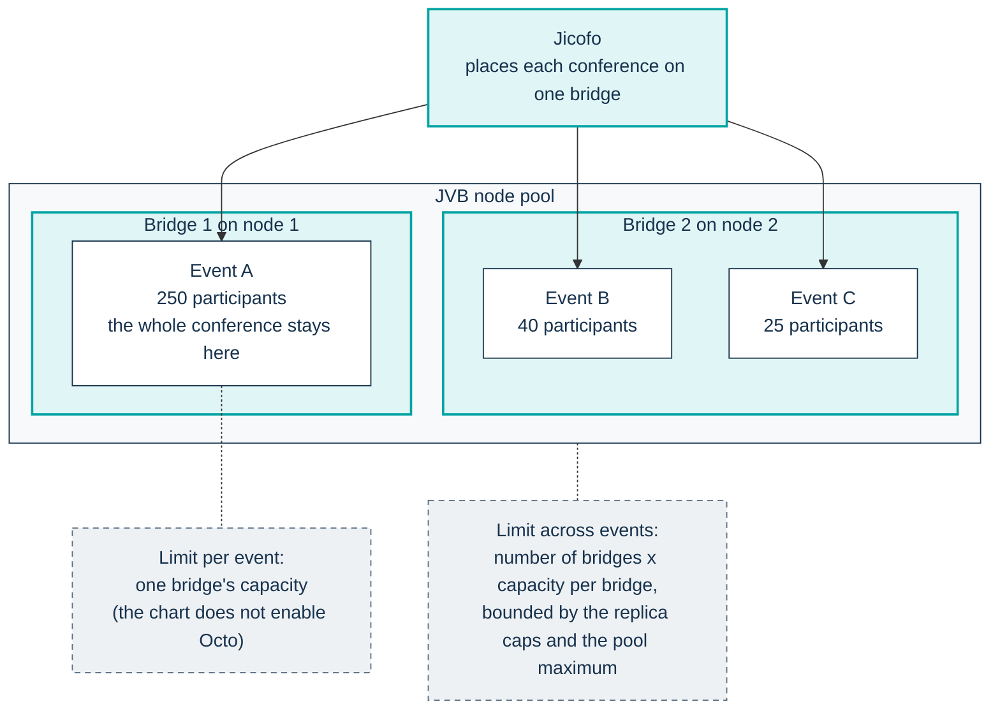
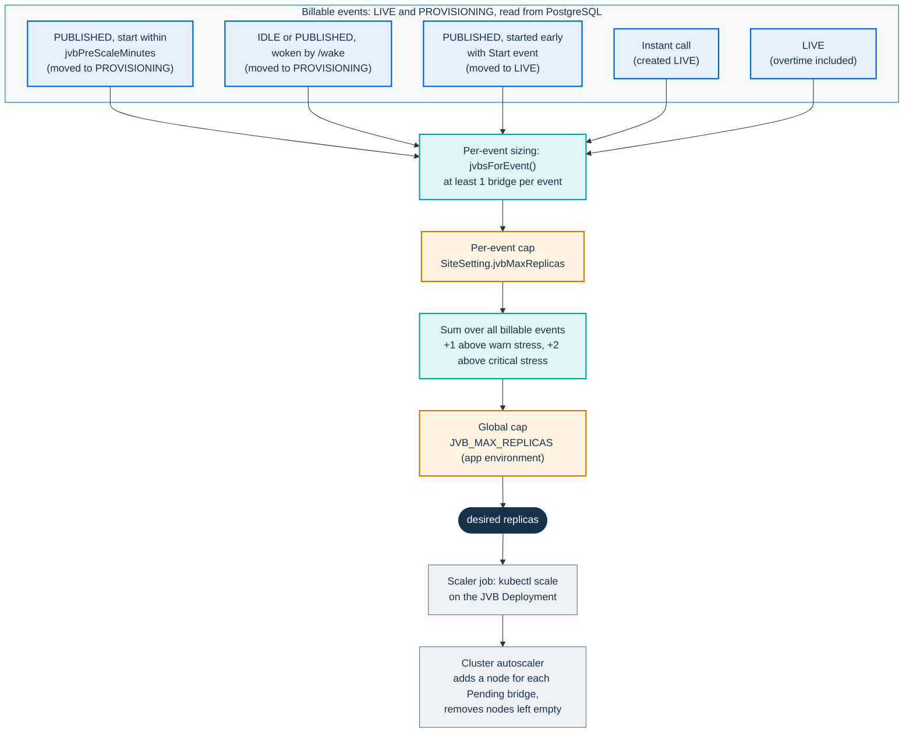
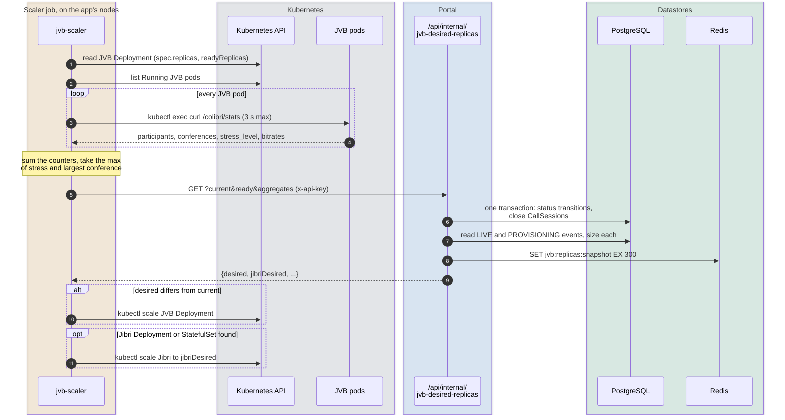
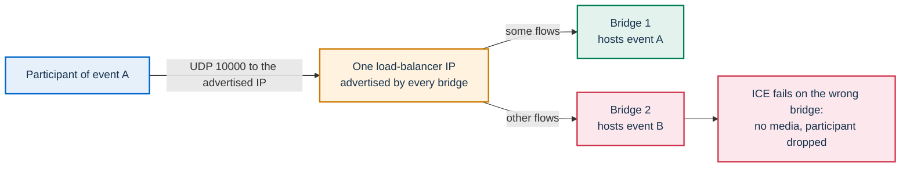

# Scaling the media plane

This page explains how PA Webinar decides how many Jitsi Videobridge (JVB)
instances run, and how Kubernetes turns that number into nodes. It is
written for architects and operators who reason about capacity, and for
developers who work on the scaler.

It describes the model, not the procedures:

- measured results are in [Load testing](../LOAD-TESTING.md);
- choosing hardware and sizing a platform are in
  [Installing PA Webinar](../install/README.md), with the lab measurements in
  [Infrastructure](../INFRASTRUCTURE.md#sizing);
- enabling, tuning, validating and pausing the scaler are in
  [Running the JVB scaler](../operations/jvb-scaler.md);
- the event status machine that the scaler drives is in
  [Event lifecycle](event-lifecycle.md).

The design decision is recorded in
[ADR-007](../adr/007-jvb-scale-to-zero.md).

## Why scale to zero

Bridges are the expensive tier. Every participant's audio and video passes
through a JVB, which forwards each incoming stream to every receiver. A
bridge needs CPU in proportion to its senders and receivers, and it needs a
publicly reachable UDP port. The portal, by comparison, serves pages and
API calls and runs on ordinary nodes.

Events are scheduled, so the platform knows in advance when demand will
arrive. It does not keep bridges running around the clock. It starts them
shortly before an event and releases them once the room has been empty for
a while. Between events the JVB Deployment runs zero replicas, and the
dedicated node pool shrinks to zero nodes.

Some demand arrives with no lead time:

- instant calls, which are created directly in `LIVE`;
- events started early with **Start event**, or revived straight to `LIVE`;
- rooms woken by a visitor through `/wake`, from `IDLE`, or from
  `PUBLISHED` inside the wake window.

The same loop serves all of them, but they pay the full cold start (see
[Cold start and the pre-scale window](#cold-start-and-the-pre-scale-window)).
Events that are already `LIVE` skip the `PROVISIONING` step, so nothing
holds their visitors back while the bridge starts.

Scale to zero exists only in the full profile, that is `jitsi.mode: full`
with `jvbScaler.enabled: true` (it defaults to `false` in
`infra/helm/pa-webinar/values.yaml`). In the simple and standard profiles
the chart renders no scaler. The bridge runs at the fixed
`jitsi-meet.jvb.replicaCount`, and nothing in the chart or in Docker
Compose calls the lifecycle endpoint. [Event lifecycle](event-lifecycle.md)
describes what this means for event statuses. `jitsi.mode: full` does not
move the bridges to a dedicated pool by itself. That comes from
`jitsi-meet.jvb.nodeSelector` and `tolerations`, which the full-profile
example sets (see [The dedicated pool](#the-dedicated-pool)).

## Capacity is two numbers

A question such as "how many participants can we host?" has two answers.
They scale in different ways.

### Per event: one bridge

The chart does not enable Octo, Jitsi's bridge cascading: `octo.enabled`
keeps the jitsi-meet subchart default, `false`. Without cascading, Jicofo
places each conference on a single bridge, and that bridge serves every
participant of the conference. The ceiling for one event is therefore what
one bridge can carry.

To raise that ceiling, make the bridge bigger: more CPU for the JVB
container, on a node that has it. Adding replicas does not help a single
event. The snapshot described below carries Octo counters
(`octoConferences`, `octoEndpoints` and the Octo bitrates), and they stay at
zero while cascading is off.

### Across events: more bridges

Different conferences can sit on different bridges. Jicofo chooses the
bridge for each new conference, and the scaler decides only how many
bridges exist. Capacity across events grows with the number of bridges, up
to the replica caps and the maximum size of the node pool.



### Where the limits are, in the order you meet them

1. **Jibri recordings.** A Jibri pod records one conference at a time, and
   the scaler asks for at most one Jibri replica. It asks for that replica
   whenever any `LIVE` or `PROVISIONING` event has `recordingEnabled`, and
   instant calls always have it. A second event recorded with Jibri at the
   same time has no recorder. The per-participant recorder is scheduled
   separately; see [Recording](recording.md).
2. **An event larger than one bridge.** Without cascading, the only remedy
   is a bigger bridge (see [Per event: one bridge](#per-event-one-bridge)).
3. **Replica caps and pool size.** The global cap discards demand above
   `JVB_MAX_REPLICAS`, and replicas above the node pool's maximum stay
   `Pending`.
4. **Shared signaling.** The jitsi-meet subchart hard-codes one Prosody and
   one Jicofo, and every conference shares them.
5. **Network egress.** A bridge forwards each stream to each receiver, so
   egress grows with receivers multiplied by forwarded streams. Measure it
   before you commit to a capacity figure: see
   [Load testing](../LOAD-TESTING.md).

## Sizing: from an event to a number of bridges

The scaler sizes each event from what the organizer declared, not from how
many people have joined. A reactive margin then adds bridges when measured
load is high. The code is `app/src/lib/jvb-sizing.ts`, and the route that
applies it is `app/src/app/api/internal/jvb-desired-replicas/route.ts`.

### The formula

For each billable event, that is each event in `LIVE` or `PROVISIONING`:

```text
ratio     = video enabled ? senderRatioPct / 100 : 0
senders   = ceil(expectedParticipants × ratio)
receivers = expectedParticipants − senders
cores     = senders / sendersPerCore + receivers / receiversPerCore
bridges   = clamp(1, perEventCap, ceil(cores / cpuCoresPerPod))
```

Then across events:

```text
desired = min(globalCap,
              max(Σ bridges + stressMargin,
                  1 if any billable event else 0))
```

The stress margin is `+1` when the highest bridge stress is above the warn
threshold and `+2` when it is above the critical threshold. Stress is read
from `/colibri/stats` on every bridge. It is capped at 1.0 per bridge and
ignored on bridges with no participants, because an empty or freshly
started bridge can report meaningless values.

### Inputs

| Input | Where it is set | Default and source |
|---|---|---|
| Expected participants, `Event.maxParticipants` | Event wizard, **Expected participants (estimate)**. It is an estimate, not a registration cap | `300` in `app/prisma/schema.prisma`; instant calls use `50` unless the request gives a value (`app/src/app/api/events/instant/route.ts`) |
| Video enabled, `Event.participantsCanStartVideo` | Event audio and video settings, **Participants can start video** | `false` in `schema.prisma`; instant calls set it to `true` |
| Sender ratio, `Event.expectedSenderRatioPct`, falling back to `SiteSetting.defaultSenderRatioPct` | Wizard, **Estimated active share**; site settings, **Infra sizing** tab, **Default sender ratio** | `30` in `schema.prisma` |
| `SiteSetting.jvbSendersPerCore` | **Infra sizing**, **Active senders per core** | `3.125` in `schema.prisma` |
| `SiteSetting.jvbReceiversPerCore` | **Infra sizing**, **Passive viewers per core** | `18.75` in `schema.prisma` |
| `SiteSetting.jvbCpuCoresPerPod` | **Infra sizing**, **vCPU per JVB pod** | `16` in `schema.prisma` |
| `SiteSetting.jvbMaxReplicas`, the per-event cap | **Infra sizing**, **Max JVB replicas** | `6` in `schema.prisma` |
| `SiteSetting.jvbStressWarnPercent`, `jvbStressCriticalPercent` | **Features** tab, **Stress warning threshold (%)** and **Stress critical threshold (%)** | `50` and `70` in `schema.prisma` |
| `JVB_MAX_REPLICAS`, the global cap | App environment (`app.env` in the chart) | `6` in `app/src/lib/jvb-sizing.ts` |

"Video enabled" means that participants can start their camera. It is off
by default, and in that case the formula counts every participant as a
receiver. The few streams sent by moderators and speakers are not modeled
separately.

The admin forms show the same arithmetic before anything runs:

- **Sizing preview** in the **Infra sizing** tab applies the formula to a
  100-participant event with the default sender ratio;
- **Estimated JVB capacity** in the wizard's review step calls
  `jvbsForEvent()` for the event being created.

Both use the site's current settings. Each pod caches the site settings
for 60 seconds, so a change reaches the scaler within about a minute. The
owner of these settings is
[Runtime settings](../configuration/runtime-settings.md).

### A worked example

Take an event with 300 expected participants, **Participants can start
video** turned on, a 30% sender ratio and the defaults above:

```text
senders   = ceil(300 × 0.30)            = 90
receivers = 300 − 90                    = 210
cores     = 90 / 3.125 + 210 / 18.75    = 28.8 + 11.2 = 40
bridges   = ceil(40 / 16)               = 3
```

With video turned off, the ratio collapses to zero: 300 receivers need
16 cores, which is one bridge.

Read a per-event result above 1 carefully. It means the event is larger
than one bridge, as configured. Because the whole conference stays on one
bridge, the extra replicas do not share its load; they only add room for
other conferences. If your largest event produces more than one bridge,
make the bridge bigger rather than relying on replicas.

### Two caps

- `SiteSetting.jvbMaxReplicas` is the **per-event** cap. It clamps each
  event's result before the sum, and an administrator can change it at
  runtime.
- `JVB_MAX_REPLICAS` is the **global** cap. It clamps the final sum. It is
  an environment variable of the app (`app.env.JVB_MAX_REPLICAS` in the
  chart), read once when the process starts.

Only the global cap limits the total number of bridges. The per-event cap
cannot, however low you set it: three events at a cap of 1 still ask for
three bridges.

### Align the defaults with your bridges

The sizing defaults describe a 16-core bridge: 300 receive-only viewers, or
50 participants who all send, per bridge (see the comments in
`jvb-sizing.ts`). The JVB resources that the chart ships are far smaller:
`jitsi-meet.jvb.resources` in `values.yaml` requests one CPU, with a limit
of three. The bridge pools of the reference modules in `infra/tofu/aks`,
`infra/tofu/gke` and `infra/tofu/eks` use 4-vCPU machines by default.

If the defaults stay unchanged on small bridges, the scaler believes that
each bridge holds several times what it can. To align them:

1. Give the JVB container the CPU that you want it to have, with the
   request equal to the limit, on a node large enough to hold it.
2. Set **vCPU per JVB pod** (`jvbCpuCoresPerPod`) to that number.
3. Keep the per-core ratios until your own measurements say otherwise.

[Requirements](../install/README.md#requirements) covers choosing the machine, and
[Load testing](../LOAD-TESTING.md) covers measuring it.

### From demand to bridges



## One scaler tick

The scaler is a Kubernetes CronJob,
`infra/helm/pa-webinar/templates/cronjob-jvb-scaler.yaml`. It is a shell
script that collects facts from the cluster and asks the portal what to do.
The portal decides; the job applies the decision.



### The job

- **When it exists.** The CronJob renders only when `jitsi.enabled` is
  `true`, `jitsi.mode` is `full` and `jvbScaler.enabled` is `true`.
- **Cadence.** `jvbScaler.schedule` is every two minutes (`*/2 * * * *`)
  in `values.yaml`; the full-profile example sets every five. With
  `concurrencyPolicy: Forbid`, a slow tick makes the next one skip instead
  of queueing. `activeDeadlineSeconds: 240` caps a whole run.
- **Where it runs.** The job uses the app's `nodeSelector` and
  `tolerations`, so it runs where the app runs (the application pool when
  `app.nodeSelector` is set). It has no toleration for the bridge pool's
  taint, so it never lands there and cannot keep that pool awake.
- **Permissions.** The job has its own ServiceAccount (`pa-webinar-scaler`
  for a release named `pa-webinar`), bound to a namespaced Role. The Role
  allows it to get and list Deployments and StatefulSets, get and patch
  their `scale` subresource, get and list pods, and create `pods/exec`. The
  app pod has none of these rights, which is why the per-bridge fan-out
  happens in the job and not in the portal.

The job's fixed resources, deadline, image requirements and script pitfalls
are in
[Resources and timeouts](../operations/jvb-scaler.md#resources-and-timeouts).

### The steps

1. **Find the JVB Deployment.** The job uses `jvbScaler.jvbDeploymentName`
   if it is set. Otherwise it takes the first Deployment labeled
   `app.kubernetes.io/component=jvb`, or, failing that, the first
   Deployment whose name contains `jvb`. The subchart names that Deployment
   `<release>-jitsi-meet-jvb-0`, so an explicit name must match it exactly.
2. **Read the replica counts.** `spec.replicas` is sent as `current`, and
   `status.readyReplicas` as `ready`.
3. **Probe every bridge.** When `current` is above zero, the job lists the
   `Running` JVB pods and runs `curl -sf --max-time 3
   http://127.0.0.1:8080/colibri/stats` in each one through
   `kubectl exec`. The `curl` runs inside the JVB container, and
   `--max-time` caps each probe.
4. **Aggregate.** The job sums participants, conferences, upload and
   download bitrates, audio and video senders, and the Octo counters. It
   keeps the maximum of `largest_conference` and of the stress level.
5. **Ask the portal.** The job calls
   `GET /api/internal/jvb-desired-replicas` on the app's internal Service.
   It sends `current`, `ready` and, when at least one bridge answered, the
   aggregates and the probe success and failure counts. The call carries
   `x-api-key: $CRON_API_KEY`, and `curl` retries it three times.
6. **Decide (in the portal).** The route checks the cron key and loads the
   site settings. In one database transaction it applies the lifecycle
   transitions and closes the `CallSession` rows of rooms that went `IDLE`
   or `ENDED`; [Event lifecycle](event-lifecycle.md) owns those rules.
   Then it sizes the billable events and writes the snapshot. It answers
   with `desired`, `jibriDesired` and a per-event `breakdown`. The job logs
   the whole response, so its log is the quickest way to see why the scaler
   chose a number. When an event has just moved to `LIVE` and
   `RECORDER_CONTROLLER_URL` is set, the route also notifies the recorder
   controller, on a best-effort basis (see [Recording](recording.md)).
7. **Apply.** If `desired` differs from `current`, the job runs
   `kubectl scale` on the JVB Deployment. It then looks for a Deployment or
   StatefulSet labeled `app.kubernetes.io/component=jibri` and scales it to
   `jibriDesired`.

### When something fails

- **The portal or the database is down.** If the call returns nothing or
  returns no `desired`, the job keeps the current replica count and exits
  successfully. The bridge count freezes: a live event is never scaled to
  zero by accident, and idle bridges are not released either.
- **No bridge answers the job.** This is the case while no bridge runs or
  none has started yet, and also when `pods/exec` is refused. The job sends
  no aggregates, and the route falls back to one probe of
  `JVB_HEALTH_URL`. The chart points that variable at a ClusterIP Service on
  port 8080 that selects the bridge pods. It uses the subchart's own Service
  when `jitsi-meet.jvb.service.extraPorts` adds port 8080 to it. Otherwise
  it uses a Service that the chart renders for this purpose
  (`templates/jvb-rest-service.yaml`, `pa-webinar-jvb-rest` for a release
  named `pa-webinar`). `jitsi.jvbHealthUrl` overrides both. Each probe
  reaches one bridge, so it tells whether some bridge answers, but its
  counts cover only that bridge.
- **The participant count cannot be trusted.** When the route receives no
  aggregates and more than one bridge is running, a count of zero may come
  from the wrong bridge. The route then skips the transitions that depend on
  the participant count for that tick.
- **Redis is unreachable.** The route's snapshot write has no deadline, so
  the portal does not answer until Redis returns. The job's call has no
  overall timeout either, so the run ends at `activeDeadlineSeconds`,
  scales neither the bridges nor Jibri, and the Job fails. The lifecycle
  transitions of that tick are already committed. While Redis stays
  unreachable, the bridge count is frozen, including for new events that
  need a bridge, and because runs do not overlap
  (`concurrencyPolicy: Forbid`), the scheduled ticks that fall inside a
  hung run are skipped. The readers of the snapshot give up after one
  second and fall back (see [The Redis snapshot](#the-redis-snapshot)), and
  the waiting room's warm-up banner stays at its first phase,
  **Request received**. Without `REDIS_URL`, no snapshot is written and the
  tick scales normally.

## The Redis snapshot

The route stores what the tick saw under the Redis key
`jvb:replicas:snapshot`, with a TTL of 300 seconds. With the `values.yaml`
schedule of two minutes, the TTL outlasts one missed tick. At an interval
of five minutes or more, which the full-profile example uses, it can expire
between ticks (see [Cadence](../operations/jvb-scaler.md#cadence)). The
shape is the `JvbSnapshot` type in `app/src/lib/jvb-snapshot.ts`:

- the replica counts (`current`, `ready`, `desired`) and `checkedAt`. The
  route writes the snapshot only when the job sent `current` and `ready`;
- the aggregates, only when at least one bridge answered: sums of the
  counters, and the maximum of stress and of the largest conference.

The snapshot is the source of truth for four readers, and each reads it
with a one-second timeout:

| Reader | What it takes from the snapshot |
|---|---|
| `/api/status` (public status page) | Running bridges (`ready`); participants and stress when aggregates are present |
| `/api/status/infrastructure` (infrastructure page) | Replica counts and traffic across bridges |
| `/api/metrics` (Prometheus) | The JVB gauges: participants, conferences, stress, Octo counters |
| `/api/events/[slug]/lifecycle` (waiting room) | The warm-up phase, from `ready` and `desired`, only while the event is `IDLE` or `PROVISIONING`. Each pod caches the read for two seconds |

When the snapshot is missing or has no aggregates, the status pages and the
metrics fall back to the single `JVB_HEALTH_URL` probe described above,
which reaches one bridge per request and is complete only with one bridge.
The waiting room has no fallback: without a snapshot, its warm-up banner
stays at the first phase. Probes, pages and metrics are covered in
[Monitoring](../operations/monitoring.md).

## Node-pool scale to zero

Scaling the Deployment to zero removes the bridge pods. The cluster
autoscaler then removes the nodes they ran on. The full profile relies on
both.

### The dedicated pool

The reference modules in `infra/tofu/aks`, `infra/tofu/gke` and
`infra/tofu/eks` create the pool, and
[The JVB pool contract](../../infra/aks/node-pools.md#the-jvb-pool-contract)
states what any pool must meet. It has:

- the taint `workload=jitsi-jvb:NoSchedule`, which keeps every other
  workload off the pool so the pool can empty;
- the label `workload=jitsi-jvb`, for the node selector;
- node autoscaling with a minimum of 0 nodes.

The bridges reach the pool through `jitsi-meet.jvb.nodeSelector` and
`jitsi-meet.jvb.tolerations`. The full-profile example
(`infra/helm/pa-webinar/examples/values-full.yaml`) sets both, and it places
Jibri on the same pool. Machine size, pool limits and zones are covered in
the guide of each managed cloud ([AKS](../install/aks.md), [GKE](../install/gke.md),
[EKS](../install/eks.md)) and, for any cluster, in
[Node pools](../INFRASTRUCTURE.md#node-pools).

### One bridge per node

`jitsi-meet.jvb.useHostPort: true` in `values.yaml` binds UDP 10000 on the
node's own port. Kubernetes cannot schedule two pods that use the same host
port on one node, so each bridge replica takes a node of its own, whatever
the node size. Node count follows bridge count:

- set the pool maximum to at least `JVB_MAX_REPLICAS`, plus room for Jibri
  if it shares the pool;
- expect replicas above the pool maximum to stay `Pending`. The reference
  modules cap the pool at a few nodes (the bridge pool variables in each
  module's `variables.tf`), while `JVB_MAX_REPLICAS` defaults to 6 in
  `app/src/lib/jvb-sizing.ts`, so align the two.

### Not spot

The JVB pool must be a regular pool, not spot or preemptible capacity. An
eviction removes a bridge in the middle of an event, and every participant
on it loses media. The reference modules create it as regular capacity.

### Cold start and the pre-scale window

A scheduled event goes through these steps before it can open:

1. When the event's start is less than `jvbPreScaleMinutes` away, the next
   tick moves it from `PUBLISHED` to `PROVISIONING` and counts it as
   billable. The default is `15` in `schema.prisma`.
2. The tick raises the replica count. The new pod stays `Pending` until the
   cluster autoscaler adds a node. The node then pulls the image, and the
   bridge starts and registers with Jicofo.
3. A later tick finds a bridge that answers `/colibri/stats`. Once the start
   time has passed, the event moves to `LIVE`.

The pre-scale window must cover the whole chain: up to one tick interval
before the event is picked up, node provisioning, image pull and bridge
start, and up to one more interval before a tick sees the bridge answer.
Visitors who arrive in the meantime wait in the waiting room. While the
event is `PROVISIONING`, the waiting room shows a warm-up banner in place of
the countdown, and the banner's phase comes from the snapshot above. In the
square, the gate keeps its countdown until the start time and then shows
the 'room being prepared' state (see
[Waiting room](waiting-room.md#what-each-state-shows)).
`jvbProvisioningTimeoutMinutes` (default `15` in `schema.prisma`) only sets
when the status page reports a waiting event as degraded. It does not
change the event's status.

Demand with no lead time (see [Why scale to zero](#why-scale-to-zero)) pays
the whole chain when it arrives. `POST /api/events/[slug]/wake` only
records the intent (`IDLE` or `PUBLISHED` to `PROVISIONING`), and the next
tick does the scaling. A visitor can warm a `PUBLISHED` room early only
inside the larger of `jvbPreScaleMinutes` and `waitingRoomLeadMinutes`.

### Scale down

An event stops being billable when it becomes `IDLE` or `ENDED`. It becomes
`IDLE` after `jvbInactiveGraceMinutes` with an empty room (default `45` in
`schema.prisma`). The next tick then lowers `desired`, and the job scales the
Deployment down. The emptied node is removed by the cluster autoscaler after
its own scale-down delay; on AKS, the module's `auto_scaler_profile`
(`infra/tofu/aks/cluster.tf`) sets it to 10 minutes. The job adds no stabilization window of its own. Which pod
Kubernetes removes is a known limitation (see
[Known limitations](#known-limitations)).

### Other pools

The GPU pool for post-production, which the reference modules create on
request, follows the same pattern, with a minimum of 0 nodes and a dedicated taint. The
post-production queue drives it, not this scaler. See
[AI post-production](../POSTPROD.md) and
[Node pools](../INFRASTRUCTURE.md#node-pools).

## The single-IP pitfall

A participant's browser sends media to the address that the bridge
advertises as its ICE candidate. This works only if that address leads to
that bridge and to no other.



Sometimes several bridges advertise the same address. Typically, one
load-balancer IP sits in front of the bridge nodes and every bridge
announces it through `jitsi-meet.jvb.publicIPs`. A participant's UDP flows
can then land on a bridge that does not host their conference. ICE fails,
and the participant drops out of the call, often repeatedly. With one
bridge, the same setup works.

The rules:

- **Every bridge must be reachable on its own address**, advertised by that
  bridge alone. An example is a public IP on each bridge node, with
  UDP 10000 open. [How PA Webinar extends Jitsi Meet](jitsi-integration.md)
  explains the media path, and
  [Exposing the bridges over UDP](../INFRASTRUCTURE.md#exposing-the-bridges-over-udp)
  covers the topologies on each cloud.
- **Until that holds, cap the platform at one bridge.** Use the global cap,
  because the per-event cap limits each event and not the sum:

  ```yaml
  app:
    env:
      JVB_MAX_REPLICAS: "1"
  ```

  With one bridge, capacity across events is one bridge, so size it for
  your largest concurrent load.
- [In-cluster load test with Selenium Grid](../../scripts/load-test/SELENIUM-GRID.md)
  runs a single conference against one bridge through the address that
  bridge advertises. Use it to confirm the media path, and repeat it with
  more bridges before you raise the cap.

## Why not KEDA

KEDA can scale a Deployment from a database query, and an example
ScaledObject ships in `infra/helm/pa-webinar/examples/keda-jvb-scaler.yaml`.
The chart does not use KEDA, for these reasons:

- **Scaling is only half of the tick.** The same call runs the event
  lifecycle, closes `CallSession` rows, writes the Redis snapshot and
  notifies the recorder controller. The example tells you to disable the
  CronJob, and all of that stops with it.
- **Statistics come from each bridge.** The job reads `/colibri/stats` on
  every bridge through `pods/exec`. The example reads only the database, so
  it sees no bridge load and cannot add a stress margin.
- **Sizing.** The route sizes each event and applies both caps. The example
  query counts events instead, with one replica per event. It takes the
  larger of two counts, `LIVE` events and `PUBLISHED` events that start
  within 30 minutes, rather than their sum. It ignores `PROVISIONING`
  events and event size.
- **One owner for the replica count.** KEDA drives its target through an
  HPA. If it ran next to the CronJob, two controllers would set the same
  replica count.

If you adapt the example anyway, note its known issues:

- Its target Deployment, namespace and Secret name are hard-coded for one
  particular release. The Deployment that the subchart creates is
  `<release>-jitsi-meet-jvb-0`, so set all three for your installation.
- `connectionFromEnv: DATABASE_URL` is resolved from the containers of the
  scaled workload, and the JVB container has no `DATABASE_URL`. Rely on the
  `TriggerAuthentication` instead.
- The 30-minute lead and `maxReplicaCount: 4` are hard-coded. They ignore
  `jvbPreScaleMinutes` and `JVB_MAX_REPLICAS`.

## The app tier in brief

The portal scales in the usual way for a stateless web application:

- **Pods.** The chart renders an HPA from `autoscaling` in `values.yaml`:
  2 to 6 replicas, with targets of 70% CPU and 80% memory. It scales up by
  at most 2 pods a minute after a 30-second stabilization window, and down
  by 1 pod a minute after a 5-minute window. A PodDisruptionBudget keeps at
  least one pod (`podDisruptionBudget.minAvailable: 1`). The HPA needs
  metrics-server in the cluster.
- **No per-pod state.** Signed cookies and bearer tokens carry
  authentication, and PostgreSQL holds application state. Realtime fan-out
  goes through Redis, so a client whose stream is served by one pod
  receives messages published on another (see
  [Live interaction](live-interaction.md)).
- **Long-lived connections.** Every participant in the live room holds
  server-sent event streams. The HPA scales on CPU and memory, not on the
  number of open connections.
- **Polling per viewer.** Every open live page polls `/api/status` every 3
  seconds while the event is `LIVE`, including for participants already in
  the call, and every waiting-room tab polls `/api/events/[slug]/lifecycle`
  just as often. Each `/api/status` request runs database queries and
  health checks. Request rate therefore grows with the audience, and so
  does the CPU that the HPA scales on. Account for it when you size the app
  tier; see [Load testing](../LOAD-TESTING.md).
- **Rate limits per process.** The in-app limiter counts per pod. A limit
  of N requests a minute becomes N times the number of pods across the
  Deployment. A limit shared across pods can only be set at the ingress,
  and the default values set none (see
  [Security architecture](security.md)).
- **Datastores.** There is a single PostgreSQL, either the in-cluster
  subchart or an external managed database, and a standalone Redis
  (`redis.architecture: standalone`). Both scale vertically; sizing them is
  covered in [Requirements](../install/README.md#requirements).

## Known limitations

- **Activity is measured across the platform, not per room.**
  `/colibri/stats` reports per bridge, and the route treats a participant
  on any bridge as activity for every `LIVE` event. While one event has
  people in it, other `LIVE` events whose rooms are empty do not reach
  `IDLE`, and they keep counting toward `desired`.
- **Reachability is global.** `PROVISIONING` becomes `LIVE` when any bridge
  answers, not when a newly started one does.
- **Scale-down does not know which bridge is busy.** Kubernetes chooses
  which bridge pod to terminate. The chart sets no pod deletion cost and no
  graceful-shutdown hook for JVB. When demand drops while other events are
  still running on the remaining bridges, the removed pod can be one of
  them. Its participants are interrupted while Jicofo moves the conference
  to another bridge.
- **Only one JVB Deployment is scaled.** With
  `jitsi-meet.jvb.portRangeSize` above 1, the subchart creates one
  Deployment per port (`-jvb-0`, `-jvb-1`, and so on), and the scaler
  scales only the first one it finds.
- **At most one Jibri.** See
  [Where the limits are](#where-the-limits-are-in-the-order-you-meet-them).
- **The stored estimate can differ from the live one.** The estimate saved
  on an event (`capacityEstimateJson`, at creation and whenever its
  capacity inputs are edited) uses the built-in sizing defaults, not the
  site's settings, and on edit it ignores the event's own sender ratio. The
  scaler recomputes on every tick from the current settings, so compare
  against the route's `breakdown` instead.
- **A Redis outage stops scaling.** The snapshot write waits for Redis, so
  no tick applies a replica count until Redis is back (see
  [When something fails](#when-something-fails)).
- **The infrastructure page guesses the profile from the cap.** It infers
  the deployment profile from `JVB_MAX_REPLICAS`, and it shows "standard"
  when the variable is unset or set to 1, including in a full-profile
  installation that is capped at one bridge.

## Related pages

- [Event lifecycle](event-lifecycle.md): the statuses that the scaler moves
  events through, grace periods and `CallSession`.
- [Running the JVB scaler](../operations/jvb-scaler.md): enabling, tuning,
  validating and pausing the scaler.
- [Installing PA Webinar](../install/README.md): choosing and sizing a
  platform, with a guide per platform.
- [Infrastructure](../INFRASTRUCTURE.md): network design and node pools on any
  cluster.
- [Load testing](../LOAD-TESTING.md): method and reference measurements.
- [How PA Webinar extends Jitsi Meet](jitsi-integration.md): the media path
  and the advertised address.
- [Recording](recording.md): Jibri and the per-participant recorder.
- [Monitoring](../operations/monitoring.md): status pages, metrics and
  alerts.
- [Runtime settings](../configuration/runtime-settings.md): every setting
  quoted on this page.
- [Deploying with Helm](../DEPLOYMENT.md): profiles and chart keys.
