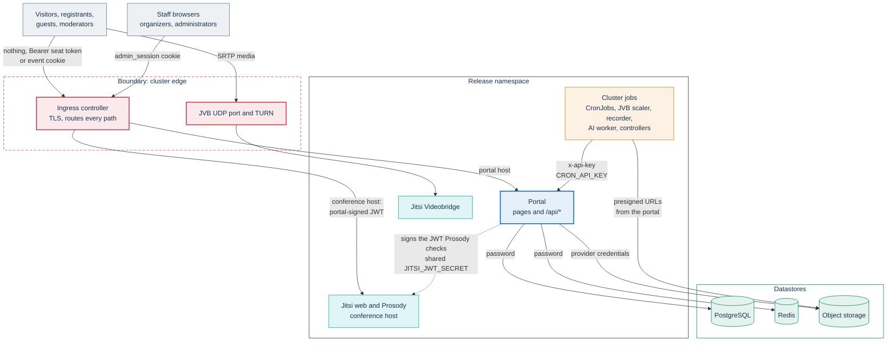
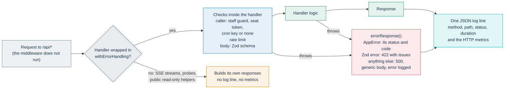
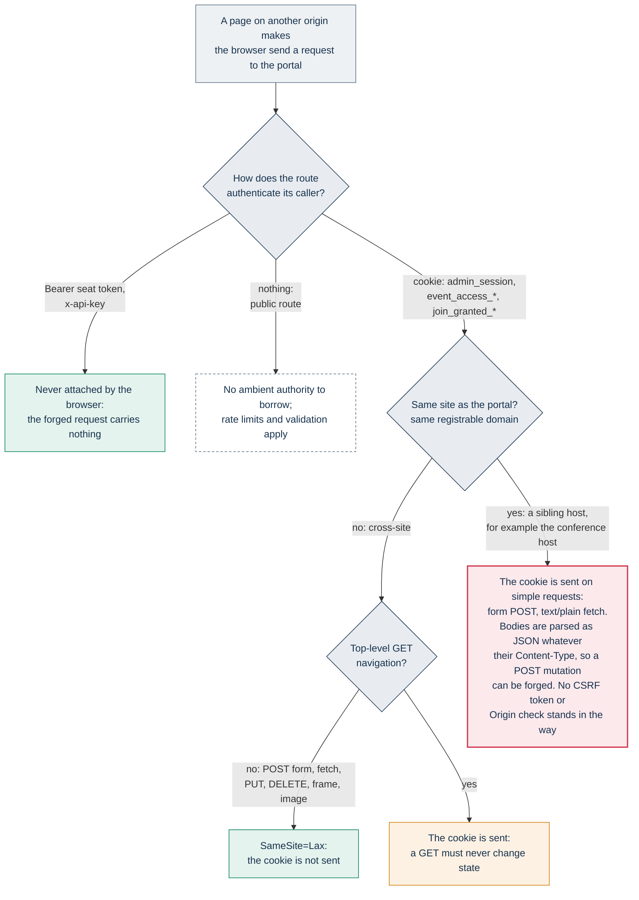

# Security architecture

This page owns the application's security controls and their limits: where the trust boundaries are, how requests are handled, why there is no CSRF token, how content is sanitized, how personal data and secrets are protected at rest, how abuse is limited, how the services trust each other, how the pods are hardened, and what gets logged.

It is written for security reviewers and auditors of an adopting public administration (PA), and for developers who change any of these controls. Each statement names the file that implements it. Where protection depends on how an installation is deployed, the page says so and names the setting.

Related pages:

- Every credential, session, cookie and the Jitsi JWT: [Identity, access and tokens](identity-and-access.md).
- The exact Content Security Policy and its companion headers: [Content Security Policy](../SECURITY-CSP.md).
- Supply chain, CI isolation, scanners, SBOMs and vulnerability reporting: [Security policy](../../SECURITY.md).
- Which columns hold personal data, retention and data-subject rights: [Privacy and data protection](../GDPR.md). Encryption mechanics: [Data model](data-model.md#encrypted-fields).
- Network design, firewall and TURN decisions: [Infrastructure](../INFRASTRUCTURE.md).

## At a glance

| Area | What the code does | Where it stops | Details |
|---|---|---|---|
| Transport | The chart's default Ingress terminates TLS with a cert-manager certificate. Page responses carry HSTS | Inside the cluster, the ingress, the jobs and the portal talk plain HTTP, and the chart's Redis URL uses no TLS | [Trust boundaries](#trust-boundaries-and-surfaces) |
| Authentication | Seat tokens, staff sessions and a machine key. Every API route checks its own caller | The middleware guards pages only, never `/api/*` | [Authentication](#authentication-and-authorization) |
| Input | Mutations are route handlers only. Bodies are validated with Zod. One wrapper maps errors | A few streaming and read-only routes build their own responses | [Request handling](#request-handling) |
| CSRF | No token and no `Origin` check. Bearer tokens and `SameSite=Lax` cookies carry the defense | Hosts on the same registrable domain are trusted | [CSRF stance](#csrf-stance) |
| Browser | Nonce-based CSP with `'strict-dynamic'`, `frame-ancestors 'none'`, HSTS, `nosniff`, Referrer-Policy, Permissions-Policy | Page responses only. `style-src` keeps `'unsafe-inline'` | [Browser headers](#browser-security-headers) |
| Content | Markdown goes through a DOMPurify allowlist. Chat text is never parsed as HTML | Three administrator-authored HTML fields are not sanitized | [Content sanitization](#content-sanitization) |
| Data at rest | AES-256-GCM on personal fields, a keyed email hash, and placeholder keys refused in production | Object contents rely on the storage provider. There is no key rotation | [Data protection](#data-protection-at-rest) |
| Abuse | Per-route rate limits | Counters live in each pod's memory, so limits multiply by the replica count | [Rate limits](#rate-limits-and-abuse-controls) |
| Service to service | One machine key, an HMAC on the recording webhook, presigned storage URLs, SSRF guards | Internal routes are reachable through the public ingress | [Service-to-service trust](#service-to-service-trust) |
| Runtime | Portal and job pods run non-root, with a read-only root filesystem, seccomp and no capabilities | Jitsi pods keep upstream defaults. The NetworkPolicy is opt-in and covers the portal pods only | [Runtime hardening](#runtime-hardening) |
| Logs | No IP address, query string or body in application logs | This is a coding rule, not a filter. Ingress logs record query strings | [Logging](#logging) |

## Trust boundaries and surfaces

The diagram shows a Helm installation. On a single VM, Docker Compose runs the same components as containers: the same credentials apply, and the scheduled jobs are the `cron` service.

### Surfaces

| Surface | Paths | What authenticates the caller |
|---|---|---|
| Public pages | `/{locale}/…` outside `/admin` | Nothing for public content. The live page and the registration pages check a seat token, an event cookie or a join grant |
| Public API | `/api/events/…`, `/api/gdpr/…`, `/api/rubrica/opt-out`, `/api/assets/…`, `/api/avatar`, `/api/og/…`, `/api/status/…`, `/api/changelog/…`, `/api/organizations/suggestions`, `/api/public/…`, `/api/openapi.json`, `/api/jitsi-branding.json`, `/api/health`, `/api/ready` | It depends on the route: nothing, a seat token (`Authorization: Bearer`, or `?token=` on most routes when the header is missing), an event cookie, or a signed token from an email link |
| Administration area | `/{locale}/admin/…` pages, `/api/admin/…`, `/api/staff/…` | The `admin_session` cookie, checked again by page guards and staff guards. The event management page also opens with the event's primary moderator token |
| Live room and streams | `/{locale}/events/{slug}/live`, `/api/events/{param}/chat/stream`, `…/control/stream`, `…/live/stream` | The read rule of each panel. The chat stream takes its token as `?token=`, because `EventSource` cannot set headers |
| Conference host | `https://meet.webinar.example.com`, the JVB UDP port, TURN | A portal-signed JWT that Prosody verifies. Media is encrypted per hop with DTLS-SRTP |
| Internal and scheduled endpoints | `/api/internal/…`, `/api/cron/…`, `/api/metrics`, `/api/webhooks/recording` | `CRON_API_KEY`. The webhook also takes an HMAC signature when one is configured |
| Cluster jobs | CronJobs, JVB scaler, recorder controller and bot, AI orchestrator and worker | Each receives only the keys it needs. The JVB scaler, the recorder controller and the AI orchestrator hold a namespaced Role, and so does the configuration reload hook. See [Kubernetes API access](#kubernetes-api-access) |
| Datastores | PostgreSQL, Redis, object storage, SMTP relay | Passwords and provider credentials, held by the portal |

### What the diagram implies

- **The ingress routes every path.** The chart's default Ingress sends the whole portal host (prefix `/`) to the portal. `/api/internal/…`, `/api/cron/…`, `/api/metrics` and the recording webhook are therefore reachable from the internet, and `CRON_API_KEY` is the only barrier. See [Service-to-service trust](#service-to-service-trust).
- **Some infrastructure data is public by design.** The public status page (`/status`) reads `/api/status/…`. These routes disclose component health, replica counts, ports, the deployment mode, the application version and the Kubernetes namespace. They disclose no personal data. `/api/status/metrics` runs only PromQL queries from a fixed allowlist. The status page is on by default (`statusPageEnabled` in `app/prisma/schema.prisma`, see [Runtime settings](../configuration/runtime-settings.md#public-features)), and an administrator can turn it off (`app/src/lib/status-page.ts`). The page then answers 404, and so do `/api/status/infrastructure`, `/api/status/metrics` and `/api/status/postprod` for everyone except administrators. `/api/status` returns only the bridge and recorder readiness that the live room polls. See [Monitoring and health](../operations/monitoring.md).
- **The conference host admits only portal tokens.** With `jitsi-meet.enableAuth: true` and `jitsi-meet.enableGuests: false`, a room opened directly on the conference host admits no one without a valid JWT. An optional Ingress redirects the root of the conference host to the portal. Both are described in [Restricting direct access to the Jitsi host](jitsi-integration.md#restricting-direct-access-to-the-jitsi-host). On the Helm chart, conference-level moderator rights follow Jicofo's own rules unless you add the settings in [Server-side role enforcement](jitsi-integration.md#server-side-role-enforcement).
- **The bridge sees media.** Each browser encrypts its media to the bridge. The bridge is a selective forwarding unit, so it handles the media in clear, and so do Jibri and the recorder bot. That is one reason they run inside the operator's own cluster ([Media path](jitsi-integration.md#media-path)).
- **Plaintext inside the namespace.** Traffic between the ingress and the portal, and between the jobs and the portal, is plain HTTP. The Redis URL that the chart composes (`redis://…`) is authenticated with a password but not encrypted. Redis carries chat messages and square presence in clear ([Live interaction](live-interaction.md#redis-availability)). PostgreSQL transport security depends on the `DATABASE_URL` the operator supplies.

## Authentication and authorization

The access model is owned by [Identity, access and tokens](identity-and-access.md). What matters for a security review:

| Caller | Credential | Travels as |
|---|---|---|
| Visitor | None | — |
| Guest | A typed name, plus a join-grant cookie on password-protected events | Request body, `join_granted_<eventId>` |
| Registrant | The personal access token | `?token=` on landing pages, then `Authorization: Bearer`. The `event_access_<eventId>` cookie ties the registrant's identity to the browser that registered |
| Moderator or speaker | The primary moderator token or a named grant | `?token=` on landing pages, then `Authorization: Bearer` |
| Staff | The `admin_session` cookie: an HS256 JWT signed with `APP_SECRET` | Cookie |
| Machine | `CRON_API_KEY`, plus an HMAC signature on the recording webhook | `x-api-key`, or `Authorization: Bearer` |

- **The middleware is not a security boundary for the API.** The matcher in `app/src/middleware.ts` excludes `/api`, `/_next`, `/_vercel` and every path with a file extension. Under `/{locale}/admin` it checks the signature and the role claim of `admin_session`, without reading the database. Route handlers enforce API access themselves. See [Where authorization is enforced](identity-and-access.md#where-authorization-is-enforced).
- **Staff roles are read again on every request.** The staff guards read the account row once per request, so deactivating an account or demoting it takes effect at once. A guard test, `app/src/lib/auth/staff-access.test.ts`, fails when an administration route or page declares no audience. It also fails when a route opens to organizers without being on its allowlist.
- **A token identifies a seat, not a person.** A forwarded link carries the seat with it. Actions that act as an author need a per-person identity ([Seats and people](identity-and-access.md#seats-and-people)).
- **Secrets are compared in constant time.** `constantTimeEqual()` in `app/src/lib/auth/moderator.ts` hashes both sides with SHA-256 and compares the digests with `timingSafeEqual`, so neither the content nor the length leaks through timing.
- **Jitsi trusts the portal's signature.** The portal signs an event-scoped HS256 JWT without the email address, and Prosody verifies it with the same secret ([The Jitsi JWT](identity-and-access.md#the-jitsi-jwt), [ADR-004](../adr/004-jitsi-jwt.md)).

## Request handling

### Route handlers only

Every mutation is a route handler under `app/src/app/api/**/route.ts`. The application has no Server Actions: no module declares `'use server'`. Pages are Server Components that read data. The decision is recorded in [ADR-002](../adr/002-nextjs-fullstack.md), and the route families are described in [API surface](api.md).

### Validation

- **JSON bodies.** Routes that accept a JSON body validate it with a Zod schema, either from `app/src/lib/validation/` or declared next to the route.
- **Single values.** A few routes take a single value, such as the instance API key (`ADMIN_API_KEY`) or a join password, and check it by hand.
- **Malformed JSON.** `parseJsonBody()` in `app/src/lib/api-handler.ts` turns malformed JSON into a 400 `INVALID_BODY`, and refuses a body over 10 MiB (`JSON_BODY_MAX_BYTES`) with 413 `PAYLOAD_TOO_LARGE` before reading it whole: from `Content-Length` when present, counting the bytes as they arrive otherwise. The public JSON routes of the live room go through it.
- **Size.** On ingress-nginx, the chart's Ingress caps request bodies at 30 MiB (`nginx.ingress.kubernetes.io/proxy-body-size: "30m"` under `ingress.annotations` in `infra/helm/pa-webinar/values.yaml`). The cap sits above the largest file the portal accepts through itself, a 25 MiB event material (`MATERIAL_FILE_MAX_BYTES` in `app/src/lib/validation/materials.ts`) plus the multipart framing, so every file an upload route allows gets past the ingress. Upload routes enforce their own, lower size caps: images, audio and documents on the asset upload route, and chat attachments. JSON routes keep the 10 MiB cap above, so the higher ingress limit serves only the uploads. Recordings and videos do not pass through the portal: they go straight to storage through signed URLs. When `ingress.className` is one of `ingress.nonNginxClassNames`, the chart drops every `nginx.ingress.kubernetes.io/*` annotation, so other controllers get no body cap from the chart.

### The error wrapper

Almost every handler is wrapped in `withErrorHandling()` (`app/src/lib/api-handler.ts`). The wrapper sends every thrown error through one mapper, `errorResponse()` in `app/src/lib/errors.ts`, then writes one log line and updates the HTTP metrics.

What a caller can learn from an error:

- **`AppError` and its subclasses.** The response is the error's status with `{ error, code }`. `details` is included only for `VALIDATION_ERROR`, or for every error when `NODE_ENV=development`. `RateLimitError` adds `Retry-After`.
- **Prisma errors.** A unique-constraint violation becomes 409 `CONFLICT`, and a missing record becomes 404 `NOT_FOUND`.
- **Zod errors.** They become 422 `VALIDATION_ERROR` with the `issues` list, which echoes the offending paths and messages back to the caller.
- **Anything else.** The response is 500 `{ "error": "Internal server error", "code": "INTERNAL_ERROR" }`. The full error is logged on the server only.

### Routes without the wrapper

| Route | Kind | What differs |
|---|---|---|
| `/api/events/{param}/chat/stream`, `…/control/stream`, `…/live/stream` | Long-lived SSE streams | The chat stream maps its authorization errors through `errorResponse()` itself. None of the three writes the log line or the metrics |
| `/api/assets/{…}` | Streams file bytes | Its own plain-text 400, 404 and 502 responses |
| `/api/avatar`, `/api/jitsi-branding.json`, `/api/openapi.json` | Public, read-only, cacheable | They answer `Access-Control-Allow-Origin: *` |
| `/api/ready` | Readiness probe | Its 503 body includes the database error message, and the route is reachable through the ingress |

A new route should use the wrapper. The conventions are in [Extending PA Webinar](../development/extending.md).

## CSRF stance

PA Webinar has no CSRF tokens. It checks neither `Origin` nor `Referer` on any request, and it has no OAuth flow, so it has no OAuth `state` either. Staff sign in with the instance API key or a one-time sign-in link ([Staff sign-in](identity-and-access.md#staff-sign-in)). Protection against forged requests comes from the way callers authenticate:

- **Headers the browser never adds on its own.** Seat tokens and machine keys travel in `Authorization` or `x-api-key` headers, which only the page's own script sets. Most routes that read a seat token accept it from `Authorization: Bearer` and, when that header is missing, from `?token=`. The portal's own pages use the query form only on magic-link landing pages and on the chat stream. The shared extractor, `extractModeratorToken()` in `app/src/lib/auth/moderator.ts`, logs a one-time warning when an API call uses it. Either way, a forged request can carry a token only if the attacker already has it.
- **`SameSite=Lax` on every cookie.** `admin_session`, `event_access_<eventId>` and `join_granted_<eventId>` are all `SameSite=Lax` and `HttpOnly`, and `Secure` in production. Browsers leave them off cross-site subrequests and cross-site `POST`, `PUT` and `DELETE` requests. They do send them on top-level `GET` navigations. Because the attribute is set explicitly, the grace period some browsers grant to cookies without a `SameSite` attribute does not apply. The cookies are listed in the [cookie inventory](identity-and-access.md#cookie-inventory).
- **No CORS on the API.** API responses carry no CORS headers, except the three public read-only routes above. Another origin can neither read API responses nor get a preflighted request, such as one with a JSON content type, past the browser.

What this means in practice:

- **Every host on the portal's registrable domain is inside the boundary.** Browsers decide `SameSite` by the registrable domain, not by the exact host. A page on any host under the same registrable domain is a different origin but the same site, so its requests carry staff and event cookies. A `PUT`, a `DELETE` or a request with a JSON `Content-Type` still needs a CORS preflight, which the API does not answer. Simple requests need none: a form `POST`, or a credentialed `fetch` with a `text/plain` body. `parseJsonBody()` in `app/src/lib/api-handler.ts` parses the body as JSON whatever its `Content-Type`, so such a request reaches cookie-authenticated `POST` mutations, for example `POST /api/events` for staff. In the recommended layout that sibling host includes the conference host. Host nothing there that runs content you do not control.
- **A cookie-authenticated `GET` must never change state.** This is a rule for developers: top-level cross-site navigations carry `SameSite=Lax` cookies.
- **Do not add CORS at the edge.** An ingress or gateway that answers `/api` with a permissive `Access-Control-Allow-Origin` and `Access-Control-Allow-Credentials` would remove the read protection.
- **Portal pages cannot be framed.** `frame-ancestors 'none'` and `X-Frame-Options: DENY` stop clickjacking. Embedding portal pages in another site is not supported.
- **Server-side integrations are unaffected.** They authenticate with headers, not cookies. A browser integration on another origin cannot use a staff session at all.

## Browser security headers

`applySecurityHeaders()` in `app/src/middleware.ts` sets the headers below on every response that passes through the middleware. That means page responses under `/{locale}/…`. API responses, `/_next` assets, public files and the redirects the middleware issues carry none of them. `/api/assets/{…}` sets its own `X-Content-Type-Options: nosniff` ([Uploaded files](#uploaded-files)).

| Header | Value, in short |
|---|---|
| `Content-Security-Policy` | Built per request: a fresh nonce with `'strict-dynamic'`, `frame-ancestors 'none'`, `object-src 'none'`, `base-uri 'self'` and `form-action 'self'`. Frames are limited to the portal and the conference host. `style-src` keeps `'unsafe-inline'`. The directive values are in [Content Security Policy](../SECURITY-CSP.md#content-security-policy-directives) |
| `Strict-Transport-Security` | `max-age=63072000; includeSubDomains; preload` |
| `X-Frame-Options` | `DENY` |
| `X-Content-Type-Options` | `nosniff` |
| `Referrer-Policy` | `strict-origin-when-cross-origin`, so a page URL carrying `?token=` is never sent in full to another origin |
| `Permissions-Policy` | Camera, microphone and screen capture for the portal and the conference host only. Geolocation off |

Consequences worth knowing:

- **Development builds are looser.** When `NODE_ENV` is not `production`, `script-src` also allows `'unsafe-eval'`, which the development server needs.
- **`includeSubDomains` reaches every host under the portal's name.** That includes a conference host such as `meet.webinar.example.com`. The `preload` token has no effect until the operator submits the domain to the browsers' preload list.
- **External images are blocked.** Markdown descriptions may reference images on other hosts, and the sanitizer keeps them, but `img-src` blocks them on the page. Upload the image instead.
- **Headers on other responses are the ingress's job.** HSTS or other headers on API responses and static files come from the ingress, if anything sets them.

The complete policy, the nonce mechanics, the storage-host mapping and a test plan are in [Content Security Policy](../SECURITY-CSP.md).

## Content sanitization

### Markdown

Event descriptions and AI summaries are written in Markdown and rendered by `renderMarkdown()` in `app/src/components/ui/markdown.tsx`. The function runs `marked` (GitHub-flavored, with line breaks), then DOMPurify (`isomorphic-dompurify`). The authors are staff and holders of a moderator link (the primary link or a named `MODERATOR` grant) for descriptions, and the AI pipeline and staff for summaries. Every visitor sees the result, so the sanitizer is what stands between an author and the visitors' browsers.

- **Tags.** Only headings, paragraphs and line breaks, emphasis (`strong`, `em`, `u`, `s`, `del`, `ins`), lists, `blockquote`, `pre` and `code`, links, images, `figure` and `figcaption`, and tables survive. Anything else is removed, including `script`, `style`, `iframe`, `form`, `svg`, `embed` and `details`.
- **Attributes.** The allowlist is `href`, `title`, `alt`, `src`, `target`, `rel` and `class`. A hook keeps `href` only on `<a>` and `src` only on ``. `style`, `id` and event-handler attributes are removed. DOMPurify's default still lets `data-*` attributes through, and they are inert.
- **Links.** Every link gets `target="_blank"` and `rel="noopener noreferrer"`, whatever the author wrote, which prevents reverse tabnabbing.
- **URI schemes.** DOMPurify's default check applies. A `javascript:`, `vbscript:` or `data:` link loses its `href`, and the link text remains. `data:` URIs stay allowed on images, as DOMPurify allows by default. The default list also admits link schemes such as `mailto:` and `tel:`.

### Chat text

`linkifyChat()` in `app/src/lib/chat/linkify.tsx` renders chat messages as React text nodes, so no HTML in a message is ever interpreted. Only `http://` and `https://` URLs become links, which open in a new tab with `rel="noopener noreferrer nofollow"`.

### Administrator-authored HTML

Three site settings are written into pages as raw HTML, **without sanitization**:

- `customHomeHtml`, when the home page mode is custom (`app/src/app/[locale]/page.tsx`);
- `privacyPolicy`, the privacy notice;
- `accessibility`, the accessibility statement.

The last two are rendered through `app/src/components/layout/legal-document-page.tsx`. Only administrators can change site settings (`/api/admin/settings` requires an administrator session). The CSP is the backstop: in browsers that support `'strict-dynamic'`, a `<script>` element or inline event handler in that HTML carries no nonce and does not run. Markup and inline styles do render. Treat these fields as code: whoever holds an administrator session decides what every visitor's home page contains.

Two other values reach the page as markup, and both are constrained:

- `primaryColor` must match `^#[0-9A-Fa-f]{6}$` before it is written into a `<style>` element.
- The event page's JSON-LD block escapes every `<`, so its content cannot close the `<script>` element.

### Uploaded files

- **Administration assets.** Images, audio and documents (logos, covers, waiting-room audio, materials) are sent through the portal to `/api/admin/assets/upload-url`. The route checks each file against a per-type MIME allowlist and size cap. It then verifies that the content's magic bytes match the declared type (`contentMatchesDeclaredMime` in `app/src/lib/utils/mime-sniff.ts`). The image allowlist includes SVG, which is why serving forces a download for it (below).
- **Chat attachments.** Only a moderator, a speaker or a registrant can upload one. Guests cannot. Attachments are limited to images and PDF, checked against their magic bytes, capped at 10 MiB (`app/src/lib/chat/attachments.ts`) and rate-limited per sender.
- **Event materials uploaded from the room.** A moderator (the primary moderator link or a named `MODERATOR` grant, not a speaker) can upload a file from the room's materials panel through `POST /api/events/{slug}/materials/upload`. The portal receives the file and writes it to storage itself. It applies the same MIME allowlist and magic-byte check as the document asset type (`MATERIAL_FILE_MIME_TYPES` in `app/src/lib/validation/materials.ts`) and caps a file at 25 MiB. It allows 10 uploads per minute per IP address and event, and it refuses a new file once the event holds 50 material files or 500 MiB of them (`MATERIAL_FILES_PER_EVENT_*`). The older route `POST /api/events/{id}/files` still exists and hands out a signed upload URL without inspecting the content, but no page calls it.
- **Serving.** `/api/assets/{…}` serves only keys under `assets/`, and refuses `..`, backslashes and absolute paths. It streams each object through a read URL valid for 10 minutes, which it never shows the client. It always sends `X-Content-Type-Options: nosniff`. For SVG, HTML, XML and unknown binary types it forces `Content-Disposition: attachment`, so an uploaded file cannot run as a same-origin document. Chat attachments get `Cache-Control: private, max-age=60`, and other assets are cached as immutable.
- **No malware scanning.** No component scans uploaded files for malware.

## Data protection at rest

### Encryption of personal fields

The portal encrypts personal fields itself, with AES-256-GCM under `PII_ENCRYPTION_KEY` (`app/src/lib/crypto/pii.ts`), before writing them to PostgreSQL. The encrypted fields include:

- the names and email addresses of registrants, named grants, invitations and staff accounts;
- address-book names;
- chat messages and attachment names;
- queued emails (recipient and body);
- the participant list of a composite recording and the names on multitrack audio tracks;
- AI transcripts and summaries held in the database.

The authoritative column list is the data inventory in [Privacy and data protection](../GDPR.md). The storage format and the reading rules are in [Encrypted fields](data-model.md#encrypted-fields).

The threat this addresses is a copy of the database: a dump, a backup, a replica, a stolen volume or read-only SQL access. It does not address:

- **A compromised portal.** Anyone who controls the portal process or reads the application Secret holds the key.
- **Fields stored in plaintext on purpose.** Examples are Q&A author names, free-text answers and the admin audit log's IP addresses. They are listed in [Plaintext fields worth knowing](data-model.md#plaintext-fields-worth-knowing).
- **Data in transit inside the cluster.** Redis messages and SSE streams carry plaintext.
- **Object storage.** See below.

### The key

- **Shape.** `PII_ENCRYPTION_KEY` must be 64 hexadecimal characters.
- **Weak keys fail closed.** A missing key, or one that is not 64 characters long, is refused in every environment. In production (`NODE_ENV=production`), a key that is a short block repeated to length is also refused, unless `ALLOW_INSECURE_PII_KEY=true`, which only `docker-compose.yml` sets. Every repository placeholder has that repeated shape. When the key is refused, every encrypt and decrypt raises `PiiKeyError` (`getKey()` in `app/src/lib/crypto/pii.ts`), and nothing is written with a public key. The guard is described in [Security policy](../../SECURITY.md#guards-against-weak-keys).
- **Custody is the operator's.** No tooling rotates the key or re-encrypts existing data. Losing the key makes every encrypted value unreadable, so back it up together with every database backup, and store the two apart ([Data model](data-model.md#encrypted-fields)).
- **Keep the key away from the database.** The PostgreSQL subchart mounts its password Secret in full inside the database container. Set `secrets.datastoreSecretName` so that the datastore passwords live in their own Secret, away from the key ([Secrets in a Helm installation](../../SECURITY.md#secrets-in-a-helm-installation)).

### Keyed email hashes

Duplicate detection and lookups by address use `hashEmail()`: an HMAC-SHA-256 of the normalized address, keyed with `APP_SECRET`. A leaked database alone therefore does not let anyone test guessed addresses against the hashes. When `APP_SECRET` is unset, the function falls back to an unkeyed SHA-256. In production, `app/src/instrumentation.ts` stops start-up for a short `APP_SECRET` but only logs an error for a missing one. Signing sessions and cookies still fails without it, so a missing secret shows up at once, but deployment checks should catch it first. Details are in [Keyed email hash](data-model.md#keyed-email-hash).

### Object storage

Recordings, per-participant audio tracks, AI artifacts stored as objects, uploaded files and chat attachments live in object storage. The application does not encrypt object contents and sets no server-side-encryption option. Confidentiality at rest relies on the storage provider. Azure Blob Storage, Amazon S3 and Google Cloud Storage encrypt at rest by default. A MinIO or other S3-compatible store must be configured for it. The containers are meant to be private: the portal hands out short-lived signed URLs and never makes an object public. Providers, key layout and deletion ownership are in [Object storage](../configuration/storage.md).

## Secrets map

This is the security view: what each secret protects, what a leak gives an attacker, and which workloads hold it. The complete list of secret keys and where to set them is in [Configuration reference](../CONFIGURATION.md). The effect of changing each signing key is in [Keys behind the credentials](identity-and-access.md#keys-behind-the-credentials).

| Secret | Protects | A leak lets an attacker | Held by |
|---|---|---|---|
| `APP_SECRET` | Signs `admin_session`, `event_access_*` and `join_granted_*` (HS256). Keys the email hash | Mint an administrator session and any event cookie. Test guessed addresses against stored hashes | Portal |
| `PII_ENCRYPTION_KEY` | Personal fields and the Gravatar reference | Read every encrypted field in a copy of the database | Portal |
| `JITSI_JWT_SECRET` (Prosody's `JWT_APP_SECRET`) | Jitsi JWTs | Join any conference, with any role claim | Portal, Prosody |
| `ADMIN_API_KEY` | Sign-in with the instance API key | Sign in as an administrator | Portal |
| `CRON_API_KEY` | `/api/internal/*`, `/api/cron/*`, `/api/metrics`, the recording webhook | Run scheduled and internal operations, claim recordings (which returns a Jitsi token for the room), obtain presigned storage URLs and read metrics, from the internet through the default ingress | Portal, every job, JVB scaler, recorder controller and bot, AI orchestrator and worker, Jibri, Prometheus |
| `RECORDING_WEBHOOK_SECRET` | Recording webhook signatures | Sign forged webhook bodies (the cron key is still required) | Portal, Jibri |
| `DATABASE_URL` and the PostgreSQL passwords | The database | Read and write every row. Encrypted fields stay encrypted | Portal and its migration container, PostgreSQL |
| Redis password | Redis | Read live chat and presence in plaintext, and inject messages into live streams | Portal, Redis |
| Storage credentials | Object storage | Read or delete recordings, tracks, AI artifacts and uploads | Portal only |
| `SMTP_PASSWORD` | The mail relay | Send mail as the installation | Portal |
| Hugging Face token (`postprod.worker.hfTokenSecret`) | Model downloads | Use the account's access to gated models | AI worker |
| Hidden-domain XMPP account (`recorder.xmppSecretName`) | The recorder bot's Prosody login | Join conferences as a participant that clients do not show | Recorder bot, Prosody, and Jibri when the account is the Jibri recorder account (the usual setup: `<release>-jitsi-meet-jibri-secret-recorder`, keys `JIBRI_RECORDER_USER` and `JIBRI_RECORDER_PASSWORD`) |

Only the portal pod, including its `db-migrate` init container, loads the whole application Secret (`envFrom` in `templates/deployment.yaml`). Every other chart workload receives single keys through `secretKeyRef`. Secret modes and the development placeholders are covered in [Security policy](../../SECURITY.md#secrets).

## Rate limits and abuse controls

### How the limiter works

`rateLimit(key, { limit, windowMs })` in `app/src/lib/rate-limit.ts`:

- **Fixed windows.** A window starts with the first request for a key, and the counter resets when the window ends.
- **Per-process state.** Counters live in an in-memory `Map` in each pod. The chart runs two portal replicas by default and lets the HPA scale them from 2 to 6 (`app.replicaCount` and `autoscaling` in `values.yaml`). Every limit is therefore multiplied by the number of pods, and a restart resets it. A shared counter is on the [roadmap](../ROADMAP.md#later).
- **Bounded memory.** Each process keeps about 50,000 keys at most. The excess is trimmed at most once a minute, oldest first, which resets those counters.
- **Response.** Exceeding a limit usually returns 429 `RATE_LIMIT`, with `Retry-After` on most routes. A few per-voter limits (Q&A upvote, poll vote, agenda reactions) omit the header. The exceptions to the 429:
  - the address-book opt-out answers 422 `VALIDATION_ERROR`;
  - the per-address limits of the staff sign-in link request drop the email silently and still answer 202, so they do not reveal whether an account exists;
  - the per-address limits of the data-subject export and erasure requests also drop the email silently and still answer 200.

### How a client is identified

Most limits are per IP address. `getClientIp()` in `app/src/lib/rate-limit.ts` reads only `X-Forwarded-For`, and counts its entries from the right, because each proxy appends the address it received the connection from:

- with `TRUSTED_PROXY_HOPS` unset or `0` (the default), it takes the last entry, the one the ingress wrote. This suits the ingress-nginx and Traefik defaults, which replace the header;
- with `TRUSTED_PROXY_HOPS=N`, it takes the (N+1)-th entry from the right. Set `1` behind one load balancer or WAF that appends to the header when the ingress keeps that header and appends to it too (ingress-nginx with `compute-full-forwarded-for: true`, Traefik with `forwardedHeaders.trustedIPs`), and when Google Cloud's Application Load Balancer is itself the ingress (GKE Ingress), because it appends two entries. With the ingress-nginx and Traefik defaults the ingress replaces the header, so `0` stays the value and `1` does not recover the client's address. When the header has fewer entries, it takes the first.

`X-Real-IP`, `CF-Connecting-IP` and `Forwarded` are never read. A chosen entry that is not an IP address maps to the shared key `unknown`, never to the string itself, and so does a request without the header, so all such requests share one counter.

**Match `TRUSTED_PROXY_HOPS` to the proxy chain.** With an ingress that appends, a value that is too high makes the chosen entry one the client wrote, so the client can choose its own key and escape every per-IP limit. A value that is too low makes every client share the counter of the last proxy. The per-setup values are in [Configuration reference](../CONFIGURATION.md#client-address-and-rate-limits), and the chart documents the setting under `app.env` in `values.yaml`.

**Expose the portal only behind an ingress.** Exposing the portal's Service directly (a `NodePort`, or a `LoadBalancer` Service) is never safe, whatever the setting: the client then writes the whole header.

Other limits are keyed by the registration, the chat sender, the event or an email hash, so they hold whatever the address.

### Reference limits

The values below come from the route files. To list every call site with its values, run `grep -rn "rateLimit(" app/src/app/api`.

| Action | Route | Keyed by | Limit |
|---|---|---|---|
| Sign-in with the instance API key | `POST /api/admin/login` | IP | 5 per minute |
| Staff sign-in link request | `POST /api/staff/login-link` | IP / address with IP / address alone | 5 per minute / 3 per 10 minutes / 20 per hour |
| Staff sign-in link check | `POST /api/staff/login-link/verify` | IP | 10 per minute |
| Event and instant-call creation | `POST /api/events`, `POST /api/events/instant` | IP | 5 and 10 per minute |
| Registration. With public registration off, this call can also resend the link of an address that is already registered | `POST /api/events/{slug}/registrations` | IP | 10 per minute |
| Personal link resend | `POST …/registrations/resend` | IP | 5 per minute |
| Join password | `POST …/verify-password` | IP and event | 10 per minute |
| Guest Jitsi token, including a personal link opened in another browser | `POST …/jitsi/token` | IP | `GUEST_JWT_RATE_LIMIT_PER_MINUTE`, default 120 per minute |
| Call session opening | `POST …/sessions` | IP | 30 per minute |
| Chat message / attachment | `POST …/chat`, `POST …/chat/attachment` | Event and sender | 30 / 10 per minute |
| Q&A question | `POST …/questions` | Registration, named grant, or the guest's browser id and event (IP when a guest sends no browser id) / IP and event, for guests with a browser id | 1 per 30 seconds / 60 per minute |
| Poll vote | `POST …/polls/{id}/vote` | IP and event / voter | 60 / 10 per minute |
| Square presence ping | `POST …/garden/ping` | IP | 600 per minute |
| Data-subject export or erasure request | `POST /api/gdpr/export/request`, `POST /api/gdpr/erasure/request` | IP / email hash | 5 / 3 per hour |
| Export download, erasure confirmation | `GET /api/gdpr/export`, `POST /api/gdpr/erasure` | IP | 10 per hour |
| Address-book opt-out | `POST /api/rubrica/opt-out` | IP | 10 per minute |
| Link-preview image | `GET /api/og/event/{slug}` | IP | 60 per minute |

The entry route of invitation-only registration, `GET …/registrations/enter`, has no rate limit. It answers a valid, an invalid and an unknown token in the same way, with a redirect, and sets its cookie only for a valid signature ([Identity, access and tokens](identity-and-access.md#registrants)).

The guest limit is generous because many participants may join from behind one corporate NAT at the same moment. To change it on the chart, add the variable to `app.env`, which is rendered into the portal's ConfigMap.

### Other abuse controls

- **No account enumeration on staff sign-in.** `POST /api/staff/login-link` answers 202 whether or not the address belongs to an active account; only its per-IP limit answers 429. The account lookup happens after the response is sent ([The one-time email link](identity-and-access.md#the-one-time-email-link)).
- **No registration enumeration on resend.** The resend route answers the same way whether or not the address is registered ([Email and calendar](email.md)).
- **Guest tokens only while `LIVE`.** A guest receives a Jitsi token only while the event is `LIVE` (`POST …/jitsi/token`). An administrator can turn guest access off for scheduled events (`guestAccessEnabled`, answered with 403 `GUEST_ACCESS_DISABLED`); instant calls stay open to anyone with the link. On a password-protected event, a guest also needs the `join_granted_<eventId>` cookie before a token is issued. Guests cannot upload chat attachments.
- **Join passwords are hashed.** They are stored as scrypt hashes and never returned by the API ([Hashed secrets and stored tokens](data-model.md#hashed-secrets-and-stored-tokens)).
- **Ingress limits are the only shared limit.** The chart's default values set no ingress rate limit. `infra/helm/pa-webinar/values-production.yaml` shows one example (`limit-rps`, `limit-burst-multiplier` and `limit-connections`). An ingress limit is the only limit that holds across replicas. Choose its values from real live-room traffic: each participant keeps several long-lived connections open, and a tight limit drops them. Sizing guidance is in [Infrastructure](../INFRASTRUCTURE.md).

## Service-to-service trust

### One machine key

- **Where it is accepted.** `CRON_API_KEY` is checked by `assertCronApiKey()` in `app/src/lib/auth/cron.ts`, as `x-api-key`, on every `/api/cron/*` and `/api/internal/*` route. `/api/metrics` and `POST /api/webhooks/recording` accept it as `Authorization: Bearer`.
- **It fails closed.** When the variable is unset, all of these routes answer 401.
- **Holders.** The holders are listed in the [secrets map](#secrets-map) and in [Machine credentials](identity-and-access.md#machine-credentials).
- **The public ingress reaches these routes.** The chart does not block them. Every chart workload that calls them uses the portal's Service address (`pa-webinar.internalUrl` in `templates/_helpers.tpl`). An operator can therefore refuse these prefixes on the public ingress or a gateway in front of it. Before doing so, check the Jibri finalize script's `APP_INTERNAL_URL`, and keep Prometheus scraping through the Service.

### Recording webhook

- **With `RECORDING_WEBHOOK_SECRET` set,** the webhook requires the bearer key and an `X-Webhook-Signature: sha256=<hex>` header. The header carries an HMAC-SHA-256 of the raw body, compared in constant time (`app/src/lib/auth/webhook-signature.ts`).
- **Without the secret,** the bearer key alone is enough, and the portal logs a one-time warning.
- **The signature carries no timestamp or nonce.** It proves that the body came from a holder of the secret, but it does not prevent a captured request from being replayed.

The finalize contract is in [Webhook authentication](recording.md#webhook-authentication).

### The recorder claim model

- **Start.** The recorder controller starts a recorder Job that knows only its `RECORDING_ID` and `CRON_API_KEY`.
- **Claim.** At start-up the bot claims the recording from the portal. At that moment the portal mints its Jitsi token: role `member`, lifetime tied to the event's remaining time plus a margin, capped at six hours.
- **Uploads.** The portal issues a write URL for each upload.
- **Hidden domain.** When the hidden Prosody domain is enabled, the Job also receives the hidden-domain XMPP user and password through `secretKeyRef`.
- **Controller powers.** The controller holds the machine key and a namespaced role that can create Jobs. Its `/dispatch` endpoint takes no credential, but it only triggers a reconciliation that asks the portal what to do.

See [The claim model](recording.md#the-claim-model), [Trust boundaries](recording.md#trust-boundaries) and [The hidden domain for the recorder bot](jitsi-integration.md#the-hidden-domain-for-the-recorder-bot).

### Presigned storage URLs

Storage credentials never leave the portal. The Jibri finalize script, the recorder bot and the AI worker ask the portal for presigned upload and download URLs, authenticating with the machine key. Each URL covers one object and expires. These URLs do not bind the content type: on S3 the signature covers only the host, so the type the caller sends is not checked against it.

Staff browsers that upload a video receive an upload plan for one object whose key the server chooses (`publications/<year>/<uuid>.<ext>`), valid for 60 minutes. A single-request S3 upload (`s3-put`) also signs the `Content-Type`, so the object cannot arrive with a different type. The multipart completion and abort routes accept only keys of that shape, and an abort never deletes a completed object ([Browser upload of videos](../configuration/storage.md#5-browser-upload-of-videos)).

### Outbound requests

| Request | Who chooses the URL | Guard |
|---|---|---|
| Release SBOM, `GET /api/changelog/{version}/sbom` | The caller chooses only the version. It must exist in the application's own release list with an SBOM. The repository comes from the `githubUrl` site setting | The route accepts only `https://github.com/<owner>/<repo>` (`app/src/lib/changelog/repo.ts`). It stops after 8 seconds and caches the trimmed summary per repository and version |
| Event poster for link previews, `GET /api/og/event/{slug}` | Staff, through the event's cover image | Only `http` and `https`. Relative paths and the portal's own host are fetched over loopback. Literal loopback, private and link-local addresses, including the cloud metadata range, are refused, and so are the suffixes `.local`, `.internal`, `.svc`, `.cluster.local` and `.localdomain` (`app/src/lib/og-card.ts`). No redirects, PNG or JPEG only, 4 MB, 4 seconds. The check reads the host name as written and does not resolve it, so a public name that resolves to a private address is not caught |
| Gravatar, `GET /api/avatar` | Fixed host `www.gravatar.com` | Only when an administrator has enabled Gravatar. 2-second timeout |
| `SERVICE_INVENTORY_URL`, `PROMETHEUS_URL`, the bridge and Jibri health URLs | The operator, through environment variables | Trusted configuration |

## Runtime hardening

### Pod security

| Workload | User | Root filesystem | Seccomp | Capabilities | Kubernetes API token |
|---|---|---|---|---|---|
| Portal and its `db-migrate` init container | Non-root, UID 1001 | Read-only, with writable `emptyDir` volumes for `/tmp` and `.next/cache` | `RuntimeDefault` | All dropped, no privilege escalation | Not mounted |
| Scheduled jobs that call the portal | Non-root | Read-only | `RuntimeDefault` | All dropped | Not mounted |
| JVB scaler, AI orchestrator | Non-root, UID 1001 | Read-only | `RuntimeDefault` | All dropped | Mounted, with a namespaced Role |
| Recorder controller | Non-root, UID 1000 | Read-only | `RuntimeDefault` | All dropped | Mounted, with a namespaced Role |
| Recorder bot | Non-root, UID 1000 | Writable, for the headless browser | `RuntimeDefault` | All dropped | Not mounted |
| AI worker | Non-root, UID 10001 | Read-only | `RuntimeDefault` | All dropped | Not mounted |
| In-cluster PostgreSQL and Redis | Non-root | Read-only | Subchart defaults | All dropped | Subchart defaults |
| Jitsi web, Prosody, Jicofo, JVB, Jibri | Upstream image defaults | Not restricted | Not set | Not dropped. Jibri adds `SYS_ADMIN` | Not set by this chart |
| Configuration reload hook (post-install and post-upgrade, `configReloadHook.enabled`) | Image default | Not restricted | Not set | Not dropped | Mounted, with a namespaced Role |

The portal's settings are `app.securityContext.pod` and `app.securityContext.container` in `infra/helm/pa-webinar/values.yaml`. The Jitsi subchart pods follow upstream defaults, and the chart sets no security context for them. JVB publishes its media port as a `hostPort`.

### Kubernetes API access

The workloads below get a Role in the release namespace, and none gets a ClusterRole. The rules are in the chart templates `cronjob-jvb-scaler.yaml`, `recorder-controller.yaml`, `cronjob-postprod-orchestrator.yaml` and `web-config-reload-hook.yaml`.

| Workload | Can |
|---|---|
| JVB scaler | Read Deployments and StatefulSets, patch their `scale`, list pods, and create `pods/exec` |
| Recorder controller | Read CronJobs, create and delete Jobs, read pods and pod logs |
| AI orchestrator | Read CronJobs, create and delete Jobs. With `postprod.vllm.autoscale`, also read Deployments and scale them |
| Configuration reload hook | Read and patch Deployments |

Two of these grants reach further than their purpose:

- **`pods/exec` cannot be narrowed by label.** The scaler execs into the bridge pods to read their statistics. RBAC can restrict a grant by `resourceNames` but not by label, and the bridge pod names are generated, so the grant reaches every pod in the namespace, including the portal, whose environment holds every secret.
- **Creating Jobs means creating pods.** A Job can mount any Secret in the namespace.

**Install the release in a namespace of its own,** and treat these service accounts as being as sensitive as the Secrets in that namespace.

### NetworkPolicy

`networkPolicy.enabled` is `false` by default, and it needs a CNI that enforces policies ([Deploying with Helm](../DEPLOYMENT.md#networkpolicy), [Infrastructure](../INFRASTRUCTURE.md)). When enabled, `templates/networkpolicy.yaml` renders a default-deny policy for the portal pods only: it selects the release's pods that carry no `app.kubernetes.io/component` label, or, when `app.podLabels` gives the portal pods that label, the pods with that value.

The other pods of the release are deliberately not selected: the scheduled jobs, the JVB scaler, the recorder controller and bots, the AI orchestrator and worker, and the configuration reload hook. They talk to the Kubernetes API, the bridges and the GPU pool, which the policy does not describe, so their own traffic is not restricted.

- **Ingress** to the portal port (3000) is allowed from:
  - the ingress controller's namespaces (`networkPolicy.ingress.fromNamespaceSelectors`) and `networkPolicy.ingress.fromPodSelectors`. When both lists are empty, any source may reach the port;
  - every pod that carries the release's selector labels, which admits the scheduled jobs, the scaler, the controller and the AI jobs;
  - the Jibri pods, when Jibri is enabled, for the end-of-recording upload;
  - the monitoring namespace, when `networkPolicy.ingress.allowMonitoring` is on (the default);
  - any rule in `networkPolicy.ingress.extraRules`.
- **Egress** is allowed for:
  - DNS, PostgreSQL and Redis;
  - the in-cluster Jitsi pods on the ports in `networkPolicy.egress.jitsi.ports`: Prosody (5222, 5280), the bridge REST API (8080) and the Jibri health API (2222);
  - the recorder controller, when it is enabled;
  - the ingress controller's namespaces on its container ports (`networkPolicy.egress.ingressController`, 443 and 8443 by default), for calls to the portal's and the conference's public host names;
  - SMTP (`networkPolicy.egress.smtpPort`);
  - TCP 443 to any address except the ranges in `networkPolicy.egress.httpsExcept`. The default excludes `169.254.0.0/16`, which keeps the cloud metadata endpoints out of reach;
  - any rule in `networkPolicy.egress.extraRules`.

What the defaults leave out:

- **An in-cluster Prometheus.** The portal's PromQL proxy (`PROMETHEUS_URL`) needs an egress rule, for example to the monitoring namespace on port 9090, in `networkPolicy.egress.extraRules`.
- **Per-participant recorder bots.** The controller replaces the pod labels of the Jobs it creates, so bot pods do not carry the release's selector labels, and the policy drops their calls to the portal. Admit them with a `networkPolicy.ingress.extraRules` entry ([Before enabling the NetworkPolicy](background-jobs.md#before-enabling-the-networkpolicy)).

When the in-cluster Redis is enabled, the Bitnami Redis subchart renders its own NetworkPolicy, which admits port 6379 from any source, whatever `networkPolicy.enabled` is set to.

## Logging

### What the application writes

- **One line per API request.** `withErrorHandling()` writes a JSON line for each request with `level`, `method`, `path`, `status` and `duration_ms`. It records no query string, no headers, no body and no IP address.
- **Unhandled errors.** They are logged whole on the server (`console.error` in `errorResponse()`). Other modules log warnings with a prefix, such as `[email]` or `[cron/email-outbox]`.
- **The rule and its limit.** No IP addresses and no personal data in application logs. It is a coding rule upheld by code review, not a filter. An error message that quotes input reaches the log unchanged. For example, a permanent SMTP failure is logged with the relay's message, which can include the recipient address.

### Credentials in URLs

- **A token in a logged path.** The application log records the request path. One public route carries a credential in its path: `GET /api/events/{slug}/registrations/{accessToken}`. The interface does not call it, but OpenAPI documents it. A call to it writes the registrant's access token to the application log. The token also lands in the `route` label of the HTTP metrics, because the label collapses only UUIDs and runs of digits.
- **Tokens in query strings.** A `?token=`, whether on a magic-link landing page, on the chat stream or on an API call that uses the query form, never reaches the application log, which records the path only. Ingress access logs, however, normally record the full request line, query string included. Treat ingress logs as containing credentials, or configure their format to drop query strings.

### Audit trails

- **Administrative writes.** They are recorded in `admin_audit_logs` (model `AdminAuditLog`): actor, action, target, client IP address as reported by the proxy headers, and user agent. No job deletes these rows ([Audit actor format](identity-and-access.md#audit-actor-format)).
- **GDPR operations.** Deletions, exports and consents are recorded per event, with counts and no personal data, in `gdpr_audit_logs` (model `GdprAuditLog`).

The privacy view of both is in [Privacy and data protection](../GDPR.md).

### Retention

The application sets no log retention. Container logs and ingress logs are kept for as long as the operator's logging stack keeps them. The log policy for operators is in [Monitoring and health](../operations/monitoring.md).

## Known gaps

Items with a planned fix are on the [roadmap](../ROADMAP.md). The others are design limits that an adopting administration should weigh.

- **Chat attachments have no per-request authorization.** An attachment is protected by an unguessable address and by deletion on moderation or retention. Whoever has the link can open it, even after the event has closed. See the roadmap's [Later](../ROADMAP.md#later) section and its [known limitations](../ROADMAP.md#known-limitations-of-shipped-features).
- **Rate limits are per pod.** See [Distributed rate limiting](../ROADMAP.md#later).
- **Per-IP keys trust a hop count, and whole IPv6 addresses.** The client address is chosen by counting `TRUSTED_PROXY_HOPS` entries, not by matching trusted proxy addresses, so a request that bypasses the front proxy and reaches an ingress that appends can choose its entry. A client that controls an IPv6 `/64` can rotate addresses and escape per-IP limits. See [How a client is identified](#how-a-client-is-identified) and the roadmap's [Later](../ROADMAP.md#later) section.
- **Material files are public by URL.** A material's visibility filters the public lists only; `/api/assets/…` serves an uploaded file to anyone who has its URL, in every phase ([Uploaded files](#uploaded-files)).
- **Guest chat identifiers encode the client address.** See [Privacy and data protection](../GDPR.md#known-limitations).
- **One machine key opens every internal route, from the internet.** See [One machine key](#one-machine-key).
- **The recording webhook signature has no replay protection.**
- **Administrator HTML is not sanitized.** See [Administrator-authored HTML](#administrator-authored-html).
- **Security headers cover page responses only.** API responses and static files rely on the ingress.
- **The chart NetworkPolicy covers only the portal pods.** The jobs and controllers run without one. See [NetworkPolicy](#networkpolicy).
- **Role enforcement in the conference depends on the deployment.** The Helm chart does not wire token-based ownership into Prosody and Jicofo by default ([Server-side role enforcement](jitsi-integration.md#server-side-role-enforcement)).
- **Organization names are public.** `GET /api/organizations/suggestions` needs no credential and has no rate limit. For any two-letter prefix, it returns up to ten distinct organization names that registrants typed, across all events.
- **No malware scanning** of uploaded files.
- **No rotation of the personal-data key.**

## Related pages

- [Identity, access and tokens](identity-and-access.md)
- [How PA Webinar extends Jitsi Meet](jitsi-integration.md)
- [Recording: composite video and per-speaker audio](recording.md)
- [Live interaction and realtime](live-interaction.md)
- [Data model](data-model.md)
- [API surface](api.md)
- [Scheduled and background jobs](background-jobs.md)
- [Content Security Policy](../SECURITY-CSP.md)
- [Security policy](../../SECURITY.md)
- [Privacy and data protection](../GDPR.md)
- [Configuration reference](../CONFIGURATION.md) and [Object storage](../configuration/storage.md)
- [Deploying with Helm](../DEPLOYMENT.md) and [Infrastructure](../INFRASTRUCTURE.md)
- [Monitoring and health](../operations/monitoring.md)
- Decisions: [ADR-002](../adr/002-nextjs-fullstack.md), [ADR-003](../adr/003-moderator-magic-links.md), [ADR-004](../adr/004-jitsi-jwt.md), [ADR-009](../adr/009-admin-session.md), [ADR-014](../adr/014-organizer-role.md), [ADR-015](../adr/015-named-administrators.md)
