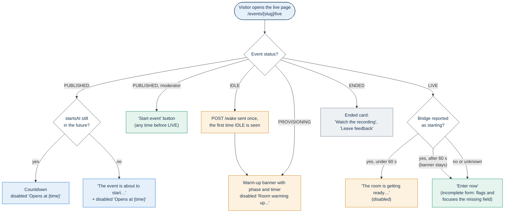
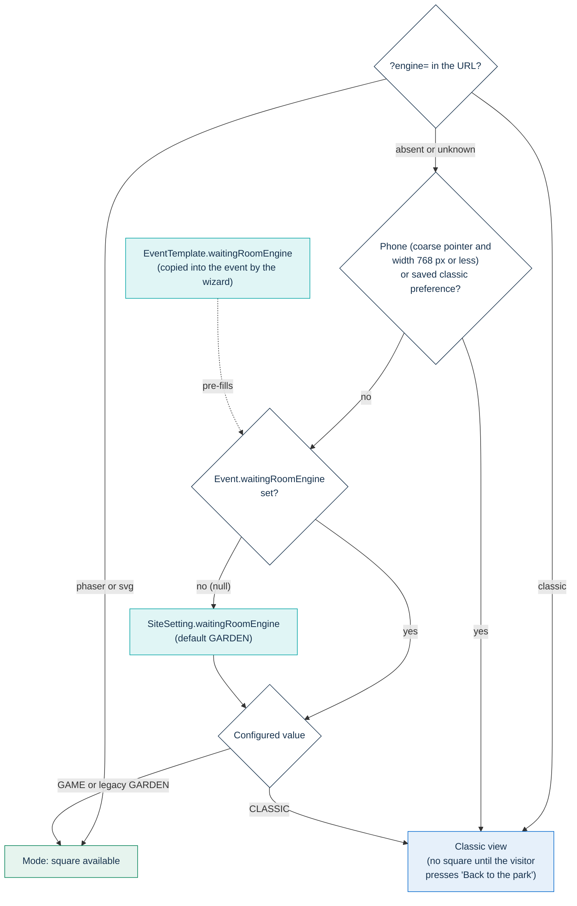
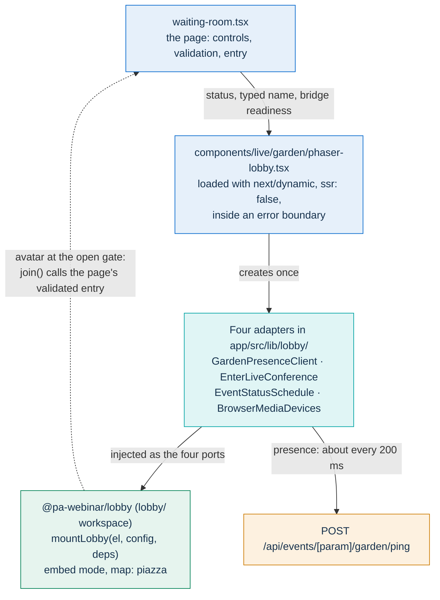
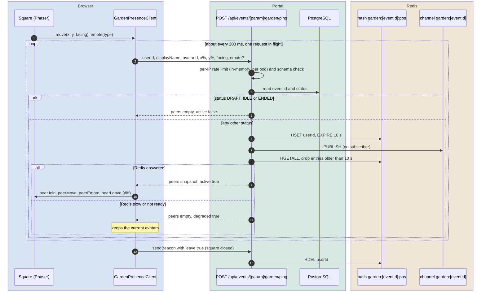

# The waiting room and the square

Every arrival on an event's live page lands in the waiting room first: participants, guests, moderators and speakers alike, whatever the event status. The waiting room is an ordinary page built with the .italia design system (Bootstrap Italia + design-react-kit). It holds everything a person needs before entering the live room: name, device check, notices, consent and the entry button.

The **square** is optional. It is a 2D place built with Phaser where people who are waiting can walk around as avatars and see each other. A visitor opens it by choice and can leave it at any time. Nothing needed to take part in the event lives only in the square.

This page is written for front-end developers, accessibility reviewers, and administrators choosing the waiting-room engine. It covers what the page shows in each state, what it contains, how the engine is chosen, how the square is built, how presence works, and the accessibility contract that keeps the square optional.

## One front door

The live page (internal path `/events/[slug]/live`, localized through `app/src/i18n/routing.ts`) is a Server Component. It works out who the visitor is and renders `LiveEventClient`, which starts in its `waiting` phase and renders `WaitingRoom` (`app/src/components/live/waiting-room.tsx`). The waiting room only presents. Credentials, consent steps and the Jitsi JWT stay in `LiveEventClient`, and the waiting room reports back through callbacks: `onEnterLive(name, prefs)`, `onStartEvent()` and `onLeaveFeedback()`.

### Who reaches the page

| Visitor | How they are recognized | Statuses that reach the waiting room |
|---|---|---|
| Registrant | Personal link `?token=<accessToken>`, or the signed per-event access cookie set at registration (or, while public registration is off, by the signed entry link in the email) | Any status. If the link was forwarded and opened in another browser, the name field starts empty and per-participant consent is asked again |
| Moderator or speaker | Magic link `?token=` (the primary moderator link or a named grant) | Any status |
| Guest, scheduled event | No token | `LIVE` only, and only while the site setting `guestAccessEnabled` is on. Otherwise the page redirects to the registration page, or to the event page when `ENDED` or `ARCHIVED` |
| Guest, instant call | No token | `LIVE`, `IDLE`, `PROVISIONING`. Any other status returns not found |

A password-protected event sends a visitor without a token to its password page first. Registering close to the start time leads straight into the waiting room: when the event begins within `SiteSetting.waitingRoomLeadMinutes` (default in `app/prisma/schema.prisma`), the registration page redirects to the personal link. Someone who registers twice is offered **Resend my access link** on the registration page; while public registration is off, the form emails the link instead. Whether the Jitsi token is then issued for each status is covered in [the event lifecycle](event-lifecycle.md#which-joins-each-status-admits). Registration, invitations and access modes are covered in [the event journey](event-journey.md). Credentials are covered in [identity, access and tokens](identity-and-access.md).

### How the page stays current

- Every 3 seconds the waiting room polls `GET /api/events/[param]/lifecycle`. It accepts a new status only if it is one the page can render (`PUBLISHED`, `PROVISIONING`, `IDLE`, `LIVE`, `ENDED`). During `IDLE` and `PROVISIONING` the response also carries warm-up telemetry: phase and a timer anchor.
- The first time the page sees the event `IDLE` (on load or from the status poll), the client sends `POST /api/events/[param]/wake` once, so the bridge starts while the visitor waits.
- While the event is `LIVE`, the client polls `/api/status` every 3 seconds to learn whether the bridge is ready (`app/src/lib/jitsi/bridge-readiness.ts`).

Statuses, wake and overtime are owned by [the event lifecycle](event-lifecycle.md). How bridges are started is owned by [scaling the media plane](scaling.md).

### What each state shows

| Event status | Wall clock and bridge | What the visitor sees |
|---|---|---|
| `PUBLISHED` | `startsAt` in the future | Countdown (it pulses during the last minute) and a disabled button **Opens at {time}**. Moderators also get **Start event** |
| `PUBLISHED` | `startsAt` has passed | "The event is about to start, please wait for the organizer…" (not shown to moderators), above the same disabled **Opens at {time}** button, which still shows the scheduled time. Moderators also see **Start event** |
| `IDLE` | Bridge scaled to zero | Same as `PROVISIONING`. The page sends the wake request once |
| `PROVISIONING` | Bridge starting | Warm-up banner with a phase (**Request received**, **Starting the video server…**, **Provisioning a dedicated video server** after 75 seconds, **Video server up: almost there**) and an elapsed-time counter. Disabled button **Room warming up...** |
| `LIVE` | Bridge reported as starting, for less than 60 seconds | Banner **Preparing room...** and a disabled button **The room is getting ready…**, with **Head to the square meanwhile** below it |
| `LIVE` | Bridge ready or unknown | **Enter now**, which can always be pressed. With an incomplete form, pressing it marks the first missing field (the name, then the email, then the per-participant recording consent when it is asked), shows why and moves focus there. While the name is missing, **To enter, type your name (at least 2 characters).** already shows next to the field and above the button |
| `LIVE` | Bridge still reported as starting after 60 seconds | **Enter now** behaves the same way, but the **Preparing room...** banner stays and the room is not announced as ready |
| `ENDED` | Any | **Event ended**, with **Watch the recording** when a recording exists and **Leave feedback** when feedback is on. There is no name field, device check or entry button |

Any other status (`DRAFT`, `ARCHIVED`) reached with a valid link shows the disabled **Opens at {time}** button.

**Start event** is available to moderators for the whole `PUBLISHED` period. It sends `PUT /api/events/[id]` with `status: LIVE` and the moderator token.

### Bridge readiness: "no" is different from "don't know"

The bridge value has three states. It is `false` only when the status page reports the bridge as scaling. It is `null` when the snapshot is stale, missing or in error, and `true` when the bridge is ready or already carrying participants. Only `false` closes the door. A stale snapshot does not lock people out of a healthy conference.

The door does not stay closed forever. After 60 seconds of "starting", the normal entry button returns. The **Preparing room...** banner stays, and the page does not announce that the room is ready, because the only evidence it has says otherwise.

### From "Enter now" to the live room

When a visitor presses **Enter now**, the page saves the name in the browser and hands the name and the camera and microphone choice to `LiveEventClient`. On an event with recording, participants and guests then see the recording-consent step. Moderators and speakers skip it. After that the client fetches the Jitsi JWT and mounts the conference. The recording-consent step is described in [recording](recording.md), the JWT in [identity, access and tokens](identity-and-access.md), and the room itself in [how PA Webinar extends Jitsi Meet](jitsi-integration.md).

## What the page contains

All of these pieces live in one React tree. The classic view and the open square show the same tree, laid out differently (see [Layout and controls](#layout-and-controls)).

| Element | Shown when | Behavior |
|---|---|---|
| Header | Always | Event image or cover (a gradient if neither is set), title (with the optional kicker line), the organizer name (`organizerName`) when set, **Moderated by {name}** when `moderatorName` is set, and date and time in the event's time zone. A badge reads **The event is live!** or **Event ended** |
| Status banners | `IDLE`, `PROVISIONING`, or `LIVE` with the bridge starting | See [What each state shows](#what-each-state-shows) |
| **Your name** | Every status except `ENDED` | At least 2 characters. Pre-filled for a registrant on the browser that registered and for a named grant. Empty for the shared primary moderator link, so each person types their own name |
| **Email (optional)** | Guests only | Validated if filled in. It stays in the browser and is never sent to the server |
| Device check | Every status except `ENDED` | See [Device check and virtual backgrounds](#device-check-and-virtual-backgrounds) |
| Music toggle | `PUBLISHED`, and only if the event has its own waiting-room audio | See [Waiting-room music](#waiting-room-music) |
| Per-participant recording consent | When the event records per-participant audio and this visitor has not consented yet | A required checkbox. See [Consent and transparency notices](#consent-and-transparency-notices) |
| Primary button | Every status except `ENDED` | **Start event**, **Enter now**, or a disabled state, as described above |
| **Watch from the start** | The event has a temporary recording (`tempRecordingUrl`) | Plays the partial recording inline, with **Join LIVE** and **Switch to live** buttons to return |
| **Leave the waiting room** | Every status except `PUBLISHED` and `ENDED` | Goes to the event page, or to the home page for an instant call. During `PUBLISHED` a **Back** link to the event page is shown instead |
| Square invitation | See [Engines](#engines-classic-view-and-the-square) | **Step into the square** |
| **How to take part** | Always | A short etiquette list from the i18n catalogs |
| Recording notice | Recording is enabled and the event has not ended | "This event is being recorded." |
| AI notice | AI post-production is on for the event | See [Consent and transparency notices](#consent-and-transparency-notices) |
| **Event chat**, under **While you wait** | `LIVE`, `IDLE` or `PROVISIONING`, with chat enabled and readable | Readable before `LIVE` only with a token or on an instant call, the same rule the server applies. It unlocks once the name has 2 characters. See [live interaction](live-interaction.md) |

### Device check and virtual backgrounds

`app/src/components/live/device-check.tsx` asks for camera and microphone permission. It shows a video preview, a microphone level meter, camera and microphone pickers for the preview, and a speaker test chime. Only the camera and microphone on/off switches are handed to the conference: they set the state the person has on entering. Choosing devices inside the room is left to Jitsi's own settings. They start on for moderators, speakers and instant calls, and off for audience participants. The last choice is remembered separately for each of these two groups, so turning the microphone on while hosting does not carry over to attending another event.

The device check also offers the virtual backgrounds bundled with the platform (`SFONDI_VIRTUALI` in `app/src/lib/jitsi/virtual-background.ts`). The choice is stored in the browser. `JitsiRoom` applies it when the person joins, with `setVirtualBackground` and the image as a data URI. A data URI is used because a cross-origin URL would taint the canvas Jitsi draws on. "No background" is sent explicitly, so a background left over from an earlier session on the conference origin does not come back. Two limits:

- The Jitsi remote command sets image backgrounds only. Blur is available only through Jitsi's own backgrounds button inside the room, which the narrow-screen toolbars leave out (see [Toolbars by role and device](jitsi-integration.md#toolbars-by-role-and-device)).
- The preview shows the camera without the effect. Rendering the effect here would need a second segmentation engine alongside Jitsi's.

### Waiting-room music

`app/src/components/live/audio-player.tsx` is a toggle, **Enable music** / **Disable music**. Nothing plays until the visitor presses it, because browsers block autoplay and the page never tries. Once started, the track loops and fades in to 30 percent volume. Pressing the toggle again fades it out.

The toggle appears only while the event is `PUBLISHED` and only if the event has its own audio: **Waiting-room audio (optional)** in the event wizard's **Basics** step, as an upload or a URL (`Event.waitingRoomAudioUrl`). The bundled `app/public/audio/waiting-room-default.mp3` is the player's fallback, but the waiting room never renders the player without an event audio. So an event without its own audio has no music toggle.

### Consent and transparency notices

- **Recording notice.** Shown whenever recording is enabled, before and during the event. It is informative only. The consent that gates entry for participants and guests is the separate recording-consent step after **Enter now**.
- **Per-participant recording consent** (**Per-participant recording**). On an event with `multitrackRecordingEnabled`, entry is blocked until the visitor ticks the consent checkbox. The text comes from `gdpr.consent.multitrack`. Moderators are exempt. So are registrants who gave this consent at registration, when they open their link in the browser that registered. Speakers and guests are not exempt, because their isolated voice track is exactly what the consent protects. For guests of an instant call, the page turns recording and per-participant recording off. The privacy side is covered in [recordings, voice data and AI outputs](../privacy/recordings-and-ai.md).
- **AI notice** (**AI processing after the event**). Shown when the site-wide AI pipeline switch is on and the event has transcription, summary, translation or dubbing enabled. The text is the administrator's per-language `SiteSetting.aiConsentDisclosure`, or the i18n default when that is empty. See [AI post-production](../POSTPROD.md).

### The moment the room opens

The move from waiting to entering often happens while the visitor is looking at something else: the square, the chat, or their own preview. Two cues mark it. Neither one ever enters the room automatically, because the click is still needed for browser media permissions and for consent.

- When the status changes to `LIVE` while a participant or guest is waiting, a 3-2-1 panel labeled **The room is open** is shown. It is announced assertively.
- When the room opens (`LIVE` and the bridge not reported as starting), the button reads **The room is ready — come in** for the next 10 seconds, but only while it is enabled. It pulses a limited number of times, and not at all under `prefers-reduced-motion`. A visually hidden status message announces the same thing. Entry allowed by the 60-second fallback is not announced.

### What stays in the browser

The waiting room keeps a few conveniences in `localStorage`. Every access is wrapped so that private browsing or blocked storage falls back to the defaults. None of these values is sent to the server, with two exceptions: the name, which goes into the Jitsi JWT request on entry and into presence pings while the square is open, and the avatar look, which also travels in presence pings.

| Key | Holds |
|---|---|
| `pawebinar.participant.name`, `pawebinar.participant.email` | Last name and email typed, restored on the next visit (the name only when the server has none) |
| `pawebinar.deviceCheck.<group>.cameraOn`, `.micOn` | Camera and microphone on/off choice: one pair for visitors whose devices start on (moderators, speakers, instant calls), one for audience participants |
| `paw_sfondo_virtuale` | Chosen virtual background |
| `pawebinar.arcade.classic` | The saved classic-view preference |
| `pawebinar.lobby.profile`, `pawebinar.lobby.onboardingDismissed` | The square's local profile (name, avatar color, accessories) |

Cookies and data retention are owned by [privacy and data protection](../GDPR.md).

## Engines: classic view and the square

The waiting-room engine is the enum `WaitingRoomEngine` in `app/prisma/schema.prisma`:

| Value | Admin label | Effect |
|---|---|---|
| `GAME` | **Videogame (Phaser lobby)** | The square is available |
| `GARDEN` | Not offered | Legacy value, treated as `GAME`. It is the schema default of `SiteSetting.waitingRoomEngine`, and admin forms display it as **Videogame (Phaser lobby)** |
| `CLASSIC` | **Classic (static)** | The page opens in the classic view |

The engine can be set in three places:

- **Site settings**, which sets `SiteSetting.waitingRoomEngine`. The labels of this field are in Italian only.
- **Event templates** (**Waiting room (template default)**). The value is copied into the event when the wizard is pre-filled from the template. It is not read at runtime.
- The event wizard's **Basics** step (**Waiting room (this event)**, with **Site default** as the empty choice), which sets `Event.waitingRoomEngine`.

The live page resolves `event.waitingRoomEngine ?? settings.waitingRoomEngine`. The browser then applies the precedence in `app/src/lib/waiting-room/resolve-engine.ts`, which is unit-tested:

1. A `?engine=` query parameter wins over everything. `phaser` makes the square available, `svg` is a legacy alias for the same, and `classic` forces the classic view. Unknown values are ignored.
2. Otherwise, on a phone (`(pointer: coarse) and (max-width: 768px)`) or when the browser has the saved classic preference, the result is the classic view. Tablets and desktops keep the square.
3. Otherwise the configured value decides: `CLASSIC` gives the classic view, and anything else makes the square available.

"Available" means the page offers the invitation **Step into the square**. The square never opens by itself.

### When the square is not offered

Even with the square available, the page does not offer it in these cases:

- The event is `ENDED`.
- The event records per-participant audio and this visitor must give consent on the page (see [Consent and transparency notices](#consent-and-transparency-notices)). The square stays unavailable for the rest of the visit, even after the box is ticked.
- The page is in the classic view.

While the event is `LIVE` and the bridge is still starting, the invitation moves under the disabled entry button as **Head to the square meanwhile**. There is only one invitation per screen.

### `CLASSIC` is a starting point, not a switch-off

In the classic view, the page shows **Back to the park** whenever the event has not ended and the visitor is not asked for per-participant consent on this page. Pressing it clears the saved preference and brings back the invitation. This happens even when the configured engine is `CLASSIC`. An administrator can make the classic view the default, but cannot remove the square from an event.

### Failure falls back to the classic view

The square is loaded lazily and wrapped in an error boundary (`PhaserLobbyBoundary` in `waiting-room.tsx`). If the chunk fails to load (for example on a restrictive network) or mounting the game throws, the boundary closes the square and switches to the classic view. It also saves the classic preference, so that browser keeps the classic view on later visits until the person presses **Back to the park**.

## The square

### How it is built

The square is the npm workspace `lobby/` (package `@pa-webinar/lobby`, listed in the root `package.json` workspaces). It is a self-contained Phaser game that never fetches a backend or imports Jitsi. All of its input and output goes through four injected ports. The app consumes it as TypeScript source (`transpilePackages` in `app/next.config.ts`). `waiting-room.tsx` loads it through `next/dynamic` with `ssr: false`, so Phaser stays out of the main bundle and never runs on the server. CI type-checks the workspace in its own job. The workspace's harness, public API and internals are documented in [`lobby/README.md`](../../lobby/README.md).

`app/src/components/live/garden/phaser-lobby.tsx` mounts the game once, calling `mountLobby` with the default `piazza` map theme (`lobby/src/lobby/systems/PiazzaMap.ts`). After that it pushes changes in: the event status and bridge readiness go to the schedule adapter, and name edits go to the profile. It turns on `embed` mode (the `hostOwnsEntry` prop), which removes the game's own onboarding, top bar, personalization bar, device panel and status badge. Only the world and the touch joystick remain. This matters for three reasons:

- There is one set of controls, in the visitor's language, validated once.
- A name typed inside the game cannot get lost outside it.
- The game has no entry path that bypasses the `LIVE` check.

| Port | App adapter | What it does in the product |
|---|---|---|
| `PresenceClient` | `GardenPresenceClient` | Runs the presence loop described below |
| `ConferenceState` | `EnterLiveConference` | `join()` calls the page's own entry handler. It reports no call members, so everyone in the square is shown as waiting |
| `EventSchedule` | `EventStatusSchedule` | Maps status, start time and bridge readiness to four gate states: `scheduled` (countdown), `preparing` (start time passed, or `LIVE` with the bridge starting), `live`, `ended`. It sets a timer for the start time so the gate changes without a status change |
| `MediaDevices` | `BrowserMediaDevices` | With the in-game device panel hidden, only its `stop()` runs, on teardown. The page's device check keeps the camera |

### Layout and controls

The open square is not a separate page. It is the waiting room laid out differently. The shell becomes a full-window region labeled **Waiting-room square**, with the scene beside a 380-pixel column holding the same controls. Below 992 pixels the scene takes a 45vh band on top and the controls sit underneath. Because the React tree is never unmounted, the camera preview keeps running and a chat draft survives opening and closing the square.

- **Movement.** WASD or the arrow keys, or the touch joystick. Space jumps, E waves, H sends a heart.
- **Gate.** The gate shows the schedule state: a padlock and **Starts in {time}**, a rope and **The room is getting ready…**, **Entrance open**, or **Event ended**. For moderators the gate is drawn open early with **Early entry (host)**, but that is visual only.
- **Entering from the square.** Walking into the gate requests entry only when the state is `live`. The request goes through the same validated handler as **Enter now**, with the page's name, email, consent and device choice. If the form is incomplete, the page marks the first missing field and moves focus there, as **Enter now** does, and the game resets its entry attempt.
- **Stage bar.** **Back to the waiting room** closes the square. So does Esc, except while typing in a field. **Classic version** closes it and saves the classic preference. While the bridge is starting, the bar shows **The room is getting ready…**, and after 60 seconds **Enter anyway**. Once the room is ready it shows **You can join from here, or walk your avatar to the gate.**, or **To enter, type your name (at least 2 characters).** while the name is missing.
- **Sound.** The game has its own procedural music and effects, but the mute toggle lives in the top bar that embed mode removes, and sound starts muted. In the product the square is silent.

## Presence

Presence is how people in the square see each other. It is short-lived by design: positions live in Redis for seconds and nothing is written to PostgreSQL.

- **One loop, one route.** While the square is open, `GardenPresenceClient` (`app/src/lib/lobby/presence-adapter.ts`) sends `POST /api/events/[param]/garden/ping` about every 200 ms. Only one request is in flight at a time, with a 2-second timeout. The response carries the snapshot of everyone in the square. There is no stream: the snapshot in the response is how peers arrive.
- **What a ping carries.** A random `userId` generated each time the square opens (`self_` plus 8 characters), the display name (at most 80 characters), and the position as a percentage of the world. `avatarId` packs the avatar color and accessory flags into one short string. Emotes ride on the ping when present.
- **Where it lives.** `app/src/lib/garden/pubsub.ts` writes a Redis hash `garden:<eventId>:pos`, one field per user. It refreshes a 10-second expiry on the whole hash and drops entries older than 10 seconds when reading. Each Redis command is capped at 500 ms. When Redis is not ready or too slow, the route answers `degraded: true`, and the client keeps its current avatars instead of treating the answer as an empty square.
- **Status gate.** For `DRAFT`, `IDLE` and `ENDED` the route answers `{ peers: [], active: false }` without writing. So during `IDLE` a visitor walks alone until the wake moves the event to `PROVISIONING`. The route records pings for every other status.
- **Leaving.** Closing the square, or entering the room (which unmounts it), sends a final ping with `leave: true` via `navigator.sendBeacon`, and the entry is deleted. Otherwise it ages out within 10 seconds.
- **Emotes and jumps.** A wave or heart is attached to the next pings for 1.5 seconds, at most once every 600 ms. Receivers use the sender's timestamp to avoid replaying it. Others see it about one ping later. Jumps are local animations and are not sent.
- **The published channel.** Each ping is also published on the `garden:<eventId>` channel, and a leave publishes a leave message there. Nothing subscribes: `subscribeGarden()` in `pubsub.ts` has no caller, so each ping costs one unused Redis `PUBLISH`.

### Cost, limits and exposure

- **Load.** Each person in the square generates about five requests per second to the app tier. Each request does one PostgreSQL read (the event status) and two Redis round trips. A hundred people in the square means about 500 requests per second. App-tier scaling is covered in [scaling the media plane](scaling.md).
- **Rate limit.** 600 pings per minute per client IP, counted in memory on each pod (`app/src/lib/rate-limit.ts`). One browser uses about 300. Two browsers behind the same NAT address reach the limit on a pod, and a third starts getting `429` responses: its avatar stops updating and disappears for others after 10 seconds.
- **No authentication.** The route takes no credential. Anyone who knows an event's slug can read the names and positions of the people in its square while they are there. The name shown is whatever is in the page's name field. An empty name appears as `Ospite`, a literal Italian placeholder.

## Accessibility contract

A 2D canvas game cannot be made fully accessible. Italian public-sector software must meet WCAG 2.1 AA and the Legge Stanca (Italian accessibility law). The waiting room therefore treats the square as an extra that no one depends on. The contract is:

1. **Nothing requires the square.** Name, email, device check, consent, notices, chat and the entry button are all on the page. The square shows the same tree, so a control cannot exist in one view and be missing from the other.
2. **The square is opt-in.** It opens only when the visitor presses the invitation. It never starts over the page, and it is never offered on phones by default.
3. **The classic view is always reachable and remembered.** Use **Classic version** in the stage bar, which saves the choice in the browser for later events, or add `?engine=classic` to a link, which applies to that visit only. **Back to the park** clears the saved choice.
4. **Keyboard.** The invitation is a button. Opening the square moves focus to the scene, which has `role="application"`, is reachable with Tab, and is labeled by the gate hint. The game gives up its keys whenever another control has focus. Tab reaches the stage bar and every page control. Esc closes the square, except while typing in a field. Closing returns focus to the button that opened the square, or to **Back to the park** if that button has gone.
5. **Not a trap.** The open square is a named region, not a modal dialog, and no focus trap is used. The site header and footer stay in the Tab order, so focus can always leave the square; while the square is open they are covered by it, so focus can move onto links hidden behind it.
6. **Announcements are deliberate.** The warm-up banner is a polite live region, and its per-second timer is `aria-hidden` so it is not read out every second. The 3-2-1 cue is assertive. The "room is ready" change is announced through a visually hidden status message, because a label change inside an unfocused button is not read. When the room opens with the form incomplete, the message says **The room is open: type your name to enter.** or **The room is open** instead, and the button's description names what is missing.
7. **Motion and sound.** The invitation's breathing animation and the button's pulse stop under `prefers-reduced-motion`. The last-minute countdown pulse and the music toggle's equalizer animation do not respect it (see [Known limitations](#known-limitations)). The square's sound starts muted. Waiting-room music plays only after the visitor presses its toggle.
8. **Failure degrades to the accessible view.** See [Failure falls back to the classic view](#failure-falls-back-to-the-classic-view).

The canvas itself does not read `prefers-reduced-motion`, and a screen reader gets nothing from it. Clause 1 is what makes that acceptable: the only information in the square is who else is waiting.

## Customizing

| What | How | Where to read more |
|---|---|---|
| Default engine | **Site settings**, **Event templates**, or the event wizard | [Runtime settings](../configuration/runtime-settings.md) |
| Waiting-room music | **Waiting-room audio (optional)** per event (upload or URL) | [`app/public/audio/README.md`](../../app/public/audio/README.md) |
| Virtual backgrounds | Add a 1280×720 JPEG to `app/public/images/virtual-backgrounds/`, an entry in `SFONDI_VIRTUALI`, and its name under `deviceCheck.background` in all 24 catalogs | [`app/public/images/virtual-backgrounds/README.md`](../../app/public/images/virtual-backgrounds/README.md) |
| Header image | The event's image or cover | [The event journey](event-journey.md) |
| Texts (etiquette, notices, labels) | The i18n catalogs, or translation overrides without a rebuild | [Languages and localization](i18n.md), [branding](../configuration/branding.md) |
| AI notice text | `SiteSetting.aiConsentDisclosure`, per language | [AI post-production](../POSTPROD.md) |
| Map art | Code in `lobby/src/lobby/systems/PiazzaMap.ts`. The map is drawn in code. `AssetConfig` (tilemap, tileset, sprite sheet URLs) is declared in the lobby's public types, but nothing loads it yet | [`lobby/README.md`](../../lobby/README.md) |

## Known limitations

- `CLASSIC` does not remove the square. See [`CLASSIC` is a starting point, not a switch-off](#classic-is-a-starting-point-not-a-switch-off).
- Presence is unauthenticated, so names in the square are readable by anyone who knows the slug. It is also rate-limited per IP per pod, which penalizes offices behind one NAT address.
- The square shows no one as "in the call": the app adapter reports no call members.
- The error boundary saves the classic preference, so one failed load keeps that browser in the classic view on later visits.
- Errors raised later inside the running game loop are not caught by the React error boundary, so they do not trigger the fallback.
- While the square is open it covers the site header and footer, which stay in the Tab order: keyboard focus can land on links hidden behind the square.
- The last-minute countdown pulse and the music toggle's equalizer animation do not respect `prefers-reduced-motion`.
- An empty name appears in the square as the untranslated `Ospite`.
- The canvas cannot be exercised by headless browser tests. Automated coverage is unit tests (engine precedence, presence adapter, schedule adapter, ping route) plus end-to-end tests (`app/e2e/live-flow.spec.ts`) that reach the waiting room and its entry button. Canvas behavior is checked by hand in the lobby harness (`npm run lobby:dev`). See [testing](../development/testing.md).

## Where the code lives

| Concern | File |
|---|---|
| The page | `app/src/components/live/waiting-room.tsx` |
| Phase handling, polling, wake, entry | `app/src/components/live/live-event-client.tsx` |
| Who reaches the page | `app/src/app/[locale]/events/[slug]/live/page.tsx` |
| Engine precedence | `app/src/lib/waiting-room/resolve-engine.ts` |
| Square mount | `app/src/components/live/garden/phaser-lobby.tsx` |
| Square adapters | `app/src/lib/lobby/` |
| Presence route and Redis helpers | `app/src/app/api/events/[param]/garden/ping/route.ts`, `app/src/lib/garden/pubsub.ts` |
| Device check, backgrounds, music | `app/src/components/live/device-check.tsx`, `app/src/lib/jitsi/virtual-background.ts`, `app/src/components/live/audio-player.tsx` |
| The game | `lobby/` |

## Related pages

- [Event lifecycle](event-lifecycle.md): statuses, wake, grace and overtime.
- [Scaling the media plane](scaling.md): how the bridge the waiting room waits for is started.
- [Live interaction and realtime](live-interaction.md): the chat shown under **While you wait**.
- [Identity, access and tokens](identity-and-access.md): the links and cookies that identify a visitor.
- [Recording](recording.md) and [recordings, voice data and AI outputs](../privacy/recordings-and-ai.md): what the consent gate protects.
- [ADR-012](../adr/012-garden-waiting-room.md): the decision, the options considered, and what was proposed but not built.
