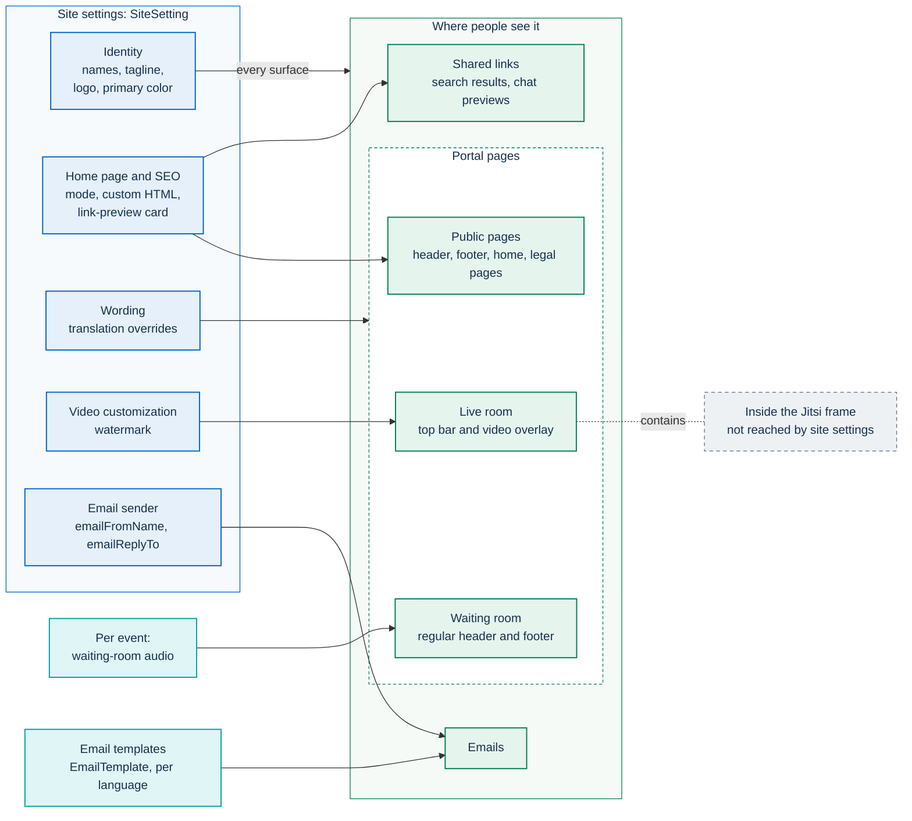

# Branding and white-labeling

A public administration (PA) that reuses PA Webinar can make the portal its own at runtime. It can set
its name, logo, home page, wording, the watermark over the video and the look of its emails, all
without rebuilding the image or restarting a pod. Most of these settings live in the `SiteSetting`
singleton (table `site_settings`, see [ADR-010](../adr/010-site-settings-singleton.md)). Email
templates live in their own table (`EmailTemplate`). Administrators edit them in the administration
area under **Site settings** (`/en/admin/settings`, or `/it/admin/impostazioni` in Italian).

The administration paths on this page are the English URLs. Each language has its own localized path
(see [languages and localization](../architecture/i18n.md#localized-urls)).

This page covers each branding surface, how it falls back when a field is empty, and where the limits
are. The operational knobs on the same settings row (scaling, grace periods, AI pipeline) are covered
in [runtime settings](runtime-settings.md).

## Where branding shows

The waiting room keeps the site's regular header and footer. The live room covers them with a
full-screen call surface: there, the logo (or the site name) sits in the room's top bar and the
watermark is drawn over the video. The Jitsi interface inside the frame is outside the portal's reach
(see [Inside the Jitsi frame](#inside-the-jitsi-frame)).

## How changes take effect

- **Who can edit.** Only staff with the `ADMIN` role. Organizers cannot open **Site settings** (see
  [identity and access](../architecture/identity-and-access.md)). Every save of the **Site settings**
  form goes through `PUT /api/admin/settings`, is validated against
  `app/src/lib/validation/site-settings.ts` and is written to the admin audit log as
  `SITE_SETTINGS_UPDATE`. Custom translations and email templates have their own routes
  (`PUT /api/admin/languages`, and `PUT` or `DELETE /api/admin/email-templates`) and their own audit
  entries.
- **No restart, but not always instant.** Changes apply without a restart. With several app replicas
  they can take up to a minute to appear everywhere. The form saves the whole row, so reload it after
  editing languages or translations elsewhere. Both are explained in
  [runtime settings](runtime-settings.md#how-a-change-reaches-the-platform).

## Images: upload them, do not hotlink

Every image field (logo, favicon, watermark, Open Graph image) and the waiting-room audio field accept
either **Upload file** or **Paste URL**.

- **Upload** sends the file to `/api/admin/assets/upload-url`. The route checks the declared type,
  the file's real magic bytes and the size limit per type. The accepted types and size caps are
  `ALLOWED_MIME` and `MAX_SIZE` in `app/src/app/api/admin/assets/upload-url/route.ts`. Most branding
  fields show their own help text instead of the format hint, and an oversized or wrong-type file is
  rejected with an error under the field. The file is stored in the files storage domain under
  `assets/` (see [object storage](storage.md)). The saved value is a stable URL on the portal's own
  origin (`/api/assets/...`). An SVG opened directly downloads instead of rendering, so a hostile SVG
  cannot run as a page.
- **Upload needs the files storage domain.** Without it, the route answers `503` and the field shows
  an upload error (see [object storage](storage.md#two-storage-domains)). Until storage is
  configured, a small image can be pasted as a `data:` URI, which the Content Security Policy
  allows.
- **A URL on another host usually does not display.** The Content Security Policy allows images only
  from the portal itself, `data:` and `blob:` URIs, and YouTube thumbnails (`img-src` in
  `app/src/middleware.ts`). A logo linked from an organization's website is saved without error but
  blocked by the browser. Audio is limited the same way by `media-src`, which admits the portal, the
  recording storage hosts and any host listed in `RECORDING_MEDIA_CSP_HOSTS`. See
  [Content Security Policy](../SECURITY-CSP.md).

Once files storage is configured, upload is the reliable choice for every branding asset.

## Site identity

The **Branding** and **Header** tabs overlap: both edit the application name, short organization
name, logo, organization URL and parent organization. **Site tagline** is only in **Header**, which
groups its fields under **Top bar (Slim Header)** and **Center header** and labels some of them
differently. The organization name, description, favicon, primary color and watermark are only in
**Branding**. The table uses the **Branding** labels.

| Label | Column | Where it appears |
|---|---|---|
| **Application name** | `siteName` | Center header, the browser-title suffix (`<page> — <siteName>`), the live-room top bar when no logo is set, the email header band, the email sender-name fallback, the `og:site_name` of event pages |
| **Application description** | `siteDescription` | Intro of the events list page and the institutional landing. One string for all languages |
| **Organization name** | `organizationName` | Footer heading, the institutional and plain-language landings, the built-in privacy, accessibility and legal-notice texts, event structured data, the link-preview card |
| **Organization short name** | `organizationNameShort` | Top bar on small screens |
| **Organization URL** | `organizationUrl` | Footer **Contacts** column (shown as its host name) |
| **Parent organization** and its URL | `parentOrganization`, `parentOrganizationUrl` | Top bar (a link that opens in a new tab when the URL is set) and the footer's second line |
| **Site tagline** | `siteTagline` | Top bar and footer, only when **Parent organization** is empty. Written per language |
| **Custom logo URL** | `logoUrl` | Center header next to the application name, live-room top bar (medium screens and up), watermark fallback |
| **Support email** | `supportEmail` | Footer **Contacts** column (in the **Features** tab) |
| **GitHub repository URL** | `githubUrl` | Footer **Source code** and **SBOM latest release** links, the build-info commit link, the repository and Scorecard links of the **Security and transparency** page (the upstream repository when empty), and the release links and SBOM viewer of the changelog (only `https://github.com/<owner>/<repo>` URLs are used there). In the **Features** tab |

The defaults for these columns are in `app/prisma/schema.prisma`. A few are worth changing on
day one:

- `siteName` and `seoTitle` both default to "PA Webinar", and they are separate fields. Change both,
  or empty `seoTitle` to get a per-language title (see [Known limitations](#known-limitations)).
- `siteDescription` defaults to an Italian sentence and is not translated. Replace it with the
  organization's own text.
- Set `organizationName`. While it is empty, the built-in legal pages say the organization is not
  configured. They do not fall back to the software's name, because a legal text naming the software
  as the controller would be false.

### Fallback chains

No organization name is written into the code. An empty field means "show nothing", or it falls back
to another configured field:

| Surface | First choice | Then | Then |
|---|---|---|---|
| Top bar, wide screens | **Parent organization** | **Site tagline** in the page language, then English, then any language | nothing |
| Top bar, small screens | **Organization short name** | **Organization name** | the wide-screen text |
| Footer heading | **Organization name** | **Application name** | "PA Webinar" |
| Footer second line | **Parent organization** | **Site tagline** | nothing |
| Institutional and plain-language landings | **Organization name** | **Application name** | |
| Event structured data (search engines) | **Organization name** | "PA Webinar" | |
| Center header image | **Custom logo URL** | the PA Webinar mark | |
| Live-room top bar (medium screens and up) | **Custom logo URL** | **Application name** as text | |

### Logo guidance

The center header and the live-room top bar are .italia blue. A logo reads best as a light or knockout
mark on a transparent background. It is drawn 40 px high in the header and 22 px high in the live room,
with its width following the aspect ratio. The footer always shows the PA Webinar mark next to the
organization name. The custom logo does not replace it (see [Known limitations](#known-limitations)).

## Home page

The **Home page** tab picks one layout (`homePageMode`, enum `HomePageMode`). These are
different page structures, not color themes: the right home page depends on who visits it.

| Label | Value | What the page contains |
|---|---|---|
| **Landing page** | `LANDING` | Hero, the live and after-event features, upcoming events and how it works. Optional **The project** block |
| **Institutional landing** | `LANDING_ISTITUZIONALE` | The organization and its description, the next event in the spotlight, the other events listed, and how to take part in plain words. No technical language |
| **Plain-language landing** | `LANDING_SEMPLICE` | A title with the organization name, one sentence and a single invitation, for people new to online events |
| **Events list** | `EVENTS_LIST` | Only the upcoming events, with a link to the full list |
| **Custom** | `CUSTOM` | The administration's own HTML, followed by the upcoming events |

- **Show the “The project” section** (`homeShowProject`) adds a block about architecture, data
  sovereignty and open source. It speaks to people evaluating reuse, not to participants, so it is
  off by default. It is shown only in the `LANDING` layout.
- **The bundled `LANDING` copy is not about your organization.** Its hero speaks of "the digital
  transformation communities". An organization that keeps this layout usually rewrites the
  `home.hero.*` keys with [translation overrides](#wording-translation-overrides).
- **Custom HTML** (`customHomeHtml`) is one string for every language. The length limit is in
  `app/src/lib/validation/site-settings.ts`. When the field is empty, `CUSTOM` falls back to
  `LANDING`. The HTML is inserted as written, with no sanitization, because only administrators can
  write it. The Content Security Policy still applies: inline scripts and event-handler attributes do
  not run, and images from other hosts do not load. Treat it as static markup with styles and images
  uploaded to the portal. The trust model is in [security architecture](../architecture/security.md).

## Search results and shared-link previews

The **SEO** tab sets how the site appears in search results and in link previews.

- **SEO title** and **SEO description** (`seoTitle`, `seoDescription`) are the default title and
  description of pages that do not set their own. **Open Graph image** (`seoImage`) is the default
  preview image. Without it, the bundled `/images/logo/og-image.png` is used.
- **Shared link preview** controls event links. With **Generate the preview** on (`ogCardEnabled`),
  an event page advertises a card that the server draws, served by `/api/og/event/<slug>`. The card
  is filled with **Primary color**, carries the PA Webinar mark, and prints the event title inside the
  image. Switches choose what else goes in: **Poster as background**, **Date and time** (in the site's
  default timezone), **Speakers** and **Organisation** (the event's organizer name,
  `Event.organizerName`, when set, otherwise **Organization name**). With the card off, the preview
  is the event's cover image, or the bundled `/images/logo/og-image.png` when the event has none.
  **Open Graph image** is not used for event links.

The card's URL changes whenever the event is edited, so preview services that cache images by address
pick up a corrected title or poster.

## Wording: translation overrides

Any interface string can be reworded per language without touching the catalogs. Use this for
organization-specific terminology, or to rewrite the landing copy.

- **Where.** **Site settings** → **Language management** (`/en/admin/settings/languages`) →
  **Custom translations**. Pick a language, then enter a **Translation key** in dot notation and its
  **Value**. Keys are the paths in `app/src/i18n/messages/<locale>.json`, for example
  `home.hero.title`. An override changes one language only.
- **What it reaches.** Everything the portal renders through its message catalogs: public pages,
  the waiting room, the live-room controls and the administration area. It does not reach emails,
  which have their own copy (see [Emails](#emails)). It does not reach the Jitsi interface inside the
  frame or the custom home HTML either.
- **Nothing checks an override.** A wrong key or placeholder can break the text it touches, and the
  editor cannot remove an override once saved.

How overrides are stored and applied, the rules for keys and placeholders, and how to remove one are
in [languages and localization](../architecture/i18n.md#translation-overrides), together with the
language list, the default language and the catalog mechanics.

### Editorial title kicker

**Editorial title kicker** (`parseTitleKicker`, in the **Features** tab) is a site-wide editorial
convention. When it is on, an event title that contains `|` shows the part before the pipe as a small
label above the main title, in listings, on the event page, in the waiting room and in the live room.
It is off by default, so existing titles never change appearance. An event can override the site
default in either direction (`Event.parseTitleKicker`; empty inherits the site setting).

## Header, footer and legal pages

The footer has fixed columns: **Events** with **Video library**, **Contacts** (organization URL and
support email), and **Open source software**. The last column has **Source code** and
**SBOM latest release** when a GitHub URL is set, and always **Security and transparency**.

The bottom row is configurable in the **Footer** tab. Editing links in that tab currently prevents
the form from saving, so configure them through the API as described in
[Known limitations](#known-limitations).

- Links in the **Legal** section are listed there. Once at least one is configured, they replace the
  default links (**Privacy policy**, **Accessibility statement**, **Legal notes**). Re-add the
  defaults if they are still wanted.
- **Service inventory** and, when the status page is enabled, **System status** are always appended.
  The build information (version and commit, linked to the changelog) follows when the build set it.
  Images built from the repository's `Dockerfile` always do, since it defaults the version to `dev`.
  A local `npm run dev` or `npm run build` without the `NEXT_PUBLIC_BUILD_*` variables shows none.
- A link that starts with `/` opens in the same tab, and in the visitor's language when it matches a
  known page. Other links open in a new tab. Link titles are one string for all languages.

The **Pages** tab replaces the built-in text of the privacy notice page and the accessibility statement
with the organization's own HTML, per language (the form offers Italian and English). A language with
no custom text gets the built-in template, filled with **Organization name**. Clearing the last
custom text of either page makes the save fail, so going back to the built-in template takes an API
call (see [Known limitations](#known-limitations)). How the privacy notice of each event is resolved
is covered in [privacy and data protection](../GDPR.md).

## Emails

Emails carry the site's identity, but their layout is fixed in code
(`app/src/lib/email/templates.ts`):

- the header band shows **Application name** on the .italia blue; there is no logo;
- the event's image, when it has one, appears as a banner;
- **Sender name** (`emailFromName`, in the **Features** tab) falls back to `SMTP_FROM_NAME`, then to
  **Application name**, then to "PA Webinar". The sending address always comes from `SMTP_FROM`,
  because it must match what the SMTP relay is authorized to send as;
- **Reply-to address** (`emailReplyTo`) gives replies somewhere to go, since the sender is a
  no-reply address;
- **Email templates** (`/en/admin/settings/email-templates`) override the subject, heading, intro,
  button label, note and footer of the confirmation and reminder emails, per language.

Email behavior and the full catalog of emails are in [email and calendar](../architecture/email.md).
SMTP settings are in [email delivery](email.md).

## Video watermark

**Branding** → **Video customization** sets an image drawn over the conference video.

| Label | Column | Behavior |
|---|---|---|
| **Watermark enabled** | `jitsiWatermarkEnabled` | Shows or hides the overlay |
| **Watermark URL** | `jitsiWatermarkUrl` | Transparent SVG or PNG. Empty falls back to **Custom logo URL**, then to `/images/default-watermark.svg` (the PA Webinar mark in white) |
| **Opacity** | `jitsiWatermarkOpacity` | 10 to 80 percent in the form, in steps of 5 |
| **Position** | `jitsiWatermarkPosition` | **Bottom left**, **Bottom right**, **Top left**, **Top right** |

The defaults are in `app/prisma/schema.prisma`. The form shows a live preview.

The watermark is drawn by the portal, not by Jitsi. `JitsiRoom`
(`app/src/components/jitsi/jitsi-room.tsx`) places an image over the iframe once the conference has
loaded. It is 80 px wide, with its height following the aspect ratio, and sits a small margin from
the chosen corner. It ignores clicks and is hidden from assistive technology. This has three
consequences:

- **It is not in the media.** Jibri's composite recording captures the conference as Jitsi's own web
  client renders it, so recordings carry no watermark (see [recording](../architecture/recording.md)).
- **It exists only in the portal page.** It is a visual overlay, not a mark in the stream.
  Participants see it because they join through the portal, but it is not a provenance or anti-leak
  control (see
  [How PA Webinar extends Jitsi Meet](../architecture/jitsi-integration.md#restricting-direct-access-to-the-jitsi-host)).
- **Wide logos come out small.** At 80 px wide, a long horizontal lockup is hard to read. A compact,
  light mark works best over video.

Jitsi's own watermarks and "powered by" link are switched off in
`jitsiInterfaceConfigOverwrite` (`app/src/lib/jitsi/config.ts`). These overrides are passed by the
iframe. Clients that load Jitsi directly, such as Jibri, use the Jitsi web server's own interface
configuration.

## Waiting-room music

Music is set per event, not per site.

- **Where.** In the event wizard's **Basics** step: **Waiting-room audio (optional)**, as an upload
  or a URL (`Event.waitingRoomAudioUrl`). The value is copied when an event is duplicated.
- **Only events with their own audio have music.** Visitors start it themselves with a toggle, and an
  event without audio has no toggle: the bundled track is never played on its own. When the toggle
  appears and how playback behaves are in
  [the waiting room](../architecture/waiting-room.md#waiting-room-music).
- **The square has its own sound.** The optional 2D square synthesizes its sound in the browser and
  is not configurable here.

Choose a track that suits a public body's lobby:

- instrumental, calm, and good for looping;
- small enough to download quickly: the player creates its audio element as soon as the toggle
  appears, and browsers may preload the file for every visitor of a `PUBLISHED` waiting room, not
  only for those who press the toggle;
- licensed for public performance and redistribution by the organization, with any attribution the
  license requires published where visitors can find it.

The bundled track's source and license are recorded in
[`app/public/audio/README.md`](../../app/public/audio/README.md). An uploaded file avoids the
`media-src` restriction described in [Images](#images-upload-them-do-not-hotlink).

## Virtual backgrounds

The backgrounds offered in the waiting room are a catalog in code (`SFONDI_VIRTUALI` in
`app/src/lib/jitsi/virtual-background.ts`), not a runtime setting. They are abstract gradients
bundled with the app. They follow the repository license, so no attribution is needed. To offer an
organization's own backgrounds:

1. add the images to the app;
2. add the entries to the catalog;
3. translate their names in all 24 languages;
4. rebuild the image.

The steps are in
[`app/public/images/virtual-backgrounds/README.md`](../../app/public/images/virtual-backgrounds/README.md).
How the chosen background reaches the conference is in
[How PA Webinar extends Jitsi Meet](../architecture/jitsi-integration.md#virtual-backgrounds).

## Inside the Jitsi frame

Site settings stop at the iframe. Inside it, Jitsi keeps its own colors, fonts and logos, and the
interface names the app "PA Webinar" (`APP_NAME` in `app/src/lib/jitsi/config.ts`) whatever
**Application name** says. Why the portal cannot reach further, and the server-side options that
remain, are described in
[Branding limits](../architecture/jitsi-integration.md#branding-limits).

## Design constraints

- **The .italia design system.** The portal is built on Bootstrap Italia and design-react-kit, the
  .italia design system that Designers Italia (the Italian public-sector design program) and
  Developers Italia (the Italian public-sector open-source developer community) publish for
  public-sector websites. The Titillium Web typeface is self-hosted
  (`app/src/styles/_fonts.scss`), with no external CDN. Changing fonts or the component palette means
  changing the Sass build and rebuilding the image (see
  [extending PA Webinar](../development/extending.md)).
- **Light theme only.** There is no dark mode. Contrast is designed on white surfaces.
- **Color tokens.** The app's own tokens (`--app-text`, `--app-primary`, `--app-muted`) are defined
  on `:root` in `app/src/styles/globals.scss`. That file is the reference for the palette. This page
  does not copy it.
- **What Primary color changes.** **Primary color** (`primaryColor`) overrides the `--bs-primary` and
  `--bs-primary-rgb` custom properties on every page. The following follow it:
  - the `.text-primary`, `.bg-primary` and `.border-primary` utility classes;
  - the app rules that read `--bs-primary`, such as the video player's accents and some focus
    outlines;
  - the background of the link-preview card.

  Bootstrap Italia components compiled from Sass keep their .italia colors: the header, the footer
  and buttons. The `--app-primary` token, the live-room top bar, the email header band and the
  browser theme color stay .italia blue too. Treat it as an accent, not a full rebrand.
- **Contrast is your responsibility.** The platform does not check the chosen color. `.text-primary`
  uses it for text, so pick a color with at least 4.5:1 contrast against white (WCAG 2.1 AA). The
  Legge Stanca (Italian accessibility law) applies to public bodies' websites.

## What needs a rebuild or redeploy

| To change | Where it lives | How |
|---|---|---|
| Fonts, component palette, compiled colors | `app/src/styles/` | Rebuild the app image |
| The PA Webinar marks, default watermark, default preview image | `app/public/images/logo/`, `app/public/images/default-watermark.svg` | Rebuild, or set the runtime fields that replace them where one exists |
| Virtual backgrounds | `app/src/lib/jitsi/virtual-background.ts` and `app/public/images/virtual-backgrounds/` | Code change, 24-language names, rebuild |
| Email layout | `app/src/lib/email/templates.ts` | Code change, rebuild |
| Look of the Jitsi interface | Jitsi web configuration in the chart | Helm upgrade (see [deploying with Helm](../DEPLOYMENT.md)) |

## Known limitations

- **Favicon URL has no effect.** The field is saved, but the browser icon comes from the bundled
  `app/src/app/icon.svg` and `apple-icon.png`.
- **The footer always shows the PA Webinar mark**, and so does the link-preview card. **Custom logo
  URL** does not replace it there.
- **Some footer links never display.** Links in the **Main** section are saved, but only **Legal**
  links are rendered.
- **Saving after editing footer links fails.** The **Footer** tab keeps the list as a JSON string,
  and the settings API expects an array. So **Save** returns a validation error, and none of the other
  changes on the form are saved either. Until the editor is fixed, send `footerLinks` as an array to
  `PUT /api/admin/settings`.
- **Clearing the last custom legal text fails.** Emptying the only filled language of the privacy
  policy or accessibility statement makes **Save** return a validation error, and no other change on
  the form is saved. To go back to the built-in template, send `privacyPolicy` (or `accessibility`)
  as `{}` to `PUT /api/admin/settings`.
- **Several identity fields are single-language:** **Application name**, **Application description**,
  **SEO title**, **SEO description**, footer link titles and the custom home HTML. To get
  per-language SEO text, leave **SEO title** and **SEO description** empty (**SEO description** is
  empty by default). Pages then use `common.appName` and `common.appDescription`, which translation
  overrides can reword per language. **Application name** cannot be empty and always wins in the
  header.
- **`NEXT_PUBLIC_WATERMARK_URL`**, listed in `.env.example`, is not read by any component. The
  watermark is configured only in site settings.

## Related pages

- [Configuration reference](../CONFIGURATION.md): the configuration layers and the environment
  variables.
- [Runtime settings](runtime-settings.md): the rest of the `SiteSetting` row and per-event overrides.
- [Languages and localization](../architecture/i18n.md): enabled languages and catalogs.
- [The waiting room and the square](../architecture/waiting-room.md): engines, device check, music.
- [How PA Webinar extends Jitsi Meet](../architecture/jitsi-integration.md): what can change inside
  the conference.
- [Content Security Policy](../SECURITY-CSP.md): which hosts images and audio may come from.
- [Object storage](storage.md): where uploaded assets are stored.
