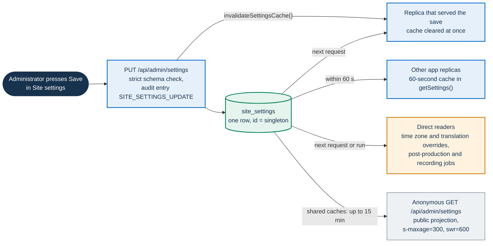
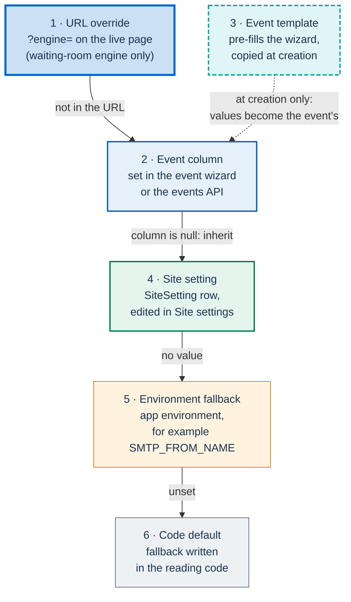

# Runtime settings (SiteSetting)

PA Webinar keeps the settings that an administration changes while the platform runs in one database
row, the `SiteSetting` singleton. This page is for administrators who edit them and for operators who
need to know what each knob does and when a change takes effect. It covers the setting groups, the
lifecycle, sizing and AI knobs with their defaults, the per-event overrides, and which value wins when
several layers set the same thing.

The decision to hold runtime configuration in the database rather than in environment variables is
recorded in [ADR-010](../adr/010-site-settings-singleton.md). Deployment configuration (secrets, hosts,
SMTP transport, storage) stays in the environment and is described in the
[configuration reference](../CONFIGURATION.md).

The authority for every default on this page is the `SiteSetting` model in `app/prisma/schema.prisma`.
The accepted ranges come from `updateSettingsSchema` in `app/src/lib/validation/site-settings.ts`. When
this page and those files disagree, the files win.

## Quick answers

- **Where are the settings edited?** In the administration area, under **Settings**: the page
  **Site settings** (`/en/admin/settings`, `/it/admin/impostazioni`). Only administrators can open it
  or save it. Organizers cannot.
- **Does a change need a restart or a redeploy?** No. It reaches every app replica within about a
  minute.
- **Where are the defaults?** In `app/prisma/schema.prisma`, model `SiteSetting`. They apply when the
  row is created.
- **Can one event differ from the site?** Yes, for the settings listed under
  [per-event overrides](#per-event-overrides).
- **Are the settings confidential?** No. All but two columns can be read by anyone through a public
  API (see [who can read them](#who-can-read-them)).

## What SiteSetting is

### One row, created on first use

`SiteSetting` maps to the table `site_settings`, which always holds exactly one row with the `id`
`singleton`. No other model refers to it.

`getSettings()` in `app/src/lib/settings.ts` creates the row with the schema defaults the first time
it is read. When several requests race on a fresh installation, the ones that hit the unique
constraint re-read the row that the first one created. Installations therefore start from different
values depending on how they were set up:

| Installation | How the row is created | Starting values |
|---|---|---|
| Helm chart | The `db-migrate` init container runs `prisma migrate deploy` only. The first request that reads the settings creates the row | The schema defaults |
| Docker Compose, `setup` profile | `db-migrate` runs the migrations, then `prisma/seed.ts` | The schema defaults, except a site description, **Public calendar** turned on, and footer links to the privacy, accessibility and legal-notice pages |

A default applies only when the row is created. If a later release changes a default in
`schema.prisma`, the value already stored in an existing installation stays as it was. After an
upgrade, check the panel rather than the release's schema.

### How a change reaches the platform

Most code reads the row through `getSettings()`. That function keeps a copy in each app process for
60 seconds (`CACHE_TTL_MS`). A save clears the copy in the replica that handled the request, and the
other replicas pick up the change when their copy expires. Some readers skip the cache and read the
row every time, among them:

- the i18n request configuration, for the time zone and the translation overrides;
- the AI post-production routes and jobs;
- the orphan-recording reconciliation job and the orphan-recordings API;
- the languages API and the settings API itself.



"Takes effect" means different things for different readers:

- server-rendered pages and API routes use the new value on their first request after the cache
  expires;
- the JVB scaler, where one runs, reads the settings through the same cache, so it uses the new value
  on its first tick after the serving replica's copy expires: within one tick plus a minute (see
  [scaling the media plane](../architecture/scaling.md));
- a participant who is already in the live room keeps the values that the page loaded with, such as
  the reactions mode or the video-quality preset, until the page is reloaded.

### Who can read them

`GET /api/admin/settings` returns the full row to an administrator. Every other caller, anonymous
ones included, receives every column except the ones listed in `NON_PUBLIC_SETTING_FIELDS`
(`app/src/lib/settings/public-projection.ts`): `customHomeHtml` and `emailReplyTo`. The public answer
carries `Cache-Control: public, s-maxage=300, stale-while-revalidate=600`, so a shared cache in front
of the app may keep serving a stale copy for up to 15 minutes after a change. Treat every other
setting as public, the sizing and AI parameters included.

A guard test, `app/src/lib/settings/public-projection.test.ts`, reads the Prisma schema and fails when
a column is neither listed as public nor withheld with a reason.

### Who can write them

`PUT /api/admin/settings` requires an administrator session. The route reads only the
`admin_session` cookie of an administrator signed in to the administration area, whether with the
instance API key or with a named administrator account (see
[identity, access and tokens](../architecture/identity-and-access.md)). It does not accept the API
key as a bearer token: a script that sends `ADMIN_API_KEY` gets `401`.

The route drops `id` and `updatedAt` from the body before validation; every other field must be in
`updateSettingsSchema`, a strict Zod schema, so an unknown field fails the whole request instead of
being dropped. Every successful save writes an administrator audit entry, `SITE_SETTINGS_UPDATE`,
with the names of the fields in the request but not their values.

**Site settings** sends every field of the row as it was when the page loaded, so the last save wins
for the whole row. Two administrators editing at the same time overwrite each other, and a save can
undo a language-list change or a translation override made meanwhile on the languages page. If
anything else changed, wait about a minute, then reload **Site settings** before saving: the page
itself loads through the per-replica cache, so an earlier reload may still show the old values, and
saving would write them back. The same whole-row save explains why the audit entry lists every field
rather than only the changed ones.

The languages page saves the language list through the same route. It saves translation overrides
through `PUT /api/admin/languages`, audited as `LANGUAGES_TRANSLATIONS_UPDATE`.

### Writing a field the panel does not show

Because the route authenticates with the administrator session cookie, call it from a browser that
is signed in to the administration area, for example from the developer console on any page of the
administration area. The body may contain only the fields to change:

```js
await fetch('/api/admin/settings', {
  method: 'PUT',
  headers: { 'Content-Type': 'application/json' },
  body: JSON.stringify({ orphanRecordingGraceDays: 60 }),
});
```

The same pattern writes `footerLinks` as the array the schema expects, which repairs the
[footer-links limitation](#known-limitations). For example, with your own titles and paths:

```js
await fetch('/api/admin/settings', {
  method: 'PUT',
  headers: { 'Content-Type': 'application/json' },
  body: JSON.stringify({
    footerLinks: [
      { title: 'Privacy', url: '/privacy', section: 'legal' },
      { title: 'Accessibility', url: '/accessibility', section: 'legal' },
    ],
  }),
});
```

A `422` response lists the fields that failed validation. The change is audited like a save from the
panel.

## Where each setting is edited

**Site settings** is organized in tabs. The settings landing also links **Language management**,
**GDPR templates**, **Email templates** and **Tag management**; only the first of these writes to the
`SiteSetting` row, while the others manage their own tables (`GdprTemplate`, `EmailTemplate`, `Tag`).

| Where | What it holds | Owner page |
|---|---|---|
| **Branding** tab | Names and links of the organization and its parent body, logo, favicon, primary color, default time zone, default waiting-room engine, Jitsi watermark | [Branding and white-labeling](branding.md) |
| **Header** tab | Application name, logo, organization link, short name, tagline per language, parent body shown in the header | [Branding](branding.md#header-footer-and-legal-pages) |
| **SEO** tab | Title, description and image for search engines; what the link-preview card shows (`ogCardEnabled`, `ogShow*`) | [Branding](branding.md#search-results-and-shared-link-previews) |
| **Home page** tab | Home layout (`homePageMode`), the project section (`homeShowProject`), custom HTML (`customHomeHtml`) | [Branding](branding.md#home-page) |
| **Pages** tab | **Privacy policy** (the privacy notice) and **Accessibility statement** text per language (`privacyPolicy`, `accessibility`) | [Branding](branding.md#header-footer-and-legal-pages), [privacy and data protection](../GDPR.md) |
| **Footer** tab | Footer links (`footerLinks`) | [Branding](branding.md#header-footer-and-legal-pages) |
| **Features** tab | Public switches, contact links, Gravatar, email sender, bridge timing, stress thresholds, waiting-room routing window, reactions mode, status-page polling | This page |
| **Infra sizing** tab | Bridge sizing, default sender ratio, default grace period, default video quality | This page and [scaling](../architecture/scaling.md) |
| **Post-event AI pipeline** tab | Kill switch, engines, default translation languages, limits, artifact retention, waiting-room AI notice | This page and [AI post-production](../POSTPROD.md) |
| **Language management** page (`/en/admin/settings/languages`) | `defaultLocale`, `availableLocales`, `localeNames`, `translationOverrides` | [Languages and localization](../architecture/i18n.md#runtime-language-settings) |
| No field in the panel | `orphanRecordingGraceDays` | Set it through `PUT /api/admin/settings` ([writing a field the panel does not show](#writing-a-field-the-panel-does-not-show)) |

## Setting groups

### Identity, branding and pages

Names, logo, colors, home page, search and link previews, legal pages and footer are described
surface by surface, with their fallbacks and limits, in [branding and white-labeling](branding.md).
One operational note belongs here: `customHomeHtml` is inserted into the home page as written, with no
sanitization, so treat it as code and restrict who holds administrator access.

### Languages and time zone

`defaultTimezone` (**Default timezone**, **Branding** tab, default `Europe/Rome`) is the time zone
that the app's date formatters use on pages, the one preselected for a new event in the wizard, and
the one used for the date on link-preview cards. Each event keeps its own `timezone`: emails and the
waiting-room schedule show times in it. Calendar files carry UTC instants, which each calendar
application shows in the reader's own time zone (see
[calendar files](../architecture/email.md#time-zones)).

The language settings decide which of the 24 languages are offered and which is the default. What
they do and do not control is explained in
[languages and localization](../architecture/i18n.md#runtime-language-settings).

### Public features

Defaults are those of `app/prisma/schema.prisma`.

| Setting | Label and tab | Default | Effect |
|---|---|---|---|
| `calendarPublic` | **Public calendar**, **Features** | `false` | When off, the public calendar page answers 404 and the public calendar feed (`/api/events/calendar`) returns an empty list. The staff calendar is unaffected |
| `statusPageEnabled` | **Status page enabled**, **Features** | `true` | When off, `/status` answers 404 and is not indexed, the **System status** footer link disappears, and `/api/status/infrastructure`, `/api/status/metrics` and `/api/status/postprod` answer 404 to anyone but an administrator. `/api/status` still answers, because the live room polls it for bridge readiness, but only with the bridge and recorder readiness fields. Administrators keep the full view in the administration area, and the answers they get cannot be cached: `/api/status/metrics` and `/api/status/postprod` send them `Cache-Control: private, no-store`, and `/api/status/infrastructure` always sends `no-store`, so no shared cache serves them to anyone else. See [status endpoints and pages](../operations/monitoring.md#status-endpoints-and-pages) |
| `parseTitleKicker` | **Editorial title kicker**, **Features** | `false` | Shows the part of a title before `\|` as a small label above it. An event can override it ([branding](branding.md#editorial-title-kicker)) |
| `gravatarEnabled` | **Use Gravatar when available**, **Features** | `false` | Lets the platform fetch a registrant's Gravatar through its own proxy, so browsers never contact the Gravatar service. Declare it in the privacy notice ([avatars](../architecture/identity-and-access.md#avatars)) |
| `reactionsMode` | **Reactions (emoji)**, **Features** | `NATIVE` | `NATIVE` is **Jitsi native (in the toolbar, ephemeral)**; `CUSTOM` is **App custom (left-hand bar, with stats)**. See [reactions](../architecture/live-interaction.md#reactions) |
| `waitingRoomEngine` | **Waiting room (site default)**, **Branding** | `GARDEN` | The site's default waiting-room engine. `GAME` (**Videogame (Phaser lobby)**) offers the square; `CLASSIC` (**Classic (static)**) starts in the classic view. `GARDEN`, the schema default, is a legacy value that behaves as `GAME`, and the selector shows it as the videogame option. See [engines](../architecture/waiting-room.md#engines-classic-view-and-the-square) |
| `videoQuality` | **Default quality**, **Infra sizing** | `HIGH` | The default video and audio preset: `SAVE_DATA` (360p), `BALANCED` (540p), `HIGH` (720p) or `MAX` (1080p). Phones are capped at 360p whatever the preset. See [video quality presets](../architecture/jitsi-integration.md#video-quality-presets) |
| `waitingRoomLeadMinutes` | **Waiting-room routing window (minutes)**, **Features** | `15` | A registration made within this many minutes of the start goes straight to the waiting room. An earlier one gets a confirmation with a calendar link. `0` always shows the confirmation. Accepts 0 to 1440. The value also bounds how early a visitor can wake a room (see [event lifecycle and bridge timing](#event-lifecycle-and-bridge-timing)) |
| `githubUrl` | **GitHub repository URL**, **Features** | none | The source-code links in the footer, the security and release-notes pages, and the release SBOM viewer. It must have the form `https://github.com/<owner>/<repo>` for the release links to work |
| `supportEmail` | **Support email**, **Features** | none | The contact address shown in the footer |
| `guestAccessEnabled` | **Guest access enabled**, **Features** | `true` | When off, visitors without a token cannot join scheduled events: the live page sends them to registration (skipping the join-password step), the Jitsi token endpoint refuses guest tokens with `403` `GUEST_ACCESS_DISABLED`, the chat refuses tokenless readers and writers, and Q&A and polls refuse them too. The administration's **Direct invite (no registration)** link and the room's **Link to join** are hidden for scheduled events. Instant calls stay open to anyone with the link. Registrants and moderator or speaker links are unaffected. See [guests](../architecture/identity-and-access.md#guests) |
| `publicRegistrationEnabled` | **Public registration enabled**, **Features** | `true` | When off, only addresses on the event's invitation list (`EventInvitation`) can register. `POST /api/events/{slug}/registrations` then answers `202` with the same body for every address, with no token, link or cookie: an invited address is registered, an already registered address gets its link again, and any other address gets nothing. The personal link arrives only by email. An event with no invitations accepts no new registrations, and its registration page offers only the link resend. Existing registrations, moderator and speaker links, and staff paths are unaffected. For a closed meeting, also turn off **Guest access enabled**. See [invitation-only registration](../architecture/event-journey.md#invitation-only-registration) |

The whiteboard has no switch in the site settings. It is an opt-in on each event, and it also needs
a whiteboard backend on the Jitsi side. The portal shows its **Whiteboard** button and the reminder
to export the whiteboard only when the app environment sets `NEXT_PUBLIC_WHITEBOARD_ENABLED=true`
for the whole installation. The live room reads that variable at request time, so a change needs a
pod restart, not a new image (see the
[Configuration reference](../CONFIGURATION.md#public-variables-next_public_) and
[reactions, whiteboard and instant calls](../architecture/jitsi-integration.md#reactions-whiteboard-and-instant-calls)).

### Email sender

| Setting | Label | Default | Effect |
|---|---|---|---|
| `emailFromName` | **Sender name**, **Features** | none | The display name on every email. When empty, `SMTP_FROM_NAME` is used, then the site name, then `PA Webinar` |
| `emailReplyTo` | **Reply-to address**, **Features** | none | The `Reply-To` header. The sending address is a no-reply relay, so without this a reply reaches nobody. It is never served to non-administrators |

The sending address itself is `SMTP_FROM` in the environment, because it has to match what the relay
may send as. See [sender identity](email.md#sender-identity) for the transport and
[email and calendar](../architecture/email.md#sender-name-address-and-reply-to) for the behavior.

### Event lifecycle and bridge timing

The first four settings in this table are read by the JVB scaler. They have no effect unless the
scaler runs: in the chart it runs only in the `full` profile with `jvbScaler.enabled: true`, which is
off by default in `infra/helm/pa-webinar/values.yaml`, and Docker Compose has no scaler. See
[running without the scaler](../architecture/event-lifecycle.md#running-without-the-scaler). Three
uses apply without a scaler: `jvbPreScaleMinutes` still bounds the `/wake` window,
`eventGracePeriodMinutes` still drives the overtime banner in the browser (which then counts down to a
close that never comes), and `jvbProvisioningTimeoutMinutes` is read by the status pages.

Defaults are those of `app/prisma/schema.prisma`; accepted ranges are those of
`app/src/lib/validation/site-settings.ts`. What each setting does to an event's status is described
in [event lifecycle](../architecture/event-lifecycle.md#lifecycle-settings).

| Setting | Label and tab | Default | Accepted | Meaning |
|---|---|---|---|---|
| `jvbPreScaleMinutes` | **Pre-scale lead time (minutes)**, **Features** | `15` | 1 to 60 | How long before `startsAt` the scaler starts the bridge ([pre-scale window](../architecture/event-lifecycle.md#pre-scale-window)); the larger of this and `waitingRoomLeadMinutes` bounds how early a visitor can [wake](../architecture/event-lifecycle.md#wake) a room |
| `jvbInactiveGraceMinutes` | **Inactivity minutes before shutdown**, **Features** | `45` | 5 to 240 | Empty time before a `LIVE` room goes `IDLE`, and before an open-ended room past `endsAt` is ended ([inactivity grace](../architecture/event-lifecycle.md#inactivity-grace-live-to-idle)) |
| `eventGracePeriodMinutes` | **Default grace minutes past endsAt**, **Infra sizing** | `15` | -1 to 240 | Overtime after `endsAt`, where `-1` never ends the room on the clock; an event can override it ([grace period and overtime](../architecture/event-lifecycle.md#grace-period-and-overtime)) |
| `jvbEmptyCloseMinutes` | **Empty-room minutes before definitive close**, **Features** | `-1` (off) | -1 to 240 | Opt-in: empty time after which a room that had participants is ended before `endsAt` ([opt-in empty close](../architecture/event-lifecycle.md#opt-in-empty-close)) |
| `jvbProvisioningTimeoutMinutes` | **Provisioning timeout (minutes)**, **Features** | `15` | 1 to 120 | Wait for a bridge after which the status pages report it as stale. The same wait applies to Jibri: past it, `/api/status` reports the recorder as `failed` and the moderator's recording button stops reading **Recording starting…** ([moderator control bar](../architecture/jitsi-integration.md#app-owned-controls-around-the-iframe)). It never changes the event's status ([only a signal](../architecture/event-lifecycle.md#the-provisioning-timeout-is-only-a-signal)) |
| `statusPollIntervalSeconds` | **Status page poll interval (seconds)**, **Features** | `30` | 5 to 600 | How often the public status page refreshes in the browser |
| `orphanRecordingGraceDays` | Not in the panel ([set it through the API](#writing-a-field-the-panel-does-not-show)) | `30` | 0 to 365 | Days an unreferenced blob in recording storage waits before the `recordings-reconcile` CronJob deletes it. The job exists only in the chart. `0` turns automatic deletion off; blobs an administrator marks for immediate deletion are still removed ([recordings-reconcile](../architecture/background-jobs.md#recordings-reconcile)) |

Automatic transitions happen on scaler ticks, so they lag their nominal time by up to one tick
interval. Timing semantics, overtime and revival are in
[event lifecycle](../architecture/event-lifecycle.md#timing-semantics).

The scaler route also reads `JVB_PRE_SCALE_MINUTES`, `JVB_INACTIVE_GRACE_MIN` and
`JVB_EMPTY_CLOSE_MIN` from the environment, but only when the matching column is null. The columns
are `NOT NULL`, so these variables have no effect, including the `JVB_PRE_SCALE_MINUTES` value set in
`docker-compose.yml` and `.env.example`. Change the timing in the panel.

### Bridge sizing

These settings turn each event's declared audience into a number of Jitsi Videobridge (JVB) replicas.
Only the JVB scaler acts on the result, so they provision nothing unless the scaler runs
(`jvbScaler.enabled: true` in the chart's `full` profile, off by default; Docker Compose has no
scaler). Without it they only feed the capacity estimates in the event wizard and on the status pages.
The formula, a worked example and how the result becomes nodes are in
[scaling the media plane](../architecture/scaling.md#sizing-from-an-event-to-a-number-of-bridges).
Defaults are those of `app/prisma/schema.prisma`.

| Setting | Label and tab | Default | Accepted | Meaning |
|---|---|---|---|---|
| `jvbCpuCoresPerPod` | **vCPU per JVB pod**, **Infra sizing** | `16` | 1 to 128 | The CPU cores one bridge has. The estimated cores of an event are divided by it |
| `jvbReceiversPerCore` | **Passive viewers per core**, **Infra sizing** | `18.75` | 0.1 to 100 | How many receive-only participants one core serves |
| `jvbSendersPerCore` | **Active senders per core**, **Infra sizing** | `3.125` | 0.1 to 100 | How many participants sending audio or video one core serves |
| `defaultSenderRatioPct` | **Default sender ratio**, **Infra sizing** | `30` | 0 to 100 | The share of participants expected to send, when the event does not say. It counts only when participants can start their camera; otherwise every participant is a receiver |
| `jvbMaxReplicas` | **Max JVB replicas**, **Infra sizing** | `6` | 1 to 50 | The **per-event** cap: it limits each event's result before the sum. It does not limit the total |
| `jvbStressWarnPercent` | **Stress warning threshold (%)**, **Features** | `50` | 0 to 100 | Above this measured bridge stress, the scaler adds one replica |
| `jvbStressCriticalPercent` | **Stress critical threshold (%)**, **Features** | `70` | 0 to 100 | Above this, the scaler adds two replicas instead. Keep it above the warning threshold; the form does not check this |
| `jibriCpuCoresPerPod` | **vCPU per Jibri pod**, **Infra sizing** | `4` | 1 to 32 | Stored and shown, but no code reads it |

The **global** cap is not a site setting. It is `JVB_MAX_REPLICAS` in the app environment
(`app.env.JVB_MAX_REPLICAS` in the chart), read once when the process starts, so changing it needs a
rollout of the app. When it is unset, `app/src/lib/jvb-sizing.ts` uses `6`; `docker-compose.yml` and
`.env.example` set `4`. See [two caps](../architecture/scaling.md#two-caps).

The sizing defaults describe a 16-core bridge. On smaller bridges, align **vCPU per JVB pod** with the
CPU the bridge really has, as explained in
[align the defaults with your bridges](../architecture/scaling.md#align-the-defaults-with-your-bridges).
The **Sizing preview** in the **Infra sizing** tab applies the formula to a 100-participant event
with the default sender ratio and the values on the form, before anything is saved. Enabling, tuning
and validating the scaler are covered in [running the JVB scaler](../operations/jvb-scaler.md).

### AI post-production

These settings govern the in-cluster AI pipeline described in [AI post-production](../POSTPROD.md).
Defaults are those of `app/prisma/schema.prisma`.

| Setting | Label | Default | Accepted | Meaning |
|---|---|---|---|---|
| `aiPipelineEnabled` | **Post-event pipeline active** | `false` | on or off | The kill switch for the whole pipeline (see below) |
| `aiDefaultTargetLocales` | **Default translation languages** | `en,fr` | text up to 200 characters, read as comma-separated language codes; invalid entries are ignored when jobs are queued | The translation targets of an event that sets none. The recording's source language is always dropped from the list |
| `aiAsrProvider` | **Transcription engine** | `whisperx` | `whisperx` only | The transcription engine the worker is told to use |
| `aiLlmProvider` | **Summary and translation engine** | `vllm` | `vllm` only | The language-model engine, served in the cluster |
| `aiTtsEngine` | **Dubbing engine** | `piper` | `piper` only | The engine for synthetic dubbing voices |
| `aiMaxConcurrentJobs` | **Parallel jobs** | `2` | 1 to 20 | The most worker jobs the orchestrator keeps running at once |
| `aiJobMaxAttempts` | **Attempts before failure** | `5` | 1 to 20 | After this many attempts, a job is marked failed for good |
| `aiArtifactRetentionDays` | **Artifact retention (days)** | `0` | 0 to 3650 | `0` sets no site-wide limit: artifacts follow the event-bound and per-recording regimes. `N` > 0 adds a rule: the post-production retention job deletes every artifact older than `N` days, those of published recordings included. It can shorten retention, never extend it |
| `aiConsentDisclosure` | **AI notice in the waiting room** | empty | text per language | The notice shown in the waiting room of an event with AI options. A language with no text gets the built-in notice |

The engine values select what the worker runs; the endpoints, models and credentials behind them are
deployment configuration, described in [AI post-production](../POSTPROD.md). The chart runs the
retention job daily when post-production is enabled
([postprod-retention](../architecture/background-jobs.md#postprod-retention)); Docker Compose does not
run it, so `aiArtifactRetentionDays` has no effect there. The
retention regimes and their legal basis are in
[recordings, voice data and AI outputs](../privacy/recordings-and-ai.md).

With `aiPipelineEnabled` off:

- the orchestrator starts no worker job, whatever is in the queue;
- every enqueue path does nothing, so a recording that finishes while the pipeline is off is not
  queued; an administrator can start its processing later from the administration area;
- the administration's generate, re-run, add-translation and archive actions are refused;
- the public transcript, subtitle and dubbed-audio endpoints answer 404;
- the waiting room shows no AI notice, even for events with AI options.

## Per-event overrides

An event can set its own value for some settings. A `null` column means "inherit the site setting".
The event wizard and the events API write these columns; duplicating an event copies them, `null`
included, so a copy keeps inheriting.

| Event column | Falls back to | Values | Where it is set | Pre-filled by a template |
|---|---|---|---|---|
| `expectedSenderRatioPct` | `defaultSenderRatioPct` | `null` or 0 to 100 | Wizard, **Basics**: **Estimated active share** | No |
| `gracePeriodMinutes` | `eventGracePeriodMinutes` | `null` or -1 to 240 | Events API only; the wizard has no field. Instant calls are created with `-1` | No |
| `parseTitleKicker` | `parseTitleKicker` | `null`, `true` or `false` | Wizard, **Basics**: **Use kicker in title (\| separator)** | No |
| `waitingRoomEngine` | `waitingRoomEngine` | `null`, `GAME` or `CLASSIC` (legacy `GARDEN` behaves as `GAME`) | Wizard, **Basics**: **Waiting room (this event)**, where **Site default** means `null` | Yes |
| `videoQuality` | `videoQuality` | `null` or a preset | Wizard, **Basics**: **Video/audio quality (this event)** | No |
| `aiTargetLocales` | `aiDefaultTargetLocales` | `null` or comma-separated codes | Wizard, **Permissions** | Yes |

Some event settings have no site-wide counterpart and exist only on the event. They default to off or
empty in `app/prisma/schema.prisma`:

- recording: `recordingEnabled`, `autoStartRecording`, `multitrackRecordingEnabled`,
  `retainParticipantTracks`. A template can pre-fill them;
- AI post-production: `aiTranscriptEnabled`, `aiSummaryEnabled`, `aiTranslationEnabled`,
  `aiDubbingEnabled` and the expected number of speakers, `expectedSpeakers`. A template can pre-fill
  them (the speakers from its `defaultExpectedSpeakers`). They have an effect only while
  `aiPipelineEnabled` is on;
- live features such as `whiteboardEnabled`, which a template can pre-fill;
- the waiting-room music, `waitingRoomAudioUrl` (**Waiting-room audio (optional)** in **Basics**),
  offered only while the event is `PUBLISHED` (see
  [waiting-room music](../architecture/waiting-room.md#waiting-room-music)). There is no site-wide
  default track, and a template cannot set one.

How the wizard, templates and duplication handle these fields is described in
[the event journey](../architecture/event-journey.md#templates).

## Which value wins

When more than one layer can supply a value, the first layer that has one wins. The layers, from the
strongest to the weakest:



1. **URL override.** Only the waiting-room engine has one. `?engine=phaser` (or the legacy `svg`)
   offers the square, and `?engine=classic` forces the classic view. Between this layer and the event,
   two signals from the visitor's device can only narrow the result to the classic view: a phone-sized
   touch screen, and the visitor's saved **Classic version** preference.
2. **Event column.** A non-null value wins. A `null` is resolved every time the value is read, so
   changing a site setting also changes every event that inherits it, published and live events
   included.
3. **Event template.** A template acts once, at creation: it pre-fills the wizard, and the wizard
   writes the values into the new event. A template field left empty, such as **Site default** for
   the engine, leaves the event column `null`, so the event inherits. The event keeps no link to the
   template, so editing or deleting a template never changes an existing event.
4. **Site setting.** The value in the `SiteSetting` row.
5. **Environment fallback.** A variable of the app environment, read only when the site setting has no
   value. In practice this matters for `SMTP_FROM_NAME`, because `emailFromName` can be empty. The
   sender name is the one case where the environment comes before a site setting: `SMTP_FROM_NAME`
   wins over the site name (`siteName`). The timing fallbacks listed under
   [event lifecycle and bridge timing](#event-lifecycle-and-bridge-timing) are never reached.
6. **Code default.** A literal in the code that reads the value, used when nothing above supplies one,
   such as the sender name `PA Webinar`. Some of these literals differ from the schema defaults, for
   example `10` for the pre-scale window in the scaler and status routes. They are unreachable while
   the row exists, which it always does after the first read.

How each value resolves:

| Value | Resolution, strongest first |
|---|---|
| Waiting-room view | `?engine=` → phone or saved classic preference (classic only) → `Event.waitingRoomEngine` → `SiteSetting.waitingRoomEngine` |
| Video-quality preset | `Event.videoQuality` → `SiteSetting.videoQuality`, then capped at 360p on phones |
| Grace after `endsAt` | `Event.gracePeriodMinutes` → `SiteSetting.eventGracePeriodMinutes` |
| Sender ratio for sizing | `Event.expectedSenderRatioPct` → `SiteSetting.defaultSenderRatioPct`, forced to 0 when participants cannot start video |
| Title kicker | `Event.parseTitleKicker` → `SiteSetting.parseTitleKicker` |
| Translation targets | `Event.aiTargetLocales` → `SiteSetting.aiDefaultTargetLocales`, minus the source language |
| Email sender name | `SiteSetting.emailFromName` → `SMTP_FROM_NAME` → `SiteSetting.siteName` → `PA Webinar` |
| Number of bridges | Not a chain but two caps: `SiteSetting.jvbMaxReplicas` limits each event, then `JVB_MAX_REPLICAS` limits the total |

## Known limitations

- **`jibriCpuCoresPerPod` has no effect.** It is shown in **Infra sizing** but nothing reads it.
- **Footer links break the save.** The **Footer** tab sends the links in a form that the settings API
  rejects, so a save that includes edited footer links fails as a whole (see
  [branding known limitations](branding.md#known-limitations)). The Docker Compose seed stores the
  links in the same rejected form, so on a seeded installation every save of **Site settings** fails
  until `footerLinks` is written as an array through the API, as shown in
  [writing a field the panel does not show](#writing-a-field-the-panel-does-not-show).
- **Some help texts in the panel are out of date.** The help for **Empty-room minutes before
  definitive close** gives a default of 15 (the real default is `-1`, off). **Pre-scale lead time
  (minutes)** recommends 10 (the default is 15). **Artifact retention (days)** suggests that a positive
  value extends retention (it can only shorten it). **Default quality** says a change takes effect
  immediately (other replicas pick it up within a minute, and open rooms only after a reload). The
  tables on this page follow the code.
- **No history.** The audit entry records field names, not values, so there is no earlier
  configuration to restore from.
- **An open live room does not follow changes.** Participants already in the room keep the values
  their page loaded with until they reload.

## For developers: adding a setting

The full recipe is in [extending PA Webinar](../development/extending.md). The traps specific to this
row are:

1. Add the column to `SiteSetting` with a `@default` and a `@map`, and create the migration with
   `npm run db:migrate:dev --workspace=app`.
2. Add the field to `updateSettingsSchema`. The panel sends the whole row on every save and the schema
   is strict, so a column missing there makes every save fail. No test catches this.
3. Classify the column in `app/src/lib/settings/public-projection.ts` as public or withheld. The guard
   test fails until you do.
4. Add the form field, with its strings in all 24 languages (the parity test fails otherwise).
5. Read the value through `getSettings()`, unless the reader must see a change at once. Remember that
   an unreachable fallback in the reader is still a second default to keep in line with the schema.

## Where the code lives

| Concern | File |
|---|---|
| Model and defaults | `app/prisma/schema.prisma` (`SiteSetting`, and the override columns on `Event` and `EventTemplate`) |
| Read path and cache | `app/src/lib/settings.ts` |
| Write validation | `app/src/lib/validation/site-settings.ts` |
| Read and write API | `app/src/app/api/admin/settings/route.ts` |
| Public projection | `app/src/lib/settings/public-projection.ts` |
| Panel | `app/src/app/[locale]/admin/settings/page.tsx`, `app/src/components/admin/site-settings-form.tsx` |
| Languages page and API | `app/src/app/[locale]/admin/settings/languages/page.tsx`, `app/src/app/api/admin/languages/route.ts` |
| Bridge sizing | `app/src/lib/jvb-sizing.ts`, `app/src/app/api/internal/jvb-desired-replicas/route.ts` |
| Lifecycle rules | `app/src/lib/events/lifecycle.ts` |
| Waiting-room engine precedence | `app/src/lib/waiting-room/resolve-engine.ts` |
| Email sender resolution | `app/src/lib/email/send.ts` (`resolveSender`) |
| Guest and public-registration switches | `app/src/lib/events/guest-window.ts`, `app/src/lib/events/registration-access.ts` |
| Status-page switch | `app/src/lib/status-page.ts` |

## Related pages

- [ADR-010](../adr/010-site-settings-singleton.md): why runtime configuration lives in one database
  row.
- [Configuration reference](../CONFIGURATION.md): configuration layers, environment variables and
  secrets.
- [Branding and white-labeling](branding.md): identity, home page, footer, legal pages and watermark.
- [Email delivery (SMTP)](email.md): the transport behind the sender settings.
- [Event lifecycle](../architecture/event-lifecycle.md): the statuses the timing settings drive.
- [Scaling the media plane](../architecture/scaling.md): the sizing formula and the scaler.
- [Running the JVB scaler](../operations/jvb-scaler.md): enabling, tuning and validating the scaler.
- [Languages and localization](../architecture/i18n.md): the language settings and translation
  overrides.
- [The waiting room and the square](../architecture/waiting-room.md): engines and waiting-room music.
- [AI post-production](../POSTPROD.md): the pipeline behind the AI settings.
- [Recordings, voice data and AI outputs](../privacy/recordings-and-ai.md): retention of AI outputs.
