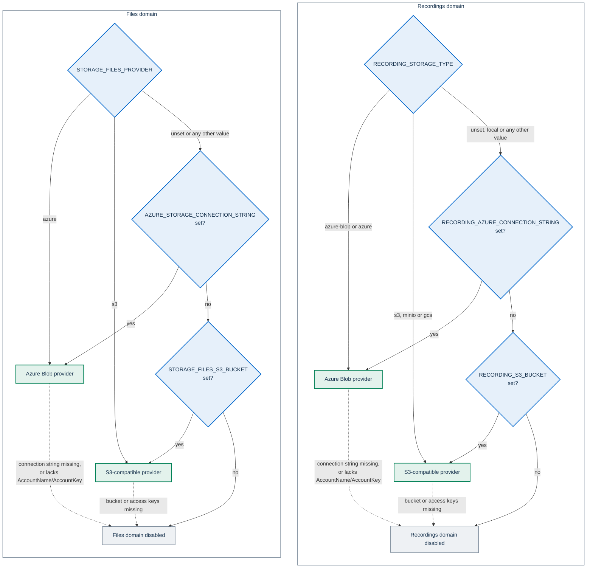
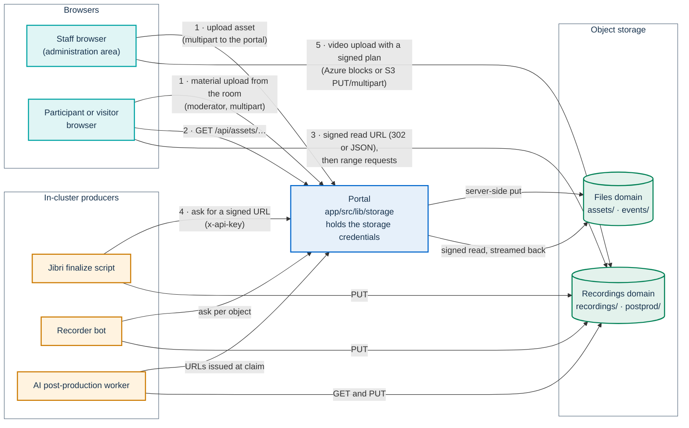

# Object storage

PA Webinar keeps every file outside the database: uploaded images and
documents, chat attachments, recordings, per-participant audio tracks and AI
post-production outputs all live in an object store. This page explains how
the portal picks a storage provider, which settings each provider needs, where
each producer writes, how browsers and in-cluster components reach the
objects, and which job deletes what.

It is written for operators who choose and configure a storage backend, and
for developers who write code that stores files.

| Looking for | Go to |
|---|---|
| Which storage service to buy or host, and how to size it | [Installing PA Webinar](../install/README.md#checklist-before-you-install) and the storage section of each platform guide |
| How long each kind of object is kept, and the legal basis | [Privacy and data protection](../GDPR.md) and [Recordings, voice data and AI outputs](../privacy/recordings-and-ai.md) |
| How recordings are produced and handed to post-production | [Recording](../architecture/recording.md) |
| The exact Content Security Policy | [Content Security Policy](../SECURITY-CSP.md) |
| When the storage-related jobs run | [Scheduled and background jobs](../architecture/background-jobs.md) |

## Two storage domains

The portal has two independent storage domains. Each one has its own
provider, credentials and bucket (or container), so an operator can keep
small, frequently read assets on one bucket and large media on another, with
different lifecycle rules and access policies.

| Domain | What it holds | Written by |
|---|---|---|
| **Files** | Images, audio and documents uploaded in the administration area (logos, favicon, event covers, watermarks, waiting-room music, material files), material files uploaded from the live room, and chat attachments | The portal only |
| **Recordings** | Composite MP4s from Jibri, videos uploaded by staff, per-participant audio tracks and their manifest, AI post-production artifacts | Jibri, the recorder bot and the AI worker (through signed URLs), and staff browsers (video upload) |

AI post-production has no domain of its own. It uses the recordings provider
under the `postprod/` prefix (`app/src/lib/storage/postprod.ts`), so the
pipeline cannot run unless the recordings domain is configured.

A domain that is not configured is disabled, and the features that depend on
it degrade:

- **Files domain disabled.** The administration area offers only the URL
  field for its file inputs, with the note "File uploads are not available on
  this installation: paste the file's URL instead.", the live room offers no file upload for materials, and
  the chat shows no attachment button. Called directly, the upload endpoints
  answer `503` with `STORAGE_UNAVAILABLE`, logged at `warn`, not `error`. `/api/assets/…` answers `404`.
  Materials given as links keep working.
- **Recordings domain disabled.** Jibri and the recorder bot cannot get upload
  URLs, video upload answers `503` with `STORAGE_UNAVAILABLE` (logged at
  `warn`), AI post-production cannot start, and the
  recordings reconcile job skips its run.

Both domains may point to the same bucket. Their key prefixes do not overlap
(files: `assets/`, `events/`; recordings: `recordings/`, `postprod/`), but each
domain still reads its own variables. On Azure both connection strings must be
set. On S3 the shared `AWS_*` fallbacks can supply one key pair for both
domains, but the bucket must still be named once per domain (see
[S3-compatible services](#s3-compatible-services)).

## Supported providers

There are two implementations behind one interface
(`app/src/lib/storage/provider.ts`):

- **Azure Blob Storage** (`azure-provider.ts`, `@azure/storage-blob`).
- **S3-compatible services** (`s3-provider.ts`, AWS SDK for JavaScript v3). The
  implementation targets AWS S3, MinIO, Cloudflare R2, Wasabi, Google Cloud
  Storage through its S3 interoperability API with HMAC keys, and any
  on-premises or sovereign-cloud service that exposes the S3 API.

There is no local-filesystem provider and no native Google Cloud Storage
client. No automated test runs the two implementations against a real
service: the list above is what the code is written for, not a verified
compatibility matrix (see **Portability across providers** in the
[roadmap](../ROADMAP.md)).

In the portal, only `app/src/lib/storage/` imports vendor SDKs. Its browser
module, `browser-upload.ts`, loads the Azure SDK on demand, only when the
server returns an `azure-block` upload plan; S3 uploads from the browser use
plain `fetch`. The external producers use no SDK at all: they send plain HTTP
`PUT` and `GET` requests to URLs the portal signs for them.
`app/src/lib/azure/blob-storage.ts` is a deprecated shim over the files domain
that some routes still import; despite its name it works with both providers.

## Which provider is used

Each domain resolves its provider in three steps: an explicit setting, then
auto-detection from the credentials that are present, then disabled
(`resolveProviderType()` in `app/src/lib/storage/provider-type.ts`). The same
function drives the [Content Security Policy](#content-security-policy), so
the policy and the signed URLs always point at the same provider.



Details that matter in practice:

- `STORAGE_FILES_PROVIDER` accepts only `azure` and `s3`. Any other value,
  `azure-blob` included, is ignored and the domain falls back to
  auto-detection.
- `RECORDING_STORAGE_TYPE` accepts `azure-blob` or `azure` for Azure, and
  `s3`, `minio` or `gcs` for the S3-compatible provider. `local` is not a
  storage value: the factory ignores it and auto-detects, so a recordings
  connection string or bucket that is present is still used.
- A provider with incomplete settings disables its domain. For the
  S3-compatible provider (bucket or either access key missing) and for a
  missing Azure connection string this happens without a log line. An Azure
  connection string without `AccountName` or `AccountKey` logs
  `[storage/<domain>] azure init: …`.
- Each domain's provider is built once per process, on first use. Changing a
  storage variable takes effect only after the portal pods restart.

### Recording availability follows the resolved provider

Two rules, both in `app/src/lib/infrastructure.ts`:

- **Recordings storage is configured** when `RECORDING_STORAGE_TYPE` names a
  provider, or failing that when a recordings connection string or bucket is
  present (`recordingStorageConfigured()`, built on `resolveProviderType()`),
  the same rule as the storage factory. The check looks at which settings are
  present, not at whether the provider starts.
- **Jibri is expected** only when `RECORDING_STORAGE_TYPE` is set (to anything
  but `local`) and the recordings storage is configured
  (`jibriRecordingExpected()`). Credentials alone do not count: the recorder
  bot and manual publications use them too, on installations without Jibri,
  and `JIBRI_HEALTH_URL` does not tell either, because the chart sets it on
  every installation with in-cluster Jitsi. An installation that runs Jibri
  sets `RECORDING_STORAGE_TYPE`.

| Reader | Effect |
|---|---|
| `/api/status` | When Jibri is not expected, reports Jibri as `standby` ("Not configured") and `metrics.jibriStatus` as `unavailable`, whatever the events ask for. Otherwise it reports whether Jibri is `ready`, starting (`scaling`), `failed` to start in time, or in `standby` because no event needs it |
| Moderator recording control in the live room | Follows `metrics.jibriStatus` from `/api/status`. With `unavailable`, the button is replaced by a disabled **Recording not configured in infrastructure**. The other states are described in [Jitsi integration](../architecture/jitsi-integration.md) |
| `/api/status/infrastructure`, and the infrastructure page (`/admin/infrastructure`, through `getInfrastructureInfo()` in `app/src/lib/infrastructure.ts`) | Show `RECORDING_STORAGE_TYPE` when it holds a value the factory accepts, otherwise the detected provider (`azure` or `s3`), otherwise the raw value or `not-configured` (`recordingStorageLabel()`). The storage counts as configured under the first rule; the Jibri node and card follow the second |

A declared recordings storage does not prove that Jibri is installed. When
`JIBRI_HEALTH_URL` is set, `/api/status` asks Jibri's health API; on
Kubernetes without it, Jibri never counts as running. Either way, while an
event with recording enabled is `LIVE` or `PROVISIONING` and no healthy Jibri
answers, the moderator sees **Recording starting…**, then **Recording
unavailable** once the wait passes the provisioning timeout
(`jvbProvisioningTimeoutMinutes` in the site settings). Outside Kubernetes
with no `JIBRI_HEALTH_URL`, Jibri is reported `ready`, and a missing Jibri
shows up only when Jitsi refuses to start the recording. The Content Security
Policy follows the resolved provider as well (see
[Content Security Policy](#content-security-policy)).

## Settings per provider

Non-secret settings go in the chart's `app.env` map, which the chart renders
into the portal's ConfigMap. Keys and connection strings go in the
application Secret (see [Deploying with Helm](../DEPLOYMENT.md) for the
Secret modes, and the [Configuration reference](../CONFIGURATION.md) for the
complete variable list). With Docker Compose, all of them go in the `app`
service environment. The Compose stack ships no object store.

### Azure Blob Storage

| Setting | Files domain | Recordings domain | Default |
|---|---|---|---|
| Connection string (Secret) | `AZURE_STORAGE_CONNECTION_STRING` | `RECORDING_AZURE_CONNECTION_STRING` | none: required |
| Container | `AZURE_STORAGE_CONTAINER_NAME` | `RECORDING_AZURE_CONTAINER` | `eventi-files` and `recordings` (`app/src/lib/storage/index.ts`) |

`AZURE_STORAGE_*` configures the files domain, not recordings. The commented
Azure block in `.env.example` names `AZURE_STORAGE_CONTAINER`, which the
portal does not read: use `AZURE_STORAGE_CONTAINER_NAME`.

```yaml
# Helm values override (non-secret settings)
app:
  env:
    RECORDING_STORAGE_TYPE: "azure-blob"
    AZURE_STORAGE_CONTAINER_NAME: "files"
    RECORDING_AZURE_CONTAINER: "recordings"
```

```text
# Keys in the application Secret
AZURE_STORAGE_CONNECTION_STRING=DefaultEndpointsProtocol=https;AccountName=<storage-account>;AccountKey=<account-key>;EndpointSuffix=core.windows.net
RECORDING_AZURE_CONNECTION_STRING=DefaultEndpointsProtocol=https;AccountName=<storage-account>;AccountKey=<account-key>;EndpointSuffix=core.windows.net
```

Requirements and limits:

- **Shared-key connection string.** The portal signs every URL as a Shared
  Access Signature with the account key it parses from the connection
  string. A connection string without `AccountName` and `AccountKey` (for
  example a SAS-only one) disables the domain. Managed identity and workload
  identity are not supported.
- **Public Azure cloud only.** Object URLs are built as
  `https://<storage-account>.blob.core.windows.net/<container>/<key>`, and
  stored URLs are recognized only on hosts ending in `.blob.core.windows.net`.
  An `EndpointSuffix` or `BlobEndpoint` in the connection string is not used
  to build URLs, so national clouds, custom domains and the Azurite emulator
  do not work.
- **Signed URLs are HTTPS only** (`SASProtocol.Https`).

### S3-compatible services

| Setting | Files domain | Recordings domain | Fallback | Default |
|---|---|---|---|---|
| Bucket | `STORAGE_FILES_S3_BUCKET` | `RECORDING_S3_BUCKET` | none | required |
| Region | `STORAGE_FILES_S3_REGION` | `RECORDING_S3_REGION` | `AWS_REGION` | `us-east-1` |
| Endpoint | `STORAGE_FILES_S3_ENDPOINT` | `RECORDING_S3_ENDPOINT` | none | the AWS regional endpoint |
| Path-style addressing | `STORAGE_FILES_S3_FORCE_PATH_STYLE` | `RECORDING_S3_FORCE_PATH_STYLE` | none | off, and forced on whenever an endpoint is set |
| Access key ID (Secret) | `STORAGE_FILES_S3_ACCESS_KEY_ID` | `RECORDING_S3_ACCESS_KEY_ID` | `AWS_ACCESS_KEY_ID` | required |
| Secret access key (Secret) | `STORAGE_FILES_S3_SECRET_ACCESS_KEY` | `RECORDING_S3_SECRET_ACCESS_KEY` | `AWS_SECRET_ACCESS_KEY` | required |

Defaults and fallbacks come from `s3ConfigFor()` in
`app/src/lib/storage/index.ts`. The `AWS_*` fallbacks are shared by both
domains. The path-style flags accept `true`, `1` or `yes`.

```yaml
# Helm values override: both domains on one S3-compatible service
app:
  env:
    STORAGE_FILES_PROVIDER: "s3"
    STORAGE_FILES_S3_ENDPOINT: "https://s3.example.com"
    STORAGE_FILES_S3_REGION: "<region>"
    STORAGE_FILES_S3_BUCKET: "pa-webinar-files"
    RECORDING_STORAGE_TYPE: "s3"
    RECORDING_S3_ENDPOINT: "https://s3.example.com"
    RECORDING_S3_REGION: "<region>"
    RECORDING_S3_BUCKET: "pa-webinar-recordings"
```

```text
# Keys in the application Secret
STORAGE_FILES_S3_ACCESS_KEY_ID=<access-key-id>
STORAGE_FILES_S3_SECRET_ACCESS_KEY=<secret-access-key>
RECORDING_S3_ACCESS_KEY_ID=<access-key-id>
RECORDING_S3_SECRET_ACCESS_KEY=<secret-access-key>
```

Per service:

| Service | Endpoint | Region | `RECORDING_STORAGE_TYPE` |
|---|---|---|---|
| AWS S3 | leave unset | the bucket's region | `s3` |
| MinIO, on-premises or sovereign-cloud S3 | the service URL | as the service requires (MinIO accepts any value) | `s3` |
| Google Cloud Storage | `https://storage.googleapis.com`, with HMAC keys from the bucket's interoperability settings | `auto` | `gcs` |
| Cloudflare R2 | `https://<account-id>.r2.cloudflarestorage.com` | `auto` | `s3` |
| Wasabi and other S3 services | the service URL | the service's region | `s3` |

Requirements and limits:

- **Static keys are required.** The client is always built with an access key
  pair. Without one the domain is disabled: IAM roles for service accounts
  (IRSA), EKS Pod Identity, GKE Workload Identity and instance profiles are
  not used.
- **Path-style with an endpoint.** When an endpoint is set, requests and
  object URLs always use path-style addressing
  (`<endpoint>/<bucket>/<key>`), whatever the path-style flag says. Without an
  endpoint, object URLs are virtual-hosted
  (`https://<bucket>.s3.<region>.amazonaws.com/<key>`).
- **One endpoint for everyone.** The same signed URL goes to browsers (to play
  a recording, and to upload a video from the administration area) and to
  Jibri, the recorder bot and the AI worker (to upload and download). The
  endpoint must therefore be a public HTTPS origin with a valid certificate,
  reachable both from participants' and staff networks and from inside the
  cluster. A cluster-internal address such as
  `http://minio.<namespace>.svc:9000` works for the in-cluster producers but
  breaks playback and browser uploads: browsers cannot resolve it, and an
  `http://` endpoint is blocked as mixed content on the `https` portal.
- **Checksums only where the API requires them.** The S3 client computes
  request checksums and validates response checksums only when the operation
  requires it (`requestChecksumCalculation` and `responseChecksumValidation`
  set to `WHEN_REQUIRED` in `app/src/lib/storage/s3-provider.ts`). Signed
  `PUT`s from browsers, Jibri, the recorder bot and the AI worker therefore
  work on AWS S3, MinIO, Google Cloud Storage and other S3-compatible
  services. The setting in code overrides `AWS_REQUEST_CHECKSUM_CALCULATION`
  and `AWS_RESPONSE_CHECKSUM_VALIDATION`.
- **Send the `Content-Type`.** On the URLs issued to Jibri, the recorder bot
  and the AI worker, the content type is not part of the signature, but the
  header becomes the object's stored type, so send the one requested when
  signing (`UploadUrlOptions` in `app/src/lib/storage/provider.ts`). Only the
  browser's single-request video upload on S3 signs it (see
  [Browser upload of videos](#5-browser-upload-of-videos)).

### Creating buckets and containers

Create the buckets or containers before first use and keep them private. The
portal never relies on public read access: every read goes through a signed
URL or through the portal. The provider interface has an `ensure()` method
that creates a missing container or bucket, but only the moderator file route
(see [Key layout](#key-layout)) calls it. The portal sets no lifecycle rules
and no server-side encryption options: encryption at rest is whatever the
bucket provides.

Two settings on the recordings bucket or storage account are needed for
[browser upload of videos](#5-browser-upload-of-videos):

- **CORS for browser uploads.** Allow `PUT` from the portal origin (for
  example `https://webinar.example.com`). On S3, allow the `Content-Type`
  header; exposing `ETag` is not needed, because the portal reads the parts
  back itself. On Azure, allow the headers the SDK sends (`x-ms-*` and
  `Content-Type`) on the Blob service. Without this rule the upload fails in
  the browser even when the Content Security Policy and the credentials are
  correct. Playback needs no CORS, because the portal's players do not set
  `crossorigin`.
- **Incomplete uploads.** On S3, add a lifecycle rule that aborts incomplete
  multipart uploads: when the browser cannot abort a failed upload, its parts
  stay in the bucket until that rule removes them. A window of one to seven
  days is enough; the rule does not touch completed objects. Azure discards
  uncommitted blocks on its own after seven days.

The access key of the recordings bucket needs these S3 permissions (IAM
action names; MinIO policies use the same names):

| Permission | Used for |
|---|---|
| `s3:PutObject` | Writing objects, including the operations of a multipart upload (create, upload part, complete) |
| `s3:GetObject` | Signed read URLs for playback, and the check of an object's size when a completion is repeated |
| `s3:ListMultipartUploadParts` | Reading the parts back before completing a browser upload. Without it, every video upload above 16 MiB fails at completion with `502` |
| `s3:AbortMultipartUpload` | Releasing the parts of a failed upload. Without it, those parts stay in the bucket until the lifecycle rule removes them |
| `s3:DeleteObject` | Retention cleanup, orphan cleanup and deletions made in the administration area |
| `s3:ListBucket` | Listing objects, for example during recording reconciliation |

## Key layout

Every key is built by a function in code, and those builders are the source
of truth. The table names them; the tree below shows the resulting namespace.

| Producer | Domain | Key | Built by |
|---|---|---|---|
| Uploads in the administration area (logos, favicon, covers, watermarks, waiting-room music, material files), and material files uploaded from the room | Files | `assets/<type>/<yyyy>/<mm>/<uuid>-<file-name>`, with `<type>` one of `image`, `audio`, `document`; room uploads are always `document` | `buildAssetKey()` in `app/src/lib/utils/asset-key.ts` |
| Chat attachments | Files | `assets/chat/<eventId>/<yyyy>/<mm>/<uuid>-<file-name>` | `buildChatAssetKey()`, same file |
| Moderator file route `POST /api/events/<id>/files` | Files | `events/<eventId>/files/<file-name>` | `getBlobPath()` in `app/src/lib/azure/blob-storage.ts` |
| Jibri composite recording | Recordings | `recordings/<room>_<timestamp>.mp4` | the finalize script names the file; `generateRecordingUploadUrl()` in `app/src/lib/storage/recordings.ts` adds the prefix |
| Video uploaded by staff | Recordings | `recordings/publications/<yyyy>/<uuid>.<ext>` (`mp4`, `webm`, `mov` or `m4v`; `mp4` when the extension is none of these) | `planPublicationObject()` in `app/src/lib/storage/publication-upload.ts`, then prefixed by `createRecordingBrowserUpload()` in `app/src/lib/storage/recordings.ts`. The multipart close and abort route accepts only keys of this shape (`PUBLICATION_OBJECT_NAME_RE`) |
| Recorder bot | Recordings | `recordings/multitrack/<eventId>/<recordingId>/audio/<trackFileId>.opus` and `…/tracks.json` | `trackKey()` and `manifestKey()` in `infra/recorder/src/paths.ts`; the portal confines them with `app/src/lib/recorder/blob-key.ts` |
| AI worker | Recordings | `postprod/<eventId>/<recordingId>/<runId>/<artifact>` | `artifactPath()` in `app/src/lib/ai/paths.ts` |

```text
files domain
├── assets/
│   ├── image/<yyyy>/<mm>/<uuid>-<file-name>
│   ├── audio/<yyyy>/<mm>/<uuid>-<file-name>
│   ├── document/<yyyy>/<mm>/<uuid>-<file-name>
│   └── chat/<eventId>/<yyyy>/<mm>/<uuid>-<file-name>
└── events/<eventId>/files/<file-name>

recordings domain
├── recordings/
│   ├── <room>_<timestamp>.mp4
│   ├── publications/<yyyy>/<uuid>.<ext>
│   └── multitrack/<eventId>/<recordingId>/
│       ├── audio/<trackFileId>.opus
│       └── tracks.json
└── postprod/<eventId>/<recordingId>/<runId>/
    ├── transcript.raw.json, waveform.json
    ├── transcript.<lang>.vtt, transcript.<lang>.txt, subtitle.<lang>.vtt
    ├── summary.<lang>.md, summary.<lang>.json
    ├── dubbed.<lang>.m4a, dubbed.<lang>.mp4
    └── archive.mkv
```

Notes on the layout:

- **Runs.** `<runId>` is the recording's run counter padded to three digits
  (`001`, `002`, …). A new run of the pipeline writes beside the older ones
  instead of overwriting them. Translations reuse the transcript and summary
  file names with the target language.
- **Track sessions.** `<trackFileId>` identifies one track session, not one
  participant: a participant who rejoins produces a second file. The objects
  are WebM containers with Opus audio, stored with the `.opus` extension and
  the content type `audio/webm; codecs=opus`.
- **Sanitization.** Uploaded file names keep only letters, digits, `.`, `-`
  and `_`, up to 60 characters. Recorder key segments keep only letters,
  digits, `-` and `_`. The Jibri upload route rejects file names containing
  `/` or `..`, and `app/src/lib/storage/recordings.ts` rejects `.` and `..`
  segments, leading slashes, NUL bytes and line breaks. Videos uploaded by
  staff do not keep the original file name: their key is a UUID.
- **What the keys reveal.** Keys contain event and recording IDs, the
  sanitized original file name of asset uploads and chat attachments, and the
  Jitsi room name of Jibri recordings. `tracks.json` holds participants' display names in plain text.
  Anyone allowed to list the bucket sees all of this.
- **The moderator file route.** `POST /api/events/<id>/files` returns a signed
  upload URL for the files domain, and `DELETE` on the same route removes the
  object. No page in the application calls it: materials are uploaded through
  the asset route in the administration area and through
  `POST /api/events/<slug>/materials/upload` in the room.

## Access patterns

Only the portal holds storage credentials. Everything else either goes
through the portal or receives a URL the portal has signed for one object.



Signed URLs are valid for 30 minutes (upload) or 60 minutes (download) unless
the caller asks otherwise (`app/src/lib/storage/provider.ts`). The callers
below set their own validity in the route named.

### 1. Server-side upload

Small files travel through the portal, which checks them and writes them with
`put()`:

- **Uploads in the administration area**
  (`POST /api/admin/assets/upload-url?type=image|audio|document`, staff
  session). The route checks the declared type against an allow-list and
  against the file's magic bytes, and caps the size per type. It returns an
  absolute portal URL, `<NEXT_PUBLIC_APP_URL>/api/assets/<key without assets/>`,
  which the form saves in place of a storage URL, so no signature is ever
  persisted.
- **Material files uploaded from the room**
  (`POST /api/events/<slug>/materials/upload`, multipart, primary moderator
  link or a named `MODERATOR` grant). The route applies the rules of the
  `document` type above, shared through `MATERIAL_FILE_*` in
  `app/src/lib/validation/materials.ts`: the same allow-list, the magic-byte
  check and a 25 MiB cap. It also refuses a new file once the event holds 50
  material files or 500 MiB of them. It writes the file under
  `assets/document/…` and creates the material in the same request, so the
  client never names a key. The room offers the upload only when the files
  domain is configured (`uploadsEnabled` in `GET /api/events/<slug>/materials`).
- **Chat attachments** (`POST /api/events/<slug>/chat/attachment`), see
  [Live interaction](../architecture/live-interaction.md).

### 2. Reads through the portal

`GET /api/assets/<path>` serves only keys under `assets/`. It signs a
10-minute read URL on the server, fetches the object and streams the bytes
back, so the storage URL and its signature never reach the browser, and the
response works as an `og:image`. It sends `X-Content-Type-Options: nosniff`
and forces a download for active document types (SVG, HTML, XML and unknown
binary). Assets are cached as `public, max-age=31536000, immutable`, because
every key contains a random UUID. Chat attachments are cached as
`private, max-age=60`.

The route checks no authorization: an asset URL, chat attachments included,
opens for whoever holds it. For chat attachments that is a known limitation
(see **Access control on chat attachments** in the
[roadmap](../ROADMAP.md)).

### 3. Signed read URLs handed to the browser

Large media is never proxied. The portal checks access and signs a read URL,
either answering `302` to it or returning it in a JSON response, and the
browser then streams from storage with range requests:

| Route | Serves | How | Validity |
|---|---|---|---|
| `GET /api/events/<slug>/recording` | The published recording of an `ENDED` or `ARCHIVED` event | `302` | 120 minutes |
| `GET /api/events/<slug>/postprod/subtitle/<lang>` | Subtitles, when the database holds no copy of the text (otherwise the route answers with the text itself) | `302` | 60 minutes |
| `GET /api/events/<slug>/postprod/dubbed-audio/<lang>` | Dubbed audio | `302` | 60 minutes |
| `GET /api/admin/postprod/recordings/<id>/media` | Playback in the transcript editor | `302` | 120 minutes |
| `GET /api/admin/recordings` | Videos listed in **Video recordings** (`/admin/recordings`) | URLs in the response | 60 minutes |
| `GET /api/admin/postprod/recordings/<id>/tracks` | Retained per-participant tracks and the multitrack archive (`archive.mkv`) | URLs in the response | 120 minutes |
| `GET /api/admin/postprod/recordings/<id>/details` | Dubbed audio in the post-production detail view | URLs in the response | 120 minutes |

When a stored recording URL does not belong to the configured account or
bucket (for example a video hosted elsewhere), the portal cannot sign it, and
`GET /api/events/<slug>/recording` redirects to the stored URL unchanged.

### 4. Signed URLs for in-cluster producers

Jibri, the recorder bot and the AI worker hold no storage credentials. They
authenticate to the portal with `CRON_API_KEY` in the `x-api-key` header and
receive a URL for one object:

| Producer | Route | What it receives |
|---|---|---|
| Jibri finalize script | `POST /api/internal/recording-upload-url` | A 30-minute write URL for `recordings/<filename>`, plus the object's URL |
| Recorder bot | `POST /api/internal/recorder-upload-url`, once per object | A 30-minute write URL, only for keys under its own recording's `recordings/multitrack/<eventId>/<recordingId>/`, and never for an `ARCHIVED` recording |
| AI worker | `POST /api/internal/postprod-claim` | Read URLs for the source recording or tracks, and write URLs for every expected artifact, all valid for the claim's lease (30 minutes unless the worker asks for up to 120) |

Every upload is a single `PUT`, so each object is limited by the provider's
maximum size for a single-request upload. On Azure, a `PUT` must carry
`x-ms-blob-type: BlockBlob`; all three producers send it. The full contracts
are in [Recording](../architecture/recording.md) and
[AI post-production](../POSTPROD.md).

The chart runs `infra/helm/pa-webinar/files/jibri-finalize.sh`, which follows
this pattern. `infra/jitsi/jibri-finalize.sh` is a standalone variant that
uploads with storage command-line tools and its own variables (such as
`RECORDING_GCS_BUCKET` and `RECORDING_MINIO_*`), which the portal does not
read (see [Jitsi extras](../../infra/jitsi/README.md)).

The portal also signs URLs for itself: it reads artifacts through short-lived
read URLs, and when a transcript is edited it rewrites the artifact through a
5-minute write URL. `rewritePostprodBlob()` refuses any key outside
`postprod/`.

### 5. Browser upload of videos

Administrators and organizers upload an existing video from
**New publication** or from **Upload an existing recording** on the event
page. The video goes straight from the browser to the recordings domain, on
Azure and on S3-compatible storage alike; the portal only signs and checks.
The client side is `uploadRecordingFile()` in
`app/src/lib/storage/browser-upload.ts`.

1. The browser calls `POST /api/admin/publications/upload-url` (staff
   session) with the file name, type and size. Files up to 5 GiB are
   accepted (`MAX_PUBLICATION_UPLOAD_BYTES` in
   `app/src/lib/storage/publication-upload.ts`). The key is built on the
   server (see [Key layout](#key-layout)).
2. The portal answers with the object's canonical URL and an upload plan
   whose signed URLs are valid for 60 minutes. The recordings provider
   chooses the protocol:

   | Protocol | Provider and size | How the browser uploads |
   |---|---|---|
   | `azure-block` | Azure, any size | The Azure SDK, loaded on demand, uploads 8 MiB blocks, four at a time, and commits them |
   | `s3-put` | S3, files up to one part | One signed `PUT`. Its `Content-Type` is part of the signature, so the object cannot arrive with a different type |
   | `s3-multipart` | S3, larger files | Signed part `PUT`s of at least 16 MiB and at most 1,000 parts (`multipartPartSize()` in `s3-provider.ts`), four at a time. Each part gets up to three attempts on network errors, `5xx` or `429` |

3. For `s3-multipart`, the browser then calls
   `POST /api/admin/publications/upload-url/multipart`. The server reads the
   parts back from storage with `ListParts` and checks them against the
   declared size. If they do not match it answers `409`
   (`UPLOAD_INCOMPLETE`) and leaves the upload open; otherwise it completes
   the upload. Completion can be repeated: when the upload is already
   complete and the object has the declared size, the server answers `200`
   again. The browser makes up to four attempts, 2, 4 and 8 seconds apart,
   when the outcome is uncertain (a network error, `5xx` or `429`), for
   example when the ingress times out while the storage assembles a large
   object. A `4xx` answer, such as `409` or an expired session, is final.
   After a final failure the browser calls `DELETE` on the same route to
   abort the upload: on an open upload this releases the parts, and on a
   completed one it leaves the object untouched. A failed abort is logged in
   the browser console with its HTTP status or network error.
4. The browser saves the canonical URL: `POST /api/admin/publications` for a
   new publication, `PATCH /api/admin/publications/<id>` for an existing
   event, which checks that an organizer owns it.

The bucket or storage account must allow the upload through CORS (see
[Creating buckets and containers](#creating-buckets-and-containers)). The
Content Security Policy needs no manual entry: the middleware adds the
recordings host to `connect-src` (see
[Content Security Policy](#content-security-policy)).

## Content Security Policy

Browsers load recordings, subtitles and dubbed audio straight from storage
(pattern 3) and upload videos to it (pattern 5), so the storage hosts must
appear in `media-src` and `connect-src`. The middleware (`app/src/middleware.ts`)
computes them on each request with `storageCspHosts()` in
`app/src/lib/storage/provider-type.ts`, which uses the same provider
resolution as the storage factory, auto-detection and every alias included.
The policy therefore follows the provider each domain resolves to:

| Resolved provider | Host added |
|---|---|
| Azure Blob | `https://<storage-account>.blob.core.windows.net`, from `AccountName` in the domain's connection string |
| S3-compatible with an endpoint | the endpoint's origin |
| S3-compatible without an endpoint | `https://*.amazonaws.com` |
| Recordings domain with `RECORDING_STORAGE_TYPE=gcs` | `https://storage.googleapis.com`, on top of the above |
| Domain disabled | nothing |

The hosts are placed as follows:

- **`media-src`** gets the recordings-domain hosts plus
  `RECORDING_MEDIA_CSP_HOSTS`, a space-separated list of origins.
- **`connect-src`** gets the same list plus the files-domain host, which a
  browser needs to `PUT` to a files-domain URL signed by the moderator file
  route (see [Key layout](#key-layout)). Browsers otherwise reach the files
  domain only through `/api/assets`, on the portal's own origin.

Set `RECORDING_MEDIA_CSP_HOSTS` whenever recordings are played from an origin
the resolved provider does not name: a CDN or custom domain in front of the
bucket, or a stored recording URL that points outside the configured account
or bucket, which the portal redirects to unchanged (see
[Signed read URLs handed to the browser](#3-signed-read-urls-handed-to-the-browser)).
A missing host shows up as a blocked video or upload with a CSP violation in
the browser console. The exact policy, and how to test a change, are in
[Content Security Policy](../SECURITY-CSP.md).

## Deletion: who removes what

Objects are deleted by user actions and by scheduled jobs. How long each kind
of data is kept is set out in [Privacy and data protection](../GDPR.md) and
[Recordings, voice data and AI outputs](../privacy/recordings-and-ai.md);
schedules are in [Scheduled and background jobs](../architecture/background-jobs.md).

| Trigger | Domain | Deletes |
|---|---|---|
| The holder of the event's moderator link deletes the event recording (`DELETE /api/events/<slug>/recording`); named grants are refused | Recordings | The objects behind `Event.recordingUrl` and `Event.tempRecordingUrl` |
| The holder of the event's moderator link deletes a call session (`DELETE /api/events/<slug>/sessions/<id>`); named grants are refused | Recordings | The session's recording |
| A moderator hides a chat message | Files | Its attachment, best effort |
| A moderator removes an uploaded material in the room (`DELETE /api/events/<slug>/materials/<id>` or `DELETE /api/events/<slug>/files`), or staff remove it, replace its file or turn it into a link in the administration area | Files | The material's file, before the row, unless another material still holds the same key in `blobPath` or an event uses the file as its privacy notice (`removeMaterialBlob()` in `app/src/lib/events/material-files.ts`, which touches only material keys). A link to the same URL does not keep the file. When storage does not confirm the deletion, the material stays and the request answers `503` `STORAGE_DELETE_FAILED` |
| An event is deleted outright (`DELETE /api/events/<id>`, or the bulk delete in the administration area) | Files | The event's uploaded material files and chat attachments, before the rows (`removeFilesOfEventsBeingDeleted()`). When storage does not confirm a deletion, the events stay and the request answers `503` |
| `cleanup` job (`cronjobs.cleanup`) | Both | Temporary (unpublished) recordings past their lifetime (`TEMP_RECORDING_TTL_MS` in `app/src/lib/gdpr/cleanup-selection.ts`); published recordings past `recordingDeleteAfterDays`; and, when an `ENDED` or `ARCHIVED` event's data retention expires, its uploaded material files (with the rules of a single removal; a material whose file storage does not confirm deleting stays for the next run), chat attachments, temporary recording and unpublished recording. A published recording is exempt from the event-retention pass |
| `recordings-reconcile` job (`cronjobs.recordingsReconcile`) | Recordings | Orphans under `recordings/` (see below): those marked **Delete now**, and the rest after `SiteSetting.orphanRecordingGraceDays` unless an administrator marks them **Keep** |
| `multitrack-purge` job (enabled with `postprod.enabled`) | Recordings | Per-participant audio once its multitrack transcription is done and no job still reads it. Tracks of an event with **Keep per-participant tracks** on are left to `postprod-retention` |
| `postprod-retention` job (`postprod.enabled` and `postprod.retention.enabled`) | Recordings | When the event's data retention, or an override retention date (a recording's own, or `SiteSetting.aiArtifactRetentionDays`), expires: the artifacts under `postprod/` of recordings whose video is not published, and the per-participant audio of every recording. The artifacts of a published video are kept. `deletePostprodBlob()` refuses any key outside `postprod/` |

The reconcile job lists every object under `recordings/` and records as an
orphan each one whose name is not referenced by `Event.recordingUrl`,
`CallSession.recordingUrl` or `CallSession.recordingFilename`. Orphans appear
in the **Orphans** tab of **Video recordings** (`/admin/recordings`), where
administrators choose **Keep**, **Delete now** or **Revert decision**.
**Delete now** removes the object on the job's next run. Setting
`orphanRecordingGraceDays` to `0` turns off automatic deletion: only objects
marked **Delete now** are removed.

Known gaps:

- **No orphan sweep for the files domain.** The objects of replaced logos,
  covers or music, and uploads never saved into a form stay in the bucket
  until someone removes them by hand.
- **Uploaded videos can be flagged as orphans.** The reconcile job compares
  the listed name, which has the `recordings/` prefix removed, with the path
  it extracts from `Event.recordingUrl`, which keeps it when the URL is
  path-style or on Azure. On Azure and on any S3 service with an endpoint,
  a video uploaded by staff therefore appears in the **Orphans** tab and is
  deleted after the grace period unless it is marked **Keep**. On AWS S3
  without an endpoint the names match. Jibri recordings are not affected,
  because `CallSession.recordingFilename` matches.
- **Per-participant objects are flagged as orphans.** Objects under
  `recordings/multitrack/` are referenced by none of the fields above, so
  retained tracks and every `tracks.json` go through the orphan sweep (see
  [Recording](../architecture/recording.md#known-limitations)).
- **Tracks without post-production.** An installation that records
  per-participant audio but does not run AI post-production never reaches the
  purge step (see **Participant tracks without the post-production pipeline**
  in the [roadmap](../ROADMAP.md)).
- **No backup.** Nothing backs up or restores the object store (see
  **Backup and restore** in the [roadmap](../ROADMAP.md)).

## Changing provider or bucket

The database refers to objects in three ways, and only some survive a move:

| Reference | Fields | After copying objects with the same keys to a new bucket |
|---|---|---|
| Storage key | `Recording.blobKey`, `RecordingTrack.blobKey`, `PostprodArtifact.blobKey`, `EventMaterial.blobPath`, `ChatMessage.attachmentBlobPath` | Keep working |
| Portal URL | `/api/assets/…` URLs stored for logos, covers, materials and attachments | Keep working; they depend on the portal's host, not on storage |
| Storage URL | `Event.recordingUrl`, `Event.tempRecordingUrl`, `CallSession.recordingUrl` | Must be rewritten: they embed the account, bucket or endpoint |

A storage URL that the new provider does not recognize is played by
redirecting to it unchanged, which fails on a private bucket, and deleting it
only logs `Cannot parse key from URL`. PA Webinar ships no migration tool: to
move, copy the objects keeping their keys, rewrite the storage-URL columns,
change the settings and restart the portal.

## Troubleshooting

| Symptom | Cause | Fix |
|---|---|---|
| The file fields in the administration area show only a URL box, with the note "File uploads are not available on this installation: paste the file's URL instead."; a direct call to the upload route answers `503` "Files storage is not configured on this instance" | The files domain resolved to disabled | Check `STORAGE_FILES_PROVIDER` (`azure` or `s3`, not `azure-blob`), the bucket and both keys, then restart the portal |
| The moderator's recording button reads **Recording not configured in infrastructure** | Jibri is not expected: `RECORDING_STORAGE_TYPE` is unset or `local`, or no recordings provider resolved | Set `RECORDING_STORAGE_TYPE` and the recordings credentials, then restart the portal |
| Recordings do not play and the console shows a `media-src` violation | The recordings are served from an origin the policy cannot derive from the provider: a CDN, a custom domain, or a stored URL outside the configured account or bucket | Add the origin to `RECORDING_MEDIA_CSP_HOSTS` |
| Video upload from the administration area fails with a CORS error in the browser console | The bucket's or storage account's CORS rules do not allow `PUT` from the portal origin | Add the CORS rule in [Creating buckets and containers](#creating-buckets-and-containers) |
| Video upload stops with `409` `UPLOAD_INCOMPLETE` | Some parts of a multipart upload did not reach storage | Upload the file again; the failed upload is aborted and its parts released |
| On S3-compatible storage, every video upload above 16 MiB fails at the end: `POST /api/admin/publications/upload-url/multipart` answers `502` `STORAGE_ERROR` | The access key lacks `s3:ListMultipartUploadParts`, which the server needs to check the parts before completing | Grant the permissions listed in [Creating buckets and containers](#creating-buckets-and-containers) |
| Video upload from the administration area fails at once, with a network or mixed-content error in the browser console | `RECORDING_S3_ENDPOINT` is a cluster-internal or `http://` address that browsers cannot use | Point it at a public HTTPS origin that both browsers and pods can reach |
| Files land in container `eventi-files` although a container was set | `AZURE_STORAGE_CONTAINER`, as written in `.env.example`, is not read | Use `AZURE_STORAGE_CONTAINER_NAME`; recordings use `RECORDING_AZURE_*` |
| A custom uploader gets `400` from Azure on a signed `PUT` | The `x-ms-blob-type: BlockBlob` header is missing | Add the header |
| Recordings play for users but in-cluster uploads fail, or the reverse | The endpoint is reachable from only one side | Use one endpoint that resolves both inside the cluster and on the internet |

More symptoms for running installations are collected in
[Troubleshooting](../operations/troubleshooting.md).

## Related pages

- [Configuration reference](../CONFIGURATION.md): every environment variable
  and the secrets map.
- [Deploying with Helm](../DEPLOYMENT.md): `app.env`, Secret modes and first-run
  checks.
- [Setting up recording](../operations/recording-setup.md): the values that turn
  on each capture path.
- [Recording](../architecture/recording.md): how recordings reach the
  recordings domain.
- [AI post-production](../POSTPROD.md): the pipeline that reads and writes
  under `postprod/`.
- [Security architecture](../architecture/security.md): the secrets map and
  trust boundaries.
